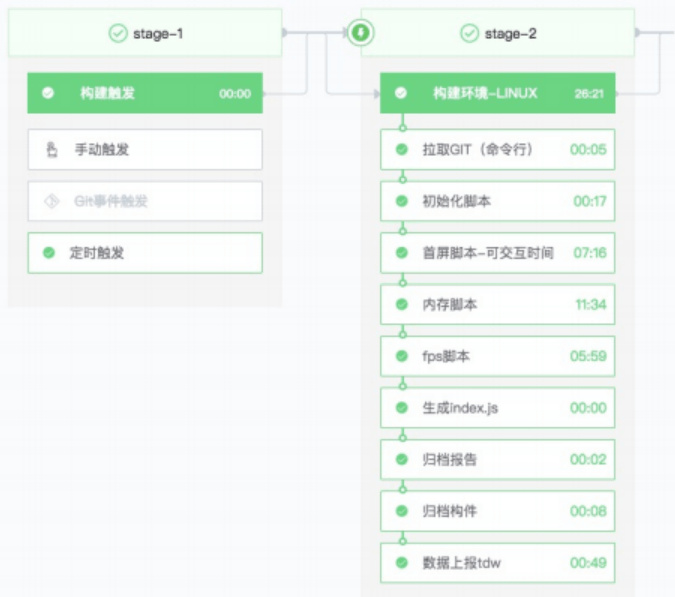

以下是本次参加 Tweb conf 2021 的学习笔记

# 目录

## 主会场

- [Flutter 音视频开发实践](#flutter-音视频开发实践)
- [腾讯文档渲染优化之路](#腾讯文档渲染优化之路)
- [远程办公下开发测试协同如何提效](#远程办公下开发测试协同如何提效)
- 如何创造一门上万人使用的语言

## 分会场（看过）

### Node.js & 大前端

- Kubernetes 应用的 BFF 便捷开发
- 跨端开发，也可以这样玩

### 低代码 & 可视化

- 基于 serverless 的低代码平台实践

### 编辑器 & 研发效能

- 稿定视频编辑器背后的故事
- 在线文档冲突——OT 算法

以上是本次大会看过的，下面是本次大会未看过的，仅做记录

## 分会场（未看）

### Node.js & 大前端

- 从 0 开始，打造腾讯自研的跨端&动态化框架
- Puerts-UnityUE 下的 Typescript 框架
- 云时代的前端开发

### 低代码 & 可视化

- WebAssembly 在哔哩哔哩创作中心的实践
- 厘米秀 3D 形象 DIY 渲染技术揭秘
- 信息流运营场景中的低代码探索与实践
- 低代码页面编辑器的设计和实现

### 编辑器 & 研发效能

- 腾讯文档工程实践
- 微信小程序真机调试
- CDN 版本化解决方案
- 由兴趣驱动开源 Cherry Markdown 成长之路

# Flutter 音视频开发实践

## Flutter 简介

### 跨平台技术发展趋势

跨平台框架优势：一次开发，多端运行，组件复用，提升效率

- Hybrid App（2011 年）
   - 页面运行在 webviwe
   - 开发迭代快
   - 受限于桥接层，拓展性能差
   - webview 渲染性能差
- ReactNative（2015 年）
   - 原生控件渲染
   - 性能好于 webview
   - 渲染时要和 Native 通信
   - JIT 编译
- Flutter（2018 年）
   - dart 语言
   - 同时支持 JIT 和 AOT 编译
   - 自渲染引擎
   - 性能接近原生

### Flutter 架构


- FrameWork: 是一个 Dart 实现的 UI SDK，从上到下包括了两大组件库、基础组件库、图形绘制、手势识别、动画等功能
- Engine: 实现 Flutter 渲染引擎、Dart 虚拟机、Platform 通信通道、事件通知、插件架构等功能
- Embedder: 操作系统适配层

### Flutter & Web 开发的差异


- StatelessWidget(无状态)：内部没有保存状态，UI 界面创建后不会发生改变。
- StatefulWidget(有状态)：内部有保存状态，当状态发生改变，调用 `setState()` 方法会触发 UI 发生更新。

```css{6-8}
.grey {
   background: #e0e0e0;
   width: 320px;
   height: 240px;
   font: 900 24px Roboto;
   display: flex;
   align-items: center;
   justify-content: center;
}
```

```js{2}
var container = Container(
   child: Center(
      child: Text(
         "Lorem ipsum",
         style: bold24Roboto
      ),
   ),
   width: 320,
   height: 240,
   color: Colors.grey[300]
);
```

## TRTC 简介

腾讯实时音视频致力于帮助开发者快速搭建低成本、低延时、高品质的音视频互动解决方案：

- 适用于视频会议、在线教育、互动直播等场景
- 客户有腾讯会议、企业微信、陌陌、贝壳找房等


## SDK 设计


- 业务层：提供给开发者调用的 API，如进退房、推拉音视频流等近 100 个接口
- 实现层：管理 API 的核心类，可扩展、易用、性能好
- 通信层：通过 MethodChannel 消息通道连接 Flutter 和原生 sdk，数据通讯能力升级
- 原生层：底层是 Android 和 iOS 原生 sdk

### 挑战点 1-如何实现复杂的类结构体传输？

#### 背景

- flutter 本质是 dart 调用 native 的接口，并异步返回 native 的数据
- 原生 sdk 存在着大量类结构体的类型定义，原有消息通道不支持传递此类型

#### 方案

Flutter 类结构体 -> Flutter 类结构体转 Map 对象 -> Flutter JSON 序列化 -> 通信层 JSON 反序列化 -> Android 类结构体

同时可以对参数进行约束，类型校验，提升易用性


### 挑战点 2-图片怎么高效在 Flutter 和原生 sdk 之间传输？

#### 背景

直播过程中给视频设置水印等接口需要把 flutter 项目定义的图片资源传给原生 sdk，但是 flutter 没有 bitmap 这种数据类型，如何把 flutter 项目的图片资源转成原生 sdk 需要的 bitmap？

#### 方案

利用文档目录实现图片传输，通过文档目录（android 和 flutter 都可访问）传递文件路径的方式来实现共享


带来的问题：拷贝文件会导致比较高的耗时，如何解决？

#### 优化

图片传输优化-平台共享 asset：Flutter 的 asset 资源被打包在原生资源包下面，通过 AssetManager 可直接访问，节省中间层拷贝耗时。


### 挑战点 3-视频在 Flutter 里面如何渲染？

#### 背景

采集视频流 -> 云服务 -> Android 原生 -> Flutter

将摄像头采集的每一帧数据通过 MethodChanne 传递到 Flutter 中，性能消耗大

#### 方案

- 外接纹理：可以将原生端 opengl 图像数据共享给 Flutter 进行渲染。需要原生 sdk 提供视频帧图像数据回调接口，实现较为复杂。
- PlatformView：主要适用于 Flutter 中不太容易实现的组件，如 WebView、视频播放器、地图等。给 Flutter 提供了嵌入 Android 和 iOS 平台原生 view 的能力。

最后采用 PlatformView 方案


#### 优化

用 oppo 的一个低端机进行测试，房间有 6 个用户的时候，第二屏画面渲染异常，使用 PerfDog 性能狗，分析出 GPU 占用过高


##### 列表懒加载与回收


列表优化后 GPU 占用从 72% 下降到了 53%，视频画面正常渲染显示，优化完成后的性能检测如下


由上图可看出，cpu、内存跟 Android 原生的占用差不多，GPU 比 Android 原生性能还差约 15%

##### 视频帧直出


性能消耗点：视频 view 的每一个像素流经附加的中间图形缓冲区，显著浪费显存和绘图性能

优化方案：将视频帧数据直接输出到 SurfaceTexture 上

##### 图像纹理共享


Flutter 与 Android 原生共享图像纹理数据，优化后性能检测如下


Flutter 优化后 GPU 性能提升了约 10%，基本能达到 Android 原生 sdk 的水平

### 挑战点 4-客户接入如何提效？

#### 背景

面临的问题：原始 SDK API 繁多，客户接入耗时很久

场景化方案的价值：客户可以寻找契合自己业务的场景方案，参考源码实现，提升接入效率


#### 方案


核心目标：易接入，开箱即用，降低客户的接入门槛


SDK：接口不超过 30 个，而且语义更加场景化

## 未来

flutter 桌面端的支持不太好，未来需要支持全平台


# 腾讯文档渲染优化之路

## DOM

### 方案

#### Sheet

使用 [Handsontable](https://github.com/handsontable/handsontable) 的 dom 渲染，主要页面构成为：

- 单元格：数量多、结构类似
- 图表、选区：数量少，结构独立


#### doc

使用 React 作为 dom 渲染

### 优化

#### 渲染管道

- layout 优化

   - 尽量避免改变元素的几何属性（例如宽度、高度、左侧或顶部位置等）
   - 修改 paint only 属性（例如背景颜色、文字颜色等）-> repaint

- Paint 优化
   - 使用 will-change 或 translateZ 等提升元素层级
   - 使用 transform 和 opacity 属性

#### 滚动复用

类似于长列表的虚拟滚动：复用 DOM、离屏时销毁 DOM

### 缺点

随着页面复杂程度、页面滚动速度的增加，重排重绘开销随之线性增长

## Canvas


### 极端场景的全表双边框

#### 背景


渲染时间：单边框 6.71ms -> 双边框 14.91 ms

- 绘制量：对比单边框，直接翻倍
- 对接逻辑：需要额外的对接逻辑

#### 产生原因


- 上下文设置 style

   通过 canvas 上下文设置的 `fill_style`、`stroke_style` 等状态, 实际上都是 CanvasStyle 这个类的实例

- GC 逻辑低效

   GarbageCollected 自己实现了一套 GC 逻辑，并不会走 V8 引擎的 GC，不如 C++ GC 高效

- 性能开销

   Canvas API 调用设置状态操作，性能开销较大

Canvas 在渲染过程中针对单元格需要渲染背景色、边框线、富文本，而不同的颜色、文本等又需要不同的状态，所以需要频繁切换状态机

- 渲染单元格：渲染背景色、渲染边框线、渲染富文本
- 渲染⽂本：渲染 color（black 文字）、渲染 color（red 文字）、渲染 color（blue 文字）


#### 优化

##### 切换状态机优化

通过提前收集、统一整理，减少切换状态机


- 遍历待绘制内容

   遍历待绘制的所有边框线、文字等

- 相同状态内容整理

   相同状态的绘制内容，进行合并、排序等整理

- 分类渲染

   整理之后的内容，根据状态机进行分类渲染

##### 渲染复用

- 离屏 Canvas

   离屏 Canvas 缓存主 Canvas 绘制内容

- 复用

   直接复用离屏 Canvas 缓存的内容


### 针对业务逻辑减少 GC

浏览器垃圾收集器会定期（周期性）找出那些不在继续使用的变量，然后释放其内存

- 频繁 GC 导致帧率不稳定
   - 大量创建对象会导致更频繁的 GC
   - 频繁的 GC 会导致帧率不稳定，引起卡顿
- 对象池优化
   - 建立对象池缓存，从对象池获取对象
   - 减少渲染主循环过程中新建对象操作，从而减少 GC

## Alloy 精确统计 FPS

如何精确、自动化统计 FPS？

### 背景

现有 Web 前端 FPS 统计⽅式：

1. 类似 Chrome devtools 的开发者⼯具
   1. 需要人工实时监测、无法自动化
   2. 更加适合开发阶段进行自测
2. RequestAnimationFrame API
   1. 统计的 FPS 结果不够准确，因为以两次主线程执行时间间隔作为一帧
   2. 模拟交互不够真实，需要引入脚本且实现对应代码

同时由于主线程阻塞情况下浏览器的优化，即使嵌入死循环 js，滚动依然流畅，影响 FPS 的统计

```js
function block() {
   while (true) {}
}
setTimeout(block, 2000);
```

> Chrome 浏览器在主线程阻塞情况下，会将页面滚动处理由主线程移交给合成线程
>
> 

此时需要我们理解 FPS 本质是：

- 帧率

   浏览器渲染动画或页面每一帧的速率

- 渲染管道

   浏览器渲染每一帧经历的固定流程

同时主线程阻塞情况下，页面渲染可能在其之后的合成线程、GPU 线程进行处理


### 方案

- Chrome devtools performance：普遍常用的 Chrome devtools performance 面板
- Tracing view：信息更加详细、全面的的 Tracing view 工具，使用 chrome://tracing 开启

#### Tracing view 介绍

- 进程、线程

   展示对应进程、线程信息

- Flow

   事件对应的流向

- TRACE_EVENT

   表示浏览器内核函数调用执行情况


#### 分析主线程阻塞时滚动

- 主线程 V8 执行 js 死循环
- 合成线程处理滚动


#### 寻找关键 TRACE_EVENT

- 关键 TRACE_EVENT

   关键 TRACE_EVENT 出现次数 = 帧渲染次数

- 排除主线程

   将寻找关键 TRACE_EVENT 的路径集中到主线程之后的流程


#### 确定关键 TRACE_EVENT


确定关键 `TRACE_EVENT`，合成线程中 `ProxyImpl::ScheduledActionDraw` 可以作为关键 `TRACE_EVENT` 进行 FPS 统计

#### AlloyPerf 实现原理

截止 `2021-10-26 15:10:27`，AlloyPerf 未开源

// TODO 查看 AlloyPref 源代码


- Docker 集成环境

   docker 集成 chrome、chrome driver 统一环境，支持跨平台

- 自动化 CI

   支持自动化 CI，通过测试用例自动化测试统计对应、对应交互的页面 FPS

   

# 远程办公下开发测试协同如何提效

## 异地开发测试协同

### 背景

- 开发联调：截图、传递抓包文件、需要同步联调信息
- 测试：测试测出问题反馈给开发，开发需要重现步骤，然后推到测试环境才能让测试测，问题定位步骤长很低效
- 产品体验：如果异地的老板想看测试环境的效果，需要部署外网地址才能访问

### 业界方案

#### vpn + 修改 host

实现的途径：

1. 手动修改
2. 借助工具修改（比如 switchhosts）

但暴露的问题有

1. 功能受限
2. 不支持移动端
3. 信息同步慢

由此开发联调、测试、产品体验效率都很差

#### vpn + 代理工具

实现途径：

1. whsitle
2. fiddler
3. charles

对比以上的 `vpn + 修改 host` 分别有以下优点

1. 支持各种复杂规则配置
2. 支持移动端
3. 分享抓包信息

但是通常一个代理工具需要以下步骤才能使用

1. 启动代理工具
2. 配置系统代理或使用浏览器插件
3. wifi 代理
4. 手机配置 https 证书

由此导致的问题有：

1. 体验前置步骤多、成本大
2. 分享抓包路径长
3. 配置不共享
4. 本地需要启动代理服务

测试、产品的体验效率很差

#### vpn + 测试域名

优点：访问方便

缺点：

1. 无抓包，定位问题复杂
2. 配置固定，修改配置麻烦
3. 切换环境不方便
4. 安全性如何保证

测试、产品体验很方便，但联调、定位问题的效率差

### 痛点

1. 访问不方便
2. 测试环境中业务信息保密性
3. 本地启动代理服务
4. 定位问题不方便（抓包、分享不方便）
5. 多人协作修改规则不方便（配置不共享）

## 如何协作提效

## TDE 的现状与未来规划

## TDE 的实现原理

# 如何创造一门上万人使用的语言

# Kubernetes 应用的 BFF 便捷开发

# 跨端开发，也可以这样玩

# 基于 serverless 的低代码平台实践-TWEB

# 稿定视频编辑器背后的故事

# 在线文档冲突——OT 算法

# 从 0 开始，打造腾讯自研的跨端&动态化框架

# Puerts-UnityUE 下的 Typescript 框架

# 2021 Tweb 云时代的前端开发 王伟嘉

# WebAssembly 在哔哩哔哩创作中心的实践

# 厘米秀 3D 形象 DIY 渲染技术揭秘

# 信息流运营场景中的低代码探索与实践

# 低代码页面编辑器的设计和实现

# 腾讯文档工程实践

# 微信小程序真机调试

# CDN 版本化解决方案

# 由兴趣驱动开源 Cherry Markdown 成长之路
