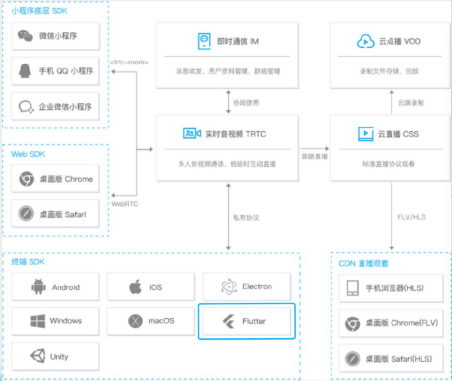
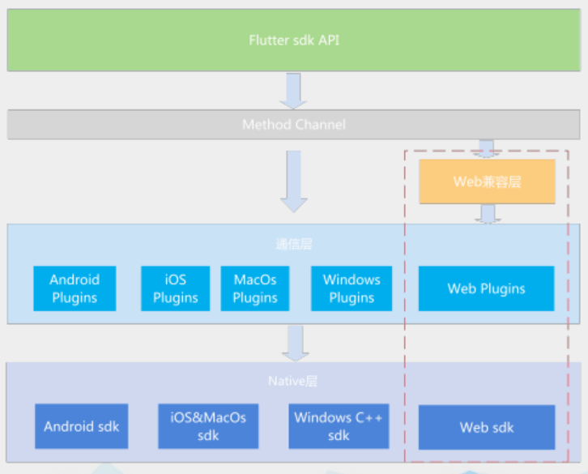

以下是本次参加 Tweb conf 2021 的学习笔记

# 目录

## 主会场

- [Flutter 音视频开发实践](#flutter-音视频开发实践)
- 腾讯文档渲染优化之路
- 远程办公下开发测试协同如何提效
- 如何创造一门上万人使用的语言

## 分会场（看过）

### Node.js & 大前端

- Kubernetes 应用的 BFF 便捷开发
- 跨端开发，也可以这样玩

### 低代码 & 可视化

- 基于 serverless 的低代码平台实践-TWEB

### 编辑器 & 研发效能

- 稿定视频编辑器背后的故事
- 在线文档冲突——OT 算法

以上是本次大会看过的，下面是本次大会未看过的，仅做记录

## 分会场（未看）

### Node.js & 大前端

- 从 0 开始，打造腾讯自研的跨端&动态化框架
- Puerts-UnityUE 下的 Typescript 框架
- 2021 Tweb 云时代的前端开发 王伟嘉

### 低代码 & 可视化

- WebAssembly 在哔哩哔哩创作中心的实践
- 厘米秀 3D 形象 DIY 渲染技术揭秘
- 信息流运营场景中的低代码探索与实践
- 低代码页面编辑器的设计和实现

### 编辑器 & 研发效能

- 腾讯文档工程实践
- 微信小程序真机调试
- CDN 版本化解决方案
- 由兴趣驱动开源 Cherry Markdown 成长之路

# Flutter 音视频开发实践

## Flutter 简介

### 跨平台技术发展趋势

跨平台框架优势：一次开发，多端运行，组件复用，提升效率

- Hybrid App（2011 年）
   - 页面运行在 webviwe
   - 开发迭代快
   - 受限于桥接层，拓展性能差
   - webview 渲染性能差
- ReactNative（2015 年）
   - 原生控件渲染
   - 性能好于 webview
   - 渲染时要和 Native 通信
   - JIT 编译
- Flutter（2018 年）
   - dart 语言
   - 同时支持 JIT 和 AOT 编译
   - 自渲染引擎
   - 性能接近原生

### Flutter 架构


- FrameWork: 是一个 Dart 实现的 UI SDK，从上到下包括了两大组件库、基础组件库、图形绘制、手势识别、动画等功能
- Engine: 实现 Flutter 渲染引擎、Dart 虚拟机、Platform 通信通道、事件通知、插件架构等功能
- Embedder: 操作系统适配层

### Flutter & Web 开发的差异


- StatelessWidget(无状态)：内部没有保存状态，UI 界面创建后不会发生改变。
- StatefulWidget(有状态)：内部有保存状态，当状态发生改变，调用 setState()方法会触发 UI 发生更新。

```css{6-8}
.grey {
   background: #e0e0e0;
   width: 320px;
   height: 240px;
   font: 900 24px Roboto;
   display: flex;
   align-items: center;
   justify-content: center;
}
```

```js{2}
var container = Container(
   child: Center(
      child: Text(
         "Lorem ipsum",
         style: bold24Roboto
      ),
   ),
   width: 320,
   height: 240,
   color: Colors.grey[300]
);
```

## TRTC 简介

腾讯实时音视频致力于帮助开发者快速搭建低成本、低延时、高品质的音视频互动解决方案：

- 适用于视频会议、在线教育、互动直播等场景
- 客户有腾讯会议、企业微信、陌陌、贝壳找房等



## SDK 设计


- 业务层：提供给开发者调用的 API，如进退房、推拉音视频流等近 100 个接口
- 实现层：管理 API 的核心类，可扩展、易用、性能好
- 通信层：通过 MethodChannel 消息通道连接 Flutter 和原生 sdk，数据通讯能力升级
- 原生层：底层是 Android 和 iOS 原生 sdk

### 挑战点 1-如何实现复杂的类结构体传输？

#### 背景

- flutter 本质是 dart 调用 native 的接口，并异步返回 native 的数据
- 原生 sdk 存在着大量类结构体的类型定义，原有消息通道不支持传递此类型

#### 方案

Flutter 类结构体 -> Flutter 类结构体转 Map 对象 -> Flutter JSON 序列化 -> 通信层 JSON 反序列化 -> Android 类结构体

同时可以对参数进行约束，类型校验，提升易用性


### 挑战点 2-图片怎么高效在 Flutter 和原生 sdk 之间传输？

#### 背景

直播过程中给视频设置水印等接口需要把 flutter 项目定义的图片资源传给原生 sdk，但是 flutter 没有 bitmap 这种数据类型，如何把 flutter 项目的图片资源转成原生 sdk 需要的 bitmap？

#### 方案

利用文档目录实现图片传输，通过文档目录（android 和 flutter 都可访问）传递文件路径的方式来实现共享


带来的问题：拷贝文件会导致比较高的耗时，如何解决？

#### 优化

图片传输优化-平台共享 asset：Flutter 的 asset 资源被打包在原生资源包下面，通过 AssetManager 可直接访问，节省中间层拷贝耗时。


### 挑战点 3-视频在 Flutter 里面如何渲染？

#### 背景

采集视频流 -> 云服务 -> Android 原生 -> Flutter

将摄像头采集的每一帧数据通过 MethodChanne 传递到 Flutter 中，性能消耗大

#### 方案

外接纹理：可以将原生端 opengl 图像数据共享给 Flutter 进行渲染。需要原生 sdk 提供视频帧图像数据回调接口，实现较为复杂。

PlatformView：主要适用于 Flutter 中不太容易实现的组件，如 WebView、视频播放器、地图等。给 Flutter 提供了嵌入 Android 和 iOS 平台原生 view 的能力。

最后采用 PlatformView 方案


#### 优化

用 oppo 的一个低端机进行测试，房间有 6 个用户的时候，第二屏画面渲染异常，使用 PerfDog 性能狗，分析出 GPU 占用过高


##### 列表懒加载与回收


列表优化后 GPU 占用从 72% 下降到了 53%，视频画面正常渲染显示，优化完成后的性能检测如下


由上图可看出，cpu、内存跟 Android 原生的占用差不多，GPU 比 Android 原生性能还差约 15%

##### 视频帧直出


性能消耗点：视频 view 的每一个像素流经附加的中间图形缓冲区，显著浪费显存和绘图性能

优化方案：将视频帧数据直接输出到 SurfaceTexture 上

##### 图像纹理共享


Flutter 与 Android 原生共享图像纹理数据，优化后性能检测如下


Flutter 优化后 GPU 性能提升了约 10%，基本能达到 Android 原生 sdk 的水平

### 挑战点 4-客户接入如何提效？

#### 背景

面临的问题：原始 SDK API 繁多，客户接入耗时很久

场景化方案的价值：客户可以寻找契合自己业务的场景方案，参考源码实现，提升接入效率


#### 方案


核心目标：易接入，开箱即用，降低客户的接入门槛


SDK：接口不超过 30 个，而且语义更加场景化

## 未来

flutter 桌面端的支持不太好，未来需要支持全平台




# 腾讯文档渲染优化之路

# 远程办公下开发测试协同如何提效

# 如何创造一门上万人使用的语言

# Kubernetes 应用的 BFF 便捷开发

# 跨端开发，也可以这样玩

# 基于 serverless 的低代码平台实践-TWEB

# 稿定视频编辑器背后的故事

# 在线文档冲突——OT 算法

# 从 0 开始，打造腾讯自研的跨端&动态化框架

# Puerts-UnityUE 下的 Typescript 框架

# 2021 Tweb 云时代的前端开发 王伟嘉

# WebAssembly 在哔哩哔哩创作中心的实践

# 厘米秀 3D 形象 DIY 渲染技术揭秘

# 信息流运营场景中的低代码探索与实践

# 低代码页面编辑器的设计和实现

# 腾讯文档工程实践

# 微信小程序真机调试

# CDN 版本化解决方案

# 由兴趣驱动开源 Cherry Markdown 成长之路
