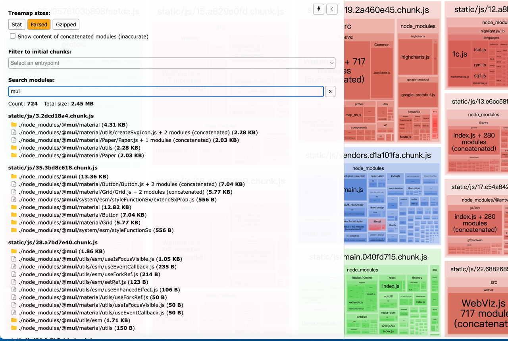
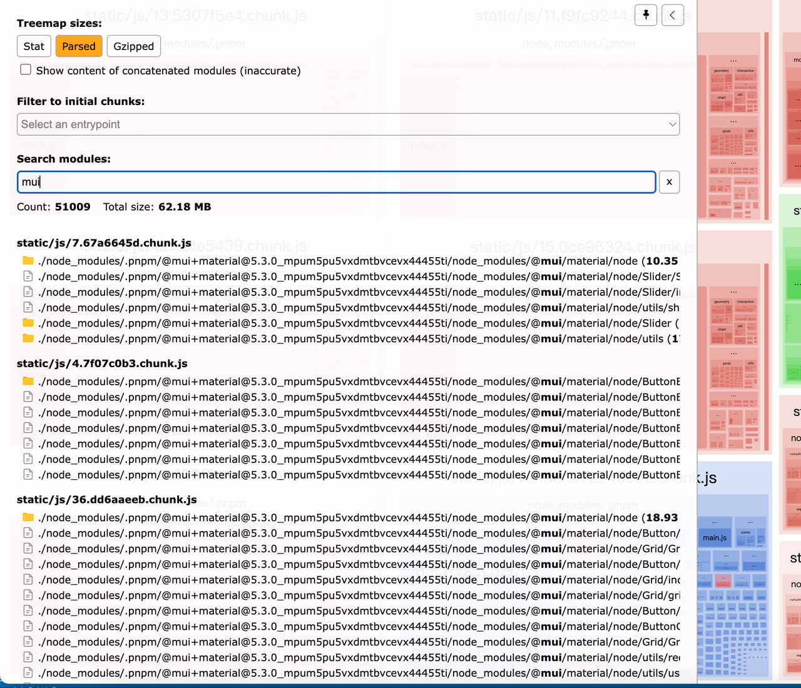
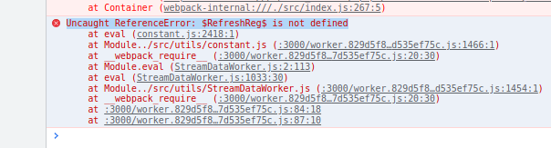
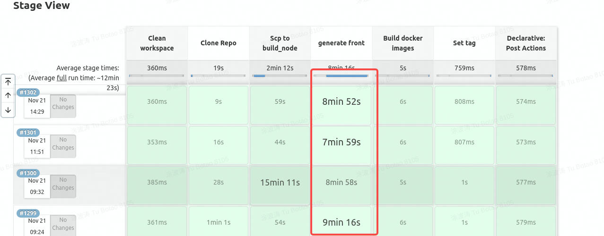
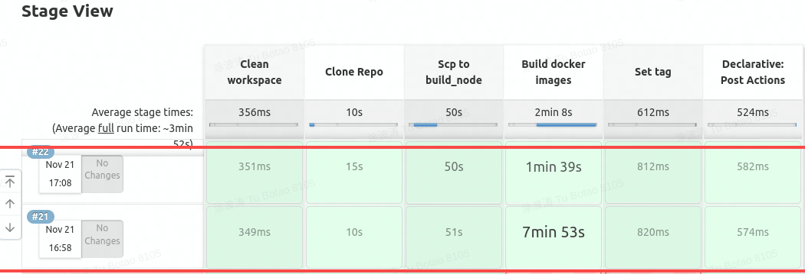

# 需求背景

由于公司老项目采用 cra 来构建前端项目，在 jenkins 上的平均打包时长在 10 分钟以上，需要优化线上的打包时间，同时优化本地的开发体验

# 一期优化

主要针对 cra + webpack3/4 进行的优化

## 具体功能

### cra 配置优化

核心：thread-loader 加快首次编译速度，hard-source-webpack-plugin 加快二次编译速度

config-overrides.js

```js
const {
   override,
   addBabelPlugins,
   fixBabelImports,
   addLessLoader,
   removeModuleScopePlugin,
   addWebpackModuleRule,
   setWebpackOptimizationSplitChunks,
   addWebpackPlugin,
   addWebpackAlias
} = require('customize-cra');
const fs = require('fs');
const PreloadWebpackPlugin = require('preload-webpack-plugin');
const path = require('path');
const MonacoWebpackPlugin = require('monaco-editor-webpack-plugin');
const WebpackBarPlugin = require('webpackbar');
const { get, pick } = require('lodash');
const threadLoader = require('thread-loader');
const HardSourceWebpackPlugin = require('hard-source-webpack-plugin');

const packageJson = require('./package.json');
const FixHardSourceWebpackPlugin = require('./plugins/FixHardSourceWebpackPlugin');
// const SpeedMeasurePlugin = require('speed-measure-webpack-plugin')
// const smp = new SpeedMeasurePlugin()

// 默认开启 hard-source-webpack-plugin 插件，可以传入这个环境变量来主动关闭
const { DISABLE_HARD_SOURCE_PLUGIN } = process.env;

threadLoader.warmup(
   {
      // pool options, like passed to loader options
      // must match loader options to boot the correct pool
   },
   [
      // modules to load
      // can be any module, i. e.
      'babel-loader'
   ]
);

// 打印 webpack 的相关配置，便于调试
const craDir = path.join(process.cwd() + '/.cra');

if (!fs.existsSync(craDir)) {
   fs.mkdirSync(craDir);
}

// 分析打印出的 webpack 相关配置的规律，可以写出此钩子函数，函数签名参考 craco 里面的函数
const addBeforeLoaders = (webpackConfig, matchLoader, newLoader = []) => {
   const matchLoaders = get(webpackConfig, 'module.rules.1.oneOf', []).filter((item) =>
      get(item, 'loader', '').includes(matchLoader)
   );
   if (matchLoaders.length > 0) {
      matchLoaders.forEach((item) => {
         const props = ['loader', 'options'];
         item.use = [...newLoader, pick(item, props)];
         props.forEach((item2) => {
            delete item[item2];
         });
      });
   }
};

// 这里不能单纯的使用 JSON.stringify，需要特殊处理，否则不能序列化出函数部分
const formatConfig = (config) =>
   JSON.stringify(
      config,
      (key, value) => {
         if (typeof value === 'function') {
            return value.toString();
         }
         return value;
      },
      2
   );

const getHardSourceWebpackPlugins = (env) =>
   !DISABLE_HARD_SOURCE_PLUGIN
      ? [
           addWebpackPlugin(
              new HardSourceWebpackPlugin({
                 // Either an absolute path or relative to webpack's options.context.
                 cacheDirectory: path.resolve(process.cwd(), `node_modules/.cache/hard-source/${env}/[confighash]`),
                 // Either a string of object hash function given a webpack config.
                 configHash: (webpackConfig) => {
                    // node-object-hash on npm can be used to build this.
                    // 这里根据 package.json 里面的 dependencies 以及 webpack 配置来决定是否复用缓存
                    return require('node-object-hash')({ sort: false }).hash({
                       webpackConfig,
                       dependencies: packageJson.dependencies
                    });
                 },
                 // Either false, a string, an object, or a project hashing function.
                 environmentHash: {
                    root: process.cwd(),
                    directories: [],
                    files: []
                 },
                 // An object.
                 info: {
                    // 'none' or 'test'.
                    mode: 'none',
                    // 'debug', 'log', 'info', 'warn', or 'error'.
                    level: 'debug'
                 },
                 // Clean up large, old caches automatically.
                 cachePrune: {
                    // Caches younger than `maxAge` are not considered for deletion. They must
                    // be at least this (default: 2 days) old in milliseconds.
                    maxAge: 2 * 24 * 60 * 60 * 1000,
                    // All caches together must be larger than `sizeThreshold` before any
                    // caches will be deleted. Together they must be at least this
                    // (default: 50 MB) big in bytes.
                    sizeThreshold: 50 * 1024 * 1024
                 }
              })
           ),
           env === 'production' &&
              // 修复 hard-source-webpack-plugin 插件的各种异常，后面详细说明
              addWebpackPlugin(
                 new FixHardSourceWebpackPlugin({
                    cacheDirectory: path.resolve(process.cwd(), `node_modules/.cache/hard-source/${env}`)
                 })
              )
        ]
      : [];

module.exports = {
   webpack: (config, env) => {
      const isProd = env === 'production';

      const localConfig = override(
         addBabelPlugins(
            ['@babel/plugin-proposal-nullish-coalescing-operator'],
            ['@babel/plugin-syntax-optional-chaining']
         ),
         fixBabelImports('import', {
            libraryName: 'antd',
            libraryDirectory: 'es',
            style: true
         }),
         addLessLoader({
            javascriptEnabled: true
            // modifyVars: { '@primary-color': '#1DA570' }
         }),
         addWebpackAlias({
            '@': path.resolve(__dirname, 'src')
         }),
         removeModuleScopePlugin(),
         addWebpackModuleRule({
            // test: /StreamDataWorker\.js/,
            test: /(StreamDataWorker|MapDataWorker|FrameProcessWorker)\.js/,
            use: { loader: 'worker-loader', options: { filename: 'worker.[hash].js' } }
         }),
         // TODO 这里不能用 worker.js 后缀，猜测是 oneOf 导致
         // addWebpackModuleRule({
         //   test: /\.worker\.js$/,
         //   use: { loader: 'worker-loader' }
         // }),
         isProd &&
            setWebpackOptimizationSplitChunks({
               cacheGroups: {
                  vendors: {
                     minChunks: 2,
                     test: /[\\/]node_modules[\\/](?!google-protobuf|@antv|highcharts|mathjs|two\.js|konva|victory-core)/,
                     priority: -10,
                     reuseExistingChunk: true,
                     name: 'vendors'
                  },
                  default: {
                     minChunks: 2,
                     priority: -20,
                     reuseExistingChunk: true
                  }
               }
            }),
         // TODO 以下分包策略不是最优解
         // isProd &&
         //   setWebpackOptimizationSplitChunks({
         //     chunks: 'all',
         //     maxInitialRequests: 10,
         //     minSize: 0,
         //     cacheGroups: {
         //       vendor: {
         //         test: module => {
         //           // 遇到 echarts 相关库时，不要抽出来，以免 echarts 抽出的包很大
         //           if (/[\\/]node_modules[\\/](echarts|zrender)/.test(module.context)) {
         //             return false
         //           }
         //           return /[\\/]node_modules[\\/]/.test(module.context)
         //         },
         //         name: module => {
         //           const packageName = module.context.match(/[\\/]node_modules[\\/](.*?)([\\/]|$)/)[1]
         //           return `npm.${packageName.replace('@', '')}`
         //         }
         //       }
         //     }
         //   }),
         isProd &&
            addWebpackPlugin(
               new PreloadWebpackPlugin({
                  rel: 'prefetch',
                  as: 'script',
                  fileBlacklist: [
                     /\d{1,2}\.(\d?[a-z]?)+\.chunk\.js$/,
                     /main\..+\.js$/,
                     /\.css$/,
                     /\.txt$/,
                     /\.png$/,
                     /.jpeg$/
                  ],
                  include: 'allAssets'
               })
            ),
         addWebpackPlugin(
            new MonacoWebpackPlugin({
               languages: ['json']
            })
         ),
         // 显示编译进度
         addWebpackPlugin(new WebpackBarPlugin()),
         ...getHardSourceWebpackPlugins(env)
      )(config);

      // 注入 thread-loader
      addBeforeLoaders(localConfig, 'babel-loader', ['thread-loader']);

      // 限制编译范围
      localConfig.resolve.extensions = ['.js'];
      localConfig.resolve.mainFields = ['jsnext:main', 'main'];
      localConfig.resolve.modules = ['node_modules'];

      // 本地开发采用更轻量级的 cheap-module-eval-source-map
      if (!isProd) {
         localConfig.devtool = 'cheap-module-eval-source-map';
      }

      // if (isProd) {
      //   localConfig.optimization = {
      //     ...localConfig.optimization,
      //     nodeEnv: 'production',
      //     sideEffects: true,
      //     concatenateModules: true,
      //     runtimeChunk: 'single'
      //   }
      // }

      fs.writeFileSync(path.join(craDir, `webpack.${env}.json`), formatConfig(localConfig));

      return localConfig;
   },
   devServer: (configFunction) => (proxy, allowedHost) => {
      const config = configFunction(proxy, allowedHost);

      config.quiet = false;

      // 显示构建耗时
      config.stats = {
         errors: true,
         children: false,
         warnings: false,
         colors: true,
         assets: false,
         modules: false,
         entrypoints: false
      };

      // 关闭 host 检测，以免非 localhost 域名访问时热更新不生效
      config.disableHostCheck = true;

      fs.writeFileSync(path.join(craDir, 'webpack-dev-server.json'), formatConfig(config));

      return config;
   }
};
```

### Dockerfile 配置缓存优化

#### 需求背景

为了充分利用缓存，采用 docker 的缓存策略

#### 背景知识

[Docker 入门学习](/docker-introduce-learning/)

#### 第一版

这里的主要问题在于一旦改了源码需要编译的时候，缓存失效了

原因是标红行部分复制了文件，再进行构建的时候，因为已经是新的文件了，所以这里 build 的时候不能使用缓存

Dockerfile-client

```dockerfile{14}
FROM node:14-alpine as builder

# 全局安装依赖，尽量写在一行防止加了新库之后还是使用原来的镜像
RUN npm config set registry https://registry.npmmirror.com

WORKDIR /home/

# 缓存 package.json pnpm-lock.yaml，只有变更的时候才会重新 install
COPY package.json package-lock.json ./
# 安装依赖
RUN npm i

# 复制剩余文件
COPY . .

RUN ls && npm run build && ls

FROM nginx:alpine
COPY --from=builder /home/build /usr/share/nginx/html/
COPY nginx.conf /etc/nginx/conf.d/default.conf

EXPOSE 3000
```

#### 第二版

由于第一版的问题，所以需要想办法在 build 过程中也要尽可能的使用缓存

这里由于缓存容易损坏（由上面提到的 hard-source-webpack-plugin 造成），需要给缓存一个版本的概念，同时也要控制是否使用缓存

Dockerfile-client-buildkit

```dockerfile
# syntax = docker/dockerfile:experimental

FROM node:14-alpine as builder

ARG registry=https://registry.npmmirror.com

# 全局安装依赖，尽量写在一行防止加了新库之后还是使用原来的镜像
RUN npm config set registry ${registry} -g && npm i -g pnpm

WORKDIR /home/

# 缓存 pnpm-lock.yaml
COPY pnpm-lock.yaml ./

# 下载依赖到全局位置
RUN pnpm fetch --prod

# 复制剩余文件
COPY . .

# 安装依赖同时读写缓存
RUN --mount=type=cache,target=node_modules,id=frontend_node_modules,sharing=locked \
    --mount=type=cache,target=/root/.npm,id=npm_cache \
    pnpm i --ignore-scripts=true --prod --offline --registry=$registry

# build 并读写缓存
RUN --mount=type=cache,target=node_modules,id=frontend_node_modules,sharing=locked \
    pnpm build

# 以下是二阶段
FROM nginx:alpine

RUN --mount=type=bind,target=/tmp/build,from=builder,source=/home/build \
    cp -r /tmp/build/* /usr/share/nginx/html/

COPY nginx.conf /etc/nginx/conf.d/default.conf

EXPOSE 3000
```

最终采用第二版，同时为了减少构建上下文，需要添加如下的文件

.dockerignore

```dockerfile
*
# 静态文件
!public
# 为了兼容老版本的 jenkins 不报错，实际上不该加
!build

# 源码
!src

# 构建相关
!.env.production
!config-overrides.js
!plugins
!scripts

# 依赖库
!package.json
!pnpm-lock.yaml

# nginx
!nginx.conf
```

#### 调用

1. `BUILDKIT_CACHE_MOUNT_NS` 就类似于缓存版本的概念
2. 可以传入 `--no-cache` 来控制不使用缓存，默认使用（这里的 docker 18 版本的 `--no-cache` 不对 `type=cache` 生效，20 版本的反而生效）
3. 以上 2 个参数可以配合 jenkins 来控制

package.json

```json
{
   "scripts": {
      "build": "node scripts/build.js",
      "docker:build": "DOCKER_BUILDKIT=1 docker build --build-arg=BUILDKIT_CACHE_MOUNT_NS=tbtu --network=host -t frontend -f ./Dockerfile-client-buildkit .",
      "docker:run": "docker run -it -p 3000:3000 --rm frontend",
      "docker:start": "npm run docker:build && npm run docker:run"
   }
}
```

### npm 切换到 pnpm

#### 需求背景

在公司的 jenkins 平台上打包时发现 npm install 的过程特别慢，主要是老项目的依赖库太多，故考虑转向安装速度更快的 pnpm

#### 实现方式

1. 因为老项目里面已有 package-lock.json，所以通过 `pnpm import` 可以实现一键迁移，当然有些三方库使用错误导致白屏，这些库需要特殊处理
2. 配合上面的 dockerfile 可实现深度缓存
3. 由于上面提到的是否使用缓存一部分是由 package.json 里面的 dependencies 决定，所以需要规范 dependencies 的用法

### npm install 校验命令

#### 需求背景

为了统一库的安装工具，防止团队成员使用别的库安装工具

#### 实现方式

1. 通过 volta 限制只能使用 pnpm（截止 2022-11-21 11:21:42 [不支持 pnpm](https://github.com/volta-cli/volta/issues/737)）
2. 手动写 hook 脚本

最终 2 种方式都采用

#### volta

安装过程见 [volta](/frontend-devlopment-environment-setting/#volta)

同时在 package.json 加如下几行，这样切入项目目录就会自动切换构建工具

```json
{
   "volta": {
      "node": "14.20.0",
      "pnpm": "7.14.1"
   }
}
```

#### hook 脚本

scripts/node-check-version.js

```js
const { exec } = require('child_process');
exec('node -v', (err, stdout) => {
   if (err) throw err;
   if (parseInt(stdout.slice(1)) !== 14) {
      // NOTE: This can happen if you have a dependency which lists an old version of npm in its own dependencies.
      throw new Error(`[ERROR] You need node version @=14 but you have ${stdout}`);
   }
});
```

scripts/only-allow.js

```js
const pmFromUserAgent = (userAgent) => {
   const pmSpec = userAgent.split(' ')[0];
   const separatorPos = pmSpec.lastIndexOf('/');
   return {
      name: pmSpec.substr(0, separatorPos),
      version: pmSpec.substr(separatorPos + 1)
   };
};

if (!process.env.npm_config_user_agent) {
   throw new Error('[ERROR] Please check your npm!');
}

const [name, version] = process.argv.slice(2);

const pm = pmFromUserAgent(process.env.npm_config_user_agent);

if (name !== pm.name) {
   const errors = [`[ERROR] You need ${name}`];

   const urlMap = {
      pnpm: 'https://pnpm.js.org/',
      yarn: 'https://yarnpkg.com/'
   };

   if (urlMap[name]) {
      errors.push(`Please go to ${urlMap[name]}`);
   }

   throw new Error(errors.join(', '));
}

if (parseFloat(pm.version) < version) {
   throw new Error(`[ERROR] You need ${name} version @>=${version} but you have ${pm.version}`);
}
```

package.json

```json
{
   "scripts": {
      "preinstall": "npm run verify-version",
      "node-check-version": "node scripts/node-check-version.js",
      "only-allow": "node scripts/only-allow.js pnpm 7",
      "pnpm:devPreinstall": "npm run verify-version",
      "verify-version": "npm run node-check-version && npm run only-allow"
   }
}
```

这里要注意，由于 pnpm 下的 preinstall 是 install 后才执行的，所以增加了 `pnpm:devPreinstall`，同时生产环境通过添加 `--ignore-scripts=true` 参数不运行此钩子

以上就可以限制只能通过 pnpm 来进行 install（以上脚本还限制了版本）

### hard-source-webpack-plugin 的线上修复

#### 需求背景

在使用了 hard-source-webpack-plugin 作缓存加速时，有以下比较明显的问题

1. 二次编译有时不能正常停止
2. 二次编译会出现各种编译报错，清空缓存后重新编译却正常

#### 实现方式

针对以上问题，有以下解决方式

1. 二次编译时识别到 done 即编译完成，此时调用 `process.exit(0)` 手动结束
2. 二次编译时一旦编译报错则认为是缓存损坏，此时清空缓存，重启 build 命令

scripts/const.js

```js
const CACHE_ERROR_CODE = 10;

module.exports = {
   CACHE_ERROR_CODE
};
```

scripts/build.js

```js
const child_process = require('child_process');

const { CACHE_ERROR_CODE } = require('./const');

function spawn(mainModule) {
   const worker = child_process.spawn('react-app-rewired', mainModule, {
      stdio: 'inherit'
   });

   worker.on('exit', function(code) {
      // 接受到缓存损坏信号，重启命令
      if (code === CACHE_ERROR_CODE) {
         spawn(mainModule);
         // 除了正常停止的 0 外，其他错误码均认为异常
      } else if (code !== 0) {
         process.exit(1);
      }
   });
}

spawn(['--max-old-space-size=4096', 'build']);
```

plugins/FixHardSourceWebpackPlugin.js

```js
const rimraf = require('rimraf');
const { get } = require('lodash');
const { CACHE_ERROR_CODE } = require('../scripts/const');

class FixHardSourceWebpackPlugin {
   constructor(options) {
      this.options = options || {};
      // 是否读取了上次的缓存
      this.cacheRead = false;
   }

   apply(compiler) {
      compiler.hooks.hardSourceLog.tap('hardSourceLog', (message) => {
         // eslint-disable-next-line no-useless-call
         // console[message.level].call(console, message)

         const id = get(message, 'data.id');

         if (id === 'confighash--reused') {
            this.cacheRead = true;
         }
      });

      const handleClearCache = () => {
         // 第一次生成缓存的时候，如果编译失败则判定缓存无效，清空缓存，退出命令
         // 第二次读缓存的情况下，如果编译失败则判定缓存无效，清空缓存，重启命令
         const { cacheDirectory } = this.options;
         console.log('[FixHardSourceWebpackPlugin] Clearing Cache', cacheDirectory);
         rimraf.sync(cacheDirectory);
         console.log('[FixHardSourceWebpackPlugin] Cache Cleared');
         if (this.cacheRead) {
            console.log('[FixHardSourceWebpackPlugin] Restarting...');
            process.exit(CACHE_ERROR_CODE);
         }
      };

      // 找不到具体的模块时会调用，比如随便导入一个不存在的模块
      // import Atmp from './fake'，且代码里面用到 Atmp 组件（这里的 fake 根本不存在）
      compiler.hooks.failed.tap('FixHardSourceWebpack Cache Error', () => {
         console.log('[FixHardSourceWebpackPlugin] Invoke Failed');
         handleClearCache();
      });

      // 导出一个不存在的模块并使用时会调用
      // import { Atmp } from './fake' 且代码里面用到 Atmp 组件（实际上 Atmp 是不存在的组件）
      compiler.hooks.done.tap('FixHardSourceWebpack Cache Error', (stats) => {
         const hasErrors = stats.hasErrors();
         if (!hasErrors) {
            return;
         }
         console.log('[FixHardSourceWebpackPlugin] Invoke Done');
         handleClearCache();
      });

      compiler.hooks.done.tap('FixHardSourceWebpackPlugin Force Stop', (stats) => {
         if (!this.cacheRead) {
            return;
         }

         // 编译完成强制结束
         // HACK 生产模式下因为 hard-source-webpack-plugin 插件的原因不会完全停止，暂未找到原因
         setTimeout(() => {
            console.log('[FixHardSourceWebpackPlugin] Force Stop');
            process.exit(0);
         });
      });
   }
}

module.exports = FixHardSourceWebpackPlugin;
```

#### 后续问题

在代码变动之后，如果通过缓存生成，查看编译后的代码还是之前的老代码，需要暂时关闭缓存待以后解决

### preload-webpack-plugin 失效处理

#### 需求背景

此插件在 pnpm 下不生效，在 npm 下反而生效

#### 原因

require 指向的 html-webpack-plugin 不是同一个，导致 hook 不能被调用，具体见 [issue](https://github.com/jantimon/html-webpack-plugin/issues/1091#issuecomment-434708455)

#### 解决方案

升级到 3.0.0-beta.4 即可，对比可知源码做了以上处理

3.0.0-beta.3 代码：

```js
if (!hook) {
   const HtmlWebpackPlugin = require('html-webpack-plugin');
   hook = HtmlWebpackPlugin.getHooks(compilation).beforeEmit;
}
```

3.0.0-beta.4 代码：

```js
if (!hook) {
   const [HtmlWebpackPlugin] = compiler.options.plugins.filter(
      (plugin) => plugin.constructor.name === 'HtmlWebpackPlugin'
   );
   assert(HtmlWebpackPlugin, 'Unable to find an instance of ' + 'HtmlWebpackPlugin in the current compilation.');
   hook = HtmlWebpackPlugin.constructor.getHooks(compilation).beforeEmit;
}
```

### 分包失效问题

#### 需求背景

发现分包结果和原来的不一致，比原来大很多，比如看下面的三方库

原来的



新的



#### 原因

经分析 treeShaking 失效，说明 main 没有识别到 es6 的语法

#### 解决方案

需要注释掉 mainFields 这一行，默认 cra 已做了 es6 语法的处理

```js
// localConfig.resolve.mainFields = ['jsnext:main', 'main'];
```

### 修复 fastRefresh 在 worker 报错

#### 需求背景

如果一个文件导出函数时被前端代码和 worker 同时使用时报错



#### 原因

在 development 模式下，如果一个文件里面的 function 同时被 worker 和前端文件使用（即被前端的 `babel-loader/react-refresh` 处理过，此时就有了 fastRefresh 的插件代码），而 fastRefresh 里面没有针对 worker 运行环境的处理，此时会报错

#### 方案

需要对 `$RefreshReg$` 做兼容处理，即确保只在开发环境的 worker 添加以下代码（注意这里的代码必须写成单独的文件并使用 import 放在 worker 的第一行，否则会因为执行时机的问题不起作用）

```js
global.$RefreshReg$ = () => {};
global.$RefreshSig$ = () => {};
```

1. 不对 worker 文件做 babel 处理（此方案改动较大，不现实）
2. 在 worker-loader 前插入新的 loader，此 loader 插入以上代码，注意只在 development 环境插入一行代码
   1. 找现成的插入代码的 loader
   2. 自己写 loader

### 懒编译

#### 需求背景

目前老项目在开发模式下全量编译过慢，而有时只需要开发少数几个页面

#### 选型过程

因老项目使用的是 webpack4，历史代码太多不好升级，所以需要通过模仿 webpack5 的懒编译实现，有以下几个选型

1. [web-packing](https://github.com/bahmutov/web-packing) 实现了网络请求来打包对应组件，实现思路类似懒编译，但和理想中的相差较远
2. [webpack-virtual-modules](https://github.com/sysgears/webpack-virtual-modules) 实现了在内存中动态创建文件，但需要重新开始写懒编译效果
3. [vue-dynamic-module-example](https://github.com/lisiyizu/vue-dynamic-module-example) 实现了在 vue 中懒编译文件，但只能在命令行中指定要编译哪些模块，不能从网络请求来决定编译哪些模块
4. [lazy-compile-webpack-plugin](https://github.com/liximomo/lazy-compile-webpack-plugin) 基本实现了根据请求来编译对应页面的效果，但请求一个页面会触发多次编译，且二次请求这个页面还会触发编译
5. [lazy-build-webpack-plugin](https://github.com/devtreehouse/lazy-build-webpack-plugin) 修复以上问题，但在老项目里面运行会出现循环依赖的报错
6. [towavephone/lazy-build-webpack-plugin](https://github.com/towavephone/lazy-build-webpack-plugin) 修复循环依赖问题

#### 具体实现

config-overrides.js

```js
const LazyBuildWebpackPlugin = require('@towavephone/lazy-build-webpack-plugin');

const { LAZY_BUILD } = process.env;

// 默认不开启懒编译
LAZY_BUILD &&
   addWebpackPlugin(
      // 以下三个和热更新有关的三方库会导致页面不停刷新，造成此原因的链接如下
      // https://github.com/towavephone/lazy-build-webpack-plugin/blob/2a2654f8ea22b015caaef7d5bc961b851f92033d/lib/loaders/entry-loader.js#L15
      new LazyBuildWebpackPlugin({
         ignores: [/\b(react-dev-utils|dev-server|react-refresh-webpack-plugin)\b/]
      })
   );
```

index.js

```js
// 主入口需要加这几行代码，否则懒编译完成后页面不刷新
if (module.hot) {
   module.hot.accept();
}
```

#### 编译效果

1. 懒编译开启前，即全量编译．时长在 3 分钟左右
2. 懒编译开启后，即单页面编译，随机挑选一个页面，时长在 20 秒左右

#### 源码解析

[lazy-build-webpack-plugin](https://github.com/towavephone/lazy-build-webpack-plugin)

### jenkins 编译速度优化

[原文链接](/jenkins-build-speed-optimize/)

## 效果展示

### 生产环境

只算前端编译过程，原来的正在用的前端编译时间 9 分钟



优化缓存过后，分 2 种情况，初次编译完全无缓存的情况下编译时间 8 分钟，第二次有缓存的情况下 3 分钟



### 开发环境

看自己电脑配置来定，目前本人电脑上前端初次编译 5 分钟，二次编译 2 分钟（不过不建议开启缓存插件，会影响热更新速度且时间长会报错，可通过上面提到的 `DISABLE_HARD_SOURCE_PLUGIN` 关闭）

## 后期优化

后期优化偏向页面加载性能方面，有以下几点可以考虑：

1. 页面分包优化
2. worker.js loader 优化
3. 不必要的三方库优化

# 二期优化

## 具体功能

### cra + webpack5

### rspack

### vite

### dockerfile pnpm 缓存不生效

## 效果展示

## 后期优化
