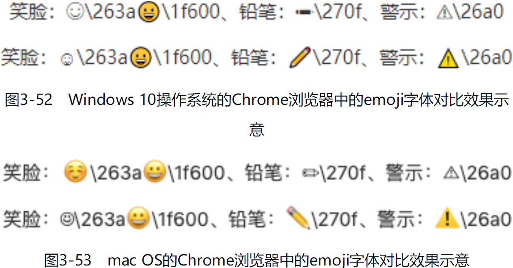
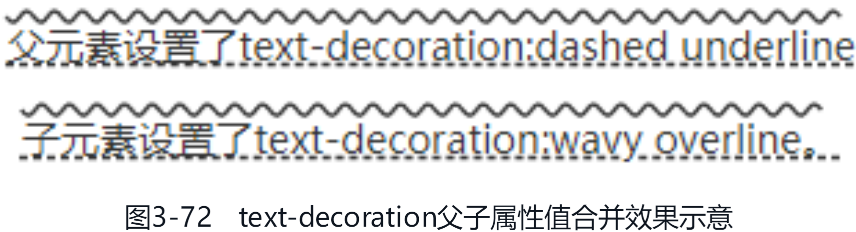
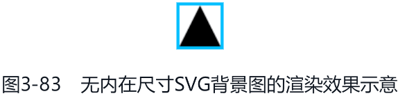
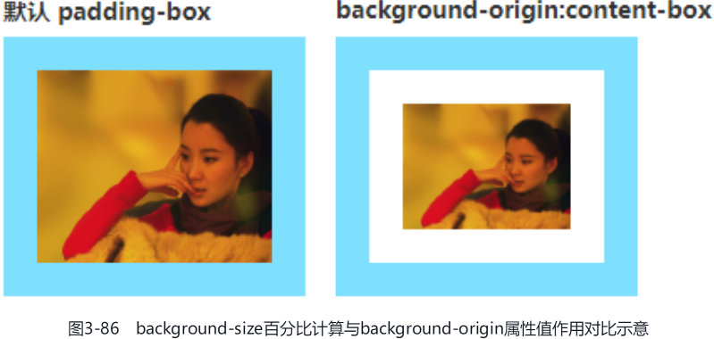

CSS 新世界中有大量的 CSS 新特性源自对 CSS2.1 中已有的 CSS 属性的增强，本章内容所讲述的就是在已有 CSS 属性上新增的那些 CSS 新特性

# 贯穿全书的尺寸体系

在 CSS2.1 中，CSS 中的尺寸概念都隐藏在具体的 CSS 用法中。例如，`display: inline-block`、`float: left` 和 `position: absolute` 等 CSS 声明带来的 `shrink-to-fit` 收缩；`white-space: nowrap` 带来的“最大内容宽度”；连续英文字符的宽度溢出其实是因为“最小内容宽度”。

因为这些尺寸的表现过于隐晦，所以学习时很难理解，学起来就很吃力，这就是我在第 1 章提过的，CSS2.1 中的 CSS 语法虽简单，但理解很难。这种困扰在纯理性思维的开发者身上体现得尤为明显，因为过于理性的人不擅长将模糊的概念转换为感性的认知来进行学习，所以他们学习 JavaScript 得心应手，但是学习 CSS 就会觉得比较困难。

不过从 CSS3 开始，以前很多模糊的概念有了明确的定义，并且这些明确的定义有与之相匹配的 CSS 属性或 CSS 属性值。这种变化的优点很明显，那就是我们不需要再去理解 CSS 属性背后隐藏的含义和特性，知识变得更表层、更浅显了。虽说 CSS 学习的广度有所增加，但是总体来看，把概念规范起来的利还是远远大于弊的。例如接下来要介绍的尺寸体系，如果用一个金字塔来表示，那么在最上层的概念就是 `Intrinsic Sizing` 和 `Extrinsic Sizing`。`Intrinsic Sizing` 被称为 `内在尺寸`，表示元素最终的尺寸表现是由内容决定的；`Extrinsic Sizing` 被称为 `外在尺寸`，表示元素最终的尺寸表现是由上下文决定的。

由于新的尺寸关键字在 width 属性中最常用，因此，本节以 width 属性为示例属性，和大家深入探讨 CSS 新世界中的尺寸概念。本节内容很重要，大家请仔细阅读，如有必要，可以反复阅读。

CSS 的 width 属性新增了 4 个与尺寸概念相匹配的关键字，包括 fit-content、fill-available、min-content 和 max-content，每一个关键字背后都有知识点。我们先从最常用的 fit-content 关键字开始讲解。

## 从 width: fit-content 声明开始

fit-content 关键字是新的尺寸体系关键字中使用频率最高的关键字。你可以把 fit-content 关键字的尺寸表现想象成“紧身裤”，大腿的肉对应的就是元素里面的内容，如果是宽松的裤子，那肉眼所见的尺寸就比较大，但是如果是紧身裤，则呈现的尺寸就是大腿实际的尺寸。同样，元素应用 fit-content 关键字就像给元素里面的内容穿上了超薄紧身裤，此时元素的尺寸就是里面内容的尺寸。

实际上，fit-content 关键字的样式表现就是 CSS2.1 规范中的“shrink-to-fit”，我称其为“包裹性”。这种尺寸表现和元素应用 display: inline-block、position: absolute 等 CSS 声明类似，尺寸收缩但不会超出包含块级元素的尺寸限制。

举个例子，要实现和 [CSS 世界流、元素与基本尺寸——包裹性](/css-world-flow-element-size/#包裹性) 的例子一样的效果，需求描述为：一段文字，字数少的时候居中显示，字数多的时候左对齐显示。当然这里使用了不一样的方法，关键 CSS 代码如下：

```css
/* 传统实现 display: table */
.cw-content {
   display: table;
   margin: auto;
}

/* fit-content 实现 */
.cw-content {
   width: fit-content;
   margin: auto;
}
```

可以看到，在现代浏览器中，两种方法实现的效果一模一样：

[fit-content-x-center](embedded-codesandbox://css-new-world-enhance-existing-css/fit-content-x-center)

如果是内联元素要收缩，可以使用 display: inline-block 声明；如果是块级元素要收缩，可以使用 display: table 声明。这两种方式效果一样，兼容性还更好，IE8+ 浏览器都提供了支持。这么一看，fit-content 关键字岂不是没什么用？实际上并不是这样，使用 fit-content 关键字有两大优点。

1. 保护了元素原始的 display 计算值，例如 `<li>` 元素要是设置成了 display: table，前面的项目符号就不会出现，::marker 伪元素也会失效。

2. 让元素的尺寸有了确定的值，这是 fit-content 关键字最重要也最可贵的优点。第二个优点有必要展开讲一下。

### fit-content 关键字让元素有了确定的尺寸

CSS 中有不少布局需要有明确的元素的尺寸才能实现，非常典型的例子就是绝对定位元素使用 margin: auto 实现居中效果时需要设置具体的 width 或 height 的属性值，CSS 代码示意如下：

```css
.cw-dialog {
   width: 300px;
   height: 200px;
   position: absolute;
   left: 0;
   top: 0;
   right: 0;
   bottom: 0;
   margin: auto;
   border: solid;
}
```

但是，很多时候绝对定位元素的尺寸是不固定的，最终的尺寸会根据内容自动变化，此时上面的 CSS 代码就不适合，该怎么办呢？很多人会想到使用 transform 属性进行偏移：

```css
.cw-dialog {
   position: absolute;
   left: 50%;
   top: 50%;
   border: solid;
   transform: translate(-50%, -50%);
}
```

这是一种不错的方法，但并不完美，而且这个方法占用了 transform 属性，这会导致绝对定位元素无法使用包含 transform 属性的动画效果。例如，现在项目中有一个整站通用的体验增强的位移小动画：

```css
@keyframe tinyUp {
   from {
      transform: translateY(5px);
   }

   to {
      transform: translateY(0);
   }
}
```

.cw-dialog 元素就没办法使用这个名为 tinyUp 的位移小动画，因为 CSS 动画关键帧中的 CSS 语句的优先级最高，会干扰原本设置的 transform 偏移值：

```css
.cw-dialog {
   position: absolute;
   left: 50%;
   top: 50%;
   border: solid;
   /* transform 会被 animation 动画干扰 */
   transform: translate(-50%, -50%);
   animation: tinyUp 0.2s;
}
```

有没有什么更好的方法呢？有，就是使用 fit-content 关键字，例如：

```css
.cw-dialog {
   width: fit-content;
   height: fit-content;
   position: absolute;
   left: 0;
   top: 0;
   right: 0;
   bottom: 0;
   margin: auto;
   border: solid;
   animation: tinyUp 0.2s;
}
```

此时元素尺寸自适应，同时完全居中，不用担心包括 transform 属性的动画带来的冲突。

[fit-content-xy-center](embedded-codesandbox://css-new-world-enhance-existing-css/fit-content-xy-center)

在 webkit 浏览器中，大家可以看到弹框出现的时候会有一个向上微移的动画，这就是 fit-content 关键字带来的体验增强。其他浏览器则做了降级处理（兼容到 IE9），即居中功能正常，但没有动画，兼容细节可参见示例页面源码。

### fit-content 关键字的兼容性

fit-content 关键字的兼容性比较复杂，很多人会误认为 width 属性和 height 属性都表示尺寸，fit-content 关键字作为这两个属性的属性值，兼容性应该与它们一样，然而实际上差异很大，具体细节如下。

1. IE 浏览器和 Edge 浏览器不支持 fit-content 关键字，若要兼容，可以使用传统方法进行模拟。

   Chrome 浏览器最早在 2012 年的时候就已支持 width: fit-content，Safari 等浏览器紧随其后很快也支持了，因此 width: fit-content 目前在移动端是可以放心使用的。为了兼顾少部分陈旧手机用户，稳妥起见，我们可以加上 -webkit- 私有前缀：

   ```css
   .example {
      width: -webkit-fit-content;
      width: fit-content;
   }
   ```

   对于 Firefox 浏览器，还需要添加 -moz- 私有前缀，因此，对于用户量较大的对外项目，下面的书写方式是最稳妥的：

   ```css
   .example {
      width: -webkit-fit-content;
      width: -moz-fit-content;
      width: fit-content;
   }
   ```

   height: fit-content 则是在 2015 年才开始被支持的，比 width: fit-content 晚了 3 年，不过依旧可以放心大胆使用：

   ```css
   .example {
      height: -webkit-fit-content;
      height: fit-content;
   }
   ```

   至于 Firefox 浏览器，虽然它在语法上支持 height: fit-content，但是并没有任何实际的效果。例如我们设置 height: -moz-fit-content，Firefox 浏览器不会认为它是错误的语法，但是没有任何实际的效果，可以说 Firefox 浏览器目前并不支持 height: fit-content。因此，请勿出现下面的特征检测语法：

   ```css
   @support (height: fit-content) or (height: -moz-fit-content) {
      .example {
         height: -moz-fit-content;
         height: fit-content;
      }
   }
   ```

   当然，随着时间推进，若干年后，Firefox 浏览器也可能会完美支持 height: fit-content 声明。

2. min-width 属性和 max-width 属性可以正确渲染 fit-content 关键字，而 max-height 和 min-height 属性设置 fit-content 关键字虽然语法正确，但没有任何具体的样式表现。

   有人可能会问，既然无效，那浏览器还认为 fit-content 关键字对于 max-height 和 min-height 属性是合法的，这也太奇怪了吧？

   实际并不是这样，max-height: fit-content、min-height: fit-content 和 Firefox 浏览器中的 height: -moz-fit-content 声明在某些情况下也是有效的：

   ```css
   .parent {
      writing-mode: vertical-rl;
   }

   .child {
      /* 有效 */
      max-height: fit-content;
   }
   ```

   即在图文内容垂直排版的时候，height 相关的 CSS 属性是可以准确渲染 fit-content 关键字的。

## stretch、available 和 fill-available 关键字究竟用哪个

我们在页面中放置一个没有样式设置的 `<div>` 元素，此时，该 `<div>` 元素的宽度自动填满可用空间。

stretch、available 和 fill-available 这 3 个关键字虽然名称有所不同，但是作用都是一致的，那就是让元素的尺寸自动填满可用空间，就如同 `<div>` 元素的默认尺寸表现。

下面问题来了，究竟该使用 stretch、available 和 fill-available 这 3 个关键字中的哪一个呢？先简单分析一下这 3 个关键字。

- stretch 指 `弹性拉伸`，是最新的规范中定义的关键字，替换之前的 fill-available 和 available。
- available 指 `可用空间`，是 Firefox 浏览器使用的关键字，需要配合 -moz- 私有前缀使用。
- fill-available 指 `填充可用空间`，是 webkit 浏览器使用的关键字，需要配合 -webkit- 私有前缀使用。

因此，立足现在，面向未来，我们的 CSS 应该这么写：

```css
.element {
   width: -webkit-fill-available;
   width: -moz-available;
   width: stretch;
}
```

为了统一，接下来分享的内容都以 stretch 关键字为代表进行介绍。

### stretch 关键字的应用场景

实际开发的时候，我们需要用到 stretch 关键字的场景并不多。首先，block 水平的元素、弹性布局和网格布局中的子项默认都自带弹性拉伸特性；其次，对于替换元素、表格元素、内联块级元素等这些具有“包裹性”的元素，建议使用 `宽度分离原则` 进行自适应，例如：

```css
.container {
   margin: 15px;
   padding: 10px;
}

.container > img {
   width: 100%;
}
```

也就是外面嵌套一层普通的块级元素，块级元素具有弹性拉伸特性，因此可以很好地实现替换元素的宽度自适应布局效果。

只有当我们的 HTML 标签使用受限的时候，才需要考虑使用 stretch 关键字。例如一个 `<button>` 按钮元素，希望距离容器左右边缘各 15px 的间距，但是外部又不方便嵌套其他标签元素，此时就非常适合使用 stretch 关键字，这样连 box-sizing 属性都可以省略：

```css
button {
   height: 40px;
   width: -webkit-fill-available;
   width: -moz-available;
   width: stretch;
   margin-left: 15px;
   margin-right: 15px;
}
```

[stretch-button](embedded-codesandbox://css-new-world-enhance-existing-css/stretch-button)

然而，IE 浏览器和 Edge 浏览器是不支持 stretch 关键字的，因此如果你的项目需要兼容这两个浏览器，stretch 关键字就不能使用，需要换成其他兼容性更好的方法，那就是使用 calc() 函数，示例如下：

```css
button {
   height: 40px;
   width: calc(100% - 30px);
   margin-left: 15px;
   margin-right: 15px;
   box-sizing: border-box;
}
```

其实现效果和使用 stretch 关键字是一样的。兼容性问题限制了 stretch 关键字的使用场景。

当然，如果你的项目没有兼容性的顾虑，例如后台产品、实验项目或者是移动端项目，我还是建议使用 stretch 关键字。因为 calc() 函数的代码有些麻烦，宽度要手动计算，而且当 margin 在水平方向的大小发生变化的时候，width 属性值也要同步变化，这增加了维护成本，不如使用 stretch 关键字省心。

或者各退一步，既使用新特性，又兜底低版本浏览器；既满足使用新特性的要求，又不用担心兼容问题：

```css
button {
   height: 40px;
   width: calc(100% - 30px);
   width: -webkit-fill-available;
   width: -moz-available;
   width: stretch;
   margin-left: 15px;
   margin-right: 15px;
   box-sizing: border-box;
}
```

个中权衡还需要大家根据实际场景进行判断。

### stretch 关键字在 Firefox 浏览器中的问题

`<table>` 元素的默认尺寸表现是收缩，并且实际开发的时候往往需要宽度自适应于外部容器，因此 `<table>` 元素很适合使用 stretch 关键字。在 CSS 重置的时候，不要再使用下面这样的 CSS 代码：

```css
table {
   width: 100%;
   table-layout: fixed;
   box-sizing: border-box;
}
```

可以优化成：

```css
table {
   width: 100%;
   width: -webkit-fill-available;
   width: -moz-available;
   width: stretch;
   table-layout: fixed;
   box-sizing: border-box;
}
```

这样就算我们的 `<table>` 元素设置 margin 属性，也能完美自适应尺寸。

但是有一个例外，那就是 Firefox 浏览器。Firefox 浏览器在其他所有场景下都运行完美，唯独对 table 和 inline-table 水平的元素的渲染有问题，这些元素设置 width: -moz-available 的效果和设置 width: 100% 是一样的。

我们不妨来看一个例子，实现一个左右留有 15px 间距的 `<table>` 元素布局：

```css
table {
   width: calc(100% - 32px);
   width: -webkit-fill-available;
   /* width: -moz-available; */
   width: stretch;
   margin-left: 15px;
   margin-right: 15px;
   border: 1px solid lightgray;
}
```

此时，无论 `<table>` 元素的 width、margin 或者 border 如何变化，`<table>` 元素的宽度永远自适应外部容器。图 3-4 展示的就是上述代码在 375px 宽度屏幕下的运行效果，可以看到 `<table>` 元素的尺寸正好自适应屏幕尺寸。


但是，如果打开 Firefox 浏览器的开发者工具，取消将 width: -moz-available 当作注释，就会发现 `<table>` 元素的宽度超出了屏幕的尺寸，如图 3-5 所示。


[stretch-firefox-table](embedded-codesandbox://css-new-world-enhance-existing-css/stretch-firefox-table)

因此，如果宽度自适应拉伸效果用在 `<table>` 元素上，就不要再使用 -moz-available。

## 深入了解 min-content 关键字

min-content 关键字实际上就是 CSS2.1 规范中提到的“preferred minimum width”或者“minimum content width”，即“首选最小宽度”或者“最小内容宽度”。

“首选最小宽度”在 CSS 世界中有过简单的介绍，这里再把最小宽度规则深入讲解一下。

众所周知，元素由 content-box、padding-box、border-box 和 margin-box 组成，元素最终占据的尺寸由这 4 个盒子占据的尺寸决定。其中 padding-box、border-box 和 margin-box 的尺寸表现规则不会因为元素的不同而有所不同，但是 content-box 不一样，它随着内容的不同，首选最小宽度也会不同。这个有必要好好讲一讲。

### 替换元素

按钮、视频和图片等元素属于替换元素，替换元素的首选最小宽度是当前元素内容自身的宽度。例如：

```html
<section>
   
</section>
```

上面这段 HTML 代码中的图片，如果原始尺寸是 256px×192px，则 `<section>` 元素的首选最小宽度就是 256px。

### CJK 文字

CJK 是 Chinese/Japanese/Korean 的缩写，指的是中文、日文、韩文这几种文字。这里以中文为代表加以说明。如果是一段没有标点的中文文字，则首选最小宽度是单个汉字的宽度。例如：

```html
<style>
   p {
      width: min-content;
      outline: 1px dotted;
   }
</style>
<p>感谢你的支持</p>
```

最终的宽度表现效果如图 3-6 所示。


但是，如果这段中文文字包含避头标点或避尾标点，同时 line-break 的属性值不是 anywhere，则最终的首选最小宽度需要包含标点字符的宽度。例如：

```html
<p>感谢你的支持！</p>
```

最终的宽度表现效果如图 3-7 所示。


之所以首选最小宽度是两个字符的宽度，是因为叹号是避头标点，不能出现在一行的头部，前面需要其他文字字符。

有一个比较特别的标点是中文破折号，在 IE 浏览器和 Edge 浏览器中它既是避头标点，又是避尾标点；在 Firefox 浏览器中它是避头标点，不是避尾标点；在 Chrome 等 webkit 浏览器中它既不是避头标点，也不是避尾标点。但是，无论在哪个浏览器中，连续的中文破折号都会被认为是一个字符单元。例如：

```html
<p>感谢————————比心</p>
```

上述代码在各个浏览器中运行的首选最小宽度表现效果如图 3-8 所示。


### 非 CJK 文字

非 CJK 文字指的是除中文、日文、韩文之外的文字，如英文、数字和标点等字符。非 CJK 文字的首选最小宽度是由字符单元的宽度决定的，所有连续的英文字母、数字和标点都被认为是一个字符单元，直到遇到中断字符。

哪些字符可以中断字符单元呢？首先无论是哪个浏览器，Space 空格（U+0020）都能中断字符单元，并且忽略 Space 空格前后字符的类型，例如 `min content` 的最小宽度排版是：

```
min
content
```

而其他字符的中断规则在每个浏览器中都是不一样的。

1. 在 webkit 浏览器中，短横线（即连字符）（U+002D）和英文问号（U+003F）可以中断字符单元，各种前括号（如“(”“[”“{”）也可以中断字符单元。其中，短横线和英文问号只有当后面是字母或数字的时候才会中断字符单元，前括号则只有当前面不是字母和数字的时候才会中断字符单元。例如，min-content 字符在最小宽度下的排版是：

   ```
   min-
   content
   ```

   如果短横线后面的字符不是字母，而是其他标点，例如 min-.content，则最小宽度排版就会是下面这样，不会换行：

   ```
   min-.content
   ```

   如果新加一对括号变成 min-.(content)，则由于前括号前面是点字符，不是字母和数字，因此前括号会中断字符单元，最小宽度排版效果是下面这样的：

   ```
   min-.
   (content)
   ```

   如果前括号前面的字符是字母或者数字，如 min-.2(content)，则不会发生换行：

   ```
   min-.2(content)
   ```

2. 在 Firefox 浏览器中，英文问号（U+003F）不能中断字符单元，而短横线（U+002D）可以，不过后面的字符必须是字母而不能是数字。例如 min-content 字符在最小宽度下的排版是：

   ```
   min-
   content
   ```

   但是，如果短横线后面是数字，如 min-2content，则不会换行：

   ```
   min-2content
   ```

   Firefox 浏览器中前括号的中断规则和 webkit 浏览器一致，这里就不重复介绍了。Firefox 浏览器还对斜杠（/）做了特别的中断处理，目的是优化 URL 地址的排版体验，例如：

   ```html
   <p>https://demo.cssworld.cn/new/3/3-1.php</p>
   ```

   在 Chrome 浏览器和 Firefox 浏览器中的排版效果分别是：

   ```
   /* Chrome 浏览器中 */
   https://demo.cssworld.cn/new/3/3-1.php
   /* Firefox 浏览器中 */
   https://demo.cssworld.cn/new/3/3-1.php
   ```

   至于从哪一处斜杠中断 URL 地址，是浏览器按照整体宽度最小、行数最少的算法进行计算的，因此不同的字符串的中断位置会有所不同。

3. 在 IE 浏览器和 Edge 浏览器中，英文问号（U+003F）不能中断字符单元，而短横线（U+002D）可以，但是要求短横线前后是由字母、数字或短横线组成的字符单元，且这个字符单元的长度要大于 1，例如 min-content 字符可以换行：

   ```
   min-
   content
   ```

   但是 m-content 就不会换行，因为虽然短横线前面是字母，但是只有一个字符：

   ```
   m-content
   ```

   m-i-n-content 可以换行，从前往后遍历短横线，m, i-n-content 不符合要求，m-i, n-content 和 m-i-n, content 符合要求，本着“宽度尽可能小，行数尽可能少”的原则，最终的排版是下面这样的：

   ```
   m-i-n
   -content
   ```

   如果将前面几个短横线改成下划线 m_i_n-content，由于短横线前面符合“字母、数字或短横线”规则的字符只有 1 个 n，因此无法换行：

   ```
   m_i_n-content
   ```

   但是 m_in-content 就可以，短横线前面符合“字母、数字或短横线”规则的字符是 2 个（字符 in），因此可以换行：

   ```
   m_in
   -content
   ```

   在 IE 浏览器和 Edge 浏览器中，各种前括号也可以中断字符单元，而且无论前面的字符类型是字母数字还是标点，各种前括号都能中断字符单元，例如 min-.2(content) 的最小宽度排版是：

   ```
   min-.2
   (content)
   ```

   另外，在 IE 浏览器和 Edge 浏览器中，百分号（%）的前面也是百分号的时候也能中断字符单元。

可以看到，不同浏览器中的非 CJK 文字的字符单元的中断规则都不一样，但是不要紧张，我们平常是不会使用 min-content 关键字的，因为在实际开发中没有任何场景需要专门把一个元素设置为首选最小宽度。但是，学习 min-content 关键字的含义还是很有用的，因为我们在实际开发的时候会非常频繁地遇到 min-content 的表现场景。如果你不了解 min-content 关键字，就不明白为什么会有这样的行为表现。这一点在弹性布局和网格布局的学习过程中非常重要，因为在弹性布局中，尺寸不足是非常容易遇到的问题。就算抛开弹性布局不谈，平常普通的文本呈现也会用到 min-content 的相关知识，例如，我们经常遇到的连续英文字符不换行的问题：

```html
<style>
   p {
      width: 210px;
      border: 1px solid deepskyblue;
   }
</style>
<p>https://demo.cssworld.cn/new/3/3-1.php</p>
```

链接地址没有换行，而是跑到了容器的外部，如图 3-9 所示。


这是因为 content-box 的宽度不会小于首选最小宽度，所以字符内容跑到容器的外面去了。我们可以使用 word-break: break-all 或者 word-wrap: break-word 改变字符单元的中断规则，从而改变容器元素的首选最小宽度。但是，中断的效果不太理想，因为完整的英文单词被分开了，如图 3-10 所示。


对于这个问题，一种解决方法是使用 hyphen 属性优化；另外一种解决方法就是使用 `<wbr>` 标签。不过这两种方法非本节重点，因此不在这里展开介绍，详见之后介绍。

### 最终的首选最小宽度

一个元素最终的首选最小宽度是所有内部子元素中最大的那个首选最小宽度值。例如：

```html
<section>
   
   <p>感谢您的支持</p>
   <p>感谢您的支持！</p>
   <p>感谢————————比心</p>
   <p>https://demo.cssworld.cn/new/3/3-1.php</p>
</section>
```

每个 `` 元素和 `<p>` 元素都有一个首选最小宽度的值，这些值中最大的那个值就是 `<section>` 元素的首选最小宽度，如图 3-11 所示。


[final-min-width](embedded-codesandbox://css-new-world-enhance-existing-css/final-min-width)

最后再补充一句，随着浏览器的迭代，首选最小宽度规则的细节可能会发生变化。

## 快速了解 max-content 关键字

max-content 关键字表示最大内容宽度，max-content 关键字的作用是让元素尽可能大，保证图文内容在一行显示，哪怕最终的宽度溢出外部容器元素。例如：

```html
<div class="container">
   <p>可以让元素尽可能的大，保证图文内容在一行显示</p>
</div>
<style>
   .container {
      border: solid deepskyblue;
   }

   .container > p {
      width: max-content;
   }
</style>
```

最终的效果如图 3-12 所示。


[max-content-single-row](embedded-codesandbox://css-new-world-enhance-existing-css/max-content-single-row)

max-content 关键字和 min-content 关键字的兼容性一样，IE 浏览器和 Edge 浏览器都不支持，其他浏览器都支持，因此这两个关键字在移动端项目中是可以放心使用的。不过实际开发中却没有任何场景必须要使用 max-content 关键字。理论上，满足以下条件的场景是可以体现 max-content 关键字的价值的。

1. 各项宽度不确定，整体宽度自适应。
2. 当前项的内容较少。
3. 当前项的宽度需要尽可能的小。

表格布局、弹性布局和网格布局都可以满足上述条件，但是很遗憾，这些布局自带与内容相关的尺寸规则，在大多数时候，给子项设置 width: max-content 是没有任何效果的。同时所有需要使用 max-content 关键字的场景，都能使用 white-space: nowrap 声明实现一模一样的效果，并且 white-space: nowrap 的兼容性更好，所以实际上 max-content 关键字没有任何实用价值。但是，当遇到合适的场景时，我还是推荐大家使用 width: max-content，而不是 white-space: nowrap。因为使用 width: max-content 更有档次，可以彰显自己的 CSS 技术深度。另外，我认为 max-content 关键字最大的作用还是其概念本身，抽象出这样一个关键字，能帮助我们更好地理解 CSS 新世界的尺寸体系。

最后，对 CSS 新的尺寸体系做一个总结。带 content 这个单词的 3 个关键字 fit-content、min-content 和 max-content 都是“内在尺寸”（intrinsic sizing），尺寸表现和内容相关；stretch 关键字（也包括 available 关键字和 fill-available 关键字）是“外在尺寸”（extrinsicsizing），尺寸表现和上下文有关。这 4 个关键字一起撑起了 CSS 世界的尺寸体系。

# 深入了解 CSS 逻辑属性

整个 CSS 世界就是围绕“流”来构建的。在 CSS2.1 时代，CSS 属性的定位都是基于方向的，而不是“流”。这样的设计其实是有问题的，基于方向进行定位虽然符合现实世界认知，但和 CSS 世界基于“流”的底层设计理念不符，这样就会产生不合理的问题。举个例子，有两个按钮，HTML 代码如下：

```html
<p>
   <button>
      确定
   </button>
   <button>
      取消
   </button>
</p>
```

这两个按钮是左对齐按钮，因为彼此之间需要一点间距，所以就设置了下面这样的 CSS：

```css
button {
   margin-right: 10px;
}
```

其中，margin-right 就是一个基于方向的 CSS 属性，因为 right 表示右侧，和现实世界的右侧匹配。

通常情况下，我们这么使用是不会有任何问题的。但是，如果开发者使用 direction 属性改变了文档的水平流向，希望按钮从右往左排列，这段 CSS 声明就会有预期之外的表现，示例如下：

```css
p {
   background-color: deepskyblue;
   direction: rtl;
}
```

此时 margin-right 产生的 10px 间隙就不是我们想要的，如图 3-13 所示。margin-left: 10px 才是我们想要的。


但是，如果我们一开始设置的不是符合现实世界认知的 margin-right 属性，而是符合 CSS 世界“流”概念的逻辑属性 margin-inline-end，代码如下：

```css
button {
   margin-inline-end: 10px;
}
```

那么我们使用 direction 属性改变文档的水平流向是不会出现布局上的任何问题的，如图 3-14 所示。


margin-inline-end 是一个“流淌”在文档流中的 CSS 逻辑属性，表示内联元素文档流结束的方向。也就是说，当文档流的方向是从左往右的时候，margin-inline-end 属性的渲染表现就等同于 margin-right 属性；当文档流的方向是从右往左的时候，margin-inline-end 属性的渲染表现就等同于 margin-left 属性。

[margin-inline-end-direction](embedded-codesandbox://css-new-world-enhance-existing-css/margin-inline-end-direction)

## CSS 逻辑属性有限的使用场景

CSS 逻辑属性需要配合 writing-mode 属性、direction 属性或者 text-orientation 属性使用才有意义。

CSS 中还有其他一些 CSS 属性值也可以改变 DOM 元素的呈现方向，例如 flex-direction 属性中的属性值 row-reverse 和 column-reverse，但是请注意，这些属性值和 CSS 逻辑属性之间没有任何关系。例如：

```html{9,15}
<div class="flex">
   <div class="item">1</div>
   <div class="item">2</div>
   <div class="item">3</div>
</div>
<style>
   .flex {
      display: flex;
      flex-direction: row-reverse;
   }

   .item {
      flex: 1;
      padding: 40px;
      border-inline-start: 1rem solid deepskyblue;
      background-color: azure;
   }
</style>
```

结果如图 3-15 所示，虽然 .item 从右往左呈现，但是 border-inline-start 属性表示的依然是左边框。


[css-logic-effect](embedded-codesandbox://css-new-world-enhance-existing-css/css-logic-effect)

writing-mode、direction 和 text-orientation 属性都不是常用 CSS 属性，这就导致 CSS 逻辑属性的使用场景非常有限。有些人可能会说，平常使用 margin-inline-end 属性代替 margin-right 属性不就好了？对，但是这样做没有必要，因为 margin-right 属性兼容性更好，且更容易理解，再怎么考虑也不会想到使用 margin-inline-end 属性代替。

当然，也存在非常适合使用 CSS 逻辑属性的场景，那就是对称布局，例如，图 3-16 所示的模拟微信对话的效果就是典型的对称布局。

这种布局效果使用 CSS 逻辑属性实现会有较好的体验，因为我们只需要使用 CSS 逻辑属性实现一侧的布局效果，然后另外一侧的布局效果我们只需要使用一句 direction: rtl 就完成了，代码超级简洁：

```html
<section>
   <!-- 其他 HTML -->
</section>
<section data-self>
   <!-- 自己对话内容，和上面 HTML 一样 -->
</section>
<style>
   [data-self] {
      direction: rtl;
   }
</style>
```


[css-logic-attr-wechat](embedded-codesandbox://css-new-world-enhance-existing-css/css-logic-attr-wechat)

那么问题来了，既然 CSS 逻辑属性使用场景比较有限，那我们还要不要学呢？当然要学，因为学习它的成本实在是太低了，所以投入产出比其实还不错。

## inline / block 与 start / end 元素

只要理解了本节的 inline / block 与 start / end，CSS 逻辑属性就算学完了，因为所有 CSS 逻辑属性都是围绕 inline / block 与 start / end 展开的。

以 margin 属性为例，在中文或英文网页环境中，默认情况下，margin 方位属性和 margin 逻辑属性相互的映射关系如下：

```
margin-left   == margin-inline-start
margin-top    == margin-block-start
margin-right  == margin-inline-end
margin-bottom == margin-block-end
```

其中，inline / block 表示方向，start / end 表示起止方位。

在中文和英文网页环境中，inline 元素（文字、图片、按钮等）默认是从左往右水平排列的；block 元素（如 `<div>`、`<p>` 元素等）默认是从上往下垂直排列的。因此，margin-inline-start 就表示内联元素排列方向的起始位置，即“左侧”；margin-inline-end 就表示内联元素排列方向的终止位置，即“右侧”。

如果设置 direction: rtl，则水平文档流方向就是从右往左，此时 start 对应的就是“右侧”，end 对应的就是“左侧”。如果设置 writing-mode: vertical-rl 属性，把文档流改为垂直且从右往左排列，则此时内联元素是从上往下排列的。inline 指的是垂直方向，block 指的是水平方向，margin 方位属性和 margin 逻辑属性相互映射关系就变成了下面这样：

```
/* writing-mode: vertical-rl 环境下 */
margin-left   == margin-block-end
margin-top    == margin-inline-start
margin-right  == margin-block-start
margin-bottom == margin-inline-end
```

如果对上面的映射关系存疑，可以查看以下 demo

[css-logic-attr-mapping](embedded-codesandbox://css-new-world-enhance-existing-css/css-logic-attr-mapping)

下面快速介绍一下可能会用到的 CSS 逻辑属性和 CSS 逻辑属性值。

## width / height 属性与 inline-size / block-size 逻辑属性

在中文或英文网页环境中，默认情况下，width 属性对应的 CSS 逻辑属性是 inline-size，height 属性对应的 CSS 逻辑属性是 block-size。

width 属性新支持的几个关键字属性值也可以作为 inline-size 的属性值，例如：

```css
/* 浏览器支持 */
inline-size: fit-content;
inline-size: min-content;
inline-size: max-content;
```

除了 width 属性和 height 属性，min-width、min-height、max-width 和 max-height 也都有对应的 CSS 逻辑属性，示例如下：

- min-inline-size
- min-block-size
- max-inline-size
- max-block-size

### 兼容性

inline-size 和 block-size 属性的兼容性如表 3-1 所示。


IE 浏览器和 Edge 浏览器并不支持这两个属性，而移动端目前全部支持这两个属性，很快就可以放心使用。接下来要介绍的几个 CSS 逻辑属性的兼容性也是类似的。

## 由 margin / padding / border 演变而来的逻辑属性

margin 和 padding 属性对应的 CSS 逻辑属性很早就被支持了，最早可以追溯到 2008 年，然而当时使用的不是现在的语法，且只支持水平方向上的逻辑控制，同时需要添加私有前缀，如下所示：

- -webkit-margin-start、-webkit-margin-end；
- -webkit-padding-start、-webkit-padding-end。

在规范稳定之后，margin、padding 和 border 属性一起，演变成了按照 inline / block 与 start / end 这几个关键字组合的新的 CSS 逻辑属性，无须私有前缀。新的 CSS 逻辑属性如下：

- margin-inline-start、margin-inline-end、margin-block-start、margin-block-end；
- padding-inline-start、padding-inline-end、padding-block-start、padding-block-end；
- border-inline-start、border-inline-end、border-block-start、border-block-end；
- border-inline-start-color、border-inline-end-color、border-block-start-color、border-block-end-color；
- border-inline-start-style、border-inline-end-style、border-block-start-style、border-block-end-style；
- border-inline-start-width、border-inline-end-width、border-block-start-width、border-block-end-width。

现在还支持 CSS 逻辑属性的缩写语法，例如 margin-inline 属性是 margin-inline-start 属性和 margin-inline-end 属性的缩写，margin-block 属性是 margin-block-start 属性和 margin-block-end 属性的缩写。完整的 CSS 缩写逻辑属性如下：

- margin-inline、margin-block；
- padding-inline、padding-block；
- border-inline、border-block；
- border-inline-color、border-block-color；
- border-inline-style、border-block-style；
- border-inline-width、border-block-width。

可以看到 CSS 缩写逻辑属性的数量是非常多的，但是，它们都是由传统的带有方位性质的 CSS 属性按照特定规则演变而来的，即把原来的 left、top、right、bottom 换成对应的 inline / block 与 start / end 并组合。

### 兼容性

margin/padding/border 相关的 CSS 逻辑属性的兼容性如表 3-2 所示。


由于目前 Safari 浏览器并不支持 CSS 缩写逻辑属性，因此要慎用 CSS 缩写逻辑属性，最好使用包含 start 和 end 的基本 CSS 逻辑属性。

## text-align 属性支持的逻辑属性值

对 text-align 属性而言，演变的不是属性而是属性值。

- text-align: start
- text-align: end

### 兼容性

text-align 支持 start 和 end 属性值的兼容性如表 3-3 所示。


## 最有用的 CSS 逻辑属性 inset

使用绝对定位的时候经常会用到 left、top、right、bottom 等属性。同样，在 CSS 新世界中也有与之相对应的 CSS 逻辑属性，全部都是以 inset 开头，这其中包括：

- inset-inline-start
- inset-inline-end
- inset-block-start
- inset-block-end

也包括水平方位或者垂直方位的缩写：

- inset-inline
- inset-block

还包括完整的缩写：

- inset

以上属性中最有用的当属 inset 属性，在使用绝对定位或固定定位的时候，我们经常会使用下面的 CSS 代码：

```css
.overlay {
   position: absolute;
   left: 0;
   top: 0;
   right: 0;
   bottom: 0;
}
```

有了 inset 属性，事情就简单多了：

```css
.overlay {
   position: absolute;
   inset: 0;
}
```

这就很有意思了，CSS 大多数的逻辑属性在平时开发过程中都用不到，只有一个例外，那就是 inset 属性。inset 属性有两大特点，一个是逻辑，另一个是缩写。当然，逻辑就是摆设，平常根本用不到。但是缩写实在是太诱人了，因为绝对定位元素在 4 个方向上同时定位是很常见的，每次都要写 4 个属性真的很麻烦。inset 属性谁用了都说好，以后一定会成为热门的 CSS 属性。

目前阻碍 inset 属性普及的唯一因素就是兼容性，主要问题出在 Safari 浏览器。在我写本书的时候，Safari 浏览器不支持所有缩写逻辑属性，希望本书出版后能看到 Safari 浏览器支持这些缩写逻辑属性的好消息。最后提一句，inset 属性支持的值的数量范围是 1 ～ 4，例如：

```css
.overlay {
   inset: 100px;
   inset: 100px 200px;
   inset: 100px 200px 300px;
   inset: 100px 200px 300px 400px;
}
```

不同数量的值所表示的方位和 margin、padding 等属性一样，这里不再赘述。

虽然前面几节列举了很多 CSS 逻辑属性，但是这不是全部，还有很多其他 CSS 逻辑属性或者 CSS 逻辑属性值，如 scroll-margin、scroll-padding，以及它们衍生出的十几个 CSS 逻辑属性，以及 float 属性和 clear 属性支持的 inline-start 和 inline-end 逻辑属性值等。CSS 逻辑属性大同小异，这里就不一一展开说明了。

# 在 CSS 边框上做文章

一个图形元素的装饰部件主要是边框和背景。在 CSS2.1 时代，边框只能是纯色的，效果太单调了。于是 CSS 规范制定者就开始琢磨，是不是可以在 CSS 边框上做文章，通过支持图片显示来增强边框的表现力呢？

## 昙花一现的 CSS 多边框

浏览器对多边框曾经支持过一段时间，语法示意如下：

```css
.example {
   border-right: 8px solid;
   border-right-colors: #555 #666 #777 #888 #999 #aaa #bbb #ccc;
}
```

这样一条渐变边框效果就出来了。可能是因为这一功能不实用，它已经从规范中被剔除了，现在没有任何浏览器支持这种语法。想要实现类似的效果，可以使用 box-shadow 或者 border-image 属性。

## 独一无二的 border-image 属性

所有与装饰有关的 CSS 属性都能从其他设计软件中找到对应的功能，如背景、描边、阴影，甚至滤镜和混合模式，但是唯独 border-image 属性是 CSS 这门语言独有的，就算其他软件有边框装饰，也不是 border-image 这种表现机制。

这看起来是件好事情，你瞧，border-image 多么与众不同！但实际上，border-image 属性很少出现在项目代码中，其中重要的原因之一就是 border-image 属性过于特殊。

1. 对开发者而言，border-image 属性怪异的渲染机制，导致学习成本较高，掌握 border-image 属性的人并不多。而且很多时候该属性对源图像的规格和比例也有要求，这导致使用成本也比较高。
2. 对设计师而言，border-image 属性的视觉表现和现实认知是不一致的，而设计师的视觉设计多基于现实认知，因此，设计师无法为 border-image 属性量身定制图形表现。另外，当下的设计趋势是扁平化而非拟物化，边框装饰通常在项目中不会出现。
3. border-image 属性怪异的渲染机制导致元素的 4 个边角成了 4 个尴尬的地方，实现的边框效果往往不符合预期，最终导致开发者放弃使用 border-image 属性。

至于 border-image 属性这么渲染的原因和 border-image 属性很少使用的另外一个重要原因将在之后介绍。

总而言之，border-image 属性是一个颇有故事的 CSS 属性，我对 border-image 属性的感情也颇为复杂，恨铁不成钢，内心十分矛盾，既希望人人都熟练掌握这个很酷的 CSS 属性，又担心带大家入坑后发现它无用武之地。

因此，大家接下来学习 border-image 属性的时候，就保持一个从容的心态，看懂了自然最好，看不懂也没关系。大家只需要知道 border-image 属性大致是怎么回事，可以用在什么场景，等哪天遇到了类似的场景，能够条件反射般想到使用 border-image 属性来实现就可以了。当然，我也会尽量以最简单的语言把 border-image 属性讲清楚，方便大家一遍就看懂。

为了方便接下来的学习，我们约定后续所有 .example 元素都包含下面的公共 CSS 代码：

```css
.example {
   width: 80px;
   height: 80px;
   border: 40px solid deepskyblue;
}
```

### 九宫格

border-image 属性的基本表现并不难理解，大家记住一个关键数字“9”即可。

假设一个 `<div>` 元素就是 .example 元素，我们沿着这个 `<div>` 元素的 content-box 的边缘画 4 条线，则这个 `<div>` 元素就被划分成了 9 份，形成了 1 个九宫格，如图 3-17 所示。


border-image 属性的作用过程就是把图片划分为图 3-17 所示的 9 个区域的过程。所以，学习 border-image 属性其实很简单，记住两个点：一是源图像的划分，二是九宫格尺寸的控制。“九宫格尺寸的控制”放在后面讲，我们暂时把边框的尺寸当作九宫格的尺寸，先将注意力全部放在学习源图像的划分上。

假设我们有一个尺寸是 162px×162px 的源图像，如图 3-18 所示。


这个源图像一共由 9 个格子构成，每个格子占据的尺寸是 54px×54px，则下面的代码可以让这 9 个格子依次填充到九宫格的 9 个区域中：

```css
.example {
   border-image: url(./grid-nine.svg) 54;
}
```

此时渲染出来的效果如图 3-19 所示。

渲染的原理如图 3-20 所示，该图展示了源图像的 9 个格子是如何分配到九宫格的各个区域中的。


有趣的是，源图像的 9 个格子居然正好和边框划分的 9 个区域一一对应，是巧合，还是本就如此？这不是巧合，这是因为 CSS 属性在其中起了作用。

border-image 属性其实是多个 CSS 的缩写，其中 `url(...) 54` 是 border-image-source 属性和 border-image-slice 属性的缩写，因此下面两段 CSS 代码的效果是一样的：

```css
.example {
   border-image: url(./grid-nine.svg) 54;
}

.example {
   border-image-source: url(./grid-nine.svg);
   border-image-slice: 54;
}
```

border-image-source 属性的值是一个 `<image>` 数据类型，所以 CSS 中所有图像类型都可以作为边框图片，例如常见的渐变图像，因此 border-image 属性可以实现渐变边框或者条纹边框效果。border-image-source 属性的语法和 background-image 属性类似，不再赘述，接下来我们重点关注一下 border-image-slice 属性，也就是源图像的划分。

### 理解 border-image-slice 属性

border-image-slice 属性的正式语法如下，表示支持 1 ～ 4 个数值或 1 ～ 4 个百分比值，后面可以带一个关键字 fill：

```css
border-image-slice: <number-percentage>{1, 4} && fill?
```

border-image-slice 属性的作用是对原始的图像进行划分，划分的方位和顺序同 margin 属性、padding 属性一样，遵循上、右、下、左的顺序。例如 border-image-slice: 20 表示在距离源图像上方 20px、距离源图像右侧 20px、距离源图像下方 20px、距离源图像左侧 20px 的地方进行划分，划分线的位置如图 3-21 所示。


此时 4 个边角区域只有很小的一部分被划分，而剩余的上、下、左、右区域会被拉伸，因此，作用在 .example 元素上的效果就会如图 3-22 所示，其中增加的几根辅助线可以方便大家理解。


默认情况下，源图像划分的中心位置是不参与填充的。如果想要有填充效果，可以额外使用 fill 关键字，例如：

```css
.example {
   border-image-source: url(./grid-nine.svg);
   border-image-slice: 33.33% fill;
}
```

结果如图 3-23 所示。


为了方便大家理解，我做了一个简单的原理示意图，如图 3-24 所示。


border-image-slice 属性的默认值是 100%，相当于把图 3-24 中左侧 33.33% 的线移动到右边缘，把右侧 33.33% 的线移动到左边缘，把上方 33.33% 的线移动到下边缘，把下方 33.33% 的线移动到上边缘。于是除了 4 个边角区域，其他区域都因为剪裁线发生反向交叉而不可见，这才有图 3-25 所示的效果。


[border-image-slice-attr-usage](embedded-codesandbox://css-new-world-enhance-existing-css/border-image-slice-attr-usage)

如果 border-image-source 是渐变图像，则渐变图像的尺寸是按元素的 border-box 尺寸来计算的。

理解了 border-image-slice 属性，border-image 属性的学习就算完成了一半，剩下的就是学会控制九宫格的尺寸了，而控制九宫格尺寸的 CSS 属性就是 border-image-width 和 border-image-outset。

### 了解 border-image-width 属性

border-image-width 属性和 border-width 属性支持的参数个数是一样的，都是 1 ～ 4 个，不同数量的值所对应的方位规则也是一样的。但是，这两个属性支持的属性值类型却有较大区别，为了方便大家对比，如下表所示。

| 值类型       | border-width            | border-image-width |
| :----------- | :---------------------- | :----------------- |
| 初始值       | medium                  | 1                  |
| 长度值       | √                       | √                  |
| 数值         | ×                       | √                  |
| 百分比值     | ×（暂时）               | √                  |
| 关键字属性值 | `thin | medium | thick` | auto               |

针对 border-image-width 和 border-width 属性值类型的对比，有以下几点说明。

1. border-image-width 属性支持使用数值作为属性值，这个数值会作为系数和 border-width 的宽度值相乘，最终的计算值作为边框图片宽度，也就是九宫格的宽度。因此，我们可以设置不同的数值来得到不同宽度的九宫格。图 3-26 所示的是设置 border-image-width 属性值分别为 0.75、1 和 1.5 的九宫格示意图和实际的渲染效果。

   

2. 如果 border-image-width 属性设置的是具体的长度值，如 60px、5em 等，则九宫格的宽度就和 border-width 属性没有关系了。但是，有一个特殊的情况，那就是在 border-width 的长度为 0 的时候。理论上来说，如果 border-image-width 的属性值是具体的长度值，此时就算将 border-width 属性设置为 0，也应该可以渲染边框图片，但是在 Chrome 浏览器中，边框图片却消失了，而 Firefox 浏览器则没有这个问题。因此，如果我们希望边框宽度为 0，且 border-image 属性能生效，可以试试将 border-width 属性的值设置为 0.02px（不小于 1/64 像素）。
3. border-image-width 属性的百分比值是相对于元素自身的尺寸计算的，水平方位相对于宽度计算，垂直方位相对于高度计算。例如：

   ```css
   .example {
      border-image: url(./grid-nine.svg) 54;
      border-image-width: 50% 25%;
   }
   ```

   这段代码表示九宫格上下区域高度是 50%，左右区域高度是 25%，此时的九宫格和最终的效果如图 3-27 所示。

   

4. auto 关键字很有意思，会使用 border-image-slice 属性划分的尺寸作为九宫格宽度值。例如：

   ```css
   .example {
      border-image: url(./grid-nine.svg) 54;
      border-image-width: auto;
   }
   ```

   此时，border-image-width 属性值等同于 border-image-slice 属性设置的 54px。如果 border-image-slice 属性值是百分比值，例如：

   ```css
   .example {
      border-image: url(./grid-nine.svg) 33.33%;
      border-image-width: auto;
   }
   ```

   则此时 border-image-width 的宽度值等于 grid-nine.svg 的对应方位的尺寸和 33.33%的计算值。

5. border-image-width 属性和 border-width 属性都不支持负值。
6. border-image-width 的宽度值很可能会超过元素自身的尺寸，例如：

   ```css
   .example {
      border-image: url(./grid-nine.svg) 54;
      border-image-width: 100% 50%;
   }

   .example {
      border-image: url(./grid-nine.svg) 54;
      border-image-width: 4 3 2 1;
   }
   ```

   这时候，border-image-width 属性的宽度表现遵循“等比例原则”和“百分百原则”，也就是九宫格宽度不超过元素对应方向的宽度，同时保持设置的数值比例。例如 border-image-width: 100% 50% 等同于 border-image-width: 50% 25%。那么，border-image-width: 4 3 2 1 等同于什么呢？这个需要计算一下，.example 元素宽高都是 160px，边框宽度是 40px，则一个方位上的最大比例系数应该是 4，此时垂直方向的总系数是 6（4+2），则所有数值都应该乘以 2/3（4/6），所以，border-image-width: 4 3 2 1 应该等同于 border-image-width: 2.6667 2 1.3333 0.6667。

   [border-image-width-attr-usage](embedded-codesandbox://css-new-world-enhance-existing-css/border-image-width-attr-usage)

除了 border-image-width 属性，border-image-outset 属性也能控制九宫格的尺寸，只不过 border-image-width 属性控制的是九宫格的边框宽度，而 border-image-outset 属性控制的是九宫格中间区域的尺寸。

### 了解 border-image-outset 属性

首先，大家千万不要弄错 border-image-outset 属性的拼写，该属性最后的单词是 outset，不是 offset。outset 是往外扩张的意思，它和 offset 的区别在于，offset 扩展的方向既能向外也能向内，反映在属性值上就是 offset 既支持正值也支持负值，例如 outline-offset、text-underline-offset 等 CSS 属性；但是 outset 只能是正值，只能向外扩张，使用负值会被认为是语法错误。

下面来看一下 border-image-outset 属性的正式语法：

```css
border-image-outset: [<length> | <number>]{1,4}
```

该属性支持 1 ～ 4 个数值，或者支持 1 ～ 4 个长度值，并且支持数值和长度值混合使用。因此，下面这些 CSS 声明都是合法的。

```css
border-image-outset: 1rem; /* 长度值 */
border-image-outset: 1.5; /* 数值 */
border-image-outset: 1 0.5; /* 垂直 水平 */
border-image-outset: 30px 2 40px;
border-image-outset: 10px 15px 20px 25px;
```

其中，数值是相对于 border-width 计算的，例如：

```css
.example {
   border-image: url(./grid-nine.svg) 54;
   border-image-outset: 0.5;
}
```

由于 .example 元素的边框宽度是 40px，因此上面的代码的运行效果和下面的代码的运行效果一样：

```css
.example {
   border-image: url(./grid-nine.svg) 54;
   border-image-outset: 20px;
}
```

提醒一下，这里有一个细节，那就是元素扩展了 20px 指的是九宫格中间区域的上、右、下、左这 4 个方位的尺寸都扩大了 20px，所以九宫格中间序号为 9 的区域的高和宽最终增加了 40px，九宫格尺寸变化的过程和最终效果如图 3-28 所示。


[border-image-outset-attr-usage](embedded-codesandbox://css-new-world-enhance-existing-css/border-image-outset-attr-usage)

最后再告诉大家一个小知识，border-image-outset 属性扩展出去的和 outline 属性扩展出去的九宫格区域的轮廓一样，不会影响布局，也不会响应鼠标经过行为或者点击行为。

我们现在回顾一下，border-image-slice 属性用于划分源图像，border-image-width 用于控制九宫格第一区到第八区的尺寸，border-image-outset 属性用于控制九宫格最中间第九区的尺寸。掌握这 3 个属性，就算完全理解 border-image 属性了。

总而言之，border-image 属性的作用就是划分源图像，然后将其依次填充到九宫格区域中。等等，好像缺了什么？好像九宫格第五区到第八区的图形永远是被拉伸的状态，如果我希望这几块区域的图形是平铺的，有什么解决办法吗？这就是最后一个子属性 border-image-repeat 做的事情了。

### 了解 border-image-repeat 属性

border-image-repeat 属性可以控制九宫格上、右、下、左 4 个区域（对应的区域序号是 5 ～ 8，我称这几个区域为平铺区）图形的平铺规则，如图 3-29 所示。


border-image-repeat 属性的正式语法如下：

```css
border-image-repeat: [stretch | repeat | round | space]{1,2}
```

从语法中我们可以看出该属性和 border-image 其他相关属性有一个明显的不同，即无论是 border-image-slice 属性还是 border-image-width 属性，其属性值数量都是 1 ～ 4 个，但是 border-image-repeat 属性最多只支持两个属性值同时使用。该属性强制规定水平方向的两条边的平铺规则必须是一样的，垂直方向的两条边的平铺规则也必须是一样的。

接下来我们快速了解一下 border-image-repeat 属性支持的几个关键字属性值的含义，这几个关键字属性值的含义在整个 CSS 世界中都是通用的。

- stretch：默认值，让源图像拉伸以充满显示区域。
- repeat：让源图像紧密相连平铺，保持原始比例，平铺单元在边界位置处可能会被截断。
- round：让源图像紧密相连平铺，适当伸缩，以确保平铺单元在边界位置处不会被截断。
- space：让源图像保持原始尺寸，平铺时彼此保持适当的等宽间隙，以确保平铺单元在边界位置处不会被截断；如果区域的尺寸不足以呈现至少一个源图像单元，则会以空白呈现。目前在移动端有部分浏览器并不支持该关键字，IE 浏览器中的渲染和其他现代浏览器也不一样，因此这个关键字要谨慎使用。

假设有如下 CSS 代码：

```css
.example {
   border-image: url(./grid-nine.svg) 54;
}
```

则不同 border-image-repeat 属性值的渲染过程和效果如图 3-30 所示。


[border-image-repeat-attr-usage](embedded-codesandbox://css-new-world-enhance-existing-css/border-image-repeat-attr-usage)

可以发现，无论是哪种平铺类型，最终 4 个对角处的图形和 4 个平铺区的图形是无法做到尺寸永远一致的，除非元素尺寸固定，同时元素的尺寸和源图像尺寸匹配，显然这样的场景有限。这就导致规律的边框装饰效果实际上是不适合使用 border-image 属性来实现的，这就是一开始提到的 border-image 属性自身的缺点——4 个尴尬的边角。

当然，理论和现实有时候就是会有差异，如果边框图案比较小，同时元素尺寸比较大，则我们是可以使用 round 关键字实现近似规律的边框装饰效果的。因为此时，边角图案和平铺图案的尺寸差异会很小，乍一看是一样的尺寸，给用户的感觉是天衣无缝的平铺，如图 3-31 所示。图中使用的是 round 类型的平铺，乍一看各个菱形图案尺寸都是一样的，但实际上是有差异的，4 个边角的菱形尺寸比水平方向的菱形图案尺寸大，比垂直方向的菱形图案尺寸小，并不是严格意义上的平铺效果。


最后提示一下，关于 round 关键字和 space 关键字的更深入的细节参见之后与 background-repeat 属性相关部分的介绍。

### 精通 border-image 缩写语法

border-image 属性缩写还是不缩写没什么本质区别，但是如果你想看懂别人写的代码，或者真正学会 border-image 属性，那么 border-image 属性的缩写语法是必学的。

border-image 属性的正式语法如下：

```css
border-image: <border-image-source> || <border-image-slice>[/ <border-image-width> | / <border-image-width>? /
   <border-image-outset>]? || <border-image-repeat>;
```

语法被 || 符号分成了 3 部分，分别是资源引入、尺寸控制和平铺规则。这 3 个部分可以任意组合显示，这一点很容易理解，不展开讲解。

语法关键的难点在于“尺寸控制”，不过如果你认真阅读过上面的内容，你就会发现，本书关于“尺寸控制”的剖析和缩写语法是完全一致的，即源图像的划分、九宫格边框宽度的控制、九宫格中间区域的尺寸控制。如果能够想到这一点，“尺寸控制”的语法顺序就变得很好记忆了。

“尺寸控制”相关的 3 个 CSS 属性全部使用斜杠进行分隔，结合 2.2 节介绍的 CSS 属性值定义语法，我们就可以得到下面这些合法的 CSS 声明：

```css
/* slice: 54 */
border-image: 54;
/* slice: 54, width: 20px */
border-image: 54 / 20px;
/* slice: 54, outset: 20px */
border-image: 54 / /20px;
/* slice: 54, width: 20px, outset: 20px */
border-image: 54 / 20px / 20px;
```

其中，需要重点关注 `54 / / 20px` 这个属性值，该属性值中出现了连续的斜杠。首先，这个写法是合法的；其次，为了便于大家理解，我在两个斜杠之间加了空格，实际上没有空格也是合法的：

```
/* 合法的 */
border-image: 54 // 20px;
```

所以如果大家在 border-image 的属性值中看到了双斜杠，千万不要误认为是多写了一个斜杠，这是遵循 border-image 属性的语法，把 `<border-image-width>` 数据类型给省略了。因为在正式语法中，`<border-image-width>` 数据类型的后面有一个问号，这就表明这个数据类型可以省略，但是斜杠后面并无问号，因此斜杠不能省略，于是就出现了双斜杠的场景。

由于“尺寸控制”相关的 3 个 CSS 属性都支持 4 个方位的分别设置，因此 border-image 属性最复杂的缩写可能会有下面这么长。

```css
.example {
   border-image: url(./grid-nine.svg) 54 33.33% 33.33% 54 / 10px 20px 30px 1 / 1 30px 20px 10px round space;
}
```

显示的效果如图 3-32 所示。


[border-image-abbr-usage](embedded-codesandbox://css-new-world-enhance-existing-css/border-image-abbr-usage)

## border-image 属性与渐变边框

为什么 border-image 属性的渲染机制那么怪异？

border-image 属性的规范出现得很早，浏览器也支持得很早。2008 年，Chrome 浏览器的第一个版本就已经支持 border-image 属性了（老语法）。在那个年代，所有图形效果全部都是使用图片实现的，例如圆角边框、圆角渐变选项卡等。

开发者为了让选项卡背景或者按钮的边框高宽自适应，会把源图像尺寸做得很大，然后将边缘位置专门裁好放在图像的边缘，方便使用 background-position 属性进行控制。例如，图 3-33 展示的就是十几年前 CSS 开发所使用的选项卡背景图，可以看到右侧的边框部分被裁开了。

实现的效果图。


通过内外两层便签分别定位左侧背景和右侧背景，就可以实现一个 1 ～ 7 个字的宽度自适应选项卡效果了，图 3-34 所示就是


有没有觉得这种边缘划分再重新分配定位的套路有些熟悉？对，border-image 属性的作用机制就是源自这里，先划分再分配。或者我们可以这么认为，border-image 属性的设计初衷就是用来简化自适应边框或者自适应选项卡的开发的，因为这可以让源图像的体积大大减小，灵活性大大提升。例如，图 3-35 所示的 3 个 border-image 应用案例，源图像都是很小的图形。


[border-image-origin-usage](embedded-codesandbox://css-new-world-enhance-existing-css/border-image-origin-usage)

但是，其他 CSS 新属性的崛起把 border-image 属性想要实现的效果用一种更好的方式实现了。图 3-35 所示的 3 个案例，使用 CSS 就完全可以实现，圆角可以使用 border-radius 属性模拟，多边框可以使用 box-shadow 模拟，并且这样做兼容性更好，IE9+ 版本均支持，而 border-image 属性在 IE11+ 版本才被支持。border-image 属性的竞争对手 background-image 属性更是 bug 一样的存在，使用它配合 CSS 渐变和多背景，任何规律的图形都可以模拟出来。

以上这些原因导致 border-image 属性在众多 CSS 属性的竞争中逐渐没落，只在边框造型浮夸且不得不使用图片的场景中偶尔出现。然而，在 2012 年之后，随着各大浏览器对 border-image 属性开始了新的语法支持，border-image 属性又逐渐在实际项目开发中找到了属于自己的一片小天地，那就是和 CSS 渐变配合实现渐变边框、条纹边框。如果想要让某一个模块格外醒目，就可以使用渐变边框，代码如下：

```html
<p class="border-linear-gradient">上下渐变边框</p>
<p class="border-radial-gradient">径向渐变边框</p>
<style>
   .border-linear-gradient {
      border-style: solid;
      border-image: linear-gradient(deepskyblue, deeppink) 20 / 10px;
   }

   .border-radial-gradient {
      border-style: solid;
      border-image: radial-gradient(deepskyblue, deeppink) 20 / 10px;
   }
</style>
```

最终效果如图 3-36 所示。


要想警示某一段内容存在风险，可以使用红色的条纹边框，代码如下：

```html
<div class="border-stripe">
   我们可以使用红色条纹边框表示警示
</div>
<style>
   .border-stripe {
      border: 12px solid;
      border-image: repeating-linear-gradient(-45deg, red, red 5px, transparent 5px transparent 10px) 12px;
   }
</style>
```

最终效果如图 3-37 所示。


我们甚至可以用 border-image 属性重新定义元素的虚线边框，虚线的尺寸和虚实比例都可以随意控制，例如：

```html
<div class="border-dashed">
   1: 1 的虚线
</div>
<style>
   .border-dashed {
      border: 1px dashed deepskyblue;
      border-image: repeating-linear-gradient(135deg, deepskyblue, deepskyblue 5px, transparent 5px, transparent 10px) 1;
   }
</style>
```

图 3-38 展示的就是 Edge 浏览器、Chrome 浏览器和 Firefox 浏览器中的自定义虚线边框效果，可以看到，虽然各个浏览器默认的虚线边框不一样，但是自定义的虚线边框完成了统一。


[border-image-with-gradient](embedded-codesandbox://css-new-world-enhance-existing-css/border-image-with-gradient)

border-image 属性最适合模拟宽度为 1px 的虚线边框。如果边框宽度比较大，实线的端点就会有明显的斜边，此时建议使用 background-image 属性和线性渐变语法进行模拟，或者干脆使用 SVG 元素配合 stroke-dasharray 实现更灵活的边框效果。

### 圆角渐变边框

有时候为了让渐变边框有圆角效果，我们的第一反应是使用 border-radius 属性，但事实是 border-radius 属性无法改变 border-image 属性生成的图形效果，我们需要使用其他的方法。

1. 外层嵌套一层 `<div>` 元素，然后设置圆角和溢出隐藏，代码如下：

   ```css
   .father {
      border-radius: 10px;
      overflow: hidden;
   }
   ```

   效果如图 3-39 所示。

2. 使用 clip-path 剪裁，该方法无须嵌套额外的元素，代码如下：

   ```css
   .clip-path {
      clip-path: inset(0 round 10px);
   }
   ```

   实现的效果和图 3-39 所示的效果是一模一样的。


[border-image-with-radius-gradient](embedded-codesandbox://css-new-world-enhance-existing-css/border-image-with-radius-gradient)

# position 属性的增强

本节主要介绍一个全新的 position 属性值——sticky，单词“sticky”的中文意思是“黏性的”，position: sticky 就是黏性定位。为了让接下来的描述更精准，我们不妨在这里先约定：黏性定位就是指元素应用了 position: sticky 声明；相对定位就是指元素应用了 position: relative 声明；绝对定位就是指元素应用了 position: absolute 声明；固定定位就是指元素应用了 position: fixed 声明。

sticky 属性值刚出来的时候，在圈子里是引发过一阵小热度的。但是，在 2014 年至 2016 年这长达 3 年的时间里，Chrome 浏览器放弃了对它的支持，后来这个新特性就淡出了大众的视野。不知道出于什么原因，2017 年之后，Chrome 浏览器又重新开始支持黏性定位了。目前所有主流浏览器都已经支持黏性定位。

黏性定位的兼容性如表 3-6 所示。


可以说，黏性定位一定是日后高频使用的一个 CSS 新特性，所以大家务必要精通。

## 深入了解 sticky 属性值与黏性定位

过去，黏性定位效果一定是通过 JavaScript 代码实现的。这个效果常用在导航元素上，具体表现为：当导航元素在屏幕内的时候，导航元素滚动跟随；当导航元素就要滚出屏幕的时候，导航元素固定定位。

sticky 属性值的设计初衷就是把原来 JavaScript 才能实现的黏性效果改由 CSS 实现。下面来看一个例子。

滚动页面，大家就会发现，当导航元素距离上边缘距离为 0 的时候，就粘在了上边缘，效果如同固定定位的效果。这个效果的实现只需要几行 CSS 代码：

[sticky-nav](embedded-codesandbox://css-new-world-enhance-existing-css/sticky-nav)

```css
nav {
   position: -webkit-sticky;
   position: sticky;
   top: 0;
}
```

该效果使用非常方便，且交互流畅，体验非常棒，谁用谁喜欢。

人总是容易被视觉表象误导，黏性定位元素在“粘住”的时候，看起来效果跟固定定位一样。再加上传统的黏性定位效果是通过 JavaScript 计算滚动的位置，让 position 属性的值在 relative 和 fixed 之间切换来实现的，因此，很多 CSS 开发者误认为黏性定位就是相对定位和绝对定位的结合体。

请注意，黏性定位效果底层的渲染规则和固定定位没有任何关系，而是相对定位的延伸。先说说黏性定位和相对定位相似的地方。

1. 元素发生偏移的时候，元素的原始位置是保留的。
2. 创建了新的绝对定位包含块，也就是黏性定位元素里面如果有绝对定位的子元素，那这个子元素设置 left 属性、top 属性、right 属性和 bottom 属性时的偏移计算是相对于当前黏性定位元素的。
3. 支持设置 z-index 属性值来改变元素的层叠顺序。

再说说黏性定位和相对定位不一样的地方。

1. 偏移计算元素不一样。相对定位偏移计算的容器是父元素，而黏性定位偏移计算的元素是层级最近的可滚动元素（overflow 属性值不是 visible 的元素）。如果一个可滚动元素都没有，则相对浏览器视窗进行位置偏移。
2. 偏移定位计算规则不一样。黏性定位的计算规则比较复杂，涉及多个黏性定位专有的概念。
3. 重叠表现不一样。相对定位元素彼此独立，重叠的时候表现为堆叠；但是黏性定位元素在特定布局结构下，元素重叠的时候并不是表现为堆叠，而是会有 A 黏性定位元素推开 B 黏性定位元素的视觉表现。

接下来深入讲解上面提到的 3 点不同之处，请大家务必重点阅读这些内容，否则使用黏性定位的时候很可能会感到困惑：明明设置了黏性定位样式，浏览器也支持，但是最终却没有黏性定位效果。

### 可滚动元素对黏性定位的影响

通常的 Web 页面都是窗体滚动的，而黏性定位偏移计算的元素是层级最近的那个滚动元素。因此，如果黏性定位元素的某个祖先元素的 overflow 属性值不是 visible，那么窗体滚动的时候就不会有黏性定位效果，例如：

```html
<div>
   <nav></nav>
</div>
<style>
   div {
      overflow: hidden;
   }

   nav {
      position: sticky;
      top: 0;
   }
</style>
```

此时滚动页面，`<nav>` 元素是没有黏性效果的。注意，这不是 bug，也不是 sticky 属性值没有渲染，而是因为此时 `<nav>` 元素黏性定位的偏移计算是相对于父级 `<div>` 元素计算的，黏性效果也只有在 `<div>` 元素滚动的时候才能够体现。

我们将 `<div>` 元素样式微调一下：

```css
div {
   height: 400px;
   overflow: auto;
}

div::after {
   content: '';
   display: block;
   height: 800px;
}
```

此时滚动 `<div>` 元素，大家就会发现 `<nav>` 元素没有跟着滚动，黏性定位效果表现得很好。因此，如果你的网页使用的是窗体滚动，又希望有黏性效果，那务必保证黏性定位元素的祖先元素中没有可滚动元素。

### 深入理解黏性定位的计算规则

如果黏性定位元素的父元素的高度和黏性定位元素的高度相同，则垂直滚动的时候，黏性定位效果是不会出现的。要讲清楚这个问题，就必须深入理解黏性定位的计算规则。

黏性定位中有一个“流盒”（flow box）的概念，指的是黏性定位元素最近的可滚动元素的尺寸盒子，如果没有可滚动元素，则表示浏览器视窗盒子。黏性定位中还有一个名为“黏性约束矩形”的概念，指的是黏性定位元素的包含块（通常是父元素）在文档流中呈现的矩形区域和流盒的 4 个边缘在应用黏性定位元素的 left、top、right 和 bottom 属性的偏移计算值后的新矩形的交集。由于滚动的时候流盒不变，而黏性定位元素的包含块跟着滚动，因此黏性约束矩形随着滚动的进行是实时变化的。假设我们的黏性定位元素只设置了 top 属性值，则黏性定位元素碰到黏性约束矩形的顶部时就开始向下移动，直到它完全被包含在黏性约束矩形中。

上面就是黏性定位计算和渲染的规则，第一遍读下来肯定不知所云，不要急，对照下面这个例子，多看几次就知道什么意思了。

有一个页面是窗体滚动，包含 `<div>` 元素和 `<nav>` 元素，这两个元素是父子关系，HTML 代码如下：

```html
<div>
   <nav>
      导航
   </nav>
</div>
```

其中：

```css
div {
   height: 100px;
   margin-top: 50px;
   border: solid deepskyblue;
}

nav {
   position: sticky;
   top: 20px;
   background: lightskyblue;
}
```

随着滚动的进行，`<nav>` 元素的黏性约束矩形范围和实际的渲染表现如图 3-41 所示。


下面介绍一下详细的计算规则。

由于 `<nav>` 这个黏性定位元素的 top 偏移是 20px，因此，流盒矩形就是滚动窗口矩形再往下偏移 20px，也就是图 3-41 所示的红色区域。而 `<nav>` 这个黏性定位元素的包含块就是其父元素 `<div>`（设置了边框）。黏性约束矩形指的是流盒矩形和包含块的重叠区域，因此，图 3-41 所示的黏性约束矩形就是红色区域和方框区域重叠的矩形区域。

在默认状态下（图 3-41 左一），由于 `<div>` 元素设置了 `margin-top: 50px`，因此，`<nav>` 这个黏性定位元素的顶部距离黏性约束矩形的顶部还有 33px（即 30px 的距离加上 3px 的边框高度），此时不会有黏性效果。随着浏览器页面滚动，`<nav>` 元素的顶部和黏性约束矩形的顶部距离越来越小，直到距离为 0。此时 `<nav>` 元素开始下移，将自己约束在黏性约束矩形范围内，如图 3-41 左二所示。浏览器页面继续滚动，`<nav>` 元素的底部也快要超出黏性约束矩形范围的限制了，如图 3-41 右二所示。最终，`<nav>` 元素的底部和黏性约束矩形范围的底部重合。由于黏性定位元素不能超出黏性约束矩形范围的限制，因此此时黏性效果失效，`<nav>` 元素跟着一起滚走了，如图 3-41 所示右一。

[sticky-principle](embedded-codesandbox://css-new-world-enhance-existing-css/sticky-principle)

明白了黏性定位的计算规则，也就明白了为什么黏性定位元素的父元素和自身高度计算值一样的时候没有黏性效果。因为此时包含块高度和黏性定位元素的高度相同，这导致黏性约束矩形的最大高度和黏性定位元素的高度相同，黏性定位元素已经完全没有了实现黏性效果的空间。

### 理解黏性定位的堆叠规则

黏性定位元素的偏移由容器决定，如果多个黏性定位元素在同一容器中，则这几个黏性定位元素会产生元素重叠的情况；如果黏性定位元素分布在不同的容器中，同时这些容器在布局上是上下紧密相连的，则视觉上会表现为新的黏性定位元素挤开原来的黏性定位元素，形成依次占位的效果。

例如，有一个按字母排序的通讯录页面，希望在页面滚动的时候将 26 个字母依次定位在页面的顶部。下面两种 HTML 代码结构会有不同的黏性定位效果：

```html
<h6>A</h6>
<ul>
   <li>Alice</li>
</ul>
<h6>B</h6>
<ul>
   <li>贝贝王爷有点萌</li>
</ul>
---
<dl>
   <dt>A</dt>
   <dd>Alice</dd>
</dl>
<dl>
   <dt>B</dt>
   <dd>贝贝王爷有点萌</dd>
</dl>
```

其中，字母所在的元素设置了黏性定位的 CSS 声明：

```css
h6,
dt {
   position: sticky;
   top: 0;
}
```

在第一种 HTML 代码结构中，随着页面的滚动，A ～ Z 所在的字母元素是一个一个重叠上去的；在第二种 HTML 代码结构中，随着页面的滚动，A ～ Z 所在的字母元素是依次推上去的，如图 3-42 所示。


[sticky-address-book-letters](embedded-codesandbox://css-new-world-enhance-existing-css/sticky-address-book-letters)

至于为什么黏性定位元素在同一个容器下会重叠，而在不同容器下则会依次推开，这和上面等高父元素没有黏性效果的原因一样，都是黏性定位计算规则下的样式表现。

当我们的黏性定位元素分布在不同容器的时候，就会有多个不同的黏性约束矩形。这些黏性约束矩形正好一个一个排列得很整齐，于是在视觉上就表现为上一个黏性定位元素被滚走，下一个黏性定位元素正好开始有黏性效果。当我们的黏性定位元素都在一个容器里的时候，大家都共用一个巨大的黏性约束矩形，因此，滚动的时候元素会一个一个不断往上重叠。

很显然，依次推送的黏性定位效果体验要更好。因此，在实际开发的时候，如果我们有多个并列的黏性定位元素，建议使用不同的容器元素分别将它们包起来。

### 其他细节

Safari 浏览器中使用黏性定位需要添加 -webkit- 私有前缀。

IE 浏览器可以使用 Polyfill 进行支持，可以兼容到 IE9+ 版本。

同时设置 top 属性、bottom 属性的时候，上下两个方位的黏性效果会同时生效。水平方向的 left 属性、right 属性也是类似的，不过由于水平滚动场景不常见，因此，left 属性、right 属性并不常用。

## position: sticky 声明的精彩应用——层次滚动

黏性定位可以实现很多很棒的效果，例如巧妙配合 top 黏性定位和 bottom 黏性定位可以实现带有视差效果的层次滚动。

[sticky-hierarchy-scroll](embedded-codesandbox://css-new-world-enhance-existing-css/sticky-hierarchy-scroll)

可以看到，随着页面的滚动，标题依次置顶，同时网友评论在恰当的时候从新闻内容的后面出现，如图 3-43 所示。

图 3-43 所示的富有层次感的滚动效果就是借助黏性定位效果实现的，下面介绍一下具体的原理。


1. 为标题和网友评论元素都设置黏性定位，网友评论元素同时设置 z-index: -1，将其藏在新闻内容元素的后面，CSS 代码如下：

   ```css
   h4 {
      position: sticky;
      top: 0;
   }

   footer {
      position: sticky;
      bottom: 50vh;
      /* 为了默认隐藏在其他元素后面 */
      z-index: -1;
   }
   ```

2. 每一段的标题和网友评论都使用一个 `<section>` 元素包起来，让黏性定位元素隶属于不同的容器元素，这样就实现了依次置顶占位的效果。

上面的例子只是抛砖引玉，只要是符合标题、内容和辅助信息结构的内容布局，都非常适合使用这种层次滚动交互效果，通过几行简单 CSS 代码就可以实现，性价比极高，非常推荐使用。

# font-family 属性和 @font-face 规则新特性

本节主要介绍与字体相关的一些新特性，包括 font-family 属性的功能加强，以及 @font-face 自定义字体。

## system-ui 等全新的通用字体族字体族

表示一个系列字体，而非单指具体某一个字体。字体族又分为普通字体族和通用字体族，例如 Arial 就是普通字体族。通用字体族数量有限，传统的通用字体族包括下面这些（对应的示意图均来自 CSS FontsModule Level 4 规范文档）。

- serif：衬线字体，指笔画有粗有细，开始和结束带有装饰的字体。图 3-44 所示的就是衬线字体。

   

- sans-serif：无衬线字体，指笔画粗细均匀，没有额外装饰的字体。图 3-45 所示的就是无衬线字体。

   

- monospace：等宽字体，指所有字形具有相同的固定宽度的字体。图 3-46 所示的就是等宽字体。

   

- cursive：手写字体，中文中的楷体（font-family: Kaiti）就属于手写字体。图 3-47 所示的就是手写字体。

   

- fantasy：奇幻字体，主要用来装饰和表现效果，字形和原本字符可以没有关系。从这一点看，自定义的小图标字体就属于奇幻字体。图 3-48 所示的就是奇幻字体。

   

传统的通用字体族在 CSS 世界一书已经详细介绍过了，这里不再赘述，我们把目光投向全新的通用字体族。全新的通用字体族包括以下几种。

- system-ui：系统 UI 字体。
- emoji：适用于 emoji 字符的字体家族。
- math：适用于数学表达式的字体家族。
- fangsong：中文字体中的仿宋字体家族。

system-ui 和 emoji 这两种通用字体族尤其实用。下面我就对每一种通用字体族做一下详细的介绍。

### system-ui 通用字体族

在过去，如果想要使用系统字体，只能使用 font: menu、font: status-bar 等 CSS 声明。但是 menu、status-bar、small-caption 等 font 关键字属性值是包含字号的，不同操作系统中的字号会不一样，因此我们还需要通过设置 font-size 属性值重置字号大小，比较麻烦。

system-ui 字体族的出现很好地解决了使用系统字体的需求。有人会有疑问：为什么要使用系统字体？这是因为所有网站都会设置通用字体，过去流行在网站中指定具体的字体，例如：

```css
body {
   font-family: Helvetica, Segoe UI, Arial, 'PingFang SC', 'Microsoft YaHei', sans-serif;
}
```

指定具体的字体存在以下不足。

1. 字体可能会相互冲突。例如，有些用户给自己的 Windows 操作系统安装了苹方字体，但显示器密度并没有跟上，导致网页里显示的字体效果很奇怪，文字瘦瘦的，边缘糊糊的，不利于阅读，如图 3-49 所示。

   

2. 系统升级后可能有了更适合网页的字体，但是由于网页指定了字体，因此并不能使用更适合网页的字体。例如 OS X 10.9 Mavericks 版本、OS X 10.10 Yosemite 版本和 OS X 10.11 El Capitan 版本分别使用了不同的默认字体，如下表所示

| OS X 版本       | 系统字体       |
| :-------------- | :------------- |
| 10.11 Mavericks | San Francisco  |
| 10.10 Yosemite  | Helvetica Neue |
| 10.9 EI Capitan | Lucida Grande  |

San Francisco 字体具有动态特性，更适合小屏幕，可以提升阅读体验。如果我们代码中指定了 Helvetica Neue 字体，则我们的页面就没办法跟着系统一起提升体验。

综上所述，全局的字体设置应该随着系统字体变动，理论上只需要下面的 CSS 代码就可以实现：

```css
body {
   font-family: system-ui;
}
```

但是，由于兼容性问题的存在，实际开发过程中是不能直接使用上面的 CSS 代码的，还需要使用其他字体族兜底。

#### 兼容性

system-ui 字体族的兼容性如表 3-8 所示。


关于其他兜底字体的设置可以参考一些大型网站，例如 GitHub 站点的字体设置：

```css
body {
   font-family: -apple-system, BlinkMacSystemFont, Segoe UI, Helvetica, Arial, sans-serif, Apple Color Emoji,
      Segoe UI Emoji;
}
```

先具体分析一下这个字体设置的组成。

- -apple-system 只在 macOS 中有效，是 system-ui 字体族还没出现之前的一种私有语法，可以让 Firefox 浏览器和 Safari 9.1 ～ Safari 10.1 浏览器使用系统字体。
- BlinkMacSystemFont 也只在 macOS 中有效，是 Chrome 53 ～ Chrome 55 浏览器使用系统字体的一种非标准语法。考虑到目前 system-ui 字体族的兼容性，并从适应未来的角度来看，BlinkMacSystemFont 可以删掉了。
- Segoe UI、Helvetica、Arial 是给不支持系统字体的浏览器兜底用的，如 IE 浏览器、Edge 浏览器等。其中需要注意以下 3 点。

   - Segoe UI 是 Windows 操作系统从 Vista 版本开始默认的西文字体族，可以在 Windows 操作系统上以最佳的西文字体显示。
   - Helvetica 是 macOS 和 iOS 中很常用的一款无衬线字体。
   - Arial 是全平台都支持的一款无衬线字体，可以作为最后的兜底，例如较老版本的 Windows 操作系统。

   可能是 GitHub 的开发者不喜欢 Android 操作系统，这里的字体设置遗漏了 Roboto 字体。Roboto 字体是为 Android 操作系统设计的一款无衬线字体，可以在 Android 操作系统上以最佳的西文字体显示。

- Apple Color Emoji 和 Segoe UI Emoji 是 emoji 字体，此处同样遗漏了 Android 操作系统的 emoji 字体。关于 emoji 字体的更多内容后面会讲解，这里先不做介绍。

通过上面的分析讲解，我们可以去粗取精，得到一段最佳的系统字体设置代码（暂时不考虑 emoji 字体）：

```css
body {
   font-family: system-ui, -apple-system, Segoe UI, Roboto, Helvetica, Arial, sans-serif;
}
```

字体设置还没结束，上面的 CSS 代码还差对 emoji 字体的设置。

### emoji 通用字体族

目前主流的操作系统都已经内置 emoji 字体，如 macOS、iOS、Android 操作系统和 Windows 10 操作系统等。然而，虽然主流的操作系统内置了 emoji 字体，但是有些 emoji 字符并不会显示为彩色的图形，需要专门指定 emoji 字体，代码如下：

```css
.emoji {
   font-family: Apple Color Emoji, Segoe UI Emoji, Segoe UI Symbol, Noto Color Emoji;
}
```

我先具体分析一下这个字体设置的组成。

- Apple Color Emoji 用在 Apple 的产品中的，如 iPhone（iOS）或者 Mac Pro（macOS）等。
- Segoe UI Emoji 是用在 Windows 操作系统中的 emoji 字体。
- Segoe UI Symbol 是在 Windows 7 操作系统中添加的一种新字体，是一种 Unicode 编码字体，显示的是单色图案，非彩色图形。
- Noto Color Emoji 是谷歌的 emoji 字体，用在 Android 和 Linux 操作系统中。

以上 4 种字体涵盖了所有主流的操作系统。不过每次使用 emoji 字体都要指定 4 个元素有些麻烦，加上 Noto Color Emoji 直接作为 font-family 属性值没有效果，因此我们可以专门定义一个新的 emoji 字体来优化代码，例如：

```css
@font-face {
   font-family: Emoji;
   src: local('Apple Color Emoji'), local('Segoe UI Emoji'), local('Segoe UI Symbol'), local('Noto Color Emoji');
}

.emoji {
   font-family: Emoji;
}
```

我们来看一下上面 emoji 字体设置的效果。下面是两段不同的 HTML 代码：

```html
<p>笑脸☺：\263a、铅笔✏：\270f、警示⚠：\26a0</p>
<p class="emoji">笑脸☺：\263a、铅笔✏：\270f、警示⚠：\26a0</p>
```

在 Windows 10 操作系统下的 Chrome 浏览器中为图 3-50 所示的效果。


在 Android 操作系统下的 Chrome 浏览器中为图 3-51 所示的效果。


可以看到，应用了 emoji 字体的那段文字的字符图案都变成了彩色的 emoji 图形。

[font-family-emoji](embedded-codesandbox://css-new-world-enhance-existing-css/font-family-emoji)

如果我们仔细观察，就会发现 emoji 字体对普通文本的渲染也产生了影响。例如在 Windows 10 操作系统下的 Chrome 浏览器中，文字在应用 emoji 字体后显示的字体不再是微软雅黑；在 Android 操作系统下的 Chrome 浏览器中，在应用 emoji 字体后，数字和字母的字形变粗了，字宽加大了。这种效果肯定不是我们需要的，因此，在实际开发的时候，emoji 字体设置应该放在系统字体设置后面。结合前面的最佳系统字体设置代码

```css
@font-face {
   font-family: Emoji;
   src: local('Apple Color Emoji'), local('Segoe UI Emoji'), local('Segoe UI Symbol'), local('Noto Color Emoji');
}

body {
   font-family: system-ui, -apple-system, Segoe UI, Roboto, Helvetica, Arial, sans-serif, Emoji;
}
```

实际效果如何？我们可以做一个测试：

```css
p {
   font: menu;
}

.emoji {
   font-family: system-ui, -apple-system, Segoe UI, Roboto, Helvetica, Arial, sans-serif, Emoji;
}
```

为了方便演示，我们在 HTML 代码中增加一个 Unicode 值为 1f600 的笑脸，代码如下：

```html
<p>笑脸：☺\263a😀\1f600、铅笔：✏\270f、警示：⚠\26a0</p>
<p class="emoji">笑脸：☺\263a😀\1f600、铅笔：✏\270f、警示：⚠\26a0</p>
```

在 Windows 10 操作系统和 macOS 下的 Chrome 浏览器中分别有图 3-52 和图 3-53 所示的效果。



在 Android 操作系统下的 Chrome 浏览器和 iOS 下的 Safari 浏览器中有图 3-54 和图 3-55 所示的效果。


很有意思，图 3-52 ～图 3-55 所示的 emoji 字体效果居然没有一个是一样的。

[font-family-emoji-at-last](embedded-codesandbox://css-new-world-enhance-existing-css/font-family-emoji-at-last)

很多开发者懵了，emoji 效果的出现难道没有规律的吗？emoji 字体放在后面居然让 emoji 图形还原成字符了？实际上，上面所有问题出现的原因都是 emoji 前面的那些字体的 Unicode 范围涵盖了 emoji 字符的 Unicode 范围。例如，😀 这个字符的 Unicode 值是 1f600，是非常靠后的字符，这种以 1f 开头的 5 位数的 Unicode 值都是非常安全的字符，常规字体的 Unicode 范围并未覆盖这么广。因此，大家可以看到，无论在哪个操作系统下或哪个浏览器中，😀 都能以 emoji 图形显示。

但是，那些靠前的传统的 Unicode 字符就不是这样的。例如 ☺ 这个字符，其 Unicode 值是 263a，比较小，位置非常靠前，很多常见字体中就有这个字符的字体信息。例如，Helvetica 和 Arial 字体可以让 \263a 笑脸以字符图案呈现而不是 emoji 图形，因此，无论是在 Windows 操作系统还是在 macOS 中，\263a 笑脸都是字符效果。但是 \263a 笑脸在 iOS 下 Safari 浏览器中显示的是 emoji 图形，这是因为 iOS 中的 system-ui 字体族包含了 emoji 字体，如果我们删掉 system-ui，类似下面的 CSS 代码：

```css
.emoji {
   font-family: Helvetica, Arial, sans-serif, Emoji;
}
```

大家可以发现，emoji 笑脸又变成单调的字符图案了。

最后再说一下为何 \263a 笑脸在 Android 操作系统下的 Chrome 浏览器中没有变成字符，这是因为 Android 浏览器并没有 Helvetica 和 Arial 这两个字体。所以，将 emoji 字体设置放在最后，出现部分字符没有变成 emoji 图形的情况，并不是 emoji 字体的问题，而是被为了兼容而设置的其他字体干扰的结果。

于是，我想到了一种优化方法，那就是把 emoji 字体放在 Helvetica 和 Arial 这两个字体的前面，同时通过 unicode-range 属性调整 emoji 字体生效的 Unicode 范围：

```css
@font-face {
   font-family: Emoji;
   src: local('Apple Color Emoji'), local('Segoe UI Emoji'), local('Segoe UI Symbol'), local('Noto Color Emoji');
   unicode-range: U+1F000-1F644, U+203C-3299;
}

.emoji {
   font-family: system-ui, -apple-system, Segoe UI, Roboto, Emoji, Helvetica, Arial, sans-serif;
}
```

此时，系统字体、emoji 字体和向下兼容字体达到了完美的平衡。

假设有如下 HTML 代码：

```html
<p>&#x263a;\263a&#x270f;\270f&#x26a0;\26a0&#x1f600;\1f600&#x1f638;\1f638&#x1f921;\1f921</p>
<p class="emoji">&#x263a;\263a&#x270f;\270f&#x26a0;\26a0&#x1f600;\1f600&#x1f638;\1f638&#x1f921;\1f921</p>
```

这段代码在 Windows 10 操作系统下的 Chrome 浏览器中的效果会如图 3-56 所示。


其他操作系统下第二行内容中的 emoji 图形也都全部正常显示了。

[font-family-emoji-unicode-range](embedded-codesandbox://css-new-world-enhance-existing-css/font-family-emoji-unicode-range)

于是，我们就可以得到无衬线字体 CSS 最佳实践代码，这套 CSS 代码适合用于设置页面主体文字内容。大家可以看看自己的代码，如果还是传统的字体设置，就可以换成下面这段 CSS 代码：

```css
@font-face {
   font-family: Emoji;
   src: local('Apple Color Emoji'), local('Segoe UI Emoji'), local('Segoe UI Symbol'), local('Noto Color Emoji');
   unicode-range: U+1F000-1F644, U+203C-3299;
}

body {
   font-family: system-ui, -apple-system, Segoe UI, Roboto, Emoji, Helvetica, Arial, sans-serif;
}
```

下面附上我觉得不错的衬线字体和等宽字体的字体族设置代码：

```css
.font-serif {
   font-family: Georgia, Cambria, 'Times New Roman', Times, serif;
}

.font-mono {
   font-family: Menlo, Monaco, Consolas, 'Liberation Mono', 'Courier New', monospace;
}
```

### math 通用字体族

math 通用字体族的作用是方便在 Web 中展现数学公式。数学公式包含非常多的层次关系，需要特殊的字体进行支持。图 3-57 所示的就是一个相对比较复杂的数学公式。


有一种名为 MathML 的 XML 语言专门用来呈现富有层级关系的数学公式（对 MathML 的 [详细介绍](https://www.zhangxinxu.com/wordpress/?p=8108)）。数学标签（如`<math>`）背后使用的 font-family 就是 math 通用字体族。例如，Windows 操作系统中使用的字体是 Cambria Math，这种字体包括额外的数据信息（如 OpenType 数学表），可以帮助数学公式实现层次化的布局，如可以对一些数字和符号进行拉伸等字体变形。

理论上在开发的时候，我们只要使用 MathML 语言进行数学公式书写就好了，无须关心背后的字体。但是，在实际操作中，Chrome 浏览器并不支持 MathML。为了兼容 Chrome 浏览器，我们需要对数学标签进行 CSS 重定义，此时就需要用到 math 通用字体族：

```css
math {
   font-family: Cambria Math, Latin Modern Math;
}
```

其中，Cambria Math 是 Windows 操作系统中的数学字体，Latin Modern Math 是 macOS 中的数学字体。

其他数学字体还有很多，如 STIX Two Math、XITS Math、STIXMath、Libertinus Math、TeX Gyre Termes Math、Asana Math、Lucida Bright Math、Minion Math 等。不过这些字体在实际情况中一般都用不到，因此不必深究。

### fangsong 通用字体族

这个字体族来自中文字体“仿宋”，仿宋是介于宋体（衬线字体）和楷体（手写字体）之间的一种字体。和宋体相比，仿宋笔画的水平线通常是倾斜的，端点修饰较少，笔画宽度变化较小。一般非常正式的公告才会用到这个字体，平常开发项目中很少用到：

```css
article {
   font-family: fangsong;
}
```

### 其他系统关键字

在未来的某个网站中可能会使用下面的系统关键字：

- ui-serif；
- ui-sans-serif；
- ui-monospace；
- ui-rounded。

其中：

- font-family: ui-serif 表示使用和系统一样的衬线字体；
- font-family: ui-sans-serif 表示使用和系统一样的无衬线字体；
- font-family: ui-monospace 表示使用和系统一样的等宽字体；
- font-family: ui-rounded 表示使用和系统一样的圆形字体（边和角都很圆润的字体），如果系统中没有这样的字体，则不指向任何系统字体。

目前 ui- 开头的这些系统字体只有 Safari 浏览器支持，不过在实际项目中也是可以用的，可以添加在传统的字体族关键字 serif、sans-serif 或 monospace 之前，例如：

```css
body {
   font-family: system-ui, -apple-system, Segoe UI, Roboto, Emoji, Helvetica, Arial, ui-sans-serif, sans-serif;
}

.font-serif {
   font-family: Georgia, Cambria, 'Times New Roman', Times, ui-serif, serif;
}

.font-mono {
   font-family: Menlo, Monaco, Consolas, 'Liberation Mono', 'Courier New', ui-monospace, monospace;
}
```

## local() 函数与系统字体的调用

从 IE9 浏览器开始，@font-face 规则开始支持使用 local() 函数调用系统安装的字体。使用 local() 函数主要有两大好处。

1. 简化字体调用。例如我们要使用等宽字体，但是不同操作系统中的等宽字体不一样。为了兼容，我们需要一长串不同的字体名称作为 font-family 属性值，但是根本就记不住这么多字体，没关系，有了 local() 函数，使用这些字体的方法就一下子变得简单了：

   ```css
   @font-face {
      font-family: Mono;
      /* 单个单词可以不用加引号 */
      src: local('Menlo'), local('Monaco'), local('Consolas'), local('Liberation Mono'), local('Courier New'), local('monospace');
   }

   .code {
      font-family: Mono;
   }
   ```

2. 在自定义字体场景下提高性能。例如我们希望在各个平台都能使用 Roboto 字体，则可以像下面这样重新定义下 Roboto 字体：

   ```css
   @font-face {
      font-family: Roboto;
      font-style: normal;
      font-weight: 400;
      src: local('Roboto'), local('Roboto-Regular'), url(./Roboto.woff2) format('woff2');
   }
   ```

   此时 local() 函数可以让已经安装了 Roboto 字体的用户无须发起额外的 Roboto 字体请求，优化了这部分用户的使用体验。

## unicode-range 属性的详细介绍

我们在使用 @font-face 规则自定义字体的时候，还可以通过使用 unicode-range 属性来决定自定义的字体作用在哪些字符上。例如设置 emoji 字体的作用范围：

```css{4}
@font-face {
   font-family: Emoji;
   src: local('Apple Color Emoji'), local('Segoe UI Emoji'), local('Segoe UI Symbol'), local('Noto Color Emoji');
   unicode-range: U+1F000-1F644, U+203C-3299;
}
```

上面演示了 unicode-range 属性的基本用法，下面详细展开讲一下 unicode-range 属性的值和语法。

unicode-range 属性值的写法是“U+”加上目标字符的 Unicode 编码或者 Unicode 范围。初始值为 U+0-10FFFF，也就是所有字符集。其语法如下：

```css
/* 支持的值 */
unicode-range: U+26; /* 单个字符编码 */
unicode-range: U+0025-00FF; /* 字符编码区间 */
unicode-range: U+4??; /* 通配符 */
unicode-range: U+0025-00FF, U+4??; /* 多个值 */
```

有些读者可能不知道 U+4?? 是什么意思，? 可以理解为占位符，表示 0-F 的值，因此 U+4?? 表示从 U+400 到 U+4FF。

在前端领域，使用 Unicode 编码显示字符在各种语言中都是可以的，不过前缀各有不同。

1. 在 HTML 中，字符输出可以使用 &#x 加上 Unicode 编码。
2. 在 JavaScript 文件中，为了避免中文乱码需要转义，应使用 \u 加上 Unicode 编码。
3. 在 CSS 文件中，如 CSS 伪元素的 content 属性，就直接使用 \ 加上对应字符的 Unicode 编码值。
4. unicode-range 属性则是使用 U+ 加上 Unicode 编码。

### unicode-range 属性常用的 Unicode 编码值

对中文用户而言，最常用的 Unicode 编码值有下面这些。

- 基本二次汉字：[0x4e00, 0x9fa5]（或十进制[19968, 40869]）。
- 数字：[0x30, 0x39]（或十进制[48, 57]）。
- 小写字母：[0x61, 0x7a]（或十进制[97, 122]）。
- 大写字母：[0x41, 0x5a]（或十进制[65, 90]）。

如果想获取某一个具体字符的 Unicode 编码值，例如 \263a 编码对应的笑脸字符 ☺，可以使用下面的 JavaScript 代码：

```js
U = '☺'.codePointAt().toString(16);
// U 的值是 263a
```

需要注意的是，IE 浏览器并不支持 codePointAt() 方法，要想兼容 IE 浏览器，需要先引入一段 Polyfill 代码。

### 结语

unicode-range 属性还是很实用的，大家一定要重视。当你遇到中文排版问题，或者需要对某些字符进行精修，一定要想到 unicode-range 属性，说不定爱上 CSS 这门语言就是从 unicode-range 属性开始的。

## woff/woff2 字体

为了方便在网页中高效使用自定义字体，woff 和 woff2 应运而生，它们是两个专门用在 Web 中的字体。其中，woff 字体在 2012 年 12 月被 WorldWide Web Consortium（W3C）推荐使用，IE9+ 浏览器支持该字体。woff2 字体最早在 2013 年 7 月的 Chrome Canary 版本上就可以使用了，发展到现在，几乎已经成为自定义图标字体使用的标准配置，目前浏览器对它的兼容性已经相当不错了。

### 兼容性

woff2 字体的兼容性如表 3-9 所示。


woff2 字体最大的优点在于传输的体积小，借用 Google Chrome 官方的话：新的 woff 2.0 Web 字体压缩格式平均要比 woff 1.0 小 30%以上（某些情况下可以达到 50%）。图 3-58 展示了 woff 和 woff2 字体大小对比情况。


如果你的项目无须兼容 IE8 浏览器，直接使用 woff2 和 woff 字体就可以了：

```css
@font-face {
   font-family: MyFont;
   src: url(myfont.woff2) format('woff2'), url(myfont.woff) format('woff');
}
```

如果你的字体文件不是很大，也可以直接以 Base64 的形式将 woff 或 woff2 字体内嵌在 CSS 中，加载体验比外链字体时的加载体验要好一些，语法是类似的：

```css
@font-face {
   font-family: MyFont;
   src: url('data:font/woff2;base64,...') format('woff2'), url('data:font/woff;base64,...') format('woff');
}
```

起初我以为 woff2 和 woff 字体无法像 OpenType 字体（扩展名 otf）那样可以包含其他字体信息，也就是 woff2 和 woff 字体无法配合 font-feature-settings 属性呈现出不同的字体特征效果，结果我发现并不是这样的。woff2 和 woff 字体也是可以包含其他字体特征信息的，不过具体的实现细节我还不清楚。

另外，woff2 字体没有必要再开启 GZIP，因为这个字体文本本身就是压缩过的。

最后说一下 woff 字体的 MIME type 值。关于这一点有点小争议，拿 woff2 字体举例，Google 使用的是 font/woff2，而 W3C 则推荐使用 application/font-woff2。我个人的建议是，在 Web 中使用的时候采用 font/woff2，在服务器端进行 MIME type 配置的时候采用 application/font-woff2。

为了方便大家学习，专门整理了一个关于各种字体类型及其用法的表，如下表所示

| 格式 | 文件拓展名 | MIME Type | 补充信息 |
| :-- | :-- | :-- | :-- |
| Web Open Font Format 2 | .woff2 | font/woff2 | Web 字体加载首选 |
| Web Open Format | .woff | font/woff | Web 字体加载备选 |
| TrueType | .ttf | font/ttf | 没有在 Web 中使用的理由，请转换成 woff2 字体 |
| OpenType | .otf | font/otf | 支持更高级的排版功能，如小型大写字母、上标下标、连字等。但是由于缺乏包含高级排版的中文字体，因此中文场景没有使用的理由 |
| Embedded OpenType | .eot | application/vnd.ms-fontobject | 只有需要兼容 IE6 ~ IE8 浏览器的时候才用到 |

## font-display 属性与自定义字体的加载渲染

假设我们定义一个名为 MyFont 的自定义字体，并且采用 url() 函数外链的方式引入，代码如下：

```css
@font-face {
   font-family: MyFont;
   src: url(myfont.woff2) format('woff2');
}

body {
   font-family: MyFont;
}
```

这时浏览器的字体加载行为表现为，应用 MyFont 字体的文本会先被隐藏，直到字体加载结束才会显示，但是这个隐藏最多持续 3s，3s 后字体仍未加载结束则会使用其他字体代替。这种加载体验利弊参半。

如果我们使用自定义字体的目的是实现图标字体功能，则这种加载行为就比较合适。因为渲染出来的小图标和小图标使用的真正字符往往外形差异巨大，那些用户看不懂的字符需要被隐藏起来，以此提升视觉体验。但是，如果我们使用自定义字体来呈现普通文本内容，则这种加载行为就不太合适。因为文字内容应该第一时间呈现给用户，而不应该出现长时间的空白，内容绝对比样式更重要。

由于英文字体体积小，最多几百 KB，因此自定义字体的使用非常普遍。自定义字体加载时候空白的问题是一个普遍的现象，在这种背景下，font-display 属性出现了，font-display 属性可以控制字体加载和文本渲染之间的时间线关系。

在对 font-display 属性值展开介绍之前，我先来讲一下字体显示时间线。

### 字体显示时间线

字体显示时间线开始于浏览器尝试下载字体的那一刻，整个时间线分为 3 个时段，浏览器会在这 3 个时段让元素表现出不同的字体渲染行为。

- 字体阻塞时段：如果未加载字体，任何试图使用它的元素都必须以不可见的方式渲染后备字体；如果在此期间字体成功加载，则正常使用它。
- 字体交换时段：如果未加载字体，任何试图使用它的元素都必须以可见的方式渲染后备字体；如果在此期间字体成功加载，则正常使用它。
- 字体失败时段：如果未加载字体，则浏览器将其视为加载失败，并使用正常字体进行回退渲染。

font-display 的属性值就是围绕字体显示时间线展开的。

### 正式语法

font-display 的语法如下：

```css
font-display: [auto | block | swap | fallback | optional];
```

属性值的含义如下所示。

- auto：字体显示策略由浏览器决定，大多数浏览器的字体显示策略类似 block。
- block：字体阻塞时段较短（推荐 3s），字体交换时段无限。此值适合图标字体场景。
- swap：字体阻塞时段极短（不超过 100ms），字体交换时段无限。此值适合用在小段文本，同时文本内容对页面非常重要的场景。
- fallback：字体阻塞时段极短（不超过 100ms），字体交换时段较短（推荐 3s）。此值适合用于大段文本，例如文章正文，同时对字体效果比较看重的场景，例如广告页面、个人网站等。
- optional：字体阻塞时段极短（不超过 100ms），没有字体交换时段。此值的作用可以描述为，如果字体可以瞬间被加载（例如已经被缓存了），则浏览器使用该字体，否则使用回退字体。optional 是日常 Web 产品开发更推荐的属性值，因为无论任何时候，网页内容在用户第一次访问时快速呈现是最重要的，不能让用户等待很长时间后再看到你认为的完美效果。

总结一下，如果你的自定义字体是用于字体呈现，就使用 optional，否则使用默认值。至于 swap 和 fallback，如果对你而言自定义字体的效果很重要，同时你能忍受页面字体突然变化的问题，就可以使用下面的设置：

```css
@font-face {
   font-family: MyFont;
   src: url(myfont.woff2) format('woff2');
   font-display: swap;
}

body {
   font-family: MyFont;
}
```

### 其他小的知识点

网上有不少资料会提到 FOIT（Flash of Invisible Text）、FOUT（Flashof Unstyled Text）和 FOFT（Flash of Faux Text）等概念。需要注意的是，千万别拿这些概念去理解 font-display 属性，W3C 官方没有这样的概念。这些是十几年前的开发者基于 font-display 属性外在表现提出的概念，请使用官网提供的字体显示时间线来理解 font-display 属性。

如果自定义字体的大小在 30 KB 以内，建议直接用 Base64 将其内联在页面中。不过只有 woff2 字体采取内联处理，woff 字体依旧采用 url() 函数外链体验最佳，因为此时现代浏览器中的字体都是瞬间渲染，根本无须使用 font-display 属性进行字体加载优化。示意如下：

```css
@font-face {
   font-family: MyFont;
   src: url('data:font/woff2;base64,...') format('woff2'), url(myfont.woff) format('woff');
}
```

我们还可以使用 `<link rel="preload">` 对字体进行预加载，从而提高字体的加载体验：

# 字符单元的中断与换行

CSS 这门语言在文字排版这一块的功能是非常强大的，例如有大量的 CSS 特性可以对字符单元的中断与换行进行精确控制。如果你想要成为文字排版的高手，本节的内容不容错过。本节会大量出现“CJK 文本”这个词，其中 CJK 是 Chinese/Japanese/Korean 的缩写，因此 CJK 文本指的是中文/日文/韩文这几种文字。

字符单元默认的中断与换行规则如下。

- Space 普通空格、Enter（回车）空格和 Tab（制表符）空格这 3 种空格无论怎样组合都会合并为单个普通空格。
- 文字可以在 CJK 文本、普通空格和短横线连字符处换行，连续英文单词和数字不换行。

上面的排版规则有时候并不能实现我们想要的排版效果，怎么办呢？此时可以使用专门的 CSS 属性对排版进行控制。

例如，我们不希望 Enter（回车）空格合并为普通空格，想保留换行效果，就可以使用 white-space 属性进行设置。这个在 CSS 世界一书已经详细介绍过了，这里不再展开讲解。又如，我们希望 CJK 文本不换行，但是空格处正常换行，怎么办呢？这就是接下来要介绍的 CSS 新特性。

## 使用 keep-all 属性值优化中文排版

word-break 属性语法如下：

```css
word-break: normal | break-all | keep-all | break-word;
```

不同的属性值对应不同的换行规则。keep-all 这个属性值可以让 CJK 文本不换行排版，同时又不影响非 CJK 文本的排版行为。

CSS 中有些属性见得少、用得少，并不是因为它们不实用，而是因为知道的人少。keep-all 就是一个典型代表，其看起来是一个鲜为人知的属性值，但是在中文排版领域非常强大，一旦遇到合适的使用场景，效果就非常理想。

中文虽然是一个字一个字拼起来的，但是有些文字的组合是固定的，不建议断开，如人的姓名、一些固定的词组等。然而默认的排版规则会断开这些姓名和词组，keep-all 属性值可以用来优化这个排版细节。我们看一个例子：有一个表格需要在移动端显示，而移动端设备的宽度是有限的，因此，如果我们不做任何处理，排版效果就会是图 3-59 所示的这样。


“会议人员”里的“会议”是一个词，“人员”也是一个词，但是标题那里“人”和“员”两个字断开了，这种中断就非常不利于阅读。“会议人员”标题下方的列表项中的“王二麻子”是一个人名，结果也断开了，这种中断也是可以优化的排版细节。

这种情况下，使用 keep-all 属性值就可以保护我们的中文词组不被断开。完整的代码如下：

```html
<table>
   <thead>
      <tr>
         <th>会议时间</th>
         <th>会议地点</th>
         <th>会议人员(3)</th>
         <th>会议内容</th>
      </tr>
   </thead>
   <tbody>
      <tr>
         <td>2021 年 2 月 28 日</td>
         <td>6 号楼 3 楼伏羲会议室</td>
         <td class="keep-all">张三 李四 王二麻子</td>
         <td>讨论字符单元的中断与换行，以及如何组织内容让表达效果最好</td>
      </tr>
   </tbody>
</table>

<style>
   th,
   td.keep-all {
      word-break: keep-all;
   }
</style>
```

给表头还有“会议人员”所在的这一列的单元格设置了 word-break: keep-all 声明，此时的排版效果和阅读体验就得到了提升，如图 3-60 所示的箭头所指位置的效果。


[keep-all](embedded-codesandbox://css-new-world-enhance-existing-css/keep-all)

keep-all 属性值的兼容性非常好，IE 浏览器也完全支持，之所以这个属性值不常用，完全是因为现代浏览器对其支持得较晚，普遍在 2015 年之后才开始支持。当然，现在大家可以放心使用这一属性值，因为就算浏览器不支持，也会采用默认的中文排版效果。

## break-all 属性值的问题和 line-break 属性

与鲜为人知的 keep-all 属性值相比，word-break 属性的另外一个属性值 break-all 可就广为人知了，其经常会被用到。

测试工程师喜欢输入一些连续的英文和数字进行内容测试，就会出现连续英文字符溢出容器的情况。这个时候设置 word-break: break-all 声明不仅解决了字符溢出问题，同时排版看起来也更整齐了，因此 break-all 属性值深受广大开发者喜爱，甚至有开发者会这样夸张地设置：

```css
* {
   word-break: break-all;
}
```

这种通配符设置的做法确实有点过了，要知道应用 word-break: break-all 声明其实是为了少数场景下可能出现的排版问题，使用这种做法牺牲了大多数场景的阅读体验，并不是上佳之选。我们来看一个例子，有两段文字，第二段文字应用了 word-break: break-all 声明：

```html
<style>
   p {
      width: 150px;
      padding: 10px;
      border: solid deepskyblue;
   }

   .break-all {
      word-break: break-all;
   }
</style>
<p>本节会大量出现“CJK文本”这个词。</p>
<p class="break-all">本节会大量出现“CJK文本”这个词。</p>
```

最终的排版效果如图 3-61 所示。


可以看到，第二段文字中 CJK 这个固定词组被分开了，这大大降低了阅读体验。因此，站在用户阅读体验的角度来看，使用 word-break: break-word（表现为尽量不断开单词）所带来的收益要大于 word-break: break-all。

但是在大多数产品经理和设计师眼中，视觉上的愉悦要比阅读时的舒适更重要，因为 word-break: break-word 声明在有大段连续英文字符的情况下会留下较大的空白，例如，图 3-61 所示上面那个框内的右侧就有明显的空白。虽然上面一段文字阅读速度更快，但是空白的存在导致看上去文字内容没有左右居中，这种不和谐的视觉感受没有哪个设计师可以容忍。因此在现实世界中，只要文本内容是用户动态产生的，都是使用 word-break: break-all 声明。

稍等，事情还没结束。照理说，按照字面意思，元素应用 word-break: break-all 声明后，任何文本内容都不会溢出元素，但是有几个意外情况，那就是连续的破折号、连续的点字符，以及避首标点在设置 word-break: break-all 声明后无法换行。还是根据图 3-61 所示的案例，我们修改一下 HTML 内容，在最后插入一段连续的破折号，代码如下：

```html
<p>本节会大量出现“CJK文本”这个词。——————————————————</p>
<p class="break-all">本节会大量出现“CJK文本”这个词。——————————————————</p>
```

在 Edge 浏览器中的效果如图 3-62 所示。


破折号不换行的问题在 Chrome 浏览器和 Firefox 浏览器中同样存在，想要让连续的破折号换行，可以使用 break-word 这个 CSS 属性值。

CSS 中有 3 个属性都有 break-word 属性值，且它们的作用都是一样的，分别是：

```css
word-break: break-word;
word-wrap: break-word;
overflow-wrap: break-word;
```

不过考虑到 IE 浏览器和 Edge 浏览器不支持 overflow-wrap 属性，以及 IE 浏览器和 Edge 浏览器虽然支持 word-break 属性，却不支持 word-break: break-word 声明，最终动态内容的换行控制可以写成下面这样的组合：

```css
p {
   /* 字符换行主力 */
   word-break: break-all;
   /* 兼容 IE 浏览器和 Edge 浏览器的破折号换行 */
   word-wrap: break-word;
}
```

虽然上面的代码可以让连续英文和连续破折号换行，但是依然会在中文标点的前后留下空白，如图 3-63 所示。


如果希望中文标点也能成为换行点，彻底告别空白，则可以使用 line-break 属性：

```css
p {
   /* 中文标点也能换行 */
   line-break: anywhere;
}
```


[break-all](embedded-codesandbox://css-new-world-enhance-existing-css/break-all)

从图 3-64 可以看出，布局空间被字符充分利用了。不过，虽然布局规整了，阅读体验却不一定好，例如避尾标点前引号出现在了一行的末尾，而避首标点句号出现了在一行的开头。因此，究竟要换行到何种程度，请大家根据实际项目场景自行判断。

以上提到的换行处理技术非常适合动态内容。如果呈现的文本内容是静态的，我们有能力对其中每个字符进行精确调整，这时候可以试试更高级的排版技术。

## hyphens 属性与连字符

hyphens 是专为英文场景设计的一个属性，这个属性可以让英文单词断开换行的时候带上连字符（也就是短横线），这样可以让读者知道上一行的尾部和下一行的头部连起来是一个完整的单词。其语法如下：

```css
hyphens: none | manual | auto;
```

其中，属性值 auto 可以让英文单词在行尾自动换行，同时带上短横线。需要注意的是，英文单词换行不需要设置 word-break 或者 word-wrap 属性，hyphens 属性自带换行能力。如果你设置了 word-break: break-all 声明，反而不会有短横线效果。

举个例子，假设页面的 `<html>` 元素的 lang 属性值是 en，则下面的代码就会有图 3-65 所示的样式效果：

```html
<p class="hyphens">
   hi, my name is zhangxinxu, how are you?
</p>

<style>
   p {
      width: 150px;
      padding: 10px;
      border: solid deepskyblue;
   }

   .hyphens {
      hyphens: auto;
   }
</style>
```


乍一看，hyphens: auto 还是有点儿用的，但可惜的是，在中文场景中，hyphens: auto 一点儿用处都没有，具体原因有以下几条。

1. 需要在英语环境中，也就是需要祖先元素设置 lang="en" 属性。
2. 由于中文语句中随时可以换行，因此在中文场景下，轮不到 hyphens 属性起作用。就算真的遇到长串的连续字母和数字，也不一定是英文单词，多半是 URL 网址或者特殊字符串，而在网址换行位置添加短横线是不可以的，因为增加一个短横线会导致原本正确的网址变成错误的网址。
3. 只有在 Android 操作系统下和 macOS 下的 Chrome 浏览器中才有效果，在用户量较大的 Windows 操作系统中无效。

综上所述，在中文场景下，使用 hyphens 属性自动添加短横线是行不通的。这是不是就说明 hyphens 属性彻底无用呢？是的，彻底无用！我们没有在中文项目中使用 hyphens 属性的理由。但是，请注意，我们可以使用 hyphens 属性的默认特性来设置类似 auto 属性值的排版体验。hyphens 属性的默认值是 manual，表示单词在有换行机会的时候才换行，其中一个常见的换行机会就是连字符。

很多人并不清楚，连字符总共分两种。一种是“硬连字符”（U+2010），称为可见的换行机会。这个字符就是我们键盘上的短横线“-”，是可见的。另一种是“软连字符”（U+00AD），称为不可见的换行机会。这个字符很有意思，通常情况是隐藏的，但是，如果浏览器觉得有必要在软连字符所在位置打断单词，则连字符又会变为可见。

在这里，我们需要用到的就是软连字符。在 HTML 中，可以使用 `&shy;` 表示软连字符，单词 shy 的意思是害羞的，因此很好记忆，“害羞”的符号就是软连字符。当然，也可以使用 Unicode 编码表示，即 `&#x00AD;`。例如，下面这段 HTML 代码，在 zhangxinxu 每个汉字的拼音连接处插入了“害羞”的软连字符：

```html
<p>大家好，我叫zhang&shy;xin&shy;xu，感谢大家购买我的书。</p>
```

同时设置为两端对齐：

```css
p {
   padding: 10px;
   border: solid deepskyblue;
   text-align: justify;
   text-justify: inter-ideograph;
}
```

效果如图 3-66 所示，换行符在换行位置显示了，在非换行位置则不可见。


如果我们没有在文字中插入连字符，则效果如图 3-67 所示，第一行中文文字之间会有很大的间隙，排版效果看起来非常不自然。


[hyphens-manual-shy](embedded-codesandbox://css-new-world-enhance-existing-css/hyphens-manual-shy)

由于软连字符需要提前手动插入，因此，这种排版优化只适合文本内容固定的静态场景。如果想要取消软连字符的换行特性，可以使用 hyphens: none，不过由于在 Chrome 浏览器中不支持 hyphens: none 这个声明，因此其没有实用价值。

软连字符的兼容性是极好的，IE 浏览器已经完全支持，大家可以放心大胆使用。但是，软连字符实现换行只适合英文单词，类似 https://www.cssworld.cn 这样的 URL 地址会因为连字符的出现而产生语义上的干扰，那有没有其他什么符号可以让连续的英文和数字出现换行机会，同时不会影响语义呢？还真有！

## `<wbr>` 与精确换行的控制

HTML 中有一个 `<wbr>` 元素标签，可以实现连续英文和数字的精准换行，具体效果如下：如果宽度足够，不换行；如果宽度不足，则在 `<wbr>` 元素所在的位置进行换行。也就是说，`<wbr>` 元素提供了一个换行机会。

借用图 3-66 所示对应的例子，如果我们把 `&shy;` 换成 `<wbr>` 标签，代码如下：

```html
<p>大家好，我叫zhang<wbr />xin<wbr />xu，感谢大家购买我的书。</p>
```

则会有图 3-68 所示的效果。


[wbr-tag](embedded-codesandbox://css-new-world-enhance-existing-css/wbr-tag)

### `<wbr>` 实现换行原理

`<wbr>` 之所以能够创造新的换行机会，是因为其创建了一个带有换行特性的宽度为 0px 的空格。该空格的 Unicode 编码是 U+200B，因此 `<wbr>` 标签也可以替换为 `&#x200b;`，例如下面 HTML 代码实现的效果和图 3-68 所示的效果是一样的：

```html
<p>大家好，我叫zhang&#x200B;xin&#x200B;xu，感谢大家购买我的书。</p>
```

不过 `&#x200b;` 的语义不太好，建议大家还是使用 `<wbr>`。

### IE 浏览器的兼容处理

IE 浏览器并不支持 `<wbr>` 标签，不过好在有简单的方法使 IE 浏览器也兼容 `<wbr>` 的换行特性，那就是加上以下 CSS 代码：

```css
wbr:after {
   content: '\00200B';
}
```

### `<wbr>` 与 `<br>` 换行的区别

`<wbr>` 是 “Word Break Opportunity” 的缩写，表示有机会就断开换行；而 `<br>` 则是直接换行显示，无论宽度是否足够。

### 其他

`<wbr>` 换行和 `&shy;` 换行的区别在于 `<wbr>` 在换行的时候不会有额外的字符显现，因此，其非常适合用于非英文单词的内容换行，例如 URL 网址，或者长长的 API 名称等。例如，CanvasRenderingContext2D.globalCompositeOperation 就可以使用 `<wbr>` 进行排版优化，保证换行在完整单词末尾处，提高阅读体验：

```html
Canvas<wbr />Rendering<wbr />Context2D<wbr />.global<wbr />Composite<wbr />Operation
```

同样，由于 `<wbr>` 需要提前插入，因此其更适合文本内容固定的静态场景。

word-break: keep-all 声明可以让 CJK 文本不换行，我们可以在 CJK 文本中的恰当位置插入 `<wbr>` 标签，实现在宽度不足的时候一行变两行的排版优化效果。在应用了 white-space: nowrap 声明的场景下也是类似的。和 `&shy;` 字符一样，`<wbr>` 不能与 word-break: break-all 同时使用，因为这会使 `<wbr>` 变得没有意义。

最后，总结一下本节的内容。

- 动态文本内容换行使用 word-break: break-all 和 word-wrap: break-word 组合代码，如果要彻底换行，还可以使用 line-break: anywhere。
- 静态内容排版不建议使用 word-break 属性、word-wrap 属性或者 line-break 属性，如果是英文单词，则使用 `&shy;` 软连字符优化排版；如果是非英文单词，则使用 `<wbr>` 标签优化排版。

## overflow-wrap: anywhere 声明有什么用

overflow-wrap 属性就是以前的 word-wrap 属性，由于 overflow-wrap 属性在 IE 浏览器中不被支持，而其他现代浏览器依然支持 word-wrap 属性语法，因此，没有任何理由使用 overflow-wrap 属性。如果某一天 overflow-wrap 属性突然支持了一个新的属性值 anywhere，那时就有了使用 overflow-wrap 属性的理由。

overflow-wrap 属性的正式语法如下：

```css
overflow-wrap: normal | break-word | anywhere;
```

这里主要讲一下属性值 anywhere 的作用。在展开讲解之前，先给大家讲解一个概念，关于“硬换行”和“软换行”。硬换行会在文本的换行点处插入实际换行符；而软换行的文本实际上仍在同一行，但看起来它被分成了多行，例如通过 word-break: break-all 让长英文单词换行就属于软换行。

属性值 anywhere 正常状态下的效果和属性值 break-word 类似，具体描述为：如果行中没有其他可接受的断点，则可以在任何点断开原本不可断开的字符串（如长单词或 URL），并且在断点处不插入连字符。

属性值 anywhere 和属性值 break-word 的不同之处在于，overflow-wrap: anywhere 在计算最小内容尺寸的时候会考虑软换行，而 overflow-wrap: break-word 则不会考虑软换行。看下面这个例子：

```html
<p class="anywhere">I'm zhangxinxu.</p>
<p class="break-word">I'm zhangxinxu.</p>
<style>
   p {
      display: inline-block;
      width: min-content;
      padding: 10px;
      border: solid deepskyblue;
      vertical-align: top;
   }

   .anywhere {
      overflow-wrap: anywhere;
   }

   .break-word {
      overflow-wrap: break-word;
   }
</style>
```

在 Chrome 浏览器中的效果如图 3-69 所示。


大家可以看到，应用了 overflow-wrap: anywhere 声明的元素的最小宽度是把每一个英文单词都断开后的宽度，而应用了 overflow-wrap: break-word 声明的元素还是按照默认的最小宽度规则进行计算。也就是说，属性值 anywhere 和 break-word 均按照最小宽度渲染，都保留标点符号的避首规则和避尾规则，但是 anywhere 的换行点是单词的任意位置，而 break-word 的换行点是单词之间的空格。

[overflow-wrap-anywhere-break-word](embedded-codesandbox://css-new-world-enhance-existing-css/overflow-wrap-anywhere-break-word)

由此可见，overflow-wrap: anywhere 就像 overflow-wrap: break-word 和 word-break: break-all 声明的混合体，适合用在弹性布局中，即元素尺寸足够的时候尽量让长串的数字和英文完整显示，不随便中断；如果尺寸不够，那就能断则断。overflow-wrap: anywhere 的行为表现和 line-break: anywhere 是有明显区别的，line-break: anywhere 不管元素尺寸是否足够，都是能断则断。

### 兼容性

overflow-wrap: anywhere 声明目前的兼容性还不算乐观，在 2021 年 2 月 Safari 浏览器还不支持，具体信息如表 3-11 所示。


由于 overflow-wrap: anywhere 的兼容性不佳，因此它目前的实用性远不及 line-break: anywhere，大家了解即可。

# text-align 属性相关的新特性

text-align 属性支持常用的属性值 left、right、center、justify，也支持逻辑属性值 start、end，除此之外，还新增了多个其他属性值。包括：

```css
text-align: match-parent;
text-align: justify-all;
text-align: <string>;
```

不过这几个新增的属性值的兼容性都不太好，因此不适合在生产环境中使用，大家先简单了解一下即可。

## match-parent 等新属性值

先了解一下 match-parent 属性值。match-parent 视觉表现类似 inherit，由于 text-align 属性本身就具有继承性，因此，match-parent 不是用来改变视觉上的对齐效果的，而是用来改变“看不见”的对齐计算值。

没错，match-parent 属性值的作用是有些奇怪，我们看一个例子来帮助我们理解这个属性值，HTML 代码如下：

```html
<section>
   <p id="p1"></p>
</section>
<section>
   <p id="p2"></p>
</section>
```

有 p1 和 p2 两个元素，此时，我们给 p2 设置 text-align: match-parent，代码如下：

```css
section {
   direction: rtl;
   text-align: start;
}

#p2 {
   text-align: -webkit-match-parent;
   text-align: match-parent;
}
```

此时，p1 和 p2 两个元素的对齐表现是一样的，但是如果我们使用 JavaScript 代码去获取 p1 和 p2 两个元素的 text-align 计算值，就会有不同的表现：

```js
// 显示的是 start
console.log(getComputedStyle(p1).textAlign);
// 显示的是 right
console.log(getComputedStyle(p2).textAlign);
```

match-parent 的计算值是视觉上的 left 或者 right，哪怕继承自 start 或者 end 这类逻辑属性值。这样有助于我们在 JavaScript 应用中知道元素对齐的视觉方位。

接下来了解一下 justify-all 属性值。justify-all 属性值的作用是实现两端对齐，它和 justify 属性值的区别在于 justify-all 属性值可以让最后一行也表现为两端对齐。可惜目前还没有浏览器支持 justify-all 属性值，因此要实现最后一行两端对齐，可以使用目前兼容性最好的 CSS 属性 text-align-last 属性，示意如下：

```css
text-align-last: justify;
```

可惜 Safari 浏览器一直到 Safari 14 版本都没有支持 text-align-last 属性。

说到两端对齐，顺便提一下 text-justify 属性。在现代浏览器中，两端对齐的算法是：CJK 文本使用 letter-spacing 间隔算法，非 CJK 文本使用 word-spacing 间隔算法。如果我们希望非 CJK 文本也使用 letter-spacing 间隔算法，也就是每个字母彼此都可以拉开间隙，则可以使用：

```css
text-justify: inter-character;
```

可惜 Safari 浏览器一直到 Safari 14 版本都没有支持 text-justify 属性。

## text-align 属性的字符对齐特性

在 CSS Text Module Level 4 规范中，text-align 属性还新增了对字符属性值的支持。

这个字符属性值必须是单个字符，否则会被忽略，同时只能作用在单元格中，让单元格基于这个指定的字符对齐。字符可以和关键字属性值一起使用，如果没有关键字属性值，字符会显示在右侧。例如：

```css
td {
   text-align: '.' center;
}
```

HTML 如下：

```html
<table>
<col width="40">
<tr><th>长途电话费用
<tr><td>¥1.30
<tr><td>¥2.50
<tr><td>¥10.80
<tr><td>¥111.01
<tr><td>¥85.
<tr><td>N/A
<tr><td>¥.05
<tr><td>¥.06
</table>
```

此时，单元格的数值会按照字符“.”进行对齐：

```
+---------------------+
|     长途电话费用     |
+---------------------+
|         ¥1.30       |
|         ¥2.50       |
|        ¥10.80       |
|       ¥111.01       |
|        ¥85.         |
|        N/A          |
|          ¥.05       |
|          ¥.06       |
+---------------------+
```

更细节的对齐规则（如边界和换行）这里做了省略

# text-decoration 属性全新升级

顾名思义，text-decoration 就是“文字装饰”的意思，常见应用之一就是控制链接元素的下划线样式，代码如下：

```css
a {
   text-decoration: none;
}

a:hover {
   text-decoration: underline;
}
```

还可以和 `<del>` 元素一起使用以实现贯穿线删除效果：

```css
del {
   text-decoration: line-through;
}
```

不少前端开发者对 text-decoration 属性的认识就只有上面这点信息，实际上 text-decoration 属性包含的细节知识还是比较多的。

## text-decoration 属性现在是一种缩写

在过去，text-decoration 属性就是一个单一的 CSS 属性。但是现在，text-decoration 属性则是一个 CSS 缩写属性，完整的 CSS 属性包括 text-decoration-line、text-decoration-style、text-decoration-color 和 text-decoration-thickness。

- text-decoration-line：表示装饰线的类型。语法如下：

   ```css
   /* 没有装饰线 */
   text-decoration-line: none;
   /* 下装饰线 */
   text-decoration-line: underline;
   /* 上装饰线 */
   text-decoration-line: overline;
   /* 贯穿装饰线 */
   text-decoration-line: line-through;
   ```

   text-decoration-line 属性支持多个值同时使用，例如

   ```css
   /* 上、下装饰线同时出现 */
   text-decoration-line: underline overline;
   ```

- text-decoration-style：表示装饰线的样式风格。语法如下

   ```css
   /* 实线 */
   text-decoration-style: solid;
   /* 双实线 */
   text-decoration-style: double;
   /* 点线 */
   text-decoration-style: dotted;
   /* 虚线 */
   text-decoration-style: dashed;
   /* 波浪线 */
   text-decoration-style: wavy;
   ```

   不同的 text-decoration-style 属性值效果如图 3-71 所示。

   

- text-decoration-color：表示装饰线的颜色。
- text-decoration-thickness：表示装饰线的粗细。

   缩写的正式语法如下：

   ```css
   text-decoration: <text-decoration-line> || <text-decoration-style> || <text-decoration-color> ||
      <text-decoration-thickness>;
   ```

   意思就是，4 个子属性值位置随机、组合随机，因此下面这些语法都是合法的：

   ```css
   text-decoration: underline;
   text-decoration: dotted underline;
   text-decoration: red underline dashed;
   text-decoration: wavy underline 3px red;
   ```

   不过由于 text-decoration-thickness 属性是在 CSS Text DecorationModule Level 4 规范中加入的，因此兼容性要差一些，因此属性值 wavy underline 3px red 建议分开设置：

   ```css
   text-decoration: wavy underline red;
   text-decoration-thickness: 3px;
   ```

## text-decoration 属性的累加特性

text-decoration 最有意思的特性要数装饰线的累加特性了。

过去我一直坚信，如果父元素和子元素使用相同的 CSS 属性，那么子元素的属性值一定会覆盖父元素的属性值。CSS 属性那么多，几乎都遵循了这个规律，然而，在这么多 CSS 属性中出现了一个异类，那就是 text-decoration 属性。当父元素和子元素同时设置 text-decoration 效果的时候，文字的装饰线效果是累加的，而不是覆盖的。例如：

```html
<section>
   <p>父元素设置了 text-decoration: dashed underline</p>
   <p>子元素设置了 text-decoration: wavy overline</p>
</section>
<style>
   section {
      text-decoration: dashed underline;
   }

   p {
      text-decoration: wavy overline;
   }
</style>
```

按照我们的日常开发经验，`<p>` 元素是子元素，其设置的 text-decoration 属性值 wavy overline 应该覆盖 `<section>` 父元素设置的 text-decoration 属性值 dashed underline，但是实际上，最终呈现的是两个属性值合并的效果，如图 3-72 所示。



[text-decoration-merge](embedded-codesandbox://css-new-world-enhance-existing-css/text-decoration-merge)

## 唯一实用的 wavy 波浪线

text-decoration 属性虽然新增了多个装饰线样式，同时可以控制线条颜色和粗细，乍一看使人感觉这个属性非常强大，实际上 text-decoration 属性还没有 10 年前“混得好”，至少 10 年前还流行给链接加个下划线（现在链接都是通过颜色区分）。

text-decoration 属性境遇尴尬的另外一个原因就是它竞争不过 border 属性：用 border 属性实现实线、双实线、点线或虚线效果很轻松，它对颜色和粗细的控制能力也很强，而且 border 属性配合 padding 属性还能灵活控制装饰线和文字之间的距离，也支持多行下划线（元素需要保持 inline 水平）；虽然新出现的 text-underline-offset 属性可以控制文字和下划线的距离，但是其兼容性比 border 属性差得多。所以无论怎么看都是 border 属性更有优势。

好在 text-decoration 属性并非一无是处，它有一个特性要比 border 属性强，那就是可以实现波浪线装饰线效果，这个是 border 属性实现不了的。

例如，想要绘制一个宽度 100% 的波浪线效果，可以自定义 wavy 标签，然后应用如下 CSS 代码：

```css
wavy {
   display: block;
   height: 0.5em;
   white-space: nowrap;
   letter-spacing: 100vw;
   padding-top: 0.5em;
   overflow: hidden;
}

wavy::before {
   content: '\2000\2000';
   /* IE 浏览器用实线代替 */
   text-decoration: overline;
   /* 现代浏览器，Safari 浏览器不支持 text-decoration: overline wavy 缩写 */
   text-decoration: overline wavy;
}
```

此时，只要插入下面这段 HTML 代码，就会有波浪线效果了：

```html
<wavy></wavy>
```

实现的原理很简单，伪元素生成两个空格，使用 letter-spacing 属性控制两个空格占据足够的宽度，这样空格字符的装饰线的尺寸一定可以充满整个容器，此时只要设置装饰线的类型是波浪线，宽度 100% 自适应的波浪线效果就实现了。最终效果如图 3-73 所示（截自 Chrome 浏览器）。

[wavy-auto-fit](embedded-codesandbox://css-new-world-enhance-existing-css/wavy-auto-fit)

与用图片实现的波浪线相比，这里借助 text-decoration 属性实现的波浪线更加灵活，颜色可以通过 color 属性控制，大小可以通过 font-size 控制。虽然使用 CSS 渐变也能生成波浪线效果，但是那个要难理解多了。总而言之，波浪线效果的最佳实现方法就是使用 text-decoration 属性，这也是 text-decoration 属性唯一无可替代的新特性。

## 可能需要 text-underline-position: under 声明

text-underline-position 属性可以用来设置下划线的位置。text-underline-position 这个属性很有意思，虽然是最近几年现代浏览器才开始支持的 CSS 新属性，但是 IE 浏览器很早就支持这个 CSS 属性了，而且从 IE6 浏览器就开始支持了。

但是，别高兴得太早，不要以为 IE 浏览器这次挣回了点面子，其实 IE 浏览器支持的那些属性值在 CSS 规范中压根就没被承认，而且一点也不实用。为了对比方便，我专门整理了一个表，把各个浏览器目前支持的 text-underline-position 属性值罗列到了一起，个中关系一目了然，如表所示。

| 属性值/浏览器             | IE/Edge | Chrome | Firefox | Safari(PC) |
| :------------------------ | :------ | :----- | :------ | :--------- |
| auto（初始值）            | √       | √      | √       | √          |
| above（非标准）           | √       | ×      | √       | ×          |
| below（非标准）           | √       | ×      | √       | ×          |
| under                     | ×       | √      | √       | √          |
| left                      | ×       | √      | √       | ×          |
| right                     | ×       | √      | √       | ×          |
| from-font（Level 4 新增） | ×       | ×      | √       | ×          |

虽然上表所示的 text-underline-position 支持的属性值很多，但是实用的属性值其实就只有一个，那就是 under。

在默认状态下，下划线在基线位置附近显示，于是就会和“g”“q”这些下方有“小尾巴”的字符发生重叠，以及会和中文字体，尤其是那些字重偏下的中文字体（如微软雅黑）的下边缘重叠，这样的视觉体验很不好，例如：

```html
<p>看看下划线的位置在哪里？</p>
<style>
   p {
      text-decoration: underline;
   }
</style>
```

上面代码的效果如图 3-74 所示，可以看到很多汉字最下面的“横”笔画和下划线重叠在一起了，看起来很不舒服。


text-underline-position: under 声明就是专门用来解决这个糟糕的视觉体验问题的，例如：

```html{8}
<p class="under">看看下划线的位置在哪里？</p>
<style>
   p {
      text-decoration: underline;
   }

   .under {
      text-underline-position: under;
   }
</style>
```

上面代码的效果如图 3-75 所示，可以看到汉字最下面的“横”笔画和下划线明显分开了，这个下划线效果看起来就舒服多了。


[text-underline-position](embedded-codesandbox://css-new-world-enhance-existing-css/text-underline-position)

如果是桌面端的网页项目，下面这段 CSS 语句务必引入：

```css
a {
   text-underline-position: under;
}
```

text-underline-position 属性除了支持 under，还支持 left、right 和 from-font 这几个 CSS 规范定义的属性值。

- left 和 right 这两个属性值平常根本用不到，只有在使用 writing-mode 属性让文字垂直排版，并且需要控制下划线左右位置的时候才会用到。
- from-font 是 CSS 文本装饰规范 Level 4 新增的属性值，表示优先使用字体文件中设置的下划线位置，如果字体没有设置下划线对齐信息，就使用 auto 效果。大家目前可以无视 from-font 这个属性值，因为就算不考虑其目前糟糕的兼容性，这个属性值也是非常不实用的，限制太多了。

总而言之，如果使用了文字的下划线效果，你可能需要 text-underline-position: under 来优化下划线的显示位置。

## 更需要 text-underline-offset 属性

text-underline-position 属性虽然可以调整下划线的位置，但是调整的位置都是固定的，不能满足多变的开发需求。此时，你更需要 text-underline-offset 属性。

text-underline-offset 属性可以用来设置下划线的位置，其偏移量支持数值和百分比值。例如：

```css
<p class="under">看看下划线的位置在哪里？</p>
<style>
   p {
      text-decoration: underline;
   }

   .under {
      text-underline-offset: 1em;
   }
</style>
```

表示下划线从原来的位置继续向下偏移 1em，对应的效果如图 3-76 所示。


[text-underline-offset](embedded-codesandbox://css-new-world-enhance-existing-css/text-underline-offset)

百分比值表示偏移量相对于 1em 的大小。因此，text-underline-offset: 100% 等同于 text-underline-offset: 1em。

text-underline-offset 支持负值，此时下划线就会向上偏移。

text-underline-offset 属性只对下划线类型的装饰线有效，对删除线和上划线都无效。例如，对下面两种装饰线设置 text-underline-offset 属性是无效的：

```css
/* 设置 text-underline-offset 属性无效 */
text-decoration: through;
text-decoration: overline;
```

如果父元素设置了下划线，然后希望子元素的下划线位置偏移，下面的 CSS 语句是无效的：

```css
p {
   text-decoration: underline;
   text-underline-offset: 0.5em;
}

p span {
   text-underline-offset: 1.5em; /* 无效 */
}
```

此时子元素明确声明具有下划线才有效，例如：

```css{7}
p {
   text-decoration: underline;
   text-underline-offset: 0.5em;
}

p span {
   text-decoration: underline;
   text-underline-offset: 1.5em; /* 有效 */
}
```

目前所有现代浏览器均已支持 text-underline-offset 属性，读者可以尝试使用。

## 讲一讲 text-decoration-skip 属性的故事

text-decoration-skip 属性可以用来控制装饰线和文字之间的重叠关系，这里的装饰线专指下划线。因为一些英文字符（如“g”“q”）的“小尾巴”会和下划线重叠，所以需要使用 text-decoration-skip 属性设置装饰线是跳过文字，还是和文字连在一起。虽然删除线（text-decoration: line-through）也会和文字重叠，但是它并不是 text-decoration-skip 属性的目标装饰线，因为删除线必须贯穿文字。

如果了解 text-decoration-skip 属性的历史，你会发现 text-decoration-skip 属性也是一个颇有故事的 CSS 属性。text-decoration-skip 属性最初是 Safari 浏览器的私有特性，从 Safari 8 开始被支持，语法如下所示：

```css
-webkit-text-decoration-skip: none;
-webkit-text-decoration-skip: auto;
-webkit-text-decoration-skip: skip;
-webkit-text-decoration-skip: ink;
```

其中，auto、skip、ink 等值的表现都是一样的，就是下划线会跳过和字符重叠的部分，如图 3-77 所示的字母“g”和下划线的重叠效果（截自 Safari 浏览器）。


因此，一些文档直接就认为 Safari 的 text-decoration-skip 属性仅仅支持 none 和 skip 这两个属性值，我觉得可以认为 Safari 的 text-decoration-skip 属性仅仅支持 none 和 ink 这两个属性值，因为属性值 ink 和 CSS 规范“走得更近”。

随着时间的推移，Safari 浏览器从 12.1 版本开始取消了 -webkit- 私有前缀（iOS 的 Safari 是从 12.2 版本开始取消私有前缀的），因此现在 Safari 浏览器其实可以直接这么设置：

```css
text-decoration-skip: none;
text-decoration-skip: ink;
```

在 Safari 浏览器取消私有前缀之前的一段时期，text-decoration-skip 属性成了 CSS Text Decoration 模块规范中的一员，正式成为 CSS 标准属性，并且一开始是在 Level 3 规范中的。那时候 text-decoration-skip 属性的语法是下面这样的：

```css
text-decoration-skip: objects;
text-decoration-skip: none;
text-decoration-skip: spaces;
text-decoration-skip: ink;
text-decoration-skip: edges;
text-decoration-skip: box-decoration;
text-decoration-skip: trailing-spaces;
```

先来看一下各个属性值的含义。

- objects 是默认值，表示装饰线跳过内联对象，如图片或者 inline-block 元素。
- none 表示装饰线穿过一切，包括本应跳过的内联对象。
- spaces 表示装饰线跳过空格或字符间分隔，以及 letter-spacing 或 word-spacing 形成的间距。
- ink 表示装饰线跳过符号或下沉字母。
- edges 表示装饰线起始于内容起始边缘的后面，结束于内容结束边缘的前面。这个属性值的目的是让两个靠在一起的下划线元素看上去是分离的。这对中文字体很有用，因为中文语境中会使用下划线作为一种标点符号（如使用下划线表示专有名词）。
- box-decoration 表示装饰线跳过继承的 margin、border 和 padding。
- trailing-spaces 表示装饰线跳过 pre 或 white-space: pre-wrap 里面前后的空格。

理想的效果如图 3-78 所示。


或许是因为存在诸多争议，所以图 3-78 中出现的属性值没有任何浏览器进行跟进支持，然后由于 text-decoration-skip 属性的规范文档需要大改，同时又不想影响 CSS Text Decoration Module Level 3 的发布，因此 text-decoration-skip 属性的规范文档就被移到了 CSS TextDecoration Module Level 4 中，规范内容也发生了巨大的变化。

发生了什么变化呢？那就是 text-decoration-skip 从一个单一的 CSS 属性变成了 5 个 CSS 属性的缩写集合，这 5 个 CSS 属性分别如下：

- text-decoration-skip-self；
- text-decoration-skip-box；
- text-decoration-skip-inset；
- text-decoration-skip-spaces；
- text-decoration-skip-ink。

其实这 5 个 CSS 属性分别对应一个 text-decoration-skip 之前的规范中的属性值：

- text-decoration-skip-self: objects 对应之前的 text-decoration-skip: objects
- text-decoration-skip-box: all 对应之前的 text-decoration-skip: box-decoration；
- text-decoration-skip-inset: auto 对应之前的 text-decoration-skip: edges；
- text-decoration-skip-spaces: all 对应之前的 text-decoration-skip: spaces；
- text-decoration-skip-ink: all 对应之前的 text-decoration-skip: ink。

由于上面的很多 CSS 属性和属性值还在审查阶段，之后变动的可能性还很大，因此暂不展开介绍。不过，text-decoration-skip-ink 这个 CSS 属性除外，因为 Chrome 浏览器在 2018 年 1 月、Firefox 浏览器在 2019 年 10 月均对 text-decoration-skip-ink 属性进行了支持，它可以用来设置下划线是贯穿还是避让，语法如下所示：

```css
text-decoration-skip-ink: auto; /* 初始值 */
text-decoration-skip-ink: none;
```

其中，text-decoration-skip-ink: auto 等同于 Safari 浏览器支持的 text-decoration-skip: ink，text-decoration-skip-ink: none 等同于 Safari 浏览器支持的 text-decoration-skip: none。

于是，理论上所有现代浏览器都有控制下划线是否贯穿所有字母的能力。在默认状态下，现代浏览器的下划线都会避让“g”“q”等字母多出来的“小尾巴”，如果希望下划线直接贯穿这些字母，则可以这么设置：

```css
p {
   -webkit-text-decoration-skip: none;
   text-decoration-skip: ink;
}
```

在所有现代浏览器中均支持以上写法，不过问题在于，存在需要下划线贯穿字母的场景吗？考虑到目前下划线效果并不多见，因此我觉得 text-decoration-skip 属性使用的概率并不大，大家了解一下就可以了。

# color 属性与颜色设置

color 属性支持的颜色关键字到现在已经发展了 4 个阶段。

- 第一阶段只包含 16 种基本颜色，称为 VGA 颜色，因为它们提取自 VGA 图形卡上的一组可显示的颜色。
- 第二阶段的 color 属性支持了 orange 颜色关键字和 RGB 颜色值，兼容性很好，且所有浏览器都支持，大家可以放心使用。
- 第三阶段的 color 属性新增了 130 个源自“X11 颜色列表”的颜色关键字，同时支持 HSL 颜色、Alpha 透明通道，以及 transparent 和 currentColor 这两个关键字。其功能显著增强，且有 IE9+ 浏览器支持。
- 第四阶段的 color 属性增加了对名为 rebeccapurple 的颜色关键字的支持，同时扩展了 RGB 颜色和 HSL 颜色的语法，这部分内容现代浏览器都支持了，本书会重点介绍。

HWB 颜色、gray() 函数、color() 函数、device-cmyk() 函数目前还没有被浏览器支持，本书不予介绍。

## 148 个颜色关键字

目前 color 属性已经累计支持 148 个颜色关键字，我将它们按照字母顺序整理成了一个表格

[color-keyword](embedded-codesandbox://css-new-world-enhance-existing-css/color-keyword)

这其中有一些知识并不是所有人都知道的。

1. HTML 中 color 属性算法和 CSS 中的 color 属性算法是不一样的。同样是一个无法识别的颜色关键字，在 HTML 中这个无法识别的颜色关键字会渲染成另外一个颜色，而在 CSS 中会直接忽略这个颜色关键字，具体案例参见 CSS 世界。
2. 颜色关键字设置的颜色都是实色，不带透明度。目前没有 CSS 语法可以直接让颜色关键字带有透明度，唯一可行的方式是借助 animation-delay 负值实现。
3. 颜色关键字不区分大小写。例如下面语法也是可以正常解析的：

   ```css
   .error {
      color: RED;
   }
   ```

4. 有一些颜色关键字是互相等同的：

   - aqua/cyan；
   - fuchsia/magenta；
   - darkgray/darkgrey；
   - darkslategray/darkslategrey；
   - dimgray/dimgrey；
   - lightgray/lightgrey；
   - lightslategray/lightslategrey；
   - gray/grey；
   - slategray/slategrey。

5. 所有颜色关键字中，只有两个颜色关键字是以 `deep` 开头的，分别是深天蓝色 deepskyblue 和深粉色 deeppink，这是我最喜爱的两个颜色关键字。
6. 暗灰色 darkgray 的颜色要比灰色 gray 更浅，因此，并不是有 `dark` 前缀的颜色关键字控制的颜色就更深。
7. 在 148 个颜色关键字中，只有 CSS Color Level 4 新增的颜色关键字 rebeccapurple 不是规范的颜色名词，有人或许会奇怪为什么会有这样“不规范”的命名，实际上，这个命名的背后有一段你不知道的温情故事。

## transparent 关键字

在 CSS3 之前，虽然 border-color 属性和 background-color 属性也支持 transparent 关键字，但是此时的 transparent 关键字还并不是一个真正的颜色，只是一个特殊的关键字，目的是方便重置 border-color 属性和 background-color 属性设置的纯色。一直到 IE9 浏览器，也就是 CSS3 时代，`<color>` 数据类型开始支持 Alpha 通道，transparent 关键字才被重新定义为真正的颜色。因此 color: transparent 声明是从 IE9 浏览器才开始支持的，比很多开发者认为的要晚。

在 CSS 的颜色渐变或者颜色过渡动画效果中，transparent 关键字可以和其他任意色值表现出良好的过渡效果。例如：

```css
.gradient {
   width: 300px;
   height: 150px;
   background: linear gradient(transparent, red);
}
```

此时的渐变效果如图 3-79 所示，很多人会认为出现图 3-79 所示的效果不是理所当然的。实际上，Web 视觉表现领域的三大语言 CSS、SVG 和 Canvas，也就只有 CSS 表现出图 3-79 所示的渐变渲染效果。说来话长，transparent 关键字其实是 rgba(0, 0, 0, 0) 的另外一种快捷书写方式，这是 CSS 规范文档中明确定义的，并且所有浏览器也遵循这个规范。


下面以 background-color 属性为例，background-color 属性的初始值是 transparent，然后我们使用 JavaScript 代码获取对应的计算值，示意如下：

```js
console.log(window.getComputedStyle(document.body).backgroundColor);
//输出是：rgba(0, 0, 0, 0)
```

transparent 到 red 的渐变效果本质上就是色值 rgba(0, 0, 0, 0)到 rgba(255, 0, 0, 1)的渐变效果。接下来我抛出一个问题，请问渐变 50% 位置的色值是什么？我敢肯定很多人的答案是 rgba(128, 0, 0, 0.5)。但是仔细一想就会发现这个答案肯定有问题，因为这个答案中的颜色已经与红色无关了。所以，transparent 关键字实现符合认知的渐变效果是需要特别的算法的，否则，如果只是按照字面上的色值进行纯数学的计算，最终的渐变效果就会变得“不干净”，例如透明到红色的渐变效果会渲染成透明 → 灰红色 → 红色的渐变效果，渐变中间会出现让人感觉很“脏”的红色。

举个例子，使用如下 SVG 渐变代码：

```svg
<svg style="border: 1px dotted;">
   <defs>
      <linearGradient id="myGradient">
         <stop offset="0%" stop-color="transparent" />
         <stop offset="100%" stop-color="red" />
      </linearGradient>
   </defs>
   <circle cx="150" cy="75" r="70" fill="url(#myGradient)"></circle>
</svg>
```

得到的渐变效果如图 3-80 所示。


可以看到渐变图像中出现了大量的夹杂着灰红色，这种渐变效果绝不是开发者想要的。在 Canvas 中的透明渐变也有类似的渲染表现。

CSS 和 SVG、Canvas 渐变渲染的不一致性有时候会影响实际的开发。例如 Web 中的截图功能都是通过将 Web 内容转换成 SVG 图像或 Canvas 图像实现的，如果截图内容正好包括一个透明渐变，你就会发现最终生成的截图会有一团莫名其妙的灰黑色，其原因就是 SVG 和 Canvas 中的透明渐变算法与 CSS 的渐变算法不一致。

其实早期的 Safari 浏览器也有类似的渲染问题，使用 transparent 实现渐变或者颜色过渡动画效果的时候，图像都会先变黑，就是因为使用了和 SVG、Canvas 一样的算法。

因此，为了安全，有些老一辈的前端开发者在实现透明到红色的渐变时还是习惯写成 `linear-gradient(rgba(255, 0, 0, 0), red)`。其实大可不必，Safari 浏览器已经修复了这个问题，现在已经可以放心使用 transparent 关键字了。

## currentColor 关键字

currentColor 关键字非常实用，且无可替代，它表示当前元素（或伪元素）所使用的 color 属性的计算值，currentColor 关键字从 IE9 浏览器开始被支持。比较常用的全局设置是：

```css
body {
   fill: currentColor;
}
```

用在 SVG Sprites 图标使用场景中，表示图标的填充颜色使用的是当前的 color 属性的计算值，也就是说我们可以使用 color 属性直接设置图标的颜色，详见 14.2.1 节。

需要注意的是，CSS 中很多属性的默认颜色就是 color 属性值，没有必要专门指定 currentColor 关键字，包括 border-color、outline-color、caret-color、text-shadow、box-shadow 等 CSS 属性。例如我们使用 box-shadow 模拟图形效果的时候，为了控制方便，会让盒阴影颜色跟着 color 属性变化，于是有些前端开发者会指定当前盒阴影颜色为 currentColor，如下所示：

```css
.example {
   box-shadow: currentColor 0 2px;
}
```

实际上，上面 CSS 代码中的 currentColor 关键字是多余的，直接写成 `box-shadow: 0 2px` 就可以了。

currentColor 关键字主要还是用在背景颜色和背景渐变颜色中，例如实现一个背景颜色由 color 属性控制的按钮效果，我们就可以设置 background-color 属性值为 currentColor，CSS 代码如下：

```css
/* IE9+ 浏览器均支持 */
.button {
   background-color: currentColor;
}

.button::first-line {
   color: white;
}
```

或者

```css
/* 现代浏览器均支持 */
.button {
   -webkit-text-fill-color: white;
   background-color: currentColor;
}
```

## RGB 颜色和 HSL 颜色的新语法

从 IE9 浏览器开始，颜色新增了 3 种表示方法，分别是 HSL 颜色、RGBA 颜色和 HSLA 颜色。从 2016 年开始，现代浏览器开始陆续支持 #RRGGBBAA 颜色和其他新语法。

### HSL 颜色

HSL 颜色是由色调（Hue）、饱和度（Saturation）和亮度（Lightness）这 3 个元素组成的。HSL 就是由这 3 个元素对应的英文单词的首字母组成的。

色调值的大小是任意的，因为 CSS 世界中与色调相关的数值都是角度值，其单位是 deg，所以无论设置什么值，最终都会在 0 ～ 360deg 这个范围中解析，例如 −120deg=240deg、480deg=120deg。

图 3-81 所示的是色值 hsl(0, 100%, 50%) 到 hsl(360, 100%, 50%) 的色值带，可以看出来 HSL 颜色色调从 0 ～ 360deg 大致按照红、橙、黄、绿、青、蓝、紫、红的颜色顺序分布。其中，红色、绿色和蓝色这 3 个颜色的色调值有时候会用到，大家可以专门记一下，分别是 red=0deg、green=120deg、blue=240deg。


饱和度和亮度的值是任意的，最终解析的数值范围均在 0% ～ 100%，数值后面的百分号一定不能少，否则整个语句无效，所有浏览器中均是如此。

日常开发的时候，前端开发者习惯使用 RGB 颜色，尤其喜欢使用 RGB 颜色中的十六进制格式，例如 #f0f0f0，毕竟其兼容性足够好。但是，如果你的项目不需要兼容 IE8 浏览器，则可以试试使用 HSL 颜色，它很适合用在颜色变化的场合。

举个例子，对于一个临时项目，设计师在百忙之中出了一个视觉稿，结果视觉稿中的按钮只设计了默认状态，并没有设计按钮按下时候的颜色。此时，如果使用 HSL 颜色，那么在实现按钮按下的效果时直接把亮度值变小就可以了。假设按钮色值是 #2a80eb，则：

```css
.button {
   background-color: hsl(213.3, 82.8%, 54.3%);
}

.button:active {
   background-color: hsl(213.3, 82.8%, 50%);
}
```

亮度直接从 54.3% 降低到 50%。无须计算，无须取色，就能实现按钮按下时的颜色变化效果。

试想下，如果按钮背景颜色使用传统的 #2a80eb 格式，想要获得更深一点色值是不是就很麻烦了？要么求助设计师，要么自己重新取色，这比使用 HSL 色值麻烦很多。

和 RGB 颜色不同，控制 HSL 颜色的值可以是小数，但是包含小数的 RGB 颜色在 IE 浏览器中是无法识别的。

```css
rgb(213.3, 82.8, 54.3) /* 在 IE 浏览器中无效 */
hsl(213.3, 82.8%, 54.3%) /* 有效 */
```

### RGBA 颜色和 HSLA 颜色

从 IE9 浏览器开始，支持设置颜色的透明度了，RGBA 和 HSLA 中的字母 A 指的就是 Alpha 透明通道，透明度取值范围任意，但是渲染范围是 0 ～ 1，也就是小于 0 的透明度会当作 0 渲染，大于 1 的透明度会当作 1 渲染。因此，下面的语法均是合法的：

```css
/* 全部有效 */
rgba(255, 0, 0, .9)
rgba(255, 0, 0, 999999)
rgba(100%, 0%, 0%, -999999)
hsla(240, 100%, 50%, 0.5)
```

在开发中经常会设置白色半透明，此时，我就会使用 HSLA 颜色实现，而不是 RGBA 颜色，因为可以少写一些字符，如下所示：

```css
hsla(0, 0%, 100%, .5);
```

### #RRGGBBAA 颜色

目前现代浏览器已经全面支持 #RRGGBBAA 颜色。其中 R、G、B 还是原来的十六进制表示的 RGB 色值，范围从 00 ～ FF，至于这里新出现的 AA，则表示透明度，范围也是 00 ～ FF。

`#RRGGBBAA` 颜色虽然很实用，但是透明度的转换却没有 RGB 色值那么方便，因为透明度范围是 0%～ 100%，而 00 ～ FF 的十进制范围是 0 ～ 255，所以需要转换，如下：

```js
// Alpha 范围 0 ~ 1
AA = (Alpha * 255).toString(16);
```

透明度 50% 就等于 `(0.5 * 255).toString(16)`，结果是 `7f.8`，约等于 80。因此 #FF000080 就表示透明度约为 50% 的红色。我专门整理了一个透明度百分比和十六进制值之间对应关系的数据表，如下表所示。

| 透明度 | 十六进制值 |
| :----- | :--------- |
| 0%     | 00         |
| 5%     | 0D         |
| 10%    | 1A         |
| 15%    | 26         |
| 20%    | 33         |
| 25%    | 40         |
| 30%    | 4D         |
| 35%    | 59         |
| 40%    | 66         |
| 45%    | 73         |
| 50%    | 80         |
| 55%    | 8C         |
| 60%    | 99         |
| 65%    | A6         |
| 70%    | B3         |
| 75%    | BF         |
| 80%    | CC         |
| 85%    | D9         |
| 90%    | E6         |
| 95%    | F2         |
| 100%   | FF         |

同样 #RRGGBBAA 颜色也支持缩写，例如 #308 等同于 #330088

### 极致自由的新语法

在现代浏览器中，对 RGB 颜色和 HSL 颜色的语法的使用已经变得无比自由。

1. rgb() 和 rgba() 函数语法互通，即下面的语法也是可以解析的：

   ```css
   /* 有效 */
   rgb(0, 0, 0, 1)
   rgba(0, 0, 0)
   ```

2. hsl() 和 hsla() 函数语法互通，即下面的语法也是可以解析的：

   ```css
   /* 有效 */
   hsl(0, 0%, 0%, 1)
   hsla(0, 0%, 0%)
   ```

3. rgb() 函数中的数值可以是小数，即下面语法也是可以解析的：

   ```css
   /* 有效 */
   rgb(99.999, 102.5, 0)
   rgb(1e2, .5e1, .5e0, +.25e2%)
   ```

4. 透明度可以使用百分比表示，即下面的语法也是可以解析的：

   ```css
   /* 有效 */
   rgb(0, 0, 0, 100%)
   hsla(0, 100%, 50%, 80%)
   ```

5. hsl() 函数中的色调可以使用任意角度单位，即下面的语法也是可以解析的：

   ```css
   /* 有效 */
   hsl(270deg, 60%, 70%)
   hsl(4.71239rad, 60%, 70%)
   hsl(.75turn, 60%, 70%)
   ```

6. rgb() 和 hsl() 函数语法中的逗号可以忽略，即下面的语法也是可以解析的：

   ```css
   /* 有效 */
   rgb(255 0 0)
   hsl(270 60% 70%)
   ```

但以上所有语法在 IE 浏览器中均不被支持。

### RGB 颜色和 HSL 颜色新语法

现代浏览器还支持全新的空格加斜杠语法。例如：

```css
rgb(255 0 153 / 1)
rgb(255 0 153 / 100%)
rgba(51 170 51 / 0.4)
rgba(51 170 51 / 40%)
hs1(270 60% 50% / .15)
hs1(270 60% 50% / 15%)
```

也就是说，RGB 色值或者 HSL 色值之间使用空格分隔，透明度使用斜杠分隔。

空格语法和传统的逗号语法相比，只是书写形式不同，唯一的优点是书写速度更快了，原因很简单，键盘上的 Space 键要大得多。

# 必学必会的 background 属性新特性

本节要介绍的 background 新特性都非常实用，兼容性强，IE9+ 浏览器均支持，是务必要牢牢掌握的。

## 最实用的当属 background-size 属性

所有 background 新特性相关的属性中，background-size 属性的使用率是最高的。因为现在的电子设备的屏幕密度普遍都很高，所以为了避免因为图像的像素点不够而造成渲染模糊，开发者会使用 2 倍图甚至 3 倍图作为背景图。

把一张大图限制在一个小的区域里面就需要用到 background-size 属性。例如一个删除按钮，按钮元素的尺寸是 20px×20px，按钮元素使用 SVG 图标作为背景，这个 SVG 图标的原始尺寸是 2000px×2000px，此时，我们可以用多种语法将这个尺寸巨大的 SVG 图标限制在按钮元素范围内。

```css
background-size: cover;
background-size: contain;
background-size: 100%;
background-size: 20px;
background-size: auto 100%;
background-size: auto 20px;
background-size: 100% 100%;
background-size: 20px 20px;
```

以上语法包含了 background-size 属性的常用用法。

### cover 和 contain

cover 和 contain 是两个关键字属性值，两者都不会改变背景图的原始比例，非常适合背景图像高宽不确定的场景。

cover 是覆盖的意思，表示背景图尽可能把当前元素完全覆盖，不留任何空白。contain 是包含的意思，表示背景图尽可能包含在当前元素区域内，同时没有任何剪裁。

我们来看一个例子，一张 256px×192px 的图像需要在 128px×128px 的区域内显示，background-size 属性值分别是 cover 和 contain：

```css
.bg-cover,
.bg-contain {
   width: 128px;
   height: 128px;
   border: solid deepskyblue;
   background: url(./1.jpg) no-repeat center;
}

.bg-cover {
   background-size: cover;
}

.bg-contain {
   background-size: contain;
}
```

结果如图 3-82 所示。


大家可以看到，如果显示区域的比例和原始图像的比例不一致，那么 cover 属性值最终的表现效果就是有一部分图像被剪裁掉，而 contain 属性值的表现效果是图片有一部分的区域会留白。但是无论是 cover 属性值还是 contain 属性值，都至少有一个方向的元素边界和图像边界是重合的。

[background-cover-contain](embedded-codesandbox://css-new-world-enhance-existing-css/background-cover-contain)

### 理解 auto 关键字下的尺寸渲染规则

在深入理解 auto 关键字的尺寸渲染规则之前，我们需要先了解一下常见图像的内在尺寸和内在比例。在 CSS 世界中，常见的图像有以下几种。

- 位图。例如 JPG 或者 PNG 图片都属于位图，这些图像总是有自己的内在尺寸（原始图像大小）和内在比例（原始图像比例）。
- 矢量图。例如 SVG 图像就属于矢量图，这些图像不一定具有内在尺寸。如果水平尺寸和垂直尺寸都设置了，那么它就具有内在的比例；如果没有设置尺寸，或者只设置了一个方向的尺寸，它可能有比例，也可能没有比例，要视 SVG 内部代码而定，如有些 SVG 元素内部只有 `<defs>` 元素，此时矢量图就没有比例。
- 渐变图像。就是使用 CSS 渐变语法绘制的图像，这些图像是没有内在尺寸和内在比例的。
- 元素图像。例如使用 element() 函数把 DOM 元素作为背景图，此时的内在尺寸就是这个 DOM 元素的尺寸。

下面讲一下 auto 关键字的尺寸渲染规则。

如果 background-size 的属性值是 auto，或者 background-size 的属性值是 auto auto，又或者没有设置 background-size 属性（此时会使用初始值 auto auto），那么：

1. 如果图像水平和垂直方向同时具有内在尺寸，则按照图像原始大小进行渲染。例如一个 PNG 图片尺寸是 800px×600px，那么背景图的尺寸就是 800px×600px，这就是多倍图一定要设置 background-size 属性的原因，否则只能显示部分图像内容。
2. 如果图像没有内在尺寸，也没有内在比例，则按照背景定位区域的大小进行渲染，等同于设置属性值为 100%。所以，CSS 渐变图像默认都是覆盖整个背景定位区域的，例如：

   ```css
   .bg-gradient {
      width: 300px;
      height: 100px;
      background: linear-gradient(deepskyblue, deeppink);
   }
   ```

   此时的渐变背景的大小就是 300px×100px。

3. 如果图像没有内在尺寸，但具有内在比例，则渲染效果等同于设置属性值为 contain。例如，有一个名为 triangle.svg 的 SVG 文件，XML 源码如下：

   ```svg
   <!-- triangle.svg -->
   <svg viewBox="0 0 1024 1024" xmlns="http://www.w3.org/2000/svg">
      <path d="M512 0L1024 1024L0 1024Z"/>
   </svg>
   ```

   其中，`<svg>` 元素没有设置 width 属性和 height 属性，也就是没有设置内在尺寸。此时这个 SVG 文件作为背景图，我们无须指定 background-size 属性值，SVG 图像就能自动被包含在背景定位区域内。CSS 示意代码如下：

   ```css
   .svg-nosize {
      width: 40px;
      height: 40px;
      border: solid deepskyblue;
      background: url(./triangle.svg);
   }
   ```

   结果如图 3-83 所示。

   

   [background-svg](embedded-codesandbox://css-new-world-enhance-existing-css/background-svg)

4. 如果图像只有一个方向有内在尺寸，但又具有内在比例，则图像会拉伸到该内在尺寸的大小，同时宽高比符合内在比例。例如，某个 SVG 图像的内在比例是 1:1，但是 SVG 图像源码中的 `<svg>` 元素只设置了 width 属性，没有设置 height 属性，则最终的 SVG 图像会按照 width 属性设置的宽度渲染，高度和宽度保持 1:1 的比例进行渲染。

   例如上面的 triangle.svg 文件，我们对其设置 width 属性，而不设置 height 属性，如下所示：

   ```svg
   <svg width="30" viewBox="0 0 1024 1024">
      <path d="M512 0L1024 1024L0 1024Z" />
   </svg>
   ```

   同样的 CSS 代码：

   ```css
   .svg-one-size {
      width: 40px;
      height: 40px;
      border: solid deepskyblue;
      background: url(./triangle.svg);
   }
   ```

   结果如图 3-84 所示，图像展示的尺寸是 30px×30px。

   

   然而，在 Edge 浏览器中，只有一个方向设置了尺寸的 SVG 图像还是按照 contain 属性值进行渲染的。因此在实际开发中，不建议 SVG 图像只设置一侧尺寸。

5. 如果图像只有一个方向有内在尺寸而没有内在比例，则图像有内在尺寸的一侧会拉伸到该内在尺寸大小，没有设置内在尺寸的一侧会拉伸到背景定位区域大小。例如：

   ```svg
   <svg viewBox="0 0 200 50" height="50" preserveAspectRatio="none">
      <text x="0" y="30">只有一侧有内在尺寸，没有内在比例</text>
   </svg>
   ```

   preserveAspectRatio="none" 可以去除 SVG 图像的内在比例，根据我的测试，除 Firefox 浏览器的渲染有问题外，IE、Edge 和 Chrome 浏览器都可以达到预期效果。

   如果 background-size 的属性值一个是 auto，另外一个值不是 auto，有如下两种情况。

   - 如果图像有内在比例，则图像会拉伸到指定的尺寸，高宽依然保持原始的比例。

      假设 PNG 背景图片的尺寸是 800px×600px，则 background-size: 40px 的效果是将图片宽度拉伸到 40px，高度和宽度的比例保持原始的 4:3，所以高度值是 30px。类似的，background-size: auto 30px 表示宽度 auto，高度拉伸到 30px，由于图片内在比例是 4:3，因此最终的背景尺寸是 40px×30px。

   - 如果图像没有内在比例，则图像会拉伸到指定的尺寸。同时，如果图像有内在尺寸，则 auto 的计算尺寸就是图像的尺寸；如果图像没有内在尺寸，则 auto 的计算尺寸就是背景定位区域的尺寸。例如：

      ```css
      .bg-gradient {
         width: 300px;
         height: 100px;
         border: solid deepskyblue;
         background: linear-gradient(deepskyblue, nosize) no-repeat center;
         background-size: 150px;
      }
      ```

      background-size: 150px 等同于 background-size: 150px auto。因此，背景图像的宽度会拉伸到 150px。渐变是没有内在尺寸的，因此 auto 的计算值是背景定位区域的高度，也就是 100px。于是，最终的渐变背景呈现的尺寸大小是 150px×100px，如图 3-85 所示。

      

### 数值或百分比值

background-size 属性值无论是数值还是百分比值，都不能是负值，其中百分比值是相对于元素的背景定位区域计算的。背景定位区域是由 background-origin 属性决定的，默认值是 padding-box。例如：

```css
.bg-percent {
   width: 100px;
   height: 75px;
   border: 20px solid rgba(0, 192, 255, 0.5);
   padding: 20px;
   background: url(./1.jpg) no-repeat;
   background-size: 100% 100%;
}
```

100% 是相对于 padding box 计算的，需要把设置的 padding: 20px 的大小计算在内，因此，此时背景图的尺寸是 140px×115px，效果如图 3-86 左图所示。如果我们设置 background-origin: content-box，则 100% 是相对于 content-box 计算的，在本例中，content-box 的尺寸是 100px×75px，因此，此时背景图的尺寸是 100px×75px，效果如图 3-86 右图所示。



[background-origin](embedded-codesandbox://css-new-world-enhance-existing-css/background-origin)

以上就是对 background-size 属性的不同类型属性值的介绍，下面介绍 background-size 其他的一些细节知识。

background-size 属性值是可以作为缩写直接在 background 属性中设置的，但是需要注意的是，background-size 属性值只能写在 background-position 属性值的后面，并且使用斜杠分隔，其他写法都是无效的。例如下面的写法都是无效的：

```css
/* 无效 */
background: url(1.jpg) no-repeat / 100%;
background: url(1.jpg) / 100%
background: url(1.jpg) fixed / 100%
```

下面这些写法都是有效的：

```css
/* 有效 */
background: url(1.jpg) no-repeat center / 100%;
background: 0 / 100% url(1.jpg);
background: linear-gradient(red, blue) round 100% / 100% scroll;
```

background-size 属性值作为缩写的语法是较近版本的浏览器才支持的，一些过时的浏览器是不支持的，主要体现在 2014 年之前的 iOS 和 Android 设备上。如果你的项目还需要兼容这些陈旧的浏览器，那么就需要将 background-size 属性分开写。

// TODO CSS 新世界增强已有的 CSS 属性
