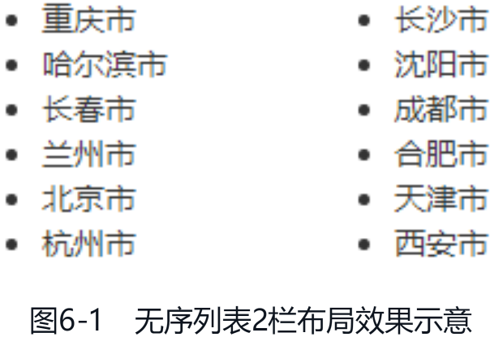

之前，CSS 世界中除受限诸多的表格布局之外是没有专门的布局属性的，随着 Web 应用越来越复杂，显示设备越来越多样，原有的 CSS 特性已经无法满足现代 Web 开发需求了。于是，CSS 定义了很多全新的布局方式，这些新的布局 CSS 使用简单，效果精美，是所有前端开发者必学必会的技能。

# 分栏布局

分栏布局也被称为多列布局、多栏布局，这种布局可以将内容布局到多个列框中，类似报纸上的排版。

分栏布局比较特殊，有别于传统布局，它将子元素在内的所有内容拆分为列，这与打印网页的时候将网页内容分成多个页面的方式类似。分栏布局主要针对图文排版布局，应用在横向排版场景中，文档流是倒 N 方向。有个别布局只能使用分栏布局实现，分栏布局虽然在日常开发中用得不多，但是遇到合适的场景时是一种非常有用的布局方式。

IE10+ 浏览器都可以使用分栏布局，API 稳定，在移动端的兼容性比弹性布局要好，可以放心使用。例如，有一段无序列表，HTML 代码如下：

```html
<ul>
  <li>重庆市</li>
  <li>哈尔滨市</li>
  <li>长春市</li>
  <li>兰州市</li>
  <li>北京市</li>
  <li>杭州市</li>
  <li>长沙市</li>
  <li>沈阳市</li>
  <li>成都市</li>
  <li>合肥市</li>
  <li>天津市</li>
  <li>西安市</li>
</ul>
```

可以看到每一个列表项的内容很少，如果容器的宽度足够，则可以使用 columns 属性实现分栏布局，让排版更舒服，代码超级简单：

```css
ul {
  columns: 2;
}
```

效果如图 6-1 所示。



[column-layout-list](embedded-codesandbox://css-new-world-new-layout/column-layout-list)

相比其他布局方法，分栏布局最大的优点是不会改变元素原本的 display 计算值。例如，在默认状态下，`<li>` 元素会出现项目符号，如圆点或数字序号。此时，如果对 `<li>` 元素使用弹性布局或网格布局，则项目符号就会消失，因为 display: flex 或 display: grid 会重置 `<li>` 元素内置的 display: list-item 声明。

我通过以上内容带大家初步了解了分栏布局的特性和使用方法，接下来，我们开始详细了解与分栏布局相关的 CSS 属性。与分栏布局相关的 CSS 属性共有以下 10 个：

- columns
- column-width
- column-count
- column-rule
- column-rule-color
- column-rule-style
- column-rule-width
- column-span
- column-fill
- column-gap

虽然这 10 个 CSS 属性都有各自的作用，但是在实用程度上却有明显的差异。根据我的开发经验，超过 80% 的分栏布局只需要使用 columns 属性就足够，因此，大家的学习重心可以放在 columns 属性上，column-gap 属性有时候也会用到，所以也可以关注下，至于剩下的属性，大家了解一下基本作用即可。

// TODO CSS 新世界全新的布局方式待完成
