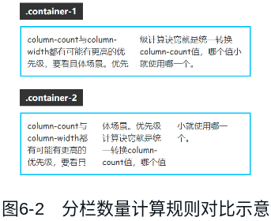

之前，CSS 世界中除受限诸多的表格布局之外是没有专门的布局属性的，随着 Web 应用越来越复杂，显示设备越来越多样，原有的 CSS 特性已经无法满足现代 Web 开发需求了。于是，CSS 定义了很多全新的布局方式，这些新的布局 CSS 使用简单，效果精美，是所有前端开发者必学必会的技能。

# 分栏布局

分栏布局也被称为多列布局、多栏布局，这种布局可以将内容布局到多个列框中，类似报纸上的排版。

分栏布局比较特殊，有别于传统布局，它将子元素在内的所有内容拆分为列，这与打印网页的时候将网页内容分成多个页面的方式类似。分栏布局主要针对图文排版布局，应用在横向排版场景中，文档流是倒 N 方向。有个别布局只能使用分栏布局实现，分栏布局虽然在日常开发中用得不多，但是遇到合适的场景时是一种非常有用的布局方式。

IE10+ 浏览器都可以使用分栏布局，API 稳定，在移动端的兼容性比弹性布局要好，可以放心使用。例如，有一段无序列表，HTML 代码如下：

```html
<ul>
   <li>重庆市</li>
   <li>哈尔滨市</li>
   <li>长春市</li>
   <li>兰州市</li>
   <li>北京市</li>
   <li>杭州市</li>
   <li>长沙市</li>
   <li>沈阳市</li>
   <li>成都市</li>
   <li>合肥市</li>
   <li>天津市</li>
   <li>西安市</li>
</ul>
```

可以看到每一个列表项的内容很少，如果容器的宽度足够，则可以使用 columns 属性实现分栏布局，让排版更舒服，代码超级简单：

```css
ul {
   columns: 2;
}
```

效果如图 6-1 所示。


[column-layout-list](embedded-codesandbox://css-new-world-new-layout/column-layout-list)

相比其他布局方法，分栏布局最大的优点是不会改变元素原本的 display 计算值。例如，在默认状态下，`<li>` 元素会出现项目符号，如圆点或数字序号。此时，如果对 `<li>` 元素使用弹性布局或网格布局，则项目符号就会消失，因为 display: flex 或 display: grid 会重置 `<li>` 元素内置的 display: list-item 声明。

我通过以上内容带大家初步了解了分栏布局的特性和使用方法，接下来，我们开始详细了解与分栏布局相关的 CSS 属性。与分栏布局相关的 CSS 属性共有以下 10 个：

- columns
- column-width
- column-count
- column-rule
- column-rule-color
- column-rule-style
- column-rule-width
- column-span
- column-fill
- column-gap

虽然这 10 个 CSS 属性都有各自的作用，但是在实用程度上却有明显的差异。根据我的开发经验，超过 80% 的分栏布局只需要使用 columns 属性就足够，因此，大家的学习重心可以放在 columns 属性上，column-gap 属性有时候也会用到，所以也可以关注下，至于剩下的属性，大家了解一下基本作用即可。

## 重点关注 columns 属性

columns 属性是 column-width 和 column-count 属性的缩写，举几个使用 columns 属性的例子：

```css
/*栏目宽度*/
columns: 18em;

/*栏目数目*/
columns: auto;
columns: 2;

/*同时定义宽度和数目，顺序任意*/
columns: 2 auto;
columns: auto 2;
columns: auto 12em;
columns: auto auto;
```

### 关于 column-width

column-width 表示每一栏/列的最佳宽度，注意，是“最佳宽度”，实际渲染宽度多半和指定的宽度是有出入的，例如：

```css
.container {
   width: 300px;
   column-width: 200px;
}
```

这里容器宽度为 300px，设定每一栏的宽度是 200px，不足以分栏，此时容器里面的内容会无视 column-width: 200px 声明，并按照容器的 300px 宽度排版。又如：

```css
.container {
   width: 200px;
   column-width: 300px;
}
```

这里容器宽度为 200px，设定的每一栏宽度是 300px，比容器宽度还要宽，此时容器里面的内容会无视 column-width: 300px 声明，并按照容器的 200px 宽度排版。

那么，什么情况下 column-width 设置的宽度值和实际渲染的宽度值一致呢？这个问题的答案可能会出乎大家的意料：几乎不存在分栏布局的栏目宽度就是 column-width 设置的宽度这样的场景。

因为 column-width 和传统的 width 属性不同，column-width 更像是一个期望尺寸，浏览器会根据这个期望尺寸确定分栏数目，一旦分栏数目确定了，column-width 属性的使命也就完成了，接下来根据分栏数目对容器进行的分栏布局就和 column-width 属性没有任何关系了。

没错，column-width 属性在分栏布局中就是一个工具属性。而且 column-width 相比 width 属性在语法上还有很多限制，例如 column-width 不支持百分比值，即下面的语句是不合法的：

```css
/* 不合法 */
column-width: 30%;
```

### 关于 column-count

column-count 表示理想的分栏数目，又出现了很微妙的词——“理想的”，也就是意味着最终的分栏数目可能不受 column-count 属性值的控制。

没错，在分栏布局中，最终分栏的数量是由 column-count 与 column-width 属性共同决定的，不对，不能称为“共同决定”，应该叫作“互相制约”。也就是说，在分栏布局中，最终分栏的数量要么由 column-count 属性决定，要么由 column-width 属性决定，这两个 CSS 属性都可能有更高的决定权，至于哪个 CSS 属性的决定权更高，是要看具体场景的。

决定权优先级的计算诀窍可以用一句话概括：统一转换 column-count 值，哪个值小就使用哪一个。例如，下面的 CSS 代码：

```css
.container-1 {
   width: 360px;
   column-count: 2;
   column-width: 100px;
}

.container-2 {
   width: 360px;
   column-count: 4;
   column-width: 100px;
}
```

其中 .container-1 是 2 栏显示，而 .container-2 是 3 栏显示。效果如图 6-2 所示。



具体解析过程如下。

1. .container-1 元素宽度为 360px，因此 column-width: 100px 换算成 column-count 的值是 3.6，而.container-1 元素已经设定了 column-count: 2，遵循“哪个值小哪个优先级高”的规则，最终 .container-1 元素的内容分成了 2 栏。
2. .container-2 元素设置的是 column-count: 4，比 column-width: 100px 换算成的 column-count 值大，因此，最终 .container-2 元素的内容分成了 3 栏（3.6 栏向下取整）。

[column-count-width-priority](embedded-codesandbox://css-new-world-new-layout/column-count-width-priority)

另外，从图 6-2 所示的 .container-2 的效果可以看出，分栏布局的每一栏的高度并不总是相等的，内容的分割也不总是均匀的，浏览器有一套自己的算法。

## column-gap 和 gap 属性的关系

column-gap 属性表示每一栏之间的空白间隙的大小，可以是长度值，也可以是百分比值，语法示意如下：

```css
/* 关键字属性值 */
column-gap: normal;

/* 长度值 */
column-gap: 3px;
column-gap: 3em;

/* 百分比值 */
column-gap: 3%;
```

column-gap 属性本身没什么好说的，但是 column-gap 属性和 gap 属性之间的关系值得一提。实际上，在分栏布局中，如果不考虑 IE 浏览器，我们可以直接使用 gap 属性设置分栏间隙大小，例如：

```css
.container {
   columns: 2;
   gap: 1rem;
}
```

至于原因，用一句话解释就是：column-gap 是 gap 属性的子属性。

在网格布局规范制定之后的一段时间，CSS 世界中的行与列之间的间隙使用了 gap 属性进行了统一，也就是分栏布局、弹性布局和网格布局的间隙都全部统一使用 gap 属性表示，而 gap 属性实际上是 column-gap 属性和 row-gap 属性的缩写。

## 了解 column-rule、column-span 和 column-fill 属性

本节介绍的 3 个分栏布局属性都有各自独特的作用，平常不太用得到，多出现在对分栏布局效果要求更高的场景中。

### 了解 column-rule 属性

column-rule 属性是 column-rule-width、column-rule-style 和 column-rule-color 这 3 个 CSS 属性的缩写，正如 border 是 border-style、border-width 和 border-color 的缩写一样。

column-rule 属性和 border 属性的语法和规则是一模一样的，只是 column-rule 是设置各个分栏的分隔线样式，border 是设置元素的边框样式。例如：

```css
.container {
   width: 320px;
   border: solid deepskyblue;
   padding: 10px;
   column-count: 2;
   column-rule: dashed deepskyblue;
}
```

效果如图 6-3 所示，2 栏文字内容的中间出现了 3px 宽的虚线分隔线。


[column-rule-attr](embedded-codesandbox://css-new-world-new-layout/column-rule-attr)

### 了解 column-span 属性

column-span 属性有点类似表格布局中的 HTML 属性 colspan，表示某一个内容是否跨多栏显示。这个 CSS 属性是作用在分栏布局的子元素上的。语法如下：

```css
column-span: none;
column-span: all;
```

先讲一下这一语法中的几个关键点。

- none 表示不横跨多栏，默认值。
- all 表示横跨所有垂直列。

我们一起来看一个例子，就知道这个属性是做什么的了，HTML 和 CSS 代码如下：

```html{21}
<div class="container">
   <p>第1段</p>
   <p>第2段</p>
   <p>第3段</p>
   <p class="span-all">第4段</p>
   <p>第5段</p>
</div>
<style>
   .container {
      width: 320px;
      border: solid deepskyblue;
      padding: 10px;
      column-count: 3;
   }

   .container p {
      background: deepskyblue;
   }

   .span-all {
      column-span: all;
      color: white;
   }
</style>
```

结果如图 6-4 所示，对比图中左侧的默认效果，可以看到，设置了 column-span: all 的“第 4 段”文字所在的 `<p>` 元素几乎贯穿了整个容器元素。


[column-span-all](embedded-codesandbox://css-new-world-new-layout/column-span-all)

图 6-4 所示的“第 1 段”内容之所以偏下，是因为第一个 `<p>` 元素默认的 margin-top 无法参与分栏计算。

想要在分栏布局中插入广告，可以使用 column-span: all 声明。

### 了解 column-fill 属性

column-fill 的作用是当内容分栏的时候平衡每一栏填充的内容。语法如下：

```css
column-fill: auto;
column-fill: balance;
column-fill: balance-all;
```

先讲一下这一语法中的几个关键点。

- auto 的作用是按顺序填充每一列，内容只占用它需要的空间。
- balance 是默认值，作用是尽可能在列之间平衡内容。在分隔断开的上下文中，只有最后一个片段是平衡的。例如，有多个 `<p>` 元素，正好最后一个 `<p>` 换行了，那这个 `<p>` 元素的内容前后等分，保持平衡。这会造成最后一栏内容较少的问题。
- balance-all 的作用是尽可能在列之间平衡内容。在分隔断开的上下文中，所有片段都是平衡的。该属性值目前没有任何浏览器支持，可以忽略。

我们测试一下各个属性值的渲染表现，假设代码如下（这里给容器设置了 80px 的高度）

```html
<style>
   .container {
      width: 300px;
      height: 80px;
      border: solid deepskyblue;
      padding: 10px;
      column-count: 2;
   }
</style>
<div class="container" style="column-fil: auto">内容略</div>
<div class="container" style="column-fill: balance">内容略</div>
<div class="container" style="column-fill: balance-all">内容略</div>
```

最后的渲染效果如图 6-5 所示，可以看到容器元素应用 column-fill: auto 声明的时候，里面的文字内容会优先填充第一列，而不是尽可能让两列内容平衡。


[column-fill-attr](embedded-codesandbox://css-new-world-new-layout/column-fill-attr)

经过仔细地对比测试可以发现以下几点。

1. 所有浏览器都能识别 column-fill: auto，但是，需要容器有固定的高度才能准确渲染。如果容器没有设置具体的高度值，则仅在 Firefox 浏览器中有比较符合预期的渲染。因此，在实际开发的时候，column-fill: auto 声明的使用一定要配合容器元素的 height 属性。
2. 所有浏览器都不能识别 column-fill: balance-all，我在 W3C 官方的规范文档 CSS Multi-column layout Module level1 中也没有找到任何的示例，因此，column-fill: balance-all 声明大家可以忽略。

## 分栏布局实现两端对齐布局

分栏布局非常适合实现单行的两端对齐布局效果，例如：

```html
<div class="container">
   <div class="list"></div>
   <div class="list"></div>
   <div class="list"></div>
</div>
<style>
   .container {
      width: 300px;
      border: solid deepskyblue;
      column-count: 3;
      column-gap: 5%;
   }

   .list {
      height: 100px;
      background-color: deeppink;
   }
</style>
```

不需要改变元素的 display 属性，也不需要定位，只需要设置好 column-count 属性的值，然后使用 column-gap 属性设置想要的间隙就好了，这个时候，列表元素就会自动两端对齐，效果如图 6-6 所示。


[column-justify-align](embedded-codesandbox://css-new-world-new-layout/column-justify-align)

// TODO CSS 新世界全新的布局方式待完成
