本章介绍 CSS 渐变、CSS 3D 变换、CSS 过渡和 CSS 动画这 4 部分内容，如果没有专门说明，相关 CSS 属性均是被 IE10+ 浏览器支持的。本章介绍的这些 CSS 属性都非常实用，且细节众多，读者需要反复阅读才能理解。

# CSS 渐变

CSS 渐变是 CSS 世界中第一次真正意义上使用纯 CSS 代码创建的图像。它可以应用在任何需要使用图像的场景，因此非常常用，读者一定要牢记相关语法。如果 CSS 的学习有期末考试的话，那么 CSS 渐变一定是必考内容。我们先从最简单的线性渐变学起。

## 深入了解 linear-gradient() 线性渐变

我们从最简单的表示自上而下、从白色到天蓝色的渐变的语法开始：

```css
linear-gradient(white, skyblue);
```

如果渐变方向是自上而下的，就无须专门指定角度，所以在所有线性渐变语法中，to bottom 一定是多余的，代码如下：

```css
/* to bottom 是多余的 */
linear-gradient(to bottom, white, skyblue);
```

如果是其他渐变方向，则需要专门指定。渐变的方向共有两种表示方法，一种是使用关键字 to 加方位值，另一种是直接使用角度值，示意如下：

```css
/* 使用关键字 to 表示渐变方向 */
linear-gradient(to right, white, skyblue);
linear-gradient(to right bottom, white, skyblue);
/* 使用角度值表示渐变方向 */
linear-gradient(45deg, white, skyblue);
linear-gradient(0.25turn, white, skyblue);
```

日常开发更多使用 `to 方位值` 表示法，一方面是因为语义清晰，容易理解与记忆；另一方面是因为项目中的渐变效果要么是对角渐变，要么就是水平或垂直渐变，更适合使用 `to 方位值` 表示法，这种方法实现的渐变不会受到元素的尺寸限制，适用性更广，也无须专门计算角度。例如，使用 CSS 渐变绘制两条对角线来表示没有数据的时候的占位效果，此时只有使用 `to 方位值` 表示法才能适配任意尺寸，CSS 代码示意如下：

```css
img:not([src]) {
   background-color: #eee;
   background-image: linear-gradient(
         to right bottom,
         transparent calc(50% - 1px),
         #ccc calc(50% - 1px),
         #ccc,
         transparent calc(50% + 1px)
      ), linear-gradient(to top right, transparent calc(50% - 1px), #ccc calc(50% - 1px), #ccc, transparent calc(50% +
                  1px));
}
```

此时，无论元素的尺寸是多少，对角线都有符合预期的表现，如图 5-1 所示。

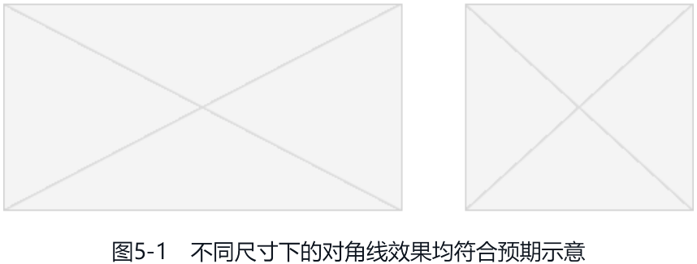

[linear-gradient-diagonal](embedded-codesandbox://css-new-world-stronger-visual-performance/linear-gradient-diagonal)

下面着重讲一讲不少人会比较困惑的角度值表示法。先看代码：

```css
.example {
   width: 300px;
   height: 150px;
   border: solid deepskyblue;
   background-image: linear-gradient(45deg, skyblue, white);
}
```

请问这段代码中的 45deg 表示的渐变起始方向是左上角、右上角、左下角还是右下角呢？正确答案是：45deg 表示的渐变的起始方向是左下角。上面代码对应的效果如图 5-2 所示。

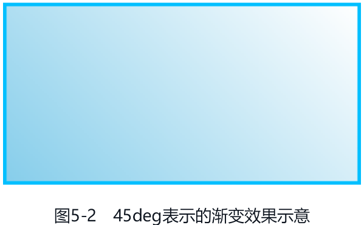

这个问题回答错了不怪大家，因为 CSS 渐变中的角度值表示的方向和常见的各种设计软件中的渐变的角度值表示的方向不一样。

假设有一个圆盘，圆盘有一个中心点，以这个中心点为起点创建一个指针，在各类设计软件（如 Adobe Photoshop 或者 Keynote）中，指针水平向右表示渐变角度是 0 度，逆时针旋转表示角度值递增，因此指针垂直朝上表示 90 度。图 5-3 所示的是 Adobe Photoshop 软件中渐变方位值和角度值之间的关系，可以看到垂直朝上是 90 度，朝右上方是 45 度，朝右下方是 −45 度。

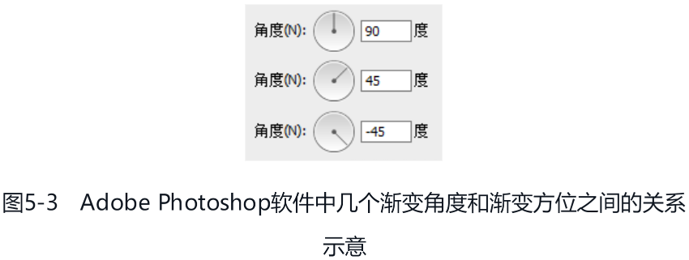

CSS 中有着截然不同的渐变角度和渐变方位关系，规范中对此有专门的描述：

using angles

For the purpose of this argument, “0deg” points upward, andpositive angles represent clockwise rotation, so “90deg” pointtoward the right.（在这个参数中，0deg 表示向上，顺时针旋转是正角度，所以 90deg 表示向右。）

为了便于读者理解，我整理了一个常规渐变和 CSS 渐变角度方位关系对比表，参见表 5-1。

| 角度   | 常规渐变 | css 渐变 |
| :----- | :------- | :------- |
| 0 度   | 向右     | 向上     |
| 正角度 | 逆时针   | 顺时针   |

借助图 5-2 所示的效果，我们可以把 CSS 渐变角度和方位关系标注一下，图 5-4 所示的箭头指向的位置就是 CSS 渐变中 45deg 渐变和 −45deg 渐变角度示意。

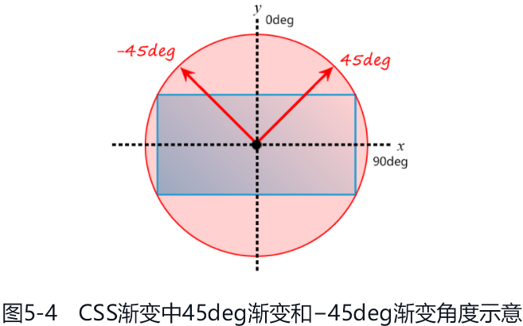

从图 5-4 中可以明显看出，45deg 渐变的方向是自左下方而来、往右上方而去的，图 5-2 所示的渐变角度也就一目了然了。

另外，如果渐变角度是 0deg，不建议简写成 0。例如，linear-gradient(0, skyblue, white) 这样的写法是不推荐的，因为 IE 浏览器和 Edge 浏览器会认为这是不合法的。

### 渐变的起点和终点

明白了 CSS 线性渐变的角度值对应的方位，再弄清楚线性渐变的起点和终点的位置，理解线性渐变渲染表现就不成问题了。下面举例说明。例如，想一下下面的 CSS 渐变中 skyblue 100px 200px 对应的起止位置在哪里：

```css
.example {
   width: 300px;
   height: 150px;
   border: solid deepskyblue;
   background-image: linear-gradient(45deg, white 100px, skyblue 100px 200px, white 200px);
}
```

这个 100px 的起点位置不是从端点开始的，也不是从元素的某一条边开始的，而是沿着渐变角度所在直线的垂直线开始的，该垂直线就是图 5-5 所示的虚线。因此，最终的线性渐变效果如图 5-6 所示。

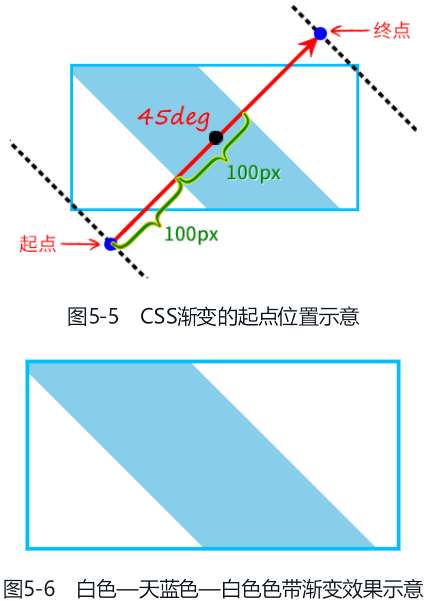

如果渐变断点中出现了百分比值，那么这个百分比值就是相对渐变的起点到终点的这段距离计算的。

### 关于渐变断点

`<color-stop-list>` 数据类型也就是我们常说的渐变断点，包括众多你可能不知道的细节知识，这些细节知识对所有渐变类型均适用。

1. 渐变断点至少有 2 个颜色值，因此下面这种写法是不合法的：

   ```css
   /* 不合法 */
   linear-gradient(white);
   ```

2. 断点语法中的颜色值和位置值的前后顺序是有要求的，位置值必须在颜色值的后面，因此下面这种写法是不合法的：

   ```css
   /* 不合法 */
   linear-gradient(white, 50% skyblue);
   ```

   需要使用下面这种写法才可以：

   ```css
   /* 合法 */
   linear-gradient(white, skyblue 50%);
   ```

3. 没有指定具体断点位置的时候，各个渐变颜色所形成的色块大小是自动等分的。例如：

   ```css
   linear-gradient(red, orange, yellow, green);
   ```

   其中，red、orange、yellow、green 这 4 种颜色形成了 3 个渐变色块，因此等同于下面的写法：

   ```css
   linear-gradient(red 0%, orange 33.33%, yellow 66.66%, green 100%);
   ```

4. 如果起点和终点的颜色与相邻断点的颜色值一样，则起点色值和终点色值是可以省略的。例如 25% ～ 75% 的渐变效果，不少人是这么写的：

   ```css
   linear-gradient(white, white 25%, skyblue 75%, skyblue);
   ```

   其实前后两个色值可以不用写，直接用下面的 CSS 代码即可：

   ```css
   linear-gradient(white 25%, skyblue 75%);
   ```

5. 渐变的断点位置可以是负数，也可以大于 100%。例如：

   ```css
   linear-gradient(white -50%, skyblue, white 110%)
   ```

6. 在同一个渐变中，不同类型的断点位置值是可以同时使用的。例如：

   ```css
   linear-gradient(white 100px, skyblue 50%);
   ```

   此时，如果渐变范围小于 200px，假设是 160px，则白色的位置（100px）反而会比天蓝色的位置（50% × 160px）靠后，不符合渐变逻辑，那么究竟该如何渲染呢？继续往下看。

7. 当存在多个渐变断点的时候，前面的渐变断点设置的位置值有时候比后面的渐变断点设置的位置值要大，这时后面的渐变断点位置值会按照前面的断点位置值计算。例如：

   ```css
   linear-gradient(skyblue 20px, white 0px, skyblue 40px);
   ```

   会按照下面的语法渲染：

   ```css
   linear-gradient(skyblue 20px, white 20px, skyblue 40px);
   ```

8. 渐变断点还支持一次性设置两个位置值。例如：

   ```css
   linear-gradient(white 40%, skyblue 40% 60%, white 50%);
   ```

   表示 40%～ 60% 这个范围内的颜色都是天蓝色。需要注意的是，这个语法是新语法，IE 浏览器和 Edge 浏览器是不支持的，其他现代浏览器也刚支持没多久，因此，建议大家在生产环境中还是使用传统语法：

   ```css
   linear-gradient(white 40%, skyblue 40%, skyblue 60%, white 50%);
   ```

9. 除渐变断点之外，我们还可以设置颜色的转换点位置，例如：

   ```css
   linear-gradient(white, 70%, skyblue);
   ```

   表示白色和天蓝色渐变的中心转换点位置在 70% 这里，上面代码的效果如图 5-7 所示。该方法可以用来模拟更符合真实世界的立体效果。

   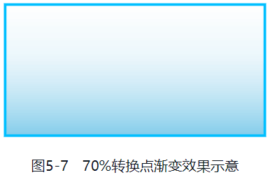

   需要注意的是，IE 浏览器是不支持这个语法的，因此，在生产环境中要谨慎使用。

10. 如果不是高清显示器，则在 Chrome 浏览器中，不同颜色位于同一断点位置的时候，两个颜色连接处可能会有明显的锯齿。例如：

      ```css
      linear-gradient(30deg, red 50%, skyblue 50%);
      ```

      锯齿效果如图 5-8 所示。

      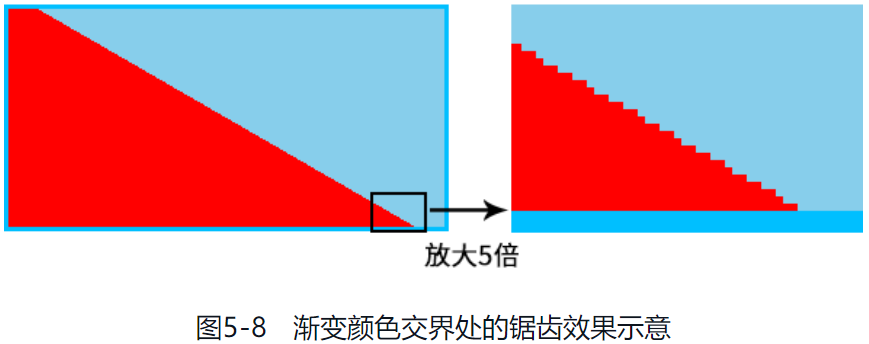

      此时，可以在颜色连接处留 1px 的过渡区间，优化视觉表现：

      ```css
      linear-gradient(30deg, red 50%, skyblue calc(50% + lpx));
      ```

      优化后的效果如图 5-9 所示。

      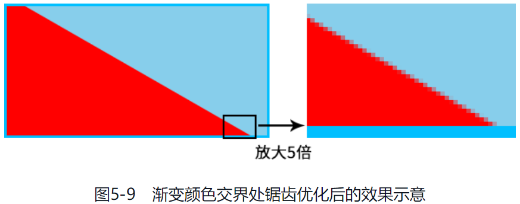

### 渐变与动画

CSS 渐变中虽然有很多数值，例如角度值、断点位置值等，但是很遗憾，CSS 渐变本质上是一个 `<image>` 图像，因此无法使用 transition 属性实现过渡效果，也无法使用 animation 属性实现动画效果。虽然我们无法直接让渐变背景不停地旋转，但是有间接的方法可以实现 CSS 渐变的动画效果，这个在最后有介绍，这里就不展开了。

## 深入了解 radial-gradient() 径向渐变

径向渐变指的是从一个中心点向四周扩散的渐变效果，光的扩散、波的扩散等都有径向渐变的特性。

在 CSS 中，使用 radial-gradient() 函数表示径向渐变，其语法比较复杂，所以我就琢磨如何让大家比较容易地学习径向渐变的语法。最后我决定通过一个接一个的案例带领大家深入径向渐变的语法，因为每个案例都有对应的效果示意，更加直观，自然更加轻松易懂。

学习这些案例还有一个好处，那就是非常实用。因为本节的径向渐变案例覆盖了几乎所有常见的径向渐变应用场景，所以如果大家在项目中需要使用径向渐变，但又记不清径向渐变的语法细节，就可以翻到本节，找个案例套用一下，就可以实现了。

接下来介绍的这些案例，如果没有专门说明，径向渐变效果就都是作为 background-image 的属性值呈现的。

### 最简单的径向渐变语法

先从最简单的径向渐变说起，CSS 代码如下：

```css
.example {
   width: 300px;
   height: 150px;
   background-image: radial-gradient(white, deepskyblue);
}
```

效果如图 5-10 所示，是一个椭圆渐变效果。

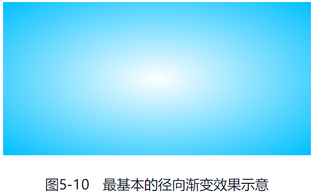

从图 5-10 可以看出，径向渐变的方向是由中心往外部的，默认终止于元素的边框内边缘，如图 5-11 所示。

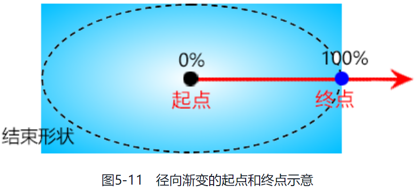

所有径向渐变语法都是围绕改变径向渐变的半径值、中心点坐标，以及渐变颜色的起点和终点位置展开的。

### 设置渐变半径的大小

如果希望图 5-10 所示的径向渐变的水平半径只有 50px，垂直半径还是默认大小，则可以设置 50px 50% 作为第一个参数，渐变代码如下：

```css
radial-gradient(50px 50%, white, deepskyblue);
```

效果如图 5-12 所示。

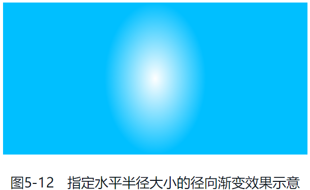

如果希望径向渐变的水平半径和垂直半径都是 50px，则无须设置为 50px 50px，直接设置为 50px，当作圆形径向渐变处理即可，代码如下：

```css
radial-gradient(50px, white, deepskyblue);
```

效果如图 5-13 所示。

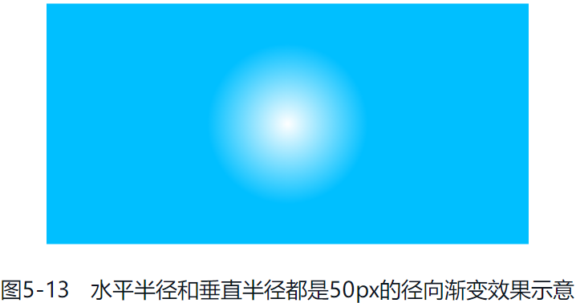

但是要注意，水平半径和垂直半径合写的时候，只能是长度值，不能是百分比值，也就是说下面的语法是不合法的：

```css
/* 不合法 */
radial-gradient(50%, white, deepskyblue);
```

如果想要使用百分比值，就必须给出两个值。例如，下面的语法就是合法的：

```css
/* 合法 */
radial-gradient(50% 50%, white, deepskyblue);
```

### 设置渐变中心点的位置

如果想要改变中心点的位置，我们可以使用 `at <position>` 语法。`<position>` 这个数据类型在 background-position 那里已经详细介绍过了，已经忘记的读者可以翻回去再看看。

例如，如果想让渐变的中心点在左上角，则下面两种写法都是可以的：

```css
radial-gradient(100px at 0 0, white, deepskyblue);
radial-gradient(100px at left top, white, deepskyblue);
```

效果如图 5-14 所示。

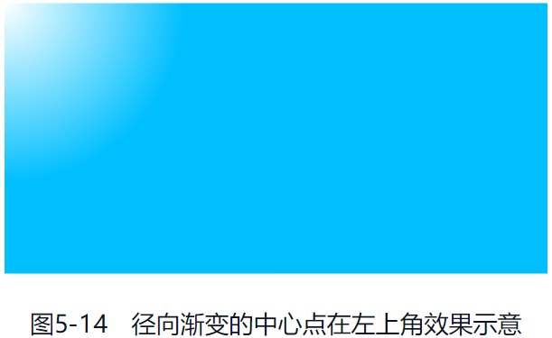

如果想让渐变的中心点在距离右边缘和下边缘 100px 的位置，则可以使用下面的 CSS 代码：

```css
radial-gradient(100px at right 100px bottom 100px, white, deepskyblue);
```

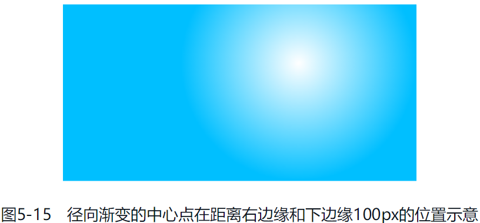

### 设置渐变终止点的位置

如果渐变的中心点不在元素的中心位置，又希望渐变的结束位置在元素的某一侧边缘或某一个边角，那么渐变终止点该怎么设置呢？

CSS 径向渐变语法中提供了专门的数据类型 `<extent-keyword>`，该数据类型包含 4 个关键字，可以指定渐变终止点的位置，如表 5-2 所示。

| 关键字          | 描述                                         |
| :-------------- | :------------------------------------------- |
| closest-side    | 渐变中心距离容器最近的边作为终止位置         |
| closest-corner  | 渐变中心距离容器最近的角作为终止位置         |
| farthest-side   | 渐变中心距离容器最远的边作为终止位置         |
| farthest-corner | 默认值，渐变中心距离容器最远的角作为终止位置 |

各个关键字对应的位置如图 5-16 所示。

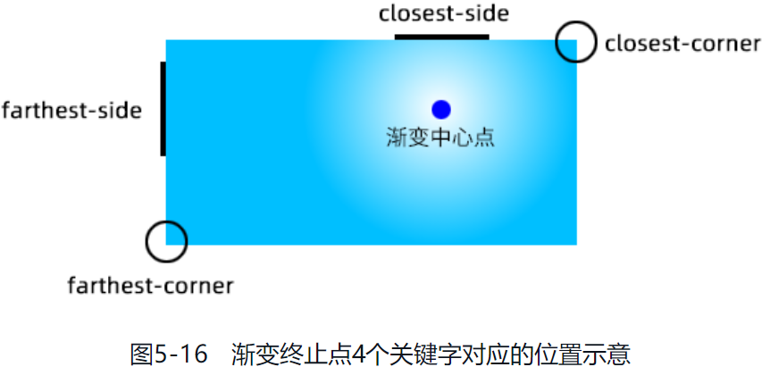

我们试一下，看看使用关键字 farthest-corner 的渲染效果：

```css
radial-gradient(farthest-corner circle at right 100px bottom 100px, white, deepskyblue);
```

效果如图 5-17 所示，可以看到白色到深天蓝色的渐变一直过渡到左下角。


如果图 5-17 看得不是很清晰，我们可以稍微改变下，将渐变转换点位置调整到接近渐变结束点的位置，代码如下：

```css
radial-gradient(farthest-corner circle at right 100px bottom 100px, white, 99%, deepskyblue);
```

此时效果如图 5-18 所示，可以明显看到白色一直延伸到元素左下角位置，表明在这个例子中，farthest-corner 对应的位置就是左下角。

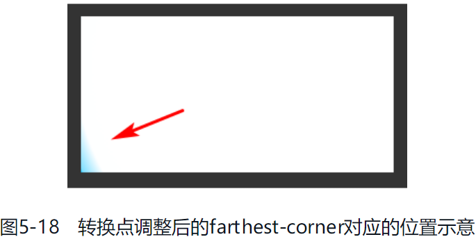

上面的例子中出现了一个关键字 circle，它表示一个圆。与之对应的还有一个关键字 ellipse，它表示椭圆。由于径向渐变的默认形状就是椭圆，因此，没有任何一个场景必须要使用 ellipse 关键字。

circle 关键字必须要出现的场景也不多，多用在需要使用 closest-side、closest-corner、farthest-side 或者 farthest-corner 关键字的场景。

### 径向渐变中的语法细节

上面这些示例已经覆盖了常见的径向渐变的语法，是时候给出径向渐变的正式语法了，再看看是否还有遗漏的细节：

```
radial-gradient(
   [
      [ circle || <length> ] [ at <position> ]?, | [ ellipse || [ <length> | <percentage> ]{2} ] [ at <position> ]?, | [ [circle | ellipse ] || [ extent-keyword ] ] [ at <position> ]?, | at <position>,
   ]?
   <color-stop-list> [ , <color-stop-list> ]+
)
```

下面说明一下具体细节。

1. 从 `[ circle || <length> ]` 可以看出，如果只有 1 个值，或者出现了 circle 关键字，后面的值只能是长度值，不能是百分比值，因此下面的语法是不合法的：

   ```css
   /* 不合法 */
   radial-gradient(circle 50%, white, deepskyblue);
   ```

2. circle 关键字和 ellipse 关键字在与半径值或者 `<extent-keyword>` 一起使用的时候，前后顺序是没有要求的，也就是下面的语法都是合法的：

   ```css
   /* 合法 */
   radial-gradient(50px circle, white, deepskyblue);
   radial-gradient(circle farthest-side, white, deepskyblue);
   ```

   但是 `at <position>` 的位置是固定的，其一定是在半径值的后面、渐变断点的前面，否则语法就不合法。例如下面的语法都是不合法的：

   ```css
   /* 不合法 */
   radial-gradient(circle, white, deepskyblue, at center);
   radial-gradient(at 50%, farthest-side, white, deepskyblue);
   ```

最后，如果能一眼就看出下面这些径向渐变代码的效果都是一样的，说明对径向渐变语法的学习合格了：

```css
radial-gradient(white, deepskyblue);
radial-gradient(ellipse, white, deepskyblue);
radial-gradient(farthest-corner, white, deepskyblue);
radial-gradient(ellipse farthest-corner, white, deepskyblue);
radial-gradient(at center, white, deepskyblue);
radial-gradient(ellipse at center, white, deepskyblue);
radial-gradient(farthest-corner at center, white, deepskyblue);
radial-gradient(ellipse farthest-corner at center, white, deepskyblue);
```

### 径向渐变在实际开发中的应用举例

在实际项目中，径向渐变除了用来实现元素本身的渐变效果，还被用来绘制各类圆形图案。例如，给按钮增加白色高光：

```css
button {
   color: #fff;
   background-color: #2a80eb;
   background-image: radial-gradient(160% 100% at 50% 0%, hsla(0, 0%, 100%, 0.3) 50%, hsla(0, 0%, 100%, 0) 52%);
}
```

效果如图 5-19 所示。


径向渐变也可以让按钮背景呈现多彩的颜色融合效果：

```css
button {
   color: #fff;
   background-color: #2a80eb;
   background-image: radial-gradient(farthest-side at bottom left, rgba(255, 0, 255, 0.5), transparent), radial-gradient(farthest-corner
            at bottom right, rgba(255, 255, 50, 0.5), transparent);
}
```

效果如图 5-20 所示。


径向渐变还可以实现点击按钮的时候，出现一个圆形扩散的效果：

```css
button {
   color: #fff;
   background-color: #2a80eb no-repeat center;
   background-image: radial-gradient(
      closest-side circle,
      rgba(255, 70, 70, 0.9),
      rgba(255, 70, 70, 0.9) 99%,
      rgba(255, 70, 70, 0) 100%
   );
   background-size: 0% 0%;
   transition: background-size 0.2s;
}

button:active {
   background-size: 250% 250%;
}
```

效果如图 5-21 所示，这里为了方便示意，扩散的圆形使用了红色。


[radial-gradient-button](embedded-codesandbox://css-new-world-stronger-visual-performance/radial-gradient-button)

径向渐变还可以用来绘制各种波形效果，例如绘制优惠券边缘的波形效果：

```html
<div class="radial-wave"></div>
<style>
   .radial-wave {
      width: 200px;
      height: 100px;
      background: linear-gradient(to top, transparent 10px, red 10px) no-repeat, radial-gradient(
            20px 15px at left 50% bottom 10px,
            red 10px,
            transparent 11px
         );
      background-size: auto, 20px 10px;
   }
</style>
```

效果如图 5-22 所示。

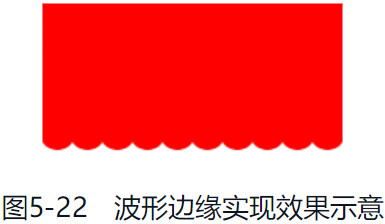

[radial-gradient-wave](embedded-codesandbox://css-new-world-stronger-visual-performance/radial-gradient-wave)

径向渐变可以实现的图形效果非常多，就不一一举例了。总而言之，要想将径向渐变用得出神入化，一定要牢牢掌握其语法。
