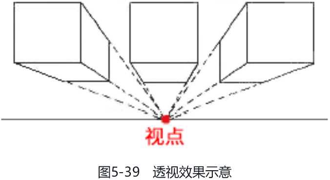
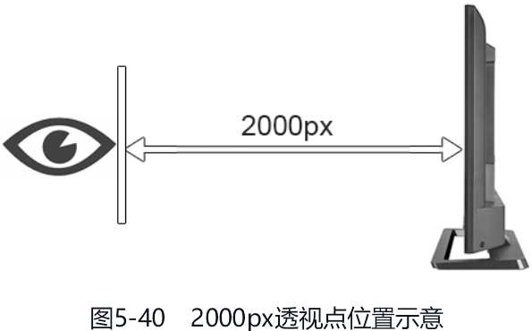

本章介绍 CSS 渐变、CSS 3D 变换、CSS 过渡和 CSS 动画这 4 部分内容，如果没有专门说明，相关 CSS 属性均是被 IE10+ 浏览器支持的。本章介绍的这些 CSS 属性都非常实用，且细节众多，读者需要反复阅读才能理解。

# CSS 渐变

CSS 渐变是 CSS 世界中第一次真正意义上使用纯 CSS 代码创建的图像。它可以应用在任何需要使用图像的场景，因此非常常用，读者一定要牢记相关语法。如果 CSS 的学习有期末考试的话，那么 CSS 渐变一定是必考内容。我们先从最简单的线性渐变学起。

## 深入了解 linear-gradient() 线性渐变

我们从最简单的表示自上而下、从白色到天蓝色的渐变的语法开始：

```css
linear-gradient(white, skyblue);
```

如果渐变方向是自上而下的，就无须专门指定角度，所以在所有线性渐变语法中，to bottom 一定是多余的，代码如下：

```css
/* to bottom 是多余的 */
linear-gradient(to bottom, white, skyblue);
```

如果是其他渐变方向，则需要专门指定。渐变的方向共有两种表示方法，一种是使用关键字 to 加方位值，另一种是直接使用角度值，示意如下：

```css
/* 使用关键字 to 表示渐变方向 */
linear-gradient(to right, white, skyblue);
linear-gradient(to right bottom, white, skyblue);
/* 使用角度值表示渐变方向 */
linear-gradient(45deg, white, skyblue);
linear-gradient(0.25turn, white, skyblue);
```

日常开发更多使用 `to 方位值` 表示法，一方面是因为语义清晰，容易理解与记忆；另一方面是因为项目中的渐变效果要么是对角渐变，要么就是水平或垂直渐变，更适合使用 `to 方位值` 表示法，这种方法实现的渐变不会受到元素的尺寸限制，适用性更广，也无须专门计算角度。例如，使用 CSS 渐变绘制两条对角线来表示没有数据的时候的占位效果，此时只有使用 `to 方位值` 表示法才能适配任意尺寸，CSS 代码示意如下：

```css
img:not([src]) {
   background-color: #eee;
   background-image: linear-gradient(
         to right bottom,
         transparent calc(50% - 1px),
         #ccc calc(50% - 1px),
         #ccc,
         transparent calc(50% + 1px)
      ), linear-gradient(to top right, transparent calc(50% - 1px), #ccc calc(50% - 1px), #ccc, transparent calc(50% +
                  1px));
}
```

此时，无论元素的尺寸是多少，对角线都有符合预期的表现，如图 5-1 所示。


[linear-gradient-diagonal](embedded-codesandbox://css-new-world-stronger-visual-performance/linear-gradient-diagonal)

下面着重讲一讲不少人会比较困惑的角度值表示法。先看代码：

```css
.example {
   width: 300px;
   height: 150px;
   border: solid deepskyblue;
   background-image: linear-gradient(45deg, skyblue, white);
}
```

请问这段代码中的 45deg 表示的渐变起始方向是左上角、右上角、左下角还是右下角呢？正确答案是：45deg 表示的渐变的起始方向是左下角。上面代码对应的效果如图 5-2 所示。


这个问题回答错了不怪大家，因为 CSS 渐变中的角度值表示的方向和常见的各种设计软件中的渐变的角度值表示的方向不一样。

假设有一个圆盘，圆盘有一个中心点，以这个中心点为起点创建一个指针，在各类设计软件（如 Adobe Photoshop 或者 Keynote）中，指针水平向右表示渐变角度是 0 度，逆时针旋转表示角度值递增，因此指针垂直朝上表示 90 度。图 5-3 所示的是 Adobe Photoshop 软件中渐变方位值和角度值之间的关系，可以看到垂直朝上是 90 度，朝右上方是 45 度，朝右下方是 −45 度。


CSS 中有着截然不同的渐变角度和渐变方位关系，规范中对此有专门的描述：

using angles

For the purpose of this argument, “0deg” points upward, andpositive angles represent clockwise rotation, so “90deg” pointtoward the right.（在这个参数中，0deg 表示向上，顺时针旋转是正角度，所以 90deg 表示向右。）

为了便于读者理解，我整理了一个常规渐变和 CSS 渐变角度方位关系对比表，参见表 5-1。

| 角度   | 常规渐变 | css 渐变 |
| :----- | :------- | :------- |
| 0 度   | 向右     | 向上     |
| 正角度 | 逆时针   | 顺时针   |

借助图 5-2 所示的效果，我们可以把 CSS 渐变角度和方位关系标注一下，图 5-4 所示的箭头指向的位置就是 CSS 渐变中 45deg 渐变和 −45deg 渐变角度示意。


从图 5-4 中可以明显看出，45deg 渐变的方向是自左下方而来、往右上方而去的，图 5-2 所示的渐变角度也就一目了然了。

另外，如果渐变角度是 0deg，不建议简写成 0。例如，linear-gradient(0, skyblue, white) 这样的写法是不推荐的，因为 IE 浏览器和 Edge 浏览器会认为这是不合法的。

### 渐变的起点和终点

明白了 CSS 线性渐变的角度值对应的方位，再弄清楚线性渐变的起点和终点的位置，理解线性渐变渲染表现就不成问题了。下面举例说明。例如，想一下下面的 CSS 渐变中 skyblue 100px 200px 对应的起止位置在哪里：

```css
.example {
   width: 300px;
   height: 150px;
   border: solid deepskyblue;
   background-image: linear-gradient(45deg, white 100px, skyblue 100px 200px, white 200px);
}
```

这个 100px 的起点位置不是从端点开始的，也不是从元素的某一条边开始的，而是沿着渐变角度所在直线的垂直线开始的，该垂直线就是图 5-5 所示的虚线。因此，最终的线性渐变效果如图 5-6 所示。


如果渐变断点中出现了百分比值，那么这个百分比值就是相对渐变的起点到终点的这段距离计算的。

### 关于渐变断点

`<color-stop-list>` 数据类型也就是我们常说的渐变断点，包括众多你可能不知道的细节知识，这些细节知识对所有渐变类型均适用。

1. 渐变断点至少有 2 个颜色值，因此下面这种写法是不合法的：

   ```css
   /* 不合法 */
   linear-gradient(white);
   ```

2. 断点语法中的颜色值和位置值的前后顺序是有要求的，位置值必须在颜色值的后面，因此下面这种写法是不合法的：

   ```css
   /* 不合法 */
   linear-gradient(white, 50% skyblue);
   ```

   需要使用下面这种写法才可以：

   ```css
   /* 合法 */
   linear-gradient(white, skyblue 50%);
   ```

3. 没有指定具体断点位置的时候，各个渐变颜色所形成的色块大小是自动等分的。例如：

   ```css
   linear-gradient(red, orange, yellow, green);
   ```

   其中，red、orange、yellow、green 这 4 种颜色形成了 3 个渐变色块，因此等同于下面的写法：

   ```css
   linear-gradient(red 0%, orange 33.33%, yellow 66.66%, green 100%);
   ```

4. 如果起点和终点的颜色与相邻断点的颜色值一样，则起点色值和终点色值是可以省略的。例如 25% ～ 75% 的渐变效果，不少人是这么写的：

   ```css
   linear-gradient(white, white 25%, skyblue 75%, skyblue);
   ```

   其实前后两个色值可以不用写，直接用下面的 CSS 代码即可：

   ```css
   linear-gradient(white 25%, skyblue 75%);
   ```

5. 渐变的断点位置可以是负数，也可以大于 100%。例如：

   ```css
   linear-gradient(white -50%, skyblue, white 110%)
   ```

6. 在同一个渐变中，不同类型的断点位置值是可以同时使用的。例如：

   ```css
   linear-gradient(white 100px, skyblue 50%);
   ```

   此时，如果渐变范围小于 200px，假设是 160px，则白色的位置（100px）反而会比天蓝色的位置（50% × 160px）靠后，不符合渐变逻辑，那么究竟该如何渲染呢？继续往下看。

7. 当存在多个渐变断点的时候，前面的渐变断点设置的位置值有时候比后面的渐变断点设置的位置值要大，这时后面的渐变断点位置值会按照前面的断点位置值计算。例如：

   ```css
   linear-gradient(skyblue 20px, white 0px, skyblue 40px);
   ```

   会按照下面的语法渲染：

   ```css
   linear-gradient(skyblue 20px, white 20px, skyblue 40px);
   ```

8. 渐变断点还支持一次性设置两个位置值。例如：

   ```css
   linear-gradient(white 40%, skyblue 40% 60%, white 50%);
   ```

   表示 40%～ 60% 这个范围内的颜色都是天蓝色。需要注意的是，这个语法是新语法，IE 浏览器和 Edge 浏览器是不支持的，其他现代浏览器也刚支持没多久，因此，建议大家在生产环境中还是使用传统语法：

   ```css
   linear-gradient(white 40%, skyblue 40%, skyblue 60%, white 50%);
   ```

9. 除渐变断点之外，我们还可以设置颜色的转换点位置，例如：

   ```css
   linear-gradient(white, 70%, skyblue);
   ```

   表示白色和天蓝色渐变的中心转换点位置在 70% 这里，上面代码的效果如图 5-7 所示。该方法可以用来模拟更符合真实世界的立体效果。

   

   需要注意的是，IE 浏览器是不支持这个语法的，因此，在生产环境中要谨慎使用。

10. 如果不是高清显示器，则在 Chrome 浏览器中，不同颜色位于同一断点位置的时候，两个颜色连接处可能会有明显的锯齿。例如：

      ```css
      linear-gradient(30deg, red 50%, skyblue 50%);
      ```

      锯齿效果如图 5-8 所示。

      

      此时，可以在颜色连接处留 1px 的过渡区间，优化视觉表现：

      ```css
      linear-gradient(30deg, red 50%, skyblue calc(50% + lpx));
      ```

      优化后的效果如图 5-9 所示。

      

### 渐变与动画

CSS 渐变中虽然有很多数值，例如角度值、断点位置值等，但是很遗憾，CSS 渐变本质上是一个 `<image>` 图像，因此无法使用 transition 属性实现过渡效果，也无法使用 animation 属性实现动画效果。虽然我们无法直接让渐变背景不停地旋转，但是有间接的方法可以实现 CSS 渐变的动画效果，这个在最后有介绍，这里就不展开了。

## 深入了解 radial-gradient() 径向渐变

径向渐变指的是从一个中心点向四周扩散的渐变效果，光的扩散、波的扩散等都有径向渐变的特性。

在 CSS 中，使用 radial-gradient() 函数表示径向渐变，其语法比较复杂，所以我就琢磨如何让大家比较容易地学习径向渐变的语法。最后我决定通过一个接一个的案例带领大家深入径向渐变的语法，因为每个案例都有对应的效果示意，更加直观，自然更加轻松易懂。

学习这些案例还有一个好处，那就是非常实用。因为本节的径向渐变案例覆盖了几乎所有常见的径向渐变应用场景，所以如果大家在项目中需要使用径向渐变，但又记不清径向渐变的语法细节，就可以翻到本节，找个案例套用一下，就可以实现了。

接下来介绍的这些案例，如果没有专门说明，径向渐变效果就都是作为 background-image 的属性值呈现的。

### 最简单的径向渐变语法

先从最简单的径向渐变说起，CSS 代码如下：

```css
.example {
   width: 300px;
   height: 150px;
   background-image: radial-gradient(white, deepskyblue);
}
```

效果如图 5-10 所示，是一个椭圆渐变效果。


从图 5-10 可以看出，径向渐变的方向是由中心往外部的，默认终止于元素的边框内边缘，如图 5-11 所示。


所有径向渐变语法都是围绕改变径向渐变的半径值、中心点坐标，以及渐变颜色的起点和终点位置展开的。

### 设置渐变半径的大小

如果希望图 5-10 所示的径向渐变的水平半径只有 50px，垂直半径还是默认大小，则可以设置 50px 50% 作为第一个参数，渐变代码如下：

```css
radial-gradient(50px 50%, white, deepskyblue);
```

效果如图 5-12 所示。


如果希望径向渐变的水平半径和垂直半径都是 50px，则无须设置为 50px 50px，直接设置为 50px，当作圆形径向渐变处理即可，代码如下：

```css
radial-gradient(50px, white, deepskyblue);
```

效果如图 5-13 所示。


但是要注意，水平半径和垂直半径合写的时候，只能是长度值，不能是百分比值，也就是说下面的语法是不合法的：

```css
/* 不合法 */
radial-gradient(50%, white, deepskyblue);
```

如果想要使用百分比值，就必须给出两个值。例如，下面的语法就是合法的：

```css
/* 合法 */
radial-gradient(50% 50%, white, deepskyblue);
```

### 设置渐变中心点的位置

如果想要改变中心点的位置，我们可以使用 `at <position>` 语法。`<position>` 这个数据类型在 background-position 那里已经详细介绍过了，已经忘记的读者可以翻回去再看看。

例如，如果想让渐变的中心点在左上角，则下面两种写法都是可以的：

```css
radial-gradient(100px at 0 0, white, deepskyblue);
radial-gradient(100px at left top, white, deepskyblue);
```

效果如图 5-14 所示。


如果想让渐变的中心点在距离右边缘和下边缘 100px 的位置，则可以使用下面的 CSS 代码：

```css
radial-gradient(100px at right 100px bottom 100px, white, deepskyblue);
```


### 设置渐变终止点的位置

如果渐变的中心点不在元素的中心位置，又希望渐变的结束位置在元素的某一侧边缘或某一个边角，那么渐变终止点该怎么设置呢？

CSS 径向渐变语法中提供了专门的数据类型 `<extent-keyword>`，该数据类型包含 4 个关键字，可以指定渐变终止点的位置，如表 5-2 所示。

| 关键字          | 描述                                         |
| :-------------- | :------------------------------------------- |
| closest-side    | 渐变中心距离容器最近的边作为终止位置         |
| closest-corner  | 渐变中心距离容器最近的角作为终止位置         |
| farthest-side   | 渐变中心距离容器最远的边作为终止位置         |
| farthest-corner | 默认值，渐变中心距离容器最远的角作为终止位置 |

各个关键字对应的位置如图 5-16 所示。


我们试一下，看看使用关键字 farthest-corner 的渲染效果：

```css
radial-gradient(farthest-corner circle at right 100px bottom 100px, white, deepskyblue);
```

效果如图 5-17 所示，可以看到白色到深天蓝色的渐变一直过渡到左下角。


如果图 5-17 看得不是很清晰，我们可以稍微改变下，将渐变转换点位置调整到接近渐变结束点的位置，代码如下：

```css
radial-gradient(farthest-corner circle at right 100px bottom 100px, white, 99%, deepskyblue);
```

此时效果如图 5-18 所示，可以明显看到白色一直延伸到元素左下角位置，表明在这个例子中，farthest-corner 对应的位置就是左下角。


上面的例子中出现了一个关键字 circle，它表示一个圆。与之对应的还有一个关键字 ellipse，它表示椭圆。由于径向渐变的默认形状就是椭圆，因此，没有任何一个场景必须要使用 ellipse 关键字。

circle 关键字必须要出现的场景也不多，多用在需要使用 closest-side、closest-corner、farthest-side 或者 farthest-corner 关键字的场景。

### 径向渐变中的语法细节

上面这些示例已经覆盖了常见的径向渐变的语法，是时候给出径向渐变的正式语法了，再看看是否还有遗漏的细节：

```
radial-gradient(
   [
      [ circle || <length> ] [ at <position> ]?, | [ ellipse || [ <length> | <percentage> ]{2} ] [ at <position> ]?, | [ [circle | ellipse ] || [ extent-keyword ] ] [ at <position> ]?, | at <position>,
   ]?
   <color-stop-list> [ , <color-stop-list> ]+
)
```

下面说明一下具体细节。

1. 从 `[ circle || <length> ]` 可以看出，如果只有 1 个值，或者出现了 circle 关键字，后面的值只能是长度值，不能是百分比值，因此下面的语法是不合法的：

   ```css
   /* 不合法 */
   radial-gradient(circle 50%, white, deepskyblue);
   ```

2. circle 关键字和 ellipse 关键字在与半径值或者 `<extent-keyword>` 一起使用的时候，前后顺序是没有要求的，也就是下面的语法都是合法的：

   ```css
   /* 合法 */
   radial-gradient(50px circle, white, deepskyblue);
   radial-gradient(circle farthest-side, white, deepskyblue);
   ```

   但是 `at <position>` 的位置是固定的，其一定是在半径值的后面、渐变断点的前面，否则语法就不合法。例如下面的语法都是不合法的：

   ```css
   /* 不合法 */
   radial-gradient(circle, white, deepskyblue, at center);
   radial-gradient(at 50%, farthest-side, white, deepskyblue);
   ```

最后，如果能一眼就看出下面这些径向渐变代码的效果都是一样的，说明对径向渐变语法的学习合格了：

```css
radial-gradient(white, deepskyblue);
radial-gradient(ellipse, white, deepskyblue);
radial-gradient(farthest-corner, white, deepskyblue);
radial-gradient(ellipse farthest-corner, white, deepskyblue);
radial-gradient(at center, white, deepskyblue);
radial-gradient(ellipse at center, white, deepskyblue);
radial-gradient(farthest-corner at center, white, deepskyblue);
radial-gradient(ellipse farthest-corner at center, white, deepskyblue);
```

### 径向渐变在实际开发中的应用举例

在实际项目中，径向渐变除了用来实现元素本身的渐变效果，还被用来绘制各类圆形图案。例如，给按钮增加白色高光：

```css
button {
   color: #fff;
   background-color: #2a80eb;
   background-image: radial-gradient(160% 100% at 50% 0%, hsla(0, 0%, 100%, 0.3) 50%, hsla(0, 0%, 100%, 0) 52%);
}
```

效果如图 5-19 所示。


径向渐变也可以让按钮背景呈现多彩的颜色融合效果：

```css
button {
   color: #fff;
   background-color: #2a80eb;
   background-image: radial-gradient(farthest-side at bottom left, rgba(255, 0, 255, 0.5), transparent), radial-gradient(farthest-corner
            at bottom right, rgba(255, 255, 50, 0.5), transparent);
}
```

效果如图 5-20 所示。


径向渐变还可以实现点击按钮的时候，出现一个圆形扩散的效果：

```css
button {
   color: #fff;
   background-color: #2a80eb no-repeat center;
   background-image: radial-gradient(
      closest-side circle,
      rgba(255, 70, 70, 0.9),
      rgba(255, 70, 70, 0.9) 99%,
      rgba(255, 70, 70, 0) 100%
   );
   background-size: 0% 0%;
   transition: background-size 0.2s;
}

button:active {
   background-size: 250% 250%;
}
```

效果如图 5-21 所示，这里为了方便示意，扩散的圆形使用了红色。


[radial-gradient-button](embedded-codesandbox://css-new-world-stronger-visual-performance/radial-gradient-button)

径向渐变还可以用来绘制各种波形效果，例如绘制优惠券边缘的波形效果：

```html
<div class="radial-wave"></div>
<style>
   .radial-wave {
      width: 200px;
      height: 100px;
      background: linear-gradient(to top, transparent 10px, red 10px) no-repeat, radial-gradient(
            20px 15px at left 50% bottom 10px,
            red 10px,
            transparent 11px
         );
      background-size: auto, 20px 10px;
   }
</style>
```

效果如图 5-22 所示。


[radial-gradient-wave](embedded-codesandbox://css-new-world-stronger-visual-performance/radial-gradient-wave)

径向渐变可以实现的图形效果非常多，就不一一举例了。总而言之，要想将径向渐变用得出神入化，一定要牢牢掌握其语法。

## 了解 conic-gradient() 锥形渐变

锥形渐变是 CSS Images Module Level 4 规范中新定义的一种渐变，也很实用，但其兼容性不太好，IE 浏览器和 Edge 浏览器并不支持，因此只适合在移动端项目和中后台项目中使用。

锥形渐变的语法比径向渐变要简单不少，正式语法如下：

```css
conic-gradient([ from <angle> ]? [ at <position> ]?, <angular-color-stop-list>)
```

可以看出锥形渐变由以下 3 部分组成：

- 起始角度；
- 中心位置；
- 角渐变断点。

其中起始角度和中心位置都是可以省略的，因此，最简单的锥形渐变用法如下：

```css
.example {
   width: 300px;
   height: 150px;
   background-image: conic-gradient(white, deepskyblue);
}
```

效果如图 5-23 所示。


图 5-23 所示的锥形渐变渲染的关键要素如图 5-24 所示。


我们可以改变起始角度和中心位置，让图 5-23 所示的锥形渐变效果发生变化，例如：

```css
conic-gradient(from 45deg at 25% 25%, white, deepskyblue);
```

渐变起始角度改成 45 度，中心点位置移动到了相对元素左上角 25% 的位置，效果如图 5-25 所示。


最后说一下角渐变断点，它的数据类型是 `<angular-color-stop-list>`。角渐变断点与线性渐变和径向渐变的区别在于角渐变断点不支持长度值，支持的是角度值。例如：

```css
conic-gradient(white, deepskyblue 45deg, white)
```

效果如图 5-26 所示，可以明显看到 1 点钟方向的颜色最深。


需要注意的是，角渐变断点中设置的角度值是一个相对角度值，最终渲染的角度值是设置的角度值和起始角度累加的值，例如：

```css
conic-gradient(from 45deg, white, deepskyblue 45deg, white);
```

此时 deepskyblue 实际渲染的坐标角度是 90deg（45deg + 45deg），效果如图 5-27 所示，可以明显看到 3 点钟方向的颜色最深。


由此可见，锥形渐变中颜色断点角度值和百分比值没有什么区别，两者可以互相转换。一个完整的旋转总共 360 度， 45deg 就等同于 12.5%，因此，下面两段 CSS 代码的效果是一模一样的：

```css
/* 下面两段语句效果一样 */
conic-gradient(white, deepskyblue 45deg, white);
conic-gradient(white, deepskyblue 12.5%, white);
```

如果作为渐变转换点，角度值和百分比值也可以互相转换。例如，下面的两条语句都是合法的：

```css
/* 合法 */
conic-gradient(white, 12.5%, deepskyblue);
/* 合法 */
conic-gradient(white, 45deg, deepskyblue);
```

效果如图 5-28 所示。由于把渐变转换点移动到了 12.5% 的位置（原来是在 50% 位置处），因此渐变的后半部分颜色就比较深。


### 锥形渐变的应用举例

用锥形渐变可以非常方便地实现饼状图效果，例如：

```css
.pie {
   width: 150px;
   height: 150px;
   border-radius: 50%;
   background: conic-gradient(yellowgreen 40%, gold 0deg 75%, deepskyblue 0deg);
}
```

效果如图 5-29 所示。


[conic-gradient-pie](embedded-codesandbox://css-new-world-stronger-visual-performance/conic-gradient-pie)

其中，可能有人会以为代码部分的 `gold 0deg 75%` 是什么新语法，其实不是的，这个语法在线性渐变那里介绍过（渐变断点第八个细节点），就是颜色值后面紧跟着的两个值表示颜色范围，另外这里 0deg 换成 0% 也是一样的效果，并非必须使用角度值。

注意，重点来了！理论上，这里设置的数值应该是 40%，或者 144deg，而不是 0deg，那为何这里设置 0deg 效果也是正常的呢？至于原因，同样在线性渐变那里介绍过（渐变断点第七个细节点），后面的渐变断点位置值比前面的渐变断点位置值小的时候，后面的渐变断点的位置值会按照前面较大的渐变断点位置值渲染。于是 `gold 0deg 75%` 这里的 0deg 就会使用 `yellowgreen 40%` 中的 40% 位置值进行渲染，同理，`deepskyblue 0deg` 实际是按照 `deepskyblue 75%` 渲染的。也就是说，如果我们想要 A、B 两种渐变颜色界限分明，只要设置 B 颜色的起始位置值为 0% 就可以了，无须动脑子去计算，这算是一个 CSS 实用小技巧。

图 5-30 所示是使用锥形渐变实现的基于色相和饱和度的取色盘，CSS 代码如下：

```css
.hs-wheel {
   width: 150px;
   height: 150px;
   border-radius: 50%;
   background: radial-gradient(closest-side, gray, transparent), conic-gradient(red, magenta, blue, aqua, lime, yellow, red);
}
```


[conic-gradient-color-disc](embedded-codesandbox://css-new-world-stronger-visual-performance/conic-gradient-color-disc)

之前演示过使用 CSS 多背景实现灰白网格效果（棋盘效果），如果使用锥形渐变来实现，只需要一行 CSS 代码就足够了：

```css
.checkerboard {
   width: 200px;
   height: 160px;
   background: conic-gradient(#eee 25%, white 0deg 50%, #eee 0deg 75%, white 0deg) 0 / 20px 20px;
}
```

效果如图 5-31 所示。


[conic-gradient-grid](embedded-codesandbox://css-new-world-stronger-visual-performance/conic-gradient-grid)

最后一个例子，演示如何借助锥形渐变实现很实用的加载效果，代码如下：

```css
.loading {
   width: 100px;
   height: 100px;
   border-radius: 50%;
   background: conic-gradient(deepskyblue, 30%, white);
   --mask: radial-gradient(closest-side, transparent 75%, black 76%);
   -webkit-mask-image: var(--mask);
   mask-image: var(--mask);
   animation: spin 1s linear infinite reverse;
}

@keyframes spin {
   from {
      transform: rotate(0deg);
   }

   to {
      transform: rotate(360deg);
   }
}
```

效果如图 5-32 所示。


原理很简单，图 5-32 所示的其实就是一个锥形渐变，使用 CSS 遮罩属性只让外圈 25% 的范围显示，于是 loading 的圆环效果就出现了。如果想要小尺寸的 loading 效果，直接修改上述 CSS 代码中的 width 属性值和 height 属性值即可。

[conic-gradient-loading](embedded-codesandbox://css-new-world-stronger-visual-performance/conic-gradient-loading)

本例 CSS 代码中出现了 CSS 自定义属性（指 --mask）、CSS 遮罩属性 mask-image 和 CSS 动画属性 animation，它们都是非常实用的 CSS 属性，均会在本书的后面着重介绍，敬请期待。

## 重复渐变

线性渐变、径向渐变和锥形渐变都有对应的重复渐变函数，就是在各自的函数名前面添加 repeating- 前缀，示意如下：

```css
repeating-linear-gradient(transparent, deepskyblue 40px);
repeating-radial-gradient(transparent, deepskyblue 40px);
repeating-conic-gradient(transparent, deepskyblue 40deg);
```

假设上面的语句是作为 background-image 应用在尺寸为 200px×100px 的元素上的，则最终的效果如图 5-33 所示。


无论是重复线性渐变、重复径向渐变还是重复锥形渐变，其语法和对应的非重复渐变语法是一模一样的，区别在渲染表现上，非重复渐变的起止颜色位置如果是 0% 和 100%，则可以省略，但是对于重复渐变，起止颜色位置需要明确定义。

重复渐变就这么点内容，很多人会觉得重复渐变复杂难懂，这只是因为对基本的渐变特性了解还不够深入而已。

重复渐变非常适合实现条纹效果。例如，使用 border-image 属性和重复线性渐变实现条纹边框效果，代码如下：

```css
.stripe-border {
   width: 150px;
   height: 200px;
   border: 20px solid;
   /* IE 旧语法 */
   border-image: repeating-linear-gradient(135deg, deepskyblue, deepskyblue 6px, white 7px, white 12px) 20;
   /* 新语法 */
   border-image: repeating-linear-gradient(135deg, deepskyblue 0 6px, white 7px 12px) 20;
}
```

效果如图 5-34 所示。


[repeating-gradient-stripe-border](embedded-codesandbox://css-new-world-stronger-visual-performance/repeating-gradient-stripe-border)

# CSS 3D 变换

在所有 3D 成像技术中，最容易学习且最容易上手的技术一定是 CSS 3D 变换技术，即使你不懂 JavaScript 也能实现 3D 效果。因此，不少优秀的设计师能使用 CSS 3D 变换实现很多酷酷的 3D 效果。

## 从常用的 3D 变换函数说起

CSS 位移变换函数包括 translateX()、translateY() 和 translateZ()，其中 translateX() 和 translateY() 属于 2D 变换，translateZ() 属于 3D 变换。此外，CSS 缩放变换函数包括 scaleX()、scaleY() 和 scaleZ()，其中 scaleX() 和 scaleY() 属于 2D 变换，scaleZ() 属于 3D 变换。

于是，就有不少人想当然地认为 CSS 斜切变换函数也包括 skewX()、skewY() 和 skewZ()，其中 skewZ() 属于 3D 函数。这种想法是不正确的，事实上，CSS 斜切变换没有 3D 函数，也就是说 skewZ() 函数是不存在的，自然也不存在 skew3d() 函数，因此下面的写法是不合法的：

```css
/* 不合法 */
transform: skewZ(45deg);
transform: skew3d(0deg, 0deg, 45deg);
```

也有不少人想当然地认为 CSS 旋转变换函数包括 rotateX()、rotateY() 和 rotateZ()，其中 rotateX() 和 rotateY() 属于 2D 变换，rotateZ() 则属于 3D 变换。这种想法也是不正确的，这回倒不是不存在上面 3 种函数，而是 rotateX()、rotateY() 和 rotateZ() 均属于 3D 变换。

加上各种变换的 3D 合法语法，可以得到下面这些属于 3D 变换的 CSS 函数（这些函数不区分大小写）：

```css
translateZ(0);
translate3d(0, 0, 0);
rotateX(0deg)
rotateY(0deg)
rotateZ(0deg);
rotate3d(1, 1, 1, 45deg);
scaleZ(1);
scale3d(1, 1, 1);
matrix3d(
   1, 0, 0, 0,
   0, 1, 0, 0,
   0, 0, 1, 0,
   0, 0, 0, 1
);
```

其中，matrix3d() 函数表示使用 3D 矩阵表示 3D 变换效果，共需要 16 个参数，由于过于复杂且使用概率较小，因此本书不做介绍。rotate3d() 函数的语法比较特别，这里专门讲一下。

在展开介绍 rotate3d() 函数之前，我们有必要先了解一下 CSS 中的 3D 坐标。CSS 中的 3D 坐标如图 5-35 所示，横向为 x 轴，垂直为 y 轴，纵向为 z 轴，箭头所指的方向为偏移正值对应的方向。


下面正式开始介绍 rotate3d() 函数，rotate3d() 函数的语法如下：

```css
rotate3d(x, y, z, angle);
```

其中，参数 x、y、z 分别表示旋转向量的 x 轴、y 轴、z 轴的坐标。参数 angle 表示围绕该旋转向量旋转的角度值，如果为正，则顺时针方向旋转；如果为负，则逆时针方向旋转。有不少人看到“向量”就想起了大学时候被数学支配的恐惧，不过这里 3D 旋转的向量很简单，就是一条以坐标原点为起点，以坐标 (x, y, z) 为终点的直线，所谓 3D 旋转就是元素绕着这条直线旋转而已，例如：

```css
transform: rotate3d(1, 1, 1, 45deg);
```

表示元素绕着坐标 (0, 0, 0) 和坐标 (1, 1, 1) 连成的向量线旋转 45 度，图 5-36 中蓝色箭头所示即向量。


如果此时有一个正面印有数字 1、上下分别印有数字 5 和 6、左右分别印有数字 4 和 3 的立方体应用 rotate3d(1, 1, 1, 45deg)，那么它的 3D 旋转效果如图 5-37 所示。


按照我多年实践的经验，rotate3d() 函数很少会被用到，因为大多数的 3D 效果都是很简单的旋转效果，开发者往往使用更简单的 rotateX()、rotateY() 和 rotateZ() 函数。其中 rotateY() 函数是所有 3D 变换函数中最高频使用的函数之一，因此，本书就以 3D 旋转为切入点，带领大家快速进入 3D 变换的世界。

3D 旋转变换有下面 3 个函数：

- rotateX(angle)；
- rotateY(angle)；
- rotateZ(angle)。

它们分别表示绕着三维坐标的 x 轴、y 轴和 z 轴旋转。其中，rotateX() 函数的表现反映在现实世界中，就如体操运动员的单杠旋转；rotateY() 函数的表现反映在现实世界中，就如旋转木马围绕中心柱旋转；rotateZ() 函数的表现反映在现实世界中，就如正面观察摩天轮的旋转。

使用简单的图形演示以上 3 个旋转函数，就有图 5-38 所示的效果。


## 必不可少的 perspective 属性

perspective 的中文意思是透视、视角。perspective 属性的存在与否决定了你所看到的画面是二维的还是三维的，这不难理解，即没有透视，不成 3D。学美术或者学建筑的读者肯定接触过透视的一些东西。例如，图 5-39 所示的透视效果。



不过，CSS 3D 变换的透视点与图 5-39 所示的有所不同，CSS 3D 变换的透视点在显示器的前方。例如，显示器宽度是 1680px，浏览器中有一个 `` 元素设置了下面的 CSS 代码：

```css
img {
   perspective: 2000px;
}
```

这就意味着这张图片的 3D 视觉效果和本人在距离 1.2 个显示器宽度远的地方（1680×1.2≈2000）所看到的真实效果是一致的，如图 5-40 所示。



## 用 translateZ() 函数寻找透视位置

如果说 rotateX()、rotateY() 和 rotateZ() 可以帮你理解三维坐标，那么 translateZ() 则可以帮你理解透视位置。我们都知道“近大远小”的道理，translateZ() 函数的功能就是控制元素在视觉上的远近距离。例如，如果我们设置容器元素的 perspective 属性值为 201px：

```css
.container {
   perspective: 201px;
}
```

那么就会有以下几种情况。

- 子元素设置的 translateZ() 函数值越小，则子元素的视觉大小越小，因为子元素在视觉上远去，我们眼睛看到的子元素的视觉尺寸就会变小。
- 子元素设置的 translateZ() 函数值越大，该元素的视觉大小也会越大，因为元素在视觉上越近，看上去也就越大。
- 当子元素设置的 translateZ() 函数值非常接近 201 像素，但是不超过 201 像素的时候（如 200 像素），该元素就会撑满整个屏幕（如果父元素没有类似 overflow: hidden 的限制的话）。因为这个时候，子元素正好移到了你的眼睛前面，看起来非常大，所谓“一叶障目，不见泰山”，就是这么回事。
- 当子元素设置的 translateZ() 函数值再变大，即超过 201 像素的时候，就看不见该元素了——这很好理解，我们是看不见眼睛后面的东西的！

[translateZ-perspective](embedded-codesandbox://css-new-world-stronger-visual-performance/translateZ-perspective)

拖动滑杆控制子元素的 translateZ() 函数值，大家会发现当值为 −100 的时候视觉尺寸最小；随着值慢慢变大（例如值为 40 的时候），子元素的视觉尺寸明显变大；等到值继续增加到 200 的时候，会发现子元素充满了整个屏幕；而值是 250 的时候，由于子元素已经在透视点之外，因此是看不见子元素的，子元素如消失一般。整个视觉变化过程如图 5-41 所示。


此时，我们再换一个视角，从侧面观察 translateZ() 函数的作用原理，如图 5-42 所示，可以更清楚地明白为什么 translateZ() 函数值会影响元素的视觉尺寸。


## 指定 perspective 透视点的两种写法

有两种书写形式可以指定元素的透视点，一种设置在舞台元素上，也就是设置在 3D 渲染元素的共同父元素上；第二种是设置在当前 3D 渲染元素上，与 transform 其他变换属性值写在一起，代码示例如下：

```css
.stage {
   perspective: 600px;
}

.box {
   transform: rotateY(45deg);
}
```

第二种：

```css
.stage .box {
   transform: perspective(600px) rotateY(45deg);
}
```

[perspective-two-way-writing](embedded-codesandbox://css-new-world-stronger-visual-performance/perspective-two-way-writing)

看到的效果如图 5-43 所示，其中左侧的是 perspective 属性写法，右侧的是 perspective() 函数写法。


仔细对比图 5-43 左右两侧图形的效果，会发现虽然透视点设置的方法不一样，但是效果貌似是一样的。果真是这样吗？其实不然，图 5-43 左右两侧图形的效果之所以会一样，是因为舞台上只有一个元素，因此，两种书写形式的表现正好一样。如果舞台上有多个元素，那么两种书写形式的表现差异就会立刻显示出来，如图 5-44 所示。


图 5-44 所示的效果其实不难理解。图 5-44 上面一排元素把整个舞台作为透视元素，也就是我们看到的每个子元素都共用同一个透视点，因此每一个子元素的视觉形状都不一样，这个效果比较符合现实世界的 3D 透视效果。例如视线前方有一排人，远处的人只能被看到侧脸，近处的人可以被看到正脸。而图 5-44 下面一排元素中的每个子元素都有一个自己独立的透视点，加上旋转的角度又是一样的，因此每个元素看上去也就一模一样了。

[perspective-two-way-writing-diff](embedded-codesandbox://css-new-world-stronger-visual-performance/perspective-two-way-writing-diff)

## 理解 perspective-origin 属性

perspective-origin 属性很好理解，表示我们的眼睛相对 3D 变换元素的位置，你可以通过改变眼睛的位置来改变元素的 3D 渲染效果，原理如图 5-45 所示。


正式语法如下：

```css
perspective-origin: <position>;
```

一看到 `<position>` 数据类型，就应该赶快回想起 background-position 属性支持哪些值，也就知道了 perspective-origin 属性支持哪些值。例如，下面这些语句都是合法的：

```css
perspective-origin: top left;
perspective-origin: right 20px bottom 40%;
perspective-origin: 50% 50%;
perspective-origin: -200% 200%;
perspective-origin: 20cm 100ch;
```

perspective-origin 属性初始值是 50% 50%，表示默认的透视点是舞台或元素的中心。但是有时候，需要让变换的元素不在舞台的中心，或让透视角度偏上或者偏下，此时就可以通过设置 perspective-origin 属性值实现。

图 5-46 所示的就是一个立方体应用 perspective-origin: 25% 75% 声明后的透视效果图。


## transform-style: preserve-3d 声明的含义

transform-style 支持两个关键字属性值，分别是 preserve-3d 和 flat，语法如下：

```css
transform-style: preserve-3d;
transform-style: flat;
```

先讲一下这一语法中的几个关键点。

- preserve-3d 表示应用 3D 变换的元素位于三维空间中，preserve-3d 属性值的渲染表现更符合真实世界的 3D 表现。
- flat 是默认值，表示应用 3D 变换的元素位于舞台或元素的平面中，其渲染表现类似“二向箔”，把三维空间压缩在舞台元素的二维空间中。

我们通过一个例子直观地了解一下 preserve-3d 和 flat 这两个属性值的区别，HTML 和 CSS 代码如下：

```html
<section class="stage preserve-3d">
   <div class="box"></div>
</section>

<section class="stage">
   <div class="box"></div>
</section>

<style>
   .stage {
      width: 150px;
      height: 150px;
      background-color: rgba(0, 191, 255, 0.75);
      perspective: 600px;
   }

   .box {
      height: 100%;
      opacity: 0.75;
      background-color: darkred;
      transform: rotateY(45deg);
   }

   .preserve-3d {
      transform-style: preserve-3d;
   }
</style>
```

应用了 transform-style: preserve-3d 声明的 3D 变换元素有部分区域藏到了舞台元素的后面，因为此时整个舞台按照真实的三维空间渲染，自然看不到旋转到后面的图形区域，如图 5-47 左侧图形所示。默认情况下，元素无论怎么变换，其 3D 效果都会被渲染在舞台元素所在的二维平面之上，因此没有视觉上的穿透效果，如图 5-47 右侧图形所示。


[transform-style](embedded-codesandbox://css-new-world-stronger-visual-performance/transform-style)

需要注意的是，transform-style 属性需要用在 3D 变换元素的父元素上，也就是舞台元素上才有效果。

## backface-visibility 属性的作用

在 CSS 世界中，一个元素的背面表现为其正面图像的镜像，因此，当我们使用翻转效果使其背面展示在用户面前的时候，显示的是该元素正面图像的镜像。

这一特性和现实中的 3D 效果并不一致，例如我们要实现扑克牌翻转的 3D 效果，很显然，扑克牌的背面一定是花纹，不可能是正面的牌号。因此，当我们对扑克牌进行翻转使其背面展示在用户面前的时候，显示扑克牌的正面镜像显然是不合理的。我们需要隐藏扑克牌元素的背面，至于扑克牌背面花纹的效果，我们可以使用其他元素进行模拟，然后让前后两个元素互相配合来实现 3D 扑克牌翻转效果。这个控制扑克牌的背面不显示的 CSS 属性就是 backface-visibility。

backface-visibility 属性语法如下：

```css
backface-visibility: hidden;
backface-visibility: visible;
```

其中，visible 是默认值，也就是元素翻转时背面是可见的；如果 backface-visibility 的属性值是 hidden，则表示元素翻转时背面是不可见的。

我们通过一个例子直观地了解一下 hidden 和 visible 这两个属性值的区别，HTML 和 CSS 代码如下：

```html
<section class="stage backface-hidden">
   <div class="box"></div>
   <div class="box"></div>
</section>

<section class="stage">
   <div class="box"></div>
   <div class="box"></div>
</section>

<style>
   .stage {
      width: 150px;
      height: 150px;
      border: 1px solid darkgray;
      perspective: 600px;
      transform-style: preserve-3d;
   }

   .box {
      width: inherit;
      height: inherit;
      opacity: 0.75;
      background-color: darkred;
      transform: rotateY(225deg);
   }

   .box:first-child {
      transform: rotateY(-45deg);
      background-color: darkblue;
      position: absolute;
   }

   .backface-hidden .box {
      backface-visibility: hidden;
   }
</style>
```

设置了 backface-visibility: hidden 后，绕 y 轴旋转 225 度后元素被隐藏了，因为 rotateY 值在大于 180 度、小于 360 度的时候，我们看到的就是元素的背面了，如图 5-48 左侧所示；而 backface-visibility 属性值是 visible 的元素绕 y 轴旋转 225 度后依然清晰可见，效果如图 5-48 右侧所示。


[backface-visibility](embedded-codesandbox://css-new-world-stronger-visual-performance/backface-visibility)

## 值得学习的旋转木马案例

这里举一个图片列表旋转木马效果案例，它可以用来替换常见的 2D 轮播效果，如果读者能弄明白这个例子，那么对 CSS 3D 变换的学习就算是合格了。

[3d-marquee](embedded-codesandbox://css-new-world-stronger-visual-performance/3d-marquee)

实现的效果如图 5-49 所示，点击任意图片可以看到图片列表的旋转木马效果。


### 实现原理

这个案例用到的 CSS 属性就是前面提到的几个常用 CSS 属性，包括透视、3D 变换和三维空间设置。

首先，HTML 代码结构如下：

```
舞台
   容器
      图片
      图片
      图片
      ......
```

相关 HTML 代码是：

```html
<div class="stage">
   <div id="container" class="container">
      
      
      
      
      
      
      
      
      
   </div>
</div>
```

对于舞台，需要为其设置视距，例如设置为 800px：

```css
.stage {
   perspective: 800px;
}
```

对于容器，需要为其添加 3D 视图声明：

```css
.container {
   transform-style: preserve-3d;
}
```

然后就是图片元素了，为了方便定位，我们让所有图片应用 position: absolute 声明，共用一个 3D 变换中心点。

显然，图片旋转木马的运动方式需要应用的 3D 变换函数是 rotateY() 函数。因此，图片元素需要设置的 rotateY() 函数值就是 360 度除以图片数量后的计算值，这里有 9 张图片，则每张图片的旋转角度比前一张图片多 40 度（360 / 9 = 40）。如果需要兼容 IE 浏览器，我们可以这样书写：

```css
img:nth-child(1) {
   transform: rotateY(0deg);
}

img:nth-child(2) {
   transform: rotateY(40deg);
}

img:nth-child(3) {
   transform: rotateY(80deg);
}

img:nth-child(4) {
   transform: rotateY(120deg);
}

img:nth-child(5) {
   transform: rotateY(160deg);
}

img:nth-child(6) {
   transform: rotateY(200deg);
}

img:nth-child(7) {
   transform: rotateY(240deg);
}

img:nth-child(8) {
   transform: rotateY(280deg);
}

img:nth-child(9) {
   transform: rotateY(320deg);
}
```

如果无须兼容 IE 浏览器，我们可以使用 CSS 自定义属性实现：

```css
img {
   transform: rotateY(calc(var(--index) * 40deg));
}
```

虽然 9 张图片的方位都不一样，但由于它们共用一个 3D 变换中心点，因此一定会挤成一团，如图 5-50 所示，图片挤成一团的效果显然不是我们需要的，我们需要拉开图片之间的距离。


如何拉开距离呢？其实很简单。我们可以把 9 张图片想象成 9 个人，现在这 9 个人站在一起分别面朝不同的方位，这 9 个人是不是只要每个人向前走 4 ～ 5 步，彼此之间的距离就拉开了？不妨想象一下夜空中礼花绽开的场景。这里的向前走 4 ～ 5 步的行为，就相当于应用 translateZ() 函数的行为，当 translateZ() 函数值为正值的时候，元素会向其面对的方向走去。

现在只剩下一个问题了：要向前走多远呢？这个距离是有计算公式的！这 9 张图片宽度均是 128px，因此就有图 5-51 所示的理想方位效果。


图 5-51 中使用红色标注的 r 就是图片需要设置的 translateZ() 函数的理想值，使用该值可以让所有图片无缝围在一起。

r 的计算比较简单：$ r = 64 / tan(20 ^ \circ) \approx 175.8 $

为了好看，图片左右两边可以留点间距，例如 20px，最终得到需要使用的 translateZ() 函数值为 175.8 + 20 = 195.8。于是，最终图片元素设置的 transform 属性值是：

```css
transform: rotateY(calc(var(--index) * 40deg)) translateZ(195.839px);
```

最后，要让图片旋转起来，只要让容器每次旋转 40 度就可以了，这个可以使用 CSS 动画完成，或者使用 JavaScript 设置也是可以的。理解了旋转木马 3D 效果实现原理，其他 3D 效果基本上就都可以轻松驾驭了。

## 3D 变换与 GPU 加速

3D 变换除了用来实现 3D 效果，还经常被用来开启 GPU 加速，例如实现左位移 100px，下面两种写法都是有效的：

```css
transform: translate(-100px, 0);
transform: translate3d(-100px, 0, 0);
```

但是，使用 translate3d() 函数的变换效果性能要更高，因为使用该函数会开启 GPU 加速。然后问题就来了，很多开发者一看到“性能更好”就激动了，遇到了元素变换效果就使用 3D 变换，甚至实现其他简单的图形表现时也会添加一段无关紧要的 CSS 3D 变换代码，例如：

```css
transform: translateZ(0);
```

这是一个很糟糕的做法，Web 网页是如此简单，2D 变换原本的性能就很高，根本就没有任何必要去开启 GPU 加速，没有遇到任何一个场景非得使用 3D 变换才不卡顿的。要知道，不必要的 GPU 加速会增加内存的使用，这会影响移动设备的电池寿命。因此，我直接就下结论了：单纯的 2D 变换请一定使用 2D 变换函数，没有任何理由需要使用 3D 变换函数，此时让 GPU 加速是一种糟糕的做法。

# CSS 过渡

使用 transition 属性可以实现元素 A 状态到 B 状态的过渡效果，经常使用 :hover 伪类或者 :active 伪类触发。

目前，我们已经无须给 transition 属性增加私有前缀了，无论是什么项目都不需要。IE 浏览器从 IE10 版本开始，就从未支持过 -ms- 私有前缀，完全没有任何需要添加 -ms- 私有前缀的理由。

至于添加 -moz- 和 -webkit- 私有前缀也是很多年以前的事情了，目前已经无须再添加。即使有个别用户使用的是非常古老的浏览器也没有关系，因为 transition 是一个体验增强的 CSS 属性，即使浏览器不支持，也只会导致一些交互效果生硬一点，对页面功能没有任何影响。

transition 是一个常用属性，相信基础的知识大家都比较了解，因此，接下来我只会介绍一些我认为读者可能不知道的关于 transition 属性的知识。

## 你可能不知道的 transition 属性知识

transition 属性是一个缩写属性，它是 transition-duration、transition-delay、transition-property、transition-timing-function 这 4 个 CSS 属性的缩写，每一个 CSS 属性的背后都有大家所不知道的细节。

### transition-duration 属性

transition-duration 属性表示过渡时间，它的值可以是 0，但是不能是负值，其他就没什么好说的……真的是这样吗？请看下面这段 CSS 声明：

```css
transition: 1s 0.5s;
```

很多开发者都知道，第一个时间值 1s 表示过渡时间，第二个时间值表示延时时间（transition-delay），这两个时间值的顺序是固定的，绝对不能调换，否则含义会颠倒过来。久而久之大家容易陷入一个误区，认为 transition 属性如果设置了两个时间值，其顺序必须是固定的，其实不然！有一种场景下 transition 属性的两个时间值的顺序是可以任意调换的。什么场景呢？就是其中一个时间值是负值的时候。例如，下面两句 CSS 声明都是合法的，且含义一模一样：

```css
/* 效果一样 */
transition: 2s -1s;
transition: -1s 2s;
```

原因就在于不起眼的“transition-duration 不能是负值”的特性，所以上面代码中的 −1s 只能是 transition-delay 的属性值，两个值就可以无序排列。

### transition-delay 属性

transition-delay 属性用来指定延时过渡效果执行的时间，单位是 s（秒）或者 ms（毫秒），其值可以是负值，例如：

```css
transition-delay: 200ms;
transition-delay: 2s;
transition-delay: -0.5s;
```

当 transition-delay 属性值为负值的时候，会带来一个很有意思的现象，那就是可以省略部分动画进程，例如：

```css
.example {
   transform: translateX(0);
   transition-duration: 1s;
   transition-delay: -0.5s;
}

.example:hover {
   transform: translateX(100px);
}
```

此时当鼠标经过 .example 元素的时候，元素的 transform 位移位置不是从 0 开始，而是从靠近 50px 的位置开始的，且过渡效果执行的时间不是 1s，而是 0.5s，因为最终过渡执行的时间等于动画过程时间加动画延时时间，也就是 `1s + (−0.5s) = 0.5s`。

transition-delay 属性有一个隐蔽的但却很实在的作用，那就是可以提高用户的交互体验。例如，使用 :hover 伪类实现的浮层是一种很常见的交互效果，传统的效果都是鼠标指针一旦经过元素，浮层立即出现。这其实是有问题的，因为鼠标非常容易误触该交互效果。优秀的交互体验是会增加一定的延时判断的，也就是如果鼠标指针快速经过元素，会被认为是不小心经过，浮层就不会出现。

想要实现这个交互效果，目前只能使用 transition-delay 属性，请看下面这个具体的案例：

```html
<a href class="target">显示图片</a> 
```

当鼠标指针经过“显示图片”这个链接的时候，浮层图片在鼠标指针停留在元素上一定的时间后才会显示，使用的 CSS 代码如下：

```css
.target + img {
   transition-delay: 0.2s;
   visibility: hidden;
}

.target:hover + img {
   visibility: visible;
}
```

此时鼠标指针悬停在 `显示图片` 上 200ms 之后浮层图片才会显示，效果如图 5-52 所示。


[transition-delay](embedded-codesandbox://css-new-world-stronger-visual-performance/transition-delay)

### transition-property 属性

transition-property 属性用来设置应用过渡效果的 CSS 属性，其初始值是 all，表示默认所有 CSS 属性都应用过渡效果。

不知道“初始值是 all”有没有让你意识到什么。我已经记不清有多少次见到过下面的 CSS 代码了：

```css
transition: all 0.2s;
```

上面这段 CSS 代码的语法和功能都没有问题，表示所有 CSS 属性都执行 0.2s 的过渡效果，那问题在哪里呢？问题就在于其中的 all 完全是多余的，直接写成下面的 CSS 代码就可以了：

```css
transition: 0.2s;
```

也就是我们只需要指定过渡时间就可以了。

不过不是所有 CSS 属性都支持过渡效果，例如 display 属性就不支持过渡效果，而且，不支持也就罢了，有时候还会“搞破坏”。例如设置了 transition 过渡效果的元素应用 display: none 时，过渡效果会被瞬间中断，导致 transitionend 事件不会被触发。

因此，如果希望元素有过渡效果，同时可以隐藏，请使用 visibility 属性，visibility 属性在 CSS Transition 过渡效果中很实用，后面会专门对此进行介绍。

transition-property 支持任意 `<custom-ident>` 数据类型值，不需要是合法的 CSS 属性名称，例如下面语句也是合法的：

```css
/* 合法 */
transition-property: 笑脸-©;
```

但是该属性不支持以数字或引号开头的数据类型，关于 `<custom-ident>` 数据类型的深入介绍参见之后章节。

最后，我们可以同时设置多个参与过渡效果的 CSS 属性，使用逗号分隔，例如：

```css
transition-property: color, background-color, opacity, transform;
```

下面讲一下属性值列表的长度不同时的样式计算规则。用一句话概括就是“有缺则补，多之则除”。例如：

```css
div {
   transition-property: opacity, left, top;
   transition-duration: 3s, 5s;
}

div {
   transition-property: opacity, left, top, height;
   transition-duration: 3s, 5s;
}
```

等同于：

```css
div {
   transition-property: opacity, left, top;
   transition-duration: 3s, 5s, 3s;
}

div {
   transition-property: opacity, left, top, height;
   transition-duration: 3s, 5s, 3s, 5s;
}
```

如果 transition-property 的属性值列表长度过短，则其他过渡属性多余的列表值会被忽略。例如：

```css
div {
   transition-property: opacity, left;
   transition-duration: 3s, 5s, 2s, 1s;
}
```

等同于：

```css
div {
   transition-property: opacity, left;
   transition-duration: 3s, 5s;
}
```

子属性支持逗号分隔，自然 transition 缩写属性也支持逗号分隔多个独立的过渡效果设置。例如：

```css
.example {
   transition: opacity 0.2s, transform 0.5s;
}
```

### transition-timing-function 属性

transition-timing-function 属性通过设置过渡时间函数来影响过渡效果的过渡速率，transition-timing-function 属性和 animation-timing-function 支持的属性值类型一致，总共分为三大类。

- 线性运动类型：使用 linear 表示。
- 三次贝塞尔时间函数类型：ease、ease-in、ease-out、ease-in-out 等关键字和 cubic-bezier() 函数。
- 步进时间函数类型：step-start、step-start 等关键字和 steps() 函数。

transition-timing-function 属性平常用得很少，因为默认值 ease 就可以应付几乎所有场景了。

例如我写了 10 多年 CSS 代码，在 CSS Transition 过渡效果中从未使用过线性运动类型和步进时间函数类型（对天发誓一次都没有用过），不过我倒是在 CSS 动画效果中经常用到它们，因此这部分内容会在 5.4 节深入介绍。至于贝塞尔时间函数类型，则偶尔会在 CSS Transition 过渡效果中用到，因此，可以在这里详细介绍一下。

## 了解三次贝塞尔时间函数类型

“贝塞尔”源于著名的法国工程师 Pierre Bézier 的名字，Pierre Bézier 最杰出的贡献是发明了贝塞尔曲线，奠定了计算机矢量图形学的基础，因为有了贝塞尔曲线之后，无论是直线或曲线都能在数学上予以描述。

三次贝塞尔时间函数类型写作 `<cubic-bezier-timing-function>`，其正式语法如下：

```css
<cubic-bezier-timing-function> = ease | ease-in | ease-out | ease-in-out | cubic-bezier(<number>, <number>, <number>, <number>)
```

其中，ease、ease-in、ease-out、ease-in-out 这几个关键字是计算机领域通用的运动函数关键字，其贝塞尔函数值是固定的，在其他图形语言中也是适用的，具体分析如下。

- ease：等同于 cubic-bezier(0.25, 0.1, 0.25, 1.0)，是 transition-timing-function 属性的默认值，表示过渡的时候先加速再减速。该时间函数曲线如图 5-53 所示，横坐标是时间，纵坐标是进程，曲线越陡速率越快，曲线越缓速率越慢。

   

- ease-in：等同于 cubic-bezier(0.42, 0, 1.0, 1.0)，表示过渡速度刚开始慢，然后过渡速度逐渐加快。单词 in 表示进入的意思，非常符合先慢后快，例如剑插入剑鞘，线穿进针里，都是先慢慢瞄准，再快速进入的。该时间函数曲线如图 5-54 所示。

   

- ease-out：等同于 cubic-bezier(0, 0, 0.58, 1.0)，表示过渡刚开始速度快，然后速度逐渐变慢。单词 out 表示移出的意思，非常符合先快后慢，例如拔剑是先快后慢。该时间函数曲线如图 5-55 所示。

   

- ease-in-out：等同于 cubic-bezier(0.42, 0, 0.58, 1.0)，表示过渡刚开始速度慢，然后速度逐渐加快，最后再变慢。该时间函数曲线如图 5-56 所示。ease-in-out 是一个对称曲线，因此非常适合用在钟摆运动中。

   

### cubic-bezier() 函数

贝塞尔曲线种类很多，包括线性贝塞尔曲线、二次方贝塞尔曲线、三次方贝塞尔曲线、四次方贝塞尔曲线、五次方贝塞尔曲线等。cubic-bezier() 函数是三次方贝塞尔曲线函数。所有三次方贝塞尔曲线都是由起点、终点和两个控制点组成，在 SVG 或者 Canvas 中，三次方贝塞尔曲线的所有控制点都是不固定的。但是在 CSS 的 cubic-bezier() 函数中，起点和终点的坐标是固定的，分别是 (0, 0) 和 (1, 1)，因此，cubic-bezier() 函数支持的参数值只有 4 个，代表了两个控制点的坐标，语法如下：

```css
cubic-bezier(x1, y1, x2, y2);
```

其中坐标 (x1, y1) 表示控制点 1 的坐标，坐标 (x2, y2) 表示控制点 2 的坐标。

例如 ease 关键字对应的贝塞尔曲线函数 cubic-bezier(0.25, 0.1, 0.25, 1.0) 的曲线图就是根据 (0.25, 0.1) 和 (0.25, 1.0) 这两个控制点坐标生成的，如图 5-57 所示。

有一个网站（cubic-bezier）专门用来调试 CSS 的贝塞尔曲线函数值，图 5-57 所示的曲线图就是使用这个网站生成的。


在初期的时候，cubic-bezier() 函数值的取值范围是 0 ～ 1，如果超过 1 会被认为是不合法的，不过现在浏览器早已放开了这个限制，因此，我们可以使用 cubic-bezier() 函数实现回弹效果。例如：

```css
.target {
   transition: 1s cubic-bezier(0.16, 0.67, 0.28, 1.46);
}

.target.run {
   transform: translateX(200px);
}
```

.target 元素的运动轨迹如图 5-58 所示，元素会运动到超出 200px 的位置，然后回到 200px 的位置，形成回弹效果。


最后，附上其他一些非 CSS 标准，但也属于常用缓动类型的贝塞尔曲线值，为了方便调用，这里使用了 CSS 自定义属性表示，具体如下：

```css
:root {
   --ease-in-quad: cubic-bezier(0.55, 0.085, 0.68, 0.53);
   --ease-in-cubic: cubic-bezier(0.55, 0.055, 0.675, 0.19);
   --ease-in-quart: cubic-bezier(0.895, 0.03, 0.685, 0.22);
   --ease-in-quint: cubic-bezier(0.755, 0.05, 0.855, 0.06);
   --ease-in-expo: cubic-bezier(0.95, 0.05, 0.795, 0.035);
   --ease-in-circ: cubic-bezier(0.6, 0.04, 0.98, 0.335);
   --ease-out-quad: cubic-bezier(0.25, 0.46, 0.45, 0.94);
   --ease-out-cubic: cubic-bezier(0.215, 0.61, 0.355, 1);
   --ease-out-quart: cubic-bezier(0.165, 0.84, 0.44, 1);
   --ease-out-quint: cubic-bezier(0.23, 1, 0.32, 1);
   --ease-out-expo: cubic-bezier(0.19, 1, 0.22, 1);
   --ease-out-circ: cubic-bezier(0.075, 0.82, 0.165, 1);
   --ease-in-out-quad: cubic-bezier(0.455, 0.03, 0.515, 0.955);
   --ease-in-out-cubic: cubic-bezier(0.645, 0.045, 0.355, 1);
   --ease-in-out-quart: cubic-bezier(0.77, 0, 0.175, 1);
   --ease-in-out-quint: cubic-bezier(0.86, 0, 0.07, 1);
   --ease-in-out-expo: cubic-bezier(1, 0, 0, 1);
   --ease-in-out-circ: cubic-bezier(0.785, 0.135, 0.15, 0.86);
}
```

## transition 与 visibility 属性的应用指南

如果希望元素在出现和隐藏时有淡入淡出或者移入移出效果，则建议使用 visibility 属性对元素进行隐藏与控制。原因很简单，因为 visibility 属性是支持 CSS 过渡效果和 CSS 动画效果的。

这里举一个移动端经常使用的底部 Popup 浮层的案例，实现遮罩层淡入淡出，底部内容移入移出的效果，HTML 代码结构如下：

```html
<div class="popup">
   <div class="content">底部浮层</div>
</div>
```

淡入淡出效果是使用 opacity 属性实现的，但是 opacity: 0 仅仅是在视觉上让浮层元素不可见，浮层元素依然覆盖在页面上，影响正常的交互，因此，需要使用其他方法来真正隐藏浮层元素。由于 display: none 不支持过渡效果，因此只能使用 visibility: hidden 声明来实现，核心 CSS 代码如下：

```css
.popup {
   position: fixed;
   left: 0;
   right: 0;
   bottom: 0;
   top: 0;
   background: rgba(0, 0, 0, 0.5);
   overflow: hidden;
   /* 显隐控制关键 css 代码 */
   opacity: 0;
   visibility: hidden;
   transition: opacity 0.2s, visibility 0.2s;
}

.content {
   /* 底部浮层移入移出控制关键 css 代码 */
   transform: translateY(100%);
   transition: transform 0.2s;
}

/* 通过切换 “active” 类名实现交互效果 */
.popup.active {
   transition-property: opacity;
   opacity: 1;
   visibility: visible;
}

.active > .content {
   transform: translateY(0%);
}
```

淡入淡出和移入移出没什么好讲的，就是属性的变化，这里比较有意思的是 visibility 对元素显隐的控制。根据定义，当过渡时间函数的值在 0 ～ 1 的时候，visibility 的计算值是 visible，也就是显示；如果时间函数大于 1 或者小于 0，则 visibility 属性的计算值由设置的起止点值决定，例如：

```css
.popup {
   visibility: hidden;
   transition: visibility 2s cubic-bezier(0.25, 0.5, 0, -1);
}

.popup.active {
   visibility: visible;
}
```

此时，.popup 元素会出现先显示，再隐藏，再显示的过渡效果。因为 `cubic-bezier(0.25, 0.5, 0, -1)` 时间函数曲线的一部分在时间轴的下方，这段时间内会按照设置的过渡效果的起始状态，也就是 visibility: hidden 渲染，如图 5-59 所示。


由于在实际开发中时间函数的值小于 0 的情况很罕见，因此，我们可以认定 visibility 属性的过渡效果是显示的时候立即显示，隐藏的时候遵循 transition-duration 设置的时间延时隐藏。于是理论上，我们只需要一行 transition 属性代码就可以实现想要的效果，例如：

```css
.popup {
   opacity: 0;
   visibility: hidden;
   /* transition 如下设置即可 */
   transition: opacity 0.2s, visibility 0.2s;
}

.popup.active {
   opacity: 1;
   visibility: visible;
}
```

但是，不知道是浏览器故意为之还是其他什么原因，在过去的 Chrome 浏览器和现在的 Firefox 浏览器中，通过类名增减触发 transition 过渡效果的时候，元素是在 transition-duration 设置的时间结束的时候才突然显示，而通过 :hover 伪类触发的过渡行为则没有此问题。

因此，在实际开发的时候，为了安全考虑，需要在触发结束状态的 CSS 代码那里重置下 transition-property 值，例如：

```css
.popup.active {
   /* visibility 属性不参与过渡效果，因此元素会立即显示 */
   transition-property: opacity;
   opacity: 1;
   visibility: visible;
}
```

点击演示页面中心的按钮即可体验，效果如图 5-60 所示。


[transition-visibility](embedded-codesandbox://css-new-world-stronger-visual-performance/transition-visibility)
