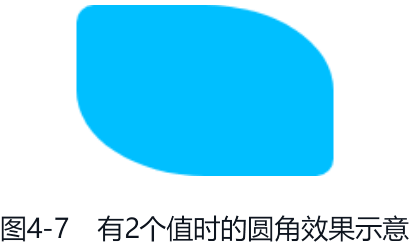
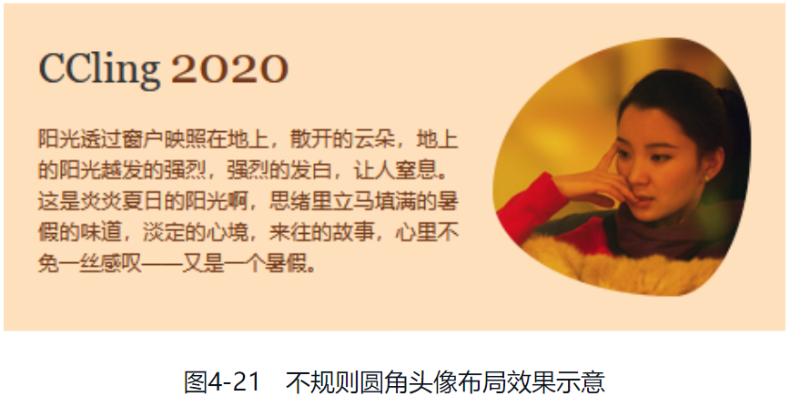

随着显示器的不断升级，人们对 Web 产品的视觉效果的要求也越来越高，如半透明、圆角、阴影等效果。于是，这些细致的样式表现就率先加入了 CSS 新世界中。本章将介绍这些 CSS 新属性的细节知识，并且这些 CSS 属性都非常实用，值得读者反复阅读、深入学习。

# 透明度控制属性 opacity

opacity 属性可以让元素表现为半透明，属性计算值范围是 0 ～ 1，初始值是 1.0，没有继承性。大多数开发者对 opacity 属性的认识就只有这些，实际上 opacity 属性还有很多细节知识。

例如，在所有支持 CSS 过渡和动画的 CSS 属性中，opacity 属性是性能最高的，因此很多动画效果都可以使用 opacity 属性进行性能优化。例如盒阴影动画效果很耗性能，就可以使用伪元素在元素底部创建一个盒阴影，然后使用 opacity 属性控制这个伪元素的显示与隐藏，性能会因此提高很多，具体参见 box-shadow 相关的介绍。

又如，opacity 属性值不为 1 的元素会创建一个层叠上下文，层叠顺序会变高。因此，如果你希望某个 DOM 顺序在前的元素覆盖后面的元素，可以试试设置 opacity: 0.99。

下面讲解一些细节。

## opacity 属性的叠加计算规则

由于 opacity 属性没有继承性，因此父、子元素同时设置半透明时，半透明效果是叠加的。例如：

```css
.father {
   opacity: .5:
}

.son {
   opacity: .5;
}
```

此时，子元素的视觉透明度不是 0.5，而是一个叠加计算的值，即 0.25，没错，就是 0.5×0.5 的计算值。下面这个例子可以证明这一点：

```html
<div class="father opacity1">
   <p class="son"></p>
</div>
<div class="father opacity2">
   <p class="son"></p>
</div>
<style>
   .father {
      width: 120px;
   }

   .son {
      height: 120px;
      background: deepskyblue;
   }

   .opacity1,
   .opacity1 .son {
      opacity: 0.5;
   }

   .opacity2 {
      opacity: 0.25;
   }
</style>
```

两个 `<p>` 元素呈现的色值是一模一样的，如图 4-1 所示，这表明父、子元素同时为半透明时，最终的透明度值就是两者的乘积。

CSS 中半透明颜色和非透明颜色的叠加算法如下：

```js
r = foreground.r * alpha + background.r * (1.0 - alpha);
g = foreground.g * alpha + background.g * (1.0 - alpha);
b = foreground.b * alpha + background.b * (1.0 - alpha);
```

例如，deepskyblue 的 RGB 值是 rgb(0, 191, 255)，白色的 RGB 值是 rgb(255, 255, 255)，因此 25% deepskyblue 色值和白色的混合值就是：

```js
r = 0 * 0.25 + 255 * (1.0 - 0.25) = 191.25 ≈ 191;
g = 191 * 0.25 + 255 * (1.0 - 0.25) = 239;
b = 255 * 0.25 + 255 * (1.0 - 0.25) = 255;
```

于是，最终呈现的颜色就是 rgb(191, 239, 255)，这和图 4-1 所示的色值完全一致，详见图 4-2 所示的取色结果。


## opacity 属性的边界特性与应用

opacity 属性有一个实用的边界特性，即 opacity 属性设置的数值大小如果超出 0 ～ 1 的范围限制，最终的计算值是边界值，如下所示：

```css
.example {
   opacity: -999; /* 解析为 0，完全透明 */
   opacity: -1; /* 解析为 0，完全透明 */
   opacity: 2; /* 解析为 1，完全不透明 */
   opacity: 999; /* 解析为 1，完全不透明 */
}
```

不仅 opacity 属性有边界特性，RGBA 颜色或者 HSLA 颜色中任意一个颜色通道数值都有边界特性，如下所示：

```css
.example {
   color: hsl(0, 0%, -100%); /* 解析为 hsl(0, 0%, 0%)，黑色 */
   color: hsl(0, 0%, 200%); /* 解析为 hsl(0, 0%, 100%)，白色 */
}
```

这种边界特性配合 CSS 变量可以在 CSS 中实现类似于 if...else 的逻辑判断，可以用在元素显隐或者色值变化的场景。

### 自动配色按钮

借助透明度和颜色的边界特性可以实现这样一个效果：如果按钮背景颜色比较浅，则按钮的文字颜色自动变成黑色，同时显示边框；如果按钮的背景颜色比较深，则按钮的文字颜色自动变成白色。CSS 代码如下：

```css
:root {
   /* 定义 RGB 变量 */
   --red: 44;
   --green: 135;
   --blue: 255;
   /**
   * 使用 sRGB Luma 方法计算灰度（可以看成亮度），算法为：
   * lightness = (red * 0.2126 + green * 0.7152 + blue * 0.0722) / 255
   */
   --lightness: calc((var(--red) * 0.2126 + var(--green) * 0.7152 + var(--blue) * 0.0722) / 255);
}

.button {
   /* 固定样式 */
   border: 0.2em solid;
   /* 按钮背景色就是基本背景色 */
   background: rgb(var(--red), var(--green), var(--blue));
   /**
   * --lightness 亮度和 0.5 对比
   * 大于，则正数，和 -999999% 相乘，会得到一个巨大负数，浏览器会按照边界 0% 渲染，也就是亮度为 0，于是颜色是黑色；
   * 小于，则和 -999999% 相乘，会得到一个巨大的正数，以最大合法值 100% 渲染，于是颜色是白色；
   */
   color: hsl(0, 0%, calc((var(--lightness) - 0.5) * -999999%));
   /**
   * 深色颜色加一点浅一点颜色的阴影
   */
   text-shadow: 1px 1px rgba(calc(var(--red) + 50), calc(var(--green) + 50), calc(var(--blue) + 50), calc((
                  var(--lightness) - 0.5
               ) * 9999));
   /**
   * 确定边框透明度。
   * 如果亮度比 0.8 大，在说明按钮背景色比较淡，我们出现一个深色边框；
   * 如果亮度比较小，说明按钮背景色较深，没有必要出现边框。
     此时，计算后为负值，透明度小于 0 的时候，浏览器会按照 0 渲染，因此边框透明。
   */
   /* 设置边框相关样式 */
   border-color: rgba(
      calc(var(--red) - 50),
      calc(var(--green) - 50),
      calc(var(--blue) - 50),
      calc((var(--lightness) - 0.8) * 100)
   );
}
```

此时 .button 按钮的文字颜色、文字阴影和边框颜色都是由 --red、--green、--blue 这 3 个变量决定的，而且前景颜色、背景颜色和边框颜色是自动适配的。

图 4-3 所示的是使用不同的 R、G、B 色值后的按钮效果，可以看到深色背景的按钮的文字颜色是白色（图 4-3 左图）；浅色背景的按钮的文字颜色是黑色，还有浅色的投影（图 4-3 中图）；当背景颜色足够浅的时候，边框也出现了（图 4-3 右图）。


原理其实很简单，有了 R、G、B 色值我们就可以计算出亮度 --lightness。

- 这里 color 属性使用的是 HSL 颜色，L 的值是 0%，即黑色；如果 L 的值是 100%，则是白色。L 色值的计算公式是 `var((--lightness) - 0.5) * -999999%`。如果亮度大于 0.5，则是一个正数和 -999999% 相乘，最后计算结果是一个巨大的负数，这时会按照 L 色值的最小边界 0% 渲染，于是文字颜色就是黑色；如果亮度小于 0.5，则是一个负数和 -999999% 相乘，最后结果就是一个很大的正数，这时会按照 L 色值的最大边界 100% 渲染，于是文字颜色就是白色。
- 我们重点关注 text-shadow 属性的 `(var(--lightness) - 0.5) * 9999` 这个计算。如果亮度大于 0.5，则最终的计算值极大概率大于 1，因此透明度就是 1，文字投影会显示；如果亮度小于 0.5，则最终的计算值一定是负数，此时会按照透明度的边界值 0 来渲染，于是文字投影就不会显示。这就实现了背景颜色亮度比较高时显示更强的文字投影效果。
- border-color 边框颜色的出现和 text-shadow 的出现类似，只不过边框颜色比背景颜色更深。边框颜色是在亮度大于 0.8 的时候显示，这样，按钮在白色页面中也不会显得刺眼。

本案例中使用亮度 0.5 和亮度 0.8 作为判断点，不过这不一定是最佳判断点，在实际开发的时候大家可以根据自己的需求进行调整。

[opacity-color-auto-fit](embedded-codesandbox://css-new-world-detailed-style-performance/opacity-color-auto-fit)

### 静态饼图

这个案例将展示如何利用 opacity 属性的边界特性控制元素的显示与隐藏。图 4-4 所示的就是利用 opacity 属性的边界特性实现的静态饼状图效果。


饼状图的比例通过 CSS 变量 --percent 控制，HTML 代码如下：

```html
<h4>10% 大小</h4>
<div class="pie-simple" style="--percent: 10;">
   <div class="pie-left"></div>
   <div class="pie-right"></div>
</div>
<h4>40% 大小</h4>
<div class="pie-simple" style="--percent: 40;">
   <div class="pie-left"></div>
   <div class="pie-right"></div>
</div>
```

CSS 代码如下：

```css{33, 44}
.pie-simple {
   width: 128px;
   height: 128px;
   background-color: #eee;
   border-radius: 50%;
   overflow: hidden;
}

.pie-left,
.pie-right {
   width: 50%;
   height: 100%;
   float: left;
   position: relative;
   overflow: hidden;
}

.pie-left::before,
.pie-right::before,
.pie-right::after {
   content: '';
   position: absolute;
   width: 100%;
   height: 100%;
   background-color: deepskyblue;
}

.pie-left::before {
   left: 100%;
   transform-origin: left;
   transform: rotate(calc(3.6deg * (var(--percent) - 50)));
   /* 比例小于或等于 50% 的时候左半圆隐藏 */
   opacity: calc(99999 * (var(--percent) - 50));
}

.pie-right::before {
   right: 100%;
   transform-origin: right;
   transform: rotate(calc(3.6deg * var(--percent)));
}

.pie-right::after {
   /* 比例大于 50% 的时候左半圆一直显示 */
   opacity: calc(99999 * (var(--percent) - 50));
}
```

实现原理如下所述。

左右两个矩形区域拼接，且左右两个矩形中都有一个会跟着旋转的半圆，由 .pie-left::before 和 .pie-right::before 这两个 ::before 伪元素创建，我们可以称它们为“左半圆”和“右半圆”。右边的矩形里面还藏了一个不会旋转的撑满整个矩形的半圆，我们可以称它为“右覆盖圆”，由 .pie-right::after 创建。

1. 左半圆和右半圆一直处于旋转状态。
2. 比例不大于 50% 时候，左半圆隐藏，右半圆显示，因此只能看到右半圆旋转。
3. 比例大于 50% 时候，左半圆显示，于是可以看到左半圆旋转，同时右覆盖圆显示，挡住后面的右半圆。此时可以看到右侧完整的静止半圆和左侧旋转的左半圆。

可以看出，我们除了要控制左右半圆的旋转，还需要控制左半圆和右覆盖圆的显隐，这个效果非常巧妙地利用了 opacity 属性的边界特性来实现，关键 CSS 代码见上面代码的高亮行。

假设 --percent 的值是 40，也就是 40% 范围的饼状图，将 40 代入 `99999 * (var(--percent) - 50)` 计算可以得到 -999990 的结果，opacity: -999990 等同于 opacity: 0，也就是饼状图百分比不足 50% 的时候，左半圆和右覆盖圆是隐藏的，只有右半圆在旋转。假设 --percent 的值是 80，可以发现最终的 opacity 计算值远大于 1，此时会按照 opacity: 1 渲染，也就是饼状图百分比大于 50% 的时候，左半圆和右覆盖圆是显示的。于是，我们就实现了一个基于 CSS 变量自动绘制的饼状图效果了。

[opacity-pie](embedded-codesandbox://css-new-world-detailed-style-performance/opacity-pie)

# 深入了解圆角属性 border-radius

border-radius 属性是一个典型的符合“二八原则”的 CSS 属性，也就是说要想深入了解 border-radius 属性，需要花费额外 80% 的学习精力，但是用这一部分精力所学到的知识只能用在 20% 的场景中。

在日常开发中，我们使用 border-radius 属性的场景无非下面两类。

1. 为按钮、输入框等控件，或者为背景色块增加小圆角，例如：

   ```css
   input,
   button {
      border-radius: 4px;
   }
   ```

2. 将用户头像变成圆形：

   ```css
   .user-avatar {
      border-radius: 50%;
   }
   ```

上面两类场景就满足了日常 80% 与圆角相关的开发需求了，那么到此结束了吗？显然没有，如果继续深入了解 border-radius 属性，你会发现 border-radius 属性远没有你想的那么简单，它可以呈现的效果也绝对超出你的预期。

## 了解 border-radius 属性的语法

我们平时使用的 border-radius 属性其实是一种缩写，它是 border-top-left-radius、border-top-right-radius、border-bottom-left-radius 和 border-bottom-right-radius 这 4 个属性的缩写。这 4 个属性的圆角位置如图 4-5 所示。


这 4 个属性很好理解，因为属性名称就暴露了一切，例如 border-top-left-radius 显然就是用来设置左上角圆角大小的。不过，虽然它们好理解，但是不好记忆，一段时间后就会不记得到底是 border-top-left-radius 还是 border-left-top-radius。我是使用这种方法让自己记住的：圆角属性的方位顺序和中文表述是相反的。例如中文我们都是说左上角、右上角，或者左下角、右下角，顺序是先左右再上下，但是，CSS 圆角属性却是先上下再左右，例如 border-top-left-radius 先是 top 再是 left，又如 border-bottom-right-radius 先是 bottom 再是 right。

### 1 ～ 4 个值表示的方位

border-radius 属性支持 1 ～ 4 个值，分别表示不同的角。

1. 如果只有 1 个值，则表示圆角效果作用在全部 4 个角，效果如图 4-6 所示，代码如下：

   ```css
   border-radius: 10px;
   ```

   

2. 如果有 2 个值，则第一个值作用于左上角和右下角，第二个值作用于右上角和左下角，效果如图 4-7 所示，代码如下：

   ```css
   border-radius: 10px 50%;
   ```

   

3. 如果有 3 个值，则第一个值作用于左上角，第二个值作用于右上角和左下角，第三个值作用于右下角，效果如图 4-8 所示，代码如下：

   ```css
   border-radius: 10px 50% 30px;
   ```

   

4. 如果有 4 个值，则 4 个值按照顺时针方向依次作用于左上角、右上角、右下角和左下角，效果如图 4-9 所示。

   ```css
   border-radius: 10px 50% 30px 0;
   ```

   

### 水平半径和垂直半径

还有很多人不知道我们平时使用的圆角值也是一种缩写。例如，下面 CSS 代码中的 10px 就是一种缩写：

```css
border-top-left-radius: 10px;
```

它等同于：

```css
border-top-left-radius: 10px 10px;
```

其中，第一个值表示水平半径，第二个值表示垂直半径。又如：

```css
border-top-left-radius: 30px 60px;
```

表示左上角的圆角是由水平半径（短半轴）为 30px、垂直半径（长半轴）为 60px 的椭圆产生的，效果如图 4-10 所示。


如果是 border-radius 属性，则水平半径和垂直半径不是通过空格进行区分，而是通过斜杠区分。例如：

```css
border-radius: 30px / 60px;
```

表示 4 个角落的圆角的水平半径都是 30px，垂直半径都是 60px，效果如图 4-11 所示。


斜杠前后都支持 1 ～ 4 个长度值。因此，下面的语法都是合法的：

```css
/* 左上 右上+左下 右下 / 左上 右上+左下 右下 */
border-radius: 10px 5px 2em / 20px 25px 30%;
/* 左上+右下 右上+左下 / 左上 右上 右下 左下 */
border-radius: 10px 5% / 20px 25em 30px 35em;
```

现在了解了语法，那这里的水平半径和垂直半径究竟是如何作用才让边角产生圆角效果的呢？这个问题就是接下来要深入探讨的。

## 弄懂圆角效果是如何产生的

虽然我们口头上都称 border-radius 为圆角属性，实际上 border-radius 属性的字面意思不是“圆角”，而是“边界半径”，也就是圆角效果来自以这个半径值绘制的圆或以半轴值绘制的椭圆。例如，图 4-10 所示左上角的圆角效果是由水平半径为 30px、垂直半径为 60px 的椭圆产生的，原理如图 4-12 所示。


如果进一步放大半径值，例如设置垂直半径大小和元素等高，也就是 100% 高度值，如下所示：

```css
border-top-left-radius: 30px 100%;
```

效果和原理此时如图 4-13 所示。


### 重叠曲线的渲染机制

左上角和左下角的垂直半径都是 100%，代码如下：

```css
border-top-left-radius: 30px 100%;
border-bottom-left-radius: 30px 100%;
```

显然，元素的高度并不足以放下两个半轴为 100% 尺寸的椭圆，如果我们对这种场景不加以约束，则曲线一定会发生重叠，而且曲线的交叉点一定不是平滑的，最后得到的绝对不会是我们想看到的效果。

因此，CSS 规范对圆角曲线重叠这一问题做了额外的渲染设定，具体算法如下：设置 $f = min(L_h/S_h, L_v/S_v)$，其中 S 是半径之和，L 是元素宽高，下标 h 和 v 表示方向，f 是计算值，简称“f 计算值”。CSS 圆角曲线的渲染规则很简单，如果 f 计算值小于 1，则所有圆角半径都乘以 f。

回到这里的例子，左上角和左下角的垂直半径都是 100%，水平半径都是 30px，因此 $f = min(L_h/S_h, L_v/S_v) = min(150/60, 100/200) = 0.5$，f 计算值是 0.5，小于 1，所有圆角值都要乘以 0.5，因此：

```css
border-top-left-radius: 30px 100%;
border-bottom-left-radius: 30px 100%;
```

实际上，这等同于：

```css
border-top-left-radius: 15px 50%;
border-bottom-left-radius: 15px 50%;
```

此时会有图 4-14 所示的效果。


明白了重叠曲线的渲染机制，一些常见却不太理解的现象也就明白了。

如果元素的高度和宽度是一样的，例如都是 150px，则下面两段 CSS 声明的效果是一样的：

```css
border-radius: 100%;
border-radius: 150px;
```

但是，如果元素的高度和宽度是不一样的，例如宽度是 150px，高度是 100px，则下面两段 CSS 声明的效果就不一样：

```css
border-radius: 100%;
border-radius: 150px;
```

效果如图 4-15 所示。


为什么会不一样呢？很多人百思不得其解。其实，简单套用一下重叠曲线的算法，一切就豁然开朗了：

- border-radius: 100% 的 f 计算值是 0.5，因此，最终的圆角半径都要乘以 0.5，等同于：

   ```css
   border-radius: 75px / 50px;
   ```

- border-radius: 150px 水平方向的 $L/S$ 的计算值是 0.5，而垂直方向的 $L/S$ 计算值是 100/300，也就是 0.3333，于是 $f = min(0.5, 0.3333) = 0.3333$，也就是所有圆角半径（都是 150px）都要乘以 0.3333，等同于：

   ```css
   border-radius: 50px;
   ```

## border-radius 属性渲染 border 边框的细节

如果元素设置了 border 边框，则圆角半径会被分成内半径和外半径，如图 4-16 所示。


其中直线为外半径，圆心到内部虚线圆的距离为内半径。

1. padding 边缘的圆角大小为设置的 border-radius 大小减去边框的厚度，如果结果为负，则内半径为 0。例如：

   ```css
   .radius {
      width: 100px;
      height: 100px;
      border-top: 40px solid deepskyblue;
      border-left: 40px solid deepskyblue;
      border-radius: 40px 0 0;
   }
   ```

   圆角半径大小和边框的大小均是 40px，此时内半径大小为 0，因此，padding 边缘是直角，没有弧度。最终效果如图 4-17 所示。

   

   此特性在边框颜色透明的场景下依旧适用。另外，当内半径大于 0 的时候边框会和 padding box 重叠，此时文字内容可能会出现在边框之上。

2. 如果相邻两侧边框的厚度不同，则圆角大小将在较厚和较薄边界之间显示平滑过渡。例如：

   ```css
   .radius {
      width: 100px;
      height: 100px;
      border-top: 40px solid deepskyblue;
      border-left: 20px solid deepskyblue;
      border-radius: 40px 0 0 / 60px 0 0;
   }
   ```

   最终效果如图 4-18 所示。可以明显看出在圆角位置处，边框的厚度在 20px ～ 40px 范围内变化的时候是平滑的，是流畅的。

   

   我们可以利用这一特性实现图 4-24 所示的带尾巴的小尖角效果。

3. 圆角边框的连接线和直角边框连接线位置一致，但是角度会有所不同。例如：

   ```css
   .radius {
      width: 100px;
      height: 100px;
      border-top: 40px solid deepskyblue;
      border-left: 20px solid deeppink;
      border-right: 20px solid deeppink;
      border-radius: 40px 0 0 / 60px 0 0;
   }
   ```

   最终效果如图 4-19 所示。

   

下面是其他一些细节。

1. border-radius 不支持负值。
2. 圆角以外的区域不可点击，无法响应 click 事件。
3. border-radius 没有继承性，因此父元素设置了 border-radius，子元素依然是直角效果。我们可以通过给父元素设置 overflow: hidden 让子元素视觉上表现为圆角。
4. border-radius 属性支持 transition 过渡效果，也支持 animation 动画效果，因此在图形表现领域，border-radius 属性会非常给力。
5. border-radius 属性也是可以应用于 display 的计算值为 table、inline-table 或者 table-cell 的元素上的，但是有一个前提，那就是表格元素的 border-collapse 属性值需要是 separate（separate 是 border-collapse 属性的默认值），如果 border-collapse 属性值是 collapse，那么是没有圆角效果的。

## border-radius 属性的高级应用技巧

border-radius 在实际开发中的高级应用主要在两方面，一个是增强原本的圆角效果，另外一个就是绘制各类图形效果。

### border-radius 与不规则圆角头像

我们平时给头像设置的圆角效果都是规则的圆，其实还可以使用百分比值设置不同的水平半径和垂直半径，实现不规则的圆角效果，例如：

```css
.avatar {
   border-radius: 70% 30% 30% 70% / 60% 40% 60% 40%;
}
```

效果如图 4-20 所示。


再配点标题和描述，一个非常有设计感的布局效果就出来了，如图 4-21 所示。



[border-radius-avatar](embedded-codesandbox://css-new-world-detailed-style-performance/border-radius-avatar)

如果是很多个头像，我们还可以利用“蝉原则”（质数）实现随机圆角效果。

一种方法是直接指定圆角大小，IE9+ 浏览器均提供支持，例如：

```css
.avatar {
   border-radius: 87% 91% 98% 100%;
}

.avatar:nth-child(2n + 1) {
   border-radius: 59% 52% 56% 59%;
}

.avatar:nth-child(3n + 2) {
   border-radius: 84% 94% 83% 72%;
}

.avatar:nth-child(5n + 3) {
   border-radius: 73% 100% 82% 100%;
}

.avatar:nth-child(7n + 5) {
   border-radius: 93% 90% 85% 78%;
}

.avatar:nth-child(11n + 7):hover {
   border-radius: 58% 98% 78% 83%;
}
```

另外一种方法是选取圆角动画中的某一帧，这可以借助 animation-delay 负值技术实现，例如：

```css
.avatar {
   border-radius: 50%;
   animation: morph 6s paused linear;
}

@keyframes morph {
   0% {
      border-radius: 40% 60% 60% 40% / 60% 30% 70% 40%;
   }
   100% {
      border-radius: 40% 60%;
   }
}

.avatar:nth-child(2n + 1) {
   animation-delay: -1s;
}

.avatar:nth-child(3n + 2) {
   animation-delay: -2s;
}

.avatar:nth-child(5n + 3) {
   animation-delay: -3s;
}

.avatar:nth-child(7n + 5) {
   animation-delay: -4s;
}

.avatar:nth-child(11n + 7) {
   animation-delay: -5s;
}
```

最终可以实现图 4-22 所示的随机不规则圆角头像效果，支持任意数量的头像。


[border-radius-random-avatar-1](embedded-codesandbox://css-new-world-detailed-style-performance/border-radius-random-avatar-1)

[border-radius-random-avatar-2](embedded-codesandbox://css-new-world-detailed-style-performance/border-radius-random-avatar-2)

### border-radius 图形绘制技巧

一句话，只要是带圆弧的图形效果，border-radius 属性都能绘制出来，前提是对 border-radius 属性有足够深入的了解。想要出神入化地绘制图形，离不开人的创造力，下面先来介绍几个常用的图形效果，其他效果可以在此基础上延伸。

下面两个例子纯属抛砖引玉。

1. 绘制 1/4 圆作为角标，用来显示序号，关键 CSS 代码如下：

   ```css
   border-bottom-right-radius: 100%;
   ```

   效果如图 4-23 所示。

   

2. 例如，border 边框应用 border-radius 属性时，可以使用平滑特性实现带尖角的对话框小尾巴效果：

   ```css
   .corner-tail {
      width: 15px;
      height: 10px;
      border-top: 10px solid deepskyblue;
      border-top-left-radius: 80%;
   }
   ```

   效果如图 4-24 所示。

   

   [border-radius-graphics-drawing](embedded-codesandbox://css-new-world-detailed-style-performance/border-radius-graphics-drawing)
