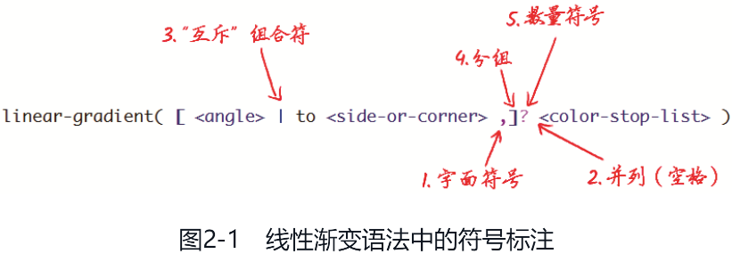
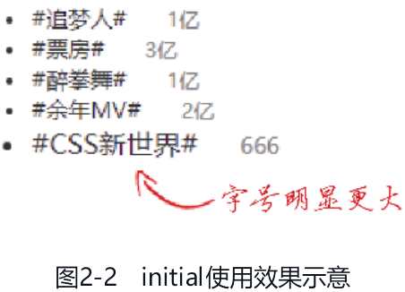
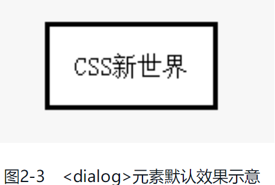
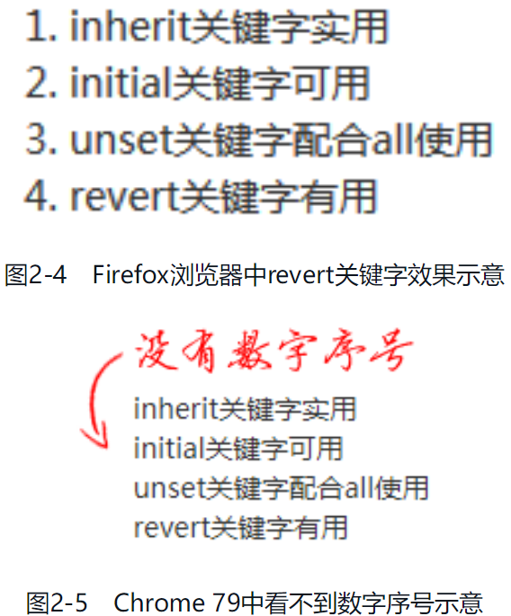
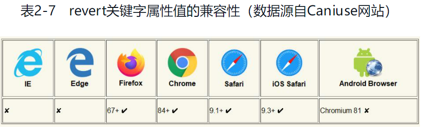

# 概述

## CSS3 出现的历史和背景

CSS2.1 中的 CSS 属性的设计初衷是展示图文。因为在 CSS2.1 时代，互联网刚刚兴起，计算机硬件、网络带宽等基础设施都比较薄弱。例如：

- 屏幕像素低，所以丰富的色彩和细腻的图形细节无法呈现；
- 硬件性能差，所以动画和滤镜渲染效果不佳；
- 网络速度慢，所以高清大图和视频加载不出来。

迫于当时的环境，Web 页面只能显示图文内容，而图文内容的显示并不需要特别复杂的布局。所以，严格来说，CSS2.1 并没有专门的与布局相关的 CSS 属性

而 js 方面由于 Ajax 技术的兴起导致交互、布局越来越复杂，但 css 没有跟着进步，只能尽可能的挖掘 css 的潜力。于是会有很多当初看起来很奇怪的用法，如 float 属性，明明设计这个 CSS 属性的初衷是实现简单的文字环绕效果，结果最后这个 CSS 属性居然成了实现网站布局的中流砥柱。

因此扩展 CSS2.1 的功能势在必行，于是有了后来的 CSS3。很具有代表性的例子就是环境变量函数 env()。这个函数的出现是因为 iPhone X 等设备顶部的“刘海儿”和底部的触摸横条会和页面内容冲突，所以需要 env() 函数给网页设置安全距离。

又比如说 CSS 布局，Multi-column 多栏布局的第一版规范居然是在 1999 年 6 月制定的，比弹性布局早了整整 10 年。我们仅从规范制定的时间就可以推断 Multi-column 多栏布局和 CSS 中的 float 属性一样，它们都是为图文排版布局服务的，因为 1999 年的时候复杂布局还不是强需求，图文内容展示才是主要的用户需求。

根据应用场景的类型将 CSS 新特性划分为下面 4 个方向

- 更复杂、更具弹性的布局的支持，如弹性布局、网格布局等；
- 更丰富的视觉表现的支持，如圆角、盒阴影、动画和渐变等；
- 更多样的浏览设备的支持，如 CSS Media Queries 媒体查询等；
- 开发者 CSS 自定义能力的支持，如 CSS Houdini 等。

下面再说一说 CSS 新特性的另外一个特点，那就是语法更加复杂，但是理解更加简单。在 CSS2.1 的世界中，很多 CSS 属性虽然语法很简单，但是要理解渲染出来的样式表现，可是要花费大功夫的。除盒模型、块级格式化上下文、包含块等 CSS 特有的概念增加了学习成本之外，更重要的是下面两个原因。

1. CSS2.1 中 CSS 属性主要为图文排版服务，而图文排版是有一定难度的，更不用说是在英语框架体系下的排版设计了。这就导致中文开发者无法轻松理解一些样式表现，例如图文元素默认的基线对齐，这个“基线”就是英语中特有的概念。
2. CSS 属性用在了远离设计本意的场景中。例如之前提到的 Float 布局，很多人都不明白为什么容器元素的高度会塌陷，这是因为 CSS 的 float 属性的设计初衷本来就不包括将该属性用在模块布局上。

CSS 新特性则不一样，其语法设计非常明确，布局相关的 CSS 特性就用来布局，视觉表现相关的 CSS 特性就用来实现视觉效果，背后没有其他看不见的 CSS 特性互相干涉。只要记住了语法，就不会出现意料之外的渲染场景。

但是，这并不表示学习 CSS 新特性就很容易，因为简洁明了的语法是牺牲 CSS 属性的数量换来的，也就是理解成本降低了，但是记忆的成本提高了。例如，网格布局中共有 27 个完全不同的 CSS 属性，其中还有网格布局专用的 CSS 函数和单位，想要学透网格布局是要下苦功的。

最后，总结一下，CSS 新特性是跟随时代发展而产生的，旨在构建更加丰富的 Web 应用程序。CSS 新特性分工很细，这带来的好处是让语法理解起来更简单，但是这些 CSS 特性属性种类更复杂，我们需要记住很多 CSS 特性，本书会详细介绍的 CSS 特性就不止 100 个。

## 模块化的 CSS 新世界

CSS 世界已经有了 CSS2 和 CSS3，那会有 CSS4 吗？

答案是：不会有 CSS4！实际上，现在连 CSS3 这个词都已经名存实亡了，因为 CSS3 已经解体了。

为什么说 CSS3 解体了呢？

因为 CSS 按照大版本的方式进行迭代实在是太低效了。低效的原因其实很好理解，如果 CSS 这门语言必须按照大版本迭代发布的话，只要其中一个版本有一个 CSS 特性存在极大的争议，那这个版本的 CSS 的发布时间就会延后。例如，CSS2.1 的规范在 2002 年开始制定，而一直到 2011 年才成为推荐规范，整个过程足足花费了 10 年的时间，就是因为一些次要的 CSS 特性拖了后腿。

在 Web 前端领域，新技术的发展十分迅速，而 CSS 的规范又是基于当前环境制定的。如果 CSS 的规范从开始制定到最终浏览器完全支持需要横跨很多年，保不准这个 CSS 新特性很快就过时了，或者开发者都约定俗成使用其他方案替代实现了，那之前辛苦做的工作就白费了。CSS 这门语言的竞争力和潜力也会因此下降，因为不能快速响应时代变化的语言不是一门好语言。

为了加速没有争议的 CSS 特性的标准化，W3C 的 CSS 工作组做出了一项被称为“Beijing doctrine”的决定，该决定将 CSS 划分为更小的组件，并把这些组件称为模块。这些模块互相独立，各自按照自己的速度走向标准化。例如，CSS 选择器模块已经到了 Level 4 了，弹性布局模块还是 Level 1。

将 CSS 划分为独立的模块是一个非常明智的决定，浏览器厂商可以根据对自己需求的判断决定究竟对哪些模块进行支持，哪怕这个模块还处于草案状态。例如 CSS 的 env() 函数的规范还是草案状态，但是 Chrome 和 Safari 浏览器的厂商却快速响应，对其进行了支持。对开发者而言，如此迅速地支持新特性犹如一场及时雨。

近几年，浏览器陆续支持一个又一个新的 CSS 特性，这已经成为一种常态。得益于 CSS 这种模块化的划分，以及浏览器厂商的积极支持，我们可以非常及时地使用这些 CSS 新特性来让我们的 Web 应用程序变得更丰富多彩，毕竟有很多内部的项目是不需要考虑兼容性问题的。

当然，这种模块化的设计也不是没有弊端，最大的问题就是设计冗余。例如，弹性布局和网格布局中的对齐属性其实可以统一，但它们却是分离的，这就会徒增学习成本；分栏布局、弹性布局和网格布局中的间隙其实可以统一，但它们也都是分离的，各有各的间隙属性。好在纠正及时，现在这三大布局全部开始改用 gap 属性表示间隙，减少了因为模块化带来的设计冗余。

模块化策略带来的好处远远大于弊端，正所谓瑕不掩瑜，与带来的好处相比，模块化设计的弊端几乎可以忽略不计。从这个角度看，CSS2.1 之后的 CSS 世界就是模块化的新世界，所以我称之为 CSS 新世界。这个 CSS 新世界带来了新的 CSS 属性，并让很多 CSS2 中模糊的概念有了明确的定义，如尺寸体系、逻辑属性、CSS 值类型划分等。CSS 新世界中各模块虽然发展独立，但是相互间还是有很多共性和联系的。因此，CSS 新世界不仅是一个模块化的世界，还是一个缤纷多彩，同时又自成一体的严谨的世界。

最后，本书和《CSS 世界》相互补充，《CSS 世界》中讲解的都是 CSS2.1 的知识，本书讲解的都是 CSS2.1 之后的知识，再加上《CSS 选择器世界》，这 3 本书中的内容一起构成 CSS 这门语言的完整面貌。

# 需要提前了解的知识

本章主要介绍 CSS 数据类型、CSS 属性值定义语法和 CSS 全局关键字属性值。这些知识适用于任何 CSS 属性

## 互通互联的 CSS 数据类型

CSS 数据类型定义的是 CSS 属性中具有代表性的值，在规范的语法格式中，使用关键字外加一对尖括号（“<”和“>”）表示，例如数值类型是 `<number>`、色值类型是 `<color>` 等。

掌握 CSS 数据类型对了解 CSS 新世界的体系和快速学习 CSS 新特性非常有帮助。

### 为什么要关注 CSS 数据类型

任何 CSS 属性值一定包含一个或多个数据类型。

在 CSS2 时代，CSS 数据类型的概念并不怎么重要，因为常用的 CSS 属性翻来覆去就那几个，这些 CSS 属性支持的属性值我们反复使用就记住了。但是在 CSS 新世界中，由于各个 CSS 模块独立发展，没有统一的大版本进行约束，因此 CSS 的发展和变化非常快，这导致短时间内大量的 CSS 新属性如雨后春笋般涌现。

如果此时还和过去一样，只是凭借经验去学习 CSS 新特性，那么学习起来肯定是十分困难的，因为效率比较低下。此时 CSS 数据类型的价值就体现出来了，当 CSS 新属性出现的时候，我们无须记忆数量众多的属性值名称，只需要记住支持的数据类型即可，这样学习成本就大大降低了。

举一个例子，background-image 是使用频率非常高的一个 CSS 属性，这个 CSS 属性的语法结构是下面这样的：

```css
background-image: none | <image>;
```

这个语法中出现的 `<image>` 就是一种数据类型，它包括下面这些类型和函数：

- `<url>`；
- `<gradient>`；
- element()；
- image()；
- image-set()；
- cross-fade()。

也就是说，CSS 的 background-image 属性不仅支持 url() 函数和渐变图像，还支持 element()、image()、image-set() 和 cross-fade() 等函数。

通过上面这段描述大家已经知道了 background-image 属性原来支持这么多种类型的属性值，那么请问，CSS 的 mask-image 属性支持的属性值都有哪些呢？

这么突然一问，想必大家一时也想不出准确的答案，毕竟见得少、用得少，这么细节的知识哪能知道呢？没关系，我们看一看 mask-image 属性的语法：

```css
mask-image: none | <image> | <mask-source>;
```

这个语法中出现了 `<image>` 数据类型！这下就豁然开朗了，这个 `<image>` 不就是 background-image 语法中的 `<image>` 吗？没错，两者是一样的。也就是说，mask-image 属性不仅支持 url() 函数和渐变图像，还支持 element()、image()、image-set() 和 cross-fade() 等函数。这样 CSS 的 mask-image 属性的语法就学会了一半，真是高效！

由于 CSS 属性值包含的 CSS 数据类型都是互通互联的，因此，CSS 数据类型只要学习一次，就可以广泛运用，这样要比根据经验记忆几个片面的 CSS 属性值实用多了。

CSS 数据类型除了可以帮助我们快速掌握 CSS 的语法，还能快速更新整个 CSS 世界的知识库。例如上面介绍的 `<image>` 数据类型中，我还故意漏了一个新成员，那就是 paint() 函数，它是 CSS Paint API 带来的新成员，相关规范在 2016 年才开始制定。

如果你是通过记住具体的 CSS 属性值来学习 CSS，那么你应该会知道 background-image 属性支持 paint() 函数，因为几乎所有 CSS Paint API 案例都是用 background-image 属性来举例的：

```css
.example {
   background-image: paint(some-ident);
}
```

不过要是此时问你 mask-image 属性是否支持 paint() 函数，由于你大脑中的记忆库里没有相关信息的储备，因此你会疑惑，会不确定，会想要重新去翻阅资料学习，甚至还会做个演示案例确认一下。

如果你记忆的是 `<image>` 数据类型，再问你 mask-image 属性是否支持 paint() 函数，你肯定会毫不犹豫地回复支持，因为 mask-image 属性值支持 `<image>` 数据类型，而 paint() 函数就属于 `<image>` 数据类型。

不仅是 mask-image 属性，CSS 新世界中还有很多支持 `<image>` 数据类型的 CSS 属性，以及以后会支持 `<image>` 数据类型的 CSS 属性都会同步更新 paint() 函数这个新特性。因此，大家一定要关注 CSS 数据类型，这可以让我们学习 CSS 新特性更迅速，理解 CSS 新特性更轻松。

### 几个常见数据类型的简单介绍

CSS 数据类型非常多，保守估计，至少有 50 个，这里介绍几个常见且值得一提的数据类型。

CSS Shapes 布局中有一个名为 shape-outside 的属性，我们不用关心这个 CSS 属性的含义，只看这个 CSS 属性的语法：

```css
shape-outside: none | <shape-box> || <basic-shape> | <image>;
```

这里出现了 3 种不同的数据类型，下面分别介绍一下。

1. `<shape-box>` 支持的属性值如下：

   - `<box>`；
   - margin-box。

   在 CSS 世界中，需要用到 margin-box 的属性并不多，shape-outside 属性就是一个特例。虽然 `<shape-box>` 数据类型并不常用，但是 `<box>` 数据类型却很常见，`<box>` 数据类型包括下面这些属性值：

   - content-box；
   - padding-box；
   - border-box。

   background-origin 和 background-clip 等 CSS 属性的属性值就是 `<box>` 数据类型。

2. `<basic-shape>` 支持的属性值如下：

   - inset()；
   - circle()；
   - ellipse()；
   - polygon()；
   - path()。

   clip-path 和 offset-path 等 CSS 属性的属性值属于 `<basic-shape>`数据类型。

3. `<image>` 支持的属性值如下：

   - `<url>`；
   - `<gradient>`；
   - element()；
   - image()；
   - image-set()；
   - cross-fade()；
   - paint()。

   上述属性值中 `<url>` 也是一种数据类型，用于表示使用 url() 函数调用的图像资源；`<gradient>` 也是一种数据类型，用于表示渐变图像。

   background-image 和 mask-image 等 CSS 属性的属性值属于 `<image>` 数据类型。

从上面的介绍可以看出，CSS 的 shape-outside 支持的属性值非常庞杂，不过只要牢记这 3 个数据类型，就可以轻松记住很多属性值，至于其中的每一个属性值究竟有什么含义，在这里不展开讲解，之后会有详细的阐述。

```css
color: <color>;
```

这里的 `<color>` 数据类型支持的属性值如下：

- `<rgb()>`；
- `<rgba()>`；
- `<hsl()>`；
- `<hsla()>`；
- `<hex-color>`；
- `<named-color>`；
- currentColor；
- `<deprecated-system-color>`。

最后一个属性值 `<deprecated-system-color>` 指废弃的系统颜色，这在《CSS 世界》有专门的介绍，本书不再赘述，其他属性值在对应章节都会有详细的讲解。

以上就是我要简单介绍的几个常见且值得一提的数据类型。至于其他数据类型，要么比较简单，例如 `<number>`、`<percent>` 等数据类型，指数值和百分比值；要么比较生僻且唯一，例如 `<quote>` 数据类型，指 content 属性中表示各类引号的关键字值，如 open-quote 和 close-quote 等。

本书不会逐个展开介绍 CSS 数据类型，想要了解更完整的 CSS 数据类型，可以参考的一篇文章 [CSS 值类型文档大全](https://www.zhangxinxu.com/wordpress/2019/11/css-value-type/)。

## 学会看懂 CSS 属性值定义语法

CSS 属性值有专门的定义语法，用来表示 CSS 属性值的合法组成。例如，线性渐变的语法为：

```css
linear-gradinent([<angle> | to <side-or-corner>,]?<color-stop-list>)
```

### 学习 CSS 属性值定义语法的好处

在开始介绍具体的语法规则之前，我想先说说我们为什么要学会看懂 CSS 属性值定义语法（CSS value definition syntax）。就拿线性渐变的语法举例，根据我的观察，几乎无一例外，CSS 开发者会写出类似下面这样的 CSS 线性渐变代码：

```css
background: linear-gradient(to bottom, deepskyblue, deeppink);
```

上面这句 CSS 声明有问题吗？从语法和功能上讲是没有任何问题的，线性渐变可以正常渲染，但是在写法上却有瑕疵，`to bottom,` 这几个字符是多余的。我们直接使用下面这样的书写方式就可以了：

```css
background: linear-gradient(deepskyblue, deeppink);
```

如果你看得懂 CSS 的语法，那么在学习 CSS 的时候，只要稍微看一看线性渐变的语法，就能很轻松地知道 `线性渐变的方向设置是可以省略的` 这样一个细节知识，也就能写出更简洁的 CSS 代码。

这就是看懂 CSS 属性值定义语法的好处：不仅有助于快速了解 CSS 新属性，还有助于发现别人注意不到的细节知识，而这些细节知识就是你的竞争力所在，也是从众多 CSS 开发者中脱颖而出的重要因素之一。

### CSS 属性值定义语法详解

CSS 属性值定义语法是专门用来限定 CSS 属性合法取值的语法，这种语法包含以下 3 种基本组成元素：

- 关键字；
- 数据类型；
- 符号。

线性渐变的语法就包含上面这 3 种基本组成元素：

```css
linear-gradinent([<angle> | to <side-or-corner>,]?<color-stop-list>)
```

先讲一下这一语法中的几个关键点：

- to 是关键字；
- `<angle>`、`<side-or-corner>` 和 `<color-stop-list>` 是数据类型，如果对这几个数据类型不了解，可以参考文章 [CSS 值类型文档大全](https://www.zhangxinxu.com/wordpress/2019/11/css-value-type/)；
- `[]` `?` `,` 是符号。

下面稍微展开介绍一下这 3 种基本组成元素。

#### 关键字

关键字分为通用关键字和全局关键字：

- auto、none、ease 等关键字是通用关键字，或者可以称为普通关键字，这些关键字均只被部分 CSS 属性支持；
- inherit、initial、unset 和 revert 是全局关键字，属于被所有 CSS 属性支持的特殊关键字，全局关键字在 2.3 节会介绍，这里不展开。

#### 数据类型

数据类型外面有一对尖括号（“<”和“>”）。有些数据类型是 CSS 规范中专门定义的，它们被称为基本类型，其他数据类型就被称为其他类型。

#### 符号

符号是 CSS 语法中的重点和难点。

CSS 语法中的符号分为字面符号、组合符号和数量符号这 3 类，下面就介绍一下它们对应的含义。

1. 字面符号指的是 CSS 属性值中原本就支持的合法符号，这些符号在 CSS 语法中会按照其原本的字面意义呈现。目前字面符号就两个，一个是逗号（,），另一个是斜杠（/）。具体描述如表 2-1 所示。

| 符号 | 名称 | 描述 |
| :-- | :-- | :-- |
| , | 并列分隔符 | 用来分隔多个并列值，或者分隔函数的参数值 |
| / | 缩写分隔符 | 用来分隔一个值的多个部分，在 CSS 缩写中用于分离类型相同但属于不同 CSS 属性的值，以及用在部分 CSS 函数中 |

2. 组合符号用来表示数个基本元素之间的组合关系。目前共有 5 个组合符号，其中大多数组合符号的含义一目了然，除了“|”这个组合符号。因为“|”表示互斥，这在编程语言中比较少见，大家可以特别关注一下。具体描述如表 2-2 所示（表中从上往下组合符号的优先级越来越高）。

| 符号 | 名称         | 描述                                                                 |
| :--- | :----------- | :------------------------------------------------------------------- |
|      | 并列         | 符号为普通空格字符，表示各部分必须出现，同时需要按顺序出现           |
| `&&` | “与”组合符   | 各部分必须出现，且可以不按顺序出现                                   |
| `||` | “或”组合符   | 各部分至少出现一个，可以不按顺序出现                                 |
| `|`  | “互斥”组合符 | 各部分恰好出现其中一个                                               |
| `[]` | 方括号       | 将各部分进行分组以绕过上面几个符号的优先规则，因此方括号的优先级最高 |

3. 数量符号用来描述一个元素可以出现多少次，数量符号不能叠加出现，并且优先级高于组合符号。目前共有 6 个数量符号，大多数的数量符号的含义和在正则表达式中的含义是一样的，具体描述如表 2-3 所示。

| 符号    | 名称       | 描述                                                           |
| :------ | :--------- | :------------------------------------------------------------- |
|         | 无数量符号 | 恰好出现一次                                                   |
| `*`     | 星号       | 可以出现任意次数                                               |
| `+`     | 加号       | 可以出现一次或多次                                             |
| `?`     | 问号       | 可以出现零次或一次，即为可选                                   |
| `{A,B}` | 花括号     | 出现最少 A 次，最多 B 次                                       |
| `#`     | 井号       | 可以出现一次或多次，但多次出现时必须以逗号分隔                 |
| `!`     | 叹号       | 表示当前分组必须产生一个值，该符号多出现在组合符号方括号的后面 |

有了表 2-1 ～ 表 2-3，理解 CSS 属性值定义语法就变得很容易了。例如，线性渐变的语法解析如图 2-1 的标注说明所示。



下面先讲一下语法中的元素。

- 逗号 `,` 是字面符号，没有什么特殊的含义，只表示这里需要有一个逗号字符。要注意下面这种写法是不合法的：

   ```css
   /* 缺少逗号 */
   background: linear-gradient(0deg blue, pink);
   ```

- 空格是组合符号，表示并列，同时保证各部分按顺序出现。因此如果把 `<color-stop-list>` 数据放前面，就不合法

   ```css
   /* 顺序不对 */
   background: linear-gradient(blue, pink, 0deg);
   ```

- “互斥”组合符 `|` 表示角度和方位只能出现一个，两者不能同时存在

   ```css
   /* 角度与方位不能同时出现 */
   background: linear-gradient(0deg to top, blue, pink);
   ```

- 方括号 `[]` 用来分组，方便指定数量
- 问号 `?` 是数量符号，表示方括号框起来的元素可以出现零次或者一次，零次的意思就是这个元素可以不出现。因此，下面的写法是不合法的：

   ```css
   /* 角度或者方位最多出现一次 */
   background: linear-gradient(0deg, 0deg, blue, pink);
   ```

综上分析，下面这些线性渐变语法都是合法的：

```css
linear-gradient(<color-stop-list>);
linear-gradient(<angle>, <color-stop-list>);
linear-gradient(to <side-or-corner>, <color-stop-list>);
```

接下来只要弄清楚 `<angle>`、`<side-or-corner>` 和 `<color-stop-list>` 这几个数据类型的含义和语法，我们就可以理解线性渐变的语法了。相关内容在后面对应的章节会有非常详细且深入的介绍，这里不做展开。

最后再通过一些案例介绍一下线性渐变语法之外的符号。

#### 字面符号斜杠（/）的详细介绍

在 CSS 这门语言中，凡是出现斜杠（/）的地方，斜杠前后的数据类型一定是相同或者部分相同的，否则整个语句就是非法的。很多开发者总是记不住包含斜杠的 CSS 缩写语法，那么只要记住这个规则就可以了。

例如，background 属性值中需要使用斜杠分隔的两个属性一定是 background-position 和 background-size，因为只有这两个属性的值的类型相似，且都可以使用百分比值表示。这样就会出现很有趣的现象，像下面这样的 CSS 语句是合法的：

```css
/* 合法 */
background: 0 / 0;
```

但是下面这个看上去合法的缩写却是非法的：

```css
/* 不合法 */
background: #eee url(https://demo.png) no-repeat / contain;
```

因为斜杠前面的值 no-repeat 属于 background-repeat 属性，斜杠后面的值 contain 属于 background-size 属性，而 background-repeat 的属性值的类型绝不可能和 background-size 的属性值的类型一致，这不符合斜杠前后数据类型至少部分相同的要求，所以这条语句是非法的。

记住，background 缩写语法中斜杠前面只能是 background-position 的属性值，上面的 CSS 语句要想合法，可以把 background-position 属性的初始值 0 0 写上：

```css
/* 合法 */
background: #eee url(https://demo.png) no-repeat 0 0 / contain;
```

又如，font 属性的斜杠前后一定是 font-size 的属性值和 line-height 的属性值，因为两者都可以使用 px 长度单位值。例如：

```css
.example {
   font: 16px / 1.5 sans-serif;
}
```

斜杠这个符号除了出现在部分 CSS 的缩写语法中，还会出现在一些 CSS 函数中用来表示分隔，例如 rgba() 函数的语法：

```css
<rgba()> = rgba(<percentage>{3} [/<alpha-value>]?) | rgba(<number>{3} [/<alpha-value>]?) | rgba(<percentage>#{3}, <alpha-value>?) | rgba(<number>#{3}, <alpha-value>?)
```

从上面的语法我们可以看出 rgba() 函数也是支持斜杠的，因此，下面的属性值都是合法的：

```css
/* 合法 */
rgba(100% 0% 0% / .5);
rgba(255 0 0 / .5);
```

类似 `rgba() 函数支持斜杠语法` 这样的细节知识，如果不看语法是绝对不知道的。还是那句话，要想 CSS 学得好，CSS 属性值定义语法必须要学好，其重要性不亚于 JavaScript 中的正则表达式。

#### 其他符号介绍

下面介绍其他符号。

1. “或”组合符（||）。“或”组合符（||）在 CSS 语法中很常见，例如 border 属性的语法：

   ```css
   border: <line-width> || <line-style> || <color>;
   ```

   这一语法表示 border 属性的 3 个值的顺序是随机的，组合也是随机的。

2. 叹号（!）。叹号（!）在 image()函数中出现过：

   ```css
   <image()> = image(<image-tags>? [<image-src>?, <color>?]!)
   ```

   这一语法表示 `<image-src>` 数据类型和 `<color>` 数据类型至少出现一个，当然，两者也可以同时出现。

3. 其他数量符号和“与”组合符（&&）。到目前为止，还有井号（#）、星号（\*）、花括号（{A,B}）等数量符号和“与”组合符（&&）没有介绍，这里用 box-shadow 属性的语法加以说明，如下：

   ```css
   box-shadow: none | <shadow>#;
   ```

   等同于

   ```css
   box-shadow: none | [<shadow>, ] *;
   ```

   或可写成

   ```css
   box-shadow: none | [inset? && <length>{2, 4} && <color>?]#;
   ```

   其中出现的“与”组合符（&&），表明 inset 关键字、`<length>` 数据类型和 `<color>` 数据类型的顺序是可以随意排列的，所以下面这几种写法都是合法的：

   ```css
   box-shadow: 2px 2px inset #000;
   box-shadow: inset #000 2px 2px;
   box-shadow: #000 2px 2px inset;
   ```

   其中 `<length>{2,4}` 表示可以使用 2 ～ 4 个 `<length>`数据类型，很好理解。

下面要抛出一个很有意思的问题了：既然 `[<shadow>,]*` 等同于 `<shadow>#`，那这个 # 符号是不是一个多余的设计呢？

这不是多余的设计，虽然多了一个 # 符号就多了一点学习成本，但是语法更简洁了，更重要的是 # 符号有一个和其他数量符号不一样的特性，那就是 # 符号可以在后面指定数量范围。例如 rgba() 函数的语法中有下面这一段内容：

```css
rgba(<number>#{3}, <alpha-value>?)
```

## 了解 CSS 全局关键字属性值

inherit、initial、unset 和 revert 都是 CSS 全局关键字属性值，也就是说所有 CSS 属性都可以使用这几个关键字作为属性值。

我根据实用性和兼容性整理了一个全局关键字属性值评价表，如表 2-4 所示。

| 关键字属性值 | 使用性 | 兼容性 | 整体评价 |
| :----------- | :----- | :----- | :------- |
| inherit      | A      | A+     | A+       |
| initial      | B      | B+     | B        |
| unset        | B-     | B-     | B-       |
| revert       | B      | C      | B-       |

### 用过都说好的继承关键字 inherit

inherit 这个关键字是继承的意思。IE 浏览器从 IE8（标准版）开始就已经支持该关键字了，而不是从 IE9 浏览器开始支持的。请记住，不是从 IE9 开始支持的，网络上的某些在线文档是错误的。

是一个实用性和兼容性俱佳的 CSS 属性值，例如我比较喜欢使用 inherit 关键字重置输入框的内置字体：

```css
input,
textarea {
   font-family: inherit;
}
```

又如，子元素设置 height: inherit 实现高度继承，或者子元素设置 background-image: inherit 实现背景图像继承等，这些都是非常实用的场景。

大家一定要养成使用 inherit 关键字的好习惯，这可以有效地降低开发和维护成本，谁用谁说好。

### 可以一用的初始值关键字 initial

initial 是初始值关键字，可以把当前的 CSS 属性的计算值还原成 CSS 语法中规定的初始值。

下面我们就通过一个简单的案例快速了解一下这个 CSS 关键字。

例如，下面这段 HTML 表示的是一个热门话题列表：

```html
<ul class="initial-ul">
   <li>#追梦人# <small>1亿</small></li>
   <li>#票房# <small>3亿</small></li>
   <li>#醉拳舞# <small>1亿</small></li>
   <li>#余年MV# <small>2亿</small></li>
   <li>#CSS新世界# <small>666</small></li>
</ul>
```

然后，我们给最后一行列表设置 font-size: initial，CSS 代码如下：

```css
.initial-ul {
   font-size: 13px;
}

.initial-ul li:last-child {
   font-size: initial;
}
```

结果如图 2-2 所示。



从图 2-2 中可以看到最后一行 `#CSS 新世界#` 这几个文字的字号明显比上面几行文字的字号大了一些。这是因为最后一个 `<li>` 列表项设置了 `font-size: initial`，这就意味着最后一个 `<li>` 列表项的字号大小使用的是 CSS 规范中定义的初始值，这个初始值就是 medium 关键字。如果用户没有修改过浏览器中的默认字号设置，则 medium 关键字的计算值是 16px。

因此在本案例中，前几行的字号大小是 13px，最后一项的字号大小是 16px。

[initial-demo](embedded-codesandbox://css-new-world-overview-prepare/initial-demo)

initial 关键字适合用在需要重置某些 CSS 样式，但又不记得初始值的场景。initial 关键字还可以帮助我们了解 CSS 属性的初始值。例如，display 属性的初始值是什么 MDN 文档就没有明说，那我们就可以设置 display: initial 看一下效果：

```css
p {
   display: initial;
}
```

结果 `<p>` 元素垂直方向的 margin 和 text-indent 属性都失效了，这些失效现象是典型的内联元素特性，因此，display 属性的初始值是 inline。

#### 可能的误区

很多人有这样一个误区：把 initial 关键字理解为浏览器设置的元素的初始值。实际上两者是不一样的。

举个例子，实际开发的时候，`<ul>` 元素或 `<ol>` 元素默认的 list-style-type 样式会被 CSS 重置。但是可能会遇到这样的场景，即某些区域需要增加一些描述信息，因此需要重新使用 list-style-type 样式（小圆点或者数字），此时有些开发者就会使用 initial 关键字对该样式进行还原：

```css
ol {
   padding: initial;
   list-style-type: initial;
}
```

但是没有用！因为上面的 CSS 设置等同于下面的设置：

```css
ol {
   padding: 0;
   list-style-type: disc;
}
```

而不是预想的：

```css
ol {
   padding: 0 0 0 40px;
   list-style-type: decimal;
}
```

此时需要的全局关键字属性值其实是 revert，而不是 initial。

#### 兼容性

initial 关键字属性值的兼容性如表 2-5 所示。


除 IE 浏览器之外，其他浏览器都很早就支持了 initial，因此，至少在移动端项目（包括微信小程序）中大家可以百分之百放心使用这个关键字属性值。

### 了解一下不固定值关键字 unset

unset 是不固定值关键字，其特性如下：如果当前使用的 CSS 属性是具有继承特性的，如 color 属性，则等同于使用 inherit 关键字；如果当前使用的 CSS 属性是没有继承特性的，如 background-color，则等同于使用 initial 关键字。

unset 这个关键字只有配合 all 属性使用才有意义，因为对于某个具体的 CSS 属性，想要继承某个属性，那就使用 inherit 关键字；想要使用初始值，那就使用 initial 关键字，没有任何理由使用 unset 关键字。

举个例子，Chrome 浏览器支持 HTML 5.1 规范中的 `<dialog>` 元素，我们自然会想到借助这个 `<dialog>` 元素实现语义更好的弹框组件。然而有一个小问题，这个 `<dialog>` 元素内置了很多我们不需要的样式，内容如下（来自 Chrome 79）：

```css
dialog {
   display: block;
   position: absolute;
   left: 0px;
   right: 0px;
   width: -webkit-fit-content;
   height: -webkit-fit-content;
   color: black;
   margin: auto;
   border-width: initial;
   border-style: solid;
   border-color: initial;
   border-image: initial;
   padding: 1em;
   background: white;
}
```

可以看到 `<dialog>` 元素默认有黑色边框和 padding 内间距，还有纯白色的背景颜色和纯黑色的文字颜色，因此下面这段 HTML 就会有图 2-3 所示的效果：

```html
<dialog open>CSS新世界</dialog>
```



这个粗糙的效果显然不是我们想要的，但是我们又不想一个属性接一个属性地进行重置，怎么办呢？此时就可以先使用 all: unset 进行批量重置，再设置我们需要的 CSS 属性：

```css
dialog {
   all: unset;
   /* ... */
}
```

这样，无论当前浏览器是否支持 `<dialog>` 元素，最终渲染出来的样式效果都是一致的。因为不支持 `<dialog>` 元素的浏览器会把 `<dialog>` 元素按照 `<span>` 这个内联元素渲染，这就和设置了 all:unset 的效果一模一样。

#### 兼容性

unset 关键字属性值的兼容性要比 initial 差一些，主要是因为被浏览器支持的时间晚了一点，具体如表 2-6 所示。


虽然兼容性逊色了一点，但并不影响 unset 的使用，主要有以下两方面的原因。

1. 需要使用 unset 的场景非常有限，既然使用的机会很少，那么兼容性问题就不是问题。
2. `<dialog>` 元素的样式重置是很难得的 unset 使用场景，由于支持 `<dialog>` 元素的浏览器一定支持 unset，因此也不用担心兼容性的问题。

### 我个人很喜欢的恢复关键字 revert

revert 关键字可以让当前元素的样式还原成浏览器内置的样式。例如：

```css
ol {
   padding: revert;
   list-style-type: revert;
}
```

那么 `<ol>` 中的每一个 `<li>` 项都会有数字效果呈现，当然，前提是你没有对子元素 `<li>` 的 list-style-type 属性做过样式重置。

这里有必要插一句，请记住：没有任何理由对 `<li>` 元素进行任何样式重置。因为所有浏览器的 `<li>` 元素默认都没有 margin 外间距，也没有 padding 内间距，list-style-type 也是继承 `<ul>` 或 `<ol>` 元素，所以对 `<li>` 元素进行任何样式重置，既浪费 CSS 代码，也不利于列表序号的样式设置。此刻，你就可以看看手中的项目中的代码有没有对 `<li>` 元素做过样式重置，如果有，赶快删掉：

```css
/* 删除以下代码 */
li {
   padding: 0;
   margin: 0;
   list-style-type: none;
}
```

我们来看一下实际效果，如图 2-4 所示（截自 Firefox 浏览器）。

完整的测试代码如下：

```html
<ol class="revert-ol">
   <li>inherit关键字实用</li>
   <li>initial关键字可用</li>
   <li>unset关键字配合all使用</li>
   <li>revert关键字有用</li>
</ol>

<style>
   .revert-ol {
      list-style: none;
   }

   @supports (padding: revert) {
      .revert-ol {
         padding: revert;
         list-style-type: revert;
      }
   }
</style>
```

对于不支持 revert 关键字的浏览器，如 Chrome 79，则看不到前面的数字序号，如图 2-5 所示。



[revert-demo](embedded-codesandbox://css-new-world-overview-prepare/revert-demo)

#### 兼容性

revert 关键字属性值的兼容性具体信息如表 2-7 所示，可以看到 Chrome84 版本已经支持 revert 关键字属性值。



移动端的支持稍微滞后了一点，不过 revert 在实际项目中应用的时机估计也快到了。

## 指代所有 CSS 属性的 all 属性

all 属性可以重置除 unicode-bidi、direction 以及 CSS 自定义属性以外的所有 CSS 属性。例如：

```css
input {
   all: inherit;
}
```

该段代码表示 `<input>` 元素中所有 CSS 属性都使用 inherit 关键字作为属性值。all 属性的语法如下：

```css
all: initial | inherit | unset | revert;
```

从 all 的语法中可看出，只能使用 inherit、initial、unset 和 revert 中的一个值作为属性值。

all: inherit 没有任何实用价值，all: initial 也没有任何实用价值。有实用价值的是 all: unset 和 all: revert。all: unset 可以让任意一个元素样式表现和 `<span>` 元素一样。all: revert 可以让元素恢复成浏览器默认的样式，也是很有用的。例如 `<progress>` 进度条效果在 iOS 端很好看，很有质感，那么无须对其自定义样式，我们就可以使用 all: revert 将进度条一键还原成系统默认的样式：

```ts
/* 仅 iOS Safari 有效 */
@supports (-webkit-overflow-scrolling: touch) {
   progress {
      all: revert;
   }
}
```

最后讲讲为什么 unicode-bidi 和 direction 这两个 CSS 属性不受 all 属性影响。

我们不妨反问一下，如果 unicode-bidi 和 direction 这两个 CSS 属性会受到 all 属性影响，那会出现什么问题呢？阿拉伯文的呈现形式是从右往左的，但是 direction 属性的初始值却是 ltr，即从左往右。如果 all 属性可以影响 direction 属性，那么执行 all: initial 的时候，这些阿拉伯文的网页文字全部都会变成从左往右呈现。大家可以想象一下我们的中文网页上的中文内容全部从右往左显示是什么样的，我敢保证，使用阿拉伯文的前端开发者绝对不会使用这个 all 属性的，all 属性在阿拉伯文中从此名存实亡。

于是答案就出来了，之所以 direction 属性不受 all 影响，是因为当年 direction 属性设计失误，将其初始值设为了 ltr，而不是 auto。现在为了照顾从右往左阅读的场景，direction 属性就被设计成不受 all 属性影响。

unicode-bidi 属性是 direction 属性的“跟屁虫”，而且它的功能还挺强大的，可以精确控制每一个文字的呈现方向，只是离开了 direction 属性就没用。既然这两个 CSS 属性形影不离，那就把 unicode-bidi 属性加入不会受 all 属性影响的属性队列吧。

## CSS 新特性的渐进增强处理技巧

在 CSS2 时代，浏览器层出不穷的奇怪 bug 让 CSS Hack 技巧一度盛行，例如：

```css
/* IE8+ */
display: table-cell;
/* IE7 */
*display: inline-block;
/* IE6 */
_display: inline;
```

这种利用语法错误实现浏览器判别的做法可以说是 CSS 历史上的一道奇观了，直到现在，还有很多开发者在区分更高版本的 IE 浏览器的时候，使用在 CSS 属性值后面加 \0 或者加 \9 的方法。现在的 CSS 世界已不同于过去，CSS 特性的问题已经不在于渲染 bug，更多的是浏览器支持与不支持的问题，所以上面这些做法已经过时，且没有意义，请不要再使用了。

如果你想渐进增强使用某些 CSS 新特性，可以看看本节介绍的几个技巧，它们足以应付各种各样的场景。在开始之前，为了让我的表述更简洁，有一些名词所表示的含义需要提前和大家说明。

- IE 浏览器：一直到 IE11 版本的所有 IE 浏览器。
- Edge 浏览器：专指 Edge12 ～ Edge18 版本的浏览器。
- Chromium Edge 浏览器：使用 Chromium 作为核心的 Edge 浏览器，并且是 Edge18 之后的版本，版本号从 76 开始。
- 现代浏览器：使用 Web 标准渲染网站，不需要使用 CSS Hack，拥有高性能，同时和 CSS 新特性与时俱进的浏览器。在本书中专指 Chrome 浏览器、Safari 浏览器、Firefox 浏览器、Opera 浏览器和 ChromiumEdge 浏览器
- IE9+ 浏览器：特指 IE9 及其以上版本的 IE 浏览器，以及所有 Edge 版本浏览器和所有现代浏览器。以此类推，IE10+ 浏览器、IE11+ 浏览器、Edge12+ 浏览器这些名词的含义也是类似的。
- webkit 浏览器：特指以 webkit 为渲染引擎，或者前身是 webkit 渲染引擎的浏览器。特指 Chrome 浏览器、Safari 浏览器、Opera 浏览器和 Chromium Edge 浏览器。

### 直接使用 CSS 新特性

有很多 CSS 新特性是对现有 Web 特性的体验升级，我们直接使用这些 CSS 新特性就好了，不要担心兼容性问题。因为在支持的浏览器中体验更好，在不支持的浏览器中也就是保持原来的样子而已。例如很常见的 border-radius、box-shadow、text-shadow、filter 等与视觉表现相关的 CSS 属性，或者 scroll-behavior、overscroll-behavior 等交互体验增强的 CSS 属性，还有 will-change 等性能增强的 CSS 属性，都是可以直接使用的。

用常见的 border-radius 属性举例。我们经常会把用户头像设置成圆的，代码很简单：

```css
img {
   border-radius: 50%;
}
```

对于不支持的浏览器怎么办呢？不需要做什么，放着就好了，矩形也挺好看的。

记住，做 Web 开发是没有必要让所有浏览器都显示得一模一样的，好的浏览器有更好的显示，糟糕的浏览器就只有普通的显示，这才是对用户更负责任的做法。

### 利用属性值的语法差异实现兼容

有时候我们想要渐进增强使用某些新特性，则可以在属性值语法上做文章，借助全新的属性值语法有效区分新旧浏览器。

举个例子，IE10+ 浏览器支持 CSS 动画属性 animation，我们要实现加载效果就可以使用一个很小的 PNG 图片，再借助旋转动画。这个方法的优点是资源占用少，动画效果细腻。于是，我们的需求来了，IE9 及其以下版本浏览器还是使用传统的 GIF 动图作为背景，IE10+浏览器则使用 PNG 背景图外加 animation 属性实现加载效果。这个需求的难点在于我们该如何区分 IE9 和 IE10 浏览器。大家千万不要再去找什么 CSS Hack 了，我们可以利用属性值的语法差异实现渐进增强效果。例如：

```css{8}
.icon-loading {
   display: inline-block;
   width: 30px;
   height: 30px;
   /* 所有浏览器识别 */
   background: url(./loading.gif)
   /* IE10+ 浏览器识别，覆盖上一行的 background 声明 */
   background: url(./loading.png), linear-gradient(transparent, transparent);
   animation: spin 1s linear infinite;
}

@keyframe spin {
   from {
      transform: rotate(360deg);
   }

   to {
      transform: rotate(0deg);
   }
}
```

关键的 CSS 代码就是上面高亮的部分。由于线性渐变函数 linear-gradient() 需要 IE10+ 浏览器支持，因此，高亮的这行 CSS 声明在 IE9 浏览器中是无法识别的，IE9 浏览器下的 GIF 背景图不会被 PNG 背景图覆盖。图 2-6 所示就是 IE9 模式下 CSS 样式的应用细节，可以看到 background 属性值和 animation 属性下方都有红色波浪线，这是无法识别的意思。


图 2-7 所示则是 IE9 浏览器中的实时加载效果。


[loading-enhance](embedded-codesandbox://css-new-world-overview-prepare/loading-enhance)

类似的例子还有很多，例如，下拉浮层效果通过在 IE9+ 浏览器中使用 box-shadow 盒阴影、在 IE8 等浏览器中使用 border 边框来实现：

```css
.panel-x {
   /* 所有浏览器识别 */
   border: 1px solid #ddd;
   /* rgba() IE9+ 识别，覆盖上一行 border 声明 */
   border: 1px solid rgba(0, 0, 0, 0);
   box-shadow: 2px 2px;
}
```

又如，下面这段代码既可以去除 inline-block 元素间的空白间隙，又能保持空格特性：

```css
.space-size-zero {
   font-size: 0.1px;
   font-size: -webkit-calc(1px - 1px);
}
```

理论上讲，直接使用 font-size: 0 就可以实现想要的效果，但是在 IE 浏览器中直接设置 font-size: 0 会失去空格特性，如无法实现两端对齐效果等，因此只能设置成 font-size: 0.1px，此时字号大小按照 0px 渲染，空格特性也保留了。但是，这种做法又带来另外一个问题，由于 Chrome 浏览器有一个 12px 的最小字号限制规则，因此 font-size: .1px 会按照 font-size: 12px 渲染，怎么办呢？我们使用一个 IE 浏览器无法识别的语法就可以了，这里就使用了 -webkit-calc(1px - 1px)。

又如，我们可以使用 background-blend-mode 属性让背景纹理更好看，但是 IE/Edge 浏览器均不支持这个 CSS 属性，那就退而求其次，使用资源开销较大的背景图片代替。技术方案有了，那如何区分 IE/Edge 浏览器呢？可以试试使用 #RRGGBBAA 色值（下面 CSS 代码中高亮的部分）：

```css{3}
.background-pattern {
   background: url(./pattern.png);
   background: repeating-linear-gradient(...), repeating-linear-gradient(...), #00000000;
   background-blend-mode: multiply;
}
```

`#00000000` 指透明度为 0 的黑色，也就是纯透明颜色。其不影响视觉表现，作用是让 IE/Edge 浏览器无法识别这行 CSS 声明，因为 IE/Edge 浏览器并不支持 #RRGGBBAA 色值语法。于是，IE/Edge 浏览器会加载并渲染 pattern.png，而其余浏览器则使用纯 CSS 绘制的带有混合模式效果的很美的纹理背景。

[background-pattern](embedded-codesandbox://css-new-world-overview-prepare/background-pattern)

大家在实际开发的时候，要是遇到类似的场景，可以想一想是不是可以借助属性值语法巧妙地解决浏览器的兼容性问题。

### 借助伪类或伪元素区分浏览器的技巧

利用属性值的语法差异渐进增强使用 CSS 新特性固然精妙，但并不是所有 CSS 属性都可以这样使用。我们可以试试借助伪类或伪元素区分浏览器，其优点是可以一次性区分多个 CSS 属性，同时不会影响选择器的优先级。

#### IE 浏览器、Edge 浏览器和其他浏览器的区分

想要区分 IE9+ 浏览器，可以使用 IE9 浏览器才开始支持的伪类或伪元素。例如，使用下面几个伪元素：

```css
/* IE9+ 浏览器识别 */
_::before,
.some-class {
}
/* 或者 */
_::after,
.some-class {
}
/* 或者 */
_::selection,
.some-class {
}
```

或者下面几个伪类：

```css
_:checked,
.some-class {
}
/* 或者 */
_:disabled,
.some-class {
}
```

之所以上面的写法可以有效地区分不同版本的浏览器，是因为 `CSS 选择器语句中如果存在浏览器无法识别的伪类或伪元素，整个 CSS 规则集都会被忽略`。

可能有开发者会对 `_::before` 或者 `_::selection` 前面的下划线的作用感到好奇。这个下划线是作为一个标签选择器用来占位的，本身不会产生任何匹配，因为我们的页面中没有标签名为下划线的元素。这里换成 some-tag-hahaha::before 或者 some-tag-hahaha::selection，效果也是一样的，之所以使用下划线是因为可以节省字符数量，下划线只需要占用一个字符。

要想区分 IE10+ 浏览器，可以使用从 IE10 才开始支持的与表单验证相关的伪类，比如 :required、:optional、:valid 和 :invalid。由于 animation 属性也是从 IE10 浏览器才开始支持的，因此前面出现的加载的例子的 CSS 代码也可以这么写：

```css
.icon-loading {
   display: inline-block;
   width: 30px;
   height: 30px;
   background: url(./loading.gif);
}

/* IE10+ 浏览器识别 */
_:valid,
.icon-loading {
   background: url(./loading.png);
   animation: spin 1s linear infinite;
}

@keyframes spin {
   from {
      transform: rotate(360deg);
   }

   to {
      transform: rotate(0deg);
   }
}
```

区分 IE11+ 浏览器可以使用 ::-ms-backdrop 伪元素。::backdrop 是一个从 IE11 开始支持的伪元素，可以控制全屏元素或者元素全屏时候的背景层的样式。在 IE11 浏览器中使用该元素时需要加 -ms- 私有前缀，在 Edge 等其他的浏览器中使用则不需要加私有前缀，加了反而无法识别。

因此，最终的 CSS 代码会有冗余，.some-class 下的 CSS 样式需要写两遍：

```css
/* IE11+ 浏览器识别 */
_::-ms-backdrop,
.some-class {
   @supports (display: none) {
      .some-class {
      }
   }
}
```

区分 Edge12+浏览器可以使用 @supports 规则，区分 Edge13+ 浏览器可以使用 :in-range 或者 :out-of-range 伪类，示例如下：

```css
/* Edge13+ 浏览器识别 */
_:in-range,
.some-class {
}

_:out-of-range,
.some-class {
}
```

再往后的 Edge 版本区分就没什么意义了，也不会有这样的需求场景，我们无须关心。

#### 浏览器类型的区分

若只想让 Firefox 浏览器识别，可以使用一个带有 -moz- 私有前缀的伪类或伪元素，示例如下：

```css
/* Firefox only */
_::moz-progress-bar,
.some-class {
}
```

若只想让现代浏览器识别，可用以下语句

```css
/* 现代浏览器 */
_:default,
.some-class {
}
```

若只想让 webkit 浏览器识别，则只能使用带有 -webkit- 前缀的伪类，而不能使用带有 -webkit- 前缀的伪元素，因为 Firefox 浏览器会认为带有 -webkit- 前缀的伪元素语法是合法的：

```css
/* webkit 浏览器 */
:webkit-any(_),
.some-class {
}
```

若只想让 Chromium Edge 浏览器识别，可以用如下语句：

```css
/* Chromium Edge only */
_::ms-any,
.some-class {
}
```

Chromium Edge 浏览器会把任意带有 -ms- 前缀的伪元素都认为是合法的，这应该是借鉴了 Firefox、Chrome、Safari 等浏览器认为带有-webkit-前缀的伪元素是合法的这一做法。

当然，使用伪类或伪元素处理浏览器的兼容性也是有风险的，说不定哪一天浏览器就改变规则了。例如，浏览器突然不支持某个伪类了，-webkit-any() 伪类就有不被浏览器支持的风险；或者哪天 Firefox 浏览器也支持使用带有 -moz- 和 -webkit- 前缀的伪类了，就像 Chromium Edge 浏览器一样。

因此，本节所提供的技巧，尤其是浏览器类型的区分，只能用在一些特殊场合，解决特殊问题，切不可当作金科玉律或者炫技的资本。

### @supports 规则下的渐进增强处理

@supports 是 CSS 中的常见的 @ 规则，可以用来检测当前浏览器是否支持某个 CSS 新特性，这是最规范、最正统的 CSS 渐进增强处理方法，尤其适合多个 CSS 属性需要同时处理的场景。

@supports 规则的设计初衷非常好，理论上应该很常用才对，毕竟 IE 浏览器的兼容性问题非常严重。但是在实际开发的时候，@supports 规则并没有在 IE 浏览器的兼容性问题上做出什么大的贡献。原因很简单，@supports 规则的支持是从 Edge12 浏览器开始的，根本就没有 IE 浏览器什么事情。

如果非要强制使用 @supports 规则，则要牺牲 IE 浏览器的部分体验。用上面加载效果实现来举例，如果我们用 @supports 规则书写代码则是下面这样的：

```css
.icon-loading {
   display: inline-block;
   width: 30px;
   height: 30px;
   background: url(./loading.gif);
}

/* Edge12+ 浏览器识别 */
@supports (animation: none) {
   .icon-loading {
      background: url(./loading.png);
      animation: spin 1s linear infinite;
   }
}

@keyframes spin {
   from {
      transform: rotate(360deg);
   }

   to {
      transform: rotate(0deg);
   }
}
```

此时，明明 IE10 和 IE11 浏览器都支持 animation 属性，却使用了 GIF 动图作为背景，这是因为 IE10 和 IE11 浏览器不支持 @supports 规则。

对追求极致用户体验的开发者而言，这种做法显然是无法容忍的，于是他们就会放弃使用 @supports 规则，转而使用其他的技巧。不过，随着浏览器的不断发展，IE10 和 IE11 浏览器用户的占比一定会越来越小，我相信这个比例很快就会小于 1%。这个时候，牺牲小部分 IE10 和 IE11 浏览器用户的体验，换来代码层面的稳健，权衡来看，也是可以接受的。

因此，在我看来，@supports 规则的应用前景一定会越来越好，对于这个 CSS 规则，我是极力推荐大家学习的。当你在实际项目中使用 @supports 规则应用了一个很帅气的 CSS 新特性的时候，那种愉悦的感觉会让你终生难忘。

#### 从 @supports 规则常用的语法说起

所有开发者都能轻易掌握@supports 规则最基本的用法，例如：

```css
@supports (display: flex) {
   .item {
      flex: 1;
   }
}
```

这段代码的意思很明了，如果浏览器支持 display:flex，则匹配.item 类名的元素就设置 flex: 1。

@supports 规则还支持使用操作符进行判断，这些操作符是 not、and 和 or，分别表示“否定”“并且”“或者”。利用这些操作符实现简单的逻辑判断也没什么问题，例如：

```css
@supports (display: flex) {
}

@supports not (display: flex) {
}

@supports (display: flex) and (display: grid) {
}

@supports (display: flex) or (display: grid) {
}
```

甚至连续判断 3 个以上的 CSS 声明也没问题：

```css
/* 合法 */
@supports (display: flex) and (display: grid) and (gap: 0) {
}

@supports (display: flex) or (display: grid) or (gap: 0) {
}
```

但是，一旦遇到复杂逻辑判断，运行会出现问题，语法怎么写都写不对。

例如，写一个判断当前浏览器支持弹性布局，但不支持网格布局的@support 语句，很多人按照自己的想法就会写成下面这样，结果语法错误，最后只能找别人已经写好的复杂语法例子去套用，这哪是学习呢？这是应付工作！实际上，稍微多花一点点功夫，就能完全学会 @supports 的条件判断语法，级联、嵌套，都完全不在话下。

```css
/* 不合法 */
@supports (display: flex) and not (display: grid) {
}

@supports not (display: grid) and (display: flex) {
}
```

接下来的内容会用到 CSS 属性值定义语法，我现在就认定你已经掌握了这方面的知识。

我们先随便定义一个数据类型，将其命名为 `<var>`，用于表示括号里面的东西，然后我们依葫芦画瓢：

```css
(display: flex)
not (display: flex)
(display: flex) and (display: grid) and (gap: 0)
(display: flex) or (display: grid) or (gap: 0)
```

上面这些条件判断语句可以抽象成下面这样的正式语法：

```css
<supports-condition> = (<var>) | not (<var>) | (<var>)[ and (<var>)]+ | (<var>)[or (<var>)]+
```

最重点的部分来了！这个自定义的 `<var>` 的语法很神奇、很有趣：

```css
<var> = <declaration> | <supports-condition>
```

居然在 CSS 语法中看到了递归——`<supports-condition>`嵌套`<supports-condition>`数据类型。原来 @supports 规则的复杂条件判断就是把合法的逻辑语句放在括号里不断嵌套！

此刻才发现，“判断当前浏览器支持弹性布局，但不支持网格布局”这样的问题实在是太简单了，先把基础语法写好：

```css
@supports (display: flex) and (不支持网格布局) {
}
```

然后“不支持网格布局”的基础语法是 not (display: grid)，将语法嵌套一下，就可以得到正确的写法：

```css
@supoorts (display: flex) and (not (display: grid)) {
}
```

Edge12 ～ Edge15 浏览器正好是符合上面的条件判断的，我们不妨验证一下：

```html
<span class="supports-match">如果有背景色，则是匹配</span>
<style>
   .supports-match {
      padding: 5px;
      border: 1px solid;
   }

   @supports (display: flex) and (not (display: grid)) {
      .supports-match {
         background-color: #333;
         color: #fff;
      }
   }
</style>
```

在 Edge14 浏览器中的效果有背景色，但是在 Chrome 浏览器中则只有边框。

[supports-match](embedded-codesandbox://css-new-world-overview-prepare/supports-match)

#### @supports 规则完整语法和细节

至此，是时候看一下 @supports 规则的正式语法了，如下所示：

```css
@supports <supports-condition> {
   /* CSS 规则集 */
}
```

其中，`<supports-condition>` 就是前面不断出现的 `<supports-condition>`，之前对它的常规用法已经讲得很详细了，这里再说说它的其他用法，也就是 @supports 规则支持 CSS 自定义属性的检测和 CSS 选择器语法的检测。例如：

```
/* 这里不能使用 css 语法高亮，否则会格式化到 :default */
@supports (--var: blue) {
}

@supports selector(:default) {
}
```

其中，CSS 自定义属性的检测没有任何实用价值，本书不展开讲解；而 CSS 选择器语法的检测属于 CSS Conditional Rules Module Level 4 规范中的内容，目前浏览器尚未大规模支持，暂时没有实用价值，因此本书暂不讲解。

我们现在先把条件判断的语法放一边，来看几个你可能不知道但很有用的关于 @supports 规则的细节知识。

1. 在现代浏览器中，每一个逻辑判断的语法的合法性是独立的。例如：

   ```css
   @supports (display: flex) or (anything;) {
   }
   ```

   但 Edge 浏览器会认为上面的语句是不合法的，会忽略整行语句，我认为这是 Edge 浏览器的 bug。因此 Edge12 ～ Edge14 浏览器虽然不支持 CSS 自定义属性，但无法使用 @supports 规则检测出来：

   ```css
   /* Edge12 ~ Edge14 忽略以下语句 */
   @supports not (--var: blue) {
   }
   ```

2. 浏览器还提供了 CSS.supports() 接口，让我们可以在 JavaScript 代码中检测当前浏览器是否支持某个 CSS 特性，语法如下：

   ```js
   CSS.supports(propertyName, value);
   CSS.supports(supportCondition);
   ```

3. @supports 规则的花括号可以包含其他任意 @ 规则，甚至是包含 @supports 规则自身。例如：

   ```css
   @supports (display: flex) {
      /* 支持内嵌媒体查询语法 */
      @media screen and (max-width: 9999px) {
         .supports-match {
            color: #fff;
         }
      }
      
      /* 支持内嵌 @supports 语法 */
      @supports (animation: none) {
         .supports-match {
            animation: colorful 1s linear alternate infinite;
         }
      }

      /* 支持内嵌 @keyframes 语法 */
      @keyframe colorful {
         from {
            background-color: deepskyblue;
         }
         to {
            background-color: deeppink;
         }
      }
   }
   ```

   此时，在现代浏览器中可以看到文字背景色不停变化的动画效果。

   [supports-nested](embedded-codesandbox://css-new-world-overview-prepare/supports-nested)

#### @supports 规则与渐进增强案例

@supports 规则使用案例在后续章节会多次出现，到时候大家可以仔细研究，这里就先不展示了。

### 对 CSS 新特性渐进增强处理的总结

接下来将陆续介绍上百个 CSS 新特性，其中很多新特性都存在兼容性的问题，主要是 IE 浏览器不支持。现在移动端用户的浏览器都是现代浏览器，80%～ 90% 桌面端用户的浏览器也都是现代浏览器，如果我们因为占比很少的低版本浏览器用户，而放弃使用这些让用户体验更好的 CSS 新特性，那将是一件非常遗憾的事情。身为前端开发者，如果没能在用户体验上创造更大的价值，总是使用传统的技术做一些重复性的工作，那么我们的工作激情很快就会被消磨掉，我们的竞争优势也会在日复一日的重复劳动中逐渐丧失。

因此，我觉得大家在日常工作中，应该大胆使用 CSS 新特性，同时再多花一点额外的时间对这些新特性做一些兼容性方面的工作。这绝对是一件非常划算的事情，无论是对用户还是对自身的成长都非常有帮助。

当然，虽然本节介绍了多个 CSS 新特性兼容处理的技巧，但是在实际开发的时候还是会遇到很多单纯使用 CSS 无法搞定的情况，此时就需要借助 JavaScript 代码和 DOM API 来实现兼容，即如果出现 CSS 无法做到兼容，或者低版本浏览器希望有近似的交互体验效果的情况，就需要 JavaScript 代码的处理。例如使用 position: sticky 实现滚动粘滞效果，传统方法都是使用 JavaScript 脚本来实现的，但现在大部分浏览器已经支持这个特性，我们可以让传统浏览器继续使用传统的 JavaScript 方法，现代浏览器则单纯使用 CSS 方法以得到更好的交互体验。

千万不要觉得麻烦，说什么“所有浏览器都直接使用 JavaScript 实现就好啦”。所谓技术成就人生，如果完成需求的心态都是为了应付工作，哪里来的足以成就人生的技术呢？要知道，你所获得的报酬是跟你创造的价值成正比的，如果你想获得超出常人的报酬，那你就需要比那些普通开发者创造的价值更高，而这些价值的差异往往就源自对这些技术细节的处理，日积月累之后就会有明显的差异。

这额外的一点兼容性处理工作其实也花不了你什么时间，例如：

```css
.adsense {
   position: relative;
   position: sticky;
}
```

JavaScript 代码中就多一行判断代码而已：

```js
if (!window.CSS || !CSS.supports || !CSS.supports('position', 'sticky')) {
   // 传统的 js 调用
}
```
