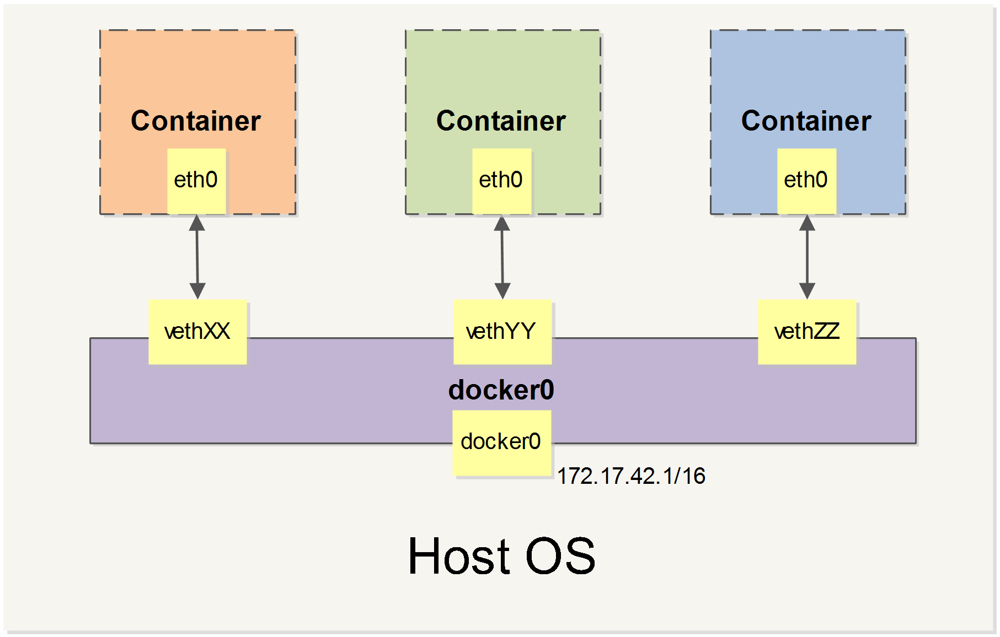
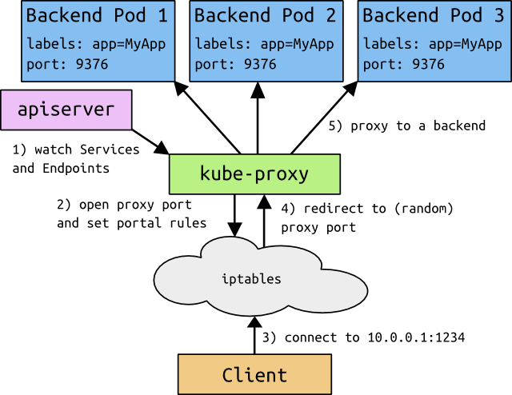

# 基本概念

## 镜像

Docker 镜像是一个特殊的文件系统，除了提供容器运行时所需的程序、库、资源、配置等文件外，还包含了一些为运行时准备的一些配置参数（如匿名卷、环境变量、用户等）。镜像不包含任何动态数据，其内容在构建之后也不会被改变。

### 分层存储

因为镜像包含操作系统完整的 root 文件系统，其体积往往是庞大的，因此在 Docker 设计时，就充分利用 Union FS 的技术，将其设计为分层存储的架构。所以严格来说，镜像并非是像一个 ISO 那样的打包文件，镜像只是一个虚拟的概念，其实际体现并非由一个文件组成，而是由一组文件系统组成，或者说，由多层文件系统联合组成。

镜像构建时，会一层层构建，前一层是后一层的基础。每一层构建完就不会再发生改变，后一层上的任何改变只发生在自己这一层。比如，删除前一层文件的操作，实际不是真的删除前一层的文件，而是仅在当前层标记为该文件已删除。在最终容器运行的时候，虽然不会看到这个文件，但是实际上该文件会一直跟随镜像。因此，在构建镜像的时候，需要额外小心，每一层尽量只包含该层需要添加的东西，任何额外的东西应该在该层构建结束前清理掉。

分层存储的特征还使得镜像的复用、定制变的更为容易。甚至可以用之前构建好的镜像作为基础层，然后进一步添加新的层，以定制自己所需的内容，构建新的镜像。

## 容器

镜像（Image）和容器（Container）的关系，就像是面向对象程序设计中的类和实例一样，镜像是静态的定义，容器是镜像运行时的实体。容器可以被创建、启动、停止、删除、暂停等。

容器的实质是进程，但与直接在宿主执行的进程不同，容器进程运行于属于自己的独立的命名空间（opens new window）。因此容器可以拥有自己的 root 文件系统、自己的网络配置、自己的进程空间，甚至自己的用户 ID 空间。容器内的进程是运行在一个隔离的环境里，使用起来，就好像是在一个独立于宿主的系统下操作一样。这种特性使得容器封装的应用比直接在宿主运行更加安全。也因为这种隔离的特性，很多人初学 Docker 时常常会混淆容器和虚拟机。

前面讲过镜像使用的是分层存储，容器也是如此。每一个容器运行时，是以镜像为基础层，在其上创建一个当前容器的存储层，我们可以称这个为容器运行时读写而准备的存储层为容器存储层。

容器存储层的生存周期和容器一样，容器消亡时，容器存储层也随之消亡。因此，任何保存于容器存储层的信息都会随容器删除而丢失。

按照 Docker 最佳实践的要求，容器不应该向其存储层内写入任何数据，容器存储层要保持无状态化。所有的文件写入操作，都应该使用数据卷（Volume）、或者绑定宿主目录，在这些位置的读写会跳过容器存储层，直接对宿主（或网络存储）发生读写，其性能和稳定性更高。

数据卷的生存周期独立于容器，容器消亡，数据卷不会消亡。因此，使用数据卷后，容器删除或者重新运行之后，数据却不会丢失。

## 仓库

镜像构建完成后，可以很容易的在当前宿主机上运行，但是，如果需要在其它服务器上使用这个镜像，我们就需要一个集中的存储、分发镜像的服务，Docker Registry 就是这样的服务。

一个 Docker Registry 中可以包含多个仓库（Repository）；每个仓库可以包含多个标签（Tag）；每个标签对应一个镜像。

通常，一个仓库会包含同一个软件不同版本的镜像，而标签就常用于对应该软件的各个版本。我们可以通过 `<仓库名>:<标签>` 的格式来指定具体是这个软件哪个版本的镜像。如果不给出标签，将以 latest 作为默认标签。

以 Ubuntu 镜像为例，ubuntu 是仓库的名字，其内包含有不同的版本标签，如 16.04, 18.04。我们可以通过 ubuntu:16.04 或者 ubuntu:18.04 来具体指定所需哪个版本的镜像。如果忽略了标签，比如 ubuntu，那将视为 ubuntu:latest。

仓库名经常以两段式路径形式出现，比如 jwilder/nginx-proxy，前者往往意味着 Docker Registry 多用户环境下的用户名，后者则往往是对应的软件名。但这并非绝对，取决于所使用的具体 Docker Registry 的软件或服务。

### Docker Registry 公开服务

Docker Registry 公开服务是开放给用户使用、允许用户管理镜像的 Registry 服务。一般这类公开服务允许用户免费上传、下载公开的镜像，并可能提供收费服务供用户管理私有镜像。

最常使用的 Registry 公开服务是官方的 Docker Hub，这也是默认的 Registry，并拥有大量的高质量的官方镜像。除此以外，还有 Red Hat 的 Quay.io ；Google 的 Google Container Registry，Kubernetes 的镜像使用的就是这个服务；代码托管平台 GitHub 推出的 ghcr.io。

由于某些原因，在国内访问这些服务可能会比较慢。国内的一些云服务商提供了针对 Docker Hub 的镜像服务（Registry Mirror），这些镜像服务被称为加速器。常见的有阿里云加速器、DaoCloud 加速器等。使用加速器会直接从国内的地址下载 Docker Hub 的镜像，比直接从 Docker Hub 下载速度会提高很多。

国内也有一些云服务商提供类似于 Docker Hub 的公开服务。比如网易云镜像服务、DaoCloud 镜像市场、阿里云镜像库等。

### 私有 Docker Registry

除了使用公开服务外，用户还可以在本地搭建私有 Docker Registry。Docker 官方提供了 Docker Registry 镜像，可以直接使用做为私有 Registry 服务。在私有仓库一节中，会有进一步的搭建私有 Registry 服务的讲解。

开源的 Docker Registry 镜像只提供了 Docker Registry API 的服务端实现，足以支持 docker 命令，不影响使用。但不包含图形界面，以及镜像维护、用户管理、访问控制等高级功能。

除了官方的 Docker Registry 外，还有第三方软件实现了 Docker Registry API，甚至提供了用户界面以及一些高级功能，比如 Harbor 和 Sonatype Nexus

# 使用镜像

Docker 运行容器前需要本地存在对应的镜像，如果本地不存在该镜像，Docker 会从镜像仓库下载该镜像。

## 获取镜像

```bash
$ docker pull [选项] [Docker Registry 地址[:端口号]/]仓库名[:标签]
```

- Docker 镜像仓库地址：地址的格式一般是 `<域名/IP>[:端口号]`。默认地址是 Docker Hub(docker.io)。
- 仓库名：如之前所说，这里的仓库名是两段式名称，即 `<用户名>/<软件名>`。对于 Docker Hub，如果不给出用户名，则默认为 library，也就是官方镜像。

```bash
$ docker pull ubuntu:18.04
18.04: Pulling from library/ubuntu
92dc2a97ff99: Pull complete
be13a9d27eb8: Pull complete
c8299583700a: Pull complete
Digest: sha256:4bc3ae6596938cb0d9e5ac51a1152ec9dcac2a1c50829c74abd9c4361e321b26
Status: Downloaded newer image for ubuntu:18.04
docker.io/library/ubuntu:18.04 # 完整名称
```

### 运行

```bash
$ docker run -it --rm ubuntu:18.04 bash

root@e7009c6ce357:/# cat /etc/os-release
NAME="Ubuntu"
VERSION="18.04.1 LTS (Bionic Beaver)"
ID=ubuntu
ID_LIKE=debian
PRETTY_NAME="Ubuntu 18.04.1 LTS"
VERSION_ID="18.04"
HOME_URL="https://www.ubuntu.com/"
SUPPORT_URL="https://help.ubuntu.com/"
BUG_REPORT_URL="https://bugs.launchpad.net/ubuntu/"
PRIVACY_POLICY_URL="https://www.ubuntu.com/legal/terms-and-policies/privacy-policy"
VERSION_CODENAME=bionic
UBUNTU_CODENAME=bionic
```

docker run 就是运行容器的命令，具体格式我们会在容器一节进行详细讲解，我们这里简要的说明一下上面用到的参数。

- `-it`：这是两个参数，一个是 `-i` 交互式操作，一个是 `-t` 终端。我们这里打算进入 bash 执行一些命令并查看返回结果，因此我们需要交互式终端。
- `--rm`：这个参数是说容器退出后随之将其删除。默认情况下，为了排障需求，退出的容器并不会立即删除，除非手动 docker rm。我们这里只是随便执行个命令，看看结果，不需要排障和保留结果，因此使用 --rm 可以避免浪费空间。
- `ubuntu:18.04`：这是指用 `ubuntu:18.04` 镜像为基础来启动容器。
- `bash`：放在镜像名后的是命令，这里我们希望有个交互式 Shell，因此用的是 bash。进入容器后，我们可以在 Shell 下操作，执行任何所需的命令。这里，我们执行了 cat /etc/os-release，这是 Linux 常用的查看当前系统版本的命令，从返回的结果可以看到容器内是 `Ubuntu 18.04.1 LTS` 系统。

最后我们通过 exit 退出了这个容器。

## 列出镜像

列出已经下载下来的镜像，可以使用 docker image ls 命令。

```bash
$ docker image ls
REPOSITORY           TAG                 IMAGE ID            CREATED             SIZE
redis                latest              5f515359c7f8        5 days ago          183 MB
nginx                latest              05a60462f8ba        5 days ago          181 MB
mongo                3.2                 fe9198c04d62        5 days ago          342 MB
<none>               <none>              00285df0df87        5 days ago          342 MB
ubuntu               18.04               329ed837d508        3 days ago          63.3MB
ubuntu               bionic              329ed837d508        3 days ago          63.3MB
```

### 镜像体积

Docker Hub 中显示的体积是压缩后的体积，而 docker image ls 显示的是镜像下载到本地后展开的大小

另外一个需要注意的问题是，docker image ls 列表中的镜像体积总和并非是所有镜像实际硬盘消耗。由于 Docker 镜像是多层存储结构，并且可以继承、复用，因此不同镜像可能会因为使用相同的基础镜像，从而拥有共同的层。由于 Docker 使用 Union FS，相同的层只需要保存一份即可，因此实际镜像硬盘占用空间很可能要比这个列表镜像大小的总和要小的多。

你可以通过 docker system df 命令来便捷的查看镜像、容器、数据卷所占用的空间。

```bash
$ docker system df

TYPE                TOTAL               ACTIVE              SIZE                RECLAIMABLE
Images              24                  0                   1.992GB             1.992GB (100%)
Containers          1                   0                   62.82MB             62.82MB (100%)
Local Volumes       9                   0                   652.2MB             652.2MB (100%)
Build Cache                                                 0B                  0B
```

### 虚悬镜像

```bash
<none>               <none>              00285df0df87        5 days ago          342 MB
```

这个镜像原本是有镜像名和标签的，原来为 `mongo:3.2`，随着官方镜像维护，发布了新版本后，重新 `docker pull mongo:3.2` 时，`mongo:3.2` 这个镜像名被转移到了新下载的镜像身上，而旧的镜像上的这个名称则被取消，从而成为了 `<none>`。除了 docker pull 可能导致这种情况，docker build 也同样可以导致这种现象。由于新旧镜像同名，旧镜像名称被取消，从而出现仓库名、标签均为 `<none>` 的镜像。这类无标签镜像也被称为虚悬镜像 (dangling image) ，可以用下面的命令专门显示这类镜像：

```bash
$ docker image ls -f dangling=true
REPOSITORY          TAG                 IMAGE ID            CREATED             SIZE
<none>              <none>              00285df0df87        5 days ago          342 MB
```

一般来说，虚悬镜像已经失去了存在的价值，是可以随意删除的，可以用下面的命令删除。

```bash
$ docker image prune
```

### 中间层镜像

为了加速镜像构建、重复利用资源，Docker 会利用中间层镜像。所以在使用一段时间后，可能会看到一些依赖的中间层镜像。默认的 docker image ls 列表中只会显示顶层镜像，如果希望显示包括中间层镜像在内的所有镜像的话，需要加 -a 参数。

```bash
$ docker image ls -a
```

这样会看到很多无标签的镜像，与之前的虚悬镜像不同，这些无标签的镜像很多都是中间层镜像，是其它镜像所依赖的镜像。这些无标签镜像不应该删除，否则会导致上层镜像因为依赖丢失而出错。实际上，这些镜像也没必要删除，因为之前说过，相同的层只会存一遍，而这些镜像是别的镜像的依赖，因此并不会因为它们被列出来而多存了一份，无论如何你也会需要它们。只要删除那些依赖它们的镜像后，这些依赖的中间层镜像也会被连带删除。

### 列出部分镜像

不加任何参数的情况下，docker image ls 会列出所有顶层镜像，但是有时候我们只希望列出部分镜像。docker image ls 有好几个参数可以帮助做到这个事情。

根据仓库名列出镜像

```bash
$ docker image ls ubuntu
REPOSITORY          TAG                 IMAGE ID            CREATED             SIZE
ubuntu              18.04               329ed837d508        3 days ago          63.3MB
ubuntu              bionic              329ed837d508        3 days ago          63.3MB
```

列出特定的某个镜像，也就是说指定仓库名和标签

```bash
$ docker image ls ubuntu:18.04
REPOSITORY          TAG                 IMAGE ID            CREATED             SIZE
ubuntu              18.04               329ed837d508        3 days ago          63.3MB
```

除此以外，docker image ls 还支持强大的过滤器参数 `--filter`，或者简写 -f。之前我们已经看到了使用过滤器来列出虚悬镜像的用法，它还有更多的用法。比如，我们希望看到在 `mongo:3.2` 之后建立的镜像，可以用下面的命令：

```bash
$ docker image ls -f since=mongo:3.2
REPOSITORY          TAG                 IMAGE ID            CREATED             SIZE
redis               latest              5f515359c7f8        5 days ago          183 MB
nginx               latest              05a60462f8ba        5 days ago          181 MB
```

想查看某个位置之前的镜像也可以，只需要把 since 换成 before 即可。

此外，如果镜像构建时，定义了 LABEL，还可以通过 LABEL 来过滤。

```bash
$ docker image ls -f label=com.example.version=0.1
```

### 以特定格式显示

默认情况下，docker image ls 会输出一个完整的表格，但是我们并非所有时候都会需要这些内容。比如，刚才删除虚悬镜像的时候，我们需要利用 docker image ls 把所有的虚悬镜像的 ID 列出来，然后才可以交给 docker image rm 命令作为参数来删除指定的这些镜像，这个时候就用到了 -q 参数。

```bash
$ docker image ls -q
5f515359c7f8
05a60462f8ba
fe9198c04d62
00285df0df87
329ed837d508
329ed837d508
```

--filter 配合 -q 产生出指定范围的 ID 列表，然后送给另一个 docker 命令作为参数，从而针对这组实体成批的进行某种操作的做法在 Docker 命令行使用过程中非常常见，不仅仅是镜像，将来我们会在各个命令中看到这类搭配以完成很强大的功能。因此每次在文档看到过滤器后，可以多注意一下它们的用法。

另外一些时候，我们可能只是对表格的结构不满意，希望自己组织列；或者不希望有标题，这样方便其它程序解析结果等，这就用到了 Go 的模板语法。

比如，下面的命令会直接列出镜像结果，并且只包含镜像 ID 和仓库名：

```bash
$ docker image ls --format "{{.ID}}: {{.Repository}}"
5f515359c7f8: redis
05a60462f8ba: nginx
fe9198c04d62: mongo
00285df0df87: <none>
329ed837d508: ubuntu
329ed837d508: ubuntu
```

或者打算以表格等距显示，并且有标题行，和默认一样，不过自己定义列：

```bash
$ docker image ls --format "table {{.ID}}\t{{.Repository}}\t{{.Tag}}"
IMAGE ID            REPOSITORY          TAG
5f515359c7f8        redis               latest
05a60462f8ba        nginx               latest
fe9198c04d62        mongo               3.2
00285df0df87        <none>              <none>
329ed837d508        ubuntu              18.04
329ed837d508        ubuntu              bionic
```

## 删除本地镜像

如果要删除本地的镜像，可以使用 docker image rm 命令，其格式为：

```bash
$ docker image rm [选项] <镜像1> [<镜像2> ...]
```

### 用 ID、镜像名、摘要删除镜像

其中，<镜像> 可以是 镜像短 ID、镜像长 ID、镜像名或者镜像摘要。

比如我们有这么一些镜像：

```bash
$ docker image ls
REPOSITORY                  TAG                 IMAGE ID            CREATED             SIZE
centos                      latest              0584b3d2cf6d        3 weeks ago         196.5 MB
redis                       alpine              501ad78535f0        3 weeks ago         21.03 MB
docker                      latest              cf693ec9b5c7        3 weeks ago         105.1 MB
nginx                       latest              e43d811ce2f4        5 weeks ago         181.5 MB
```

```bash
$ docker image rm 501
$ docker image rm centos
```

当然，更精确的是使用镜像摘要删除镜像。

```bash
$ docker image ls --digests
REPOSITORY                  TAG                 DIGEST                                                                    IMAGE ID            CREATED             SIZE
node                        slim                sha256:b4f0e0bdeb578043c1ea6862f0d40cc4afe32a4a582f3be235a3b164422be228   6e0c4c8e3913        3 weeks ago         214 MB

$ docker image rm node@sha256:b4f0e0bdeb578043c1ea6862f0d40cc4afe32a4a582f3be235a3b164422be228
Untagged: node@sha256:b4f0e0bdeb578043c1ea6862f0d40cc4afe32a4a582f3be235a3b164422be228
```

### Untagged 和 Deleted

删除行为分为两类，一类是 Untagged，另一类是 Deleted。我们之前介绍过，镜像的唯一标识是其 ID 和摘要，而一个镜像可以有多个标签。

因此当我们使用上面命令删除镜像的时候，实际上是在要求删除某个标签的镜像。所以首先需要做的是将满足我们要求的所有镜像标签都取消，这就是我们看到的 Untagged 的信息。因为一个镜像可以对应多个标签，因此当我们删除了所指定的标签后，可能还有别的标签指向了这个镜像，如果是这种情况，那么 Delete 行为就不会发生。所以并非所有的 docker image rm 都会产生删除镜像的行为，有可能仅仅是取消了某个标签而已。

当该镜像所有的标签都被取消了，该镜像很可能会失去了存在的意义，因此会触发删除行为。镜像是多层存储结构，因此在删除的时候也是从上层向基础层方向依次进行判断删除。镜像的多层结构让镜像复用变得非常容易，因此很有可能某个其它镜像正依赖于当前镜像的某一层。这种情况，依旧不会触发删除该层的行为。直到没有任何层依赖当前层时，才会真实的删除当前层。这就是为什么，有时候会奇怪，为什么明明没有别的标签指向这个镜像，但是它还是存在的原因，也是为什么有时候会发现所删除的层数和自己 docker pull 看到的层数不一样的原因。

除了镜像依赖以外，还需要注意的是容器对镜像的依赖。如果有用这个镜像启动的容器存在（即使容器没有运行），那么同样不可以删除这个镜像。之前讲过，容器是以镜像为基础，再加一层容器存储层，组成这样的多层存储结构去运行的。因此该镜像如果被这个容器所依赖的，那么删除必然会导致故障。如果这些容器是不需要的，应该先将它们删除，然后再来删除镜像。

### 用 docker image ls 命令来配合

像其它可以承接多个实体的命令一样，可以使用 docker image ls -q 来配合使用 docker image rm，这样可以成批的删除希望删除的镜像。我们在“镜像列表”章节介绍过很多过滤镜像列表的方式都可以拿过来使用。

比如，我们需要删除所有仓库名为 redis 的镜像：

```bash
$ docker image rm $(docker image ls -q redis)
```

或者删除所有在 `mongo:3.2` 之前的镜像：

```bash
$ docker image rm $(docker image ls -q -f before=mongo:3.2)
```

充分利用你的想象力和 Linux 命令行的强大，你可以完成很多非常赞的功能。

## 利用 commit 理解镜像构成

让我们以定制一个 Web 服务器为例子，来讲解镜像是如何构建的。

```bash
$ docker run --name webserver -d -p 80:80 nginx
```

这条命令会用 nginx 镜像启动一个容器，命名为 webserver，并且映射了 80 端口，这样我们可以用浏览器去访问这个 nginx 服务器。

如果是在本机运行的 Docker，那么可以直接访问：`http://localhost` ，如果是在虚拟机、云服务器上安装的 Docker，则需要将 localhost 换为虚拟机地址或者实际云服务器地址。

直接用浏览器访问的话，我们会看到默认的 Nginx 欢迎页面。

现在，假设我们非常不喜欢这个欢迎页面，我们希望改成欢迎 Docker 的文字，我们可以使用 docker exec 命令进入容器，修改其内容。

```bash
$ docker exec -it webserver bash
root@3729b97e8226:/# echo '<h1>Hello, Docker!</h1>' > /usr/share/nginx/html/index.html
root@3729b97e8226:/# exit
exit
```

我们以交互式终端方式进入 webserver 容器，并执行了 bash 命令，也就是获得一个可操作的 Shell。

然后，我们用 `<h1>Hello, Docker!</h1>` 覆盖了 `/usr/share/nginx/html/index.html` 的内容。

现在我们再刷新浏览器的话，会发现内容被改变了。

我们修改了容器的文件，也就是改动了容器的存储层。我们可以通过 docker diff 命令看到具体的改动。

```bash
$ docker diff webserver
C /root
A /root/.bash_history
C /run
C /usr
C /usr/share
C /usr/share/nginx
C /usr/share/nginx/html
C /usr/share/nginx/html/index.html
C /var
C /var/cache
C /var/cache/nginx
A /var/cache/nginx/client_temp
A /var/cache/nginx/fastcgi_temp
A /var/cache/nginx/proxy_temp
A /var/cache/nginx/scgi_temp
A /var/cache/nginx/uwsgi_temp
```

现在我们定制好了变化，我们希望能将其保存下来形成镜像。

要知道，当我们运行一个容器的时候（如果不使用卷的话），我们做的任何文件修改都会被记录于容器存储层里。而 Docker 提供了一个 docker commit 命令，可以将容器的存储层保存下来成为镜像。换句话说，就是在原有镜像的基础上，再叠加上容器的存储层，并构成新的镜像。以后我们运行这个新镜像的时候，就会拥有原有容器最后的文件变化。

docker commit 的语法格式为：

```bash
docker commit [选项] <容器ID或容器名> [<仓库名>[:<标签>]]
```

我们可以用下面的命令将容器保存为镜像：

```bash
$ docker commit \
    --author "Tao Wang <twang2218@gmail.com>" \
    --message "修改了默认网页" \
    webserver \
    nginx:v2
sha256:07e33465974800ce65751acc279adc6ed2dc5ed4e0838f8b86f0c87aa1795214
```

其中 --author 是指定修改的作者，而 --message 则是记录本次修改的内容。这点和 git 版本控制相似，不过这里这些信息可以省略留空。

我们可以在 docker image ls 中看到这个新定制的镜像：

```bash
$ docker image ls nginx
REPOSITORY          TAG                 IMAGE ID            CREATED             SIZE
nginx               v2                  07e334659748        9 seconds ago       181.5 MB
nginx               1.11                05a60462f8ba        12 days ago         181.5 MB
nginx               latest              e43d811ce2f4        4 weeks ago         181.5 MB
```

我们还可以用 docker history 具体查看镜像内的历史记录，如果比较 `nginx:latest` 的历史记录，我们会发现新增了我们刚刚提交的这一层。

```bash
$ docker history nginx:v2
IMAGE               CREATED             CREATED BY                                      SIZE                COMMENT
07e334659748        54 seconds ago      nginx -g daemon off;                            95 B                修改了默认网页
e43d811ce2f4        4 weeks ago         /bin/sh -c #(nop)  CMD ["nginx" "-g" "daemon    0 B
<missing>           4 weeks ago         /bin/sh -c #(nop)  EXPOSE 443/tcp 80/tcp        0 B
<missing>           4 weeks ago         /bin/sh -c ln -sf /dev/stdout /var/log/nginx/   22 B
<missing>           4 weeks ago         /bin/sh -c apt-key adv --keyserver hkp://pgp.   58.46 MB
<missing>           4 weeks ago         /bin/sh -c #(nop)  ENV NGINX_VERSION=1.11.5-1   0 B
<missing>           4 weeks ago         /bin/sh -c #(nop)  MAINTAINER NGINX Docker Ma   0 B
<missing>           4 weeks ago         /bin/sh -c #(nop)  CMD ["/bin/bash"]            0 B
<missing>           4 weeks ago         /bin/sh -c #(nop) ADD file:23aa4f893e3288698c   123 MB
```

新的镜像定制好后，我们可以来运行这个镜像。

```bash
docker run --name web2 -d -p 81:80 nginx:v2
```

这里我们命名为新的服务为 web2，并且映射到 81 端口。访问 `http://localhost:81` 看到结果，其内容应该和之前修改后的 webserver 一样。

至此，我们第一次完成了定制镜像，使用的是 docker commit 命令，手动操作给旧的镜像添加了新的一层，形成新的镜像，对镜像多层存储应该有了更直观的感觉。

### 慎用 docker commit

使用 docker commit 命令虽然可以比较直观的帮助理解镜像分层存储的概念，但是实际环境中并不会这样使用。

首先，如果仔细观察之前的 docker diff webserver 的结果，你会发现除了真正想要修改的 /usr/share/nginx/html/index.html 文件外，由于命令的执行，还有很多文件被改动或添加了。这还仅仅是最简单的操作，如果是安装软件包、编译构建，那会有大量的无关内容被添加进来，将会导致镜像极为臃肿。

此外，使用 docker commit 意味着所有对镜像的操作都是黑箱操作，生成的镜像也被称为黑箱镜像，换句话说，就是除了制作镜像的人知道执行过什么命令、怎么生成的镜像，别人根本无从得知。而且，即使是这个制作镜像的人，过一段时间后也无法记清具体的操作。这种黑箱镜像的维护工作是非常痛苦的。

而且，回顾之前提及的镜像所使用的分层存储的概念，除当前层外，之前的每一层都是不会发生改变的，换句话说，任何修改的结果仅仅是在当前层进行标记、添加、修改，而不会改动上一层。如果使用 docker commit 制作镜像，以及后期修改的话，每一次修改都会让镜像更加臃肿一次，所删除的上一层的东西并不会丢失，会一直如影随形的跟着这个镜像，即使根本无法访问到。这会让镜像更加臃肿。

## 使用 Dockerfile 定制镜像

从刚才的 docker commit 的学习中，我们可以了解到，镜像的定制实际上就是定制每一层所添加的配置、文件。如果我们可以把每一层修改、安装、构建、操作的命令都写入一个脚本，用这个脚本来构建、定制镜像，那么之前提及的无法重复的问题、镜像构建透明性的问题、体积的问题就都会解决。这个脚本就是 Dockerfile。

Dockerfile 是一个文本文件，其内包含了一条条的指令(Instruction)，每一条指令构建一层，因此每一条指令的内容，就是描述该层应当如何构建。

还以之前定制 nginx 镜像为例，这次我们使用 Dockerfile 来定制。

在一个空白目录中，建立一个文本文件，并命名为 Dockerfile：

```bash
$ mkdir mynginx
$ cd mynginx
$ touch Dockerfile
```

其内容为：

```bash
FROM nginx
RUN echo '<h1>Hello, Docker!</h1>' > /usr/share/nginx/html/index.html
```

这个 Dockerfile 很简单，一共就两行。涉及到了两条指令，FROM 和 RUN。

### FROM 指定基础镜像

所谓定制镜像，那一定是以一个镜像为基础，在其上进行定制。就像我们之前运行了一个 nginx 镜像的容器，再进行修改一样，基础镜像是必须指定的。而 FROM 就是指定基础镜像，因此一个 Dockerfile 中 FROM 是必备的指令，并且必须是第一条指令。

在 Docker Hub 上有非常多的高质量的官方镜像，有可以直接拿来使用的服务类的镜像，如 nginx、redis、mongo、mysql、httpd、php、tomcat 等；也有一些方便开发、构建、运行各种语言应用的镜像，如 node、openjdk、python、ruby、golang 等。可以在其中寻找一个最符合我们最终目标的镜像为基础镜像进行定制。

如果没有找到对应服务的镜像，官方镜像中还提供了一些更为基础的操作系统镜像，如 ubuntu、debian、centos、fedora、alpine 等，这些操作系统的软件库为我们提供了更广阔的扩展空间。

除了选择现有镜像为基础镜像外，Docker 还存在一个特殊的镜像，名为 scratch。这个镜像是虚拟的概念，并不实际存在，它表示一个空白的镜像。

```bash
FROM scratch
...
```

如果你以 scratch 为基础镜像的话，意味着你不以任何镜像为基础，接下来所写的指令将作为镜像第一层开始存在。

不以任何系统为基础，直接将可执行文件复制进镜像的做法并不罕见，对于 Linux 下静态编译的程序来说，并不需要有操作系统提供运行时支持，所需的一切库都已经在可执行文件里了，因此直接 FROM scratch 会让镜像体积更加小巧。使用 Go 语言开发的应用很多会使用这种方式来制作镜像，这也是为什么有人认为 Go 是特别适合容器微服务架构的语言的原因之一。

### RUN 执行命令

RUN 指令是用来执行命令行命令的。由于命令行的强大能力，RUN 指令在定制镜像时是最常用的指令之一。其格式有两种：

- shell 格式：`RUN <命令>`，就像直接在命令行中输入的命令一样。刚才写的 Dockerfile 中的 RUN 指令就是这种格式。

  ```bash
  RUN echo '<h1>Hello, Docker!</h1>' > /usr/share/nginx/html/index.html
  ```

- exec 格式：RUN ["可执行文件", "参数 1", "参数 2"]，这更像是函数调用中的格式。

既然 RUN 就像 Shell 脚本一样可以执行命令，那么我们是否就可以像 Shell 脚本一样把每个命令对应一个 RUN 呢？比如这样：

```bash
FROM debian:stretch

RUN apt-get update
RUN apt-get install -y gcc libc6-dev make wget
RUN wget -O redis.tar.gz "http://download.redis.io/releases/redis-5.0.3.tar.gz"
RUN mkdir -p /usr/src/redis
RUN tar -xzf redis.tar.gz -C /usr/src/redis --strip-components=1
RUN make -C /usr/src/redis
RUN make -C /usr/src/redis install
```

之前说过，Dockerfile 中每一个指令都会建立一层，RUN 也不例外。每一个 RUN 的行为，就和刚才我们手工建立镜像的过程一样：新建立一层，在其上执行这些命令，执行结束后，commit 这一层的修改，构成新的镜像。

而上面的这种写法，创建了 7 层镜像。这是完全没有意义的，而且很多运行时不需要的东西，都被装进了镜像里，比如编译环境、更新的软件包等等。结果就是产生非常臃肿、非常多层的镜像，不仅仅增加了构建部署的时间，也很容易出错。 这是很多初学 Docker 的人常犯的一个错误。

Union FS 是有最大层数限制的，比如 AUFS，曾经是最大不得超过 42 层，现在是不得超过 127 层。

上面的 Dockerfile 正确的写法应该是这样：

```bash
FROM debian:stretch

RUN set -x; buildDeps='gcc libc6-dev make wget' \
    && apt-get update \
    && apt-get install -y $buildDeps \
    && wget -O redis.tar.gz "http://download.redis.io/releases/redis-5.0.3.tar.gz" \
    && mkdir -p /usr/src/redis \
    && tar -xzf redis.tar.gz -C /usr/src/redis --strip-components=1 \
    && make -C /usr/src/redis \
    && make -C /usr/src/redis install \
    && rm -rf /var/lib/apt/lists/* \
    && rm redis.tar.gz \
    && rm -r /usr/src/redis \
    && apt-get purge -y --auto-remove $buildDeps
```

首先，之前所有的命令只有一个目的，就是编译、安装 redis 可执行文件。因此没有必要建立很多层，这只是一层的事情。因此，这里没有使用很多个 RUN 一一对应不同的命令，而是仅仅使用一个 RUN 指令，并使用 && 将各个所需命令串联起来，将之前的 7 层 简化为了 1 层。在撰写 Dockerfile 的时候，要经常提醒自己，这并不是在写 Shell 脚本，而是在定义每一层该如何构建。

并且，这里为了格式化还进行了换行。Dockerfile 支持 Shell 类的行尾添加 \ 的命令换行方式，以及行首 # 进行注释的格式。良好的格式，比如换行、缩进、注释等，会让维护、排障更为容易，这是一个比较好的习惯。

此外，还可以看到这一组命令的最后添加了清理工作的命令，删除了为了编译构建所需要的软件，清理了所有下载、展开的文件，并且还清理了 apt 缓存文件。这是很重要的一步，我们之前说过，镜像是多层存储，每一层的东西并不会在下一层被删除，会一直跟随着镜像。因此镜像构建时，一定要确保每一层只添加真正需要添加的东西，任何无关的东西都应该清理掉。

很多人初学 Docker 制作出了很臃肿的镜像的原因之一，就是忘记了每一层构建的最后一定要清理掉无关文件。

### 构建镜像

好了，让我们再回到之前定制的 nginx 镜像的 Dockerfile 来。现在我们明白了这个 Dockerfile 的内容，那么让我们来构建这个镜像吧。

在 Dockerfile 文件所在目录执行：

```bash
$ docker build -t nginx:v3 .
Sending build context to Docker daemon 2.048 kB
Step 1 : FROM nginx
 ---> e43d811ce2f4
Step 2 : RUN echo '<h1>Hello, Docker!</h1>' > /usr/share/nginx/html/index.html
 ---> Running in 9cdc27646c7b
 ---> 44aa4490ce2c
Removing intermediate container 9cdc27646c7b
Successfully built 44aa4490ce2c
```

从命令的输出结果中，我们可以清晰的看到镜像的构建过程。在 Step 2 中，如同我们之前所说的那样，RUN 指令启动了一个容器 9cdc27646c7b，执行了所要求的命令，并最后提交了这一层 44aa4490ce2c，随后删除了所用到的这个容器 9cdc27646c7b。

这里我们使用了 docker build 命令进行镜像构建。其格式为：

```bash
docker build [选项] <上下文路径/URL/->
```

在这里我们指定了最终镜像的名称 `-t nginx:v3`，构建成功后，我们可以像之前运行 nginx:v2 那样来运行这个镜像，其结果会和 nginx:v2 一样。

### 镜像构建上下文（Context）

如果注意，会看到 docker build 命令最后有一个 `.`。`.` 表示当前目录，而 Dockerfile 就在当前目录，因此不少初学者以为这个路径是在指定 Dockerfile 所在路径，这么理解其实是不准确的。如果对应上面的命令格式，你可能会发现，这是在指定上下文路径。那么什么是上下文呢？

首先我们要理解 docker build 的工作原理。Docker 在运行时分为 Docker 引擎（也就是服务端守护进程）和客户端工具。Docker 的引擎提供了一组 REST API，被称为 Docker Remote API，而如 docker 命令这样的客户端工具，则是通过这组 API 与 Docker 引擎交互，从而完成各种功能。因此，虽然表面上我们好像是在本机执行各种 docker 功能，但实际上，一切都是使用的远程调用形式在服务端（Docker 引擎）完成。也因为这种 C/S 设计，让我们操作远程服务器的 Docker 引擎变得轻而易举。

当我们进行镜像构建的时候，并非所有定制都会通过 RUN 指令完成，经常会需要将一些本地文件复制进镜像，比如通过 COPY 指令、ADD 指令等。而 docker build 命令构建镜像，其实并非在本地构建，而是在服务端，也就是 Docker 引擎中构建的。那么在这种客户端/服务端的架构中，如何才能让服务端获得本地文件呢？

这就引入了上下文的概念。当构建的时候，用户会指定构建镜像上下文的路径，docker build 命令得知这个路径后，会将路径下的所有内容打包，然后上传给 Docker 引擎。这样 Docker 引擎收到这个上下文包后，展开就会获得构建镜像所需的一切文件。

如果在 Dockerfile 中这么写：

```bash
COPY ./package.json /app/
```

这并不是要复制执行 docker build 命令所在的目录下的 package.json，也不是复制 Dockerfile 所在目录下的 package.json，而是复制上下文（context）目录下的 package.json。

因此，COPY 这类指令中的源文件的路径都是相对路径。这也是初学者经常会问的为什么 `COPY ../package.json /app` 或者 `COPY /opt/xxxx /app` 无法工作的原因，因为这些路径已经超出了上下文的范围，Docker 引擎无法获得这些位置的文件。如果真的需要那些文件，应该将它们复制到上下文目录中去。

现在就可以理解刚才的命令 `docker build -t nginx:v3 .` 中的这个 `.`，实际上是在指定上下文的目录，docker build 命令会将该目录下的内容打包交给 Docker 引擎以帮助构建镜像。

如果观察 docker build 输出，我们其实已经看到了这个发送上下文的过程：

```bash
$ docker build -t nginx:v3 .
Sending build context to Docker daemon 2.048 kB
...
```

理解构建上下文对于镜像构建是很重要的，避免犯一些不应该的错误。比如有些初学者在发现 `COPY /opt/xxxx /app` 不工作后，于是干脆将 Dockerfile 放到了硬盘根目录去构建，结果发现 docker build 执行后，在发送一个几十 GB 的东西，极为缓慢而且很容易构建失败。那是因为这种做法是在让 docker build 打包整个硬盘，这显然是使用错误。

一般来说，应该会将 Dockerfile 置于一个空目录下，或者项目根目录下。如果该目录下没有所需文件，那么应该把所需文件复制一份过来。如果目录下有些东西确实不希望构建时传给 Docker 引擎，那么可以用 .gitignore 一样的语法写一个 .dockerignore，该文件是用于剔除不需要作为上下文传递给 Docker 引擎的。

那么为什么会有人误以为 `.` 是指定 Dockerfile 所在目录呢？这是因为在默认情况下，如果不额外指定 Dockerfile 的话，会将上下文目录下的名为 Dockerfile 的文件作为 Dockerfile。

这只是默认行为，实际上 Dockerfile 的文件名并不要求必须为 Dockerfile，而且并不要求必须位于上下文目录中，比如可以用 -f ../Dockerfile.php 参数指定某个文件作为 Dockerfile。

当然，一般大家习惯性的会使用默认的文件名 Dockerfile，以及会将其置于镜像构建上下文目录中。

### 其它 docker build 的用法

#### 直接用 Git repo 进行构建

或许你已经注意到了，docker build 还支持从 URL 构建，比如可以直接从 Git repo 中构建：

```bash
# $env:DOCKER_BUILDKIT=0
# export DOCKER_BUILDKIT=0

$ docker build -t hello-world https://github.com/docker-library/hello-world.git#master:amd64/hello-world

Step 1/3 : FROM scratch
 --->
Step 2/3 : COPY hello /
 ---> ac779757d46e
Step 3/3 : CMD ["/hello"]
 ---> Running in d2a513a760ed
Removing intermediate container d2a513a760ed
 ---> 038ad4142d2b
Successfully built 038ad4142d2b
```

这行命令指定了构建所需的 Git repo，并且指定分支为 master，构建目录为 /amd64/hello-world/，然后 Docker 就会自己去 git clone 这个项目、切换到指定分支、并进入到指定目录后开始构建。

#### 用给定的 tar 压缩包构建

```bash
$ docker build http://server/context.tar.gz
```

如果所给出的 URL 不是个 Git repo，而是个 tar 压缩包，那么 Docker 引擎会下载这个包，并自动解压缩，以其作为上下文，开始构建。

#### 从标准输入中读取 Dockerfile 进行构建

```bash
docker build - < Dockerfile
```

或

```bash
cat Dockerfile | docker build -
```

如果标准输入传入的是文本文件，则将其视为 Dockerfile，并开始构建。这种形式由于直接从标准输入中读取 Dockerfile 的内容，它没有上下文，因此不可以像其他方法那样可以将本地文件 COPY 进镜像之类的事情。

#### 从标准输入中读取上下文压缩包进行构建

```bash
$ docker build - < context.tar.gz
```

如果发现标准输入的文件格式是 gzip、bzip2 以及 xz 的话，将会使其为上下文压缩包，直接将其展开，将里面视为上下文，并开始构建。

## 其它制作镜像的方式

除了标准的使用 Dockerfile 生成镜像的方法外，由于各种特殊需求和历史原因，还提供了一些其它方法用以生成镜像。

### 从 rootfs 压缩包导入

```bash
docker import [选项] <文件>|<URL>|- [<仓库名>[:<标签>]]
```

压缩包可以是本地文件、远程 Web 文件，甚至是从标准输入中得到。压缩包将会在镜像 / 目录展开，并直接作为镜像第一层提交。

比如我们想要创建一个 OpenVZ 的 Ubuntu 16.04 模板的镜像：

```bash
$ docker import \
    http://download.openvz.org/template/precreated/ubuntu-16.04-x86_64.tar.gz \
    openvz/ubuntu:16.04

Downloading from http://download.openvz.org/template/precreated/ubuntu-16.04-x86_64.tar.gz
sha256:412b8fc3e3f786dca0197834a698932b9c51b69bd8cf49e100c35d38c9879213
```

这条命令自动下载了 ubuntu-16.04-x86_64.tar.gz 文件，并且作为根文件系统展开导入，并保存为镜像 openvz/ubuntu:16.04。

导入成功后，我们可以用 docker image ls 看到这个导入的镜像：

```bash
$ docker image ls openvz/ubuntu
REPOSITORY          TAG                 IMAGE ID            CREATED             SIZE
openvz/ubuntu       16.04               412b8fc3e3f7        55 seconds ago      505MB
```

如果我们查看其历史的话，会看到描述中有导入的文件链接：

```bash
$ docker history openvz/ubuntu:16.04
IMAGE               CREATED              CREATED BY          SIZE                COMMENT
f477a6e18e98        About a minute ago                       214.9 MB            Imported from http://download.openvz.org/template/precreated/ubuntu-16.04-x86_64.tar.gz
```

## Docker 镜像的导入和导出 docker save 和 docker load

Docker 还提供了 docker save 和 docker load 命令，用以将镜像保存为一个文件，然后传输到另一个位置上，再加载进来。这是在没有 Docker Registry 时的做法，现在已经不推荐，镜像迁移应该直接使用 Docker Registry，无论是直接使用 Docker Hub 还是使用内网私有 Registry 都可以。

### 保存镜像

使用 docker save 命令可以将镜像保存为归档文件。

比如我们希望保存这个 alpine 镜像。

```bash
$ docker image ls alpine
REPOSITORY          TAG                 IMAGE ID            CREATED             SIZE
alpine              latest              baa5d63471ea        5 weeks ago         4.803 MB
```

保存镜像的命令为：

```bash
$ docker save alpine -o filename
$ file filename
filename: POSIX tar archive
```

这里的 filename 可以为任意名称甚至任意后缀名，但文件的本质都是归档文件

注意：如果同名则会覆盖（没有警告）

若使用 gzip 压缩：

```bash
$ docker save alpine | gzip > alpine-latest.tar.gz
```

然后我们将 alpine-latest.tar.gz 文件复制到了到了另一个机器上，可以用下面这个命令加载镜像：

```bash
$ docker load -i alpine-latest.tar.gz
Loaded image: alpine:latest
```

如果我们结合这两个命令以及 ssh 甚至 pv 的话，利用 Linux 强大的管道，我们可以写一个命令完成从一个机器将镜像迁移到另一个机器，并且带进度条的功能：

```bash
docker save <镜像名> | bzip2 | pv | ssh <用户名>@<主机名> 'cat | docker load'
```

## 镜像的实现原理

Docker 镜像是怎么实现增量的修改和维护的？

每个镜像都由很多层次构成，Docker 使用 Union FS 将这些不同的层结合到一个镜像中去。

通常 Union FS 有两个用途, 一方面可以实现不借助 LVM、RAID 将多个 disk 挂到同一个目录下,另一个更常用的就是将一个只读的分支和一个可写的分支联合在一起，Live CD 正是基于此方法可以允许在镜像不变的基础上允许用户在其上进行一些写操作。

Docker 在 OverlayFS 上构建的容器也是利用了类似的原理。

# Dockerfile

## COPY 复制文件

格式：

- `COPY [--chown=<user>:<group>] <源路径>... <目标路径>`
- `COPY [--chown=<user>:<group>] ["<源路径1>",... "<目标路径>"]`

和 RUN 指令一样，也有两种格式，一种类似于命令行，一种类似于函数调用。

COPY 指令将从构建上下文目录中 `<源路径>` 的文件/目录复制到新的一层的镜像内的 `<目标路径>` 位置。比如：

```dockerfile
COPY package.json /usr/src/app/
```

`<源路径>` 可以是多个，甚至可以是通配符，其通配符规则要满足 Go 的 filepath.Match 规则，如：

```dockerfile
COPY hom* /mydir/
COPY hom?.txt /mydir/
```

`<目标路径>` 可以是容器内的绝对路径，也可以是相对于工作目录的相对路径（工作目录可以用 WORKDIR 指令来指定）。目标路径不需要事先创建，如果目录不存在会在复制文件前先行创建缺失目录。

此外，还需要注意一点，使用 COPY 指令，源文件的各种元数据都会保留。比如读、写、执行权限、文件变更时间等。这个特性对于镜像定制很有用。特别是构建相关文件都在使用 Git 进行管理的时候。

在使用该指令的时候还可以加上 `--chown=<user>:<group>` 选项来改变文件的所属用户及所属组。

```dockerfile
COPY --chown=55:mygroup files* /mydir/
COPY --chown=bin files* /mydir/
COPY --chown=1 files* /mydir/
COPY --chown=10:11 files* /mydir/
```

如果源路径为文件夹，复制的时候不是直接复制该文件夹，而是将文件夹中的内容复制到目标路径。

## ADD 更高级的复制文件

ADD 指令和 COPY 的格式和性质基本一致。但是在 COPY 基础上增加了一些功能。

比如 `<源路径>` 可以是一个 URL，这种情况下，Docker 引擎会试图去下载这个链接的文件放到 `<目标路径>` 去。下载后的文件权限自动设置为 600，如果这并不是想要的权限，那么还需要增加额外的一层 RUN 进行权限调整，另外，如果下载的是个压缩包，需要解压缩，也一样还需要额外的一层 RUN 指令进行解压缩。所以不如直接使用 RUN 指令，然后使用 wget 或者 curl 工具下载，处理权限、解压缩、然后清理无用文件更合理。因此，这个功能其实并不实用，而且不推荐使用。

如果 `<源路径>` 为一个 tar 压缩文件的话，压缩格式为 gzip, bzip2 以及 xz 的情况下，ADD 指令将会自动解压缩这个压缩文件到 `<目标路径>` 去。

在某些情况下，这个自动解压缩的功能非常有用，比如官方镜像 ubuntu 中：

```dockerfile
FROM scratch
ADD ubuntu-xenial-core-cloudimg-amd64-root.tar.gz /
...
```

但在某些情况下，如果我们真的是希望复制个压缩文件进去，而不解压缩，这时就不可以使用 ADD 命令了。

在 Docker 官方的 Dockerfile 最佳实践文档中要求，尽可能的使用 COPY，因为 COPY 的语义很明确，就是复制文件而已，而 ADD 则包含了更复杂的功能，其行为也不一定很清晰。最适合使用 ADD 的场合，就是所提及的需要自动解压缩的场合。

另外需要注意的是，ADD 指令会令镜像构建缓存失效，从而可能会令镜像构建变得比较缓慢。

因此在 COPY 和 ADD 指令中选择的时候，可以遵循这样的原则，所有的文件复制均使用 COPY 指令，仅在需要自动解压缩的场合使用 ADD。

在使用该指令的时候还可以加上 `--chown=<user>:<group>` 选项来改变文件的所属用户及所属组。

```dockerfile
ADD --chown=55:mygroup files* /mydir/
ADD --chown=bin files* /mydir/
ADD --chown=1 files* /mydir/k
ADD --chown=10:11 files* /mydir/
```

## CMD 容器启动命令

CMD 指令的格式和 RUN 相似，也是两种格式：

- shell 格式：`CMD <命令>`
- exec 格式：`CMD ["可执行文件", "参数1", "参数2"...]`
- 参数列表格式：`CMD ["参数1", "参数2"...]`。在指定了 ENTRYPOINT 指令后，用 CMD 指定具体的参数。

之前介绍容器的时候曾经说过，Docker 不是虚拟机，容器就是进程。既然是进程，那么在启动容器的时候，需要指定所运行的程序及参数。CMD 指令就是用于指定默认的容器主进程的启动命令的。

在运行时可以指定新的命令来替代镜像设置中的这个默认命令，比如，ubuntu 镜像默认的 CMD 是 `/bin/bash`，如果我们直接 `docker run -it ubuntu` 的话，会直接进入 bash。我们也可以在运行时指定运行别的命令，如 `docker run -it ubuntu cat /etc/os-release`。这就是用 `cat /etc/os-release` 命令替换了默认的 `/bin/bash` 命令了，输出了系统版本信息。

在指令格式上，一般推荐使用 exec 格式，这类格式在解析时会被解析为 JSON 数组，因此一定要使用双引号，而不要使用单引号。

如果使用 shell 格式的话，实际的命令会被包装为 `sh -c` 的参数的形式进行执行。比如：

```dockerfile
CMD echo $HOME
```

在实际执行中，会将其变更为：

```dockerfile
CMD [ "sh", "-c", "echo $HOME" ]
```

这就是为什么我们可以使用环境变量的原因，因为这些环境变量会被 shell 进行解析处理。

提到 CMD 就不得不提容器中应用在前台执行和后台执行的问题。这是初学者常出现的一个混淆。

Docker 不是虚拟机，容器中的应用都应该以前台执行，而不是像虚拟机、物理机里面那样，用 systemd 去启动后台服务，容器内没有后台服务的概念。

一些初学者将 CMD 写为：

```dockerfile
CMD service nginx start
```

然后发现容器执行后就立即退出了。甚至在容器内去使用 systemctl 命令结果却发现根本执行不了。这就是因为没有搞明白前台、后台的概念，没有区分容器和虚拟机的差异，依旧在以传统虚拟机的角度去理解容器。

对于容器而言，其启动程序就是容器应用进程，容器就是为了主进程而存在的，主进程退出，容器就失去了存在的意义，从而退出，其它辅助进程不是它需要关心的东西。

而使用 `service nginx start` 命令，则是希望 upstart 来以后台守护进程形式启动 nginx 服务。而刚才说了 `CMD service nginx start` 会被理解为 `CMD [ "sh", "-c", "service nginx start"]`，因此主进程实际上是 sh。那么当 `service nginx start` 命令结束后，sh 也就结束了，sh 作为主进程退出了，自然就会令容器退出。

正确的做法是直接执行 nginx 可执行文件，并且要求以前台形式运行。比如：

```dockerfile
CMD ["nginx", "-g", "daemon off;"]
```

## ENTRYPOINT 入口点

ENTRYPOINT 的格式和 RUN 指令格式一样，分为 exec 格式和 shell 格式。

ENTRYPOINT 的目的和 CMD 一样，都是在指定容器启动程序及参数。ENTRYPOINT 在运行时也可以替代，不过比 CMD 要略显繁琐，需要通过 docker run 的参数 `--entrypoint` 来指定。

当指定了 ENTRYPOINT 后，CMD 的含义就发生了改变，不再是直接的运行其命令，而是将 CMD 的内容作为参数传给 ENTRYPOINT 指令，换句话说实际执行时，将变为：

```bash
<ENTRYPOINT> "<CMD>"
```

那么有了 CMD 后，为什么还要有 ENTRYPOINT 呢？这种 `<ENTRYPOINT> "<CMD>"` 有什么好处么？让我们来看几个场景。

### 场景一：让镜像变成像命令一样使用

假设我们需要一个得知自己当前公网 IP 的镜像，那么可以先用 CMD 来实现：

```dockerfile
FROM ubuntu:18.04
RUN apt-get update \
    && apt-get install -y curl \
    && rm -rf /var/lib/apt/lists/*
CMD [ "curl", "-s", "http://myip.ipip.net" ]
```

假如我们使用 `docker build -t myip .` 来构建镜像的话，如果我们需要查询当前公网 IP，只需要执行：

```bash
$ docker run myip
当前 IP：61.148.226.66 来自：北京市 联通
```

嗯，这么看起来好像可以直接把镜像当做命令使用了，不过命令总有参数，如果我们希望加参数呢？比如从上面的 CMD 中可以看到实质的命令是 curl，那么如果我们希望显示 HTTP 头信息，就需要加上 -i 参数。那么我们可以直接加 -i 参数给 `docker run myip` 么？

```bash
$ docker run myip -i
docker: Error response from daemon: invalid header field value "oci runtime error: container_linux.go:247: starting container process caused \"exec: \\\"-i\\\": executable file not found in $PATH\"\n".
```

我们可以看到可执行文件找不到的报错，`executable file not found`。之前我们说过，跟在镜像名后面的是 command，运行时会替换 CMD 的默认值。因此这里的 -i 替换了原来的 CMD，而不是添加在原来的 `curl -s http://myip.ipip.net` 后面。而 -i 根本不是命令，所以自然找不到。

那么如果我们希望加入 -i 这参数，我们就必须重新完整的输入这个命令：

```bash
$ docker run myip curl -s http://myip.ipip.net -i
```

这显然不是很好的解决方案，而使用 ENTRYPOINT 就可以解决这个问题。现在我们重新用 ENTRYPOINT 来实现这个镜像：

```dockerfile
FROM ubuntu:18.04
RUN apt-get update \
    && apt-get install -y curl \
    && rm -rf /var/lib/apt/lists/*
ENTRYPOINT [ "curl", "-s", "http://myip.ipip.net" ]
```

这次我们再来尝试直接使用 `docker run myip -i`：

```bash
$ docker run myip
当前 IP：61.148.226.66 来自：北京市 联通

$ docker run myip -i
HTTP/1.1 200 OK
Server: nginx/1.8.0
Date: Tue, 22 Nov 2016 05:12:40 GMT
Content-Type: text/html; charset=UTF-8
Vary: Accept-Encoding
X-Powered-By: PHP/5.6.24-1~dotdeb+7.1
X-Cache: MISS from cache-2
X-Cache-Lookup: MISS from cache-2:80
X-Cache: MISS from proxy-2_6
Transfer-Encoding: chunked
Via: 1.1 cache-2:80, 1.1 proxy-2_6:8006
Connection: keep-alive

当前 IP：61.148.226.66 来自：北京市 联通
```

可以看到，这次成功了。这是因为当存在 ENTRYPOINT 后，CMD 的内容将会作为参数传给 ENTRYPOINT，而这里 -i 就是新的 CMD，因此会作为参数传给 curl，从而达到了我们预期的效果。

### 场景二：应用运行前的准备工作

启动容器就是启动主进程，但有些时候，启动主进程前，需要一些准备工作。

比如 mysql 类的数据库，可能需要一些数据库配置、初始化的工作，这些工作要在最终的 mysql 服务器运行之前解决。

此外，可能希望避免使用 root 用户去启动服务，从而提高安全性，而在启动服务前还需要以 root 身份执行一些必要的准备工作，最后切换到服务用户身份启动服务。或者除了服务外，其它命令依旧可以使用 root 身份执行，方便调试等。

这些准备工作是和容器 CMD 无关的，无论 CMD 为什么，都需要事先进行一个预处理的工作。这种情况下，可以写一个脚本，然后放入 ENTRYPOINT 中去执行，而这个脚本会将接到的参数（也就是 `<CMD>`）作为命令，在脚本最后执行。比如官方镜像 redis 中就是这么做的：

```dockerfile
FROM alpine:3.4
...
RUN addgroup -S redis && adduser -S -G redis redis
...
ENTRYPOINT ["docker-entrypoint.sh"]

EXPOSE 6379
CMD [ "redis-server" ]
```

可以看到其中为了 redis 服务创建了 redis 用户，并在最后指定了 ENTRYPOINT 为 docker-entrypoint.sh 脚本。

```bash
#!/bin/sh
...
# allow the container to be started with `--user`
if [ "$1" = 'redis-server' -a "$(id -u)" = '0' ]; then
   find . \! -user redis -exec chown redis '{}' +
   exec gosu redis "$0" "$@"
fi

exec "$@"
```

该脚本的内容就是根据 CMD 的内容来判断，如果是 redis-server 的话，则切换到 redis 用户身份启动服务器，否则依旧使用 root 身份执行。比如：

```bash
$ docker run -it redis id
uid=0(root) gid=0(root) groups=0(root)
```

## ENV 设置环境变量

格式有两种：

- `ENV <key> <value>`
- `ENV <key1>=<value1> <key2>=<value2>...`

这个指令很简单，就是设置环境变量而已，无论是后面的其它指令如 RUN，还是运行时的应用，都可以直接使用这里定义的环境变量。

```dockerfile
ENV VERSION=1.0 DEBUG=on \
    NAME="Happy Feet"
```

这个例子中演示了如何换行，以及对含有空格的值用双引号括起来的办法，这和 Shell 下的行为是一致的。

定义了环境变量，那么在后续的指令中，就可以使用这个环境变量。比如在官方 node 镜像 Dockerfile 中，就有类似这样的代码：

```dockerfile
ENV NODE_VERSION 7.2.0

RUN curl -SLO "https://nodejs.org/dist/v$NODE_VERSION/node-v$NODE_VERSION-linux-x64.tar.xz" \
  && curl -SLO "https://nodejs.org/dist/v$NODE_VERSION/SHASUMS256.txt.asc" \
  && gpg --batch --decrypt --output SHASUMS256.txt SHASUMS256.txt.asc \
  && grep " node-v$NODE_VERSION-linux-x64.tar.xz\$" SHASUMS256.txt | sha256sum -c - \
  && tar -xJf "node-v$NODE_VERSION-linux-x64.tar.xz" -C /usr/local --strip-components=1 \
  && rm "node-v$NODE_VERSION-linux-x64.tar.xz" SHASUMS256.txt.asc SHASUMS256.txt \
  && ln -s /usr/local/bin/node /usr/local/bin/nodejs
```

在这里先定义了环境变量 `NODE_VERSION`，其后的 RUN 这层里，多次使用 `$NODE_VERSION` 来进行操作定制。可以看到，将来升级镜像构建版本的时候，只需要更新 7.2.0 即可，Dockerfile 构建维护变得更轻松了。

下列指令可以支持环境变量展开：ADD、COPY、ENV、EXPOSE、FROM、LABEL、USER、WORKDIR、VOLUME、STOPSIGNAL、ONBUILD、RUN。

可以从这个指令列表里感觉到，环境变量可以使用的地方很多，很强大。通过环境变量，我们可以让一份 Dockerfile 制作更多的镜像，只需使用不同的环境变量即可。

## ARG 构建参数

格式：`ARG <参数名>[=<默认值>]`

构建参数和 ENV 的效果一样，都是设置环境变量。所不同的是，ARG 所设置的构建环境的环境变量，在将来容器运行时是不会存在这些环境变量的。但是不要因此就使用 ARG 保存密码之类的信息，因为 docker history 还是可以看到所有值的。

Dockerfile 中的 ARG 指令是定义参数名称，以及定义其默认值。该默认值可以在构建命令 docker build 中用 `--build-arg <参数名>=<值>` 来覆盖。

灵活的使用 ARG 指令，能够在不修改 Dockerfile 的情况下，构建出不同的镜像。

ARG 指令有生效范围，如果在 FROM 指令之前指定，那么只能用于 FROM 指令中。

```dockerfile
ARG DOCKER_USERNAME=library

FROM ${DOCKER_USERNAME}/alpine

RUN set -x ; echo ${DOCKER_USERNAME}
```

使用上述 Dockerfile 会发现无法输出 `${DOCKER_USERNAME}` 变量的值，要想正常输出，你必须在 FROM 之后再次指定 ARG

```dockerfile
# 只在 FROM 中生效
ARG DOCKER_USERNAME=library

FROM ${DOCKER_USERNAME}/alpine

# 要想在 FROM 之后使用，必须再次指定
ARG DOCKER_USERNAME=library

RUN set -x ; echo ${DOCKER_USERNAME}
```

对于多阶段构建，尤其要注意这个问题

```dockerfile
# 这个变量在每个 FROM 中都生效
ARG DOCKER_USERNAME=library

FROM ${DOCKER_USERNAME}/alpine

RUN set -x ; echo 1

FROM ${DOCKER_USERNAME}/alpine

RUN set -x ; echo 2
```

对于上述 Dockerfile 两个 FROM 指令都可以使用 `${DOCKER_USERNAME}`，对于在各个阶段中使用的变量都必须在每个阶段分别指定：

```dockerfile
ARG DOCKER_USERNAME=library

FROM ${DOCKER_USERNAME}/alpine

# 在 FROM 之后使用变量，必须在每个阶段分别指定
ARG DOCKER_USERNAME=library

RUN set -x ; echo ${DOCKER_USERNAME}

FROM ${DOCKER_USERNAME}/alpine

# 在 FROM 之后使用变量，必须在每个阶段分别指定
ARG DOCKER_USERNAME=library

RUN set -x ; echo ${DOCKER_USERNAME}
```

## VOLUME 定义匿名卷

格式为：

- `VOLUME ["<路径 1>", "<路径 2>"...]`
- `VOLUME <路径>`

之前我们说过，容器运行时应该尽量保持容器存储层不发生写操作，对于数据库类需要保存动态数据的应用，其数据库文件应该保存于卷(volume)中，后面的章节我们会进一步介绍 Docker 卷的概念。为了防止运行时用户忘记将动态文件所保存目录挂载为卷，在 Dockerfile 中，我们可以事先指定某些目录挂载为匿名卷，这样在运行时如果用户不指定挂载，其应用也可以正常运行，不会向容器存储层写入大量数据。

```dockerfile
VOLUME /data
```

这里的 /data 目录就会在容器运行时自动挂载为匿名卷，任何向 /data 中写入的信息都不会记录进容器存储层，从而保证了容器存储层的无状态化。当然，运行容器时可以覆盖这个挂载设置。比如：

```dockerfile
$ docker run -d -v mydata:/data xxxx
```

在这行命令中，就使用了 mydata 这个命名卷挂载到了 /data 这个位置，替代了 Dockerfile 中定义的匿名卷的挂载配置。

## EXPOSE 声明端口

格式为 `EXPOSE <端口1> [<端口2>...]`。

EXPOSE 指令是声明容器运行时提供服务的端口，这只是一个声明，在容器运行时并不会因为这个声明应用就会开启这个端口的服务。在 Dockerfile 中写入这样的声明有两个好处，一个是帮助镜像使用者理解这个镜像服务的守护端口，以方便配置映射；另一个用处则是在运行时使用随机端口映射时，也就是 `docker run -P` 时，会自动随机映射 EXPOSE 的端口。

要将 EXPOSE 和在运行时使用 `-p <宿主端口>:<容器端口>` 区分开来。-p，是映射宿主端口和容器端口，换句话说，就是将容器的对应端口服务公开给外界访问，而 EXPOSE 仅仅是声明容器打算使用什么端口而已，并不会自动在宿主进行端口映射。

## WORKDIR 指定工作目录

格式为 `WORKDIR <工作目录路径>`。

使用 WORKDIR 指令可以来指定工作目录（或者称为当前目录），以后各层的当前目录就被改为指定的目录，如该目录不存在，WORKDIR 会帮你建立目录。

之前提到一些初学者常犯的错误是把 Dockerfile 等同于 Shell 脚本来书写，这种错误的理解还可能会导致出现下面这样的错误：

```dockerfile
RUN cd /app
RUN echo "hello" > world.txt
```

如果将这个 Dockerfile 进行构建镜像运行后，会发现找不到 `/app/world.txt` 文件，或者其内容不是 hello。原因其实很简单，在 Shell 中，连续两行是同一个进程执行环境，因此前一个命令修改的内存状态，会直接影响后一个命令；而在 Dockerfile 中，这两行 RUN 命令的执行环境根本不同，是两个完全不同的容器。这就是对 Dockerfile 构建分层存储的概念不了解所导致的错误。

之前说过每一个 RUN 都是启动一个容器、执行命令、然后提交存储层文件变更。第一层 `RUN cd /app` 的执行仅仅是当前进程的工作目录变更，一个内存上的变化而已，其结果不会造成任何文件变更。而到第二层的时候，启动的是一个全新的容器，跟第一层的容器更完全没关系，自然不可能继承前一层构建过程中的内存变化。

因此如果需要改变以后各层的工作目录的位置，那么应该使用 WORKDIR 指令。

```dockerfile
WORKDIR /app

RUN echo "hello" > world.txt
```

如果你的 WORKDIR 指令使用的相对路径，那么所切换的路径与之前的 WORKDIR 有关：

```dockerfile
WORKDIR /a
WORKDIR b
WORKDIR c

RUN pwd
```

RUN pwd 的工作目录为 /a/b/c。

## USER 指定当前用户

格式：`USER <用户名>[:<用户组>]`

USER 指令和 WORKDIR 相似，都是改变环境状态并影响以后的层。WORKDIR 是改变工作目录，USER 则是改变之后层的执行 RUN, CMD 以及 ENTRYPOINT 这类命令的身份。

注意，USER 只是帮助你切换到指定用户而已，这个用户必须是事先建立好的，否则无法切换。

```dockerfile
RUN groupadd -r redis && useradd -r -g redis redis
USER redis
RUN [ "redis-server" ]
```

如果以 root 执行的脚本，在执行期间希望改变身份，比如希望以某个已经建立好的用户来运行某个服务进程，不要使用 su 或者 sudo，这些都需要比较麻烦的配置，而且在 TTY 缺失的环境下经常出错。建议使用 gosu。

```dockerfile
# 建立 redis 用户，并使用 gosu 换另一个用户执行命令
RUN groupadd -r redis && useradd -r -g redis redis
# 下载 gosu
RUN wget -O /usr/local/bin/gosu "https://github.com/tianon/gosu/releases/download/1.12/gosu-amd64" \
    && chmod +x /usr/local/bin/gosu \
    && gosu nobody true
# 设置 CMD，并以另外的用户执行
CMD [ "exec", "gosu", "redis", "redis-server" ]
```

## HEALTHCHECK 健康检查

格式：

- `HEALTHCHECK [选项] CMD <命令>`：设置检查容器健康状况的命令
- `HEALTHCHECK NONE`：如果基础镜像有健康检查指令，使用这行可以屏蔽掉其健康检查指令

HEALTHCHECK 指令是告诉 Docker 应该如何进行判断容器的状态是否正常，这是 Docker 1.12 引入的新指令。

在没有 HEALTHCHECK 指令前，Docker 引擎只可以通过容器内主进程是否退出来判断容器是否状态异常。很多情况下这没问题，但是如果程序进入死锁状态，或者死循环状态，应用进程并不退出，但是该容器已经无法提供服务了。在 1.12 以前，Docker 不会检测到容器的这种状态，从而不会重新调度，导致可能会有部分容器已经无法提供服务了却还在接受用户请求。

而自 1.12 之后，Docker 提供了 HEALTHCHECK 指令，通过该指令指定一行命令，用这行命令来判断容器主进程的服务状态是否还正常，从而比较真实的反应容器实际状态。

当在一个镜像指定了 HEALTHCHECK 指令后，用其启动容器，初始状态会为 starting，在 HEALTHCHECK 指令检查成功后变为 healthy，如果连续一定次数失败，则会变为 unhealthy。

HEALTHCHECK 支持下列选项：

- `--interval=<间隔>`：两次健康检查的间隔，默认为 30 秒；
- `--timeout=<时长>`：健康检查命令运行超时时间，如果超过这个时间，本次健康检查就被视为失败，默认 30 秒；
- `--retries=<次数>`：当连续失败指定次数后，则将容器状态视为 unhealthy，默认 3 次。

和 CMD, ENTRYPOINT 一样，HEALTHCHECK 只可以出现一次，如果写了多个，只有最后一个生效。

在 `HEALTHCHECK [选项] CMD` 后面的命令，格式和 ENTRYPOINT 一样，分为 shell 格式，和 exec 格式。命令的返回值决定了该次健康检查的成功与否：0：成功；1：失败；2：保留，不要使用这个值。

假设我们有个镜像是个最简单的 Web 服务，我们希望增加健康检查来判断其 Web 服务是否在正常工作，我们可以用 curl 来帮助判断，其 Dockerfile 的 HEALTHCHECK 可以这么写：

```dockerfile
FROM nginx
RUN apt-get update && apt-get install -y curl && rm -rf /var/lib/apt/lists/*
HEALTHCHECK --interval=5s --timeout=3s \
  CMD curl -fs http://localhost/ || exit 1
```

这里我们设置了每 5 秒检查一次（这里为了试验所以间隔非常短，实际应该相对较长），如果健康检查命令超过 3 秒没响应就视为失败，并且使用 curl -fs http://localhost/ || exit 1 作为健康检查命令。

使用 docker build 来构建这个镜像：

```bash
$ docker build -t myweb:v1 .
```

构建好了后，我们启动一个容器：

```bash
$ docker run -d --name web -p 80:80 myweb:v1
```

当运行该镜像后，可以通过 `docker container ls` 看到最初的状态为 (health: starting)：

```bash
$ docker container ls
CONTAINER ID        IMAGE               COMMAND                  CREATED             STATUS                            PORTS               NAMES
03e28eb00bd0        myweb:v1            "nginx -g 'daemon off"   3 seconds ago       Up 2 seconds (health: starting)   80/tcp, 443/tcp     web
```

在等待几秒钟后，再次 docker container ls，就会看到健康状态变化为了 (healthy)：

```bash
$ docker container ls
CONTAINER ID        IMAGE               COMMAND                  CREATED             STATUS                    PORTS               NAMES
03e28eb00bd0        myweb:v1            "nginx -g 'daemon off"   18 seconds ago      Up 16 seconds (healthy)   80/tcp, 443/tcp     web
```

如果健康检查连续失败超过了重试次数，状态就会变为 (unhealthy)。

为了帮助排障，健康检查命令的输出（包括 stdout 以及 stderr）都会被存储于健康状态里，可以用 docker inspect 来查看。

```bash
$ docker inspect --format '{{json .State.Health}}' web | python -m json.tool
{
    "FailingStreak": 0,
    "Log": [
        {
            "End": "2016-11-25T14:35:37.940957051Z",
            "ExitCode": 0,
            "Output": "<!DOCTYPE html>\n<html>\n<head>\n<title>Welcome to nginx!</title>\n<style>\n    body {\n        width: 35em;\n        margin: 0 auto;\n        font-family: Tahoma, Verdana, Arial, sans-serif;\n    }\n</style>\n</head>\n<body>\n<h1>Welcome to nginx!</h1>\n<p>If you see this page, the nginx web server is successfully installed and\nworking. Further configuration is required.</p>\n\n<p>For online documentation and support please refer to\n<a href=\"http://nginx.org/\">nginx.org</a>.<br/>\nCommercial support is available at\n<a href=\"http://nginx.com/\">nginx.com</a>.</p>\n\n<p><em>Thank you for using nginx.</em></p>\n</body>\n</html>\n",
            "Start": "2016-11-25T14:35:37.780192565Z"
        }
    ],
    "Status": "healthy"
}
```

## LABEL 指令

LABEL 指令用来给镜像以键值对的形式添加一些元数据（metadata）。

```dockerfile
LABEL <key>=<value> <key>=<value> <key>=<value> ...
```

我们还可以用一些标签来申明镜像的作者、文档地址等：

```dockerfile
LABEL org.opencontainers.image.authors="yeasy"

LABEL org.opencontainers.image.documentation="https://yeasy.gitbooks.io"
```

具体可以参考 https://github.com/opencontainers/image-spec/blob/master/annotations.md

## SHELL 指令

格式：`SHELL ["executable", "parameters"]`

SHELL 指令可以指定 `RUN ENTRYPOINT CMD` 指令的 shell，Linux 中默认为 `["/bin/sh", "-c"]`

```dockerfile
SHELL ["/bin/sh", "-c"]

RUN lll ; ls

SHELL ["/bin/sh", "-cex"]

RUN lll ; ls
```

两个 RUN 运行同一命令，第二个 RUN 运行的命令会打印出每条命令并当遇到错误时退出。

当 `ENTRYPOINT CMD` 以 shell 格式指定时，SHELL 指令所指定的 shell 也会成为这两个指令的 shell

````dockerfile
SHELL ["/bin/sh", "-cex"]

# /bin/sh -cex "nginx"
ENTRYPOINT nginx

```dockerfile
SHELL ["/bin/sh", "-cex"]

# /bin/sh -cex "nginx"
CMD nginx
````

## ONBUILD 为他人做嫁衣裳

格式：`ONBUILD <其它指令>`。

ONBUILD 是一个特殊的指令，它后面跟的是其它指令，比如 RUN, COPY 等，而这些指令，在当前镜像构建时并不会被执行。只有当以当前镜像为基础镜像，去构建下一级镜像的时候才会被执行。

Dockerfile 中的其它指令都是为了定制当前镜像而准备的，唯有 ONBUILD 是为了帮助别人定制自己而准备的。

假设我们要制作 Node.js 所写的应用的镜像。我们都知道 Node.js 使用 npm 进行包管理，所有依赖、配置、启动信息等会放到 package.json 文件里。在拿到程序代码后，需要先进行 npm install 才可以获得所有需要的依赖。然后就可以通过 npm start 来启动应用。因此，一般来说会这样写 Dockerfile：

```dockerfile
FROM node:slim
RUN mkdir /app
WORKDIR /app
COPY ./package.json /app
RUN [ "npm", "install" ]
COPY . /app/
CMD [ "npm", "start" ]
```

把这个 Dockerfile 放到 Node.js 项目的根目录，构建好镜像后，就可以直接拿来启动容器运行。但是如果我们还有第二个 Node.js 项目也差不多呢？好吧，那就再把这个 Dockerfile 复制到第二个项目里。那如果有第三个项目呢？再复制么？文件的副本越多，版本控制就越困难，让我们继续看这样的场景维护的问题。

如果第一个 Node.js 项目在开发过程中，发现这个 Dockerfile 里存在问题，比如敲错字了、或者需要安装额外的包，然后开发人员修复了这个 Dockerfile，再次构建，问题解决。第一个项目没问题了，但是第二个项目呢？虽然最初 Dockerfile 是复制、粘贴自第一个项目的，但是并不会因为第一个项目修复了他们的 Dockerfile，而第二个项目的 Dockerfile 就会被自动修复。

那么我们可不可以做一个基础镜像，然后各个项目使用这个基础镜像呢？这样基础镜像更新，各个项目不用同步 Dockerfile 的变化，重新构建后就继承了基础镜像的更新？好吧，可以，让我们看看这样的结果。那么上面的这个 Dockerfile 就会变为：

```dockerfile
FROM node:slim
RUN mkdir /app
WORKDIR /app
CMD [ "npm", "start" ]
```

这里我们把项目相关的构建指令拿出来，放到子项目里去。假设这个基础镜像的名字为 my-node 的话，各个项目内的自己的 Dockerfile 就变为：

```dockerfile
FROM my-node
COPY ./package.json /app
RUN [ "npm", "install" ]
COPY . /app/
```

基础镜像变化后，各个项目都用这个 Dockerfile 重新构建镜像，会继承基础镜像的更新。

那么，问题解决了么？没有。准确说，只解决了一半。如果这个 Dockerfile 里面有些东西需要调整呢？比如 npm install 都需要加一些参数，那怎么办？这一行 RUN 是不可能放入基础镜像的，因为涉及到了当前项目的 `./package.json`，难道又要一个个修改么？所以说，这样制作基础镜像，只解决了原来的 Dockerfile 的前 4 条指令的变化问题，而后面三条指令的变化则完全没办法处理。

ONBUILD 可以解决这个问题。让我们用 ONBUILD 重新写一下基础镜像的 Dockerfile:

```dockerfile
FROM node:slim
RUN mkdir /app
WORKDIR /app
ONBUILD COPY ./package.json /app
ONBUILD RUN [ "npm", "install" ]
ONBUILD COPY . /app/
CMD [ "npm", "start" ]
```

这次我们回到原始的 Dockerfile，但是这次将项目相关的指令加上 ONBUILD，这样在构建基础镜像的时候，这三行并不会被执行。然后各个项目的 Dockerfile 就变成了简单地：

```dockerfile
FROM my-node
```

是的，只有这么一行。当在各个项目目录中，用这个只有一行的 Dockerfile 构建镜像时，之前基础镜像的那三行 ONBUILD 就会开始执行，成功的将当前项目的代码复制进镜像、并且针对本项目执行 npm install，生成应用镜像。

## 多阶段构建

### 之前的做法

在 Docker 17.05 版本之前，我们构建 Docker 镜像时，通常会采用两种方式：

#### 全部放入一个 Dockerfile

一种方式是将所有的构建过程包含在一个 Dockerfile 中，包括项目及其依赖库的编译、测试、打包等流程，这里可能会带来的一些问题：

- 镜像层次多，镜像体积较大，部署时间变长
- 源代码存在泄露的风险

例如，编写 app.go 文件，该程序输出 Hello World!

```go
package main

import "fmt"

func main(){
    fmt.Printf("Hello World!");
}
```

编写 Dockerfile.one 文件

```dockerfile
FROM golang:alpine

RUN apk --no-cache add git ca-certificates

WORKDIR /go/src/github.com/go/helloworld/

COPY app.go .

RUN go get -d -v github.com/go-sql-driver/mysql \
  && CGO_ENABLED=0 GOOS=linux go build -a -installsuffix cgo -o app . \
  && cp /go/src/github.com/go/helloworld/app /root

WORKDIR /root/

CMD ["./app"]
```

构建镜像

```bash
$ docker build -t go/helloworld:1 -f Dockerfile.one .
```

#### 分散到多个 Dockerfile

另一种方式，就是我们事先在一个 Dockerfile 将项目及其依赖库编译测试打包好后，再将其拷贝到运行环境中，这种方式需要我们编写两个 Dockerfile 和一些编译脚本才能将其两个阶段自动整合起来，这种方式虽然可以很好地规避第一种方式存在的风险，但明显部署过程较复杂。

例如，编写 Dockerfile.build 文件

```dockerfile
FROM golang:alpine

RUN apk --no-cache add git

WORKDIR /go/src/github.com/go/helloworld

COPY app.go .

RUN go get -d -v github.com/go-sql-driver/mysql \
  && CGO_ENABLED=0 GOOS=linux go build -a -installsuffix cgo -o app .
```

编写 Dockerfile.copy 文件

```dockerfile
FROM alpine:latest

RUN apk --no-cache add ca-certificates

WORKDIR /root/

COPY app .

CMD ["./app"]
```

新建 build.sh

```bash
#!/bin/sh
echo Building go/helloworld:build

docker build -t go/helloworld:build . -f Dockerfile.build

docker create --name extract go/helloworld:build
docker cp extract:/go/src/github.com/go/helloworld/app ./app
docker rm -f extract

echo Building go/helloworld:2

docker build --no-cache -t go/helloworld:2 . -f Dockerfile.copy
rm ./app
```

现在运行脚本即可构建镜像

```bash
$ chmod +x build.sh

$ ./build.sh
```

对比两种方式生成的镜像大小

```bash
$ docker image ls

REPOSITORY      TAG    IMAGE ID        CREATED         SIZE
go/helloworld   2      f7cf3465432c    22 seconds ago  6.47MB
go/helloworld   1      f55d3e16affc    2 minutes ago   295MB
```

### 使用多阶段构建

为解决以上问题，Docker v17.05 开始支持多阶段构建 (multistage builds)。使用多阶段构建我们就可以很容易解决前面提到的问题，并且只需要编写一个 Dockerfile：

例如，编写 Dockerfile 文件

```dockerfile
FROM golang:alpine as builder

RUN apk --no-cache add git

WORKDIR /go/src/github.com/go/helloworld/

RUN go get -d -v github.com/go-sql-driver/mysql

COPY app.go .

RUN CGO_ENABLED=0 GOOS=linux go build -a -installsuffix cgo -o app .

FROM alpine:latest as prod

RUN apk --no-cache add ca-certificates

WORKDIR /root/

COPY --from=0 /go/src/github.com/go/helloworld/app .

CMD ["./app"]
```

构建镜像

```bash
$ docker build -t go/helloworld:3 .
```

对比三个镜像大小

```bash
$ docker image ls

REPOSITORY        TAG   IMAGE ID         CREATED            SIZE
go/helloworld     3     d6911ed9c846     7 seconds ago      6.47MB
go/helloworld     2     f7cf3465432c     22 seconds ago     6.47MB
go/helloworld     1     f55d3e16affc     2 minutes ago      295MB
```

很明显使用多阶段构建的镜像体积小，同时也完美解决了上边提到的问题。

#### 只构建某一阶段的镜像

我们可以使用 as 来为某一阶段命名，例如

```dockerfile
FROM golang:alpine as builder
```

例如当我们只想构建 builder 阶段的镜像时，增加 --target=builder 参数即可

```dockerfile
$ docker build --target builder -t username/imagename:tag .
```

#### 构建时从其他镜像复制文件

上面例子中我们使用 `COPY --from=0 /go/src/github.com/go/helloworld/app .` 从上一阶段的镜像中复制文件，我们也可以复制任意镜像中的文件。

```dockerfile
$ COPY --from=nginx:latest /etc/nginx/nginx.conf /nginx.conf
```

## 构建多种系统架构支持的 Docker 镜像 -- docker manifest 命令详解

我们知道使用镜像创建一个容器，该镜像必须与 Docker 宿主机系统架构一致，例如 `Linux x86_64` 架构的系统中只能使用 `Linux x86_64` 的镜像创建容器。

Windows、macOS 除外，其使用了 `binfmt_misc` 提供了多种架构支持，在 Windows、macOS 系统上 (x86_64) 可以运行 arm 等其他架构的镜像。

例如我们在 `Linux x86_64` 中构建一个 `username/test` 镜像。

```dockerfile
FROM alpine

CMD echo 1
```

构建镜像后推送到 Docker Hub，之后我们尝试在树莓派 Linux arm64v8 中使用这个镜像。

```bash
$ docker run -it --rm username/test
```

可以发现这个镜像根本获取不到。

要解决这个问题，通常采用的做法是通过镜像名区分不同系统架构的镜像，例如在 `Linux x86_64` 和 `Linux arm64v8` 分别构建 `username/test` 和 `username/arm64v8-test` 镜像。运行时使用对应架构的镜像即可。

这样做显得很繁琐，那么有没有一种方法让 Docker 引擎根据系统架构自动拉取对应的镜像呢？

我们发现在 `Linux x86_64` 和 `Linux arm64v8` 架构的计算机中分别使用 `golang:alpine` 镜像运行容器 `$ docker run golang:alpine go version` 时，容器能够正常的运行。

这是什么原因呢？

原因就是 `golang:alpine` 官方镜像有一个 manifest 列表 (manifest list) 。

当用户获取一个镜像时，Docker 引擎会首先查找该镜像是否有 manifest 列表，如果有的话 Docker 引擎会按照 Docker 运行环境（系统及架构）查找出对应镜像（例如 golang:alpine）。如果没有的话会直接获取镜像（例如上例中我们构建的 username/test）。

我们可以使用 `$ docker manifest inspect golang:alpine` 查看这个 manifest 列表的结构。

```bash
$ docker manifest inspect golang:alpine
```

```json
{
  "schemaVersion": 2,
  "mediaType": "application/vnd.docker.distribution.manifest.list.v2+json",
  "manifests": [
    {
      "mediaType": "application/vnd.docker.distribution.manifest.v2+json",
      "size": 1365,
      "digest": "sha256:5e28ac423243b187f464d635bcfe1e909f4a31c6c8bce51d0db0a1062bec9e16",
      "platform": {
        "architecture": "amd64",
        "os": "linux"
      }
    },
    {
      "mediaType": "application/vnd.docker.distribution.manifest.v2+json",
      "size": 1365,
      "digest": "sha256:2945c46e26c9787da884b4065d1de64cf93a3b81ead1b949843dda1fcd458bae",
      "platform": {
        "architecture": "arm",
        "os": "linux",
        "variant": "v7"
      }
    },
    {
      "mediaType": "application/vnd.docker.distribution.manifest.v2+json",
      "size": 1365,
      "digest": "sha256:87fff60114fd3402d0c1a7ddf1eea1ded658f171749b57dc782fd33ee2d47b2d",
      "platform": {
        "architecture": "arm64",
        "os": "linux",
        "variant": "v8"
      }
    },
    {
      "mediaType": "application/vnd.docker.distribution.manifest.v2+json",
      "size": 1365,
      "digest": "sha256:607b43f1d91144f82a9433764e85eb3ccf83f73569552a49bc9788c31b4338de",
      "platform": {
        "architecture": "386",
        "os": "linux"
      }
    },
    {
      "mediaType": "application/vnd.docker.distribution.manifest.v2+json",
      "size": 1365,
      "digest": "sha256:25ead0e21ed5e246ce31e274b98c09aaf548606788ef28eaf375dc8525064314",
      "platform": {
        "architecture": "ppc64le",
        "os": "linux"
      }
    },
    {
      "mediaType": "application/vnd.docker.distribution.manifest.v2+json",
      "size": 1365,
      "digest": "sha256:69f5907fa93ea591175b2c688673775378ed861eeb687776669a48692bb9754d",
      "platform": {
        "architecture": "s390x",
        "os": "linux"
      }
    }
  ]
}
```

可以看出 manifest 列表中包含了不同系统架构所对应的镜像 digest 值，这样 Docker 就可以在不同的架构中使用相同的 manifest (例如 golang:alpine) 获取对应的镜像。

下面介绍如何使用 `$ docker manifest` 命令创建并推送 manifest 列表到 Docker Hub。

### 构建镜像

首先在 `Linux x86_64` 构建 `username/x8664-test` 镜像。并在 `Linux arm64v8` 中构建 `username/arm64v8-test` 镜像，构建好之后推送到 Docker Hub。

### 创建 manifest 列表

```bash
# $ docker manifest create MANIFEST_LIST MANIFEST [MANIFEST...]
$ docker manifest create username/test \
      username/x8664-test \
      username/arm64v8-test
```

当要修改一个 manifest 列表时，可以加入 -a 或 --amend 参数。

### 设置 manifest 列表

```bash
# $ docker manifest annotate [OPTIONS] MANIFEST_LIST MANIFEST
$ docker manifest annotate username/test \
      username/x8664-test \
      --os linux --arch x86_64

$ docker manifest annotate username/test \
      username/arm64v8-test \
      --os linux --arch arm64 --variant v8
```

这样就配置好了 manifest 列表。

### 查看 manifest 列表

```bash
$ docker manifest inspect username/test
```

### 推送 manifest 列表

最后我们可以将其推送到 Docker Hub。

```bash
$ docker manifest push username/test
```

### 测试

我们在 `Linux x86_64` `Linux arm64v8` 中分别执行 `$ docker run -it --rm username/test` 命令，发现可以正确的执行。

# 操作容器

容器是 Docker 又一核心概念。

简单的说，容器是独立运行的一个或一组应用，以及它们的运行态环境。对应的，虚拟机可以理解为模拟运行的一整套操作系统（提供了运行态环境和其他系统环境）和跑在上面的应用。

本章将具体介绍如何来管理一个容器，包括创建、启动和停止等。

## 启动容器

启动容器有两种方式，一种是基于镜像新建一个容器并启动，另外一个是将在终止状态（exited）的容器重新启动。

因为 Docker 的容器实在太轻量级了，很多时候用户都是随时删除和新创建容器。

### 新建并启动

所需要的命令主要为 docker run。

例如，下面的命令输出一个 “Hello World”，之后终止容器。

```bash
$ docker run ubuntu:18.04 /bin/echo 'Hello world'
Hello world
```

这跟在本地直接执行 `/bin/echo 'hello world'` 几乎感觉不出任何区别。

下面的命令则启动一个 bash 终端，允许用户进行交互。

```bash
$ docker run -t -i ubuntu:18.04 /bin/bash
root@af8bae53bdd3:/#
```

其中，`-t` 选项让 Docker 分配一个伪终端（pseudo-tty）并绑定到容器的标准输入上，`-i` 则让容器的标准输入保持打开。

在交互模式下，用户可以通过所创建的终端来输入命令，例如

```bash
root@af8bae53bdd3:/# pwd
/
root@af8bae53bdd3:/# ls
bin boot dev etc home lib lib64 media mnt opt proc root run sbin srv sys tmp usr var
```

当利用 docker run 来创建容器时，Docker 在后台运行的标准操作包括：

- 检查本地是否存在指定的镜像，不存在就从 registry 下载
- 利用镜像创建并启动一个容器
- 分配一个文件系统，并在只读的镜像层外面挂载一层可读写层
- 从宿主主机配置的网桥接口中桥接一个虚拟接口到容器中去
- 从地址池配置一个 ip 地址给容器
- 执行用户指定的应用程序
- 执行完毕后容器被终止

### 启动已终止容器

可以利用 `docker container start` 命令，直接将一个已经终止（exited）的容器启动运行。

容器的核心为所执行的应用程序，所需要的资源都是应用程序运行所必需的。除此之外，并没有其它的资源。可以在伪终端中利用 ps 或 top 来查看进程信息。

```bash
root@ba267838cc1b:/# ps
  PID TTY          TIME CMD
    1 ?        00:00:00 bash
   11 ?        00:00:00 ps
```

可见，容器中仅运行了指定的 bash 应用。这种特点使得 Docker 对资源的利用率极高，是货真价实的轻量级虚拟化。

## 后台运行

更多的时候，需要让 Docker 在后台运行而不是直接把执行命令的结果输出在当前宿主机下。此时，可以通过添加 `-d` 参数来实现。

下面举两个例子来说明一下。

如果不使用 `-d` 参数运行容器。

```bash
$ docker run ubuntu:18.04 /bin/sh -c "while true; do echo hello world; sleep 1; done"
hello world
hello world
hello world
hello world
```

容器会把输出的结果 (STDOUT) 打印到宿主机上面

如果使用了 `-d` 参数运行容器。

```bash
$ docker run -d ubuntu:18.04 /bin/sh -c "while true; do echo hello world; sleep 1; done"
77b2dc01fe0f3f1265df143181e7b9af5e05279a884f4776ee75350ea9d8017a
```

此时容器会在后台运行并不会把输出的结果 (STDOUT) 打印到宿主机上面(输出结果可以用 `docker logs` 查看)。

> 注：容器是否会长久运行，是和 docker run 指定的命令有关，和 `-d` 参数无关。

使用 `-d` 参数启动后会返回一个唯一的 id，也可以通过 docker container ls 命令来查看容器信息。

```bash
$ docker container ls
CONTAINER ID  IMAGE         COMMAND               CREATED        STATUS       PORTS NAMES
77b2dc01fe0f  ubuntu:18.04  /bin/sh -c 'while tr  2 minutes ago  Up 1 minute        agitated_wright
```

要获取容器的输出信息，可以通过 `docker container logs` 命令。

```bash
$ docker container logs [container ID or NAMES]
hello world
hello world
hello world
. . .
```

## 终止容器

可以使用 `docker container stop` 来终止一个运行中的容器。

此外，当 Docker 容器中指定的应用终结时，容器也自动终止。

例如对于上一章节中只启动了一个终端的容器，用户通过 `exit` 命令或 `Ctrl+d` 来退出终端时，所创建的容器立刻终止。

终止状态的容器可以用 `docker container ls -a` 命令看到。例如

```bash
$ docker container ls -a
CONTAINER ID        IMAGE                    COMMAND                CREATED             STATUS                          PORTS               NAMES
ba267838cc1b        ubuntu:18.04             "/bin/bash"            30 minutes ago      Exited (0) About a minute ago                       trusting_newton
```

处于终止状态的容器，可以通过 `docker container start` 命令来重新启动。

此外，`docker container restart` 命令会将一个运行态的容器终止，然后再重新启动它。

## 进入容器

在使用 `-d` 参数时，容器启动后会进入后台。

某些时候需要进入容器进行操作，包括使用 docker attach 命令或 docker exec 命令，推荐大家使用 docker exec 命令，原因会在下面说明。

### attach 命令

下面示例如何使用 docker attach 命令。

```bash
$ docker run -dit ubuntu
243c32535da7d142fb0e6df616a3c3ada0b8ab417937c853a9e1c251f499f550

$ docker container ls
CONTAINER ID        IMAGE               COMMAND             CREATED             STATUS              PORTS               NAMES
243c32535da7        ubuntu:latest       "/bin/bash"         18 seconds ago      Up 17 seconds                           nostalgic_hypatia

$ docker attach 243c
root@243c32535da7:/#
```

注意：如果从这个 stdin 中 exit，会导致容器的停止。

### exec 命令 -i -t 参数

docker exec 后边可以跟多个参数，这里主要说明 `-i -t` 参数。

只用 `-i` 参数时，由于没有分配伪终端，界面没有我们熟悉的 Linux 命令提示符，但命令执行结果仍然可以返回。

当 `-i -t` 参数一起使用时，则可以看到我们熟悉的 Linux 命令提示符。

```bash
$ docker run -dit ubuntu
69d137adef7a8a689cbcb059e94da5489d3cddd240ff675c640c8d96e84fe1f6

$ docker container ls
CONTAINER ID        IMAGE               COMMAND             CREATED             STATUS              PORTS               NAMES
69d137adef7a        ubuntu:latest       "/bin/bash"         18 seconds ago      Up 17 seconds                           zealous_swirles

$ docker exec -i 69d1 bash
ls
bin
boot
dev
...

$ docker exec -it 69d1 bash
root@69d137adef7a:/#
```

如果从这个 stdin 中 exit，不会导致容器的停止。这就是为什么推荐大家使用 docker exec 的原因。

更多参数说明请使用 `docker exec --help` 查看。

## 导出和导入容器

### 导出容器

如果要导出本地某个容器，可以使用 docker export 命令。

```bash
$ docker container ls -a
CONTAINER ID        IMAGE               COMMAND             CREATED             STATUS                    PORTS               NAMES
7691a814370e        ubuntu:18.04        "/bin/bash"         36 hours ago        Exited (0) 21 hours ago                       test
$ docker export 7691a814370e > ubuntu.tar
```

这样将导出容器快照到本地文件。

### 导入容器快照

可以使用 docker import 从容器快照文件中再导入为镜像，例如

```bash
$ cat ubuntu.tar | docker import - test/ubuntu:v1.0
$ docker image ls
REPOSITORY          TAG                 IMAGE ID            CREATED              VIRTUAL SIZE
test/ubuntu         v1.0                9d37a6082e97        About a minute ago   171.3 MB
```

此外，也可以通过指定 URL 或者某个目录来导入，例如

```bash
$ docker import http://example.com/exampleimage.tgz example/imagerepo
```

> 注：用户既可以使用 docker load 来导入镜像存储文件到本地镜像库，也可以使用 docker import 来导入一个容器快照到本地镜像库。这两者的区别在于容器快照文件将丢弃所有的历史记录和元数据信息（即仅保存容器当时的快照状态），而镜像存储文件将保存完整记录，体积也要大。此外，从容器快照文件导入时可以重新指定标签等元数据信息。

## 删除容器

可以使用 `docker container rm` 来删除一个处于终止状态的容器。例如

```bash
$ docker container rm trusting_newton
trusting_newton
```

如果要删除一个运行中的容器，可以添加 -f 参数。Docker 会发送 SIGKILL 信号给容器。

### 清理所有处于终止状态的容器

用 `docker container ls -a` 命令可以查看所有已经创建的包括终止状态的容器，如果数量太多要一个个删除可能会很麻烦，用下面的命令可以清理掉所有处于终止状态的容器。

```bash
$ docker container prune
```

# Docker 仓库

仓库（Repository）是集中存放镜像的地方。

一个容易混淆的概念是注册服务器（Registry）。实际上注册服务器是管理仓库的具体服务器，每个服务器上可以有多个仓库，而每个仓库下面有多个镜像。从这方面来说，仓库可以被认为是一个具体的项目或目录。例如对于仓库地址 `docker.io/ubuntu` 来说，docker.io 是注册服务器地址，ubuntu 是仓库名。

大部分时候，并不需要严格区分这两者的概念。

## Docker Hub

目前 Docker 官方维护了一个公共仓库 Docker Hub，大部分需求都可以通过在 Docker Hub 中直接下载镜像来实现。

### 注册

你可以在 https://hub.docker.com 免费注册一个 Docker 账号。

### 登录

可以通过执行 docker login 命令交互式的输入用户名及密码来完成在命令行界面登录 Docker Hub。

你可以通过 docker logout 退出登录。

### 拉取镜像

你可以通过 docker search 命令来查找官方仓库中的镜像，并利用 docker pull 命令来将它下载到本地。

例如以 centos 为关键词进行搜索：

```bash
$ docker search centos
NAME                               DESCRIPTION                                     STARS     OFFICIAL   AUTOMATED
centos                             The official build of CentOS.                   6449      [OK]
ansible/centos7-ansible            Ansible on Centos7                              132                  [OK]
consol/centos-xfce-vnc             Centos container with "headless" VNC session…   126                  [OK]
jdeathe/centos-ssh                 OpenSSH / Supervisor / EPEL/IUS/SCL Repos - …   117                  [OK]
centos/systemd                     systemd enabled base container.                 96                   [OK]
```

可以看到返回了很多包含关键字的镜像，其中包括镜像名字、描述、收藏数（表示该镜像的受关注程度）、是否官方创建（OFFICIAL）、是否自动构建 （AUTOMATED）。

根据是否是官方提供，可将镜像分为两类。

1. 类似 centos 这样的镜像，被称为基础镜像或根镜像。这些基础镜像由 Docker 公司创建、验证、支持、提供。这样的镜像往往使用单个单词作为名字。

2. 比如 `ansible/centos7-ansible` 镜像，它是由 Docker Hub 的注册用户创建并维护的，往往带有用户名称前缀。可以通过前缀 `username/` 来指定使用某个用户提供的镜像，比如 ansible 用户。

另外，在查找的时候通过 `--filter=stars=N` 参数可以指定仅显示收藏数量为 N 以上的镜像。

下载官方 centos 镜像到本地。

```bash
$ docker pull centos
Using default tag: latest
latest: Pulling from library/centos
7a0437f04f83: Pull complete
Digest: sha256:5528e8b1b1719d34604c87e11dcd1c0a20bedf46e83b5632cdeac91b8c04efc1
Status: Downloaded newer image for centos:latest
docker.io/library/centos:latest
```

### 推送镜像

用户也可以在登录后通过 docker push 命令来将自己的镜像推送到 Docker Hub。

以下命令中的 username 请替换为你的 Docker 账号用户名。

```bash
$ docker tag ubuntu:18.04 username/ubuntu:18.04

$ docker image ls

REPOSITORY                                               TAG                    IMAGE ID            CREATED             SIZE
ubuntu                                                   18.04                  275d79972a86        6 days ago          94.6MB
username/ubuntu                                          18.04                  275d79972a86        6 days ago          94.6MB

$ docker push username/ubuntu:18.04

$ docker search username

NAME                      DESCRIPTION                                     STARS               OFFICIAL            AUTOMATED
username/ubuntu
```

### 自动构建

2021 年 7 月 26 日之后，该项功能仅限付费用户使用。

自动构建（Automated Builds）可以自动触发构建镜像，方便升级镜像。

有时候，用户构建了镜像，安装了某个软件，当软件发布新版本则需要手动更新镜像。

而自动构建允许用户通过 Docker Hub 指定跟踪一个目标网站（支持 GitHub 或 BitBucket）上的项目，一旦项目发生新的提交（commit）或者创建了新的标签（tag），Docker Hub 会自动构建镜像并推送到 Docker Hub 中。

要配置自动构建，包括如下的步骤：

- 登录 Docker Hub；
- 在 Docker Hub 点击右上角头像，在账号设置（Account Settings）中关联（Linked Accounts）目标网站；
- 在 Docker Hub 中新建或选择已有的仓库，在 Builds 选项卡中选择 Configure Automated Builds；
- 选取一个目标网站中的项目（需要含 Dockerfile）和分支；
- 指定 Dockerfile 的位置，并保存。

之后，可以在 Docker Hub 的仓库页面的 Timeline 选项卡中查看每次构建的状态。

# 数据管理


这一章介绍如何在 Docker 内部以及容器之间管理数据，在容器中管理数据主要有两种方式：

- 数据卷（Volumes）
- 挂载主机目录 (Bind mounts)

## 数据卷

数据卷是一个可供一个或多个容器使用的特殊目录，它绕过 UFS，可以提供很多有用的特性：

- 数据卷可以在容器之间共享和重用
- 对数据卷的修改会立马生效
- 对数据卷的更新，不会影响镜像
- 数据卷默认会一直存在，即使容器被删除

> 注意：数据卷的使用，类似于 Linux 下对目录或文件进行 mount，镜像中的被指定为挂载点的目录中的文件会复制到数据卷中（仅数据卷为空时会复制）。

### 创建一个数据卷

```bash
$ docker volume create my-vol
```

查看所有的数据卷

```bash
$ docker volume ls

DRIVER              VOLUME NAME
local               my-vol
```

在主机里使用以下命令可以查看指定数据卷的信息

```bash
$ docker volume inspect my-vol
[
    {
        "Driver": "local",
        "Labels": {},
        "Mountpoint": "/var/lib/docker/volumes/my-vol/_data",
        "Name": "my-vol",
        "Options": {},
        "Scope": "local"
    }
]
```

### 启动一个挂载数据卷的容器

在用 docker run 命令的时候，使用 `--mount` 标记来将数据卷挂载到容器里。在一次 docker run 中可以挂载多个数据卷。

下面创建一个名为 web 的容器，并加载一个数据卷到容器的 `/usr/share/nginx/html` 目录。

```bash
$ docker run -d -P \
    --name web \
    # -v my-vol:/usr/share/nginx/html \
    --mount source=my-vol,target=/usr/share/nginx/html \
    nginx:alpine
```

### 查看数据卷的具体信息

在主机里使用以下命令可以查看 web 容器的信息

```bash
$ docker inspect web
```

数据卷信息在 `"Mounts" Key` 下面

```json
"Mounts": [
    {
        "Type": "volume",
        "Name": "my-vol",
        "Source": "/var/lib/docker/volumes/my-vol/_data",
        "Destination": "/usr/share/nginx/html",
        "Driver": "local",
        "Mode": "",
        "RW": true,
        "Propagation": ""
    }
],
```

### 删除数据卷

```bash
$ docker volume rm my-vol
```

数据卷是被设计用来持久化数据的，它的生命周期独立于容器，Docker 不会在容器被删除后自动删除数据卷，并且也不存在垃圾回收这样的机制来处理没有任何容器引用的数据卷。如果需要在删除容器的同时移除数据卷。可以在删除容器的时候使用 `docker rm -v` 这个命令。

无主的数据卷可能会占据很多空间，要清理请使用以下命令

```bash
$ docker volume prune
```

## 挂载主机目录

### 挂载一个主机目录作为数据卷

使用 `--mount` 标记可以指定挂载一个本地主机的目录到容器中去。

```bash
$ docker run -d -P \
    --name web \
    # -v /src/webapp:/usr/share/nginx/html \
    --mount type=bind,source=/src/webapp,target=/usr/share/nginx/html \
    nginx:alpine
```

上面的命令加载主机的 `/src/webapp` 目录到容器的 `/usr/share/nginx/html` 目录。这个功能在进行测试的时候十分方便，比如用户可以放置一些程序到本地目录中，来查看容器是否正常工作。本地目录的路径必须是绝对路径，以前使用 `-v` 参数时如果本地目录不存在 Docker 会自动为你创建一个文件夹，现在使用 `--mount` 参数时如果本地目录不存在，Docker 会报错。

Docker 挂载主机目录的默认权限是读写，用户也可以通过增加 readonly 指定为只读。

```bash
$ docker run -d -P \
    --name web \
    # -v /src/webapp:/usr/share/nginx/html:ro \
    --mount type=bind,source=/src/webapp,target=/usr/share/nginx/html,readonly \
    nginx:alpine
```

加了 readonly 之后，就挂载为只读了。如果你在容器内 `/usr/share/nginx/html` 目录新建文件，会显示如下错误

```bash
/usr/share/nginx/html # touch new.txt
touch: new.txt: Read-only file system
```

### 查看数据卷的具体信息

在主机里使用以下命令可以查看 web 容器的信息

```bash
$ docker inspect web
```

挂载主机目录的配置信息在 `"Mounts" Key` 下面

```json
"Mounts": [
    {
        "Type": "bind",
        "Source": "/src/webapp",
        "Destination": "/usr/share/nginx/html",
        "Mode": "",
        "RW": true,
        "Propagation": "rprivate"
    }
],
```

### 挂载一个本地主机文件作为数据卷

`--mount` 标记也可以从主机挂载单个文件到容器中

```bash
$ docker run --rm -it \
   # -v $HOME/.bash_history:/root/.bash_history \
   --mount type=bind,source=$HOME/.bash_history,target=/root/.bash_history \
   ubuntu:18.04 \
   bash

root@2affd44b4667:/# history
1  ls
2  diskutil list
```

这样就可以记录在容器输入过的命令了。

# 网络

Docker 允许通过外部访问容器或容器互联的方式来提供网络服务。

## 外部访问容器

容器中可以运行一些网络应用，要让外部也可以访问这些应用，可以通过 `-P` 或 `-p` 参数来指定端口映射。

当使用 `-P` 标记时，Docker 会随机映射一个端口到内部容器开放的网络端口。

使用 `docker container ls` 可以看到，本地主机的 32768 被映射到了容器的 80 端口。此时访问本机的 32768 端口即可访问容器内 NGINX 默认页面。

```bash
$ docker run -d -P nginx:alpine

$ docker container ls -l
CONTAINER ID        IMAGE               COMMAND                  CREATED             STATUS              PORTS                   NAMES
fae320d08268        nginx:alpine        "/docker-entrypoint.…"   24 seconds ago      Up 20 seconds       0.0.0.0:32768->80/tcp   bold_mcnulty
```

同样的，可以通过 docker logs 命令来查看访问记录。

```bash
$ docker logs fa
172.17.0.1 - - [25/Aug/2020:08:34:04 +0000] "GET / HTTP/1.1" 200 612 "-" "Mozilla/5.0 (Windows NT 10.0; Win64; x64; rv:80.0) Gecko/20100101 Firefox/80.0" "-"
```

`-p` 则可以指定要映射的端口，并且，在一个指定端口上只可以绑定一个容器。支持的格式有 `ip:hostPort:containerPort | ip::containerPort | hostPort:containerPort`。

### 映射所有接口地址

使用 `hostPort:containerPort` 格式本地的 80 端口映射到容器的 80 端口，可以执行

```bash
$ docker run -d -p 80:80 nginx:alpine
```

此时默认会绑定本地所有接口上的所有地址。

### 映射到指定地址的指定端口

可以使用 `ip:hostPort:containerPort` 格式指定映射使用一个特定地址，比如 localhost 地址 127.0.0.1

```bash
$ docker run -d -p 127.0.0.1:80:80 nginx:alpine
```

### 映射到指定地址的任意端口

使用 `ip::containerPort` 绑定 localhost 的任意端口到容器的 80 端口，本地主机会自动分配一个端口。

```bash
$ docker run -d -p 127.0.0.1::80 nginx:alpine
```

还可以使用 udp 标记来指定 udp 端口

```bash
$ docker run -d -p 127.0.0.1:80:80/udp nginx:alpine
```

### 查看映射端口配置

使用 docker port 来查看当前映射的端口配置，也可以查看到绑定的地址

```bash
$ docker port fa 80
0.0.0.0:32768
```

注意：

- 容器有自己的内部网络和 ip 地址（使用 docker inspect 查看，Docker 还可以有一个可变的网络配置。）
- `-p` 标记可以多次使用来绑定多个端口

例如

```bash
$ docker run -d \
    -p 80:80 \
    -p 443:443 \
    nginx:alpine
```

## 容器互联

如果你之前有 Docker 使用经验，你可能已经习惯了使用 `--link` 参数来使容器互联。

随着 Docker 网络的完善，强烈建议大家将容器加入自定义的 Docker 网络来连接多个容器，而不是使用 `--link` 参数。

### 新建网络

下面先创建一个新的 Docker 网络。

```bash
$ docker network create -d bridge my-net
```

`-d` 参数指定 Docker 网络类型，有 bridge、overlay。其中 overlay 网络类型用于 Swarm mode，在本小节中你可以忽略它。

### 连接容器

运行一个容器并连接到新建的 my-net 网络

```bash
$ docker run -it --rm --name busybox1 --network my-net busybox sh
```

打开新的终端，再运行一个容器并加入到 my-net 网络

```bash
$ docker run -it --rm --name busybox2 --network my-net busybox sh
```

再打开一个新的终端查看容器信息

```bash
$ docker container ls

CONTAINER ID        IMAGE               COMMAND             CREATED             STATUS              PORTS               NAMES
b47060aca56b        busybox             "sh"                11 minutes ago      Up 11 minutes                           busybox2
8720575823ec        busybox             "sh"                16 minutes ago      Up 16 minutes                           busybox1
```

下面通过 ping 来证明 busybox1 容器和 busybox2 容器建立了互联关系。

在 busybox1 容器输入以下命令

```bash
/ # ping busybox2
PING busybox2 (172.19.0.3): 56 data bytes
64 bytes from 172.19.0.3: seq=0 ttl=64 time=0.072 ms
64 bytes from 172.19.0.3: seq=1 ttl=64 time=0.118 ms
```

用 ping 来测试连接 busybox2 容器，它会解析成 172.19.0.3。

同理在 busybox2 容器执行 ping busybox1，也会成功连接到。

```bash
/ # ping busybox1
PING busybox1 (172.19.0.2): 56 data bytes
64 bytes from 172.19.0.2: seq=0 ttl=64 time=0.064 ms
64 bytes from 172.19.0.2: seq=1 ttl=64 time=0.143 ms
```

这样，busybox1 容器和 busybox2 容器建立了互联关系。

### Docker Compose

如果你有多个容器之间需要互相连接，推荐使用 Docker Compose。

## 配置 DNS

如何自定义配置容器的主机名和 DNS 呢？秘诀就是 Docker 利用虚拟文件来挂载容器的 3 个相关配置文件。

在容器中使用 mount 命令可以看到挂载信息：

```bash
$ mount
/dev/disk/by-uuid/1fec...ebdf on /etc/hostname type ext4 ...
/dev/disk/by-uuid/1fec...ebdf on /etc/hosts type ext4 ...
tmpfs on /etc/resolv.conf type tmpfs ...
```

这种机制可以让宿主主机 DNS 信息发生更新后，所有 Docker 容器的 DNS 配置通过 `/etc/resolv.conf` 文件立刻得到更新。

配置全部容器的 DNS，也可以在 `/etc/docker/daemon.json` 文件中增加以下内容来设置。

```json
{
  "dns": ["114.114.114.114", "8.8.8.8"]
}
```

这样每次启动的容器 DNS 自动配置为 `114.114.114.114` 和 `8.8.8.8`。使用以下命令来证明其已经生效。

```bash
$ docker run -it --rm ubuntu:18.04 cat etc/resolv.conf

nameserver 114.114.114.114
nameserver 8.8.8.8
```

如果用户想要手动指定容器的配置，可以在使用 docker run 命令启动容器时加入如下参数：

`-h HOSTNAME` 或者 `--hostname=HOSTNAME` 设定容器的主机名，它会被写到容器内的 `/etc/hostname` 和 `/etc/hosts`。但它在容器外部看不到，既不会在 `docker container ls` 中显示，也不会在其他的容器的 `/etc/hosts` 看到。

`--dns=IP_ADDRESS` 添加 DNS 服务器到容器的 `/etc/resolv.conf` 中，让容器用这个服务器来解析所有不在 `/etc/hosts` 中的主机名。

`--dns-search=DOMAIN` 设定容器的搜索域，当设定搜索域为 `.example.com` 时，在搜索一个名为 host 的主机时，DNS 不仅搜索 host，还会搜索 `host.example.com`。

注意：如果在容器启动时没有指定最后两个参数，Docker 会默认用主机上的 `/etc/resolv.conf` 来配置容器。

# 高级网络配置

本章将介绍 Docker 的一些高级网络配置和选项。

当 Docker 启动时，会自动在主机上创建一个 docker0 虚拟网桥，实际上是 Linux 的一个 bridge，可以理解为一个软件交换机。它会在挂载到它的网口之间进行转发。

同时，Docker 随机分配一个本地未占用的私有网段（在 RFC1918 中定义）中的一个地址给 docker0 接口。比如典型的 `172.17.42.1`，掩码为 `255.255.0.0`。此后启动的容器内的网口也会自动分配一个同一网段（172.17.0.0/16）的地址。

当创建一个 Docker 容器的时候，同时会创建了一对 `veth pair` 接口（当数据包发送到一个接口时，另外一个接口也可以收到相同的数据包）。这对接口一端在容器内，即 eth0；另一端在本地并被挂载到 docker0 网桥，名称以 veth 开头（例如 vethAQI2QT）。通过这种方式，主机可以跟容器通信，容器之间也可以相互通信。Docker 就创建了在主机和所有容器之间一个虚拟共享网络。



接下来的部分将介绍在一些场景中，Docker 所有的网络定制配置。以及通过 Linux 命令来调整、补充、甚至替换 Docker 默认的网络配置。

## 快速配置指南

下面是一个跟 Docker 网络相关的命令列表。

其中有些命令选项只有在 Docker 服务启动的时候才能配置，而且不能马上生效。

- `-b BRIDGE` 或 `--bridge=BRIDGE` 指定容器挂载的网桥
- `--bip=CIDR` 定制 docker0 的掩码
- `-H SOCKET...` 或 `--host=SOCKET... Docker` 服务端接收命令的通道
- `--icc=true|false` 是否支持容器之间进行通信
- `--ip-forward=true|false` 请看下文容器之间的通信
- `--iptables=true|false` 是否允许 Docker 添加 iptables 规则
- `--mtu=BYTES` 容器网络中的 MTU

下面 2 个命令选项既可以在启动服务时指定，也可以在启动容器时指定。在 Docker 服务启动的时候指定则会成为默认值，后面执行 docker run 时可以覆盖设置的默认值。

- `--dns=IP_ADDRESS...` 使用指定的 DNS 服务器
- `--dns-search=DOMAIN...` 指定 DNS 搜索域

最后这些选项只有在 docker run 执行时使用，因为它是针对容器的特性内容。

- `-h HOSTNAME` 或 `--hostname=HOSTNAME` 配置容器主机名
- `--link=CONTAINER_NAME:ALIAS` 添加到另一个容器的连接
- `--net=bridge|none|container:NAME_or_ID|host` 配置容器的桥接模式
- `-p SPEC` 或 `--publish=SPEC` 映射容器端口到宿主主机
- `-P` 或 `--publish-all=true|false` 映射容器所有端口到宿主主机

## 容器访问控制

容器的访问控制，主要通过 Linux 上的 iptables 防火墙来进行管理和实现。iptables 是 Linux 上默认的防火墙软件，在大部分发行版中都自带。

### 容器访问外部网络

容器要想访问外部网络，需要本地系统的转发支持。在 Linux 系统中，检查转发是否打开。

```bash
$sysctl net.ipv4.ip_forward
net.ipv4.ip_forward = 1
```

如果为 0，说明没有开启转发，则需要手动打开。

```bash
$sysctl -w net.ipv4.ip_forward=1
```

如果在启动 Docker 服务的时候设定 `--ip-forward=true`, Docker 就会自动设定系统的 `ip_forward` 参数为 1。

### 容器之间访问

容器之间相互访问，需要两方面的支持。

1. 容器的网络拓扑是否已经互联。默认情况下，所有容器都会被连接到 docker0 网桥上。
2. 本地系统的防火墙软件 `iptables` 是否允许通过。

#### 访问所有端口

当启动 Docker 服务（即 dockerd）的时候，默认会添加一条转发策略到本地主机 iptables 的 FORWARD 链上。策略为通过（ACCEPT）还是禁止（DROP）取决于配置`--icc=true`（缺省值）还是 `--icc=false`。当然，如果手动指定 `--iptables=false` 则不会添加 iptables 规则。

可见，默认情况下，不同容器之间是允许网络互通的。如果为了安全考虑，可以在 `/etc/docker/daemon.json` 文件中配置 `{"icc": false}` 来禁止它。

#### 访问指定端口

在通过 `--icc=false` 关闭网络访问后，还可以通过 `--link=CONTAINER_NAME:ALIAS` 选项来访问容器的开放端口。

例如，在启动 Docker 服务时，可以同时使用 `--icc=false --iptables=true` 参数来关闭允许相互的网络访问，并让 Docker 可以修改系统中的 iptables 规则。

此时，系统中的 iptables 规则可能是类似

```bash
$ sudo iptables -nL
...
Chain FORWARD (policy ACCEPT)
target     prot opt source               destination
DROP       all  --  0.0.0.0/0            0.0.0.0/0
...
```

之后，启动容器（docker run）时使用 `--link=CONTAINER_NAME:ALIAS` 选项。Docker 会在 iptable 中为两个容器分别添加一条 ACCEPT 规则，允许相互访问开放的端口（取决于 Dockerfile 中的 EXPOSE 指令）。

当添加了 `--link=CONTAINER_NAME:ALIAS` 选项后，添加了 iptables 规则。

```bash
$ sudo iptables -nL
...
Chain FORWARD (policy ACCEPT)
target     prot opt source               destination
ACCEPT     tcp  --  172.17.0.2           172.17.0.3           tcp spt:80
ACCEPT     tcp  --  172.17.0.3           172.17.0.2           tcp dpt:80
DROP       all  --  0.0.0.0/0            0.0.0.0/0
```

注意：`--link=CONTAINER_NAME:ALIAS` 中的 CONTAINER_NAME 目前必须是 Docker 分配的名字，或使用 `--name` 参数指定的名字。主机名则不会被识别。

## 映射容器端口到宿主主机的实现

默认情况下，容器可以主动访问到外部网络的连接，但是外部网络无法访问到容器。

### 容器访问外部实现

容器所有到外部网络的连接，源地址都会被 NAT 成本地系统的 IP 地址。这是使用 iptables 的源地址伪装操作实现的。

查看主机的 NAT 规则。

```bash
$ sudo iptables -t nat -nL
...
Chain POSTROUTING (policy ACCEPT)
target     prot opt source               destination
MASQUERADE  all  --  172.17.0.0/16       !172.17.0.0/16
...
```

其中，上述规则将所有源地址在 `172.17.0.0/16` 网段，目标地址为其他网段（外部网络）的流量动态伪装为从系统网卡发出。MASQUERADE 跟传统 SNAT 的好处是它能动态从网卡获取地址。

### 外部访问容器实现

容器允许外部访问，可以在 docker run 时候通过 -p 或 -P 参数来启用。

不管用那种办法，其实也是在本地的 iptable 的 nat 表中添加相应的规则。

使用 -P 时：

```bash
$ iptables -t nat -nL
...
Chain DOCKER (2 references)
target     prot opt source               destination
DNAT       tcp  --  0.0.0.0/0            0.0.0.0/0            tcp dpt:49153 to:172.17.0.2:80
```

使用 -p 80:80 时：

```bash
$ iptables -t nat -nL
Chain DOCKER (2 references)
target     prot opt source               destination
DNAT       tcp  --  0.0.0.0/0            0.0.0.0/0            tcp dpt:80 to:172.17.0.2:80
```

注意：

- 这里的规则映射了 `0.0.0.0`，意味着将接受主机来自所有接口的流量。用户可以通过 `-p IP:host_port:container_port` 或 `-p IP::port` 来指定允许访问容器的主机上的 IP、接口等，以制定更严格的规则。
- 如果希望永久绑定到某个固定的 IP 地址，可以在 Docker 配置文件 `/etc/docker/daemon.json` 中添加如下内容。

  ```json
  {
    "ip": "0.0.0.0"
  }
  ```

## 自定义网桥

除了默认的 docker0 网桥，用户也可以指定网桥来连接各个容器。

在启动 Docker 服务的时候，使用 `-b BRIDGE` 或 `--bridge=BRIDGE` 来指定使用的网桥。

如果服务已经运行，那需要先停止服务，并删除旧的网桥。

```bash
$ sudo systemctl stop docker
$ sudo ip link set dev docker0 down
$ sudo brctl delbr docker0
```

然后创建一个网桥 bridge0。

```bash
$ sudo brctl addbr bridge0
$ sudo ip addr add 192.168.5.1/24 dev bridge0
$ sudo ip link set dev bridge0 up
```

查看确认网桥创建并启动。

```bash
$ ip addr show bridge0
4: bridge0: <BROADCAST,MULTICAST> mtu 1500 qdisc noop state UP group default
    link/ether 66:38:d0:0d:76:18 brd ff:ff:ff:ff:ff:ff
    inet 192.168.5.1/24 scope global bridge0
       valid_lft forever preferred_lft forever
```

在 Docker 配置文件 `/etc/docker/daemon.json` 中添加如下内容，即可将 Docker 默认桥接到创建的网桥上。

```json
{
  "bridge": "bridge0"
}
```

启动 Docker 服务。

新建一个容器，可以看到它已经桥接到了 bridge0 上。

可以继续用 brctl show 命令查看桥接的信息。另外，在容器中可以使用 ip addr 和 ip route 命令来查看 IP 地址配置和路由信息。

## 工具和示例

在介绍自定义网络拓扑之前，你可能会对一些外部工具和例子感兴趣：

### pipework

Jérôme Petazzoni 编写了一个叫 [pipework](https://github.com/jpetazzo/pipework) 的 shell 脚本，可以帮助用户在比较复杂的场景中完成容器的连接。

### playground

Brandon Rhodes 创建了一个提供完整的 Docker 容器网络拓扑管理的 [Python 库](https://github.com/brandon-rhodes/fopnp/tree/m/playground)，包括路由、NAT 防火墙；以及一些提供 HTTP SMTP POP IMAP Telnet SSH FTP 的服务器。

## 编辑网络配置文件

Docker 1.2.0 开始支持在运行中的容器里编辑 `/etc/hosts`, `/etc/hostname` 和 `/etc/resolv.conf` 文件。

但是这些修改是临时的，只在运行的容器中保留，容器终止或重启后并不会被保存下来，也不会被 `docker commit` 提交。

## 示例：创建一个点到点连接

默认情况下，Docker 会将所有容器连接到由 docker0 提供的虚拟子网中。

用户有时候需要两个容器之间可以直连通信，而不用通过主机网桥进行桥接。

解决办法很简单：创建一对 peer 接口，分别放到两个容器中，配置成点到点链路类型即可。

首先启动 2 个容器：

```bash
$ docker run -i -t --rm --net=none base /bin/bash
root@1f1f4c1f931a:/#
$ docker run -i -t --rm --net=none base /bin/bash
root@12e343489d2f:/#
```

找到进程号，然后创建网络命名空间的跟踪文件。

```bash
$ docker inspect -f '{{.State.Pid}}' 1f1f4c1f931a
2989
$ docker inspect -f '{{.State.Pid}}' 12e343489d2f
3004
$ sudo mkdir -p /var/run/netns
$ sudo ln -s /proc/2989/ns/net /var/run/netns/2989
$ sudo ln -s /proc/3004/ns/net /var/run/netns/3004
```

创建一对 peer 接口，然后配置路由

```bash
$ sudo ip link add A type veth peer name B

$ sudo ip link set A netns 2989
$ sudo ip netns exec 2989 ip addr add 10.1.1.1/32 dev A
$ sudo ip netns exec 2989 ip link set A up
$ sudo ip netns exec 2989 ip route add 10.1.1.2/32 dev A

$ sudo ip link set B netns 3004
$ sudo ip netns exec 3004 ip addr add 10.1.1.2/32 dev B
$ sudo ip netns exec 3004 ip link set B up
$ sudo ip netns exec 3004 ip route add 10.1.1.1/32 dev B
```

现在这 2 个容器就可以相互 ping 通，并成功建立连接。点到点链路不需要子网和子网掩码。

此外，也可以不指定 `--net=none` 来创建点到点链路。这样容器还可以通过原先的网络来通信。

利用类似的办法，可以创建一个只跟主机通信的容器。但是一般情况下，更推荐使用 `--icc=false` 来关闭容器之间的通信。

# Swarm mode

Docker 1.12 [Swarm mode](https://docs.docker.com/engine/swarm/) 已经内嵌入 Docker 引擎，成为了 docker 子命令 docker swarm。请注意与旧的 Docker Swarm 区分开来。

Swarm mode 内置 kv 存储功能，提供了众多的新特性，比如：具有容错能力的去中心化设计、内置服务发现、负载均衡、路由网格、动态伸缩、滚动更新、安全传输等。使得 Docker 原生的 Swarm 集群具备与 Mesos、Kubernetes 竞争的实力。

## 基本概念

Swarm 是使用 [SwarmKit](https://github.com/docker/swarmkit/) 构建的 Docker 引擎内置（原生）的集群管理和编排工具。

使用 Swarm 集群之前需要了解以下几个概念。

### 节点

运行 Docker 的主机可以主动初始化一个 Swarm 集群或者加入一个已存在的 Swarm 集群，这样这个运行 Docker 的主机就成为一个 Swarm 集群的节点 (node) 。

节点分为管理 (manager) 节点和工作 (worker) 节点。

管理节点用于 Swarm 集群的管理，docker swarm 命令基本只能在管理节点执行（节点退出集群命令 `docker swarm leave` 可以在工作节点执行）。一个 Swarm 集群可以有多个管理节点，但只有一个管理节点可以成为 leader，leader 通过 [raft 协议](https://thesecretlivesofdata.com/raft/)实现。

工作节点是任务执行节点，管理节点将服务 (service) 下发至工作节点执行。管理节点默认也作为工作节点。你也可以通过配置让服务只运行在管理节点。

来自 Docker 官网的这张图片形象的展示了集群中管理节点与工作节点的关系。


### 服务和任务

任务（Task）是 Swarm 中的最小的调度单位，目前来说就是一个单一的容器。

服务（Services）是指一组任务的集合，服务定义了任务的属性。服务有两种模式：

1. `replicated services` 按照一定规则在各个工作节点上运行指定个数的任务。
2. `global services` 每个工作节点上运行一个任务

两种模式通过 `docker service create` 的 `--mode` 参数指定。

来自 Docker 官网的这张图片形象的展示了容器、任务、服务的关系。


## 创建 Swarm 集群

Swarm 集群由管理节点和工作节点组成，本节我们来创建一个包含一个管理节点和两个工作节点的最小 Swarm 集群。

### 初始化集群

在已经安装好 Docker 的主机上执行如下命令：

```bash
$ docker swarm init --advertise-addr 192.168.99.100
Swarm initialized: current node (dxn1zf6l61qsb1josjja83ngz) is now a manager.

To add a worker to this swarm, run the following command:

    docker swarm join \
    --token SWMTKN-1-49nj1cmql0jkz5s954yi3oex3nedyz0fb0xx14ie39trti4wxv-8vxv8rssmk743ojnwacrr2e7c \
    192.168.99.100:2377

To add a manager to this swarm, run 'docker swarm join-token manager' and follow the instructions.
```

如果你的 Docker 主机有多个网卡，拥有多个 IP，必须使用 `--advertise-addr` 指定 IP。

> 执行 `docker swarm init` 命令的节点自动成为管理节点。

### 增加工作节点

上一步我们初始化了一个 Swarm 集群，拥有了一个管理节点，下面我们继续在两个 Docker 主机中分别执行如下命令，创建工作节点并加入到集群中。

```bash
$ docker swarm join \
    --token SWMTKN-1-49nj1cmql0jkz5s954yi3oex3nedyz0fb0xx14ie39trti4wxv-8vxv8rssmk743ojnwacrr2e7c \
    192.168.99.100:2377

This node joined a swarm as a worker.
```

### 查看集群

经过上边的两步，我们已经拥有了一个最小的 Swarm 集群，包含一个管理节点和两个工作节点。

在管理节点使用 `docker node ls` 查看集群。

```bash
$ docker node ls
ID                           HOSTNAME  STATUS  AVAILABILITY  MANAGER STATUS
03g1y59jwfg7cf99w4lt0f662    worker2   Ready   Active
9j68exjopxe7wfl6yuxml7a7j    worker1   Ready   Active
dxn1zf6l61qsb1josjja83ngz *  manager   Ready   Active        Leader
```

## 部署服务

我们使用 docker service 命令来管理 Swarm 集群中的服务，该命令只能在管理节点运行。

### 新建服务

现在我们在上一节创建的 Swarm 集群中运行一个名为 nginx 服务。

```bash
$ docker service create --replicas 3 -p 80:80 --name nginx nginx:1.13.7-alpine
```

现在我们使用浏览器，输入任意节点 IP（即 `192.168.99.100:80`），即可看到 nginx 默认页面。

### 查看服务

使用 `docker service ls` 来查看当前 Swarm 集群运行的服务。

```bash
$ docker service ls
ID                  NAME                MODE                REPLICAS            IMAGE                 PORTS
kc57xffvhul5        nginx               replicated          3/3                 nginx:1.13.7-alpine   *:80->80/tcp
```

使用 `docker service ps` 来查看某个服务的详情。

```bash
$ docker service ps nginx
ID                  NAME                IMAGE                 NODE                DESIRED STATE       CURRENT STATE                ERROR               PORTS
pjfzd39buzlt        nginx.1             nginx:1.13.7-alpine   swarm2              Running             Running about a minute ago
hy9eeivdxlaa        nginx.2             nginx:1.13.7-alpine   swarm1              Running             Running about a minute ago
36wmpiv7gmfo        nginx.3             nginx:1.13.7-alpine   swarm3              Running             Running about a minute ago
```

使用 `docker service logs` 来查看某个服务的日志。

```bash
$ docker service logs nginx
nginx.3.36wmpiv7gmfo@swarm3    | 10.255.0.4 - - [25/Nov/2017:02:10:30 +0000] "GET / HTTP/1.1" 200 612 "-" "Mozilla/5.0 (Macintosh; Intel Mac OS X 10.13; rv:58.0) Gecko/20100101 Firefox/58.0" "-"
nginx.3.36wmpiv7gmfo@swarm3    | 10.255.0.4 - - [25/Nov/2017:02:10:30 +0000] "GET /favicon.ico HTTP/1.1" 404 169 "-" "Mozilla/5.0 (Macintosh; Intel Mac OS X 10.13; rv:58.0) Gecko/20100101 Firefox/58.0" "-"
nginx.3.36wmpiv7gmfo@swarm3    | 2017/11/25 02:10:30 [error] 5#5: *1 open() "/usr/share/nginx/html/favicon.ico" failed (2: No such file or directory), client: 10.255.0.4, server: localhost, request: "GET /favicon.ico HTTP/1.1", host: "192.168.99.102"
nginx.1.pjfzd39buzlt@swarm2    | 10.255.0.2 - - [25/Nov/2017:02:10:26 +0000] "GET / HTTP/1.1" 200 612 "-" "Mozilla/5.0 (Macintosh; Intel Mac OS X 10.13; rv:58.0) Gecko/20100101 Firefox/58.0" "-"
nginx.1.pjfzd39buzlt@swarm2    | 10.255.0.2 - - [25/Nov/2017:02:10:27 +0000] "GET /favicon.ico HTTP/1.1" 404 169 "-" "Mozilla/5.0 (Macintosh; Intel Mac OS X 10.13; rv:58.0) Gecko/20100101 Firefox/58.0" "-"
nginx.1.pjfzd39buzlt@swarm2    | 2017/11/25 02:10:27 [error] 5#5: *1 open() "/usr/share/nginx/html/favicon.ico" failed (2: No such file or directory), client: 10.255.0.2, server: localhost, request: "GET /favicon.ico HTTP/1.1", host: "192.168.99.101"
```

### 服务伸缩

我们可以使用 `docker service scale` 对一个服务运行的容器数量进行伸缩。

当业务处于高峰期时，我们需要扩展服务运行的容器数量。

```bash
$ docker service scale nginx=5
```

当业务平稳时，我们需要减少服务运行的容器数量。

```bash
$ docker service scale nginx=2
```

### 删除服务

使用 `docker service rm` 来从 Swarm 集群移除某个服务。

```bash
$ docker service rm nginx
```

## 在 Swarm 集群中使用 compose 文件

正如之前使用 `docker-compose.yml` 来一次配置、启动多个容器，在 Swarm 集群中也可以使用 compose 文件（docker-compose.yml）来配置、启动多个服务。

上一节中，我们使用 `docker service create` 一次只能部署一个服务，使用 `docker-compose.yml` 我们可以一次启动多个关联的服务。

我们以在 Swarm 集群中部署 WordPress 为例进行说明。

```yml
version: '3'

services:
  wordpress:
    image: wordpress
    ports:
      - 80:80
    networks:
      - overlay
    environment:
      WORDPRESS_DB_HOST: db:3306
      WORDPRESS_DB_USER: wordpress
      WORDPRESS_DB_PASSWORD: wordpress
    deploy:
      mode: replicated
      replicas: 3

  db:
    image: mysql
    networks:
      - overlay
    volumes:
      - db-data:/var/lib/mysql
    environment:
      MYSQL_ROOT_PASSWORD: somewordpress
      MYSQL_DATABASE: wordpress
      MYSQL_USER: wordpress
      MYSQL_PASSWORD: wordpress
    deploy:
      placement:
        constraints: [node.role == manager]

  visualizer:
    image: dockersamples/visualizer:stable
    ports:
      - '8080:8080'
    stop_grace_period: 1m30s
    volumes:
      - '/var/run/docker.sock:/var/run/docker.sock'
    deploy:
      placement:
        constraints: [node.role == manager]

volumes:
  db-data:
networks:
  overlay:
```

在 Swarm 集群管理节点新建该文件，其中的 visualizer 服务提供一个可视化页面，我们可以从浏览器中很直观的查看集群中各个服务的运行节点。

在 Swarm 集群中使用 `docker-compose.yml` 需要用 `docker stack` 命令，下面我们对该命令进行详细讲解。

### 部署服务

部署服务使用 `docker stack deploy`，其中 `-c` 参数指定 compose 文件名。

```bash
$ docker stack deploy -c docker-compose.yml wordpress
```

现在我们打开浏览器输入 `任一节点IP:8080` 即可看到各节点运行状态。

在浏览器新的标签页输入 `任一节点IP` 即可看到 WordPress 安装界面，安装完成之后，输入 `任一节点IP` 即可看到 WordPress 页面。

### 查看服务

```bash
$ docker stack ls
NAME                SERVICES
wordpress           3
```

### 移除服务

要移除服务，使用 `docker stack down`

```bash
$ docker stack down wordpress
Removing service wordpress_db
Removing service wordpress_visualizer
Removing service wordpress_wordpress
Removing network wordpress_overlay
Removing network wordpress_default
```

该命令不会移除服务所使用的数据卷，如果你想移除数据卷请使用 `docker volume rm`

## 在 Swarm 集群中管理敏感数据

在动态的、大规模的分布式集群上，管理和分发密码、证书等敏感信息是极其重要的工作。传统的密钥分发方式（如密钥放入镜像中，设置环境变量，volume 动态挂载等）都存在着潜在的巨大的安全风险。

Docker 目前已经提供了 secrets 管理功能，用户可以在 Swarm 集群中安全地管理密码、密钥证书等敏感数据，并允许在多个 Docker 容器实例之间共享访问指定的敏感数据。

> 注意：secret 也可以在 Docker Compose 中使用。

我们可以用 docker secret 命令来管理敏感信息。接下来我们在上面章节中创建好的 Swarm 集群中介绍该命令的使用。

这里我们以在 Swarm 集群中部署 mysql 和 wordpress 服务为例。

### 创建 secret

我们使用 `docker secret create` 命令以管道符的形式创建 secret

```bash
$ openssl rand -base64 20 | docker secret create mysql_password -

$ openssl rand -base64 20 | docker secret create mysql_root_password -
```

### 查看 secret

使用 `docker secret ls` 命令来查看 secret

```bash
$ docker secret ls

ID                          NAME                  CREATED             UPDATED
l1vinzevzhj4goakjap5ya409   mysql_password        41 seconds ago      41 seconds ago
yvsczlx9votfw3l0nz5rlidig   mysql_root_password   12 seconds ago      12 seconds ago
```

### 创建 MySQL 服务

创建服务相关命令已经在前边章节进行了介绍，这里直接列出命令。

```bash
$ docker network create -d overlay mysql_private

$ docker service create \
     --name mysql \
     --replicas 1 \
     --network mysql_private \
     --mount type=volume,source=mydata,destination=/var/lib/mysql \
     --secret source=mysql_root_password,target=mysql_root_password \
     --secret source=mysql_password,target=mysql_password \
     -e MYSQL_ROOT_PASSWORD_FILE="/run/secrets/mysql_root_password" \
     -e MYSQL_PASSWORD_FILE="/run/secrets/mysql_password" \
     -e MYSQL_USER="wordpress" \
     -e MYSQL_DATABASE="wordpress" \
     mysql:latest
```

如果你没有在 target 中显式的指定路径时，secret 默认通过 tmpfs 文件系统挂载到容器的 /run/secrets 目录中。

```bash
$ docker service create \
     --name wordpress \
     --replicas 1 \
     --network mysql_private \
     --publish target=30000,port=80 \
     --mount type=volume,source=wpdata,destination=/var/www/html \
     --secret source=mysql_password,target=wp_db_password,mode=0444 \
     -e WORDPRESS_DB_USER="wordpress" \
     -e WORDPRESS_DB_PASSWORD_FILE="/run/secrets/wp_db_password" \
     -e WORDPRESS_DB_HOST="mysql:3306" \
     -e WORDPRESS_DB_NAME="wordpress" \
     wordpress:latest
```

查看服务

```bash
$ docker service ls

ID            NAME   MODE        REPLICAS  IMAGE
wvnh0siktqr3  mysql      replicated  1/1       mysql:latest
nzt5xzae4n62  wordpress  replicated  1/1       wordpress:latest
```

现在浏览器访问 `IP:30000`，即可开始 WordPress 的安装与使用。

通过以上方法，我们没有像以前通过设置环境变量来设置 MySQL 密码，而是采用 `docker secret` 来设置密码，防范了密码泄露的风险。

## 在 Swarm 集群中管理配置数据

在动态的、大规模的分布式集群上，管理和分发配置文件也是很重要的工作。传统的配置文件分发方式（如配置文件放入镜像中，设置环境变量，volume 动态挂载等）都降低了镜像的通用性。

在 Docker 17.06 以上版本中，Docker 新增了 docker config 子命令来管理集群中的配置信息，以后你无需将配置文件放入镜像或挂载到容器中就可实现对服务的配置。

> 注意：config 仅能在 Swarm 集群中使用。

这里我们以在 Swarm 集群中部署 redis 服务为例。

### 创建 config

新建 redis.conf 文件

```bash
port 6380
```

此项配置 Redis 监听 6380 端口

我们使用 docker config create 命令创建 config

```bash
$ docker config create redis.conf redis.conf
```

### 查看 config

使用 docker config ls 命令来查看 config

```bash
$ docker config ls

ID                          NAME                CREATED             UPDATED
yod8fx8iiqtoo84jgwadp86yk   redis.conf          4 seconds ago       4 seconds ago
```

### 创建 redis 服务

```bash
$ docker service create \
     --name redis \
     # --config source=redis.conf,target=/etc/redis.conf \
     --config redis.conf \
     -p 6379:6380 \
     redis:latest \
     redis-server /redis.conf
```

如果你没有在 target 中显式的指定路径时，默认的 redis.conf 以 tmpfs 文件系统挂载到容器的 /config.conf。

经过测试，redis 可以正常使用。

以前我们通过监听主机目录来配置 Redis，就需要在集群的每个节点放置该文件，如果采用 `docker config` 来管理服务的配置信息，我们只需在集群中的管理节点创建 config，当部署服务时，集群会自动的将配置文件分发到运行服务的各个节点中，大大降低了配置信息的管理和分发难度。

## Swarm mode 与滚动升级

在部署服务一节中我们使用 `nginx:1.13.7-alpine` 镜像部署了一个名为 nginx 的服务。

现在我们想要将 NGINX 版本升级到 `1.13.12`，那么在 `Swarm mode` 中如何升级服务呢？

你可能会想到，先停止原来的服务，再使用新镜像部署一个服务，不就完成服务的 “升级” 了吗。

这样做的弊端很明显，如果新部署的服务出现问题，原来的服务删除之后，很难恢复，那么在 Swarm mode 中到底该如何对服务进行滚动升级呢？

答案就是使用 `docker service update` 命令。

```bash
$ docker service update \
    --image nginx:1.13.12-alpine \
    nginx
```

以上命令使用 `--image` 选项更新了服务的镜像。当然我们也可以使用 `docker service update` 更新任意的配置。

`--secret-add` 选项可以增加一个密钥

`--secret-rm` 选项可以删除一个密钥

更多选项可以通过 `docker service update -h` 命令查看。

### 服务回退

现在假设我们发现 nginx 服务的镜像升级到 `nginx:1.13.12-alpine` 出现了一些问题，我们可以使用命令一键回退。

```bash
$ docker service rollback nginx
```

现在使用 docker service ps 命令查看 nginx 服务详情。

```bash
$ docker service ps nginx

ID                  NAME                IMAGE                  NODE                DESIRED STATE       CURRENT STATE                ERROR               PORTS
rt677gop9d4x        nginx.1             nginx:1.13.7-alpine   VM-20-83-debian     Running             Running about a minute ago
d9pw13v59d00         \_ nginx.1         nginx:1.13.12-alpine  VM-20-83-debian     Shutdown            Shutdown 2 minutes ago
i7ynkbg6ybq5         \_ nginx.1         nginx:1.13.7-alpine   VM-20-83-debian     Shutdown            Shutdown 2 minutes ago
```

结果的输出详细记录了服务的部署、滚动升级、回退的过程。

# Docker Buildx

Docker Buildx 是一个 docker CLI 插件，其扩展了 docker 命令，支持 Moby BuildKit 提供的功能。提供了与 docker build 相同的用户体验，并增加了许多新功能。

> 该功能仅适用于 Docker v19.03+ 版本

## 使用 BuildKit 构建镜像

BuildKit 是下一代的镜像构建组件，在 https://github.com/moby/buildkit 开源。

> 注意：如果您的镜像构建使用的是云服务商提供的镜像构建服务（腾讯云容器服务、阿里云容器服务等），由于上述服务提供商的 Docker 版本低于 18.09，BuildKit 无法使用，将造成镜像构建失败。建议使用 BuildKit 构建镜像时使用一个新的 Dockerfile 文件（例如 Dockerfile.buildkit）

目前，Docker Hub 自动构建已经支持 buildkit，具体请参考 https://github.com/docker-practice/docker-hub-buildx

### Dockerfile 新增指令详解

启用 BuildKit 之后，我们可以使用下面几个新的 Dockerfile 指令来加快镜像构建。

#### RUN --mount=type=cache

目前，几乎所有的程序都会使用依赖管理工具，例如 Go 中的 go mod、Node.js 中的 npm 等等，当我们构建一个镜像时，往往会重复的从互联网中获取依赖包，难以缓存，大大降低了镜像的构建效率。

例如一个前端工程需要用到 npm：

```dockerfile
FROM node:alpine as builder

WORKDIR /app

COPY package.json /app/

RUN npm i --registry=https://registry.npm.taobao.org \
        && rm -rf ~/.npm

COPY src /app/src

RUN npm run build

FROM nginx:alpine

COPY --from=builder /app/dist /app/dist
```

使用多阶段构建，构建的镜像中只包含了目标文件夹 dist，但仍然存在一些问题，当 package.json 文件变动时，`RUN npm i && rm -rf ~/.npm` 这一层会重新执行，变更多次后，生成了大量的中间层镜像。

为解决这个问题，进一步的我们可以设想一个类似数据卷的功能，在镜像构建时把 `node_modules` 文件夹挂载上去，在构建完成后，这个 `node_modules` 文件夹会自动卸载，实际的镜像中并不包含 `node_modules` 这个文件夹，这样我们就省去了每次获取依赖的时间，大大增加了镜像构建效率，同时也避免了生成了大量的中间层镜像。

BuildKit 提供了 `RUN --mount=type=cache` 指令，可以实现上边的设想。

```dockerfile
# syntax = docker/dockerfile:experimental
FROM node:alpine as builder

WORKDIR /app

COPY package.json /app/

RUN --mount=type=cache,target=/app/node_modules,id=my_app_npm_module,sharing=locked \
    --mount=type=cache,target=/root/.npm,id=npm_cache \
        npm i --registry=https://registry.npm.taobao.org

COPY src /app/src

RUN --mount=type=cache,target=/app/node_modules,id=my_app_npm_module,sharing=locked \
# --mount=type=cache,target=/app/dist,id=my_app_dist,sharing=locked \
        npm run build

FROM nginx:alpine

# COPY --from=builder /app/dist /app/dist

# 为了更直观的说明 from 和 source 指令，这里使用 RUN 指令
RUN --mount=type=cache,target=/tmp/dist,from=builder,source=/app/dist \
    # --mount=type=cache,target/tmp/dist,from=my_app_dist,sharing=locked \
    mkdir -p /app/dist && cp -r /tmp/dist/* /app/dist
```

由于 BuildKit 为实验特性，每个 Dockerfile 文件开头都必须加上如下指令

```dockerfile
# syntax = docker/dockerfile:experimental
```

第一个 RUN 指令执行后，id 为 `my_app_npm_module` 的缓存文件夹挂载到了 `/app/node_modules` 文件夹中。多次执行也不会产生多个中间层镜像。

第二个 RUN 指令执行时需要用到 `node_modules` 文件夹，`node_modules` 已经挂载，命令也可以正确执行。

第三个 RUN 指令将上一阶段产生的文件复制到指定位置，from 指明缓存的来源，这里 builder 表示缓存来源于构建的第一阶段，source 指明缓存来源的文件夹。

上面的 Dockerfile 中 `--mount=type=cache,...` 中指令作用如下：

| Option | Description |
| :-- | :-- |
| id | id 设置一个标志，以便区分缓存。 |
| target(必填项) | 缓存的挂载目标文件夹。 |
| ro,readonly | 只读，缓存文件夹不能被写入。 |
| sharing | 有 shared private locked 值可供选择。sharing 设置当一个缓存被多次使用时的表现，由于 BuildKit 支持并行构建，当多个步骤使用同一缓存时（同一 id）会发生冲突。shared 表示多个步骤可以同时读写，private 表示当多个步骤使用同一缓存时，每个步骤使用不同的缓存，locked 表示当一个步骤完成释放缓存后，后一个步骤才能继续使用该缓存。 |
| from | 缓存来源（构建阶段），不填写时为空文件夹。 |
| source | 来源的文件夹路径。 |

#### RUN --mount=type=bind

该指令可以将一个镜像（或上一构建阶段）的文件挂载到指定位置。

```dockerfile
# syntax = docker/dockerfile:experimental

RUN --mount=type=bind,from=php:alpine,source=/usr/local/bin/docker-php-entrypoint,target=/docker-php-entrypoint \
        cat /docker-php-entrypoint
```

#### RUN --mount=type=tmpfs

该指令可以将一个 tmpfs 文件系统挂载到指定位置。

```dockerfile
# syntax = docker/dockerfile:experimental

RUN --mount=type=tmpfs,target=/temp \
        mount | grep /temp
```

#### RUN --mount=type=secret

该指令可以将一个文件（例如密钥）挂载到指定位置。

```dockerfile
# syntax = docker/dockerfile:experimental

RUN --mount=type=secret,id=aws,target=/root/.aws/credentials \
        cat /root/.aws/credentials

$ docker build -t test --secret id=aws,src=$HOME/.aws/credentials .
```

#### RUN --mount=type=ssh

该指令可以挂载 ssh 密钥。

```dockerfile
# syntax = docker/dockerfile:experimental

FROM alpine
RUN apk add --no-cache openssh-client
RUN mkdir -p -m 0700 ~/.ssh && ssh-keyscan gitlab.com >> ~/.ssh/known_hosts
RUN --mount=type=ssh ssh git@gitlab.com | tee /hello
```

```bash
$ eval $(ssh-agent)
$ ssh-add ~/.ssh/id_rsa
(Input your passphrase here)
$ docker build -t test --ssh default=$SSH_AUTH_SOCK .
```

## 使用 Buildx 构建镜像

### 使用

你可以直接使用 docker buildx build 命令构建镜像。

```bash
$ docker buildx build .
[+] Building 8.4s (23/32)
 => ...
```

Buildx 使用 BuildKit 引擎 进行构建，支持许多新的功能，具体参考 Buildkit 一节。

### 官方文档

https://docs.docker.com/engine/reference/commandline/buildx/

## 使用 buildx 构建多种系统架构支持的 Docker 镜像

在之前的版本中构建多种系统架构支持的 Docker 镜像，要想使用统一的名字必须使用 `$ docker manifest` 命令。

在 Docker 19.03+ 版本中可以使用 `$ docker buildx build` 命令使用 BuildKit 构建镜像。该命令支持 `--platform` 参数可以同时构建支持多种系统架构的 Docker 镜像，大大简化了构建步骤。

### 新建 builder 实例

Docker for Linux 不支持构建 arm 架构镜像，我们可以运行一个新的容器让其支持该特性，Docker 桌面版无需进行此项设置。

```bash
$ docker run --rm --privileged tonistiigi/binfmt:latest --install all
```

由于 Docker 默认的 builder 实例不支持同时指定多个 `--platform`，我们必须首先创建一个新的 builder 实例。同时由于国内拉取镜像较缓慢，我们可以使用配置了[镜像加速地址](https://github.com/moby/buildkit/blob/master/docs/buildkitd.toml.md)的 [dockerpracticesig/buildkit:master](https://github.com/docker-practice/buildx) 镜像替换官方镜像。

> 如果你有私有的镜像加速器，可以基于 https://github.com/docker-practice/buildx 构建自己的 buildkit 镜像并使用它。

```bash
# 适用于国内环境
$ docker buildx create --use --name=mybuilder-cn --driver docker-container --driver-opt image=dockerpracticesig/buildkit:master

# 适用于腾讯云环境(腾讯云主机、coding.net 持续集成)
$ docker buildx create --use --name=mybuilder-cn --driver docker-container --driver-opt image=dockerpracticesig/buildkit:master-tencent

# $ docker buildx create --name mybuilder --driver docker-container

$ docker buildx use mybuilder
```

### 构建镜像

新建 Dockerfile 文件。

```dockerfile
FROM --platform=$TARGETPLATFORM alpine

RUN uname -a > /os.txt

CMD cat /os.txt
```

使用 `$ docker buildx build` 命令构建镜像，注意将 `myusername` 替换为自己的 `Docker Hub` 用户名。

`--push` 参数表示将构建好的镜像推送到 Docker 仓库。

```bash
$ docker buildx build --platform linux/arm,linux/arm64,linux/amd64 -t myusername/hello . --push

# 查看镜像信息
$ docker buildx imagetools inspect myusername/hello
```

在不同架构运行该镜像，可以得到该架构的信息。

```bash
# arm
$ docker run -it --rm myusername/hello
Linux buildkitsandbox 4.9.125-linuxkit #1 SMP Fri Sep 7 08:20:28 UTC 2018 armv7l Linux

# arm64
$ docker run -it --rm myusername/hello
Linux buildkitsandbox 4.9.125-linuxkit #1 SMP Fri Sep 7 08:20:28 UTC 2018 aarch64 Linux

# amd64
$ docker run -it --rm myusername/hello
Linux buildkitsandbox 4.9.125-linuxkit #1 SMP Fri Sep 7 08:20:28 UTC 2018 x86_64 Linux
```

### 架构相关变量

Dockerfile 支持如下架构相关的变量

- TARGETPLATFORM：构建镜像的目标平台，例如 `linux/amd64`, `linux/arm/v7`, `windows/amd64`。
- TARGETOS：TARGETPLATFORM 的 OS 类型，例如 linux, windows
- TARGETARCH：TARGETPLATFORM 的架构类型，例如 amd64, arm
- TARGETVARIANT：TARGETPLATFORM 的变种，该变量可能为空，例如 v7
- BUILDPLATFORM：构建镜像主机平台，例如 `linux/amd64`
- BUILDOS：BUILDPLATFORM 的 OS 类型，例如 linux
- BUILDARCH：BUILDPLATFORM 的架构类型，例如 amd64
- BUILDVARIANT：BUILDPLATFORM 的变种，该变量可能为空，例如 v7

#### 使用举例

例如我们要构建支持 `linux/arm/v7` 和 `linux/amd64` 两种架构的镜像。假设已经生成了两个平台对应的二进制文件：

- bin/dist-linux-arm
- bin/dist-linux-amd64

那么 Dockerfile 可以这样书写：

```bash
FROM scratch

# 使用变量必须申明
ARG TARGETOS

ARG TARGETARCH

COPY bin/dist-${TARGETOS}-${TARGETARCH} /dist

ENTRYPOINT ["dist"]
```

# podman

[podman](https://github.com/containers/podman) 是一个无守护程序与 docker 命令兼容的下一代 Linux 容器工具。

## 安装

```bash
$ sudo yum -y install podman
```

## 使用

podman 与 docker 命令完全兼容，只需将 docker 替换为 podman 即可，例如运行一个容器：

```bash
# $ docker run -d -p 80:80 nginx:alpine

$ podman run -d -p 80:80 nginx:alpine
```

# 常见问题总结

## 镜像相关

### 如何批量清理临时镜像文件？

答：可以使用 `docker image prune` 命令。

### 如何查看镜像支持的环境变量？

答：可以使用 `docker run IMAGE env` 命令。

### 本地的镜像文件都存放在哪里？

答：与 Docker 相关的本地资源默认存放在 `/var/lib/docker/` 目录下，以 overlay2 文件系统为例，其中 containers 目录存放容器信息，image 目录存放镜像信息，overlay2 目录下存放具体的镜像层文件。

### 构建 Docker 镜像应该遵循哪些原则？

答：整体原则上，尽量保持镜像功能的明确和内容的精简，要点包括

- 尽量选取满足需求但较小的基础系统镜像，例如大部分时候可以选择 alpine 镜像，仅有不足六兆大小；
- 清理编译生成文件、安装包的缓存等临时文件；
- 安装各个软件时候要指定准确的版本号，并避免引入不需要的依赖；
- 从安全角度考虑，应用要尽量使用系统的库和依赖；
- 如果安装应用时候需要配置一些特殊的环境变量，在安装后要还原不需要保持的变量值；
- 使用 Dockerfile 创建镜像时候要添加 `.dockerignore` 文件或使用干净的工作目录。

### 碰到网络问题，无法 pull 镜像，命令行指定 `http_proxy` 无效？

答：在 Docker 配置文件中添加 `export http_proxy="http://<PROXY_HOST>:<PROXY_PORT>"`，之后重启 Docker 服务即可。

## 容器相关

### 容器退出后，通过 `docker container ls` 命令查看不到，数据会丢失么？

答：容器退出后会处于终止（exited）状态，此时可以通过 `docker container ls -a` 查看。其中的数据也不会丢失，还可以通过 docker start 命令来启动它。只有删除掉容器才会清除所有数据。

### 如何停止所有正在运行的容器？

答：可以使用 `docker stop $(docker container ls -q)` 命令。

### 如何批量清理已经停止的容器？

答：可以使用 `docker container prune` 命令。

### 如何获取某个容器的 PID 信息？

答：可以使用

```bash
docker inspect --format '{{ .State.Pid }}' <CONTAINER ID or NAME>
```

### 如何获取某个容器的 IP 地址？

答：可以使用

```bash
docker inspect --format '{{ .NetworkSettings.IPAddress }}' <CONTAINER ID or NAME>
```

### 如何给容器指定一个固定 IP 地址，而不是每次重启容器 IP 地址都会变？

答：使用以下命令启动容器可以使容器 IP 固定不变

```bash
$ docker network create -d bridge --subnet 172.25.0.0/16 my-net

$ docker run --network=my-net --ip=172.25.3.3 -itd --name=my-container busybox
```

### 如何临时退出一个正在交互的容器的终端，而不终止它？

答：按 `Ctrl-p` `Ctrl-q`。如果按 `Ctrl-c` 往往会让容器内应用进程终止，进而会终止容器。

### 使用 docker port 命令映射容器的端口时，系统报错 “Error: No public port '80' published for xxx”？

- 创建镜像时 Dockerfile 要通过 EXPOSE 指定正确的开放端口；

- 容器启动时指定 `PublishAllPort = true`。

### 可以在一个容器中同时运行多个应用进程么？

答：一般并不推荐在同一个容器内运行多个应用进程。如果有类似需求，可以通过一些额外的进程管理机制，比如 supervisord 来管理所运行的进程。可以参考 https://docs.docker.com/config/containers/multi-service_container/ 。

### 如何控制容器占用系统资源（CPU、内存）的份额？

答：在使用 `docker create` 命令创建容器或使用 `docker run` 创建并启动容器的时候，可以使用 `-c|--cpu-shares[=0]` 参数来调整容器使用 CPU 的权重；使用 `-m|--memory[=MEMORY]` 参数来调整容器使用内存的大小。

## 仓库相关

### 仓库（Repository）、注册服务器（Registry）、注册索引（Index）有何关系？

首先，仓库是存放一组关联镜像的集合，比如同一个应用的不同版本的镜像。

注册服务器是存放实际的镜像文件的地方。注册索引则负责维护用户的账号、权限、搜索、标签等的管理。因此，注册服务器利用注册索引来实现认证等管理。

## 配置相关

### Docker 的配置文件放在哪里，如何修改配置？

答：使用 systemd 的系统（如 `Ubuntu 16.04`、Centos 等）的配置文件在 `/etc/docker/daemon.json`。

### 如何更改 Docker 的默认存储位置？

答：Docker 的默认存储位置是 `/var/lib/docker`，如果希望将 Docker 的本地文件存储到其他分区，可以使用 Linux 软连接的方式来完成，或者在启动 daemon 时通过 `-g` 参数指定，或者修改配置文件 `/etc/docker/daemon.json` 的 "data-root" 项 。可以使用 `docker system info | grep "Root Dir"` 查看当前使用的存储位置。

例如，如下操作将默认存储位置迁移到 `/storage/docker`。

```bash
[root@s26 ~]# df -h
Filesystem                    Size  Used Avail Use% Mounted on
/dev/mapper/VolGroup-lv_root   50G  5.3G   42G  12% /
tmpfs                          48G  228K   48G   1% /dev/shm
/dev/sda1                     485M   40M  420M   9% /boot
/dev/mapper/VolGroup-lv_home  222G  188M  210G   1% /home
/dev/sdb2                     2.7T  323G  2.3T  13% /storage
[root@s26 ~]# service docker stop
[root@s26 ~]# cd /var/lib/
[root@s26 lib]# mv docker /storage/
[root@s26 lib]# ln -s /storage/docker/ docker
[root@s26 lib]# ls -la docker
lrwxrwxrwx. 1 root root 15 11月 17 13:43 docker -> /storage/docker
[root@s26 lib]# service docker start
```

### 使用内存和 swap 限制启动容器时候报警告："WARNING: Your kernel does not support cgroup swap limit. WARNING: Your kernel does not support swap limit capabilities. Limitation discarded."？

答：这是因为系统默认没有开启对内存和 swap 使用的统计功能，引入该功能会带来性能的下降。要开启该功能，可以采取如下操作：

- 编辑 `/etc/default/grub` 文件（Ubuntu 系统为例），配置 `GRUB_CMDLINE_LINUX="cgroup_enable=memory swapaccount=1"`
- 更新 grub：`$ sudo update-grub`
- 重启系统，即可。

## Docker 与虚拟化

### Docker 与 LXC（Linux Container）有何不同？

答：LXC 利用 Linux 上相关技术实现了容器。Docker 则在如下的几个方面进行了改进：

- 移植性：通过抽象容器配置，容器可以实现从一个平台移植到另一个平台；
- 镜像系统：基于 OverlayFS 的镜像系统为容器的分发带来了很多的便利，同时共同的镜像层只需要存储一份，实现高效率的存储；
- 版本管理：类似于 Git 的版本管理理念，用户可以更方便的创建、管理镜像文件；
- 仓库系统：仓库系统大大降低了镜像的分发和管理的成本；
- 周边工具：各种现有工具（配置管理、云平台）对 Docker 的支持，以及基于 Docker 的 PaaS、CI 等系统，让 Docker 的应用更加方便和多样化。

### Docker 与 Vagrant 有何不同？

答：两者的定位完全不同。

- Vagrant 类似 Boot2Docker（一款运行 Docker 的最小内核），是一套虚拟机的管理环境。Vagrant 可以在多种系统上和虚拟机软件中运行，可以在 Windows，Mac 等非 Linux 平台上为 Docker 提供支持，自身具有较好的包装性和移植性。
- 原生的 Docker 自身只能运行在 Linux 平台上，但启动和运行的性能都比虚拟机要快，往往更适合快速开发和部署应用的场景。

简单说：Vagrant 适合用来管理虚拟机，而 Docker 适合用来管理应用环境。

### 开发环境中 Docker 和 Vagrant 该如何选择？

答：Docker 不是虚拟机，而是进程隔离，对于资源的消耗很少，但是目前需要 Linux 环境支持。Vagrant 是虚拟机上做的封装，虚拟机本身会消耗资源。

如果本地使用的 Linux 环境，推荐都使用 Docker。

如果本地使用的是 macOS 或者 Windows 环境，那就需要开虚拟机，单一开发环境下 Vagrant 更简单；多环境开发下推荐在 Vagrant 里面再使用 Docker 进行环境隔离。

## 其它

### Docker 能在非 Linux 平台（比如 Windows 或 macOS ）上运行么？

答：完全可以。

### 如何将一台宿主主机的 Docker 环境迁移到另外一台宿主主机？

答：停止 Docker 服务。将整个 Docker 存储文件夹复制到另外一台宿主主机，然后调整另外一台宿主主机的配置即可。

### 如何进入 Docker 容器的网络命名空间？

答：Docker 在创建容器后，删除了宿主主机上 `/var/run/netns` 目录中的相关的网络命名空间文件。因此，在宿主主机上是无法看到或访问容器的网络命名空间的。

用户可以通过如下方法来手动恢复它。

首先，使用下面的命令查看容器进程信息，比如这里的 1234。

```bash
$ docker inspect --format='{{. State.Pid}}' $container_id
1234
```

接下来，在 `/proc` 目录下，把对应的网络命名空间文件链接到 `/var/run/netns` 目录。

```bash
$ sudo ln -s /proc/1234/ns/net /var/run/netns/
```

然后，在宿主主机上就可以看到容器的网络命名空间信息。例如

```bash
$ sudo ip netns show
1234
```

此时，用户可以通过正常的系统命令来查看或操作容器的命名空间了。例如修改容器的 IP 地址信息为 `172.17.0.100/16`。

```bash
$ sudo ip netns exec 1234 ifconfig eth0 172.17.0.100/16
```

### 如何获取容器绑定到本地那个 veth 接口上？

答：Docker 容器启动后，会通过 veth 接口对连接到本地网桥，veth 接口命名跟容器命名毫无关系，十分难以找到对应关系。

最简单的一种方式是通过查看接口的索引号，在容器中执行 `ip a` 命令，查看到本地接口最前面的接口索引号，如 205，将此值加上 1，即 206，然后在本地主机执行 `ip a` 命令，查找接口索引号为 206 的接口，两者即为连接的 veth 接口对。

# Docker 命令

Docker 命令有两大类，客户端命令和服务端命令。前者是主要的操作接口，后者用来启动 Docker Daemon。

- 客户端命令：基本命令格式为 `docker [OPTIONS] COMMAND [arg...]`；
- 服务端命令：基本命令格式为 `dockerd [OPTIONS]`。

可以通过 `man docker` 或 `docker help` 来查看这些命令。

## 客户端命令(docker)

### 客户端命令选项

- `--config=""`：指定客户端配置文件，默认为 `~/.docker`；
- `-D=true|false`：是否使用 debug 模式。默认不开启；
- `-H, --host=[]`：指定命令对应 Docker 守护进程的监听接口，可以为 unix 套接字 `unix:///path/to/socket`，文件句柄 `fd://socketfd` 或 tcp 套接字 `tcp://[host[:port]]`，默认为 `unix:///var/run/docker.sock`；
- `-l, --log-level="debug|info|warn|error|fatal"`：指定日志输出级别；
- `--tls=true|false`：是否对 Docker 守护进程启用 TLS 安全机制，默认为否；
- `--tlscacert=/.docker/ca.pem`：TLS CA 签名的可信证书文件路径；
- `--tlscert=/.docker/cert.pem`：TLS 可信证书文件路径；
- `--tlscert=/.docker/key.pem`：TLS 密钥文件路径；
- `--tlsverify=true|false`：启用 TLS 校验，默认为否。

### 客户端命令

可以通过 `docker COMMAND --help` 来查看这些命令的具体用法。

- attach：依附到一个正在运行的容器中；
- build：从一个 Dockerfile 创建一个镜像；
- commit：从一个容器的修改中创建一个新的镜像；
- cp：在容器和本地宿主系统之间复制文件中；
- create：创建一个新容器，但并不运行它；
- diff：检查一个容器内文件系统的修改，包括修改和增加；
- events：从服务端获取实时的事件；
- exec：在运行的容器内执行命令；
- export：导出容器内容为一个 tar 包；
- history：显示一个镜像的历史信息；
- images：列出存在的镜像；
- import：导入一个文件（典型为 tar 包）路径或目录来创建一个本地镜像；
- info：显示一些相关的系统信息；
- inspect：显示一个容器的具体配置信息；
- kill：关闭一个运行中的容器 (包括进程和所有相关资源)；
- load：从一个 tar 包中加载一个镜像；
- login：注册或登录到一个 Docker 的仓库服务器；
- logout：从 Docker 的仓库服务器登出；
- logs：获取容器的 log 信息；
- network：管理 Docker 的网络，包括查看、创建、删除、挂载、卸载等；
- node：管理 swarm 集群中的节点，包括查看、更新、删除、提升/取消管理节点等；
- pause：暂停一个容器中的所有进程；
- port：查找一个 nat 到一个私有网口的公共口；
- ps：列出主机上的容器；
- pull：从一个 Docker 的仓库服务器下拉一个镜像或仓库；
- push：将一个镜像或者仓库推送到一个 Docker 的注册服务器；
- rename：重命名一个容器；
- restart：重启一个运行中的容器；
- rm：删除给定的若干个容器；
- rmi：删除给定的若干个镜像；
- run：创建一个新容器，并在其中运行给定命令；
- save：保存一个镜像为 tar 包文件；
- search：在 Docker index 中搜索一个镜像；
- service：管理 Docker 所启动的应用服务，包括创建、更新、删除等；
- start：启动一个容器；
- stats：输出（一个或多个）容器的资源使用统计信息；
- stop：终止一个运行中的容器；
- swarm：管理 Docker swarm 集群，包括创建、加入、退出、更新等；
- tag：为一个镜像打标签；
- top：查看一个容器中的正在运行的进程信息；
- unpause：将一个容器内所有的进程从暂停状态中恢复；
- update：更新指定的若干容器的配置信息；
- version：输出 Docker 的版本信息；
- volume：管理 Docker volume，包括查看、创建、删除等；
- wait：阻塞直到一个容器终止，然后输出它的退出符。

### 一张图总结 Docker 的命令


## 服务端命令(dockerd)

### dockerd 命令选项

- `--api-cors-header=""`：CORS 头部域，默认不允许 CORS，要允许任意的跨域访问，可以指定为 "\*"；
- `--authorization-plugin=""`：载入认证的插件；
- `-b=""`：将容器挂载到一个已存在的网桥上。指定为 none 时则禁用容器的网络，与 `--bip` 选项互斥；
- `--bip=""`：让动态创建的 docker0 网桥采用给定的 CIDR 地址; 与 `-b` 选项互斥；
- `--cgroup-parent=""`：指定 cgroup 的父组，默认 fs cgroup 驱动为 `/docker`，systemd cgroup 驱动为 `system.slice`；
- `--cluster-store=""`：构成集群（如 Swarm）时，集群键值数据库服务地址；
- `--cluster-advertise=""`：构成集群时，自身的被访问地址，可以为 `host:port` 或 `interface:port`；
- `--cluster-store-opt=""`：构成集群时，键值数据库的配置选项；
- `--config-file="/etc/docker/daemon.json"`：daemon 配置文件路径；
- `--containerd=""`：containerd 文件的路径；
- `-D, --debug=true|false`：是否使用 Debug 模式。缺省为 false；
- `--default-gateway=""`：容器的 IPv4 网关地址，必须在网桥的子网段内；
- `--default-gateway-v6=""`：容器的 IPv6 网关地址；
- `--default-ulimit=[]`：默认的 ulimit 值；
- `--disable-legacy-registry=true|false`：是否允许访问旧版本的镜像仓库服务器；
- `--dns=""`：指定容器使用的 DNS 服务器地址；
- `--dns-opt=""`：DNS 选项；
- `--dns-search=[]`：DNS 搜索域；
- `--exec-opt=[]`：运行时的执行选项；
- `--exec-root=""`：容器执行状态文件的根路径，默认为 `/var/run/docker`；
- `--fixed-cidr=""`：限定分配 IPv4 地址范围；
- `--fixed-cidr-v6=""`：限定分配 IPv6 地址范围；
- `-G, --group=""`：分配给 unix 套接字的组，默认为 docker；
- `-g, --graph=""`：Docker 运行时的根路径，默认为 `/var/lib/docker`；
- `-H, --host=[]`：指定命令对应 Docker daemon 的监听接口，可以为 unix 套接字 `unix:///path/to/socket`，文件句柄 `fd://socketfd` 或 tcp 套接字 `tcp://[host[:port]]`，默认为 `unix:///var/run/docker.sock`；
- `--icc=true|false`：是否启用容器间以及跟 daemon 所在主机的通信。默认为 true。
- `--insecure-registry=[]`：允许访问给定的非安全仓库服务；
- `--ip=""`：绑定容器端口时候的默认 IP 地址。缺省为 0.0.0.0；
- `--ip-forward=true|false`：是否检查启动在 Docker 主机上的启用 IP 转发服务，默认开启。注意关闭该选项将不对系统转发能力进行任何检查修改；
- `--ip-masq=true|false`：是否进行地址伪装，用于容器访问外部网络，默认开启；
- `--iptables=true|false`：是否允许 Docker 添加 iptables 规则。缺省为 true；
- `--ipv6=true|false`：是否启用 IPv6 支持，默认关闭；
- `-l, --log-level="debug|info|warn|error|fatal"`：指定日志输出级别；
- `--label="[]"`：添加指定的键值对标注；
- `--log-driver="json-file|syslog|journald|gelf|fluentd|awslogs|splunk|etwlogs|gcplogs|none"`：指定日志后端驱动，默认为 `json-file`；
- `--log-opt=[]`：日志后端的选项；
- `--mtu=VALUE`：指定容器网络的 mtu；
- `-p=""`：指定 daemon 的 PID 文件路径。缺省为 `/var/run/docker.pid`；
- `--raw-logs`：输出原始，未加色彩的日志信息；
- `--registry-mirror=<scheme>://<host>`：指定 docker pull 时使用的注册服务器镜像地址；
- `-s, --storage-driver=""`：指定使用给定的存储后端；
- `--selinux-enabled=true|false`：是否启用 SELinux 支持。缺省值为 false。SELinux 目前尚不支持 overlay 存储驱动；
- `--storage-opt=[]`：驱动后端选项；
- `--tls=true|false`：是否对 Docker daemon 启用 TLS 安全机制，默认为否；
- `--tlscacert=/.docker/ca.pem`：TLS CA 签名的可信证书文件路径；
- `--tlscert=/.docker/cert.pem`：TLS 可信证书文件路径；
- `--tlscert=/.docker/key.pem`：TLS 密钥文件路径；
- `--tlsverify=true|false`：启用 TLS 校验，默认为否；
- `--userland-proxy=true|false`：是否使用用户态代理来实现容器间和出容器的回环通信，默认为 true；
- `--userns-remap=default|uid:gid|user:group|user|uid`：指定容器的用户命名空间，默认是创建新的 UID 和 GID 映射到容器内进程。

# Dockerfile 最佳实践

## 一般性的指南和建议

### 容器应该是短暂的

通过 Dockerfile 构建的镜像所启动的容器应该尽可能短暂（生命周期短）。「短暂」意味着可以停止和销毁容器，并且创建一个新容器并部署好所需的设置和配置工作量应该是极小的。

### 使用 .dockerignore 文件

使用 Dockerfile 构建镜像时最好是将 Dockerfile 放置在一个新建的空目录下。然后将构建镜像所需要的文件添加到该目录中。为了提高构建镜像的效率，你可以在目录下新建一个 .dockerignore 文件来指定要忽略的文件和目录。.dockerignore 文件的排除模式语法和 Git 的 .gitignore 文件相似。

### 使用多阶段构建

在 Docker 17.05 以上版本中，你可以使用多阶段构建来减少所构建镜像的大小。

### 避免安装不必要的包

为了降低复杂性、减少依赖、减小文件大小、节约构建时间，你应该避免安装任何不必要的包。例如，不要在数据库镜像中包含一个文本编辑器。

### 一个容器只运行一个进程

应该保证在一个容器中只运行一个进程。将多个应用解耦到不同容器中，保证了容器的横向扩展和复用。例如 web 应用应该包含三个容器：web 应用、数据库、缓存。

如果容器互相依赖，你可以使用 Docker 自定义网络来把这些容器连接起来。

### 镜像层数尽可能少

你需要在 Dockerfile 可读性（也包括长期的可维护性）和减少层数之间做一个平衡。

### 将多行参数排序

将多行参数按字母顺序排序（比如要安装多个包时）。这可以帮助你避免重复包含同一个包，更新包列表时也更容易。也便于 PRs 阅读和审查。建议在反斜杠符号 `\` 之前添加一个空格，以增加可读性。

下面是来自 `buildpack-deps` 镜像的例子：

```dockerfile
RUN apt-get update && apt-get install -y \
  bzr \
  cvs \
  git \
  mercurial \
  subversion
```

### 构建缓存

在镜像的构建过程中，Docker 会遍历 Dockerfile 文件中的指令，然后按顺序执行。在执行每条指令之前，Docker 都会在缓存中查找是否已经存在可重用的镜像，如果有就使用现存的镜像，不再重复创建。如果你不想在构建过程中使用缓存，你可以在 docker build 命令中使用 `--no-cache=true` 选项。

但是，如果你想在构建的过程中使用缓存，你得明白什么时候会，什么时候不会找到匹配的镜像，遵循的基本规则如下：

- 从一个基础镜像开始（FROM 指令指定），下一条指令将和该基础镜像的所有子镜像进行匹配，检查这些子镜像被创建时使用的指令是否和被检查的指令完全一样。如果不是，则缓存失效。
- 在大多数情况下，只需要简单地对比 Dockerfile 中的指令和子镜像。然而，有些指令需要更多的检查和解释。
- 对于 ADD 和 COPY 指令，镜像中对应文件的内容也会被检查，每个文件都会计算出一个校验和。文件的最后修改时间和最后访问时间不会纳入校验。在缓存的查找过程中，会将这些校验和和已存在镜像中的文件校验和进行对比。如果文件有任何改变，比如内容和元数据，则缓存失效。
- 除了 ADD 和 COPY 指令，缓存匹配过程不会查看临时容器中的文件来决定缓存是否匹配。例如，当执行完 `RUN apt-get -y update` 指令后，容器中一些文件被更新，但 Docker 不会检查这些文件。这种情况下，只有指令字符串本身被用来匹配缓存。

一旦缓存失效，所有后续的 Dockerfile 指令都将产生新的镜像，缓存不会被使用。

## Dockerfile 指令

下面针对 Dockerfile 中各种指令的最佳编写方式给出建议。

### FROM

尽可能使用当前官方仓库作为你构建镜像的基础。推荐使用 Alpine 镜像，因为它被严格控制并保持最小尺寸（目前小于 5 MB），但它仍然是一个完整的发行版。

### LABEL

你可以给镜像添加标签来帮助组织镜像、记录许可信息、辅助自动化构建等。每个标签一行，由 LABEL 开头加上一个或多个标签对。下面的示例展示了各种不同的可能格式。`#` 开头的行是注释内容。

注意：如果你的字符串中包含空格，必须将字符串放入引号中或者对空格使用转义。如果字符串内容本身就包含引号，必须对引号使用转义。

```dockerfile
# Set one or more individual labels
LABEL com.example.version="0.0.1-beta"

LABEL vendor="ACME Incorporated"

LABEL com.example.release-date="2015-02-12"

LABEL com.example.version.is-production=""
```

一个镜像可以包含多个标签，但建议将多个标签放入到一个 LABEL 指令中。

```dockerfile
# Set multiple labels at once, using line-continuation characters to break long lines
LABEL vendor=ACME\ Incorporated \
      com.example.is-beta= \
      com.example.is-production="" \
      com.example.version="0.0.1-beta" \
      com.example.release-date="2015-02-12"
```

关于标签可以接受的键值对，参考 [Understanding object labels](https://docs.docker.com/config/labels-custom-metadata/)。关于查询标签信息，参考 [Managing labels on objects](https://docs.docker.com/config/labels-custom-metadata/)。

### RUN

为了保持 Dockerfile 文件的可读性，可理解性，以及可维护性，建议将长的或复杂的 RUN 指令用反斜杠 `\` 分割成多行。

#### apt-get

RUN 指令最常见的用法是安装包用的 apt-get。因为 `RUN apt-get` 指令会安装包，所以有几个问题需要注意。

不要使用 `RUN apt-get upgrade` 或 `dist-upgrade`，因为许多基础镜像中的「必须」包不会在一个非特权容器中升级。如果基础镜像中的某个包过时了，你应该联系它的维护者。如果你确定某个特定的包，比如 foo，需要升级，使用 `apt-get install -y foo` 就行，该指令会自动升级 foo 包。

永远将 `RUN apt-get update` 和 `apt-get install` 组合成一条 RUN 声明，例如：

```dockerfile
RUN apt-get update && apt-get install -y \
        package-bar \
        package-baz \
        package-foo
```

将 `apt-get update` 放在一条单独的 RUN 声明中会导致缓存问题以及后续的 `apt-get install` 失败。比如，假设你有一个 Dockerfile 文件：

```dockerfile
FROM ubuntu:18.04

RUN apt-get update

RUN apt-get install -y curl
```

构建镜像后，所有的层都在 Docker 的缓存中。假设你后来又修改了其中的 `apt-get install` 添加了一个包：

```dockerfile
FROM ubuntu:18.04

RUN apt-get update

RUN apt-get install -y curl nginx
```

Docker 发现修改后的 `RUN apt-get update` 指令和之前的完全一样。所以，`apt-get update` 不会执行，而是使用之前的缓存镜像。因为 `apt-get update` 没有运行，后面的 `apt-get install` 可能安装的是过时的 curl 和 nginx 版本。

使用 `RUN apt-get update && apt-get install -y` 可以确保你的 Dockerfiles 每次安装的都是包的最新的版本，而且这个过程不需要进一步的编码或额外干预。这项技术叫作 `cache busting`。你也可以显示指定一个包的版本号来达到 `cache-busting`，这就是所谓的固定版本，例如：

```dockerfile
RUN apt-get update && apt-get install -y \
    package-bar \
    package-baz \
    package-foo=1.3.*
```

固定版本会迫使构建过程检索特定的版本，而不管缓存中有什么。这项技术也可以减少因所需包中未预料到的变化而导致的失败。

下面是一个 RUN 指令的示例模板，展示了所有关于 apt-get 的建议。

```dockerfile
RUN apt-get update && apt-get install -y \
    aufs-tools \
    automake \
    build-essential \
    curl \
    dpkg-sig \
    libcap-dev \
    libsqlite3-dev \
    mercurial \
    reprepro \
    ruby1.9.1 \
    ruby1.9.1-dev \
    s3cmd=1.1.* \
 && rm -rf /var/lib/apt/lists/*
```

其中 s3cmd 指令指定了一个版本号 `1.1.*`。如果之前的镜像使用的是更旧的版本，指定新的版本会导致 `apt-get udpate` 缓存失效并确保安装的是新版本。

另外，清理掉 apt 缓存 `var/lib/apt/lists` 可以减小镜像大小。因为 RUN 指令的开头为 `apt-get udpate`，包缓存总是会在 `apt-get install` 之前刷新。

> 注意：官方的 Debian 和 Ubuntu 镜像会自动运行 `apt-get clean`，所以不需要显式的调用 `apt-get clean`。

### CMD

CMD 指令用于执行目标镜像中包含的软件，可以包含参数。CMD 大多数情况下都应该以 `CMD ["executable", "param1", "param2"...]` 的形式使用。因此，如果创建镜像的目的是为了部署某个服务(比如 Apache)，你可能会执行类似于 `CMD ["apache2", "-DFOREGROUND"]` 形式的命令。我们建议任何服务镜像都使用这种形式的命令。

多数情况下，CMD 都需要一个交互式的 shell (bash, Python, perl 等)，例如 `CMD ["perl", "-de0"]`，或者 `CMD ["PHP", "-a"]`。使用这种形式意味着，当你执行类似 `docker run -it python` 时，你会进入一个准备好的 shell 中。CMD 应该在极少的情况下才能以 `CMD ["param", "param"]` 的形式与 ENTRYPOINT 协同使用，除非你和你的镜像使用者都对 ENTRYPOINT 的工作方式十分熟悉。

### EXPOSE

EXPOSE 指令用于指定容器将要监听的端口。因此，你应该为你的应用程序使用常见的端口。例如，提供 `Apache web` 服务的镜像应该使用 `EXPOSE 80`，而提供 MongoDB 服务的镜像使用 `EXPOSE 27017`。

对于外部访问，用户可以在执行 `docker run` 时使用一个标志来指示如何将指定的端口映射到所选择的端口。

### ENV

为了方便新程序运行，你可以使用 ENV 来为容器中安装的程序更新 PATH 环境变量。例如使用 `ENV PATH /usr/local/nginx/bin:$PATH` 来确保 `CMD ["nginx"]` 能正确运行。

ENV 指令也可用于为你想要容器化的服务提供必要的环境变量，比如 Postgres 需要的 PGDATA。

最后，ENV 也能用于设置常见的版本号，比如下面的示例：

```dockerfile
ENV PG_MAJOR 9.3

ENV PG_VERSION 9.3.4

RUN curl -SL http://example.com/postgres-$PG_VERSION.tar.xz | tar -xJC /usr/src/postgress && …

ENV PATH /usr/local/postgres-$PG_MAJOR/bin:$PATH
```

类似于程序中的常量，这种方法可以让你只需改变 ENV 指令来自动的改变容器中的软件版本。

### ADD 和 COPY

虽然 ADD 和 COPY 功能类似，但一般优先使用 COPY。因为它比 ADD 更透明。COPY 只支持简单将本地文件拷贝到容器中，而 ADD 有一些并不明显的功能（比如本地 tar 提取和远程 URL 支持）。因此，ADD 的最佳用例是将本地 tar 文件自动提取到镜像中，例如 `ADD rootfs.tar.xz`。

如果你的 Dockerfile 有多个步骤需要使用上下文中不同的文件。单独 COPY 每个文件，而不是一次性的 COPY 所有文件，这将保证每个步骤的构建缓存只在特定的文件变化时失效。例如：

```dockerfile
COPY requirements.txt /tmp/

RUN pip install --requirement /tmp/requirements.txt

COPY . /tmp/
```

如果将 `COPY . /tmp/` 放置在 RUN 指令之前，只要 `.` 目录中任何一个文件变化，都会导致后续指令的缓存失效。

为了让镜像尽量小，最好不要使用 ADD 指令从远程 URL 获取包，而是使用 curl 和 wget。这样你可以在文件提取完之后删掉不再需要的文件来避免在镜像中额外添加一层。比如尽量避免下面的用法：

```dockerfile
ADD http://example.com/big.tar.xz /usr/src/things/

RUN tar -xJf /usr/src/things/big.tar.xz -C /usr/src/things

RUN make -C /usr/src/things all
```

而是应该使用下面这种方法：

```dockerfile
RUN mkdir -p /usr/src/things \
    && curl -SL http://example.com/big.tar.xz \
    | tar -xJC /usr/src/things \
    && make -C /usr/src/things all
```

上面使用的管道操作，所以没有中间文件需要删除。

对于其他不需要 ADD 的自动提取功能的文件或目录，你应该使用 COPY。

### ENTRYPOINT

ENTRYPOINT 的最佳用处是设置镜像的主命令，允许将镜像当成命令本身来运行（用 CMD 提供默认选项）。

例如，下面的示例镜像提供了命令行工具 s3cmd:

```dockerfile
ENTRYPOINT ["s3cmd"]

CMD ["--help"]
```

现在直接运行该镜像创建的容器会显示命令帮助：

```bash
$ docker run s3cmd
```

或者提供正确的参数来执行某个命令：

```bash
$ docker run s3cmd ls s3://mybucket
```

这样镜像名可以当成命令行的参考。

ENTRYPOINT 指令也可以结合一个辅助脚本使用，和前面命令行风格类似，即使启动工具需要不止一个步骤。

例如，Postgres 官方镜像使用下面的脚本作为 ENTRYPOINT：

```bash
#!/bin/bash
set -e

if [ "$1" = 'postgres' ]; then
    chown -R postgres "$PGDATA"

    if [ -z "$(ls -A "$PGDATA")" ]; then
        gosu postgres initdb
    fi

    exec gosu postgres "$@"
fi

exec "$@"
```

> 注意：该脚本使用了 Bash 的内置命令 exec，所以最后运行的进程就是容器的 PID 为 1 的进程。这样，进程就可以接收到任何发送给容器的 Unix 信号了。

该辅助脚本被拷贝到容器，并在容器启动时通过 ENTRYPOINT 执行：

```dockerfile
COPY ./docker-entrypoint.sh /

ENTRYPOINT ["/docker-entrypoint.sh"]
```

该脚本可以让用户用几种不同的方式和 Postgres 交互。

你可以很简单地启动 Postgres：

```bash
$ docker run postgres
```

也可以执行 Postgres 并传递参数：

```bash
$ docker run postgres postgres --help
```

最后，你还可以启动另外一个完全不同的工具，比如 Bash：

```bash
$ docker run --rm -it postgres bash
```

### VOLUME

VOLUME 指令用于暴露任何数据库存储文件，配置文件，或容器创建的文件和目录。强烈建议使用 VOLUME 来管理镜像中的可变部分和用户可以改变的部分。

### USER

如果某个服务不需要特权执行，建议使用 USER 指令切换到非 root 用户。先在 Dockerfile 中使用类似 `RUN groupadd -r postgres && useradd -r -g postgres postgres` 的指令创建用户和用户组。

> 注意：在镜像中，用户和用户组每次被分配的 `UID/GID` 都是不确定的，下次重新构建镜像时被分配到的 `UID/GID` 可能会不一样。如果要依赖确定的 `UID/GID`，你应该显式的指定一个 `UID/GID`。

你应该避免使用 sudo，因为它不可预期的 TTY 和信号转发行为可能造成的问题比它能解决的问题还多。如果你真的需要和 sudo 类似的功能（例如，以 root 权限初始化某个守护进程，以非 root 权限执行它），你可以使用 [gosu](https://github.com/tianon/gosu)。

最后，为了减少层数和复杂度，避免频繁地使用 USER 来回切换用户。

### WORKDIR

为了清晰性和可靠性，你应该总是在 WORKDIR 中使用绝对路径。另外，你应该使用 WORKDIR 来替代类似于 `RUN cd ... && do-something` 的指令，后者难以阅读、排错和维护。

## 官方镜像示例

这些官方镜像的 Dockerfile 都是参考典范：https://github.com/docker-library/docs

# 如何调试 Docker

## 开启 Debug 模式

在 dockerd 配置文件 `daemon.json`（默认位于 `/etc/docker/`）中添加

```json
{
  "debug": true
}
```

重启守护进程。

```bash
$ sudo kill -SIGHUP $(pidof dockerd)
```

此时 dockerd 会在日志中输入更多信息供分析。

## 检查内核日志

```bash
$ sudo dmesg | grep dockerd
$ sudo dmesg | grep runc
```

## Docker 不响应时处理

可以杀死 dockerd 进程查看其堆栈调用情况。

```bash
$ sudo kill -SIGUSR1 $(pidof dockerd)
```

## 重置 Docker 本地数据

注意，本操作会移除所有的 Docker 本地数据，包括镜像和容器等。

```bash
$ sudo rm -rf /var/lib/docker
```

# Compose

Compose 项目是 Docker 官方的开源项目，负责实现对 Docker 容器集群的快速编排。从功能上看，跟 OpenStack 中的 Heat 十分类似。

其代码目前在 https://github.com/docker/compose 上开源。

Compose 定位是「定义和运行多个 Docker 容器的应用（Defining and running multi-container Docker applications）」，其前身是开源项目 Fig。

通过第一部分中的介绍，我们知道使用一个 Dockerfile 模板文件，可以让用户很方便的定义一个单独的应用容器。然而，在日常工作中，经常会碰到需要多个容器相互配合来完成某项任务的情况。例如要实现一个 Web 项目，除了 Web 服务容器本身，往往还需要再加上后端的数据库服务容器，甚至还包括负载均衡容器等。

Compose 恰好满足了这样的需求。它允许用户通过一个单独的 `docker-compose.yml` 模板文件（YAML 格式）来定义一组相关联的应用容器为一个项目（project）。

Compose 中有两个重要的概念：

- 服务 (service)：一个应用的容器，实际上可以包括若干运行相同镜像的容器实例。
- 项目 (project)：由一组关联的应用容器组成的一个完整业务单元，在 `docker-compose.yml` 文件中定义。

Compose 的默认管理对象是项目，通过子命令对项目中的一组容器进行便捷地生命周期管理。

Compose 项目由 Python 编写，实现上调用了 Docker 服务提供的 API 来对容器进行管理。因此，只要所操作的平台支持 Docker API，就可以在其上利用 Compose 来进行编排管理。

## 使用

### 术语

首先介绍几个术语。

- 服务(service)：一个应用容器，实际上可以运行多个相同镜像的实例。
- 项目(project)：由一组关联的应用容器组成的一个完整业务单元。

可见，一个项目可以由多个服务（容器）关联而成，Compose 面向项目进行管理。

### 场景

最常见的项目是 web 网站，该项目应该包含 web 应用和缓存。

下面我们用 Python 来建立一个能够记录页面访问次数的 web 网站。

#### web 应用

新建文件夹，在该目录中编写 app.py 文件

```py
from flask import Flask
from redis import Redis

app = Flask(__name__)
redis = Redis(host='redis', port=6379)

@app.route('/')
def hello():
    count = redis.incr('hits')
    return 'Hello World! 该页面已被访问 {} 次。\n'.format(count)

if __name__ == "__main__":
    app.run(host="0.0.0.0", debug=True)
```

#### Dockerfile

编写 Dockerfile 文件，内容为

```dockerfile
FROM python:3.6-alpine
ADD . /code
WORKDIR /code
RUN pip install redis flask
CMD ["python", "app.py"]
```

#### docker-compose.yml

编写 `docker-compose.yml` 文件，这个是 Compose 使用的主模板文件。

```yml
version: '3'
services:
  web:
    build: .
    ports:
      - '5000:5000'

  redis:
    image: 'redis:alpine'
```

#### 运行 compose 项目

```bash
$ docker compose up
```

此时访问本地 5000 端口，每次刷新页面，计数就会加 1。

## Compose 命令说明

### 命令对象与格式

对于 Compose 来说，大部分命令的对象既可以是项目本身，也可以指定为项目中的服务或者容器。如果没有特别的说明，命令对象将是项目，这意味着项目中所有的服务都会受到命令影响。

执行 `docker compose [COMMAND] --help` 可以查看具体某个命令的使用格式。

docker compose 命令的基本的使用格式是

```bash
docker compose [-f=<arg>...] [options] [COMMAND] [ARGS...]
```

### 命令选项

- `-f, --file FILE` 指定使用的 Compose 模板文件，默认为 `docker-compose.yml`，可以多次指定。
- `-p, --project-name NAME` 指定项目名称，默认将使用所在目录名称作为项目名。
- `--verbose` 输出更多调试信息。
- `-v, --version` 打印版本并退出。

### 命令使用说明

#### build

格式为 `docker compose build [options] [SERVICE...]`。

构建（重新构建）项目中的服务容器。

服务容器一旦构建后，将会带上一个标记名，例如对于 web 项目中的一个 db 容器，可能是 `web_db`。

可以随时在项目目录下运行 `docker compose build` 来重新构建服务。

选项包括：

- `--force-rm` 删除构建过程中的临时容器。
- `--no-cache` 构建镜像过程中不使用 cache（这将加长构建过程）。
- `--pull` 始终尝试通过 pull 来获取更新版本的镜像。

#### config

验证 Compose 文件格式是否正确，若正确则显示配置，若格式错误显示错误原因。

#### down

此命令将会停止 up 命令所启动的容器，并移除网络

#### exec

进入指定的容器。

#### help

获得一个命令的帮助。

#### images

列出 Compose 文件中包含的镜像。

#### kill

格式为 `docker compose kill [options] [SERVICE...]`。

通过发送 SIGKILL 信号来强制停止服务容器。

支持通过 `-s` 参数来指定发送的信号，例如通过如下指令发送 SIGINT 信号。

```bash
$ docker compose kill -s SIGINT
```

#### logs

格式为 `docker compose logs [options] [SERVICE...]`。

查看服务容器的输出。默认情况下，`docker compose` 将对不同的服务输出使用不同的颜色来区分。可以通过 `--no-color` 来关闭颜色。

该命令在调试问题的时候十分有用。

#### pause

格式为 `docker compose pause [SERVICE...]`。

暂停一个服务容器。

#### port

格式为 `docker compose port [options] SERVICE PRIVATE_PORT`。

打印某个容器端口所映射的公共端口。

选项：

- `--protocol=proto` 指定端口协议，tcp（默认值）或者 udp。
- `--index=index` 如果同一服务存在多个容器，指定命令对象容器的序号（默认为 1）。

#### ps

格式为 `docker compose ps [options] [SERVICE...]`。

列出项目中目前的所有容器。

选项：

- `-q` 只打印容器的 ID 信息。

#### pull

格式为 `docker compose pull [options] [SERVICE...]`。

拉取服务依赖的镜像。

选项：

- `--ignore-pull-failures` 忽略拉取镜像过程中的错误。

#### push

推送服务依赖的镜像到 Docker 镜像仓库。

#### restart

格式为 `docker compose restart [options] [SERVICE...]`。

重启项目中的服务。

选项：

- `-t, --timeout TIMEOUT` 指定重启前停止容器的超时（默认为 10 秒）。

#### rm

格式为 `docker compose rm [options] [SERVICE...]`。

删除所有（停止状态的）服务容器。推荐先执行 `docker compose stop` 命令来停止容器。

选项：

- `-f, --force` 强制直接删除，包括非停止状态的容器。一般尽量不要使用该选项。
- `-v` 删除容器所挂载的数据卷。

#### run

格式为 `docker compose run [options] [-p PORT...] [-e KEY=VAL...] SERVICE [COMMAND] [ARGS...]`。

在指定服务上执行一个命令。

例如：

```bash
$ docker compose run ubuntu ping docker.com
```

将会启动一个 ubuntu 服务容器，并执行 `ping docker.com` 命令。

默认情况下，如果存在关联，则所有关联的服务将会自动被启动，除非这些服务已经在运行中。

该命令类似启动容器后运行指定的命令，相关卷、链接等等都将会按照配置自动创建。

两个不同点：

1. 给定命令将会覆盖原有的自动运行命令；
2. 不会自动创建端口，以避免冲突。

如果不希望自动启动关联的容器，可以使用 `--no-deps` 选项，例如

```bash
$ docker compose run --no-deps web python manage.py shell
```

将不会启动 web 容器所关联的其它容器。

选项：

- `-d` 后台运行容器。
- `--name NAME` 为容器指定一个名字。
- `--entrypoint CMD` 覆盖默认的容器启动指令。
- `-e KEY=VAL` 设置环境变量值，可多次使用选项来设置多个环境变量。
- `-u, --user=""` 指定运行容器的用户名或者 uid。
- `--no-deps` 不自动启动关联的服务容器。
- `--rm` 运行命令后自动删除容器，`d` 模式下将忽略。
- `-p, --publish=[]` 映射容器端口到本地主机。
- `--service-ports` 配置服务端口并映射到本地主机。
- `-T` 不分配伪 tty，意味着依赖 tty 的指令将无法运行。

#### start

格式为 `docker compose start [SERVICE...]`。

启动已经存在的服务容器。

#### stop

格式为 `docker compose stop [options] [SERVICE...]`。

停止已经处于运行状态的容器，但不删除它。通过 `docker compose start` 可以再次启动这些容器。

选项：

- `-t, --timeout TIMEOUT` 停止容器时候的超时（默认为 10 秒）。

#### top

查看各个服务容器内运行的进程。

#### unpause

格式为 `docker compose unpause [SERVICE...]`。

恢复处于暂停状态中的服务。

#### up

格式为 `docker compose up [options] [SERVICE...]`。

该命令十分强大，它将尝试自动完成包括构建镜像，（重新）创建服务，启动服务，并关联服务相关容器的一系列操作。

链接的服务都将会被自动启动，除非已经处于运行状态。

可以说，大部分时候都可以直接通过该命令来启动一个项目。

默认情况，`docker compose up` 启动的容器都在前台，控制台将会同时打印所有容器的输出信息，可以很方便进行调试。

当通过 `Ctrl-C` 停止命令时，所有容器将会停止。

如果使用 `docker compose up -d`，将会在后台启动并运行所有的容器。一般推荐生产环境下使用该选项。

默认情况，如果服务容器已经存在，`docker compose up` 将会尝试停止容器，然后重新创建（保持使用 `volumes-from` 挂载的卷），以保证新启动的服务匹配 `docker-compose.yml` 文件的最新内容。如果用户不希望容器被停止并重新创建，可以使用 `docker compose up --no-recreate`。这样将只会启动处于停止状态的容器，而忽略已经运行的服务。如果用户只想重新部署某个服务，可以使用 `docker compose up --no-deps -d <SERVICE_NAME>` 来重新创建服务并后台停止旧服务，启动新服务，并不会影响到其所依赖的服务。

选项：

- `-d` 在后台运行服务容器。
- `--no-color` 不使用颜色来区分不同的服务的控制台输出。
- `--no-deps` 不启动服务所链接的容器。
- `--force-recreate` 强制重新创建容器，不能与 `--no-recreate` 同时使用。
- `--no-recreate` 如果容器已经存在了，则不重新创建，不能与 `--force-recreate` 同时使用。
- `--no-build` 不自动构建缺失的服务镜像。
- `-t, --timeout TIMEOUT` 停止容器时候的超时（默认为 10 秒）。

#### version

格式为 `docker compose version`。

打印版本信息。

## Compose 模板文件

模板文件是使用 Compose 的核心，涉及到的指令关键字也比较多。但大家不用担心，这里面大部分指令跟 docker run 相关参数的含义都是类似的。

默认的模板文件名称为 `docker-compose.yml`，格式为 YAML 格式。

```yml
version: '3'

services:
  webapp:
    image: examples/web
    ports:
      - '80:80'
    volumes:
      - '/data'
```

注意每个服务都必须通过 image 指令指定镜像或 build 指令（需要 Dockerfile）等来自动构建生成镜像。

如果使用 build 指令，在 Dockerfile 中设置的选项(例如：CMD, EXPOSE, VOLUME, ENV 等) 将会自动被获取，无需在 `docker-compose.yml` 中重复设置。

下面分别介绍各个指令的用法。

### build

指定 Dockerfile 所在文件夹的路径（可以是绝对路径，或者相对 `docker-compose.yml` 文件的路径）。Compose 将会利用它自动构建这个镜像，然后使用这个镜像。

```yml
version: '3'
services:
  webapp:
    build: ./dir
```

你也可以使用 context 指令指定 Dockerfile 所在文件夹的路径。

使用 dockerfile 指令指定 Dockerfile 文件名。

使用 arg 指令指定构建镜像时的变量。

```yml
version: '3'
services:
  webapp:
    build:
      context: ./dir
      dockerfile: Dockerfile-alternate
      args:
        buildno: 1
```

使用 `cache_from` 指定构建镜像的缓存

```yml
build:
  context: .
  cache_from:
    - alpine:latest
    - corp/web_app:3.14
```

### `cap_add`, `cap_drop`

指定容器的内核能力（capacity）分配。

例如，让容器拥有所有能力可以指定为：

```yml
cap_add:
  - ALL
```

去掉 `NET_ADMIN` 能力可以指定为：

```yml
cap_drop:
  - NET_ADMIN
```

### command

覆盖容器启动后默认执行的命令。

```yml
command: echo "hello world"
```

### configs

仅用于 Swarm mode，详细内容请查看 Swarm mode 一节。

### cgroup_parent

指定父 cgroup 组，意味着将继承该组的资源限制。

例如，创建了一个 cgroup 组名称为 `cgroups_1`。

```yml
cgroup_parent: cgroups_1
```

### container_name

指定容器名称。默认将会使用 `项目名称-服务名称-序号` 这样的格式。

```yml
container_name: docker-web-container
```

> 注意: 指定容器名称后，该服务将无法进行扩展（scale），因为 Docker 不允许多个容器具有相同的名称。

### deploy

仅用于 Swarm mode，详细内容请查看 Swarm mode 一节

### devices

指定设备映射关系。

```yml
devices:
  - '/dev/ttyUSB1:/dev/ttyUSB0'
```

### depends_on

解决容器的依赖、启动先后的问题。以下例子中会先启动 `redis db` 再启动 web

```yml
version: '3'

services:
  web:
    build: .
    depends_on:
      - db
      - redis

  redis:
    image: redis

  db:
    image: postgres
```

> 注意：web 服务不会等待 `redis db`「完全启动」之后才启动。

### dns

自定义 DNS 服务器。可以是一个值，也可以是一个列表。

```yml
dns: 8.8.8.8

dns:
  - 8.8.8.8
  - 114.114.114.114
```

### dns_search

配置 DNS 搜索域。可以是一个值，也可以是一个列表。

```yml
dns_search: example.com

dns_search:
  - domain1.example.com
  - domain2.example.com
```

### tmpfs

挂载一个 tmpfs 文件系统到容器。

```yml
tmpfs: /run
tmpfs:
  - /run
  - /tmp
```

### env_file

从文件中获取环境变量，可以为单独的文件路径或列表。

如果通过 `docker compose -f FILE` 方式来指定 Compose 模板文件，则 `env_file` 中变量的路径会基于模板文件路径。

如果有变量名称与 environment 指令冲突，则按照惯例，以后者为准。

```yml
env_file: .env

env_file:
  - ./common.env
  - ./apps/web.env
  - /opt/secrets.env
```

环境变量文件中每一行必须符合格式，支持 # 开头的注释行。

```bash
# common.env: Set development environment
PROG_ENV=development
```

### environment

设置环境变量。你可以使用数组或字典两种格式。

只给定名称的变量会自动获取运行 Compose 主机上对应变量的值，可以用来防止泄露不必要的数据。

```yml
environment:
  RACK_ENV: development
  SESSION_SECRET:

environment:
  - RACK_ENV=development
  - SESSION_SECRET
```

如果变量名称或者值中用到 `true|false`，`yes|no` 等表达布尔含义的词汇，最好放到引号里，避免 YAML 自动解析某些内容为对应的布尔语义。这些特定词汇，包括

```bash
y|Y|yes|Yes|YES|n|N|no|No|NO|true|True|TRUE|false|False|FALSE|on|On|ON|off|Off|OFF
```

### expose

暴露端口，但不映射到宿主机，只被连接的服务访问。

仅可以指定内部端口为参数

```yml
expose:
  - '3000'
  - '8000'
```

### external_links

注意：不建议使用该指令。

链接到 `docker-compose.yml` 外部的容器，甚至并非 Compose 管理的外部容器。

```yml
external_links:
  - redis_1
  - project_db_1:mysql
  - project_db_1:postgresql
```

### extra_hosts

类似 Docker 中的 `--add-host` 参数，指定额外的 host 名称映射信息。

```yml
extra_hosts:
  - 'googledns:8.8.8.8'
  - 'dockerhub:52.1.157.61'
```

会在启动后的服务容器中 `/etc/hosts` 文件中添加如下两条条目。

```bash
8.8.8.8 googledns
52.1.157.61 dockerhub
```

### healthcheck

通过命令检查容器是否健康运行。

```yml
healthcheck:
  test: ['CMD', 'curl', '-f', 'http://localhost']
  interval: 1m30s
  timeout: 10s
  retries: 3
```

### image

指定为镜像名称或镜像 ID。如果镜像在本地不存在，Compose 将会尝试拉取这个镜像。

```yml
image: ubuntu
image: orchardup/postgresql
image: a4bc65fd
```

### labels

为容器添加 Docker 元数据（metadata）信息。例如可以为容器添加辅助说明信息。

```yml
labels:
  com.startupteam.description: 'webapp for a startup team'
  com.startupteam.department: 'devops department'
  com.startupteam.release: 'rc3 for v1.0'
```

### links

注意：不推荐使用该指令。

### logging

配置日志选项。

```yml
logging:
  driver: syslog
  options:
    syslog-address: 'tcp://192.168.0.42:123'
```

目前支持三种日志驱动类型。

```yml
driver: "json-file"
driver: "syslog"
driver: "none"
```

options 配置日志驱动的相关参数。

```yml
options:
  max-size: '200k'
  max-file: '10'
```

### network_mode

设置网络模式。使用和 docker run 的 `--network` 参数一样的值。

```yml
network_mode: "bridge"
network_mode: "host"
network_mode: "none"
network_mode: "service:[service name]"
network_mode: "container:[container name/id]"
```

### networks

配置容器连接的网络。

```yml
version: '3'
services:
  some-service:
    networks:
      - some-network
      - other-network

networks:
  some-network:
  other-network:
```

### pid

跟主机系统共享进程命名空间。打开该选项的容器之间，以及容器和宿主机系统之间可以通过进程 ID 来相互访问和操作。

```yml
pid: 'host'
```

### ports

暴露端口信息。

使用宿主端口：容器端口（HOST:CONTAINER）格式，或者仅仅指定容器的端口（宿主将会随机选择端口）都可以。

```yml
ports:
  - '3000'
  - '8000:8000'
  - '49100:22'
  - '127.0.0.1:8001:8001'
```

> 注意：当使用 `HOST:CONTAINER` 格式来映射端口时，如果你使用的容器端口小于 60 并且没放到引号里，可能会得到错误结果，因为 YAML 会自动解析 `xx:yy` 这种数字格式为 60 进制。为避免出现这种问题，建议数字串都采用引号包括起来的字符串格式。

### secrets

存储敏感数据，例如 mysql 服务密码。

```yml
version: '3.1'
services:

mysql:
  image: mysql
  environment:
    MYSQL_ROOT_PASSWORD_FILE: /run/secrets/db_root_password
  secrets:
    - db_root_password
    - my_other_secret

secrets:
  my_secret:
    file: ./my_secret.txt
  my_other_secret:
    external: true
```

### security_opt

指定容器模板标签（label）机制的默认属性（用户、角色、类型、级别等）。例如配置标签的用户名和角色名。

```yml
security_opt:
  - label:user:USER
  - label:role:ROLE
```

### stop_signal

设置另一个信号来停止容器。在默认情况下使用的是 SIGTERM 停止容器。

```yml
stop_signal: SIGUSR1
```

### sysctls

配置容器内核参数。

```yml
sysctls:
  net.core.somaxconn: 1024
  net.ipv4.tcp_syncookies: 0

sysctls:
  - net.core.somaxconn=1024
  - net.ipv4.tcp_syncookies=0
```

### ulimits

指定容器的 ulimits 限制值。

例如，指定最大进程数为 65535，指定文件句柄数为 20000（软限制，应用可以随时修改，不能超过硬限制）和 40000（系统硬限制，只能 root 用户提高）。

```yml
ulimits:
  nproc: 65535
  nofile:
    soft: 20000
    hard: 40000
```

### volumes

数据卷所挂载路径设置。可以设置为宿主机路径（HOST:CONTAINER）或者数据卷名称（VOLUME:CONTAINER），并且可以设置访问模式（HOST:CONTAINER:ro）。

该指令中路径支持相对路径。

```yml
volumes:
  - /var/lib/mysql
  - cache/:/tmp/cache
  - ~/configs:/etc/configs/:ro
```

如果路径为数据卷名称，必须在文件中配置数据卷。

```yml
version: '3'

services:
  my_src:
    image: mysql:8.0
    volumes:
      - mysql_data:/var/lib/mysql

volumes:
  mysql_data:
```

### 其它指令

此外，还有包括 domainname, entrypoint, hostname, ipc, `mac_address`, privileged, `read_only`, `shm_size`, restart, `stdin_open`, tty, user, `working_dir` 等指令，基本跟 docker run 中对应参数的功能一致。

指定服务容器启动后执行的入口文件。

```yml
entrypoint: /code/entrypoint.sh
```

指定容器中运行应用的用户名。

```yml
user: nginx
```

指定容器中工作目录。

```yml
working_dir: /code
```

指定容器中搜索域名、主机名、mac 地址等。

```yml
domainname: your_website.com
hostname: test
mac_address: 08-00-27-00-0C-0A
```

允许容器中运行一些特权命令。

```yml
privileged: true
```

指定容器退出后的重启策略为始终重启。该命令对保持服务始终运行十分有效，在生产环境中推荐配置为 always 或者 `unless-stopped`。

```yml
restart: always
```

以只读模式挂载容器的 root 文件系统，意味着不能对容器内容进行修改。

```yml
read_only: true
```

打开标准输入，可以接受外部输入。

```yml
stdin_open: true
```

模拟一个伪终端。

```yml
tty: true
```

### 读取变量

Compose 模板文件支持动态读取主机的系统环境变量和当前目录下的 `.env` 文件中的变量。

例如，下面的 Compose 文件将从运行它的环境中读取变量 `${MONGO_VERSION}` 的值，并写入执行的指令中。

```yml
version: '3'
services:

db:
  image: 'mongo:${MONGO_VERSION}'
```

如果执行 `MONGO_VERSION=3.2 docker compose up` 则会启动一个 `mongo:3.2` 镜像的容器；如果执行 `MONGO_VERSION=2.8 docker compose up` 则会启动一个 `mongo:2.8` 镜像的容器。

若当前目录存在 `.env` 文件，执行 `docker compose` 命令时将从该文件中读取变量。

在当前目录新建 `.env` 文件并写入以下内容。

```bash
# 支持 # 号注释
MONGO_VERSION=3.6
```

执行 `docker compose up` 则会启动一个 `mongo:3.6` 镜像的容器。

## 使用 Django

我们现在将使用 Docker Compose 配置并运行一个 `Django/PostgreSQL` 应用。

在一切工作开始前，需要先编辑好三个必要的文件。

第一步，因为应用将要运行在一个满足所有环境依赖的 Docker 容器里面，那么我们可以通过编辑 Dockerfile 文件来指定 Docker 容器要安装内容。内容如下：

```dockerfile
FROM python:3
ENV PYTHONUNBUFFERED 1
RUN mkdir /code
WORKDIR /code
COPY requirements.txt /code/
RUN pip install -r requirements.txt
COPY . /code/
```

以上内容指定应用将使用安装了 Python 以及必要依赖包的镜像。更多关于如何编写 Dockerfile 文件的信息可以查看 Dockerfile 使用。

第二步，在 `requirements.txt` 文件里面写明需要安装的具体依赖包名。

```
Django>=2.0,<3.0
psycopg2>=2.7,<3.0
```

第三步，`docker-compose.yml` 文件将把所有的东西关联起来。它描述了应用的构成（一个 web 服务和一个数据库）、使用的 Docker 镜像、镜像之间的连接、挂载到容器的卷，以及服务开放的端口。

```yml
version: '3'
services:
  db:
    image: postgres
    environment:
      POSTGRES_PASSWORD: 'postgres'

  web:
    build: .
    command: python manage.py runserver 0.0.0.0:8000
    volumes:
      - .:/code
    ports:
      - '8000:8000'
```

查看 `docker-compose.yml` 章节 了解更多详细的工作机制。

现在我们就可以使用 `docker compose run` 命令启动一个 Django 应用了。

```bash
$ docker compose run web django-admin startproject django_example .
```

由于 web 服务所使用的镜像并不存在，所以 Compose 会首先使用 Dockerfile 为 web 服务构建一个镜像，接着使用这个镜像在容器里运行 `django-admin startproject django_example` 指令。

这将在当前目录生成一个 Django 应用。

```bash
$ ls
Dockerfile       docker-compose.yml          django_example       manage.py       requirements.txt
```

如果你的系统是 Linux，记得更改文件权限。

```bash
$ sudo chown -R $USER:$USER .
```

首先，我们要为应用设置好数据库的连接信息。用以下内容替换 `django_example/settings.py` 文件中 `DATABASES = ...` 定义的节点内容。

```py
DATABASES = {
    'default': {
        'ENGINE': 'django.db.backends.postgresql',
        'NAME': 'postgres',
        'USER': 'postgres',
        'HOST': 'db',
        'PORT': 5432,
        'PASSWORD': 'postgres',
    }
}
```

这些信息是在 postgres 镜像固定设置好的。然后，运行 `docker compose up`：

```bash
$ docker compose up

django_db_1 is up-to-date
Creating django_web_1 ...
Creating django_web_1 ... done
Attaching to django_db_1, django_web_1
db_1   | The files belonging to this database system will be owned by user "postgres".
db_1   | This user must also own the server process.
db_1   |
db_1   | The database cluster will be initialized with locale "en_US.utf8".
db_1   | The default database encoding has accordingly been set to "UTF8".
db_1   | The default text search configuration will be set to "english".

web_1  | Performing system checks...
web_1  |
web_1  | System check identified no issues (0 silenced).
web_1  |
web_1  | November 23, 2017 - 06:21:19
web_1  | Django version 1.11.7, using settings 'django_example.settings'
web_1  | Starting development server at http://0.0.0.0:8000/
web_1  | Quit the server with CONTROL-C.
```

这个 Django 应用已经开始在你的 Docker 守护进程里监听着 8000 端口了。打开 `127.0.0.1:8000` 即可看到 Django 欢迎页面。

你还可以在 Docker 上运行其它的管理命令，例如对于同步数据库结构这种事，在运行完 `docker compose up` 后，在另外一个终端进入文件夹运行以下命令即可：

```bash
$ docker compose run web python manage.py syncdb
```

## 使用 WordPress

Compose 可以很便捷的让 Wordpress 运行在一个独立的环境中。

### 创建空文件夹

假设新建一个名为 wordpress 的文件夹，然后进入这个文件夹。

### 创建 docker-compose.yml 文件

`docker-compose.yml` 文件将开启一个 wordpress 服务和一个独立的 MySQL 实例：

```yml
version: '3'
services:
  db:
    image: mysql:8.0
    command:
      - --default_authentication_plugin=mysql_native_password
      - --character-set-server=utf8mb4
      - --collation-server=utf8mb4_unicode_ci
    volumes:
      - db_data:/var/lib/mysql
    restart: always
    environment:
      MYSQL_ROOT_PASSWORD: somewordpress
      MYSQL_DATABASE: wordpress
      MYSQL_USER: wordpress
      MYSQL_PASSWORD: wordpress

  wordpress:
    depends_on:
      - db
    image: wordpress:latest
    ports:
      - '8000:80'
    restart: always
    environment:
      WORDPRESS_DB_HOST: db:3306
      WORDPRESS_DB_USER: wordpress
      WORDPRESS_DB_PASSWORD: wordpress
volumes:
  db_data:
```

### 构建并运行项目

运行 `docker compose up -d Compose` 就会拉取镜像再创建我们所需要的镜像，然后启动 wordpress 和数据库容器。接着浏览器访问 `127.0.0.1:8000` 端口就能看到 WordPress 安装界面了。

# Kubernetes

Kubernetes 是 Google 团队发起并维护的基于 Docker 的开源容器集群管理系统，它不仅支持常见的云平台，而且支持内部数据中心。

建于 Docker 之上的 Kubernetes 可以构建一个容器的调度服务，其目的是让用户透过 Kubernetes 集群来进行云端容器集群的管理，而无需用户进行复杂的设置工作。系统会自动选取合适的工作节点来执行具体的容器集群调度处理工作。其核心概念是 Container Pod。一个 Pod 由一组工作于同一物理工作节点的容器构成。这些组容器拥有相同的网络命名空间、IP 以及存储配额，也可以根据实际情况对每一个 Pod 进行端口映射。此外，Kubernetes 工作节点会由主系统进行管理，节点包含了能够运行 Docker 容器所用到的服务。

## 项目简介

Kubernetes 是 Google 团队发起的开源项目，它的目标是管理跨多个主机的容器，提供基本的部署，维护以及应用伸缩，主要实现语言为 Go 语言。Kubernetes 是：

- 易学：轻量级，简单，容易理解
- 便携：支持公有云，私有云，混合云，以及多种云平台
- 可拓展：模块化，可插拔，支持钩子，可任意组合
- 自修复：自动重调度，自动重启，自动复制

Kubernetes 构建于 Google 数十年经验，一大半来源于 Google 生产环境规模的经验。结合了社区最佳的想法和实践。

在分布式系统中，部署，调度，伸缩一直是最为重要的也最为基础的功能。Kubernetes 就是希望解决这一序列问题的。

Kubernetes 目前在 GitHub 进行维护。

Kubernetes 能够运行在任何地方，虽然 Kubernetes 最初是为 GCE 定制的，但是在后续版本中陆续增加了其他云平台的支持，以及本地数据中心的支持。

## 基本概念


- 节点（Node）：一个节点是一个运行 Kubernetes 中的主机。
- 容器组（Pod）：一个 Pod 对应于由若干容器组成的一个容器组，同个组内的容器共享一个存储卷(volume)。
- 容器组生命周期（pos-states）：包含所有容器状态集合，包括容器组状态类型，容器组生命周期，事件，重启策略，以及 `replication controllers`。
- Replication Controllers：主要负责指定数量的 pod 在同一时间一起运行。
- 服务（services）：一个 Kubernetes 服务是容器组逻辑的高级抽象，同时也对外提供访问容器组的策略。
- 卷（volumes）：一个卷就是一个目录，容器对其有访问权限。
- 标签（labels）：标签是用来连接一组对象的，比如容器组。标签可以被用来组织和选择子对象。
- 接口权限（`accessing_the_api`）：端口，IP 地址和代理的防火墙规则。
- web 界面（ux）：用户可以通过 web 界面操作 Kubernetes。
- 命令行操作（cli）：kubectl 命令。

### 节点

在 Kubernetes 中，节点是实际工作的点，节点可以是虚拟机或者物理机器，依赖于一个集群环境。每个节点都有一些必要的服务以运行容器组，并且它们都可以通过主节点来管理。必要服务包括 Docker，kubelet 和代理服务。

#### 容器状态

容器状态用来描述节点的当前状态。现在，其中包含三个信息：

##### 主机 IP

主机 IP 需要云平台来查询，Kubernetes 把它作为状态的一部分来保存。如果 Kubernetes 没有运行在云平台上，节点 ID 就是必需的。IP 地址可以变化，并且可以包含多种类型的 IP 地址，如公共 IP，私有 IP，动态 IP，ipv6 等等。

##### 节点周期

通常来说节点有 Pending，Running，Terminated 三个周期，如果 Kubernetes 发现了一个节点并且其可用，那么 Kubernetes 就把它标记为 Pending。然后在某个时刻，Kubernetes 将会标记其为 Running。节点的结束周期称为 Terminated。一个已经 Terminated 的节点不会接受和调度任何请求，并且已经在其上运行的容器组也会删除。

##### 节点状态

节点的状态主要是用来描述处于 Running 的节点。当前可用的有 NodeReachable 和 NodeReady。以后可能会增加其他状态。NodeReachable 表示集群可达。NodeReady 表示 kubelet 返回 Status Ok 并且 HTTP 状态检查健康。

#### 节点管理

节点并非 Kubernetes 创建，而是由云平台创建，或者就是物理机器、虚拟机。在 Kubernetes 中，节点仅仅是一条记录，节点创建之后，Kubernetes 会检查其是否可用。在 Kubernetes 中，节点用如下结构保存：

```json
{
  "id": "10.1.2.3",
  "kind": "Minion",
  "apiVersion": "v1beta1",
  "resources": {
    "capacity": {
      "cpu": 1000,
      "memory": 1073741824
    }
  },
  "labels": {
    "name": "my-first-k8s-node"
  }
}
```

Kubernetes 校验节点可用依赖于 ID。在当前的版本中，有两个接口可以用来管理节点：节点控制和 Kube 管理。

#### 节点控制

在 Kubernetes 主节点中，节点控制器是用来管理节点的组件。主要包含：

- 集群范围内节点同步
- 单节点生命周期管理

节点控制有一个同步轮询，主要监听所有云平台的虚拟实例，会根据节点状态创建和删除。可以通过 `--node_sync_period` 标志来控制该轮询。如果一个实例已经创建，节点控制将会为其创建一个结构。同样的，如果一个节点被删除，节点控制也会删除该结构。在 Kubernetes 启动时可用通过 `--machines` 标记来显示指定节点。同样可以使用 kubectl 来一条一条的添加节点，两者是相同的。通过设置 `--sync_nodes=false` 标记来禁止集群之间的节点同步，你也可以使用 `api/kubectl` 命令行来增删节点。

### 容器组

在 Kubernetes 中，使用的最小单位是容器组，容器组是创建，调度，管理的最小单位。一个容器组使用相同的 Docker 容器并共享卷（挂载点）。一个容器组是一个特定应用的打包集合，包含一个或多个容器。

和运行的容器类似，一个容器组被认为只有很短的运行周期。容器组被调度到一组节点运行，直到容器的生命周期结束或者其被删除。如果节点死掉，运行在其上的容器组将会被删除而不是重新调度。（也许在将来的版本中会添加容器组的移动）。

#### 容器组设计的初衷

#### 资源共享和通信

容器组主要是为了数据共享和它们之间的通信。

在一个容器组中，容器都使用相同的网络地址和端口，可以通过本地网络来相互通信。每个容器组都有独立的 IP，可用通过网络来和其他物理主机或者容器通信。

容器组有一组存储卷（挂载点），主要是为了让容器在重启之后可以不丢失数据。

#### 容器组管理

容器组是一个应用管理和部署的高层次抽象，同时也是一组容器的接口。容器组是部署、水平放缩的最小单位。

#### 容器组的使用

容器组可以通过组合来构建复杂的应用，其本来的意义包含：

- 内容管理，文件和数据加载以及本地缓存管理等。
- 日志和检查点备份，压缩，快照等。
- 监听数据变化，跟踪日志，日志和监控代理，消息发布等。
- 代理，网桥
- 控制器，管理，配置以及更新

#### 替代方案

为什么不在一个单一的容器里运行多个程序？

- 透明化。为了使容器组中的容器保持一致的基础设施和服务，比如进程管理和资源监控。这样设计是为了用户的便利性。
- 解偶软件之间的依赖。每个容器都可能重新构建和发布，Kubernetes 必须支持热发布和热更新（将来）。
- 方便使用。用户不必运行独立的程序管理，也不用担心每个应用程序的退出状态。
- 高效。考虑到基础设施有更多的职责，容器必须要轻量化。

#### 容器组的生命状态

包括若干状态值：pending、running、succeeded、failed。

##### pending

容器组已经被节点接受，但有一个或多个容器还没有运行起来。这将包含某些节点正在下载镜像的时间，这种情形会依赖于网络情况。

##### running

容器组已经被调度到节点，并且所有的容器都已经启动。至少有一个容器处于运行状态（或者处于重启状态）。

##### succeeded

所有的容器都正常退出。

##### failed

容器组中所有容器都意外中断了。

#### 容器组生命周期

通常来说，如果容器组被创建了就不会自动销毁，除非被某种行为触发，而触发此种情况可能是人为，或者复制控制器所为。唯一例外的是容器组由 succeeded 状态成功退出，或者在一定时间内重试多次依然失败。

如果某个节点死掉或者不能连接，那么节点控制器将会标记其上的容器组的状态为 failed。

举例如下：

- 容器组状态 running，有 1 容器，容器正常退出
   - 记录完成事件
   - 如果重启策略为：
      - 始终：重启容器，容器组保持 running
      - 失败时：容器组变为 succeeded
      - 从不：容器组变为 succeeded
- 容器组状态 running，有 1 容器，容器异常退出
   - 记录失败事件
   - 如果重启策略为：
      - 始终：重启容器，容器组保持 running
      - 失败时：重启容器，容器组保持 running
      - 从不：容器组变为 failed
- 容器组状态 running，有 2 容器，有 1 容器异常退出
   - 记录失败事件
   - 如果重启策略为：
      - 始终：重启容器，容器组保持 running
      - 失败时：重启容器，容器组保持 running
      - 从不：容器组保持 running
   - 当有 2 容器退出
      - 记录失败事件
      - 如果重启策略为：
         - 始终：重启容器，容器组保持 running
         - 失败时：重启容器，容器组保持 running
         - 从不：容器组变为 failed
- 容器组状态 running，容器内存不足
   - 标记容器错误中断
   - 记录内存不足事件
   - 如果重启策略为：
      - 始终：重启容器，容器组保持 running
      - 失败时：重启容器，容器组保持 running
      - 从不：记录错误事件，容器组变为 failed
- 容器组状态 running，一块磁盘死掉
   - 杀死所有容器
   - 记录事件
   - 容器组变为 failed
   - 如果容器组运行在一个控制器下，容器组将会在其他地方重新创建
- 容器组状态 running，对应的节点段溢出
   - 节点控制器等到超时
   - 节点控制器标记容器组 failed
   - 如果容器组运行在一个控制器下，容器组将会在其他地方重新创建

### Replication Controllers

### 服务

### 卷

### 标签

### 接口权限

### web 界面

### 命令行操作

## 基本架构

任何优秀的项目都离不开优秀的架构设计。本小节将介绍 Kubernetes 在架构方面的设计考虑。

### 基本考虑

如果让我们自己从头设计一套容器管理平台，有如下几个方面是很容易想到的：

- 分布式架构，保证扩展性；
- 逻辑集中式的控制平面 + 物理分布式的运行平面；
- 一套资源调度系统，管理哪个容器该分配到哪个节点上；
- 一套对容器内服务进行抽象和 HA 的系统。

### 运行原理

下面这张图完整展示了 Kubernetes 的运行原理。


可见，Kubernetes 首先是一套分布式系统，由多个节点组成，节点分为两类：一类是属于管理平面的主节点/控制节点（Master Node）；一类是属于运行平面的工作节点（Worker Node）。

显然，复杂的工作肯定都交给控制节点去做了，工作节点负责提供稳定的操作接口和能力抽象即可。

从这张图上，我们没有能发现 Kubernetes 中对于控制平面的分布式实现，但是由于数据后端自身就是一套分布式的数据库 Etcd，因此可以很容易扩展到分布式实现。

### 控制平面

#### 主节点服务

主节点上需要提供如下的管理服务：

- apiserver 是整个系统的对外接口，提供一套 RESTful 的 Kubernetes API，供客户端和其它组件调用；
- scheduler 负责对资源进行调度，分配某个 pod 到某个节点上。是 pluggable 的，意味着很容易选择其它实现方式；
- controller-manager 负责管理控制器，包括 endpoint-controller（刷新服务和 pod 的关联信息）和 replication-controller（维护某个 pod 的复制为配置的数值）。

#### Etcd

这里 Etcd 即作为数据后端，又作为消息中间件。

通过 Etcd 来存储所有的主节点上的状态信息，很容易实现主节点的分布式扩展。

组件可以自动的去侦测 Etcd 中的数值变化来获得通知，并且获得更新后的数据来执行相应的操作。

### 工作节点

- kubelet 是工作节点执行操作的 agent，负责具体的容器生命周期管理，根据从数据库中获取的信息来管理容器，并上报 pod 运行状态等；
- kube-proxy 是一个简单的网络访问代理，同时也是一个 Load Balancer。它负责将访问到某个服务的请求具体分配给工作节点上的 Pod（同一类标签）。



## 部署 Kubernetes

目前，Kubernetes 支持在多种环境下使用，包括本地主机（Ubuntu、Debian、CentOS、Fedora 等）、云服务（腾讯云、阿里云、百度云等）。

你可以使用以下几种方式部署 Kubernetes：

- kubeadm
- docker-desktop
- k3s

接下来的小节会对以上几种方式进行详细介绍。

### 使用 kubeadm 部署 kubernetes(CRI 使用 containerd)

kubeadm 提供了 kubeadm init 以及 kubeadm join 这两个命令作为快速创建 kubernetes 集群的最佳实践。

#### 安装 containerd

参考 安装 Docker 一节添加 `apt/yum` 源，之后执行如下命令。

```bash
# debian 系
$ sudo apt install containerd.io

# rhel 系
$ sudo yum install containerd.io
```

#### 配置 containerd

新建 `/etc/systemd/system/cri-containerd.service` 文件

```
[Unit]
Description=containerd container runtime for kubernetes
Documentation=https://containerd.io
After=network.target local-fs.target

[Service]
ExecStartPre=-/sbin/modprobe overlay
ExecStart=/usr/bin/containerd --config //etc/cri-containerd/config.toml

Type=notify
Delegate=yes
KillMode=process
Restart=always
RestartSec=5
# Having non-zero Limit*s causes performance problems due to accounting overhead
# in the kernel. We recommend using cgroups to do container-local accounting.
LimitNPROC=infinity
LimitCORE=infinity
LimitNOFILE=infinity
# Comment TasksMax if your systemd version does not supports it.
# Only systemd 226 and above support this version.
TasksMax=infinity
OOMScoreAdjust=-999

[Install]
WantedBy=multi-user.target
```

新建 `/etc/cri-containerd/config.toml` containerd 配置文件

```toml
version = 2
# persistent data location
root = "/var/lib/cri-containerd"
# runtime state information
state = "/run/cri-containerd"
plugin_dir = ""
disabled_plugins = []
required_plugins = []
# set containerd's OOM score
oom_score = 0

[grpc]
  address = "/run/cri-containerd/cri-containerd.sock"
  tcp_address = ""
  tcp_tls_cert = ""
  tcp_tls_key = ""
  # socket uid
  uid = 0
  # socket gid
  gid = 0
  max_recv_message_size = 16777216
  max_send_message_size = 16777216

[debug]
  address = ""
  format = "json"
  uid = 0
  gid = 0
  level = ""

[metrics]
  address = "127.0.0.1:1338"
  grpc_histogram = false

[cgroup]
  path = ""

[timeouts]
  "io.containerd.timeout.shim.cleanup" = "5s"
  "io.containerd.timeout.shim.load" = "5s"
  "io.containerd.timeout.shim.shutdown" = "3s"
  "io.containerd.timeout.task.state" = "2s"

[plugins]
  [plugins."io.containerd.gc.v1.scheduler"]
    pause_threshold = 0.02
    deletion_threshold = 0
    mutation_threshold = 100
    schedule_delay = "0s"
    startup_delay = "100ms"
  [plugins."io.containerd.grpc.v1.cri"]
    disable_tcp_service = true
    stream_server_address = "127.0.0.1"
    stream_server_port = "0"
    stream_idle_timeout = "4h0m0s"
    enable_selinux = false
    selinux_category_range = 1024
    sandbox_image = "registry.cn-hangzhou.aliyuncs.com/google_containers/pause:3.5"
    stats_collect_period = 10
    # systemd_cgroup = false
    enable_tls_streaming = false
    max_container_log_line_size = 16384
    disable_cgroup = false
    disable_apparmor = false
    restrict_oom_score_adj = false
    max_concurrent_downloads = 3
    disable_proc_mount = false
    unset_seccomp_profile = ""
    tolerate_missing_hugetlb_controller = true
    disable_hugetlb_controller = true
    ignore_image_defined_volumes = false
    [plugins."io.containerd.grpc.v1.cri".containerd]
      snapshotter = "overlayfs"
      default_runtime_name = "runc"
      no_pivot = false
      disable_snapshot_annotations = false
      discard_unpacked_layers = false
      [plugins."io.containerd.grpc.v1.cri".containerd.runtimes]
        [plugins."io.containerd.grpc.v1.cri".containerd.runtimes.runc]
          runtime_type = "io.containerd.runc.v2"
          pod_annotations = []
          container_annotations = []
          privileged_without_host_devices = false
          base_runtime_spec = ""
          [plugins."io.containerd.grpc.v1.cri".containerd.runtimes.runc.options]
            # SystemdCgroup enables systemd cgroups.
            SystemdCgroup = true
            # BinaryName is the binary name of the runc binary.
            # BinaryName = "runc"
            # BinaryName = "crun"
            # NoPivotRoot disables pivot root when creating a container.
            # NoPivotRoot = false

            # NoNewKeyring disables new keyring for the container.
            # NoNewKeyring = false

            # ShimCgroup places the shim in a cgroup.
            # ShimCgroup = ""

            # IoUid sets the I/O's pipes uid.
            # IoUid = 0

            # IoGid sets the I/O's pipes gid.
            # IoGid = 0

            # Root is the runc root directory.
            Root = ""

            # CriuPath is the criu binary path.
            # CriuPath = ""

            # CriuImagePath is the criu image path
            # CriuImagePath = ""

            # CriuWorkPath is the criu work path.
            # CriuWorkPath = ""
    [plugins."io.containerd.grpc.v1.cri".cni]
      bin_dir = "/opt/cni/bin"
      conf_dir = "/etc/cni/net.d"
      max_conf_num = 1
      conf_template = ""
    [plugins."io.containerd.grpc.v1.cri".registry]
      config_path = "/etc/cri-containerd/certs.d"
      [plugins."io.containerd.grpc.v1.cri".registry.headers]
        # Foo = ["bar"]
    [plugins."io.containerd.grpc.v1.cri".image_decryption]
      key_model = ""
    [plugins."io.containerd.grpc.v1.cri".x509_key_pair_streaming]
      tls_cert_file = ""
      tls_key_file = ""
  [plugins."io.containerd.internal.v1.opt"]
    path = "/opt/cri-containerd"
  [plugins."io.containerd.internal.v1.restart"]
    interval = "10s"
  [plugins."io.containerd.metadata.v1.bolt"]
    content_sharing_policy = "shared"
  [plugins."io.containerd.monitor.v1.cgroups"]
    no_prometheus = false
  [plugins."io.containerd.runtime.v2.task"]
    platforms = ["linux/amd64"]
  [plugins."io.containerd.service.v1.diff-service"]
    default = ["walking"]
  [plugins."io.containerd.snapshotter.v1.devmapper"]
    root_path = ""
    pool_name = ""
    base_image_size = ""
    async_remove = false
```

#### 安装 kubelet kubeadm kubectl cri-tools kubernetes-cni

##### Ubuntu/Debian

```bash
$ apt-get update && apt-get install -y apt-transport-https
$ curl https://mirrors.aliyun.com/kubernetes/apt/doc/apt-key.gpg | apt-key add -

$ cat <<EOF | sudo tee /etc/apt/sources.list.d/kubernetes.list
deb https://mirrors.aliyun.com/kubernetes/apt/ kubernetes-xenial main
EOF

$ apt-get update
$ apt-get install -y kubelet kubeadm kubectl
```

##### CentOS/Fedora

```bash
$ cat <<EOF | sudo tee /etc/yum.repos.d/kubernetes.repo
[kubernetes]
name=Kubernetes
baseurl=https://mirrors.aliyun.com/kubernetes/yum/repos/kubernetes-el7-x86_64/
enabled=1
gpgcheck=1
repo_gpgcheck=1
gpgkey=https://mirrors.aliyun.com/kubernetes/yum/doc/yum-key.gpg https://mirrors.aliyun.com/kubernetes/yum/doc/rpm-package-key.gpg
EOF

$ sudo yum install -y kubelet kubeadm kubectl
```

#### 修改内核的运行参数

```bash
$ cat <<EOF | sudo tee /etc/sysctl.d/99-kubernetes-cri.conf
net.bridge.bridge-nf-call-iptables  = 1
net.ipv4.ip_forward                 = 1
net.bridge.bridge-nf-call-ip6tables = 1
EOF

# 应用配置
$ sysctl --system
```

#### 配置 kubelet

##### 修改 kubelet.service

`/etc/systemd/system/kubelet.service.d/10-proxy-ipvs.conf` 写入以下内容

```bash
# 启用 ipvs 相关内核模块
[Service]
ExecStartPre=-/sbin/modprobe ip_vs
ExecStartPre=-/sbin/modprobe ip_vs_rr
ExecStartPre=-/sbin/modprobe ip_vs_wrr
ExecStartPre=-/sbin/modprobe ip_vs_sh
```

执行以下命令应用配置。

```bash
$ sudo systemctl daemon-reload
```

#### 部署

##### master

```bash
$ systemctl enable cri-containerd

$ systemctl start cri-containerd

$ sudo kubeadm init \
      --image-repository registry.cn-hangzhou.aliyuncs.com/google_containers \
      --pod-network-cidr 10.244.0.0/16 \
      --cri-socket /run/cri-containerd/cri-containerd.sock \
      --v 5 \
      --ignore-preflight-errors=all
```

`--pod-network-cidr 10.244.0.0/16` 参数与后续 CNI 插件有关，这里以 flannel 为例，若后续部署其他类型的网络插件请更改此参数。执行可能出现错误，例如缺少依赖包，根据提示安装即可。

执行成功会输出

```bash
...
[addons] Applied essential addon: CoreDNS
I1116 12:35:13.270407   86677 request.go:538] Throttling request took 181.409184ms, request: POST:https://192.168.199.100:6443/api/v1/namespaces/kube-system/serviceaccounts
I1116 12:35:13.470292   86677 request.go:538] Throttling request took 186.088112ms, request: POST:https://192.168.199.100:6443/api/v1/namespaces/kube-system/configmaps
[addons] Applied essential addon: kube-proxy

Your Kubernetes control-plane has initialized successfully!

To start using your cluster, you need to run the following as a regular user:

  mkdir -p $HOME/.kube
  sudo cp -i /etc/kubernetes/admin.conf $HOME/.kube/config
  sudo chown $(id -u):$(id -g) $HOME/.kube/config

You should now deploy a pod network to the cluster.
Run "kubectl apply -f [podnetwork].yaml" with one of the options listed at:
  https://kubernetes.io/docs/concepts/cluster-administration/addons/

Then you can join any number of worker nodes by running the following on each as root:

kubeadm join 192.168.199.100:6443 --token cz81zt.orsy9gm9v649e5lf \
    --discovery-token-ca-cert-hash sha256:5edb316fd0d8ea2792cba15cdf1c899a366f147aa03cba52d4e5c5884ad836fe
```

##### node 工作节点

在另一主机重复部署小节以前的步骤，安装配置好 kubelet。根据提示，加入到集群。

```bash
$ systemctl enable cri-containerd

$ systemctl start cri-containerd

$ kubeadm join 192.168.199.100:6443 \
    --token cz81zt.orsy9gm9v649e5lf \
    --discovery-token-ca-cert-hash sha256:5edb316fd0d8ea2792cba15cdf1c899a366f147aa03cba52d4e5c5884ad836fe \
    --cri-socket /run/cri-containerd/cri-containerd.sock
```

#### 查看服务

所有服务启动后，通过 crictl 查看本地实际运行的容器。这些服务大概分为三类：主节点服务、工作节点服务和其它服务。

```bash
CONTAINER_RUNTIME_ENDPOINT=/run/cri-containerd/cri-containerd.sock crictl ps -a
```

##### 主节点服务

- apiserver 是整个系统的对外接口，提供 RESTful 方式供客户端和其它组件调用；
- scheduler 负责对资源进行调度，分配某个 pod 到某个节点上；
- controller-manager 负责管理控制器，包括 endpoint-controller（刷新服务和 pod 的关联信息）和 replication-controller（维护某个 pod 的复制为配置的数值）。

##### 工作节点服务

proxy 为 pod 上的服务提供访问的代理。

##### 其它服务

Etcd 是所有状态的存储数据库；

#### 使用

将 `/etc/kubernetes/admin.conf` 复制到 `~/.kube/config`

执行 `$ kubectl get all -A` 查看启动的服务。

由于未部署 CNI 插件，CoreDNS 未正常启动。如何使用 Kubernetes，请参考后续章节。

#### 部署 CNI

这里以 flannel 为例进行介绍。

##### flannel

检查 podCIDR 设置

```bash
$ kubectl get node -o yaml | grep CIDR

# 输出
    podCIDR: 10.244.0.0/16
    podCIDRs:
```

```bash
$ kubectl apply -f https://raw.githubusercontent.com/coreos/flannel/v0.11.0/Documentation/kube-flannel.yml
```

#### master 节点默认不能运行 pod

如果用 kubeadm 部署一个单节点集群，默认情况下无法使用，请执行以下命令解除限制

```bash
$ kubectl taint nodes --all node-role.kubernetes.io/master-

# 恢复默认值
# $ kubectl taint nodes NODE_NAME node-role.kubernetes.io/master=true:NoSchedule
```

### Docker Desktop 启用 Kubernetes

使用 Docker Desktop 可以很方便的启用 Kubernetes，由于国内获取不到 k8s.gcr.io 镜像，我们必须首先解决这一问题。

#### 获取 k8s.gcr.io 镜像

由于国内拉取不到 k8s.gcr.io 镜像，我们可以使用开源项目 [AliyunContainerService/k8s-for-docker-desktop](https://github.com/AliyunContainerService/k8s-for-docker-desktop) 来获取所需的镜像。

#### 启用 Kubernetes

在 Docker Desktop 设置页面，点击 Kubernetes，选择 Enable Kubernetes，稍等片刻，看到左下方 Kubernetes 变为 running，Kubernetes 启动成功。

#### 测试

```bash
$ kubectl version
```

如果正常输出信息，则证明 Kubernetes 成功启动。

### 一步步部署 kubernetes 集群

可以参考 [opsnull/follow-me-install-kubernetes-cluster](https://github.com/opsnull/follow-me-install-kubernetes-cluster) 项目一步步部署 kubernetes 集群。

### Kubernetes Dashboard

[Kubernetes Dashboard](https://github.com/kubernetes/dashboard) 是基于网页的 Kubernetes 用户界面。

#### 部署

执行以下命令即可部署 Dashboard：

```bash
kubectl apply -f https://raw.githubusercontent.com/kubernetes/dashboard/v2.0.0/aio/deploy/recommended.yaml
```

#### 访问

通过命令行代理访问，执行以下命令：

```bash
$ kubectl proxy
```

到 `http://localhost:8001/api/v1/namespaces/kubernetes-dashboard/services/https:kubernetes-dashboard:/proxy/` 即可访问。

#### 登录

目前，Dashboard 仅支持使用 Bearer 令牌登录。下面教大家如何创建该令牌：

```bash
$ kubectl create sa dashboard-admin -n kube-system

$ kubectl create clusterrolebinding dashboard-admin --clusterrole=cluster-admin --serviceaccount=kube-system:dashboard-admin

$ ADMIN_SECRET=$(kubectl get secrets -n kube-system | grep dashboard-admin | awk '{print $1}')

$ DASHBOARD_LOGIN_TOKEN=$(kubectl describe secret -n kube-system ${ADMIN_SECRET} | grep -E '^token' | awk '{print $2}')

echo ${DASHBOARD_LOGIN_TOKEN}
```

将结果粘贴到登录页面，即可登录。

## Kubernetes 命令行 kubectl

### kubectl 使用

[kubectl](https://github.com/kubernetes/kubernetes) 是 Kubernetes 自带的客户端，可以用它来直接操作 Kubernetes。

使用格式有两种：

```bash
kubectl [flags]
kubectl [command]
```

#### get

显示一个或多个资源

#### describe

显示资源详情

#### create

从文件或标准输入创建资源

#### update

从文件或标准输入更新资源

#### delete

通过文件名、标准输入、资源名或者 label selector 删除资源

#### log

输出 pod 中一个容器的日志

#### rolling-update

对指定的 replication controller 执行滚动升级

#### exec

在容器内部执行命令

#### port-forward

将本地端口转发到 Pod

#### proxy

为 Kubernetes API server 启动代理服务器

#### run

在集群中使用指定镜像启动容器

#### expose

将 `replication controller service` 或 pod 暴露为新的 `kubernetes service`

#### label

更新资源的 label

#### config

修改 kubernetes 配置文件

#### cluster-info

显示集群信息

#### api-versions

以 "组/版本" 的格式输出服务端支持的 API 版本

#### version

输出服务端和客户端的版本信息

#### help

显示各个命令的帮助信息

### 常用命令

使用以下示例集来帮助你熟悉运行常用 kubectl 操作：

#### kubectl apply - 以文件或标准输入为准应用或更新资源

```bash
# 使用 example-service.yaml 中的定义创建服务。
kubectl apply -f example-service.yaml

# 使用 example-controller.yaml 中的定义创建 replication controller。
kubectl apply -f example-controller.yaml

# 使用 <directory> 路径下的任意 .yaml、.yml 或 .json 文件 创建对象。
kubectl apply -f <directory>
```

#### kubectl get - 列出一个或多个资源

```bash
# 以纯文本输出格式列出所有 Pod。
kubectl get pods

# 以纯文本输出格式列出所有 Pod，并包含附加信息(如节点名)。
kubectl get pods -o wide

# 以纯文本输出格式列出具有指定名称的副本控制器。提示：你可以使用别名 'rc' 缩短和替换 'replicationcontroller' 资源类型。
kubectl get replicationcontroller <rc-name>

# 以纯文本输出格式列出所有副本控制器和服务。
kubectl get rc,services

# 以纯文本输出格式列出所有守护程序集，包括未初始化的守护程序集。
kubectl get ds --include-uninitialized

# 列出在节点 server01 上运行的所有 Pod
kubectl get pods --field-selector=spec.nodeName=server01
```

#### kubectl describe - 显示一个或多个资源的详细状态，默认情况下包括未初始化的资源

```bash
# 显示名为 <pod-name> 的 Pod 的详细信息。
kubectl describe nodes <node-name>

# 显示名为 <pod-name> 的 Pod 的详细信息。
kubectl describe pods/<pod-name>

# 显示由名为 <rc-name> 的副本控制器管理的所有 Pod 的详细信息。
# 记住：副本控制器创建的任何 Pod 都以副本控制器的名称为前缀。
kubectl describe pods <rc-name>

# 描述所有的 Pod
kubectl describe pods
```

> 说明： `kubectl get` 命令通常用于检索同一资源类别的一个或多个资源。它具有丰富的参数，允许你使用 `-o` 或 `--output` 参数自定义输出格式。你可以指定 `-w` 或 `--watch` 参数以开始监测特定对象的更新。`kubectl describe` 命令更侧重于描述指定资源的许多相关方面。它可以调用对 API 服务器的多个 API 调用来为用户构建视图。 例如，该 `kubectl describe node` 命令不仅检索有关节点的信息，还检索在其上运行的 Pod 的摘要，为节点生成的事件等。

#### kubectl delete - 基于文件、标准输入或通过指定标签选择器、名称、资源选择器或资源来删除资源

```bash
# 使用 pod.yaml 文件中指定的类型和名称删除 Pod。
kubectl delete -f pod.yaml

# 删除所有带有 '<label-key>=<label-value>' 标签的 Pod 和服务。
kubectl delete pods,services -l <label-key>=<label-value>

# 删除所有 Pod，包括未初始化的 Pod。
kubectl delete pods --all
```

#### kubectl exec - 对 Pod 中的容器执行命令

```bash
# 从 Pod <pod-name> 中获取运行 'date' 的输出。默认情况下，输出来自第一个容器。
kubectl exec <pod-name> -- date

# 运行输出 'date' 获取在 Pod <pod-name> 中容器 <container-name> 的输出。
kubectl exec <pod-name> -c <container-name> -- date

# 获取一个交互 TTY 并在 Pod <pod-name> 中运行 /bin/bash。默认情况下，输出来自第一个容器。
kubectl exec -ti <pod-name> -- /bin/bash
```

#### kubectl logs - 打印 Pod 中容器的日志

```bash
# 返回 Pod <pod-name> 的日志快照。
kubectl logs <pod-name>

# 从 Pod <pod-name> 开始流式传输日志。这类似于 'tail -f' Linux 命令。
kubectl logs -f <pod-name>
```

#### kubectl diff - 查看集群建议更新的差异

```bash
# “pod.json”中包含的差异资源。
kubectl diff -f pod.json

# 从标准输入读取的差异文件。
cat service.yaml | kubectl diff -f -
```

#### Kubectl 自动补全

##### BASH

```bash
source <(kubectl completion bash) # 在 bash 中设置当前 shell 的自动补全，要先安装 bash-completion 包。
echo "source <(kubectl completion bash)" >> ~/.bashrc # 在您的 bash shell 中永久的添加自动补全
```

您还可以为 kubectl 使用一个速记别名，该别名也可以与 completion 一起使用：

```bash
alias k=kubectl
complete -o default -F __start_kubectl k
```

##### ZSH

```bash
source <(kubectl completion zsh)  # 在 zsh 中设置当前 shell 的自动补全
echo '[[ $commands[kubectl] ]] && source <(kubectl completion zsh)' >> ~/.zshrc # 在您的 zsh shell 中永久的添加自动补全
```

##### 关于 `--all-namespaces` 的一点说明

我们经常用到 `--all-namespaces` 参数，你应该要知道它的简写 `kubectl -A`

#### Kubectl 上下文和配置

设置 kubectl 与哪个 Kubernetes 集群进行通信并修改配置信息。查看使用 kubeconfig 跨集群授权访问 文档获取配置文件详细信息。

```bash
kubectl config view # 显示合并的 kubeconfig 配置。

# 同时使用多个 kubeconfig 文件并查看合并的配置
KUBECONFIG=~/.kube/config:~/.kube/kubconfig2 kubectl config view

# 获取 e2e 用户的密码
kubectl config view -o jsonpath='{.users[?(@.name == "e2e")].user.password}'

kubectl config view -o jsonpath='{.users[].name}'    # 显示第一个用户
kubectl config view -o jsonpath='{.users[*].name}'   # 获取用户列表
kubectl config get-contexts                          # 显示上下文列表
kubectl config current-context                       # 展示当前所处的上下文
kubectl config use-context my-cluster-name           # 设置默认的上下文为 my-cluster-name

# 添加新的用户配置到 kubeconf 中，使用 basic auth 进行身份认证
kubectl config set-credentials kubeuser/foo.kubernetes.com --username=kubeuser --password=kubepassword

# 在指定上下文中持久性地保存名字空间，供所有后续 kubectl 命令使用
kubectl config set-context --current --namespace=ggckad-s2

# 使用特定的用户名和名字空间设置上下文
kubectl config set-context gce --user=cluster-admin --namespace=foo \
  && kubectl config use-context gce

kubectl config unset users.foo                       # 删除用户 foo

# 设置或显示 context / namespace 的短别名
# （仅适用于 bash 和 bash 兼容的 shell，在使用 kn 设置命名空间之前要先设置 current-context）
alias kx='f() { [ "$1" ] && kubectl config use-context $1 || kubectl config current-context ; } ; f'
alias kn='f() { [ "$1" ] && kubectl config set-context --current --namespace $1 || kubectl config view --minify | grep namespace | cut -d" " -f6 ; } ; f'
```

#### Kubectl apply

apply 通过定义 Kubernetes 资源的文件来管理应用。它通过运行 kubectl apply 在集群中创建和更新资源。这是在生产中管理 Kubernetes 应用的推荐方法。 参见 [Kubectl 文档](https://kubectl.docs.kubernetes.io/zh/)。

#### 创建对象

Kubernetes 配置可以用 YAML 或 JSON 定义。可以使用的文件扩展名有 `.yaml`、`.yml` 和 `.json`。

```bash
kubectl apply -f ./my-manifest.yaml           # 创建资源
kubectl apply -f ./my1.yaml -f ./my2.yaml     # 使用多个文件创建
kubectl apply -f ./dir                        # 基于目录下的所有清单文件创建资源
kubectl apply -f https://git.io/vPieo         # 从 URL 中创建资源
kubectl create deployment nginx --image=nginx # 启动单实例 nginx

# 创建一个打印 “Hello World” 的 Job
kubectl create job hello --image=busybox:1.28 -- echo "Hello World"

# 创建一个打印 “Hello World” 间隔 1 分钟的 CronJob
kubectl create cronjob hello --image=busybox:1.28 --schedule="*/1 * * * *" -- echo "Hello World"

kubectl explain pods                          # 获取 pod 清单的文档说明

# 从标准输入创建多个 YAML 对象
cat <<EOF | kubectl apply -f -
apiVersion: v1
kind: Pod
metadata:
  name: busybox-sleep
spec:
  containers:
  - name: busybox
    image: busybox:1.28
    args:
    - sleep
    - "1000000"
---
apiVersion: v1
kind: Pod
metadata:
  name: busybox-sleep-less
spec:
  containers:
  - name: busybox
    image: busybox:1.28
    args:
    - sleep
    - "1000"
EOF

# 创建有多个 key 的 Secret
cat <<EOF | kubectl apply -f -
apiVersion: v1
kind: Secret
metadata:
  name: mysecret
type: Opaque
data:
  password: $(echo -n "s33msi4" | base64 -w0)
  username: $(echo -n "jane" | base64 -w0)
EOF
```

#### 查看和查找资源

```bash
# get 命令的基本输出
kubectl get services                          # 列出当前命名空间下的所有 services
kubectl get pods --all-namespaces             # 列出所有命名空间下的全部的 Pods
kubectl get pods -o wide                      # 列出当前命名空间下的全部 Pods，并显示更详细的信息
kubectl get deployment my-dep                 # 列出某个特定的 Deployment
kubectl get pods                              # 列出当前命名空间下的全部 Pods
kubectl get pod my-pod -o yaml                # 获取一个 pod 的 YAML

# describe 命令的详细输出
kubectl describe nodes my-node
kubectl describe pods my-pod

# 列出当前名字空间下所有 Services，按名称排序
kubectl get services --sort-by=.metadata.name

# 列出 Pods，按重启次数排序
kubectl get pods --sort-by='.status.containerStatuses[0].restartCount'

# 列举所有 PV 持久卷，按容量排序
kubectl get pv --sort-by=.spec.capacity.storage

# 获取包含 app=cassandra 标签的所有 Pods 的 version 标签
kubectl get pods --selector=app=cassandra -o \
  jsonpath='{.items[*].metadata.labels.version}'

# 检索带有 “.” 键值，例： 'ca.crt'
kubectl get configmap myconfig \
  -o jsonpath='{.data.ca\.crt}'

# 检索一个 base64 编码的值，其中的键名应该包含减号而不是下划线。
kubectl get secret my-secret --template='{{index .data "key-name-with-dashes"}}'

# 获取所有工作节点（使用选择器以排除标签名称为 'node-role.kubernetes.io/control-plane' 的结果）
kubectl get node --selector='!node-role.kubernetes.io/control-plane'

# 获取当前命名空间中正在运行的 Pods
kubectl get pods --field-selector=status.phase=Running

# 获取全部节点的 ExternalIP 地址
kubectl get nodes -o jsonpath='{.items[*].status.addresses[?(@.type=="ExternalIP")].address}'

# 列出属于某个特定 RC 的 Pods 的名称
# 在转换对于 jsonpath 过于复杂的场合，"jq" 命令很有用；可以在 https://stedolan.github.io/jq/ 找到它。
sel=${$(kubectl get rc my-rc --output=json | jq -j '.spec.selector | to_entries | .[] | "\(.key)=\(.value),"')%?}
echo $(kubectl get pods --selector=$sel --output=jsonpath={.items..metadata.name})

# 显示所有 Pods 的标签（或任何其他支持标签的 Kubernetes 对象）
kubectl get pods --show-labels

# 检查哪些节点处于就绪状态
JSONPATH='{range .items[*]}{@.metadata.name}:{range @.status.conditions[*]}{@.type}={@.status};{end}{end}' \
 && kubectl get nodes -o jsonpath="$JSONPATH" | grep "Ready=True"

# 不使用外部工具来输出解码后的 Secret
kubectl get secret my-secret -o go-template='{{range $k,$v := .data}}{{"### "}}{{$k}}{{"\n"}}{{$v|base64decode}}{{"\n\n"}}{{end}}'

# 列出被一个 Pod 使用的全部 Secret
kubectl get pods -o json | jq '.items[].spec.containers[].env[]?.valueFrom.secretKeyRef.name' | grep -v null | sort | uniq

# 列举所有 Pods 中初始化容器的容器 ID（containerID）
# 可用于在清理已停止的容器时避免删除初始化容器
kubectl get pods --all-namespaces -o jsonpath='{range .items[*].status.initContainerStatuses[*]}{.containerID}{"\n"}{end}' | cut -d/ -f3

# 列出事件（Events），按时间戳排序
kubectl get events --sort-by=.metadata.creationTimestamp

# 比较当前的集群状态和假定某清单被应用之后的集群状态
kubectl diff -f ./my-manifest.yaml

# 生成一个句点分隔的树，其中包含为节点返回的所有键
# 在复杂的嵌套JSON结构中定位键时非常有用
kubectl get nodes -o json | jq -c 'paths|join(".")'

# 生成一个句点分隔的树，其中包含为pod等返回的所有键
kubectl get pods -o json | jq -c 'paths|join(".")'

# 假设你的 Pods 有默认的容器和默认的名字空间，并且支持 'env' 命令，可以使用以下脚本为所有 Pods 生成 ENV 变量。
# 该脚本也可用于在所有的 Pods 里运行任何受支持的命令，而不仅仅是 'env'。
for pod in $(kubectl get po --output=jsonpath={.items..metadata.name}); do echo $pod && kubectl exec -it $pod -- env; done

# 获取一个 Deployment 的 status 子资源
kubectl get deployment nginx-deployment --subresource=status
```

#### 更新资源

```bash
kubectl set image deployment/frontend www=image:v2               # 滚动更新 "frontend" Deployment 的 "www" 容器镜像
kubectl rollout history deployment/frontend                      # 检查 Deployment 的历史记录，包括版本
kubectl rollout undo deployment/frontend                         # 回滚到上次部署版本
kubectl rollout undo deployment/frontend --to-revision=2         # 回滚到特定部署版本
kubectl rollout status -w deployment/frontend                    # 监视 "frontend" Deployment 的滚动升级状态直到完成
kubectl rollout restart deployment/frontend                      # 轮替重启 "frontend" Deployment

cat pod.json | kubectl replace -f -                              # 通过传入到标准输入的 JSON 来替换 Pod

# 强制替换，删除后重建资源。会导致服务不可用。
kubectl replace --force -f ./pod.json

# 为多副本的 nginx 创建服务，使用 80 端口提供服务，连接到容器的 8000 端口。
kubectl expose rc nginx --port=80 --target-port=8000

# 将某单容器 Pod 的镜像版本（标签）更新到 v4
kubectl get pod mypod -o yaml | sed 's/\(image: myimage\):.*$/\1:v4/' | kubectl replace -f -

kubectl label pods my-pod new-label=awesome                      # 添加标签
kubectl annotate pods my-pod icon-url=http://goo.gl/XXBTWq       # 添加注解
kubectl autoscale deployment foo --min=2 --max=10                # 对 "foo" Deployment 自动伸缩容
```

#### 部分更新资源

```bash
# 部分更新某节点
kubectl patch node k8s-node-1 -p '{"spec":{"unschedulable":true}}'

# 更新容器的镜像；spec.containers[*].name 是必须的。因为它是一个合并性质的主键。
kubectl patch pod valid-pod -p '{"spec":{"containers":[{"name":"kubernetes-serve-hostname","image":"new image"}]}}'

# 使用带位置数组的 JSON patch 更新容器的镜像
kubectl patch pod valid-pod --type='json' -p='[{"op": "replace", "path": "/spec/containers/0/image", "value":"new image"}]'

# 使用带位置数组的 JSON patch 禁用某 Deployment 的 livenessProbe
kubectl patch deployment valid-deployment  --type json   -p='[{"op": "remove", "path": "/spec/template/spec/containers/0/livenessProbe"}]'

# 在带位置数组中添加元素
kubectl patch sa default --type='json' -p='[{"op": "add", "path": "/secrets/1", "value": {"name": "whatever" } }]'

# 通过修正 scale 子资源来更新 Deployment 的副本数
kubectl patch deployment nginx-deployment --subresource='scale' --type='merge' -p '{"spec":{"replicas":2}}'
```

#### 编辑资源

使用你偏爱的编辑器编辑 API 资源。

```bash
kubectl edit svc/docker-registry                      # 编辑名为 docker-registry 的服务
KUBE_EDITOR="nano" kubectl edit svc/docker-registry   # 使用其他编辑器
```

#### 对资源进行伸缩

```bash
kubectl scale --replicas=3 rs/foo                                 # 将名为 'foo' 的副本集伸缩到 3 副本
kubectl scale --replicas=3 -f foo.yaml                            # 将在 "foo.yaml" 中的特定资源伸缩到 3 个副本
kubectl scale --current-replicas=2 --replicas=3 deployment/mysql  # 如果名为 mysql 的 Deployment 的副本当前是 2，那么将它伸缩到 3
kubectl scale --replicas=5 rc/foo rc/bar rc/baz                   # 伸缩多个副本控制器
```

#### 删除资源

```bash
kubectl delete -f ./pod.json                                              # 删除在 pod.json 中指定的类型和名称的 Pod
kubectl delete pod,service baz foo                                        # 删除名称为 "baz" 和 "foo" 的 Pod 和服务
kubectl delete pods,services -l name=myLabel                              # 删除包含 name=myLabel 标签的 pods 和服务
kubectl -n my-ns delete pod,svc --all                                     # 删除在 my-ns 名字空间中全部的 Pods 和服务
# 删除所有与 pattern1 或 pattern2 awk 模式匹配的 Pods
kubectl get pods  -n mynamespace --no-headers=true | awk '/pattern1|pattern2/{print $1}' | xargs  kubectl delete -n mynamespace pod
```

#### 与运行中的 Pods 进行交互

```bash
kubectl logs my-pod                                 # 获取 pod 日志（标准输出）
kubectl logs -l name=myLabel                        # 获取含 name=myLabel 标签的 Pods 的日志（标准输出）
kubectl logs my-pod --previous                      # 获取上个容器实例的 pod 日志（标准输出）
kubectl logs my-pod -c my-container                 # 获取 Pod 容器的日志（标准输出, 多容器场景）
kubectl logs -l name=myLabel -c my-container        # 获取含 name=myLabel 标签的 Pod 容器日志（标准输出, 多容器场景）
kubectl logs my-pod -c my-container --previous      # 获取 Pod 中某容器的上个实例的日志（标准输出, 多容器场景）
kubectl logs -f my-pod                              # 流式输出 Pod 的日志（标准输出）
kubectl logs -f my-pod -c my-container              # 流式输出 Pod 容器的日志（标准输出, 多容器场景）
kubectl logs -f -l name=myLabel --all-containers    # 流式输出含 name=myLabel 标签的 Pod 的所有日志（标准输出）
kubectl run -i --tty busybox --image=busybox:1.28 -- sh  # 以交互式 Shell 运行 Pod
kubectl run nginx --image=nginx -n mynamespace      # 在 “mynamespace” 命名空间中运行单个 nginx Pod
kubectl run nginx --image=nginx                     # 运行 ngins Pod 并将其规约写入到名为 pod.yaml 的文件
  --dry-run=client -o yaml > pod.yaml

kubectl attach my-pod -i                            # 挂接到一个运行的容器中
kubectl port-forward my-pod 5000:6000               # 在本地计算机上侦听端口 5000 并转发到 my-pod 上的端口 6000
kubectl exec my-pod -- ls /                         # 在已有的 Pod 中运行命令（单容器场景）
kubectl exec --stdin --tty my-pod -- /bin/sh        # 使用交互 shell 访问正在运行的 Pod (一个容器场景)
kubectl exec my-pod -c my-container -- ls /         # 在已有的 Pod 中运行命令（多容器场景）
kubectl top pod POD_NAME --containers               # 显示给定 Pod 和其中容器的监控数据
kubectl top pod POD_NAME --sort-by=cpu              # 显示给定 Pod 的指标并且按照 'cpu' 或者 'memory' 排序
```

#### 从容器中复制文件和目录

```bash
kubectl cp /tmp/foo_dir my-pod:/tmp/bar_dir            # 将 /tmp/foo_dir 本地目录复制到远程当前命名空间中 Pod 中的 /tmp/bar_dir
kubectl cp /tmp/foo my-pod:/tmp/bar -c my-container    # 将 /tmp/foo 本地文件复制到远程 Pod 中特定容器的 /tmp/bar 下
kubectl cp /tmp/foo my-namespace/my-pod:/tmp/bar       # 将 /tmp/foo 本地文件复制到远程 “my-namespace” 命名空间内指定 Pod 中的 /tmp/bar
kubectl cp my-namespace/my-pod:/tmp/foo /tmp/bar       # 将 /tmp/foo 从远程 Pod 复制到本地 /tmp/bar
```

> 说明：`kubectl cp` 要求容器镜像中存在 `tar` 二进制文件。如果 `tar` 不存在，`kubectl cp` 将失败。对于进阶用例，例如符号链接、通配符扩展或保留文件权限，请考虑使用 `kubectl exec`。

```bash
tar cf - /tmp/foo | kubectl exec -i -n my-namespace my-pod -- tar xf - -C /tmp/bar  # 将 /tmp/foo 本地文件复制到远程 “my-namespace” 命名空间中 pod 中的 /tmp/bar
kubectl exec -n my-namespace my-pod -- tar cf - /tmp/foo | tar xf - -C /tmp/bar    # 将 /tmp/foo 从远程 pod 复制到本地 /tmp/bar
```

#### 与 Deployments 和 Services 进行交互

```bash
kubectl logs deploy/my-deployment                         # 获取一个 Deployment 的 Pod 的日志（单容器例子）
kubectl logs deploy/my-deployment -c my-container         # 获取一个 Deployment 的 Pod 的日志（多容器例子）

kubectl port-forward svc/my-service 5000                  # 侦听本地端口 5000 并转发到 Service 后端端口 5000
kubectl port-forward svc/my-service 5000:my-service-port  # 侦听本地端口 5000 并转发到名字为 <my-service-port> 的 Service 目标端口

kubectl port-forward deploy/my-deployment 5000:6000       # 侦听本地端口 5000 并转发到 <my-deployment> 创建的 Pod 里的端口 6000
kubectl exec deploy/my-deployment -- ls                   # 在 Deployment 里的第一个 Pod 的第一个容器里运行命令（单容器和多容器例子）
```

#### 与节点和集群进行交互

```bash
kubectl cordon my-node                                                # 标记 my-node 节点为不可调度
kubectl drain my-node                                                 # 对 my-node 节点进行清空操作，为节点维护做准备
kubectl uncordon my-node                                              # 标记 my-node 节点为可以调度
kubectl top node my-node                                              # 显示给定节点的度量值
kubectl cluster-info                                                  # 显示主控节点和服务的地址
kubectl cluster-info dump                                             # 将当前集群状态转储到标准输出
kubectl cluster-info dump --output-directory=/path/to/cluster-state   # 将当前集群状态输出到 /path/to/cluster-state

# 如果已存在具有指定键和效果的污点，则替换其值为指定值。
kubectl taint nodes foo dedicated=special-user:NoSchedule
```

##### 资源类型

列出所支持的全部资源类型和它们的简称、API 组, 是否是名字空间作用域和 Kind。

```bash
kubectl api-resources
```

用于探索 API 资源的其他操作：

```bash
kubectl api-resources --namespaced=true      # 所有命名空间作用域的资源
kubectl api-resources --namespaced=false     # 所有非命名空间作用域的资源
kubectl api-resources -o name                # 用简单格式列举所有资源（仅显示资源名称）
kubectl api-resources -o wide                # 用扩展格式列举所有资源（又称 "wide" 格式）
kubectl api-resources --verbs=list,get       # 支持 "list" 和 "get" 请求动词的所有资源
kubectl api-resources --api-group=extensions # "extensions" API 组中的所有资源
```

##### 格式化输出

要以特定格式将详细信息输出到终端窗口，将 `-o`（或者 `--output`）参数添加到支持的 kubectl 命令中。

| 输出格式                            | 描述                                                           |
| :---------------------------------- | :------------------------------------------------------------- |
| `-o=custom-columns=<spec>`          | 使用逗号分隔的自定义列来打印表格                               |
| `-o=custom-columns-file=<filename>` | 使用 `<filename>` 文件中的自定义列模板打印表格                 |
| -o=json                             | 输出 JSON 格式的 API 对象                                      |
| `-o=jsonpath=<template>`            | 打印 jsonpath 表达式中定义的字段                               |
| `-o=jsonpath-file=<filename>`       | 打印在 `<filename>` 文件中定义的 jsonpath 表达式所指定的字段。 |
| -o=name                             | 仅打印资源名称而不打印其他内容                                 |
| -o=wide                             | 以纯文本格式输出额外信息，对于 Pod 来说，输出中包含了节点名称  |
| -o=yaml                             | 输出 YAML 格式的 API 对象                                      |

使用 `-o=custom-columns` 的示例：

```bash
# 集群中运行着的所有镜像
kubectl get pods -A -o=custom-columns='DATA:spec.containers[*].image'

# 列举 default 名字空间中运行的所有镜像，按 Pod 分组
kubectl get pods --namespace default --output=custom-columns="NAME:.metadata.name,IMAGE:.spec.containers[*].image"

# 除 "k8s.gcr.io/coredns:1.6.2" 之外的所有镜像
kubectl get pods -A -o=custom-columns='DATA:spec.containers[?(@.image!="k8s.gcr.io/coredns:1.6.2")].image'

# 输出 metadata 下面的所有字段，无论 Pod 名字为何
kubectl get pods -A -o=custom-columns='DATA:metadata.*'
```

有关更多示例，请参看 [kubectl 参考文档](https://kubernetes.io/zh-cn/docs/reference/kubectl/#custom-columns)。

##### Kubectl 日志输出详细程度和调试

Kubectl 日志输出详细程度是通过 `-v` 或者 `--v` 来控制的，参数后跟一个数字表示日志的级别。Kubernetes 通用的日志习惯和相关的日志级别在 [这里](https://github.com/kubernetes/community/blob/master/contributors/devel/sig-instrumentation/logging.md) 有相应的描述。

| 详细程度 | 描述 |
| :-- | :-- |
| --v=0 | 用于那些应该 始终 对运维人员可见的信息，因为这些信息一般很有用。 |
| --v=1 | 如果您不想要看到冗余信息，此值是一个合理的默认日志级别。 |
| --v=2 | 输出有关服务的稳定状态的信息以及重要的日志消息，这些信息可能与系统中的重大变化有关。这是建议大多数系统设置的默认日志级别。 |
| --v=3 | 包含有关系统状态变化的扩展信息。 |
| --v=4 | 包含调试级别的冗余信息。 |
| --v=5 | 跟踪级别的详细程度。 |
| --v=6 | 显示所请求的资源。 |
| --v=7 | 显示 HTTP 请求头。 |
| --v=8 | 显示 HTTP 请求内容。 |
| --v=9 | 显示 HTTP 请求内容而且不截断内容。 |

// TODO https://vuepress.mirror.docker-practice.com/security/
