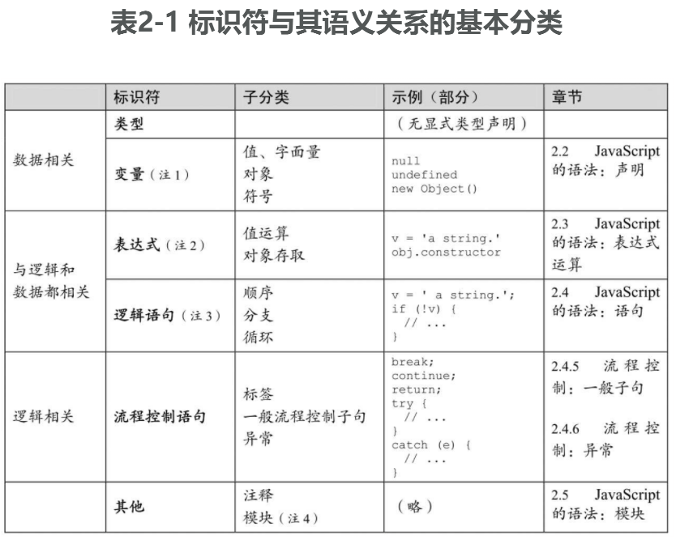
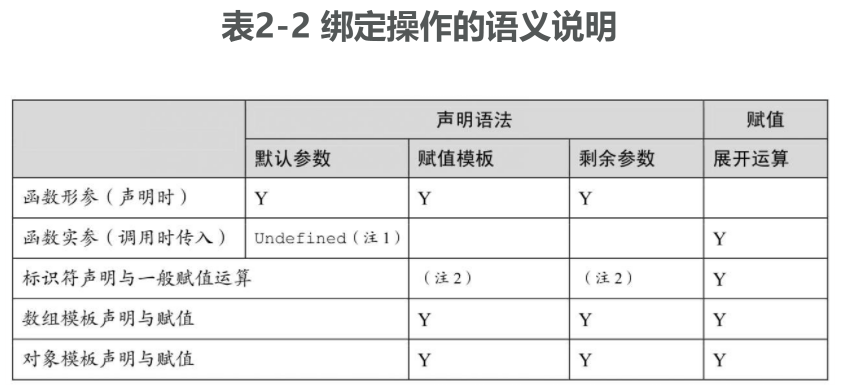
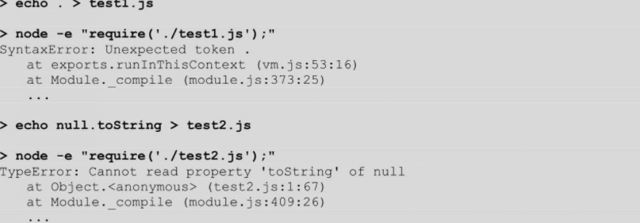

# 语法综述

语言中的标识符一般可以分为两类，一类用于命名语法、符号等抽象概念，另一类用于命名数据（的存储位置）。前者被称为“语法关键字”，后者则被称为“变量”和“常量”。

由此引入了一个概念：绑定。从标识符的角度来说，绑定分为语法关键字与语义逻辑的绑定，以及变量与它所存储数据和位置性质的绑定。

其中，语法关键字对语义逻辑的绑定结果，是对作用域的限定；变量对位置性质的绑定结果，则是对变量生存周期的限定

## 标识符所绑定的语义

所谓声明，即约定数据的生存周期和逻辑的作用域

- 纯粹陈述“数据”的过程，被称为变量和类型声明
- 纯粹陈述“逻辑”的过程，被称为语句（含流程控制子句）。
- 陈述“数据与（算法的）逻辑”的关系的过程，被称为表达式。

- “符号（Symbol）”是 ES6 添加的新数据类型，可以同其他数据一样绑定给变量或标识符。
- 表达式首先是与数据相关的，但因为存在运算的先后顺序，所以也有逻辑相关的含义。
- JavaScript 中的逻辑语句是有值的，因此它也是数据相关的。这一点与其他多数语言不一样。
- 一些模块的实现方案与逻辑（例如流程控制）相关，例如 Node.js。但一些实现方案则是逻辑无关的，例如 ECMAScript 的静态模块机制就是如此，它只描述模块之间的依赖关系。

除了“声明”在语义上对绑定内容的限制之外，当一个被声明的标识符（变量、常量或符号等）去绑定一个数据时，事实上还有其他两个方面的语义：数据（受作用域限制）的生存周期及可写性。这三者是 JavaScript 在

- 用于显式数据声明的语句 let/var/const、函数声明与类声明
- for 语句、`try...catch` 语句、赋值语句
- 在函数调用和 new 运算符等语法中通过形式参数传入值

这些语义中都存在着隐式或显式数据声明的原因：它们有着各自在“作用域、值和可写性”三方面的不同性质。

从 ES6 开始提供了一些新的具有绑定标识符语义的语法，尽管在这几类绑定操作上存在着处理细节上的不同，但总体还是围绕上述三种性质来设计的，如表 2-2 所示

- 在实参中传入 undefined 值，表明对应的形参使用参数默认值
- 使用 const/let/var 时可以理解为“标识符声明+一般赋值运算”两个步骤。但在一般赋值运算过程中，其左侧操作数尽管可以使用赋值模板和剩余参数的语法，但是不具有标识符声明的语义（变量的隐式声明除外）

表 2-2 意味着其实只有“展开运算”是作为运算符来使用的，其他所有特性都是声明语法中的绑定，它们在词法阶段就决定了标识符的那些性质，例如它与（将来的）值之间的关系。

## 识别语法错误与运行错误

一般来说，JavaScript 引擎会在代码装入时先进行语法分析，如果语法分析通不过，整个脚本代码块都不执行；当语法分析通过时，脚本代码才会执行。若在执行过程中出错，那么在同一代码上下文中、出错点之后的代码将不再执行。

不同引擎处理这两类错误的提示的策略并不相同，在 Node.js 中可以方便地使用 `require()` 将脚本文件作为一个模块来装载，并有效地识别、提示这两类错误信息。例如

事实上，Node.js 命令行上传入的主文件也是作为模块加载的，因此下面的示例与上述效果相同：

或者，也可以直接使用 Node.js 在命令行上做语法检测：

# 声明

JavaScript 是弱类型语言。但所谓弱类型语言，只表明该语言在表达式运算中不强制校验操作数的数据类型，而并不表明该语言是否具有类型系统。

## 变量的数据类型

- 直到 JavaScript 1.3/ES3 时，字符串都是不能通过下标来索引单个字符的。在 ES5 之后，规范约定将字符串下标索引理解为属性存取；在 ES6 之后，字符串被映射为可迭代对象，因此也可以用 `for...of` 来列举单个字符，但这种情况下得到的字符是迭代成员（而不是属性描述符）
- 在 JavaScript 中，函数的多重含义包括函数、方法、构造器、生成器、类以及函数对象等
- 在 ES6 以前，因为不具备对象系统的全部特性，因此 JavaScript 通常被称为基于对象而非面向对象的语言。而在 ES6 中标准化了 class 和 super 等关键字以支持基于类继承的面向

