# 语法综述

语言中的标识符一般可以分为两类，一类用于命名语法、符号等抽象概念，另一类用于命名数据（的存储位置）。前者被称为“语法关键字”，后者则被称为“变量”和“常量”。

由此引入了一个概念：绑定。从标识符的角度来说，绑定分为语法关键字与语义逻辑的绑定，以及变量与它所存储数据和位置性质的绑定。

其中，语法关键字对语义逻辑的绑定结果，是对作用域的限定；变量对位置性质的绑定结果，则是对变量生存周期的限定

## 标识符所绑定的语义

所谓声明，即约定数据的生存周期和逻辑的作用域

- 纯粹陈述“数据”的过程，被称为变量和类型声明
- 纯粹陈述“逻辑”的过程，被称为语句（含流程控制子句）。
- 陈述“数据与（算法的）逻辑”的关系的过程，被称为表达式。

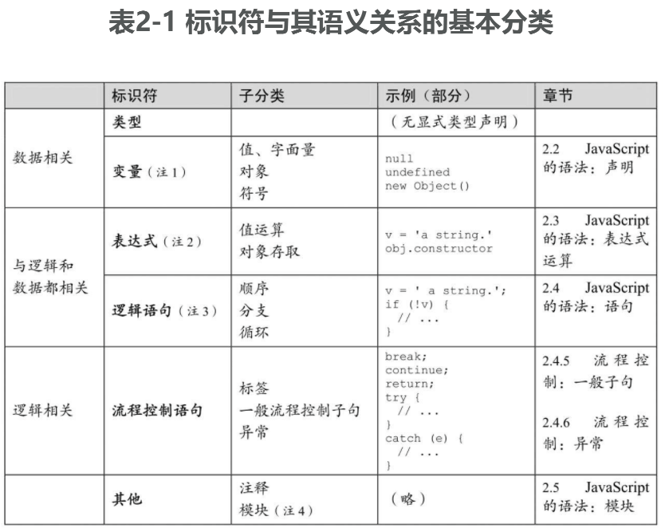

- “符号（Symbol）”是 ES6 添加的新数据类型，可以同其他数据一样绑定给变量或标识符。
- 表达式首先是与数据相关的，但因为存在运算的先后顺序，所以也有逻辑相关的含义。
- JavaScript 中的逻辑语句是有值的，因此它也是数据相关的。这一点与其他多数语言不一样。
- 一些模块的实现方案与逻辑（例如流程控制）相关，例如 Node.js。但一些实现方案则是逻辑无关的，例如 ECMAScript 的静态模块机制就是如此，它只描述模块之间的依赖关系。

除了“声明”在语义上对绑定内容的限制之外，当一个被声明的标识符（变量、常量或符号等）去绑定一个数据时，事实上还有其他两个方面的语义：数据（受作用域限制）的生存周期及可写性。这三者是 JavaScript 在

- 用于显式数据声明的语句 let/var/const、函数声明与类声明
- for 语句、`try...catch` 语句、赋值语句
- 在函数调用和 new 运算符等语法中通过形式参数传入值

这些语义中都存在着隐式或显式数据声明的原因：它们有着各自在“作用域、值和可写性”三方面的不同性质。

从 ES6 开始提供了一些新的具有绑定标识符语义的语法，尽管在这几类绑定操作上存在着处理细节上的不同，但总体还是围绕上述三种性质来设计的，如表 2-2 所示

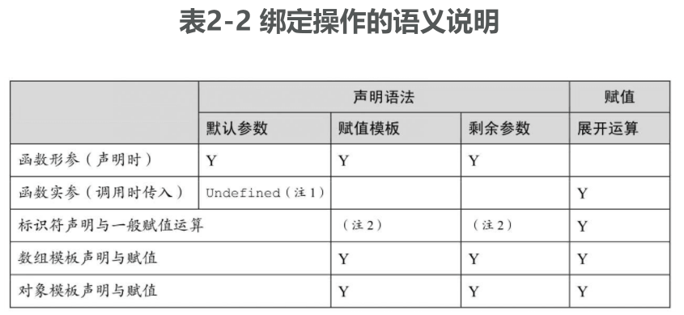

- 在实参中传入 undefined 值，表明对应的形参使用参数默认值
- 使用 const/let/var 时可以理解为“标识符声明+一般赋值运算”两个步骤。但在一般赋值运算过程中，其左侧操作数尽管可以使用赋值模板和剩余参数的语法，但是不具有标识符声明的语义（变量的隐式声明除外）

表 2-2 意味着其实只有“展开运算”是作为运算符来使用的，其他所有特性都是声明语法中的绑定，它们在词法阶段就决定了标识符的那些性质，例如它与（将来的）值之间的关系。

## 识别语法错误与运行错误

一般来说，JavaScript 引擎会在代码装入时先进行语法分析，如果语法分析通不过，整个脚本代码块都不执行；当语法分析通过时，脚本代码才会执行。若在执行过程中出错，那么在同一代码上下文中、出错点之后的代码将不再执行。

不同引擎处理这两类错误的提示的策略并不相同，在 Node.js 中可以方便地使用 `require()` 将脚本文件作为一个模块来装载，并有效地识别、提示这两类错误信息。例如

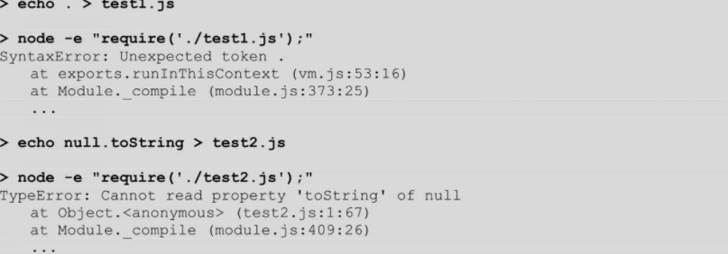

事实上，Node.js 命令行上传入的主文件也是作为模块加载的，因此下面的示例与上述效果相同：

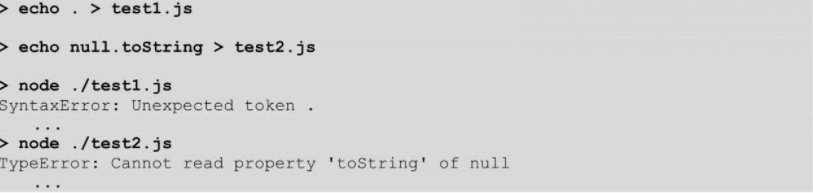

或者，也可以直接使用 Node.js 在命令行上做语法检测：

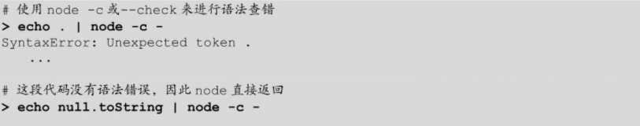

# 声明

JavaScript 是弱类型语言。但所谓弱类型语言，只表明该语言在表达式运算中不强制校验操作数的数据类型，而并不表明该语言是否具有类型系统。

## 变量的数据类型

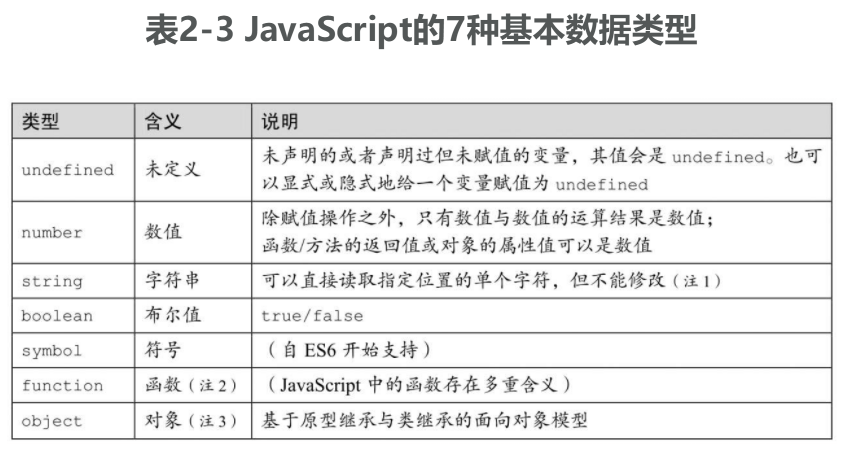

- 直到 JavaScript 1.3/ES3 时，字符串都是不能通过下标来索引单个字符的。在 ES5 之后，规范约定将字符串下标索引理解为属性存取；在 ES6 之后，字符串被映射为可迭代对象，因此也可以用 `for...of` 来列举单个字符，但这种情况下得到的字符是迭代成员（而不是属性描述符）
- 在 JavaScript 中，函数的多重含义包括函数、方法、构造器、生成器、类以及函数对象等
- 在 ES6 以前，因为不具备对象系统的全部特性，因此 JavaScript 通常被称为基于对象而非面向对象的语言。而在 ES6 中标准化了 class 和 super 等关键字以支持基于类继承的面向

### 基本数据类型

任何一个变量或值的类型都可以（而且应当首先）使用 typeof 运算得到。typeof 是 JavaScript 内部保留的一个关键字，它是一个运算符而不是一个函数。尽管它看起来可以像函数调用一样在后面跟上一对括号，例如

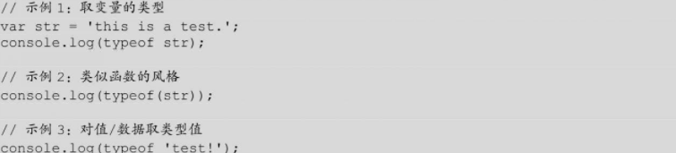

### 宿主定义的其他对象类型

在具体宿主的实现上，ECMAScript 规范接受（但不推荐）typeof 返回上述 7 种类型之外的值。在这种情况下，该变量或值应该是一个宿主自定义的对象（是引用类型，而非其他值类型），并且不能实现对象的 `[[call]]` 内部方法。因为一旦实现该方法，那么该对象的行为就与函数类型一致了。

在早期的 JavaScript 语言中，正则表达式对象是可执行的，因此兼容这一早期特性（而又不得不遵循 ECMAScript 规范）的 JavaScript 引擎就只能为正则表达式对象的 typeof 值返回为 `function`。

### 值类型与引用类型

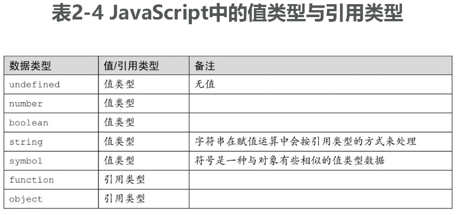

在 JavaScript 中，严格相等（===）运算符用来对值类型/引用类型的实际数据进行比较和检查。按照约定，在基于上述类型系统的运算中

- 一般表达式运算的结果总是值
- 函数/方法调用的结果可以返回值类型或者引用
- 值与引用、值与值之间即使相等（==），也不一定严格相等（===）
- 两个引用之间如果相等（==），则一定严格相等（===）

同其他语言一样，在 JavaScript 中，值类型与引用类型也用于表明运算时使用数据的方式：参与运算的是其值还是其引用。因此，在下面的示例中，当两次调用函数 `func()` 时，各自传入的数据采用了不同的方式：

```js
var str = 'abcde';
var obj = new String(str);

function newToString() {
  return 'hello, world!';
}

function func(val) {
  val.toString = newToString;
}

// 示例 1：传入值
func(str);
console.log(str); // 'abcde'

// 示例 2：传入引用
func(obj);
console.log(String(obj)); // 'hello, world!'
```

从语义上来说，由于在示例 1 中实际只传入了 str 的值，因此对它的 toString 属性的修改是无意义的；而在示例 2 中传入了 obj 的引用，因此对它的 toString 属性的修改将会影响到后来调用 `obj.toString()` 的效果。因此两个示例返回的结果不同

### 讨论：ECMAScript 的类型系统

JavaScript 存在如下两套类型系统。

- 类型系统 1: 7 种基本数据类型
- 类型系统 2：值类型与引用类型

然而 ECMAScript 规范又对类型系统做了另外的约定。

- 类型系统 3：ECMAScript 语言类型（ECMAScript language types）
- 类型系统 4：ECMAScript 规范类型（ECMAScript specification types）
- 类型系统 5：对象类型（参见“3.4 JavaScript 的对象系统”）
- 类型系统 6：原子对象类型系统（Atom objecttype）

首先，ECMAScript 语言类型并不是“典型的” JavaScript 语言类型。试图使用 ECMAScript language types 来直接映射 JavaScript language types 是徒劳的，并且将会引入更多的混淆和不可解释的特例。

ECMAScript 语言类型的存在，就是为了撰写 ECMAScript 规范本身，以明确叙述该语言的规范。这些数据类型与 JavaScript 对数据类型的约定有如下三点不同

- ECMAScript 语言类型用首字符大写的单词作为类型名，例如 Undefined；而 JavaScript 语言类型使用字符串作为类型名，且首字符小写，例如 undefined，并且叙述中通常在不混淆的情况下也可以省掉单/双引号来直接作为类型名，例如 undefined。
- ECMAScript 语言类型中的 Null 是一个类型，并且有一个唯一值 null；而在 JavaScript 语言类型中没有 Null 类型，null 值是对象类型的一个特殊实例
- ECMAScript 语言类型中没有函数类型，函数是对象类型的一个变体（Exotic Object），即对象类型的一种实现；而 JavaScript 语言类型中函数是第一类类型（First class type），即能用 typeof 关键字检查的、与 string、object 等同级别的基本类型

ECMAScript 的这种类型定义极大地方便了它的规范制定。由于 Null 值是特殊的、在语言层面就被解释的（而不是作为对象类型的特例），因此它被广泛用于各种结构、定义和逻辑中的识别条件；反过来，由于 function 是对象的实例，因此大多数时候它就只需要按对象的特性来操作和处理。后者的典型表现，就是在 ECMAScript 中有一个专门的过程来判断“是/不是对象”，而无须用这一方式来判断“是/不是函数”

```
... Type(v) is Object
```

基于此，ECMAScript 约定它的类型也可以归纳成两类：对象（Object）和基础类型（即除开 Object 之外的其他 6 种类型）。这两种类型是可以转换的，这些内部过程称为抽象操作（Abstract Operations），包括 `ToPrimitive()` 和 `ToObject()` 等

我们接下来讨论“类型系统 4”，即 ECMAScript 规范类型。

在 ECMAScript 规范类型中没有与上述两种语言类型（ECMAScript 或 JavaScript 的语言类型）重合的任何类型或语义。准确地说，所谓 ECMAScript 规范类型，就是为了在规范的行文中实现 ECMAScript 语言类型而存在的。总共约定了 10 种规范类型，包括：

- List、Record、Set、Relation，其中主要的是 List 和 Record 类型，是整个 ECMAScript 规范实现中采用最多的数据类型
- Completion Record、Reference、PropertyDescriptor，主要用来作为运算的结果（Result）或中间结果，其中属性描述符（Property Descriptor）是实现 JavaScript 对象时使用的核心组件
- Data Blocks，主要用在内存、共享数据等的描述中
- Lexical Environment、Environment Record，主要用在词法和运行期环境等的描述中。

最后，重点地、再次总结一下上述内容，即

- ECMAScript 规范类型是为了实现 ECMAScript 语言类型而存在的。
- ECMAScript 语言类型是为了叙述 JavaScript 语言的规范而存在的。

因此后文中将尽量避免使用和讨论 ECMAScript 规范类型，并且在多数情况下不会对 ECMAScript 语言类型的特殊性再作说明。

## 变量声明

JavaScript 中的变量声明有两种方法：

- 显式声明
- 隐式声明（即用即声明）

所谓显式声明，一般是指使用 var 等关键字进行的声明。一般语法为：

```js
var variable1 [ = value1 ] [, variable2 [ = value2 ], ... ]
let variable2 = ...
```

例如：

```js
// 声明变量 str、num，以及 x、y
var str = 'test';
var x,
  y,
  num = 3 + 2 - 5;
```

也包括在一些语句中使用 var 等关键字进行声明，例如 for 语句：

```js
// 声明变量 n
for (var n in Object) {
  // ...
}
// 声明变量 i, j, k
for (let i, j, k = 0; k < 100; k++) {
  // ...
}
```

还有两种情况是具名函数声明和异常捕获子句中声明的异常对象。例如：

```js
// 声明函数 foo
function foo() {
  str = 'test';
}

// 声明异常对象 e
try {
  // ...
} catch (e) {
  // ...
}
```

而隐式声明则发生在一般的赋值语句中。例如

```js
// 当 aVar 未被声明时，以下语句将隐式声明它
aVar = 100;
```

解释器总是将显式声明理解为“变量声明”，而对隐式声明则不一定，如图 2-1 所示。

- 如果变量未被声明，则先声明该变量并立即给它赋值
- 如果变量已经声明过，则该语句是赋值语句

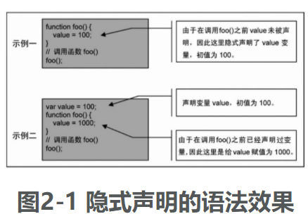

### 块级作用域的变量声明与一般 var 声明

除了以下三点不同，let 的语法以及使用场景都与 var 一致：

- var 声明的变量，其作用域为当前函数、模块或全局；let 声明的变量，其作用域总是在当前的代码块，例如语句块
- 在同一个代码块中，可以用 var 来多次声明变量名，这在语法分析中与声明一次没有区别；而用 let 却只能声明一次，覆盖一个已经声明的 let 变量（或者用 let 去覆盖一个已声明过的标识符）会导致语法错误
- 用户代码可以在声明语句之前使用所声明的 var 变量，这时该变量的值是 undefined；而 let 声明的变量必须先声明后使用，声明语句之前的代码引用了 let 变量会触发异常，这也会导致 typeof 成为一个不安全的运算

当 let 声明发生在全局代码块时，它与 var 声明存在细微的差别。这是因为按照早期 JavaScript 的约定，在全局代码块使用 var 声明（和具名函数声明语法）时，相当于在全局对象 global 上声明了一个属性，进而使所有代码都能将这些声明作为全局变量来访问。

而 let 声明与其他一些较新的语法元素遵从“块级作用域”规则，因此即使出现在全局代码块中，它们也只是声明为“全局作用域”中的标识符，而不作为对象 global 上的属性，例如

```js
var x = 100;
let y = 200;
console.log(Object.getOwnPropertyDescriptor(global, 'x').value); // 100
console.log(Object.getOwnPropertyDescriptor(global, 'y')); // undefined
```

常量声明 const、类声明 class 在块级作用域上的特性与 let 声明是类似的。

### 用赋值模板声明一批变量

JavaScript 声明一批变量的传统方法是用 var 关键字，即在一个 var 中声明多个变量名。而 ES6 开始支持更为灵活的解构赋值语法，这个表达式的左侧操作数称为“赋值模板（AssignmentPattern）”：

```
AssignmentPattern = expression
```

当这个模板使用在 var 等变量声明中时，也可以成批地声明变量。例如：

```js
// 使用数组解构赋值，声明变量 x, y
var [x, y] = [1, 2];
// 使用对象解构赋值，声明变量 height, width
let { clientHeight: height, clientWidth: width } = window.document.body;
```

在赋值模板中可以使用剩余参数语法来声明数组或对象。例如：

```js
// 在变量声明的赋值模板中使用剩余参数，可以声明数组变量 more
var [x, y, ...more] = [1, 2, 3, 4, 5];

// 在对象解构赋值中使用剩余参数，可以声明对象变量 moreProps
let [x, y, ...moreProps] = { x: 100, y: 200, z: 300 };
```

## 使用字面量风格的值

除了定义一个可用的标识符，变量声明通常还具有两方面的功能，一是声明类型，二是声明初值。但 JavaScript 中没有类型声明的概念，因此这时变量声明就只用来说明一个变量的初值。在声明中，等号右边既可以是表达式，这意味着将表达式运算的结果作为该变量的初值，也可以是更为强大和灵活的字面量声明。例如：

```js
var num = 3 + 2 - 5; // 3 + 2 - 5 是一个表达式
var str = 'test'; // 'test' 是字面量
```

字面量类似汇编语言中的立即值—无须声明就可以立即使用的常值。从它的语法形式来说，也被称为或翻译为直接量。表 2-5 简要说明了 JavaScript 中能用字面量风格来声明的数据类型和对象

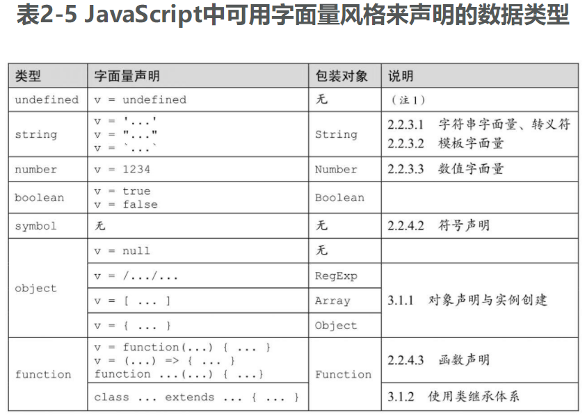

1. undefined 并没有被称为字面量，这可能是有着其历史原因的：在早期的 JavaScript 中，undefined 既不是关键字，也不能直接声明。

### 字符串字面量、转义符

你总是可以用一对双引号或一对单引号来表示字符串字面量。早期 Netscape 的 JavaScript 中允许出现非 Unicode 的字符，但现在 ECMAScript 标准统一要求字符串必须是 Unicode 字符序列。

转义符主要用于在字符串中包含控制字符，以及当前操作系统语言和字符集中不能直接输入的字符；也可以用于在字符串中嵌套引号（可以在单引号声明的字符串中直接使用双引号，或反过来在双引号中使用单引号）。转义符总是用一个反斜线字符“\”引导，包括表 2-6 中所示的转义序列。

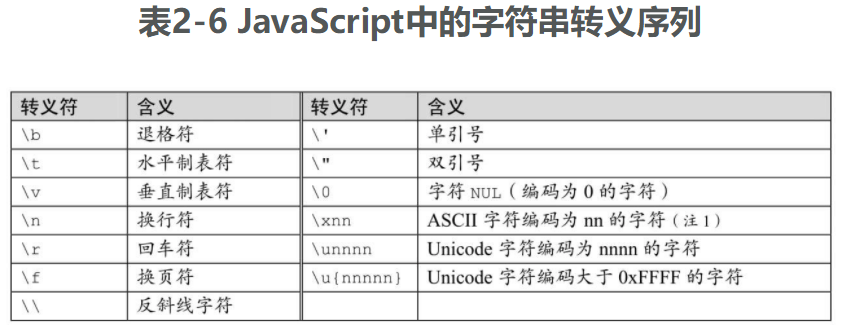

1. 将被转换为 Unicode 字符存储

除了定义转义符之外，当反斜线字符“\”位于一行的末尾（其后立即是代码文本中的换行）时，也用于表示连续的字符串声明。这在声明大段文本块时很有用。例如：

// TODO 读到这里

```js
var aTextBlock =
  '\
abcde\
 \
123456789\
 \
+-*/';
```

该示例第 4 行与第 6 行中各包括了一个空格，因此输出时第 3、5、7 行将用一个空格分开。显示为：

```
abcde 123456789 +-*/
```

在各行中仍然可以使用其他转义符—只要它们出现在文本行最后的这个“\”字符之前即可。不过与某些语言的语法不同的是，不能在这种表示法的文本行末使用注释。

另外一个需要特别说明的是“\0”，它表示 NUL 字符。在某些语言中，NUL 用于说明一种“以＃0 字符结束的字符串”（这也是 Windows 操作系统直接支持的一种字符串形式），在这种情况下，字符串是不能包括该 NUL 字符串的。但在 JavaScript 中，这是允许存在的。这时，NUL 字符是一个真实存在于字符序列中的字符。下例说明了 NUL 字符在 JavaScript 中的真实性：

```js
// 示例
str1 = String.fromCharCode(0, 0, 0, 0, 0);
str2 = '\0\0\0\0\0';

// 显示字符串长"5"，表明 NUL 字符在字符串中是真实存在的
console.log(str1.length);
console.log(str2.length);
```

在 ES6 中增加了“\u{nnnnn}”来表示码点大于 0xFFFF 的 Unicode 字符的语法，这意味着它支持直接声明和使用 UTF-16 字符。所以在这种情况下，在当前字符集使用 UTF-8 时，一个用“\u{nnnnn}”表达的 Unicode 字符的长度将是 2。例如：

```js
// 如果当前字符集为 UTF-8，则将显示字符串长“2”
console.log('\u{20BB7}'.length);
```

在 JavaScript 中也可以用一对不包含任意字符的单引号或双引号来表示一个空字符串（Null String），其长度值总是为 0。比较容易被忽视的是，空字符串与其他字符串一样也可以用作对象成员名。例如：

```js
obj = {
  '': 100
};

// 显示该成员的值：100
console.log(obj['']);
```

### 模板字面量

从 ES6 开始出现的模板字面量（template literal）用一对反引号（\`）来标识，可以将其理解为一种增强的字符串声明。在使用反引号声明的字符串中，可以使用 `${...}` 这样的语法来捕获当前上下文中的变量、常量、字面量或对象成员属性：

```js
var message = 'Hello world';
console.log(`The message is: ${message}`);
```

以及计算一个表达式并将结果转换为字符串值—这也意味着这样的字符串其实是动态的。例如：

```js
console.log(`The null is ${typeof null} type.`); // The null is object type.
```

模板字面量本质上来说是一个字面量的引用—该字面量在 JavaScript 内部表达为一个对象（array-like object）或数组：

```js
foo = (tpl) => console.log(typeof tpl, tpl instanceof Array, (ref = tpl));
foo`xyz`; // object true ['xyz']
```

用户代码也可以使用一个带 .raw 属性的类数组对象来替代它，这个 .raw 属性指向该“表达该模板字面量的内部数组”的一个原始的、未经转义的格式。例如，用在 String.raw() 中

```js
console.log(String.raw({ raw: ['', ',\nworld'] }, 'Hi'));
// Hi,
// world
```

它等义于：

```js
foo = (tpl) => String.raw(tpl, 'Hi');
console.log(foo`${1},\nworld`);
```

另外，模板也可以用于多行字符串的声明

### 数值字面量

数值字面量总是以一个数字字符，或一个点字符“.”，以及不多于一个的正值符号“+”或负值符号“-”开始。当以数字字符开始时，它有四条规则：

1. 如果以 0x 或 0X 开始，则表明是一个十六进制数值。
2. 如果以 0o 或 0O 开始，则表明是一个八进制数值。
3. 如果以 0b 或 0B 开始，则表明是一个二进制数值。
4. 在其他情况下，表明是一个十进制整数或浮点数。

当以点字符“.”开始时，它总是表明一个十进制浮点数。正值符号“+”、负值符号“-”总是可以出现在上述两种表示法（以数字字符或以点字符）的前面。例如：

```
1234 // 十进制整数
0x1234 // 十六进制整数
0o1234 // 八进制整数
0b1101 // 二进制整数
```

当一个字面量被识别为十六进制数值时，该字面量由 0 ～ 9 和 A ～ F 字符构成；当被识别为八进制数值时，该字面量由 0 ～ 7 字符构成—类似地，如果在语法分析中发现其他字符，则出现语法分析错误。

当一个字面量被识别为十进制整型数时，它内部的存放格式可能是浮点数，也可能是整型数，这取决于不同引擎的实现。因此不能指望 JavaScript 中的整型数会有较高的运算性能。但是你可以用位运算来替代算术运算，这时引擎总是以整型数的形式来运算的—即使操作数是一个浮点数。

当一个字面量被识别为十进制数时，它可以由 0 ～ 9，以及（不多于一个的）点字符“.”或字符 e、E 组成。当包括点字符“.”、字符 e 或 E 时，该字面量总被识别为浮点数（注意，某些引擎会优化一些字面量的内部存储形式）。例如：

```
3.1415926
12.345
.1234
.0e8
1.02E30
```

当使用带字符 e、E 的指数法表示时，也可以使用正、负符号来表示正、负整数指数。例如：

```
1.555E+30
1.555E-30
```

## 其他声明

### 常量声明

const 关键字用于常量声明。常量声明与变量声明都是用来将一个标识符（变量名/常量名）与其对应的数据存储绑定起来，这在本质上并没有不同。但是从语义上来讲，变量表明相应的数据是可修改的，而常量表明它不可修改。除了这一点语义上的不同之外，所有与变量声明相关的特性（例如，数据的类型、字面量声明、字符串转义等）也都体现在常量声明上。例如：

```js
// 使用字面量的常量声明
const stringValue = 'abcd\nefg';

// 正则表达式常量
const regexpInstace = /./;
```

const 与 let 对作用域的理解类似，也是块级作用域的，因此也同样有别于 var 声明：既不能覆盖一个已经声明的常量，也不可能在它的声明语句之前访问它：

```js
const i = 100;
const i = 100; // Uncaught SyntaxError: Identifier 'i' has already been declared
```

而对常量进行重新赋值的操作通常会无效或触发异常：

```js
// 续上例
i = 300; // 尝试修改常量的值

console.log(i); // 100，显示上述修改无效
```

### 符号声明

符号是从 ES6 开始支持的一种数据类型，它可以使用一般形式的变量声明或常量声明（const/var/let），与其他数据类型在声明上并没有特别的不同：

```js
var aSymbol = Symbol();
const aSymbolConst = Symbol();
```

符号没有字面量声明形式。由于符号是值而非对象（我称之为“近似对象的”一种值类型数据），所以也不能使用 new 运算符来创建它。

### 函数声明

在 JavaScript 中，函数是一种数据类型，所以函数声明是变量声明的一种特殊形式：

```js
function functionName() {
  // ...
}
```

当 functionName 是一个有效标识符时，表示声明的是一个具名函数。functionName 后使用一对不能省略的“()”来表示形式参数列表。所谓形式参数，是指可以在函数体内部使用的、有效的标识符名。可以声明零至多个形式参数，即使在函数体内部并不使用它们。或者也可以不声明形式参数，这时也可以在函数体内使用一个名为 arguments 的内部对象来存取函数调用时的传入值。在函数体中，可以有零至任意多行代码、内嵌函数。在函数体内出现的使用 var 进行的显式变量声明，或者隐式的变量声明，都将被视为函数体内部的局部变量；该函数的内嵌函数的名字，也将作为局部变量。

不同于早期的 JScript，在 ES5 以后的规范中，明确规定了在表达式中出现的具名函数名只影响该函数内的代码，而不会影响该表达式所在的作用域，示例如下：

```js
// 在 if 语句的条件表达式中使用具名函数 foo
if (function foo() {});

// 在早期的 JScript 中，会显示有效的类型名 function
// 这是因为上述 foo 函数会声明在全局，这是不规范的实现
console.log(typeof foo);
```

在声明函数的形式参数时，可以为参数指定默认值“（default parameters）”：

```js
function foo(x, y = 100) {
  console.log([x, y]);
}

// 示例
foo('abc'); // abc,100
```

如果默认值并没有放在参数列表的尾部，那么可以使用 undefined，在传参时表明该参数使用默认值：

```js
function foo(x = 'abc', y) {
  console.log([x, y]);
}

// 示例
foo(undefined, 'abc'); // abc,abc
```

可以在参数列表尾部使用“剩余参数（rest parameter）”，它用一个带 `...` 前缀的参数名（形参）来捕获所有未被声明的实参。在这种情况下，该形参总是一个包含所有剩余参数的数组，例如：

```js
function foo(x, y, ...z) {
  console.log(z);
}

// 示例
foo('a', 'b', 'c', 'd'); // ['c', 'd']
```

也可以在剩余参数中使用赋值模板。例如，下面用一个数组赋值模板替代了上例中的形参 z：

```js
function foo(x, y, ...[m, n]) {
  console.log(m);
}

// 示例
foo('a', 'b', 'c', 'd'); // 'c'
```

并且反过来，也可以在赋值模板中使用剩余参数语法。例如：

```js
var [x, y, ...more] = [1, 2, 3, 4, 5];

// 示例
console.log(more); // [3, 4, 5]
```

使用 class 关键字来声明的类，也是一个函数。因此可以将类声明理解为函数声明的一种特殊语法。但是类声明得到的函数只能使用 new 运算来创建对象实例，而不能直接作为函数调用。而如果在语法关键字 function 之后加 \* 字符，则会声明一个特殊的函数：生成器。
