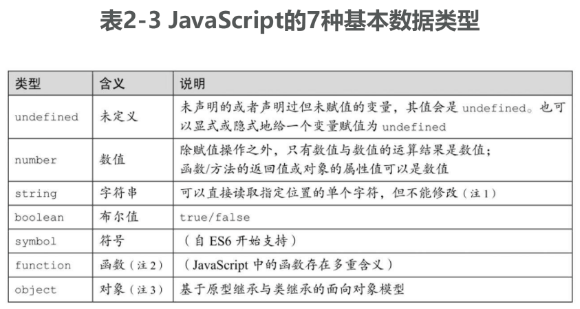

# 语法综述

语言中的标识符一般可以分为两类，一类用于命名语法、符号等抽象概念，另一类用于命名数据（的存储位置）。前者被称为“语法关键字”，后者则被称为“变量”和“常量”。

由此引入了一个概念：绑定。从标识符的角度来说，绑定分为语法关键字与语义逻辑的绑定，以及变量与它所存储数据和位置性质的绑定。

其中，语法关键字对语义逻辑的绑定结果，是对作用域的限定；变量对位置性质的绑定结果，则是对变量生存周期的限定

## 标识符所绑定的语义

所谓声明，即约定数据的生存周期和逻辑的作用域

- 纯粹陈述“数据”的过程，被称为变量和类型声明
- 纯粹陈述“逻辑”的过程，被称为语句（含流程控制子句）。
- 陈述“数据与（算法的）逻辑”的关系的过程，被称为表达式。


- “符号（Symbol）”是 ES6 添加的新数据类型，可以同其他数据一样绑定给变量或标识符。
- 表达式首先是与数据相关的，但因为存在运算的先后顺序，所以也有逻辑相关的含义。
- JavaScript 中的逻辑语句是有值的，因此它也是数据相关的。这一点与其他多数语言不一样。
- 一些模块的实现方案与逻辑（例如流程控制）相关，例如 Node.js。但一些实现方案则是逻辑无关的，例如 ECMAScript 的静态模块机制就是如此，它只描述模块之间的依赖关系。

除了“声明”在语义上对绑定内容的限制之外，当一个被声明的标识符（变量、常量或符号等）去绑定一个数据时，事实上还有其他两个方面的语义：数据（受作用域限制）的生存周期及可写性。这三者是 JavaScript 在

- 用于显式数据声明的语句 let/var/const、函数声明与类声明
- for 语句、`try...catch` 语句、赋值语句
- 在函数调用和 new 运算符等语法中通过形式参数传入值

这些语义中都存在着隐式或显式数据声明的原因：它们有着各自在“作用域、值和可写性”三方面的不同性质。

从 ES6 开始提供了一些新的具有绑定标识符语义的语法，尽管在这几类绑定操作上存在着处理细节上的不同，但总体还是围绕上述三种性质来设计的，如表 2-2 所示


- 在实参中传入 undefined 值，表明对应的形参使用参数默认值
- 使用 const/let/var 时可以理解为“标识符声明+一般赋值运算”两个步骤。但在一般赋值运算过程中，其左侧操作数尽管可以使用赋值模板和剩余参数的语法，但是不具有标识符声明的语义（变量的隐式声明除外）

表 2-2 意味着其实只有“展开运算”是作为运算符来使用的，其他所有特性都是声明语法中的绑定，它们在词法阶段就决定了标识符的那些性质，例如它与（将来的）值之间的关系。

## 识别语法错误与运行错误

一般来说，JavaScript 引擎会在代码装入时先进行语法分析，如果语法分析通不过，整个脚本代码块都不执行；当语法分析通过时，脚本代码才会执行。若在执行过程中出错，那么在同一代码上下文中、出错点之后的代码将不再执行。

不同引擎处理这两类错误的提示的策略并不相同，在 Node.js 中可以方便地使用 `require()` 将脚本文件作为一个模块来装载，并有效地识别、提示这两类错误信息。例如


事实上，Node.js 命令行上传入的主文件也是作为模块加载的，因此下面的示例与上述效果相同：


或者，也可以直接使用 Node.js 在命令行上做语法检测：


# 声明

JavaScript 是弱类型语言。但所谓弱类型语言，只表明该语言在表达式运算中不强制校验操作数的数据类型，而并不表明该语言是否具有类型系统。

## 变量的数据类型



- 直到 JavaScript 1.3/ES3 时，字符串都是不能通过下标来索引单个字符的。在 ES5 之后，规范约定将字符串下标索引理解为属性存取；在 ES6 之后，字符串被映射为可迭代对象，因此也可以用 `for...of` 来列举单个字符，但这种情况下得到的字符是迭代成员（而不是属性描述符）
- 在 JavaScript 中，函数的多重含义包括函数、方法、构造器、生成器、类以及函数对象等
- 在 ES6 以前，因为不具备对象系统的全部特性，因此 JavaScript 通常被称为基于对象而非面向对象的语言。而在 ES6 中标准化了 class 和 super 等关键字以支持基于类继承的面向

### 基本数据类型

任何一个变量或值的类型都可以（而且应当首先）使用 typeof 运算得到。typeof 是 JavaScript 内部保留的一个关键字，它是一个运算符而不是一个函数。尽管它看起来可以像函数调用一样在后面跟上一对括号，例如


### 宿主定义的其他对象类型

在具体宿主的实现上，ECMAScript 规范接受（但不推荐）typeof 返回上述 7 种类型之外的值。在这种情况下，该变量或值应该是一个宿主自定义的对象（是引用类型，而非其他值类型），并且不能实现对象的 `[[call]]` 内部方法。因为一旦实现该方法，那么该对象的行为就与函数类型一致了。

在早期的 JavaScript 语言中，正则表达式对象是可执行的，因此兼容这一早期特性（而又不得不遵循 ECMAScript 规范）的 JavaScript 引擎就只能为正则表达式对象的 typeof 值返回为 `function`。

### 值类型与引用类型


在 JavaScript 中，严格相等（===）运算符用来对值类型/引用类型的实际数据进行比较和检查。按照约定，在基于上述类型系统的运算中

- 一般表达式运算的结果总是值
- 函数/方法调用的结果可以返回值类型或者引用
- 值与引用、值与值之间即使相等（==），也不一定严格相等（===）
- 两个引用之间如果相等（==），则一定严格相等（===）

同其他语言一样，在 JavaScript 中，值类型与引用类型也用于表明运算时使用数据的方式：参与运算的是其值还是其引用。因此，在下面的示例中，当两次调用函数 `func()` 时，各自传入的数据采用了不同的方式：

```js
var str = 'abcde';
var obj = new String(str);

function newToString() {
  return 'hello, world!';
}

function func(val) {
  val.toString = newToString;
}

// 示例 1：传入值
func(str);
console.log(str); // 'abcde'

// 示例 2：传入引用
func(obj);
console.log(String(obj)); // 'hello, world!'
```

从语义上来说，由于在示例 1 中实际只传入了 str 的值，因此对它的 toString 属性的修改是无意义的；而在示例 2 中传入了 obj 的引用，因此对它的 toString 属性的修改将会影响到后来调用 `obj.toString()` 的效果。因此两个示例返回的结果不同

TODO 读到这里

### 讨论：ECMAScript 的类型系统

JavaScript 存在如下两套类型系统。

- 类型系统 1: 7 种基本数据类型
- 类型系统 2：值类型与引用类型

然而 ECMAScript 规范又对类型系统做了另外的约定。

- 类型系统 3：ECMAScript 语言类型（ECMAScript language types）
- 类型系统 4：ECMAScript 规范类型（ECMAScript specification types）
- 类型系统 5：对象类型（参见“3.4 JavaScript 的对象系统”）
- 类型系统 6：原子对象类型系统（Atom objecttype）

首先，ECMAScript 语言类型并不是“典型的” JavaScript 语言类型。试图使用 ECMAScript language types 来直接映射 JavaScript language types 是徒劳的，并且将会引入更多的混淆和不可解释的特例。

ECMAScript 语言类型的存在，就是为了撰写 ECMAScript 规范本身，以明确叙述该语言的规范。这些数据类型与 JavaScript 对数据类型的约定有如下三点不同

- ECMAScript 语言类型用首字符大写的单词作为类型名，例如 Undefined；而 JavaScript 语言类型使用字符串作为类型名，且首字符小写，例如"undefined"，并且叙述中通常在不混淆的情况下也可以省掉单/双引号来直接作为类型名，例如 undefined。
- ECMAScript 语言类型中的 Null 是一个类型，并且有一个唯一值 null；而在 JavaScript 语言类型中没有 Null 类型，null 值是对象类型的一个特殊实例
- ECMAScript 语言类型中没有函数类型，函数是对象类型的一个变体（Exotic Object），即对象类型的一种实现；而 JavaScript 语言类型中函数是第一类类型（First class type），即能用 typeof 关键字检查的、与 string、object 等同级别的基本类型

ECMAScript 的这种类型定义极大地方便了它的规范制定。由于 Null 值是特殊的、在语言层面就被解释的（而不是作为对象类型的特例），因此它被广泛用于各种结构、定义和逻辑中的识别条件；反过来，由于 function 是对象的实例，因此大多数时候它就只需要按对象的特性来操作和处理。后者的典型表现，就是在 ECMAScript 中有一个专门的过程来判断“是/不是对象”，而无须用这一方式来判断“是/不是函数”

```
... Type(v) is Object
```

基于此，ECMAScript 约定它的类型也可以归纳成两类：对象（Object）和基础类型（即除开 Object 之外的其他 6 种类型）。这两种类型是可以转换的，这些内部过程称为抽象操作（Abstract Operations），包括 `ToPrimitive()` 和 `ToObject()` 等

我们接下来讨论“类型系统 4”，即 ECMAScript 规范类型。

在 ECMAScript 规范类型中没有与上述两种语言类型（ECMAScript 或 JavaScript 的语言类型）重合的任何类型或语义。准确地说，所谓 ECMAScript 规范类型，就是为了在规范的行文中实现 ECMAScript 语言类型而存在的。总共约定了 10 种规范类型，包括：

- List、Record、Set、Relation，其中主要的是 List 和 Record 类型，是整个 ECMAScript 规范实现中采用最多的数据类型
- Completion Record、Reference、PropertyDescriptor，主要用来作为运算的结果（Result）或中间结果，其中属性描述符（Property Descriptor）是实现 JavaScript 对象时使用的核心组件
- Data Blocks，主要用在内存、共享数据等的描述中
- Lexical Environment、Environment Record，主要用在词法和运行期环境等的描述中。

最后，重点地、再次总结一下上述内容，即

- ECMAScript 规范类型是为了实现 ECMAScript 语言类型而存在的。
- ECMAScript 语言类型是为了叙述 JavaScript 语言的规范而存在的。

因此后文中将尽量避免使用和讨论 ECMAScript 规范类型，并且在多数情况下不会对 ECMAScript 语言类型的特殊性再作说明。

## 变量声明

JavaScript 中的变量声明有两种方法：

- 显式声明
- 隐式声明（即用即声明）

所谓显式声明，一般是指使用 var 等关键字进行的声明。一般语法为：

```
var variable1 [ = value1 ] [, variable2 [ = value2 ], ... ]
let variable2 = ...
```

例如：

```
// 声明变量 str、num，以及 x、y
var str = 'test'
var x, y, num = 3 + 2 - 5;
```

也包括在一些语句中使用 var 等关键字进行声明，例如 for 语句：

```js
// 声明变量 n
for (var n in Object) {
  // ...
}
// 声明变量 i, j, k
for (let i, j, k = 0; k < 100; k++) {
  // ...
}
```

还有两种情况是具名函数声明和异常捕获子句中声明的异常对象。例如：

```js
// 声明函数 foo
function foo() {
  str = 'test';
}

// 声明异常对象 e
try {
  // ...
} catch (e) {
  // ...
}
```

而隐式声明则发生在一般的赋值语句中。例如

```js
// 当 aVar 未被声明时，以下语句将隐式声明它
aVar = 100;
```

解释器总是将显式声明理解为“变量声明”，而对隐式声明则不一定，如图 2-1 所示。

- 如果变量未被声明，则先声明该变量并立即给它赋值
- 如果变量已经声明过，则该语句是赋值语句


### 块级作用域的变量声明与一般 var 声明

除了以下三点不同，let 的语法以及使用场景都与 var 一致：

- var 声明的变量，其作用域为当前函数、模块或全局；let 声明的变量，其作用域总是在当前的代码块，例如语句块
- 在同一个代码块中，可以用 var 来多次声明变量名，这在语法分析中与声明一次没有区别；而用 let 却只能声明一次，覆盖一个已经声明的 let 变量（或者用 let 去覆盖一个已声明过的标识符）会导致语法错误
- 用户代码可以在声明语句之前使用所声明的 var 变量，这时该变量的值是 undefined；而 let 声明的变量必须先声明后使用，声明语句之前的代码引用了 let 变量会触发异常，这也会导致 typeof 成为一个不安全的运算

当 let 声明发生在全局代码块时，它与 var 声明存在细微的差别。这是因为按照早期 JavaScript 的约定，在全局代码块使用 var 声明（和具名函数声明语法）时，相当于在全局对象 global 上声明了一个属性，进而使所有代码都能将这些声明作为全局变量来访问。

而 let 声明与其他一些较新的语法元素遵从“块级作用域”规则，因此即使出现在全局代码块中，它们也只是声明为“全局作用域”中的标识符，而不作为对象 global 上的属性，例如

```js
var x = 100;
var y = 200;
console.log(Object.getOwnPropertyDescriptor(global, 'x').value); // 100
console.log(Object.getOwnPropertyDescriptor(global, 'y')); // undefined
```

常量声明 const、类声明 class 在块级作用域上的特性与 let 声明是类似的。

### 用赋值模板声明一批变量

JavaScript 声明一批变量的传统方法是用 var 关键字，即在一个 var 中声明多个变量名。而 ES6 开始支持更为灵活的解构赋值语法，这个表达式的左侧操作数称为“赋值模板（AssignmentPattern）”：

```
AssignmentPattern = expression
```

当这个模板使用在 var 等变量声明中时，也可以成批地声明变量。例如：

```js
// 使用数组解构赋值，声明变量 x,y
var [x, y] = [1, 2];
// 使用对象解构赋值，声明变量 height,width
let { clientHeight: height, clientWidth: width } = window.document.body;
```

在赋值模板中可以使用剩余参数语法来声明数组或对象。例如：

```js
// 在变量声明的赋值模板中使用剩余参数，可以声明数组变量 more
var [x, y, ...more] = [1, 2, 3, 4, 5];

// 在对象解构赋值中使用剩余参数，可以声明对象变量 moreProps
let [x, y, ...moreProps] = { x: 100, y: 200, z: 300 };
```

## 使用字面量风格的值

除了定义一个可用的标识符，变量声明通常还具有两方面的功能，一是声明类型，二是声明初值。但 JavaScript 中没有类型声明的概念，因此这时变量声明就只用来说明一个变量的初值。在声明中，等号右边既可以是表达式，这意味着将表达式运算的结果作为该变量的初值，也可以是更为强大和灵活的字面量声明。例如：

```js
var num = 3 + 2 - 5; // 3 + 2 - 5 是一个表达式
var str = 'test'; // 'test' 是字面量
```

字面量类似汇编语言中的立即值—无须声明就可以立即使用的常值。从它的语法形式来说，也被称为或翻译为直接量。表 2-5 简要说明了 JavaScript 中能用字面量风格来声明的数据类型和对象


1. undefined 并没有被称为字面量，这可能是有着其历史原因的：在早期的 JavaScript 中，undefined 既不是关键字，也不能直接声明。

### 字符串字面量、转义符

你总是可以用一对双引号或一对单引号来表示字符串字面量。早期 Netscape 的 JavaScript 中允许出现非 Unicode 的字符，但现在 ECMAScript 标准统一要求字符串必须是 Unicode 字符序列。

转义符主要用于在字符串中包含控制字符，以及当前操作系统语言和字符集中不能直接输入的字符；也可以用于在字符串中嵌套引号（可以在单引号声明的字符串中直接使用双引号，或反过来在双引号中使用单引号）。转义符总是用一个反斜线字符“\”引导，包括表 2-6 中所示的转义序列。


1. 将被转换为 Unicode 字符存储

除了定义转义符之外，当反斜线字符“\”位于一行的末尾（其后立即是代码文本中的换行）时，也用于表示连续的字符串声明。这在声明大段文本块时很有用。例如：
