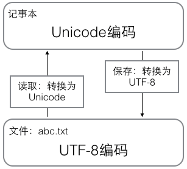
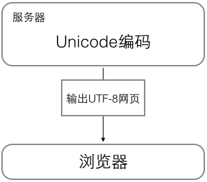

# 背景资料

- [Python-100-Days](https://github.com/jackfrued/Python-100-Days)
- [Python 教程](https://www.liaoxuefeng.com/wiki/1016959663602400)

因本人具有前端背景，以下内容只列举和 javascript 不同的地方

# 解释器

Python 的解释器很多，但使用最广泛的还是 CPython。如果要和 Java 或 .Net 平台交互，最好的办法不是用 Jython 或 IronPython，而是通过网络调用来交互，确保各程序之间的独立性。

## 直接运行 py 文件

一般是通过 `python hello.py` 运行，但是可以按照以下步骤在 Mac 和 Linux 上直接运行 `./hello.py`

```py
#!/usr/bin/env python3

print('hello, world')
```

然后，通过命令给 hello.py 以执行权限，就可以直接运行

```bash
chmod a+x hello.py
```

# 基础

- 解释型动态语言，运行速度慢，代码安全性差（不能加密）
- `#` 开头的是注释，语句以 `:` 结尾时，缩进的语句是为代码块，一般缩进 4 个空格
- 大小写敏感

## 数据类型与变量

### 数据类型

- 整数：允许在数字中间以 `_` 分隔，没有大小限制，`//` 称为地板除，即只保留整数部分
- 浮点数：浮点数运算有四舍五入的误差，整数运算是精确的，没有大小限制，超过一定范围表示为 `inf`（无限大）
- 字符串：

   - 以 `'` 或 `"` 括起来的文本，转义字符 `\` 可以用来转义
   - 使用 `r''` 表示 `''` 内部的字符串默认不转义
   - 用 `'''...'''` 表示多行内容，可以和上面的 `r` 结合使用，即 `r'''...'''`

- 布尔值：值为 `True` 或 `False`，运算符为 `and`、`or`、`not`
- 空值：值为 `None`

### 变量与常量

变量可以动态赋值，常量可以用全部大写的变量名表示，但没有任何机制可以保证不改变

## 字符串和编码

### 字符编码

Unicode 把所有语言都统一到一套编码里，最常用的是 UCS-16 编码，用两个字节表示一个字符（如果要用到非常偏僻的字符，就需要 4 个字节）。现代操作系统和大多数编程语言都直接支持 Unicode。

ASCII 编码和 Unicode 编码的区别：ASCII 编码是 1 个字节，而 Unicode 编码通常是 2 个字节。

如果统一成 Unicode 编码，乱码问题从此消失了。但是，如果你写的文本基本上全部是英文的话，用 Unicode 编码比 ASCII 编码需要多一倍的存储空间，在存储和传输上就十分不划算。

于是出现了把 Unicode 编码转化为“可变长编码”的 UTF-8 编码，如下表

| 字符 | ASCII    | Unicode           | UTF-8                      |
| :--- | :------- | :---------------- | :------------------------- |
| A    | 01000001 | 00000000 01000001 | 01000001                   |
| 中   | x        | 01001110 00101101 | 11100100 10111000 10101101 |

UTF-8 编码有一个额外的好处，就是 ASCII 编码实际上可以被看成是 UTF-8 编码的一部分，所以，大量只支持 ASCII 编码的历史遗留软件可以在 UTF-8 编码下继续工作。

总结一下现在计算机系统通用的字符编码工作方式：

在计算机内存中，统一使用 Unicode 编码，当需要保存到硬盘或者需要传输的时候，就转换为 UTF-8 编码。

用记事本编辑的时候，从文件读取的 UTF-8 字符被转换为 Unicode 字符到内存里，编辑完成后，保存的时候再把 Unicode 转换为 UTF-8 保存到文件：



浏览网页的时候，服务器会把动态生成的 Unicode 内容转换为 UTF-8 再传输到浏览器：



### Python 的字符串

对于单个字符的编码，Python 提供了 ord() 函数获取字符的整数表示，chr() 函数把编码转换为对应的字符：

```py
>>> ord('A')
65
>>> ord('中')
20013
>>> chr(66)
'B'
>>> chr(25991)
'文'
```

如果知道字符的整数编码，还可以用十六进制这么写 str：

```py
>>> '\u4e2d\u6587'
'中文'
```

两种写法完全是等价的。

由于 Python 的字符串类型是 str，在内存中以 Unicode 表示，一个字符对应若干个字节。如果要在网络上传输，或者保存到磁盘上，就需要把 str 变为以字节为单位的 bytes。

Python 对 bytes 类型的数据用带 b 前缀的单引号或双引号表示：

```py
x = b'ABC'
```

要注意区分 `'ABC'` 和 `b'ABC'`，前者是 str，后者虽然内容显示得和前者一样，但 bytes 的每个字符都只占用一个字节。

以 Unicode 表示的 str 通过 `encode()` 方法可以编码为指定的 bytes，例如：

```py
>>> 'ABC'.encode('ascii')
b'ABC'
>>> '中文'.encode('utf-8')
b'\xe4\xb8\xad\xe6\x96\x87'
>>> '中文'.encode('ascii')
Traceback (most recent call last):
  File "<stdin>", line 1, in <module>
UnicodeEncodeError: 'ascii' codec can't encode characters in position 0-1: ordinal not in range(128)
```

纯英文的 str 可以用 ASCII 编码为 bytes，内容是一样的，含有中文的 str 可以用 UTF-8 编码为 bytes。含有中文的 str 无法用 ASCII 编码，因为中文编码的范围超过了 ASCII 编码的范围，Python 会报错。

在 bytes 中，无法显示为 ASCII 字符的字节，用 `\x##` 显示。

反过来，如果我们从网络或磁盘上读取了字节流，那么读到的数据就是 bytes。要把 bytes 变为 str，就需要用 `decode()` 方法：

```py
>>> b'ABC'.decode('ascii')
'ABC'
>>> b'\xe4\xb8\xad\xe6\x96\x87'.decode('utf-8')
'中文'
```

如果 bytes 中包含无法解码的字节，`decode()` 方法会报错：

```py
>>> b'\xe4\xb8\xad\xff'.decode('utf-8')
Traceback (most recent call last):
  ...
UnicodeDecodeError: 'utf-8' codec can't decode byte 0xff in position 3: invalid start byte
```

如果 bytes 中只有一小部分无效的字节，可以传入 `errors='ignore'` 忽略错误的字节：

```py
>>> b'\xe4\xb8\xad\xff'.decode('utf-8', errors='ignore')
'中'
```

要计算 str 包含多少个字符，可以用 `len()` 函数：

```py
>>> len('ABC')
3
>>> len('中文')
2
```

`len()` 函数计算的是 str 的字符数，如果换成 bytes，`len()` 函数就计算字节数：

```py
>>> len(b'ABC')
3
>>> len(b'\xe4\xb8\xad\xe6\x96\x87')
6
>>> len('中文'.encode('utf-8'))
6
```

可见，1 个中文字符经过 UTF-8 编码后通常会占用 3 个字节，而 1 个英文字符只占用 1 个字节。

在操作字符串时，我们经常遇到 str 和 bytes 的互相转换。为了避免乱码问题，应当始终坚持使用 UTF-8 编码对 str 和 bytes 进行转换。

由于 Python 源代码也是一个文本文件，所以，当你的源代码中包含中文的时候，在保存源代码时，就需要务必指定保存为 UTF-8 编码。当 Python 解释器读取源代码时，为了让它按 UTF-8 编码读取，我们通常在文件开头写上这两行：

```py
#!/usr/bin/env python3
# -*- coding: utf-8 -*-
```

第一行注释是为了告诉 Linux/OS X 系统，这是一个 Python 可执行程序，Windows 系统会忽略这个注释；

第二行注释是为了告诉 Python 解释器，按照 UTF-8 编码读取源代码，否则，你在源代码中写的中文输出可能会有乱码。

申明了 UTF-8 编码并不意味着你的 .py 文件就是 UTF-8 编码的，必须并且要确保文本编辑器正在使用 UTF-8 without BOM 编码：

如果 .py 文件本身使用 UTF-8 编码，并且也申明了 `# -*- coding: utf-8 -*-`，打开命令提示符测试就可以正常显示中文：

### 格式化

最后一个常见的问题是如何输出格式化的字符串。我们经常会输出类似'亲爱的 xxx 你好！你 xx 月的话费是 xx，余额是 xx'之类的字符串，而 xxx 的内容都是根据变量变化的，所以，需要一种简便的格式化字符串的方式。

在 Python 中，采用的格式化方式和 C 语言是一致的，用 % 实现，举例如下：

```py
>>> 'Hello, %s' % 'world'
'Hello, world'
>>> 'Hi, %s, you have $%d.' % ('Michael', 1000000)
'Hi, Michael, you have $1000000.'
```

你可能猜到了，% 运算符就是用来格式化字符串的。在字符串内部，%s 表示用字符串替换，%d 表示用整数替换，有几个 %? 占位符，后面就跟几个变量或者值，顺序要对应好。如果只有一个 %?，括号可以省略。

常见的占位符有：

| 占位符 | 替换内容     |
| :----- | :----------- |
| %d     | 整数         |
| %f     | 浮点数       |
| %s     | 字符串       |
| %x     | 十六进制整数 |

其中，格式化整数和浮点数还可以指定是否补 0 和整数与小数的位数：

```py
print('%2d-%02d' % (3, 1)) # 3-01
print('%.2f' % 3.1415926) # 3.14
```

如果你不太确定应该用什么，%s 永远起作用，它会把任何数据类型转换为字符串：

```py
>>> 'Age: %s. Gender: %s' % (25, True)
'Age: 25. Gender: True'
```

有些时候，字符串里面的 % 是一个普通字符怎么办？这个时候就需要转义，用 %% 来表示一个 %：

```py
>>> 'growth rate: %d %%' % 7
'growth rate: 7 %'
```

#### format()

另一种格式化字符串的方法是使用字符串的 format() 方法，它会用传入的参数依次替换字符串内的占位符 `{0}、{1}……`，不过这种方式写起来比 % 要麻烦得多：

```py
>>> 'Hello, {0}, 成绩提升了 {1:.1f}%'.format('小明', 17.125)
'Hello, 小明, 成绩提升了 17.1%'
```

#### f-string

最后一种格式化字符串的方法是使用以 f 开头的字符串，称之为 f-string，它和普通字符串不同之处在于，字符串如果包含 {xxx}，就会以对应的变量替换：

```py
>>> r = 2.5
>>> s = 3.14 * r ** 2
>>> print(f'The area of a circle with radius {r} is {s:.2f}')
The area of a circle with radius 2.5 is 19.62
```

上述代码中，{r} 被变量 r 的值替换，{s:.2f} 被变量 s 的值替换，并且 : 后面的 .2f 指定了格式化参数（即保留两位小数），因此，{s:.2f} 的替换结果是 19.62。

## 使用 list 和 tuple

### list

Python 内置的一种数据类型是列表：list。list 是一种有序的集合，可以随时添加和删除其中的元素。

比如，列出班里所有同学的名字，就可以用一个 list 表示：

```py
>>> classmates = ['Michael', 'Bob', 'Tracy']
>>> classmates
['Michael', 'Bob', 'Tracy']
```

变量 classmates 就是一个 list。用 len() 函数可以获得 list 元素的个数：

```py
>>> len(classmates)
3
```

用索引来访问 list 中每一个位置的元素，记得索引是从 0 开始的：

```py
>>> classmates[0]
'Michael'
>>> classmates[1]
'Bob'
>>> classmates[2]
'Tracy'
>>> classmates[3]
Traceback (most recent call last):
  File "<stdin>", line 1, in <module>
IndexError: list index out of range
```

当索引超出了范围时，Python 会报一个 IndexError 错误，所以，要确保索引不要越界，记得最后一个元素的索引是 `len(classmates) - 1`。

如果要取最后一个元素，除了计算索引位置外，还可以用 -1 做索引，直接获取最后一个元素：

```py
>>> classmates[-1]
'Tracy'
```

以此类推，可以获取倒数第 2 个、倒数第 3 个：

```py
>>> classmates[-2]
'Bob'
>>> classmates[-3]
'Michael'
>>> classmates[-4]
Traceback (most recent call last):
  File "<stdin>", line 1, in <module>
IndexError: list index out of range
```

当然，倒数第 4 个就越界了。

list 是一个可变的有序表，所以，可以往 list 中追加元素到末尾：

```py
>>> classmates.append('Adam')
>>> classmates
['Michael', 'Bob', 'Tracy', 'Adam']
```

也可以把元素插入到指定的位置，比如索引号为 1 的位置：

```py
>>> classmates.insert(1, 'Jack')
>>> classmates
['Michael', 'Jack', 'Bob', 'Tracy', 'Adam']
```

要删除 list 末尾的元素，用 pop() 方法：

```py
>>> classmates.pop()
'Adam'
>>> classmates
['Michael', 'Jack', 'Bob', 'Tracy']
```

要删除指定位置的元素，用 pop(i) 方法，其中 i 是索引位置：

```py
>>> classmates.pop(1)
'Jack'
>>> classmates
['Michael', 'Bob', 'Tracy']
```

要把某个元素替换成别的元素，可以直接赋值给对应的索引位置：

```py
>>> classmates[1] = 'Sarah'
>>> classmates
['Michael', 'Sarah', 'Tracy']
```

list 里面的元素的数据类型也可以不同，比如：

```py
>>> L = ['Apple', 123, True]
```

list 元素也可以是另一个 list，比如：

```py
>>> s = ['python', 'java', ['asp', 'php'], 'scheme']
>>> len(s)
4
```

要注意 s 只有 4 个元素，其中 `s[2]` 又是一个 list，如果拆开写就更容易理解了：

```py
>>> p = ['asp', 'php']
>>> s = ['python', 'java', p, 'scheme']
```

要拿到 `'php'` 可以写 `p[1]` 或者 `s[2][1]`，因此 s 可以看成是一个二维数组，类似的还有三维、四维……数组，不过很少用到。

如果一个 list 中一个元素也没有，就是一个空的 list，它的长度为 0：

```py
>>> L = []
>>> len(L)
0
```

### tuple

另一种有序列表叫元组：tuple。tuple 和 list 非常类似，但是 tuple 一旦初始化就不能修改，比如同样是列出同学的名字：

```py
>>> classmates = ('Michael', 'Bob', 'Tracy')
```

现在，classmates 这个 tuple 不能变了，它也没有 append()，insert() 这样的方法。其他获取元素的方法和 list 是一样的，你可以正常地使用 `classmates[0]`，`classmates[-1]`，但不能赋值成另外的元素。

不可变的 tuple 有什么意义？因为 tuple 不可变，所以代码更安全。如果可能，能用 tuple 代替 list 就尽量用 tuple。

tuple 的陷阱：当你定义一个 tuple 时，在定义的时候，tuple 的元素就必须被确定下来，比如：

```py
>>> t = (1, 2)
>>> t
(1, 2)
```

如果要定义一个空的 tuple，可以写成 ()：

```py
>>> t = ()
>>> t
()
```

但是，要定义一个只有 1 个元素的 tuple，如果你这么定义：

```py
>>> t = (1)
>>> t
1
```

定义的不是 tuple，是 1 这个数，这是因为括号 () 既可以表示 tuple，又可以表示数学公式中的小括号，这就产生了歧义，因此，Python 规定，这种情况下，按小括号进行计算，计算结果自然是 1。

所以，只有 1 个元素的 tuple 定义时必须加一个逗号 `,`，来消除歧义：

```py
>>> t = (1,)
>>> t
(1,)
```

Python 在显示只有 1 个元素的 tuple 时，也会加一个逗号 `,`，以免你误解成数学计算意义上的括号。

最后来看一个 “可变的” tuple：

```py
>>> t = ('a', 'b', ['A', 'B'])
>>> t[2][0] = 'X'
>>> t[2][1] = 'Y'
>>> t
('a', 'b', ['X', 'Y'])
```

tuple 所谓的“不变”是说，tuple 的每个元素，指向永远不变。即指向 'a'，就不能改成指向 'b'，指向一个 list，就不能改成指向其他对象，但指向的这个 list 本身是可变的！

## 条件判断

```py
age = 3
if age >= 18:
    print('adult')
elif age >= 6:
    print('teenager')
else:
    print('kid')
```

if 判断条件还可以简写，比如写：

```py
if x:
    print('True')
```

只要 x 是非零数值、非空字符串、非空 list 等，就判断为 True，否则为 False。

### 再议 input

```py
birth = input('birth: ')
if birth < 2000:
    print('00前')
else:
    print('00后')
```

输入 1982，结果报错：

```
Traceback (most recent call last):
  File "<stdin>", line 1, in <module>
TypeError: unorderable types: str() > int()
```

这是因为 input() 返回的数据类型是 str，str 不能直接和整数比较，必须先把 str 转换成整数。Python 提供了 int() 函数来完成这件事情：

```py
s = input('birth: ')
birth = int(s)
if birth < 2000:
    print('00前')
else:
    print('00后')
```

再次运行，就可以得到正确地结果。但是，如果输入 abc 呢？又会得到一个错误信息：

```py
Traceback (most recent call last):
  File "<stdin>", line 1, in <module>
ValueError: invalid literal for int() with base 10: 'abc'
```

原来 int() 函数发现一个字符串并不是合法的数字时就会报错，程序就退出了。

如何检查并捕获程序运行期的错误呢？后面的错误和调试会讲到。

## 循环

Python 的循环有两种，一种是 for...in 循环，依次把 list 或 tuple 中的每个元素迭代出来，看例子：

```py
names = ['Michael', 'Bob', 'Tracy']
for name in names:
    print(name)
```

第二种循环是 while 循环，只要条件满足，就不断循环，条件不满足时退出循环。比如我们要计算 100 以内所有奇数之和，可以用 while 循环实现：

```py
sum = 0
n = 99
while n > 0:
    sum = sum + n
    n = n - 2
print(sum)
```

break 提前结束循环，continue 提前结束本轮循环，并直接开始下一轮循环。

## 使用 dict 和 set

### dict

Python 内置了字典：dict 的支持，dict 全称 dictionary，在其他语言中也称为 map，使用键-值（key-value）存储，具有极快的查找速度。

```py
>>> d = {'Michael': 95, 'Bob': 75, 'Tracy': 85}
>>> d['Michael']
95
```

如果 key 不存在，dict 就会报错：

```py
>>> d['Thomas']
Traceback (most recent call last):
  File "<stdin>", line 1, in <module>
KeyError: 'Thomas'
```

要避免 key 不存在的错误，有两种办法，一是通过 in 判断 key 是否存在：

```py
>>> 'Thomas' in d
False
```

二是通过 dict 提供的 get() 方法，如果 key 不存在，可以返回 None，或者自己指定的 value：

```py
>>> d.get('Thomas')
>>> d.get('Thomas', -1)
-1
```

注意：返回 None 的时候 Python 的交互环境不显示结果。

要删除一个 key，用 pop(key) 方法，对应的 value 也会从 dict 中删除：

```py
>>> d.pop('Bob')
75
>>> d
{'Michael': 95, 'Tracy': 85}
```

请务必注意，dict 内部存放的顺序和 key 放入的顺序是没有关系的。

和 list 比较，dict 有以下几个特点：

1. 查找和插入的速度极快，不会随着 key 的增加而变慢；
2. 需要占用大量的内存，内存浪费多。

而 list 相反：

1. 查找和插入的时间随着元素的增加而增加；
2. 占用空间小，浪费内存很少。

所以，dict 是用空间来换取时间的一种方法。

dict 可以用在需要高速查找的很多地方，在 Python 代码中几乎无处不在，正确使用 dict 非常重要，需要牢记的第一条就是 dict 的 key 必须是不可变对象。

这是因为 dict 根据 key 来计算 value 的存储位置，如果每次计算相同的 key 得出的结果不同，那 dict 内部就完全混乱了。这个通过 key 计算位置的算法称为哈希算法（Hash）。

要保证 hash 的正确性，作为 key 的对象就不能变。在 Python 中，字符串、整数等都是不可变的，因此，可以放心地作为 key。而 list 是可变的，就不能作为 key：

```py
>>> key = [1, 2, 3]
>>> d[key] = 'a list'
Traceback (most recent call last):
  File "<stdin>", line 1, in <module>
TypeError: unhashable type: 'list'
```

### set

set 和 dict 类似，也是一组 key 的集合，但不存储 value。由于 key 不能重复，所以，在 set 中，没有重复的 key。

要创建一个 set，需要提供一个 list 作为输入集合：

```py
>>> s = set([1, 2, 3])
>>> s
{1, 2, 3}
```

注意，传入的参数[1, 2, 3]是一个 list，而显示的{1, 2, 3}只是告诉你这个 set 内部有 1，2，3 这 3 个元素，显示的顺序也不表示 set 是有序的。。

重复元素在 set 中自动被过滤：

```py
>>> s = set([1, 1, 2, 2, 3, 3])
>>> s
{1, 2, 3}
```

通过 add(key) 方法可以添加元素到 set 中，可以重复添加，但不会有效果：

```py
>>> s.add(4)
>>> s
{1, 2, 3, 4}
>>> s.add(4)
>>> s
{1, 2, 3, 4}
```

通过 remove(key) 方法可以删除元素：

```py
>>> s.remove(4)
>>> s
{1, 2, 3}
```

set 可以看成数学意义上的无序和无重复元素的集合，因此，两个 set 可以做数学意义上的交集、并集等操作：

```py
>>> s1 = set([1, 2, 3])
>>> s2 = set([2, 3, 4])
>>> s1 & s2
{2, 3}
>>> s1 | s2
{1, 2, 3, 4}
```

set 和 dict 的唯一区别仅在于没有存储对应的 value，但是，set 的原理和 dict 一样，所以，同样不可以放入可变对象，因为无法判断两个可变对象是否相等，也就无法保证 set 内部“不会有重复元素”。试试把 list 放入 set，看看是否会报错。

### 再议不可变对象

上面我们讲了，str 是不变对象，而 list 是可变对象。

对于可变对象，比如 list，对 list 进行操作，list 内部的内容是会变化的，比如：

```py
>>> a = ['c', 'b', 'a']
>>> a.sort()
>>> a
['a', 'b', 'c']
```

而对于不可变对象，比如 str，对 str 进行操作呢：

```py
>>> a = 'abc'
>>> a.replace('a', 'A')
'Abc'
>>> a
'abc'
```

虽然字符串有个 replace() 方法，也确实变出了 'Abc'，但变量 a 最后仍是 'abc'，应该怎么理解呢？

我们先把代码改成下面这样：

```py
>>> a = 'abc'
>>> b = a.replace('a', 'A')
>>> b
'Abc'
>>> a
'abc'
```

要始终牢记的是，a 是变量，而 'abc' 才是字符串对象！有些时候，我们经常说，对象 a 的内容是 'abc'，但其实是指，a 本身是一个变量，它指向的对象的内容才是 'abc'

当我们调用 a.replace('a', 'A') 时，实际上调用方法 replace 是作用在字符串对象 'abc' 上的，而这个方法虽然名字叫 replace，但却没有改变字符串 'abc' 的内容。相反，replace 方法创建了一个新字符串 'Abc' 并返回，如果我们用变量 b 指向该新字符串，就容易理解了，变量 a 仍指向原有的字符串 'abc'，但变量 b 却指向新字符串 'Abc' 了

所以，对于不变对象来说，调用对象自身的任意方法，也不会改变该对象自身的内容。相反，这些方法会创建新的对象并返回，这样，就保证了不可变对象本身永远是不可变的。

# 函数

## 调用函数

Python 内置了很多有用的函数，我们可以直接调用

可以直接从 Python 的官方网站查看[文档](http://docs.python.org/3/library/functions.html#abs)，也可以在交互式命令行通过 help(abs) 查看 abs 函数的帮助信息

### 数据类型转换

Python 内置的常用函数还包括数据类型转换函数，比如 int() 函数可以把其他数据类型转换为整数：

```py
>>> int('123')
123
>>> int(12.34)
12
>>> float('12.34')
12.34
>>> str(1.23)
'1.23'
>>> str(100)
'100'
>>> bool(1)
True
>>> bool('')
False
```

函数名其实就是指向一个函数对象的引用，完全可以把函数名赋给一个变量，相当于给这个函数起了一个“别名”：

```py
>>> a = abs # 变量 a 指向 abs 函数
>>> a(-1) # 所以也可以通过 a 调用 abs 函数
1
```

### 定义函数

在 Python 中，定义一个函数要使用 def 语句，依次写出函数名、括号、括号中的参数和冒号 :，然后，在缩进块中编写函数体，函数的返回值用 return 语句返回。

我们以自定义一个求绝对值的 my_abs 函数为例：

```py
def my_abs(x):
    if x >= 0:
        return x
    else:
        return -x

print(my_abs(-99))
```

如果没有 return 语句，函数执行完毕后也会返回结果，只是结果为 None。return None 可以简写为 return。

### 空函数

如果想定义一个什么事也不做的空函数，可以用 pass 语句：

```py
def nop():
    pass
```

pass 语句什么都不做，那有什么用？实际上 pass 可以用来作为占位符，比如现在还没想好怎么写函数的代码，就可以先放一个 pass，让代码能运行起来。

pass 还可以用在其他语句里，比如：

```py
if age >= 18:
    pass
```

缺少了 pass，代码运行就会有语法错误。

### 参数检查

调用函数时，如果参数个数不对，Python 解释器会自动检查出来，并抛出 TypeError：

```py
>>> my_abs(1, 2)
Traceback (most recent call last):
  File "<stdin>", line 1, in <module>
TypeError: my_abs() takes 1 positional argument but 2 were given
```

但是如果参数类型不对，Python 解释器就无法帮我们检查。试试 my_abs 和内置函数 abs 的差别：

```py
>>> my_abs('A')
Traceback (most recent call last):
  File "<stdin>", line 1, in <module>
  File "<stdin>", line 2, in my_abs
TypeError: unorderable types: str() >= int()
>>> abs('A')
Traceback (most recent call last):
  File "<stdin>", line 1, in <module>
TypeError: bad operand type for abs(): 'str'
```

当传入了不恰当的参数时，内置函数 abs 会检查出参数错误，而我们定义的 my_abs 没有参数检查，会导致 if 语句出错，出错信息和 abs 不一样。所以，这个函数定义不够完善。

让我们修改一下 my_abs 的定义，对参数类型做检查，只允许整数和浮点数类型的参数。数据类型检查可以用内置函数 isinstance() 实现：

```py
def my_abs(x):
    if not isinstance(x, (int, float)):
        raise TypeError('bad operand type')
    if x >= 0:
        return x
    else:
        return -x
```

添加了参数检查后，如果传入错误的参数类型，函数就可以抛出一个错误：

```py
>>> my_abs('A')
Traceback (most recent call last):
  File "<stdin>", line 1, in <module>
  File "<stdin>", line 3, in my_abs
TypeError: bad operand type
```

错误和异常处理将在后续讲到。

### 返回多个值

函数可以返回多个值吗？答案是肯定的。

比如在游戏中经常需要从一个点移动到另一个点，给出坐标、位移和角度，就可以计算出新的坐标：

```py
import math

def move(x, y, step, angle=0):
    nx = x + step * math.cos(angle)
    ny = y - step * math.sin(angle)
    return nx, ny
```

import math 语句表示导入 math 包，并允许后续代码引用 math 包里的 sin、cos 等函数。

然后，我们就可以同时获得返回值：

```py
>>> x, y = move(100, 100, 60, math.pi / 6)
>>> print(x, y)
151.96152422706632 70.0
```

但其实这只是一种假象，Python 函数返回的仍然是单一值：

```py
>>> r = move(100, 100, 60, math.pi / 6)
>>> print(r)
(151.96152422706632, 70.0)
```

原来返回值是一个 tuple！但是，在语法上，返回一个 tuple 可以省略括号，而多个变量可以同时接收一个 tuple，按位置赋给对应的值，所以，Python 的函数返回多值其实就是返回一个 tuple，但写起来更方便。

## 函数的参数

### 位置参数

power(x, n)函数有两个参数：x 和 n，这两个参数都是位置参数，调用函数时，传入的两个值按照位置顺序依次赋给参数 x 和 n。

```py
def power(x, n):
    s = 1
    while n > 0:
        n = n - 1
        s = s * x
    return s
```

### 默认参数

设置默认参数时，注意点如下：

1. 必选参数在前，默认参数在后，否则 Python 的解释器会报错（思考一下为什么默认参数不能放在必选参数前面）
2. 当函数有多个参数时，把变化大的参数放前面，变化小的参数放后面。变化小的参数就可以作为默认参数

```py
def enroll(name, gender, age=6, city='Beijing'):
    print('name:', name)
    print('gender:', gender)
    print('age:', age)
    print('city:', city)
```

有多个默认参数时，调用的时候，既可以按顺序提供默认参数，比如调用 `enroll('Bob', 'M', 7)`，意思是，除了 name，gender 这两个参数外，最后 1 个参数应用在参数 age 上，city 参数由于没有提供，仍然使用默认值。

也可以不按顺序提供部分默认参数。当不按顺序提供部分默认参数时，需要把参数名写上。比如调用 `enroll('Adam', 'M', city='Tianjin')`，意思是，city 参数用传进去的值，其他默认参数继续使用默认值。

默认参数很有用，但使用不当，也会掉坑里。默认参数有个最大的坑，演示如下：

先定义一个函数，传入一个 list，添加一个 END 再返回：

```py
def add_end(L=[]):
    L.append('END')
    return L
```

当你正常调用时，结果似乎不错：

```py
>>> add_end([1, 2, 3])
[1, 2, 3, 'END']
>>> add_end(['x', 'y', 'z'])
['x', 'y', 'z', 'END']
```

当你使用默认参数调用时，一开始结果也是对的：

```py
>>> add_end()
['END']
```

但是，再次调用 add_end() 时，结果就不对了：

```py
>>> add_end()
['END', 'END']
>>> add_end()
['END', 'END', 'END']
```

原因解释如下：

Python 函数在定义的时候，默认参数 L 的值就被计算出来了，即 []，因为默认参数 L 也是一个变量，它指向对象 []，每次调用该函数，如果改变了 L 的内容，则下次调用时，默认参数的内容就变了，不再是函数定义时的 [] 了。

> 定义默认参数要牢记一点：默认参数必须指向不变对象！

要修改上面的例子，我们可以用 None 这个不变对象来实现：

```py
def add_end(L=None):
    if L is None:
        L = []
    L.append('END')
    return L
```

现在，无论调用多少次，都不会有问题：

```py
>>> add_end()
['END']
>>> add_end()
['END']
```

为什么要设计 str、None 这样的不变对象呢？因为不变对象一旦创建，对象内部的数据就不能修改，这样就减少了由于修改数据导致的错误。此外，由于对象不变，多任务环境下同时读取对象不需要加锁，同时读一点问题都没有。我们在编写程序时，如果可以设计一个不变对象，那就尽量设计成不变对象。

### 可变参数

```py
def calc(numbers):
    sum = 0
    for n in numbers:
        sum = sum + n * n
    return sum
```

但是调用的时候，需要先组装出一个 list 或 tuple：

```py
>>> calc([1, 2, 3])
14
>>> calc((1, 3, 5, 7))
84
```

如果利用可变参数，调用函数的方式可以简化成这样：

```py
>>> calc(1, 2, 3)
14
>>> calc(1, 3, 5, 7)
84
```

所以，我们把函数的参数改为可变参数：

```py
def calc(*numbers):
    sum = 0
    for n in numbers:
        sum = sum + n * n
    return sum
```

在函数内部，参数 numbers 接收到的是一个 tuple，因此，函数代码完全不变。但是，调用该函数时，可以传入任意个参数，包括 0 个参数：

```py
>>> calc(1, 2)
5
>>> calc()
0
```

如果已经有一个 list 或者 tuple，要调用一个可变参数怎么办？可以这样做：

```py
>>> nums = [1, 2, 3]
>>> calc(nums[0], nums[1], nums[2])
14
```

这种写法当然是可行的，问题是太繁琐，所以 Python 允许你在 list 或 tuple 前面加一个 \* 号，把 list 或 tuple 的元素变成可变参数传进去：

```py
>>> nums = [1, 2, 3]
>>> calc(*nums)
14
```

\*nums 表示把 nums 这个 list 的所有元素作为可变参数传进去。这种写法相当有用，而且很常见。

### 关键字参数

可变参数允许你传入 0 个或任意个参数，这些可变参数在函数调用时自动组装为一个 tuple。而关键字参数允许你传入 0 个或任意个含参数名的参数，这些关键字参数在函数内部自动组装为一个 dict。请看示例：

```py
def person(name, age, **kw):
    print('name:', name, 'age:', age, 'other:', kw)
```

函数 person 除了必选参数 name 和 age 外，还接受关键字参数 kw。在调用该函数时，可以只传入必选参数：

```py
>>> person('Michael', 30)
name: Michael age: 30 other: {}
```

也可以传入任意个数的关键字参数：

```py
>>> person('Bob', 35, city='Beijing')
name: Bob age: 35 other: {'city': 'Beijing'}
>>> person('Adam', 45, gender='M', job='Engineer')
name: Adam age: 45 other: {'gender': 'M', 'job': 'Engineer'}
```

关键字参数有什么用？它可以扩展函数的功能。比如，在 person 函数里，我们保证能接收到 name 和 age 这两个参数，但是，如果调用者愿意提供更多的参数，我们也能收到。试想你正在做一个用户注册的功能，除了用户名和年龄是必填项外，其他都是可选项，利用关键字参数来定义这个函数就能满足注册的需求。

和可变参数类似，也可以先组装出一个 dict，然后，把该 dict 转换为关键字参数传进去：

```py
>>> extra = {'city': 'Beijing', 'job': 'Engineer'}
>>> person('Jack', 24, city=extra['city'], job=extra['job'])
name: Jack age: 24 other: {'city': 'Beijing', 'job': 'Engineer'}
```

当然，上面复杂的调用可以用简化的写法：

```py
>>> extra = {'city': 'Beijing', 'job': 'Engineer'}
>>> person('Jack', 24, **extra)
name: Jack age: 24 other: {'city': 'Beijing', 'job': 'Engineer'}
```

`**extra` 表示把 extra 这个 dict 的所有 key-value 用关键字参数传入到函数的 `**kw` 参数，kw 将获得一个 dict，注意 kw 获得的 dict 是 extra 的一份拷贝，对 kw 的改动不会影响到函数外的 extra。

### 命名关键字参数

对于关键字参数，函数的调用者可以传入任意不受限制的关键字参数。至于到底传入了哪些，就需要在函数内部通过 kw 检查。

仍以 person() 函数为例，我们希望检查是否有 city 和 job 参数：

```py
def person(name, age, **kw):
    if 'city' in kw:
        # 有 city 参数
        pass
    if 'job' in kw:
        # 有 job 参数
        pass
    print('name:', name, 'age:', age, 'other:', kw)
```

但是调用者仍可以传入不受限制的关键字参数：

```py
>>> person('Jack', 24, city='Beijing', addr='Chaoyang', zipcode=123456)
```

如果要限制关键字参数的名字，就可以用命名关键字参数，例如，只接收 city 和 job 作为关键字参数。这种方式定义的函数如下：

```py
def person(name, age, *, city, job):
    print(name, age, city, job)
```

和关键字参数 `**kw` 不同，命名关键字参数需要一个特殊分隔符 `*`，`*` 后面的参数被视为命名关键字参数。

调用方式如下：

```py
>>> person('Jack', 24, city='Beijing', job='Engineer')
Jack 24 Beijing Engineer
```

如果函数定义中已经有了一个可变参数，后面跟着的命名关键字参数就不再需要一个特殊分隔符 `*` 了：

```py
def person(name, age, *args, city, job):
    print(name, age, args, city, job)
```

命名关键字参数必须传入参数名，这和位置参数不同。如果没有传入参数名，调用将报错：

```py
>>> person('Jack', 24, 'Beijing', 'Engineer')
Traceback (most recent call last):
  File "<stdin>", line 1, in <module>
TypeError: person() missing 2 required keyword-only arguments: 'city' and 'job'
```

由于调用时缺少参数名 city 和 job，Python 解释器把前两个参数视为位置参数，后两个参数传给 `*args`，但缺少命名关键字参数导致报错。

命名关键字参数可以有缺省值，从而简化调用：

```py
def person(name, age, *, city='Beijing', job):
    print(name, age, city, job)
```

由于命名关键字参数 city 具有默认值，调用时，可不传入 city 参数：

```py
>>> person('Jack', 24, job='Engineer')
Jack 24 Beijing Engineer
```

使用命名关键字参数时，要特别注意，如果没有可变参数，就必须加一个 `*` 作为特殊分隔符。如果缺少 `*`，Python 解释器将无法识别位置参数和命名关键字参数：

```py
def person(name, age, city, job):
    # 缺少 *，city 和 job 被视为位置参数
    pass
```

### 参数组合

在 Python 中定义函数，可以用必选参数、默认参数、可变参数、关键字参数和命名关键字参数，这 5 种参数都可以组合使用。但是请注意，参数定义的顺序必须是：必选参数、默认参数、可变参数、命名关键字参数和关键字参数。

比如定义一个函数，包含上述若干种参数：

```py
def f1(a, b, c=0, *args, **kw):
    print('a =', a, 'b =', b, 'c =', c, 'args =', args, 'kw =', kw)

def f2(a, b, c=0, *, d, **kw):
    print('a =', a, 'b =', b, 'c =', c, 'd =', d, 'kw =', kw)
```

在函数调用的时候，Python 解释器自动按照参数位置和参数名把对应的参数传进去。

```py
>>> f1(1, 2)
a = 1 b = 2 c = 0 args = () kw = {}
>>> f1(1, 2, c=3)
a = 1 b = 2 c = 3 args = () kw = {}
>>> f1(1, 2, 3, 'a', 'b')
a = 1 b = 2 c = 3 args = ('a', 'b') kw = {}
>>> f1(1, 2, 3, 'a', 'b', x=99)
a = 1 b = 2 c = 3 args = ('a', 'b') kw = {'x': 99}
>>> f2(1, 2, d=99, ext=None)
a = 1 b = 2 c = 0 d = 99 kw = {'ext': None}
```

最神奇的是通过一个 tuple 和 dict，你也可以调用上述函数：

```py
>>> args = (1, 2, 3, 4)
>>> kw = {'d': 99, 'x': '#'}
>>> f1(*args, **kw)
a = 1 b = 2 c = 3 args = (4,) kw = {'d': 99, 'x': '#'}
>>> args = (1, 2, 3)
>>> kw = {'d': 88, 'x': '#'}
>>> f2(*args, **kw)
a = 1 b = 2 c = 3 d = 88 kw = {'x': '#'}
```

所以，对于任意函数，都可以通过类似 `func(*args, **kw)` 的形式调用它，无论它的参数是如何定义的。

> 虽然可以组合多达 5 种参数，但不要同时使用太多的组合，否则函数接口的可理解性很差。

### 小结

Python 的函数具有非常灵活的参数形态，既可以实现简单的调用，又可以传入非常复杂的参数。

默认参数一定要用不可变对象，如果是可变对象，程序运行时会有逻辑错误！

要注意定义可变参数和关键字参数的语法：

- `*args` 是可变参数，args 接收的是一个 tuple；
- `**kw` 是关键字参数，kw 接收的是一个 dict。

以及调用函数时如何传入可变参数和关键字参数的语法：

- 可变参数既可以直接传入：`func(1, 2, 3)`，又可以先组装 list 或 tuple，再通过 `*args` 传入：`func(*(1, 2, 3))`；
- 关键字参数既可以直接传入：`func(a=1, b=2)`，又可以先组装 dict，再通过 `**kw` 传入：`func(**{'a': 1, 'b': 2})`。

使用 `*args` 和 `**kw` 是 Python 的习惯写法，当然也可以用其他参数名，但最好使用习惯用法。

命名的关键字参数是为了限制调用者可以传入的参数名，同时可以提供默认值。

定义命名的关键字参数在没有可变参数的情况下不要忘了写分隔符 `*`，否则定义的将是位置参数。

## 递归函数

```py
def fact(n):
    return fact_iter(n, 1)

def fact_iter(num, product):
    if num == 1:
        return product
    return fact_iter(num - 1, num * product)
```

可以看到，`return fact_iter(num - 1, num * product)` 仅返回递归函数本身，`num - 1` 和 `num * product` 在函数调用前就会被计算，不影响函数调用。

`fact(5)` 对应的 `fact_iter(5, 1)` 的调用如下：

```py
===> fact_iter(5, 1)
===> fact_iter(4, 5)
===> fact_iter(3, 20)
===> fact_iter(2, 60)
===> fact_iter(1, 120)
===> 120
```

尾递归调用时，如果做了优化，栈不会增长，因此，无论多少次调用也不会导致栈溢出。

遗憾的是，大多数编程语言没有针对尾递归做优化，Python 解释器也没有做优化，所以，即使把上面的 fact(n) 函数改成尾递归方式，也会导致栈溢出。

### 小结

使用递归函数的优点是逻辑简单清晰，缺点是过深的调用会导致栈溢出。

针对尾递归优化的语言可以通过尾递归防止栈溢出。尾递归事实上和循环是等价的，没有循环语句的编程语言只能通过尾递归实现循环。

Python 标准的解释器没有针对尾递归做优化，任何递归函数都存在栈溢出的问题。

# 高级特性

## 切片

取一个 list 或 tuple 的部分元素是非常常见的操作。比如，一个 list 如下：

```py
>>> L = ['Michael', 'Sarah', 'Tracy', 'Bob', 'Jack']
```

取前 3 个元素，应该怎么做？

```py
>>> L[0:3]
['Michael', 'Sarah', 'Tracy']
```

如果第一个索引是 0，还可以省略：

```py
>>> L[:3]
['Michael', 'Sarah', 'Tracy']
```

也可以从索引 1 开始，取出 2 个元素出来：

```py
>>> L[1:3]
['Sarah', 'Tracy']
```

类似的，既然 Python 支持 `L[-1]` 取倒数第一个元素，那么它同样支持倒数切片，试试：

```py
>>> L[-2:]
['Bob', 'Jack']
>>> L[-2:-1]
['Bob']
```

记住倒数第一个元素的索引是 -1。

切片操作十分有用。我们先创建一个 0-99 的数列：

```py
>>> L = list(range(100))
>>> L
[0, 1, 2, 3, ..., 99]
```

可以通过切片轻松取出某一段数列。比如前 10 个数：

```py
>>> L[:10]
[0, 1, 2, 3, 4, 5, 6, 7, 8, 9]
```

后 10 个数：

```py
>>> L[-10:]
[90, 91, 92, 93, 94, 95, 96, 97, 98, 99]
```

前 11-20 个数：

```py
>>> L[10:20]
[10, 11, 12, 13, 14, 15, 16, 17, 18, 19]
```

前 10 个数，每两个取一个：

```py
>>> L[:10:2]
[0, 2, 4, 6, 8]
```

所有数，每 5 个取一个：

```py
>>> L[::5]
[0, 5, 10, 15, 20, 25, 30, 35, 40, 45, 50, 55, 60, 65, 70, 75, 80, 85, 90, 95]
```

甚至什么都不写，只写 `[:]` 就可以原样复制一个 list：

```py
>>> L[:]
[0, 1, 2, 3, ..., 99]
```

tuple 也是一种 list，唯一区别是 tuple 不可变。因此，tuple 也可以用切片操作，只是操作的结果仍是 tuple：

```py
>>> (0, 1, 2, 3, 4, 5)[:3]
(0, 1, 2)
```

字符串 'xxx' 也可以看成是一种 list，每个元素就是一个字符。因此，字符串也可以用切片操作，只是操作结果仍是字符串：

```py
>>> 'ABCDEFG'[:3]
'ABC'
>>> 'ABCDEFG'[::2]
'ACEG'
```

在很多编程语言中，针对字符串提供了很多各种截取函数（例如，substring），其实目的就是对字符串切片。Python 没有针对字符串的截取函数，只需要切片一个操作就可以完成，非常简单。

## 迭代

Python 的 for 循环不仅可以用在 list 或 tuple 上，还可以作用在其他可迭代对象上。

list 这种数据类型虽然有下标，但很多其他数据类型是没有下标的，但是，只要是可迭代对象，无论有无下标，都可以迭代，比如 dict 就可以迭代：

```py
>>> d = {'a': 1, 'b': 2, 'c': 3}
>>> for key in d:
...     print(key)
...
a
c
b
```

因为 dict 的存储不是按照 list 的方式顺序排列，所以，迭代出的结果顺序很可能不一样。

默认情况下，dict 迭代的是 key。如果要迭代 value，可以用 `for value in d.values()`，如果要同时迭代 key 和 value，可以用 `for k, v in d.items()`。

由于字符串也是可迭代对象，因此，也可以作用于 for 循环：

```py
>>> for ch in 'ABC':
...     print(ch)
...
A
B
C
```

所以，当我们使用 for 循环时，只要作用于一个可迭代对象，for 循环就可以正常运行，而我们不太关心该对象究竟是 list 还是其他数据类型。

那么，如何判断一个对象是可迭代对象呢？方法是通过 collections.abc 模块的 Iterable 类型判断：

```py
>>> from collections.abc import Iterable
>>> isinstance('abc', Iterable) # str 是否可迭代
True
>>> isinstance([1,2,3], Iterable) # list 是否可迭代
True
>>> isinstance(123, Iterable) # 整数是否可迭代
False
```

最后一个小问题，如果要对 list 实现类似 Java 那样的下标循环怎么办？Python 内置的 enumerate 函数可以把一个 list 变成索引-元素对，这样就可以在 for 循环中同时迭代索引和元素本身：

```py
>>> for i, value in enumerate(['A', 'B', 'C']):
...     print(i, value)
...
0 A
1 B
2 C
```

上面的 for 循环里，同时引用了两个变量，在 Python 里是很常见的，比如下面的代码：

```py
>>> for x, y in [(1, 1), (2, 4), (3, 9)]:
...     print(x, y)
...
1 1
2 4
3 9
```

### 小结

任何可迭代对象都可以作用于 for 循环，包括我们自定义的数据类型，只要符合迭代条件，就可以使用 for 循环。

## 列表生成式

列表生成式即 List Comprehensions，是 Python 内置的非常简单却强大的可以用来创建 list 的生成式。

举个例子，要生成 list `[1, 2, 3, 4, 5, 6, 7, 8, 9, 10]` 可以用 `list(range(1, 11))`：

```py
>>> list(range(1, 11))
[1, 2, 3, 4, 5, 6, 7, 8, 9, 10]
```

但如果要生成 `[1x1, 2x2, 3x3, ..., 10x10]` 怎么做？方法一是循环：

```py
>>> L = []
>>> for x in range(1, 11):
...    L.append(x * x)
...
>>> L
[1, 4, 9, 16, 25, 36, 49, 64, 81, 100]
```

但是循环太繁琐，而列表生成式则可以用一行语句代替循环生成上面的 list：

```py
>>> [x * x for x in range(1, 11)]
[1, 4, 9, 16, 25, 36, 49, 64, 81, 100]
```

写列表生成式时，把要生成的元素 `x * x` 放到前面，后面跟 for 循环，就可以把 list 创建出来，十分有用，多写几次，很快就可以熟悉这种语法。

for 循环后面还可以加上 if 判断，这样我们就可以筛选出仅偶数的平方：

```py
>>> [x * x for x in range(1, 11) if x % 2 == 0]
[4, 16, 36, 64, 100]
```

还可以使用两层循环，可以生成全排列：

```py
>>> [m + n for m in 'ABC' for n in 'XYZ']
['AX', 'AY', 'AZ', 'BX', 'BY', 'BZ', 'CX', 'CY', 'CZ']
```

三层和三层以上的循环就很少用到了。

运用列表生成式，可以写出非常简洁的代码。例如，列出当前目录下的所有文件和目录名，可以通过一行代码实现：

```py
>>> import os # 导入 os 模块，模块的概念后面讲到
>>> [d for d in os.listdir('.')] # os.listdir 可以列出文件和目录
['.emacs.d', '.ssh', '.Trash', 'Adlm', 'Applications', 'Desktop', 'Documents', 'Downloads', 'Library', 'Movies', 'Music', 'Pictures', 'Public', 'VirtualBox VMs', 'Workspace', 'XCode']
```

for 循环其实可以同时使用两个甚至多个变量，比如 dict 的 items() 可以同时迭代 key 和 value：

```py
>>> d = {'x': 'A', 'y': 'B', 'z': 'C' }
>>> for k, v in d.items():
...     print(k, '=', v)
...
y = B
x = A
z = C
```

因此，列表生成式也可以使用两个变量来生成 list：

```py
>>> d = {'x': 'A', 'y': 'B', 'z': 'C' }
>>> [k + '=' + v for k, v in d.items()]
['y=B', 'x=A', 'z=C']
```

最后把一个 list 中所有的字符串变成小写：

```py
>>> L = ['Hello', 'World', 'IBM', 'Apple']
>>> [s.lower() for s in L]
['hello', 'world', 'ibm', 'apple']
```

在一个列表生成式中，for 前面的 `if ... else` 是表达式，而 for 后面的 if 是过滤条件，不能带 else。

即以下 2 种形式是错误的：

```py
>>> [x for x in range(1, 11) if x % 2 == 0 else 0]
  File "<stdin>", line 1
    [x for x in range(1, 11) if x % 2 == 0 else 0]
                                              ^
SyntaxError: invalid syntax
```

```py
>>> [x if x % 2 == 0 for x in range(1, 11)]
  File "<stdin>", line 1
    [x if x % 2 == 0 for x in range(1, 11)]
                       ^
SyntaxError: invalid syntax
```

## 生成器

在 Python 中一边循环一边计算的机制，称为生成器：generator。

要创建一个 generator，有很多种方法。第一种方法很简单，只要把一个列表生成式的 [] 改成 ()，就创建了一个 generator：

```py
>>> L = [x * x for x in range(10)]
>>> L
[0, 1, 4, 9, 16, 25, 36, 49, 64, 81]
>>> g = (x * x for x in range(10))
>>> g
<generator object <genexpr> at 0x1022ef630>
```

创建 L 和 g 的区别仅在于最外层的 [] 和 ()，L 是一个 list，而 g 是一个 generator。

我们可以直接打印出 list 的每一个元素，但我们怎么打印出 generator 的每一个元素呢？

如果要一个一个打印出来，可以通过 next() 函数获得 generator 的下一个返回值：

```py
>>> next(g)
0
>>> next(g)
1
>>> next(g)
4
>>> next(g)
9
>>> next(g)
16
>>> next(g)
25
>>> next(g)
36
>>> next(g)
49
>>> next(g)
64
>>> next(g)
81
>>> next(g)
Traceback (most recent call last):
  File "<stdin>", line 1, in <module>
StopIteration
```

我们讲过，generator 保存的是算法，每次调用 next(g)，就计算出 g 的下一个元素的值，直到计算到最后一个元素，没有更多的元素时，抛出 StopIteration 的错误。

当然，上面这种不断调用 next(g) 实在是太变态了，正确的方法是使用 for 循环，因为 generator 也是可迭代对象：

```py
>>> g = (x * x for x in range(10))
>>> for n in g:
...     print(n)
...
0
1
4
9
16
25
36
49
64
81
```

所以，我们创建了一个 generator 后，基本上永远不会调用 next()，而是通过 for 循环来迭代它，并且不需要关心 StopIteration 的错误。

generator 非常强大。如果推算的算法比较复杂，用类似列表生成式的 for 循环无法实现的时候，还可以用函数来实现。

比如，著名的斐波拉契数列（Fibonacci），除第一个和第二个数外，任意一个数都可由前两个数相加得到：

1, 1, 2, 3, 5, 8, 13, 21, 34, ...

斐波拉契数列用列表生成式写不出来，但是，用函数把它打印出来却很容易：

```py
def fib(max):
    n, a, b = 0, 0, 1
    while n < max:
        print(b)
        a, b = b, a + b
        n = n + 1
    return 'done'
```

注意，赋值语句：

```py
a, b = b, a + b
```

相当于：

```py
t = (b, a + b) # t 是一个 tuple
a = t[0]
b = t[1]
```

但不必显式写出临时变量 t 就可以赋值。

上面的函数可以输出斐波那契数列的前 N 个数：

```py
>>> fib(6)
1
1
2
3
5
8
'done'
```

仔细观察，可以看出，fib 函数实际上是定义了斐波拉契数列的推算规则，可以从第一个元素开始，推算出后续任意的元素，这种逻辑其实非常类似 generator。

也就是说，上面的函数和 generator 仅一步之遥。要把 fib 函数变成 generator 函数，只需要把 print(b) 改为 yield b 就可以了：

```py
def fib(max):
    n, a, b = 0, 0, 1
    while n < max:
        yield b
        a, b = b, a + b
        n = n + 1
    return 'done'
```

这就是定义 generator 的另一种方法。如果一个函数定义中包含 yield 关键字，那么这个函数就不再是一个普通函数，而是一个 generator 函数，调用一个 generator 函数将返回一个 generator：

```py
>>> f = fib(6)
>>> f
<generator object fib at 0x104feaaa0>
```

这里，最难理解的就是 generator 函数和普通函数的执行流程不一样。普通函数是顺序执行，遇到 return 语句或者最后一行函数语句就返回。而变成 generator 的函数，在每次调用 next() 的时候执行，遇到 yield 语句返回，再次执行时从上次返回的 yield 语句处继续执行。

举个简单的例子，定义一个 generator 函数，依次返回数字 1，3，5：

```py
def odd():
    print('step 1')
    yield 1
    print('step 2')
    yield(3)
    print('step 3')
    yield(5)
```

调用该 generator 函数时，首先要生成一个 generator 对象，然后用 next() 函数不断获得下一个返回值：

```py
>>> o = odd()
>>> next(o)
step 1
1
>>> next(o)
step 2
3
>>> next(o)
step 3
5
>>> next(o)
Traceback (most recent call last):
  File "<stdin>", line 1, in <module>
StopIteration
```

可以看到，odd 不是普通函数，而是 generator 函数，在执行过程中，遇到 yield 就中断，下次又继续执行。执行 3 次 yield 后，已经没有 yield 可以执行了，所以，第 4 次调用 `next(o)` 就报错。

> 请务必注意：调用 generator 函数会创建一个 generator 对象，多次调用 generator 函数会创建多个相互独立的 generator。

```py
>>> next(odd())
step 1
1
>>> next(odd())
step 1
1
>>> next(odd())
step 1
1
```

原因在于 odd() 会创建一个新的 generator 对象，上述代码实际上创建了 3 个完全独立的 generator，对 3 个 generator 分别调用 next() 当然每个都会返回第一个值。

正确的写法是创建一个 generator 对象，然后不断对这一个 generator 对象调用 next()：

```py
>>> g = odd()
>>> next(g)
step 1
1
>>> next(g)
step 2
3
>>> next(g)
step 3
5
```

回到 fib 的例子，我们在循环过程中不断调用 yield，就会不断中断。当然要给循环设置一个条件来退出循环，不然就会产生一个无限数列出来。

同样的，把函数改成 generator 函数后，我们基本上从来不会用 next() 来获取下一个返回值，而是直接使用 for 循环来迭代：

```py
>>> for n in fib(6):
...     print(n)
...
1
1
2
3
5
8
```

但是用 for 循环调用 generator 时，发现拿不到 generator 的 return 语句的返回值。如果想要拿到返回值，必须捕获 StopIteration 错误，返回值包含在 StopIteration 的 value 中：

```py
>>> g = fib(6)
>>> while True:
...     try:
...         x = next(g)
...         print('g:', x)
...     except StopIteration as e:
...         print('Generator return value:', e.value)
...         break
...
g: 1
g: 1
g: 2
g: 3
g: 5
g: 8
Generator return value: done
```

关于如何捕获错误，后面的错误处理还会详细讲解。

### 小结

generator 是非常强大的工具，在 Python 中，可以简单地把列表生成式改成 generator，也可以通过函数实现复杂逻辑的 generator。

要理解 generator 的工作原理，它是在 for 循环的过程中不断计算出下一个元素，并在适当的条件结束 for 循环。对于函数改成的 generator 来说，遇到 return 语句或者执行到函数体最后一行语句，就是结束 generator 的指令，for 循环随之结束。

请注意区分普通函数和 generator 函数，普通函数调用直接返回结果：

```py
>>> r = abs(6)
>>> r
6
```

generator 函数的调用实际返回一个 generator 对象：

```py
>>> g = fib(6)
>>> g
<generator object fib at 0x1022ef948>
```

## 迭代器

我们已经知道，可以直接作用于 for 循环的数据类型有以下几种：

一类是集合数据类型，如 list、tuple、dict、set、str 等；

一类是 generator，包括生成器和带 yield 的 generator function。

这些可以直接作用于 for 循环的对象统称为可迭代对象：Iterable。

可以使用 isinstance() 判断一个对象是否是 Iterable 对象：

```py
>>> from collections.abc import Iterable
>>> isinstance([], Iterable)
True
>>> isinstance({}, Iterable)
True
>>> isinstance('abc', Iterable)
True
>>> isinstance((x for x in range(10)), Iterable)
True
>>> isinstance(100, Iterable)
False
```

而生成器不但可以作用于 for 循环，还可以被 next() 函数不断调用并返回下一个值，直到最后抛出 StopIteration 错误表示无法继续返回下一个值了。

可以被 next() 函数调用并不断返回下一个值的对象称为迭代器：Iterator。

可以使用 isinstance() 判断一个对象是否是 Iterator 对象：

```py
>>> from collections.abc import Iterator
>>> isinstance((x for x in range(10)), Iterator)
True
>>> isinstance([], Iterator)
False
>>> isinstance({}, Iterator)
False
>>> isinstance('abc', Iterator)
False
```

生成器都是 Iterator 对象，但 list、dict、str 虽然是 Iterable，却不是 Iterator。

把 list、dict、str 等 Iterable 变成 Iterator 可以使用 iter() 函数：

```py
>>> isinstance(iter([]), Iterator)
True
>>> isinstance(iter('abc'), Iterator)
True
```

你可能会问，为什么 list、dict、str 等数据类型不是 Iterator？

这是因为 Python 的 Iterator 对象表示的是一个数据流，Iterator 对象可以被 next() 函数调用并不断返回下一个数据，直到没有数据时抛出 StopIteration 错误。可以把这个数据流看做是一个有序序列，但我们却不能提前知道序列的长度，只能不断通过 next() 函数实现按需计算下一个数据，所以 Iterator 的计算是惰性的，只有在需要返回下一个数据时它才会计算。

Iterator 甚至可以表示一个无限大的数据流，例如全体自然数。而使用 list 是永远不可能存储全体自然数的。

### 小结

凡是可作用于 for 循环的对象都是 Iterable 类型；

凡是可作用于 next() 函数的对象都是 Iterator 类型，它们表示一个惰性计算的序列；

集合数据类型如 list、dict、str 等是 Iterable 但不是 Iterator，不过可以通过 iter() 函数获得一个 Iterator 对象。

Python 的 for 循环本质上就是通过不断调用 next() 函数实现的，例如：

```py
for x in [1, 2, 3, 4, 5]:
    pass
```

实际上完全等价于：

```py
# 首先获得 Iterator 对象:
it = iter([1, 2, 3, 4, 5])
# 循环:
while True:
    try:
        # 获得下一个值:
        x = next(it)
    except StopIteration:
        # 遇到 StopIteration 就退出循环
        break
```

# 函数式编程

## 高阶函数

### 变量可以指向函数

```py
>>> f = abs
>>> f(-10)
10
```

### 函数名也是变量

```py
>>> abs = 10
>>> abs(-10)
Traceback (most recent call last):
  File "<stdin>", line 1, in <module>
TypeError: 'int' object is not callable
```

> 由于 abs 函数实际上是定义在 `import builtins` 模块中的，所以要让修改 abs 变量的指向在其它模块也生效，要用 `import builtins; builtins.abs = 10`。

### 传入函数

一个函数就可以接收另一个函数作为参数，这种函数就称之为高阶函数

```py
def add(x, y, f):
    return f(x) + f(y)

print(add(-5, 6, abs))
```

### map

```py
>>> def f(x):
...     return x * x
...
>>> r = map(f, [1, 2, 3, 4, 5, 6, 7, 8, 9])
>>> list(r)
[1, 4, 9, 16, 25, 36, 49, 64, 81]
>>> list(map(str, [1, 2, 3, 4, 5, 6, 7, 8, 9]))
['1', '2', '3', '4', '5', '6', '7', '8', '9']
```

### reduce

```py
reduce(f, [x1, x2, x3, x4]) = f(f(f(x1, x2), x3), x4)
```

```py
from functools import reduce

DIGITS = {'0': 0, '1': 1, '2': 2, '3': 3, '4': 4, '5': 5, '6': 6, '7': 7, '8': 8, '9': 9}

def str2int(s):
    def fn(x, y):
        return x * 10 + y
    def char2num(s):
        return DIGITS[s]
    return reduce(fn, map(char2num, s))
```

还可以用 lambda 函数进一步简化成：

```py
from functools import reduce

DIGITS = {'0': 0, '1': 1, '2': 2, '3': 3, '4': 4, '5': 5, '6': 6, '7': 7, '8': 8, '9': 9}

def char2num(s):
    return DIGITS[s]

def str2int(s):
    return reduce(lambda x, y: x * 10 + y, map(char2num, s))
```

### filter

```py
def is_odd(n):
    return n % 2 == 1

list(filter(is_odd, [1, 2, 4, 5, 6, 9, 10, 15]))
# 结果: [1, 5, 9, 15]
```

注意到 filter() 函数返回的是一个 Iterator，也就是一个惰性序列，所以要强迫 filter() 完成计算结果，需要用 list() 函数获得所有结果并返回 list。

#### 用 filter 求素数

```py
def _odd_iter():
    n = 1
    while True:
        n = n + 2
        yield n

def _not_divisible(n):
    # def _can_be_devided(x):
    #    return x % n > 0
    return lambda x: x % n > 0

def primes():
    yield 2
    it = _odd_iter() # 初始序列
    while True:
        n = next(it) # 返回序列的第一个数
        yield n
        it = filter(_not_divisible(n), it) # 构造新序列

# 打印 1000 以内的素数:
for n in primes():
    if n < 1000:
        print(n)
    else:
        break
```

### sort

```py
>>> sorted([36, 5, -12, 9, -21])
[-21, -12, 5, 9, 36]
>>> sorted([36, 5, -12, 9, -21], key=abs) # 自定义排序
[5, 9, -12, -21, 36]
>>> sorted(['bob', 'about', 'Zoo', 'Credit']) # 按照 ASCII 的大小比较
['Credit', 'Zoo', 'about', 'bob']
>>> sorted(['bob', 'about', 'Zoo', 'Credit'], key=str.lower) # 忽略大小写的排序
['about', 'bob', 'Credit', 'Zoo']
>>> sorted(['bob', 'about', 'Zoo', 'Credit'], key=str.lower, reverse=True) # 倒序
['Zoo', 'Credit', 'bob', 'about']
```

## 返回函数

### 函数作为返回值

高阶函数除了可以接受函数作为参数外，还可以把函数作为结果值返回。

```py
def lazy_sum(*args):
    def sum():
        ax = 0
        for n in args:
            ax = ax + n
        return ax
    return sum

>>> f = lazy_sum(1, 3, 5, 7, 9)
>>> f
<function lazy_sum.<locals>.sum at 0x101c6ed90>
>>> f()
25
```

每次调用都会返回一个新的函数，即使传入相同的参数，f1() 和 f2() 的调用结果互不影响。

```py
>>> f1 = lazy_sum(1, 3, 5, 7, 9)
>>> f2 = lazy_sum(1, 3, 5, 7, 9)
>>> f1==f2
False
```

### 闭包

```py
def count():
    fs = []
    for i in range(1, 4):
        def f():
             return i*i
        fs.append(f)
    return fs

f1, f2, f3 = count()

>>> f1()
9
>>> f2()
9
>>> f3()
9
```

类似于 js，python 也有闭包，解决方式同 js

```py
def count():
    def f(j):
        def g():
            return j*j
        return g
    fs = []
    for i in range(1, 4):
        fs.append(f(i)) # f(i) 立刻被执行，因此 i 的当前值被传入 f()
    return fs

>>> f1, f2, f3 = count()
>>> f1()
1
>>> f2()
4
>>> f3()
9
```

### nonlocal

使用闭包，就是内层函数引用了外层函数的局部变量。如果只是读外层变量的值，我们会发现返回的闭包函数调用一切正常：

```py
def inc():
    x = 0
    def fn():
        # 仅读取 x 的值:
        return x + 1
    return fn

f = inc()
print(f()) # 1
print(f()) # 1
```

但是，如果对外层变量赋值，由于 Python 解释器会把 x 当作函数 fn() 的局部变量，它会报错：

```py
def inc():
    x = 0
    def fn():
        # nonlocal x # 去掉注释可以正常运行
        x = x + 1 # 不加 nonlocal，这里会报错，会被当成 fn 的局部变量
        return x
    return fn

f = inc()
print(f()) # 1
print(f()) # 2
```

原因是 x 作为局部变量并没有初始化，直接计算 x+1 是不行的。但我们其实是想引用 inc() 函数内部的 x，所以需要在 fn() 函数内部加一个 nonlocal x 的声明。加上这个声明后，解释器把 fn() 的 x 看作外层函数的局部变量，它已经被初始化了，可以正确计算 x+1。

## 匿名函数

```py
>>> list(map(lambda x: x * x, [1, 2, 3, 4, 5, 6, 7, 8, 9]))
[1, 4, 9, 16, 25, 36, 49, 64, 81]
```

匿名函数类似于

```py
def f(x):
    return x * x
```

匿名函数有个限制，就是只能有一个表达式，不用写 return，返回值就是该表达式的结果。

用匿名函数有个好处，因为函数没有名字，不必担心函数名冲突。此外，匿名函数也是一个函数对象，也可以把匿名函数赋值给一个变量，再利用变量来调用该函数：

```py
>>> f = lambda x: x * x
>>> f
<function <lambda> at 0x101c6ef28>
>>> f(5)
25
```

同样，也可以把匿名函数作为返回值返回，比如：

```py
def build(x, y):
    return lambda: x * x + y * y
```

## 装饰器

由于函数也是一个对象，而且函数对象可以被赋值给变量，所以，通过变量也能调用该函数。

```py
>>> def now():
...     print('2015-3-25')
...
>>> f = now
>>> f()
2015-3-25
```

函数对象有一个 `__name__` 属性，可以拿到函数的名字：

```py
>>> now.__name__
'now'
>>> f.__name__
'now'
```

假设我们要增强 now() 函数的功能，比如，在函数调用前后自动打印日志，但又不希望修改 now() 函数的定义，这种在代码运行期间动态增加功能的方式，称之为“装饰器”（Decorator）。

```py
def log(func):
    def wrapper(*args, **kw):
        print('call %s():' % func.__name__)
        return func(*args, **kw)
    return wrapper
```

观察上面的 log，因为它是一个 decorator，所以接受一个函数作为参数，并返回一个函数。我们要借助 Python 的 @ 语法，把 decorator 置于函数的定义处：

```py
@log
def now():
    print('2015-3-25')
```

调用 now() 函数，不仅会运行 now() 函数本身，还会在运行 now() 函数前打印一行日志：

```py
>>> now()
call now():
2015-3-25
```

把 @log 放到 now() 函数的定义处，相当于执行了语句：

```py
now = log(now)
```

如果 decorator 本身需要传入参数，那就需要编写一个返回 decorator 的高阶函数，写出来会更复杂。比如，要自定义 log 的文本：

```py
def log(text):
    def decorator(func):
        def wrapper(*args, **kw):
            print('%s %s():' % (text, func.__name__))
            return func(*args, **kw)
        return wrapper
    return decorator
```

这个 3 层嵌套的 decorator 用法如下：

```py
@log('execute')
def now():
    print('2015-3-25')

>>> now()
execute now():
2015-3-25
```

和两层嵌套的 decorator 相比，3 层嵌套的效果是这样的：

```py
>>> now = log('execute')(now)
```

我们来剖析上面的语句，首先执行 `log('execute')`，返回的是 decorator 函数，再调用返回的函数，参数是 now 函数，返回值最终是 wrapper 函数。

以上两种 decorator 的定义都没有问题，但还差最后一步。因为我们讲了函数也是对象，它有 `__name__` 等属性，但你去看经过 decorator 装饰之后的函数，它们的 `__name__` 已经从原来的 now 变成了 wrapper：

```py
>>> now.__name__
'wrapper'
```

因为返回的那个 wrapper() 函数名字就是 wrapper，所以，需要把原始函数的 `__name__` 等属性复制到 wrapper() 函数中，否则，有些依赖函数签名的代码执行就会出错。

不需要编写 `wrapper.__name__ = func.__name__` 这样的代码，Python 内置的 functools.wraps 就是干这个事的，所以，一个完整的 decorator 的写法如下：

```py
import functools

def log(func):
    @functools.wraps(func)
    def wrapper(*args, **kw):
        print('call %s():' % func.__name__)
        return func(*args, **kw)
    return wrapper
```

或者针对带参数的 decorator：

```py
import functools

def log(text):
    def decorator(func):
        @functools.wraps(func)
        def wrapper(*args, **kw):
            print('%s %s():' % (text, func.__name__))
            return func(*args, **kw)
        return wrapper
    return decorator
```

## 偏函数

```py
>>> import functools
>>> int2 = functools.partial(int, base=2)
>>> int2('1000000')
64
>>> int2('1010101')
85
```

所以，简单总结 functools.partial 的作用就是，把一个函数的某些参数给固定住（也就是设置默认值），返回一个新的函数，调用这个新函数会更简单。

注意到上面的新的 int2 函数，仅仅是把 base 参数重新设定默认值为 2，但也可以在函数调用时传入其他值：

```py
>>> int2('1000000', base=10)
1000000
```

最后，创建偏函数时，实际上可以接收函数对象、`*args` 和 `**kw` 这 3 个参数，当传入：

```py
int2 = functools.partial(int, base=2)
```

实际上固定了 int() 函数的关键字参数 base，也就是：

```py
int2('10010')
```

相当于：

```py
kw = { 'base': 2 }
int('10010', **kw)
```

# 模块

使用模块有什么好处？

最大的好处是大大提高了代码的可维护性。其次，编写代码不必从零开始。当一个模块编写完毕，就可以被其他地方引用。我们在编写程序的时候，也经常引用其他模块，包括 Python 内置的模块和来自第三方的模块。

使用模块还可以避免函数名和变量名冲突。相同名字的函数和变量完全可以分别存在不同的模块中，因此，我们自己在编写模块时，不必考虑名字会与其他模块冲突。但是也要注意，尽量不要与内置函数名字冲突。点[这里](https://docs.python.org/3/library/functions.html#built-in-functions)查看 Python 的所有内置函数。

如果不同的人编写的模块名相同怎么办？为了避免模块名冲突，Python 又引入了按目录来组织模块的方法，称为包（Package）。

举个例子，一个 abc.py 的文件就是一个名字叫 abc 的模块，一个 xyz.py 的文件就是一个名字叫 xyz 的模块。

现在，假设我们的 abc 和 xyz 这两个模块名字与其他模块冲突了，于是我们可以通过包来组织模块，避免冲突。方法是选择一个顶层包名，比如 mycompany，按照如下目录存放：

```
mycompany
├─ __init__.py
├─ abc.py
└─ xyz.py
```

引入了包以后，只要顶层的包名不与别人冲突，那所有模块都不会与别人冲突。现在，abc.py 模块的名字就变成了 mycompany.abc，类似的，xyz.py 的模块名变成了 mycompany.xyz。

请注意，每一个包目录下面都会有一个 `__init__.py` 的文件，这个文件是必须存在的，否则，Python 就把这个目录当成普通目录，而不是一个包。`__init__.py` 可以是空文件，也可以有 Python 代码，因为 `__init__.py` 本身就是一个模块，而它的模块名就是 mycompany。

类似的，可以有多级目录，组成多级层次的包结构。比如如下的目录结构：

```
mycompany
 ├─ web
 │  ├─ __init__.py
 │  ├─ utils.py
 │  └─ www.py
 ├─ __init__.py
 ├─ abc.py
 └─ utils.py
```

文件 www.py 的模块名就是 mycompany.web.www，两个文件 utils.py 的模块名分别是 mycompany.utils 和 mycompany.web.utils

> 自己创建模块时要注意命名，不能和 Python 自带的模块名称冲突。例如，系统自带了 sys 模块，自己的模块就不可命名为 sys.py，否则将无法导入系统自带的 sys 模块。

## 使用模块

Python 本身就内置了很多非常有用的模块，只要安装完毕，这些模块就可以立刻使用。

我们以内建的 sys 模块为例，编写一个 hello 的模块：

```py
#!/usr/bin/env python3
# -*- coding: utf-8 -*-

' a test module '

__author__ = 'Michael Liao'

import sys

def test():
    args = sys.argv
    if len(args)==1:
        print('Hello, world!')
    elif len(args)==2:
        print('Hello, %s!' % args[1])
    else:
        print('Too many arguments!')

if __name__=='__main__':
    test()
```

第 1 行和第 2 行是标准注释，第 1 行注释可以让这个 hello.py 文件直接在 Unix/Linux/Mac 上运行，第 2 行注释表示 .py 文件本身使用标准 UTF-8 编码；

第 4 行是一个字符串，表示模块的文档注释，任何模块代码的第一个字符串都被视为模块的文档注释；

第 6 行使用 `__author__` 变量把作者写进去，这样当你公开源代码后别人就可以瞻仰你的大名；

以上就是 Python 模块的标准文件模板，当然也可以全部删掉不写，但是，按标准办事肯定没错。

后面开始就是真正的代码部分。

你可能注意到了，使用 sys 模块的第一步，就是导入该模块：

```py
import sys
```

导入 sys 模块后，我们就有了变量 sys 指向该模块，利用 sys 这个变量，就可以访问 sys 模块的所有功能。

sys 模块有一个 argv 变量，用 list 存储了命令行的所有参数。argv 至少有一个元素，因为第一个参数永远是该 .py 文件的名称，例如：

运行 python3 hello.py 获得的 sys.argv 就是 `['hello.py']`；

运行 python3 hello.py Michael 获得的 sys.argv 就是 `['hello.py', 'Michael']`。

最后，注意到这两行代码：

```py
if __name__=='__main__':
    test()
```

当我们在命令行运行 hello 模块文件时，Python 解释器把一个特殊变量 `__name__` 置为 `__main__`，而如果在其他地方导入该 hello 模块时，if 判断将失败，因此，这种 if 测试可以让一个模块通过命令行运行时执行一些额外的代码，最常见的就是运行测试。

我们可以用命令行运行 hello.py 看看效果：

```
$ python3 hello.py
Hello, world!
$ python3 hello.py Michael
Hello, Michael!
```

如果启动 Python 交互环境，再导入 hello 模块：

```
$ python3
Python 3.4.3 (v3.4.3:9b73f1c3e601, Feb 23 2015, 02:52:03)
[GCC 4.2.1 (Apple Inc. build 5666) (dot 3)] on darwin
Type "help", "copyright", "credits" or "license" for more information.
>>> import hello
>>>
```

导入时，没有打印 Hello, word!，因为没有执行 test() 函数。

调用 hello.test() 时，才能打印出 Hello, word!：

```py
>>> hello.test()
Hello, world!
```

### 作用域

在一个模块中，我们可能会定义很多函数和变量，但有的函数和变量我们希望给别人使用，有的函数和变量我们希望仅仅在模块内部使用。在 Python 中，是通过 `_` 前缀来实现的。

正常的函数和变量名是公开的（public），可以被直接引用，比如：abc，x123，PI 等；

类似 `__xxx__` 这样的变量是特殊变量，可以被直接引用，但是有特殊用途，比如上面的 `__author__`，`__name__` 就是特殊变量，hello 模块定义的文档注释也可以用特殊变量 `__doc__` 访问，我们自己的变量一般不要用这种变量名；

类似 `_xxx` 和 `__xxx` 这样的函数或变量就是非公开的（private），不应该被直接引用，比如 `_abc`，`__abc` 等；

之所以我们说，private 函数和变量“不应该”被直接引用，而不是“不能”被直接引用，是因为 Python 并没有一种方法可以完全限制访问 private 函数或变量，但是，从编程习惯上不应该引用 private 函数或变量。

private 函数或变量不应该被别人引用，那它们有什么用呢？请看例子：

```py
def _private_1(name):
    return 'Hello, %s' % name

def _private_2(name):
    return 'Hi, %s' % name

def greeting(name):
    if len(name) > 3:
        return _private_1(name)
    else:
        return _private_2(name)
```

我们在模块里公开 greeting() 函数，而把内部逻辑用 private 函数隐藏起来了，这样，调用 greeting() 函数不用关心内部的 private 函数细节，这也是一种非常有用的代码封装和抽象的方法，即：

外部不需要引用的函数全部定义成 private，只有外部需要引用的函数才定义为 public。

## 安装第三方模块

安装 Pillow 的命令就是

```
pip install Pillow
```

### 安装常用模块

推荐直接使用 [Anaconda](https://www.anaconda.com/products/distribution)，内置了许多非常有用的第三方库

### 模块搜索路径

当我们试图加载一个模块时，Python 会在指定的路径下搜索对应的 .py 文件，如果找不到，就会报错：

```
>>> import mymodule
Traceback (most recent call last):
  File "<stdin>", line 1, in <module>
ImportError: No module named mymodule
```

默认情况下，Python 解释器会搜索当前目录、所有已安装的内置模块和第三方模块，搜索路径存放在 sys 模块的 path 变量中：

```py
>>> import sys
>>> sys.path
['', '/Library/Frameworks/Python.framework/Versions/3.6/lib/python36.zip', '/Library/Frameworks/Python.framework/Versions/3.6/lib/python3.6', ..., '/Library/Frameworks/Python.framework/Versions/3.6/lib/python3.6/site-packages']
```

如果我们要添加自己的搜索目录，有两种方法：

1. 直接修改 sys.path，添加要搜索的目录，但是运行结束后失效。

   ```py
   >>> import sys
   >>> sys.path.append('/Users/michael/my_py_scripts')
   ```

2. 设置环境变量 PYTHONPATH，该环境变量的内容会被自动添加到模块搜索路径中。设置方式与设置 Path 环境变量类似。注意只需要添加你自己的搜索路径，Python 自己本身的搜索路径不受影响。

// TODO Python 入门学习待完成
