# 源码结构

重点介绍标红行的内容

```bash{7,14,19}
$ cd Python-3.7.4
$ tree -L 1
.
├── CODE_OF_CONDUCT.rst
├── Doc # 文档相关
├── Grammar # 语法规则
├── Include # 头文件
├── LICENSE
├── Lib # 标准库
├── Mac
├── Makefile.pre.in
├── Misc
├── Modules
├── Objects # 内建对象实现
├── PC
├── PCbuild
├── Parser # 语法分析相关
├── Programs
├── Python # 虚拟机执行相关
├── README.rst
├── Tools
├── aclocal.m4
├── config.guess
├── config.sub
├── configure
├── configure.ac
├── install-sh
├── m4
├── pyconfig.h.in
└── setup.py
```

# 对象模型

## 概述

Python 是一门面向对象语言，实现了一个完整的面向对象体系，简洁而优雅。

### 一切皆对象

首先，在 Python 世界，基本类型也是对象，与通常意义的“对象”形成一个有机统一。换句话讲，Python 不再区别对待基本类型和对象，所有基本类型内部均由对象实现。一个整数是一个对象，一个字符串也是一个对象：

```bash
>>> a = 1
>>> b = 'abc'
```

其次，Python 中的类型也是一种对象，称为类型对象。整数类型是一个对象，字符串类型是一个对象，程序中通过 class 关键字定义的类也是一个对象。

举个例子，整数类型在 Python 内部是一个对象，称为类型对象：

```bash
>>> int
<class 'int'>
```

通过整数类型实例化可以得到一个整数对象，称为实例对象：

```bash
>>> int('1024')
1024
```

面向对象理论中的“类”和“对象”这两个基本概念，在 Python 内部都是通过对象实现的，这是 Python 最大的特点。

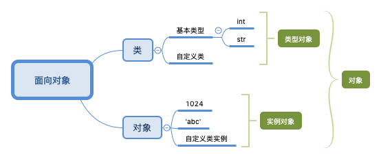

### 类型、对象体系

a 是一个整数对象（实例对象），其类型是整数类型（类型对象）：

```bash
>>> a = 1
>>> type(a)
<class 'int'>
>>> isinstance(a, int)
True
```

那么整数类型的类型又是什么呢？

```bash
>>> type(int)
<class 'type'>
```

可以看到，整数类型的类型还是一种类型，即类型的类型。只是这个类型比较特殊，它的实例对象还是类型对象。

Python 中还有一个特殊类型 object，所有其他类型均继承于 object，换句话讲 object 是所有类型的基类：

```bash
>>> issubclass(int, object)
True
```

综合以上关系，得到以下关系图：

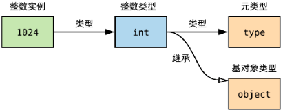

内置类型已经搞清楚了，自定义类型及对象关系又如何呢？定义一个简单的类来实验：

```py
class Dog(object):

    def yelp(self):
        print('woof')
```

创建一个 Dog 实例，毫无疑问，其类型是 Dog：

```bash
>>> dog = Dog()
>>> dog.yelp()
woof
>>> type(dog)
<class '__main__.Dog'>
```

Dog 类的类型自然也是 type，其基类是 object (就算不显式继承也是如此)：

```bash
>>> type(Dog)
<class 'type'>
>>> issubclass(Dog, object)
True
```

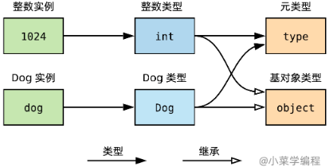

自定义子类及实例对象在图中又处于什么位置？定义一个猎犬类进行实验：

```py
class Sleuth(Dog):

    def hunt(self):
        pass
```

可以看到，猎犬对象(sleuth)是猎犬类(Sleuth)的实例，Sleuth 的类型同样是 type：

```bash
>>> sleuth = Sleuth()
>>> sleuth.hunt()
>>> type(sleuth)
<class '__main__.Sleuth'>
>>> type(Sleuth)
<class 'type'>
```

同时，Sleuth 类继承自 Dog 类，是 Dog 的子类，当然也是 object 的子类：

```bash
>>> issubclass(Sleuth, Dog)
True
>>> issubclass(Sleuth, object)
True
```

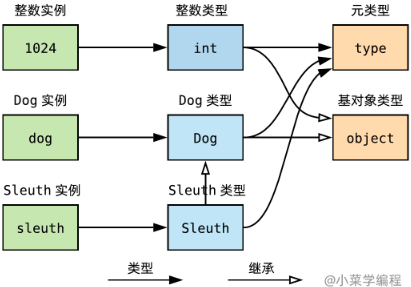

现在不可避免需要讨论 type 以及 object 这两个特殊的类型。

理论上，object 是所有类型的基类，本质上是一种类型，因此其类型必然是 type。而 type 是所有类型的类型，本质上也是一种类型，因此其类型必须是它自己！

```bash
>>> type(object)
<class 'type'>
>>> type(object) is type
True
```

```bash
>>> type(type)
<class 'type'>
>>> type(type) is type
True
```

另外，由于 object 是所有类型的基类，理论上也是 type 的基类(`__base__` 属性)：

```bash
>>> issubclass(type, object)
True
>>> type.__base__
<class 'object'>
```

但是 object 自身便不能有基类了。为什么呢？对于存在继承关系的类，成员属性和成员方法查找需要回溯继承链，不断查找基类。因此，继承链必须有一个终点，不然就死循环了。

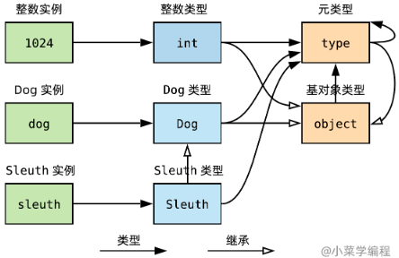

这就完整了！

可以看到，所有类型的基类收敛于 object，所有类型的类型都是 type，包括它自己！这就是 Python 类型、对象体系全图，设计简洁、优雅、严谨。

该图将成为后续阅读源码、探索 Python 对象模型的有力工具，像地图一样指明方向。图中所有实体在 Python 内部均以对象形式存在，至于对象到底长啥样，相互关系如何描述，这些问题先按下不表，后续一起到源码中探寻答案。

### 变量只是名字

先看一个例子，定义一个变量 a，并通过 id 内建函数取出其“地址”：

```bash
>>> a = 1
>>> id(a)
4302704784
```

定义另一个变量 b，以 a 赋值，并取出 b 的“地址”：

```bash
>>> b = a
>>> id(b)
4302704784
```

惊奇地看到，a 和 b 这两个变量的地址居然是相同的！这不合常理呀！

对于大多数语言（C 语言为例），定义变量 a 即为其分配内存并存储变量值

变量 b 内存空间与 a 独立，`赋值时进行拷贝，不赋值时还是原来地址`

在 Python 中，一切皆对象，整数也是如此，变量只是一个与对象关联的名字

而变量赋值，只是将当前对象与另一个名字进行关联，背后的对象是同一个

因此，在 Python 内部，变量只是一个名字，保存指向实际对象的指针，进而与其绑定。变量赋值只拷贝指针，并不拷贝指针背后的对象

### 可变对象与不可变对象

定义一个整数变量：

```bash
>>> a = 1
>>> id(a)
4302704784
```

然后，对其自增 1：

```bash
>>> a += 1
>>> a
2
>>> id(a)
4302704816
```

数值符合预期，但是对象变了！初学者一脸懵逼，这是什么鬼？

一切要从可变对象和不可变对象说起。可变对象在对象创建后，其值可以进行修改；而不可变对象在对象创建后的整个生命周期，其值都不可修改。

在 Python 中，整数类型是不可变类型，整数对象是不可变对象。修改整数对象时，Python 将以新数值创建一个新对象，变量名与新对象进行绑定；旧对象如无其他引用，将被释放。

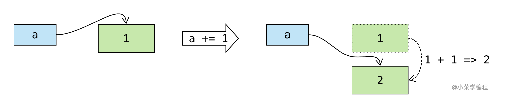

> 每次修改整数对象都要创建新对象、回收旧对象，效率不是很低吗？确实是，后续章节将从源码角度来解答：Python 如何通过小整数池等手段进行优化。

可变对象是指创建后可以修改的对象，典型的例子是列表（list）：

```bash
>>> l = [1, 2]
>>> l
[1, 2]
>>> id(l)
4385900424
```

往列表里头追加数据，发现列表对象还是原来那个，只不过多了一个元素了：

```bash
>>> l.append(3)
>>> l
[1, 2, 3]
>>> id(l)
4385900424
```

实际上，列表对象内部维护了一个动态数组，存储元素对象的指针：

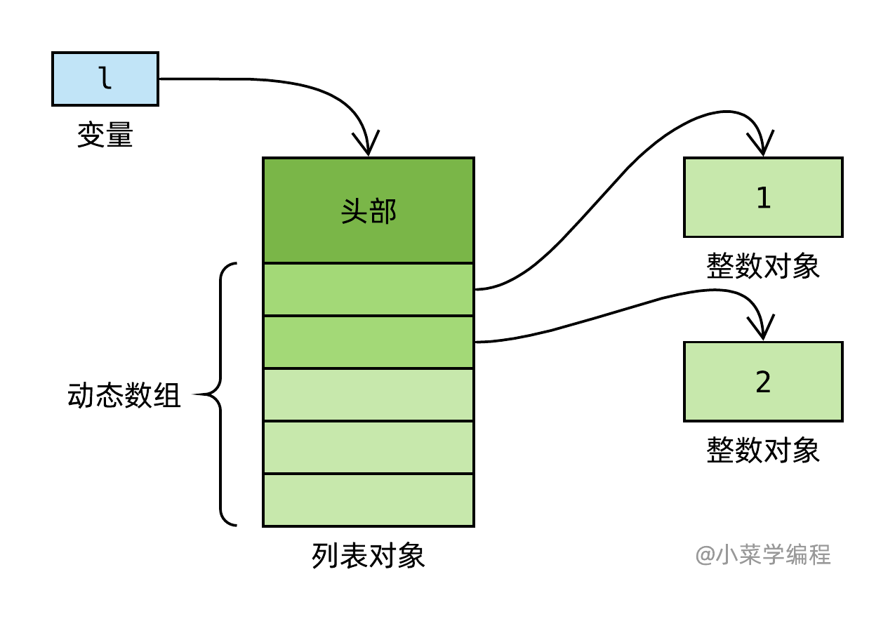

列表对象增减元素，需要修改该数组。例如，追加元素 3 ：

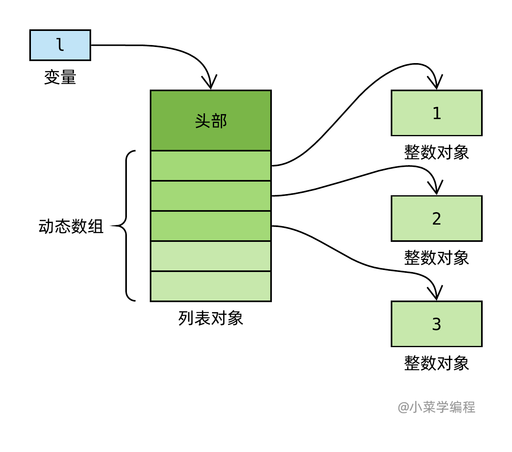

### 定长对象与变长对象

Python 一个对象多大呢？相同类型对象大小是否相同呢？想回答类似的问题，需要考察影响对象大小的因素。

标准库 sys 模块提供了一个查看对象大小的函数 getsizeof：

```bash
>>> import sys
>>> sys.getsizeof(1)
28
```

先观察整数对象：

```bash
>>> sys.getsizeof(1)
28
>>> sys.getsizeof(100000000000000000)
32
>>> sys.getsizeof(100000000000000000000000000000000000000000000)
44
```

可见整数对象的大小跟其数值有关，像这样大小不固定的对象称为变长对象。

我们知道，位数固定的整数能够表示的数值范围是有限的，可能导致溢出。Python 为解决这个问题，采用类似 C++ 中大整数类的思路实现整数对象——串联多个普通 32 位整数，以便支持更大的数值范围。至于需要多少个 32 位整数，则视具体数值而定，数值不大的一个足矣，避免浪费

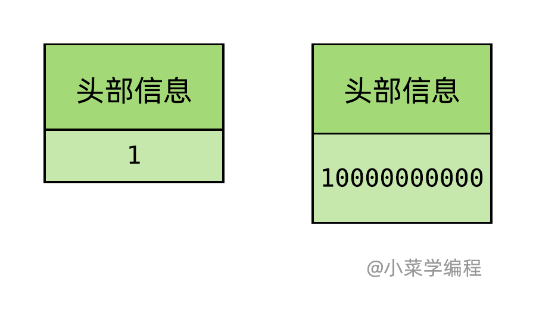

这样一来，整数对象需要在头部额外存储一些信息，记录对象用了多少个 32 位整数。这就是变长对象典型的结构，先有个大概印象即可，后续讲解整数对象源码时再展开。

接着观察字符串对象：

```bash
>>> sys.getsizeof('a')
50
>>> sys.getsizeof('abc')
52
```

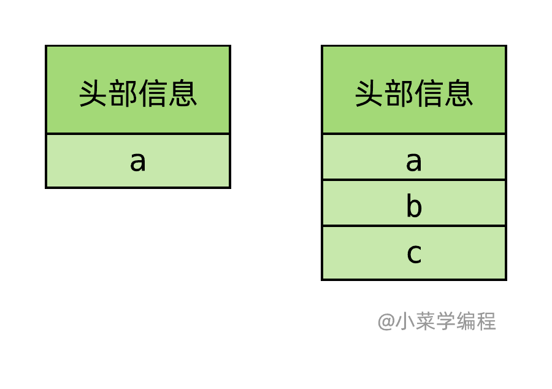

字符串对象也是变长对象，这个行为非常好理解，毕竟字符串长度不尽相同嘛。此外，注意到字符串对象大小比字符串本身大，因为对象同样需要维护一些额外的信息。至于具体需要维护哪些信息，同样留到源码剖析环节中详细介绍。

那么，有啥对象是定长的呢——浮点数对象 float：

```bash
>>> sys.getsizeof(1.)
24
>>> sys.getsizeof(1000000000000000000000000000000000.)
24
```

浮点数背后是由一个 double 实现，就算表示很大的数，浮点数对象的大小也不变。

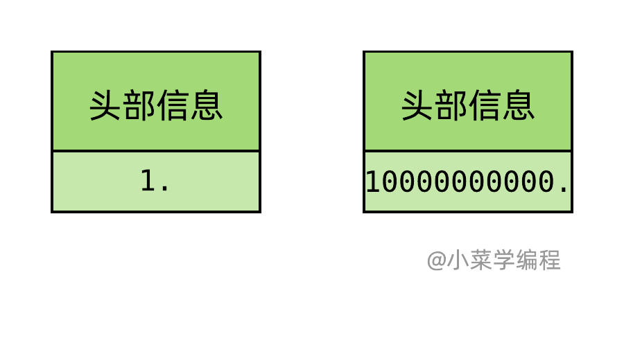

为啥 64 位的 double 可以表示这么大的范围呢？答案是：牺牲了精度。

```bash
>>> int(1000000000000000000000000000000000.)
999999999999999945575230987042816
```

由于浮点数存储位数是固定的，它能表示的数值范围也是有限的，超出便会抛锚：

```bash
>>> 10. ** 1000
Traceback (most recent call last):
   File "<stdin>", line 1, in <module>
OverflowError: (34, 'Result too large')
```

// TODO Python 源码剖析 https://fasionchan.com/python-source/object-model/pyobject/
