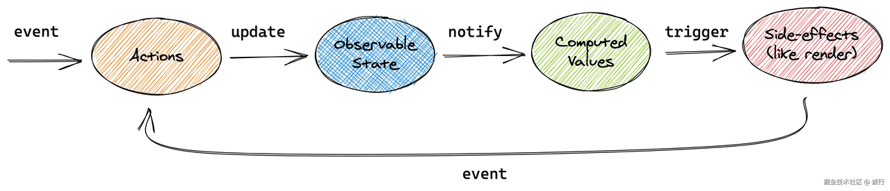
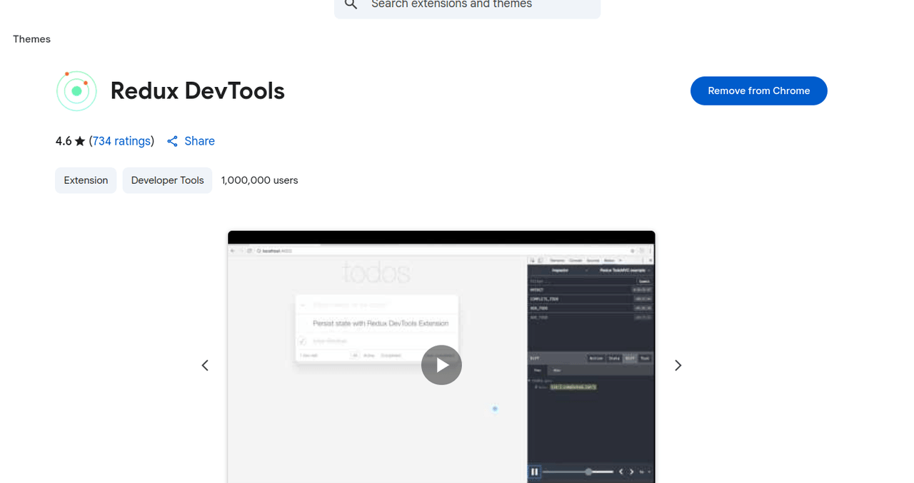
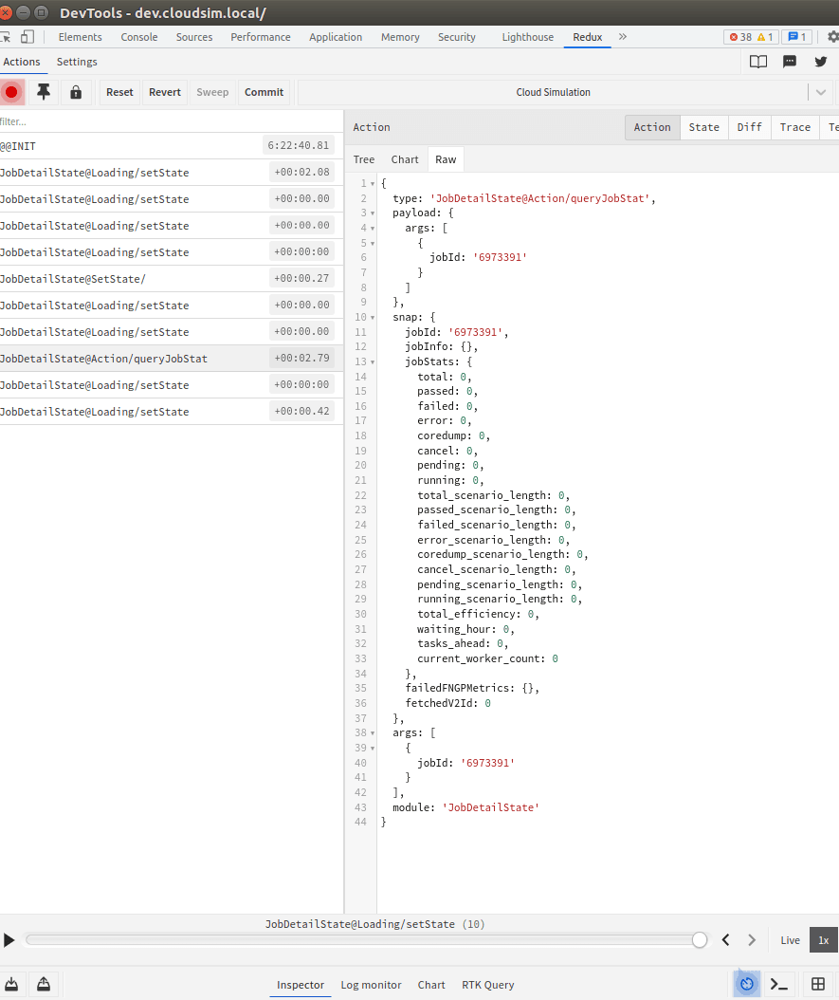

# 背景

目前老项目使用的 redux 性能较差且难上手/代码复杂，useContext 虽然使用上简单但性能较差，需要选型一个易上手/性能好/组件化的三方库，以下是 redux/useContext 在处理复杂业务时的缺点

1. 组件间的状态共享只能通过将 state 提升至它们的公共祖先来实现，但这样做可能导致重新渲染一颗巨大的组件树（管理成本和子组件意外渲染问题）
2. Context 只能存储单一值，无法存储多个各自拥有消费者的值的集合
3. 以上两种方式都很难将组件树的顶层与子组件进行代码分割
4. useContext 也没有提供对异步请求的解决方案，redux 虽然有但较难上手

# 目标

提供一种机制来管理和维护 React 应用中的状态，并且使得这些状态能够跨组件共享、状态的变化可以预测

1. 做到数据共享，兼顾子组件精准渲染
2. 获取和修改状态
3. 管理异步工作流

# 模式

## Store

Store 模式通过集中式的存储来管理应用的状态，这种模式的基本思想是将应用的所有状态存储在一个单一的地方，通常称为“store”。组件通过与 store 的交互来读取和更新状态，而不是直接在组件内部管理状态

Redux、Zustand 正是使用了 store 模式设计，Redux 官网的 gif 很好的演示了 redux 中数据流动的方向及 Store、 Dispach、Action、Reducer 的配合过程


## 响应

响应模式是一种通过观察（observe）状态变化并自动更新界面的方法。这种模式的核心思想是，当数据发生变化时，界面能够自动地响应并更新显示，可以使得状态管理更加直观、高效和模块化

MobX、Valtio 都使用了响应模式，MobX 官网流程图很好的解释了其 data flow



## 原子

不同于 Store 模式和响应模式把 State 集中起来管理，状态维护在组件顶部，子组件需要的话通过 selector 按需获取，数据自上向下流动。原子模式提倡把应用的全局状态拆分为多个小的、独立的状态单元——这些状态单元被称为原子（Atom），提供更细粒度的状态管理，以便组件可以更高效地更新和渲染

原子模式是对 useState + useContext 的升级，原子模式的代表作是 Recoil 和 Jotai


## 状态机

状态机是一种数学模型，它描述了在任何给定时间只能处于一种状态的系统，系统在不同的状态之间可以通过确定的事件进行转化


# 选型

| 状态库 | 响应粒度 | API 简洁度 | 性能 | 类型支持 | 异步处理 | 持久化/中间件 | DevTools | 社区生态 | 应用规模 | 适用场景/特点 | 适用具体范围 | 优点 | 缺点 |
| --- | --: | --: | --: | --: | --: | --: | --: | --: | --: | --- | --- | --- | --- |
| Context API | 粗粒度 | 简单 | 一般 | 完善 | 需手动 | 需手动 | 无 | 极成熟 | 小/中 | 全局共享、简单场景，易用 | <ol><li>应用中全局状态较少、简单的场景；</li><li>如主题切换、登录状态、国际化等</li></ol> | <ol><li>无需额外安装库，官方内置；</li><li>简单易用，轻量级；</li><li>适合简单的全局状态共享（如主题、语言）</li></ol> | <ol><li>性能较差，任何 context 改变会导致所有消费组件重渲染；</li><li>不适合管理复杂状态</li></ol> |
| Redux | 粗粒度 | 复杂 | 一般 | 完善 | 完善 | 完善 | 强（Redux DevTools） | 极成熟 | 中/大 | 可预测性、可扩展性、生态强 | <ol><li>复杂的大型应用，业务逻辑复杂，状态交互频繁；</li><li>需要时间旅行、调试工具、可预测性强的场景</li></ol> | <ol><li>社区成熟，生态丰富（如 Redux Toolkit）；</li><li>可预测性强，状态集中管理；</li><li>易于调试，工具支持好（Redux DevTools）；</li><li>与 React 以外的框架也可结合使用</li></ol> | <ol><li>写法繁琐（action、reducer、store 等），模板代码多；</li><li>学习曲线较高；</li><li>对于简单场景显得“重”</li></ol> |
| MobX | 中等粒度 | 简单 | 高 | 完善 | 支持 | 支持 | 有 | 成熟 | 中/大 | 响应式、面向对象、灵活 | <ol><li>中小型项目；</li><li>对响应式编程有需求；</li><li>不需要严格的状态可预测性</li></ol> | <ol><li>使用简单，代码量少，响应式编程体验好；</li><li>自动追踪依赖，数据变化自动更新视图；</li><li>学习成本低，易于集成</li></ol> | <ol><li>状态分散，不易全局管控；</li><li>调试和开发工具支持较 Redux 差；</li><li>难以追踪复杂的状态变更</li></ol> |
| Recoil | 原子粒度 | 适中 | 高 | 完善 | 完善 | 需手动 | 有（Recoil DevTools） | 较成熟 | 中/大 | 原子+选择器、复杂依赖关系 | <ol><li>中大型应用；</li><li>需要细粒度状态管理和较高性能的场景</li></ol> | <ol><li>原生支持 React，API 简洁；</li><li>支持原子化状态管理，细粒度控制；</li><li>性能优秀，支持异步 selector</li></ol> | <ol><li>社区和生态相对较小；</li><li>有些高级用法不如 Redux 成熟</li></ol> |
| Zustand | 任意粒度 | 极简 | 高 | 完善 | 需手动 | 完善 | 有（Zustand DevTools） | 极成熟 | 小/中/大 | Hook 风格、中间件、极简 | <ol><li>中小型应用；</li><li>想要简单高效状态管理的场景；</li></ol> | <ol><li>API 极简，零模板代码</li><li>性能好，支持局部订阅；</li><li>支持 hooks，易于集成</li></ol> | <ol><li>社区相对较小；</li><li>功能不如 Redux 完善，如中间件、调试工具等较弱</li></ol> |
| Jotai | 原子粒度 | 极简 | 高 | 完善 | 支持 | 需手动 | 有（Jotai DevTools） | 新兴 | 小/中 | 函数式、原子化、极简 | <ol><li>轻量级项目；</li><li>需要响应式原子状态的场景</li></ol> | <ol><li>响应式原子状态，API 简单；</li><li>体积小，性能优秀</li></ol> | <ol><li>社区还在成长；</li><li>功能相对精简</li></ol> |
| XState | 状态机/流程 | 复杂 | 高 | 完善 | 完善 | 支持 | 有 | 成熟 | 中/大 | 复杂业务流程、可视化 | 多状态流转、流程编排、复杂异步与副作用管理 | <ol><li>可视化与状态图；</li><li>严格的状态流转；</li><li>适合复杂业务流程建模</li></ol> | <ol><li>学习曲线高；心智模型重；</li><li>在简单场景偏重</li></ol> |
| Preact Signals | 极细粒度 | 极简 | 极高 | 好 | 需手动 | 需手动 | 有限 | 新兴 | 小/中 | 微秒级响应、性能极致 | <ol><li>极致性能需求的组件局部状态；</li><li>频繁更新的 UI</li></ol> | <ol><li>超高性能；</li><li>信号机制带来精准更新；</li><li>极小 API</li></ol> | <ol><li>生态有限；</li><li>DevTools 支持弱；</li><li>需手动做异步与持久化方案</li></ol> |
| Pinia | 原子/模块粒度 | 简单 | 高 | 完善 | 支持 | 支持 | 有 | 成熟 | 小/中/大 | Vue 原生、社区有 React 适配 | <ol><li>跨框架（主要 Vue）或在微前端中复用；</li><li>模块化状态</li></ol> | <ol><li>API 直观；</li><li>模块/插件生态好；</li><li>类型友好</li></ol> | <ol><li>在纯 React 项目里并非主流；</li><li>适配层可能增加复杂度</li></ol> |
| helux | 极细粒度 | 丰富 | 极高 | 极好 | 完善 | 有限/需手动 | 有 | 新兴 | 小/中 | 响应式+按需渲染、类型友好 | 需要极细粒度渲染优化与强类型结合场景 | <ol><li>按需渲染性能优秀；</li><li>类型支持出色；</li><li>组合灵活</li></ol> | <ol><li>生态新；</li><li>文档与社区资源少；</li><li>部分特性稳定性待验证</li></ol> |

# 对比

## 代码

### Context API

```jsx
import React, { createContext, useContext, useState } from 'react';

const DemoContext = createContext();

const DemoProvider = ({ children }) => {
   const [count, setCount] = useState(0);
   const [name, setName] = useState('Anonymous');

   return <DemoContext.Provider value={{ count, setCount, name, setName }}>{children}</DemoContext.Provider>;
};

const GrandSonName = () => {
   const { name } = useContext(DemoContext);
   return (
      <div style={{ border: '1px #333 solid' }}>
         <h3>GrandSonName</h3>
         <p>name: {name}</p>
      </div>
   );
};

const GrandSonCount = () => {
   const { count } = useContext(DemoContext);
   return (
      <div style={{ border: '1px #333 solid' }}>
         <h3>GrandSonCount</h3>
         <p>count: {count}</p>
      </div>
   );
};

const Son1 = () => {
   const { count, setCount, name } = useContext(DemoContext);

   return (
      <div style={{ border: '1px #333 solid', padding: 5 }}>
         <h2>Child 1</h2>
         <p>Count: {count}</p>
         <p>Name: {name}</p>
         <button onClick={() => setCount(count + 1)}>Increment Count</button>
         <GrandSonName />
         <GrandSonCount />
      </div>
   );
};

const Son2 = () => {
   const { name, setName } = useContext(DemoContext);

   return (
      <div style={{ border: '1px #333 solid', padding: 5, marginTop: 10 }}>
         <h2>Child 2</h2>
         <input type='text' value={name} onChange={(e) => setName(e.target.value)} />
         <GrandSonName />
      </div>
   );
};

const Son3 = () => {
   return (
      <div style={{ border: '1px #333 solid', padding: 5, marginTop: 10 }}>
         <h2>Child 3</h2>
         <GrandSonName />
         <GrandSonCount />
      </div>
   );
};

export default function App() {
   return (
      <DemoProvider>
         <Son1 />
         <Son2 />
         <Son3 />
      </DemoProvider>
   );
}
```

### helux

```jsx
import { sharex, $, useAtom } from 'helux';
import React from 'react';

const GlobalModel = sharex({
   count: 1,
   name: 'Anonymous'
});

const { state, setState } = GlobalModel;

const GrandSonName = () => {
   return (
      <div style={{ border: '1px #333 solid' }}>
         <h3>GrandSonName</h3>
         <p>name: {$(state.name)}</p>
      </div>
   );
};

const GrandSonCount = () => {
   return (
      <div style={{ border: '1px #333 solid' }}>
         <h3>GrandSonCount</h3>
         <p>count: {$(state.count)}</p>
      </div>
   );
};

const Son1 = () => {
   return (
      <div style={{ border: '1px #333 solid', padding: 5 }}>
         <h2>Child 1</h2>
         <p>Count: {$(state.count)}</p>
         <p>Name: {$(state.name)}</p>
         <button
            onClick={() =>
               setState((draft) => {
                  draft.count += 1;
               })
            }
         >
            Increment Count
         </button>
         <GrandSonName />
         <GrandSonCount />
      </div>
   );
};

// 这里需要抽出一个组件，否则依然会有性能问题
const Input = () => {
   const [dictState] = useAtom(state);
   return (
      <input
         type='text'
         value={dictState.name}
         onChange={(e) => {
            setState((draft) => {
               draft.name = e.target.value;
            });
         }}
      />
   );
};

const Son2 = () => {
   return (
      <div style={{ border: '1px #333 solid', padding: 5, marginTop: 10 }}>
         <h2>Child 2</h2>
         <Input />
         <GrandSonName />
      </div>
   );
};

const Son3 = () => {
   return (
      <div style={{ border: '1px #333 solid', padding: 5, marginTop: 10 }}>
         <h2>Child 3</h2>
         <GrandSonName />
         <GrandSonCount />
      </div>
   );
};

export default function App() {
   return (
      <>
         <Son1 />
         <Son2 />
         <Son3 />
      </>
   );
}
```

## 效果

| 状态库 | React 层重渲染 | 浏览器重渲染 |
| --- | --- | --- |
| Context API | <video style="max-width: 200px" src="/examples/react-global-state-selection/1.mp4" loop muted autoplay width="100%" /> | <video style="max-width: 200px" src="/examples/react-global-state-selection/2.mp4" loop muted autoplay width="100%" /> |
| helux | <video style="max-width: 200px" src="/examples/react-global-state-selection/3.mp4" loop muted autoplay width="100%" /> | <video style="max-width: 200px" src="/examples/react-global-state-selection/4.mp4" loop muted autoplay width="100%" /> |

# 结论

以 React 层重渲染（即组件是否触发 render）为准，此标准比浏览器重渲染更高，由上面的视频可得出以下结论

1. 虽然最终浏览器重渲染的效果一样，但 helux 对比 Context API 明显在 React 层性能更好，归功于 helux 的 dom 粒度更新
2. helux 的 signal 语法只适用于展示型即普通的 dom 元素，无法适用于 react 组件，需要使用 useAtom 转换为真实状态，但此时就失去了 dom 粒度更新的优势，需要将 react 组件抽出一个单独组件防止性能劣化

   

# 快速上手

https://heluxjs.github.io/helux/

## 全局状态

文件夹结构

```
├── model
│   ├── actions.js
│   ├── index.js
│   └── state.js
```

index.js

导出主入口

```js
import { $, useAtom } from 'helux';

import { GlobalState } from './state';
import * as actions from './actions'; // action 函数定义

export default GlobalState;

export const action = GlobalState.defineActions()(actions);

const { state, setState } = GlobalState;

export { $, useAtom, state, setState };
```

state.js

全局状态定义

```js
import { sharex } from 'helux';

export const GlobalState = sharex(
   {
      key: null,
      key2: null,
      jobInfo: {}
   },
   { moduleName: 'JobDetailState' }
);
```

actions.js

异步 action 定义

```js
import { getJobInfo } from '../services';

export async function queryJobInfo({ draft, payload }) {
   const [error, res] = await getJobInfo({ id: payload.jobId });
   if (error) {
      return null;
   }
   draft.jobInfo = res;
   return res;
}
```

## 纯展示类型

```jsx
import { $, state, setState } from './model';

// 纯展示型即 dom 结点直接使用 signal 语法，即 $(state.key)
export default function Example() {
   return (
      <div>
         <Button
            onClick={() =>
               setState((draft) => {
                  draft.key += 1;
               })
            }
         >
            {$(state.key)}
         </Button>
      </div>
   );
}
```

## React 状态类型

```jsx
import { $, state, setState, useAtom } from './model';

// 这里需要抽出一个组件隔离渲染，即 useAtom 会触发组件重渲染
const Input = () => {
   const [dictState] = useAtom(state); // 由于下面使用了 key2，更新 key2 时才会触发重渲染，即更新 key 时不会触发重渲染
   return (
      <input
         type='text'
         value={dictState.key2}
         onChange={(e) => {
            setState((draft) => {
               draft.key2 = e.target.value;
            });
         }}
      />
   );
};

// React 组件由于需要取到原始值，需要使用 useAtom 包一下取出
export default function Example2() {
   return (
      <div>
         <Input />
         {$(state.key2)}
      </div>
   );
}
```

## 异步请求类型

这里将请求放到全局状态里面，而不是组件里面，推荐在全局状态和异步请求有关时，优先在这里去请求，理由如下

1. 为了避免组件的重渲染，即如果请求在顶级组件的话，那么所有组件都会重渲染
2. 写成 action 也有利于调试，安装 [Redux DevTools 插件](https://chromewebstore.google.com/detail/redux-devtools/lmhkpmbekcpmknklioeibfkpmmfibljd)

   

   

```jsx
import { $, state, setState, action } from './model';

const JobDetail = ({ jobId }) => {
   // const { queryJobInfo } = action.useLoading();
   // console.log('useLoading', queryJobInfo) // 请求的状态

   const handleEvent = () => {
      console.log('state.jobId', state.jobInfo); // 事件触发的可以直接通过 state 拿到最新值
   };

   return (
      <div className={styles.container}>
         <Button
            onClick={() =>
               setState(async (draft) => {
                  const data = await action.eActions.queryJobInfo({ jobId });
                  console.log('data', data);
               })
            }
         >
            {$(state.failedFNGPMetrics.total)} // 用 $ 或者 useAtom 取到
         </Button>
      </div>
   );
};

export default JobDetail;
```

# 参考链接

1. [全都要!一文带你全面体验八种状态管理库](https://juejin.cn/post/7172509907403407391)
2. [你踩过 react 生态的 signal 坑吗?且看 helux 如何应对](https://juejin.cn/post/7322840234365059084)
3. [Redux、Zustand、Mobx、Valtio、Recoil、jotai、XState 状态管理怎么选](https://juejin.cn/post/7399276698619035657)
