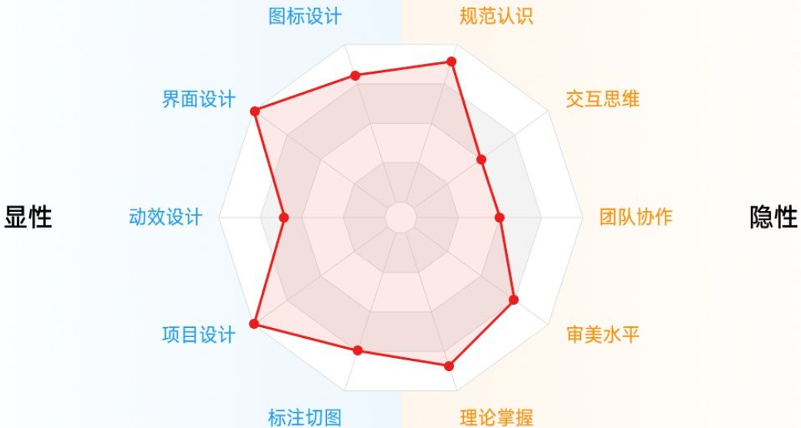
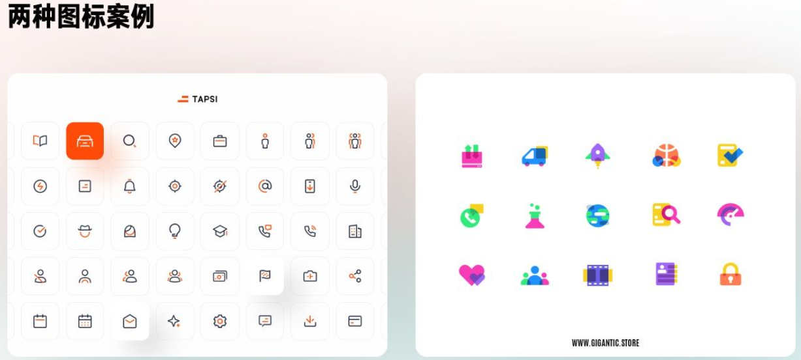
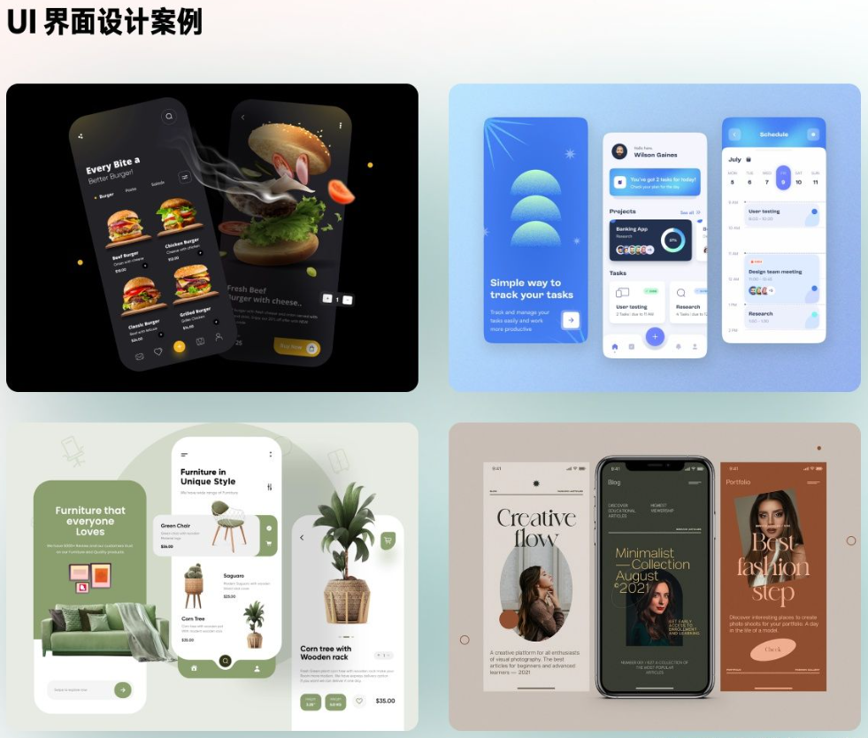
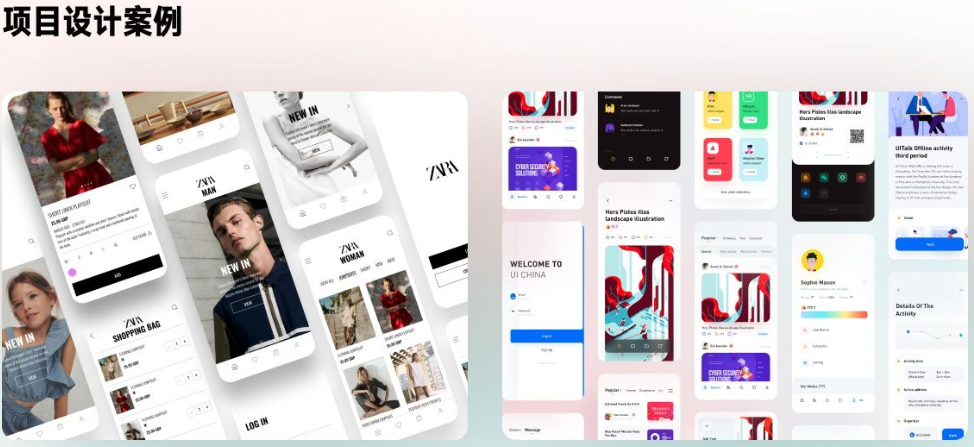
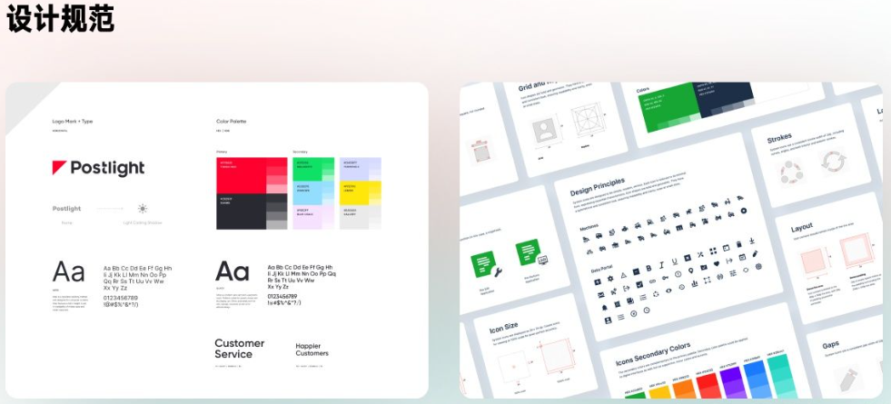
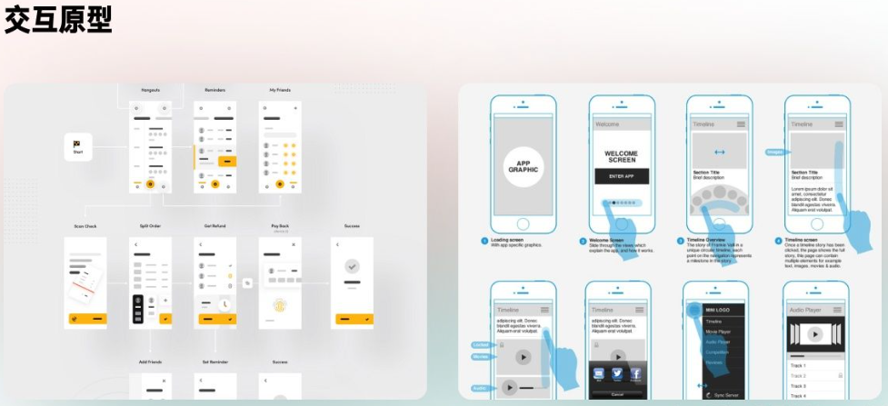
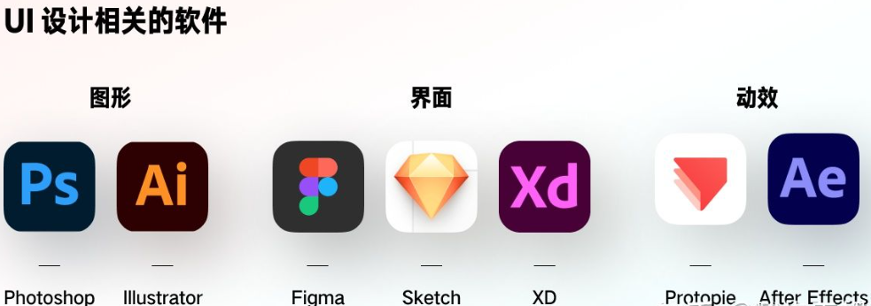
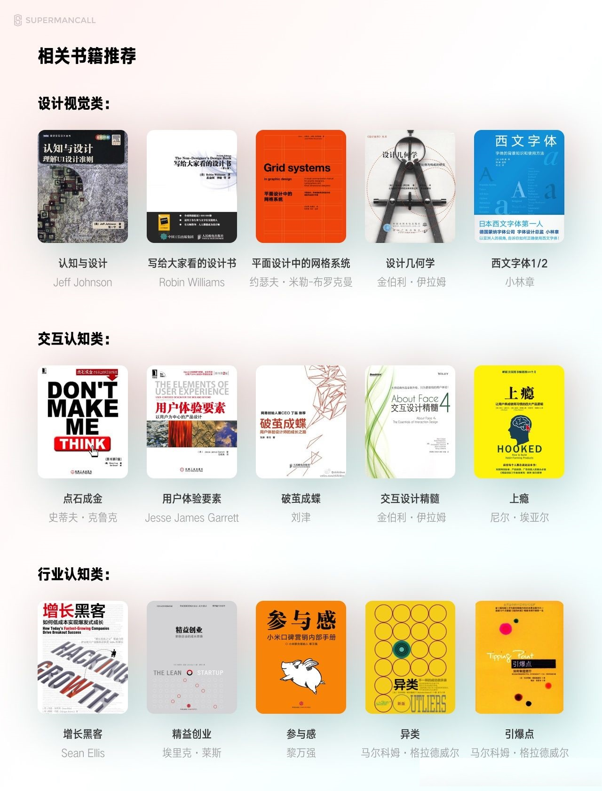

# 技能要求

## 显性技能

### 图标设计

即出现在界面中的图形标识符号以及应用的启动图标。图标虽然有大量的素材可以用，但是想满足项目自身需求、风格统一的图标，基本只能依靠独立绘制来完成。

### 界面设计

输出界面的视觉能力，我们定义的界面视觉能力是在不受外力干扰下，你可以输出符合规范、基本交互、平面要素的美观界面，简称就是飞机稿输出能力。

### 动效设计

在输出静态页面基础上，丰富使用体验的手段。通过增加一些有趣、简单的动效，来让操作效果更生动，或者作为情感化设计的一部分。

<video src="/examples/ui-introduce-learning/2022-05-20-23-50-38.mp4" loop muted autoplay width="100%"></video>

### 项目设计

在项目设计中，抛开产品、体验这些内容和基本视觉样式，最让人关注的东西是对项目设计规范的搭建与应用。如何在多个页面中保持视觉风格的一致性。

### 标注切图

最后，就是前面这些内容都输出完了，需要将设计的内容提交给程序员进行样式的开发，那么就要实现对设计内容进行标注和切图文件的输出。

显性技能对于新手来说，最大的优点就是知识点是相对固定的，练习方法也是固定的，只要通过刻意练习的方法，就可以积累和提前。

## 隐性技能

### 理解规范

没有规范是必然输出不了界面的。但移动端的设计规范，并不是你们想的官方准备个文档，里面数值写清楚了，你背下来就行。而是理解哪些规范是必须要遵守的，哪些是可以灵活变动的（而可以自定义的是大多数）。

### 交互思维

如何让产品和界面操作起来合理的思维能力。平心而论，这种能力是只能依靠自己的 “多学多看” 积累的。交互书籍带来的帮助只是解释你留意到的现象原因，但不会告诉你遇到问题的时候具体应该怎么做。

### 团队协作能力

我们如何有效的理解设计的需求，将设计的意图传递给别人，高效的评审和过稿，都是团队协作能力的体现。

### 审美水平

是一个设计师的品味。品味的高低是可以在作品集中感受出来的，怎么布局，怎么用配图，怎么选用设计风格。审美的落差很多时候可以填补技术上的缺陷。

### 理论掌握

基本上上面所有讲过的细分技能点都有各自的理论、术语。设计领域中，不管多有用的理论，脱离实践都毫无意义。理论掌握的正确时机是在实践过程中查找并融汇贯通的。

# 资料准备

## 软件

### 图形软件

主要指的就是 Adobe 的 PS 和 AI，用来处理复杂图形样式的软件，例如复杂的图标、字体、H5 视觉等。是每个平面相关设计师都绕不开的两座大山。

### 界面软件

设计 UI 界面和排版的专用软件。目前市场主要使用的工具有 Sketch / Figma / Adobe XD 三个，Sketch 只支持 Mac 系统，Adobe XD 因为更新太慢功能太少，已经不建议再花时间了解。所以主要建议从 Figma 开始学习。

### 动效软件

用来处理交互动效的工具。新手多数以为动效必须由 Adobe Effect 来完成，其实它最适合制作的是动效中的矢量动画，但不能输出完整的动效原型。目前市面上做的最好，Windows 也支持的动效工具是 Protopie，掌握它就可以忽略类似 Principle、Origami 等其它同类软件。

## 材料准备

### 规范

1. IOS + 安卓官方规范
2. 字体文件，包含苹果官方要求的苹方中文字体，SF 系列英文字体，以及安卓的思源黑中文字体，以及 Roboto 英文字体。
3. 常用的图标素材库，iconfont 和 iconpark 两个网站，它们提供了大量的开源图标素材，可以直接应用。

### 书籍

