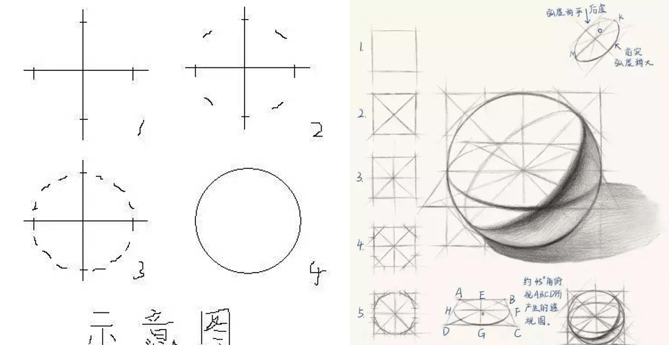

# 学习路线

## 用途

- 互联网
- 手机软件（App）
- 小程序设计
- 电脑软件（PC + web）
- 运营活动推广设计
- 平面设计（简单）

## 软件

- PS
- Sketch / XD
- AE
- AI
- C4D
- 蓝湖
- 墨刀
- ARP

## 理论

- 文案编辑
- 色彩搭配
- 版式布局
- 设计规范
- 交互方式
- 交互逻辑
- 用户体验
- 心理学

## 网站

- 站酷
- UI 中国
- 老姜尺寸网
- 花瓣网
- 优设网

# UI 素描

素描排线的方法：中间重两端轻的线条是正确的。

## 透视

## 概念

绘画理论术语，指在平面或曲面上描绘物体的空间关系的方法或技术。特点：近大远小，近长远短，直至消失点。

## 平行透视/一点透视

平行透视又叫一点透视，通常看到物体的正面，而且这个面和我们的视角平行。由于透视的视角上的变形，产生了近大远小的感觉，透视线和消失点就应运而生，一般能看见三个面。

## 成角透视/两点透视

成角透视（两点透视）就是把立方体画到画面上，立方体的四个面对于画面倾斜成一定角度时，往纵深平行的直线产生了两个消失点。

## 三点透视

三点透视是一种绘图方法，一般用于超高层建筑，俯瞰图或仰视图。第三个消失点必须和画面保持垂直的主视线，必须使其和视角的二等分线保持一致。

## 圆形透视

一般是先画方后切圆切到最后就圆了。椭圆先画距形也就是长方形根据长方形宽的大小确定直径的大小。

