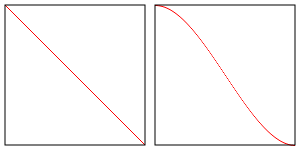

# WebGL 三维方向光源

实施光照的方式有很多种，最简单的可能就是方向光源了。

方向光是指光照均匀地来自某一个方向，晴朗天气下的太阳经常被当作方向光源，它距离太远所以光线被看作是平行的照到地面上。

计算方向光非常简单，将方向光的方向和面的朝向点乘就可以得到两个方向的余弦值。

这有个例子

[dot-product](embedded-codesandbox://webgl-fundamental-light/dot-product?view=preview)

随意拖动其中的点，如果两点方向刚好相反，点乘结果则为 -1，如果方向相同结果为 1。

这有什么用呢？如果将三维物体的朝向和光的方向点乘，结果为 1 则物体朝向和光照方向相同，为 -1 则物体朝向和光照方向相反。

[directional-lighting](embedded-codesandbox://webgl-fundamental-light/directional-lighting?view=preview)

我们可以将颜色值和点乘结果相乘，有光了！

还有一个问题，我们如何知道三维物体的朝向？

## 法向量

我不知道为什么叫法向量，但是在三维图形学中法向量就是描述面的朝向的单位向量。

这是正方体和球体的一些法向量。

[normals](embedded-codesandbox://webgl-fundamental-light/normals?view=preview)

这些插在物体上的线就是对应顶点的法向量。

注意到正方体在每个顶角有 3 个法向量。这是因为需要 3 个法向量去描述相邻的每个面的朝向。

这里的法向量是基于他们的方向着色的，正 x 方向为红色，上方向为绿色，正 z 方向为蓝色。

让我们来给上节中的 F 添加法向量。由于 F 非常规则并且朝向都是 `x, y, z` 轴，所以非常简单。正面的的部分法向量为 `0, 0, 1`，背面的部分法向量为 `0, 0, -1`，左面为 `-1, 0, 0`，右面为 `1, 0, 0`，上面为 `0, 1, 0`，然后底面为 `0, -1, 0`。

```js
function setNormals(gl) {
  var normals = new Float32Array([
    // 正面左竖
    0,
    0,
    1,
    0,
    0,
    1,
    0,
    0,
    1,
    0,
    0,
    1,
    0,
    0,
    1,
    0,
    0,
    1,

    // 正面上横
    0,
    0,
    1,
    0,
    0,
    1,
    0,
    0,
    1,
    0,
    0,
    1,
    0,
    0,
    1,
    0,
    0,
    1,

    // 正面中横
    0,
    0,
    1,
    0,
    0,
    1,
    0,
    0,
    1,
    0,
    0,
    1,
    0,
    0,
    1,
    0,
    0,
    1,

    // 背面左竖
    0,
    0,
    -1,
    0,
    0,
    -1,
    0,
    0,
    -1,
    0,
    0,
    -1,
    0,
    0,
    -1,
    0,
    0,
    -1,

    // 背面上横
    0,
    0,
    -1,
    0,
    0,
    -1,
    0,
    0,
    -1,
    0,
    0,
    -1,
    0,
    0,
    -1,
    0,
    0,
    -1,

    // 背面中横
    0,
    0,
    -1,
    0,
    0,
    -1,
    0,
    0,
    -1,
    0,
    0,
    -1,
    0,
    0,
    -1,
    0,
    0,
    -1,

    // 顶部
    0,
    1,
    0,
    0,
    1,
    0,
    0,
    1,
    0,
    0,
    1,
    0,
    0,
    1,
    0,
    0,
    1,
    0,

    // 上横右面
    1,
    0,
    0,
    1,
    0,
    0,
    1,
    0,
    0,
    1,
    0,
    0,
    1,
    0,
    0,
    1,
    0,
    0,

    // 上横下面
    0,
    -1,
    0,
    0,
    -1,
    0,
    0,
    -1,
    0,
    0,
    -1,
    0,
    0,
    -1,
    0,
    0,
    -1,
    0,

    // 上横和中横之间
    1,
    0,
    0,
    1,
    0,
    0,
    1,
    0,
    0,
    1,
    0,
    0,
    1,
    0,
    0,
    1,
    0,
    0,

    // 中横上面
    0,
    1,
    0,
    0,
    1,
    0,
    0,
    1,
    0,
    0,
    1,
    0,
    0,
    1,
    0,
    0,
    1,
    0,

    // 中横右面
    1,
    0,
    0,
    1,
    0,
    0,
    1,
    0,
    0,
    1,
    0,
    0,
    1,
    0,
    0,
    1,
    0,
    0,

    // 中横底面
    0,
    -1,
    0,
    0,
    -1,
    0,
    0,
    -1,
    0,
    0,
    -1,
    0,
    0,
    -1,
    0,
    0,
    -1,
    0,

    // 底部右侧
    1,
    0,
    0,
    1,
    0,
    0,
    1,
    0,
    0,
    1,
    0,
    0,
    1,
    0,
    0,
    1,
    0,
    0,

    // 底面
    0,
    -1,
    0,
    0,
    -1,
    0,
    0,
    -1,
    0,
    0,
    -1,
    0,
    0,
    -1,
    0,
    0,
    -1,
    0,

    // 左面
    -1,
    0,
    0,
    -1,
    0,
    0,
    -1,
    0,
    0,
    -1,
    0,
    0,
    -1,
    0,
    0,
    -1,
    0,
    0
  ]);
  gl.bufferData(gl.ARRAY_BUFFER, normals, gl.STATIC_DRAW);
}
```

在代码中使用它们，先移除顶点颜色以便观察光照效果。

```js
// 找顶点着色器中的属性
var positionLocation = gl.getAttribLocation(program, 'a_position');
// var colorLocation = gl.getAttribLocation(program, "a_color");
var normalLocation = gl.getAttribLocation(program, 'a_normal');

// ...

// // 创建一个缓冲存储颜色
// var colorBuffer = gl.createBuffer();
// // 绑定到 ARRAY_BUFFER
// gl.bindBuffer(gl.ARRAY_BUFFER, colorBuffer);
// // 将几何数据放入缓冲
// setColors(gl);

// 创建缓冲存储法向量
var normalBuffer = gl.createBuffer();
// 绑定到 ARRAY_BUFFER (可以看作 ARRAY_BUFFER = normalBuffer)
gl.bindBuffer(gl.ARRAY_BUFFER, normalBuffer);
// 将法向量存入缓冲
setNormals(gl);
```

在渲染的时候

```js
// // 启用颜色属性
// gl.enableVertexAttribArray(colorLocation);

// // 绑定颜色缓冲
// gl.bindBuffer(gl.ARRAY_BUFFER, colorBuffer);

// // 告诉颜色属性怎么从 colorBuffer(ARRAY_BUFFER) 中读取颜色值
// var size = 3;                 // 每次迭代使用 3 个单位的数据
// var type = gl.UNSIGNED_BYTE;  // 单位数据类型是无符号 8 位整数
// var normalize = true;         // 标准化数据 (从 0-255 转换到 0.0-1.0)
// var stride = 0;               // 0 = 移动距离 * 单位距离长度 sizeof(type)，每次迭代跳多少距离到下一个数据
// var offset = 0;               // 从绑定缓冲的起始处开始
// gl.vertexAttribPointer(
//     colorLocation, size, type, normalize, stride, offset)

// 启用法向量属性
gl.enableVertexAttribArray(normalLocation);

// 绑定法向量缓冲
gl.bindBuffer(gl.ARRAY_BUFFER, normalBuffer);

// 告诉法向量属性怎么从 normalBuffer (ARRAY_BUFFER) 中读取值
var size = 3; // 每次迭代使用 3 个单位的数据
var type = gl.FLOAT; // 单位数据类型是 32 位浮点型
var normalize = false; // 单位化 (从 0-255 转换到 0-1)
var stride = 0; // 0 = 移动距离 * 单位距离长度 sizeof(type)，每次迭代跳多少距离到下一个数据
var offset = 0; // 从绑定缓冲的起始处开始
gl.vertexAttribPointer(normalLocation, size, type, normalize, stride, offset);
```

现在让着色器使用它

首先在顶点着色器中只将法向量传递给片断着色器

```glsl
attribute vec4 a_position;
// attribute vec4 a_color;
attribute vec3 a_normal;

uniform mat4 u_matrix;

// varying vec4 v_color;
varying vec3 v_normal;

void main() {
  // 将位置和矩阵相乘
  gl_Position = u_matrix * a_position;

  // // 将颜色传到片断着色器
  // v_color = a_color;

  // 将法向量传到片断着色器
  v_normal = a_normal;
}
```

然后在片断着色器中将法向量和光照方向点乘

```glsl
precision mediump float;

// 从顶点着色器中传入的值
// varying vec4 v_color;
varying vec3 v_normal;

uniform vec3 u_reverseLightDirection;
uniform vec4 u_color;

void main() {
   // 由于 v_normal 是插值出来的，有可能不是单位向量，
   // 可以用 normalize 将其单位化。
   vec3 normal = normalize(v_normal);

   float light = dot(normal, u_reverseLightDirection);

   gl_FragColor = u_color;

   // 将颜色部分（不包括 alpha）和光照相乘
   gl_FragColor.rgb *= light;
}
```

然后找到 `u_color` 和 `u_reverseLightDirection` 的位置。

```js
// 寻找全局变量
var matrixLocation = gl.getUniformLocation(program, 'u_matrix');
var colorLocation = gl.getUniformLocation(program, 'u_color');
var reverseLightDirectionLocation = gl.getUniformLocation(program, 'u_reverseLightDirection');
```

为它们赋值

```js
// 设置矩阵
gl.uniformMatrix4fv(matrixLocation, false, worldViewProjectionMatrix);

// 设置使用的颜色
gl.uniform4fv(colorLocation, [0.2, 1, 0.2, 1]); // green

// 设置光线方向
gl.uniform3fv(reverseLightDirectionLocation, m4.normalize([0.5, 0.7, 1]));
```

我们之前用到的 normalize 会将原向量转换为单位向量。例子中的 x = 0.5 说明光线是从右往左照，y = 0.7 说明光线从上方往下照，z = 1 说明光线从在场景前方。对应的值表示光源大多指向场景，在靠右方和上方一点的位置。

这是结果

[webgl-3d-lighting-directional](embedded-codesandbox://webgl-fundamental-light/webgl-3d-lighting-directional?view=preview)

如果你旋转了 F 就会发现，F 虽然旋转了但是光照没变，我们希望随着 F 的旋转正面总是被照亮的。

为了解决这个问题就需要在物体重定向时重定向法向量，和位置一样我们也可以将向量和矩阵相乘，这个矩阵显然是 world 矩阵，现在我们只传了一个矩阵 `u_matrix`，所以先来改成传递两个矩阵，一个叫做 `u_world` 的世界矩阵，另一个叫做 `u_worldViewProjection` 也就是我们现在的 `u_matrix`。

```glsl
attribute vec4 a_position;
attribute vec3 a_normal;

uniform mat4 u_worldViewProjection;
uniform mat4 u_world;

varying vec3 v_normal;

void main() {
  // 将位置和矩阵相乘
  gl_Position = u_worldViewProjection * a_position;

  // 重定向法向量并传递给片断着色器
  v_normal = mat3(u_world) * a_normal;
}
```

注意到我们将 `a_normal` 与 `mat3(u_world)` 相乘，那是因为法向量是方向所以不用关心位移，矩阵的左上 3x3 部分才是控制姿态的。

找到全局变量

```js
// 寻找全局变量
var worldViewProjectionLocation = gl.getUniformLocation(program, 'u_worldViewProjection');
var worldLocation = gl.getUniformLocation(program, 'u_world');
```

然后更新它们

```js
// 设置矩阵
gl.uniformMatrix4fv(worldViewProjectionLocation, false, worldViewProjectionMatrix);
gl.uniformMatrix4fv(worldLocation, false, worldMatrix);
```

[webgl-3d-lighting-directional-world](embedded-codesandbox://webgl-fundamental-light/webgl-3d-lighting-directional-world?view=preview)

旋转后就会发现面对 F 的面总是被照亮的。

这里有一个问题我不知道如何表述所以就用图解展示，我们用 normal 和 u_world 相乘去重定向法向量，如果世界矩阵被缩放了怎么办？事实是会得到错误的法向量。

[normals-scaled](embedded-codesandbox://webgl-fundamental-light/normals-scaled?view=preview)

我从没想弄清为什么，但解决办法就是对世界矩阵求逆并转置，用这个矩阵就会得到正确的结果。

在图解里中间的紫色球体是未缩放的，左边的红色球体用的世界矩阵并缩放了，你可以看出有些不太对劲。右边蓝色的球体用的是世界矩阵求逆并转置后的矩阵。

点击图解循环观察不同的表示形式，你会发现在缩放严重时左边的（世界矩阵）法向量和表面没有保持垂直关系，而右边的（世界矩阵求逆并转置）一直保持垂直。最后一种模式是将它们渲染成红色，你会发现两个球体的光照结果相差非常大，基于可视化的结果可以得出使用世界矩阵求逆转置是对的。

修改代码让示例使用这种矩阵，首先更新着色器，理论上我们可以直接更新 `u_world` 的值，但是最好将它重命名以表示它真正的含义，防止混淆。

```glsl
attribute vec4 a_position;
attribute vec3 a_normal;

uniform mat4 u_worldViewProjection;
uniform mat4 u_worldInverseTranspose;

varying vec3 v_normal;

void main() {
  // 将位置和矩阵相乘
  gl_Position = u_worldViewProjection * a_position;

  // 重定向法向量并传递给片断着色器
  v_normal = mat3(u_worldInverseTranspose) * a_normal;
}
```

然后找到它

```js
// var worldLocation = gl.getUniformLocation(program, 'u_world');
var worldInverseTransposeLocation = gl.getUniformLocation(program, 'u_worldInverseTranspose');
```

更新它

```js
var worldViewProjectionMatrix = m4.multiply(viewProjectionMatrix, worldMatrix);
var worldInverseMatrix = m4.inverse(worldMatrix);
var worldInverseTransposeMatrix = m4.transpose(worldInverseMatrix);

// 设置矩阵
gl.uniformMatrix4fv(worldViewProjectionLocation, false, worldViewProjectionMatrix);
// gl.uniformMatrix4fv(worldLocation, false, worldMatrix);
gl.uniformMatrix4fv(worldInverseTransposeLocation, false, worldInverseTransposeMatrix);
```

这是转置的代码

```js
var m4 = {
  transpose: function(m) {
    return [m[0], m[4], m[8], m[12], m[1], m[5], m[9], m[13], m[2], m[6], m[10], m[14], m[3], m[7], m[11], m[15]];
  }

  // ...
};
```

由于我们并没有进行缩放，所以没有明显的变化，但防患于未然。

[webgl-3d-lighting-directional-worldinversetranspose](embedded-codesandbox://webgl-fundamental-light/webgl-3d-lighting-directional-worldinversetranspose?view=preview)

## `mat3(u_worldInverseTranspose) * a_normal` 的可选方案

之前的着色器中出现了这样的代码

```js
v_normal = mat3(u_worldInverseTranspose) * a_normal;
```

我们也可以这样做

```js
v_normal = (u_worldInverseTranspose * vec4(a_normal, 0)).xyz;
```

由于 w 在相乘前被赋值为 0，所以在相乘后负责平移的部分与 0 相乘被移除了。我认为这可能是更常用的方式，mat3 的做法只是对我来说更简洁但我经常用前一种方法。

当然另一种解决方案是将 `u_worldInverseTranspose` 直接构造成 mat3。这有两个不能这么做的理由，第一个是我们可能需要一个完整的 `u_worldInverseTranspose` 对象传递一个 mat4 给还要给其他地方使用，另一个是我们在 JavaScript 中的所有矩阵方法都是针对 4x4 的矩阵，如果没有其他特别的需求，没有必要构造一个 3x3 的矩阵，或者是把 4x4 转换成 3x3。

# WebGL 三维点光源

上篇中说到方向光统一来自一个方向，在渲染前设置好方向。

如果代替方向而是从三维空间中选一个点当作光源，然后在着色器中根据光源和表面位置计算光照方向的话，就是点光源了。

[point-lighting](embedded-codesandbox://webgl-fundamental-light/point-lighting?view=preview)

如果旋转上方的表面会发现，每个点都有一个不同的面到光源的矢量，将这个矢量和法向量点乘后，表面上的每个点都会有一个不同的光照值。

让我们实现它吧。

首先需要一个光源位置

```glsl
uniform vec3 u_lightWorldPosition;
```

然后需要计算表面的世界坐标，我们可以将位置和世界矩阵相乘得到

```glsl
uniform mat4 u_world;

// ...

// 计算表面的世界坐标
vec3 surfaceWorldPosition = (u_world * a_position).xyz;
```

然后可以计算出一个从表面到光源的矢量，用来模拟之前的方向光，只是这次我们为表面上的每个点都计算了一个方向。

```glsl
v_surfaceToLight = u_lightWorldPosition - surfaceWorldPosition;
```

这是全部的内容

```glsl{4,6,12,21-26}
attribute vec4 a_position;
attribute vec3 a_normal;

uniform vec3 u_lightWorldPosition;

uniform mat4 u_world;
uniform mat4 u_worldViewProjection;
uniform mat4 u_worldInverseTranspose;

varying vec3 v_normal;

varying vec3 v_surfaceToLight;

void main() {
  // 将位置和矩阵相乘
  gl_Position = u_worldViewProjection * a_position;

  // 重定向法向量并传递给片断着色器
  v_normal = mat3(u_worldInverseTranspose) * a_normal;

  // 计算表面的世界坐标
  vec3 surfaceWorldPosition = (u_world * a_position).xyz;

  // 计算表面到光源的方向
  // 传递给片断着色器
  v_surfaceToLight = u_lightWorldPosition - surfaceWorldPosition;
}
```

在片断着色器中需要将表面到光源的方向进行单位化，注意，虽然我们可以在顶点着色器中传递单位向量，但是 varying 会进行插值再传给片断着色器，所以片断着色器中的向量基本上不是单位向量了。

```glsl{5,7}
precision mediump float;

// 从顶点着色器中传入的值
varying vec3 v_normal;
varying vec3 v_surfaceToLight;

// uniform vec3 u_reverseLightDirection;
uniform vec4 u_color;

void main() {
  // 由于 v_normal 是可变量，所以经过插值后不再是单位向量
  // 单位化后会成为单位向量
  vec3 normal = normalize(v_normal);

  vec3 surfaceToLightDirection = normalize(v_surfaceToLight);

  -float light = dot(normal, u_reverseLightDirection);
  +float light = dot(normal, surfaceToLightDirection);

  gl_FragColor = u_color;

  // 只将颜色部分（不包含 alpha）和光照相乘
  gl_FragColor.rgb *= light;
}
```

然后需要找到 `u_world` 和 `u_lightWorldPosition` 的位置

```js
// var reverseLightDirectionLocation = gl.getUniformLocation(program, 'u_reverseLightDirection');
var lightWorldPositionLocation = gl.getUniformLocation(program, 'u_lightWorldPosition');
var worldLocation = gl.getUniformLocation(program, 'u_world');
```

设置它们

```js
// 设置矩阵
gl.uniformMatrix4fv(worldLocation, false, worldMatrix);
gl.uniformMatrix4fv(worldViewProjectionLocation, false, worldViewProjectionMatrix);

// ...

// // 设置光照方向
// gl.uniform3fv(reverseLightDirectionLocation, m4.normalize([0.5, 0.7, 1]));
// 设置光源位置
gl.uniform3fv(lightWorldPositionLocation, [20, 30, 50]);
```

这是结果

[webgl-3d-lighting-point](embedded-codesandbox://webgl-fundamental-light/webgl-3d-lighting-point?view=preview)

现在我们可以加一个叫做镜面高光的东西。

观察现实世界中的物体，如果物体表面恰好将光线反射到你眼前，就会显得非常明亮，像镜子一样。

我们可以通过计算光线是否反射到眼前来模拟这种情况，点乘又一次起到了至关重要的作用。

如何测试呢？如果入射角和反射角恰好与眼睛和和光源的夹角相同，那么光线就会反射到眼前。

[surface-reflection](embedded-codesandbox://webgl-fundamental-light/surface-reflection?view=preview)

如果我们知道了物体表面到光源的方向（刚刚已经计算过了），加上物体表面到视区/眼睛/相机的方向，再除以 2 得到 halfVector 向量，将这个向量和法向量比较，如果方向一致，那么光线就会被反射到眼前。那么如何确定方向是否一致呢？用之前的点乘就可以了。1 表示相符，0 表示垂直，-1 表示相反。

[specular-lighting](embedded-codesandbox://webgl-fundamental-light/specular-lighting?view=preview)

所以首先我们需要传入相机位置，计算表面到相机的方向矢量，然后传递到片断着色器。

```glsl{5,14,30-32}
attribute vec4 a_position;
attribute vec3 a_normal;

uniform vec3 u_lightWorldPosition;
uniform vec3 u_viewWorldPosition;

uniform mat4 u_world;
uniform mat4 u_worldViewProjection;
uniform mat4 u_worldInverseTranspose;

varying vec3 v_normal;

varying vec3 v_surfaceToLight;
varying vec3 v_surfaceToView;

void main() {
  // 将位置和矩阵相乘
  gl_Position = u_worldViewProjection * a_position;

  // 重定向法向量并传递到片断着色器
  v_normal = mat3(u_worldInverseTranspose) * a_normal;

  // 计算表面的世界坐标
  vec3 surfaceWorldPosition = (u_world * a_position).xyz;

  // 计算表面到光源的方向
  // 然后传递到片断着色器
  v_surfaceToLight = u_lightWorldPosition - surfaceWorldPosition;

  // 计算表面到相机的方向
  // 然后传递到片断着色器
  v_surfaceToView = u_viewWorldPosition - surfaceWorldPosition;
}
```

然后在片断着色器中计算表面到光源和相机之间的 halfVector，将它和法向量相乘，查看光线是否直接反射到眼前。

```glsl{4,13-15,18,25-26}
// 从顶点着色器中传入的值
varying vec3 v_normal;
varying vec3 v_surfaceToLight;
varying vec3 v_surfaceToView;

uniform vec4 u_color;

void main() {
  // 由于 v_normal 是可变量，所以经过插值后不再是单位向量，
  // 单位化后会成为单位向量
  vec3 normal = normalize(v_normal);

  vec3 surfaceToLightDirection = normalize(v_surfaceToLight);
  vec3 surfaceToViewDirection = normalize(v_surfaceToView);
  vec3 halfVector = normalize(surfaceToLightDirection + surfaceToViewDirection);

  float light = dot(normal, surfaceToLightDirection);
  float specular = dot(normal, halfVector);

  gl_FragColor = u_color;

  // 只将颜色部分（不包含 alpha）和光照相乘
  gl_FragColor.rgb *= light;

  // 直接加上高光
  gl_FragColor.rgb += specular;
}
```

最后找到 `u_viewWorldPosition` 并设置它

```js{2,12-13}
var lightWorldPositionLocation = gl.getUniformLocation(program, 'u_lightWorldPosition');
var viewWorldPositionLocation = gl.getUniformLocation(program, 'u_viewWorldPosition');

// ...

// 计算相机矩阵
var camera = [100, 150, 200];
var target = [0, 35, 0];
var up = [0, 1, 0];
var cameraMatrix = makeLookAt(camera, target, up);

// 设置相机位置
gl.uniform3fv(viewWorldPositionLocation, camera);
```

[webgl-3d-lighting-point-specular](embedded-codesandbox://webgl-fundamental-light/webgl-3d-lighting-point-specular?view=preview)

但，亮瞎了!

我们可以将点乘结果进行求幂运算来解决太亮的问题，它会把高光从线性变换变成指数变换。

[power-graph](embedded-codesandbox://webgl-fundamental-light/power-graph?view=preview)

红线越接近顶部，我们加的光照就越多，通过求幂可以将高光的部分向右移动。

就把它叫做 shininess 并加到着色器中。

```glsl{2,6-10}
uniform vec4 u_color;
uniform float u_shininess;

// ...

// float specular = dot(normal, halfVector);
float specular = 0.0;
if (light > 0.0) {
   specular = pow(dot(normal, halfVector), u_shininess);
}
```

点乘结果有可能为负值，将负值求幂有可能会得到 undefined 的结果，所以我们只将点乘结果为正的部分进行计算，其他部分设置为 0.0。

当然还要找到亮度的位置并设置它

```js{1}
var shininessLocation = gl.getUniformLocation(program, 'u_shininess');

// ...

// 设置亮度
gl.uniform1f(shininessLocation, shininess);
```

[webgl-3d-lighting-point-specular-power](embedded-codesandbox://webgl-fundamental-light/webgl-3d-lighting-point-specular-power?view=preview)

最后想说的是光的颜色。

在此之前我们都是将 light 和 F 的颜色直接相乘，如果想要有色光也可以为光照提供颜色。

```glsl{3-4,9,12}
uniform vec4 u_color;
uniform float u_shininess;
uniform vec3 u_lightColor;
uniform vec3 u_specularColor;

// ...

// 只将颜色部分（不包含 alpha） 和光照相乘
gl_FragColor.rgb *= light * u_lightColor;

// 直接和高光相加
gl_FragColor.rgb += specular * u_specularColor;
```

然后

```js
var lightColorLocation = gl.getUniformLocation(program, 'u_lightColor');
var specularColorLocation = gl.getUniformLocation(program, 'u_specularColor');
```

和

```js
// 设置光照颜色
gl.uniform3fv(lightColorLocation, m4.normalize([1, 0.6, 0.6])); // 红光
// 设置高光颜色
gl.uniform3fv(specularColorLocation, m4.normalize([1, 0.6, 0.6])); // 红光
```

[webgl-3d-lighting-point-color](embedded-codesandbox://webgl-fundamental-light/webgl-3d-lighting-point-color?view=preview)

# WebGL 三维聚光灯

在上篇文章中我们讲到点光源，计算光源到物体表面每一点的方向，然后做与方向光相同的运算，也就是对光线方向和表面法向量（表面面对的方向）做点乘运算。如果两个方向完全相同就会得到 1，应该被完全照亮。如果两个方向垂直会得到 0，相反会得到 -1。我们直接将这个值和表面的颜色相乘，实现光照效果。

聚光灯只是做了少量修改，事实上如果你比较有创新能力的话，可能会根据之前学的东西知道聚光灯的实现方法。

你可以把点光源想象成一个点，光线从那个点照向所有方向。实现聚光灯只需要以那个点为起点选择一个方向，作为聚光灯的方向，然后将其他光线方向与所选方向点乘，然后随意选择一个限定范围，然后判断光线是否在限定范围内，如果不在就不照亮。

[spot-lighting](embedded-codesandbox://webgl-fundamental-light/spot-lighting?view=preview)

在上方的图示中我们可以看到光线照向所有的方向，并且将每个方向的点乘结果显示在上面。然后指定一个方向表示聚光灯的方向，选择一个限定（上方以度为单位）。通过限定我们计算一个点乘限定，只需对限定值取余弦就可以得到。如果与选定聚光灯方向的点乘大于这个点乘限定，就照亮，否则不照亮。

换一种方式解释，假设限定是 20 度，我们可以将它转换为弧度，然后取余弦值得到 -1 到 1 之间的数，暂且把它称作点乘空间。或者可以用这个表格表示限定值的转换。

```
          限制值
   角度   |   弧度   | 点乘空间
 --------+---------+----------
    0    |   0.0   |    1.0
    22   |    .38  |     .93
    45   |    .79  |     .71
    67   |   1.17  |     .39
    90   |   1.57  |    0.0
   180   |   3.14  |   -1.0
```

我们可以只需判断

```js
dotFromDirection = dot(surfaceToLight, -lightDirection);
if (dotFromDirection >= limitInDotSpace) {
  // 使用光照
}
```

让我们来实现它。

首先修改上文的片断着色器。

```glsl{10-11,22-23,26-33}
precision mediump float;

// 从顶点着色器传入的值
varying vec3 v_normal;
varying vec3 v_surfaceToLight;
varying vec3 v_surfaceToView;

uniform vec4 u_color;
uniform float u_shininess;
uniform vec3 u_lightDirection;
uniform float u_limit; // 在点乘空间中

void main() {
  // 因为 v_normal 是可变量，被插值过
  // 所以不是单位向量，单位可以让它成为再次成为单位向量
  vec3 normal = normalize(v_normal);

  vec3 surfaceToLightDirection = normalize(v_surfaceToLight);
  vec3 surfaceToViewDirection = normalize(v_surfaceToView);
  vec3 halfVector = normalize(surfaceToLightDirection + surfaceToViewDirection);

  // float light = dot(normal, surfaceToLightDirection);
  float light = 0.0;
  float specular = 0.0;

  float dotFromDirection = dot(surfaceToLightDirection,
                               -u_lightDirection);
  if (dotFromDirection >= u_limit) {
    light = dot(normal, surfaceToLightDirection);
    if (light > 0.0) {
      specular = pow(dot(normal, halfVector), u_shininess);
    }
  }

  gl_FragColor = u_color;

  // 只将颜色部分（不包含 alpha）和光照相乘
  gl_FragColor.rgb *= light;

  // 直接加上高光
  gl_FragColor.rgb += specular;
}
```

当然我们需要找到刚才添加的全局变量的位置。

```js
var lightDirection = [0, 0, 0];
var limit = degToRad(20);

// ...

var lightDirectionLocation = gl.getUniformLocation(program, 'u_lightDirection');
var limitLocation = gl.getUniformLocation(program, 'u_limit');
```

然后设置它们

```js
gl.uniform3fv(lightDirectionLocation, lightDirection);
gl.uniform1f(limitLocation, Math.cos(limit));
```

[webgl-3d-lighting-spot](embedded-codesandbox://webgl-fundamental-light/webgl-3d-lighting-spot?view=preview)

一些需要注意的细节：一个是我们在上方对 `u_lightDirection` 取负，这其实是一个等价的选择，我们希望两个方向匹配的时候能指向相同的方向，也就是需要将 `surfaceToLightDirection` 和聚光灯的反方向相比，我们可以用很多种方式实现这个。可以在设置全局变量时传入反方向，那可能是我的首选，但是我觉得那样应该叫做 `u_reverseLightDirection` 或 `u_negativeLightDirection` 而不是 `u_lightDirection`。

另一件事，也许这个只是个人习惯，如果可能的话我尽量不在着色器中使用条件语句，原因是我认为着色器并不是真的使用条件语句，如果你在着色器中使用，编译器会在代码中扩展很多 0 和 1 的乘法运算来实现，所以这里并不是真的条件语句，它会将你的代码扩展成多种组合。我不确定现在是否还是这样，但是我们可以使用一些技巧来避免这种情况，你自己可以选择用或不用。

有一个 GLSL 函数叫做 step，它获取两个值，如果第二个值大于或等于第一个值就返回 1.0，否则返回 0。用 JavaScript 大概可以这样表示。

```js
function step(a, b) {
  if (b >= a) {
    return 1;
  } else {
    return 0;
  }
}
```

让我们使用 step 避免这种情况

```glsl
float dotFromDirection = dot(surfaceToLightDirection, -u_lightDirection);
// 如果光线在聚光灯范围内 inLight 就为 1，否则为 0
float inLight = step(u_limit, dotFromDirection);
float light = inLight * dot(normal, surfaceToLightDirection);
float specular = inLight * pow(dot(normal, halfVector), u_shininess);
```

看起来没有什么区别，这是结果

[webgl-3d-lighting-spot-using-step](embedded-codesandbox://webgl-fundamental-light/webgl-3d-lighting-spot-using-step?view=preview)

还有一件事，现在的聚光灯效果非常粗糙和僵硬。只有在聚光灯范围内或外，在外面就直接变黑，没有任何过渡。

要修正它我们可以使用两个限定值代替原来的一个，一个内部限定一个外部限定。如果在内部限定内就使用 1.0，在外部限定外面就使用 0.0，在内部和外部限定之间就使用 1.0 到 0.0 之间的插值。

这是我们实现这个的一种方式

```glsl{1-3,8-10}
// uniform float u_limit; // 在点乘空间中
uniform float u_innerLimit; // 在点乘空间中
uniform float u_outerLimit; // 在点乘空间中

// ...

float dotFromDirection = dot(surfaceToLightDirection, -u_lightDirection);
// float inLight = step(u_limit, dotFromDirection);
float limitRange = u_innerLimit - u_outerLimit;
float inLight = clamp((dotFromDirection - u_outerLimit) / limitRange, 0.0, 1.0);
float light = inLight * dot(normal, surfaceToLightDirection);
float specular = inLight * pow(dot(normal, halfVector), u_shininess);
```

这样就行了

[webgl-3d-lighting-spot-falloff](embedded-codesandbox://webgl-fundamental-light/webgl-3d-lighting-spot-falloff?view=preview)

现在我们得到了聚光灯的效果。

需要注意的是如果 `u_innerLimit` 和 `u_outerLimit` 相等那么 limitRange 就会是 0.0，除以 0 就会导致 undefined。这在着色器中没有什么解决办法，所以只需要在 JavaScript 中确保 `u_innerLimit` 和 `u_outerLimit` 永远不要相等。（注意：示例代码中并没有做这个。）

GLSL 也有一个函数可以稍微做一些简化，叫做 smoothstep，和 step 相似返回一个 0 到 1 之间的值，但是它获取最大和最小边界值，返回该值在边界范围映射到 0 到 1 之间的插值。

```glsl
float dotFromDirection = dot(surfaceToLightDirection, -u_lightDirection);
// float limitRange = u_innerLimit - u_outerLimit;
// float inLight = clamp((dotFromDirection - u_outerLimit) / limitRange, 0.0, 1.0);
float inLight = smoothstep(u_outerLimit, u_innerLimit, dotFromDirection);
float light = inLight * dot(normal, surfaceToLightDirection);
float specular = inLight * pow(dot(normal, halfVector), u_shininess);
```

这样也可以

[webgl-3d-lighting-spot-falloff-using-smoothstep](embedded-codesandbox://webgl-fundamental-light/webgl-3d-lighting-spot-falloff-using-smoothstep?view=preview)

不同之处是 smoothstep 使用 Hermite 插值而不是线型插值，也就是说 lowerBound 和 upperBound 之间的值插值后像下方右图所示，线型插值是左图。



如果你觉得没什么关系的话，使用什么取决于你自己。

还有一件事就是注意当 lowerBound 大于或等于 upperBound 时 smoothstep 方法会产生 undefined。它们值相等和之前的情况一样，多出的问题是 lowerBound 大于 upperBound 时，但是对于正常的聚光灯这种情况永远不会出现。
