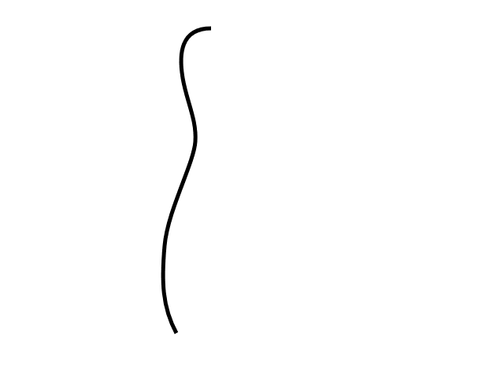

# WebGL 三维几何加工

有人问我怎么在 WebGL 中制作一个保龄球瓶，聪明的回答是`使用一个三维建模工具例如 Blender, Maya, 3D Studio Max, Cinema 4D, 等等`。使用它创建一个保龄球瓶，导出，读取点坐标(OBJ 格式相对简单些)。

但是，这让我想到，如果他们想做一个模型库该怎么办？

这有几种方法，一种方法是将圆柱体按照正弦函数放置在合适位置上，但这样表面并不平滑。一个标准的圆柱需要一些间距相等的圆环，但当曲线变得锐利的时候所需圆环的数量就会很多。

在模型库中你需要制作一个二维轮廓或者是一个符合边缘的曲线，然后将他们加工成三维图形。这里加工的意思就是将生成的二维点按照某些轴旋转。这样就可以很轻松的做出一些圆的物体，例如碗，棒球棒，瓶子，灯泡之类的物体。

那么该怎么做呢？首先我们要通过某种方式生成一个曲线，计算曲线上的点。然后使用矩阵运算将这些点按照某个轴旋转，构建出三角形网格。

计算机中常用的曲线就是贝塞尔曲线，你可能在一些编辑器例如 Adobe Illustrator 或 Inkscape 或 Affinity Designer 中编辑过贝塞尔曲线。

贝塞尔曲线或三次贝塞尔曲线由 4 个点组成，2 个端点，2 个“控制点”。

这就是四个点

<iframe src="https://codesandbox.io/embed/5s188r?codemirror=1&hidenavigation=1&theme=light&view=preview&initialpath=?maxDepth=0" class="embedded-codesandbox" sandbox="allow-modals allow-forms allow-popups allow-scripts allow-same-origin"></iframe>

<!-- [bezier-curve-diagram](embedded-codesandbox://webgl-fundamental-geometry/bezier-curve-diagram?view=preview&initialpath=?maxDepth=0) -->

从 0 到 1 之间选一个数（叫做 t），其中 0 是起点，1 是终点。然后在每个线段中计算出与 t 相关的点，`P1 P2`, `P2 P3`, `P3 P4`。

<iframe src="https://codesandbox.io/embed/5s188r?codemirror=1&hidenavigation=1&theme=light&view=preview&initialpath=?maxDepth=1" class="embedded-codesandbox" sandbox="allow-modals allow-forms allow-popups allow-scripts allow-same-origin"></iframe>

<!-- [bezier-curve-diagram](embedded-codesandbox://webgl-fundamental-geometry/bezier-curve-diagram?view=preview&initialpath=?maxDepth=1) -->

换句话说如果 `t = .25` 那么就计算出 P1 到 P2 距离为 25% 的点，从 P2 到 P3 距离为 25% 的点，从 P3 到 P4 距离为 25% 的点。

你可以拖动滑块调整 t 的值，也可以拖动 `P1, P2, P3` 和 P4 调整位置。

对这些结果点做同样的操作，计算 t 对应的 `Q1 Q2` 和 `Q2 Q3` 之间的点。

<iframe src="https://codesandbox.io/embed/5s188r?codemirror=1&hidenavigation=1&theme=light&view=preview&initialpath=?maxDepth=2" class="embedded-codesandbox" sandbox="allow-modals allow-forms allow-popups allow-scripts allow-same-origin"></iframe>

<!-- [bezier-curve-diagram](embedded-codesandbox://webgl-fundamental-geometry/bezier-curve-diagram?view=preview&initialpath=?maxDepth=2) -->

最后在 `R1 R2` 中计算出与 t 相关的点。

<iframe src="https://codesandbox.io/embed/5s188r?codemirror=1&hidenavigation=1&theme=light&view=preview&initialpath=?maxDepth=3" class="embedded-codesandbox" sandbox="allow-modals allow-forms allow-popups allow-scripts allow-same-origin"></iframe>

<!-- [bezier-curve-diagram](embedded-codesandbox://webgl-fundamental-geometry/bezier-curve-diagram?view=preview&initialpath=?maxDepth=3) -->

红点的位置就构成了一个曲线。

<iframe src="https://codesandbox.io/embed/5s188r?codemirror=1&hidenavigation=1&theme=light&view=preview&initialpath=?maxDepth=4" class="embedded-codesandbox" sandbox="allow-modals allow-forms allow-popups allow-scripts allow-same-origin"></iframe>

<!-- [bezier-curve-diagram](embedded-codesandbox://webgl-fundamental-geometry/bezier-curve-diagram?view=preview&initialpath=?maxDepth=4) -->

这就是三次贝塞尔曲线。

注意到在上述差值过程中通过 4 个点差出 3 个点，3 个点差出 2 个点，最后从 2 个点差出 1 个点，这并不是常用的做法，有人将这些数学运算简化成了一个公式，像这样

```
invT = (1 - t)
P = P1 * invT^3 +
    P2 * 3 * t * invT^2 +
    P3 * 3 * invT * t^2 +
    P4 * t^3
```

其中 P1, P2, P3, P4 就像上例中的四个点，P 就是那个红点。

在二维美术应用例如 Adobe Illustrator 中，当你制作一个较长的曲线时通常是由一些小的四点片段组成的。默认情况下应用将控制点沿着起/终点方向锁死，确保在公共点部分方向相反。

看这个例子，移动 P3 或 P5 会同时移动另一个。

[bezier-curve-edit](embedded-codesandbox://webgl-fundamental-geometry/bezier-curve-edit?view=preview)

注意这个曲线是两段，`P1,P2,P3,P4` 和 `P4,P5,P6,P7`。只有在 P3，P5 与 P4 的连线方向相反时曲线在这一点才会连续。大多数应用可以让你断开连接，并获得一个锐利的拐点。取消选中复选框然后拖拽 P3 或 P5 就会清晰看到独立的曲线。

接下来我们需要获得生成曲线上的点，通过给上方的公式提供 t 就可以生成一个点。

```js
function getPointOnBezierCurve(points, offset, t) {
  const invT = 1 - t;
  return v2.add(
    v2.mult(points[offset + 0], invT * invT * invT),
    v2.mult(points[offset + 1], 3 * t * invT * invT),
    v2.mult(points[offset + 2], 3 * invT * t * t),
    v2.mult(points[offset + 3], t * t * t)
  );
}
```

然后可以计算一系列点。

```js
function getPointsOnBezierCurve(points, offset, numPoints) {
  const points = [];
  for (let i = 0; i < numPoints; ++i) {
    const t = i / (numPoints - 1);
    points.push(getPointOnBezierCurve(points, offset, t));
  }
  return points;
}
```

注意：`v2.mult` 和 `v2.add` 是我加入的二维点运算辅助方法。

<iframe src="https://codesandbox.io/embed/5s188r?codemirror=1&hidenavigation=1&theme=light&view=preview&initialpath=?maxDepth=0%26showCurve=true%26showPoints=true" class="embedded-codesandbox" sandbox="allow-modals allow-forms allow-popups allow-scripts allow-same-origin"></iframe>

<!-- [bezier-curve-diagram](embedded-codesandbox://webgl-fundamental-geometry/bezier-curve-diagram?view=preview&initialpath=?maxDepth=0%26showCurve=true%26showPoints=true) -->

在图示中你可以选择点的个数，如果曲线比较锐利就可以多差值一些点，如果曲线比较平缓就可以少插值一些点。一个解决办法是检查曲线的锐利程度，如果过于锐利就拆分成两个曲线。

拆分的部分比较简单，如果我们再看看不同级别的拆分，对于任意值的 `t, P1, Q1, R1`, 红点构成一个曲线，终点是红点。`红点, R2, Q3, P4` 构成一个曲线。换句话说我们可以将曲线从任意位置分成两段，并且和原曲线相同。

<iframe src="https://codesandbox.io/embed/5s188r?codemirror=1&hidenavigation=1&theme=light&view=preview&initialpath=?maxDepth=4%26show2Curves=true" class="embedded-codesandbox" sandbox="allow-modals allow-forms allow-popups allow-scripts allow-same-origin"></iframe>

<!-- [bezier-curve-diagram](embedded-codesandbox://webgl-fundamental-geometry/bezier-curve-diagram?view=preview&initialpath=?maxDepth=4%26show2Curves=true) -->

第二个部分是如何决定曲线是否需要拆分，从网上查找后我发现了[这个方法](https://seant23.wordpress.com/2010/11/12/offset-bezier-curves/)，对于给定的曲线可以求出平滑程度。

```js
function flatness(points, offset) {
  const p1 = points[offset + 0];
  const p2 = points[offset + 1];
  const p3 = points[offset + 2];
  const p4 = points[offset + 3];

  let ux = 3 * p2[0] - 2 * p1[0] - p4[0];
  ux *= ux;
  let uy = 3 * p2[1] - 2 * p1[1] - p4[1];
  uy *= uy;
  let vx = 3 * p3[0] - 2 * p4[0] - p1[0];
  vx *= vx;
  let vy = 3 * p3[1] - 2 * p4[1] - p1[1];
  vy *= vy;

  if (ux < vx) {
    ux = vx;
  }

  if (uy < vy) {
    uy = vy;
  }

  return ux + uy;
}
```

我们可以用它获取曲线上的点，首先检查曲线是否太锐利，如果是就拆分，不是就将点加入列表。

```js
function getPointsOnBezierCurveWithSplitting(points, offset, tolerance, newPoints) {
  const outPoints = newPoints || [];
  if (flatness(points, offset) < tolerance) {
    // 将它加入点队列中
    outPoints.push(points[offset + 0]);
    outPoints.push(points[offset + 3]);
  } else {
    // 拆分
    const t = 0.5;
    const p1 = points[offset + 0];
    const p2 = points[offset + 1];
    const p3 = points[offset + 2];
    const p4 = points[offset + 3];

    const q1 = v2.lerp(p1, p2, t);
    const q2 = v2.lerp(p2, p3, t);
    const q3 = v2.lerp(p3, p4, t);

    const r1 = v2.lerp(q1, q2, t);
    const r2 = v2.lerp(q2, q3, t);

    const red = v2.lerp(r1, r2, t);

    // 求前半段的点
    getPointsOnBezierCurveWithSplitting([p1, q1, r1, red], 0, tolerance, outPoints);
    // 求后半段的点
    getPointsOnBezierCurveWithSplitting([red, r2, q3, p4], 0, tolerance, outPoints);
  }
  return outPoints;
}
```

<iframe src="https://codesandbox.io/embed/5s188r?codemirror=1&hidenavigation=1&theme=light&view=preview&initialpath=?maxDepth=0%26showCurve=true%26showTolerance=true" class="embedded-codesandbox" sandbox="allow-modals allow-forms allow-popups allow-scripts allow-same-origin"></iframe>

<!-- [bezier-curve-diagram](embedded-codesandbox://webgl-fundamental-geometry/bezier-curve-diagram?view=preview&initialpath=?maxDepth=0%26showCurve=true%26showTolerance=true) -->

这个算法在获取曲线点的过程中确保了点的数量比较充足，但是不能很好的排除不必要的点。

由于这个原因我们将使用我在网上找到的 [Ramer Douglas Peucker 算法](https://en.wikipedia.org/wiki/Ramer%E2%80%93Douglas%E2%80%93Peucker_algorithm)。

在这个算法中我们提供一系列点，找到离最后两点构成的直线距离最远的点，然后将这个距离和一个定值进行比较，如果小于那个值就保留最后两个点然后丢弃其他的点，大于则将曲线沿那个最远点分成两份，分别对每一份再做一次这个运算。

```js
function simplifyPoints(points, start, end, epsilon, newPoints) {
  const outPoints = newPoints || [];

  // 找到离最后两点距离最远的点
  const s = points[start];
  const e = points[end - 1];
  let maxDistSq = 0;
  let maxNdx = 1;
  for (let i = start + 1; i < end - 1; ++i) {
    const distSq = v2.distanceToSegmentSq(points[i], s, e);
    if (distSq > maxDistSq) {
      maxDistSq = distSq;
      maxNdx = i;
    }
  }

  // 如果距离太远
  if (Math.sqrt(maxDistSq) > epsilon) {
    // 拆分
    simplifyPoints(points, start, maxNdx + 1, epsilon, outPoints);
    simplifyPoints(points, maxNdx, end, epsilon, outPoints);
  } else {
    // 添加最后两个点
    outPoints.push(s, e);
  }

  return outPoints;
}
```

`v2.distanceToSegmentSq` 是计算点到线段距离平方的一个方法，使用距离平方的原因是比使用实际距离要快一些，因为我们值管线最远距离所以和实际距离的效果相同。

这是结果，调整距离查看添加或删除的点。

<iframe src="https://codesandbox.io/embed/5s188r?codemirror=1&hidenavigation=1&theme=light&view=preview&initialpath=?maxDepth=0%26showCurve=true%26showDistance=true" class="embedded-codesandbox" sandbox="allow-modals allow-forms allow-popups allow-scripts allow-same-origin"></iframe>

<!-- [bezier-curve-diagram](embedded-codesandbox://webgl-fundamental-geometry/bezier-curve-diagram?view=preview&initialpath=?maxDepth=0%26showCurve=true%26showDistance=true) -->

回到保龄球瓶，我们可以将上方的代码整理一下，需要添加和移除点，锁定和解锁控制点， 撤销等等。但是这有一个简单的方式，我们可以使用一个上方提到的编辑器，我使用这个在线编辑器。

这是保龄球的半边轮廓的 svg。



由 4 个曲线制成，路径的数据像这样

```svg
<path
  fill="none"
  stroke-width="5"
  d="
   m44,434
   c18,-33 19,-66 15,-111
   c-4,-45 -37,-104 -39,-132
   c-2,-28 11,-51 16,-81
   c5,-30 3,-63 -36,-63
  "
/>
```

[解译](https://developer.mozilla.org/en-US/docs/Web/SVG/Tutorial/Paths)这些数据得到这些点。

```
        ___
44, 371,   |
62, 338,   | 第一个曲线
63, 305,___|__
59, 260,___|  |
55, 215,      | 第二个曲线
22, 156,______|__
20, 128,______|  |
18, 100,         | 第三个曲线
31,  77,_________|__
36,  47,_________|  |
41,  17,            | 第四个曲线
39, -16,            |
 0, -16,____________|
```

现在有了曲线数据，需要计算出曲线上的点。

```js
// 获取所有片段的点
function getPointsOnBezierCurves(points, tolerance) {
  const newPoints = [];
  const numSegments = (points.length - 1) / 3;
  for (let i = 0; i < numSegments; ++i) {
    const offset = i * 3;
    getPointsOnBezierCurveWithSplitting(points, offset, tolerance, newPoints);
  }
  return newPoints;
}
```

调用 simplifyPoints 处理结果。

现在要旋转它们了，需要决定分多少个部分，对于每个部分都用矩阵运算绕 Y 轴转动一定角度获得，一旦获得所有点就用索引连接它们。

```js
// 绕 Y 轴旋转
function lathePoints(
  points,
  startAngle, // 起始角 (例如 0)
  endAngle, // 终止角 (例如 Math.PI * 2)
  numDivisions, // 这中间生成多少块
  capStart, // true 就封闭起点
  capEnd
) {
  // true 就封闭重点
  const positions = [];
  const texcoords = [];
  const indices = [];

  const vOffset = capStart ? 1 : 0;
  const pointsPerColumn = points.length + vOffset + (capEnd ? 1 : 0);
  const quadsDown = pointsPerColumn - 1;

  // 生成点
  for (let division = 0; division <= numDivisions; ++division) {
    const u = division / numDivisions;
    const angle = lerp(startAngle, endAngle, u) % (Math.PI * 2);
    const mat = m4.yRotation(angle);
    if (capStart) {
      // 在开始处添加一个 Y 轴上的点
      positions.push(0, points[0][1], 0);
      texcoords.push(u, 0);
    }
    points.forEach((p, ndx) => {
      const tp = m4.transformPoint(mat, [...p, 0]);
      positions.push(tp[0], tp[1], tp[2]);
      const v = (ndx + vOffset) / quadsDown;
      texcoords.push(u, v);
    });
    if (capEnd) {
      // 在终点处添加一个 Y 轴上的点
      positions.push(0, points[points.length - 1][1], 0);
      texcoords.push(u, 1);
    }
  }

  // 创建索引
  for (let division = 0; division < numDivisions; ++division) {
    const column1Offset = division * pointsPerColumn;
    const column2Offset = column1Offset + pointsPerColumn;
    for (let quad = 0; quad < quadsDown; ++quad) {
      indices.push(column1Offset + quad, column2Offset + quad, column1Offset + quad + 1);
      indices.push(column1Offset + quad + 1, column2Offset + quad, column2Offset + quad + 1);
    }
  }

  return {
    position: positions,
    texcoord: texcoords,
    indices: indices
  };
}
```

上方的代码创建了位置点和纹理坐标，然后创建索引生成三角网。capStart 和 capEnd 确定是都生成闭合点，假设我们在做一个罐头，这些选项指明是否需要闭合顶面和底面。

使用我们的简化代码就可以用哪些数据生成这样的 WebGL 缓冲

```js
const tolerance = 0.15;
const distance = 0.4;
const divisions = 16;
const startAngle = 0;
const endAngle = Math.PI * 2;
const capStart = true;
const capEnd = true;

const tempPoints = getPointsOnBezierCurves(curvePoints, tolerance);
const points = simplifyPoints(tempPoints, 0, tempPoints.length, distance);
const arrays = lathePoints(points, startAngle, endAngle, divisions, capStart, capEnd);
const extents = getExtents(arrays.position);
if (!bufferInfo) {
  bufferInfo = webglUtils.createBufferInfoFromArrays(gl, arrays);
}
```

[webgl-3d-lathe-step-01](embedded-codesandbox://webgl-fundamental-geometry/webgl-3d-lathe-step-01?view=preview)

拖动滑块观察对结果的影响。

这还有一个问题，开启三角形你会看到纹理不是均匀分布的，这是因为我们将纹理坐标的 v 值赋为曲线点的索引，如果曲线上的点距离相等那就没问题，但是它们距离并不相等。

我们可以遍历曲线上的点并计算出每一点对应曲线长度，最后将这个长度除以曲线总长度赋值给 v。

```js{19-31,46}
// 绕 Y 轴旋转
function lathePoints(
  points,
  startAngle, // 起始角 (例如 0)
  endAngle, // 终止角 (例如 Math.PI * 2)
  numDivisions, // 这中间生成多少块
  capStart, // true 就封闭起点
  capEnd
) {
  // true 就封闭重点
  const positions = [];
  const texcoords = [];
  const indices = [];

  const vOffset = capStart ? 1 : 0;
  const pointsPerColumn = points.length + vOffset + (capEnd ? 1 : 0);
  const quadsDown = pointsPerColumn - 1;

  // 生成 v 值
  let vcoords = [];

  // 先计算出每一点对应的长度
  let length = 0;
  for (let i = 0; i < points.length - 1; ++i) {
    vcoords.push(length);
    length += v2.distance(points[i], points[i + 1]);
  }
  vcoords.push(length); // 最后一个点

  // 除以总长
  vcoords = vcoords.map((v) => v / length);

  // 生成点
  for (let division = 0; division <= numDivisions; ++division) {
    const u = division / numDivisions;
    const angle = lerp(startAngle, endAngle, u) % (Math.PI * 2);
    const mat = m4.yRotation(angle);
    if (capStart) {
      // 在开始处添加一个 Y 轴上的点
      positions.push(0, points[0][1], 0);
      texcoords.push(u, 0);
    }
    points.forEach((p, ndx) => {
      const tp = m4.transformPoint(mat, [...p, 0]);
      positions.push(tp[0], tp[1], tp[2]);
      texcoords.push(u, vcoords[ndx]);
    });
    if (capEnd) {
      // 在终点处添加一个 Y 轴上的点
      positions.push(0, points[points.length - 1][1], 0);
      texcoords.push(u, 1);
    }
  }

  // 创建索引
  for (let division = 0; division < numDivisions; ++division) {
    const column1Offset = division * pointsPerColumn;
    const column2Offset = column1Offset + pointsPerColumn;
    for (let quad = 0; quad < quadsDown; ++quad) {
      indices.push(column1Offset + quad, column1Offset + quad + 1, column2Offset + quad);
      indices.push(column1Offset + quad + 1, column2Offset + quad + 1, column2Offset + quad);
    }
  }

  return {
    position: positions,
    texcoord: texcoords,
    indices: indices
  };
}
```

[webgl-3d-lathe-step-02](embedded-codesandbox://webgl-fundamental-geometry/webgl-3d-lathe-step-02?view=preview)

这些纹理坐标还是不完美，因为我们还没决定怎么处理闭合部分的纹理。这也是使用建模软件的一个原因。我们可以总结出很多计算闭合处 uv 值的方法，但并不是很有意义。如果你谷歌一下 UV map a barrel，你会发现完美的 UV 坐标是不需要太多数学运算的，只需要生成合适的点数据，这时你就需要一个合适工具创建点数据。

还有一个事情要做，就是添加法向量。

我们可以计算每一个曲线点的法向量，事实上如果你会看这节中的例子，你会发现 R1 和 R2 构成的线段切曲线于红点处。


法向量和切线垂直所以从切线很容易求出法向量。

但是，假设我们想要做一个烛台，有这样一个框架。


这有很多平滑区域也有很多锐利角，如何决定使用法向量的方向呢？当需要锐利边缘时就要使用多余的顶点，因为一个顶点有一个位置和一个法向量，如果需要多个法向量就需要不同的顶点，这也是制作立方体需要至少 24 个顶点的原因，虽然立方体只有 8 个顶点，但每个面在那个顶点处都需要不同的法向量。

创建立方体的时候很容易确定法向量，但是形状复杂的时候就没那么容易了。

所有的建模软件都有不同的方式创建法向量，一个常用的做法就是将该点邻接的三角面的法向量求平均。另外，还允许用户选择一个最大角度，如果邻接的多边形的法向量的夹角大于最大角度，就会创建一个新顶点。

我们来实现这个。

```js
function generateNormals(arrays, maxAngle) {
  const positions = arrays.position;
  const texcoords = arrays.texcoord;

  // 首先计算出每个面的法向量
  let getNextIndex = makeIndiceIterator(arrays);
  const numFaceVerts = getNextIndex.numElements;
  const numVerts = arrays.position.length;
  const numFaces = numFaceVerts / 3;
  const faceNormals = [];

  // 计算每个面的法向量
  // 计算过程中为每个面新建顶点
  for (let i = 0; i < numFaces; ++i) {
    const n1 = getNextIndex() * 3;
    const n2 = getNextIndex() * 3;
    const n3 = getNextIndex() * 3;

    const v1 = positions.slice(n1, n1 + 3);
    const v2 = positions.slice(n2, n2 + 3);
    const v3 = positions.slice(n3, n3 + 3);

    faceNormals.push(m4.normalize(m4.cross(m4.subtractVectors(v1, v2), m4.subtractVectors(v3, v2))));
  }

  let tempVerts = {};
  let tempVertNdx = 0;

  // 假设顶点位置精确匹配

  function getVertIndex(x, y, z) {
    const vertId = x + ',' + y + ',' + z;
    const ndx = tempVerts[vertId];
    if (ndx !== undefined) {
      return ndx;
    }
    const newNdx = tempVertNdx++;
    tempVerts[vertId] = newNdx;
    return newNdx;
  }

  // 我们需要算出共享的顶点
  // 这并不像我们看着面那么简单 (三角形)
  // 因为假如我们有一个标准的圆柱
  //
  //
  //      3-4
  //     /   \
  //    2     5   从上往下看，从 S 走到 E, E 和 S
  //    1     6   是不同的点，因为它们不共享UV坐标。
  //     \   /
  //      S/E
  //
  // 顶点在起始和结束位置并不是共享的
  // 由于它们有不同的 UV 坐标，但如果不
  // 把它们看作共享顶点就会得到错误结果

  const vertIndices = [];
  for (let i = 0; i < numVerts; ++i) {
    const offset = i * 3;
    const vert = positions.slice(offset, offset + 3);
    vertIndices.push(getVertIndex(vert));
  }

  // 遍历所有顶点记录所在的面
  const vertFaces = [];
  getNextIndex.reset();
  for (let i = 0; i < numFaces; ++i) {
    for (let j = 0; j < 3; ++j) {
      const ndx = getNextIndex();
      const sharedNdx = vertIndices[ndx];
      let faces = vertFaces[sharedNdx];
      if (!faces) {
        faces = [];
        vertFaces[sharedNdx] = faces;
      }
      faces.push(i);
    }
  }

  // 遍历面上的顶点计算每个顶点的法向量
  // 只计算两面角度不大于 maxAngle 面
  // 将结果写入 newPositions, newTexcoords 和 newNormals
  // 丢弃相同的顶点
  tempVerts = {};
  tempVertNdx = 0;
  const newPositions = [];
  const newTexcoords = [];
  const newNormals = [];

  function getNewVertIndex(x, y, z, nx, ny, nz, u, v) {
    const vertId = x + ',' + y + ',' + z + ',' + nx + ',' + ny + ',' + nz + ',' + u + ',' + v;

    const ndx = tempVerts[vertId];
    if (ndx !== undefined) {
      return ndx;
    }
    const newNdx = tempVertNdx++;
    tempVerts[vertId] = newNdx;
    newPositions.push(x, y, z);
    newNormals.push(nx, ny, nz);
    newTexcoords.push(u, v);
    return newNdx;
  }

  const newVertIndices = [];
  getNextIndex.reset();
  const maxAngleCos = Math.cos(maxAngle);
  // 对每个面
  for (let i = 0; i < numFaces; ++i) {
    // 获取该面的法向量
    const thisFaceNormal = faceNormals[i];
    // 对于面上的每一点
    for (let j = 0; j < 3; ++j) {
      const ndx = getNextIndex();
      const sharedNdx = vertIndices[ndx];
      const faces = vertFaces[sharedNdx];
      const norm = [0, 0, 0];
      faces.forEach((faceNdx) => {
        // 面的法向量是否相同
        const otherFaceNormal = faceNormals[faceNdx];
        const dot = m4.dot(thisFaceNormal, otherFaceNormal);
        if (dot > maxAngleCos) {
          m4.addVectors(norm, otherFaceNormal, norm);
        }
      });
      m4.normalize(norm, norm);
      const poffset = ndx * 3;
      const toffset = ndx * 2;
      newVertIndices.push(
        getNewVertIndex(
          positions[poffset + 0],
          positions[poffset + 1],
          positions[poffset + 2],
          norm[0],
          norm[1],
          norm[2],
          texcoords[toffset + 0],
          texcoords[toffset + 1]
        )
      );
    }
  }

  return {
    position: newPositions,
    texcoord: newTexcoords,
    normal: newNormals,
    indices: newVertIndices
  };
}

function makeIndexedIndicesFn(arrays) {
  const indices = arrays.indices;
  let ndx = 0;
  const fn = function () {
    return indices[ndx++];
  };
  fn.reset = function () {
    ndx = 0;
  };
  fn.numElements = indices.length;
  return fn;
}

function makeUnindexedIndicesFn(arrays) {
  let ndx = 0;
  const fn = function () {
    return ndx++;
  };
  fn.reset = function () {
    ndx = 0;
  };
  fn.numElements = arrays.positions.length / 3;
  return fn;
}

function makeIndiceIterator(arrays) {
  return arrays.indices ? makeIndexedIndicesFn(arrays) : makeUnindexedIndicesFn(arrays);
}
```

上方的代码首先通过原始顶点计算每个面（三角形）的法向量，然后创建一个顶点索引集寻找相同的顶点，那是因为我们旋转后的起始和终止点应该是同一个点，但 UV 坐标不同所以要单独处理，计算顶点法向量时要将它们看作相同点。

这些做完之后，对于每个顶点，生成了一个包含它的面的集合。

最后将所有除了差值大于 maxAngle 的面的法向量求平均，获得一个新的顶点集合。

[webgl-3d-lathe-step-03](embedded-codesandbox://webgl-fundamental-geometry/webgl-3d-lathe-step-03?view=preview)

注意到在期望的位置得到了锐利的边缘，调大 maxAngle 的值就会将相邻的面加入计算，得到平滑的边缘。试试调整 divisions 为 5 或者 6 然后调整 maxAngle 的值让该平滑的地方平滑，该锐利的地方锐利，你也可以设置 mode 为 lit 查看光照效果，这是我们需要法向量的原因。

由此得到的结论是：如果想做三维模型就用三维建模库

你可能需要一个 UV 编辑器，帮助完成封闭问题也是三维编辑器提供的功能。代替使用有限的组合处理闭合处问题，可以使用其他编辑器提供的特性处理闭合处并轻松的获取 UV 值，三维编辑器还支持拉伸面和沿路径拉伸，你看了之后就会发现它们是基于上方的加工方式。

## 参考

[贝塞尔曲线](https://pomax.github.io/bezierinfo/)

## 这里的模运算符是做什么的?

如果你仔细看了 lathePoints 方法就会看到计算角度时使用了模运算符。

```js
for (let division = 0; division <= numDivisions; ++division) {
  const u = division / numDivisions;
  const angle = lerp(startAngle, endAngle, u) % (Math.PI * 2);
}
```

为什么这么做?

当我们将点旋转成一个圆形时我们希望起点和终点是匹配的。`Math.sin(0)` 和 `Math.sin(Math.PI * 2)` 应该相等，但是浮点运算并不精确，所以通常它们并不是 100% 的相等。

这在计算法向量的时候十分重要，我们想知道到一个顶点共享的所有面，我们比较顶点，如果相同就认为是同一点，那么如果不被认为是同一点就会计算出错误的法向量。

这是这种情况发生时的样子


你可以看到它们在共享处没有被当作相同点，因为它们不是 100% 的相等。

起初我想通过提供一个误差范围，检查顶点的距离是否在范围内，如果小于误差范围就认为是同一点，就像这样。

```js
const epsilon = 0.0001;
const tempVerts = [];
function getVertIndex(position) {
  if (tempVerts.length) {
    // 找到最近的点
    let closestNdx = 0;
    let closestDistSq = v2.distanceSq(position, tempVerts[0]);
    for (let i = 1; i < tempVerts.length; ++i) {
      let distSq = v2.distanceSq(position, tempVerts[i]);
      if (distSq < closestDistSq) {
        closestDistSq = distSq;
        closestNdx = i;
      }
    }
    // 是否在误差范围内
    if (closestDistSq < epsilon) {
      // 是就返回那个点
      return closestNdx;
    }
  }
  // 不是就将它添加到序列中并返回索引
  tempVerts.push(position);
  return tempVerts.length - 1;
}
```

它成功解决了接缝问题，但是它消耗的时间太长，导致 UI 交互不稳定。这是因为它是一个复杂度为 O^2 的解决方法，如果你滑动滑块在最多的情况下就会创建大约 20000 个点，再加上 O^2 的复杂度就是 3 亿次迭代。

我在网上寻找简单的方法但没找到，我想过将所有点都放到[八叉树](https://en.wikipedia.org/wiki/Octree)中，让寻找匹配点速度快一些，但那似乎远离了本章的范围。

然后我就想到既然只是终点问题我就可以进行模运算，让结果相等，原始代码像这样

```js
const angle = lerp(startAngle, endAngle, u);
```

新代码像这样

```js
const angle = lerp(startAngle, endAngle, u) % (Math.PI * 2);
```

由于模运算 endAngle 为 `Math.PI * 2` 时 angle 就为 0，和起始点相同，接缝消失了，问题解决了！

但是，即使这样当设置 distance 为 0.001 并且 divisions 为 60 时，在我的机子上还要几乎 1 秒钟的运算。这可能还有很多可以优化的地方，但创建复杂的网格是一个耗时的工作，这就是我的三维游戏可以以 60fps 运行，但是三维建模工具通常都是很低的帧率。

## 使用矩阵运算是不是大材小用了?

当我们旋转点的时候使用这样的代码

```js
const mat = m4.yRotation(angle);
// ...
points.forEach((p, ndx) => {
  const tp = m4.transformPoint(mat, [...p, 0]);
  // ...
});
```

使用 4x4 矩阵转换一个任意三维点需要 16 次乘法，12 次加法，和 3 次除法。我们可以只使用单位圆形式的旋转运算。

```js
const s = Math.sin(angle);
const c = Math.cos(angle);
//...
points.forEach((p, ndx) => {
  const x = p[0];
  const y = p[1];
  const z = p[2];
  const tp = [x * c - z * s, y, x * s + z * c];
  //...
});
```

这样就只有 4 次乘法和 2 次加法，没有方法调用，应该至少要快 6 倍。

这个优化值得么？当然，对于这个特殊的例子，我不认为这个有什么意义，我认为你可能需要让用户决定绕那个轴旋转，使用矩阵就可以让用户传入一个轴，像这样

```js
const mat = m4.axisRotation(userSuppliedAxis, angle);
```

哪种方式更好其实取决于你自己和你的需求，我认为我会优先选择灵活的方式，然后运行太慢时再去考虑优化。

# WebGL 加载 .obj 文件

Wavefront 的 .obj 文件是网上最常用的 3D 文件格式。它们并不是难以解析的格式，所以让我们试试。这能够提供一个解析 3D 文件的有用例子。

> 该 .obj 解析器不会面面俱到或者完美，也不保证能够处理所有 .obj 文件。这只是一个练习。如果你使用该程序并遇到问题，下面的链接可能会对你有帮助。
>
> 我找到的有关 .obj 文件的[文档](http://paulbourke.net/dataformats/obj/)。不过[这里](https://www.loc.gov/preservation/digital/formats/fdd/fdd000507.shtml)链接了很多其它相关文档。

让我们看一个简单的例子。下面是从 blender 默认场景中导出的 cube.obj：

```obj
# Blender v2.80 (sub 75) OBJ File: ''
# www.blender.org
mtllib cube.mtl
o Cube
v 1.000000 1.000000 -1.000000
v 1.000000 -1.000000 -1.000000
v 1.000000 1.000000 1.000000
v 1.000000 -1.000000 1.000000
v -1.000000 1.000000 -1.000000
v -1.000000 -1.000000 -1.000000
v -1.000000 1.000000 1.000000
v -1.000000 -1.000000 1.000000
vt 0.375000 0.000000
vt 0.625000 0.000000
vt 0.625000 0.250000
vt 0.375000 0.250000
vt 0.375000 0.250000
vt 0.625000 0.250000
vt 0.625000 0.500000
vt 0.375000 0.500000
vt 0.625000 0.750000
vt 0.375000 0.750000
vt 0.625000 0.750000
vt 0.625000 1.000000
vt 0.375000 1.000000
vt 0.125000 0.500000
vt 0.375000 0.500000
vt 0.375000 0.750000
vt 0.125000 0.750000
vt 0.625000 0.500000
vt 0.875000 0.500000
vt 0.875000 0.750000
vn 0.0000 1.0000 0.0000
vn 0.0000 0.0000 1.0000
vn -1.0000 0.0000 0.0000
vn 0.0000 -1.0000 0.0000
vn 1.0000 0.0000 0.0000
vn 0.0000 0.0000 -1.0000
usemtl Material
s off
f 1/1/1 5/2/1 7/3/1 3/4/1
f 4/5/2 3/6/2 7/7/2 8/8/2
f 8/8/3 7/7/3 5/9/3 6/10/3
f 6/10/4 2/11/4 4/12/4 8/13/4
f 2/14/5 1/15/5 3/16/5 4/17/5
f 6/18/6 5/19/6 1/20/6 2/11/6
```

即使不看文档我们也能发现 v 开始的行表示顶点，vt 开始的行表示纹理坐标，vn 开始的行表示法线。接下来就是理解剩下的代表什么。

看起来 .obj 文件是文本文件，所以我们要做的第一件事就是加载文本文件。幸运的是，如果使用 async/await 这将是一件很简单的事。

```js
async function main() {
  // ...

  const response = await fetch('resources/models/cube/cube.obj');
  const text = await response.text();
}
```

接着，我们可以一行一行地解析，每行都是下面的形式:

```
keyword data data data ...
```

每行的开头是 keyword，data 由空格隔开。以 `#` 开头的行是注释。

接着，用代码来解析每一行，跳过空白行和注释，然后根据 keyword 调用对应的函数。

```js
function parseOBJ(text) {
  const keywords = {};

  const keywordRE = /(\w*)(?: )*(.*)/;
  const lines = text.split('\n');
  for (let lineNo = 0; lineNo < lines.length; ++lineNo) {
    const line = lines[lineNo].trim();
    if (line === '' || line.startsWith('#')) {
      continue;
    }
    const m = keywordRE.exec(line);
    if (!m) {
      continue;
    }
    const [, keyword, unparsedArgs] = m;
    const parts = line.split(/\s+/).slice(1);
    const handler = keywords[keyword];
    if (!handler) {
      console.warn('unhandled keyword:', keyword, ' at line', lineNo + 1);
      continue;
    }
    handler(parts, unparsedArgs);
  }
}
```

注意：我们去除了每行开头和结尾的空格。我不知道这是否有必要，但是我觉得没有坏处。我们用 `/\s+/` 将每行以空格分割。同样地我不知道这是否有必要，data 之间会有多于一个空格吗？是否可以是制表符？不知道，但是这样看起来更安全。

另外，我们将每行的第一部分作为 keyword，然后找到对应的函数调用，并将 keyword 后面的 data 传给该函数。所以接下来我们只要完成这些函数。

之前，我们猜测了 v，vt 和 vn 的含义。文档表明 f 代表“面”或多边形，每部分数据代表了顶点、纹理坐标以及法线。

如果一个索引是正数，表示从序列 1 开始的偏移。如果索引是负数，表示从序列结尾开始的偏移。索引的顺序是：顶点/纹理坐标/法线，只有顶点是必要的。

```
f 1 2 3             # 只包含顶点索引
f 1/1 2/2 3/3       # 包含顶点索引和纹理坐标索引
f 1/1/1 2/2/2 3/3/3 # 包含顶点索引、纹理坐标索引和法线索引
f 1//1 2//2 3//3    # 包含顶点索引和法线索引
```

f 可以有多于 3 个顶点，比如 4 个顶点代表四边形。WebGL 只能绘制三角形，所以需要将数据转换成三角形。标准并没有规定说一个面可以有多于 4 个顶点，也没有说面必须是凹的或凸的。但暂时让我们假设面是凹的。

通常在 WebGL 中，我们不单独说明顶点、纹理坐标和法线，`WebGL 顶点` 代表了包含了代表该顶点的顶点坐标、纹理坐标、法线的数据集合。例如，要绘制一个立方体，WebGL 需要 36 个顶点，每个面是两个三角形，每个三角形是 3 个顶点，6 个面每个面 2 个三角形，每个三角形 3 个顶点 = 36 个顶点。尽管一个立方体只有 8 个不重复的顶点和 6 条不重复的法线。所以，我们需要读取面的顶点索引来生成包含了顶点位置、纹理坐标、法线的 `WebGL 顶点`。

所以，根据上面的描述，我们可以像下面这样解析：

```js
function parseOBJ(text) {
  // 因为索引是从 1 开始的，所以填充索引为 0 的位置
  const objPositions = [[0, 0, 0]];
  const objTexcoords = [[0, 0]];
  const objNormals = [[0, 0, 0]];

  // 和 `f` 一样的索引顺序
  const objVertexData = [objPositions, objTexcoords, objNormals];

  // 和 `f` 一样的索引顺序
  let webglVertexData = [
    [], // 顶点
    [], // 纹理坐标
    [] // 法线
  ];

  function addVertex(vert) {
    const ptn = vert.split('/');
    ptn.forEach((objIndexStr, i) => {
      if (!objIndexStr) {
        return;
      }
      const objIndex = parseInt(objIndexStr);
      const index = objIndex + (objIndex >= 0 ? 0 : objVertexData[i].length);
      webglVertexData[i].push(...objVertexData[i][index]);
    });
  }

  const keywords = {
    v(parts) {
      objPositions.push(parts.map(parseFloat));
    },
    vn(parts) {
      objNormals.push(parts.map(parseFloat));
    },
    vt(parts) {
      objTexcoords.push(parts.map(parseFloat));
    },
    f(parts) {
      const numTriangles = parts.length - 2;
      for (let tri = 0; tri < numTriangles; ++tri) {
        addVertex(parts[0]);
        addVertex(parts[tri + 1]);
        addVertex(parts[tri + 2]);
      }
    }
  };
}
```

上面的代码创建了 3 个数组来保存从 object 文件中解析出来的顶点位置、纹理坐标和法线。同时创建了 3 个数组来保存 WebGL 的顶点。为了方便引用，数组的顺序和 f 中索引的顺序是一样的。

例如下面的 f 行

```
f 1/2/3/ 4/5/6 7/8/9
```

像 4/5/6 表示对这个面的一个顶点使用“顶点 4”，“纹理坐标 5”，“法线 6”。我们将顶点、纹理坐标、法线数据放进 objVertexData 数组，这样就能简单的表示为：对 webglData 的第 i 项，使用 objData 第 i 个数组中的第 n 个元素。 这样会简化我们的代码。

在函数的结尾返回我们构建的数据

```js
// ...

return {
  position: webglVertexData[0],
  texcoord: webglVertexData[1],
  normal: webglVertexData[2]
};
```

接下来要做的就是将数据绘制出来。首先我们使用三维方向光源中着色器的变体。

```js
const vs = `
   attribute vec4 a_position;
   attribute vec3 a_normal;
   
   uniform mat4 u_projection;
   uniform mat4 u_view;
   uniform mat4 u_world;
   
   varying vec3 v_normal;
   
   void main() {
      gl_Position = u_projection * u_view * u_world * a_position;
      v_normal = mat3(u_world) * a_normal;
   }
`;

const fs = `
   precision mediump float;
   
   varying vec3 v_normal;
   
   uniform vec4 u_diffuse;
   uniform vec3 u_lightDirection;
   
   void main () {
      vec3 normal = normalize(v_normal);
      float fakeLight = dot(u_lightDirection, normal) * .5 + .5;
      gl_FragColor = vec4(u_diffuse.rgb * fakeLight, u_diffuse.a);
   }
`;
```

然后使用来自码少趣多中的代码加载模型

```js
async function main() {
  // 获取 WebGL 渲染上下文
  /** @type {HTMLCanvasElement} */
  const canvas = document.querySelector('#canvas');
  const gl = canvas.getContext('webgl');
  if (!gl) {
    return;
  }

  // ... shaders ...

  // 编译、链接着色器，查找属性和全局变量位置
  const meshProgramInfo = webglUtils.createProgramInfo(gl, [vs, fs]);

  const data = await loadOBJ('resources/models/cube/cube.obj');

  // 数据是像这样命名的：
  //
  // {
  //   position: [...],
  //   texcoord: [...],
  //   normal: [...],
  // }
  //
  // 因为这些数组的名称和顶点着色器中的属性对应，所以我们可以将数据直接传进
  // 来自“码少趣多”文章中的 `createBufferInfoFromArrays`。

  // 通过调用 gl.createBuffer, gl.bindBuffer, gl.bufferData 为每个数组创建缓冲
  const bufferInfo = webglUtils.createBufferInfoFromArrays(gl, data);
}
```

然后绘制数据

```js
const cameraTarget = [0, 0, 0];
const cameraPosition = [0, 0, 4];
const zNear = 0.1;
const zFar = 50;

function degToRad(deg) {
  return (deg * Math.PI) / 180;
}

function render(time) {
  time *= 0.001; // 转成秒

  webglUtils.resizeCanvasToDisplaySize(gl.canvas);
  gl.viewport(0, 0, gl.canvas.width, gl.canvas.height);
  gl.enable(gl.DEPTH_TEST);
  gl.enable(gl.CULL_FACE);

  const fieldOfViewRadians = degToRad(60);
  const aspect = gl.canvas.clientWidth / gl.canvas.clientHeight;
  const projection = m4.perspective(fieldOfViewRadians, aspect, zNear, zFar);

  const up = [0, 1, 0];
  // 通过 lookAt 计算 camera 矩阵
  const camera = m4.lookAt(cameraPosition, cameraTarget, up);

  // 通过 camera 矩阵创建 view 矩阵
  const view = m4.inverse(camera);

  const sharedUniforms = {
    u_lightDirection: m4.normalize([-1, 3, 5]),
    u_view: view,
    u_projection: projection
  };

  gl.useProgram(meshProgramInfo.program);

  // 调用 gl.uniform
  webglUtils.setUniforms(meshProgramInfo, sharedUniforms);

  // 调用 gl.bindBuffer, gl.enableVertexAttribArray, gl.vertexAttribPointer
  webglUtils.setBuffersAndAttributes(gl, meshProgramInfo, bufferInfo);

  // 调用 gl.uniform
  webglUtils.setUniforms(meshProgramInfo, {
    u_world: m4.yRotation(time),
    u_diffuse: [1, 0.7, 0.5, 1]
  });

  // 调用 gl.drawArrays or gl.drawElements
  webglUtils.drawBufferInfo(gl, bufferInfo);

  requestAnimationFrame(render);
}
requestAnimationFrame(render);
```

这样，我们就能看到模型被加载和绘制。

[webgl-load-obj-cube](embedded-codesandbox://webgl-fundamental-geometry/webgl-load-obj-cube?view=preview)

关于未处理 keyword 的信息，它们是什么作用呢？

usemtl 是这之中最重要的。它指明了后面出现的所有几何体都使用指定的材质。例如，你有一个车辆的模型，你可能会希望车窗是透明的，保险杠是金属反光的。窗是透明的，保险杠是反光的，所以它们需要和车体不一样的绘制方法。usemtl 标签标记了这部分信息。

因为我们需要单独绘制这些部分，所以我们需要修改代码，每次遇到 usemtl 我们就创建一个新的 webgl 数据集。

首先，添加代码

```js{17-44}
function parseOBJ(text) {
  // 因为索引是从 1 开始的，所以填充索引为 0 的位置
  const objPositions = [[0, 0, 0]];
  const objTexcoords = [[0, 0]];
  const objNormals = [[0, 0, 0]];

  // 和 `f` 一样的索引顺序
  const objVertexData = [objPositions, objTexcoords, objNormals];

  // 和 `f` 一样的索引顺序
  let webglVertexData = [
    [], // 顶点
    [], // 纹理坐标
    [] // 法线
  ];

  const geometries = [];
  let geometry;
  let material = 'default';

  function newGeometry() {
    // 如果有存在的几何体并且不是空的，销毁
    if (geometry && geometry.data.position.length) {
      geometry = undefined;
    }
  }

  function setGeometry() {
    if (!geometry) {
      const position = [];
      const texcoord = [];
      const normal = [];
      webglVertexData = [position, texcoord, normal];
      geometry = {
        material,
        data: {
          position,
          texcoord,
          normal
        }
      };
      geometries.push(geometry);
    }
  }

  // ...
}
```

接着当我们在处理 keywords 的时候，在合适的地方调用它们，包括添加 o keyword 的函数。

```js{14,22-25}
// ...

const keywords = {
  v(parts) {
    objPositions.push(parts.map(parseFloat));
  },
  vn(parts) {
    objNormals.push(parts.map(parseFloat));
  },
  vt(parts) {
    objTexcoords.push(parts.map(parseFloat));
  },
  f(parts) {
    setGeometry();
    const numTriangles = parts.length - 2;
    for (let tri = 0; tri < numTriangles; ++tri) {
      addVertex(parts[0]);
      addVertex(parts[tri + 1]);
      addVertex(parts[tri + 2]);
    }
  },
  usemtl(parts, unparsedArgs) {
    material = unparsedArgs;
    newGeometry();
  }
};

// ...
```

usemtl 不是必要的，如果在文件中没有 usemtl，我们想要有默认的几何体。所以在 f 函数中我们调用了 setGeometry 来创建。

最后我们返回 geometries 对象数组，每个对象包含 name 和 data。

```js
// ...

// return {
//   position: webglVertexData[0],
//   texcoord: webglVertexData[1],
//   normal: webglVertexData[2]
// };
return geometries;
```

同时，我们需要处理纹理坐标或法线缺失的情况。

```js{1-4}
// 移除空数组
for (const geometry of geometries) {
  geometry.data = Object.fromEntries(Object.entries(geometry.data).filter(([, array]) => array.length > 0));
}

return {
  materialLibs,
  geometries
};
```

让我们继续 keywords，根据官方规范，mtllib 指定了包含材质信息的独立的一个或多个文件。不幸的是，在实际应用中，文件名中可以包含空格，但 .obj 格式中并没有提供逃逸字符来使用空格或引号。理想情况应该使用能解决这些问题的、良好定义的格式，比如 json、xml 或 yaml 等，但 .obj 格式诞生的比它们都早。

稍后我们在处理加载文件。先让我们把它加到加载器里以便之后可以使用。

```js{3,9-11,15-19}
function parseOBJ(text) {
  // ...
  const materialLibs = [];

  // ...

  const keywords = {
    // ...
    mtllib(parts, unparsedArgs) {
      materialLibs.push(unparsedArgs);
    }
    // ...
  };

  // return geometries;
  return {
    materialLibs,
    geometries
  };
}
```

o 指定表明了接下来的条目属于命名为 "object" 的对象。但我们并不清楚如何使用它。文件中能只包含 o 而没有 usemtl 吗？先假设可以。

```js{4,15,29-32}
function parseOBJ(text) {
  // ...
  let material = 'default';
  let object = 'default';

  // ...

  function setGeometry() {
    if (!geometry) {
      const position = [];
      const texcoord = [];
      const normal = [];
      webglVertexData = [position, texcoord, normal];
      geometry = {
        object,
        material,
        data: {
          position,
          texcoord,
          normal
        }
      };
      geometries.push(geometry);
    }
  }

  const keywords = {
    // ...
    o(parts, unparsedArgs) {
      object = unparsedArgs;
      newGeometry();
    }
    // ...
  };
}
```

s 指定了一个 smoothing group。我觉得这是我们可以忽略的。它们通常在建模程序中用来自动生成顶点法线。顶点法线的计算，需要先计算每个面的法线，而每个面的法线可以很容易使用叉乘得到，这部分已经在三维相机中提到了。对于任意顶点，我们可以对该顶点所在的面取均值。但是有时我们想要一条边时，我们需要能够告诉程序忽略一些面。Smoothing groups 让我们指定计算顶点法线时哪些面需要被包含。关于如何计算几何体的顶点法线，可以看 `WebGL 三维几何加工` 作为例子。

在我们的例子中，我们先忽略它。假设大部分 .obj 文件内部都包含法线，所以一般不需要 smoothing groups。一般在模型库中才会有它，以便你想要编辑或重新生成法线。

```js{1,5}
const noop = () => {};

const keywords = {
  // ...
  s: noop
  // ...
};
```

目前为止我们还剩一个 keyword：g 代表组 (group)。通常它只是一些元数据。Objects 可以存在于多个 group 中。因为它会出现在我们接下来的文件中，所以我们先添加支持代码，尽管现在并不使用。

```js{3,13,29-32}
function parseOBJ(text) {
  // ...
  let groups = ['default'];
  // ...
  function setGeometry() {
    if (!geometry) {
      const position = [];
      const texcoord = [];
      const normal = [];
      webglVertexData = [position, texcoord, normal];
      geometry = {
        object,
        groups,
        material,
        data: {
          position,
          texcoord,
          normal
        }
      };
      geometries.push(geometry);
    }
  }

  // ...

  const keywords = {
    // ...
    g(parts) {
      groups = parts;
      newGeometry();
    }
    // ...
  };
}
```

现在我们创建了多个几何体的集合，我们需要改变我们的初始化代码来为每一个几何体创建 WebGLBuffers。同时我们也会创建一个随机的颜色，这样就能方便地分辨不同的部分。

```js{1-2,4-5,7,21-26}
// const response = await fetch('resources/models/cube/cube.obj');
const response = await fetch('resources/models/chair/chair.obj');
const text = await response.text();
// const data = parseOBJ(text);
const obj = parseOBJ(text);

const parts = obj.geometries.map(({ data }) => {
  // 数据是像这样命名的：
  //
  // {
  //   position: [...],
  //   texcoord: [...],
  //   normal: [...],
  // }
  //
  // 因为这些数组的名称和顶点着色器中的属性对应，所以我们可以将数据直接传进
  // 来自“码少趣多”文章中的 `createBufferInfoFromArrays`。

  // 通过调用 gl.createBuffer, gl.bindBuffer, gl.bufferData 为每个数组创建缓冲
  const bufferInfo = webglUtils.createBufferInfoFromArrays(gl, data);
  return {
    material: {
      u_diffuse: [Math.random(), Math.random(), Math.random(), 1]
    },
    bufferInfo
  };
});
```

我们从加载一个立方体换成了椅子


要渲染，我们只需要循环绘制每个部分

```js{9-10,12,17-20}
function render(time) {
  // ...

  gl.useProgram(meshProgramInfo.program);

  // 调用 gl.uniform
  webglUtils.setUniforms(meshProgramInfo, sharedUniforms);

  // 对整个空间矩阵进行一次计算
  const u_world = m4.yRotation(time);

  for (const { bufferInfo, material } of parts) {
    // 调用 gl.bindBuffer, gl.enableVertexAttribArray, gl.vertexAttribPointer
    webglUtils.setBuffersAndAttributes(gl, meshProgramInfo, bufferInfo);
    // 调用 gl.uniform
    webglUtils.setUniforms(meshProgramInfo, {
      // u_world: m4.yRotation(time),
      // u_diffuse: [1, 0.7, 0.5, 1],
      u_world,
      u_diffuse: material.u_diffuse
    });
    // 调用 gl.drawArrays or gl.drawElements
    webglUtils.drawBufferInfo(gl, bufferInfo);
  }

  // ...
}
```

[webgl-load-obj](embedded-codesandbox://webgl-fundamental-geometry/webgl-load-obj?view=preview)

如果我们试着把物体放中间是不是更好？

为了把物体放中间我们需要计算物体的范围，即顶点的最小和最大位置。首先我们需要一个函数，计算给定多个位置中的最小和最大位置

```js
function getExtents(positions) {
  const min = positions.slice(0, 3);
  const max = positions.slice(0, 3);
  for (let i = 3; i < positions.length; i += 3) {
    for (let j = 0; j < 3; ++j) {
      const v = positions[i + j];
      min[j] = Math.min(v, min[j]);
      max[j] = Math.max(v, max[j]);
    }
  }
  return { min, max };
}
```

然后我们遍历几何体的每个部分，并且得到对应的范围

```js
function getGeometriesExtents(geometries) {
  return geometries.reduce(
    ({ min, max }, { data }) => {
      const minMax = getExtents(data.position);
      return {
        min: min.map((min, ndx) => Math.min(minMax.min[ndx], min)),
        max: max.map((max, ndx) => Math.max(minMax.max[ndx], max))
      };
    },
    {
      min: Array(3).fill(Number.POSITIVE_INFINITY),
      max: Array(3).fill(Number.NEGATIVE_INFINITY)
    }
  );
}
```

接着，我们需要计算物体的平移距离，以便能将它的中心放在原点，同时计算原点和 camera 的距离，保证能完全看到物体。

```js
// const cameraTarget = [0, 0, 0];
// const cameraPosition = [0, 0, 4];
// const zNear = 0.1;
// const zFar = 50;
const extents = getGeometriesExtents(obj.geometries);
const range = m4.subtractVectors(extents.max, extents.min);
// 移动物体的距离，使得其中心在原点
const objOffset = m4.scaleVector(m4.addVectors(extents.min, m4.scaleVector(range, 0.5)), -1);
const cameraTarget = [0, 0, 0];
// 计算移动 camera 的距离，以便我们能完全看到物体
const radius = m4.length(range) * 1.2;
const cameraPosition = m4.addVectors(cameraTarget, [0, 0, radius]);
// 设置合适于物体大小的 zNear 和 zFar 值
const zNear = radius / 100;
const zFar = radius * 3;
```

上面，我们也设置了适合显示物体的 zNear 和 zFar 值。

只需要使用 objOffset 来将物体平移到原点。

```js
// 将整个空间矩阵重新计算一次
const u_world = m4.yRotation(time);
let u_world = m4.yRotation(time);
u_world = m4.translate(u_world, ...objOffset);
```

[webgl-load-obj-w-extents](embedded-codesandbox://webgl-fundamental-geometry/webgl-load-obj-w-extents?view=preview)

有些非标准的 .obj 文件包含了顶点的颜色值，它们将额外的值放在了每个顶点位置的后面

```
// 标准
v <x> <y> <z>
// 非标准
v <x> <y> <z> <red> <green> <blue>
```

由 [Oleaf](https://sketchfab.com/homkahom0) 创建的 [Book - Vertex chameleon study by CC-BY-NC](https://sketchfab.com/3d-models/book-vertex-chameleon-study-51b0b3bdcd844a9e951a9ede6f192da8) 使用了顶点颜色。

让我们看看能不能添加代码来支持显示顶点颜色。

我们需要在有顶点位置、法线和纹理坐标的地方添加一些代码

```js{6,9,16,26-27,36}
function parseOBJ(text) {
  // 因为索引是从 1 开始的，所以填充索引为 0 的位置
  const objPositions = [[0, 0, 0]];
  const objTexcoords = [[0, 0]];
  const objNormals = [[0, 0, 0]];
  const objColors = [[0, 0, 0]];

  // 和 `f` 一样的索引顺序
  const objVertexData = [objPositions, objTexcoords, objNormals, objColors];

  // 和 `f` 一样的索引顺序
  let webglVertexData = [
    [], // 顶点
    [], // 纹理坐标
    [], // 法线
    [] // 颜色
  ];

  // ...

  function setGeometry() {
    if (!geometry) {
      const position = [];
      const texcoord = [];
      const normal = [];
      const color = [];
      webglVertexData = [position, texcoord, normal, color];
      geometry = {
        object,
        groups,
        material,
        data: {
          position,
          texcoord,
          normal,
          color
        }
      };
      geometries.push(geometry);
    }
  }
}
```

这使得我们的代码有一点不通用。

```js{3-10}
const keywords = {
  v(parts) {
    // objPositions.push(parts.map(parseFloat));
    // 如果超过 3 个值，就是顶点颜色
    if (parts.length > 3) {
      objPositions.push(parts.slice(0, 3).map(parseFloat));
      objColors.push(parts.slice(3).map(parseFloat));
    } else {
      objPositions.push(parts.map(parseFloat));
    }
  }
  // ...
};
```

然后当我们读取到 f 面的时候，调用 addVertex，我们需要获取顶点的颜色

```js{10-13}
function addVertex(vert) {
  const ptn = vert.split('/');
  ptn.forEach((objIndexStr, i) => {
    if (!objIndexStr) {
      return;
    }
    const objIndex = parseInt(objIndexStr);
    const index = objIndex + (objIndex >= 0 ? 0 : objVertexData[i].length);
    webglVertexData[i].push(...objVertexData[i][index]);
    // 如果这是位置索引并且解析到了颜色值，将顶点的颜色值复制到 webgl 顶点的颜色中
    if (i === 0 && objColors.length > 1) {
      geometry.data.color.push(...objColors[index]);
    }
  });
}
```

接着，我们需要更改我们的着色器来使用顶点颜色

```js{4,11,16,24,32-34}
const vs = `
   attribute vec4 a_position;
   attribute vec3 a_normal;
   attribute vec4 a_color;
   
   uniform mat4 u_projection;
   uniform mat4 u_view;
   uniform mat4 u_world;
   
   varying vec3 v_normal;
   varying vec4 v_color;
   
   void main() {
      gl_Position = u_projection * u_view * u_world * a_position;
      v_normal = mat3(u_world) * a_normal;
      v_color = a_color;
   }
`;

const fs = `
   precision mediump float;
   
   varying vec3 v_normal;
   varying vec4 v_color;
   
   uniform vec4 u_diffuse;
   uniform vec3 u_lightDirection;
   
   void main () {
      vec3 normal = normalize(v_normal);
      float fakeLight = dot(u_lightDirection, normal) * .5 + .5;
      // gl_FragColor = vec4(u_diffuse.rgb * fakeLight, u_diffuse.a);
      vec4 diffuse = u_diffuse * v_color;
      gl_FragColor = vec4(diffuse.rgb * fakeLight, diffuse.a);
   }
`;
```

就如上面提到的，我不确定这个非标准版本的 .obj 文件能否在每个顶点颜色中包含 alpha 值。我们的 helper library 根据我们传入的数据自动创建缓冲区。它假设每个元素有多少个组成部分。对于名字中包含 position 或 normal 的，默认每个元素包含 3 个组成部分。对于名字中包含 texcoord 的，默认每个元素 2 个组成部分。其它的每个元素默认 4 个组成部分。这样的话，如果我们的颜色仅包含 r、g、b，每个元素三个组成部分，我们需要传参给它。

```js{13-16}
const parts = obj.geometries.map(({ data }) => {
  // 数据是像这样命名的：
  //
  // {
  //   position: [...],
  //   texcoord: [...],
  //   normal: [...],
  // }
  //
  // 因为这些数组的名称和顶点着色器中的属性对应，所以我们可以将数据直接传进
  // 来自“码少趣多”文章中的 `createBufferInfoFromArrays`。

  if (data.position.length === data.color.length) {
    // 是 3，helper library 默认是 4 所以我们需要告诉程序只有 3 个
    data.color = { numComponents: 3, data: data.color };
  }

  // 通过调用 gl.createBuffer, gl.bindBuffer, gl.bufferData 为每个数组创建缓冲
  const bufferInfo = webglUtils.createBufferInfoFromArrays(gl, data);
  return {
    material: {
      u_diffuse: [Math.random(), Math.random(), Math.random(), 1]
    },
    bufferInfo
  };
});
```

我们也希望能够处理更常见的没有顶点颜色的情况。在 WebGL 基础概念和 WebGL 属性中我们提到了属性通常从缓冲中获取值。但我们也可以将属性设置成常量。没有的值使用默认常量。

```js
gl.disableVertexAttribArray(someAttributeLocation); // 使用常量
const value = [1, 2, 3, 4];
gl.vertexAttrib4fv(someAttributeLocation, value); // 使用给定的值
```

如果将属性的值设为 `{value:[1, 2, 3, 4]}`，我们的 helper library 为我们处理了这种情况。当检查到没有顶点颜色时，默认将顶点颜色属性设置成白色。

```js{13,18-21}
const parts = obj.geometries.map(({ data }) => {
  // 数据是像这样命名的：
  //
  // {
  //   position: [...],
  //   texcoord: [...],
  //   normal: [...],
  // }
  //
  // 因为这些数组的名称和顶点着色器中的属性对应，所以我们可以将数据直接传进
  // 来自“码少趣多”文章中的 `createBufferInfoFromArrays`。

  if (data.color) {
    if (data.position.length === data.color.length) {
      // 是 3，helper library 默认是 4 所以我们需要告诉程序只有 3 个
      data.color = { numComponents: 3, data: data.color };
    }
  } else {
    // 没有顶点颜色，使用白色
    data.color = { value: [1, 1, 1, 1] };
  }

  // ...
});
```

我们也不能使用随机颜色

```js{8-9}
const parts = obj.geometries.map(({ data }) => {
  // ...

  // 通过调用 gl.createBuffer, gl.bindBuffer, gl.bufferData 为每个数组创建缓冲
  const bufferInfo = webglUtils.createBufferInfoFromArrays(gl, data);
  return {
    material: {
      // u_diffuse: [Math.random(), Math.random(), Math.random(), 1],
      u_diffuse: [1, 1, 1, 1]
    },
    bufferInfo
  };
});
```

这样，我们就能带顶点颜色的 .obj 文件了。

[webgl-load-obj-w-vertex-colors](embedded-codesandbox://webgl-fundamental-geometry/webgl-load-obj-w-vertex-colors?view=preview)

至于解析和使用材质，看下一篇。

## 一些注意点

- 这个加载器是不完整的

   你可以阅读更多关于 .obj 格式。有大量的功能上面的代码是不支持的。同时，代码也没有经过大量 .obj 文件的测试，所以可能有很多未知的 bug。也就是说，我假设了大多数在线的 .obj 文件只使用了上面提到的功能，所以这部分代码说不定是一个有用的例子。

- 这个加载器没有进行错误检查

   例如：vt 可以有 3 个值而不仅仅是 2 个。3 个值是给 3D 纹理使用的，不普遍所以我没有处理。如果你确实想要用它解析 3D 纹理座标，你需要修改着色器来处理 3D 纹理，修改生成 WebGLBuffers (调用 createBufferInfoFromArrays)的代码，告诉它每个 UV 座标有 3 个组成部分。

- 假设数据是一致的

   我不知道是否会出现同一个文件中一些 f 有 3 个条目而另一些只有 2 个条目会。如果有可能，上面的代码没有处理这种情况。

   这段代码同样假设了所有顶点座标都有 x、y、z。如果出现有些顶点座标有 x、y、z，有些顶点座标只有 x、y，而有些则有 x、y、z、r、g、b，我们需要重构代码。

- 可以将所有数据放进一个缓冲里

   上面的代码将顶点位置、纹理座标、法线放进了不同的缓冲。你也可以将它们交错的放进一个缓冲中：pos, uv, nrm, pos, uv, nrm, ... 这样的话就需要改变设置属性的方式。

   更进一步，你甚至可以将所有部分的所有数据放进同一个缓冲里，而不是每个部分、每个类型的数据一个缓冲。

   我不考虑这些因为我觉得它们没有那么重要，同时它们也会使得代码变得复杂。

- 可以重建顶点的索引

   上面的代码将顶点展开放进了三个数组中。我们可以重建顶点的索引。尤其当我们将所有顶点数据放进一个共享的缓冲中，或至少每个类型有一个单独的共享缓冲时，对于每个 f 面，可以将索引转换到一个正数（负数变换到正确的正数），那么对于每个顶点，数据集就变成了一个或多个 id。所以，只要记下 id 到索引的映射关系就能查找到对应的索引。

   ```js
   const idToIndexMap = {};
   const webglIndices = [];
   
   function addVertex(vert) {
      const ptn = vert.split('/');
      // 首先将所有索引转换成正数
      const indices = ptn.forEach((objIndexStr, i) => {
         if (!objIndexStr) {
            return;
         }
         const objIndex = parseInt(objIndexStr);
         return objIndex + (objIndex >= 0 ? 0 : objVertexData[i].length);
      });
      // 现在检查已存在的顶点位置、纹理座标、法线组合
      const id = indices.join(',');
      let vertIndex = idToIndexMap[id];
      if (!vertIndex) {
         vertIndex = webglVertexData[0].length / 3;
         idToIndexMap[id] = vertexIndex;
         indices.forEach((index, i) => {
            if (index !== undefined) {
            webglVertexData[i].push(...objVertexData[i][index]);
            }
         })
      }
      webglIndices.push(vertexIndex);
   }
   ```

   或者，如果你觉得重要你可以重排索引。

- 这段代码没有处理只有顶点座标，或只有顶点座标和纹理座标的情况

   这段代码假设法线存在。就像我们在三维几何加工里做的，如果法线不存在，我们可以生成它，考虑到如果我们需要 smoothing group。或者我们也可以不使用也不计算法线的不同着色器。

- 你不应该使用 .obj 文件

   老实说，我认为你不应该使用 .obj 文件。我写这篇文章是作为一个例子。如果你可以从一个文件中获取顶点数据，你可以为任意格式的文件写导入器。

   .obj 文件的问题包括：

   - 不支持光线或视角

      如果你加载大量部件（比如景观中的树、灌木、石头），你不需要视角或光线，这可能没问题。但文件如果提供选项让你能够原样导入作者创建的整个场景会更好。

   - 没有层级，没有场景图

      如果你想要导入一辆车，你会希望车轮能够转向，并能够绕着中心点旋转。这对 .obj 文件来说是不可能的，因为 .obj 不包含场景图。更好的文件格式包含这些数据，如果你想要能够旋转的部件、滑动窗户、开门、移动角色的腿等，这会很有用。

   - 不支持动画或蒙皮

      相比于其它的，我们更想要蒙皮，但 .obj 并没有蒙皮或者动画相关内容。如果你不需要这些，可能没什么问题。但我更偏向一种能包含更多内容的格式。

   - .obj 不支持更多现代的材质

      材质一般来说针对于特定的引擎，但至少对于一些基于物理的材质渲染各引擎是共通的，据我所知 .obj 文件并不支持。

   - .obj 需要解析

      除非你在写一个通用的查看器让用户上传 .obj 文件，通常最佳的做法是使用一个不太需要解析的文件格式。.gltf 是一种为 WebGL 设计的文件格式。它使用 JSON，你可以轻松地加载。对于二进制数据，它使用能直接加载进 GPU 的格式，一般不需要将数字解析成数组。

      如果你想使用 .obj 文件，最佳实践是先将它转换成其它文件格式，然后在你的页面中使用。

// TODO https://webglfundamentals.org/webgl/lessons/zh_cn/webgl-load-obj-w-mtl.html
