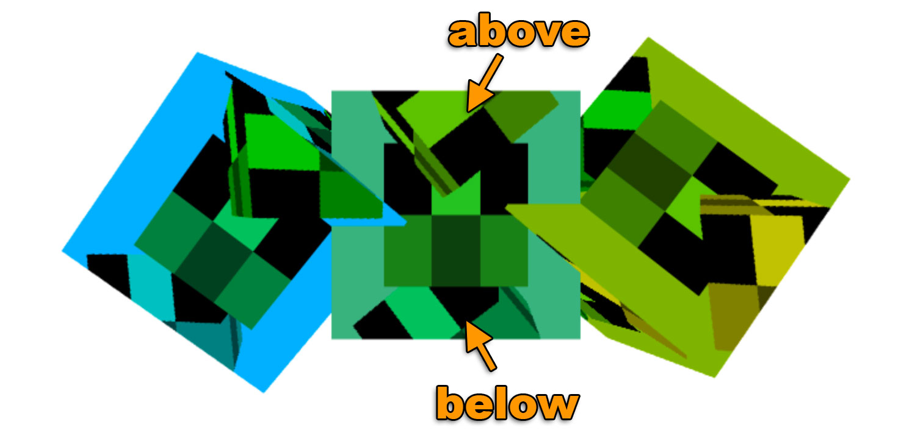

# WebGL 三维纹理

在 WebGL 中如何使用纹理？你可能会从二维图像处理的文章中得到启发，如果我们讲的再深入一点可能更好理解。

首先需要调整着色器以便使用纹理，这里是顶点着色器的修改部分，我们需要传递纹理坐标，在这个例子中直接将它们传到片断着色器中。

```glsl{2,6,12-13}
attribute vec4 a_position;
attribute vec2 a_texcoord;

uniform mat4 u_matrix;

varying vec2 v_texcoord;

void main() {
  // 将位置和矩阵相乘
  gl_Position = u_matrix * a_position;

  // 传递纹理坐标到片断着色器
  v_texcoord = a_texcoord;
}
```

在片断着色器中声明一个 sampler2D 类型的全局变量，可以让我们引用一个纹理，然后使用从顶点着色器传入的纹理坐标调用 texture2D 方法，在纹理上找到对应的颜色。

```glsl{4,6-7,10}
precision mediump float;

// 从顶点着色器中传入的值
varying vec2 v_texcoord;

// 纹理
uniform sampler2D u_texture;

void main() {
   gl_FragColor = texture2D(u_texture, v_texcoord);
}
```

我们需要设置纹理坐标

```js{3,7,10,12-13,15-16}
// 找到顶点坐标中的属性
var positionLocation = gl.getAttribLocation(program, 'a_position');
var texcoordLocation = gl.getAttribLocation(program, 'a_texcoord');

// ...

// 为纹理坐标创建一个缓冲
var buffer = gl.createBuffer();
gl.bindBuffer(gl.ARRAY_BUFFER, buffer);
gl.enableVertexAttribArray(texcoordLocation);

// 以浮点型格式传递纹理坐标
gl.vertexAttribPointer(texcoordLocation, 2, gl.FLOAT, false, 0, 0);

// 设置纹理坐标
setTexcoords(gl);
```

## F

如你所见，我们将图像映射到 F 中的每个矩形面上。

```js
// 为 F 设置纹理坐标缓冲
function setTexcoords(gl) {
  gl.bufferData(
    gl.ARRAY_BUFFER,
    new Float32Array([
      // 正面左竖
      0,
      0,
      0,
      1,
      1,
      0,
      0,
      1,
      1,
      1,
      1,
      0,

      // 正面上横
      0,
      0,
      0,
      1,
      1,
      0,
      0,
      1,
      1,
      1,
      1,
      0

      //  ...
    ]),
    gl.STATIC_DRAW
  );
}
```

事实上使用一个带有 F 的图像能够在结果中清楚的分辨出纹理的方向。

我们还需要一个纹理，我们可以从头做一个但在这个例子中就直接加载一个图像，因为那可能是常用的做法。

这是我们将要使用的图像


加载图像的过程是异步的，我们请求图像资源后浏览器需要一段时间去下载。通常有两种处理方法，一种是等纹理下载完成后再开始绘制，另一种是在图像加载前使用生成的纹理，这种方式可以立即启动渲染，一旦图像下载完成就拷贝到纹理。我们将使用下方的方法。

```js
// 创建一个纹理
var texture = gl.createTexture();
gl.bindTexture(gl.TEXTURE_2D, texture);

// 用 1x1 个蓝色像素填充纹理
gl.texImage2D(gl.TEXTURE_2D, 0, gl.RGBA, 1, 1, 0, gl.RGBA, gl.UNSIGNED_BYTE, new Uint8Array([0, 0, 255, 255]));

// 异步加载图像
var image = new Image();
image.src = 'resources/f-texture.png';
image.addEventListener('load', function () {
  // 现在图像加载完成，拷贝到纹理中
  gl.bindTexture(gl.TEXTURE_2D, texture);
  gl.texImage2D(gl.TEXTURE_2D, 0, gl.RGBA, gl.RGBA, gl.UNSIGNED_BYTE, image);
  gl.generateMipmap(gl.TEXTURE_2D);
});
```

[webgl-3d-textures](embedded-codesandbox://webgl-fundamental-textures/webgl-3d-textures?view=preview)

如果我只想使用一部分图像覆盖 'F' 的正面怎么办，纹理是通过“纹理坐标”来引用的，纹理坐标 0.0 到 1.0 对应纹理从左到右，0.0 到 1.0 对应第一个像素所在行到最后一行。注意我没有使用上或者下，上下在纹理坐标空间中是没有意义的，因为绘制一些东西后再重定向后，是没有上下的概念的，主要是依据传递给 WebGL 的纹理数据，纹理数据的开头对应纹理坐标 0, 0，结尾对应纹理坐标 1, 1


我将纹理载入到 Photoshop 中得到一些点的坐标。


可以像这样将像素坐标转换到纹理坐标

```js
texcoordX = pixelCoordX / (width - 1);
texcoordY = pixelCoordY / (height - 1);
```

这是正面的纹理坐标

```
// 正面左竖
 38 / 255,  44 / 255,
 38 / 255, 223 / 255,
113 / 255,  44 / 255,
 38 / 255, 223 / 255,
113 / 255, 223 / 255,
113 / 255,  44 / 255,

// 正面上横
113 / 255, 44 / 255,
113 / 255, 85 / 255,
218 / 255, 44 / 255,
113 / 255, 85 / 255,
218 / 255, 85 / 255,
218 / 255, 44 / 255,

// 正面中横
113 / 255, 112 / 255,
113 / 255, 151 / 255,
203 / 255, 112 / 255,
113 / 255, 151 / 255,
203 / 255, 151 / 255,
203 / 255, 112 / 255,
```

对背面也使用相同的纹理坐标，得到这样的结果。

[webgl-3d-textures-texture-coords-mapped](embedded-codesandbox://webgl-fundamental-textures/webgl-3d-textures-texture-coords-mapped?view=preview)

并不是非常好看，但是希望这样能展示出纹理坐标的用法。如果你使用代码生成几何体（立方体，球体，等等），通常情况下计算期望的纹理坐标也是比较容易的。另一方面如果通过软件例如 Blender, Maya, 3D Studio Max 制作几何体，那么你的美术（或者你自己）就会用软件调整纹理坐标。

如果纹理坐标再 0.0 到 1.0 之外会怎样？WebGL 默认会重复纹理，0.0 到 1.0 是一份纹理的“拷贝”，1.0 到 2.0 是另外一份拷贝，-4.0 到 -3.0 也是另外一份拷贝。让我们在一个平面上使用这些纹理坐标。

```
-3, -1,
 2, -1,
-3,  4,
-3,  4,
 2, -1,
 2,  4,
```

这是结果

[webgl-3d-textures-repeat-clamp](embedded-codesandbox://webgl-fundamental-textures/webgl-3d-textures-repeat-clamp?view=preview)

你可以使用 `CLAMP_TO_EDGE` 告诉 WebGL 再某个方向不需要重复，例如

```js
gl.texParameteri(gl.TEXTURE_2D, gl.TEXTURE_WRAP_S, gl.CLAMP_TO_EDGE);
gl.texParameteri(gl.TEXTURE_2D, gl.TEXTURE_WRAP_T, gl.CLAMP_TO_EDGE);
```

点击上方示例中的按钮，观察结果。

你可能注意到在加载纹理时调用了 `gl.generateMipmap`，那是干什么的？

假设我们有这样一个 16×16 像素的纹理。


假设我们要将它绘制在屏幕的 2×2 个像素上，那么这 4 个像素应该使用什么颜色？这里有 256 个像素可以选择，如果在 Photoshop 中将 16×16 的图像缩放到 2×2，它会将每个角 8×8 的像素的平均值赋给这四个像素。不幸的是绘制 64 个像素再求平均在 GPU 中是非常慢的。假设你有一个 2048x2048 像素的纹理想要绘制成 2x2 个像素，就需要对 1024x1024 或 100 万个像素求平均 4 次，这需要很多运算同时速度要快。

事实上 GPU 使用的是一个纹理贴图（mipmap），纹理贴图是一个逐渐缩小的图像集合，每一个是前一个的四分之一大小，16×16 纹理的纹理贴图看起来像这样。


通常每个子图都是前一级的双线性插值，这就是 `gl.generateMipmap` 做的事情，它根据原始图像创建所有的缩小级别，你也可以自己提供缩小级别的图像。

现在如果你想将 16x16 像素的纹理绘制到屏幕的 2×2 个像素上，WebGL 会从创建的贴图中找到从之前级别贴图插值出的 2×2 贴图来使用。

你可以为纹理选择不同的贴图筛选条件来控制 WebGL 的插值，一共有这 6 种模式

1. `NEAREST` 从最大的贴图中选择 1 个像素
2. `LINEAR` 从最大的贴图中选择 4 个像素然后混合
3. `NEAREST_MIPMAP_NEAREST` 选择最合适的贴图，然后从上面找到一个像素
4. `LINEAR_MIPMAP_NEAREST` 选择最合适的贴图，然后取出 4 个像素进行混合
5. `NEAREST_MIPMAP_LINEAR` 选择最合适的两个贴图，从每个上面选择 1 个像素然后混合
6. `LINEAR_MIPMAP_LINEAR` 选择最合适的两个贴图，从每个上选择 4 个像素然后混合

你可以通过这两个例子看到贴图的重要性，第一个显示的是使用 NEAREST 或 LINEAR，只从最大的贴图上选择像素，当物体运动时就会出现抖动。由于每个像素都从最大的图上选择，随着位置和大小的改变，可能会在不同的时间选择不同的像素，从而出现抖动。

[webgl-3d-textures-mips](embedded-codesandbox://webgl-fundamental-textures/webgl-3d-textures-mips?view=preview)

观察发现左边和中间的抖动会多于右边。由于右边的使用多级贴图并且混合颜色，绘制的越小 WebGL 挑选的像素离原图关系越远。相反的中间的小图虽然使用了 LINEAR 混合 4 个像素的颜色，但这 4 个像素是从大图中选出来，不同的选择会有较大的差别，所以还是抖动明显。右下角的图保持颜色一致是从右中图中挑选的像素。

第二个例子显示了一些深入屏幕中的多边形。

[webgl-3d-textures-mips-tri-linear](embedded-codesandbox://webgl-fundamental-textures/webgl-3d-textures-mips-tri-linear?view=preview)

6 个深入屏幕的横梁使用的是之前 6 种不同的筛选模式。

1. 左上使用的是 NEAREST，你会感受到明显的块状感；
2. 中上使用的是 LINEAR 也没有好到哪里去；
3. 右上使用的是 `NEAREST_MIPMAP_NEAREST`，点击图像切换纹理，每个贴图都是不同的颜色，就可以清除的看出它使用的是哪个贴图；
4. 左下使用的是 `LINEAR_MIPMAP_NEAREST`，意思是挑选最合适贴图种的 4 个像素进行混合，你会发现贴图切换的部分非常突兀；
5. 中下使用的是 `NEAREST_MIPMAP_LINEAR`，也就是找到最合适的两个贴图各取一点进行混合，如果仔细看会发现仍然有块状感，尤其是水平方向；
6. 右下使用的是 `LINEAR_MIPMAP_LINEAR`，也就是选出最合适的两个贴图各取 4 个点进行混合。


你可能会想既然理论上 `LINEAR_MIPMAP_LINEAR` 是最好的选择为什么还要有其他选择

1. `LINEAR_MIPMAP_LINEAR` 是最慢的，读 8 个像素比读 1 个像素慢一些，在现代的 GPU 上如果一次使用一个贴图可能没什么问题，但是现在的游戏可能一次就需要 2 到 4 个贴图，4 贴图 \* 8 像素每贴图 = 绘制每个像素需要读取 32 个像素，那就会慢很多了。
2. 如果想实现特定的效果，比如做一些复古的东西可能就需要使用 NEAREST。贴图也占用内存，事实上它占用额外 33% 的内存，那是非常多的内存，尤其是使用很大的纹理例如想要在游戏的标题屏幕上绘制的东西。如果你不会绘制比最大的贴图要小的东西，为什么要把内存浪费在贴图上，直接使用 NEAREST 或 LINEAR 就只使用第一个贴图。

设置筛选器可以调用 `gl.texParameter`

```js
gl.texParameteri(gl.TEXTURE_2D, gl.TEXTURE_MIN_FILTER, gl.LINEAR_MIPMAP_LINEAR);
gl.texParameteri(gl.TEXTURE_2D, gl.TEXTURE_MAG_FILTER, gl.LINEAR);
```

- `TEXTURE_MIN_FILTER` 是当绘制的比最大贴图小的时候。
- `TEXTURE_MAG_FILTER` 是绘制的比最大的贴图大的时候。
- 对于 `TEXTURE_MAG_FILTER` 只有 NEAREST 和 LINEAR 两个可选设置。

假设我们想使用这个纹理。


这是结果。

[webgl-3d-textures-bad-npot](embedded-codesandbox://webgl-fundamental-textures/webgl-3d-textures-bad-npot?view=preview)

为什么键盘的纹理没有出现？那是因为 WebGL 限制了纹理的维度必须是 2 的整数次幂，2 的幂有 `1, 2, 4, 8, 16, 32, 64, 128, 256, 512, 1024, 2048` 等等。`F` 纹理是 256 × 256，256 是 2 的幂。键盘纹理是 320x240，都不是 2 的幂，所以显示纹理失败，在着色器中当 texture2D 被调用的时候由于纹理没有正确设置，就会使用颜色 `(0, 0, 0, 1)` 也就是黑色。如果打开 JavaScript 控制台或者浏览器控制台，根据浏览器不同可能会显示不同的错误信息，像这样

```
WebGL: INVALID_OPERATION: generateMipmap: level 0 not power of 2
   or not all the same size
WebGL: drawArrays: texture bound to texture unit 0 is not renderable.
   It maybe non-power-of-2 and have incompatible texture filtering or
   is not 'texture complete'.
```

解决这个问题只需要将包裹模式设置为 `CLAMP_TO_EDGE` 并且通过设置过滤器为 `LINEAR or NEAREST` 来关闭贴图映射。

让我们来更新图像加载的代码解决这个问题，首先需要一个方法判断一个数是不是 2 的幂。

```js
function isPowerOf2(value) {
  return (value & (value - 1)) == 0;
}
```

我不准备深入讲解二进制运算，以及它的的原理。有了它后，就可以这样使用。

[webgl-3d-textures-good-npot](embedded-codesandbox://webgl-fundamental-textures/webgl-3d-textures-good-npot?view=preview)

## 6 个面

一个常见的问题是 `如何为立方体的每个面设置不同的图像？`，假设我们有 6 个这样的图片。


脑中出现了 3 个答案

1. 制作一个复杂的着色器，引用 6 个纹理，传入一些额外的顶点信息表明使用的纹理是什么。不要这样做！稍微一想就知道你要写一大堆不同的着色器应用于不同面数量的图形之类。

2. 绘制 6 个面代替立方体，这是常用的解决办法，不错但是只能用在简单的图形例如立方体。如果有一个包含 1000 个方形的图形就要绘制 1000 个面，会非常慢。

3. 我敢说，最好的方法就是将图像放在一个纹理中，然后利用纹理坐标映射不同的图像到每个面，这是很多高性能应用（读作游戏）使用的技术。例如我们将所有的图像放入这样一个纹理中


然后为立方体的每个面设置不同的纹理坐标。

```
// 选择左下图
0   , 0  ,
0   , 0.5,
0.25, 0  ,
0   , 0.5,
0.25, 0.5,
0.25, 0  ,
// 选择中下图
0.25, 0  ,
0.5 , 0  ,
0.25, 0.5,
0.25, 0.5,
0.5 , 0  ,
0.5 , 0.5,
// 选择中右图
0.5 , 0  ,
0.5 , 0.5,
0.75, 0  ,
0.5 , 0.5,
0.75, 0.5,
0.75, 0  ,
// 选择左上图
0   , 0.5,
0.25, 0.5,
0   , 1  ,
0   , 1  ,
0.25, 0.5,
0.25, 1  ,
// 选择中上图
0.25, 0.5,
0.25, 1  ,
0.5 , 0.5,
0.25, 1  ,
0.5 , 1  ,
0.5 , 0.5,
// 选择右上图
0.5 , 0.5,
0.75, 0.5,
0.5 , 1  ,
0.5 , 1  ,
0.75, 0.5,
0.75, 1  ,
```

[webgl-3d-textures-texture-atlas](embedded-codesandbox://webgl-fundamental-textures/webgl-3d-textures-texture-atlas?view=preview)

这种将多个图像通过一个纹理提供的方法通常被叫做纹理图集，它是最好的方式，因为只需要加载一个贴图，着色器也会因为只用一个贴图而保持简单，不同于多个平面需要多次调用绘制，这样只需要调用一次绘制。

## UVs vs. 纹理坐标

纹理坐标经常被简写为 `texture coords`，`texcoords` 或 UVs(发音为 Ew-Vees)，我不知道术语 UVs 是从哪来的，除了一点那就是顶点位置使用 `x, y, z, w`，所以对于纹理坐标他们决定使用 `s, t, u, v`，好让你清楚使用的两个类型的区别。有了这些你可能会想它应该读作 Es-Tees，因为纹理包裹的设置被叫做 `TEXTURE_WRAP_S` 和 `TEXTURE_WRAP_T`，但是出于某些原因我的图形相关的同事都叫它 Ew-Vees。

所以现在你就知道了如果有人说 UVs 其实就是再说纹理坐标。

# WebGL 数据纹理

上节中讲到了纹理的工作原理以及如何使用，我们用下载的图像创建纹理，在这篇文章中我们将直接用 JavaScript 创建数据。

用 JavaScript 为纹理创建数据是比较直接的，默认情况下 WebGL1 只支持少量数据类型的纹理

| 格式            | 数据类型                 | 通道数 | 单像素字节数 |
| :-------------- | :----------------------- | :----- | :----------- |
| RGBA            | UNSIGNED_BYTE            | 4      | 4            |
| RGB             | UNSIGNED_BYTE            | 3      | 3            |
| RGBA            | `UNSIGNED_SHORT_4_4_4_4` | 4      | 2            |
| RGBA            | `UNSIGNED_SHORT_5_5_5_1` | 4      | 2            |
| RGB             | `UNSIGNED_SHORT_5_6_5`   | 3      | 2            |
| LUMINANCE_ALPHA | UNSIGNED_BYTE            | 2      | 2            |
| LUMINANCE       | UNSIGNED_BYTE            | 1      | 1            |
| ALPHA           | UNSIGNED_BYTE            | 1      | 1            |

让我们创建一个 3×2 像素的 LUMINANCE（亮度/黑白）纹理，由于它是 LUMINANCE 纹理，所以每个像素只有一个值，在 R，G，B 通道是相同的。

我们继续使用上篇文章中的例子，首先修改纹理坐标，每个面使用整个纹理

```js
// 填充立方体纹理坐标的缓冲
function setTexcoords(gl) {
  gl.bufferData(
    gl.ARRAY_BUFFER,
    new Float32Array([
      // 正面
      0,
      0,
      0,
      1,
      1,
      0,
      1,
      0,
      0,
      1,
      1,
      1
      // ...
    ])
  );
}
```

然后修改代码创建一个纹理

```js
// 创建一个纹理
var texture = gl.createTexture();
gl.bindTexture(gl.TEXTURE_2D, texture);

// // 用 1x1 的蓝色像素填充纹理
// gl.texImage2D(gl.TEXTURE_2D, 0, gl.RGBA, 1, 1, 0, gl.RGBA, gl.UNSIGNED_BYTE,
//               new Uint8Array([0, 0, 255, 255]));

// 用 3x2 的像素填充纹理
const level = 0;
const internalFormat = gl.LUMINANCE;
const width = 3;
const height = 2;
const border = 0;
const format = gl.LUMINANCE;
const type = gl.UNSIGNED_BYTE;
const data = new Uint8Array([128, 64, 128, 0, 192, 0]);
gl.texImage2D(gl.TEXTURE_2D, level, internalFormat, width, height, border, format, type, data);

// 设置筛选器，我们不需要使用贴图所以就不用筛选器了
gl.texParameteri(gl.TEXTURE_2D, gl.TEXTURE_MIN_FILTER, gl.NEAREST);
gl.texParameteri(gl.TEXTURE_2D, gl.TEXTURE_MAG_FILTER, gl.NEAREST);
gl.texParameteri(gl.TEXTURE_2D, gl.TEXTURE_WRAP_S, gl.CLAMP_TO_EDGE);
gl.texParameteri(gl.TEXTURE_2D, gl.TEXTURE_WRAP_T, gl.CLAMP_TO_EDGE);

// // 异步加载图像
// ...
```

[webgl-data-texture-3x2-bad](embedded-codesandbox://webgl-fundamental-textures/webgl-data-texture-3x2-bad?view=preview)

发现不生效，查看 JavaScript 控制台看到这样的错误信息

```
WebGL: INVALID_OPERATION: texImage2D: ArrayBufferView not big enough for request
```

结果是 WebGL 中有一种首次创建 OpenGL 后的模糊设定，计算机有时在数据为某些特定大小时速度会快一些，例如一次拷贝 2，4 或 8 个字节比一次拷贝 1 个字节要快，WebGL 默认使用 4 字节长度，所以它期望每一行数据是多个 4 字节数据（最后一行除外）。

我们之前的数据每行只有 3 个字节，总共为 6 字节，但是 WebGL 试图在第一行获取 4 个字节，第二行获取 3 个字节，总共 7 个字节，所以会出现这样的报错。

我们可以告诉 WebGL 一次处理 1 个字节

```js
const alignment = 1;
gl.pixelStorei(gl.UNPACK_ALIGNMENT, alignment);
```

有效参数为 1，2，4 和 8

我觉得你可能无法计算出对齐数据和非对齐数据的速度区别，所以希望默认值是 1 而不是 4，这样这个问题就不会困扰新手，但是为了适配 OpenGL，所以要保留相同的默认设置，这样移植应用就不用改变行数，然后可以为新的应用在需要的地方设置属性为 1。

有了这个设置后就能正常运行了

[webgl-data-texture-3x2](embedded-codesandbox://webgl-fundamental-textures/webgl-data-texture-3x2?view=preview)

# WebGL 渲染到纹理

上篇讲到如何利用 JavaScript 向纹理提供数据，这篇文章我们会使用 WebGL 渲染内容到纹理上，这个话题在图像处理中简单讲到过，但这里将详细介绍。

渲染到纹理非常简单，创建一个确定大小的纹理

```js
// 创建渲染对象
const targetTextureWidth = 256;
const targetTextureHeight = 256;
const targetTexture = gl.createTexture();
gl.bindTexture(gl.TEXTURE_2D, targetTexture);

{
  // 定义 0 级的大小和格式
  const level = 0;
  const internalFormat = gl.RGBA;
  const border = 0;
  const format = gl.RGBA;
  const type = gl.UNSIGNED_BYTE;
  const data = null;
  gl.texImage2D(
    gl.TEXTURE_2D,
    level,
    internalFormat,
    targetTextureWidth,
    targetTextureHeight,
    border,
    format,
    type,
    data
  );

  // 设置筛选器，不需要使用贴图
  gl.texParameteri(gl.TEXTURE_2D, gl.TEXTURE_MIN_FILTER, gl.LINEAR);
  gl.texParameteri(gl.TEXTURE_2D, gl.TEXTURE_WRAP_S, gl.CLAMP_TO_EDGE);
  gl.texParameteri(gl.TEXTURE_2D, gl.TEXTURE_WRAP_T, gl.CLAMP_TO_EDGE);
}
```

注意 data 是 null，我们不需要提供数据，只需要让 WebGL 分配一个纹理。

接下来创建一个帧缓冲（framebuffer），帧缓冲只是一个附件集，附件是纹理或者 renderbuffers，我们之前讲过纹理，Renderbuffers 和纹理很像但是支持纹理不支持的格式和可选项，同时不能像纹理那样直接将 renderbuffer 提供给着色器。

让我们来创建一个帧缓冲并和纹理绑定

```js
// 创建并绑定帧缓冲
const fb = gl.createFramebuffer();
gl.bindFramebuffer(gl.FRAMEBUFFER, fb);

// 附加纹理为第一个颜色附件
const attachmentPoint = gl.COLOR_ATTACHMENT0;
gl.framebufferTexture2D(gl.FRAMEBUFFER, attachmentPoint, gl.TEXTURE_2D, targetTexture, level);
```

与纹理和缓冲相似，在创建完帧缓冲后我们需要将它绑定到 FRAMEBUFFER 绑定点，那样所有的方法都会作用到绑定的帧缓冲，无论是哪个帧缓冲。

绑定帧缓冲后，每次调用 `gl.clear`, `gl.drawArrays` 或 `gl.drawElements` WebGL 都会渲染到纹理上而不是画布上。

将原来的渲染代码构造成一个方法，就可以调用两次，一次渲染到纹理，一次渲染到画布。

```js
function drawCube(aspect) {
  // 告诉它使用的程序（着色器对）
  gl.useProgram(program);

  // 启用位置属性
  gl.enableVertexAttribArray(positionLocation);

  // 绑定到位置缓冲
  gl.bindBuffer(gl.ARRAY_BUFFER, positionBuffer);

  // 告诉位置属性如何从 positionBuffer (ARRAY_BUFFER) 中读取数据
  var size = 3; // 每次迭代需要三个单位数据
  var type = gl.FLOAT; // 单位数据类型为 32 位浮点型
  var normalize = false; // 不需要单位化
  var stride = 0; // 每次迭代移动的距离
  var offset = 0; // 从缓冲起始处开始
  gl.vertexAttribPointer(positionLocation, size, type, normalize, stride, offset);

  // 启用纹理坐标属性
  gl.enableVertexAttribArray(texcoordLocation);

  // 绑定纹理坐标缓冲
  gl.bindBuffer(gl.ARRAY_BUFFER, texcoordBuffer);

  // 告诉纹理坐标属性如何从 texcoordBuffer 读取数据
  var size = 2; // 每次迭代两个单位数据
  var type = gl.FLOAT; // 单位数据类型是 32 位浮点型
  var normalize = false; // 不需要单位化数据
  var stride = 0; // 每次迭代移动的数据
  var offset = 0; // 从缓冲起始处开始
  gl.vertexAttribPointer(texcoordLocation, size, type, normalize, stride, offset);

  // 计算投影矩阵

  // var aspect = gl.canvas.clientWidth / gl.canvas.clientHeight;
  var projectionMatrix = m4.perspective(fieldOfViewRadians, aspect, 1, 2000);

  var cameraPosition = [0, 0, 2];
  var up = [0, 1, 0];
  var target = [0, 0, 0];

  // 计算相机矩阵
  var cameraMatrix = m4.lookAt(cameraPosition, target, up);

  // 根据相机矩阵计算视图矩阵
  var viewMatrix = m4.inverse(cameraMatrix);

  var viewProjectionMatrix = m4.multiply(projectionMatrix, viewMatrix);

  var matrix = m4.xRotate(viewProjectionMatrix, modelXRotationRadians);
  matrix = m4.yRotate(matrix, modelYRotationRadians);

  // 设置矩阵
  gl.uniformMatrix4fv(matrixLocation, false, matrix);

  // 使用纹理单元 0
  gl.uniform1i(textureLocation, 0);

  // 绘制几何体
  gl.drawArrays(gl.TRIANGLES, 0, 6 * 6);
}
```

注意到我们需要传入 aspect 计算投影矩阵，因为目标纹理的比例和画布不同。

然后这样调用

```js
// 绘制场景
function drawScene(time) {
  // ...

  {
    // 通过绑定帧缓冲绘制到纹理
    gl.bindFramebuffer(gl.FRAMEBUFFER, fb);

    // 使用 3×2 的纹理渲染立方体
    gl.bindTexture(gl.TEXTURE_2D, texture);

    // 告诉 WebGL 如何从裁剪空间映射到像素空间
    gl.viewport(0, 0, targetTextureWidth, targetTextureHeight);

    // 清空画布和深度缓冲
    gl.clearColor(0, 0, 1, 1); // clear to blue
    gl.clear(gl.COLOR_BUFFER_BIT | gl.DEPTH_BUFFER_BIT);

    const aspect = targetTextureWidth / targetTextureHeight;
    drawCube(aspect);
  }

  {
    // 渲染到画布
    gl.bindFramebuffer(gl.FRAMEBUFFER, null);

    // 立方体使用刚才渲染的纹理
    gl.bindTexture(gl.TEXTURE_2D, targetTexture);

    // 告诉 WebGL 如何从裁剪空间映射到像素空间
    gl.viewport(0, 0, gl.canvas.width, gl.canvas.height);

    // 清空画布和深度缓冲
    gl.clearColor(1, 1, 1, 1); // clear to white
    gl.clear(gl.COLOR_BUFFER_BIT | gl.DEPTH_BUFFER_BIT);

    const aspect = gl.canvas.clientWidth / gl.canvas.clientHeight;
    drawCube(aspect);
  }

  requestAnimationFrame(drawScene);
}
```

[webgl-render-to-texture](embedded-codesandbox://webgl-fundamental-textures/webgl-render-to-texture?view=preview)

十分重要的是要记得调用 gl.viewport 设置要绘制的对象的大小，在这个例子中第一次渲染到纹理，所以设置视图大小覆盖纹理，第二次渲染到画布所以设置视图大小覆盖画布。

同样的当我们计算投影矩阵的时候需要使用正确的比例，我花了无数个小时调试，寻找出现搞笑的渲染结果的原因，最后发现是少调用了一个 gl.viewport 或者都忘了，并使用正确的比例，由于在代码中很少直接调用 gl.bindFramebuffer 所以就容易忘掉这些。所以我把这个方法调用放在一个方法里，像这样

```js
function bindFrambufferAndSetViewport(fb, width, height) {
  gl.bindFramebuffer(gl.FRAMEBUFFER, fb);
  gl.viewport(0, 0, width, height);
}
```

然后使用这个方法改变渲染对象，就不容易忘记了。

还有一个需要注意的事情是我们的帧缓冲没有深度缓冲，只有纹理。这意味着没有深度检测，所以三维就不能正常体现，如果我们绘制三个立方体就会看到这样。

[webgl-render-to-texture-3-cubes-no-depth-buffer](embedded-codesandbox://webgl-fundamental-textures/webgl-render-to-texture-3-cubes-no-depth-buffer?view=preview)

如果仔细看中间的立方体，会看到 3 个垂直绘制的立方体，一个在后面，一个在中间另一个在前面，但是我们绘制的三个立方体是相同深度的，观察画布上水平方向的 3 个立方体就会发现他们是正确相交的。那是因为在帧缓冲中没有深度缓冲，但是画布有。



想要加深度缓冲就需要创建一个，然后附加到帧缓冲中

```js
// 创建一个深度缓冲
const depthBuffer = gl.createRenderbuffer();
gl.bindRenderbuffer(gl.RENDERBUFFER, depthBuffer);

// 设置深度缓冲的大小和 targetTexture 相同
gl.renderbufferStorage(gl.RENDERBUFFER, gl.DEPTH_COMPONENT16, targetTextureWidth, targetTextureHeight);
gl.framebufferRenderbuffer(gl.FRAMEBUFFER, gl.DEPTH_ATTACHMENT, gl.RENDERBUFFER, depthBuffer);
```

有了这个以后的结果。

[webgl-render-to-texture-3-cubes-with-depth-buffer](embedded-codesandbox://webgl-fundamental-textures/webgl-render-to-texture-3-cubes-with-depth-buffer?view=preview)

现在帧缓冲附加了深度缓冲以后内部的立方体也能正确相交了。


需要特别注意的是 WebGL 只允许三种附件组合形式。根据 [规范](https://registry.khronos.org/webgl/specs/latest/1.0/#FBO_ATTACHMENTS) 一定能正确运行的附件组合是：

- `COLOR_ATTACHMENT0` = `RGBA/UNSIGNED_BYTE` texture
- `COLOR_ATTACHMENT0` = `RGBA/UNSIGNED_BYTE` texture + `DEPTH_ATTACHMENT` = `DEPTH_COMPONENT16` renderbuffer
- `COLOR_ATTACHMENT0` = `RGBA/UNSIGNED_BYTE` texture + `DEPTH_STENCIL_ATTACHMENT` = `DEPTH_STENCIL` renderbuffer

对于其他的组合就需要检查用户系统/gpu/驱动/浏览器的支持情况。要检查的话需要创建帧缓冲，附加附件，然后调用

```js
var status = gl.checkFramebufferStatus(gl.FRAMEBUFFER);
```

如果状态是 `FRAMEBUFFER_COMPLETE` 那这种组合就能使用，反之不能使用。你就需要告诉用户他们不走运或者撤销一些方法。

> **其实 Canvas 本身就是一个纹理**
>
> 只是一点小事，浏览器使用上方的技术实现的画布，在背后它们创建了一个颜色纹理，一个深度缓冲，一个帧缓冲，然后绑定到当前的帧缓冲，当你调用你的渲染方法时就会绘制到那个纹理上，然后再用那个纹理将画布渲染到网页中。

# WebGL 使用多个纹理

现在可能是一个合适的时机去回答“如何使用 2 个或多个纹理？”。

非常简单，回到几节之前绘制一个图像的着色器，将它升级到使用两个纹理。

首先改变代码加载两个图像，这其实不是 WebGL 的事情，是 HTML5 和 JavaScript 的事情，但是我也会涉及到。图像加载是异步的，可能需要适应一下。

基本上有两种方式来处理图像的加载，一种是重构代码，让它在没有纹理的时候运行，当图像加载后，再更新程序。我们会在以后的文章中用到这个方法。

这个例子中就等两个图像都加载完成后再开始绘制。

首先修改加载单个图像的方法，非常简单，先创建一个新的 Image 对象，设置加载的 url，然后设置回调函数在图像加载完成后调用。

```js
function loadImage(url, callback) {
  var image = new Image();
  image.src = url;
  image.onload = callback;
  return image;
}
```

现在来创建一个方法加载一个 URL 序列，并且创建一个图像序列。首先设置 imagesToLoad 为加载图像的个数，然后为每个图像调用 loadImage，当 imagesToLoad 递减到 0 的时候说明所有图像加载完成，调用回调函数。

```js
function loadImages(urls, callback) {
  var images = [];
  var imagesToLoad = urls.length;

  // 每个图像加载完成后调用一次
  var onImageLoad = function () {
    --imagesToLoad;
    // 如果所有图像都加载完成就调用回调函数
    if (imagesToLoad == 0) {
      callback(images);
    }
  };

  for (var ii = 0; ii < imagesToLoad; ++ii) {
    var image = loadImage(urls[ii], onImageLoad);
    images.push(image);
  }
}
```

然后就可以像这样调用 loadImages

```js
function main() {
  loadImages(['resources/leaves.jpg', 'resources/star.jpg'], render);
}
```

接下来修改着色器使用两个纹理，在这个例子中我们将两个纹理相乘。

```html
<script id="fragment-shader-2d" type="x-shader/x-fragment">
  precision mediump float;

  // 纹理
  uniform sampler2D u_image0;
  uniform sampler2D u_image1;

  // 从顶点着色器传入的 texCoords
  varying vec2 v_texCoord;

  void main() {
     vec4 color0 = texture2D(u_image0, v_texCoord);
     vec4 color1 = texture2D(u_image1, v_texCoord);
     gl_FragColor = color0 * color1;
  }
</script>
```

需要创建两个 WebGL 纹理对象。

```js
// 创建两个纹理
var textures = [];
for (var ii = 0; ii < 2; ++ii) {
  var texture = gl.createTexture();
  gl.bindTexture(gl.TEXTURE_2D, texture);

  // 设置参数以便使用任意尺的影像
  gl.texParameteri(gl.TEXTURE_2D, gl.TEXTURE_WRAP_S, gl.CLAMP_TO_EDGE);
  gl.texParameteri(gl.TEXTURE_2D, gl.TEXTURE_WRAP_T, gl.CLAMP_TO_EDGE);
  gl.texParameteri(gl.TEXTURE_2D, gl.TEXTURE_MIN_FILTER, gl.NEAREST);
  gl.texParameteri(gl.TEXTURE_2D, gl.TEXTURE_MAG_FILTER, gl.NEAREST);

  // 上传图像到纹理
  gl.texImage2D(gl.TEXTURE_2D, 0, gl.RGBA, gl.RGBA, gl.UNSIGNED_BYTE, images[ii]);

  // 将纹理添加到纹理序列
  textures.push(texture);
}
```

WebGL 有一个叫做 `texture units` 的对象，你可以把它看成是一个纹理引用的序列，你需要告诉着色器每个 sampler（取样器）使用哪一个 `texture unit`（纹理单元）。

```js
// 寻找取样器的位置
var u_image0Location = gl.getUniformLocation(program, 'u_image0');
var u_image1Location = gl.getUniformLocation(program, 'u_image1');

// ...

// 设置使用的纹理单元
gl.uniform1i(u_image0Location, 0); // 纹理单元 0
gl.uniform1i(u_image1Location, 1); // 纹理单元 1
```

然后将每个纹理单元绑定纹理。

```js
// 设置每个纹理单元对应一个纹理
gl.activeTexture(gl.TEXTURE0);
gl.bindTexture(gl.TEXTURE_2D, textures[0]);

gl.activeTexture(gl.TEXTURE1);
gl.bindTexture(gl.TEXTURE_2D, textures[1]);
```

使用的两个图像像这样


这就是使用 WebGL 将它们相乘的结果。

// TODO ex

[webgl-2-textures](embedded-codesandbox://webgl-fundamental-textures/webgl-2-textures?view=preview)

有些需要回顾的部分。

理解纹理单元的简单方式是：所有的纹理方法可以在 `激活的纹理单元` 上使用，`激活的纹理单元` 就是一个全局变量指向你想使用的所有纹理单元，每个纹理单元有两个目标对象，`TEXTURE_2D` 目标和 `TEXTURE_CUBE_MAP` 目标。每个纹理方法针对激活纹理单元上的一个目标，如果用 JavaScript 表示 WebGL 方法可能像这样

```js
var getContext = function() {
  var textureUnits = [
    { TEXTURE_2D: ??, TEXTURE_CUBE_MAP: ?? },
    { TEXTURE_2D: ??, TEXTURE_CUBE_MAP: ?? },
    { TEXTURE_2D: ??, TEXTURE_CUBE_MAP: ?? },
    { TEXTURE_2D: ??, TEXTURE_CUBE_MAP: ?? },
    { TEXTURE_2D: ??, TEXTURE_CUBE_MAP: ?? },
    // ...
   ];
  var activeTextureUnit = 0;

  var activeTexture = function(unit) {
    // 将纹理单元枚举转换成索引
    var index = unit - gl.TEXTURE0;
    // 设置激活纹理单元
    activeTextureUnit = index;
  };

  var bindTexture = function(target, texture) {
    // 设置激活纹理单元的目标对象纹理
    textureUnits[activeTextureUnit][target] = texture;
  };

  var texImage2D = function(target, ... args ...) {
    // 绑定对应纹理单元调用相应的方法
    var texture = textureUnits[activeTextureUnit][target];
    texture.image2D(...args...);
  };

  // 返回 WebGL API
  return {
    activeTexture: activeTexture,
    bindTexture: bindTexture,
    texImage2D: texImage2D,
  }
};
```

着色器获得纹理单元

```js
gl.uniform1i(u_image0Location, 0); // 纹理单元 0
gl.uniform1i(u_image1Location, 1); // 纹理单元 1
```

需要注意的是，设置全局变量的时候使用索引代替纹理单元，但是调用 `gl.activeTexture` 的时候你需要传递特殊的常量 `gl.TEXTURE0`, `gl.TEXTURE1` 之类。幸运的是这些常量是连续的，所以这些代码

```js
gl.activeTexture(gl.TEXTURE0);
gl.bindTexture(gl.TEXTURE_2D, textures[0]);

gl.activeTexture(gl.TEXTURE1);
gl.bindTexture(gl.TEXTURE_2D, textures[1]);
```

可以写成这样

```js
gl.activeTexture(gl.TEXTURE0 + 0);
gl.bindTexture(gl.TEXTURE_2D, textures[0]);

gl.activeTexture(gl.TEXTURE0 + 1);
gl.bindTexture(gl.TEXTURE_2D, textures[1]);
```

或这样

```js
for (var ii = 0; ii < 2; ++ii) {
  gl.activeTexture(gl.TEXTURE0 + ii);
  gl.bindTexture(gl.TEXTURE_2D, textures[ii]);
}
```

希望这样能够帮助你理解 WebGL 单次绘制中如何使用多个纹理。

// TODO https://webglfundamentals.org/webgl/lessons/zh_cn/webgl-2-textures.html
