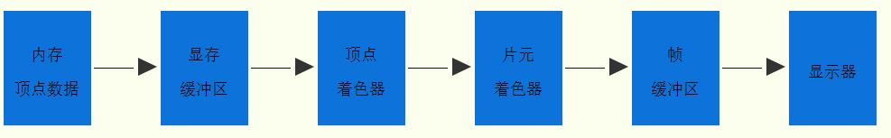
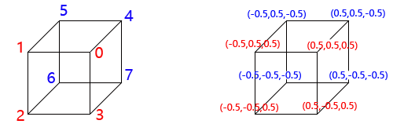
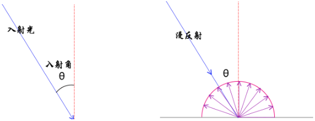
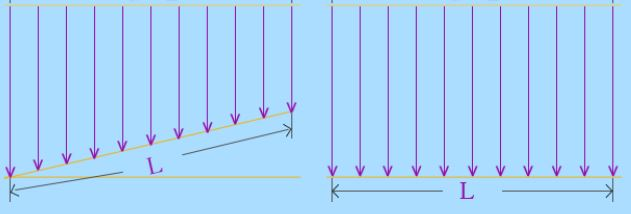
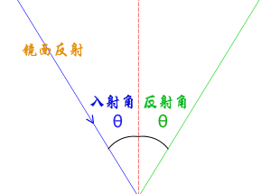
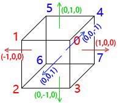

# 快速入门


## 绘制一个点

[draw-point](embedded-codesandbox://webgl-zero-based-practice-learn/draw-point)

### 着色器代码放在 script 标签中

```html
<!-- 顶点着色器源码 -->
<script id="vertexShader" type="x-shader/x-vertex">
   void main() {
     // 给内置变量 gl_PointSize 赋值像素大小
     gl_PointSize = 20.0;
     // 顶点位置，位于坐标原点
     gl_Position = vec4(0.0, 0.0, 0.0, 1.0);
   }
</script>
<!-- 片元着色器源码 -->
<script id="fragmentShader" type="x-shader/x-fragment">
   void main() {
     gl_FragColor = vec4(1.0, 0.0, 0.0, 1.0);
   }
</script>
```

```js
// 顶点着色器源码
var vertexShaderSource = document.getElementById('vertexShader').innerText;
// 片元着色器源码
var fragShaderSource = document.getElementById('fragmentShader').innerText;
// 初始化着色器
var program = initShader(gl, vertexShaderSource, fragShaderSource);
```

## 绘制一个矩形

[draw-rect](embedded-codesandbox://webgl-zero-based-practice-learn/draw-rect)

### attribute 关键字

声明顶点相关数据的时候需要用到 attribute 关键字，目的是为了 js 可以调用相关的 WebGL API 把顶点相关数据从 js 传递给顶点着色器 attribute 声明的变量。

### drawArrays 整体执行顺序



### 硬件相关

- 着色器语言编写的程序称为着色器程序(shader program)，在 GPU 顶点着色器单元上执行的是顶点着色器程序，在 GPU 片元着色器单元上执行的是片元着色器程序。

   顶点着色器

   ```glsl
   // attribute 声明 vec4 类型变量 apos
   attribute vec4 apos;
   void main() {
       // 顶点坐标 apos 赋值给内置变量 gl_Position
       // 逐顶点处理数据
       gl_Position = apos;
   }
   ```

   片元着色器

   ```glsl
   void main() {
       // 逐片元处理数据，所有片元(像素)设置为红色
       gl_FragColor = vec4(1.0,0.0,0.0,1.0);
   }
   ```

- 可编程顶点处理器(Programmable Vertex Processor)又称为顶点着色器，用来执行顶点着色器程序
- 可编程片元处理器(Programmable Fragment Processor)又称为片元着色器，用来执行片元着色器程序
- GPU 中有各种专门的寄存器，比如用来接收顶点坐标数据的寄存器是输入寄存器，从数据类型的角度看属于浮点寄存器，用来临时存储浮点数；存储输出到显示器像素的帧缓存是输出寄存器，从处理速度的角度看是数据缓冲寄存器，GPU 处理数据的速度要比显示器扫描帧缓存中像素数据的速度要快得多
- 显示器像素是显示器可以通过 RGB 值控制的最小单位，一幅图像是由大量像素点累积显示。着色器中的颜色定义会反映在显示器中
- 显示器的分辨率就是显示器长度方向像素点的个数 X 显示器宽度方向像素点的个数
- 屏幕相邻的两个像素单元的距离就是点距，点距越小显示效果越好，一般现在显示器 0.2mm~0.4mm 之间

## WebGL 坐标系—投影

[coordinate-system-projection](embedded-codesandbox://webgl-zero-based-practice-learn/coordinate-system-projection)

1. canvas 画布宽高采用的是像素值定义，以显示器为准，WebGL 中顶点坐标的表示方法采用的是相对坐标，相对于 canvas 而言 WebGL 坐标系统，X 轴水平向右，也就是 canvas 画布的 width 表示的宽度方向，x 等于 -1 表示 canvas 画布的左边界，x 等于 1 表示 canvas 画布的右边界，x 等于 0 对应的是画布宽度方向的中间。
2. WebGL 坐标系统，Y 轴竖直向上，也就是 canvas 画布的 height 表示的高度方向，y 等于 -1 表示 canvas 画布的下边界，y 等于 1 表示 canvas 画布的上边界，y 等于 0 对应的是画布高度方向的中间。
3. WebGL 坐标系统，Z 轴垂直 canvas 画布朝外，Z 值 -1 和 1 是 Z 方向的极限值，GPU 成像默认的沿着 Z 轴投影，你也可以抽象出一个概念，人眼睛位于 z 轴上，沿着 z 轴方向去观察物体，如果你在其他的书上看到视图坐标系等其它各类坐标系都是抽象出的概念都是建立在本节课所说的 WebGL 坐标系统之上，例如无人机导航中的所说的机体坐标系、地球坐标系都是直接对现实中事物的描述，三维场景中的各类坐标系与无人机中坐标系没什么区别，但是要显示在屏幕上，就要经过一些处理，这里不再详述，后面的教程后为大家引入各类坐标系概念，正射投影和透射投影概念。

## WebGL 平移变换

有以下几种方式可以做到沿 X 轴平移 -0.4

### 方法一

提前在顶点中计算

```js
var data = new Float32Array([
   // 三角形顶点 1 坐标
   0.0,
   0.0,
   1.0,

   // 三角形顶点 2 坐标
   0.0,
   1.0,
   0.0,

   // 三角形顶点 3 坐标
   1.0,
   0.0,
   0.0
]);

// x 坐标分别减少 0.4

var data = new Float32Array([
   // 三角形顶点 1 坐标
   -0.4,
   0.0,
   1.0,

   // 三角形顶点 2 坐标
   -0.4,
   1.0,
   0.0,

   // 三角形顶点 3 坐标
   0.6,
   0.0,
   0.0
]);
```

### 方法二

循环修改数组 `data=new Float32Array([..` 的顶点数据，把顶点坐标平移的数学计算任务交给 CPU

```js
for (var i = 0; i < 9; i += 3) {
   data[i] += -0.4;
}
```

### 方法三

替换掉原来的代码 `gl_Position = vec4(apos.x, apos.y, apos.z, 1)`，把顶点平移的数学运算任务交给了 GPU

```glsl
// 在顶点着色器中逐顶点沿着 x 轴平移 -0.4
gl_Position = vec4(apos.x - 0.4, apos.y, apos.z, 1);
```

### 方法四

在原来的顶点着色器代码中，声明一个 4 x 4 矩阵 m4，然后通过矩阵和表示顶点坐标的列向量相乘 `m4 * apos`，实现对顶点 apos 的平移变换，和方法三一样把数学计算任务交给 GPU 处理器，具体说是顶点着色器单元（Vertex Processor），顶点着色器单元能够完成矩阵的乘法运算。

```glsl
// attribute 声明 vec4 类型变量 apos
attribute vec4 apos;
void main() {
  // 创建平移矩阵（沿 x 轴平移 -0.4）
  // 1   0   0  -0.4
  // 0   1   0    0
  // 0   0   1    0
  // 0   0   0    1
  mat4 m4 = mat4(1, 0, 0, 0, 0, 1, 0, 0, 0, 0, 1, 0, -0.4, 0, 0, 1);
  // 平移矩阵 m4 左乘顶点坐标（vec4 类型数据可以理解为线性代数中的 nx1 矩阵，即列向量）
  // 逐顶点进行矩阵变换
  gl_Position = m4 * apos;
}
```

mat4 关键字和 vec4 关键字一样用来声明 WebGL 着色器变量的数据类型，和 vec4 一样也具有构造数据的功能。

vec4 是 4 x 1 矩阵，就是列向量，有四个元素，mat4 表示 4 x 4 矩阵，mat4() 函数括号中的 16 个数据，每四个为一组，以列为准，前四个数就是 mat4 矩阵的第一列，后面的按顺序依次排列。

#### 平移矩阵解析

一个点的坐标是 (x, y, z)，假设沿着 X、Y、Z 轴分别平移 Tx、Ty、Tz，平移后的坐标是 `(x + Tx, y + Ty, z + Tz)`。

$$
   \begin{bmatrix}
   1 & 0 & 0 & Tx \\
   0 & 1 & 0 & Ty \\
   0 & 0 & 1 & Tz \\
   0 & 0 & 0 & 1 \\
   \end{bmatrix}

   \begin{bmatrix}
   x \\
   y \\
   z \\
   1 \\
   \end{bmatrix}

   =

   \begin{bmatrix}
   x + Tx \\
   y + Ty \\
   z + Tz \\
   1 \\
   \end{bmatrix}
$$

### 总结

1. 上面计算式的巧妙之处就是把三维坐标，增加一个元素 1.0，用 4 x 1 矩阵表示，n x 1 矩阵也称为列向量，对应的数据类型就是 vec4
2. n 维向量增加一个维度用 n + 1 维向量表示就是齐次坐标。
3. 上面的 4 x 4 矩阵，就是平移矩阵，平移矩阵左乘顶点的齐次坐标，结果仍然是一个齐次坐标，也就是平移后的坐标。
4. 矩阵的乘法满足结合律，如果多次平移，可以把所有的平移矩阵先进行乘法运算，然后左乘要平移顶点的齐次坐标。

## WebGL 旋转变换

[draw-cube-rotate](embedded-codesandbox://webgl-zero-based-practice-learn/draw-cube-rotate)

### 着色器内置函数

WebGL 着色器提供了一系列可以内置函数，也就是说不用声明可以直接调用的函数。

radians() 函数：角度值转化为弧度制，参数是浮点数 float，比如 30 度时，要写成 30.0

```glsl
// 旋转角度 30 度转化为弧度值
float radian = radians(30.0);
```

cos() 是余弦函数，参数要求是弧度值且是浮点数

sin() 是正弦函数，参数要求是弧度值且是浮点数

```glsl
// 求解旋转角度余弦值
float cos = cos(radian);
// 求解旋转角度正弦值
float sin = sin(radian);
```

### 流程简述

多次调用了绘制命令 `gl.drawArrays`，data 变量定义的顶点数据初始化时，会存入内存中，执行代码 `gl.bindBuffer(gl.ARRAY_BUFFER, buffer);` 内存中的数据一次性传入显存缓冲区中，传入缓冲区中的顶点数据可以通过 drawArrays 方法多次调用，每次 drawArrays 方法调用，顶点经过渲染管线得到的像素相关数据都会存入帧缓存中，后一次调用，前一次调用生成的像素数据不会清空，最终形成一幅完整的立方体线框图。

### 旋转矩阵解析

假设一个点的坐标是 (x, y, z)，经过旋转变换后的坐标为 (X, Y, Z)

#### 绕 Z 轴旋转 γ 角度

z 的坐标不变，x、y 的坐标发生变化，在笛卡尔坐标系下通过简单的数学计算就可以知道结果 `X = xcosγ - ysinγ, Y = xsinγ + ycosγ`

$$
   \begin{bmatrix}
   cosγ & -sinγ & 0 & 0 \\
   sinγ & cosγ & 0 & 0 \\
   0 & 0 & 1 & 0 \\
   0 & 0 & 0 & 1 \\
   \end{bmatrix}

   \begin{bmatrix}
   x \\
   y \\
   z \\
   1 \\
   \end{bmatrix}

   =

   \begin{bmatrix}
   xcosγ - ysinγ \\
   xsinγ + ycosγ \\
   z \\
   1 \\
   \end{bmatrix}
$$

#### 绕 X 轴旋转 α 角度

x 的坐标不变，y、z 的坐标发生变化 `Y = ycosα - zsinα, Z = ysinα + zcosα`

$$
   \begin{bmatrix}
   1 & 0 & 0 & 0 \\
   0 & cosα & -sinα & 0 \\
   0 & sinα & cosα & 0 \\
   0 & 0 & 0 & 1 \\
   \end{bmatrix}

   \begin{bmatrix}
   x \\
   y \\
   z \\
   1 \\
   \end{bmatrix}

   =

   \begin{bmatrix}
   x \\
   ycosα - zsinα \\
   ysinα + zcosα \\
   1 \\
   \end{bmatrix}
$$

#### 绕 Y 轴旋转 β 角度

y 的坐标不变，x、z 的坐标发生变化 `X = zsinβ + xcosβ, Z = zcosβ - xsinβ`

$$
   \begin{bmatrix}
   cosβ & 0 & sinβ & 0 \\
   0 & 1 & 0 & 0 \\
   -sinβ & 0 & cosβ & 0 \\
   0 & 0 & 0 & 1 \\
   \end{bmatrix}

   \begin{bmatrix}
   x \\
   y \\
   z \\
   1 \\
   \end{bmatrix}

   =

   \begin{bmatrix}
   zsinβ + xcosβ \\
   y \\
   zcosβ - xsinβ \\
   1 \\
   \end{bmatrix}
$$

### 总结

1. 如果几何体经过多次旋转可以把每一次的旋转矩阵，连续进行乘法运算，最后再左乘顶点的齐次坐标
2. 旋转变换和平移变换同时存在，旋转矩阵和平移矩阵一样都是四阶矩阵，因此同样可以先进行乘法运算得到的仍是四阶矩阵，最后再左乘顶点的齐次坐标，这种情况也就是复合变换

## WebGL 顶点索引绘制

[draw-cube-vertex-index](embedded-codesandbox://webgl-zero-based-practice-learn/draw-cube-vertex-index)

WebGL 为了复用顶点数据新引入了一个新的绘制函数 gl.drawElements()，gl.drawElements() 和 gl.drawArrays() 方法一样都是命令浏览器 WebGL 图形系统开始处理顶点绘制渲染出像素并显示在屏幕 Canvas 画布上。区别是 gl.drawArrays() 方法直接调用顶点数组数据，gl.drawElements() 是通过一个索引数组访问使用顶点数组中的顶点数据。

可以在上面旋转变换的基础上进行修改

### 顶点列举

只需要把所有的顶点列举一次即可，不用重复枚举。

```js
// 8 个顶点坐标数组
var data = new Float32Array([
   // 顶点 0
   0.5,
   0.5,
   0.5,

   // 顶点 1
   -0.5,
   0.5,
   0.5,

   // 顶点 2
   -0.5,
   -0.5,
   0.5,

   // 顶点 3
   0.5,
   -0.5,
   0.5,

   // 顶点 4
   0.5,
   0.5,
   -0.5,

   // 顶点 5
   -0.5,
   0.5,
   -0.5,

   // 顶点 6
   -0.5,
   -0.5,
   -0.5,

   // 顶点 7
   0.5,
   -0.5,
   -0.5
]);
```

### 顶点的索引数组



| 索引值 | 索引值对应顶点坐标 |
| :----- | :----------------- |
| 0      | (0.5, 0.5, 0.5)    |
| 1      | (-0.5, 0.5, 0.5)   |
| 2      | (-0.5, -0.5, 0.5)  |
| 3      | (0.5, -0.5, 0.5)   |
| 4      | (0.5, 0.5, -0.5)   |
| 5      | (-0.5, 0.5, -0.5)  |
| 6      | (-0.5, -0.5, -0.5) |
| 7      | (0.5, -0.5, -0.5)  |

下面代码中表示的顶点索引如上图所示。

```js
// 顶点索引数组
var indexes = new Uint8Array([
   // 前四个点对应索引值
   0,
   1,
   2,
   3, // gl.LINE_LOOP 模式四个点绘制一个矩形框

   // 后四个顶点对应索引值
   4,
   5,
   6,
   7, // gl.LINE_LOOP 模式四个点绘制一个矩形框

   // 前后对应点对应索引值
   0,
   4, // 两个点绘制一条直线
   1,
   5, // 两个点绘制一条直线
   2,
   6, // 两个点绘制一条直线
   3,
   7 // 两个点绘制一条直线
]);
```

1. 索引数组的数据传入显存缓冲区，注意与顶点数据传入缓冲区方法参数的对比，传入索引数据时，bindBuffer() 和 bufferData() 方法的第一个参数是 `gl.ELEMENT_ARRAY_BUFFER`，传入顶点数据时是 `gl.ARRAY_BUFFER`。

   ```js
   // 创建缓冲区对象
   var indexesBuffer = gl.createBuffer();
   // 绑定缓冲区对象
   gl.bindBuffer(gl.ELEMENT_ARRAY_BUFFER, indexesBuffer);
   // 索引数组 indexes 数据传入缓冲区
   gl.bufferData(gl.ELEMENT_ARRAY_BUFFER, indexes, gl.STATIC_DRAW);
   ```

2. 使用方法 drawElements() 替换 drawArrays() 方法，参数设置基本一致，方法 drawElements() 只是新增了一个数据类型设置参数 `gl.UNSIGNED_BYTE`。

   ```js
   // LINE_LOOP 模式绘制前四个点
   gl.drawElements(gl.LINE_LOOP, 4, gl.UNSIGNED_BYTE, 0);
   // LINE_LOOP 模式从第五个点开始绘制四个点
   gl.drawElements(gl.LINE_LOOP, 4, gl.UNSIGNED_BYTE, 4);
   // LINES 模式绘制后 8 个点
   gl.drawElements(gl.LINES, 8, gl.UNSIGNED_BYTE, 8);
   ```

### gl.drawElements()

参数格式：drawElements(mode, count, type, offset)

| 参数   | 含义               | 值                                                                       |
| :----- | :----------------- | :----------------------------------------------------------------------- |
| mode   | 绘制模式           | gl.LINE_LOOP、gl.LINES、gl.TRIANGLES 等                                  |
| count  | 绘制顶点个数       | 整型数                                                                   |
| type   | 数据类型           | `gl.UNSIGNED_BYTE` 对应 Uint8Array，`gl.UNSIGNED_SHORT` 对应 Uint16Array |
| offset | 从第几个点开始绘制 | 整型数，以字节为单位                                                     |

count 和 offset 组合可以确定绘制众多顶点中的连续一段，通过顶点索引关联顶点数据，count 和 offset 指的是顶点的索引数组。

## varying 变量和颜色插值

使用关键字 varying 实现颜色插值计算

### 颜色线性插值

顶点着色器

```glsl
// attribute 声明 vec4 类型变量 apos
attribute vec4 apos;
// attribute 声明顶点颜色变量
attribute vec4 a_color;
// varying 声明顶点颜色插值后变量，使用 varying 可以插值计算
varying vec4 v_color;
void main() {
  // 顶点坐标 apos 赋值给内置变量 gl_Position
  gl_Position = apos;
  // 顶点颜色插值计算
  v_color = a_color;
}
```

片元着色器

```glsl
// 所有 float 类型数据的精度是 lowp
// lowp 是精度限定字表示低精度，计算机资源有限，设置数据精度是为了提高执行效率
// 除了片元着色器中的浮点类型 float 数据，其它所有类型数据浏览器都有默认的精度，因此要设定片元着色器中浮点类型 float 数据精度，否则会报错
precision lowp float;
// 接收顶点着色器中 v_color 数据
varying vec4 v_color;
void main() {
  // 插值后颜色数据赋值给对应的片元
  gl_FragColor = v_color;
}
```

[varying-color-interpolation](embedded-codesandbox://webgl-zero-based-practice-learn/varying-color-interpolation)

### 获取顶点变量

```js
// 获取顶点着色器的位置变量 apos
var aposLocation = gl.getAttribLocation(program, 'apos');
var a_color = gl.getAttribLocation(program, 'a_color');
```

### 设置顶点颜色、位置数据

```js
/**
  创建顶点位置数据数组 data，存储两个顶点 (-0.5, 0.5)、(0.5, 0.5)
  创建顶点颜色数组 colorData，存储两个顶点对应 RGB 颜色值 (0, 0, 1)、(1, 0, 0)
 **/
var data = new Float32Array([-0.5, 0.5, 0.5, 0.5]);
var colorData = new Float32Array([0, 0, 1, 1, 0, 0]);
```

### 创建顶点缓冲区、传递数据

```js
/**
  创建缓冲区 buffer，传入顶点位置数据 data
 **/
var buffer = gl.createBuffer();
gl.bindBuffer(gl.ARRAY_BUFFER, buffer);
gl.bufferData(gl.ARRAY_BUFFER, data, gl.STATIC_DRAW);
gl.vertexAttribPointer(aposLocation, 2, gl.FLOAT, false, 0, 0);
gl.enableVertexAttribArray(aposLocation);

/**
  创建缓冲区 colorBuffer，传入顶点颜色数据 colorData
 **/
var colorBuffer = gl.createBuffer();
gl.bindBuffer(gl.ARRAY_BUFFER, colorBuffer);
gl.bufferData(gl.ARRAY_BUFFER, colorData, gl.STATIC_DRAW);
gl.vertexAttribPointer(a_color, 3, gl.FLOAT, false, 0, 0);
gl.enableVertexAttribArray(a_color);
```

### 创建一个彩色三角形

```js
/**
  创建顶点位置数据数组 data，存储 3 个顶点 (-0.5, 0.5)、(0.5, 0.5)、(0.5, -0.5)
  创建顶点颜色数组 colorData，存储 3 个顶点对应 RGB 颜色值 (1, 0, 0)、(0, 1, 0)、(0, 0, 1)
**/
var data = new Float32Array([-0.5, 0.5, 0.5, 0.5, 0.5, -0.5]);
var colorData = new Float32Array([1, 0, 0, 0, 1, 0, 0, 0, 1]);

/** 执行绘制命令 **/
gl.drawArrays(gl.TRIANGLES, 0, 3);
```

[varying-many-color-triangle](embedded-codesandbox://webgl-zero-based-practice-learn/varying-many-color-triangle)

### 两个单色三角面（不同颜色）

```js
/**
  创建顶点位置数据数组 data，存储 6 个顶点
  创建顶点颜色数组 colorData，存储 6 个顶点对应 RGB 颜色值
 **/
var data = new Float32Array([
   // 第一个三角形的三个点
   -0.5,
   0.5,
   0.5,
   0.5,
   0.5,
   -0.5,

   // 第二个三角形的三个点
   -0.5,
   0.5,
   0.5,
   -0.5,
   -0.5,
   -0.5
]);

var colorData = new Float32Array([
   // 三个红色点
   1,
   0,
   0,
   1,
   0,
   0,
   1,
   0,
   0,

   // 三个蓝色点
   0,
   0,
   1,
   0,
   0,
   1,
   0,
   0,
   1
]);
```

[varying-2-color-triangle](embedded-codesandbox://webgl-zero-based-practice-learn/varying-2-color-triangle)

### 颜色插值（顶点位置、颜色使用一个缓冲区存储）

```js
/**
 创建顶点位置数据数组 data，存储两个顶点 (-0.5, 0.5)、(0.5, 0.5)
 存储两个顶点对应 RGB 颜色值 (0, 0, 1)、(1, 0, 0)
 **/
var data = new Float32Array([-0.5, 0.5, 0, 0, 1, 0.5, 0.5, 1, 0, 0]);
/**
 创建缓冲区 buffer，传入顶点颜色、位置数据 data
 **/
var buffer = gl.createBuffer();
gl.bindBuffer(gl.ARRAY_BUFFER, buffer);
gl.bufferData(gl.ARRAY_BUFFER, data, gl.STATIC_DRAW);
// 4 表示 data 数组一个元素占据的字节数
// 倒数第二个参数 4 * 5 表示每 5 个元素是一个选择单元
// 第 2 个参数 2 表示从 5 元素组成的一个选择单元中选择前 2 个作为顶点位置数据
gl.vertexAttribPointer(aposLocation, 2, gl.FLOAT, false, 4 * 5, 0);
// 最后一个参数 4 * 2 表示 5 元素组成的一个选择单元中偏移 2 个元素
// 第 2 个参数 3 表示从 5 元素组成的一个选择单元中选择后三个作为顶点颜色数据
gl.vertexAttribPointer(a_color, 3, gl.FLOAT, false, 4 * 5, 4 * 2);
gl.enableVertexAttribArray(aposLocation);
gl.enableVertexAttribArray(a_color);
```

[varying-common-buffer](embedded-codesandbox://webgl-zero-based-practice-learn/varying-common-buffer)

## 立方体-每个面一种颜色

思路很简单，在线框模式的立方体源码基础上直接进行更改，添加 varying 变量，引入顶点数据颜色，立方体 6 个面，每个面可以分为两个三角面绘制出来，也就是说每个面需要定义 6 个点，6 个点需要定义 36 个顶点。

### 着色器程序

着色器程序参考颜色插值 varying 的使用方法添加即可，就不再列出。

### 顶点数据

```js
/**
 创建顶点位置数据数组 data，js 中小数点前面的 0 可以省略
 **/
var data = new Float32Array([
   0.5,
   0.5,
   0.5,
   -0.5,
   0.5,
   0.5,
   -0.5,
   -0.5,
   0.5,
   0.5,
   0.5,
   0.5,
   -0.5,
   -0.5,
   0.5,
   0.5,
   -0.5,
   0.5, // 面1

   0.5,
   0.5,
   0.5,
   0.5,
   -0.5,
   0.5,
   0.5,
   -0.5,
   -0.5,
   0.5,
   0.5,
   0.5,
   0.5,
   -0.5,
   -0.5,
   0.5,
   0.5,
   -0.5, // 面 2

   0.5,
   0.5,
   0.5,
   0.5,
   0.5,
   -0.5,
   -0.5,
   0.5,
   -0.5,
   0.5,
   0.5,
   0.5,
   -0.5,
   0.5,
   -0.5,
   -0.5,
   0.5,
   0.5, // 面 3

   -0.5,
   0.5,
   0.5,
   -0.5,
   0.5,
   -0.5,
   -0.5,
   -0.5,
   -0.5,
   -0.5,
   0.5,
   0.5,
   -0.5,
   -0.5,
   -0.5,
   -0.5,
   -0.5,
   0.5, // 面 4

   -0.5,
   -0.5,
   -0.5,
   0.5,
   -0.5,
   -0.5,
   0.5,
   -0.5,
   0.5,
   -0.5,
   -0.5,
   -0.5,
   0.5,
   -0.5,
   0.5,
   -0.5,
   -0.5,
   0.5, // 面 5

   0.5,
   -0.5,
   -0.5,
   -0.5,
   -0.5,
   -0.5,
   -0.5,
   0.5,
   -0.5,
   0.5,
   -0.5,
   -0.5,
   -0.5,
   0.5,
   -0.5,
   0.5,
   0.5,
   -0.5 // 面 6
]);

/**
 创建顶点颜色数组colorData
 **/
var colorData = new Float32Array([
   1,
   0,
   0,
   1,
   0,
   0,
   1,
   0,
   0,
   1,
   0,
   0,
   1,
   0,
   0,
   1,
   0,
   0, // 红色——面 1

   0,
   1,
   0,
   0,
   1,
   0,
   0,
   1,
   0,
   0,
   1,
   0,
   0,
   1,
   0,
   0,
   1,
   0, // 绿色——面 2

   0,
   0,
   1,
   0,
   0,
   1,
   0,
   0,
   1,
   0,
   0,
   1,
   0,
   0,
   1,
   0,
   0,
   1, // 蓝色——面 3

   1,
   1,
   0,
   1,
   1,
   0,
   1,
   1,
   0,
   1,
   1,
   0,
   1,
   1,
   0,
   1,
   1,
   0, // 黄色——面 4

   0,
   0,
   0,
   0,
   0,
   0,
   0,
   0,
   0,
   0,
   0,
   0,
   0,
   0,
   0,
   0,
   0,
   0, // 黑色——面 5

   1,
   1,
   1,
   1,
   1,
   1,
   1,
   1,
   1,
   1,
   1,
   1,
   1,
   1,
   1,
   1,
   1,
   1 // 白色——面 6
]);
```

### 深度测试

```js
/** 执行绘制之前，一定要开启深度测试，以免颜色混乱 **/
gl.enable(gl.DEPTH_TEST);
```

[draw-cube-diff-color-plane](embedded-codesandbox://webgl-zero-based-practice-learn/draw-cube-diff-color-plane)

### 测试

可以把所有的颜色都改为红色，发现没有立体的视觉效果，白、蓝、绿处于其他三个面的前面，是可见面。可以把三个面设置为红色 R 分别为 1、0.9、0.8 来测试效果。你可以发现 R 值差异了 0.1，你会有很强的立体感，其实你可以继续使用更小的差值，来测试你的眼睛视觉变化。这其实相当于手动编写颜色值，模拟自然界光场，如果有兴趣可以学习下一节课程，如何模拟真实自然界的太阳光、灯光等各种类型光线在物体表面反射光场的分布，不仅不同的面会出现 R 值不同，一个面上的 R 值也会不同，呈现某种规律的变化，比如金属在阳光下会有局部高光现象。

```js
/**
 创建顶点颜色数组 colorData
 **/
var colorData = new Float32Array([
   1,
   0,
   0,
   1,
   0,
   0,
   1,
   0,
   0,
   1,
   0,
   0,
   1,
   0,
   0,
   1,
   0,
   0, // 红色——面 1

   0.9,
   0,
   0,
   0.9,
   0,
   0,
   0.9,
   0,
   0,
   0.9,
   0,
   0,
   0.9,
   0,
   0,
   0.9,
   0,
   0, // R = 0.9——面 2

   0.8,
   0,
   0,
   0.8,
   0,
   0,
   0.8,
   0,
   0,
   0.8,
   0,
   0,
   0.8,
   0,
   0,
   0.8,
   0,
   0, // R = 0.8——面 3

   1,
   1,
   0,
   1,
   1,
   0,
   1,
   1,
   0,
   1,
   1,
   0,
   1,
   1,
   0,
   1,
   1,
   0, // 黄色——面 4

   0,
   0,
   0,
   0,
   0,
   0,
   0,
   0,
   0,
   0,
   0,
   0,
   0,
   0,
   0,
   0,
   0,
   0, // 黑色——面 5

   1,
   0,
   0,
   1,
   0,
   0,
   1,
   0,
   0,
   1,
   0,
   0,
   1,
   0,
   0,
   1,
   0,
   0 // R = 1——面 6
]);
```

[draw-red-diff-r-cube](embedded-codesandbox://webgl-zero-based-practice-learn/draw-red-diff-r-cube)

## WebGL 光照渲染立方体

### 光照模型

#### 漫反射



平行光漫反射简单数学模型：漫反射光的颜色 = 几何体表面基色 x 光线颜色 x 光线入射角余弦值

几何体表面基色简单的说就是不考虑光照物体自身的颜色。

#### 漫反射模型：光线入射角余弦值

这个数学模型没有考虑镜面反射描述的就是理想的漫反射体，并不能完整的描述物体表面的光场，既然是数学模型，自然就是可以修正的，比如添加一个系数，更改指数等等，这里不再详述。比如普通的桌子桌面它的粗糙度是微米 um 级，相比人的脸它是平的，光的波长是纳米 nm 级，这时候桌子表面相比光线是凹凸不平的，宏观来看一束光线照射到物体的表面，对于理想的漫反射而言，因为表面无规则随机分布凹凸不平的反射面，光线的反射是不定向的，换句话说任何角度的反射光都是一样的，这也就是说物体反射到眼睛中的光与人的观察位置无关，反射效果展示如上图所示。

关于漫反射光照数学模型中物体的漫反射光强度与光线的入射角有关如何解释，这个其实很简单，比如两块纸板面积相同，如下图所示，两个边长为 L 的方形板，一个垂直太阳光线放置，一个不垂直太阳光线也就是入射角不是 90 度，同样强度的光照条件下，垂直太阳光的纸板的光通量肯定比斜着放的纸板接收的光量大，这时候就有必要给数学模型引入一个入射角的因数。



#### RGB 分量表示颜色

光的颜色可以使用多种模型来表示，把上面的文字公式使用 RGB 具体参数来表示形式如下，比如物体表面的颜色是纯红色 (1, 0, 0)，入射光是纯白色 (1, 1, 1)，光线入射角是 60 度，余弦值就是 0.5，代入下面公式，可以得出结果是 (0.5, 0, 0), 结果仍然是红色，这是符合实际生活的，白色太阳光照在常见的红色物体上，反射的颜色是红色，只是太阳光线照射在物体表面的角度不同，反射的光强度不同。入射光垂直物体表面，也就是入射角是 0 对应的余弦值是 1，光线垂直表面受光量最大，反射光自然最大，和 1 对应；入射光线平行物体表面，此时的入射角是 90 度，物体表面自然没什么光可以反射。

漫反射数学模型 RGB 分量表示：`(R2, G2, B2) = (R1, G1, B1) x (R0, G0, B0) x cosθ`

```
R2 = R1 * R0 * cosθ
G2 = G1 * G0 * cosθ
B2 = B1 * B0 * cosθ
```

WebGL 着色器语言表示

```glsl
// 角度值转化为弧度值
float radian = radians(60.0);
// reflectedLight 的结果是 (0.5, 0, 0)
vec3 reflectedLight = vec3(1.0, 0.0, 0.0) * vec3(1.0, 1.0, 1.0) * cos(radian)
```

#### 镜面反射



上面的漫反射数学模型没有考虑镜面反射，描述的就是理想的漫反射体，并不能完整的描述物体表面的光场。漫反射是因为几何体表面粗糙度尺寸相对光波长尺寸而言是凹凸不平的，这种凹凸不平又是随机的，所以说漫反射的光线各个方向是均匀的。镜面反射也就是说光照在物体上的反射光线具有方向性，具体点说就是光线的反射角等于入射角。生活中的镜子它的表面粗糙度很小，和光的波长是一个数量级，当光线照在上面的时候，反射光线就会表现出方向性。

实际的生活中所有的物体没有绝对的漫反射或者镜面反射，往往都是同时存在，只是表现的倾向性不同，镜子的镜面反射更明显，粗糙的树皮漫反射更明显。光照射到物体上一部分会被吸收，透明的话一部分会被折射，除去吸收和折射的光剩余的会被反射，反射的时候根据表面的粗糙度不同，镜面反射和漫反射分配的比例不同可以使用两个系数 k1、k2 去描述。

在室外停放着一辆车，你观察车的时候，你会发现车的外表面会在某个局部出现高光，这很好理解，车的外壳是曲面的，曲面上如果某个区域的的光线反射角刚好是你的视线方向，自然会呈现出局部高亮的现象，其他的部位是漫反射为主。镜面反射的公式仍然可以写成上面的形式，只是角度不再是光线入射角度而是眼睛视线与反射光线的夹角，n 角度余弦值的指数，实际编程的时候你可以自由定义，没有绝对完美的模型，都可以进行修正。

镜面反射光的颜色 = 几何体表面基色 x 光线颜色 x 视线与反射光线的夹角余弦值<sup>n</sup>

#### 环境光照

在暗的环境下，物体比较暗，光亮的环境下，物体比较光亮，描述这个现象可以使用环境光照模型。光线在自然环境中会在不同的物体之间来回反射，单束的光线具有方向性，所有方向的光线随机分布，形成一个没有特殊的光线方向的的环境光照。多数情况下室内室外环境光颜色通常都是 RGB 相同的白色到黑色之间的值，(1, 1, 1) 表示最强的环境光照颜色，(0, 0, 0) 相当于处于完全的没有光照的黑色环境中。

环境反射光颜色 = 几何体表面基色 x 环境光颜色

#### 复合光照

使用光照渲染模型的时候往往会使用多种光照模型，然后把每个光照模型颜色相乘的结果 RGB 分别相加，这时候要注意，多种模型的光照颜色相加后 RGB 的值要保证在区间 [0, 1]，因为 WebGL 的 RGB 颜色模型默认 RGB 分量的最大值是 1，注意分配比例即可。

总反射光线 = 漫反射光线 + 镜面反射光线 + 环境反射光线

#### 法向量

有基本的数学知识应该都有法线的概念，垂直与面的直线就是面的法线，对于平面而言面上所有位置的法线方向是相同的，对于曲面而言不同的位置法线的方向是变化的。在三维笛卡尔坐标系中，可以使用向量 (x, y, z) 来表示法向量，根据几何体表面的法向量和光线的方向，就可以求解出光线入射角的余弦值，法向量的点积计算满足下面的公式，为了方便计算，着色器语言内置了一个方法 dot() 用来求解两个向量之间的余弦值，已知向量 a1(x1, y1, z1)、a2(x2, y2, z2) 执行 dot(a1, a2) 可以求出两个向量 a1、a2 的余弦值。

$$
\vec a \cdot \vec b = \vert \vec a \vert \vert \vec b \vert cosθ
$$

$$
\vec a \cdot \vec b = x_1x_2 + y_1y_2 + z_1z_2
$$

### 立方体添加平行光

[parallel-light-red-cube](embedded-codesandbox://webgl-zero-based-practice-learn/parallel-light-red-cube)

该 WebGL 案例源码是通过给一个单色的立方体添加平行光进行渲染，通过这样一个简单的 WebGL 光照计算案例，来体会光照模型在物体渲染中的应用，在学习下面的代码之前确保你有逐顶点和颜色插值计算的概念，了解顶点位置数据、顶点颜色数据，本节课在这两种顶点数据的基础之上在引入一种新的顶点数据：定点法向量。

平行光照射在立方体上，与不同的平面夹角不同，自然反射的颜色 RGB 值强弱不同，实际绘图的时候你不可能手动计算去定义每一个像素的值，前面课程中讲解颜色插值计算的知识，应该对你有一定的启发，你只需要计算出每一个顶点在光照下的颜色，然后利用插值计算就可以得到三个顶点之间区域的像素值，这时候顶点法向量数据就派上了用场，每一个顶点都有位置数据、颜色数据、法向量数据，法向量和颜色数据先进行计算得出新的顶点颜色数据，然后渲染管线对顶点进行装配光栅化的过程中，新的顶点颜色数据进行插值计算。这时候提示一下大家，不要去从宏观思考法向量问题，要从逐顶点、插值计算的角度理解问题，下面的问题可能大家会有一个疑问，为什么立方体的一个顶点会有三个方向，从实际的物体来看，立方体的一个顶点就是一个顶点，但是从绘图的角度来看，每一次是通过三个顶点绘制一个三角形面，只不过恰好三个三角形面共顶点，会有顶点位置重复而已，但是每一组的三个顶点是一个装配光栅化和插值计算的独立单元，两组的三个顶点位置有重复也不会影响他们各自的渲染得到的像素结果。

#### 顶点着色器：声明变量

```glsl
attribute vec4 apos; // attribute 声明 vec4 类型变量 apos
attribute vec4 a_color; // attribute 声明顶点颜色变量
attribute vec4 a_normal; // 顶点法向量变量
uniform vec3 u_lightColor; // uniform 声明平行光颜色变量
uniform vec3 u_lightPosition; // uniform 声明平行光颜色变量
varying vec4 v_color; // varying 声明顶点颜色插值后变量
```

查看上面的代码大家可以发现一个新的关键字 uniform，uniform 关键字和 attribute 关键字的都是为了 js 可以向 WebGL 着色器传递数据而出现。区别在于如果一个变量表示顶点相关的数据并且需要从 js 代码中获取顶点数据，需要使用 attribute 关键字声明该变量，比如上面代码 attribute 关键字声明的顶点位置变量 apos、顶点颜色变量 `a_color`、顶点法向量变量 `a_normal`。如果一个变量是非顶点相关的数据并且需要 js 传递该变量相关的数据，需要使用 uniform 关键字声明该变量，比如上面代码通过 uniform 关键字声明的光源位置变量 `u_lightPosition`、光源颜色变量 `u_lightColor`。更多关于 uniform 关键字和 attribute 关键字的内容可以查看第二章着色器介绍三种变量类型 attribute、uniform、varying

在上面代码中涉及 WebGL 着色器三维向量 vec3 和四维向量 vec4 两种数据类型，比如光线的方向需要 xyz 三个分量描述，可以使用关键字 vec3 声明，比如顶点位置的齐次坐标 (x, y, z, w)，包含透明度的 RGB 颜色模型 RGBA(r, g, b, a) 都需要四个分量描述，可以使用关键字 vec4 声明。

`attribute vec4 a_normal;` 中变量 `a_normal` 定义的是 vec4 类型，第四个参数默认是 1.0 主要是为了凑成齐次坐标用于矩阵计算，表示法向量方向的是前三个参数，所以执行 `a_normal.xyz` 就相当于访问法向量的 xyz 值，返回的结果是一个 vec3 数据，如果执行 vec3.xy 相当于返回一个 vec2 数据，如果一个顶点的 `a_normal` 数据是 (1.0, 1.0, 1.0, 1.0)，那么它的模长就不是 1，而是 3 的平方根，这时候需要把前三个 1 全部除以 3 的平方根才可以把非单位向量转化为单位向量。

#### 顶点着色器：光照计算

```glsl
// 顶点法向量进行矩阵变换，然后归一化
vec3 normal = normalize((mx * my * a_normal).xyz);
// 计算点光源照射顶点的方向并归一化
vec3 lightDirection = normalize(vec3(gl_Position) - u_lightPosition);
// 计算平行光方向向量和顶点法向量的点积
float dot = max(dot(lightDirection, normal), 0.0);
// 计算反射后的颜色
vec3 reflectedLight = u_lightColor * a_color.rgb * dot;
// 颜色插值计算
v_color = vec4(reflectedLight, a_color.a);
```

dot() 是 WebGL 着色器语言的一个内置函数，可以直接使用，它的参数是两个向量，执行结果是两个向量的点积，如果光线方向向量和顶点法向量两个向量都是单位向量，求解的结果就是平行光线与物体表面法线夹角的余弦值。内置函数 normalize() 和 dot() 一样是 WebGL 着色器语言提供的用于数学计算的函数，normalize() 的作用就是把向量归一化，具体点说就是如果向量的模长不是 1，不改变向量方向，把模长变为 1，也就是把向量转化为单位向量。

`max(dot(lightDirection, normal), 0.0)` 在 dot 代码的外面嵌套了一个函数 max()，dot() 的计算结果作为 max() 的第一个参数，dot 的计算结果可能是 [-1, 1] 之间，颜色不存在负值要舍去 [-1, 0)，这时候就是内置函数 max() 派上用场的时候，`max(dot(lightDirection, normal), 0.0)` 中 max() 函数的第二个参数是 0，dot() 方法的计算结果会和 0 进行比较运算，返回一个较大的值，着色器语言内置提供了 max() 函数，自然也有对应的求较小值的函数 min()。余弦值是负值的物理意义就是光线无法照的地方，临界点是余弦值 0，入射角是 90 度，也就是说入射光线平行平面，平行平面相当于光线没有照射到平面上，平面没有收到光自然无法反射光，你可以尝试改变立方体顶点的旋转矩阵可以看到一些面的颜色是黑色，就是因为没有光线照射，这是符合实际生活和物理规律的，不管本身是什么颜色，没有外界光源，那就表现为黑色。

`u_lightColor * a_color.rgb * dot;` 是套用理想漫反射光照模型的一个公式进行计算，顶点颜色变量 `a_color` 是 vec4 类型包含透明度，计算式中光源颜色变量 `u_lightColor` 没有透明度分量 A，所以使用 `a_color.rgb` 语句返回 `a_color` 变量的 RGB 三个分量，也就是返回一个 vec3 类型数据。

`v_color = vec4(reflectedLight, a_color.a);` 通过把反射颜色 reflectedLight 赋值给 varying 声明的一个变量实现颜色的插值计算，关于插值计算之前讲过，不再多谈，这里说一下着色器语言数据类型的相关转化、构造、访问相关问题，vec4、vec3 和 float、int 一样是数据类型的标识关键字，float、int 在 C 语言中都是常见的类型，着色器语言为了实现大规模的顶点运算增加了 vec4、vec3、mat4 等数据类型，vec4()、vec3() 这时候相当于一个 vec4、vec3 数据的构造函数，`vec4(reflectedLight, a_color.a)` 中把一个 vec3 类型数据和一个 vec4 类型数据的一个分量 a 作为构造函数 vec4 的两个参数，来实现创建一个 vec4 类型数据。访问多元素数据的分量可使用点符号 `.` ，从面对象的角度来看， 一个 vec4 数据是一个对象，数据的一个元素就是数据的一个分量，比如 `a_color.a` 表示 vec4 类型变量 `a_color` 的透明度分量 a。关于 vec4、vec3 等向量数据类型的介绍可以查看第二章 WebGL 着色器。

##### 获取着色器变量

```js
/**
 * 从 program 对象获取相关的变量
 * attribute 变量声明的方法使用 getAttribLocation() 方法
 * uniform 变量声明的方法使用 getUniformLocation() 方法
 **/
var aposLocation = gl.getAttribLocation(program, 'apos');
var a_color = gl.getAttribLocation(program, 'a_color');
var a_normal = gl.getAttribLocation(program, 'a_normal');
var u_lightColor = gl.getUniformLocation(program, 'u_lightColor');
var u_lightPosition = gl.getUniformLocation(program, 'u_lightPosition');
```

要想给着色器程序中声明的变量传递数据，首先要获取数据的地址，然后通过指针地址传递给变量。要想获取变量地址，不可能像普通 CPU 变成一样，要考虑 GPU 的特殊性，首先要通过调用初始化着色器函数 initShader()，把着色器程序处理后通过 CPU 与 GPU 的通信传递给 GPU 配置渲染管线，执行初始化着色器函数 initShader() 的同时会返回一个 program 对象，通过对象 program 可以获取着色器程序中的变量索引地址，通过 WebGL API gl.getAttribLocation() 用来获取 attribute 关键字声明的顶点变量地址，通过 WebGL API gl.getUniformLocation() 获取 uniform 关键字声明的非顶点变量地址。

##### 传递数据

对于简单的数据，不像顶点有大批量数据，不需要在显存上开辟缓冲区上传数据，可以直接使用 WebGL API gl.uniform3f() 把数据传递给 GPU，uniform3f(变量地址, x, y, z) 表示传递三个浮点数 x, y, z，接收这个数据的变量是 vec3 类型，uniform2f(变量地址, x, y) 表示传递 2 个浮点数，接收数据的变量是 vec2 数据类型，以此类推还有方法 uniform4f()、uniform1f()，命名的特点是数字表示传递的数据有多少分量，f 是关键字 float 的缩写表示浮点数。

```js
/**
 * 给平行光传入颜色和方向数据 RGB(1, 1, 1)，单位向量 (x, y, z)
 **/
gl.uniform3f(u_lightColor, 1.0, 1.0, 1.0);
// 保证向量 (x, y, -z) 的长度为 1，即单位向量
// 如果不是单位向量，也可以再来着色器代码中进行归一化
var x = 1 / Math.sqrt(14),
   y = 2 / Math.sqrt(14),
   z = 3 / Math.sqrt(14);
gl.uniform3f(u_lightDirection, x, y, -z);
```

传递 uniform 变量的 WebGL API 对应的着色器 uniform 变量数据类型

| WebGL API   | 数据类型 |
| :---------- | :------- |
| uniform1f() | float    |
| uniform2f() | vec2     |
| uniform3f() | vec3     |
| uniform4f() | vec4     |

##### 顶点法向量



```js
/**
 * 顶点法向量数组 normalData
 **/
var normalData = new Float32Array([
   0,
   0,
   1,
   0,
   0,
   1,
   0,
   0,
   1,
   0,
   0,
   1,
   0,
   0,
   1,
   0,
   0,
   1, // z 轴正方向——面 1

   1,
   0,
   0,
   1,
   0,
   0,
   1,
   0,
   0,
   1,
   0,
   0,
   1,
   0,
   0,
   1,
   0,
   0, // x 轴正方向——面 2

   0,
   1,
   0,
   0,
   1,
   0,
   0,
   1,
   0,
   0,
   1,
   0,
   0,
   1,
   0,
   0,
   1,
   0, // y 轴正方向——面 3

   -1,
   0,
   0,
   -1,
   0,
   0,
   -1,
   0,
   0,
   -1,
   0,
   0,
   -1,
   0,
   0,
   -1,
   0,
   0, // x 轴负方向——面 4

   0,
   -1,
   0,
   0,
   -1,
   0,
   0,
   -1,
   0,
   0,
   -1,
   0,
   0,
   -1,
   0,
   0,
   -1,
   0, // y 轴负方向——面 5

   0,
   0,
   -1,
   0,
   0,
   -1,
   0,
   0,
   -1,
   0,
   0,
   -1,
   0,
   0,
   -1,
   0,
   0,
   -1 // z 轴负方向——面 6
]);
```

对于立方体而言六个平面也就是有六个不同的平面法向量，但是这里要注意思考如何表达一个面的法向量，你不能说直接告诉 GPU 一个平面的法向量是 (x, y, z)，对于立方体而言而言这样比较简单，符合人的思维，但是如果是复杂的曲面这样并不合适，而且顶点着色器是逐顶点处理，为了表示面的法向量，往往是通过顶点，具体点说是每个顶点对应一个法向量，三个顶点确定一个三角面，三角面的不同位置的法向量相当于通过他的三个顶点的法向量插值得出，或者换个说法就是三个顶点的法向量分别与各自颜色数据进行乘法运算，得到新的顶点颜色，然后渲染管线利用新的顶点颜色进行插值计算，这就是通过顶点法向量表示面法向量的方法，通过这样的巧妙设计还可以实现法向量的插值计算，只不过插值是通过颜色插值完成的，对于平滑的曲面，过每一个顶点存在一个法平面，也就是有一个法向量，往往在不同三角面中同一位置的顶点法向量是相同的，对于规则的长方体而言，每个顶点法向量往往在各自平面中有不同的值。

#### 顶点法向量矩阵变换

执行代码 `gl_Position = mx * my * apos;` 意味着通过旋转矩阵 mx 和 my 对立方体顶点数据 apos 进行旋转变换，也就是说立方体在三维空间中进行了旋转，如果立方体进行了旋转，也就是说立方体表面的法线方向变化了，立方体表面的法线是通过顶点法向量表示的，所以说顶点法向量数据要和顶点位置数据一样执行矩阵变换 `mx * my * a_normal`

```glsl
// 两个旋转矩阵、顶点齐次坐标连乘
gl_Position = mx * my * apos;
// 顶点法向量进行矩阵变换，然后归一化
vec3 normal = normalize((mx * my * a_normal).xyz);
```

#### 视线

通过下面的代码测试，来体会 WebGL 投影的规律。

WebGL 图形系统默认的投影方向，或者说人的眼睛观察几何体的方向，或者说照相机拍照的方向。代码中的灯光方向的向量数据，第三个参数是负数，也就是说从 z 轴的角度看，平行光照射物体的方向，就是人眼睛看物体的方向，如果把灯光方向的向量数据 z 参数更改为正数，刷新浏览器看到的是一个漆黑的立方体投影，这时候相当于黑暗的环境中，人站在物体的背光面，而不是向光面，对于 WebGL 图形系统，你可以形象的理解为把光源从屏幕前面放到了屏幕的后面，人的观察方向是沿着 z 轴负方向，从屏幕外向里观察，光线自然被立方体遮挡住了。

```js
var x = 1 / Math.sqrt(15),
   y = 2 / Math.sqrt(15),
   z = 3 / Math.sqrt(15);
gl.uniform3f(u_lightDirection, x, y, -z);
```

更改 -z 为 z，立方体显示为黑色效果。

```js
gl.uniform3f(u_lightDirection, x, y, z);
```

### 立方体添加点光源

[point-light-red-cube](embedded-codesandbox://webgl-zero-based-practice-learn/point-light-red-cube)

添加平行光是直接定义光线照射物体的方向，点光源的光线是发散的，无法直接定义它的光线方向，不过只要定义好点光源的位置坐标，然后与某个顶点的位置坐标进行减法运算，计算结果就是光源射到该顶点的方向。这很好理解，在三维空间中两个点确定一条直线，几何体顶点代表一个点，点光源的位置代表一个点，直线所在的方向就是光线的方向，在三维笛卡尔坐标系中，把两个顶点的 xyz 三个分量相减就可以得到一个表示直线方向的向量，把该向量和顶点法向量作为 dot() 点积函数的参数，可以计算出光线入射角余弦值然后代入漫反射光照模型公式可以得到新的顶点颜色，渲染管线利用新的顶点颜色进行插值计算可以得到立方体表面每一个像素的值。

#### 添加点光源位置、颜色数据

WebGL 顶点着色器声明两个变量 `u_lightPosition`、`u_lightColor` 分别表示点光源的位置和颜色。

```glsl
// uniform 声明点光源颜色变量
uniform vec3 u_lightColor;
// uniform 声明点光源位置变量
uniform vec3 u_lightPosition;
```

给点光源颜色变量 `u_lightColor`、位置变量 `u_lightPosition` 传递数据。

```glsl
// 传入点光源颜色数据、位置数据
gl.uniform3f(u_lightColor, 1.0, 1.0, 1.0);
gl.uniform3f(u_lightPosition, 2.0, 3.0, 4.0);
```

#### 点光源与顶点方向计算

点光源的光线是发散的，点光源与每一顶点连线的方向都需要单独计算。

`vec3(gl_Position) - u_lightPosition` 用来计算光线方向，然后利用内置函数 normalize() 归一化向量数据，`vec3(gl_Position)` 和 `gl_Position.xyz` 的写法是等效的，都是为了提取 vec4 类型顶点数据前三个分量，返回的数据类型是 vec3，比如 vec2(vec4) 就是提取 vec4 的前两个分量。

```glsl
// 计算点光源照射顶点的方向并归一化
vec3 lightDirection = normalize(vec3(gl_Position) - u_lightPosition);
// 计算平行光方向向量和顶点法向量的点积
float dot = max(dot(lightDirection, normal), 0.0);
```

## 立方体旋转动画

[draw-cube-rotate-animation](embedded-codesandbox://webgl-zero-based-practice-learn/draw-cube-rotate-animation)

要通过 WebGL 渲染出立方体旋转的动画效果，你首要了解“帧”这个概念，比如你观看的视频其实就是一帧一帧的图片连续播放的效果，只要图片刷新的频率的不是太低，人的眼睛都不会察觉，一般 30~60FPS 就可以。WebGL 如何产生一帧一帧的图片，这个很简单，执行一次绘制函数 gl.drawArrays()，WebGL 图形系统就会通知 GPU 渲染管线处理顶点数据生成一帧 RGB 像素数据显示在屏幕 canvas 画布上。只要周期性保持一定的频率调用 gl.drawArrays() 就可以生成一帧一帧的图片，在这个过程中同时要利用 JS 程序更新顶点的旋转矩阵，如果顶点的位置不变化，渲染出来的都是一样的图片，自然也没有动画的效果。

浏览器提供了一个方法 requestAnimationFrame() 可以实现周期性调用某个函数，主要用于动画。

在光照立方体的基础上进行更改，一方面是周期性执行绘制方法 gl.drawArrays()，另一方面以一定的旋转速度更新立方体的旋转矩阵，原来使用着色器语言定义的旋转矩阵更改为使用 JS 语句创建好再传递给顶点着色器，gl.drawArrays() 每次执行的时候，都会重新传入着色器顶点旋转矩阵数据并渲染出来。

### 声明矩阵变量

```glsl
/** uniform 声明旋转矩阵变量 mx、my **/
uniform mat4 mx; // 绕 x 轴旋转矩阵
uniform mat4 my; // 绕 y 轴旋转矩阵
```

在顶点着色器代码中使用关键字 uniform 声明两个旋转矩阵变量 mx 和 my，分别表示绕 x 轴、y 轴的旋转矩阵。旋转矩阵数据和光照数据一样适用于所有的非顶点数据，使用关键字 uniform 声明，不能使用 attribute 关键字声明。

### 传入 mx 矩阵数据

```js
/** 从 program 对象获得旋转矩阵变量 mx、my 地址 **/
var mx = gl.getUniformLocation(program, 'mx');
var my = gl.getUniformLocation(program, 'my');
```

```js
/** 绕 x 轴旋转 45 度 **/
var mxArr = new Float32Array([
   1,
   0,
   0,
   0,

   0,
   Math.cos(Math.PI / 4),
   -Math.sin(Math.PI / 4),
   0,

   0,
   Math.sin(Math.PI / 4),
   Math.cos(Math.PI / 4),
   0,

   0,
   0,
   0,
   1
]);

// 把数据 mxArr 传递给着色器旋转矩阵变量 mx
gl.uniformMatrix4fv(mx, false, mxArr);
```

上节课定义顶点旋转矩阵使用的着色器语言，下面的案例是先在 JS 程序中使用类型数组 Float32Array() 创建旋转矩阵的数据，然后使用 WebGL API gl.uniformMatrix4fv() 把数据传递给着色器。WebGL 中给着色器中不同关键字声明的不同类型变量传递数据，要使用不同的 WebGL API，uniform 关键字声明的 mat4 类型变量使用 WebGL API gl.uniformMatrix4fv()，uniform 关键字声明的 mat2 类型变量使用 WebGL API uniformMatrix2fv()，uniform 关键字声明的一个浮点数使用 gl.uniform1f() 传递，uniform 关键字声明的 vec4 类型变量和 mat4 一样使用 uniform4fv（变量地址名，`new Float32Array([a, b, c, d])`）传递，也可以使用 uniform4f（变量地址名，a, b, c, d）传递，attribute 关键字声明的变量使用 WebGL API gl.vertexAttribPointer() 传递。

### 绘制函数 draw()

该绘制函数 draw() 可以使用 requestAnimationFrame(draw) 代码实现 draw() 函数的循环调用，因为要实现立方体绕 y 轴旋转，所以要在 draw 函数中更新 my 旋转矩阵的数据，同时利用 WebGL API gl.uniformMatrix4fv() 把新的矩阵数据传递给着色器矩阵变量 my，在函数重复调用 gl.drawArrays(gl.TRIANGLES, 0, 36) 不停绘制旋转后的顶点数据，所有需要更新的数据都要写在 draw 函数中，不需要反复执行的代码写在 draw 函数外，比如 mx 旋转矩阵只需要执行传入一次不再改变。

```js
/**
 * 定义绘制函数 draw()，定时更新旋转矩阵数据，并调用 WebGL 绘制 API
 ***/
var angle = Math.PI / 4; // 起始角度
function draw() {
   // gl.clear(gl.COLOR_BUFFER_BIT); // 清空画布上一帧图像
   /**
    * 立方体绕 y 轴旋转
    ***/
   angle += 0.01; // 每次渲染角度递增，每次渲染不同的角度
   var sin = Math.sin(angle); // 旋转角度正弦值
   var cos = Math.cos(angle); // 旋转角度余弦值
   var myArr = new Float32Array([cos, 0, -sin, 0, 0, 1, 0, 0, sin, 0, cos, 0, 0, 0, 0, 1]);
   gl.uniformMatrix4fv(my, false, myArr);
   requestAnimationFrame(draw);
   /** 执行绘制命令 **/
   gl.drawArrays(gl.TRIANGLES, 0, 36);
}
draw();
```

## WebGL 绘制多个几何体

利用 WebGL 重现三维场景的时候，往往不仅仅有一个几何体，比如像机器人是由多个子零件构成的装配体，可能同一个零件出现在不同的位置，可能两个零件的形状一样颜色不一样，也有颜色形状完全不同的零件。阅读下面的讲解内容，一方面可以学习如何利用 WebGL 创建多几何体场景，同时借助实际的问题进一步加深对渲染管线这个硬件黑箱的认知，只有更好的认知渲染管线才能更好的应用与它紧密关联的 API 接口，学习精力是有限的，毕竟 GPU 的数字电路不是每个人都有时间学习明白，只能通过简单的案例程序学习如何利用 WebGL API 操作渲染管线的相关功能。

绘制多个几何体你首先会想到应该是每个几何体都有自己的顶点数据，要创建多个几何体自然要先利用类型数据创建这些顶点数据，除此外还要学习绘制函数的多次调用与帧缓存的知识，学习如何切换使用多组着色器程序。

为了绘制两个相同的立方体效果，下面给出了两种方式。

### 方式一

[draw-many-cube-points](embedded-codesandbox://webgl-zero-based-practice-learn/draw-many-cube-points)

最简单思路，增加一个几何体就把几何体的顶点添加到顶点数据中，在光照立方体代码的基础上更改即可，把立方体原来数据复制一份，为了把两个立方体的位置错开，可以使用 for 循环批量修改顶点数据，把某个坐标值加或减。

```js
var data = new Float32Array([
   0.3,
   0.3,
   0.3,
   -0.3,
   0.3,
   0.3,
   -0.3,
   -0.3,
   0.3,
   0.3,
   0.3,
   0.3,
   -0.3,
   -0.3,
   0.3,
   0.3,
   -0.3,
   0.3, // 面 1

   0.3,
   0.3,
   0.3,
   0.3,
   -0.3,
   0.3,
   0.3,
   -0.3,
   -0.3,
   0.3,
   0.3,
   0.3,
   0.3,
   -0.3,
   -0.3,
   0.3,
   0.3,
   -0.3, // 面 2

   0.3,
   0.3,
   0.3,
   0.3,
   0.3,
   -0.3,
   -0.3,
   0.3,
   -0.3,
   0.3,
   0.3,
   0.3,
   -0.3,
   0.3,
   -0.3,
   -0.3,
   0.3,
   0.3, // 面 3

   -0.3,
   0.3,
   0.3,
   -0.3,
   0.3,
   -0.3,
   -0.3,
   -0.3,
   -0.3,
   -0.3,
   0.3,
   0.3,
   -0.3,
   -0.3,
   -0.3,
   -0.3,
   -0.3,
   0.3, // 面 4

   -0.3,
   -0.3,
   -0.3,
   0.3,
   -0.3,
   -0.3,
   0.3,
   -0.3,
   0.3,
   -0.3,
   -0.3,
   -0.3,
   0.3,
   -0.3,
   0.3,
   -0.3,
   -0.3,
   0.3, // 面 3

   0.3,
   -0.3,
   -0.3,
   -0.3,
   -0.3,
   -0.3,
   -0.3,
   0.3,
   -0.3,
   0.3,
   -0.3,
   -0.3,
   -0.3,
   0.3,
   -0.3,
   0.3,
   0.3,
   -0.3, // 面 6

   // 立方体 2 的顶点坐标数据
   0.3,
   0.3,
   0.3,
   -0.3,
   0.3,
   0.3,
   -0.3,
   -0.3,
   0.3,
   0.3,
   0.3,
   0.3,
   -0.3,
   -0.3,
   0.3,
   0.3,
   -0.3,
   0.3, // 面 1

   0.3,
   0.3,
   0.3,
   0.3,
   -0.3,
   0.3,
   0.3,
   -0.3,
   -0.3,
   0.3,
   0.3,
   0.3,
   0.3,
   -0.3,
   -0.3,
   0.3,
   0.3,
   -0.3, // 面 2

   0.3,
   0.3,
   0.3,
   0.3,
   0.3,
   -0.3,
   -0.3,
   0.3,
   -0.3,
   0.3,
   0.3,
   0.3,
   -0.3,
   0.3,
   -0.3,
   -0.3,
   0.3,
   0.3, // 面 3

   -0.3,
   0.3,
   0.3,
   -0.3,
   0.3,
   -0.3,
   -0.3,
   -0.3,
   -0.3,
   -0.3,
   0.3,
   0.3,
   -0.3,
   -0.3,
   -0.3,
   -0.3,
   -0.3,
   0.3, // 面 4

   -0.3,
   -0.3,
   -0.3,
   0.3,
   -0.3,
   -0.3,
   0.3,
   -0.3,
   0.3,
   -0.3,
   -0.3,
   -0.3,
   0.3,
   -0.3,
   0.3,
   -0.3,
   -0.3,
   0.3, // 面 3

   0.3,
   -0.3,
   -0.3,
   -0.3,
   -0.3,
   -0.3,
   -0.3,
   0.3,
   -0.3,
   0.3,
   -0.3,
   -0.3,
   -0.3,
   0.3,
   -0.3,
   0.3,
   0.3,
   -0.3 // 面 6
]);
// 立方体 1 顶点数据 x 坐标批量加 0.5
for (var i = 0; i < 36 * 3; i += 3) {
   data[i] += 0.5;
}
// 立方体 2 顶点数据 x 坐标批量减 0.5
for (var i = 36 * 3; i < 72 * 3; i += 3) {
   data[i] -= 0.5;
}
```

顶点的法向量数据、颜色数据重新复制一份即可，和原来相同。

```js
/**
 创建顶点颜色数组 colorData
 **/
var colorData = new Float32Array([
   1,
   0,
   0,
   1,
   0,
   0,
   1,
   0,
   0,
   1,
   0,
   0,
   1,
   0,
   0,
   1,
   0,
   0, // 红色——面 1

   1,
   0,
   0,
   1,
   0,
   0,
   1,
   0,
   0,
   1,
   0,
   0,
   1,
   0,
   0,
   1,
   0,
   0, // 红色——面 2

   1,
   0,
   0,
   1,
   0,
   0,
   1,
   0,
   0,
   1,
   0,
   0,
   1,
   0,
   0,
   1,
   0,
   0, // 红色——面 3

   1,
   0,
   0,
   1,
   0,
   0,
   1,
   0,
   0,
   1,
   0,
   0,
   1,
   0,
   0,
   1,
   0,
   0, // 红色——面 4

   1,
   0,
   0,
   1,
   0,
   0,
   1,
   0,
   0,
   1,
   0,
   0,
   1,
   0,
   0,
   1,
   0,
   0, // 红色——面 5

   1,
   0,
   0,
   1,
   0,
   0,
   1,
   0,
   0,
   1,
   0,
   0,
   1,
   0,
   0,
   1,
   0,
   0, // 红色——面 6

   // 立方体 2 的顶点颜色数据
   1,
   0,
   0,
   1,
   0,
   0,
   1,
   0,
   0,
   1,
   0,
   0,
   1,
   0,
   0,
   1,
   0,
   0, // 红色——面 1

   1,
   0,
   0,
   1,
   0,
   0,
   1,
   0,
   0,
   1,
   0,
   0,
   1,
   0,
   0,
   1,
   0,
   0, // 红色——面 2

   1,
   0,
   0,
   1,
   0,
   0,
   1,
   0,
   0,
   1,
   0,
   0,
   1,
   0,
   0,
   1,
   0,
   0, // 红色——面 3

   1,
   0,
   0,
   1,
   0,
   0,
   1,
   0,
   0,
   1,
   0,
   0,
   1,
   0,
   0,
   1,
   0,
   0, // 红色——面 4

   1,
   0,
   0,
   1,
   0,
   0,
   1,
   0,
   0,
   1,
   0,
   0,
   1,
   0,
   0,
   1,
   0,
   0, // 红色——面 5

   1,
   0,
   0,
   1,
   0,
   0,
   1,
   0,
   0,
   1,
   0,
   0,
   1,
   0,
   0,
   1,
   0,
   0 // 红色——面 6
]);
/**
 *顶点法向量数组 normalData
 **/
var normalData = new Float32Array([
   0,
   0,
   1,
   0,
   0,
   1,
   0,
   0,
   1,
   0,
   0,
   1,
   0,
   0,
   1,
   0,
   0,
   1, // z 轴正方向——面 1

   1,
   0,
   0,
   1,
   0,
   0,
   1,
   0,
   0,
   1,
   0,
   0,
   1,
   0,
   0,
   1,
   0,
   0, // x 轴正方向——面 2

   0,
   1,
   0,
   0,
   1,
   0,
   0,
   1,
   0,
   0,
   1,
   0,
   0,
   1,
   0,
   0,
   1,
   0, // y 轴正方向——面 3

   -1,
   0,
   0,
   -1,
   0,
   0,
   -1,
   0,
   0,
   -1,
   0,
   0,
   -1,
   0,
   0,
   -1,
   0,
   0, // x 轴负方向——面 4

   0,
   -1,
   0,
   0,
   -1,
   0,
   0,
   -1,
   0,
   0,
   -1,
   0,
   0,
   -1,
   0,
   0,
   -1,
   0, // y 轴负方向——面 5

   0,
   0,
   -1,
   0,
   0,
   -1,
   0,
   0,
   -1,
   0,
   0,
   -1,
   0,
   0,
   -1,
   0,
   0,
   -1, // z 轴负方向——面 6

   // 立方体 2 的顶点法向量数据
   0,
   0,
   1,
   0,
   0,
   1,
   0,
   0,
   1,
   0,
   0,
   1,
   0,
   0,
   1,
   0,
   0,
   1, // z 轴正方向——面 1

   1,
   0,
   0,
   1,
   0,
   0,
   1,
   0,
   0,
   1,
   0,
   0,
   1,
   0,
   0,
   1,
   0,
   0, // x 轴正方向——面 2

   0,
   1,
   0,
   0,
   1,
   0,
   0,
   1,
   0,
   0,
   1,
   0,
   0,
   1,
   0,
   0,
   1,
   0, // y 轴正方向——面 3

   -1,
   0,
   0,
   -1,
   0,
   0,
   -1,
   0,
   0,
   -1,
   0,
   0,
   -1,
   0,
   0,
   -1,
   0,
   0, // x 轴负方向——面 4

   0,
   -1,
   0,
   0,
   -1,
   0,
   0,
   -1,
   0,
   0,
   -1,
   0,
   0,
   -1,
   0,
   0,
   -1,
   0, // y 轴负方向——面 5

   0,
   0,
   -1,
   0,
   0,
   -1,
   0,
   0,
   -1,
   0,
   0,
   -1,
   0,
   0,
   -1,
   0,
   0,
   -1 // z 轴负方向——面 6
]);
```

绘制的顶点数量增加了，drawArrays 方法的参数要从 36 变为 72.

```js
/** 执行绘制命令 **/
gl.drawArrays(gl.TRIANGLES, 0, 36);
```

```js
/** 执行绘制命令 **/
gl.drawArrays(gl.TRIANGLES, 0, 72);
```

### 方式二（重用数据）

[draw-many-cube-reuse-points](embedded-codesandbox://webgl-zero-based-practice-learn/draw-many-cube-reuse-points)

两个几何体颜色、形状完全相同，没有必要在创建一组顶点数据，可以使用 WebGL API 绘制函数 gl.drawArrays() 多次调用同一组顶点数据，执行平移变换即可，第一次调用 WebGL API 绘制函数 gl.drawArrays() 把立方体整体向右平移（x 轴正方向），第二次调用立方体整体向左平移（x 轴负方向）。

在着色器声明旋转矩阵 mx、my 和平移矩阵 Tx，旋转矩阵传入一次数据不再改变，平移矩阵的数据每次调用 WebGL API 绘制函数 gl.drawArrays()，都会重新传入着色器新的数据，在新的位置渲染出来几何体。

```glsl
/** uniform 声明旋转矩阵变量 mx、my，平移矩阵 Tx **/
uniform mat4 mx; // 绕 x 轴旋转矩阵
uniform mat4 my; // 绕 y 轴旋转矩阵
uniform mat4 Tx; // 沿着 x 轴平移矩阵
```

在着色器声明旋转矩阵 mx、my 和平移矩阵 Tx，旋转矩阵传入一次数据不再改变，平移矩阵的数据每次调用 WebGL API 绘制函数 gl.drawArrays()，都会重新传入着色器新的数据，在新的位置渲染出来几何体。

```js
/** 从 program 对象获得旋转矩阵变量 mx、my、Tx 地址 **/
var mx = gl.getUniformLocation(program, 'mx');
var my = gl.getUniformLocation(program, 'my');
var Tx = gl.getUniformLocation(program, 'Tx');
```

通过 WebGL API gl.uniformMatrix4fv() 把类型数据创建的旋转矩阵数据传递给着色器。

```js
/**
 * 传入旋转矩阵数据
 ***/
var angle = Math.PI / 4; // 旋转角度
var sin = Math.sin(angle);
var cos = Math.cos(angle);
// 旋转矩阵数据
var mxArr = new Float32Array([1, 0, 0, 0, 0, cos, -sin, 0, 0, sin, cos, 0, 0, 0, 0, 1]);
var myArr = new Float32Array([cos, 0, -sin, 0, 0, 1, 0, 0, sin, 0, cos, 0, 0, 0, 0, 1]);
// 类型数组传入矩阵
gl.uniformMatrix4fv(mx, false, mxArr);
gl.uniformMatrix4fv(my, false, myArr);
```

声明一个绘制函数 draw(x)，参数 x 是平移矩阵的一个元素，表示沿 x 轴平移距离，每次调用 draw() 函数都会传入新的 x 值。调用 draw 函数，执行 gl.drawArrays(gl.TRIANGLES, 0, 36) 语句的时候，渲染管线会生成立方体图像的像素值，像素值存储在帧缓冲区的颜色缓冲区中，你可以把帧缓冲区当成一个 RGB 像素值仓库，每执行一次 gl.drawArrays(gl.TRIANGLES, 0, 36) 生成一组 RGB 值，这些数据会被送进帧缓冲去中，默认不会覆盖前面的 RGB 数据，显示系统会不停的循环扫描帧缓冲区中的颜色数据显示在屏幕上。

你可以执行注释掉的代码 `gl.clear(gl.COLOR_BUFFER_BIT)`，然后刷新浏览器可以发现，网页上只有一个立方的图像， 这句代码 `gl.clear(gl.COLOR_BUFFER_BIT)` 的作用就是清除帧缓冲区中颜色缓冲区存储的颜色数据，clear() 是一个 WebGL API，参数 `COLOR_BUFFER_BIT` 表示帧缓冲区的颜色缓冲区，当然你也可以清除其它显存区域中的数据，比如参数是 `gl.DEPTH_BUFFER_BIT` 就表示帧缓冲区的深度缓冲区像素深度数据，深度缓冲区和颜色缓冲区一样都是帧缓存的子缓冲区。

立方体的所有面的像素值都存储在颜色缓冲区中，这些像素的深度值都保存在深度缓冲区中，深度缓冲区中数据表征像素距离人眼睛的长度，执行 `gl.enable(gl.DEPTH_TEST)` 可以开启深度检测功能，离眼睛近的像素才会显示出来，离眼睛远的像素值会被覆盖，对应生活中就是正常情况下你的眼睛不可能不可能看到立方体的背面，你只能看到离你眼睛近的正面。

### WebGL 坐标系

第一个 WebGL 程序创建了两个立方体的顶点数据，两个立方体一左一右，然后执行了绕 x 轴和 y 轴两个旋转变换，查看效果图你可以知道绕 y 旋转的时候是 WebGL 默认坐标系的 y 轴，不是过立方体几何中心的的 y 轴，查看立方体的顶点坐标可以看出来，两个立方体自身的几何中心是在 x 轴上的，所以立方体绕 WebGL 坐标系 x 轴的旋转相当于绕自身过几何中心的 x 轴旋转。复杂的场景往往牵扯到各种各样抽象出来的坐标系，比如视图坐标系、世界坐标系等，他们都是基于 WebGL 默认的坐标系抽象出来的，这里不再多说，先有一个简单的印象，一个几何体变换是相对于谁而言。

对比上面方法一和方法二两个 WebGL 程序，你可以发现他们稍有区别。第二个 WebGL 程序的运行结果和第一个之所以不一样是因为平移和旋转的先后顺序不一样，第一个 WebGL 程序中虽然没有平移变换，但是两个几何体一左一右关于 y 轴对称，相当于从中间平移过去，然后经过两次旋转。查看下面第二个 WebGL 程序的着色器程序矩阵相乘的顺序，可以知道着色器处理器先对顶点进行旋转变换再进行平移变换。

```glsl
// 平移矩阵 Tx、旋转矩阵 mx、旋转矩阵 my 连乘、顶点齐次坐标连乘
gl_Position = Tx * mx * my * apos;
```

矩阵的乘法运算中，矩阵的左乘和右乘是不一样的，是有顺序性的，离 apos 列向量近的矩阵就是先执行的变换，如果把平移矩阵 Tx 靠近 apos 列向量，运行程序你会发现和第一个 WebGL 程序的运算结果是一样的。

```glsl
// 平移矩阵 Tx、旋转矩阵 mx、旋转矩阵 my 连乘、顶点齐次坐标连乘
gl_Position = mx * my * Tx * apos;
```

// TODO http://www.yanhuangxueyuan.com/WebGL/
