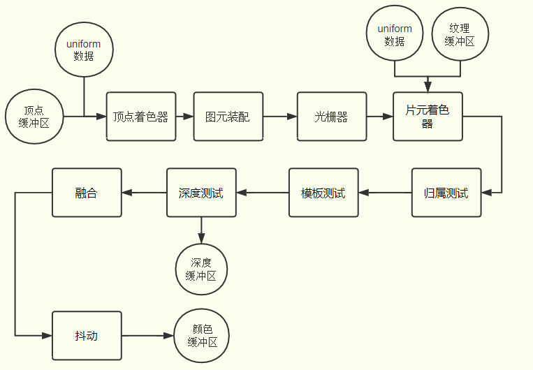
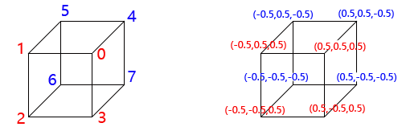

# 快速入门



## 绘制一个点

[draw-point](embedded-codesandbox://webgl-zero-based-practice-learn/draw-point)

### 着色器代码放在 script 标签中

```html
<!-- 顶点着色器源码 -->
<script id="vertexShader" type="x-shader/x-vertex">
  void main() {
    // 给内置变量 gl_PointSize 赋值像素大小
    gl_PointSize = 20.0;
    // 顶点位置，位于坐标原点
    gl_Position = vec4(0.0, 0.0, 0.0, 1.0);
  }
</script>
<!-- 片元着色器源码 -->
<script id="fragmentShader" type="x-shader/x-fragment">
  void main() {
    gl_FragColor = vec4(1.0, 0.0, 0.0, 1.0);
  }
</script>
```

```js
// 顶点着色器源码
var vertexShaderSource = document.getElementById('vertexShader').innerText;
// 片元着色器源码
var fragShaderSource = document.getElementById('fragmentShader').innerText;
// 初始化着色器
var program = initShader(gl, vertexShaderSource, fragShaderSource);
```

## 绘制一个矩形

[draw-rect](embedded-codesandbox://webgl-zero-based-practice-learn/draw-rect)

### attribute 关键字

声明顶点相关数据的时候需要用到 attribute 关键字，目的是为了 javascript 可以调用相关的 WebGL API 把顶点相关数据从 javascript 传递给顶点着色器 attribute 声明的变量。

### drawArrays 整体执行顺序


### 硬件相关

- 着色器语言编写的程序称为着色器程序(shader program)，在 GPU 顶点着色器单元上执行的是顶点着色器程序，在 GPU 片元着色器单元上执行的是片元着色器程序。

  顶点着色器

  ```glsl
  // attribute 声明 vec4 类型变量 apos
  attribute vec4 apos;
  void main() {
      // 顶点坐标 apos 赋值给内置变量 gl_Position
      // 逐顶点处理数据
      gl_Position = apos;
  }
  ```

  片元着色器

  ```glsl
  void main() {
      // 逐片元处理数据，所有片元(像素)设置为红色
      gl_FragColor = vec4(1.0,0.0,0.0,1.0);
  }
  ```

- 可编程顶点处理器(Programmable Vertex Processor)又称为顶点着色器，用来执行顶点着色器程序
- 可编程片元处理器(Programmable Fragment Processor)又称为片元着色器，用来执行片元着色器程序
- GPU 中有各种专门的寄存器，比如用来接收顶点坐标数据的寄存器是输入寄存器，从数据类型的角度看属于浮点寄存器，用来临时存储浮点数；存储输出到显示器像素的帧缓存是输出寄存器，从处理速度的角度看是数据缓冲寄存器，GPU 处理数据的速度要比显示器扫描帧缓存中像素数据的速度要快得多
- 显示器像素是显示器可以通过 RGB 值控制的最小单位，一幅图像是由大量像素点累积显示。着色器中的颜色定义会反映在显示器中
- 显示器的分辨率就是显示器长度方向像素点的个数 X 显示器宽度方向像素点的个数
- 屏幕相邻的两个像素单元的距离就是点距，点距越小显示效果越好，一般现在显示器 0.2mm~0.4mm 之间

## WebGL 坐标系—投影

[coordinate-system-projection](embedded-codesandbox://webgl-zero-based-practice-learn/coordinate-system-projection)

1. canvas 画布宽高采用的是像素值定义，以显示器为准，WebGL 中顶点坐标的表示方法采用的是相对坐标，相对于 canvas 而言 WebGL 坐标系统，X 轴水平向右，也就是 canvas 画布的 width 表示的宽度方向，x 等于 -1 表示 canvas 画布的左边界，x 等于 1 表示 canvas 画布的右边界，x 等于 0 对应的是画布宽度方向的中间。
2. WebGL 坐标系统，Y 轴竖直向上，也就是 canvas 画布的 height 表示的高度方向，y 等于 -1 表示 canvas 画布的下边界，y 等于 1 表示 canvas 画布的上边界，y 等于 0 对应的是画布高度方向的中间。
3. WebGL 坐标系统，Z 轴垂直 canvas 画布朝外，Z 值 -1 和 1 是 Z 方向的极限值，GPU 成像默认的沿着 Z 轴投影，你也可以抽象出一个概念，人眼睛位于 z 轴上，沿着 z 轴方向去观察物体，如果你在其他的书上看到视图坐标系等其它各类坐标系都是抽象出的概念都是建立在本节课所说的 WebGL 坐标系统之上，例如无人机导航中的所说的机体坐标系、地球坐标系都是直接对现实中事物的描述，三维场景中的各类坐标系与无人机中坐标系没什么区别，但是要显示在屏幕上，就要经过一些处理，这里不再详述，后面的教程后为大家引入各类坐标系概念，正射投影和透射投影概念。

## WebGL 平移变换

有以下几种方式可以做到沿 X 轴平移 -0.4

### 方法一

提前在顶点中计算

```js
var data = new Float32Array([
  // 三角形顶点 1 坐标
  0.0,
  0.0,
  1.0,

  // 三角形顶点 2 坐标
  0.0,
  1.0,
  0.0,

  // 三角形顶点 3 坐标
  1.0,
  0.0,
  0.0
]);

// x 坐标分别减少 0.4

var data = new Float32Array([
  // 三角形顶点 1 坐标
  -0.4,
  0.0,
  1.0,

  // 三角形顶点 2 坐标
  -0.4,
  1.0,
  0.0,

  // 三角形顶点 3 坐标
  0.6,
  0.0,
  0.0
]);
```

### 方法二

循环修改数组 `data=new Float32Array([..` 的顶点数据，把顶点坐标平移的数学计算任务交给 CPU

```js
for (var i = 0; i < 9; i += 3) {
  data[i] += -0.4;
}
```

### 方法三

替换掉原来的代码 `gl_Position = vec4(apos.x, apos.y, apos.z, 1)`，把顶点平移的数学运算任务交给了 GPU

```glsl
// 在顶点着色器中逐顶点沿着 x 轴平移 -0.4
gl_Position = vec4(apos.x - 0.4, apos.y, apos.z, 1);
```

### 方法四

在原来的顶点着色器代码中，声明一个 4 x 4 矩阵 m4，然后通过矩阵和表示顶点坐标的列向量相乘 `m4 * apos`，实现对顶点 apos 的平移变换，和方法三一样把数学计算任务交给 GPU 处理器，具体说是顶点着色器单元（Vertex Processor），顶点着色器单元能够完成矩阵的乘法运算。

```glsl
// attribute 声明 vec4 类型变量 apos
attribute vec4 apos;
void main() {
  // 创建平移矩阵（沿 x 轴平移 -0.4）
  // 1   0   0  -0.4
  // 0   1   0    0
  // 0   0   1    0
  // 0   0   0    1
  mat4 m4 = mat4(1, 0, 0, 0, 0, 1, 0, 0, 0, 0, 1, 0, -0.4, 0, 0, 1);
  // 平移矩阵 m4 左乘顶点坐标（vec4 类型数据可以理解为线性代数中的 nx1 矩阵，即列向量）
  // 逐顶点进行矩阵变换
  gl_Position = m4 * apos;
}
```

mat4 关键字和 vec4 关键字一样用来声明 WebGL 着色器变量的数据类型，和 vec4 一样也具有构造数据的功能。

vec4 是 4 x 1 矩阵，就是列向量，有四个元素，mat4 表示 4 x 4 矩阵，mat4() 函数括号中的 16 个数据，每四个为一组，以列为准，前四个数就是 mat4 矩阵的第一列，后面的按顺序依次排列。

#### 平移矩阵解析

一个点的坐标是 (x, y, z)，假设沿着 X、Y、Z 轴分别平移 Tx、Ty、Tz，平移后的坐标是 `(x + Tx, y + Ty, z + Tz)`。

$$
   \begin{bmatrix}
   1 & 0 & 0 & Tx \\
   0 & 1 & 0 & Ty \\
   0 & 0 & 1 & Tz \\
   0 & 0 & 0 & 1 \\
   \end{bmatrix}

   \begin{bmatrix}
   x \\
   y \\
   z \\
   1 \\
   \end{bmatrix}

   =

   \begin{bmatrix}
   x + Tx \\
   y + Ty \\
   z + Tz \\
   1 \\
   \end{bmatrix}
$$

### 总结

1. 上面计算式的巧妙之处就是把三维坐标，增加一个元素 1.0，用 4 x 1 矩阵表示，n x 1 矩阵也称为列向量，对应的数据类型就是 vec4
2. n 维向量增加一个维度用 n + 1 维向量表示就是齐次坐标。
3. 上面的 4 x 4 矩阵，就是平移矩阵，平移矩阵左乘顶点的齐次坐标，结果仍然是一个齐次坐标，也就是平移后的坐标。
4. 矩阵的乘法满足结合律，如果多次平移，可以把所有的平移矩阵先进行乘法运算，然后左乘要平移顶点的齐次坐标。

## WebGL 旋转变换

[draw-cube-rotate](embedded-codesandbox://webgl-zero-based-practice-learn/draw-cube-rotate)

### 着色器内置函数

WebGL 着色器提供了一系列可以内置函数，也就是说不用声明可以直接调用的函数。

radians() 函数：角度值转化为弧度制，参数是浮点数 float，比如 30 度时，要写成 30.0

```glsl
// 旋转角度 30 度转化为弧度值
float radian = radians(30.0);
```

cos() 是余弦函数，参数要求是弧度值且是浮点数

sin() 是正弦函数，参数要求是弧度值且是浮点数

```glsl
// 求解旋转角度余弦值
float cos = cos(radian);
// 求解旋转角度正弦值
float sin = sin(radian);
```

### 流程简述

多次调用了绘制命令 `gl.drawArrays`，data 变量定义的顶点数据初始化时，会存入内存中，执行代码 `gl.bindBuffer(gl.ARRAY_BUFFER, buffer);` 内存中的数据一次性传入显存缓冲区中，传入缓冲区中的顶点数据可以通过 drawArrays 方法多次调用，每次 drawArrays 方法调用，顶点经过渲染管线得到的像素相关数据都会存入帧缓存中，后一次调用，前一次调用生成的像素数据不会清空，最终形成一幅完整的立方体线框图。

### 旋转矩阵解析

假设一个点的坐标是 (x, y, z)，经过旋转变换后的坐标为 (X, Y, Z)

#### 绕 Z 轴旋转 γ 角度

z 的坐标不变，x、y 的坐标发生变化，在笛卡尔坐标系下通过简单的数学计算就可以知道结果 `X = xcosγ - ysinγ, Y = xsinγ + ycosγ`

$$
   \begin{bmatrix}
   cosγ & -sinγ & 0 & 0 \\
   sinγ & cosγ & 0 & 0 \\
   0 & 0 & 1 & 0 \\
   0 & 0 & 0 & 1 \\
   \end{bmatrix}

   \begin{bmatrix}
   x \\
   y \\
   z \\
   1 \\
   \end{bmatrix}

   =

   \begin{bmatrix}
   xcosγ - ysinγ \\
   xsinγ + ycosγ \\
   z \\
   1 \\
   \end{bmatrix}
$$

#### 绕 X 轴旋转 α 角度

x 的坐标不变，y、z 的坐标发生变化 `Y = ycosα - zsinα, Z = ysinα + zcosα`

$$
   \begin{bmatrix}
   1 & 0 & 0 & 0 \\
   0 & cosα & -sinα & 0 \\
   0 & sinα & cosα & 0 \\
   0 & 0 & 0 & 1 \\
   \end{bmatrix}

   \begin{bmatrix}
   x \\
   y \\
   z \\
   1 \\
   \end{bmatrix}

   =

   \begin{bmatrix}
   x \\
   ycosα - zsinα \\
   ysinα + zcosα \\
   1 \\
   \end{bmatrix}
$$

#### 绕 Y 轴旋转 β 角度

y 的坐标不变，x、z 的坐标发生变化 `X = zsinβ + xcosβ, Z = zcosβ - xsinβ`

$$
   \begin{bmatrix}
   cosβ & 0 & sinβ & 0 \\
   0 & 1 & 0 & 0 \\
   -sinβ & 0 & cosβ & 0 \\
   0 & 0 & 0 & 1 \\
   \end{bmatrix}

   \begin{bmatrix}
   x \\
   y \\
   z \\
   1 \\
   \end{bmatrix}

   =

   \begin{bmatrix}
   zsinβ + xcosβ \\
   y \\
   zcosβ - xsinβ \\
   1 \\
   \end{bmatrix}
$$

### 总结

1. 如果几何体经过多次旋转可以把每一次的旋转矩阵，连续进行乘法运算，最后再左乘顶点的齐次坐标
2. 旋转变换和平移变换同时存在，旋转矩阵和平移矩阵一样都是四阶矩阵，因此同样可以先进行乘法运算得到的仍是四阶矩阵，最后再左乘顶点的齐次坐标，这种情况也就是复合变换

## WebGL 顶点索引绘制

[draw-cube-vertex-index](embedded-codesandbox://webgl-zero-based-practice-learn/draw-cube-vertex-index)

WebGL 为了复用顶点数据新引入了一个新的绘制函数 gl.drawElements()，gl.drawElements() 和 gl.drawArrays() 方法一样都是命令浏览器 WebGL 图形系统开始处理顶点绘制渲染出像素并显示在屏幕 Canvas 画布上。区别是 gl.drawArrays() 方法直接调用顶点数组数据，gl.drawElements() 是通过一个索引数组访问使用顶点数组中的顶点数据。

可以在上面旋转变换的基础上进行修改

### 顶点列举

只需要把所有的顶点列举一次即可，不用重复枚举。

```js
// 8 个顶点坐标数组
var data = new Float32Array([
  // 顶点 0
  0.5,
  0.5,
  0.5,

  // 顶点 1
  -0.5,
  0.5,
  0.5,

  // 顶点 2
  -0.5,
  -0.5,
  0.5,

  // 顶点 3
  0.5,
  -0.5,
  0.5,

  // 顶点 4
  0.5,
  0.5,
  -0.5,

  // 顶点 5
  -0.5,
  0.5,
  -0.5,

  // 顶点 6
  -0.5,
  -0.5,
  -0.5,

  // 顶点 7
  0.5,
  -0.5,
  -0.5
]);
```

### 顶点的索引数组



| 索引值 | 索引值对应顶点坐标 |
| :----- | :----------------- |
| 0      | (0.5, 0.5, 0.5)    |
| 1      | (-0.5, 0.5, 0.5)   |
| 2      | (-0.5, -0.5, 0.5)  |
| 3      | (0.5, -0.5, 0.5)   |
| 4      | (0.5, 0.5, -0.5)   |
| 5      | (-0.5, 0.5, -0.5)  |
| 6      | (-0.5, -0.5, -0.5) |
| 7      | (0.5, -0.5, -0.5)  |

下面代码中表示的顶点索引如上图所示。

```js
// 顶点索引数组
var indexes = new Uint8Array([
  // 前四个点对应索引值
  0,
  1,
  2,
  3, // gl.LINE_LOOP 模式四个点绘制一个矩形框

  // 后四个顶点对应索引值
  4,
  5,
  6,
  7, // gl.LINE_LOOP 模式四个点绘制一个矩形框

  // 前后对应点对应索引值
  0,
  4, // 两个点绘制一条直线
  1,
  5, // 两个点绘制一条直线
  2,
  6, // 两个点绘制一条直线
  3,
  7 // 两个点绘制一条直线
]);
```

1. 索引数组的数据传入显存缓冲区，注意与顶点数据传入缓冲区方法参数的对比，传入索引数据时，bindBuffer() 和 bufferData() 方法的第一个参数是 `gl.ELEMENT_ARRAY_BUFFER`，传入顶点数据时是 `gl.ARRAY_BUFFER`。

   ```js
   // 创建缓冲区对象
   var indexesBuffer = gl.createBuffer();
   // 绑定缓冲区对象
   gl.bindBuffer(gl.ELEMENT_ARRAY_BUFFER, indexesBuffer);
   // 索引数组 indexes 数据传入缓冲区
   gl.bufferData(gl.ELEMENT_ARRAY_BUFFER, indexes, gl.STATIC_DRAW);
   ```

2. 使用方法 drawElements() 替换 drawArrays() 方法，参数设置基本一致，方法 drawElements() 只是新增了一个数据类型设置参数 `gl.UNSIGNED_BYTE`。

   ```js
   // LINE_LOOP 模式绘制前四个点
   gl.drawElements(gl.LINE_LOOP, 4, gl.UNSIGNED_BYTE, 0);
   // LINE_LOOP 模式从第五个点开始绘制四个点
   gl.drawElements(gl.LINE_LOOP, 4, gl.UNSIGNED_BYTE, 4);
   // LINES 模式绘制后 8 个点
   gl.drawElements(gl.LINES, 8, gl.UNSIGNED_BYTE, 8);
   ```

### gl.drawElements()

参数格式：drawElements(mode, count, type, offset)

| 参数   | 含义               | 值                                                                       |
| :----- | :----------------- | :----------------------------------------------------------------------- |
| mode   | 绘制模式           | gl.LINE_LOOP、gl.LINES、gl.TRIANGLES 等                                  |
| count  | 绘制顶点个数       | 整型数                                                                   |
| type   | 数据类型           | `gl.UNSIGNED_BYTE` 对应 Uint8Array，`gl.UNSIGNED_SHORT` 对应 Uint16Array |
| offset | 从第几个点开始绘制 | 整型数，以字节为单位                                                     |

count 和 offset 组合可以确定绘制众多顶点中的连续一段，通过顶点索引关联顶点数据，count 和 offset 指的是顶点的索引数组。

## varying 变量和颜色插值

使用关键字 varying 实现颜色插值计算

### 颜色线性插值

顶点着色器

```glsl
// attribute 声明 vec4 类型变量 apos
attribute vec4 apos;
// attribute 声明顶点颜色变量
attribute vec4 a_color;
// varying 声明顶点颜色插值后变量，使用 varying 可以插值计算
varying vec4 v_color;
void main() {
  // 顶点坐标 apos 赋值给内置变量 gl_Position
  gl_Position = apos;
  // 顶点颜色插值计算
  v_color = a_color;
}
```

片元着色器

```glsl
// 所有 float 类型数据的精度是 lowp
// lowp 是精度限定字表示低精度，计算机资源有限，设置数据精度是为了提高执行效率
// 除了片元着色器中的浮点类型 float 数据，其它所有类型数据浏览器都有默认的精度，因此要设定片元着色器中浮点类型 float 数据精度，否则会报错
precision lowp float;
// 接收顶点着色器中 v_color 数据
varying vec4 v_color;
void main() {
  // 插值后颜色数据赋值给对应的片元
  gl_FragColor = v_color;
}
```

### 获取顶点变量

```js
// 获取顶点着色器的位置变量 apos
var aposLocation = gl.getAttribLocation(program, 'apos');
var a_color = gl.getAttribLocation(program, 'a_color');
```

### 设置顶点颜色、位置数据

```js
/**
  创建顶点位置数据数组 data，存储两个顶点 (-0.5, 0.5)、(0.5, 0.5)
  创建顶点颜色数组 colorData，存储两个顶点对应 RGB 颜色值 (0, 0, 1)、(1, 0, 0)
 **/
var data = new Float32Array([-0.5, 0.5, 0.5, 0.5]);
var colorData = new Float32Array([0, 0, 1, 1, 0, 0]);
```

### 创建顶点缓冲区、传递数据

```js
/**
  创建缓冲区 buffer，传入顶点位置数据 data
 **/
var buffer = gl.createBuffer();
gl.bindBuffer(gl.ARRAY_BUFFER, buffer);
gl.bufferData(gl.ARRAY_BUFFER, data, gl.STATIC_DRAW);
gl.vertexAttribPointer(aposLocation, 2, gl.FLOAT, false, 0, 0);
gl.enableVertexAttribArray(aposLocation);

/**
  创建缓冲区 colorBuffer，传入顶点颜色数据 colorData
 **/
var colorBuffer = gl.createBuffer();
gl.bindBuffer(gl.ARRAY_BUFFER, colorBuffer);
gl.bufferData(gl.ARRAY_BUFFER, colorData, gl.STATIC_DRAW);
gl.vertexAttribPointer(a_color, 3, gl.FLOAT, false, 0, 0);
gl.enableVertexAttribArray(a_color);
```

### 创建一个彩色三角形

```js
/**
  创建顶点位置数据数组 data，存储 3 个顶点 (-0.5, 0.5)、(0.5, 0.5)、(0.5, -0.5)
  创建顶点颜色数组 colorData，存储 3 个顶点对应 RGB 颜色值 (1, 0, 0)、(0, 1, 0)、(0, 0, 1)
**/
var data = new Float32Array([-0.5, 0.5, 0.5, 0.5, 0.5, -0.5]);
var colorData = new Float32Array([1, 0, 0, 0, 1, 0, 0, 0, 1]);

/** 执行绘制命令 **/
gl.drawArrays(gl.TRIANGLES, 0, 3);
```

### 两个单色三角面（不同颜色）

```js
/**
  创建顶点位置数据数组 data，存储 6 个顶点
  创建顶点颜色数组 colorData，存储 6 个顶点对应 RGB 颜色值
 **/
var data = new Float32Array([
  // 第一个三角形的三个点
  -0.5,
  0.5,
  0.5,
  0.5,
  0.5,
  -0.5,

  // 第二个三角形的三个点
  -0.5,
  0.5,
  0.5,
  -0.5,
  -0.5,
  -0.5
]);

var colorData = new Float32Array([
  // 三个红色点
  1,
  0,
  0,
  1,
  0,
  0,
  1,
  0,
  0,

  // 三个蓝色点
  0,
  0,
  1,
  0,
  0,
  1,
  0,
  0,
  1
]);
```

### 颜色插值（顶点位置、颜色使用一个缓冲区存储）

```js
/**
 创建顶点位置数据数组 data，存储两个顶点 (-0.5, 0.5)、(0.5, 0.5)
 存储两个顶点对应 RGB 颜色值 (0, 0, 1)、(1, 0, 0)
 **/
var data = new Float32Array([-0.5, 0.5, 0, 0, 1, 0.5, 0.5, 1, 0, 0]);
/**
 创建缓冲区 buffer，传入顶点颜色、位置数据 data
 **/
var buffer = gl.createBuffer();
gl.bindBuffer(gl.ARRAY_BUFFER, buffer);
gl.bufferData(gl.ARRAY_BUFFER, data, gl.STATIC_DRAW);
// 4 表示 data 数组一个元素占据的字节数
// 倒数第二个参数 4 * 5 表示每 5 个元素是一个选择单元
// 第 2 个参数 2 表示从 5 元素组成的一个选择单元中选择前 2 个作为顶点位置数据
gl.vertexAttribPointer(aposLocation, 2, gl.FLOAT, false, 4 * 5, 0);
// 最后一个参数 4 * 2 表示 5 元素组成的一个选择单元中偏移 2 个元素
// 第 2 个参数 3 表示从 5 元素组成的一个选择单元中选择后三个作为顶点颜色数据
gl.vertexAttribPointer(a_color, 3, gl.FLOAT, false, 4 * 5, 4 * 2);
gl.enableVertexAttribArray(aposLocation);
gl.enableVertexAttribArray(a_color);
```

## 立方体-每个面一种颜色

思路很简单，在线框模式的立方体源码基础上直接进行更改，添加 varying 变量，引入顶点数据颜色，立方体 6 个面，每个面可以分为两个三角面绘制出来，也就是说每个面需要定义 6 个点，6 个点需要定义 36 个顶点。

### 着色器程序

着色器程序参考颜色插值 varying 的使用方法添加即可，就不再列出。

### 顶点数据

```js
/**
 创建顶点位置数据数组 data，Javascript 中小数点前面的 0 可以省略
 **/
var data = new Float32Array([
  0.5,
  0.5,
  0.5,
  -0.5,
  0.5,
  0.5,
  -0.5,
  -0.5,
  0.5,
  0.5,
  0.5,
  0.5,
  -0.5,
  -0.5,
  0.5,
  0.5,
  -0.5,
  0.5, // 面1

  0.5,
  0.5,
  0.5,
  0.5,
  -0.5,
  0.5,
  0.5,
  -0.5,
  -0.5,
  0.5,
  0.5,
  0.5,
  0.5,
  -0.5,
  -0.5,
  0.5,
  0.5,
  -0.5, // 面 2

  0.5,
  0.5,
  0.5,
  0.5,
  0.5,
  -0.5,
  -0.5,
  0.5,
  -0.5,
  0.5,
  0.5,
  0.5,
  -0.5,
  0.5,
  -0.5,
  -0.5,
  0.5,
  0.5, // 面 3

  -0.5,
  0.5,
  0.5,
  -0.5,
  0.5,
  -0.5,
  -0.5,
  -0.5,
  -0.5,
  -0.5,
  0.5,
  0.5,
  -0.5,
  -0.5,
  -0.5,
  -0.5,
  -0.5,
  0.5, // 面 4

  -0.5,
  -0.5,
  -0.5,
  0.5,
  -0.5,
  -0.5,
  0.5,
  -0.5,
  0.5,
  -0.5,
  -0.5,
  -0.5,
  0.5,
  -0.5,
  0.5,
  -0.5,
  -0.5,
  0.5, // 面 5

  0.5,
  -0.5,
  -0.5,
  -0.5,
  -0.5,
  -0.5,
  -0.5,
  0.5,
  -0.5,
  0.5,
  -0.5,
  -0.5,
  -0.5,
  0.5,
  -0.5,
  0.5,
  0.5,
  -0.5 // 面 6
]);

/**
 创建顶点颜色数组colorData
 **/
var colorData = new Float32Array([
  1,
  0,
  0,
  1,
  0,
  0,
  1,
  0,
  0,
  1,
  0,
  0,
  1,
  0,
  0,
  1,
  0,
  0, // 红色——面 1

  0,
  1,
  0,
  0,
  1,
  0,
  0,
  1,
  0,
  0,
  1,
  0,
  0,
  1,
  0,
  0,
  1,
  0, // 绿色——面 2

  0,
  0,
  1,
  0,
  0,
  1,
  0,
  0,
  1,
  0,
  0,
  1,
  0,
  0,
  1,
  0,
  0,
  1, // 蓝色——面 3

  1,
  1,
  0,
  1,
  1,
  0,
  1,
  1,
  0,
  1,
  1,
  0,
  1,
  1,
  0,
  1,
  1,
  0, // 黄色——面 4

  0,
  0,
  0,
  0,
  0,
  0,
  0,
  0,
  0,
  0,
  0,
  0,
  0,
  0,
  0,
  0,
  0,
  0, // 黑色——面 5

  1,
  1,
  1,
  1,
  1,
  1,
  1,
  1,
  1,
  1,
  1,
  1,
  1,
  1,
  1,
  1,
  1,
  1 // 白色——面 6
]);
```

### 深度测试

```js
/** 执行绘制之前，一定要开启深度测试，以免颜色混乱 **/
gl.enable(gl.DEPTH_TEST);
```

### 测试

可以把所有的颜色都改为红色，发现没有立体的视觉效果，白、蓝、绿处于其他三个面的前面，是可见面。可以把三个面设置为红色 R 分别为 1、0.9、0.8 来测试效果。你可以发现 R 值差异了 0.1，你会有很强的立体感，其实你可以继续使用更小的差值，来测试你的眼睛视觉变化。这其实相当于手动编写颜色值，模拟自然界光场，如果有兴趣可以学习下一节课程，如何模拟真实自然界的太阳光、灯光等各种类型光线在物体表面反射光场的分布，不仅不同的面会出现 R 值不同，一个面上的 R 值也会不同，呈现某种规律的变化，比如金属在阳光下会有局部高光现象。

```js
/**
 创建顶点颜色数组 colorData
 **/
var colorData = new Float32Array([
  1,
  0,
  0,
  1,
  0,
  0,
  1,
  0,
  0,
  1,
  0,
  0,
  1,
  0,
  0,
  1,
  0,
  0, // 红色——面 1

  0.9,
  0,
  0,
  0.9,
  0,
  0,
  0.9,
  0,
  0,
  0.9,
  0,
  0,
  0.9,
  0,
  0,
  0.9,
  0,
  0, // R = 0.9——面 2

  0.8,
  0,
  0,
  0.8,
  0,
  0,
  0.8,
  0,
  0,
  0.8,
  0,
  0,
  0.8,
  0,
  0,
  0.8,
  0,
  0, // R = 0.8——面 3

  1,
  1,
  0,
  1,
  1,
  0,
  1,
  1,
  0,
  1,
  1,
  0,
  1,
  1,
  0,
  1,
  1,
  0, // 黄色——面 4

  0,
  0,
  0,
  0,
  0,
  0,
  0,
  0,
  0,
  0,
  0,
  0,
  0,
  0,
  0,
  0,
  0,
  0, // 黑色——面 5

  1,
  0,
  0,
  1,
  0,
  0,
  1,
  0,
  0,
  1,
  0,
  0,
  1,
  0,
  0,
  1,
  0,
  0 // R = 1——面 6
]);
```

// TODO http://www.yanhuangxueyuan.com/WebGL/
