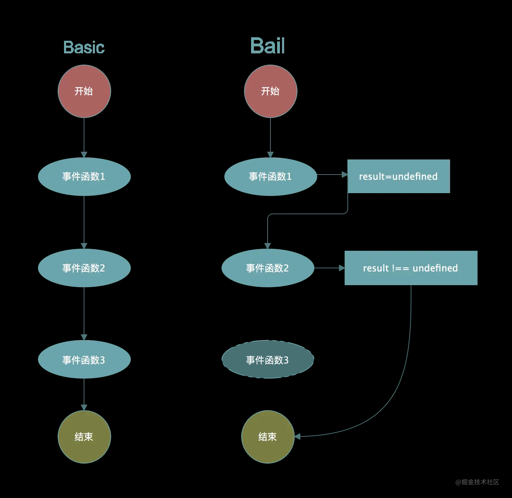
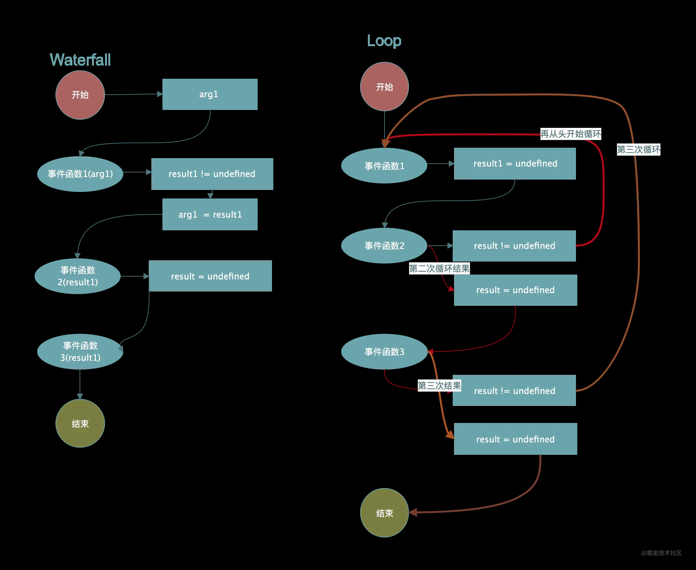
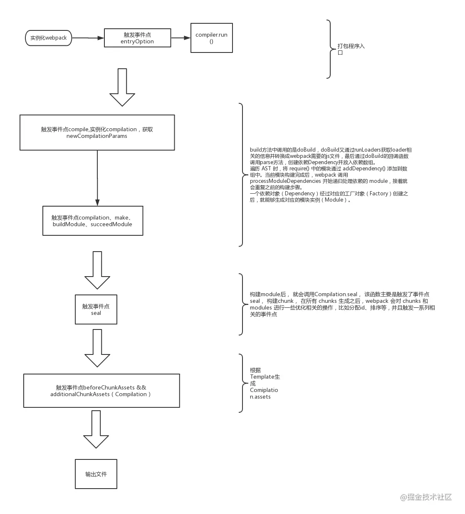
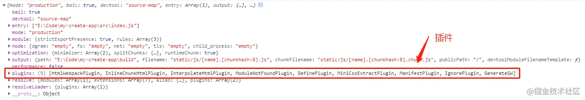
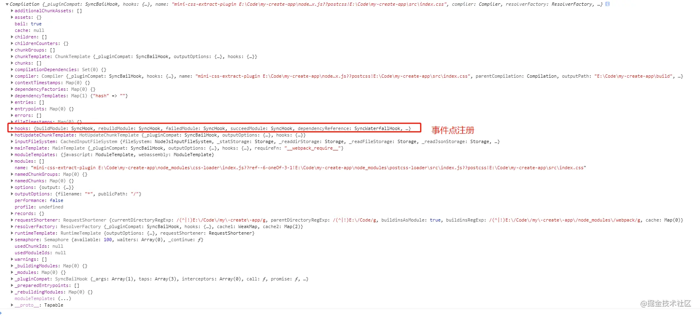
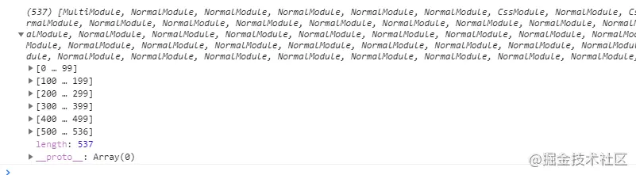
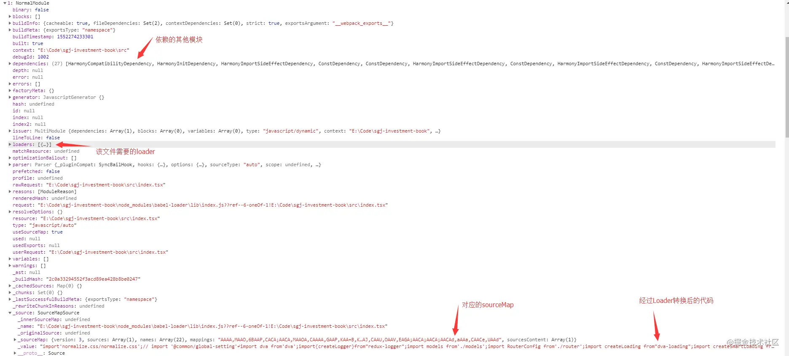
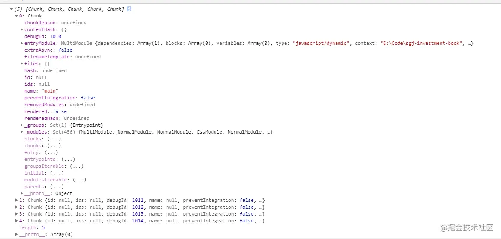
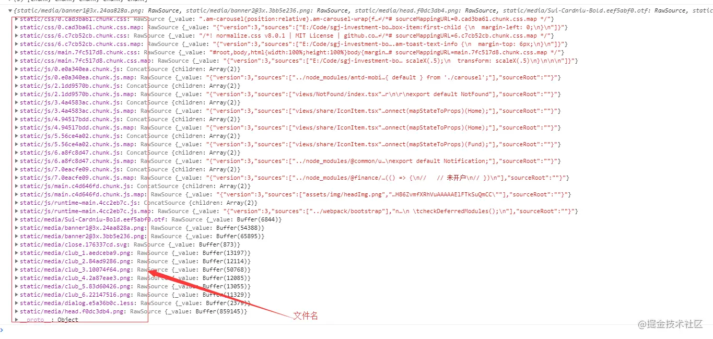

# 基础

## 简介

### entry（入口）

入口起点（entry point）即是 webpack 通过该起点找到本次项目所直接或间接依赖的资源（模块、库等），并对其进行处理，最后输出到 bundle 中。入口文件由用户自定义，可以是一个或者多个，每一个 entry 最后对应一个 bundle。

### output（出口）

通过配置 output 属性可以告诉 webpack 将 bundle 命名并输出到对应的位置。

### loader

webpack 核心，webpack 本身只能识别 js 文件，对于非 js 文件，即需要 loader 转换为 js 文件。换句话说，Loader 就是资源转换器。由于在 webpack 里，所有的资源都是模块，不同资源都最终转化成 js 去处理。针对不同形式的资源采用不同的 Loader 去编译，这就是 Loader 的意义。

### 插件（plugin）

webpack 核心，loader 处理非 js 文件，那么插件可以有更广泛的用途。整个 webpack 其实就是各类的插件形成的，插件的范围包括，从打包优化和压缩，一直到重新定义环境中的变量。插件接口功能极其强大，可以用来处理各种各样的任务。

### Chunk

被 entry 所依赖的额外的代码块，同样可以包含一个或者多个文件。chunk 也就是一个个的 js 文件，在异步加载中用处很大。chunk 实际上就是 webpack 打包后的产物，如果你不想最后生成一个包含所有的 bundle，那么可以生成一个个 chunk，并通过按需加载引入。同时它还能通过插件提取公共依赖生成公共 chunk，避免多个 bundle 中有多个相同的依赖代码。

## 实践 & 优化

### url-loader & image-webpack-loader

url-loader 可以在文件大小（单位 byte）低于指定的限制，将文件转换为 DataURL，这在实际开发中非常有效，能够减少请求数，在 vue-cli 和 create-react-app 中也都能看到对这个 loader 的使用。

```js
// "url" loader works just like "file" loader but it also embeds
// assets smaller than specified size as data URLs to avoid requests.
{
  test: [/\.bmp$/, /\.gif$/, /\.jpe?g$/, /\.png$/],
  loader: require.resolve('url-loader'),
  options: {
    limit: 10000,
    name: 'static/media/[name].[hash:8].[ext]',
  },
},
```

image-webpack-loader 这是一个可以通过设置质量参数来压缩图片的插件，但个人觉得在实际开发中并不会经常使用，图片一般是 UI 提供，一般来说，他们是不会同意改变图片的质量。

### 资源私有化

以这种方式加载资源，你可以以更直观的方式将模块和资源组合在一起。无需依赖于含有全部资源的 /assets 目录，而是将资源与代码组合在一起。例如，类似这样的结构会非常有用

```
- |- /assets
+ |– /components
+ |  |– /my-component
+ |  |  |– index.jsx
+ |  |  |– index.css
+ |  |  |– icon.svg
+ |  |  |– img.png
```

当然，这种选择见仁见智

### Tree-Shaking

前端中的 tree-shaking 就是将一些无关的代码删掉不打包。在 Webpack 项目中，我们通常会引用很多文件，但实际上我们只引用了其中的某些模块，但却需要引入整个文件进行打包，会导致我们的打包结果变得很大，通过 tree-shaking 将没有使用的模块摇掉，这样来达到删除无用代码的目的。

Tree-Shaking 的原理可以参考[这篇文章](https://juejin.cn/post/6844903544756109319)

归纳起来就是

> 1. ES6 的模块引入是静态分析的，故而可以在编译时正确判断到底加载了什么代码。
> 2. 分析程序流，判断哪些变量未被使用、引用，进而删除此代码

[Tree-Shaking 不起作用，代码没有被删？](https://segmentfault.com/a/1190000012794598)

归纳起来就是

> 因为 Babel 的转译，使得引用包的代码有了副作用，而副作用会导致 Tree-Shaking 失效。

Webpack 4 默认启用了 Tree Shaking。对副作用进行了消除，以下是在 4.19.1 的实验

index.js

```js
import { cube } from './math.js';

console.log(cube(5));
```

math.js

```js
// 不打包 square
export class square {
  constructor() {
    console.log('square');
  }
}

export class cube {
  constructor(x) {
    return x * x * x;
  }
}
```

```js
// babel 编译后，同不打包
'use strict';

Object.defineProperty(exports, '__esModule', {
  value: true
});
exports.cube = cube;

function _classCallCheck(instance, Constructor) {
  if (!(instance instanceof Constructor)) {
    throw new TypeError('Cannot call a class as a function');
  }
}

var square = (exports.square = function square() {
  _classCallCheck(this, square);

  console.log('square');
});

function cube(x) {
  console.log('cube');
  return x * x * x;
}
```

```js
// 不打包
export function square(x) {
  console.log('square');
  return x.a;
}

export function cube(x) {
  return x * x * x;
}
```

```js
// wow 被打包
export function square() {
  console.log('square');
  return x.a;
}

square({ a: 1 });

export function cube() {
  return x * x * x;
}
```

### sourcemap

简单说，Source map 就是一个信息文件，里面储存着位置信息。也就是说，转换后的代码的每一个位置，所对应的转换前的位置。

有了它，出错的时候，除错工具将直接显示原始代码，而不是转换后的代码，这无疑给开发者带来了很大方便。

webpack 中的 devtool 配置项可以设置 sourcemap，可以参考官方文档，然而 devtool 的许多选项都讲的不是很清楚，这里推荐该[文章](https://juejin.cn/post/6844903450644316174)，讲的比较详细

要注意，避免在生产中使用 `inline-*` 和 `eval-*`，因为它们可以增加 bundle 大小，并降低整体性能。

### 模块热替换

热替换这一块目前大多数都是用的 webpack-dev-middleware 插件配合服务器使用的，而官方提供的 watch 模式反而比较少用，当然 webpack-dev-middleware 的底层监听 watch mode

至于为什么不直接使用 watch 模式，则是 webpack-dev-middleware 快速编译，走内存；只依赖 webpack 的 watch mode 来监听文件变更，自动打包、每次变更都将新文件打包到本地，就会很慢。

### DefinePlugin

webpack.DefinePlugin 定义环境变量 process.env，这在实际开发中比较常用，参考 create-react-app 中的代码如下：

```js
// Makes some environment variables available to the JS code, for example:
// if (process.env.NODE_ENV === 'development') { ... }. See `./env.js`.
new webpack.DefinePlugin(env.stringified)
```

不过，要注意不能在 config 中使用，因为

```js
process.env.NODE_ENV === 'production' ? '[name].[hash].bundle.js' : '[name].bundle.js';
```

> NODE_ENV is set in the compiled code, not in the webpack.config.js file. You should not use enviroment variables in your configuration. Pass options via --env.option abc and export a function from the webpack.config.js.

大致意思就是 NODE_ENV 是设置在 compiled 里面，而不是 config 文件里。

### ExtractTextWebpackPlugin

ExtractTextWebpackPlugin 将 css 抽取成单独文件，可以通过这种方式配合后端对 css 文件进行缓存。

### SplitChunksPlugin

webpack4 的代码分割插件。

webpack4 中支持了零配置的特性，同时对块打包也做了优化，CommonsChunkPlugin 已经被移除了，现在是使用 optimization.splitChunks 代替。SplitChunksPlugin 的配置有几个需要比较关注一下

- async: 默认值， 将按需引用的模块打包
- initial: 分开优化打包异步和非异步模块
- all: all 会把异步和非异步同时进行优化打包。也就是说 moduleA 在 indexA 中异步引入，indexB 中同步引入，initial 下 moduleA 会出现在两个打包块中，而 all 只会出现一个。

使用 cacheGroups 可以自定义配置打包块。

### 动态引入

利用动态引入的文件打包成另一个包并懒加载它，其与 SplitChunksPlugin 的 cacheGroups 区别：

- Bundle splitting：实际上就是创建多个更小的文件，并行加载，以获得更好的缓存效果；主要的作用就是使浏览器并行下载，提高下载速度。并且运用浏览器缓存，只有代码被修改，文件名中的哈希值改变了才会去再次加载
- Code splitting：只加载用户最需要的部分，其余的代码都遵从懒加载的策略；主要的作用就是加快页面加载速度，不加载不必要加载的东西。

参考代码：

```js
import _ from 'lodash';

function component() {
  var element = document.createElement('div');
  var button = document.createElement('button');
  var br = document.createElement('br');

  button.innerHTML = 'Click me and look at the console!';
  element.innerHTML = _.join(['Hello', 'webpack'], ' ');
  element.appendChild(br);
  element.appendChild(button);

  // Note that because a network request is involved, some indication
  // of loading would need to be shown in a production-level site/app.
  button.onclick = (e) =>
    import(/* webpackChunkName: "print" */ './print').then((module) => {
      var print = module.default;

      print();
    });

  return element;
}

document.body.appendChild(component());
```

> 注意当调用 ES6 模块的 import() 方法（引入模块）时，必须指向模块的 .default 值，因为它才是 promise 被处理后返回的实际的 module 对象。

### 缓存 runtimeChunk

因为 webpack 会把运行时代码放到最后的一个 bundle 中，所以即使我们修改了其他文件的代码，最后的一个 bundle 的 hash 也会改变，runtimeChunk 是把运行时代码单独提取出来的配置。这样就有利于我们和后端配合缓存文件。

- single: 所有入口共享一个生成的 runtimeChunk
- true/mutiple: 每个入口生成一个单独的 runtimeChunk

### 模块标识符

有时候我们只是添加了个文件 print.js， 并在 index 引入

```js
import Print from './print';
```

打包的时候，期望只有 runtime 和 main 两个 bundle 的 hash 发生改变，但是通常所有 bundle 都发生了变化，因为每个 module.id 会基于默认的解析顺序(resolve order)进行增量。也就是说，当解析顺序发生变化，ID 也会随之改变。

可以使用两个插件来解决这个问题。第一个插件是 NamedModulesPlugin，将使用模块的路径，而不是数字标识符。虽然此插件有助于在开发过程中输出结果的可读性，然而执行时间会长一些。第二个选择是使用 HashedModuleIdsPlugin。

### ProvidePlugin

通过 ProvidePlugin 处理全局变量，以及其他更细粒度的[处理](https://www.webpackjs.com/guides/shimming/)

### polyfills 的处理

首先了解一下 polyfills， 虽然在 webpack 中能够使用 es6\es7 等的 API，但并不代表编译器支持这些 API，所以通常我们会用 polyfills 来自定义一个 API。

那么在 webpack 中，一般是使用 babel-polyfill VS babel-runtime VS babel-preset-env 等来支持这些 API，而这三种怎么选择也是一个问题。

在真正进入主题之前，我们先看一个 preset-env 的配置项，同时也是 package.json 中的一个配置项 browserslist

```json
{
  "browserslist": ["last 1 version", "> 1%", "maintained node versions", "not dead"]
}
```

根据这个配置，preset-env 或者 postcss 等会根据你的参数支持不同的 polyfills，具体的参数配置参考该[文章](https://juejin.cn/post/6844903669524086797)

- babel-polyfill 只需要引入一次，但会重写一些原生的已支持的方法，而且体积很大。
- transform-runtime 是利用 plugin 自动识别并替换代码中的新特性，你不需要再引入，只需要装好 babel-runtime 和 配好 plugin 就可以了。好处是按需替换，检测到你需要哪个，就引入哪个 polyfill，值得注意的是，instance 上新添加的一些方法，babel-plugin-transform-runtime 是没有做处理的，比如 数组的 includes, filter, fill 等
- babel-preset-env 根据当前的运行环境，自动确定你需要的 plugins 和 polyfills。通过各个 es 标准 feature 在不同浏览器以及 node 版本的支持情况，再去维护一个 feature 跟 plugins 之间的映射关系，最终确定需要的 plugins。

### 后编译

日常我们引用的 Npm 包都是编译好的，这样带来的方便的同时也暴露了一些问题。

代码冗余：一般来说，这些 NPM 包也是基于 ES2015+ 开发的，每个包都需要经过 babel 编译发布后才能被主应用使用，而这个编译过程往往会附加很多“编译代码”；每个包都会有一些相同的编译代码，这就造成大量代码的冗余，并且这部分冗余代码是不能通过 Tree Shaking 等技术去除掉的。

非必要的依赖：考虑到组件库的场景，通常我们为了方便一股脑引入了所有组件；但实际情况下对于一个应用而言可能只是用到了部分组件，此时如果全部引入，也会造成代码冗余。

所以我们自己的公司组件可以采用后编译的形式，即发布的是未经编译的 npm 包，在项目构建时才编译，我们公司采用的也是这种做法，因为我们的包都在一个目录下，所以不用考虑递归编译的问题。

### 设置环境变量

这个比较简单，直接看代码或者官方文档即可

```bash
webpack --env.NODE_ENV=local --env.production --progress
```

### 其他插件

- CompressionWebpackPlugin 将文件压缩 文件大小减小很多 需要后端协助配置
- mini-css-extract-plugin 将 CSS 分离出来
- wbepack.IgnorePlugin 忽略匹配的模块
- uglifyjs-webpack-plugin 代码丑化，webpack4 的 mode（product）自动配置
- optimize-css-assets-webpack-plugincss 压缩
- webpack-md5-hash 使你的 chunk 根据内容生成 md5，用这个 md5 取代 webpack chunkhash。
- dllPlugin 提高构建速度

# 插件机制

## Tapable

Webpack 的插件机制依赖于一个核心的库 Tapable。

### Tapable 是什么

tapable 是一个类似于 nodejs 的 EventEmitter 的库, 主要是控制钩子函数的发布与订阅。当然，tapable 提供的 hook 机制比较全面，分为同步和异步两个大类(异步中又区分异步并行和异步串行)，而根据事件执行的终止条件的不同，由衍生出 Bail/Waterfall/Loop 类型。

### Tapable 的使用

#### 基本使用

```js
const { SyncHook } = require('tapable');

// 创建一个同步 Hook，指定参数
const hook = new SyncHook(['arg1', 'arg2']);

// 注册
hook.tap('a', function(arg1, arg2) {
  console.log('a');
});

hook.tap('b', function(arg1, arg2) {
  console.log('b');
});

hook.call(1, 2);
```

#### 钩子类型





##### BasicHook

执行每一个，不关心函数的返回值，有 SyncHook、AsyncParallelHook、AsyncSeriesHook。

##### BailHook

顺序执行 Hook，遇到第一个结果 result!==undefined 则返回，不再继续执行。有：SyncBailHook、AsyncSeriseBailHook, AsyncParallelBailHook。

什么样的场景下会使用到 BailHook 呢？设想如下一个例子：假设我们有一个模块 M，如果它满足 A 或者 B 或者 C 三者任何一个条件，就将其打包为一个单独的。这里的 A、B、C 不存在先后顺序，那么就可以使用 AsyncParallelBailHook 来解决:

```js
x.hooks.拆分模块的Hook.tap('A', () => {
  if (A 判断条件满足) {
    return true
  }
})
x.hooks.拆分模块的Hook.tap('B', () => {
  if (B 判断条件满足) {
    return true
  }
})
x.hooks.拆分模块的Hook.tap('C', () => {
  if (C 判断条件满足) {
    return true
  }
})
```

如果 A 中返回为 true，那么就无须再去判断 B 和 C。但是当 A、B、C 的校验，需要严格遵循先后顺序时，就需要使用有顺序的 SyncBailHook(A、B、C 是同步函数时使用) 或者 AsyncSeriseBailHook(A、B、C 是异步函数时使用)。

##### WaterfallHook

类似于 reduce，如果前一个 Hook 函数的结果 result !== undefined，则 result 会作为后一个 Hook 函数的第一个参数。既然是顺序执行，那么就只有 Sync 和 AsyncSeries 类中提供这个 Hook：SyncWaterfallHook，AsyncSeriesWaterfallHook

当一个数据，需要经过 A，B，C 三个阶段的处理得到最终结果，并且 A 中如果满足条件 a 就处理，否则不处理，B 和 C 同样，那么可以使用如下

```js
x.hooks.tap('A', (data) => {
  if (满足 A 需要处理的条件) {
    // 处理数据 data
    return data
  } else {
    return
  }
})
x.hooks.tap('B', (data) => {
  if (满足B需要处理的条件) {
    // 处理数据 data
    return data
  } else {
    return
  }
})
x.hooks.tap('C', (data) => {
  if (满足 C 需要处理的条件) {
    // 处理数据 data
    return data
  } else {
    return
  }
})
```

##### LoopHook

不停的循环执行 Hook，直到所有函数结果 result === undefined。同样的，由于对串行性有依赖，所以只有 SyncLoopHook 和 AsyncSeriseLoopHook

### Tapable 的源码分析

Tapable 基本逻辑是，先通过类实例的 tap 方法注册对应 Hook 的处理函数， 这里直接分析 sync 同步钩子的主要流程，其他的异步钩子和拦截器等就不赘述了。

```js
const hook = new SyncHook(['arg1', 'arg2']);
```

从该句代码，作为源码分析的入口

```js
class SyncHook extends Hook {
  // 错误处理，防止调用者调用异步钩子
  tapAsync() {
    throw new Error('tapAsync is not supported on a SyncHook');
  }
  // 错误处理，防止调用者调用 promise 钩子
  tapPromise() {
    throw new Error('tapPromise is not supported on a SyncHook');
  }
  // 核心实现
  compile(options) {
    factory.setup(this, options);
    return factory.create(options);
  }
}
```

从类 SyncHook 看到，他是继承于一个基类 Hook，他的核心实现 compile 等会再讲，我们先看看基类 Hook

```js
// 变量的初始化
constructor(args) {
	if (!Array.isArray(args)) args = [];
	this._args = args;
	this.taps = [];
	this.interceptors = [];
	this.call = this._call;
	this.promise = this._promise;
	this.callAsync = this._callAsync;
	this._x = undefined;
}
```

初始化完成后，通常会注册一个事件：

```js
// 注册
hook.tap('a', function(arg1, arg2) {
  console.log('a');
});

hook.tap('b', function(arg1, arg2) {
  console.log('b');
});
```

很明显这两个语句都会调用基类中的 tap 方法：

```js
tap(options, fn) {
    // 参数处理
	if (typeof options === "string") options = { name: options };
	if (typeof options !== "object" || options === null)
		throw new Error(
			"Invalid arguments to tap(options: Object, fn: function)"
		);
	options = Object.assign({ type: "sync", fn: fn }, options);
	if (typeof options.name !== "string" || options.name === "")
		throw new Error("Missing name for tap");
	// 执行拦截器的 register 函数， 比较简单不分析
	options = this._runRegisterInterceptors(options);
	// 处理注册事件
	this._insert(options);
}
```

从上面的源码分析， 可以看到 \_insert 方法是注册阶段的关键函数， 直接进入该方法内部

```js
_insert(item) {
    // 重置所有的 调用 方法
	this._resetCompilation();
	// 将注册事件排序后放进taps数组
	let before;
	if (typeof item.before === "string") before = new Set([item.before]);
	else if (Array.isArray(item.before)) {
		before = new Set(item.before);
	}
	let stage = 0;
	if (typeof item.stage === "number") stage = item.stage;
	let i = this.taps.length;
	while (i > 0) {
		i--;
		const x = this.taps[i];
		this.taps[i + 1] = x;
		const xStage = x.stage || 0;
		if (before) {
			if (before.has(x.name)) {
				before.delete(x.name);
				continue;
			}
			if (before.size > 0) {
				continue;
			}
		}
		if (xStage > stage) {
			continue;
		}
		i++;
		break;
	}
	this.taps[i] = item;
}
```

\_insert 主要是排序 tap 并放入到 taps 数组里面，排序的算法并不是特别复杂，这里就不赘述了，到了这里注册阶段就已经结束了，继续看触发阶段。

```js
hook.call(1, 2); // 触发函数
```

在基类 hook 中有一个初始化过程

```js
this.call = this._call;

Object.defineProperties(Hook.prototype, {
  _call: {
    value: createCompileDelegate('call', 'sync'),
    configurable: true,
    writable: true
  },
  _promise: {
    value: createCompileDelegate('promise', 'promise'),
    configurable: true,
    writable: true
  },
  _callAsync: {
    value: createCompileDelegate('callAsync', 'async'),
    configurable: true,
    writable: true
  }
});
```

我们可以看出 \_call 是由 createCompileDelegate 生成的，往下看

```js
function createCompileDelegate(name, type) {
  return function lazyCompileHook(...args) {
    this[name] = this._createCall(type);
    return this[name](...args);
  };
}
```

createCompileDelegate 返回一个名为 lazyCompileHook 的函数，顾名思义即懒编译，直到调用 call 的时候，才会编译出正在的 call 函数。

createCompileDelegate 也是调用的 \_createCall， 而 \_createCall 调用了 Compier 函数

```js
_createCall(type) {
	return this.compile({
		taps: this.taps,
		interceptors: this.interceptors,
		args: this._args,
		type: type
	});
}
compile(options) {
	throw new Error("Abstract: should be overriden");
}
```

可以看到 compiler 必须由子类重写，返回到 syncHook 的 compile 函数，即我们一开始说的核心方法

```js
class SyncHookCodeFactory extends HookCodeFactory {
  content({ onError, onResult, onDone, rethrowIfPossible }) {
    return this.callTapsSeries({
      onError: (i, err) => onError(err),
      onDone,
      rethrowIfPossible
    });
  }
}

const factory = new SyncHookCodeFactory();

class SyncHook extends Hook {
  compile(options) {
    factory.setup(this, options);
    return factory.create(options);
  }
}
```

关键就在于 SyncHookCodeFactory 和工厂类 HookCodeFactory，先看 setup 函数

```js
setup(instance, options) {
  // 这里的 instance 是 syncHook 实例, 其实就是把 tap 进来的钩子数组给到钩子的 _x 属性里.
  instance._x = options.taps.map(t => t.fn);
}
```

然后是最关键的 create 函数， 可以看到最后返回的 fn，其实是一个 new Function 动态生成的函数

```js
create(options) {
  // 初始化参数，保存 options 到本对象 this.options，保存 new Hook(["options"]) 传入的参数到 this._args
  this.init(options);
  let fn;
  // 动态构建钩子，这里是抽象层，分同步、异步、promise
  switch (this.options.type) {
    // 先看同步
    case "sync":
      // 动态返回一个钩子函数
      fn = new Function(
        // 生成函数的参数 no before no after 返回参数字符串 xxx,xxx 在
        // 注意这里 this.args 返回的是一个字符串,
        // 在这个例子中是 options
        this.args(),
        '"use strict";\n' +
          this.header() +
          this.content({
            onError: err => `throw ${err};\n`,
            onResult: result => `return ${result};\n`,
            onDone: () => "",
            rethrowIfPossible: true
          })
      );
      break;
    case "async":
      fn = new Function(
        this.args({
          after: "_callback"
        }),
        '"use strict";\n' +
          this.header() +
          // 这个 content 调用的是子类类的 content 函数,
          // 参数由子类传,实际返回的是 this.callTapsSeries() 返回的类容
          this.content({
            onError: err => `_callback(${err});\n`,
            onResult: result => `_callback(null, ${result});\n`,
            onDone: () => "_callback();\n"
          })
      );
      break;
    case "promise":
      let code = "";
      code += '"use strict";\n';
      code += "return new Promise((_resolve, _reject) => {\n";
      code += "var _sync = true;\n";
      code += this.header();
      code += this.content({
        onError: err => {
          let code = "";
          code += "if(_sync)\n";
          code += `_resolve(Promise.resolve().then(() => { throw ${err}; }));\n`;
          code += "else\n";
          code += `_reject(${err});\n`;
          return code;
        },
        onResult: result => `_resolve(${result});\n`,
        onDone: () => "_resolve();\n"
      });
      code += "_sync = false;\n";
      code += "});\n";
      fn = new Function(this.args(), code);
      break;
  }
  // 把刚才 init 赋的值初始化为 undefined
  // this.options = undefined;
  // this._args = undefined;
  this.deinit();

  return fn;
}
```

最后生成的代码大致如下

```js
"use strict";
function (options) {
  var _context;
  var _x = this._x;
  var _taps = this.taps;
  var _interterceptors = this.interceptors;
  // 我们只有一个拦截器所以下面的只会生成一个
  _interceptors[0].call(options);

  var _tap0 = _taps[0];
  _interceptors[0].tap(_tap0);
  var _fn0 = _x[0];
  _fn0(options);
  var _tap1 = _taps[1];
  _interceptors[1].tap(_tap1);
  var _fn1 = _x[1];
  _fn1(options);
  var _tap2 = _taps[2];
  _interceptors[2].tap(_tap2);
  var _fn2 = _x[2];
  _fn2(options);
  var _tap3 = _taps[3];
  _interceptors[3].tap(_tap3);
  var _fn3 = _x[3];
  _fn3(options);
}
```

以上就是 Tapabled 的机制，然而本篇的主要对象其实是基于 tapable 实现的 compile 和 compilation 对象。不过由于他们都是基于 tapable，所以介绍的篇幅相对短一点。

## compile

### compile 是什么

compiler 对象代表了完整的 webpack 环境配置。这个对象在启动 webpack 时被一次性建立，并配置好所有可操作的设置，包括 options，loader 和 plugin。当在 webpack 环境中应用一个插件时，插件将收到此 compiler 对象的引用。可以使用 compiler 来访问 webpack 的主环境。

也就是说，compile 是 webpack 的整体环境。

### compile 的内部实现

```js
class Compiler extends Tapable {
  constructor(context) {
    super();
    this.hooks = {
      /** @type {SyncBailHook<Compilation>} */
      shouldEmit: new SyncBailHook(['compilation']),
      /** @type {AsyncSeriesHook<Stats>} */
      done: new AsyncSeriesHook(['stats']),
      /** @type {AsyncSeriesHook<>} */
      additionalPass: new AsyncSeriesHook([])
      /** @type {AsyncSeriesHook<Compiler>} */
    };
  }
}
```

可以看到 Compier 继承了 Tapable, 并且在实例上绑定了一个 hook 对象，使得 Compier 的实例 compier 可以像这样使用

```js
compiler.hooks.compile.tapAsync('afterCompile', (compilation, callback) => {
  console.log('This is an example plugin!');
  console.log('Here’s the `compilation` object which represents a single build of assets:', compilation);

  // 使用 webpack 提供的 plugin API 操作构建结果
  compilation.addModule(/* ... */);

  callback();
});
```

## compilation

### 什么是 compilation

compilation 对象代表了一次资源版本构建。当运行 webpack 开发环境中间件时，每当检测到一个文件变化，就会创建一个新的 compilation，从而生成一组新的编译资源。一个 compilation 对象表现了当前的模块资源、编译生成资源、变化的文件、以及被跟踪依赖的状态信息。compilation 对象也提供了很多关键时机的回调，以供插件做自定义处理时选择使用。

### compilation 的实现

```js
class Compilation extends Tapable {
  /**
   * Creates an instance of Compilation.
   * @param {Compiler} compiler the compiler which created the compilation
   */
  constructor(compiler) {
    super();
    this.hooks = {
      /** @type {SyncHook<Module>} */
      buildModule: new SyncHook(['module']),
      /** @type {SyncHook<Module>} */
      rebuildModule: new SyncHook(['module']),
      /** @type {SyncHook<Module, Error>} */
      failedModule: new SyncHook(['module', 'error']),
      /** @type {SyncHook<Module>} */
      succeedModule: new SyncHook(['module']),

      /** @type {SyncHook<Dependency, string>} */
      addEntry: new SyncHook(['entry', 'name'])
      /** @type {SyncHook<Dependency, string, Error>} */
    };
  }
}
```

具体参考上面提到的 compiler 实现。

## 编写一个插件

了解到 tapable\compiler\compilation 之后， 再来看插件的实现就不再一头雾水了

```js
class MyExampleWebpackPlugin {
  // 定义 `apply` 方法
  apply(compiler) {
    // 指定要追加的事件钩子函数
    compiler.hooks.compile.tapAsync('afterCompile', (compilation, callback) => {
      console.log('This is an example plugin!');
      console.log('Here’s the `compilation` object which represents a single build of assets:', compilation);

      // 使用 webpack 提供的 plugin API 操作构建结果
      compilation.addModule(/* ... */);

      callback();
    });
  }
}
```

可以看到其实就是在 apply 中传入一个 Compiler 实例，然后基于该实例注册事件，compilation 同理，最后 webpack 会在各流程执行 call 方法。

## compiler 和 compilation 一些比较重要的事件钩子

### compier

| 事件钩子      | 触发时机                                            | 参数        | 类型              |
| :------------ | :-------------------------------------------------- | :---------- | :---------------- |
| entry-option  | 初始化 option                                       | -           | SyncBailHook      |
| run           | 开始编译                                            | compiler    | AsyncSeriesHook   |
| compile       | 真正开始的编译，在创建 compilation 对象之前         | compilation | SyncHook          |
| compilation   | 生成好了 compilation 对象，可以操作这个对象啦       | compilation | SyncHook          |
| make          | 从 entry 开始递归分析依赖，准备对每个模块进行 build | compilation | AsyncParallelHook |
| after-compile | 编译 build 过程结束                                 | compilation | AsyncSeriesHook   |
| emit          | 在将内存中 assets 内容写到磁盘文件夹之前            | compilation | AsyncSeriesHook   |
| after-emit    | 在将内存中 assets 内容写到磁盘文件夹之后            | compilation | AsyncSeriesHook   |
| done          | 完成所有的编译过程                                  | stats       | AsyncSeriesHook   |
| failed        | 编译失败的时候                                      | error       | SyncHook          |

### compilation

| 事件钩子 | 触发时机 | 参数 | 类型 |
| :-- | :-- | :-- | :-- |
| normal-module-loader | 普通模块 loader，真正（一个接一个地）加载模块图(graph)中所有模块的函数。 | loaderContext module | SyncHook |
| seal | 编译(compilation)停止接收新模块时触发。 | - | SyncHook |
| optimize | 优化阶段开始时触发。 | - | SyncHook |
| optimize-modules | 模块的优化 | modules | SyncBailHook |
| optimize-chunks | 优化 chunk | chunks | SyncBailHook |
| additional-assets | 为编译(compilation)创建附加资源(asset)。 | - | AsyncSeriesHook |
| optimize-chunk-assets | 优化所有 chunk 资源(asset)。 | chunks | AsyncSeriesHook |
| optimize-assets | 优化存储在 compilation.assets 中的所有资源(asset) | assets | AsyncSeriesHook |

# 流程

## 调试

1. 使用以下命令运行项目，./scripts/build.js 是你想要开始调试的地方

```bash
node --inspect-brk ./scripts/build.js --inline --progress
```

2. 打开 chrome://inspect/#devices 即可调试

## 流程图



## 入口

入口处在 bulid.js，可以看到其中的代码是先实例化 webpack，然后调用 compiler 的 run 方法。

```js
function build(previousFileSizes) {
  let compiler = webpack(config);
  return new Promise((resolve, reject) => {
    compiler.run((err, stats) => {
      // ...
    });
  });
}
```

## entry-option（compiler）

### webpack.js

webpack 在 node_moduls 下面的 `\webpack\lib\webpack.js`（在此前面有入口参数合并），找到该文件可以看到相关的代码如下

```js
const webpack = (options, callback) => {
  let compiler;
  // 处理多个入口
  if (Array.isArray(options)) {
    compiler = new MultiCompiler(options.map((options) => webpack(options)));
  } else if (typeof options === 'object') {
    // webpack 的默认参数
    options = new WebpackOptionsDefaulter().process(options);
    console.log(options); // 见下图
    // 实例化 compiler
    compiler = new Compiler(options.context);
    compiler.options = options;
    // 对 webpack 的运行环境处理
    new NodeEnvironmentPlugin().apply(compiler);
    // 根据上篇的 tabpable 可知，这里是为了注册插件
    if (options.plugins && Array.isArray(options.plugins)) {
      for (const plugin of options.plugins) {
        plugin.apply(compiler);
      }
    }
    // 触发两个事件点 environment/afterEnviroment
    compiler.hooks.environment.call();
    compiler.hooks.afterEnvironment.call();
    // 设置 compiler 的属性并调用默认配置的插件，同时触发事件点 entry-option
    compiler.options = new WebpackOptionsApply().process(options, compiler);
  } else {
    throw new Error('Invalid argument: options');
  }
  if (callback) {
    compiler.run(callback);
  }
  return compiler;
};
```



可以看出 options 保存的就是本次 webpack 的一些配置参数，而其中的 plugins 属性则是 webpack 中最重要的插件。

### new WebpackOptionsApply().process

```js
function process(options, compiler) {
  let ExternalsPlugin;
  compiler.outputPath = options.output.path;
  compiler.recordsInputPath = options.recordsInputPath || options.recordsPath;
  compiler.recordsOutputPath = options.recordsOutputPath || options.recordsPath;
  compiler.name = options.name;
  compiler.dependencies = options.dependencies;
  if (typeof options.target === 'string') {
    let JsonpTemplatePlugin;
    let FetchCompileWasmTemplatePlugin;
    let ReadFileCompileWasmTemplatePlugin;
    let NodeSourcePlugin;
    let NodeTargetPlugin;
    let NodeTemplatePlugin;

    switch (options.target) {
      case 'web':
        JsonpTemplatePlugin = require('./web/JsonpTemplatePlugin');
        FetchCompileWasmTemplatePlugin = require('./web/FetchCompileWasmTemplatePlugin');
        NodeSourcePlugin = require('./node/NodeSourcePlugin');
        new JsonpTemplatePlugin().apply(compiler);
        new FetchCompileWasmTemplatePlugin({
          mangleImports: options.optimization.mangleWasmImports
        }).apply(compiler);
        new FunctionModulePlugin().apply(compiler);
        new NodeSourcePlugin(options.node).apply(compiler);
        new LoaderTargetPlugin(options.target).apply(compiler);
        break;
      case 'webworker':
        // ...
        break;
    }
    // ...
  }
  new JavascriptModulesPlugin().apply(compiler);
  new JsonModulesPlugin().apply(compiler);
  new WebAssemblyModulesPlugin({
    mangleImports: options.optimization.mangleWasmImports
  }).apply(compiler);

  new EntryOptionPlugin().apply(compiler);
  // 触发事件点 entry-options 并传入参数 context 和 entry
  compiler.hooks.entryOption.call(options.context, options.entry);
  new CompatibilityPlugin().apply(compiler);
  // ...
  new ImportPlugin(options.module).apply(compiler);
  new SystemPlugin(options.module).apply(compiler);
}
```

## run（compiler）

调用 run 时，会先在内部触发 beforeRun 事件点，然后再在读取 [records](https://webpack.docschina.org/configuration/other-options/#recordspath) 之前触发 run 事件点，这两个事件都是异步的形式，注意 run 方法是实际上整个 webpack 打包流程的入口。可以看到，最后调用的是 compile 方法，同时传入的是 onCompiled 函数

```js
function run(callback) {
  if (this.running) return callback(new ConcurrentCompilationError());
  const finalCallback = (err, stats) => {
    // ......
  };
  this.running = true;

  const onCompiled = (err, compilation) => {
    // ....
  };

  this.hooks.beforeRun.callAsync(this, (err) => {
    if (err) return finalCallback(err);

    this.hooks.run.callAsync(this, (err) => {
      if (err) return finalCallback(err);

      this.readRecords((err) => {
        if (err) return finalCallback(err);

        this.compile(onCompiled);
      });
    });
  });
}
```

## compile（compiler）

compile 方法主要上触发 beforeCompile、compile、make 等事件点，并实例化 compilation，这里我们可以看到传给 compile 的 newCompilationParams 参数，这个参数在后面相对流程中也是比较重要，可以在这里先看一下

```js
function compile(callback) {
  const params = this.newCompilationParams();
  // 触发事件点 beforeCompile，并传入参数 CompilationParams
  this.hooks.beforeCompile.callAsync(params, (err) => {
    if (err) return callback(err);
    // 触发事件点 compile，并传入参数 CompilationParams
    this.hooks.compile.call(params);
    // 实例化 compilation
    const compilation = this.newCompilation(params);
    // 触发事件点 make
    this.hooks.make.callAsync(compilation, (err) => {
      // ....
    });
  });
}
```

newCompilationParams 返回的参数分别是两个工厂函数和一个 Set 集合

```js
function newCompilationParams() {
  const params = {
    normalModuleFactory: this.createNormalModuleFactory(),
    contextModuleFactory: this.createContextModuleFactory(),
    compilationDependencies: new Set()
  };
  return params;
}
```

## compilation（compiler）

从上面的 compile 方法看， compilation 是通过 newCompilation 方法调用生成的，然后触发事件点 thisCompilation 和 compilation，可以看出 compilation 在这两个事件点中最早当成参数传入，如果你在编写插件的时候需要尽快使用该对象，则应该在该两个事件中进行。

```js
function createCompilation() {
  return new Compilation(this);
}
function newCompilation(params) {
  const compilation = this.createCompilation();
  compilation.fileTimestamps = this.fileTimestamps;
  compilation.contextTimestamps = this.contextTimestamps;
  compilation.name = this.name;
  compilation.records = this.records;
  compilation.compilationDependencies = params.compilationDependencies;
  // 触发事件点 thisCompilation 和 compilation， 同时传入参数 compilation 和 params
  this.hooks.thisCompilation.call(compilation, params);
  this.hooks.compilation.call(compilation, params);
  return compilation;
}
```

下面是打印出来的 compilation 属性



关于这里为什么要有 thisCompilation 这个事件点和子编译器（childCompiler），可以参考该[文章](https://lxzjj.github.io/2017/11/08/%E7%8E%A9%E8%BD%ACwebpack%EF%BC%88%E4%BA%8C%EF%BC%89/)

总结起来就是:

子编译器拥有完整的模块解析和 chunk 生成阶段,但是少了某些事件点，如"make", "compile", "emit", "after-emit", "invalid", "done", "this-compilation"。 也就是说我们可以利用子编译器来独立（于父编译器）跑完一个核心构建流程，额外生成一些需要的模块或者 chunk。

## make（compiler）

从上面的 compile 方法知道， 实例化 Compilation 后就会触发 make 事件点了。触发了 make 时， 因为 webpack 在前面实例化 SingleEntryPlugin 或者 MultleEntryPlugin，SingleEntryPlugin 则在其 apply 方法中注册了一个 make 事件

```js
function apply(compiler) {
  compiler.hooks.compilation.tap('SingleEntryPlugin', (compilation, { normalModuleFactory }) => {
    compilation.dependencyFactories.set(
      SingleEntryDependency,
      normalModuleFactory // 工厂函数，存在 compilation 的 dependencyFactories 集合
    );
  });

  compiler.hooks.make.tapAsync('SingleEntryPlugin', (compilation, callback) => {
    const { entry, name, context } = this;

    const dep = SingleEntryPlugin.createDependency(entry, name);
    // 进入到 addEntry
    compilation.addEntry(context, dep, name, callback);
  });
}
```

事实上 addEntry 调用的是 `Comilation._addModuleChain`，acquire 函数比较简单，主要是处理 module 时如果任务太多，就将 moduleFactory.create 存入队列等待

```js
function _addModuleChain(context, dependency, onModule, callback) {
  // ......
  // 取出对应的Factory
  const Dep = /** @type {DepConstructor} */ (dependency.constructor);
  const moduleFactory = this.dependencyFactories.get(Dep);
  // ......
  this.semaphore.acquire(() => {
    moduleFactory.create(
      {
        contextInfo: {
          issuer: '',
          compiler: this.compiler.name
        },
        context: context,
        dependencies: [dependency]
      },
      (err, module) => {
        // ......
      }
    );
  });
}
```

moduleFactory.create 则是收集一系列信息然后创建一个 module 传入回调

## buildModule（compilation）

回调函数主要上执行 buildModule 方法

```js
this.buildModule(module, false, null, null, (err) => {
  // ......
  afterBuild();
});
```

```js
function buildModule(module, optional, origin, dependencies, thisCallback) {
  // 处理回调函数
  let callbackList = this._buildingModules.get(module);
  if (callbackList) {
    callbackList.push(thisCallback);
    return;
  }
  this._buildingModules.set(module, (callbackList = [thisCallback]));

  const callback = (err) => {
    this._buildingModules.delete(module);
    for (const cb of callbackList) {
      cb(err);
    }
  };
  // 触发 buildModule 事件点
  this.hooks.buildModule.call(module);
  module.build(
    this.options,
    this,
    this.resolverFactory.get('normal', module.resolveOptions),
    this.inputFileSystem,
    (error) => {
      // ......
    }
  );
}
```

build 方法中调用的是 doBuild，doBuild 又通过 runLoaders 获取 loader 相关的信息并转换成 webpack 需要的 js 文件，最后通过 doBuild 的回调函数调用 parse 方法，创建依赖 Dependency 并放入依赖数组

```js
return this.doBuild(options, compilation, resolver, fs, (err) => {
  // 在 createLoaderContext 函数中触发事件 normal-module-loader
  const loaderContext = this.createLoaderContext(resolver, options, compilation, fs);
  // .....
  const handleParseResult = (result) => {
    this._lastSuccessfulBuildMeta = this.buildMeta;
    this._initBuildHash(compilation);
    return callback();
  };

  try {
    // 调用 parser.parse
    const result = this.parser.parse(
      this._ast || this._source.source(),
      {
        current: this,
        module: this,
        compilation: compilation,
        options: options
      },
      (err, result) => {
        if (err) {
          handleParseError(err);
        } else {
          handleParseResult(result);
        }
      }
    );
    if (result !== undefined) {
      // parse is sync
      handleParseResult(result);
    }
  } catch (e) {
    handleParseError(e);
  }
});
```

在 ast 转换过程中也很容易得到了需要依赖的哪些其他模块。

## succeedModule（compilation）

最后执行了 module.build 的回调函数，触发了事件点 succeedModule，并回到 Compilation.buildModule 函数的回调函数

```js
module.build(
  this.options,
  this,
  this.resolverFactory.get('normal', module.resolveOptions),
  this.inputFileSystem,
  (error) => {
    // ......
    触发了事件点succeedModule;
    this.hooks.succeedModule.call(module);
    return callback();
  }
);

this.buildModule(module, false, null, null, (err) => {
  // ......
  // 执行afterBuild
  afterBuild();
});
```

对于当前模块，或许存在着多个依赖模块。当前模块会开辟一个依赖模块的数组，在遍历 AST 时，将 require() 中的模块通过 addDependency() 添加到数组中。当前模块构建完成后，webpack 调用 processModuleDependencies 开始递归处理依赖的 module，接着就会重复之前的构建步骤。

```js
Compilation.prototype.addModuleDependencies = function(module, dependencies, bail, cacheGroup, recursive, callback) {
  // 根据依赖数组(dependencies)创建依赖模块对象
  var factories = [];
  for (var i = 0; i < dependencies.length; i++) {
    var factory = _this.dependencyFactories.get(dependencies[i][0].constructor);
    factories[i] = [factory, dependencies[i]];
  }
  // ...
  // 与当前模块构建步骤相同
};
```

最后，所有的模块都会被放入到 Compilation 的 modules 里面， 如下：





总结一下：

module 是 webpack 构建的核心实体，也是所有 module 的 父类，它有几种不同子类：NormalModule、MultiModule、ContextModule、DelegatedModule 等，一个依赖对象（Dependency，还未被解析成模块实例的依赖对象。比如我们运行 webpack 时传入的入口模块，或者一个模块依赖的其他模块，都会先生成一个 Dependency 对象。）经过对应的工厂对象（Factory）创建之后，就能够生成对应的模块实例（Module）。

## seal（compilation）

构建 module 后， 就会调用 Compilation.seal， 该函数主要是触发了事件点 seal， 构建 chunk， 在所有 chunks 生成之后，webpack 会对 chunks 和 modules 进行一些优化相关的操作，比如分配 id、排序等，并且触发一系列相关的事件点

```js
function seal(callback) {
  // 触发事件点 seal
  this.hooks.seal.call();
  // 优化
  // ......
  this.hooks.afterOptimizeDependencies.call(this.modules);

  this.hooks.beforeChunks.call();
  // 生成 chunk
  for (const preparedEntrypoint of this._preparedEntrypoints) {
    const module = preparedEntrypoint.module;
    const name = preparedEntrypoint.name;
    // 整理每个 Module 和 chunk，每个 chunk 对应一个输出文件。
    const chunk = this.addChunk(name);
    const entrypoint = new Entrypoint(name);
    entrypoint.setRuntimeChunk(chunk);
    entrypoint.addOrigin(null, name, preparedEntrypoint.request);
    this.namedChunkGroups.set(name, entrypoint);
    this.entrypoints.set(name, entrypoint);
    this.chunkGroups.push(entrypoint);

    GraphHelpers.connectChunkGroupAndChunk(entrypoint, chunk);
    GraphHelpers.connectChunkAndModule(chunk, module);

    chunk.entryModule = module;
    chunk.name = name;

    this.assignDepth(module);
  }
  this.processDependenciesBlocksForChunkGroups(this.chunkGroups.slice());
  this.sortModules(this.modules);
  this.hooks.afterChunks.call(this.chunks);

  this.hooks.optimize.call();

  // ......
  this.hooks.afterOptimizeModules.call(this.modules);

  // ......
  this.hooks.afterOptimizeChunks.call(this.chunks, this.chunkGroups);

  this.hooks.optimizeTree.callAsync(this.chunks, this.modules, (err) => {
    // ......
    this.hooks.beforeChunkAssets.call();
    this.createChunkAssets(); // 生成对应的 Assets
    this.hooks.additionalAssets.callAsync(/* ... */);
  });
}
```

每个 chunk 的生成就是找到需要包含的 modules。这里大致描述一下 chunk 的生成算法：

1. webpack 先将 entry 中对应的 module 都生成一个新的 chunk
2. 遍历 module 的依赖列表，将依赖的 module 也加入到 chunk 中
3. 如果一个依赖 module 是动态引入的模块，那么就会根据这个 module 创建一个新的 chunk，继续遍历依赖
4. 重复上面的过程，直至得到所有的 chunks

chunk 属性图



## beforeChunkAssets && additionalChunkAssets（Compilation）

在触发这两个事件点的中间时，会调用 Compilation.createCHunkAssets 来创建 assets

```js
function createChunkAssets() {
  // ......
  // 遍历 chunk
  for (let i = 0; i < this.chunks.length; i++) {
    const chunk = this.chunks[i];
    chunk.files = [];
    let source;
    let file;
    let filenameTemplate;
    try {
      // 调用何种 Template
      const template = chunk.hasRuntime() ? this.mainTemplate : this.chunkTemplate;
      const manifest = template.getRenderManifest({
        chunk,
        hash: this.hash,
        fullHash: this.fullHash,
        outputOptions,
        moduleTemplates: this.moduleTemplates,
        dependencyTemplates: this.dependencyTemplates
      }); // [{ render(), filenameTemplate, pathOptions, identifier, hash }]
      for (const fileManifest of manifest) {
        // .....
      }
      // .....
      // 写入 assets 对象
      this.assets[file] = source;
      chunk.files.push(file);
      this.hooks.chunkAsset.call(chunk, file);
      alreadyWrittenFiles.set(file, {
        hash: usedHash,
        source,
        chunk
      });
    } catch (err) {
      // ......
    }
  }
}
```

createChunkAssets 会生成文件名和对应的文件内容，并放入 Compilation.assets 对象， 这里有四个 Template 的子类，分别是 MainTemplate.js、ChunkTemplate.js、ModuleTemplate.js、HotUpdateChunkTemplate.js

- MainTemplate.js: 对应了在 entry 配置的入口 chunk 的渲染模板
- ChunkTemplate: 动态引入的非入口 chunk 的渲染模板
- ModuleTemplate.js: chunk 中的 module 的渲染模板
- HotUpdateChunkTemplate.js: 对热替换模块的一个处理。

模块在封装的时候和它在构建时一样，都是调用各模块类中的方法。封装通过调用 module.source() 来进行各操作，比如说 require() 的替换。

```js
MainTemplate.prototype.requireFn = '__webpack_require__';
MainTemplate.prototype.render = function(hash, chunk, moduleTemplate, dependencyTemplates) {
  var buf = [];
  // 每一个 module 都有一个 moduleId，在最后会替换。
  buf.push('function ' + this.requireFn + '(moduleId) {');
  buf.push(this.indent(this.applyPluginsWaterfall('require', '', chunk, hash)));
  buf.push('}');
  buf.push('');
  // ... // 其余封装操作
};
```

最后看看 Compilation.assets 对象



## done（Compiler）

最后一步 webpack 调用 Compiler 中的 emitAssets()，按照 output 中的配置项将文件输出到了对应的 path 中，从而 webpack 整个打包过程结束。要注意的是，若想对结果进行处理，则需要在 emit 触发后对自定义插件进行扩展。
