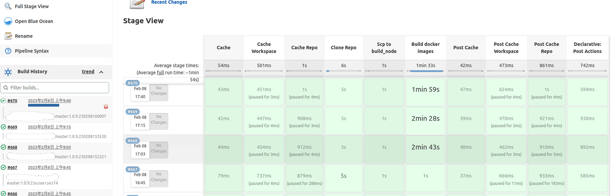

# 需求背景

接上文 [CRA 项目构建速度优化](/cra-project-build-speed-optimize/)

由下图可以看出此项目的 `Clone Repo`，`Scp to build_node` 耗时较长，需要优化


# 方案

目前是全量更新，需要改成增量更新

# 实现

## 原始版本

```groovy
gitlab_repo = "${params.gitlab_repo}"
def split = gitlab_repo.split("/")
def repo_name = split[1]
branch_name = "${params.branch_name}"
def split2 = branch_name.split("/")
def branch_last_name = split2[split2.length-1]
dockerhub_repo = "${params.dockerhub_repo}"
parameter = "${params.parameter}"
repo_url = "仓库地址"
use_cache = "${params.use_cache}"
cache_version ="${params.cache_version}"

def cache_arg = ""

if (use_cache == 'false') {
    cache_arg = "--no-cache"
}

build_node = "${params.build_node}"
build_node_ip = 'build机器地址'
clone_node = '部署机器标签'

import java.text.SimpleDateFormat;
def createVersion() {
    def dateUnix = ((new Date().time + 22800000) / 1000).intValue()
    Date dateObj =  new Date( ((long)dateUnix) * 1000 )
    String ymd = new SimpleDateFormat("yyMMddHHmmss").format(dateObj)
    return "${ymd}"
}
ymd = createVersion()
image_version = "1.0.9.${ymd}"

work_dir = "项目名称_${ymd}"

println("gitlab_repo branch=${gitlab_repo} ${branch_name}")
println("repo_name=${repo_name}, image_version=${image_version}")
println("dockerhub_repo=${dockerhub_repo}")
println("cache_arg=${cache_arg}")
println("cache_version=${cache_version}")

build_user=""
node{
    wrap([$class: 'BuildUser']) {
        build_user = env.BUILD_USER
    }
}
println("build_user=${build_user}")

default_description = "@${build_user} ${gitlab_repo} ${branch_name}:${image_version}"
currentBuild.description = "${default_description}"

pipeline {
    agent {
        node {
            label "${build_node}"
        }
    }

    environment {
        repo_name1 = "${repo_name}"
        branch_last_name1 = "${branch_last_name}"
    }

    stages {
        stage('Clean workspace') {
        agent {
            node {
                label "${build_node}"
            }
        }
         steps {
            sh """
                rm -fr /home/jenkins/workspace/apps/项目名称/${work_dir} || true
            """
        }
      }

      stage("Clone Repo"){
          agent {
             node {
                 label "${clone_node}" //'部署机器标签'
             }
         }
         steps {
            sh """
            cp /data/xmotors_ai_shared/sre/saved_repo/clone.sh .
            bash clone.sh ${gitlab_repo} ${branch_name} ${work_dir}
            ls -la
            cp /data/xmotors_ai_shared/sre/saved_repo/judge_has_master_commit.py ./
            /usr/bin/python3 judge_has_master_commit.py ${work_dir} 机器人webhook
            """
         }
      }

      stage("Scp to build_node") {
         agent {
             node {
                 label "${clone_node}" //'部署机器标签'
             }
         }
         steps {
            echo "Scp to ${build_node}/${build_node_ip}"
            sh """
                pwd
                rsync -Lrav --relative ${work_dir}/前端目录名称/ jenkins@${build_node_ip}:/home/jenkins/workspace/apps/项目名称/
                if [ \$? -ne 0 ]
                then
                    echo "Found some error when copy the repo"
                fi
                rm -fr ${work_dir} || true
            """
         }
      }

      stage('Build docker images') {
         agent {
             node {
                 label "${build_node}"
             }
         }
         steps {
             sh """
                if [ ! -f /home/jenkins/workspace/apps/项目名称/${work_dir}/前端目录名称/Dockerfile-client-buildkit ]
                then
                    echo "No available 前端目录名称/Dockerfile-client-buildkit in workspace"
                    exit 1
                fi

                cd /home/jenkins/workspace/apps/项目名称/${work_dir}/前端目录名称/
                # docker info
                docker -v
                DOCKER_BUILDKIT=1 docker build ${cache_arg} --build-arg=BUILDKIT_CACHE_MOUNT_NS=${cache_version} -t docker远程仓库地址/${dockerhub_repo}:${image_version} -f ./Dockerfile-client-buildkit .
                # docker build -t docker远程仓库地址/${dockerhub_repo}:${image_version} -f ./Dockerfile-client-buildkit .
                docker push docker远程仓库地址/${dockerhub_repo}:${image_version}
                pwd
                ls
                rm -fr /home/jenkins/workspace/apps/项目名称/${work_dir} || true
            """
        }
      }

      stage('Set tag') {
         agent {
             node {
                 label "${clone_node}" //'部署机器标签'
             }
         }
         steps {
             dir("${repo_name1}_${branch_name}"){
                sh """
                echo 'escape git tag'
                    #git tag -m "Build docker image ${image_version} for ${branch_name}/${image_version}" ${branch_name}/${image_version}
                    #git describe
                    #git push origin ${branch_name}/${image_version}
                rm -fr ${work_dir}
                """
             }
         }
      }

    }
    post {
        always {
            echo 'I have finished'
        }
        success {
            echo "build ${gitlab_repo} ${branch_name}:${image_version}, succeed!"
            sh """
            curl -X POST -H "Content-Type: application/json" -d '{"msg_type":"text","content":{"text":"@${build_user} 项目名称 notify: ${gitlab_repo} ${branch_name}:${image_version}, succeed!"}}' 机器人webhook
            """
        }
        failure {
            echo "build ${gitlab_repo} ${branch_name}:${image_version}, failed!"
            sh """
            curl -X POST -H "Content-Type: application/json" -d '{"msg_type":"text","content":{"text":"@${build_user} 项目名称 notify: ${gitlab_repo} ${branch_name}:${image_version}, failed!"}}' 机器人webhook
            """
        }
    }
}
```

## 版本一

1. 固定使用一个目录为缓存目录，拉取代码和构建代码都在这个缓存目录上
2. 利用 git 和 rsync 的增量更新
3. 不使用缓存时删除固定目录的缓存

```groovy{12,34,74-77,89-112,128-129,134,159-161}
gitlab_repo = "${params.gitlab_repo}"
def split = gitlab_repo.split("/")
def repo_name = split[1]
branch_name = "${params.branch_name}"
def split2 = branch_name.split("/")
def branch_last_name = split2[split2.length-1]
dockerhub_repo = "${params.dockerhub_repo}"
parameter = "${params.parameter}"
repo_url = "仓库地址"
use_cache = "${params.use_cache}"
cache_version ="${params.cache_version}"
is_cache_project = "${params.is_cache_project}"

def cache_arg = ""

if (use_cache == 'false') {
    cache_arg = "--no-cache"
}

build_node = "${params.build_node}"
build_node_ip = 'build机器地址'
clone_node = '部署机器标签'

import java.text.SimpleDateFormat;
def createVersion() {
    def dateUnix = ((new Date().time + 22800000) / 1000).intValue()
    Date dateObj =  new Date( ((long)dateUnix) * 1000 )
    String ymd = new SimpleDateFormat("yyMMddHHmmss").format(dateObj)
    return "${ymd}"
}
ymd = createVersion()
image_version = "1.0.9.${ymd}"

work_dir = "项目名称"

println("gitlab_repo branch=${gitlab_repo} ${branch_name}")
println("repo_name=${repo_name}, image_version=${image_version}")
println("dockerhub_repo=${dockerhub_repo}")
println("cache_arg=${cache_arg}")
println("cache_version=${cache_version}")

build_user=""
node{
    wrap([$class: 'BuildUser']) {
        build_user = env.BUILD_USER
    }
}
println("build_user=${build_user}")

default_description = "@${build_user} ${gitlab_repo} ${branch_name}:${image_version}"
currentBuild.description = "${default_description}"

pipeline {
    agent {
        node {
            label "${build_node}"
        }
    }

    environment {
        repo_name1 = "${repo_name}"
        branch_last_name1 = "${branch_last_name}"
    }

    stages {
      stage('Clean workspace') {
        agent {
            node {
                label "${build_node}"
            }
        }
         steps {
            sh """
            if [ ${is_cache_project} = 'false' ]
            then
               rm -fr /home/jenkins/workspace/apps/项目名称/${work_dir} || true
            fi
            """
        }
      }
      stage("Clone Repo"){
          agent {
             node {
                 label "${clone_node}" //'部署机器标签'
             }
         }
         steps {
            sh """
            # ls -la
            if [ ${is_cache_project} = 'false' ]
            then
               rm -rf ${work_dir} || true
            fi
            if [ ! -d ${work_dir} ]
            then
               cp /data/xmotors_ai_shared/sre/saved_repo/clone.sh .
               bash clone.sh ${gitlab_repo} ${branch_name} ${work_dir}
            else
               cd ${work_dir}
               # 1、为了让脚本检测，2、master 拉取最新
               git checkout master
               git pull origin master

               if [ ${branch_name} != 'master' ]
               then
                  git checkout ${branch_name}
                  # 强制拉取远程代码到本地
                  git pull --force origin ${branch_name}:${branch_name}
               fi
               cd ..
            fi
            # ls -la
            cp /data/xmotors_ai_shared/sre/saved_repo/judge_has_master_commit.py ./
            /usr/bin/python3 judge_has_master_commit.py ${work_dir} 机器人webhook
            """
         }
      }

      stage("Scp to build_node") {
         agent {
             node {
                 label "${clone_node}" //'部署机器标签'
             }
         }
         steps {
            echo "Scp to ${build_node}/${build_node_ip}"
            sh """
                # pwd
                rsync -Lazv -R ${work_dir}/前端目录名称/ jenkins@${build_node_ip}:/home/jenkins/workspace/apps/项目名称/
                if [ \$? -ne 0 ]
                then
                    echo "Found some error when copy the repo"
                fi
                # rm -fr ${work_dir} || true
            """
         }
      }

      stage('Build docker images') {
         agent {
             node {
                 label "${build_node}"
             }
         }
         steps {
             sh """
                if [ ! -f /home/jenkins/workspace/apps/项目名称/${work_dir}/前端目录名称/Dockerfile-client-buildkit ]
                then
                  echo "No available 前端目录名称/Dockerfile-client-buildkit in workspace"
                  exit 1
                fi

                cd /home/jenkins/workspace/apps/项目名称/${work_dir}/前端目录名称/
                # docker info
                # docker -v
                DOCKER_BUILDKIT=1 docker build ${cache_arg} --build-arg=BUILDKIT_CACHE_MOUNT_NS=${cache_version} -t docker远程仓库地址/${dockerhub_repo}:${image_version} -f ./Dockerfile-client-buildkit .
                # docker build -t docker远程仓库地址/${dockerhub_repo}:${image_version} -f ./Dockerfile-client-buildkit .
                docker push docker远程仓库地址/${dockerhub_repo}:${image_version}
                # pwd
                # ls
                # rm -fr /home/jenkins/workspace/apps/项目名称/${work_dir} || true
            """
        }
      }
   }

    post {
        always {
            echo 'I have finished'
        }
        success {
            echo "build ${gitlab_repo} ${branch_name}:${image_version}, succeed!"
            sh """
            curl -X POST -H "Content-Type: application/json" -d '{"msg_type":"text","content":{"text":"@${build_user} 项目名称 notify: ${gitlab_repo} ${branch_name}:${image_version}, succeed!"}}' 机器人webhook
            """
        }
        failure {
            echo "build ${gitlab_repo} ${branch_name}:${image_version}, failed!"
            sh """
            curl -X POST -H "Content-Type: application/json" -d '{"msg_type":"text","content":{"text":"@${build_user} 项目名称 notify: ${gitlab_repo} ${branch_name}:${image_version}, failed!"}}' 机器人webhook
            """
        }
    }
}
```

## 版本二

1. 固定使用一个目录为缓存目录，拷贝到带有新后缀的目录（拉取代码和构建代码的目录），和之前逻辑一样，解决并行执行问题
2. 不使用缓存时不拷贝到对应目录
3. 独立出缓存步骤，减少并行执行时带来的文件互操作问题
4. 修复非 master 分支时拉取代码的错误逻辑，强制更新远程代码到本地代码
5. rsync 添加 `-cr` 选项，去掉 `-a` 选项，即更新时只比较所有文件的校验和，不再通过文件的更新时间比较（即不需要通过 `-a` 传递所有的文件信息）

```groovy{34-35,75-87,100-112,138-140,161-162,206-214,227-234}
gitlab_repo = "${params.gitlab_repo}"
def split = gitlab_repo.split("/")
def repo_name = split[1]
branch_name = "${params.branch_name}"
def split2 = branch_name.split("/")
def branch_last_name = split2[split2.length-1]
dockerhub_repo = "${params.dockerhub_repo}"
parameter = "${params.parameter}"
repo_url = "仓库地址"
use_cache = "${params.use_cache}"
cache_version ="${params.cache_version}"
is_cache_project = "${params.is_cache_project}"

def cache_arg = ""

if (use_cache == 'false') {
    cache_arg = "--no-cache"
}

build_node = "${params.build_node}"
build_node_ip = 'build机器地址'
clone_node = '部署机器标签'

import java.text.SimpleDateFormat;
def createVersion() {
    def dateUnix = ((new Date().time + 22800000) / 1000).intValue()
    Date dateObj =  new Date( ((long)dateUnix) * 1000 )
    String ymd = new SimpleDateFormat("yyMMddHHmmss").format(dateObj)
    return "${ymd}"
}
ymd = createVersion()
image_version = "1.0.9.${ymd}"

work_dir = "项目名称_${ymd}"
work_cache_dir = "项目名称_cache"

println("gitlab_repo branch=${gitlab_repo} ${branch_name}")
println("repo_name=${repo_name}, image_version=${image_version}")
println("dockerhub_repo=${dockerhub_repo}")
println("cache_arg=${cache_arg}")
println("cache_version=${cache_version}")

build_user=""
node{
    wrap([$class: 'BuildUser']) {
        build_user = env.BUILD_USER
    }
}
println("build_user=${build_user}")

default_description = "@${build_user} ${gitlab_repo} ${branch_name}:${image_version}"
currentBuild.description = "${default_description}"

pipeline {
    agent {
        node {
            label "${build_node}"
        }
    }

    environment {
        repo_name1 = "${repo_name}"
        branch_last_name1 = "${branch_last_name}"
    }

    stages {
      stage('Cache Workspace') {
        agent {
            node {
                label "${build_node}"
            }
        }
         steps {
            sh """
                cd /home/jenkins/workspace/apps/项目名称/
                # rm -rf ${work_cache_dir}
                if [ ${is_cache_project} = 'true' ]
                then
                    if [ ! -d ${work_cache_dir} ]
                    then
                        echo "Cache Workspace not found"
                    else
                        cp -r ${work_cache_dir} ${work_dir}
                        cd ${work_dir} && ls
                        echo "Cache Workspace restore successful"
                    fi
                fi
            """
        }
      }

      stage('Cache Repo') {
        agent {
            node {
                label "${clone_node}"
            }
        }
         steps {
            sh """
                # vi clone.sh
                # rm -rf ${work_cache_dir}
                if [ ${is_cache_project} = 'true' ]
                then
                    if [ ! -d ${work_cache_dir} ]
                    then
                        echo "Cache Repo not found"
                    else
                        cp -r ${work_cache_dir} ${work_dir}
                        cd ${work_dir} && ls
                        echo "Cache Repo restore successful"
                    fi
                fi
            """
        }
      }

      stage("Clone Repo"){
          agent {
             node {
                 label "${clone_node}" //'部署机器标签'
             }
         }
         steps {
            sh """
            # ls -la
            if [ ! -d ${work_dir} ]
            then
                cp /data/xmotors_ai_shared/sre/saved_repo/clone.sh .
                bash clone.sh ${gitlab_repo} ${branch_name} ${work_dir}
            else
                cd ${work_dir}
                # 1、为了让脚本检测，2、master 拉取最新
                git checkout master
                git pull origin master

                if [ ${branch_name} != 'master' ]
                then
                    # 强制拉取远程代码到本地
                    git fetch --force origin ${branch_name}:${branch_name}
                    git checkout origin/${branch_name}
                fi
                cd ..
            fi
            # ls -la
            cp /data/xmotors_ai_shared/sre/saved_repo/judge_has_master_commit.py ./
            /usr/bin/python3 judge_has_master_commit.py ${work_dir} 机器人webhook
            """
         }
      }

      stage("Scp to build_node") {
         agent {
             node {
                 label "${clone_node}" //'部署机器标签'
             }
         }
         steps {
            echo "Scp to ${build_node}/${build_node_ip}"
            sh """
                # pwd
                # 这里的 -c 选项比较重要，比较校验和
                rsync -Lrzvc -R ${work_dir}/前端目录名称/ jenkins@${build_node_ip}:/home/jenkins/workspace/apps/项目名称/
                if [ \$? -ne 0 ]
                then
                    echo "Found some error when copy the repo"
                fi
                # rm -fr ${work_dir} || true
            """
         }
      }

      stage('Build docker images') {
         agent {
             node {
                 label "${build_node}"
             }
         }
         steps {
             sh """
                if [ ! -f /home/jenkins/workspace/apps/项目名称/${work_dir}/前端目录名称/Dockerfile-client-buildkit ]
                then
                    echo "No available 前端目录名称/Dockerfile-client-buildkit in workspace"
                    exit 1
                fi

                cd /home/jenkins/workspace/apps/项目名称/${work_dir}/前端目录名称/
                # docker info
                # docker -v
                DOCKER_BUILDKIT=1 docker build ${cache_arg} --build-arg=BUILDKIT_CACHE_MOUNT_NS=${cache_version} -t docker远程仓库地址/${dockerhub_repo}:${image_version} -f ./Dockerfile-client-buildkit .
                # docker build -t docker远程仓库地址/${dockerhub_repo}:${image_version} -f ./Dockerfile-client-buildkit .
                docker push docker远程仓库地址/${dockerhub_repo}:${image_version}
                # pwd
                # ls
            """
        }
      }

      stage('Post Cache Workspace') {
        agent {
            node {
                label "${build_node}"
            }
        }
         steps {
            sh """
                cd /home/jenkins/workspace/apps/项目名称/
                if [ ${is_cache_project} = 'true' ]
                then
                    rm -rf ${work_cache_dir}
                    mv ${work_dir} ${work_cache_dir}
                    echo 'Post Cache Workspace'
                else
                    rm -rf ${work_dir}
                fi
            """
        }
      }

      stage('Post Cache Repo') {
        agent {
            node {
                label "${clone_node}"
            }
        }
         steps {
            sh """
                if [ ${is_cache_project} = 'true' ]
                then
                    rm -rf ${work_cache_dir}
                    mv ${work_dir} ${work_cache_dir}
                    echo 'Post Cache Repo successful'
                else
                    rm -rf ${work_dir}
                fi
            """
        }
      }
    }

    post {
        always {
            echo 'I have finished'
        }
        success {
            echo "build ${gitlab_repo} ${branch_name}:${image_version}, succeed!"
            sh """
            curl -X POST -H "Content-Type: application/json" -d '{"msg_type":"text","content":{"text":"@${build_user} 项目名称 notify: ${gitlab_repo} ${branch_name}:${image_version}, succeed!"}}' 机器人webhook
            """
        }
        failure {
            echo "build ${gitlab_repo} ${branch_name}:${image_version}, failed!"
            sh """
            curl -X POST -H "Content-Type: application/json" -d '{"msg_type":"text","content":{"text":"@${build_user} 项目名称 notify: ${gitlab_repo} ${branch_name}:${image_version}, failed!"}}' 机器人webhook
            """
        }
    }
}
```

## 版本三

1. 缓存步骤并行执行
2. 对同一机器上的缓存操作时加锁，防止缓存失效
3. 因为运维那边对应的机器在同一时间执行时会在新的目录里面操作（会生成 `@2`，`＠3` 这样的目录），所以为了防止读不到缓存，需要在连接到机器时强制在同一目录里面操作

```groovy{67-77,79-91,97-104,106-120,137,172,193-194,222-230,245-256}
gitlab_repo = "${params.gitlab_repo}"
def split = gitlab_repo.split("/")
def repo_name = split[1]
branch_name = "${params.branch_name}"
def split2 = branch_name.split("/")
def branch_last_name = split2[split2.length-1]
dockerhub_repo = "${params.dockerhub_repo}"
parameter = "${params.parameter}"
repo_url = "仓库地址"
use_cache = "${params.use_cache}"
cache_version ="${params.cache_version}"
is_cache_project = "${params.is_cache_project}"

def cache_arg = ""

if (use_cache == 'false') {
    cache_arg = "--no-cache"
}

build_node = "${params.build_node}"
build_node_ip = 'build机器地址'
clone_node = '部署机器标签'

import java.text.SimpleDateFormat;
def createVersion() {
    def dateUnix = ((new Date().time + 22800000) / 1000).intValue()
    Date dateObj =  new Date( ((long)dateUnix) * 1000 )
    String ymd = new SimpleDateFormat("yyMMddHHmmss").format(dateObj)
    return "${ymd}"
}
ymd = createVersion()
image_version = "1.0.9.${ymd}"

work_dir = "项目名称_${ymd}"
work_cache_dir = "项目名称_cache"

println("gitlab_repo branch=${gitlab_repo} ${branch_name}")
println("repo_name=${repo_name}, image_version=${image_version}")
println("dockerhub_repo=${dockerhub_repo}")
println("cache_arg=${cache_arg}")
println("cache_version=${cache_version}")

build_user=""
node{
    wrap([$class: 'BuildUser']) {
        build_user = env.BUILD_USER
    }
}
println("build_user=${build_user}")

default_description = "@${build_user} ${gitlab_repo} ${branch_name}:${image_version}"
currentBuild.description = "${default_description}"

pipeline {
    agent {
        node {
            label "${build_node}"
        }
    }

    environment {
        repo_name1 = "${repo_name}"
        branch_last_name1 = "${branch_last_name}"
    }

    stages {
      stage ('Cache') {
         failFast true
         parallel {
            stage('Cache Workspace') {
                agent {
                    node {
                        label "${build_node}"
                    }
                }
                steps {
                    lock("lock-cache-workspace") {
                    sh """
                        cd /home/jenkins/workspace/apps/项目名称/
                        # rm -rf ${work_cache_dir}
                        if [ ${is_cache_project} = 'true' ]
                        then
                            if [ ! -d ${work_cache_dir} ]
                            then
                                echo "Cache Workspace not found"
                            else
                                cp -r ${work_cache_dir} ${work_dir}
                                cd ${work_dir} && ls
                                echo "Cache Workspace restore successful"
                            fi
                        fi
                    """
                    }
                }
            }

            stage('Cache Repo') {
                agent {
                    node {
                        label "${clone_node}"
                    }
                }
                steps {
                    lock("lock-cache-repo") {
                    sh """
                        # vi clone.sh
                        # 这里每次都要 cd 到具体路径，否则同一时间内执行默认会跑到别的目录下，比如 项目名称@2、项目名称@3 这种目录
                        cd /data/xmotors_ai_shared/sre/sre-workspace/workspace/项目名称
                        # rm -rf ${work_cache_dir}
                        if [ ${is_cache_project} = 'true' ]
                        then
                            if [ ! -d ${work_cache_dir} ]
                            then
                                echo "Cache Repo not found"
                            else
                                cp -r ${work_cache_dir} ${work_dir}
                                cd ${work_dir} && ls
                                echo "Cache Repo restore successful"
                            fi
                        fi
                    """
                    }
                }
            }
         }
      }

      stage("Clone Repo"){
         agent {
            node {
                label "${clone_node}" //'部署机器标签'
            }
         }
         steps {
            sh """
            # ls -la
            cd /data/xmotors_ai_shared/sre/sre-workspace/workspace/项目名称
            if [ ! -d ${work_dir} ]
            then
                cp /data/xmotors_ai_shared/sre/saved_repo/clone.sh .
                bash clone.sh ${gitlab_repo} ${branch_name} ${work_dir}
            else
                cd ${work_dir}
                # 1、为了让脚本检测，2、master 拉取最新
                git checkout master
                git pull origin master

                if [ ${branch_name} != 'master' ]
                then
                    # 强制拉取远程代码到本地
                    git fetch --force origin ${branch_name}:${branch_name}
                    git checkout origin/${branch_name}
                fi
                cd ..
            fi
            # ls -la
            cp /data/xmotors_ai_shared/sre/saved_repo/judge_has_master_commit.py ./
            /usr/bin/python3 judge_has_master_commit.py ${work_dir} 机器人webhook
            """
         }
      }

      stage("Scp to build_node") {
         agent {
             node {
                 label "${clone_node}" //'部署机器标签'
             }
         }
         steps {
            echo "Scp to ${build_node}/${build_node_ip}"
            sh """
                cd /data/xmotors_ai_shared/sre/sre-workspace/workspace/项目名称
                # pwd
                # 这里的 -c 选项比较重要，比较校验和
                rsync -Lrzvc -R ${work_dir}/前端目录名称/ jenkins@${build_node_ip}:/home/jenkins/workspace/apps/项目名称/
                if [ \$? -ne 0 ]
                then
                    echo "Found some error when copy the repo"
                fi
                # rm -fr ${work_dir} || true
            """
         }
      }

      stage('Build docker images') {
         agent {
             node {
                 label "${build_node}"
             }
         }
         steps {
            sh """
                cd /home/jenkins/workspace/apps/项目名称/${work_dir}/前端目录名称/
                if [ ! -f Dockerfile-client-buildkit ]
                then
                    echo "No available 前端目录名称/Dockerfile-client-buildkit in workspace"
                    exit 1
                fi
                # docker info
                # docker -v
                DOCKER_BUILDKIT=1 docker build ${cache_arg} --build-arg=BUILDKIT_CACHE_MOUNT_NS=${cache_version} -t docker远程仓库地址/${dockerhub_repo}:${image_version} -f ./Dockerfile-client-buildkit .
                # docker build -t docker远程仓库地址/${dockerhub_repo}:${image_version} -f ./Dockerfile-client-buildkit .
                docker push docker远程仓库地址/${dockerhub_repo}:${image_version}
                # pwd
                # ls
             """
        }
      }

      stage ('Post Cache') {
         failFast true
         parallel {
            stage('Post Cache Workspace') {
                agent {
                    node {
                        label "${build_node}"
                    }
                }
                steps {
                    lock("lock-cache-workspace") {
                    sh """
                        cd /home/jenkins/workspace/apps/项目名称/
                        if [ ${is_cache_project} = 'true' ]
                        then
                            rm -rf ${work_cache_dir}
                            mv ${work_dir} ${work_cache_dir}
                            echo 'Post Cache Workspace'
                        else
                            rm -rf ${work_dir}
                        fi
                    """
                    }
                }
            }

            stage('Post Cache Repo') {
                agent {
                    node {
                        label "${clone_node}"
                    }
                }
                steps {
                    lock("lock-cache-repo") {
                    sh """
                        cd /data/xmotors_ai_shared/sre/sre-workspace/workspace/项目名称
                        if [ ${is_cache_project} = 'true' ]
                        then
                            # 加锁的原因: 1.否则 cp 读缓存时没有缓存
                            rm -rf ${work_cache_dir}
                            # 这里存在竞争，后编译成功的重命名才有效，即使后编译的缓存也不太影响具体的增量更新逻辑
                            # 加锁的原因: 2.同时如果有另一个 job 在 mv 时，这里会移动到 work_cache_dir 目录下，而不是重命名
                            mv ${work_dir} ${work_cache_dir}
                            echo 'Post Cache Repo successful'
                        else
                            rm -rf ${work_dir}
                        fi
                    """
                    }
                }
            }
         }
      }
    }

    post {
        always {
            echo 'I have finished'
        }
        success {
            echo "build ${gitlab_repo} ${branch_name}:${image_version}, succeed!"
            sh """
            curl -X POST -H "Content-Type: application/json" -d '{"msg_type":"text","content":{"text":"@${build_user} 项目名称 notify: ${gitlab_repo} ${branch_name}:${image_version}, succeed!"}}' 机器人webhook
            """
        }
        failure {
            echo "build ${gitlab_repo} ${branch_name}:${image_version}, failed!"
            sh """
            curl -X POST -H "Content-Type: application/json" -d '{"msg_type":"text","content":{"text":"@${build_user} 项目名称 notify: ${gitlab_repo} ${branch_name}:${image_version}, failed!"}}' 机器人webhook
            """
        }
    }
}
```

## 版本四

1. 生成时间戳优化，因为现有的时间戳是精确到秒的，还是有产生冲突的概率，改成毫秒（更好的方式是生成唯一性的 id）

```groovy{25-26}
gitlab_repo = "${params.gitlab_repo}"
def split = gitlab_repo.split("/")
def repo_name = split[1]
branch_name = "${params.branch_name}"
def split2 = branch_name.split("/")
def branch_last_name = split2[split2.length-1]
dockerhub_repo = "${params.dockerhub_repo}"
parameter = "${params.parameter}"
repo_url = "仓库地址"
use_cache = "${params.use_cache}"
cache_version ="${params.cache_version}"
is_cache_project = "${params.is_cache_project}"

def cache_arg = ""

if (use_cache == 'false') {
    cache_arg = "--no-cache"
}

build_node = "${params.build_node}"
build_node_ip = 'build机器地址'
clone_node = '部署机器标签'

def createVersion() {
   long ymd = System.currentTimeMillis()
   return "${ymd}"
}
ymd = createVersion()
image_version = "1.0.9.${ymd}"

work_dir = "项目名称_${ymd}"
work_cache_dir = "项目名称_cache"

println("gitlab_repo branch=${gitlab_repo} ${branch_name}")
println("repo_name=${repo_name}, image_version=${image_version}")
println("dockerhub_repo=${dockerhub_repo}")
println("cache_arg=${cache_arg}")
println("cache_version=${cache_version}")

build_user=""
node{
    wrap([$class: 'BuildUser']) {
        build_user = env.BUILD_USER
    }
}
println("build_user=${build_user}")

default_description = "@${build_user} ${gitlab_repo} ${branch_name}:${image_version}"
currentBuild.description = "${default_description}"

pipeline {
    agent {
        node {
            label "${build_node}"
        }
    }

    environment {
        repo_name1 = "${repo_name}"
        branch_last_name1 = "${branch_last_name}"
    }

    stages {
      stage ('Cache') {
         failFast true
         parallel {
            stage('Cache Workspace') {
                agent {
                    node {
                        label "${build_node}"
                    }
                }
                steps {
                    lock("lock-cache-workspace") {
                    sh """
                        cd /home/jenkins/workspace/apps/项目名称/
                        # rm -rf ${work_cache_dir}
                        if [ ${is_cache_project} = 'true' ]
                        then
                            if [ ! -d ${work_cache_dir} ]
                            then
                                echo "Cache Workspace not found"
                            else
                                cp -r ${work_cache_dir} ${work_dir}
                                cd ${work_dir} && ls
                                echo "Cache Workspace restore successful"
                            fi
                        fi
                    """
                    }
                }
            }

            stage('Cache Repo') {
                agent {
                    node {
                        label "${clone_node}"
                    }
                }
                steps {
                    lock("lock-cache-repo") {
                    sh """
                        # vi clone.sh
                        # 这里每次都要 cd 到具体路径，否则同一时间内执行默认会跑到别的目录下，比如 项目名称@2、项目名称@3 这种目录
                        cd /data/xmotors_ai_shared/sre/sre-workspace/workspace/项目名称
                        # rm -rf ${work_cache_dir}
                        if [ ${is_cache_project} = 'true' ]
                        then
                            if [ ! -d ${work_cache_dir} ]
                            then
                                echo "Cache Repo not found"
                            else
                                cp -r ${work_cache_dir} ${work_dir}
                                cd ${work_dir} && ls
                                echo "Cache Repo restore successful"
                            fi
                        fi
                    """
                    }
                }
            }
         }
      }

      stage("Clone Repo"){
         agent {
            node {
                label "${clone_node}" //'部署机器标签'
            }
         }
         steps {
            sh """
            # ls -la
            cd /data/xmotors_ai_shared/sre/sre-workspace/workspace/项目名称
            if [ ! -d ${work_dir} ]
            then
                cp /data/xmotors_ai_shared/sre/saved_repo/clone.sh .
                bash clone.sh ${gitlab_repo} ${branch_name} ${work_dir}
            else
                cd ${work_dir}
                # 1、为了让脚本检测，2、master 拉取最新
                git checkout master
                git pull origin master

                if [ ${branch_name} != 'master' ]
                then
                    # 强制拉取远程代码到本地
                    git fetch --force origin ${branch_name}:${branch_name}
                    git checkout origin/${branch_name}
                fi
                cd ..
            fi
            # ls -la
            cp /data/xmotors_ai_shared/sre/saved_repo/judge_has_master_commit.py ./
            /usr/bin/python3 judge_has_master_commit.py ${work_dir} 机器人webhook
            """
         }
      }

      stage("Scp to build_node") {
         agent {
             node {
                 label "${clone_node}" //'部署机器标签'
             }
         }
         steps {
            echo "Scp to ${build_node}/${build_node_ip}"
            sh """
                cd /data/xmotors_ai_shared/sre/sre-workspace/workspace/项目名称
                # pwd
                # 这里的 -c 选项比较重要，比较校验和
                rsync -Lrzvc -R ${work_dir}/前端目录名称/ jenkins@${build_node_ip}:/home/jenkins/workspace/apps/项目名称/
                if [ \$? -ne 0 ]
                then
                    echo "Found some error when copy the repo"
                fi
                # rm -fr ${work_dir} || true
            """
         }
      }

      stage('Build docker images') {
         agent {
             node {
                 label "${build_node}"
             }
         }
         steps {
            sh """
                cd /home/jenkins/workspace/apps/项目名称/${work_dir}/前端目录名称/
                if [ ! -f Dockerfile-client-buildkit ]
                then
                    echo "No available 前端目录名称/Dockerfile-client-buildkit in workspace"
                    exit 1
                fi
                # docker info
                # docker -v
                DOCKER_BUILDKIT=1 docker build ${cache_arg} --build-arg=BUILDKIT_CACHE_MOUNT_NS=${cache_version} -t docker远程仓库地址/${dockerhub_repo}:${image_version} -f ./Dockerfile-client-buildkit .
                # docker build -t docker远程仓库地址/${dockerhub_repo}:${image_version} -f ./Dockerfile-client-buildkit .
                docker push docker远程仓库地址/${dockerhub_repo}:${image_version}
                # pwd
                # ls
             """
        }
      }

      stage ('Post Cache') {
         failFast true
         parallel {
            stage('Post Cache Workspace') {
                agent {
                    node {
                        label "${build_node}"
                    }
                }
                steps {
                    lock("lock-cache-workspace") {
                    sh """
                        cd /home/jenkins/workspace/apps/项目名称/
                        if [ ${is_cache_project} = 'true' ]
                        then
                            rm -rf ${work_cache_dir}
                            mv ${work_dir} ${work_cache_dir}
                            echo 'Post Cache Workspace'
                        else
                            rm -rf ${work_dir}
                        fi
                    """
                    }
                }
            }

            stage('Post Cache Repo') {
                agent {
                    node {
                        label "${clone_node}"
                    }
                }
                steps {
                    lock("lock-cache-repo") {
                    sh """
                        cd /data/xmotors_ai_shared/sre/sre-workspace/workspace/项目名称
                        if [ ${is_cache_project} = 'true' ]
                        then
                            # 加锁的原因: 1.否则 cp 读缓存时没有缓存
                            rm -rf ${work_cache_dir}
                            # 这里存在竞争，后编译成功的重命名才有效，即使后编译的缓存也不太影响具体的增量更新逻辑
                            # 加锁的原因: 2.同时如果有另一个 job 在 mv 时，这里会移动到 work_cache_dir 目录下，而不是重命名
                            mv ${work_dir} ${work_cache_dir}
                            echo 'Post Cache Repo successful'
                        else
                            rm -rf ${work_dir}
                        fi
                    """
                    }
                }
            }
         }
      }
    }

    post {
        always {
            echo 'I have finished'
        }
        success {
            echo "build ${gitlab_repo} ${branch_name}:${image_version}, succeed!"
            sh """
            curl -X POST -H "Content-Type: application/json" -d '{"msg_type":"text","content":{"text":"@${build_user} 项目名称 notify: ${gitlab_repo} ${branch_name}:${image_version}, succeed!"}}' 机器人webhook
            """
        }
        failure {
            echo "build ${gitlab_repo} ${branch_name}:${image_version}, failed!"
            sh """
            curl -X POST -H "Content-Type: application/json" -d '{"msg_type":"text","content":{"text":"@${build_user} 项目名称 notify: ${gitlab_repo} ${branch_name}:${image_version}, failed!"}}' 机器人webhook
            """
        }
    }
}
```

# 优化效果



# 后期展望

1. 后端 jenkins 增量构建优化
2. gitlab 发布评论触发 jenkins 等环境的一键部署
3. [webpack 懒编译](https://github.com/towavephone/webpack-lazy-build-demo)，模仿 webpack5 与 vite 的懒编译思路
4. [rust 相关前端工具链](https://github.com/i5ting/learn-rust-for-fe)，例如 Bun，Next.js，swc，Turbopack
