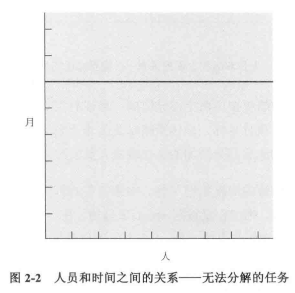
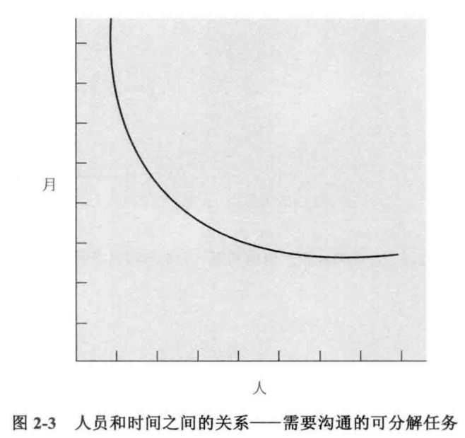

# 焦油坑

## 编程系统产品

图 1-1 的左上是程序，本身是完整的，可以在作者开发的系统平台上运行。它通常是车库中产出的产品，以及作为单个程序员生产率的评估标准

有 2 种途径可以使程序转变成更有用但成本更高的产物，这 2 种途径表现为图中的边界

水平边界以下，程序转变为编程产品，这是可以被任何人运行、测试、修复和拓展的程序。相同功能的编程产品的成本，至少是已调试程序成本的 3 倍

垂直边界的右边，程序转变为编程系统中的一个构件单元。它是在功能上能相互协作、具有规范的格式、可以进行交互的程序集合，并可以用来组装和搭建整个系统。相同功能编程系统构件的成本至少是独立程序的 3 倍，如果系统有大量的组成单元，成本还会更高

右下部分代表编程系统产品，与以上所有简单的程序不同的是，它的成本高达 9 倍。然后只有它才是真正有用的产品，是大多数系统开发的目标

## 职业的乐趣

1. 创建事物的纯粹快乐
2. 来自于开发对他人有用的东西
3. 来自于整个过程体现出的魅力——将各种零部件组装在一起，看到它们以精妙的方式运行，并收到了预期的效果
4. 是持续学习的快乐，来自于这项工作的非重复特性
5. 在易于驾驭的介质上工作

## 职业的苦恼

1. 追求完美
2. 由他人设定目标、供给资源和提供信息，很少能控制工作环境与目标。典型表现为对其他人的依赖，而被依赖人的程序往往有各种问题，所以需要对其进行研究、修改，而它们在理想情况下本应该是可靠完整的
3. 概念性设计是有趣的，但寻找 bug 却是一项重复性活动。bug 往往有二次方的复杂度，导致测试一拖再拖，寻找最后一个错误比第一个错误将花费更多时间
4. 当花费了劳动，产品在即将完成或者终于完成的时候，却已显得陈旧过时

# 人月神话

导致项目滞后的最主要原因是什么？

1. 对估算技术缺乏有效的研究，反映了一个虚假的假设——一切都将运行良好
2. 隐含的假设人和月可以互相转换，错误的将进度与工作量相互混淆
3. 由于对自己的估算缺乏信心，软件经理通常不会有耐心持续估算这项工作
4. 对进度缺少跟踪与监督
5. 意识到进度偏移时，下意识的反应是增加人力

## 乐观主义

一个错误的假设：一切都将运行良好，每一项任务仅花费它“应该”花费的时间

由于计算机编程是易于掌握的介质，相对于物理介质。我们期待在实现过程中不会遇到困难，而构思有缺陷的情况下，总会发现 bug

大型的编程工作或多或少的包含了很多任务，某些任务还有前后次序，从而一切正常的概率非常小，甚至接近于 0

## 人月

另一个错误的思考方式是在估计和进度安排中使用的工作量单位：人月。成本的确随开发产品的人数和时间的不同，有着很大的变化，进度却不是这样。

人数和时间的转换仅仅适用于以下情况：某个任务可以分解给参与人员，并且之间不需要相互的交流

当任务由于次序上的限制不能分解时，人手的添加对进度没有帮助

对于可以分解，但子任务之间需要沟通交流的任务，必须在计划中考虑沟通的工作量。因此在相同人月的前提下，采用增加人手来减少时间得到的最好情况，还是比未调整前差一些

## 系统测试

对于软件任务的进度安排，以下是经验法则

- 1/3 计划
- 1/6 编码
- 1/4 构件测试和早期系统测试
- 1/4 系统测试，所有的构件已完成

和传统进度安排的不同点在于：

1. 分配给计划的时间比平常的多，其只是包含计划规格说明，并不包含预研部分
2. 对所完成的代码调试、测试投入近一半的时间
3. 容易估计的部分如编码，分配了很少时间

## 空泛的估算

开发并推行生产率图表、缺陷率图表、估算规则或者在这些数据出来之前，项目经理需要坚持自己的经验直觉

## 重复产生的进度灾难

推荐的解决方式是重新安排进度或者削减任务（在延期成本非常高的情况下）

向进度落后的项目中增加人手，只会使进度更加落后

# 外科手术队伍

## 问题

对于效率和概念的完整性来说，最好由少数干练的人员来设计开发，而对于大型系统，则需要人手，以便产品在时间上满足要求

## Mills 的建议

Mils 建议大型项目的每一个部分由一个团队解决，由一个人完成问题的分解，其他人给予他需要的支持，以提高效率和生产力

外科医生即首席程序员，亲自定义功能和性能说明书，设计程序，编制源代码，测试以及书写技术文档。

副手，能完成任何一部分工作，但是相对经验较少，主要作用是作为设计的思考者、讨论者和评估人员

管理员，是外科手术的老板，必须在人员、薪酬、办公空间等方面有决定权，是充当与组织中其他管理机构的接口

编辑，外科医生负责文档的生成，他必须创建各种文档，而编辑根据外科医生的草稿或口述，进行分析和重新组织，提供各种参考信息和书目，对多个版本就行维护，监督文档生成的机制

2 个文秘，管理员与编辑每个人需要一个文秘，管理员的文秘负责非产品文件和使项目协作一致

程序职员，负责维护编程产品库中所有团队的技术记录。该职员接受文秘性质的培训，承担机器码文件和可读文件的相关管理责任

工具维护人员，保证基础服务的可靠性，以及承担团队成员所需要的特殊工具

测试人员，为各个功能设计测试用例、测试数据，负责计划测试的步骤和为单元测试搭建测试平台

语言专家，不同于外科医生，外科医生主要是系统设计者以及考虑系统的整体表现，而语言专家则寻找一种简洁、有效的使用语言的方法来解决复杂的问题，他通常需要对一些技术进行一些研究

## 如何运作

1. 和传统 2 人队伍区别：传统的队伍将工作进行划分，每人负责一部分工作的设计和实现。在外科手术团队中，外科医生与副手都了解所有的设计和全部的代码
2. 遇到冲突时外科手术团队可以由外科医生单方面来统一
3. 团队中剩余人员职能的专业化分工是高效的关键，减少了之间的交流

## 团队的扩建

整个系统必须具备概念上的完整性，需要有一个系统结构师自上而下的进行所有的设计，必须清晰的划分体系结构设计和实现之间的界线
