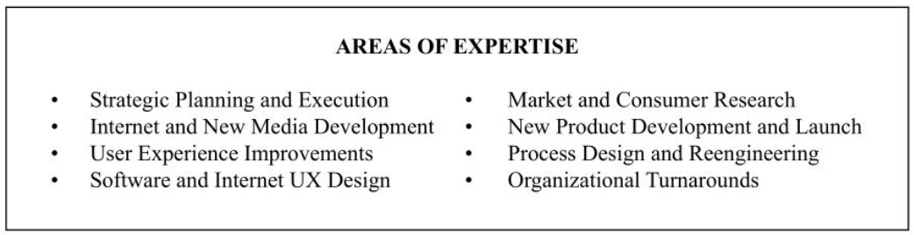
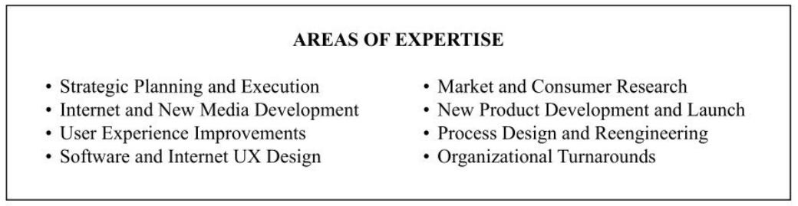
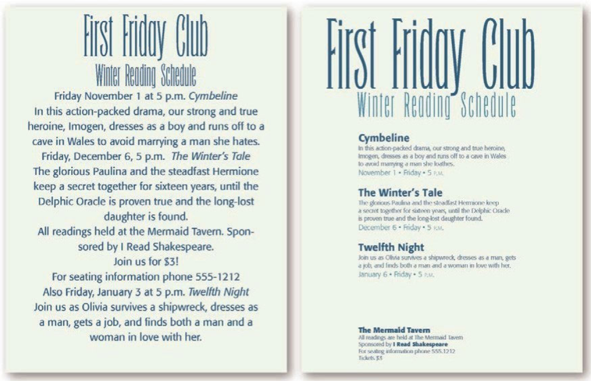

# 设计原则

## 引言

### 对比（Contrast）

对比的基本思想是，要避免页面上的元素太过相似。如果元素（字体、颜色、大小、线宽、形状、空间等）不相同，那就干脆让它们截然不同。要让页面引人注目，对比通常是最重要的一个因素，正是它能使读者首先看这个页面。

### 重复（Repetition）

让设计中的视觉要素在整个作品中重复出现。可以重复颜色、形状、材质、空间关系、线宽、字体、大小和图片，等等。这样一来，既能增加条理性，还可以加强统一性。

### 对齐（Alignment）

任何东西都不能在页面上随意安放。每个元素都应当与页面上的另一个元素有某种视觉联系。这样能建立一种清晰、精巧而且清爽的外观。

### 亲密性（Proximity）

彼此相关的项应当靠近，归组在一起。如果多个项相互之间存在很近的亲密性，它们就会成为一个视觉单元，而不是多个孤立的元素。这有助于组织信息，减少混乱，为读者提供清晰的结构。

## 亲密性

### 案例一

来看看下面这个企业名片的布局，这是一种很典型的布局。在这样小的空间里你看到多少个单独的元素？你的眼睛要停下来多少次才能看全这张名片上的所有信息？

名片上的每一项看上去都与其他任何项没有关联。这样一来，首先不清楚从哪里开始读名片，另外不知道何时才算结束。如果对这张企业名片做一点调整——把相关的元素分在一组，使它们建立更近的亲密性，看看会发生什么。

#### 总结

如果多个项相互之间有很近的亲密性，它们就会成为一个视觉单元，而不是多个孤立的元素。就像实际生活中一样，亲密性（即紧密性）意味着存在关联。

如果把类似的元素组织为一个单元，马上会带来很多变化。首先，页面会变得更有条理。其次，你会清楚地知道从哪里开始读信息，而且明白什么时候结束。另外，“空白”（字母以外的空间）也会变得更有组织。

### 案例二

请注意这两栏中的项目符号，看看它们和相关联的项目间的距离。中间的项目符号事实上离有些左栏的项目更近。看起来几乎就像是 4 个单独的列一样，其中有两列是项目符号。

现在关系就清晰了，我们可以立刻分辨出哪些项目符号属于哪些项目，也可以马上看出有两列项目清单，而不是一列项目符号，一些信息，一列项目符号，再来更多的信息。

数字看起来就像是一个单独的单元，与文字无关。

当数字和信息靠得更近时，我们就能发现数字和文字之间的关系了。

#### 总结

亲密性的使用很微妙，不过相当重要。布局的时候一定要明确元素和其所属元属是否在一起，留意无关元素。

### 案例三

这张明信片看起来很平淡，没有任何东西能吸引你来看一看正文，或许，除了那两颗心。但是更关键的是，需要一分钟才能找到真正重要的信息。

不用改变很多（不过，需要改变的还有不少，详见后面章节），只要把有关联的元素放在一起，然后在不同单元间增加合适的空间，就让信息变得更直观。

#### 总结

将类似的项归为一组来建立很近的亲密性时，有时需要做一些修改，如需要调整文本的大小或字体粗细，或者要改变图片的大小或放置位置，等等。正文（所读内容的主干部分）的字号不一定非得是 12 磅！期号和新闻简报发行年份等正文的辅助信息，可以占据相当小的位置。

### 案例四

找到至少 8 个让第二个例子看起来更加专业的不同。

不看正文来回答这个问题，左右图分别组织了多少场读书会？

我们看一眼就能回答右边的传单上列了多少场读书会，因为每场读书会的信息都被归入有逻辑的亲密关系中（另外，活动名称现在加粗了，使用的是对比原则）。请注意，三场读书会之间的空白是相同的，显示出这三组之间有某些关系。就算文本字号小到不能阅读，你也马上就能知道有三个活动。

虽然传单底部的小块文字小到无法阅读，你也知道那是什么，对不对？一定是售票信息和联系方式。你马上就知道这个单元并不是另一场活动，因为它和其他区块之间的亲密性是不同的。首先，根据理解对信息进行分组（这个工作心算完成，也可以在纸上把想法简单画出来）；你知道该怎么办。然后在页面上对文本进行实际分组。

#### 总结

亲密性原则并不是说所有一切都要更靠近，其真正的含义是：如果某些元素在理解上存在关联，或者相互之间存在某种关系，那么这些元素在视觉上也应当有关联。除此以外，其他孤立的元素或元素组则不应存在亲密性。位置是否靠近可以体现出元素之间是否存在关系。
