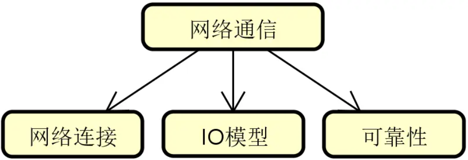
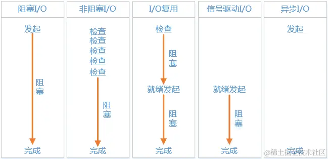
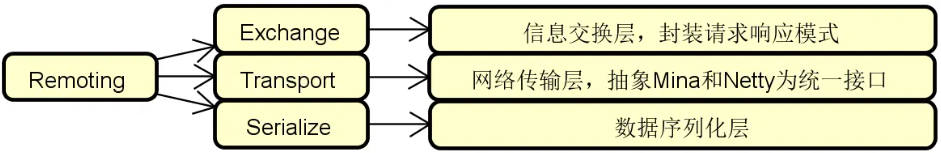
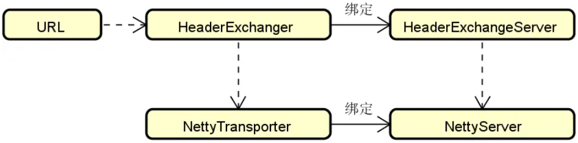
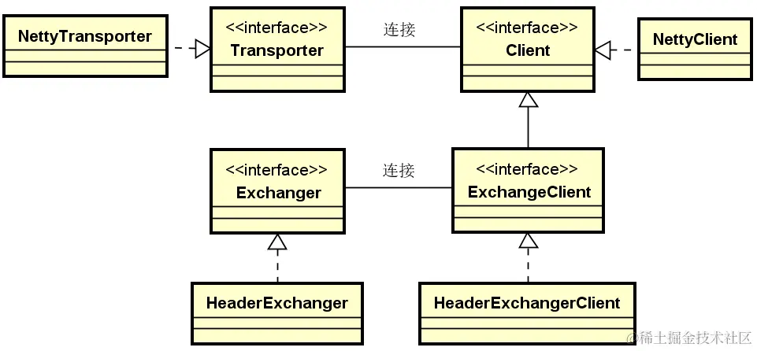
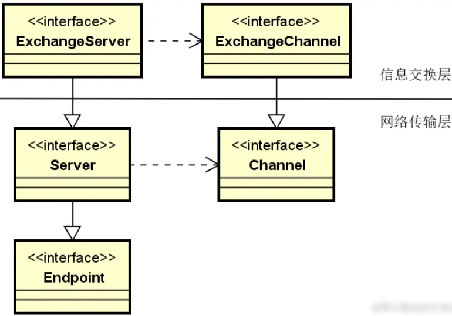
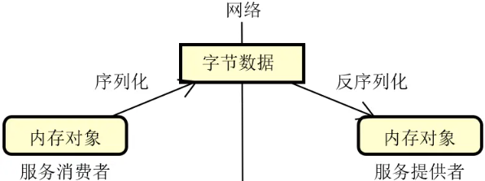
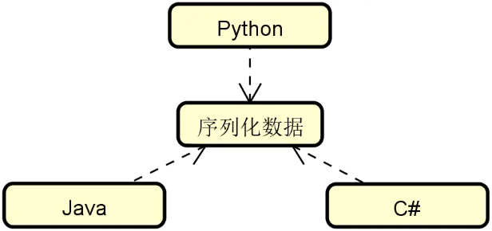
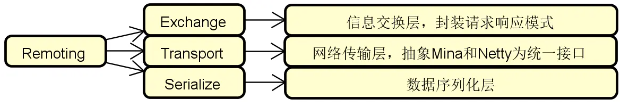
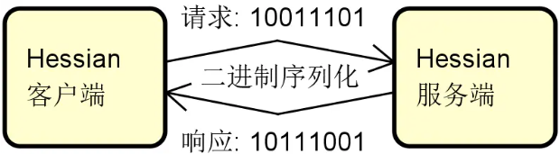

# 分布式系统、单体系统区别

分布式系统是对单体系统的一种改进，但这种改进同样也带来了复杂度和实现难度。

## 背景

单体系统是包含一个物理组件的系统，能够独立进行部署和运行。可以看到在单体系统内部可以采用分层的方式合理组织代码结构，但从物理上看就是一个能够独立运行的应用程序。


存在以下情况不能应对：

1. 业务复杂度和产品迭代速度
2. 处理高并发、大数据量的用户请求
3. 代码维护和团队协作

但是分布式系统引入了新问题

1. 网络传输的三态性
2. 数据的一致性
3. 可用性

## 技术体系

### 单体系统的核心问题

单体系统的核心问题表现在三个方面

1. 业务扩展性：任何业务的调整都需要发布整个系统，改一个地方就要重新构建、发布整个系统
2. 性能伸缩性：动态扩容对单体系统而言效率低下，如果通过简单扩容就能确保系统性能得到等比例提升，那么该系统就具备良好的伸缩性。对于单体系统来说，由于不同功能都在里面，即内存密集型和 CPU 密集型的代码都位于同一个服务器上，所以很难做到对资源的充分利用，如下图每个组件对资源利用率不同，无法针对组件级别进行资源利用率的提升

   

3. 代码复杂度：修改一处代码容易引发连锁问题，不同组件间边界模糊，由于代码复杂度导致的系统缺陷会触发很多连锁问题

### 分布式系统的本质特性

区别于单体系统，分布式系统会将整个系统拆分成多个能够独立运行的服务，这些服务在物理上是隔离的，相互之间基于网络进行通信和协调

下图展示的就是现实场景中常见的一种分布式系统，可以看到这里有专门针对业务处理的业务服务 1 和业务服务 2 这两个独立的服务，也存在 Web 服务、消息中间件、缓存等提供技术能力的独立组件


想要实现分布式系统，首要的就是完成对系统中各个服务的合理拆分。通常，我们有两种主流的拆分方式，即纵向（Vertical）拆分和横向（Horizontal）拆分

可以认为纵向拆分的目的就是更好地完成对系统中业务服务的合理组织。围绕一个完整而复杂的业务执行流程，我们通常可以根据不同的业务场景以及数据属性来完成对业务服务的拆分。例如，在常见的互联网医院系统中，具备最基本的医生、患者以及问诊等业务处理场景和数据，这时候我们就可以基于这些场景和数据来分别提取独立的业务服务，如下图所示


介绍完纵向拆分，我们再来看横向拆分。横向拆分的切入点在于复用，即我们在提取一系列独立服务的同时，还需要考虑通过一定的手段将它们高效地整合在一起。这样，整个系统就可以像是在搭积木一样对各个服务进行排列组合，如下图所示：


在上图中，我们注意到引入了一个分布式服务框架。通过该框架，系统中的医生服务、患者服务等一系列独立服务就可以进行合理地编排和整合，从而构建业务 A、业务 B 等不同的业务场景。显然，分布式服务框架在这里扮演了重要作用，而后续内容中所要介绍的 Dubbo 和 Spring Cloud 就是目前主流的分布式服务框架。

请注意，分布式系统相较于单体系统而言具备优势的同时，也存在一些我们不得不考虑的特性，包括以下

- 网络传输的三态性

   我们知道对于单体系统中的函数式方法调用而言，只有“成功”或“失败”这两种状态。但是分布式系统则不同，因为远程请求是通过网络进行传输的，而网络在处理请求时还会出现"超时"这个状态，这样就相当于有三个状态。

   显然，网络传输的三态性为系统开发带来新的挑战。面对超时状态，我们不能简单把它处理成是一种成功或失败，而是要具体场景具体分析，避免出现请求丢失或请求重复发送现象。在分布式系统设计过程中，我们需要考虑这种由于网络通信所导致的用户体验问题。

- 请求的容错性

   从错误发生的几率而言，分布式系统显然比单体系统更加容易出错，因为系统的调用链路变得更长、更复杂。每个分布式服务自身可能会发生异常，而这种异常在整个调用链路上会进行扩散，最终可能导致整个系统都不可用。

   在分布式系统设计过程中，一大挑战就是需要确保部分服务的异常情况不会影响到整个系统的可用性。

- 系统的异构性

   分布式系统的异构性很好理解，原则上，每个服务都可以采用一套完全不同的技术体系来进行实现，只要它们对外暴露接口是统一的。但是，因为技术异构性的存在，会增加分布式系统的开发难度和维护成本。

- 数据的一致性

   在分布式系统中，各个服务通常都会构建属于自身的数据库，这样就会导致业务数据无法进行集中管理，也就无法通过传统的事务机制确保它们之间的一致性。如何实现数据的一致性是分布式系统构建过程的一大难点。

以上几点是分布式系统的基本特性，我们无法避免，只能想办法进行利用和管理，这就给我们设计和实现分布式系统提出了挑战。

## 解题要点

通过对单体系统的核心问题和分布式系统本质特性的分析，我们明确了一点，即从技术演进角度讲，分布式系统的诞生是单体系统发展的必然结果。因此，在回答这类问题时，对于技术演进的背景和需求的讨论是我们的第一点回答思路。这部分内容通常不用过多展开，我们可以结合日常开发场景，从业务需求和技术需求角度简要介绍即可。

针对该类问题的第二点解答思路在于充分利用逻辑性和对比性。从面试题的考查方式而言，这是一道典型的对比类面试题。因此，针对如何介绍两个不同事物之间的差异，我们需要采用一定的逻辑性。一种比较容易掌握的技巧是：先抛出一个应用场景，然后分别对两种事物的正反面进行展开讨论。举例来说，如果我们想要阐述扩展性这一应用场景，那么对于单体系统而言，因为没有合理的业务边界和拆分策略，扩展性就很难保证；而对于分布式系统而言，通过引入合理的纵向/横向拆分机制就可以很好地解决这一问题。

虽然这是一道概念类的面试题，但也不要忘记在回答过程中提及一定的实践内容。对于面试过程而言，不管是怎么样的面试题，面试官都希望从候选人身上看到相关的实践经验。因此，最后一个解题的要点，就是建议你可以从日常开发过程出发，基于分布式系统的拆分和集成、请求容错性的实现、数据一致性的不同应对策略等角度，谈谈自己对分布式系统构建的一些思考和总结，相信是很好的加分项。

## 总结

我们已经提到了分布式系统所具备的一组本质特性，也强调了我们需要对这些特性进行合理的应用和管理。为此，我们需要进一步梳理分布式系统开发过程中的技术组件。那么，实现分布式系统应该具备哪些核心技术组件呢？

# 实现分布式系统应该具备哪些核心技术组件？

## 背景

分布式服务是构建分布式系统的基础，可以认为，任何一个分布式系统都是有若干个独立的服务所构成，这些服务通过网络通信实现相互调用，从而完成复杂的业务处理流程。


虽然，上图看起来并不复杂，但想要实现一套高性能、高可用、高扩展的分布式服务体系绝非易事。在日常开发过程中，我们在设计和实现分布式系统时需要系统梳理构建分布式服务的各个技术组件。而在实际的面试过程中这也是非常常见的一个面试问题，考查了候选人对分布式服务相关技术概念以及对应实现方案的理解程度。

从面试角度讲，涉及分布式服务技术组件的知识体系非常广泛，所以可以认为这是一道发散型的面试题，面试官想要的并不是一个标准答案，而是看候选人对这一主题理解的深度和广度。针对面试不同岗位的候选者，面试官的要求是不一样的，判断的标准也或有所不同。

## 问题分析

相信只要你开发过分布式系统，基本上都能对构建分布式服务所需要的技术组件说出个一二三来，比方说网络通信、远程调用。你可能也会提到负载均衡、集群容错这些更为复杂的名词。事实上，分布式服务的技术组件之间是有一定的逻辑关系的，有些组件能够独立运行，而有些组件则是构建在另一些组件的基础之上。比较典型的例子就是：配置中心的运行往往需要注册中心的支持，而服务容错则依赖于负载均衡的实现。

另一方面，对于分布式服务而言，组件与组件之间的定位也有所区别。有些是必备组件，缺少了它们系统就无法运行。有些则是扩展性组件，比较典型的就是前面提到的配置中心，原则上我们不使用配置中心也照样可以构建分布式系统。而还有一些则是通用型组件，这些组件并不局限于只能用于构建分布式服务，例如动态代理组件。

在面试过程中，关于这道题的问法其实有很多种，常见的包括：

- 如果想实现一套远程过程调用机制，你会重点设计哪几个技术组件？
- 负载均衡机制是如何与集群容错机制整合在一起的？
- 想要实现服务容错，有哪些技术手段？
- 微服务架构中，配置中心是如何与注册中心进行交互的？
- 为什么在分布式系统中，处处是代理？
- 在分布式服务构建过程中，经常用到的架构模式有哪些？

这些问题虽然问法各异，但考查的都是候选人对分布式服务中核心组件的理解程度。通过这样的分析，我们发现这一问题的难点在于我们要回答的概念有很多，而这些概念却又比较零散。当我们面对这种发散型面试题时，应对的方式绝对不能发散。单纯做零散的概念性阐述，往往很难得到面试官的认可，因为面试官会觉得你是刚接触分布式服务，没有自己的思考和体系。

应对这一问题的基本思路是要具备完整的技术认知，然后能够用自己的语言对各个组件的组成结构和基本原理做一定的展开，这样的话这道题应对起来就会比较自如。

因此，接下来我们就一起系统梳理该问题背后的技术体系。

## 技术体系

在分布式服务的开发过程中，开发人员需要应用到一批技术组件。按照这些技术组件的不同定位，我们把它们分成三大类，即远程过程调用组件、微服务构建组件和通用技术组件，如下图所示：


接下来，我们将对上图中的每一个技术组件做展开，从而为本课程后续内容的学习打好基础。

### 远程过程调用组件

远程过程调用是分布式服务最基础的实现技术，开发人员需要从网络通信、远程调用、负载均衡、服务容错以及服务降级这五个维度来进行系统的理解。

1. 网络通信：网络通信是一切分布式操作的基础。当客户端和服务器端建立网络连接之后就可以相互发送消息。但围绕网络通信整个过程，事情并没有那么简单。我们需要考虑网络通信的性能、可靠性以及在通信过程中实现数据传输的方式，这就涉及到 IO 模型、可靠性设计以及序列化方式等一系列技术主题。
2. 远程调用：远程调用解决的问题是如何发布远程服务以及如何引用远程服务。一旦服务发布成功，就相当于构建了一个有效的网络连接，并通过启动监听端口来对外暴露服务访问的入口；而服务引用则是一个向目标监听端点发起请求并获取响应结果的执行过程，如下图所示：

   

   在服务调用过程中，远程调用本地化是基本要求，即远程调用过程的实现对于开发人员而言应该是透明的。同时，我们也需要考虑同步调用、异步调用以及同步转异步调用等一系列具体的调用实现策略。

3. 负载均衡：所谓负载均衡，简单讲就是将请求按照一定的策略分摊到多个服务实例上进行执行，基本结构如下图所示：

   

   负载均衡在实现上可以使用硬件、软件或者两者兼有。而针对软件负载均衡，也可以分成服务器端负载均衡和客户端负载均衡两大类。在分布式服务构建过程中，我们主要的讨论对象是基于软件的客户端负载均衡机制。例如，目前主流的微服务架构实现框架 Spring Cloud、Dubbo 等都内置了完整的客户端负载均衡模块。

   另一方面，负载均衡算法决定了对请求进行分发的效果。负载均衡算法有很多，可以分成静态和动态两个大类，它们之间的区别在于动态算法依赖于当前服务的运行时状态，这些状态信息通常包括服务过去一段时间的平均调用时延和所承接的连接数等。

4. 服务容错：在分布式环境中，服务访问出错了该怎么办？这就涉及到服务可靠性问题。服务可靠性是分布式服务构建过程中的一项关键要素，我们需要引入容错思想和机制。常见的服务容错技术包括集群容错、服务熔断（Circuit Breaker）和服务回退（Fallback）等。下图展示的是添加了服务容错机制的系统架构演进过程：

   

5. 服务降级：从概念上讲，任何一个服务都是可以分等级的。具体的服务分级方法因业务场景和需求而定。一旦我们实现了对服务的针对性分级，那么就可以对那些处于业务链路最外围、等级最低的服务开始执行降级。至于如何对服务进行分级，可以按照需求采取一定的策略，例如常见的三级分类策略，如下图所示：


在上图中，一级服务属于核心服务，需要确保高可用，不能执行降级操作；二级服务通常采用的是异步交互方式，容忍暂时的数据不一致性；而三级服务则可以按需对整个服务实行降级操作。

### 微服务构建组件

在远程过程调用组件的基础上，我们继续讨论微服务构建组件，包括注册中心、服务网关、配置中心、消息通信和链路跟踪。这些组件扩展了分布式技术能力，为构建大规模分布式系统提供了技术保障。

1. 注册中心：在分布式服务构建过程中，服务与服务之间通过远程调用完成业务链路的构建。而在服务调用之前，我们首先需要发现服务，即解决在分布式集群环境下如何找到目标服务实例这一问题。服务发现和调用构成了服务交互的基础，整体流程下图所示，其中实线部分代表服务调用流程，而虚线部分则包含了服务的注册（Registration）和发现（Discovery）过程。

   

   可以看到，图中的这三个服务都需要注册到注册中心以确保负载均衡器能够从注册中心获取各个服务的定义信息。

2. 服务网关：在分布式系统中，API 网关（Gateway）或服务网关（Service Gateway）的出现有其必然性。我们可以根据需要在服务提供者和消费者之间架设这层服务网关。在注册中心和负载均衡的基础上，添加了服务网关之后的系统架构如下图所示：

   

   当然，并不是所有的服务调用链路上都需要添加这层网关，我们也可以根据具体场景直接通过负载均衡器进行服务访问。在实际应用过程中，这种混合式的服务调用管理方式也是一种常见的做法。

3. 配置中心：面对不断增长的服务实例数量，传统的配置信息管理方式就显得无能为力。为此，在分布式服务构建过程中，一般都需要引入配置中心（Configuration Center）的设计思想和相关工具。下图展示了在前面各个组件的基础上添加配置中心之后的系统架构图，分布式系统中的各个服务都可能会依赖配置中心，从而完成配置信息的统一管理。

   

4. 消息通信：降低服务与服务之间的耦合度是分布式系统设计的一大目标，为此，我们可以引入事件驱动架构，基本组成如下图所示：

   

   基于事件驱动架构，每一个服务既可以作为事件的发布者也可以作为事件的消费者，或者两者兼之。而事件也可以在不同的服务之间进行传播，从而满足各种特定的应用场景。

5. 链路跟踪：服务之间的调用不可避免会出现各种问题，这时候就需要引入分布式链路跟踪体系来定位和解决这些问题。基于每一次分布式请求，我们都可以捕获该请求的一系列跟踪数据，下图展示了基于 TraceId 和 SpanId 所构建的一次服务调用的完整链路。

   

   服务调用链路跟踪是分布式系统的基础需求之一，业界关于分布式链路跟踪也有统一的规范以及代表性的实现框架。

### 通用技术组件

在分布式服务构建过程中，也需要引入一组通用型的技术组件，这些技术组件在多个场景中（不仅限于分布式系统）都能发挥作用。本课程梳理了五种通用技术组件，包括动态代理、应用缓存、资源管理、框架集成以及架构模式。这种技术组件有些关注于具体某一个技术实现要点，有些则关注于框架的应用以及架构设计的方法和实践。

1. 动态代理：在日常开发过程中，动态代理可以说是一种通用性非常高的实现机制，它是面向切面编程的基础，也在主流的分布式服务开源框架中得到了广泛的应用。通过代理机制，一个对象就可以在承接另一个对象功能的同时添加新的功能。相比直接在原有对象中嵌入代码，代理机制为我们提供了更为优雅的解决方案。
2. 应用缓存：对于分布式服务而言，缓存应用非常广泛，开发人员可以使用位于应用程序内部的本地缓存，也可以使用位于独立服务器上的分布式缓存。在日常开发中，缓存的应用通常都是分层级的，我们会综合使用多级缓存来提高目标对象访问的效率和性能。
3. 资源管理：相信你对线程池、数据库连接池等技术并不陌生。这里的池（Pool）是一种对资源的抽象方法，代表一组可以随时使用的资源，但这些资源的创建和释放过程则基于一定的管理策略。资源池的应用非常广泛，存在多种具体的池化组件。
4. 框架集成：这里所说的框架集成，指的是 Dubbo、MyBatis、Spring Cloud 等主流的分布式开发框架与 Spring 框架之间的集成。我们可以基于命名空间以及自定义 starter 等机制完成与 Spring 之间的有效集成。理解框架集成的实现过程有利于掌握主流的分布式服务框架的运行原理。
5. 架构模式：架构模式描述某一特定应用领域中系统组织和表现的惯用方式。对软件体系架构模式的研究和实践促进了对软件设计的重用。在分布式系统开发过程中，也大量应用了诸如微内核架构、管道-过滤器架构等架构模式，这些模式能够为开发人员提供具有高度扩展性的技术组件。

## 解题要点

通过对技术体系的系统分析，我们明白了构建一个分布式服务系统所需要的各个技术组件。这里涉及了一大批专用名词。但是，光列举这些名称就够了吗？答案显然是否定的。

我们在解释这些名词时需要做一些扩展，多提及技术组件的关联关系，从而确保回答过程具备较好的逻辑性。这是解答这个问题的第一点思路。例如，我们在介绍注册中心时，需要提到该组件与负载均衡之间的集成关系。

针对该问题的第二点解答思路在于回归现实中的实践。本讲中介绍的技术组件都是很常见和很通用的，一般的分布式系统构建过程中都会使用到。你完全可以基于自己在日常开发过程中的应用情况来对这些组件做一定的展开。因为这是一道偏概念阐述的问题，所以如果能够做到理论联系实际，相信肯定能为你加分不少。

最后，我想强调的第三点是技术判断力，你需要对各个技术组件背后的实现复杂度有一定的认识。对于那些复杂度较高的技术组件，可以更为细化地进行阐述，并在一定程度上显现出自己所具备的设计思想和对实现原理的理解能力，这样就能达到一定的深度。

## 总结

分布式服务的相关组件虽然比较多，但并不难梳理和串联。正如我们在前面所讨论到的，很多技术组件的出现是必然的，而有些组件之间具备一定的相互关联关系。在本讲内容中，我们从远程调用、微服务以及通用技术组件这三大维度出发来对这些组件进行了分类，并针对每个类别梳理了五大技术组件，以帮助你能够更好地理解和把握，从而形成自己的知识体系。

在掌握了构建分布式服务的技术组件之后，下一讲我们将介绍基于这些组件所构建的分布式服务框架。实际上在本讲内容中，我们已经提到了 Dubbo、Spring Cloud 等框架，目前这些框架都非常主流。那么，这些框架都具备什么样的功能特性呢？

# 网络通信：如何完成客户端和服务端之间的高效通信？

从本讲开始，我们将进入到远程过程调用类技术组件的讨论，首先要讨论的是网络通信。

分布式系统的构建依赖网络通信。相比单块系统的函数式调用，分布式环境下的请求和响应过程涉及到客户端和服务器端之间跨网络的交互和协作。这个过程一方面要考虑到网络的三态性，另一方面也需要考虑资源的利用效率。

那么，如何设计并实现高效的网络通信机制？这是分布式服务框架的核心功能之一，也是我们在面试过程中经常会碰到的一个面试题。本讲内容将围绕这一问题展开讨论。

## 背景

在日常开发过程中，每一次分布式请求都会涉及到网络通信。网络通信表现为一个复杂且不可控的过程。然而，因为像 Dubbo、Spring Cloud 等主流的分布式服务框架都已经帮我们封装了网络通信过程，使得远程过程调用就像是在使用本地方法调用一样，导致了开发人员对网络通信过程的底层设计思想和实现原理往往不甚了解。

另一方面，对于分布式服务构建过程而言，网络通信是一个基础性、通用性的技术主题，涉及广泛的技术体系，既有深度又有广度，非常适合考查候选人的知识面。因此。网络通信在面试过程中出现的频率可以说非常高。作为面试官，我也经常会对候选人提出关于该主题的一些问题。

从面试角度讲，关于网络通信有很多种具体的问法，有些侧重于具体某一个知识点，有些则关注整个通信流程。当然，因为日常开发中大家都是使用一些开源框架来开发分布式系统，因此关于开源框架中网络通信具体实现过程和底层原理也是常见的考查方式。

这里我梳理了比较有代表性的一些面试话题，如下所示：

- 网络的长连接和短连接分别指什么？它们分别有什么特点和优势？
- 常见网络 IO 模型有哪些？各有什么功能特性？
- 如果确保网络通信过程的可靠性？
- 你认为网络通信包含的核心技术组件有哪些？
- 如果让你来设计网络传输协议，你有什么样的一些思考？
- 你能描述 Dubbo 框架中客户端和服务器端的网络通信实现过程吗？
- Dubbo 框架对网络通信过程采用了什么样的分层设计思想？

## 分析

网络通信的实现方式实际上有很多种，但因为网络通信过程复杂且不可控，因此如何使这个过程的代价降到用户可以接受的层次是分布式系统设计的重要目标。

我们知道客户端和服务器端之间需要完成跨网络的交互过程，也就意味着两者之间需要建立网络连接。网络连接的创建和维护方式决定了通信过程的效率。同时，我们知道任何网络请求的处理过程都涉及到 IO 操作，而不同类似的 IO 操作方式对性能的影响巨大。在网络通信过程中，我们需要选择合适的 IO 模型。

关于网络通信，可靠性是一个不得不提的话题。网络状态是不稳定的，网络之间的通信过程必须在发生问题时能够快速感知并修复。

我们把上述分析点整理成一张图，如下所示：



上图构成了我们回答这类面试题的基本思路。

## 技术体系

在本节内容中，让我们来对上图中所展示的各项技术体系展开讨论。

### 网络连接

关于网络连接，我们要讨论的主要是长连接和短连接的概念。当客户端在向服务端发送请求并获取响应结果之后，这两种连接方式的区别在于对连接本身的处理方式。

所谓短连接，是指一旦请求响应过程结束，连接自动关闭。而长连接则不同，客户端可以利用这个连接持续地发送请求并获取响应结果。显然，采用何种连接方式没有统一的标准，而是要看具体的应用场景。有时候，考虑到性能和服务治理等因素，我们也会把短连接和长连接组合起来使用。

### IO 模型

任何网络请求处理过程都涉及到 IO 操作。

最基本的 IO 操作模型就是阻塞式 IO（Blocking IO，BIO），该模型要求服务器端针对每次客户端请求都生成一个处理线程，因此对服务器端的资源消耗要求很高。

非阻塞 IO（Non-Blocking IO，NIO）和 IO 复用（IO Multiplexing）技术实际上也会在 IO 上形成阻塞，真正在 IO 上没有形成阻塞的是异步 IO（Asynchronous，AIO）。

各个 IO 模型效果如下图所示：



### 可靠性

因为网络状态是不稳定的，所以业界诞生了一系列手段来确保网络通信的可靠性。

首先，我们需要对网络的通信链路进行有效性的检测，这方面最常见的实现机制就是心跳检测。我们可以在网络协议的 TCP 层发送心跳包，也可以在应用层协议上传递包含一定业务数据的心跳信息。

另一方面，一旦检测到网络通信出现问题，那么就需要采取一定措施来恢复网络状态。这方面主流的做法就是断线重连。针对不同场景，我们可以采用不同的重连次数和频率，直到网络重连成功或者超时。

讲到这里，我们需要注意，上述关于网络通信相关技术体系的讨论都是相对抽象的内容。在具体面试过程中，如果只是简单给出这些概念性的描述，显然无法满足面试官的要求。要想充分展示候选人对网络通信的掌握程度，就需要依托一定的开源框架。只有通过这些开源框架，我们才能了解网络通信的底层原理。

在接下来的内容中，我们将基于目前主流的分布式服务框架 Dubbo 来分析该框架针对网络通信采用了什么样的设计思想和实现过程。

## 源码解析

在 Dubbo 框架中，存在一个独立的 Remoting 模块，封装了对整个网络通信的实现过程，该模块的组成结构如下图所示：



从组成结构上讲，Remoting 模块主要包含三个组件。

- Exchange 组件。信息交换层，用来封装请求-响应过程。
- Transport 组件。网络传输层，基于 Netty 等框架抽象统一的网络通信接口。
- Serialize 组件。序列化层，主要完成数据的序列化和反序列化过程。

而从技术分层上讲，Remoting 模块处于整个 Dubbo 框架的底层，是我们后续要介绍的服务发布和服务消费的基础。显然，Remoting 模块的组件呈现的是一种对称结构，即 Dubbo 的生产者和消费者都依赖于底层的网络通信。所以，我们也将分别从服务器端和客户端两个角度出发分析 Dubbo 中具体的网络通信过程。

然后，在 Dubbo 中，真正实现网络通信的过程委托给了第三方组件。Dubbo 通过 SPI 的方式提供了与 Netty、Mina 等多种通信框架的集成方式。这部分内容相当于是对上图中 Remoting 模块的补充，从层次上讲应该属于 Dubbo 框架的最底层。

### Dubbo 服务器端通信原理

我们首先介绍 Dubbo 服务器端的网络通信过程。请记住，Dubbo 中服务器端通信的目的就是集成并绑定 Netty 服务从而启动服务监听。我们关注 Exchange 信息交换层和 Transport 网络传输层这两个核心层之间的交互和协作过程，如下图所示：



上图中涉及了 ExchangeServer、HeaderExchange、NettyTransport 和 NettyServer 等一系列核心对象。显然，通过这些对象从命名上就可以很明确地将它们划分到 Exchange 和 Transport 这两个层。

在 Dubbo 中存在一个 Protocol 接口，该接口是 Dubbo 中最基本的远程过程调用实现接口，完成了服务的发布和调用功能。而在 Protocol 接口中存在 export 和 refer 这两个核心方法，其中前者用于对外暴露服务，后者则用来对远程服务进行引用。针对 Protocol 接口，Dubbo 提供了一组实现类，其中最重要的就是 DubboProtocol。

我们从 DubboProtocol 中的 export 方法进行切入，该方法会根据传入的 URL 对象创建一个 Exchange 服务器，如下所示：

```java
private void openServer(URL url) {
        String key = url.getAddress();
        boolean isServer = url.getParameter(Constants.IS_SERVER_KEY, true);
        if (isServer) {
            ExchangeServer server = serverMap.get(key);
            if (server == null) {
                serverMap.put(key, createServer(url));
            } else {
                server.reset(url);
            }
        }
}
```

我们来看 Exchange 服务器的创建过程，对应的 createServer 方法如下所示：

```java
private ExchangeServer createServer(URL url) {
        // 省略其他代码
        ExchangeServer server;
        try {
            server = Exchangers.bind(url, requestHandler);
        }
        return server;
}
```

可以看到这里的关键代码就是通过 Exchangers 的 bind 方法创建了 ExchangeServer，这个过程依赖于一个 Exchanger 接口。那么这个 Exchanger 接口是做什么用的呢？该接口定义如下所示：

```java
@SPI(HeaderExchanger.NAME)
public interface Exchanger {
    @Adaptive({Constants.EXCHANGER_KEY})
    ExchangeServer bind(URL url, ExchangeHandler handler) throws RemotingException;

    @Adaptive({Constants.EXCHANGER_KEY})
    ExchangeClient connect(URL url, ExchangeHandler handler) throws RemotingException;
}
```

Exchanger 接口只有两个方法，一个是面向服务器端的 bind 方法，一个是面向客户端的 connect 方法。在 Dubbo 中，Exchanger 的实现类只有一个，即 HeaderExchanger，如下所示：

```java
public class HeaderExchanger implements Exchanger {
    public static final String NAME = "header";

    public ExchangeClient connect(URL url, ExchangeHandler handler) throws RemotingException {
        return new HeaderExchangeClient(Transporters.connect(url, new DecodeHandler(new HeaderExchangeHandler(handler))), true);
    }

    public ExchangeServer bind(URL url, ExchangeHandler handler) throws RemotingException {
        return new HeaderExchangeServer(Transporters.bind(url, new DecodeHandler(new HeaderExchangeHandler(handler))));
    }
}
```

请注意，上述 HeaderExchanger 在创建 HeaderExchangeServer 的同时也加入心跳检测功能，如下所示：

```java
private void startHeatbeatTimer() {
        stopHeartbeatTimer();
        if (heartbeat > 0) {
            heatbeatTimer = scheduled.scheduleWithFixedDelay(
                    new HeartBeatTask(new HeartBeatTask.ChannelProvider() {
                        public Collection<Channel> getChannels() {
                            return Collections.unmodifiableCollection(
                                    HeaderExchangeServer.this.getChannels());
                        }
                    }, heartbeat, heartbeatTimeout),
                    heartbeat, heartbeat, TimeUnit.MILLISECONDS);
        }
}
```

在 HeartBeatTask 的 run 方法中，我们根据所配置的 heartbeat、heartbeatTimeout 等相关心跳属性，执行 channel.reconnect、channel.close 等方法。这也是心跳检测机制的一种常见实现方式。

注意到，我们在 HeaderExchangeServer 中终于看到了属于 Transport 层的对象 Transporters，接下来我们来看服务器端 Transport 相关的组件。

站在服务器的角度，网络通信过程的目的只有一个，就是装配服务并启动监听，从而接收来自服务消费者的访问。而对于服务消费者而言，通信过程的目的无非是对远程服务进行连接、发送请求并获取响应。因此，在 Dubbo 中存在一个 Transporter 接口，该接口提供了 bind 和 connect 方法分别对这两个基本操作进行封装，如下所示：

```java
@SPI("netty")
public interface Transporter {
    @Adaptive({Constants.SERVER_KEY, Constants.TRANSPORTER_KEY})
    Server bind(URL url, ChannelHandler handler) throws RemotingException;

    @Adaptive({Constants.CLIENT_KEY, Constants.TRANSPORTER_KEY})
    Client connect(URL url, ChannelHandler handler) throws RemotingException;
}
```

我们发现 Transporter 接口的定义与 Exchanger 接口非常类似，两者同时提供了 bind 和 connect 这两个方法。区别在于 Exchanger 中用到的 ExchangeHandler，而 Transporter 中用到的是 ChannelHandler，显然 ChannelHandler 面向消息通信的通道，提供了比 ExchangeHandler 更底层的操作语义。

与 HeaderExchanger 不同，Dubbo 中针对 Transporter 接口提供了一批实现类，包括 GrizzlyTransporter、MinaTransporter 以及两个 NettyTransporter。系统默认会加载 org.apache.dubbo.remoting.transport.netty 包下的 NettyTransporter，该类如下所示：

```java
public class NettyTransporter implements Transporter {
    public static final String NAME = "netty4";

    public Server bind(URL url, ChannelHandler listener) throws RemotingException {
        return new NettyServer(url, listener);
    }

    public Client connect(URL url, ChannelHandler listener) throws RemotingException {
        return new NettyClient(url, listener);
    }
}
```

这里看到了真正实现网络通信的 NettyServer 类，NettyServer 实现了 Server 接口并扩展了 AbstractServer 类。在 AbstractServer 中，Dubbo 提供了对网络服务端的通用抽象，即抽象出 open、close、send 等一组面向网络通信的通用方法。而 NettyServer 作为 AbstractServer 的子类，它的启动监听实现代码如下所示：

```java
protected void doOpen() throws Throwable {
        ...
        bootstrap = new ServerBootstrap(channelFactory);

        final NettyHandler nettyHandler = new NettyHandler(getUrl(), this);
        channels = nettyHandler.getChannels();
        bootstrap.setOption("child.tcpNoDelay", true);
        bootstrap.setPipelineFactory(new ChannelPipelineFactory() {
            public ChannelPipeline getPipeline() {
                NettyCodecAdapter adapter = new NettyCodecAdapter(getCodec(), getUrl(), NettyServer.this);
                ChannelPipeline pipeline = Channels.pipeline();
                pipeline.addLast("decoder", adapter.getDecoder());
                pipeline.addLast("encoder", adapter.getEncoder());
                pipeline.addLast("handler", nettyHandler);
                return pipeline;
            }
        });
        channel = bootstrap.bind(getBindAddress());
}
```

熟悉 Netty 框架的开发人员对上述代码一定不会陌生，这里使用 Netty 的 ServerBootstrap 完成服务启动监听，同时构建了 NettyHandler 作为其网络事件的处理器。然后 NettyServer 的 doClose 方法基于 Netty 的 boostrap 和 channel 对象完成了网络资源释放。

这样我们对 Dubbo 中与网络通信相关的服务监听启动和关闭，以及发送消息的过程就有了整体的了解。

### Dubbo 客户端通信原理

有了对前面服务器端各个技术组件的介绍，理解 Dubbo 客户端通信原理就会容易很多。我们在介绍服务器端时所引入的 Transporter 接口同时包含了对客户端方法的定义，而 Transporter 的实现类 NettyTransporter 也同时提供了 NettyClient 类，如下所示：

```java
public class NettyTransporter implements Transporter {
    public static final String NAME = "netty";

    public Server bind(URL url, ChannelHandler listener) throws RemotingException {
        return new NettyServer(url, listener);
    }

    public Client connect(URL url, ChannelHandler listener) throws RemotingException {
        return new NettyClient(url, listener);
    }
}
```

与 NettyTransporter 相关的这些核心类之间的关系下图所示：



上图中的很多类我们都已经明确了，因此在介绍 Dubbo 的客户端通信原理时，不会像服务端那样做全面展开，而是更多关注于客户端本身的特性，所以我们的思路先从底层的 NettyClient 类进行切入。

与 NettyServer 类类似，NettyClient 也存在一个抽象的父类 AbstractClient。作为网络客户端的通用抽象，AbstractClient 这个模板类一共提供了 doOpen、doConnect、doDisconnect、doClose、getChannel 这 5 个模板方法。与服务器端所提供的 3 个方法相比，客户端还需要实现与 Connect 这一操作相关的两个方法。

NettyClient 中的 doOpen 方法如下所示，这里创建了 ClientBootstrap 并完成初始化参数设置。

```java
@Override
protected void doOpen() throws Throwable {
        ...
        bootstrap = new ClientBootstrap(channelFactory);
        final NettyHandler nettyHandler = new NettyHandler(getUrl(), this);
        bootstrap.setPipelineFactory(new ChannelPipelineFactory() {
            public ChannelPipeline getPipeline() {
                NettyCodecAdapter adapter = new NettyCodecAdapter(getCodec(), getUrl(), NettyClient.this);
                ChannelPipeline pipeline = Channels.pipeline();
                pipeline.addLast("decoder", adapter.getDecoder());
                pipeline.addLast("encoder", adapter.getEncoder());
                pipeline.addLast("handler", nettyHandler);
                return pipeline;
            }
        });
}
```

和 NettyServer 一样，NettyClient 同样完成了对 Netty 框架的封装。在 NettyClient 的 doConnect 方法中，同样使用 ClientBootstrap 完成与服务端的连接和事件监听。而 doDisconnect 方法则用于移除当前已经断开连接的 Channel。然后，和 HeaderExchangeServer 类类似，在 HeaderExchangeClient 类中也添加了定时心跳收发及心跳超时监测机制。

## 解题要点

对于远程过程调用而言，网络通信还是一个偏向于概念的技术考点。因此，在回答这类问题时，第一步需要针对网络通信这个话题本身给出一些说明和描述，这属于理论知识体系，是需要死记硬背的基础内容。基于对这一话题的了解，通常我们就可以引出一些自己比较熟悉的点，围绕这些点来进行展开和引导即可。例如，对于网络传输协议，如果你了解 ISO/OSI 模型，那就可以基于这个模型来对类似“消息头”这种自己比较熟悉的点进行发散。

第二个解题要点是对网络通信实现过程进行抽象化、系统化的阐述。在目前主流的分布式服务框架中，对于网络通信模块都会有自己的一些抽象和提炼，其内部结构往往比较复杂。以本讲中介绍的 Dubbo 框架为例，就采用了明确的分层架构。每一层中都包含了一些核心的接口，这些接口之间的继承关系以及所处于的层次如下图所示：



针对网络通信，我们要明确 Dubbo 框架集成了很多第三方工具，这部分工具只关注于底层的具体网络通信过程。Dubbo 把这一过程抽象成一个 Transport 层，即网络传输层。而 Dubbo 又提供了一个 Exchange 层，用于封装请求和响应，称为信息交换层。从功能职责上讲，Exchange 偏向于 Dubbo 对自身通信过程的抽象和封装，跟具体的网络通信关系不大，具体的网络传输工作都是由 Transport 层负责完成。理解 Dubbo 框架的这种设计思想和实现方式，一方面有助于提升面试内容的丰富程度，另一方面对于更好地理解框架实现原理也很有帮助。

在面试过程中，我们需要确保整个针对网络通信的分析过程是理论结合实践的，如果你能够把本讲内容结合起来进行讲解，相信这道面试题会成为你区别于其他候选人的一个亮点。

## 小结与预告

本讲介绍了分布式系统远程过程调用部分的第一个技术组件，即网络通信。可以说网络通信是一切分布式系统的基础，我们从网络连接、IO 模型等角度讨论了与网络通信相关的一些基本概念。

本讲的核心内容是对 Dubbo 中网络通信具体实现过程的深入分析，我们从源码级别对框架中的核心类进行了展开，并明确了 Dubbo 框架在实现网络通信模块时所采用的分层架构。Dubbo 在这一维度上的分层架构为我们如何合理规划底层模块的职责和边界提供了很好的参考价值。Dubbo 中关于服务器端和客户端通信的实现过程还是比较复杂的，涉及到更底层的 Channel 等相关的操作，大家可以自己通过阅读源码进行理解。

在本讲内容中，我们还留着一个伏笔，那就是序列化。任何一次网络请求过程都涉及到对数据的序列化操作。而序列化的具体实现工具很多，但这些工具背后实际上还是有一些通用的功能特性值得进行分析和总结，从而方便我们做出技术选型。下一讲我们将针对这个话题展开详细讨论。

# 序列化：如何对序列化实现工具进行正确选型？

在上一讲中，我们对远程过程调用中客户端与服务器端的网络通信过程进行了详细的讨论。借助于分布式服务框架，我们可以实现不同服务之间跨网络的交互和协作。网络通信涉及到数据的有效传输，这就需要引入另一个技术组件，即序列化。而目前关于如何实现序列化和反序列化，业界也诞生了一大批工具和框架。

那么，序列化是一种什么样的技术组件？我们又应该如何对种类繁多的序列化实现工具进行正确选型呢？这是面试官经常会抛出的一个面试话题。本讲内容将围绕这一话题展开讨论。

## 问题背景

在现实中，我们通常会使用 Dubbo、Spring Cloud 等开源框架，以及 TCP、HTTP 等网络传输协议来发起远程调用。对于这些框架和协议而言，客户端发起请求的方式，以及服务端返回响应结果的处理过程都是不一样的。但是这里存在一个共同点，即无论采用何种开发框架和网络传输协议，都涉及到业务数据在网络中的传输，这就需要应用到序列化技术。和上一讲介绍到的网络通信不同，序列化技术是直接面向开发人员的，我们可以对具体的序列化工具和框架进行选择，而不像网络通信过程那样只能依靠框架底层所封装的能力。对于序列化技术而言，这种差异性导致了面试过程不仅仅只会考查对技术本身的了解程度，而是更多会讨论如何对序列化工具进行合理选择。

目前，序列化工具很多，据统计已经不下 100 种。在面试过程中显然无法对具体的实现工具进行一一罗列。因此，关于序列化技术的考查方式是比较灵活的，需要候选人有足够的知识面，了解目前业界主流的序列化技术。更为重要的，候选人还需要具备综合的抽象思维，能够将不同的工具按照一定的维度进行分类，从不同的功能特性角度出发进行分析。

从面试角度讲，关于序列化技术的常见考查方式包括：

- 你知道哪些序列化工具，它们各自有什么特性？
- 你在选择序列化工具时，重点会考虑哪些方面的要素？
- 为什么像 Protobuf、Thrift 这些序列化工具会采用中间语言技术？
- 如果只考虑性能，你会选择哪款序列化工具？
- Google 的 Protobuf 为什么会那么快？

可以看到，这些面试题既包括对序列化技术原理和实现方法的考查，也会涉及到具体某一个工具框架的细节。从我的面试经验而言，能够回答比较顺畅的候选人并不是很多，需要大家在平时的工作中不断积累。

## 问题分析

究竟什么是序列化？我们可以简单把它理解为是一种从内存对象到字节数据的转换过程。通过序列化，我们就可以把数据变成可以在网络上进行传输的一种媒介，如下图所示：



在上图中，我们注意到还有一个反序列化的概念。所谓反序列化，实际上就是序列化的逆向过程，把从网络上获取的字节数据再次转化为可以供内存使用的业务对象。

序列化的方式有很多，实现工具也非常丰富，常见的如下表所示：

| 序列化工具        | 序列化工具                |
| :---------------- | :------------------------ |
| Java Serializable | JDK 自带序列化工具        |
| Hessian           | Dubbo 框架默认序列化工具  |
| Protobuf          | gRPC 框架默认序列化工具   |
| Thrift            | Facebook 跨语言序列化工具 |
| Jackson           | Spring 框架默认序列化工具 |
| FastJson          | 阿里巴巴高性能序列化工具  |

上表罗列的也只是一些最主流的序列化工具，其他可供开发人员使用的工具和框架还有很多。虽然这些工具的定位和作用是类似的，但所具备的特性却不尽相同。这就涉及到日常开发过程中开发人员经常要面对的一个问题，即技术选型问题。

关于技术选型，我们的思路首先是确定所需要考虑的技术维度。在序列化领域，我们可以抽象出三个技术维度。

- 功能：包括支持的序列化数据表现形式、数据结构等。
- 性能：包括空间复杂度和时间复杂度等。
- 兼容性：包括版本号机制等。

基于上述三个技术维度，我们回答这类面试题的思路就有了。而从这三个技术维度的描述出发，我们也不难看出每一个技术维度还可以继续进行细分，接下来，让我们来对具体的技术体系展开讨论。

## 技术体系

序列化工具和框架各有特色，但它们所采用的数据表现形式一般分成两大类，即具备可读性的文本类，以及不具备可读性的二进制类。对于前者，代表性的框架有 Jackson 和 FastJson，它们都采用了 JSON 作为数据表现形式。而后者则包括 Protobuf、Thrift 等。开发人员往往对序列化工具的数据表现形式比较在意，因为这直接决定了我们是否可以直接人为对数据的正确性进行判断。显然，数据的表现形式是序列化工具的一大功能特性，但并不是最重要的功能特性。接下来，就让我们先从序列化的核心功能开始展开讨论。

### 序列化的功能

在选择序列化工具时，功能完整度是我们首先要考虑的一个技术维度，具体的关注点包括：

- 数据结构的丰富程度；
- 开发的友好性；
- 对异构平台的支持性。

我们首先来看数据结构，这方面的功能差异性主要体现在是否对一些复杂数据结构的支持。常见的复杂数据结构包括泛型结构以及 Map/List 等集合结构。我们来看如下所示的一个具体的示例：

```java
public class User {
    public int id;
    public String username;
    public List<Link> links;
    public Map result;
}

public class Link {
    public String name;
    public String phone;
}
```

可以看到，这里定义了一个 User 对象，而这个 User 对象中又分别包含了一个 List 结构和一个 Map 结构，其中 List 结构所指向的还是一组自定义对象 Link。针对这种复杂数据结构，如果我们使用 FastJson 来进行序列化，那么如下所示的代码是可以正常运作的。

```java
User user = new User();
// 省略对 user 对象进行赋值
// 将对象转化为 JSON 字符串
String str = JSON.toJSONString(user);
// 将 JSON 字符串转成对象
User myuser = JSON.parseObject(str, User.class);
```

而如果我们使用 Protobuf，那么这种复杂数据结构是无法支持的。如果想要使用 Protobuf，需要对这个数据结构进行调整，将 List 换成更为通用的数据结构。另一方面，针对 Protobuf 框架，我们也可以引出下一个我们要讨论的功能点，即开发的友好性。

开发友好性用来衡量工具本身对于开发人员实现序列化的开发难易程度。就像前面示例所展示的，我们在使用 FastJson 时，通过几行代码就能实现对象的序列化和反序列化。而有些工具则不一定，以 Protobuf 为例，在使用该工具时，我们首先要做的是定义一种中间语言，示例如下：

```protobuf
syntax = "proto3";

message Student
{
    int32 id= 1;
    string name = 2;
    int32 sex = 3;
    string hobby = 4;
    string skill = 5;
}
```

这里的 `syntax="proto3"` 表示运用 proto3 版本的语法，而 message 类似于 Java 中的 Class。在开发过程中，我们需要将这段中间语言保存为一个 student.proto 文件，然后再通过 Protobuf 的 protoc 命令将它转化为 Java 文件才能使用，如下所示：

```bash
protoc --java_out=. student.proto
```

可以看到，中间语言所带来的开发复杂度是显而易见的。使用中间语言的典型工具还包括 Thrift，它需要事先提供一个 .thrift 文件。

讲到这里，你可能会问，为什么 Protobuf 和 Thrift 要使用中间语言呢？原因就在于它们基于中间语言提供了一项重要的技术特性，即跨语言的异构性。

异构性的需求来自分布式系统中技术架构和实现方式的多样性。原则上，每个服务都可以基于不同的技术体系进行实现，这些技术体系所采用的开发语言可能都是不一样的，这时候就需要引入支持多语言的序列化工具，如下图所示：



实际上，很多场景下我们之所以不选择 JDK 自带的序列化机制，很重要的一个原因就在于它只能支持 Java 语言。而基于 Protobuf 等工具所提供的中间语言机制，我们可以生成面向不同语言的序列化数据，包括 C++、JAVA、Python、Objective C、C#、Ruby、PHP、JavaScript 等，我们也可以找到几乎涵盖所有其他语言的第三方拓展包。

另一方面，无论是数据结构的丰富程度，还是开发友好性，这些功能特性与跨语言支持之间往往是存在一定矛盾的。举个例子，要想支持多语言，那么就必须采用那些非常通用的数据结构，确保所有语言都内置了对这些数据结构的支持。这样的话，诸如前面提到的 Map/List 等复杂数据结构显然就不合适了。

### 序列化的性能

在日常开发过程中，我们在选择序列化工具时往往会把性能作为一项重要的指标进行考虑。对于序列化的性能而言，我们关注两个指标，即：

- 时间复杂度：表示序列化/反序列化执行过程的速度。
- 空间复杂度：表示序列化数据所占有的字节大小。

对于日常开发过程中经常使用的一些序列化工具，我们可以列举了它们在性能上的一些量化数据，如下表所示：

|          | 时间复杂度（序列化） | 时间复杂度（反序列化） | 空间复杂度 |
| :------- | :------------------- | :--------------------- | :--------- |
| Java     | 8654                 | 43787                  | 889        |
| Hessian  | 6725                 | 10460                  | 501        |
| Protobuf | 2964                 | 1745                   | 239        |
| Thrift   | 3177                 | 1949                   | 349        |
| Jackson  | 3052                 | 4161                   | 503        |
| Fastjson | 2595                 | 1472                   | 468        |

通过对比，我们注意到在时间复杂度上可以优先选择阿里巴巴的 FastJson，而在空间复杂度上 Google 的 Protobuf 则具备较大的优势。

### 序列化的兼容性

关于序列化技术最后需要讨论的一个话题是兼容性。

我们知道随着业务系统的不断演进，服务中所定义的接口以及数据结构也不可避免会发生变化。通常，在分布式服务开发过程中，我们会引入版本概念来应对接口和数据结构的调整。在序列化工具中，我们同样需要考虑版本。这方面比较典型的例子就是 JDK 自带的序列化版本 Id。一旦我们在类定义中实现了 Serializable 接口，JDK 就提示你需要指定一个序列化版本 Id，如下所示：

```java
public class MyObject implements Serializable {
    // 唯一的序列化版本号
    private static final long serialVersionUID = -1127800498182345096L;
}
```

基于这种显式的版本号机制，在序列化时，如果对象之间的版本 Id 不一致，那么 JVM 就会抛出一个 InvalidCastException 的异常；反之则可以正常进行转换。

有些序列化工具虽然没有明确指定版本号的概念，但也能实现前向兼容性，比较典型的就是 Protobuf。

## 源码解析

介绍完序列化的相关技术体系，让我们再次回到具体的分布式开源框架，来看看业界主流的框架是如何实现序列化过程的。这里还是以阿里巴巴的 Dubbo 框架为例展开讨论。

在上一讲中，我们介绍了 Dubbo 框架中的 Remoting 模块。作为回顾，我们给出该模块的组成结构图，如下图所示：



可以看到，在 Remoting 模块中还剩下一个 Serialize 组件没有介绍，从命名上我们不难看出该组件与序列化相关。事实上，Dubbo 提供了 Serialization 接口（位于 dubbo-common 代码工程中）作为对序列化的抽象。而对应的序列化和反序列化操作的返回值分别是 ObjectOutput 和 ObjectInput，其中 ObjectInput 扩展自 DataInput，用于读取对象；而 ObjectOutput 扩展自 DataOutput，用于写入对象，这两个接口的定义如下所示：

```java
public interface ObjectInput extends DataInput {
    Object readObject() throws IOException, ClassNotFoundException;
    <T> T readObject(Class<T> cls) throws IOException, ClassNotFoundException;
    <T> T readObject(Class<T> cls, Type type) throws IOException, ClassNotFoundException;
}

public interface ObjectOutput extends DataOutput {
    void writeObject(Object obj) throws IOException;
}
```

在 Serialization 接口的定义上，可以看到 Dubbo 中默认使用的序列化实现方案基于 hessian2。Hessian 是一款优秀的序列化工具。在功能上，它支持基于二级制的数据表示形式，从而能够提供跨语言支持；在性能上，无论时间复杂度还是空间复杂度也比 Java 序列化高效很多，如下图所示：



在 Dubbo 中，Hessian2Serialization 类实现了 Serialization 接口，我们就以该类为例介绍 Dubbo 中具体的序列化/反序列化实现方法。Hessian2Serialization 类定义如下所示：

```java
public class Hessian2Serialization implements Serialization {
    public static final byte ID = 2;
    public byte getContentTypeId() {
        return ID;
    }

    public String getContentType() {
        return "x-application/hessian2";
    }

    public ObjectOutput serialize(URL url, OutputStream out) throws IOException {
        return new Hessian2ObjectOutput(out);
    }

    public ObjectInput deserialize(URL url, InputStream is) throws IOException {
        return new Hessian2ObjectInput(is);
    }
}
```

Hessian2Serialization 中的 serialize 和 deserialize 方法分别创建了 Hessian2ObjectOutput 和 Hessian2ObjectInput 类。以 Hessian2ObjectInput 为例，该类使用 Hessian2Input 完成具体的反序列化操作，如下所示：

```java
public class Hessian2ObjectInput implements ObjectInput {
    private final Hessian2Input mH2i;

    public Hessian2ObjectInput(InputStream is) {
        mH2i = new Hessian2Input(is);
        mH2i.setSerializerFactory(Hessian2SerializerFactory.SERIALIZER_FACTORY);
    }

    // 省略各种读取具体数据类型的工具方法

    public Object readObject() throws IOException {
        return mH2i.readObject();
    }

    public <T> T readObject(Class<T> cls) throws IOException,
            ClassNotFoundException {
        return (T) mH2i.readObject(cls);
    }

    public <T> T readObject(Class<T> cls, Type type) throws IOException, ClassNotFoundException {
        return readObject(cls);
    }
}
```

Hessian2Input 是 Hessian2 的实现库 com.caucho.hessian 中的工具类，初始化时需要设置一个 SerializerFactory，所以我们在这里还看到存在一个 Hessian2SerializerFactory 工厂类，专门用于设置 SerializerFactory。而在 Hessian2ObjectInput 中，各种以 read 为前缀的方法实际上都是对 Hessian2Input 中相应方法的封装。

用于执行反序列化的 Hessian2ObjectOutput 与 Hessian2ObjectInput 类也比较简单，这里不再展开。

关于 Dubbo 序列化的另一条代码支线是 Codec2 接口，该接口位于 dubbo-remoting-api 代码工程中，提供了对网络编解码的抽象，而编解码过程显然需要依赖 Serialization 接口作为其数据序列化的手段。我们可以通过如下所示的代码片段来回顾这一点，这段代码来自 DubboCodec 中的 decodeBody 方法。

```java
public class DubboCodec extends ExchangeCodec implements Codec2 {

    protected Object decodeBody(Channel channel, InputStream is, byte[] header) throws IOException {
        // 获取序列化对象
        Serialization s = CodecSupport.getSerialization(channel.getUrl(), proto);
    }
}
```

那么，这里的 Codec 和 Serialization 如何与上一讲中介绍的 Exchange 和 Transport 结合起来构成一个完整的链路呢？我们可以明确一点，序列化和编解码过程在网络传输层和信息交换层中都应该存在。因此，我们快速来到 `dubbo-remoting-api` 代码工程的 `META-INF/dubbo/internal` 文件夹，发现存在一个 org.apache.dubbo.remoting.Codec2 配置文件，内容如下所示：

```
transport=org.apache.dubbo.remoting.transport.codec.TransportCodec
telnet=org.apache.dubbo.remoting.telnet.codec.TelnetCodec
exchange=org.apache.dubbo.remoting.exchange.codec.ExchangeCodec
```

org.apache.dubbo.remoting.Codec2 配置文件用来执行 SPI 机制，我们会在第 24 讲中对这个主题进行专项介绍，这里只需要明白 Dubbo 采用这种配置方式来动态加载运行时的类对象。在这里，可以看到 Dubbo 针对 exchange 和 transport 都提供了 Codec 支持。

## 解题要点

从解题思路上讲，序列化是一个相对比较容易把握的面试题。基于本讲关于序列化技术组件的讨论，我们发现有很多列表式的内容需要记忆。这部分内容需要大家平时多看一些资料，尽量扩展自己的知识面，这是针对这一主题的第一个解题要点。关于序列化相关工具之间的对比也有一个非常好的[汇总资料](https://github.com/eishay/jvm-serializers/wiki)

但也正是因为序列化本身是一个内容比较固化的主题，所以在解题上就不能完全照本宣科。只讲概念，而不给出自己的一些思考和总结，往往体现不出你和其他候选人之间的差别，这也是日常面试过程中需要注意的一个点。因此，针对这类题的第二个解题要点在于要事先用自己的语言来梳理回答问题的内容体系，重点展示自己对于这一技术主题的抽象和分析能力。针对技术选型类面试题，更加需要明确给出自己的判断。

## 小结与预告

但凡开发分布式和微服务应用，就一定会使用到序列化技术。可以说，序列化技术是我们开发互联网应用程序的基础设施类技术之一。序列化的实现工具有很多，本讲内容并不是介绍具体的某一个工具，而是从功能、性能以及兼容性等维度出发对这些工具进行分析，从而帮助你更好的进行选择。

具备了网络通信和序列化技术，接下来我们就可以实现一个简单的远程调用过程了。那么，如果让你自己设计一个简单的 RPC 架构，你会怎么做呢？这就是我们下一讲要探讨的内容。

// TODO https://juejin.cn/book/7106442254533066787/section/7107146436541677581
