# 分布式系统、单体系统区别

分布式系统是对单体系统的一种改进，但这种改进同样也带来了复杂度和实现难度。

## 背景

单体系统是包含一个物理组件的系统，能够独立进行部署和运行。可以看到在单体系统内部可以采用分层的方式合理组织代码结构，但从物理上看就是一个能够独立运行的应用程序。

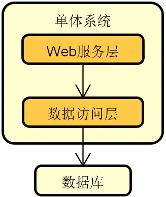

存在以下情况不能应对：

1. 业务复杂度和产品迭代速度
2. 处理高并发、大数据量的用户请求
3. 代码维护和团队协作

但是分布式系统引入了新问题

1. 网络传输的三态性
2. 数据的一致性
3. 可用性

## 技术体系

### 单体系统的核心问题

单体系统的核心问题表现在三个方面

1. 业务扩展性：任何业务的调整都需要发布整个系统，改一个地方就要重新构建、发布整个系统
2. 性能伸缩性：动态扩容对单体系统而言效率低下，如果通过简单扩容就能确保系统性能得到等比例提升，那么该系统就具备良好的伸缩性。对于单体系统来说，由于不同功能都在里面，即内存密集型和 CPU 密集型的代码都位于同一个服务器上，所以很难做到对资源的充分利用，如下图每个组件对资源利用率不同，无法针对组件级别进行资源利用率的提升

   

3. 代码复杂度：修改一处代码容易引发连锁问题，不同组件间边界模糊，由于代码复杂度导致的系统缺陷会触发很多连锁问题

### 分布式系统的本质特性

区别于单体系统，分布式系统会将整个系统拆分成多个能够独立运行的服务，这些服务在物理上是隔离的，相互之间基于网络进行通信和协调

下图展示的就是现实场景中常见的一种分布式系统，可以看到这里有专门针对业务处理的业务服务 1 和业务服务 2 这两个独立的服务，也存在 Web 服务、消息中间件、缓存等提供技术能力的独立组件

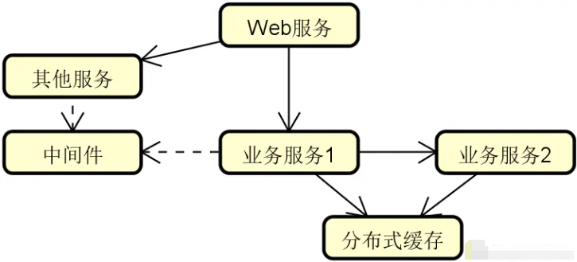

想要实现分布式系统，首要的就是完成对系统中各个服务的合理拆分。通常，我们有两种主流的拆分方式，即纵向（Vertical）拆分和横向（Horizontal）拆分

可以认为纵向拆分的目的就是更好地完成对系统中业务服务的合理组织。围绕一个完整而复杂的业务执行流程，我们通常可以根据不同的业务场景以及数据属性来完成对业务服务的拆分。例如，在常见的互联网医院系统中，具备最基本的医生、患者以及问诊等业务处理场景和数据，这时候我们就可以基于这些场景和数据来分别提取独立的业务服务，如下图所示

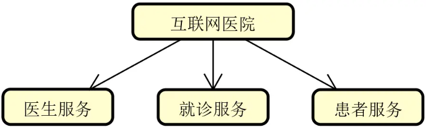

介绍完纵向拆分，我们再来看横向拆分。横向拆分的切入点在于复用，即我们在提取一系列独立服务的同时，还需要考虑通过一定的手段将它们高效地整合在一起。这样，整个系统就可以像是在搭积木一样对各个服务进行排列组合，如下图所示：

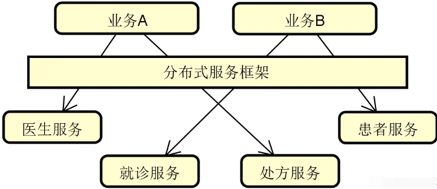

在上图中，我们注意到引入了一个分布式服务框架。通过该框架，系统中的医生服务、患者服务等一系列独立服务就可以进行合理地编排和整合，从而构建业务 A、业务 B 等不同的业务场景。显然，分布式服务框架在这里扮演了重要作用，而后续内容中所要介绍的 Dubbo 和 Spring Cloud 就是目前主流的分布式服务框架。

请注意，分布式系统相较于单体系统而言具备优势的同时，也存在一些我们不得不考虑的特性，包括以下

- 网络传输的三态性

   我们知道对于单体系统中的函数式方法调用而言，只有“成功”或“失败”这两种状态。但是分布式系统则不同，因为远程请求是通过网络进行传输的，而网络在处理请求时还会出现"超时"这个状态，这样就相当于有三个状态。

   显然，网络传输的三态性为系统开发带来新的挑战。面对超时状态，我们不能简单把它处理成是一种成功或失败，而是要具体场景具体分析，避免出现请求丢失或请求重复发送现象。在分布式系统设计过程中，我们需要考虑这种由于网络通信所导致的用户体验问题。

- 请求的容错性

   从错误发生的几率而言，分布式系统显然比单体系统更加容易出错，因为系统的调用链路变得更长、更复杂。每个分布式服务自身可能会发生异常，而这种异常在整个调用链路上会进行扩散，最终可能导致整个系统都不可用。

   在分布式系统设计过程中，一大挑战就是需要确保部分服务的异常情况不会影响到整个系统的可用性。

- 系统的异构性

   分布式系统的异构性很好理解，原则上，每个服务都可以采用一套完全不同的技术体系来进行实现，只要它们对外暴露接口是统一的。但是，因为技术异构性的存在，会增加分布式系统的开发难度和维护成本。

- 数据的一致性

   在分布式系统中，各个服务通常都会构建属于自身的数据库，这样就会导致业务数据无法进行集中管理，也就无法通过传统的事务机制确保它们之间的一致性。如何实现数据的一致性是分布式系统构建过程的一大难点。

以上几点是分布式系统的基本特性，我们无法避免，只能想办法进行利用和管理，这就给我们设计和实现分布式系统提出了挑战。

## 解题要点

通过对单体系统的核心问题和分布式系统本质特性的分析，我们明确了一点，即从技术演进角度讲，分布式系统的诞生是单体系统发展的必然结果。因此，在回答这类问题时，对于技术演进的背景和需求的讨论是我们的第一点回答思路。这部分内容通常不用过多展开，我们可以结合日常开发场景，从业务需求和技术需求角度简要介绍即可。

针对该类问题的第二点解答思路在于充分利用逻辑性和对比性。从面试题的考查方式而言，这是一道典型的对比类面试题。因此，针对如何介绍两个不同事物之间的差异，我们需要采用一定的逻辑性。一种比较容易掌握的技巧是：先抛出一个应用场景，然后分别对两种事物的正反面进行展开讨论。举例来说，如果我们想要阐述扩展性这一应用场景，那么对于单体系统而言，因为没有合理的业务边界和拆分策略，扩展性就很难保证；而对于分布式系统而言，通过引入合理的纵向/横向拆分机制就可以很好地解决这一问题。

虽然这是一道概念类的面试题，但也不要忘记在回答过程中提及一定的实践内容。对于面试过程而言，不管是怎么样的面试题，面试官都希望从候选人身上看到相关的实践经验。因此，最后一个解题的要点，就是建议你可以从日常开发过程出发，基于分布式系统的拆分和集成、请求容错性的实现、数据一致性的不同应对策略等角度，谈谈自己对分布式系统构建的一些思考和总结，相信是很好的加分项。

## 总结

我们已经提到了分布式系统所具备的一组本质特性，也强调了我们需要对这些特性进行合理的应用和管理。为此，我们需要进一步梳理分布式系统开发过程中的技术组件。那么，实现分布式系统应该具备哪些核心技术组件呢？

# 实现分布式系统应该具备哪些核心技术组件？

## 背景

分布式服务是构建分布式系统的基础，可以认为，任何一个分布式系统都是有若干个独立的服务所构成，这些服务通过网络通信实现相互调用，从而完成复杂的业务处理流程。

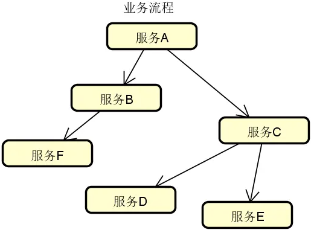

虽然，上图看起来并不复杂，但想要实现一套高性能、高可用、高扩展的分布式服务体系绝非易事。在日常开发过程中，我们在设计和实现分布式系统时需要系统梳理构建分布式服务的各个技术组件。而在实际的面试过程中这也是非常常见的一个面试问题，考查了候选人对分布式服务相关技术概念以及对应实现方案的理解程度。

从面试角度讲，涉及分布式服务技术组件的知识体系非常广泛，所以可以认为这是一道发散型的面试题，面试官想要的并不是一个标准答案，而是看候选人对这一主题理解的深度和广度。针对面试不同岗位的候选者，面试官的要求是不一样的，判断的标准也或有所不同。

## 问题分析

相信只要你开发过分布式系统，基本上都能对构建分布式服务所需要的技术组件说出个一二三来，比方说网络通信、远程调用。你可能也会提到负载均衡、集群容错这些更为复杂的名词。事实上，分布式服务的技术组件之间是有一定的逻辑关系的，有些组件能够独立运行，而有些组件则是构建在另一些组件的基础之上。比较典型的例子就是：配置中心的运行往往需要注册中心的支持，而服务容错则依赖于负载均衡的实现。

另一方面，对于分布式服务而言，组件与组件之间的定位也有所区别。有些是必备组件，缺少了它们系统就无法运行。有些则是扩展性组件，比较典型的就是前面提到的配置中心，原则上我们不使用配置中心也照样可以构建分布式系统。而还有一些则是通用型组件，这些组件并不局限于只能用于构建分布式服务，例如动态代理组件。

在面试过程中，关于这道题的问法其实有很多种，常见的包括：

- 如果想实现一套远程过程调用机制，你会重点设计哪几个技术组件？
- 负载均衡机制是如何与集群容错机制整合在一起的？
- 想要实现服务容错，有哪些技术手段？
- 微服务架构中，配置中心是如何与注册中心进行交互的？
- 为什么在分布式系统中，处处是代理？
- 在分布式服务构建过程中，经常用到的架构模式有哪些？

这些问题虽然问法各异，但考查的都是候选人对分布式服务中核心组件的理解程度。通过这样的分析，我们发现这一问题的难点在于我们要回答的概念有很多，而这些概念却又比较零散。当我们面对这种发散型面试题时，应对的方式绝对不能发散。单纯做零散的概念性阐述，往往很难得到面试官的认可，因为面试官会觉得你是刚接触分布式服务，没有自己的思考和体系。

应对这一问题的基本思路是要具备完整的技术认知，然后能够用自己的语言对各个组件的组成结构和基本原理做一定的展开，这样的话这道题应对起来就会比较自如。

因此，接下来我们就一起系统梳理该问题背后的技术体系。

## 技术体系

在分布式服务的开发过程中，开发人员需要应用到一批技术组件。按照这些技术组件的不同定位，我们把它们分成三大类，即远程过程调用组件、微服务构建组件和通用技术组件，如下图所示：

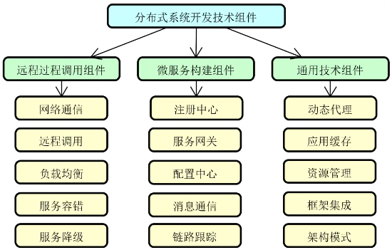

接下来，我们将对上图中的每一个技术组件做展开，从而为本课程后续内容的学习打好基础。

### 远程过程调用组件

远程过程调用是分布式服务最基础的实现技术，开发人员需要从网络通信、远程调用、负载均衡、服务容错以及服务降级这五个维度来进行系统的理解。

1. 网络通信：网络通信是一切分布式操作的基础。当客户端和服务器端建立网络连接之后就可以相互发送消息。但围绕网络通信整个过程，事情并没有那么简单。我们需要考虑网络通信的性能、可靠性以及在通信过程中实现数据传输的方式，这就涉及到 IO 模型、可靠性设计以及序列化方式等一系列技术主题。
2. 远程调用：远程调用解决的问题是如何发布远程服务以及如何引用远程服务。一旦服务发布成功，就相当于构建了一个有效的网络连接，并通过启动监听端口来对外暴露服务访问的入口；而服务引用则是一个向目标监听端点发起请求并获取响应结果的执行过程，如下图所示：

   

   在服务调用过程中，远程调用本地化是基本要求，即远程调用过程的实现对于开发人员而言应该是透明的。同时，我们也需要考虑同步调用、异步调用以及同步转异步调用等一系列具体的调用实现策略。

3. 负载均衡：所谓负载均衡，简单讲就是将请求按照一定的策略分摊到多个服务实例上进行执行，基本结构如下图所示：

   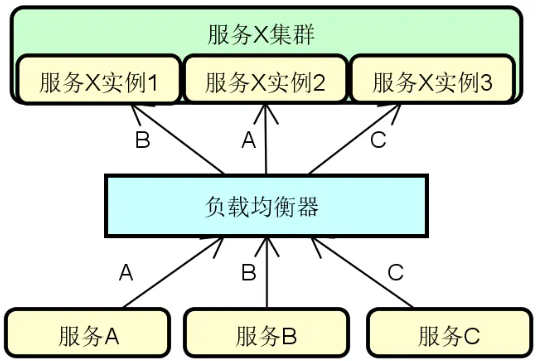

   负载均衡在实现上可以使用硬件、软件或者两者兼有。而针对软件负载均衡，也可以分成服务器端负载均衡和客户端负载均衡两大类。在分布式服务构建过程中，我们主要的讨论对象是基于软件的客户端负载均衡机制。例如，目前主流的微服务架构实现框架 Spring Cloud、Dubbo 等都内置了完整的客户端负载均衡模块。

   另一方面，负载均衡算法决定了对请求进行分发的效果。负载均衡算法有很多，可以分成静态和动态两个大类，它们之间的区别在于动态算法依赖于当前服务的运行时状态，这些状态信息通常包括服务过去一段时间的平均调用时延和所承接的连接数等。

4. 服务容错：在分布式环境中，服务访问出错了该怎么办？这就涉及到服务可靠性问题。服务可靠性是分布式服务构建过程中的一项关键要素，我们需要引入容错思想和机制。常见的服务容错技术包括集群容错、服务熔断（Circuit Breaker）和服务回退（Fallback）等。下图展示的是添加了服务容错机制的系统架构演进过程：

   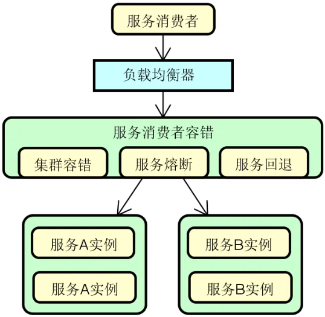

5. 服务降级：从概念上讲，任何一个服务都是可以分等级的。具体的服务分级方法因业务场景和需求而定。一旦我们实现了对服务的针对性分级，那么就可以对那些处于业务链路最外围、等级最低的服务开始执行降级。至于如何对服务进行分级，可以按照需求采取一定的策略，例如常见的三级分类策略，如下图所示：

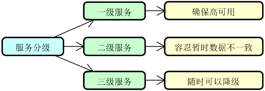

在上图中，一级服务属于核心服务，需要确保高可用，不能执行降级操作；二级服务通常采用的是异步交互方式，容忍暂时的数据不一致性；而三级服务则可以按需对整个服务实行降级操作。

### 微服务构建组件

在远程过程调用组件的基础上，我们继续讨论微服务构建组件，包括注册中心、服务网关、配置中心、消息通信和链路跟踪。这些组件扩展了分布式技术能力，为构建大规模分布式系统提供了技术保障。

1. 注册中心：在分布式服务构建过程中，服务与服务之间通过远程调用完成业务链路的构建。而在服务调用之前，我们首先需要发现服务，即解决在分布式集群环境下如何找到目标服务实例这一问题。服务发现和调用构成了服务交互的基础，整体流程下图所示，其中实线部分代表服务调用流程，而虚线部分则包含了服务的注册（Registration）和发现（Discovery）过程。

   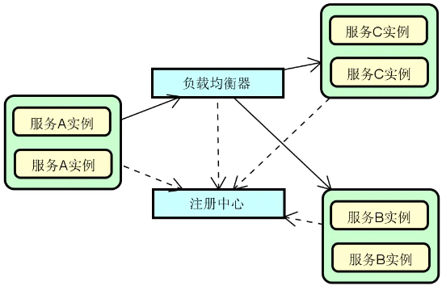

   可以看到，图中的这三个服务都需要注册到注册中心以确保负载均衡器能够从注册中心获取各个服务的定义信息。

2. 服务网关：在分布式系统中，API 网关（Gateway）或服务网关（Service Gateway）的出现有其必然性。我们可以根据需要在服务提供者和消费者之间架设这层服务网关。在注册中心和负载均衡的基础上，添加了服务网关之后的系统架构如下图所示：

   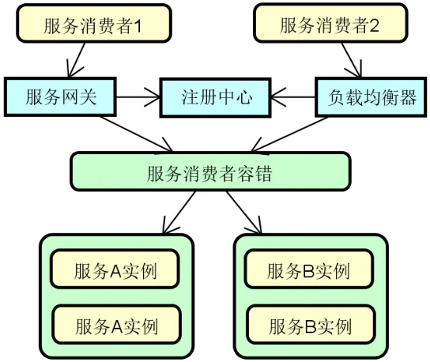

   当然，并不是所有的服务调用链路上都需要添加这层网关，我们也可以根据具体场景直接通过负载均衡器进行服务访问。在实际应用过程中，这种混合式的服务调用管理方式也是一种常见的做法。

3. 配置中心：面对不断增长的服务实例数量，传统的配置信息管理方式就显得无能为力。为此，在分布式服务构建过程中，一般都需要引入配置中心（Configuration Center）的设计思想和相关工具。下图展示了在前面各个组件的基础上添加配置中心之后的系统架构图，分布式系统中的各个服务都可能会依赖配置中心，从而完成配置信息的统一管理。

   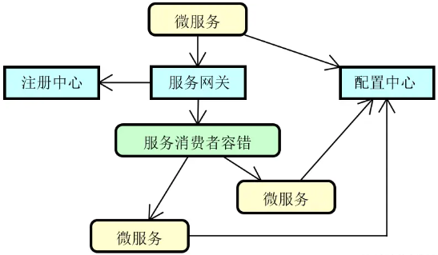

4. 消息通信：降低服务与服务之间的耦合度是分布式系统设计的一大目标，为此，我们可以引入事件驱动架构，基本组成如下图所示：

   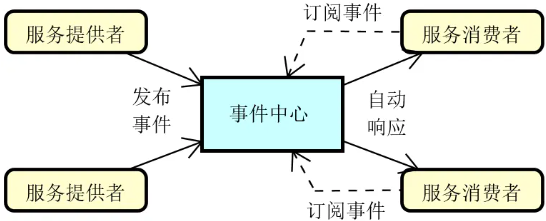

   基于事件驱动架构，每一个服务既可以作为事件的发布者也可以作为事件的消费者，或者两者兼之。而事件也可以在不同的服务之间进行传播，从而满足各种特定的应用场景。

5. 链路跟踪：服务之间的调用不可避免会出现各种问题，这时候就需要引入分布式链路跟踪体系来定位和解决这些问题。基于每一次分布式请求，我们都可以捕获该请求的一系列跟踪数据，下图展示了基于 TraceId 和 SpanId 所构建的一次服务调用的完整链路。

   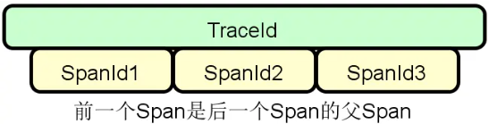

   服务调用链路跟踪是分布式系统的基础需求之一，业界关于分布式链路跟踪也有统一的规范以及代表性的实现框架。

### 通用技术组件

在分布式服务构建过程中，也需要引入一组通用型的技术组件，这些技术组件在多个场景中（不仅限于分布式系统）都能发挥作用。本课程梳理了五种通用技术组件，包括动态代理、应用缓存、资源管理、框架集成以及架构模式。这种技术组件有些关注于具体某一个技术实现要点，有些则关注于框架的应用以及架构设计的方法和实践。

1. 动态代理：在日常开发过程中，动态代理可以说是一种通用性非常高的实现机制，它是面向切面编程的基础，也在主流的分布式服务开源框架中得到了广泛的应用。通过代理机制，一个对象就可以在承接另一个对象功能的同时添加新的功能。相比直接在原有对象中嵌入代码，代理机制为我们提供了更为优雅的解决方案。
2. 应用缓存：对于分布式服务而言，缓存应用非常广泛，开发人员可以使用位于应用程序内部的本地缓存，也可以使用位于独立服务器上的分布式缓存。在日常开发中，缓存的应用通常都是分层级的，我们会综合使用多级缓存来提高目标对象访问的效率和性能。
3. 资源管理：相信你对线程池、数据库连接池等技术并不陌生。这里的池（Pool）是一种对资源的抽象方法，代表一组可以随时使用的资源，但这些资源的创建和释放过程则基于一定的管理策略。资源池的应用非常广泛，存在多种具体的池化组件。
4. 框架集成：这里所说的框架集成，指的是 Dubbo、MyBatis、Spring Cloud 等主流的分布式开发框架与 Spring 框架之间的集成。我们可以基于命名空间以及自定义 starter 等机制完成与 Spring 之间的有效集成。理解框架集成的实现过程有利于掌握主流的分布式服务框架的运行原理。
5. 架构模式：架构模式描述某一特定应用领域中系统组织和表现的惯用方式。对软件体系架构模式的研究和实践促进了对软件设计的重用。在分布式系统开发过程中，也大量应用了诸如微内核架构、管道-过滤器架构等架构模式，这些模式能够为开发人员提供具有高度扩展性的技术组件。

## 解题要点

通过对技术体系的系统分析，我们明白了构建一个分布式服务系统所需要的各个技术组件。这里涉及了一大批专用名词。但是，光列举这些名称就够了吗？答案显然是否定的。

我们在解释这些名词时需要做一些扩展，多提及技术组件的关联关系，从而确保回答过程具备较好的逻辑性。这是解答这个问题的第一点思路。例如，我们在介绍注册中心时，需要提到该组件与负载均衡之间的集成关系。

针对该问题的第二点解答思路在于回归现实中的实践。本讲中介绍的技术组件都是很常见和很通用的，一般的分布式系统构建过程中都会使用到。你完全可以基于自己在日常开发过程中的应用情况来对这些组件做一定的展开。因为这是一道偏概念阐述的问题，所以如果能够做到理论联系实际，相信肯定能为你加分不少。

最后，我想强调的第三点是技术判断力，你需要对各个技术组件背后的实现复杂度有一定的认识。对于那些复杂度较高的技术组件，可以更为细化地进行阐述，并在一定程度上显现出自己所具备的设计思想和对实现原理的理解能力，这样就能达到一定的深度。

## 总结

分布式服务的相关组件虽然比较多，但并不难梳理和串联。正如我们在前面所讨论到的，很多技术组件的出现是必然的，而有些组件之间具备一定的相互关联关系。在本讲内容中，我们从远程调用、微服务以及通用技术组件这三大维度出发来对这些组件进行了分类，并针对每个类别梳理了五大技术组件，以帮助你能够更好地理解和把握，从而形成自己的知识体系。

在掌握了构建分布式服务的技术组件之后，下一讲我们将介绍基于这些组件所构建的分布式服务框架。实际上在本讲内容中，我们已经提到了 Dubbo、Spring Cloud 等框架，目前这些框架都非常主流。那么，这些框架都具备什么样的功能特性呢？

// TODO https://juejin.cn/book/7106442254533066787/section/7106757588175290383
