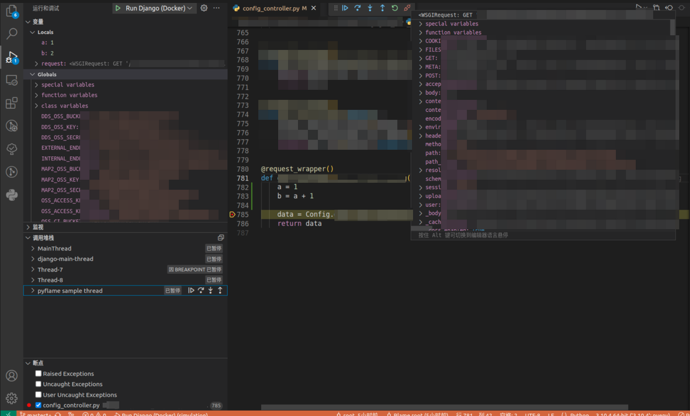
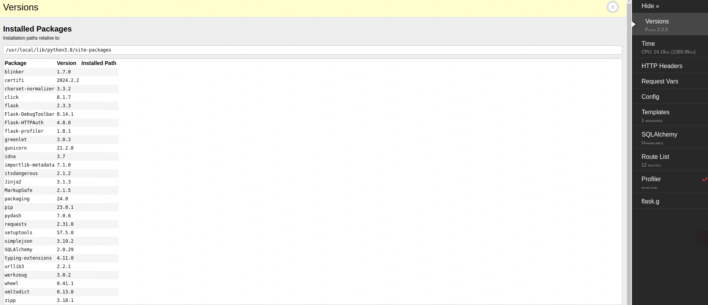
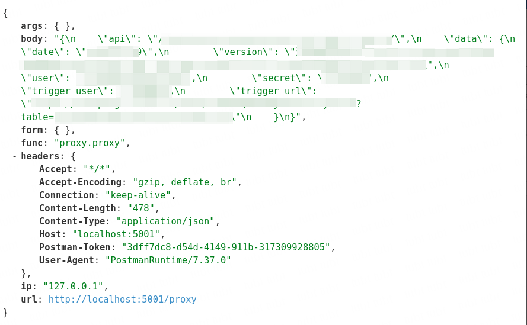

# 前端远程调试

## 背景

由于有些时候不方便到用户实地/远程桌面复现 bug，需要远程查看对方网页的控制台，经过预研发现远程调试工具 [page-spy-web](https://github.com/HuolalaTech/page-spy-web/tree/main) 比较合适

## 实现

1. 在开发机（由于开发只能完全控制开发机，同时要保证此开发机能被下面的前端服务器访问）上部署一个 [docker 镜像](https://github.com/HuolalaTech/page-spy-web/blob/main/README_ZH.md)

   ```bash
   docker run -d --restart=always -p 6752:6752 --name="pageSpy" ghcr.io/huolalatech/page-spy-web:latest
   ```

2. 通过特定域名（可以自定义域名后缀，配合下面的前端服务器），配置 nginx 转发到此开发机

   ```bash
   server {
      listen 80;
      server_name *.你的对外域名后缀（和前端域名保持一致后缀）;
      access_log  /var/log/nginx/access.log main;
      proxy_read_timeout 240s;

      location / {
         proxy_http_version 1.1;
         proxy_set_header Upgrade $http_upgrade;
         proxy_set_header Connection "Upgrade";
         proxy_set_header Host $host;
         proxy_pass http://localhost:6752;
      }
   }
   ```

3. 由于前端服务器需要能访问到开发机，所以需要在前端服务器对应的 nginx 做转发，这里配置到前端域名的子路径，参考[步骤](https://github.com/HuolalaTech/page-spy-web/wiki/%F0%9F%90%9E-%E5%B8%B8%E8%A7%81%E9%97%AE%E9%A2%98%E8%A7%A3%E7%AD%94#%E5%A6%82%E4%BD%95%E9%83%A8%E7%BD%B2%E5%88%B0%E5%AD%90%E8%B7%AF%E5%BE%84)

   ```bash
   server {
      location /pagespy/  {
         # 这里请求转发到开发机，同时由于开发机的 nginx 配置的和前端域名一致，所以能成功转发到开发机对应的 pagespy 服务
         rewrite ^/pagespy/(.*)$ /$1 break;
         proxy_pass  http://开发机对外ip;
         proxy_http_version 1.1;
         proxy_set_header  Upgrade $http_upgrade;
         proxy_set_header  Connection "upgrade";
         proxy_set_header  Host $host;
         proxy_set_header  X-Real-IP $remote_addr;
         proxy_set_header  X-Forwarded-For $proxy_add_x_forwarded_for;
      }

      location /pagespy {
         return 301 $scheme://$host$request_uri/;
      }
   }
   ```

4. 修改前端代码主入口适配远程调试

   src/utils/index.js

   ```js
   // 异步加载单个脚本
   async function loadSingleScript(src, options) {
      return await new Promise((resolve, reject) => {
         // 这里未考虑到同一 src 同时发起的情况，改用缓存实现
         // if (!id) {
         //   const NAMESPACE = 'c2b16a16-12b3-423a-879f-6b46d1a01d60'
         //   const PREFIX = 'script-id-'
         //   id = PREFIX + uuidv5(src, NAMESPACE)
         // }
         // if (!src || document.querySelector(`#${id}`)) {
         //   return
         // }
         const script = document.createElement('script');
         const { attributesMap = {}, ...rest } = options;
         Object.keys(rest).forEach((key) => {
            script[key] = rest[key];
         });
         Object.keys(attributesMap).forEach((key) => {
            script.setAttribute(key, attributesMap[key]);
         });
         script.async = true;
         script.src = src;
         script.onload = resolve;
         script.onerror = reject;
         document.getElementsByTagName('head')[0].appendChild(script);
      });
   }

   // 异步加载多个脚本
   // memoize 默认情况下用第一个参数作为缓存的 key，即 src
   export const loadScript = memoize(loadSingleScript);
   ```

   src/index.js

   ```js
   import { loadScript } from './utils';

   async function loadScriptFunc() {
      // 这里使用别名访问 pagespy 服务
      await loadScript('/pagespy/page-spy/index.min.js', { attributesMap: { crossorigin: 'anonymous' } });
      if (!window.PageSpy) {
         return;
      }
      window.$pageSpy = new window.PageSpy({
         api: window.location.host + '/pagespy',
         clientOrigin: window.location.origin + '/pagespy',
         project: window.location.host,
         title: window.localStorage.getItem('simUsername') || 'anonymous'
      });
   }

   const is_debug = new URLSearchParams(window.location.hash.split('?')[1]).get('is_debug');

   if (process.env.NODE_ENV === 'production' && is_debug) {
      loadScriptFunc();
   }
   ```

## 实现效果

1. 让需要调试的远程页面加上 `?is_debug=1` 参数，可以看到左下角进入待调试状态，点击左下角按钮然后点击 copy 复制出来待调试的远程链接，如果不方便让用户复制，转步骤 2


2. 进入调试界面，网址为前端域名加上 /pagespy/，找到对应的项目/用户名/设备号（设备号可让用户截图发过来避免调试错误页面的情况）进入房间列表去调试


# 后端调试

## 背景

对于 python 后端框架，在内部逻辑有执行 `orm` 或 `原生 sql` 的接口的过程中不知道具体执行了什么 sql，需要有一个调试工具能展示

## django

针对后端使用的 Django 3.1 以及 python 3.6 版本，预研发现只有 [django-debug-toolbar](https://github.com/jazzband/django-debug-toolbar)，[django-silk](https://github.com/jazzband/django-silk) 符合要求

### 实现

#### django-debug-toolbar + django-silk

1. 安装依赖库

   Dockerfile-local

   ```dockerfile
   RUN python3.6 -m pip install django-silk==4.2.0 django-debug-toolbar==3.1.1 ipython pyflame git+https://github.com/towavephone/django-debug-toolbar-mongo.git@v0.3
   ```

2. 修改启动脚本，挂载 tmp 目录

   deployment/local/start.sh

   ```bash
   -v /tmp:/tmp
   ```

3. 修改本地配置

   local.json

   ```json
   {
      "debug": true,
      "debug_tools": ["django-debug-toolbar"]
   }
   ```

4. 修改 setting.py

   settings.py

   ```py
   DEBUG = __config.get('debug', False)
   DEBUG_TOOLS = __config.get('debug_tools', [])

   if DEBUG:
      if 'django-silk' in DEBUG_TOOLS:
         SILKY_META = True
         SILKY_PYTHON_PROFILER = True
         SILKY_PYTHON_PROFILER_BINARY = True
         def request_func(request):
               # 过滤掉 debug toolbar 的请求
               return not (request.path.startswith('/__debug__') or request.path == '/')
         SILKY_INTERCEPT_FUNC = request_func

         MIDDLEWARE += [
            'silk.middleware.SilkyMiddleware',
            'entry.middleware.SilkProfileAllViewsMiddleware'
         ]

         INSTALLED_APPS += [
            'silk'
         ]

      if 'django-debug-toolbar' in DEBUG_TOOLS:
         MIDDLEWARE += [
            'debug_toolbar.middleware.DebugToolbarMiddleware'
         ]

         INSTALLED_APPS += [
            'debug_toolbar',
            'pympler',
            'debug_toolbar_mongo',
            'pyflame'
         ]

         INTERNAL_IPS = [
            "127.0.0.1",
            "localhost"
         ]

         def custom_show_toolbar(request):
               # 路径为 /debug，即显示 silk 时候不需要显示 debug toolbar
               from debug_toolbar.middleware import show_toolbar
               return show_toolbar(request) and not request.path.startswith("/debug")

         DEBUG_TOOLBAR_CONFIG = {
            'SHOW_TOOLBAR_CALLBACK': custom_show_toolbar,
         }

         DEBUG_TOOLBAR_PANELS =  [
            'debug_toolbar.panels.history.HistoryPanel',
            'debug_toolbar.panels.sql.SQLPanel',
            'debug_toolbar_mongo.panel.MongoDebugPanel',
            'debug_toolbar.panels.timer.TimerPanel',
            'pympler.panels.MemoryPanel' ,
            'pyflame.djdt.panel.FlamegraphPanel',
            'debug_toolbar.panels.versions.VersionsPanel',
            'debug_toolbar.panels.settings.SettingsPanel',
            'debug_toolbar.panels.headers.HeadersPanel',
            'debug_toolbar.panels.request.RequestPanel',
            'debug_toolbar.panels.staticfiles.StaticFilesPanel',
            'debug_toolbar.panels.templates.TemplatesPanel',
            'debug_toolbar.panels.cache.CachePanel',
            'debug_toolbar.panels.signals.SignalsPanel',
            'debug_toolbar.panels.logging.LoggingPanel',
            'debug_toolbar.panels.redirects.RedirectsPanel',
            'debug_toolbar.panels.profiling.ProfilingPanel',
         ]

         PYFLAME_CONFIG = {
               # https://gitlab.com/living180/pyflame
               # 默认值 None 告诉 pyflame 使用环境变量 PATH 搜索 Flamegraph.pl
               'FLAMEGRAPH_SCRIPT_PATH': '/root/third_party/flamegraph.pl',
         }

         # mongo toolbar 每个操作的最大显示数量
         DEBUG_TOOLBAR_MONGO_MAX_OPERATION_SIZE = 20

   if DEBUG and 'django-silk' in DEBUG_TOOLS:
      MEDIA_ROOT = '/tmp'
   ```

5. 修改中间件以便让 silk 测量每个接口的性能

   middleware.py

   ```py
   class SilkProfileAllViewsMiddleware:
         def __init__(self, get_response):
            self.get_response = get_response

         def __call__(self, request):
            response = self.get_response(request)
            return response

         def process_view(self, request, view_func, view_args, view_kwargs):
            from silk.profiling.profiler import silk_profile
            return silk_profile(name=request.path)(view_func)(request, *view_args, **view_kwargs)
   ```

6. 修改 urls.py，暴露调试地址

   urls.py

   ```py
   if settings.DEBUG:
      # https://github.com/jazzband/django-debug-toolbar/blob/3.1.1/docs/installation.rst
      # https://github.com/jazzband/django-debug-toolbar/blob/3.1.1/docs/configuration.rst
      if 'django-debug-toolbar' in settings.DEBUG_TOOLS:
         import debug_toolbar
         urlpatterns += [
               re_path(r'^__debug__/', include(debug_toolbar.urls)),
         ]

      # https://github.com/jazzband/django-silk/tree/4.2.0
      if 'django-silk' in settings.DEBUG_TOOLS:
         urlpatterns += [
               re_path(r'^debug/', include('silk.urls', namespace='silk'))
         ]
   else:
      urlpatterns += [
         re_path(r'', root_router)
      ]
   ```

#### vscode debugger

1. 安装依赖库

   Dockerfile-local

   ```dockerfile
   RUN python3.6 -m pip install debugpy==1.5.1
   ```

2. 首次启动时打开调试端口，local.json 及 setting.py 部分省略，不设置 `DEBUG_PORT` 默认为 9999

   manage.py

   ```py
   from django.conf import settings

   if settings.DEBUG:
      # 这里只在第一次启动，防止热重载中断 debug
      if os.environ.get("RUN_MAIN") != "true":
         import debugpy

         debugpy.listen(("0.0.0.0", settings.DEBUG_PORT))
         # debugpy.wait_for_client()
         print(f"Django debug started, port is {settings.DEBUG_PORT}")
   ```

3. 配置 vscode 调试面板

   .vscode/launch.json

   ```json
   {
      "version": "0.2.0",
      "configurations": [
         {
            "name": "Run Django (Docker)",
            "type": "python",
            "request": "attach",
            "pathMappings": [
               {
                  "localRoot": "${workspaceFolder}/后端代码位置/entry",
                  "remoteRoot": "/root/entry"
               }
            ],
            "port": 9999,
            "host": "127.0.0.1"
         }
      ]
   }
   ```

### 疑难点

#### django-debug-toolbar

1. 需要找到适配 Django 3.1 以及 python 3.6 版本的 django-debug-toolbar
2. 为了显示 Python 代码火焰图，需要合适的 pyflame 配置，需要在 docker 里面将 [flamegraph.pl](https://github.com/brendangregg/FlameGraph/blob/master/flamegraph.pl) 暴露给 `/root/third_party/flamegraph.pl` 这个路径，否则不能正常工作
3. 为了同时支持显示 mongodb 的 sql 显示，这个 [django-debug-toolbar-mongo](https://github.com/hmarr/django-debug-toolbar-mongo/compare/master...towavephone:django-debug-toolbar-mongo:master) 需要兼容旧版本的 django

#### django-silk

1. 需要找到适配 Django 3.1 以及 python 3.6 版本的 django-silk
2. 挂载 tmp 目录以便让性能分析结果持久化
3. 编写中间件以便让每个接口都能进行性能分析

### 实现效果

#### django-debug-toolbar

本地后端启动后，直接访问后端地址，即可看到以下常用功能：请求历史、请求涉及的 django orm sql 语句执行情况、请求涉及的 mongo sql 语句执行情况，执行时间分布、内存占用、内存调用栈


#### django-silk

本地后端启动后，访问 `后端地址 + /debug/`，即可看到以下常用功能：请求概况、请求耗时、调用栈可视化、清空数据库（此功能涉及到读写 local 环境的 pg 库，如无必要请勿开启）


#### vscode debugger

启动 vscode 调试，鼠标设置断点后，访问某个接口即可触发调试过程




## flask

针对 flask 框架同样需要上面的一套后端调试工具，由于这里使用的是最近几个版本（2024-05-17 15:12:42）的 flask（2.3.3），所以不需要考虑调试工具的版本，直接使用最新版本

### 实现

1. 安装依赖

   requirements.txt

   ```py
   flask-debugtoolbar
   flask_profiler
   sqlalchemy
   ```

2. 更新主入口文件

   app.py

   ```py
   import flask_profiler

   from flask_debugtoolbar import DebugToolbarExtension

   if app.debug:
      app.config['SECRET_KEY'] = '123456'
      app.config['DEBUG_TB_TEMPLATE_EDITOR_ENABLED'] = True

      app.config['DEBUG_TB_PANELS'] = (
         'flask_debugtoolbar.panels.versions.VersionDebugPanel',
         'flask_debugtoolbar.panels.timer.TimerDebugPanel',
         'flask_debugtoolbar.panels.headers.HeaderDebugPanel',
         'flask_debugtoolbar.panels.request_vars.RequestVarsDebugPanel',
         'flask_debugtoolbar.panels.config_vars.ConfigVarsDebugPanel',
         'flask_debugtoolbar.panels.template.TemplateDebugPanel',
         'flask_debugtoolbar.panels.sqlalchemy.SQLAlchemyDebugPanel',
         # 'flask_debugtoolbar.panels.logger.LoggingPanel',
         'flask_debugtoolbar.panels.route_list.RouteListDebugPanel',
         'flask_debugtoolbar.panels.profiler.ProfilerDebugPanel',
         'flask_debugtoolbar.panels.g.GDebugPanel'
      )
      # http://localhost:5001/
      DebugToolbarExtension(app)
      app.config["flask_profiler"] = {
         "enabled": True,
         "storage": {
               "engine": "sqlalchemy",
               "db_url": "sqlite:///flask_profiler.sql"
         },
         "ignore": [
               "^/static/.*",
               "^/_debug_toolbar/.*"
         ]
      }

   # http://localhost:5001/flask-profiler/
   if app.debug:
      flask_profiler.init_app(app)
   ```

### 疑难点

#### flask-debugtoolbar

1. LoggingPanel 会影响控制台日志的打印，需要屏蔽掉
2. 这里没有 history，不能看到历史请求，待预研

#### flask_profiler

1. 需要正确配置 sqlalchemy
2. 忽略 flask-debugtoolbar 插件请求

### 实现效果

#### flask-debugtoolbar



#### flask_profiler



