# 背景

性能优化一直以来都是前端工程领域中的一个重要部分。很多资料表明，网站应用的性能（加载速度、交互流畅度）优化对于提高用户留存、转化率等都有积极影响。可以理解为，提升你的网站性能，就是提升你的业务数据（甚至是业务收入）。

性能优化广义上会包含前端优化和后端优化。后端优化的关注点更多的时候是在增加资源利用率、降低资源成本以及提高稳定性上。相较于后端，前端的性能优化会更直接与用户的体验挂钩。从用户体验侧来说，前端服务 5s 的加载时间优化缩减 80%(1s) 与后端服务 50ms 的响应优化缩减 80%(10ms) 相比，用户的体验提升会更大。因此很多时候，与体验相关的性能的瓶颈会出现在前端。

> 当然后端性能优化非常重要，正如上面所说，它们的关注点可能不同。前端类似于最后一公里，由于和用户最近，所以性能问题会直接影响到用户体验。

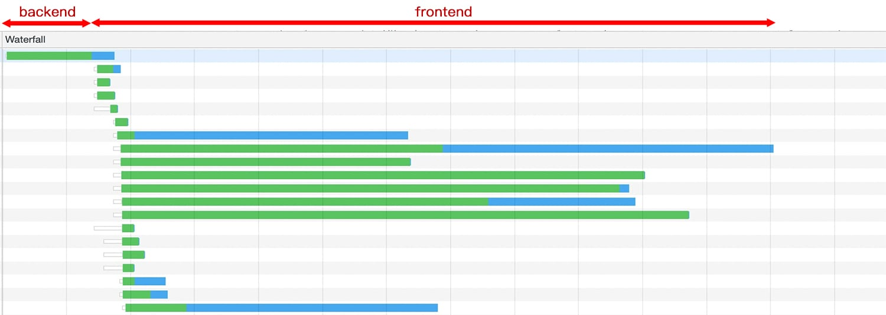

# 缓存

[深入理解浏览器的缓存机制](/deep-learn-browser-cache/)

# 发送请求

在前一部分，我们介绍了浏览器缓存。当一个请求走过了各级前端缓存后，就会需要实际发送一个请求了。

> 在 HTTP 缓存中，我们其实也有发送请求；或者是在 HTTP/2 Push 下，使用了之前连接中推送的资源。不过为了保证思路的连贯，我还是把「发送请求」这个章节整体放在「缓存」之后了。

介绍网络请求其实可以包含复杂的网络知识。不过，今天咱们的旅程主要聚焦于“前端性能优化”。因此，主要会介绍一些在这个环节中，前端性能优化可能会做的事儿。

## 避免多余重定向

重定向是一个比较常用的技术手段。在一些情况下，你可能进行了服务迁移，修改了原有的 uri。这时候就可以使用重定向，把访问原网址的用户重定向到新的 uri。还有是在一些登录场景下，会使用到重定向技术。

重定向分为 301 的永久重定向和 302 的临时重定向。建议贴合语义，例如服务迁移的情况下，使用 301 重定向。对 SEO 也会更友好。

同时也不要滥用重定向。曾今也见过有业务在访问后重定向 3 次的情况，其实里面有些是不必要的。每次重定向都是有请求耗时的，建议避免过多的重定向。

## DNS 预解析

基本我们访问远程服务的时候，不会直接使用服务的 IP，而是使用域名。所以请求的一个重要环节就是域名解析。

DNS 服务本身是一个树状层级结构，其解析是一个递归与迭代的过程。例如 github.com 的大致解析流程如下：

1.  先检查本地 hosts 文件中是否有映射，有则使用；
2.  查找本地 DNS 缓存，有则返回；
3.  根据配置在 TCP/IP 参数中设置 DNS 查询服务器，并向其进行查询，这里先称为本地 DNS；
4.  如果该服务器无法解析域名（没有缓存），且不需要转发，则会向根服务器请求；
5.  根服务器根据域名类型判断对应的顶级域名服务器（.com），返回给本地 DNS，然后重复该过程，直到找到该域名；
6.  当然，如果设置了转发，本地 DNS 会将请求逐级转发，直到转发服务器返回或者也不能解析。

这里我们需要了解的是：

-  首先，DNS 解析流程可能会很长，耗时很高，所以整个 DNS 服务，包括客户端都会有缓存机制，这个作为前端不好涉入；
-  其次，在 DNS 解析上，前端还是可以通过浏览器提供的其他手段来“加速”的。

DNS Prefetch 就是浏览器提供给我们的一个 API。它是 Resource Hint 的一部分。它可以告诉浏览器：过会我就可能要去 yourwebsite.com 上下载一个资源啦，帮我先解析一下域名吧。这样之后用户点击某个按钮，触发了 yourwebsite.com 域名下的远程请求时，就略去了 DNS 解析的步骤。使用方式很简单：

```html
<link rel="dns-prefetch" href="//yourwebsite.com" />
```

当然，浏览器并不保证一定会去解析域名，可能会根据当前的网络、负载等状况做决定。标准里也明确写了

> user agent SHOULD resolve as early as possible

## 预先建立连接

我们知道，建立连接不仅需要 DNS 查询，还需要进行 TCP 协议握手，有些还会有 TLS/SSL 协议，这些都会导致连接的耗时。使用 Preconnect 可以帮助你告诉浏览器：“我有一些资源会用到某个源（origin），你可以帮我预先建立连接。”

根据规范，当你使用 Preconnect 时，浏览器大致做了如下处理：

-  首先，解析 Preconnect 的 url；
-  其次，根据当前 link 元素中的属性进行 cors 的设置；
-  然后，默认先将 credential 设为 true，如果 cors 为 Anonymous 并且存在跨域，则将 credential 置为 false；
-  最后，进行连接。

使用 Preconnect 只需要将 rel 属性设为 preconnect 即可：

```html
<link rel="preconnect" href="//sample.com" />
```

当然，你也可以设置 CORS：

```html
<link rel="preconnect" href="//sample.com" crossorigin />
```

需要注意的是，标准并没有硬性规定浏览器一定要（而是 SHOULD）完成整个连接过程，与 DNS Prefetch 类似，浏览器可以视情况完成部分工作。

## 使用 CDN

当我们实际把网络包发向我们的目标地址时，肯定希望越快到达目的地越好（对应的，也会希望越快获得响应）。而网络传输是有极限的，同样一个北京的用户，访问北京的服务器显然要比广州快很多。同时，服务的负载也会影响响应的速度。

对于静态资源，我们可以考虑通过 CDN 来降低时延。

对于使用 CDN 的资源，DNS 解析会将 CDN 资源的域名解析到 CDN 服务的负载均衡器上，负载均衡器可以通过请求的信息获取用户对应的地理区域，从而通过负载均衡算法，在背后的诸多服务器中，综合选择一台地理位置近、负载低的机器来提供服务。例如为北京联通用户解析北京的服务器 IP。这样，用户在之后访问 CDN 资源时都是访问北京服务器，距离近，速度快。

下图是请求声明周期中各个阶段的示意图，可以帮助我们理解发送请求（以及接收响应）的流程。

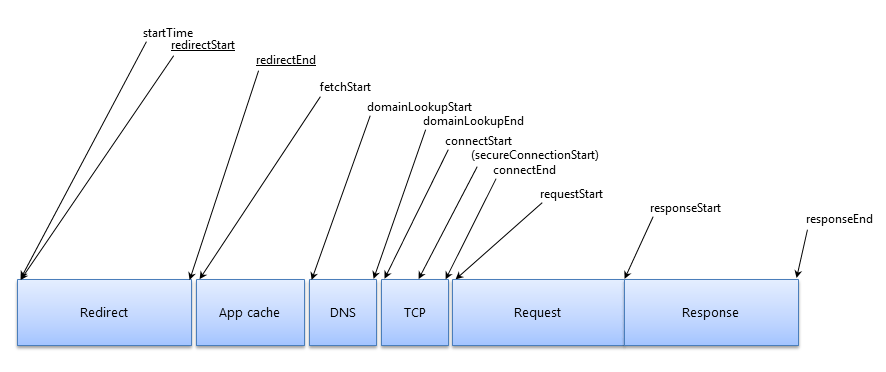

在缓存没法满足我们的情况下，就要开始真正发送请求了。从前端性能优化视角，我们会关注重定向、DNS 解析等问题，从而加速请求。但这块还预留了一小部分 —— 服务端的处理与响应。

过去，我们会将前端局限在浏览器中，但是随着 NodeJS 的兴起，很多业务都引入了基于 NodeJS 的 BFF 来为前端（客户端端）提供服务。所以咱们这次的旅程也会简单聊一下，在这一阶段可以做的一些优化。

# 服务端响应

把这一部分放进前端性能优化并不是很严谨：

-  服务端有着服务端的通用技术手段，这块深入去研究，会是一个不一样的领域；
-  我们既然在讨论前端性能优化，这部分主要还是指 NodeJS，但不是所有业务都使用 NodeJS。

所以这里只会提一些实践中碰到的小点，辅以一些拓展阅读，希望能帮助大家抛砖引玉，开拓思维。

## 使用流进行响应

目前，现代浏览器都支持根据流的返回形式来逐步进行页面内容的解析、处理。这就意味着，即使请求的响应没有完全结束，浏览器也可以从手里已有的响应结果中进行页面的解析与渲染。

例如 [css-only-chat-node](https://github.com/kkuchta/css-only-chat) 就利用了这个特点来实现无刷新、无 JavaScript 的页面更新。

## 业务聚合

BFF 非常合适做的一件事就是后端服务的聚合。

如果你有一个两个接口服务：第一个服务是先获取产品信息，再根据产品信息中的上架时间通过第二个服务获取该时间后的产品列表。这个业务逻辑如果放在前端（浏览器）处理将会串行发送两个请求。假设每个请求 200ms，那么就需要等待 400ms。如果引入 NodeJS，这一层可以放在 NodeJS 中实现。NodeJS 部署的位置一般离其他后端服务“更近”，例如同一个局域网。这类服务间的请求耗时显然更低，可能只需要 200(浏览器) + 30(NodeJS) \* 2 = 260ms。

此外，如果一个业务需要在前端并发三、四个请求来获取完整数据，那么放在 NodeJS 的 BFF 层也是一个不错的选择。

## 避免代码问题

代码问题其实就非常细节了。简单列举一些常见的问题：

-  async await 的不当使用导致并行请求被串行化了；
-  频繁地 JSON.parse 和 JSON.stringify 大对象；
-  正则表达式的灾难性回溯；
-  闭包导致的内存泄漏；
-  CPU 密集型任务导致事件循环 delay 严重；
-  未捕获的异常导致进程频繁退出，守护进程（pm2/supervisor）又将进程重启，这种频繁的启停也会比较消耗资源；

# 页面解析与处理

这一阶段浏览器需要处理的东西很多，为了更好地理解性能优化，我们主要将其分为几个部分：

-  页面 DOM 的解析；
-  页面静态资源的加载，包括了页面引用的 JavaScript/CSS/图片/字体等；
-  静态资源的解析与处理，像是 JavaScript 的执行、CSSOM 的构建与样式合成等；

大致过程就是解析页面 DOM 结构，遇到外部资源就加载，加载好了就使用。但是由于这部分的内容比较多，所以在这一节里我们重点关注页面的解析（其他部分在写一节中介绍）。

## 注意资源在页面文档中的位置

我们的目标是收到内容就尽快解析处理，页面有依赖的资源就尽快发送请求，收到响应则尽快处理。然而，这个美好的目标也有可能会被我们不小心破坏。

JavaScript 脚本和 CSS 样式表在关于 DOM 元素的属性，尤其是样式属性上都有操作的权利。这就像是一个多线程问题。服务端多线程编程中经常通过锁来保证线程间的互斥。回到咱们的前端，现在也是两方在竞争同一个资源，显然也是会有互斥的问题。这就带来了 DOM 解析、JavaScript 加载与执行、CSS 加载与使用之间的一些互斥关系。

仅仅看 DOM 与 CSS 的关系，则如下图所示：

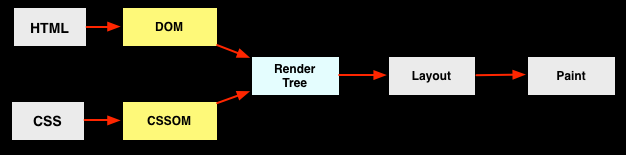

HTML 解析为 DOM Tree，CSS 解析为 CSSOM，两者再合成 Render Tree，并行执行，非常完美。然而，当 JavaScript 入场之后，局面就变了：

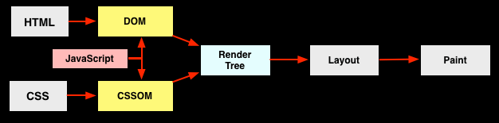

根据标准规范，在 JavaScript 中可以访问 DOM。因此当遇到 JavaScript 后会阻塞 DOM 的解析。于此同时，为避免 CSS 与 JavaScript 之间的竞态，CSSOM 的构建会阻塞 JavaScript 的脚本执行。总结起来就是

> JavaScript 会阻塞 DOM 构建，而 CSSOM 的构建又会阻塞 JavaScript 的执行。

所以这就是为什么在优化的最佳实践中，我们基本都推荐把 CSS 样式表放在 `<head>` 之中（即页面的头部），把 JavaScript 脚本放在 `<body>` 的最后（即页面的尾部）。

## 使用 defer 和 async

上面提到了，当 DOM 解析遇到 JavaScript 脚本时，会停止解析，开始下载脚本并执行，再恢复解析，相当于是阻塞了 DOM 构建。

那除了将脚本放在 body 的最后，还有什么优化方法么？是有的。

可以使用 defer 或 async 属性。两者都会防止 JavaScript 脚本的下载阻塞 DOM 构建。但是两者也有区别，最直观的表现如下：

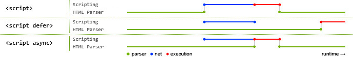

defer 会在 HTML 解析完成后，按照脚本出现的次序再顺序执行；而 async 则是下载完成就立即开始执行，同时阻塞页面解析，不保证脚本间的执行顺序。

根据它们的特点，推荐在一些与主业务无关的 JavaScript 脚本上使用 async。例如统计脚本、监控脚本、广告脚本等。这些脚本一般都是一份独立的文件，没有外部依赖，不需要访问 DOM，也不需要有严格的执行时机限制。在这些脚本上使用 async 可以有效避免这些非核心功能的加载影响页面解析速度。

## 页面文档压缩

HTML 的文档大小也会极大影响响应体下载的时间。一般会进行 HTML 内容压缩（uglify）的同时，使用文本压缩算法（例如 gzip）进行文本的压缩。关于资源压缩这一块，在下一节的内容中还会再详细进行介绍。

# 页面静态资源

在上一节中，我们介绍了基本的页面解析机制，通过对资源加载顺序和脚本加载的控制，避免了无谓的阻塞，优化了解析性能。

也正如上一站中所说，这时浏览器除了解析页面 DOM 外，还会对页面包含的静态资源发起请求，请求回来后会执行或使用资源。

首先从宏观上来了解一下：

## 总体原则

这一部分会涉及到各类常见的静态资源：JavaScript 脚本、CSS 样式表、图片、字体等。不同资源的优化措施既有联系又有差别，后续会以各类资源为维度，针对性介绍其优化的关注点和手段。

但咱们还是要先从整体维度上进行一些分析。其实在总体原则上，各类资源的优化思路都是大体类似的，包括但不限于：

-  减少不必要的请求
-  减少包体大小
-  降低应用资源时的消耗
-  利用缓存

为了大家能更好理解各类优化实施策略从何而来，先初步扩展一下以上的思路。

### 减少不必要的请求

核心是希望能够减少请求的数量，因为浏览器对同源请求有并发上限的限制（例如 Chrome 是 6），所以在 HTTP/1.1 下，请求过多可能会导致请求被排队了。一个典型场景就是一些图库类型的网站，页面加载后可能需要请求十数张图片。

同时，TCP/IP 的拥塞控制也使其传输有慢启动（slow start）的特点，连接刚建立时包体传输速率较低，后续会渐渐提速。因此，发送过多的“小”请求可能也不是一个很好的做法。

减少不必要的请求主要分为几个维度：

-  对于不需要使用的内容，其实不需要请求，否则相当于做了无用功；
-  对于可以延迟加载的内容，不必要现在就立刻加载，最好就在需要使用之前再加载；
-  对于可以合并的资源，进行资源合并也是一种方法。

### 减少包体大小

包体大小对性能也是有直接影响的。显然同样速率下，包体越小，传输耗时越低，整体页面加载与渲染的性能也会更好。

减少包体大小常用的方式包括了：

-  使用适合当前资源的压缩技术；
-  避免在响应包体里“塞入”一些不需要的内容。

### 降低应用资源时的消耗

以上主要的关注点都在页面资源加载的效率，其实有些时候，浏览器去执行或使用资源的也是有消耗的。例如在 JavaScript 执行了一段 CPU 密集的计算，或者进行频繁的 DOM 操作，这些都会让 JavaScript 的执行变成影响性能的一大问题。虽然今天的像 V8 这样的引擎已经很快了，但是一些不当的操作仍然会带来性能的损耗。

此外，像是 CSS 选择器匹配、图片的解析与处理等，都是要消耗 CPU 和内存的。也许这些不太常成为性能杀手，但是某些特性场合下，了解它们也许会对你有所帮助。

### 利用缓存

还记得咱们这趟旅程从哪出发的么？没错，缓存。

在旅程的第一站，我们介绍了浏览器访问一个 url 时的多级缓存策略。千万不要忘了，这些静态子资源也是网络请求，它们仍然可以利用之前介绍的完整缓存流程。缓存在很多时候会是一个帮你解决性能问题的非常有效的手段。

由于第一站已经对缓存进行了详细介绍，所以缓存这部分，在这一站里只会在针对资源类型再补充一些内容。

## 针对各类资源的性能优化

以上的原则可以指导我们针对性地优化各类资源。下面我就以资源类型为维度，详细介绍其中涉及到的优化点与优化措施。

## JavaScript

随着 Web 的发展，JavaScript 从以前只承担简单的脚本功能，到现在被用于构建大型、复杂的前端应用，经历了很大的发展。这也让它在当下的前端应用中扮演了一个非常重要的角色，因此在这一节首先来看看的我们熟悉的 JavaScript。

### 减少不必要的请求

在进行 JavaScript 优化时，我们还是秉承总体思路，首先就是减少不必要的请求。

#### 代码拆分（code split）与按需加载

相信熟练使用 webpack 的同学对这一特性都不陌生。

虽然整体应用的代码非常多，但是很多时候，我们在访问一个页面时，并不需要把其他页面的组件也全部加载过来，完全可以等到访问其他页面时，再按需去动态加载。核心思路如下所示：

```js
document.getElementById('btn').addEventListener('click', (e) => {
  // 在这里加载 chat 组件相关资源 chat.js
  const script = document.createElement('script');
  script.src = '/static/js/chat.js';
  document.getElementsByTagName('head')[0].appendChild(script);
});
```

在按钮点击的监听函数中，我动态添加了 `<script>` 元素。这样就可以实现在点击按钮时，才加载对应的 JavaScript 脚本。

代码拆分一般会配合构建工具一起使用。以 webpack 为例，在日常使用时，最常见的方式就是通过 dynamic import 来告诉 webpack 去做代码拆分。webpack 编译时会进行语法分析，之后遇到 dynamic import 就会认为这个模块是需要动态加载的。相应的，其子资源也会被如此处理（除非被其他非动态模块也引用了）。

在 webpack 中使用代码拆分最常见的一个场景是基于路由的代码拆分。目前很多前端应用都在使用 SPA（单页面应用）形式，或者 SPA 与 MPA（多页面应用）的结合体，这就会涉及到前端路由。而页面间的业务差异也让基于路由的代码拆分成为一个最佳实践。

当然，如果你不使用 webpack 之类的构建工具，你也可以选择一个 AMD 模块加载器（例如 RequireJS）来实现前端运行时上的异步依赖加载。

#### 代码合并

我们在总体思路里有提到，减少请求的一个方法就是合并资源。试想一个极端情况：我们现在不对 node_modules 中的代码进行打包合并，那么当我们请求一个脚本之前将可能会并发请求数十甚至上百个依赖的脚本库。同域名下的并发请求数过高会导致请求排队，同时还可能受到 TCP/IP 慢启动的影响。

当然，在很多流行的构建工具中（webpack/Rollup/Parcel），是默认会帮你把依赖打包到一起的。不过当你使用其他一些工具时，就要注意了。例如使用 FIS3 时，就需要通过配置声明，将一些 common 库或 npm 依赖进行打包合并。又或者使用 Gulp 这样的工具，也需要注意进行打包。

总之，千万不要让你的碎文件散落一地。

### 减少包体大小

#### 代码压缩

JavaScript 代码压缩比较常见的做法就是使用 UglifyJS 做源码级别的压缩。它会通过将变量替换为短命名、去掉多余的换行符等方式，在尽量不改变源码逻辑的情况下，做到代码体积的压缩。基本已经成为了前端开发的标配。在 webpack 的 production 模式下是默认开启的；而在 Gulp 这样的任务流管理工具上也有 gulp-uglify 这样的功能插件。

另一个代码压缩的常用手段是使用一些文本压缩算法，gzip 就是常用的一种方式。


上图中响应头的 Content-Encoding 表示其使用了 gzip。

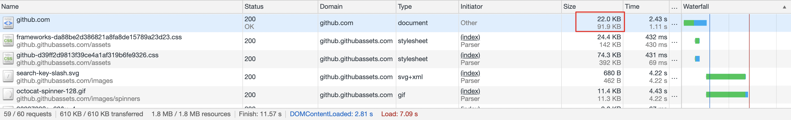

深色的数字表示压缩后的大小为 22.0KB，浅色部分表示压缩前的大小为 91.9KB，压缩比还是挺大的，很有效果。一般服务器都会内置相应模块来进行 gzip 处理，不需要我们单独编写压缩算法模块。例如在 Nginx 中就包含了 ngx_http_gzip_module 模块，通过简单的配置就可以开启。

```
gzip            on;
gzip_min_length 1000;
gzip_comp_level 6;
gzip_types      application/javascript application/x-javascript text/javascript;
```

#### Tree Shaking

Tree Shaking 最早进入到前端的视线主要是因为 Rollup。后来在 webpack 中也被实现了。其本质是通过检测源码中不会被使用到的部分，将其删除，从而减小代码的体积。例如：

```js
// 模块 A
export function add(a, b) {
  return a + b;
}

export function minus(a, b) {
  return a - b;
}

// 模块 B
import { add } from 'module.A.js';
console.log(add(1, 2));
```

可以看到，模块 B 引用了模块 A，但是只使用了 add 方法。因此 minus 方法相当于成为了 Dead Code，将它打包进去没有意义，该方法是永远不会被使用到的。

注意，我在上面的代码中使用了 ESM 规范的模块语法，而没有使用 CommonJS。这主要是由于 Tree Shaking 算是一种静态分析，而 ESM 本身是一种的静态的模块化规范，所有依赖可以在编译期确定。

注意，刚才说了 Tree Shaking 非常依赖于 ESM。像是前端流行的工具库 lodash 一般直接安装的版本是非 ESM 的，为了支持 Tree Shaking，我们需要去安装它的 ESM 版本 —— lodash-es 来实现 Tree Shaking。

此外，Chrome DevTools 也可以帮助你查看加载的 JavaScript 代码的使用覆盖率。

#### 优化 polyfill 的使用

前端技术的一大特点就是需要考虑兼容性。为了让大家能顺畅地使用浏览器的新特性，一些程序员们开发了新特性对应的 polyfill，用于在非兼容浏览器上也能使用新特性的 API。后续升级不用改动业务代码，只需要删除相应的 polyfill 即可。

这种舒适的开发体验也让 polyfill 成为了很多项目中不可或缺的一份子。然而 polyfill 也是有代价的，它增加了代码的体积。毕竟 polyfill 也是 JavaScript 写的，不是内置在浏览器中，引入的越多，代码体积也越大。所以，只加载真正所需的 polyfill 将会帮助你减小代码体积。

首先，不是每个业务的兼容性要求都一样。因此，按你业务的场景来确定引入哪些 polyfill 是最合适的。然而，特性千千万，手动 import 或者添加 Babel Transformer 显然是一件成本极高的事。针对这点，我们可以通过 browserslist 来帮忙，许多前端工具（babel-preset-env/autoprefixer/eslint-plugin-compat）都依赖于它。使用方式可以看这里。

其次，在 Chrome Dev Summit 2018 上还介绍了一种 Differential Serving 的技术，通过浏览器原生模块化 API 来尽量避免加载无用 polyfill。

```html
<script type="module" src="main.mjs"></script>
<script nomodule src="legacy.js"></script>
```

这样，在能够处理 module 属性的浏览器（具有很多新特性）上就只需加载 main.mjs（不包含 polyfill），而在老式浏览器下，则会加载 legacy.js（包含 polyfill）。

最后，其实在理想上，polyfill 最优的使用方式应该是根据浏览器特性来分发，同一个项目在不同的浏览器，会加载不同的 polyfill 文件。例如 Polyfill.io 就会根据请求头中的客户端特性与所需的 API 特性来按实际情况返回必须的 polyfill 集合。

#### webpack

webpack 现在已经成为很多前端应用的构建工具，因此这里单独将其列了出来。我们可以通过 webpack-bundle-analyzer 这个工具来查看打包代码里面各个模块的占用大小。

很多时候，打包体积过大主要是因为引入了不合适的包，对于如何优化依赖包的引入，这里有一些[建议](https://github.com/GoogleChromeLabs/webpack-libs-optimizations)可以帮助你减小 bundle 的体积。


### 解析与执行

除了 JavaScript 下载需要耗时外，脚本的解析与执行也是会消耗时间的。

#### JavaScript 的解析耗时

很多情况下，我们会忽略 JavaScript 文件的解析。一个 JavaScript 文件，即使内部没有所谓的“立即执行函数”，JavaScript 引擎也是需要对其进行解析和编译的。

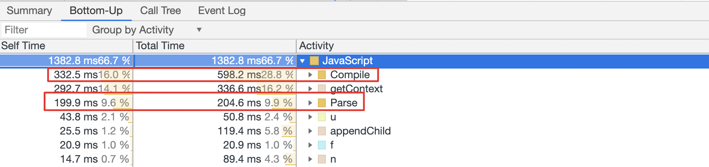

从上图可以看出，解析与编译消耗了好几百毫秒。所以换一个角度来说，删除不必要的代码，对于降低 Parse 与 Compile 的负载也是很有帮助的。

同时，我们从前一节已经知道，JavaScript 的解析、编译和执行会阻塞页面解析，延迟用户交互。所以有时候，加载同样字节数的 JavaScript 对性能的影响可能会高于图片，因为图片的处理可以放在其他线程中并行执行。

#### 避免 Long Task

对于一些单页应用，在加载完核心的 JavaScript 资源后，可能会需要执行大量的逻辑。如果处理不好，可能会出现 JavaScript 线程长时间执行而阻塞主线程的情况。

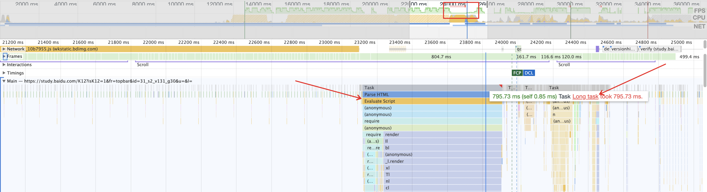

例如在上图中，帧率下降明显的地方出现了 Long Task，伴随着的是有一段超过 700 ms 的脚本执行时间。而性能指标 FCP 与 DCL 处于其后，一定程度上可以认为，这个 Long Task 阻塞了主线程并拖慢了页面的加载时间，严重影响了前端性能与体验。

想要了解更多关于 Long Task 的内容，可以看看 Long Task 相关的[标准](https://w3c.github.io/longtasks/)。

#### 是否真的需要框架

相信如果现在问大家，我们是否需要 React、Vue、Angular 或其他前端框架（库），大概率是肯定的。

但是我们可以换个角度来思考这个问题。类库/框架帮我们解决的问题之一是快速开发与后续维护代码，很多时候，类库/框架的开发者是需要在可维护性、易用性和性能上做取舍的。对于一个复杂的整站应用，使用框架给你的既定编程范式将会在各个层面提升你工作的质量。但是，对于某些页面，我们是否可以反其道行之呢？

例如产品经理反馈，咱们的落地页加载太慢了，用户容易流失。这时候你会开始优化性能，用上这次「性能之旅」里的各种措施。但你有没有考虑过，对于像落地页这样的、类似静态页的页面，是不是可以“返璞归真”？

也许你使用了 React 技术栈 —— 你加载了 React、Redux、React-Redux、一堆 Reducers…… 好吧，整个 JavaScript 可能快 1MB 了。更重要的是，这个页面如果是用于拉新的，这也代表着访问者并没有缓存可以用。好吧，为了一个静态页（或者还有一些非常简单的表单交互），用户付出了高额的成本，而原本这只需要 50 行不到的代码。所以有时候考虑使用原生 JavaScript 来实现它也是一种策略。Netflix 有一篇[文章](https://medium.com/dev-channel/a-netflix-web-performance-case-study-c0bcde26a9d9)介绍了他们是如何通过这种方式大幅缩减加载与操作响应时间的。

当然，还是强调一下，并不是说不要使用框架/类库，只是希望大家不要拘泥于某个思维定式。做工具的主人，而不是工具的“奴隶”。

#### 针对代码的优化

> 请注意，截止目前（2019.08）以下内容不建议在生产环境中使用。

还有一种优化思路是把代码变为最优状态。它其实算是一种编译优化。在一些编译型的静态语言上（例如 C++），通过编译器进行一些优化非常常见。

这里要提到的就是 facebook 推出的 Prepack。例如下面一段代码：

```js
(function() {
  function hello() {
    return 'hello';
  }
  function world() {
    return 'world';
  }
  global.s = hello() + ' ' + world();
})();
```

可以优化为：

```js
s = 'hello world';
```

不过很多时候，代码体积和运行性能是会有矛盾的。同时 Prepack 也还不够成熟，所以不建议在生产环境中使用。

### 缓存

JavaScript 部分的缓存与我们在第一部分里提到的缓存基本一致，如果你记不太清了，可以回到咱们的第一站。

#### 发布与部署

这里简单提一下：大多数情况下，我们对于 JavaScript 与 CSS 这样的静态资源，都会启动 HTTP 缓存。当然，可能使用强缓存，也可能使用协商缓存。当我们在强缓存机制上发布了更新的时候，如何让浏览器弃用缓存，请求新的资源呢？

一般会有一套配合的方式：首先在文件名中包含文件内容的 Hash，内容修改后，文件名就会变化；同时，设置不对页面进行强缓存，这样对于内容更新的静态资源，由于 uri 变了，肯定不会再走缓存，而没有变动的资源则仍然可以使用缓存。

上面说的主要涉及前端资源的发布和部署，详细可以看[这篇内容](https://www.zhihu.com/question/20790576/answer/32602154)，这里就不展开了。

#### 将基础库代码打包合并

为了更好利用缓存，我们一般会把不容易变化的部分单独抽取出来。例如一个 React 技术栈的项目，可能会将 React、Redux、React-Router 这类基础库单独打包出一个文件。

这样做的优点在于，由于基础库被单独打包在一起了，即使业务代码经常变动，也不会导致整个缓存失效。基础框架/库、项目中的 common、util 仍然可以利用缓存，不会每次发布新版都会让用户花费不必要的带宽重新下载基础库。

所以一种常见的策略就是将基础库这种 Cache 周期较长的内容单独打包在一起，利用缓存减少新版本发布后用户的访问速度。这种方法本质上是将缓存周期不同的内容分离了，隔离了变化。

webpack 在 v3.x 以及之前，可以通过 CommonChunkPlugin 来分离一些公共库。而升级到 v4.x 之后有了一个新的配置项 `optimization.splitChunks`:

```js
// webpack.config.js
module.exports = {
  //...
  optimization: {
    splitChunks: {
      chunks: 'all',
      minChunks: 1,
      cacheGroups: {
        commons: {
          minChunks: 1,
          automaticNamePrefix: 'commons',
          test: /[\\/]node_modules[\\/]react|redux|react-redux/,
          chunks: 'all'
        }
      }
    }
  }
};
```

#### 减少 webpack 编译不当带来的缓存失效

由于 webpack 已经成为前端主流的构建工具，因此这里再特别提一下使用 webpack 时的一些注意点，减少一些不必要的缓存失效。

我们知道，对于每个模块 webpack 都会分配一个唯一的模块 ID，一般情况下 webpack 会使用自增 ID。这就可能导致一个问题：一些模块虽然它们的代码没有变化，但由于增/删了新的其他模块，导致后续所有的模块 ID 都变更了，文件 MD5 也就变化了。另一个问题在于，webpack 的入口文件除了包含它的 runtime、业务模块代码，同时还有一个用于异步加载的小型 manifest，任何一个模块的变化，最后必然会传导到入口文件。这些都会使得网站发布后，没有改动源码的资源也会缓存失效。

规避这些问题有一些常用的方式。

##### 使用 Hash 来替代自增 ID

你可以使用 HashedModuleIdsPlugin 插件，它会根据模块的相对路径来计算 Hash 值。当然，你也可以使用 webpack 提供的 optimization.moduleIds，将其设置为 hash，或者选择其他合适的方式。

##### 将 runtime chunk 单独拆分出来

通过 `optimization.runtimeChunk` 配置可以让 webpack 把包含 manifest 的 runtime 部分单独分离出来，这样就可以尽可能限制变动影响的文件范围。

```js
// webpack.config.js
module.exports = {
  //...
  optimization: {
    runtimeChunk: {
      name: 'runtime'
    }
  }
};
```

##### 使用 records

你可以通过 recordsPath 配置来让 webpack 产出一个包含模块信息记录的 JSON 文件，其中包含了一些模块标识的信息，可以用于之后的编译。这样在后续的打包编译时，对于被拆分出来的 Bundle，webpack 就可以根据 records 中的信息来尽量避免破坏缓存。

```js
// webpack.config.js
module.exports = {
  //...
  recordsPath: path.join(__dirname, 'records.json')
};
```

## CSS

### 关键 CSS

在性能优化上，其实我们会更关注关键渲染路径（Critical Rendering Path，即 CRP），而不一定是最快加载完整个页面。

CRP 是指优先显示与当前用户操作有关的内容。由于 CSS 会“间接”阻塞页面的解析，所以在这个过程中的 CSS 也被称为关键 CSS。识别出当前业务中的关键 CSS，优先下载与解析它，将会帮助我们更好降低延迟。

所以我们首先还是需要先建立好概念：很多时候，我们并不是在追求整体页面的最快加载，而是最核心最关键的那部分。例如在视频网站上可能是播放器，在文档站点可能是阅读器。

由于很多时候，关键 CSS 不会太大，因此有一种常见的优化措施是，将关键 CSS 的内容通过 `<style>` 标签内联到 `<head>` 中，然后异步加载其他非关键 CSS。这样对于关键路径的渲染可以减少一次 RTT (Round-Trip Time)。用户可以更快看到一些页面初始的渲染结果。

经典的骨架屏可以算是这种思路的一个延展。我们会生成一个不包含实际功能的静态页面，将必要的脚本、样式、甚至图片（base64）资源都内联到其中，当用户访问时直接先返回该页面，就可以很快让用户看到页面结果，之后在异步渐进加载预渲染，就会让用户感觉“很快”。


骨架屏可以手动编写，当然也可以通过编译插件来帮助你自动生成骨架屏

### 优化资源请求

#### 按需加载

与 JavaScript 类似，我们的 CSS 也是可以按需加载的。尤其在当下组件化盛行的潮流里，组件的按需加载就可能会包括了 JavaScript 脚本、CSS 样式表、图标图片。在上一部分介绍的 webpack code split 也会包含这一部分。

除了使用一些构建工具以及对应的插件外，你也可以使用 loadCSS 这样的库来实现 CSS 文件的按需异步加载。

#### 合并文件

同样的，参照 JavaScript，我们也可以把一些 CSS 文件进行合并来减少请求数。

#### 请求的优先级排序

浏览器中的各类请求是有优先级排序的。低优请求会被排在高优之后再发送。

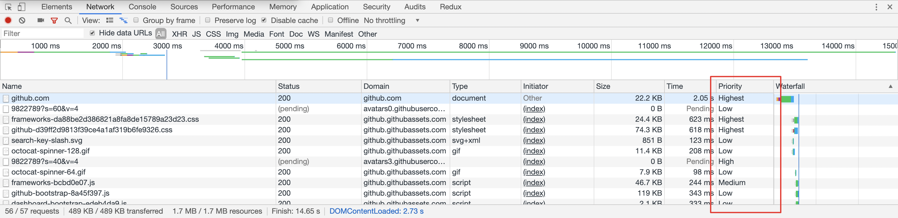

不过可惜的是，浏览器没有将优先级排序的能力给我们直接开放出来。但在一些场景下，我们可以通过更合理的使用媒体类型和媒体查询来实现资源加载的优先级。下面会介绍一下这种方法。

一些网站为了达到不同屏幕之间的兼容，可能会使用媒体查询的方式来构建它的样式系统。一般而言，我们都会把样式代码写在一起，例如导航的在各类屏幕下的样式都会放在 navigator.css 下，列表都会放在 list.css 下。

```html
<link rel="stylesheet" href="navigator.css" /> <link rel="stylesheet" href="list.css" />
```

这里带来的一个问题就是，在宽度小于 400px 的场景下，其实并不需要应用宽度 400px 以上的 CSS 样式。针对这个问题，link 标签上其实有一个 media 属性来处理媒体查询下的加载优先级。浏览器会优先下载匹配当前环境的样式资源，相对的，其他非匹配的优先级会下降。

```html
<link rel="stylesheet" href="navigator.css" media="all" />
<link rel="stylesheet" href="list.css" media="all" />
<link rel="stylesheet" href="navigator.small.css" media="(max-width: 500px)" />
<link rel="stylesheet" href="list.small.css" media="(max-width: 500px)" />
```

这样拆分后，当页面大于 500 px 时，navigator.small.css 和 list.small.css 的优先级会降低，同时，它们也不再会阻塞页面的渲染。需要注意的是，优先级降低代表可能会后加载，并非不加载。

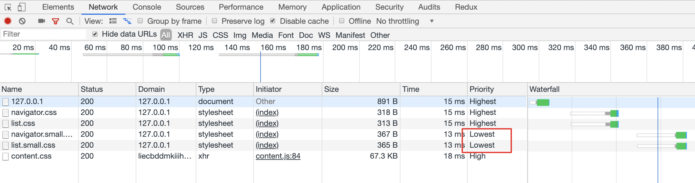

#### 慎用 @import

CSS 提供了一个 @import 语法来加载外部的样式文件。然而，这会把你的请求变得串行化。

考虑 index.css 这个资源，页面上是这么引用的：

```html
<link rel="stylesheet" href="index.css" />
```

而在 index.css 中引用了 other.css

```css
/* index.css */
@import url(other.css);
```

这样浏览器只有当下载了 index.css 并解析到其中 @import 时，才会再去请求 other.css。这是一个串行过程。

而如果我们把它改造为

```html
<link rel="stylesheet" href="index.css" /> <link rel="stylesheet" href="other.css" />
```

那就不需要等待 index.css 下载，几乎是并行执行了。

#### 谨慎对待 JavaScript 脚本的位置

将 “JavaScript 脚本放到页面尾部、CSS 放到页面头部”的模式。这只是大多数情况的处理方式。对于一些特殊情况，我们还是需要特殊处理的。

还记得之前提到的一些统计类、监控类的第三方脚本么？一般而言，第三方会提供你如下一段脚本，然后推荐你内联到页面中：

```html
<script>
  var script = document.createElement('script');
  script.src = 'vendor.lib.js';
  document.getElementsByTagName('head')[0].appendChild(script);
</script>
```

我们希望通过这样的方式来尽快异步加载脚本。然而，如果我们一不小心出现了下面这样的操作，可能会事与愿违：

```html
<link rel="stylesheet" href="navigator.css" />
<script>
  var script = document.createElement('script');
  script.src = 'vendor.lib.js';
  document.getElementsByTagName('head')[0].appendChild(script);
</script>
```

这时，navigator.css 的加载会阻塞后面的 JavaScript 执行，这是为了防止后续脚本对样式的查询出现不确定性。所以，这两个资源就变成了串行加载。

要优化这个问题很简单，调换一下顺序即可：

```html
<script>
  var script = document.createElement('script');
  script.src = 'vendor.lib.js';
  document.getElementsByTagName('head')[0].appendChild(script);
</script>
<link rel="stylesheet" href="navigator.css" />
```

这时，vendor.lib.js 和 navigator.css 就会并行加载了。当然，你需要确保不需要查询 navigator.css 样式应用后的信息。

### 减少包体大小

#### 压缩

CSS 同样可以进行压缩，与 JavaScript 类似，也有相应的 CSS uglify 工具，例如 clean-css，可以优化代码、删除多余的换行与空格。

同时，由于 CSS 同样是文本内容，因此针对文本的各类压缩算法同样适用，最常用到的就是 gzip。如何在 Nginx 上开启它之前也介绍过，这里就不赘述了。

#### 选择合适的兼容性

对于 CSS 的 polyfill，同样可以配合 browserslist 来实现你的业务场景下的兼容性支持。比较常见的是配合 Autoprefixer 和 PostCSS Preset Env 来使用。可以根据指定的浏览器范围，决定使用哪些 CSS polyfill 来帮助你将新的 CSS 代码转换为旧的浏览器能识别的内容。

### 解析与渲染树构建

#### 简化选择器

在 [浏览器的工作原理：新式网络浏览器幕后揭秘](https://www.html5rocks.com/zh/tutorials/internals/howbrowserswork/) 一文中，作者介绍了样式计算的原理。虽然文章发布时间比较早了，但其中部分内容还是具有参考价值的。

其中指出了，样式数据是一个超大的结构，为每一个元素查找匹配的规则会造成性能问题，同时，复杂的层叠规则也会带来很高的复杂度。针对这些问题浏览器也做了很多优化。

正是由于这些问题，我们应该尽量避免不必要的选择器复杂度。例如下面这个复杂选择器：

```css
body > main.container > section.intro h2:nth-of-type(odd) + p::first-line a[href$='.pdf'] {
  /* …… */
}
```

不过一般情况下我们是不会写出如此复杂的选择器的。但有一个情况还是需要注意一下，就是使用 SASS、LESS 这样的工具时，避免过多的嵌套。以 LESS 为例：

```less
.list {
  .item {
    .product {
      .intro {
        .pic {
          height: 200px;
        }
      }
    }
  }
}
```

由于过多的嵌套，编译后会产生如下选择器：

```css
.list .item .product .intro .pic {
  height: 200px;
}
```

当然，你也可以考虑使用类似 BEM 这样的方式来进行 CSS className 的组织与命名，避免过多的嵌套层级。这里有一篇[文章](https://www.sitepoint.com/optimizing-css-id-selectors-and-other-myths/)介绍了选择器的匹配成本。

不过千万要注意了，代码的可维护性还是最重要的，不要为了过分简化选择器而放弃了代码语义和可维护性。我们仅仅是要尽量避免像上面那样的一些过分复杂的、或者不必要的繁琐的选择器。

#### 避免使用昂贵的属性

有一些 CSS 的属性在渲染上是有比较高的成本的，渲染速度相较而言也会慢些。在不同的浏览器上，具体的表现不太一致，但总体来说，下面一些属性是比较昂贵的：

-  border-radius
-  box-shadow
-  opacity
-  transform
-  filter
-  position: fixed

#### 使用先进的布局方式

对于页面布局，我们有很多方法，例如 float、positioning、flex、grid 等。float 本身设计出来并非是为了处理复杂的布局，但是通过大家的发掘和研究，已经可以通过它来实现很多种布局形式了。基于兼容性考虑，float 也成为了流行的布局方式。

不过，一些资料也指出，使用新版的 flex 进行布局比我们用的一些“老式”方法性能更好（例如基于 float 的浮动布局）。flex 在移动端具有不错的兼容性，很多移动场景下已经大规模使用 flex 进行页面布局。同时，虽然 flex 有兼容性要求，但由于很多 PC 站都不再兼容低版本 IE，因此也可以开始尝试使用它。

### 利用缓存

与其他静态资源类似，我们仍然可以使用各类缓存策略来加速资源的加载。

此外，如果使用 webpack 作为构建工具，我们一般会使用 css-loader 和 style-loader，这样可以直接在 JavaScript 代码中 import 样式文件。不过这样带来的一个问题就是样式代码其实是耦合在 JavaScript 代码中的，通过运行时添加 style 标签注入页面。

一个更好的做法是在生产环境中将样式信息单独抽离成 CSS 文件，这样也可以更好地利用缓存。在 webpack v4.x 之前的版本中，我们习惯于用 ExtractTextWebpackPlugin 插件。不过在 v4.x 之后，对于 CSS 的抽取，推荐使用 MiniCssExtractPlugin 插件。它可以将样式信息单独抽离出 CSS 文件来。基础的使用方式如下：

```js
// webpack.config.js
const MiniCssExtractPlugin = require('mini-css-extract-plugin');
module.exports = {
  plugins: [
    new MiniCssExtractPlugin({
      filename: '[contenthash:8].css',
      chunkFilename: '[contenthash:8].css'
    })
  ],
  module: {
    rules: [
      {
        test: /\.css$/,
        use: [MiniCssExtractPlugin.loader, 'css-loader']
      }
    ]
  }
};
```

相较于 JavaScript，用户对 CSS 的可控性可能会稍弱一些，基础的优化点也许没有那么多。但随着 CSS 特性（例如 [Houdini/CSS Paint API](https://codersblock.com/blog/say-hello-to-houdini-and-the-css-paint-api/)）的不断发展，相信也会有更多我们需要关注的优化点。

## 图片

优质的图片可以有效吸引用户，给用户良好的体验，所以随着互联网的发展，越来越多的产品开始使用图片来提升产品体验。相较于页面其他元素，图片的体积不容忽视。下图是截止 2019 年 6 月 HTTP Archive 上统计的网站上各类资源加载的体积：

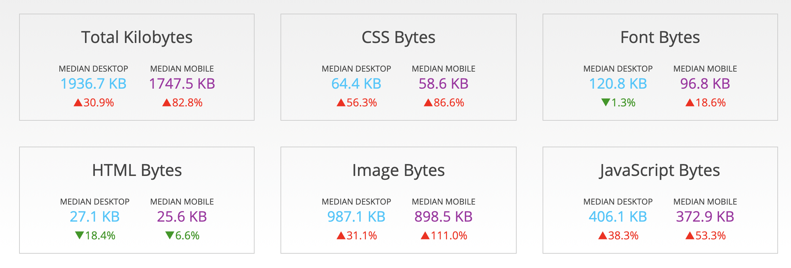

可以看到，图片占据了半壁江山。同样，在一篇 2018 年的文章中，也提到了图片在网站中体量的平均占比已经超过了 50%。然而，随着平均加载图片总字节数的增加，图片的请求数却再减少，这也说明网站使用的图片质量和大小正在不断提高。

所以，如果单纯从加载的字节数这个维度来看性能优化，那么很多时候，优化图片带来的流量收益要远高于优化 JavaScript 脚本和 CSS 样式文件。下面我们就来看看，如何优化图片资源。

### 优化请求数

#### 雪碧图

图片可以合并么？当然。最为常用的图片合并场景就是雪碧图（Sprite）。

在网站上通常会有很多小的图标，不经优化的话，最直接的方式就是将这些小图标保存为一个个独立的图片文件，然后通过 CSS 将对应元素的背景图片设置为对应的图标图片。这么做的一个重要问题在于，页面加载时可能会同时请求非常多的小图标图片，这就会受到浏览器并发 HTTP 请求数的限制。我见过一个没有使用雪碧图的页面，首页加载时需要发送 20+ 请求来加载图标。将图标合并为一张大图可以实现「20+ → 1」的巨大缩减。

雪碧图的核心原理在于设置不同的背景偏移量，大致包含两点：

-  不同的图标元素都会将 background-url 设置为合并后的雪碧图的 uri；
-  不同的图标通过设置对应的 background-position 来展示大图中对应的图标部分。

你可以用 Photoshop 这类工具自己制作雪碧图。当然比较推荐的还是将雪碧图的生成集成到前端自动化构建工具中，例如在 webpack 中使用 webpack-spritesmith，或者在 gulp 中使用 gulp.spritesmith。它们两者都是基于 spritesmith 这个库，你也可以自己将这个库集成到你喜欢的构建工具中。

#### 懒加载

我们知道，一般来说我们访问一个页面，浏览器加载的整个页面其实是要比可视区域大很多的，也是什么我们会提出“首屏”的概念。这就导致其实很多图片是不在首屏中的，如果我们都加载的话，相当于是加载了用户不一定会看到图片。而图片体积一般都不小，这显然是一种流量的浪费。这种场景在一些带图片的长列表或者配图的博客中经常会遇到。

解决的核心思路就是图片懒加载，尽量只加载用户正在浏览或者即将会浏览到的图片。实现上来说最简单的就是通过监听页面滚动，判断图片是否进入视野，从而真正去加载图片：

```js
// 方法一：el.offsetTop - document.documentElement.scrollTop <= viewPortHeight
function loadIfNeeded($img) {
  // viewPortHeight 兼容所有浏览器写法
  const viewPortHeight = window.innerHeight || document.documentElement.clientHeight || document.body.clientHeight;
  const offsetTop = $img.offsetTop;
  const scrollTop = document.documentElement.scrollTop || document.body.scrollTop;
  const top = offsetTop - scrollTop;
  if (top <= viewPortHeight) {
    $img.src = $img.dataset.src;
    $img.classList.remove('lazy');
  }
}

// 方法二：el.getBoundingClientReact().top <= viewPortHeight
function loadIfNeeded($img) {
  const viewPortHeight = window.innerHeight || document.documentElement.clientHeight || document.body.clientHeight;
  const top = $img.getBoundingClientRect() && $img.getBoundingClientRect().top;
  if (top <= viewPortHeight) {
    $img.src = $img.dataset.src;
    $img.classList.remove('lazy');
  }
}

// 方法三：intersectionRatio > 0 && intersectionRatio <= 1
function loadIfNeeded($img) {
  const io = new IntersectionObserver((ioes) => {
    ioes.forEach((ioe) => {
      const el = ioe.target;
      const intersectionRatio = ioe.intersectionRatio;
      if (intersectionRatio > 0 && intersectionRatio <= 1) {
        $img.src = $img.dataset.src;
        $img.classList.remove('lazy');
        io.unobserve(el);
      }
      el.onload = el.onerror = () => io.unobserve(el);
    });
  });
  io.observe($img);
}

// 这里使用了 throttle，你可以实现自己的 throttle，也可以使用 lodash
const lazy = throttle(function() {
  const $imgList = document.querySelectorAll('.lazy');
  if ($imgList.length === 0) {
    document.removeEventListener('scroll', lazy);
    window.removeEventListener('resize', lazy);
    window.removeEventListener('orientationchange', lazy);
    return;
  }
  $imgList.forEach(loadIfNeeded);
}, 200);

document.addEventListener('scroll', lazy);
window.addEventListener('resize', lazy);
window.addEventListener('orientationchange', lazy);
```

对于页面上的元素只需要将原本的 src 值设置到 data-src 中即可，而 src 可以设置为一个统一的占位图。注意，由于页面滚动、缩放和横竖方向（移动端）都可能会改变可视区域，因此添加了三个监听。

当然，这是最传统的方法，现代浏览器还提供了一个更先进的 Intersection Observer API 来做这个事，它可以通过更高效的方式来监听元素是否进入视口。考虑兼容性问题，在生产环境中建议使用对应的 polyfill。

如果想使用懒加载，还可以借助一些已有的工具库，例如 aFarkas/lazysizes、verlok/lazyload、tuupola/lazyload 等。

在使用懒加载时也有一些注意点：

-  首屏可以不需要懒加载，对首屏图片也使用懒加载会延迟图片的展示。
-  设置合理的占位图，避免图片加载后的页面“抖动”。
-  虽然目前基本所有用户都不会禁用 JavaScript，但还是建议做一些 JavaScript 不可用时的 backup。

对于占位图这块可以再补充一点。为了更好的用户体验，我们可以使用一个基于原图生成的体积小、清晰度低的图片作为占位图。这样一来不会增加太大的体积，二来会有很好的用户体验。LQIP (Low Quality Image Placeholders) 就是这种技术。目前也已经有了 LQIP 和 SQIP(SVG-based LQIP) 的自动化工具可以直接使用。

#### CSS 中的图片懒加载

除了对于 `` 元素的图片进行来加载，在 CSS 中使用的图片一样可以懒加载，最常见的场景就是 background-url。

```css
.login {
  background-url: url('/static/img/login.png');
}
```

对于上面这个样式规则，如果不应用到具体的元素，浏览器不会去下载该图片。所以你可以通过切换 className 的方式，放心得进行 CSS 中图片的懒加载。

#### 内联 base64

还有一种方式是将图片转为 base64 字符串，并将其内联到页面中返回，即将原 url 的值替换为 base64。这样，当浏览器解析到这个的图片 url 时，就不会去请求并下载图片，直接解析 base64 字符串即可。

但是这种方式的一个缺点在于相同的图片，相比使用二进制，变成 base64 后体积会增大 33%。而全部内联进页面后，也意味着原本可能并行加载的图片信息，都会被放在页面请求中（像当于是串行了）。同时这种方式也不利于复用独立的文件缓存。所以，使用 base64 需要权衡，常用于首屏加载 CRP 或者骨架图上的一些小图标。

### 减小图片大小

#### 使用合适的图片格式

使用合适的图片格式不仅能帮助你减少不必要的请求流量，同时还可能提供更好的图片体验。

图片格式是一个比较大的话题，选择合适的格式有利于性能优化。这里我们简单总结一些。

1.  使用 WebP：

   考虑在网站上使用 WebP 格式。在有损与无损压缩上，它的表现都会优于传统（JPEG/PNG）格式。WebP 无损压缩比 PNG 的体积小 26%，webP 的有损压缩比同质量的 JPEG 格式体积小 25-34%。同时 WebP 也支持透明度。下面提供了一种兼容性较好的写法。

   ```html
   <picture>
     <source type="image/webp" srcset="/static/img/perf.webp" />
     <source type="image/jpeg" srcset="/static/img/perf.jpg" />
     
   </picture>
   ```

2.  使用 SVG 应对矢量图场景：

   在一些需要缩放与高保真的情况，或者用作图标的场景下，使用 SVG 这种矢量图非常不错。有时使用 SVG 格式会比相同的 PNG 或 JPEG 更小。

3.  使用 video 替代 GIF：

   在兼容性允许的情况下考虑，可以在想要动图效果时使用视频，通过静音（muted）的 video 来代替 GIF。相同的效果下，GIF 比视频（MPEG-4）大 5 ～ 20 倍。Smashing Magazine 上有篇文章[9]详细介绍使用方式。

4.  渐进式 JPEG：

   基线 JPEG (baseline JPEG) 会从上往下逐步呈现，类似下面这种：

   

   而另一种渐进式 JPEG (progressive JPEG) 则会从模糊到逐渐清晰，使人的感受上会更加平滑。

   

   不过渐进式 JPEG 的解码速度会慢于基线 JPEG，所以还是需要综合考虑 CPU、网络等情况，在实际的用户体验之上做权衡。

#### 图片质量的权衡

图片的压缩一般可以分为有损压缩（lossy compression）和无损压缩（lossless compression）。顾名思义，有损压缩下，会损失一定的图片质量，无损压缩则能够在保证图片质量的前提下压缩数据大小。不过，无损压缩一般可以带来更可观的体积缩减。在使用有损压缩时，一般我们可以指定一个 0-100 的压缩质量。在大多数情况下，相较于 100 质量系数的压缩，80 ～ 85 的质量系数可以带来 30 ～ 40% 的大小缩减，同时对图片效果影响较小，即人眼不易分辨出质量效果的差异。

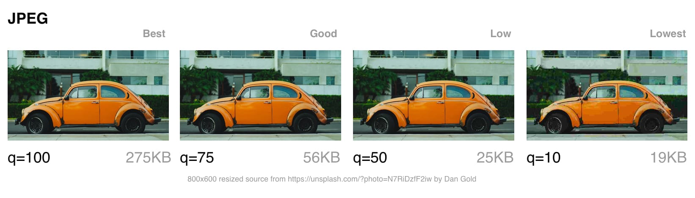

处理图片压缩可以使用 imagemin 这样的工具，也可以进一步将它集成至 webpack、Gulp、Grunt 这样的自动化工具中。

#### 使用合适的大小和分辨率

由于移动端的发展，屏幕尺寸更加多样化了。同一套设计在不同尺寸、像素比的屏幕上可能需要不同像素大小的图片来保证良好的展示效果；此外，响应式设计也会对不同屏幕上最佳的图片尺寸有不同的要求。

以往我们可能会在 1280px 宽度的屏幕上和 640px 宽度的屏幕上都使用一张 400px 的图，但很可能在 640px 上我们只需要 200px 大小的图片。另一方面，对于如今盛行的“2 倍屏”、“3 倍屏”也需要使用不同像素大小的资源。

好在 HTML5 在 `` 元素上为我们提供了 srcset 和 sizes 属性，可以让浏览器根据屏幕信息选择需要展示的图片。

```html

```

#### 删除冗余的图片信息

你也许不知道，很多图片含有一些非“视觉化”的元信息（metadata），带上它们可会导致体积增大与安全风险。元信息包括图片的 DPI、相机品牌、拍摄时的 GPS 等，可能导致 JPEG 图片大小增加 15%。同时，其中的一些隐私信息也可能会带来安全风险。

所以如果不需要的情况下，可以使用像 imageOptim 这样的工具来移除隐私与非关键的元信息。

#### SVG 压缩

合适的场景下可以使用 SVG。针对 SVG 我们也可以进行一些压缩。压缩包括了两个方面：

首先，与图片不同，图片是二进制形式的文件，而 SVG 作为一种 XML 文本，同样是适合使用 gzip 压缩的。

其次，SVG 本身的信息、数据是可以压缩的，例如用相比用 `<path>` 画一个椭圆，直接使用 `<ellipse>` 可以节省文本长度。关于信息的“压缩”还有更多可以优化的点。SVGGO 是一个可以集成到我们构建流中的 NodeJS 工具，它能帮助我们进行 SVG 的优化。当然你也可以使用它提供的 Web 服务。

### 缓存

与其他静态资源类似，我们仍然可以使用各类缓存策略来加速资源的加载。

图片作为现代 Web 应用的重要部分，在资源占用上同样也不可忽视。可以发现，在上面提及的各类优化措施中，同时附带了相应的工具或类库。平时我们主要的精力会放在 CSS 与 JavaScript 的优化上，因此在图片优化上可能概念较为薄弱，自动化程度较低。如果你希望更好得去贯彻图片的相关优化，非常建议将自动化工具引入到构建流程中。

除了上述的一些工具，这里再介绍两个非常好用的图片处理的自动化工具：Sharp 和 Jimp。

## 字体

有些时候，内置的字体并不能满足我们的需求，如果我们希望使用一些更有设计性的字体，我们一般会使用 @font-face 来加载字体文件：

```css
@font-face {
  font-family: 'Samplefont';
  src: url('/static/samplefont.woff2') format('woff2'), url('/static/samplefont.woff') format('woff');
}
```

然而这种方式的一大问题在于，在字体加载的期间，浏览器页面是默认不展示文本内容的。即我们常说的 FOIT (Flash of Invisible Text)。在现代浏览器中，FOIT 持续至多 3 秒，会带来糟糕的用户体验。所以在字体这部分的性能优化中，主要关注点在于如何平滑的加载字体。下面有一些解决方案。

### font-display

你可以在 @font-face 中设置 font-display: swap，他可以让 FOIT 的默认行为变为 FOUT (Flash of Unstyled Text)，即先会使用默认字体样式展示文本，字体加载完毕后再将文本的字体样式进行替换。

font-display 的取值包括 auto|block|swap|fallback|optional，不过目前该属性的兼容性一般。

### 内联字体

我们在上一节介绍过，可以使用 base64 将图片“内联”到页面中。同样的，字体也可以使用这种方式，这样就避免异步加载字体时的 FOIT 或 FOUT。我们可以将字体文件转为 base64 的字符串，设置到 @font-face 里的 src 属性上：

```css
@font-face {
  font-family: 'Samplefont';
  src: url('data:application/x-font-woff;charset=utf-8;base64,d09GRgABAAAAAHyoABMAAAAA4XQAAQAAAAAAAAAAAAAAAAAAAAAAAAAAAABG…')
    format('woff2');
}
```

但这种方式的局限性在于，在一个 @font-face 中只能加载一种字体类型。同时，与使用内联图片一样，这也会将本可以并行请求的数据量变为串行。

### 使用 CSS Font Loading API

CSS Font Loading API 是浏览器提供的，可以用来自定义控制字体加载的 API。这样你就可以在 JavaScript 中进行字体的加载，等加载完成后，再将需要应用新字体的元素设置为对应的样式，例如添加一个对应的 className。这里介绍了如何使用 CSS Font Loading API。

不过目前 CSS Font Loading API 的兼容性也不乐观。同时，由于一些困难也无法实现一个完美的 polyfill。因此如果想要使用类似的能力，可以考虑 Font Face Observer 这个库。基本的使用方式如下：

```js
const font = new FontFaceObserver('Samplefont');

font
  .load(null, 5000)
  .then(() => document.documentElement.classList.add('loaded'), () => console.log('Font is not available'));
```

```css
@font-face {
  font-family: 'Samplefont';
  src: url(/static/samplefont.woff2) format('woff2'), url(/static/samplefont.woff) format('woff');
}

body {
  font-family: sans-serif;
}

.loaded h1 {
  font-family: Samplefont, sans-serif;
  font-weight: 700;
}
```

### FOFT

在需要加载同一字体的粗体、斜体时，FOFT (Flash of Faux Text) 方法会非常有效。

首先你需要了解的是，对于一种字体，它的斜体与粗体是有专门的字符集的；与此同时，如果你指定了某种字体的粗体，但浏览器没有加载，那么你可以使用 font-synthesis 属性来让浏览器帮你模拟。而当实际的粗体或斜体加载完毕后，再使用实际的字体集。

具体实践起会借助上面提到的 CSS Font Loading API 或者 Font Face Observer，实现当字体加载完毕后的样式修改。

了解完字体的优化措施你会发现，它们主要集中于如何通过加载策略来降低甚至消除 FOIT。当然上面提到的这些策略与技术你可以组合使用，以达到所需的优化效果。

如果还想了解更多关于字体加载的问题，可以看看这篇文章里总结的[各类加载策略](https://www.zachleat.com/web/comprehensive-webfonts/)，它还随文提供了相应的代码示例。

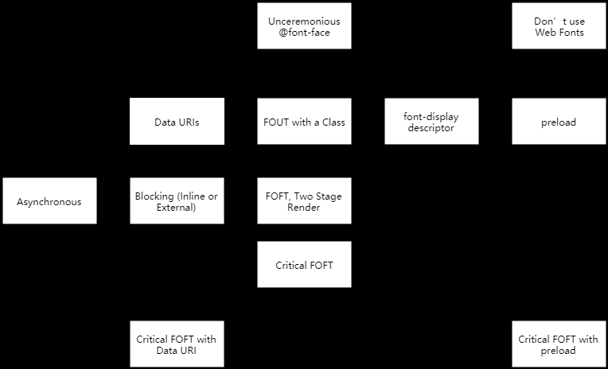

## 视频

视频作为一种重要的媒体形态，在网站中使用可以提高网站内容的丰富性，但同时对网络加载来说也是一个负担。所以会出现一些如下针对 Web 上视频的优化。

### 使用合适的视频格式

与图片类似，不同的视频编码格式，其数据大小也大都不同。目前在 HTML5 Video 中常用的格式为 MPEG-4。除了 MPEG-4 之外，还支持一种叫 WebM 的新的视频格式。

WebM(VP9) 相较于 MPEG-4(x264) 来说会更小，不过兼容性相对来说也较差。因此可以考虑在 `<video>` 中指定多个 `<source>`。

```html
<video>
  <source src="/static/video/me.webm" type="video/webm" />
  <source src="/static/video/me.mp4" type="video/mp4" />
</video>
```

此外，使用 AV1 编码会比 VP9(WebM) 小约 30%，比 x264(MPEG-4) 小约 45-50%。

### 视频压缩

对于视频，我们也可以进行有损与无损压缩，同样可以有效减少视频大小。下面列举了一些常用的工具：

-  HandBrake
-  Freemake
-  Hybrid
-  MeGUI

### 移除不必要的音轨信息

在上一节中我们提到，可以使用 `<video>` 代替 GIF 来实现动画，同时体积也会更小。由于在这种场景下本身就是不需要声音的，所以我们会将 `<video>` 设置为 muted。

那么，既然不需要声音，我们是不是可以直接移除掉音轨的数据？是的，这样做也会帮助进一步缩减视频的体积。

### 使用“流”

尝试让浏览器使用“流”或者小分片的方式来播放你的视频，例如常用的 HLS (HTTP Live Streaming) 技术。简单来说，使用 HLS 技术，你的视频会包含一个 .m3u8 的索引文件和一系列包含播放内容的 .ts 分片。浏览器通过不断下载一小段的分片来进行视频播放，避免了完整视频下载的流量消耗。

你也可以尝试使用 MPEG-DASH 这个技术，目前开源社区也有一个配套的客户端实现。

### 移除不必要的视频

对于不需要使用视频的场景，最好的优化方法就是去掉视频。例如在小屏幕上，你可以通过媒体查询来避免下载视频：

```css
@media screen and (max-width: 650px) {
  #hero-video {
    display: none;
  }
}
```

关于视频的优化这里只介绍了一些基本的手段，但对于一个重度的视频网站来说，会包含例如播放器 SDK 的优化、数据预取、码率自适应等更多的优化内容，在 2019 GMTC 上，B 站分享了他们的缩减首帧耗时的一系列优化措施，所以这里算是一个抛砖引玉。

此外，虽然上面介绍了一些视频处理的软件工具，但是如果有更高的定制化或集成需求，建议使用 [FFmpeg](https://www.ffmpeg.org/) 或其背后的[这些包](https://github.com/FFmpeg/FFmpeg#libraries)。

# 运行时

## 注意强制同步布局

### 什么是强制同步布局

作为前端，大家应该对“强制同步布局”并不陌生。如果你不太了解，这里简单介绍一下。首先你需要知道的是，显示器有一个自己的刷新频率，例如每秒 60 次（60 FPS）。这就意味着，每过 16.6ms，浏览器就会将截止上次刷新后的元素变动应用到屏幕上。这里就不得不提到渲染管线了。


在渲染管线中，有一步叫做 Layout，也就是布局。它会计算元素的大小、位置信息，而且一处的改动几乎会影响到整个文档页面。所以 Layout 的消耗是非常巨大的。而我们所说的 reflow（firefox）与 layout（Chrome/Opera/Safari/IE），都是指的这一过程。另一方面，渲染线程和 JavaScript 执行线程是互斥的，所以这 16.6ms 还会被 JavaScript 的执行所瓜分，可见时间并不那么“富裕”。

我们先来看一段代码：

```js
var $ele = document.getElementById('main');
var height = $ele.offsetHeight;
// ……
```

上述代码获取了元素的 offsetHeight 值，浏览器此时会使用上一次渲染后的缓存值进行返回，所以浏览器消耗并不大。

而有一些 JavaScript 操作会导致浏览器需要提前执行布局操作，这种操作就被称为“强制同步布局”。我们把上面的代码改成如下所示：

```js
var $ele = document.getElementById('main');
$ele.classList.remove('large');
var height = $ele.offsetHeight;
// ……
```

由于我们在修改元素的 className 后又立刻获取了它的高度，为了保证高度值正确，浏览器会立即进行布局，然而我们的本意可能并非如此 —— 也许 large 并不会影响高度，也许我们只是想获取上一帧的结果…… 针对这种目的，下面的写法会更合适，同时可以避免强制同步布局。

```js
var height = $ele.offsetHeight;
var $ele = document.getElementById('main');
$ele.classList.remove('large');
// ……
```

从这个例子可以看到，我们很可能一不小心就触发了强制同步布局。除了上例中的 offsetHeight，还有许多会触发强制同步布局的属性。而 CSS Triggers 这个网站在 Layout 之外，列出了各个浏览器中会触发 Paint 和 Composite 的 CSS 属性。

### 尝试使用 RAF 避免强制同步布局

在强制同步布局的问题上，还有一些更严重的列子，例如在循环中不断触发强制同步布局。

如果你希望避免在浏览器进行页面重绘后执行一些操作，你可以使用 requestAnimationFrame API。由于上一帧的旧布局值是可以直接获取的，所以我们可以将布局查询的操作放在 requestAnimationFrame 中。

```js
window.requestAnimationFrame(() => {
  var $ele = document.getElementById('main');
  var height = $ele.offsetHeight;
  // ……
});
```

但是请注意，如果像下面这样犯了和之前一样的错误，在查询布局之前设置了新的元素样式/布局属性，那使用了 requestAnimationFrame 也无法避免性能问题。

```js
window.requestAnimationFrame(function() {
  var $ele = document.getElementById('main');
  $ele.classList.remove('large');
  var height = $ele.offsetHeight;
  // ……
});
```

### 批量化你的操作

批量化是计算机程序优化中的重要手段之一。例如一些数据库在写操作上最终也是会将其批量化后再统一进行磁盘 I/O。所以对于元素布局的查询操作，我们也可以尝试使用这种手段。我们可以将这些操作批量化存储下来，等到下一次 requestAnimationFrame 触发时一起执行。FastDom 就是一个帮你封装了这类操作的开源库。

> By batching DOM access we avoid unnecessary document reflows and dramatically speed up layout performance. Each measure/mutate job is added to a corresponding measure/mutate queue. The queues are emptied (reads, then writes) at the turn of the next frame using window.requestAnimationFrame.

上面是它的基本工作原理，和我们提到的思路是一样的。基本的使用方法如下：

```js
fastdom.measure(() => {
  const width = element.clientWidth;
});
```

```js
fastdom.mutate(() => {
  element.style.width = width + 'px';
});
```

## 长列表优化

有些时候，你可能会需要在页面上展示一个包含上百个元素的列表（例如一个 Feed 流）。每个列表元素还有着复杂的内部结构，这显然提高了页面渲染的成本。甚至当你使用一些像 React 这样的库时，长列表的问题会被进一步放大。那么，有没有什么方法来优化长列表呢？

### 实现 Virtual List

Virtual List 是一种用来优化长列表的技术。它可以保证在列表元素不断增加，或者列表元素很多的情况下，依然拥有很好的滚动、浏览性能。它的核心思想在于：只渲染可见区域附近的列表元素。下图左边就是 Virtual List 的效果，可以看到只有视口内和临近视口的上下区域内的元素会被渲染。


不过这样带来的一个问题就是，由于只渲染固定 N 个元素，所以在页面滚动后，它们仍然留在原位。对于这个问题可以使用 `position: absolute` 配合 `transform: translate3d()` 来解决，手动设置展示元素的偏移量。

其大致的实现思路如下：

1.  监听页面滚动（或者其他导致视口变化的事件）；
2.  滚动时根据滚动的距离计算需要展示的列表项；
3.  将列表项中展示的数据与组件替换成当前需要展示的内容；
4.  修改偏移量到对应的位置。

这样还有一个好处，相当于是不断改变这 N 个元素的位置属性和内部的一些节点，不会有频繁的 DOM 创建与销毁，配合下面提到的 composite 可以获得不错的性能。

如果你想要使用这项技术，除了自己实现外，一些常见的框架也有不错的开源实现。例如：

-  基于 React 的 react-virtualized，它的开发者也在 dev.to 上分享了一些[关于 virtual list 的内容](https://dev.to/nishanbajracharya/what-i-learned-from-building-my-own-virtualized-list-library-for-react-45ik)；
-  基于 Vue 的 vue-virtual-scroll-list；
-  基于 Angular 的 ngx-virtual-scroller；

### 原生的 Virtual Scroller

Virtual List 在 feed 流、图片库等很多场景下非常有用，开源组件的下载量也说明了业务对这个功能的需求量。那么自然会想到，如果由浏览器层面来提供类似的能力，显然适用性会更强，性能可能也会更好。Virtual Scroller 就是上述逻辑的浏览器原生实现。Chrome Dev Summit 2018 上演示了它的效果。使用上也很简单：

```html
<script type="module">
  import 'std:virtual-scroller';
</script>

<virtual-scroller>
  <div>item 1</div>
  <div>item 2</div>
  <div>item 3</div>
  <div>item 4</div>
  ……
  <div>item 1000</div>
</virtual-scroller>
```

注意，`<virtual-scroller>` 是内置（built-in）模块提供的，所以需要从 std 中导入。目前（2019.08）还不建议在生产环境中使用该功能。如果想得到类似的效果还是建议使用基于 JavaScript 实现的库。当然，非常期待未来在生产环境中可以用上这个功能。

想了解更多关于 Virtual Scroller 的信息可以看这里。

## 避免 JavaScript 运行时间过长

上面我们提到了，屏幕的刷新频率决定了每帧之间留给 JavaScript 执行的时间“并不多”。也正是由于渲染线程和 JavaScript 线程之间互斥，所以 JavaScript 执行占用时间过长会导致无法及时渲染，即出现所谓的“掉帧”。下面我们来看下如何避免 JavaScript 长时间执行而导致的掉帧。

### 任务分解

你可以在 Chrome 控制台执行如下命令：

```js
document.body.innerHTML = '';
for (var i = 0; i < 100; i++) {
  1 + 1;
}
```

可以看到页面被立即清空了。然后我们修改一下迭代的次数，从 100 次增加到 10 亿次：

```js
document.body.innerHTML = '';
for (var i = 0; i < 1e9; i++) {
  1 + 1;
}
```

这时候运行你会发现页面没有变化，控制台也卡住了。过了几秒后页面被清空了。这是因为 JavaScript 的长时间执行阻塞了渲染线程。

既然长时间的运行会导致渲染阻塞，那么最简单的方法就是把我们的任务拆成一个个持续时间更短的小任务，分散到各个帧中执行，例如改造成下面这样：

```js
document.body.innerHTML = '';

let step = 0;
function subtask() {
  if (step === 1e9) {
    return;
  }
  window.requestAnimationFrame(function() {
    for (var i = 0; i < 1e8; i++) {
      step++;
      1 + 1;
    }
    subtask();
  });
}
subtask();
```

我们把 10 亿次分散为十个 1 亿次的子任务，虽然同样执行了 10 亿次计算，但是页面迅速被清空了。

此外，浏览器还有一个更强大的 API 来帮助你更精细地进行计算调度，它就是 requestIdleCallback。它会在浏览器“空闲”的时候执行注册的回调函数，避免在主线程“拥挤”的时候执行某些代码。它支持你设定一个超时参数，保证在超时后，即使仍然没有空闲时间也必须执行回调。回调函数会接收一个 IdleDeadline 类型的参数，你可以通过 .didTimeout 来查看是否是超时执行，还可以通过执行 .timeRemaining() 方法来查看剩余的空闲时间。

```js
window.requestIdleCallback(
  (deadline) => {
    if (deadline.timeRemaining() > 100) {
      // 一些可以等浏览器空闲了再去做的事
      // ……
    }
  },
  { timeout: 5000 }
);
```

### 延迟执行

一般来说，延迟执行分为两种策略：

-  一种是懒执行，例如当我需要某个值时，我才去计算；
-  第二种是延后执行，即利用 setTimeout、requestIdleCallback 这样的方法把计算放到后续的事件循环或空闲时刻。

一些场景下，这两个都是可行的方法。除此以外，在 Idle Until Urgent 中作者介绍了一种改进的方法：把计算放到 requestIdleCallback 中，如果你一直不需要用到计算结果也没有关系，它会等到空闲时再执行，不影响性能；而当你要使用时，如果还未计算好则会立刻进行计算并返回结果，同时取消未执行的 requestIdleCallback。

> 我们在这两部分都提及了 requestIdleCallback，它确实是个非常不错的 API，然而目前（2019.08）兼容性不是很乐观。如果你希望在生产环境中使用，建议使用 polyfill。

### 并行计算

对于一些 CPU 密集型的计算场景，除了在主 JavaScript 线程中拆分调度任务、异步执行之外，我们还可以考虑将计算与主线程并行。在浏览器中启用并行线程可以使用 Web Worker 中。在 Web Worker 标准出现之前，你能做的只是将任务异步化（asynchronously），而有了 Web Worker，你就可以并行（concurrency）地执行 JavaScript 了。

下面提供了 Web Worker 的基本使用方式：

```js
// index.js
const worker = new Worker('worker.js');

worker.addEventListener(
  'message',
  function(e) {
    console.log(`result is ${e.data}`);
  },
  false
);

worker.postMessage('start');

// worker.js
self.addEventListener(
  'message',
  function(e) {
    if (e.data === 'start') {
      // 一些密集的计算……
      self.postMessage(result);
    }
  },
  false
);
```

## 善用 Composite

Composite 这个概念和我们的渲染管线关系密切，可以看到它处于最后一步。


由于之前我们说到，元素布局可能会影响到整个页面，那么自然我们就会想，是否能尽可能减少影响的范围呢？在某些情况下是可以的。例如下面这两个元素：

```css
.main {
  height: 200px;
  width: 200px;
  background: black;
}

.fixed {
  position: fixed;
  top: 20px;
  left: 20px;
  transform: translateZ(0);
  width: 100px;
  height: 100px;
  background: red;
}
```

```html
<div class="main"></div>
<div class="fixed"></div>
```

浏览器会将其处理为两个渲染层，其中 .fixed 元素由于设置了 3D transform，所以会从普通的渲染层提升至合成层，拥有独立的 GraphicsLayers。当合成层更新时，浏览器会将布局调整限制在该层中，做到尽可能小的布局变动。下图展示了当前的两个合成层：

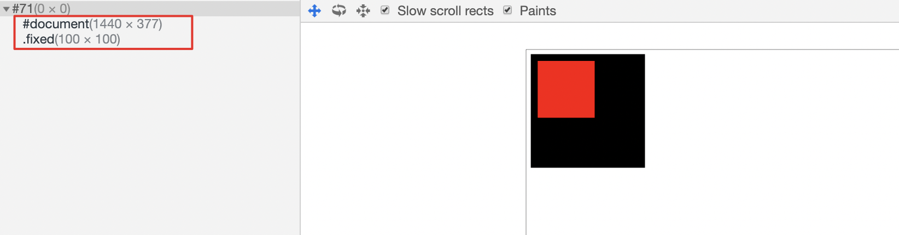

总得来说，合成层在性能优化上的优点在于：

-  合成层的位图，会交由 GPU 合成，比 CPU 处理要快；
-  当需要 repaint 时，只需要 repaint 本身，不会影响到其他的层；
-  对于 transform 和 opacity 效果，不会触发 layout 和 paint。

但同时，也要注意避免层爆炸，防止在无法进行层压缩的情况下出现过多的层，反而导致性能的下降。这篇文章介绍了 [composite 的原理及其相关应用](https://fed.taobao.org/blog/2016/04/26/performance-composite/)。

## 滚动事件的性能优化

前端最容易碰到的性能问题的场景之一就是监听滚动事件并进行相应的操作。由于滚动事件发生非常频繁（相较于用户点击、hover 等事件），所以频繁地执行监听回调就容易造成 JavaScript 执行与页面渲染之间互相阻塞的情况。

滚动的性能优化其实也是一种综合性的优化。它主要是会将上述的各类性能问题放大了，所以在优化措施中，你仍然需要避免出现上面提到的长时间的 JavaScript 执行、强制同步布局等问题。

此外，基于滚动这个特殊场景，这里再介绍两个处理滚动性能时非常常见的技术：防抖和节流。

当一个事件频繁触发，而你希望间隔一定的时间再触发相应的函数时就会使用节流（throttle）。例如在页面滚动时，每 200ms 进行一次页面背景颜色的修改。

当一个事件频繁触发，而你希望在事件触发结束一段时间后（此段时间内不再有触发）才实际触发响应函数时会使用防抖（debounce）。例如用户一直点击按钮，但你不希望频繁发送请求，你就可以设置当点击后 200ms 内用户不再点击时才发送请求。

这两个技术也是前端非常常用的技术，例如 lodash 中就有 throttle 和 debounce 的对应实现。

## Passive event listeners

在介绍 Passive event listeners 是如何让滚动更顺畅之前，我们先来看下为什么会有 Passive event listeners。

考虑下面这段代码：

```js
document.addEventListener(
  'touchstart',
  function(e) {
    // 做了一些操作……
    e.preventDefault();
  },
  true
);
```

我们知道，在 touchstart 中调用了 e.preventDefault() 会阻止页面的滚动与缩放。那么浏览器是如何知道不要让页面滚动与缩放的呢？当然是因为我们调用了 e.preventDefault()，你可能认为这是废话，不过问题就在这。如果浏览器不执行完监听回调里的代码，就不会知道开发者有没有禁止默认事件。所以不管你是否调用了 e.preventDefault()，当你添加触摸、滚轮的事件监听后，每次触发该事件，浏览器都会先花费事件执行完你的回调，然后根据结果来判断是否需要滚动页面。如果的操作花费了 200ms，那页面只能在 200ms 后再滚动或缩放，这就导致了性能问题。

那你肯定会想，很多时候我不会阻止默认事件呀，我有没有办法告诉浏览器，让它不用等啦（默认行为没有被禁用），直接滚动页面就行呢？Passive event listeners 就是为此而生的。使用方式很简单：

```js
document.addEventListener(
  'touchstart',
  function(e) {
    // 做了一些操作……
  },
  { passive: true }
);
```

只需要在第三个参数中传入 {passive: true} 即可。

然而和其他新特性一样，对于 Passive event listeners 我们也需要考虑兼容性。由于在低版本浏览器中，第三个参数是用来设置是否进行事件捕获的。所以使用时建议进行特性检测：

```js
// 这段特性检测的方法很巧妙，检测是否被使用
let supportsPassive = false;
try {
  const opts = Object.defineProperty({}, 'passive', {
    get: function() {
      supportsPassive = true;
    }
  });
  window.addEventListener('testPassive', null, opts);
  window.removeEventListener('testPassive', null, opts);
} catch (e) {}

document.addEventListener(
  'touchstart',
  function(e) {
    // 做了一些操作……
  },
  supportsPassive ? { passive: true } : false
);
```

这个[视频](https://www.youtube.com/watch?v=NPM6172J22g)展示了 Passive event listeners 带来的性能与体验提升，视频中右侧画面是使用了 Passive event listeners 的效果。

运行时性能是前端性能优化中非常重要的一块。这篇文章里列举了常见场景下的通用优化手段。此外，目前大多数应用都是构建在 React/Vue/Angular 之上（当然也有 jQuery），针对具体框架的性能优化又会是好几个新的话题，后续如果有机会也希望能将它们补充进来。

不过，不管什么框架在前端最终都会运行在浏览器上、使用 JavaScript 引擎（至少目前是），所以这些针对以这些通用性的性能优化思路作为基础，可以帮你更好理解与处理遇到的性能问题。

# 预加载

之前我们提到了很多关于资源加载的优化，包括怎么加快连接的建立、怎么减少包体大小、怎么减少请求数等。但还有一种变相加快加载速度的技术 —— 预加载。

预加载相当于是快用户一步，在空闲的时候就把用户即将用到的资源加载完，等用户实际需要使用时，资源已经存在在本地，自然就跳过了整个加载的等待时间。

这里会介绍一些预加载技术，包括使用浏览器提供的能力，或者巧用 JavaScript 中的相关 API。此外，除了预加载技术，预加载的一大核心问题还在于预加载策略，即如何判断资源是否需要预加载以及是否合适加载，以保证最高的效率。

## 预加载技术

### Resource Hints

Resource Hints 是一种预加载相关的标准，它告诉浏览器哪些源下的资源我们的 Web 应用需要获取，哪些资源在之后的操作或浏览时需要被使用，从而让浏览器能够进行一些预先连接或预先加载操作。Resource Hints 标准包括 DNS Prefetch、Preconnect、Prefetch 与 Prerender。此外，还有一个与 Resource Hints 类似的 Preload 我们也会在这里介绍一下。

在发起请求部分我们已经介绍了如何使用 DNS Prefetch 来预解析 DNS、如何使用 Preconnect 来预先建立连接。所以下面会介绍其他三块：Prefetch、Prerender、Preload。

#### Prefetch

你可以把 Prefetch 理解为资源预获取。一般来说，可以用 Prefetch 来指定在紧接着之后的操作或浏览中需要使用到的资源，让浏览器提前获取。由于仅仅是提前获取资源，因此浏览器不会对资源进行预处理，并且像 CSS 样式表、JavaScript 脚本这样的资源是不会自动执行并应用于当前文档的。其中 as 属性用于指定资源的类型，与 Preload 规范一致，基本涵盖了所有资源类型。

```html
<link rel="prefetch" href="/prefetch.js" as="script" />
```

#### Prerender

Prerender 比 Prefetch 更进一步，可以粗略地理解不仅会预获取，还会预执行。

> The prerender link relation type is used to identify a resource that might be required by the next navigation, and that the user agent SHOULD fetch and execute.

如果你指定 Prerender 一个页面，那么它依赖的其他资源，像 `<script>`、`<link>` 等页面所需资源也可能会被下载与处理。但是预处理会基于当前机器、网络情况的不同而被不同程度地推迟。例如，会根据 CPU、GPU 和内存的使用情况，以及请求操作的幂等性而选择不同的策略或阻止该操作。

```html
<link rel="prerender" href="//sample.com/nextpage.html" />
```

#### Preload

在遇到需要 Preload 的资源时，浏览器会立刻进行预获取，并将结果放在内存中，资源的获取不会影响页面 parse 与 load 事件的触发。直到再次遇到该资源的使用标签时，才会执行。由于我们会将 `<script>` 标签置于 `<body>` 底部来保证性能，因此可以考虑在 `<head>` 标签中适当添加这些资源的 Preload 来加速页面的加载与渲染。

```html
<link rel="preload" href="./nextpage.js" as="script" />
```

到这里大家肯定会好奇，Preload 与 Prefetch 有什么区别呢？它们非常容易混淆，在标准里有这么一段话解释两者区别：

> The application can use the preload keyword to initiate early, high-priority, and non-render-blocking fetch of a CSS resource that can then be applied by the application at appropriate time.

与 Prefetch 相比，Preload 会强制浏览器立即获取资源，并且该请求具有较高的优先级（mandatory and high-priority），因此建议对一些当前页面会马上用到资源使用 Preload；相对的，Prefetch 的资源获取则是可选与较低优先级的，其是否获取完全取决于浏览器的决定，适用于预获取将来可能会用到的资源。

如果对 Resource Hints 感兴趣，可以进一步了解[它们](https://juejin.cn/post/6844903645138403341)。

#### webpack 中的使用方式

预加载可以配合 code split 来使用，可以在降低初始加载量的情况下，尽量保证按需加载时的体验。在 webpack 中应用预加载非常简单，只需要在 dynamic import 中添加相应注释，webpack 就会知道你需要对这个 chunk 进行预加载。

```js
// prefetch
import(/* webpackPrefetch: true */ './sub1.js');

// preload
import(/* webpackPreload: true */ './sub2.js');
```

### 基于 JavaScript 的预加载

上面提到了基于 Resource Hints 的预加载技术，它其实像是一种声明式技术：你提出你的预加载需求，浏览器根据自身状态，选择合适的时候预加载。

如果你在不兼容 Resource Hints 的浏览器上进行预加载，或者希望有“更强硬的”预加载控制，你可能会希望使用一些 JavaScript 中的功能来“巧妙”地进行预加载。

例如对于图片

```js
let img = new Image();
img.src = '/static/img/prefetch.jpg';
```

上面的方法会触发浏览器加载图片，然后等到用户需要浏览时，再将其插入到页面即可。

对于 JavaScript 和 CSS 可以动态添加 `<script>`和 `<link>` 标签，不过要注意它们只有在添加到页面时浏览器才会加载（少数老式浏览器上这块表现会不太一样），由于添加到页面后加载完会执行该资源，所以要避免产生不需要的副作用（否则就不是预加载了）。

如果你希望通过 JavaScript 来进行预加载，可以使用 PreloadJS 这个库，它提供了包括脚本、样式、图片、字体、SVG 等各类资源的预加载器。

## 视频预加载

视频预加载技术可以有效提高视频播放的用户体验。在 [Fast Playback with Video Preload](https://developers.google.com/web/fundamentals/media/fast-playback-with-video-preload) 中提到了三种视频预加载方式。

### 为视频添加 preload 属性

使用 preload 属性可以让浏览器预加载相应的内容。其取值与作用如下表所示：

|  值  |                作用                |
| :--: | :--------------------------------: |
| none |      不载入视频（即不预加载）      |
| meta | 载入元数据（时长、尺寸、文字轨道） |
| auto |            加载整个视频            |

此外，你还可以设置 poster 属性，它规定视频下载时或用户点击播放按钮前播放器上显示的图像。一种推荐的方式是设置 poster 与 preload: meta，为用户提供一定的播放预览信息的同时避免过多的预加载流量。

### 使用 Preload Link

这一点已经在第一部分提到了，可以使用

```html
<link rel="preload" as="video" href="/static/sample.mp4" />
```

进行资源的预加载。

### 使用 JavaScript 进行自定义的 Buffer 操作

可以通过 HTTP Range 请求头来获取开始的一小段视频数据，然后使用 MediaSource API 来进行视频媒体数据的暂存与播放。

下面这段示例代码摘自 [Fast Playback with Video Preload - Manual buffering](https://developers.google.com/web/fundamentals/media/fast-playback-with-video-preload#manual_buffering)，它可以实现视频数据的预加载，更多相关实现可以参见其中内容。

```html
<video id="video" controls></video>

<script>
  const mediaSource = new MediaSource();
  video.src = URL.createObjectURL(mediaSource);
  mediaSource.addEventListener('sourceopen', sourceOpen, { once: true });

  function sourceOpen() {
    URL.revokeObjectURL(video.src);
    const sourceBuffer = mediaSource.addSourceBuffer('video/webm; codecs="vp09.00.10.08"');

    // Fetch beginning of the video by setting the Range HTTP request header.
    fetch('file.webm', { headers: { range: 'bytes=0-567139' } })
      .then((response) => response.arrayBuffer())
      .then((data) => {
        sourceBuffer.appendBuffer(data);
        sourceBuffer.addEventListener('updateend', updateEnd, { once: true });
      });
  }

  function updateEnd() {
    // Video is now ready to play!
    var bufferedSeconds = video.buffered.end(0) - video.buffered.start(0);
    console.log(bufferedSeconds + ' seconds of video are ready to play!');

    // Fetch the next segment of video when user starts playing the video.
    video.addEventListener('playing', fetchNextSegment, { once: true });
  }

  function fetchNextSegment() {
    fetch('file.webm', { headers: { range: 'bytes=567140-1196488' } })
      .then((response) => response.arrayBuffer())
      .then((data) => {
        const sourceBuffer = mediaSource.sourceBuffers[0];
        sourceBuffer.appendBuffer(data);
        // TODO: Fetch further segment and append it.
      });
  }
</script>
```

## 预加载的策略

预加载一般都会面临一些矛盾：

-  预加载资源过多，可能导致流量消耗过大，占用正常请求的通道；
-  预加载资源过少，可能导致覆盖率太低，对于大部分资源用户无法享受到预加载效果。

设计一个高效的预加载策略是一个很复杂的问题 ，这里只简单介绍一些工具。

### quicklink

quicklink 是 GoogleChromeLabs 推出的轻量级库，使用 Resource Hints 进行预加载，对于不支持的浏览器会回退到 XHR 模式。它的策略其实非常直接，核心就是当链接进入到视口后，会对其进行预加载。

当然我们还可以加一些其他策略，例如设定一个 200ms 的停留阈值。总体而言，它的策略还是比较简单的，更像是为前端预加载提供一个思路。如果感兴趣，可以从[这篇文章](https://juejin.im/post/5c21f8435188256d12597789)中了解 quicklink 的实现细节。

### Guess.js

Guess.js 则是一个更为完备的工具包。它会结合前端访问与打点的数据进行统计，甚至应用一些机器学习的模型，来提供一个更精细化、更准确的预加载策略。同时，在预加载之外，它还可以帮助实现最优的打包方式、加载路径等。核心就是通过大量的实际用户数据，来帮助前端性能优化做决策与预测。

你可以查看 [Guess.js Repo](https://github.com/guess-js/guess) 来进一步了解它，或者阅读这篇[介绍文章](https://blog.mgechev.com/2018/05/09/introducing-guess-js-data-driven-user-experiences-web/)。

# 总结

从整个前端访问链条的角度，来理解与掌握前端性能优化的知识和技术。

## 性能指标

Web 发展到现今阶段，性能指标已经不再只是 DOMContentLoad 和 load 这样的“面向浏览器”的指标，更多的会是以用户为中心（user-centric）的指标，例如：

-  FP (First Paint)
-  FID (First Input Delay)
-  FCP (First Contentful Paint)
-  FMP (First Meaningful Paint)
-  TTI (Time to interactive)

所以在性能优化之前最重要的还是明确你的监控指标和分析维度，关于性能指标其实也是一个可以继续聊下去的内容，这里就不展开了，以后有机会希望把这部分也补充进来。

## 持续优化

性能优化很多时候不是一蹴而就的，更不是一锤子买卖。一个良好的性能优化方案一定是一个持续循环的体系。

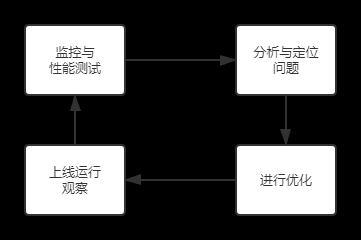

一个合理的性能优化方案，一定是通过线上的性能监控数据，或者前端自动化性能测试分析，发现性能问题，针对发现的问题进行分析与定位，然后进行对应的性能优化，最后上线观察。之后又会进入到下一个性能优化的循环中。所以推行性能优化，一定要注重优化工程的可持续性。

## 监控与测试

性能监控与测试也是一块非常大的话题，包括监控的手段、分析的维度等等，如果后续有机会希望把这块再补充上来。这里先介绍一下。

我们一般会把性能数据分为两种：

-  一种叫 Lab data，主要是在开发和测试人员本地或内部测试机器上跑出来的数据，例如在 CI/CD 中加入 lighthouse。它的优点在于采集的指标更全面，也易于复现问题；缺点主要在于有时候可能不能反应真实的用户体验情况。
-  另一种叫 Field data，也被称为 RUM (Real User Monitoring)，是指采集线上实际的性能数据来进行监控。它的优点则是能更好地发现用户实际遇到的性能问题；缺点主要是比较难以调试与复现问题，同时采集到的指标的详细程度不及 Lab data。

而 [The Three Types of Performance Testing](https://csswizardry.com/2018/10/three-types-of-performance-testing/) 则进一步划分出了三类性能测试。

-  第一种叫做 Proactive：它可以理解为是工程师在开发阶段，通过浏览器调试等本地工具来发现并解决性能问题（善于利用 Chrome DevTools 也是一个优秀前端工程师所需要具备的）；
-  第二种叫做 Reactive：它是一种自动化的性能测试，可以集成到自动化测试或流水线的其他阶段，会在构建与每次发布前执行；
-  第三种叫做 Passive：它就是在产品发布后，通过收集线上数据（或用户反馈）来发现性能问题，主要是基于一些 RUM。

选择哪种性能测试呢？答案是将它们结合使用（就像是自动化测试会结合单元测试、集成测试与端到端测试）。

对于一些易于标准化的性能标准，可以考虑使用 Proactive 和 Reactive 这样的 Lab data 来避免性能问题；而对于更复杂的业务场景，则可以通过 Passive 模式下的 Field data 进行监控。

## 自动化

在性能优化上，请务必将可以自动化的工作都自动化。

前端性能优化的链路包括了「缓存 -> 发送请求 -> 等待响应 -> 解析 -> 处理各类静态资源 -> 运行时 -> 预加载（等待后续的请求）」，还是比较复杂的。因此，建议通过一些工具来将工作自动化。否则很可能无法保证性能优化的持续实施，因为它从来不是一锤子买卖。

在旅程中的各个技术点上，我也都会提到一些帮助快速实现优化或自动化的工具，例如 Workbox 提供的各类缓存方案、图片压缩的工具、webpack 插件等。还包括上面提到的，可以在 CI/CD 中集成的 lighthouse 这样的分析工具。而对于 RUM，如果你们公司有人力可以自建一套体系，如果自建成本较高，可以考虑接入一些免费或收费的商业公司产品。
