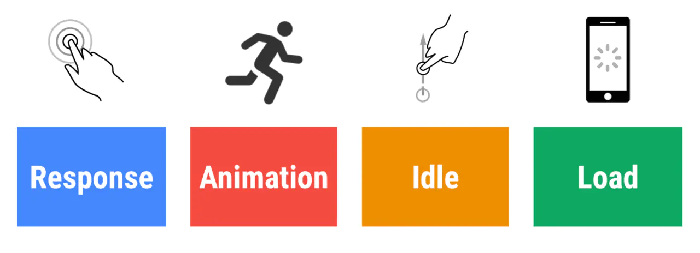
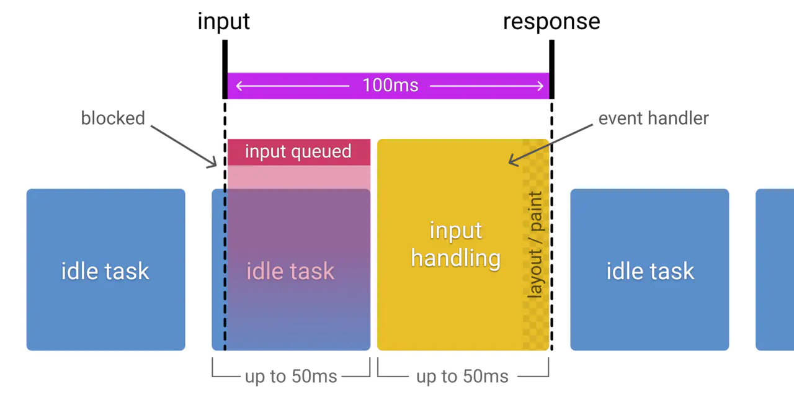

# RAIL 模型

RAIL 是一个以用户为中心的性能模型，它把用户的体验拆分成几个关键点（例如，tap，scroll，load），并且帮你定义好了每一个的性能指标。

有以下四个方面：

- Response
- Animation
- Idle
- Load



## 聚焦用户

以下是用户对性能延迟的感知：

| 延迟时间        | 用户感知                   |
| :-------------- | :------------------------- |
| 0-16ms          | 很流畅                     |
| 0-100ms         | 基本流畅                   |
| 100-1000ms      | 感觉到网站上有一些加载任务 |
| 1000ms or more  | 失去耐心了                 |
| 10000ms or more | 直接离开，不会再访问了     |

## Response: 事件处理最好在 50ms 内完成

### 目标

用户的输入到响应的时间不超过 100ms，给用户的感受是瞬间就完成了。

### 优化方案

- 事件处理函数在 50ms 内完成，考虑到 idle task 的情况，事件会排队，等待时间大概在 50ms。适用于 click，toggle，starting animations 等，不适用于 drag 和 scroll。
- 复杂的 js 计算尽可能放在后台，如 web worker，避免对用户输入造成阻塞
- 超过 50ms 的响应，一定要提供反馈，比如倒计时，进度百分比等。

> idle task：除了要处理输入事件，浏览器还有其它任务要做，这些任务会占用部分时间，一般情况会花费 50ms 的时间，输入事件的响应则排在其后。

下图是 idle task 对 input response 的影响：



## Animation: 在 10ms 内产生一帧

### 目标

- 产生每一帧的时间不要超过 10ms，为了保证浏览器 60 帧，每一帧的时间在 16ms 左右，但浏览器需要用 6ms 来渲染每一帧。
- 旨在视觉上的平滑。用户对帧率变化感知很敏感。

### 优化方案

- 在一些高压点上，比如动画，不要去挑战 cpu，尽可能地少做事，如：取 offset，设置 style 等操作。尽可能地保证 60 帧的体验。
- 在渲染性能上，针对不同的动画做一些特定优化

> 动画不只是 UI 的视觉效果，以下行为都属于
>
> - 视觉动画，如渐隐渐显，tweens，loading 等
> - 滚动，包含弹性滚动，松开手指后，滚动会持续一段距离
> - 拖拽，缩放，经常伴随着用户行为

## Idle: 最大化空闲时间

### 目标

最大化空闲时间，以增大 50ms 内响应用户输入的几率

### 优化方案

- 用空闲时间来完成一些延后的工作，如先加载页面可见的部分，然后利用空闲时间加载剩余部分，此处可以使用 requestIdleCallback API
- 在空闲时间内执行的任务尽量控制在 50ms 以内，如果更长的话，会影响 input handle 的 pending 时间
- 如果用户在空闲时间任务进行时进行交互，必须以此为最高优先级，并暂停空闲时间的任务

## Load: 传输内容到页面可交互的时间不超过 5 秒

如果页面加载比较慢，用户的焦点可能会离开。加载很快的页面，用户平均停留时间会变长，跳出率会更低，也就有更高的广告查看率

### 目标

- 优化加载速度，可以根据设备、网络等条件。目前，比较好的一个方式是，让你的页面在一个中配的 3G 网络手机上打开时间不超过 5 秒
- 对于第二次打开，尽量不超过 2 秒

### 优化方案

- 在手机设备上测试加载性能，选用中配的 3G 网络（400kb/s，400ms RTT），可以使用 [WebPageTest](https://www.webpagetest.org/easy) 来测试
- 要注意的是，即使用户的网络是 4G，但因为丢包或者网络波动，可能会比预期的更慢禁用渲染阻塞的资源
- [禁用渲染阻塞的资源，延后加载](https://web.dev/render-blocking-resources/)
- 可以采用 lazy load，code-splitting 等其他优化手段，让第一次加载的资源更少

## 总结

为了提升用户在网站的交互体验而不断探索。你需要去理解用户如何感知你的站点，这样才能设置最佳的性能目标

- 聚焦用户
- 100ms 内响应用户的输入
- 10ms 内产生 1 帧，在滚动或者动画执行时
- 最大化主线程的空闲时间
- 5s 内让网页变得可交互

# 性能优化

## 背景

性能优化一直以来都是前端工程领域中的一个重要部分。很多资料表明，网站应用的性能（加载速度、交互流畅度）优化对于提高用户留存、转化率等都有积极影响。可以理解为，提升你的网站性能，就是提升你的业务数据（甚至是业务收入）。

性能优化广义上会包含前端优化和后端优化。后端优化的关注点更多的时候是在增加资源利用率、降低资源成本以及提高稳定性上。相较于后端，前端的性能优化会更直接与用户的体验挂钩。从用户体验侧来说，前端服务 5s 的加载时间优化缩减 80%(1s) 与后端服务 50ms 的响应优化缩减 80%(10ms) 相比，用户的体验提升会更大。因此很多时候，与体验相关的性能的瓶颈会出现在前端。

> 当然后端性能优化非常重要，正如上面所说，它们的关注点可能不同。前端类似于最后一公里，由于和用户最近，所以性能问题会直接影响到用户体验。


## 缓存

[深入理解浏览器的缓存机制](/deep-learn-browser-cache/)

## 发送请求

在前一部分，我们介绍了浏览器缓存。当一个请求走过了各级前端缓存后，就会需要实际发送一个请求了。

> 在 HTTP 缓存中，我们其实也有发送请求；或者是在 HTTP/2 Push 下，使用了之前连接中推送的资源。不过为了保证思路的连贯，我还是把「发送请求」这个章节整体放在「缓存」之后了。

介绍网络请求其实可以包含复杂的网络知识。不过，今天咱们的旅程主要聚焦于“前端性能优化”。因此，主要会介绍一些在这个环节中，前端性能优化可能会做的事儿。

### 避免多余重定向

重定向是一个比较常用的技术手段。在一些情况下，你可能进行了服务迁移，修改了原有的 uri。这时候就可以使用重定向，把访问原网址的用户重定向到新的 uri。还有是在一些登录场景下，会使用到重定向技术。

重定向分为 301 的永久重定向和 302 的临时重定向。建议贴合语义，例如服务迁移的情况下，使用 301 重定向。对 SEO 也会更友好。

同时也不要滥用重定向。曾今也见过有业务在访问后重定向 3 次的情况，其实里面有些是不必要的。每次重定向都是有请求耗时的，建议避免过多的重定向。

### DNS 预解析

基本我们访问远程服务的时候，不会直接使用服务的 IP，而是使用域名。所以请求的一个重要环节就是域名解析。

DNS 服务本身是一个树状层级结构，其解析是一个递归与迭代的过程。例如 github.com 的大致解析流程如下：

1. 先检查本地 hosts 文件中是否有映射，有则使用；
2. 查找本地 DNS 缓存，有则返回；
3. 根据配置在 TCP/IP 参数中设置 DNS 查询服务器，并向其进行查询，这里先称为本地 DNS；
4. 如果该服务器无法解析域名（没有缓存），且不需要转发，则会向根服务器请求；
5. 根服务器根据域名类型判断对应的顶级域名服务器（.com），返回给本地 DNS，然后重复该过程，直到找到该域名；
6. 当然，如果设置了转发，本地 DNS 会将请求逐级转发，直到转发服务器返回或者也不能解析。

这里我们需要了解的是：

- 首先，DNS 解析流程可能会很长，耗时很高，所以整个 DNS 服务，包括客户端都会有缓存机制，这个作为前端不好涉入；
- 其次，在 DNS 解析上，前端还是可以通过浏览器提供的其他手段来“加速”的。

DNS Prefetch 就是浏览器提供给我们的一个 API。它是 Resource Hint 的一部分。它可以告诉浏览器：过会我就可能要去 yourwebsite.com 上下载一个资源啦，帮我先解析一下域名吧。这样之后用户点击某个按钮，触发了 yourwebsite.com 域名下的远程请求时，就略去了 DNS 解析的步骤。使用方式很简单：

```html
<link rel="dns-prefetch" href="//yourwebsite.com" />
```

当然，浏览器并不保证一定会去解析域名，可能会根据当前的网络、负载等状况做决定。标准里也明确写了

> user agent SHOULD resolve as early as possible

### 预先建立连接

我们知道，建立连接不仅需要 DNS 查询，还需要进行 TCP 协议握手，有些还会有 TLS/SSL 协议，这些都会导致连接的耗时。使用 Preconnect 可以帮助你告诉浏览器：“我有一些资源会用到某个源（origin），你可以帮我预先建立连接。”

根据规范，当你使用 Preconnect 时，浏览器大致做了如下处理：

- 首先，解析 Preconnect 的 url；
- 其次，根据当前 link 元素中的属性进行 cors 的设置；
- 然后，默认先将 credential 设为 true，如果 cors 为 Anonymous 并且存在跨域，则将 credential 置为 false；
- 最后，进行连接。

使用 Preconnect 只需要将 rel 属性设为 preconnect 即可：

```html
<link rel="preconnect" href="//sample.com" />
```

当然，你也可以设置 CORS：

```html
<link rel="preconnect" href="//sample.com" crossorigin />
```

需要注意的是，标准并没有硬性规定浏览器一定要（而是 SHOULD）完成整个连接过程，与 DNS Prefetch 类似，浏览器可以视情况完成部分工作。

### 使用 CDN

当我们实际把网络包发向我们的目标地址时，肯定希望越快到达目的地越好（对应的，也会希望越快获得响应）。而网络传输是有极限的，同样一个北京的用户，访问北京的服务器显然要比广州快很多。同时，服务的负载也会影响响应的速度。

对于静态资源，我们可以考虑通过 CDN 来降低时延。

对于使用 CDN 的资源，DNS 解析会将 CDN 资源的域名解析到 CDN 服务的负载均衡器上，负载均衡器可以通过请求的信息获取用户对应的地理区域，从而通过负载均衡算法，在背后的诸多服务器中，综合选择一台地理位置近、负载低的机器来提供服务。例如为北京联通用户解析北京的服务器 IP。这样，用户在之后访问 CDN 资源时都是访问北京服务器，距离近，速度快。

下图是请求声明周期中各个阶段的示意图，可以帮助我们理解发送请求（以及接收响应）的流程。


在缓存没法满足我们的情况下，就要开始真正发送请求了。从前端性能优化视角，我们会关注重定向、DNS 解析等问题，从而加速请求。但这块还预留了一小部分 —— 服务端的处理与响应。

过去，我们会将前端局限在浏览器中，但是随着 NodeJS 的兴起，很多业务都引入了基于 NodeJS 的 BFF 来为前端（客户端端）提供服务。所以咱们这次的旅程也会简单聊一下，在这一阶段可以做的一些优化。

// TODO https://alienzhou.com/projects/fe-performance-journey/3-response/#_1-%E4%BD%BF%E7%94%A8%E6%B5%81%E8%BF%9B%E8%A1%8C%E5%93%8D%E5%BA%94
