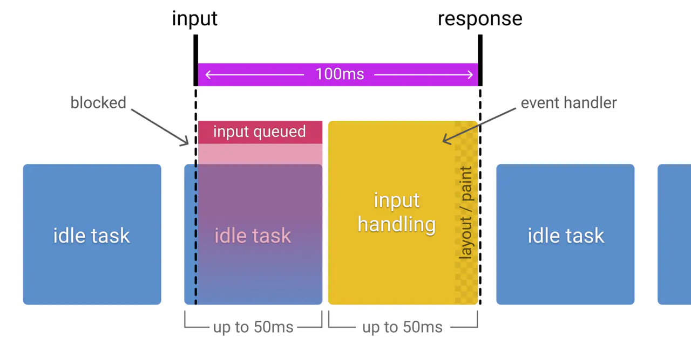

RAIL 是一个以用户为中心的性能模型，它把用户的体验拆分成几个关键点（例如，tap，scroll，load），并且帮你定义好了每一个的性能指标。

有以下四个方面：

- Response
- Animation
- Idle
- Load

# 聚焦用户

以下是用户对性能延迟的感知：

| 延迟时间        | 用户感知                   |
| :-------------- | :------------------------- |
| 0-16ms          | 很流畅                     |
| 0-100ms         | 基本流畅                   |
| 100-1000ms      | 感觉到网站上有一些加载任务 |
| 1000ms or more  | 失去耐心了                 |
| 10000ms or more | 直接离开，不会再访问了     |

# Response: 事件处理最好在 50ms 内完成

## 目标

用户的输入到响应的时间不超过 100ms，给用户的感受是瞬间就完成了。

## 优化方案

- 事件处理函数在 50ms 内完成，考虑到 idle task 的情况，事件会排队，等待时间大概在 50ms。适用于 click，toggle，starting animations 等，不适用于 drag 和 scroll。
- 复杂的 js 计算尽可能放在后台，如 web worker，避免对用户输入造成阻塞
- 超过 50ms 的响应，一定要提供反馈，比如倒计时，进度百分比等。

> idle task：除了要处理输入事件，浏览器还有其它任务要做，这些任务会占用部分时间，一般情况会花费 50ms 的时间，输入事件的响应则排在其后。

下图是 idle task 对 input response 的影响：

# Animation: 在 10ms 内产生一帧

## 目标

- 产生每一帧的时间不要超过 10ms，为了保证浏览器 60 帧，每一帧的时间在 16ms 左右，但浏览器需要用 6ms 来渲染每一帧。
- 旨在视觉上的平滑。用户对帧率变化感知很敏感。

## 优化方案

- 在一些高压点上，比如动画，不要去挑战 cpu，尽可能地少做事，如：取 offset，设置 style 等操作。尽可能地保证 60 帧的体验。
- 在渲染性能上，针对不同的动画做一些特定优化

> 动画不只是 UI 的视觉效果，以下行为都属于
>
> - 视觉动画，如渐隐渐显，tweens，loading 等
> - 滚动，包含弹性滚动，松开手指后，滚动会持续一段距离
> - 拖拽，缩放，经常伴随着用户行为

# Idle: 最大化空闲时间

## 目标

最大化空闲时间，以增大 50ms 内响应用户输入的几率

## 优化方案

- 用空闲时间来完成一些延后的工作，如先加载页面可见的部分，然后利用空闲时间加载剩余部分，此处可以使用 requestIdleCallback API
- 在空闲时间内执行的任务尽量控制在 50ms 以内，如果更长的话，会影响 input handle 的 pending 时间
- 如果用户在空闲时间任务进行时进行交互，必须以此为最高优先级，并暂停空闲时间的任务

# Load: 传输内容到页面可交互的时间不超过 5 秒

如果页面加载比较慢，用户的焦点可能会离开。加载很快的页面，用户平均停留时间会变长，跳出率会更低，也就有更高的广告查看率

## 目标

- 优化加载速度，可以根据设备、网络等条件。目前，比较好的一个方式是，让你的页面在一个中配的 3G 网络手机上打开时间不超过 5 秒
- 对于第二次打开，尽量不超过 2 秒

## 优化方案

- 在手机设备上测试加载性能，选用中配的 3G 网络（400kb/s，400ms RTT），可以使用 [WebPageTest](https://www.webpagetest.org/easy) 来测试
- 要注意的是，即使用户的网络是 4G，但因为丢包或者网络波动，可能会比预期的更慢禁用渲染阻塞的资源
- [禁用渲染阻塞的资源，延后加载](https://web.dev/render-blocking-resources/)
- 可以采用 lazy load，code-splitting 等其他优化手段，让第一次加载的资源更少

# 总结

为了提升用户在网站的交互体验而不断探索。你需要去理解用户如何感知你的站点，这样才能设置最佳的性能目标

- 聚焦用户
- 100ms 内响应用户的输入
- 10ms 内产生 1 帧，在滚动或者动画执行时
- 最大化主线程的空闲时间
- 5s 内让网页变得可交互
