# 处理流程

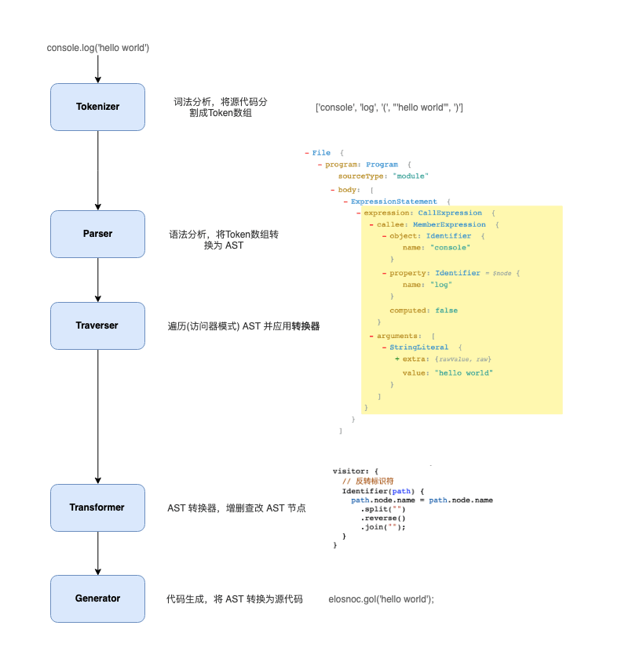

首先从源码解析(Parsing)开始，解析包含了两个步骤

## 词法解析(Lexical Analysis)

词法解析器(Tokenizer)在这个阶段将字符串形式的代码转换为 Tokens(令牌)。Tokens 可以视作是一些语法片段组成的数组。例如 `for (const item of items) {}` 词法解析后的结果如下:

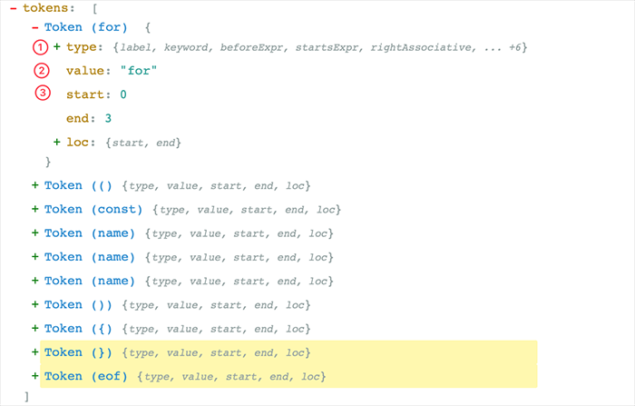

从上图可以看，每个 Token 中包含了语法片段、位置信息、以及一些类型信息，这些信息有助于后续的语法分析。

## 语法解析(Syntactic Analysis)

这个阶段语法解析器(Parser)会把 Tokens 转换为抽象语法树(Abstract Syntax Tree，AST)

AST 就是一棵对象树，用来表示代码的语法结构，例如 `console.log('hello world')` 会解析成为

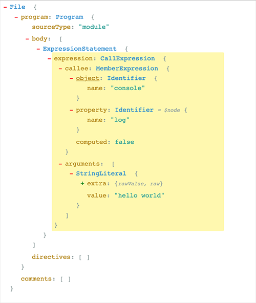

Program、CallExpression、Identifier 这些都是节点的类型，每个节点都是一个有意义的语法单元。这些节点类型定义了一些属性来描述节点的信息。

JavaScript 的语法越来越复杂，而且 Babel 除了支持最新的 JavaScript 规范语法，还支持 JSX、Flow、现在还有 Typescript。想象一下 AST 的节点类型有多少，其实我们不需要去记住这么多类型、也记不住。插件开发者会利用 ASTExplorer 来审查解析后的 AST 树，非常强大。

AST 是 Babel 转译的核心数据结构，后续的操作都依赖于 AST。

## 转换(Transform)

转换阶段会对 AST 进行遍历，在这个过程中对节点进行增删查改。Babel 所有插件都是在这个阶段工作，比如语法转换、代码压缩。

Javascript In Javascript Out，最后阶段还是要把 AST 转换回字符串形式的 Javascript，同时这个阶段还会生成 Source Map。

# Babel 的架构

Babel 和 Webpack 为了适应复杂的定制需求和频繁的功能变化，都使用了[微内核](https://juejin.im/post/5d7ffad551882545ff173083#heading-10)的架构风格。也就是说它们的核心非常小，大部分功能都是通过插件扩展实现的。

所以简单地了解一下 Babel 的架构和一些基本概念，对后续文章内容的理解，以及 Babel 的使用还是有帮助的。

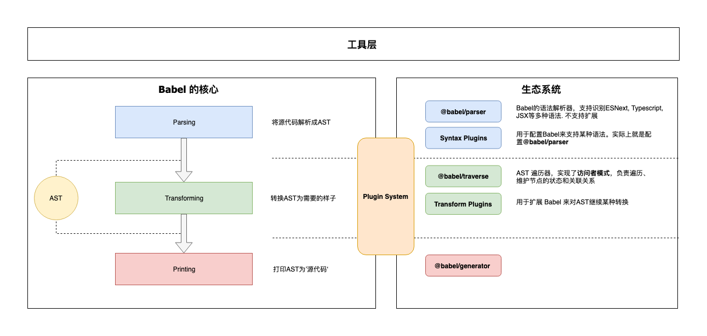

Babel 是一个 [MonoRepo](https://github.com/lerna/lerna) 项目，不过组织非常清晰，下面就源码上我们能看到的模块进行一下分类，配合上面的架构图让你对 Babel 有个大概的认识:

## 核心

@babel/core 这也是上面说的微内核架构中的内核。对于 Babel 来说，这个内核主要干这些事情

- 加载和处理配置(config)
- 加载插件
- 调用 Parser 进行语法解析，生成 AST
- 调用 Traverser 遍历 AST，并使用访问者模式应用插件对 AST 进行转换
- 生成代码，包括 SourceMap 转换和源代码生成

## 核心周边支撑

### Parser(@babel/parser)

将源代码解析为 AST 就靠它了。 它已经内置支持很多语法，例如 JSX、Typescript、Flow 以及最新的 ECMAScript 规范。目前为了执行效率，parser 是不支持扩展的，由官方进行维护。如果你要支持自定义语法，可以 fork 它，不过这种场景非常少。

### Traverser(@babel/traverse)

实现了访问者模式，对 AST 进行遍历，转换插件会通过它获取感兴趣的 AST 节点，对节点继续操作，下文会详细介绍访问器模式。

### Generator(@babel/generator)

将 AST 转换为源代码，支持 SourceMap

## 插件

打开 Babel 的源代码，会发现有好几种类型的插件

### 语法插件(@babel/plugin-syntax-\*)

上面说了 @babel/parser 已经支持了很多 JavaScript 语法特性，Parser 也不支持扩展。因此 plugin-syntax-\* 实际上只是用于开启或者配置 Parser 的某个功能特性。

一般用户不需要关心这个，Transform 插件里面已经包含了相关的 plugin-syntax-\* 插件了，用户也可以通过 parserOpts 配置项来直接配置 Parser

### 转换插件

用于对 AST 进行转换，实现转换为 ES5 代码、压缩、功能增强等目的。Babel 仓库将转换插件划分为两种（只是命名上的区别）

- @babel/plugin-transform-\*：普通的转换插件
- @babel/plugin-proposal-\*：还在提议阶段（非正式）的语言特性, 目前有[这些](https://babeljs.io/docs/en/next/plugins#experimental)

### 预定义集合(@babel/presets-\*)

插件集合或者分组，主要方便用户对插件进行管理和使用。比如 preset-env 含括所有的标准的最新特性，再比如 preset-react 含括所有 react 相关的插件

## 插件开发辅助

- @babel/template：某些场景直接操作 AST 太麻烦，就比如我们直接操作 DOM 一样，所以 Babel 实现了这么一个简单的模板引擎，可以将字符串代码转换为 AST，比如在生成一些辅助代码（helper）时会用到这个库
- @babel/types：AST 节点构造器和断言，插件开发时使用很频繁
- @babel/helper-\*：一些辅助器，用于辅助插件开发，例如简化 AST 操作
- @babel/helper：辅助代码，单纯的语法转换可能无法让代码运行起来，比如低版本浏览器无法识别 class 关键字，这时候需要添加辅助代码，对 class 进行模拟

## 工具

- @babel/node：Node.js CLI，通过它直接运行需要 Babel 处理的 JavaScript 文件
- @babel/register：Patch NodeJs 的 require 方法，支持导入需要 Babel 处理的 JavaScript 模块
- @babel/cli：CLI 工具

# 访问者模式

转换器会遍历 AST 树，找出自己感兴趣的节点类型，再进行转换操作。这个过程和我们操作 DOM 树差不多，只不过目的不太一样。AST 遍历和转换一般会使用访问者模式。

想象一下，Babel 有那么多插件，如果每个插件自己去遍历 AST，对不同的节点进行不同的操作，维护自己的状态。这样子不仅低效，它们的逻辑分散在各处，会让整个系统变得难以理解和调试，最后插件之间关系就纠缠不清，乱成一锅粥。

所以转换器操作 AST 一般都是使用访问器模式，由这个访问者(Visitor)来

1. 进行统一的遍历操作
2. 提供节点的操作方法
3. 响应式维护节点之间的关系，而插件(设计模式中称为具体访问者)只需要定义自己感兴趣的节点类型，当访问者访问到对应节点时，就调用插件的访问(visit)方法。

## 节点的遍历

假设我们的代码如下:

```js
function hello(v) {
  console.log('hello' + v + '!');
}
```

解析后的 AST 结构如下:

```
File
  Program (program)
    FunctionDeclaration (body)
      Identifier (id)  #hello
      Identifier (params[0]) #v
      BlockStatement (body)
        ExpressionStatement ([0])
          CallExpression (expression)
            MemberExpression (callee)  #console.log
              Identifier (object)  #console
              Identifier (property)  #log
            BinaryExpression (arguments[0])
              BinaryExpression (left)
                StringLiteral (left)  #'hello'
                Identifier (right)  #v
              StringLiteral (right)  #'!'
```

访问者会以深度优先的顺序，或者说递归地对 AST 进行遍历，其调用顺序如下图所示:

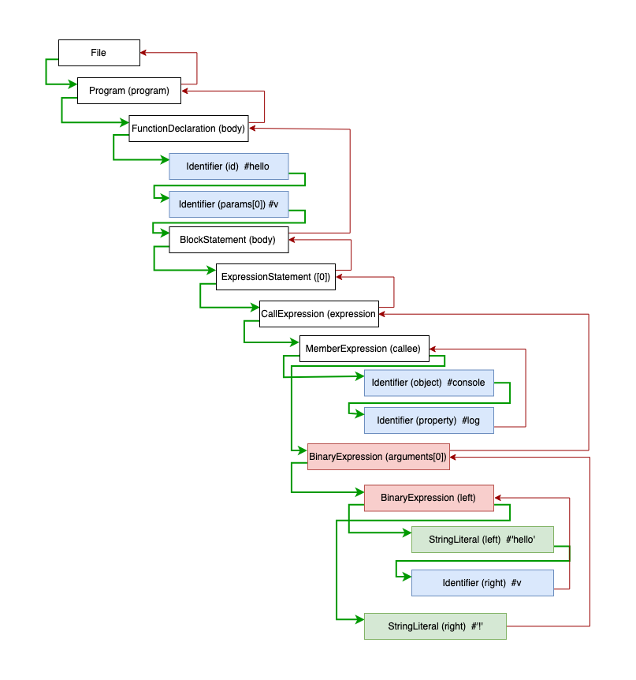

上图中绿线表示进入该节点，红线表示离开该节点。下面写一个超简单的具体访问者来还原上面的遍历过程:

```js
const babel = require('@babel/core');
const traverse = require('@babel/traverse').default;

const ast = babel.parseSync(code);

let depth = 0;
traverse(ast, {
  enter(path) {
    console.log(`enter ${path.type}(${path.key})`);
    depth++;
  },
  exit(path) {
    depth--;
    console.log(`  exit ${path.type}(${path.key})`);
  }
});
```

执行结果

```
enter Program(program)
  enter FunctionDeclaration(0)
    enter Identifier(id)
    exit Identifier(id)
    enter Identifier(0)
    exit Identifier(0)
    enter BlockStatement(body)
      enter ExpressionStatement(0)
        enter CallExpression(expression)
          enter MemberExpression(callee)
            enter Identifier(object)
            exit Identifier(object)
            enter Identifier(property)
            exit Identifier(property)
          exit MemberExpression(callee)
          enter BinaryExpression(0)
            enter BinaryExpression(left)
              enter StringLiteral(left)
              exit StringLiteral(left)
              enter Identifier(right)
              exit Identifier(right)
            exit BinaryExpression(left)
            enter StringLiteral(right)
            exit StringLiteral(right)
          exit BinaryExpression(0)
        exit CallExpression(expression)
      exit ExpressionStatement(0)
    exit BlockStatement(body)
  exit FunctionDeclaration(0)
exit Program(program)
```

当访问者进入一个节点时就会调用 enter（进入）方法，反之离开该节点时会调用 exit（离开）方法。一般情况下，插件不会直接使用 enter 方法，只会关注少数几个节点类型，所以具体访问者也可以这样声明访问方法:

```js
traverse(ast, {
  // 访问标识符
  Identifier(path) {
    console.log(`enter Identifier`);
  },
  // 访问调用表达式
  CallExpression(path) {
    console.log(`enter CallExpression`);
  },
  // 上面是 enter 的简写，如果要处理 exit，也可以这样
  // 二元操作符
  BinaryExpression: {
    enter(path) {},
    exit(path) {}
  },
  // 更高级的, 使用同一个方法访问多种类型的节点
  'ExportNamedDeclaration|Flow'(path) {}
});
```

那么 Babel 插件是怎么被应用的呢？

Babel 会按照插件定义的顺序来应用访问方法，比如你注册了多个插件，babel-core 最后传递给访问器的数据结构大概长这样：

```js
{
  Identifier: {
    enter: ['plugin-xx', 'plugin-yy']; // 数组形式
  }
}
```

当进入一个节点时，这些插件会按照注册的顺序被执行。大部分插件是不需要开发者关心定义的顺序的，有少数的情况需要稍微注意以下，例如 plugin-proposal-decorators:

```js
{
  "plugins": [
    "@babel/plugin-proposal-decorators",     // 必须在 plugin-proposal-class-properties 之前
    "@babel/plugin-proposal-class-properties"
  ]
}
```

所有插件定义的顺序，按照惯例，应该是新的或者说实验性的插件在前面，老的插件定义在后面。因为可能需要新的插件将 AST 转换后，老的插件才能识别语法（向后兼容）。下面是官方配置例子, 为了确保先后兼容，stage-\* 阶段的插件先执行:

```js
{
  "presets": ["es2015", "react", "stage-2"]
}
```

> 注意 Preset 的执行顺序相反

## 节点的上下文

访问者在访问一个节点时, 会无差别地调用 enter 方法，我们怎么知道这个节点在什么位置以及和其他节点的关联关系呢？

通过上面的代码，读者应该可以猜出几分，每个 visit 方法都接收一个 Path 对象, 你可以将它当做一个上下文对象，类似于 JQuery 的 `JQuery(const $el = $('.el'))` 对象，这里面包含了很多信息：

- 当前节点信息
- 节点的关联信息。父节点、子节点、兄弟节点等等
- 作用域信息
- 上下文信息
- 节点操作方法。节点增删查改
- 断言方法。isXXX，assertXXX

下面是它的主要结构:

```ts
export class NodePath<T = Node> {
  constructor(hub: Hub, parent: Node);
  parent: Node;
  hub: Hub;
  contexts: TraversalContext[];
  data: object;
  shouldSkip: boolean;
  shouldStop: boolean;
  removed: boolean;
  state: any;
  opts: object;
  skipKeys: object;
  parentPath: NodePath;
  context: TraversalContext;
  container: object | object[];
  listKey: string; // 如果节点在一个数组中，这个就是节点数组的键
  inList: boolean;
  parentKey: string;
  key: string | number; // 节点所在的键或索引
  node: T; // 🔴 当前节点
  scope: Scope; // 🔴当前节点所在的作用域
  type: T extends undefined | null ? string | null : string; // 🔴节点类型
  typeAnnotation: object;
  // ... 还有很多方法，实现增删查改
}
```

你可以通过这个手册来学习怎么通过 Path 来转换 AST，后面也会有代码示例，这里就不展开细节了

## 副作用的处理

实际上访问者的工作比我们想象的要复杂的多，上面示范的是静态 AST 的遍历过程。而 AST 转换本身是有副作用的，比如插件将旧的节点替换了，那么访问者就没有必要再向下访问旧节点了，而是继续访问新的节点，代码如下。

```js
traverse(ast, {
  ExpressionStatement(path) {
    // 将 console.log('hello' + v + '!') 替换为 return 'hello' + v
    const rtn = t.returnStatement(t.binaryExpression('+', t.stringLiteral('hello'), t.identifier('v')))
    path.replaceWith(rtn)
  },
}
```

上面的代码, 将 `console.log('hello' + v + '!')` 语句替换为`return 'hello' + v`, 下图是遍历的过程：

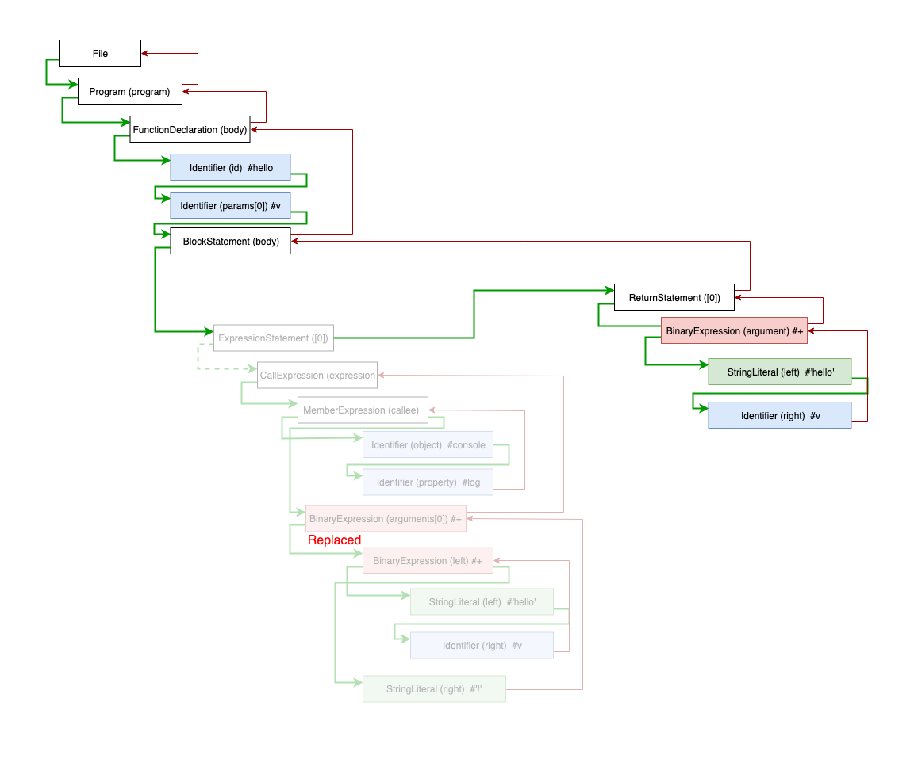

我们可以对 AST 进行任意的操作，比如删除父节点的兄弟节点、删除第一个子节点、新增兄弟节点，当这些操作污染了 AST 树后，访问者需要记录这些状态，响应式(Reactive)更新 Path 对象的关联关系，保证正确的遍历顺序，从而获得正确的转译结果。

## 作用域的处理

访问者可以确保正确地遍历和修改节点，但是对于转换器来说，另一个比较棘手的是对作用域的处理，这个责任落在了插件开发者的头上。插件开发者必须非常谨慎地处理作用域，不能破坏现有代码的执行逻辑。

```js
const a = 1,
  b = 2;
function add(foo, bar) {
  console.log(a, b);
  return foo + bar;
}
```

比如你要将 add 函数的第一个参数 foo 标识符修改为 a，你就需要递归遍历子树，查出 foo 标识符的所有引用，然后替换它

```js
traverse(ast, {
  // 将第一个参数名转换为 a
  FunctionDeclaration(path) {
    const firstParams = path.get('params.0');
    if (firstParams == null) {
      return;
    }

    const name = firstParams.node.name;
    // 递归遍历，这是插件常用的模式。这样可以避免影响到外部作用域
    path.traverse({
      Identifier(path) {
        if (path.node.name === name) {
          path.replaceWith(t.identifier('a'));
        }
      }
    });
  }
});

console.log(generate(ast).code);
// function add(a, bar) {
//   console.log(a, b);
//   return a + bar;
// }
```

替换成 a 之后, `console.log(a, b)` 的行为就被破坏了。所以这里不能用 a，得换个标识符，譬如 c

这就是转换器需要考虑的作用域问题，AST 转换的前提是保证程序的正确性。我们在添加和修改引用时，需要确保与现有的所有引用不冲突。Babel 本身不能检测这类异常，只能依靠插件开发者谨慎处理。

Javascript 采用的是词法作用域，也就是根据源代码的词法结构来确定作用域：


在词法区块(block)中，由于新建变量、函数、类、函数参数等创建的标识符，都属于这个区块作用域。这些标识符也称为绑定(Binding)，而对这些绑定的使用称为引用(Reference)

在 Babel 中，使用 Scope 对象来表示作用域。我们可以通过 Path 对象的 scope 字段来获取当前节点的 Scope 对象。它的结构如下:

```js
{
  path: NodePath;
  block: Node;         // 所属的词法区块节点, 例如函数节点、条件语句节点
  parentBlock: Node;   // 所属的父级词法区块节点
  parent: Scope;       // 指向父作用域
  bindings: { [name: string]: Binding; }; // 该作用域下面的所有绑定(即该作用域创建的标识符)
}
```

Scope 对象和 Path 对象差不多，它包含了作用域之间的关联关系(通过 parent 指向父作用域)，收集了作用域下面的所有绑定(bindings)，另外还提供了丰富的方法来操作作用域。

我们可以通过 bindings 属性获取当前作用域下的所有绑定(即标识符)，每个绑定由 Binding 类来表示：

```js
export class Binding {
  identifier: t.Identifier;
  scope: Scope;
  path: NodePath;
  kind: 'var' | 'let' | 'const' | 'module';
  referenced: boolean;
  references: number; // 被引用的数量
  referencePaths: NodePath[]; // ⚛️获取所有应用该标识符的节点路径
  constant: boolean; // 是否是常量
  constantViolations: NodePath[];
}
```

通过 Binding 对象我们可以确定标识符被引用的情况。

Ok，有了 Scope 和 Binding，现在有能力实现安全的变量重命名转换了。为了更好地展示作用域交互，在上面代码的基础上，我们再增加一下难度：

```js
const a = 1;
const b = 2;
function add(foo, bar) {
  console.log(a, b);
  return () => {
    const a = '1'; // 新增了一个变量声明
    return a + (foo + bar);
  };
}
```

现在你要重命名函数参数 foo, 不仅要考虑外部的作用域, 也要考虑下级作用域的绑定情况，确保这两者都不冲突。

上面的代码作用域和标识符引用情况如下图所示:

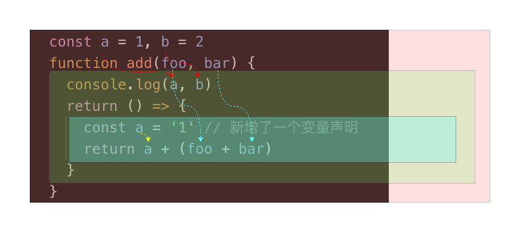

试着将函数的第一个参数重新命名为更短的标识符:

```js
// 用于获取唯一的标识符
const getUid = () => {
  let uid = 0;
  return () => `_${uid++ || ''}`;
};

const ast = babel.parseSync(code);
traverse(ast, {
  FunctionDeclaration(path) {
    // 获取第一个参数
    const firstParam = path.get('params.0');
    if (firstParam == null) {
      return;
    }

    const currentName = firstParam.node.name;
    const currentBinding = path.scope.getBinding(currentName);
    const gid = getUid();
    let sname;

    // 循环找出没有被占用的变量名
    while (true) {
      sname = gid();

      // 1️、首先看一下父作用域是否已定义了该变量
      if (path.scope.parentHasBinding(sname)) {
        continue;
      }

      // 2、查当前作用域是否定义了变量
      if (path.scope.hasOwnBinding(sname)) {
        // 已占用
        continue;
      }

      // 再检查第一个参数的当前的引用情况,
      // 如果它所在的作用域定义了同名的变量，我们也得放弃
      if (currentBinding.references > 0) {
        let findIt = false;
        for (const refNode of currentBinding.referencePaths) {
          if (refNode.scope !== path.scope && refNode.scope.hasBinding(sname)) {
            findIt = true;
            break;
          }
        }
        if (findIt) {
          continue;
        }
      }
      break;
    }

    // 开始替换掉
    const i = t.identifier(sname);
    currentBinding.referencePaths.forEach((p) => p.replaceWith(i));
    firstParam.replaceWith(i);
  }
});

console.log(generate(ast).code);
// const a = 1,
//       b = 2;

// function add(_, bar) {
//   console.log(a, b);
//   return () => {
//     const a = '1'; // 新增了一个变量声明

//     return a + (_ + bar);
//   };
// }
```

上面的例子虽然没有什么实用性，而且还有 Bug(没考虑 label)，但是正好可以揭示了作用域处理的复杂性。

Babel 的 Scope 对象其实提供了一个 generateUid 方法来生成唯一的、不冲突的标识符。我们利用这个方法再简化一下我们的代码:

```js
traverse(ast, {
  FunctionDeclaration(path) {
    const firstParam = path.get('params.0');
    if (firstParam == null) {
      return;
    }
    let i = path.scope.generateUidIdentifier('_'); // 也可以使用 generateUid
    const currentBinding = path.scope.getBinding(firstParam.node.name);
    currentBinding.referencePaths.forEach((p) => p.replaceWith(i));
    firstParam.replaceWith(i);
  }
});
```

或

```js
traverse(ast, {
  FunctionDeclaration(path) {
    const firstParam = path.get('params.0');
    if (firstParam == null) {
      return;
    }
    let i = path.scope.generateUid('_'); // 也可以使用generateUid
    path.scope.rename(firstParam.node.name, i);
  }
});
```

generateUid 的实现代码

```js
generateUid(name: string = "temp") {
  name = t
    .toIdentifier(name)
    .replace(/^_+/, "")
    .replace(/[0-9]+$/g, "");

  let uid;
  let i = 0;
  do {
    uid = this._generateUid(name, i);
    i++;
  } while (
    this.hasLabel(uid) ||
    this.hasBinding(uid) ||
    this.hasGlobal(uid) ||
    this.hasReference(uid)
  );

  const program = this.getProgramParent();
  program.references[uid] = true;
  program.uids[uid] = true;

  return uid;
}
```

作用域操作最典型的场景是代码压缩，代码压缩会对变量名、函数名等进行压缩，然而实际上很少的插件场景需要跟作用域进行复杂的交互，所以关于作用域这一块就先讲到这里。

# 写一个插件

现在打算模仿 babel-plugin-import，写一个极简版插件，来实现模块的按需导入。在这个插件中，我们会将类似这样的导入语句

```js
import { A, B, C as D } from 'foo';
```

转换为

```js
import A from 'foo/A';
import 'foo/A/style.css';
import B from 'foo/B';
import 'foo/B/style.css';
import D from 'foo/C';
import 'foo/C/style.css';
```

首先通过 AST Explorer 看一下导入语句的 AST 节点结构:

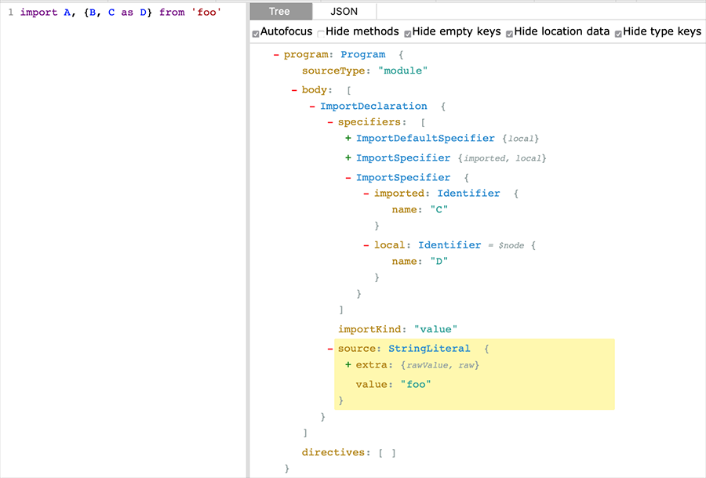

通过上面展示的结果，我们需要处理 ImportDeclaration 节点类型，将它的 specifiers 拿出来遍历处理一下。另外如果用户使用了默认导入语句，我们将抛出错误，提醒用户不能使用默认导入

基本实现如下:

```js
// 要识别的模块
const MODULE = 'foo';
traverse(ast, {
  // 访问导入语句
  ImportDeclaration(path) {
    if (path.node.source.value !== MODULE) {
      return;
    }

    // 如果是空导入则直接删除掉
    const specs = path.node.specifiers;
    if (specs.length === 0) {
      path.remove();
      return;
    }

    // 判断是否包含了默认导入和命名空间导入
    if (specs.some((i) => t.isImportDefaultSpecifier(i) || t.isImportNamespaceSpecifier(i))) {
      // 抛出错误，Babel 会展示出错的代码帧
      throw path.buildCodeFrameError('不能使用默认导入或命名空间导入');
    }

    // 转换命名导入
    const imports = [];
    for (const spec of specs) {
      const named = MODULE + '/' + spec.imported.name;
      const local = spec.local;
      imports.push(t.importDeclaration([t.importDefaultSpecifier(local)], t.stringLiteral(named)));
      imports.push(t.importDeclaration([], t.stringLiteral(`${named}/style.css`)));
    }

    // 替换原有的导入语句
    path.replaceWithMultiple(imports);
  }
});
```

逻辑还算简单，babel-plugin-import 可比这复杂得多。

接下来，我们将它封装成标准的 Babel 插件。按照规范，我们需要创建一个 babel-plugin-\* 前缀的包名：

```bash
mkdir babel-plugin-toy-import
cd babel-plugin-toy-import
yarn init -y
touch index.js
```

> 你也可以通过 [generator-babel-plugin](https://github.com/babel/generator-babel-plugin/tree/master/generators/app/templates) 来生成项目模板

在 index.js 文件中填入我们的代码。index.js 默认导出一个函数，函数结构如下:

```js
// 接受一个 babel-core 对象
export default function(babel) {
  const { types: t } = babel;
  return {
    pre(state) {
      // 前置操作，可选，可以用于准备一些资源
    },
    visitor: {
      // 我们的访问者代码将放在这里
      ImportDeclaration(path, state) {
        // ...
      }
    },
    post(state) {
      // 后置操作，可选
    }
  };
}
```

我们可以从访问器方法的第二个参数 state 中获取用户传入的参数。假设用户配置为:

```js
{
  plugins: [['toy-plugin', { name: 'foo' }]];
}
```

我们可以这样获取用户传入的参数:

```js
export default function(babel) {
  const { types: t } = babel;
  return {
    visitor: {
      ImportDeclaration(path, state) {
        const mod = state.opts && state.opts.name;
        if (mod == null) {
          return;
        }
        // ...
      }
    }
  };
}
```

最后 `npm publish`

# 关于宏

Wiki 上面对宏的定义是：宏(Macro)，是一种批处理的称谓，它根据一系列的预定义规则转换一定的文本模式。解释器或编译器在遇到宏时会自动进行这一模式转换，这个转换过程被称为“宏展开(Macro Expansion)”。对于编译语言，宏展开在编译时发生，进行宏展开的工具常被称为宏展开器。

你可以认为，宏就是用来生成代码的代码，它有能力进行一些句法解析和代码转换。宏大致可以分为两种: 文本替换和语法扩展

## 文本替换式

大家或多或少有接触过宏，很多程序员第一门语言是 C/C++(包括 C 的衍生语言 Objective-C)，在 C 中就有宏的概念。使用 #define 指令定义一个宏:

```c
#define MIN(X, Y) ((X) < (Y) ? (X) : (Y))
```

如果我们的程序使用了这个宏，就会在编译阶段被展开，例如：

```js
MIN(a + b, c + d);
```

会被展开为:

```js
a + b < c + d ? a + b : c + d;
```

除了函数宏，C 中还有对象宏，我们通常使用它来声明 `常量`:

```c
#define PI 3.1214
```

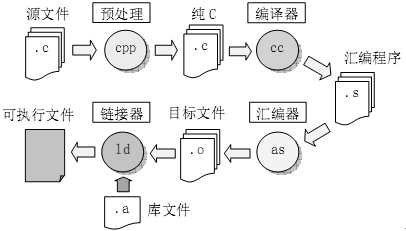

如上图，宏本质上不是 C 语言的一部分，它由 C 预处理器提供，预处理器在编译之前对源代码进行文本替换，生成真正的 C 代码，再传递给编译器。

> 当然 C 预处理器不仅仅会处理宏，它还包含了头文件引入、条件编译、行控制等操作

除此之外，GNU m4 是一个更专业/更强大/更通用的预处理器（宏展开器）。这是一个通用的宏展开器，不仅可以用于 C，也可以用于其他语言和文本文件的处理(参考这篇有趣的文章：[使用 GNU m4 为 Markdown 添加目录支持](https://segmentfault.com/a/1190000004342956))， 关于 m4 可以看 [让这世界再多一份 GNU m4 教程](https://segmentfault.com/a/1190000004104696) 系列文章

文本替换式宏很容易理解、实现也简单，因为它们只是纯文本替换, 换句话说它就像 `文本编辑器`。所以相对而言，这种形式的宏能力有限，比如它不会检验语法是否合法，使用它经常会出现问题。

所以随着现代编程语言表达能力越来越强，很多语言都不再推荐使用宏/不提供宏，而是使用语言本身的机制(例如函数)来解决问题，这样更安全、更容易理解和调试。没有宏机制，现代语言可以通过提供强大的反射机制或者动态编程特性(如 Javascript 的 Proxy、Python 的装饰器)来弥补缺失宏导致的元编程短板。所以反过来推导，之所以 C 语言需要宏，正是因为 C 语言的表达能力太弱了。

## 语法扩展式

真正的宏起源于 Lisp，这个得益于 Lisp 语言本身的一些特性：

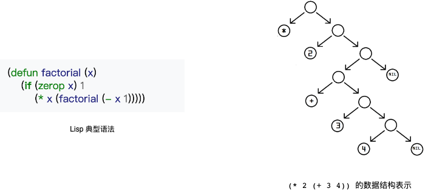

- 它的语法非常简单，只有 S-表达式(s-expression)（特征为括号化的前缀表示法, 可以认为 S-表达式就是近似的 Lisp 的抽象语法树(AST)）
- 数据即代码，S-表达式本身就是树形数据结构，另外 Lisp 支持数据和代码之间的转换

由于 Lisp 这种简单的语法结构，使得数据和程序之间只有一线之隔(quote 修饰就是数据，没有 quote 就是程序)，换句话说就是程序和数据之间可以灵活地转换。这种数据即程序、程序即数据的概念，使得 Lisp 可以轻松地自定义宏。不妨来看一下 Lisp 定义宏的示例：

```lisp
; 使用defmacro定义一个nonsense宏, 接收一个function-name参数. 宏需要返回一个quoted
; ` 这是quote函数的简写，表示quote，即这段‘程序’是一段‘数据’, 或者说将‘程序’转换为‘数据’. quote不会被‘求值’
; defun 定义一个函数
; , 这是unquote函数的简写， 表示unquote，即将‘数据’转换为‘程序’. unquote会进行求值
; intern 将字符串转换为symbol，即标识符

(defmacro nonsense (function-name)
  `(defun ,(intern (concat "nonsense-" function-name)) (input) ; 定义一个nonsense-${function-name} 方法
     (print (concat ,function-name input))))                   ; 输入`${function-name}${input}`
```

如果你不理解上面程序的含义，这里有一个 Javascript 的实现

注意：`宏` 一般在编译阶段被展开, 下面代码只是为了协作你理解上述的 Lisp 代码

```js
function nonsense(name) {
  let rtn;
  eval(`rtn = function nonsense${name}(input) {
    console.log('${name}', input)
  }`);
  return rtn;
}
```

应用宏展开：

```lisp
(nonsense "apple")           ; 展开宏，这里会创建一个nonsense-apple函数
(nonsense-apple " is good")  ; 调用刚刚创建的宏
                             ; => "apple is good"
```

对于 Lisp 而言，宏有点像一个函数，只不过这个函数必须返回一个 quoted 数据；当调用这个宏时，Lisp 会使用 unquote 函数将宏返回的 quoted 数据转换为程序。

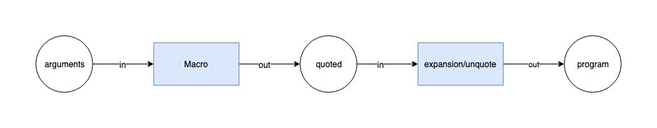

通过上面的示例，你会感叹 Lisp 的宏实现竟然如此清奇，如此简单。

Lisp 宏的灵活性得益于简单的语法(S-表达式可以等价于它的 AST)，对于复杂语法的语言(例如 Javascript)，要实现类似 Lisp 的宏就难得多. 因此很少有现代语言提供宏机制可能也是这个原因。

尽管如此，现在很多技术难点慢慢被解决，很多现代语言也引入类 Lisp 的宏机制，如 Rust、Julia，还有 Javascript 的 Sweet.js

## Sweet.js

Sweet.js 和 Rust 师出同门，所以两个的宏语法和非常接近(初期)。不过需要注意的是: 官方认为 Sweet.js 目前仍处于实验阶段，而且 Github 最后提交时间停留在 2 年前，社区上也未见大规模的使用。所以不要在生产环境中使用它，但是不妨碍我们去学习一个现代编程语言的宏机制。

我们先使用 Sweet.js 来实现上面我们通过 Lisp 实现的 nosense 宏, 对比起来更容易理解

```js
import { unwrap, fromIdentifier, fromStringLiteral } from '@sweet-js/helpers' for syntax;

syntax nosense = function (ctx) {
  let name = ctx.next().value;
  let funcName = 'nonsense' + unwrap(name).value

  return #`function ${fromIdentifier(name, funcName)} () {
    console.log(${fromStringLiteral(name, unwrap(name).value)} + input)
  }`;
};

nosense Apple
nosenseApple(" is Good") // Apple is Good
```

首先，Sweet.js 使用 syntax 关键字来定义一个宏，其语法类似于 const 或者 let。

本质上一个宏就是一个函数，只不过在编译阶段被执行。这个函数接收一个 TransformerContext 对象，你也通过这个对象获取宏应用传入的语法对象（Syntax Object）数组，最终这个宏也要返回语法对象数组。

什么是语法对象？语法对象是 Sweet.js 关于语法的内部表示，你可以类比上文 Lisp 的 quoted 数据。在复杂语法的语言中，没办法使用 quoted 这么简单的序列来表示语法，而使用 AST 则更复杂，开发者更难以驾驭。所以大部分宏实现会参考 Lisp 的 S-表达式，取折中方案，将传入的程序转换为 Tokens，再组装成类似 quoted 的数据结构。

举个例子，Sweet.js 会将 `foo,bar('baz', 1)` 转换成这样的数据结构:

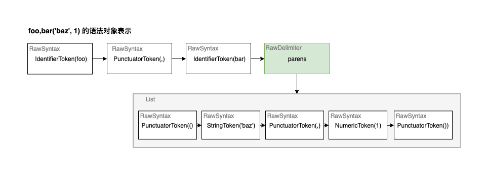

从上图可知，Sweet.js 会将传入的程序解析成嵌套的 Token 序列，这个结构和 Lisp 的 S-表达式非常相似。也就是, 说对于闭合的词法单元会被嵌套存储，例如上例的 `('baz', 1)`

> Elixir 也采用了类似的 [quote/unquote](https://elixir-lang.org/getting-started/meta/quote-and-unquote.html) 机制，可以结合着一起理解

TransformerContext 实现了迭代器方法，所以我们通过调用它的 `next()` 来遍历获取语法对象。最后宏必须返回一个语法对象数组，Sweet.js 使用了类似字符串模板的语法(称为语法模板)来简化开发，这个模板最终转换为语法对象数组。

> 需要注意的是语法模板的内嵌值只能是语法对象、语法对象序列或者 TransformerContext

旧版本使用了模式匹配，和 Rust 语法类似

```js
macro define {
  rule { $x } => {
    var $x
  }

  rule { $x = $expr } => {
    var $x = $expr
  }
}

define y;
define y = 5;
```

说了这么多，类似 Sweet.js 语法对象的设计是现代编程语言为了贴近 Lisp 宏的一个关键技术点。我发现 Elixir、Rust 等语言也使用了类似的设计。除了数据结构的设计，现代编程语言的宏机制还包含以下特性：

### 卫生宏(Hygiene)

卫生宏指的是在宏内生成的变量不会污染外部作用域，也就是说在宏展开时，Sweet.js 会避免宏内定义的变量和外部冲突

举个例子，我们创建一个 swap 宏，交换变量的值

```js
syntax swap = (ctx) => {
 const a = ctx.next().value
 ctx.next() // 吃掉','
 const b = ctx.next().value
 return #`
 let temp = ${a}
 ${a} = ${b}
 ${b} = temp
 `;
}

swap foo,bar
```

展开会输出为

```js
let temp_10 = foo; // temp 变量被重命名为 temp_10
foo = bar;
bar = temp_10;
```

如果你想引用外部的变量也可以，不过不建议这么做，宏不应该假定其被展开的上下文:

```js
syntax swap = (ctx) => {
  // ...
  return #`
  temp = ${a} // 不使用 let 声明
  ${a} = ${b}
  ${b} = temp
  `;
}
```

### 模块化

Sweet.js 的宏是模块化的：

```js
'lang sweet.js';
// 导出宏
export syntax class = function (ctx) {
  // ...
};
```

导入

```js
import { class } from './es2015-macros';

class Droid {
  constructor(name, color) {
    this.name = name;
    this.color = color;
  }

  rollWithIt(it) {
    return this.name + " is rolling with " + it;
  }
}
```

相对 Babel（编译器）来说，Sweet.js 的宏是模块化/显式的。Babel 需要在配置文件中配置各种插件和选项，尤其是团队项目构建有统一规范和环境时，项目构建脚本修改可能有限制。而模块化的宏是源代码的一部分，而不是构建脚本的一部分，这使得它们可以被灵活地使用、重构以及废弃。

下文介绍的 babel-plugin-macros 最大的优势就在这里，通常我们希望构建环境是统一的、稳定的、开发人员应该专注于代码的开发，而不是如何去构建程序，正是因为代码多变性，才催生出了这些方案。

需要注意的是宏是在编译阶段展开的，所以无法运行用户代码，例如

```js
let log = msg => console.log(msg); // 用户代码, 运行时被求值，所以无法被访问

syntax m = ctx => {
  // 宏函数在编译阶段被执行
  log('doing some Sweet things'); // ERROR: 未找到变量 log
  // ...
};
```

Sweet.js 和其他语言的宏一样，有了它你可以:

- 新增语法糖(和 Sweet.js 一样甜)，实现自己的语法或者某些实验性的语言特性
- 自定义[操作符](https://www.sweetjs.org/doc/tutorial#sweet-operators)，很强大
- 消灭重复的代码，提升语言的表达能力。

很遗憾！Sweet.js 基本死了。所以现在当个玩具玩玩尚可，切勿用于生产环境。即使没有死，Sweet.js 这种非标准的语法，和现有的 Javascript 工具链生态格格不入，开发和调试都会比较麻烦(比如 Typescript)

归根到底，Sweet.js 的失败，是社区抛弃了它。Javascript 语言表达能力越来越强，版本迭代快速，加上有了 Babel 和 Typescript 这些解决方案，实在拿不出什么理由来使用 Sweet.js

## 小结

这一节扯得有点多，将宏的历史和分类讲了个遍。最后的总结是 Elixir 官方教程里面的一句话：显式好于隐式，清晰的代码优于简洁的代码(Clear code is better than concise code)

能力越大、责任越大。宏强大，比正常程序要更难以驾驭，你可能需要一定的成本去学习和理解它，所以能不用宏就不用宏，宏应该是最后的法宝

# 既生 Plugin 何生 Macro

既然 Babel 有了 Plugin 为什么又冒出了个 babel-plugin-macros?

> 如果你尚不了解 Babel Macro，可以先读一下官方文档，另外 Creact-React-APP 已经内置

这个得从 Create-React-App（CRA） 说起，CRA 将所有的项目构建逻辑都封装在 react-scripts 服务中。这样的好处是，开发者不需要再关心构建的细节，另外构建工具的升级也变得非常方便，直接升级 react-scripts 即可。

如果自己维护构建脚本的话，升一次级你需要升级一大堆的依赖，如果你要维护跨项目的构建脚本，那就更蛋疼了。

CRA 是强约定的，它是按照 React 社区的最佳实践给你准备的，为了保护封装带来的红利，它不推荐你去手动配置 Webpack、Babel… 所以才催生了 babel-plugin-macros，大家可以看这个 [Issue: RFC - babel-macros](https://github.com/facebook/create-react-app/issues/2730)

所以为 Babel 寻求一个零配置的机制是 babel-plugin-macros 诞生的主要动机。

这篇文章正好证实了这个动机：[Zero-config code transformation with babel-plugin-macros](https://babeljs.io/blog/2017/09/11/zero-config-with-babel-macros)，这篇文章引述了一个重要的观点：`Compilers are the New Frameworks`

Babel 在现代的前端开发中扮演着一个很重要的角色，越来越多的框架或库会创建自己的 Babel 插件，它们会在编译阶段做一些优化，来提高用户体验、开发体验以及运行时的性能。比如:

- babel-plugin-lodash：将 lodash 导入转换为按需导入
- babel-plugin-import：实现按需导入
- babel-react-optimize：静态分析 React 代码，利用一定的措施优化运行效率。比如将静态的 props 或组件抽离为常量
- root-import：将基于根目录的导入路径重写为相对路径
- styled-components：典型的 CSS-in-js 方案，利用 Babel 插件来支持服务端渲染、预编译模板、样式压缩、清除死代码、提升调试体验
- preval：在编译时预执行代码
- babel-plugin-graphql-tag：预编译 GraphQL 查询

上面列举的插件场景中，并不是所有插件都是通用的，它们要么是跟某一特定的框架绑定、要么用于处理特定的文件类型或数据，这些非通用的插件是最适合使用 macro 取代的。

用 preval 举个例子，使用插件形式，你首先要配置插件

```js
{
  "plugins": ["preval"]
}
```

代码

```js
// 传递给 preval 的字符串会在编译阶段被执行
// preval 插件会查找 preval 标识符，将字符串提取出来执行，在将执行的结果赋值给 greeting
const greeting = preval`
  const fs = require('fs')
  module.exports = fs.readFileSync(require.resolve('./greeting.txt'), 'utf8')
`;
```

使用 Macro 方式

```js
// 首先你要显式导入
import preval from 'preval.macro';

// 和上面一样
const greeting = preval`
  const fs = require('fs')
  module.exports = fs.readFileSync(require.resolve('./greeting.txt'), 'utf8')
`;
```

这两者达到的效果是一样的，但意义却不太一样。有哪些区别？

1. 很显然，Macro 不需要配置 `.babelrc`（当然 babel-plugin-macros 这个基座需要装好），这个对于 CRA 这种不推荐配置构建脚本的工具来说很有帮助
2. 由隐式转换为了显式。上一节就说了显式好于隐式。你必须在源代码中通过导入语句声明你使用了 Macro；而基于插件的方式，你可能不知道 preval 这个标识符哪里来的? 如何被应用？何时被应用？而且通常你还需要和其他工具链的配合，例如 ESlint、Typescript 声明等

   Macro 由代码显式地引用，我们更明确它被应用的目的和时机，对源代码的侵入性最小。因为中间多了 `babel-plugin-macro` 这一层，我们降低了对构建环境的耦合，让我们的代码更方便被迁移

3. Macro 相比 Plugin 更容易被实现。因为它专注于具体的 AST 节点，见下文
4. 另外，当配置出错时，Macro 可以得到更好的错误提示

有利有弊，Babel Macro 肯定也有些缺陷，例如相对于插件来说只能显式转换，这样代码可能会比较啰嗦，不过个人觉得在某些场景利大于弊，能显式的就显式。

那么 Babel Macro 也是宏？相对于 Sweet.js 这些正统的宏机制有哪些不足？

- 首先 Babel Macro 必须是合法的 Javascript 语法。不支持自定义语法，也要分两面讨论，合法的 Javascript 语法不至于打破现有的工具协作链，如果允许用户毫无限制地创建新的语法，将来指不定会和标准的语法发生歧义。反过来不能自定义语法的宏，是否显得不太地道，不够强大?
- 因为必须是合法的 Javascript 语法，Babel Macro 实现 DSL（Domain-specific languages）能力就弱化了
- 再者，Babel Macro 和 Babel Plugin 没有本质的区别，相比 Sweet.js 提供了显式定义和应用宏的语法，Babel Macro 直接操作 AST 则要复杂得多，你还是需要了解一些编译原理，这把一般的开发者挡在了门外。

> Babel 可以实现自定义语法，只不过你需要 Fork `@babel/parser`，对它进行改造(可以看这篇文章[用 Babel 创造自定义 JS 语法](https://juejin.im/post/5d9be731f265da5bbc3e879b))。这个有点折腾，不太推荐

总之，Babel Macro 本质上和 Babel Plugin 没有什么区别，它只是在 Plugin 之上封装了一层(分层架构模式的强大)，创建了一个新的平台，让开发者可以在源代码层面显式地应用代码转换。所以，任何适合显式去转换的场景都适合用 Babel Macro 来做：

- 特定框架、库的代码转换，如 styled-components
- 动态生成代码，如 preval
- 特定文件、语言的处理，如 `graphql-tag.macro`、`yaml.macro`、`svgr.macro`

# 如何写一个 Babel Macro

所以 Babel Macro 是如何运作的呢？ babel-plugin-macros 要求开发者必须显式地导入 Macro，它会遍历匹配所有导入语句，如果导入源匹配 `/[./]macro(\.js)?$/` 正则，就会认为你在启用 Macro。例如下面这些导入语句都匹配正则：

```js
import foo from 'my.macro';
import { bar } from './bar/macro';
import { baz as _baz } from 'baz/macro.js';
// 不支持命名空间导入
```

当匹配到导入语句后，babel-plugin-macros 就会去导入你指定的 macro 模块或者 npm 包(Macro 即可以是本地文件，也可以是公开的 npm 包， 或者是 npm 包中的子路径)。

那么 macro 文件里面要包含什么内容呢？如下:

```js
const { createMacro } = require('babel-plugin-macros');

module.exports = createMacro(({ references, state, babel }) => {
  // ... macro 逻辑
});
```

macro 文件必须默认导出一个由 createMacro 创建的实例，在其回调中可以获取到一些关键对象

- babel 和普通的 Babel 插件一样，Macro 可以获取到一个 babel-core 对象
- state 这个我们也比较熟悉，Babel 插件的 visitor 方法的第二个参数就是它，我们可以通过它获取一些配置信息以及保存一些自定义状态
- references 获取 Macro 导出标识符的所有引用

假设用户这样子使用你的 Macro

```js
import foo, { bar, baz as Baz } from './my.macro'; // 创建三个绑定

// 下面开始引用这些绑定
foo(1);
foo(2);

bar`by tagged Template`;
<Baz>by JSX</Baz>;
```

那么你将拿到 references 结构是这样的

```js
{
  // key 为'绑定', value 为'引用数组'
  default: [NodePath/*Identifier(foo)*/, NodePath/*Identifier(foo)*/], // 默认导出，即foo
  bar: [NodePath/*Identifier(bar)*/],
  baz: [NodePath/*JSXIdentifier(Baz)*/], // 注意key为baz，不是Baz
}
```

接下来你就可以遍历 references，对这些节点进行转换，实现你想要的宏功能

## 实战

这一次我们模范 preval 创建一个 `eval.macro`, 利用它在编译阶段执行（eval）一些代码，例如

```js
import evalm from 'eval.macro';
const x = evalm`
function fib(n) {
  const SQRT_FIVE = Math.sqrt(5);
  return Math.round(1/SQRT_FIVE * (Math.pow(0.5 + SQRT_FIVE/2, n) - Math.pow(0.5 - SQRT_FIVE/2, n)));
}

fib(20)
`;

const x = 6765;
```

创建 Macro 文件，按照上一节的介绍

1. 我们使用 createMacro 来创建一个 Macro 实例
2. 并从 references 中拿出所有导出标识符的引用路径
3. 接着就是对这些引用路径进行 AST 转换

```js
const { createMacro, MacroError } = require('babel-plugin-macros');

function myMacro({ references, state, babel }) {
  // 获取默认导出的所有引用
  const { default: defaultImport = [] } = references;

  // 遍历引用并进行求值
  defaultImport.forEach((referencePath) => {
    if (referencePath.parentPath.type === 'TaggedTemplateExpression') {
      const val = referencePath.parentPath.get('quasi').evaluate().value;
      const res = eval(val);
      const ast = objToAst(res);
      referencePath.parentPath.replaceWith(ast);
    } else {
      // 输出友好的报错信息
      throw new MacroError('只支持标签模板字符串, 例如：evalm`1`');
    }
  });
}

module.exports = createMacro(myMacro);
```

为了行文简洁，本案例中只支持 [标签模板字符串](https://developer.mozilla.org/zh-CN/docs/Web/JavaScript/Reference/template_strings) 形式调用，但是标签模板字符串中可能包含内插的字符串，例如

```js
hello`
hello world ${foo} + ${bar + baz}
`;
```

其 AST 结构如下

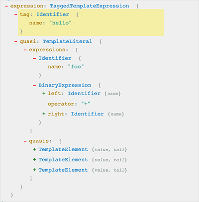

我们需要将 TaggedTemplateExpression 节点转换为字符串。手动去拼接会很麻烦，好在每个 AST 节点的 Path 对象都有一个 evaluate 方法，这个方法可以对节点进行静态求值

```js
t.evaluate(parse('5 + 5')); // { confident: true, value: 10 }
t.evaluate(parse('!true')); // { confident: true, value: false }
// ❌两个变量相加无法求值，因为变量值在运行时才存在，这里confident为false：
t.evaluate(parse('foo + foo')); // { confident: false, value: undefined }
```

因此这样子的标签模板字符串是无法求值的

```js
evalm`1 + ${foo}`; // 包含变量
evalm`1 + ${bar(1)}`; // 包含函数调
```

这个和 Typescript 的 enum，还有一些编译语言的常量是一样的，它们在编译阶段被求值，只有一些原始值以及一些原始值的表达式才支持在编译阶段被求值

So，上面的代码还不够健壮，我们再优化一下，在求值失败时给用户更好的提示:

```js
defaultImport.forEach((referencePath) => {
  if (referencePath.parentPath.type === 'TaggedTemplateExpression') {
    const evaluated = referencePath.parentPath.get('quasi').evaluate();
    // 转换标签模板字符串失败
    if (!evaluated.confident) {
      throw new MacroError('标签模板字符串内插值只支持原始值和原始值表达式');
    }

    try {
      const res = eval(evaluated.value);
      const ast = objToAst(res);
      // 替换掉调用节点
      referencePath.parentPath.replaceWith(ast);
    } catch (err) {
      throw new MacroError(`求值失败: ${err.message}`);
    }
  } else {
    throw new MacroError('只支持标签模板字符串, 例如：evalm`1 + 1`');
  }
});
```

接下来将执行后的值转换为 AST，然后替换掉 TaggedTemplateExpression

```js
function objToAst(res) {
  let str = JSON.stringify(res);
  if (str == null) {
    str = 'undefined';
  }
  const variableDeclarationNode = babel.template(`var x = ${str}`, {})();
  // 取出初始化表达式的 AST
  return variableDeclarationNode.declarations[0].init;
}
```

这里 `@babel/template` 就派上用场了，它可以将字符串代码解析成 AST，当然直接使用 parse 方法解析也是可以的。

Babel Macro 本质上还是 Babel 插件，只不过它是模块化的，你要使用它必须显式地导入。和正统宏相比，Babel Macro 直接操作 AST，需要你掌握编译原理，正统宏可以实现的东西，Babel Macro 也可以实现(例如卫生宏)。虽然相比 Babel 插件略有简化，还是比较啰嗦。另外 Babel Macro 不能创建新的语法，这使得它可以和现有的工具生态保持兼容。
