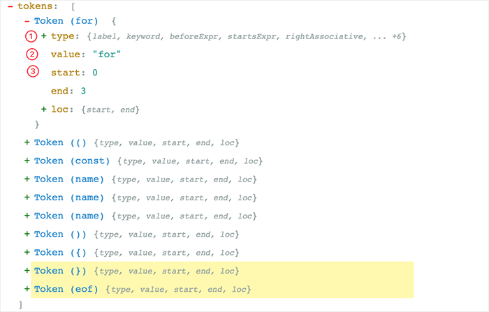
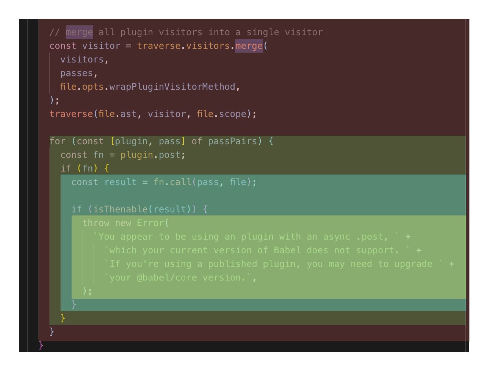

# 处理流程


首先从源码解析(Parsing)开始，解析包含了两个步骤:

## 词法解析(Lexical Analysis)

词法解析器(Tokenizer)在这个阶段将字符串形式的代码转换为 Tokens(令牌). Tokens 可以视作是一些语法片段组成的数组. 例如 `for (const item of items) {}` 词法解析后的结果如下:



从上图可以看，每个 Token 中包含了语法片段、位置信息、以及一些类型信息. 这些信息有助于后续的语法分析。

## 语法解析(Syntactic Analysis)

这个阶段语法解析器(Parser)会把 Tokens 转换为抽象语法树(Abstract Syntax Tree，AST)

AST 就是一棵’对象树’，用来表示代码的语法结构，例如 console.log('hello world')会解析成为:


Program、CallExpression、Identifier 这些都是节点的类型，每个节点都是一个有意义的语法单元。这些节点类型定义了一些属性来描述节点的信息。

JavaScript 的语法越来越复杂，而且 Babel 除了支持最新的 JavaScript 规范语法, 还支持 JSX、Flow、现在还有 Typescript。想象一下 AST 的节点类型有多少，其实我们不需要去记住这么多类型、也记不住. 插件开发者会利用 ASTExplorer 来审查解析后的 AST 树, 非常强大。

AST 是 Babel 转译的核心数据结构，后续的操作都依赖于 AST。

## 转换(Transform)

转换阶段会对 AST 进行遍历，在这个过程中对节点进行增删查改。Babel 所有插件都是在这个阶段工作，比如语法转换、代码压缩。

Javascript In Javascript Out，最后阶段还是要把 AST 转换回字符串形式的 Javascript，同时这个阶段还会生成 Source Map。

# Babel 的架构

Babel 和 Webpack 为了适应复杂的定制需求和频繁的功能变化，都使用了[微内核](https://juejin.im/post/5d7ffad551882545ff173083#heading-10)的架构风格。也就是说它们的核心非常小，大部分功能都是通过插件扩展实现的。

所以简单地了解一下 Babel 的架构和一些基本概念，对后续文章内容的理解, 以及 Babel 的使用还是有帮助的。


Babel 是一个 [MonoRepo](https://github.com/lerna/lerna) 项目，不过组织非常清晰，下面就源码上我们能看到的模块进行一下分类，配合上面的架构图让你对 Babel 有个大概的认识:

## 核心

@babel/core 这也是上面说的‘微内核’架构中的‘内核’。对于 Babel 来说，这个内核主要干这些事情：

- 加载和处理配置(config)
- 加载插件
- 调用 Parser 进行语法解析，生成 AST
- 调用 Traverser 遍历 AST，并使用访问者模式应用’插件’对 AST 进行转换
- 生成代码，包括 SourceMap 转换和源代码生成

## 核心周边支撑

### Parser(@babel/parser)

将源代码解析为 AST 就靠它了。 它已经内置支持很多语法. 例如 JSX、Typescript、Flow、以及最新的 ECMAScript 规范。目前为了执行效率，parser 是不支持扩展的，由官方进行维护。如果你要支持自定义语法，可以 fork 它，不过这种场景非常少。

### Traverser(@babel/traverse)

实现了访问者模式，对 AST 进行遍历，转换插件会通过它获取感兴趣的 AST 节点，对节点继续操作, 下文会详细介绍访问器模式。

### Generator(@babel/generator)

将 AST 转换为源代码，支持 SourceMap

## 插件

打开 Babel 的源代码，会发现有好几种类型的‘插件’。

### 语法插件(@babel/plugin-syntax-\*)

上面说了 @babel/parser 已经支持了很多 JavaScript 语法特性，Parser 也不支持扩展. 因此 plugin-syntax-\*实际上只是用于开启或者配置 Parser 的某个功能特性。

一般用户不需要关心这个，Transform 插件里面已经包含了相关的 plugin-syntax-\*插件了。用户也可以通过 parserOpts 配置项来直接配置 Parser

### 转换插件

用于对 AST 进行转换, 实现转换为 ES5 代码、压缩、功能增强等目的. Babel 仓库将转换插件划分为两种(只是命名上的区别)：

- @babel/plugin-transform-\*：普通的转换插件
- @babel/plugin-proposal-\*：还在’提议阶段’(非正式)的语言特性, 目前有[这些](https://babeljs.io/docs/en/next/plugins#experimental)

### 预定义集合(@babel/presets-\*)

插件集合或者分组，主要方便用户对插件进行管理和使用。比如 preset-env 含括所有的标准的最新特性; 再比如 preset-react 含括所有 react 相关的插件.

## 插件开发辅助

- @babel/template：某些场景直接操作 AST 太麻烦，就比如我们直接操作 DOM 一样，所以 Babel 实现了这么一个简单的模板引擎，可以将字符串代码转换为 AST。比如在生成一些辅助代码(helper)时会用到这个库
- @babel/types：AST 节点构造器和断言. 插件开发时使用很频繁
- @babel/helper-\*： 一些辅助器，用于辅助插件开发，例如简化 AST 操作
- @babel/helper：辅助代码，单纯的语法转换可能无法让代码运行起来，比如低版本浏览器无法识别 class 关键字，这时候需要添加辅助代码，对 class 进行模拟。

## 工具

- @babel/node：Node.js CLI, 通过它直接运行需要 Babel 处理的 JavaScript 文件
- @babel/register：Patch NodeJs 的 require 方法，支持导入需要 Babel 处理的 JavaScript 模块
- @babel/cli：CLI 工具

# 访问者模式

转换器会遍历 AST 树，找出自己感兴趣的节点类型, 再进行转换操作. 这个过程和我们操作 DOM 树差不多，只不过目的不太一样。AST 遍历和转换一般会使用访问者模式。

想象一下，Babel 有那么多插件，如果每个插件自己去遍历 AST，对不同的节点进行不同的操作，维护自己的状态。这样子不仅低效，它们的逻辑分散在各处，会让整个系统变得难以理解和调试，最后插件之间关系就纠缠不清，乱成一锅粥。

所以转换器操作 AST 一般都是使用访问器模式，由这个访问者(Visitor)来

1. 进行统一的遍历操作
2. 提供节点的操作方法
3. 响应式维护节点之间的关系；而插件(设计模式中称为‘具体访问者’)只需要定义自己感兴趣的节点类型，当访问者访问到对应节点时，就调用插件的访问(visit)方法。

## 节点的遍历

假设我们的代码如下:

```js
function hello(v) {
  console.log('hello' + v + '!');
}
```

解析后的 AST 结构如下:

```
File
  Program (program)
    FunctionDeclaration (body)
      Identifier (id)  #hello
      Identifier (params[0]) #v
      BlockStatement (body)
        ExpressionStatement ([0])
          CallExpression (expression)
            MemberExpression (callee)  #console.log
              Identifier (object)  #console
              Identifier (property)  #log
            BinaryExpression (arguments[0])
              BinaryExpression (left)
                StringLiteral (left)  #'hello'
                Identifier (right)  #v
              StringLiteral (right)  #'!'
```

访问者会以深度优先的顺序, 或者说递归地对 AST 进行遍历，其调用顺序如下图所示:


上图中绿线表示进入该节点，红线表示离开该节点。下面写一个超简单的’具体访问者’来还原上面的遍历过程:

```js
const babel = require('@babel/core');
const traverse = require('@babel/traverse').default;

const ast = babel.parseSync(code);

let depth = 0;
traverse(ast, {
  enter(path) {
    console.log(`enter ${path.type}(${path.key})`);
    depth++;
  },
  exit(path) {
    depth--;
    console.log(`  exit ${path.type}(${path.key})`);
  }
});
```

执行结果

```
enter Program(program)
  enter FunctionDeclaration(0)
    enter Identifier(id)
    exit Identifier(id)
    enter Identifier(0)
    exit Identifier(0)
    enter BlockStatement(body)
      enter ExpressionStatement(0)
        enter CallExpression(expression)
          enter MemberExpression(callee)
            enter Identifier(object)
            exit Identifier(object)
            enter Identifier(property)
            exit Identifier(property)
          exit MemberExpression(callee)
          enter BinaryExpression(0)
            enter BinaryExpression(left)
              enter StringLiteral(left)
              exit StringLiteral(left)
              enter Identifier(right)
              exit Identifier(right)
            exit BinaryExpression(left)
            enter StringLiteral(right)
            exit StringLiteral(right)
          exit BinaryExpression(0)
        exit CallExpression(expression)
      exit ExpressionStatement(0)
    exit BlockStatement(body)
  exit FunctionDeclaration(0)
exit Program(program)
```

当访问者进入一个节点时就会调用 enter(进入) 方法，反之离开该节点时会调用 exit(离开) 方法。 一般情况下，插件不会直接使用 enter 方法，只会关注少数几个节点类型，所以具体访问者也可以这样声明访问方法:

```js
traverse(ast, {
  // 访问标识符
  Identifier(path) {
    console.log(`enter Identifier`);
  },
  // 访问调用表达式
  CallExpression(path) {
    console.log(`enter CallExpression`);
  },
  // 上面是 enter 的简写，如果要处理 exit，也可以这样
  // 二元操作符
  BinaryExpression: {
    enter(path) {},
    exit(path) {}
  },
  // 更高级的, 使用同一个方法访问多种类型的节点
  'ExportNamedDeclaration|Flow'(path) {}
});
```

那么 Babel 插件是怎么被应用的呢？

Babel 会按照插件定义的顺序来应用访问方法，比如你注册了多个插件，babel-core 最后传递给访问器的数据结构大概长这样：

```js
{
  Identifier: {
    enter: ['plugin-xx', 'plugin-yy']; // 数组形式
  }
}
```

当进入一个节点时，这些插件会按照注册的顺序被执行。大部分插件是不需要开发者关心定义的顺序的，有少数的情况需要稍微注意以下，例如 plugin-proposal-decorators:

```js
{
  "plugins": [
    "@babel/plugin-proposal-decorators",     // 必须在plugin-proposal-class-properties之前
    "@babel/plugin-proposal-class-properties"
  ]
}
```

所有插件定义的顺序，按照惯例，应该是新的或者说实验性的插件在前面，老的插件定义在后面。因为可能需要新的插件将 AST 转换后，老的插件才能识别语法（向后兼容）。下面是官方配置例子, 为了确保先后兼容，stage-\*阶段的插件先执行:

```js
{
  "presets": ["es2015", "react", "stage-2"]
}
```

> 注意 Preset 的执行顺序相反

## 节点的上下文

访问者在访问一个节点时, 会无差别地调用 enter 方法，我们怎么知道这个节点在什么位置以及和其他节点的关联关系呢？

通过上面的代码，读者应该可以猜出几分，每个 visit 方法都接收一个 Path 对象, 你可以将它当做一个‘上下文’对象，类似于 JQuery 的 `JQuery(const $el = $('.el'))` 对象，这里面包含了很多信息：

- 当前节点信息
- 节点的关联信息。父节点、子节点、兄弟节点等等
- 作用域信息
- 上下文信息
- 节点操作方法。节点增删查改
- 断言方法。isXXX, assertXXX

下面是它的主要结构:

```ts
export class NodePath<T = Node> {
  constructor(hub: Hub, parent: Node);
  parent: Node;
  hub: Hub;
  contexts: TraversalContext[];
  data: object;
  shouldSkip: boolean;
  shouldStop: boolean;
  removed: boolean;
  state: any;
  opts: object;
  skipKeys: object;
  parentPath: NodePath;
  context: TraversalContext;
  container: object | object[];
  listKey: string; // 如果节点在一个数组中，这个就是节点数组的键
  inList: boolean;
  parentKey: string;
  key: string | number; // 节点所在的键或索引
  node: T; // 🔴 当前节点
  scope: Scope; // 🔴当前节点所在的作用域
  type: T extends undefined | null ? string | null : string; // 🔴节点类型
  typeAnnotation: object;
  // ... 还有很多方法，实现增删查改
}
```

你可以通过这个手册来学习怎么通过 Path 来转换 AST. 后面也会有代码示例，这里就不展开细节了

## 副作用的处理

实际上访问者的工作比我们想象的要复杂的多，上面示范的是静态 AST 的遍历过程。而 AST 转换本身是有副作用的，比如插件将旧的节点替换了，那么访问者就没有必要再向下访问旧节点了，而是继续访问新的节点, 代码如下。

```js
traverse(ast, {
  ExpressionStatement(path) {
    // 将 `console.log('hello' + v + '!')` 替换为 `return ‘hello’ + v`
    const rtn = t.returnStatement(t.binaryExpression('+', t.stringLiteral('hello'), t.identifier('v')))
    path.replaceWith(rtn)
  },
}
```

上面的代码, 将 `console.log('hello' + v + '!')` 语句替换为`return "hello" + v`, 下图是遍历的过程：


我们可以对 AST 进行任意的操作，比如删除父节点的兄弟节点、删除第一个子节点、新增兄弟节点，当这些操作’污染’了 AST 树后，访问者需要记录这些状态，响应式(Reactive)更新 Path 对象的关联关系, 保证正确的遍历顺序，从而获得正确的转译结果。

## 作用域的处理

访问者可以确保正确地遍历和修改节点，但是对于转换器来说，另一个比较棘手的是对作用域的处理，这个责任落在了插件开发者的头上。插件开发者必须非常谨慎地处理作用域，不能破坏现有代码的执行逻辑。

```js
const a = 1,
  b = 2;
function add(foo, bar) {
  console.log(a, b);
  return foo + bar;
}
```

比如你要将 add 函数的第一个参数 foo 标识符修改为 a, 你就需要递归遍历子树，查出 foo 标识符的所有引用, 然后替换它:

```js
traverse(ast, {
  // 将第一个参数名转换为 a
  FunctionDeclaration(path) {
    const firstParams = path.get('params.0');
    if (firstParams == null) {
      return;
    }

    const name = firstParams.node.name;
    // 递归遍历，这是插件常用的模式。这样可以避免影响到外部作用域
    path.traverse({
      Identifier(path) {
        if (path.node.name === name) {
          path.replaceWith(t.identifier('a'));
        }
      }
    });
  }
});

console.log(generate(ast).code);
// function add(a, bar) {
//   console.log(a, b);
//   return a + bar;
// }
```

替换成 a 之后, `console.log(a, b)` 的行为就被破坏了。所以这里不能用 a，得换个标识符, 譬如 c.

这就是转换器需要考虑的作用域问题，AST 转换的前提是保证程序的正确性。我们在添加和修改引用时，需要确保与现有的所有引用不冲突。Babel 本身不能检测这类异常，只能依靠插件开发者谨慎处理。

Javascript 采用的是词法作用域, 也就是根据源代码的词法结构来确定作用域：



在词法区块(block)中，由于新建变量、函数、类、函数参数等创建的标识符，都属于这个区块作用域. 这些标识符也称为绑定(Binding)，而对这些绑定的使用称为引用(Reference)

在 Babel 中，使用 Scope 对象来表示作用域。 我们可以通过 Path 对象的 scope 字段来获取当前节点的 Scope 对象。它的结构如下:

```js
{
  path: NodePath;
  block: Node;         // 所属的词法区块节点, 例如函数节点、条件语句节点
  parentBlock: Node;   // 所属的父级词法区块节点
  parent: Scope;       // 指向父作用域
  bindings: { [name: string]: Binding; }; // 该作用域下面的所有绑定(即该作用域创建的标识符)
}
```

Scope 对象和 Path 对象差不多，它包含了作用域之间的关联关系(通过 parent 指向父作用域)，收集了作用域下面的所有绑定(bindings), 另外还提供了丰富的方法来操作作用域。

我们可以通过 bindings 属性获取当前作用域下的所有绑定(即标识符)，每个绑定由 Binding 类来表示：

```js
export class Binding {
  identifier: t.Identifier;
  scope: Scope;
  path: NodePath;
  kind: 'var' | 'let' | 'const' | 'module';
  referenced: boolean;
  references: number; // 被引用的数量
  referencePaths: NodePath[]; // ⚛️获取所有应用该标识符的节点路径
  constant: boolean; // 是否是常量
  constantViolations: NodePath[];
}
```

通过 Binding 对象我们可以确定标识符被引用的情况。

Ok，有了 Scope 和 Binding, 现在有能力实现安全的变量重命名转换了。为了更好地展示作用域交互，在上面代码的基础上，我们再增加一下难度：

```js
const a = 1;
const b = 2;
function add(foo, bar) {
  console.log(a, b);
  return () => {
    const a = '1'; // 新增了一个变量声明
    return a + (foo + bar);
  };
}
```

现在你要重命名函数参数 foo, 不仅要考虑外部的作用域, 也要考虑下级作用域的绑定情况，确保这两者都不冲突。

上面的代码作用域和标识符引用情况如下图所示:


试着将函数的第一个参数重新命名为更短的标识符:

```js
// 用于获取唯一的标识符
const getUid = () => {
  let uid = 0;
  return () => `_${uid++ || ''}`;
};

const ast = babel.parseSync(code);
traverse(ast, {
  FunctionDeclaration(path) {
    // 获取第一个参数
    const firstParam = path.get('params.0');
    if (firstParam == null) {
      return;
    }

    const currentName = firstParam.node.name;
    const currentBinding = path.scope.getBinding(currentName);
    const gid = getUid();
    let sname;

    // 循环找出没有被占用的变量名
    while (true) {
      sname = gid();

      // 1️、首先看一下父作用域是否已定义了该变量
      if (path.scope.parentHasBinding(sname)) {
        continue;
      }

      // 2、查当前作用域是否定义了变量
      if (path.scope.hasOwnBinding(sname)) {
        // 已占用
        continue;
      }

      // 再检查第一个参数的当前的引用情况,
      // 如果它所在的作用域定义了同名的变量，我们也得放弃
      if (currentBinding.references > 0) {
        let findIt = false;
        for (const refNode of currentBinding.referencePaths) {
          if (refNode.scope !== path.scope && refNode.scope.hasBinding(sname)) {
            findIt = true;
            break;
          }
        }
        if (findIt) {
          continue;
        }
      }
      break;
    }

    // 开始替换掉
    const i = t.identifier(sname);
    currentBinding.referencePaths.forEach((p) => p.replaceWith(i));
    firstParam.replaceWith(i);
  }
});

console.log(generate(ast).code);
// const a = 1,
//       b = 2;

// function add(_, bar) {
//   console.log(a, b);
//   return () => {
//     const a = '1'; // 新增了一个变量声明

//     return a + (_ + bar);
//   };
// }
```

上面的例子虽然没有什么实用性，而且还有 Bug(没考虑 label)，但是正好可以揭示了作用域处理的复杂性。

Babel 的 Scope 对象其实提供了一个 generateUid 方法来生成唯一的、不冲突的标识符。我们利用这个方法再简化一下我们的代码:

```js
traverse(ast, {
  FunctionDeclaration(path) {
    const firstParam = path.get('params.0');
    if (firstParam == null) {
      return;
    }
    let i = path.scope.generateUidIdentifier('_'); // 也可以使用 generateUid
    const currentBinding = path.scope.getBinding(firstParam.node.name);
    currentBinding.referencePaths.forEach((p) => p.replaceWith(i));
    firstParam.replaceWith(i);
  }
});
```

或

```js
traverse(ast, {
  FunctionDeclaration(path) {
    const firstParam = path.get('params.0');
    if (firstParam == null) {
      return;
    }
    let i = path.scope.generateUid('_'); // 也可以使用generateUid
    path.scope.rename(firstParam.node.name, i);
  }
});
```

generateUid 的实现代码

```js
generateUid(name: string = "temp") {
  name = t
    .toIdentifier(name)
    .replace(/^_+/, "")
    .replace(/[0-9]+$/g, "");

  let uid;
  let i = 0;
  do {
    uid = this._generateUid(name, i);
    i++;
  } while (
    this.hasLabel(uid) ||
    this.hasBinding(uid) ||
    this.hasGlobal(uid) ||
    this.hasReference(uid)
  );

  const program = this.getProgramParent();
  program.references[uid] = true;
  program.uids[uid] = true;

  return uid;
}
```

作用域操作最典型的场景是代码压缩，代码压缩会对变量名、函数名等进行压缩… 然而实际上很少的插件场景需要跟作用域进行复杂的交互，所以关于作用域这一块就先讲到这里。

# 写一个插件

现在打算模仿 babel-plugin-import, 写一个极简版插件，来实现模块的按需导入. 在这个插件中，我们会将类似这样的导入语句:

```js
import { A, B, C as D } from 'foo';
```

转换为:

```js
import A from 'foo/A';
import 'foo/A/style.css';
import B from 'foo/B';
import 'foo/B/style.css';
import D from 'foo/C';
import 'foo/C/style.css';
```

首先通过 AST Explorer 看一下导入语句的 AST 节点结构:


通过上面展示的结果，我们需要处理 ImportDeclaration 节点类型，将它的 specifiers 拿出来遍历处理一下。另外如果用户使用了默认导入语句，我们将抛出错误，提醒用户不能使用默认导入.

基本实现如下:

```js
// 要识别的模块
const MODULE = 'foo';
traverse(ast, {
  // 访问导入语句
  ImportDeclaration(path) {
    if (path.node.source.value !== MODULE) {
      return;
    }

    // 如果是空导入则直接删除掉
    const specs = path.node.specifiers;
    if (specs.length === 0) {
      path.remove();
      return;
    }

    // 判断是否包含了默认导入和命名空间导入
    if (specs.some((i) => t.isImportDefaultSpecifier(i) || t.isImportNamespaceSpecifier(i))) {
      // 抛出错误，Babel 会展示出错的代码帧
      throw path.buildCodeFrameError('不能使用默认导入或命名空间导入');
    }

    // 转换命名导入
    const imports = [];
    for (const spec of specs) {
      const named = MODULE + '/' + spec.imported.name;
      const local = spec.local;
      imports.push(t.importDeclaration([t.importDefaultSpecifier(local)], t.stringLiteral(named)));
      imports.push(t.importDeclaration([], t.stringLiteral(`${named}/style.css`)));
    }

    // 替换原有的导入语句
    path.replaceWithMultiple(imports);
  }
});
```

逻辑还算简单，babel-plugin-import 可比这复杂得多。

接下来，我们将它封装成标准的 Babel 插件。按照规范，我们需要创建一个 babel-plugin-\*前缀的包名：

```bash
mkdir babel-plugin-toy-import
cd babel-plugin-toy-import
yarn init -y
touch index.js
```

> 你也可以通过 [generator-babel-plugin](https://github.com/babel/generator-babel-plugin/tree/master/generators/app/templates) 来生成项目模板

在 index.js 文件中填入我们的代码。index.js 默认导出一个函数，函数结构如下:

```js
// 接受一个 babel-core 对象
export default function(babel) {
  const { types: t } = babel;
  return {
    pre(state) {
      // 前置操作，可选，可以用于准备一些资源
    },
    visitor: {
      // 我们的访问者代码将放在这里
      ImportDeclaration(path, state) {
        // ...
      }
    },
    post(state) {
      // 后置操作，可选
    }
  };
}
```

我们可以从访问器方法的第二个参数 state 中获取用户传入的参数。假设用户配置为:

```js
{
  plugins: [['toy-plugin', { name: 'foo' }]];
}
```

我们可以这样获取用户传入的参数:

```js
export default function(babel) {
  const { types: t } = babel;
  return {
    visitor: {
      ImportDeclaration(path, state) {
        const mod = state.opts && state.opts.name;
        if (mod == null) {
          return;
        }
        // ...
      }
    }
  };
}
```

最后 `npm publish`

# 关于宏

Wiki 上面对‘宏’的定义是：宏(Macro), 是一种批处理的称谓，它根据一系列的预定义规则转换一定的文本模式。解释器或编译器在遇到宏时会自动进行这一模式转换，这个转换过程被称为“宏展开(Macro Expansion)”。对于编译语言，宏展开在编译时发生，进行宏展开的工具常被称为宏展开器。

你可以认为，宏就是用来生成代码的代码，它有能力进行一些句法解析和代码转换。宏大致可以分为两种: 文本替换和语法扩展

## 文本替换式

大家或多或少有接触过宏，很多程序员第一门语言是 C/C++(包括 C 的衍生语言 Objective-C), 在 C 中就有宏的概念。使用 #define 指令定义一个宏:

```c
#define MIN(X, Y) ((X) < (Y) ? (X) : (Y))
```

如果我们的程序使用了这个宏，就会在编译阶段被展开，例如：

```js
MIN(a + b, c + d);
```

会被展开为:

```js
a + b < c + d ? a + b : c + d;
```

除了函数宏, C 中还有对象宏, 我们通常使用它来声明’常量’:

```c
#define PI 3.1214
```


如上图，宏本质上不是 C 语言的一部分, 它由 C 预处理器提供，预处理器在编译之前对源代码进行文本替换，生成‘真正’的 C 代码，再传递给编译器。

> 当然 C 预处理器不仅仅会处理宏，它还包含了头文件引入、条件编译、行控制等操作

除此之外，GNU m4 是一个更专业/更强大/更通用的预处理器(宏展开器)。这是一个通用的宏展开器，不仅可以用于 C，也可以用于其他语言和文本文件的处理(参考这篇有趣的文章：[使用 GNU m4 为 Markdown 添加目录支持](https://segmentfault.com/a/1190000004342956))， 关于 m4 可以看 [让这世界再多一份 GNU m4 教程](https://segmentfault.com/a/1190000004104696) 系列文章

文本替换式宏很容易理解、实现也简单，因为它们只是纯文本替换, 换句话说它就像‘文本编辑器’。所以相对而言，这种形式的宏能力有限，比如它不会检验语法是否合法, 使用它经常会出现问题。

所以随着现代编程语言表达能力越来越强，很多语言都不再推荐使用宏/不提供宏，而是使用语言本身的机制(例如函数)来解决问题，这样更安全、更容易理解和调试。没有宏机制，现代语言可以通过提供强大的反射机制或者动态编程特性(如 Javascript 的 Proxy、Python 的装饰器)来弥补缺失宏导致的元编程短板。 所以反过来推导，之所以 C 语言需要宏，正是因为 C 语言的表达能力太弱了。

// TODO https://bobi.ink/2019/10/10/babel-macro/#%E8%AF%AD%E6%B3%95%E6%89%A9%E5%B1%95%E5%BC%8F
