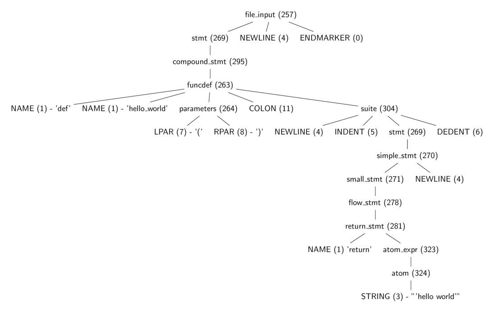

提供的源代码链接如无特殊说明均来自于 CPython repo 中的 Python3.7 分支。

# 背景

这本书旨在深入 Python 解释器之中，提供 python 程序运行机制的概念上的概述。本书描述的对象是 CPython 的解释器实现，它是目前最主流或者说官方的 Python 实现。

根据对解释器调用方式的不同，一个 Python 程序的执行可以分为两个或三个阶段，这些内容将会被涵盖在本书的不同章节中：

1. 初始化（Initialization）：这个阶段涉及到对于 python 进程所需要的一系列数据结构的初始化。此阶段在交互模式下不会进行。
2. 编译（Compiling）：该阶段涉及到将源代码解析成语法树，创建 AST（Abstract Syntax Tree，抽象语法树）对象，创建 symbol tables 以及生成 code objects。
3. 解释运行（Interpreting）：这个阶段涉及到在一些环境（context）下对 code object 的执行。

从源代码生成解析树（parse tree）与 AST 的过程是一个与特定语言关系不大的过程，应用在其它语言上的方法一样可以应用在 Python 上，所以本书并不会将重点放在这里。另一方面从抽象语法树创建符号表与 code object 是编译过程中更为有趣的过程，它多多少少与 Python 更加相关，也更值得关注。对编译后的 code object 进行解释以及其中所涉及到的数据结构也将被提及。主题将包括但不限于：符号表、code object 的生成过程、Python objects、frame objects、code objects、function objects、Python opcodes、interpreter loop、生成器以及由用户定义的类。

# 执行过程

当我们通过命令行传入参数的方式调用 python 解释器去运行一个模块的时候，比如运行 `python test.py` 则如下过程将开始进行


Python 可执行程序是一个用 C 语言编写的程序。当它被执行的时候，所发生的事情其实就和其他 C 语言程序（比如 Linux 内核或是一个简单的 hello world 程序）差不多。请花一点时间来理解一下，Python 可执行程序只是一个用来运行程序的程序，可以结合 C 与 汇编或者 LLVM 的关系来理解。当我们使用解释器运行一个模块的时候，最开始会运行一个与平台相关的标准初始化过程。

> 本书中的所有讨论都假设在类 Unix 操作系统中，Windows 下会有些许不同。

C 运行时环境包含了所有的初始化操作，像是加载库、检查与设置环境变量等等，然后 python 可执行程序的 main 方法开始运行就像任何其他普通的 C 程序那样。

> 补充知识：CPyhon 的项目结构
>
> 参考 [CPython 开发指南](https://cpython-devguide.readthedocs.io/setup/#directory-structure) 与 [3.7 的源码](https://github.com/python/cpython/tree/3.7)。CPython 项目中的大多数 C 代码位于少数几个文件夹中：
>
> - Include：存放大多数解释器层面上主要的头文件。
> - Objects：包括从 int 到 type 的一系列对象（object）的实现。
> - Python：解释器、字节码编译器以及一些其它的基础设施。
> - Parser：语法相关的代码，包括 parser，lexer 以及 parser generator。
> - Modules：标准库中使用 C 实现的部分，以及 main.c。
> - Programs：C 可执行文件的源代码，包括 CPython 解释器的程序入口。

python 的 main 函数位于 [Programs/python.c](https://github.com/python/cpython/blob/3.7/Programs/python.c#L13) 文件中。main 函数会调用位于 [Modules/main.c](https://github.com/python/cpython/blob/3.7/Modules/main.c#L3085) 中的 `Py_Main` 函数，它处理解释器的初始化过程，包括：解析命令行参数、设置程序的 [flags](https://docs.python.org/3.7/using/cmdline.html)、读取环境变量、运行 hook、哈希初始化等等。作为初始化过程的一部分，[Python/pylifecycle.c](https://github.com/python/cpython/blob/3.7/Python/pylifecycle.c#L1046) 中的 `Py_Initialize` 函数会被调用，它会初始化两个比较重要的数据结构：解释器状态与线程状态。

看一眼解释器状态与线程状态的定义，它能给我们一些关于它们功能的信息。这两个数据结构由一些指向特定字段的指针组成，它们带有程序执行所需要的一些信息。首先我们来看解释器状态在源码中的定义（[Include/pystate.h](https://github.com/python/cpython/blob/3.7/Include/pystate.h#L113)），以下是其中比较重要的部分：

```c
typedef struct _is {
    struct _is *next;
    struct _ts *tstate_head;

    PyObject *modules;
    PyObject *modules_by_index;
    PyObject *sysdict;
    PyObject *builtins;
    PyObject *importlib;

    PyObject *codec_search_path;
    PyObject *codec_search_cache;
    PyObject *codec_error_registry;

    int codecs_initialized;
    int fscodec_initialized;

    PyObject *builtins_copy;
} PyInterpreterState;
```

Python 程序员应该或多或少会对这些字段名字中的词有一些认识比如：sysdict，builtins，codec 等。

1. \*next 字段为一个指向另一个解释器实例的引用（译注：多个解释器可以同时存在于一个进程当中，这个特性有望用于解决 CPython 的 GIL 问题，参考 [PEP554](https://www.python.org/dev/peps/pep-0554/)）
2. \*tstate_head 字段指向运行的主线程。当程序开启多线程时，解释器被它开启的所有线程所共享。线程状态随后将被讨论。
3. modules, `modules_by_index`, sysdict, builtins 以及 importlib 从它们的名字就能理解。它们都被定义为 PyObject 的实例，在 Python 虚拟机中 PyObject 为最基本的对象类型。
4. codec\* 相关的字段持有用于定位、加载编码方式（encodings）的信息，对于字节解码（decoding bytes）非常重要。

程序的运行必须在一个线程之中进行，thread state structure 包含了一个线程执行 python code object 所需的信息，关于 thread state 定义的其中一部分代码如下（[Include/pystate.h](https://github.com/python/cpython/blob/3.7/Include/pystate.h#L212)）：

```c
typedef struct _ts {

    struct _ts *prev;
    struct _ts *next;
    PyInterpreterState *interp;

    struct _frame *frame;
    int recursion_depth;
    char overflowed; /* The stack has overflowed. Allow 50 more calls
                        to handle the runtime error. */
    char recursion_critical; /* The current calls must not cause
                                a stack overflow. */
    int stackcheck_counter;

    /* 'tracing' keeps track of the execution depth when tracing/profiling.
       This is to prevent the actual trace/profile code from being recorded in
       the trace/profile. */
    int tracing;
    int use_tracing;

    Py_tracefunc c_profilefunc;
    Py_tracefunc c_tracefunc;
    PyObject *c_profileobj;
    PyObject *c_traceobj;

    /* The exception currently being raised */
    PyObject *curexc_type;
    PyObject *curexc_value;
    PyObject *curexc_traceback;

    PyObject *dict;  /* Stores per-thread state */

    int gilstate_counter;
} PyThreadState;
```

关于这两个数据结构，后面的章节中还会有进一步讨论。初始化过程还会设置一些重要的机制，比如基本的 stdio 等。

一旦完成了所有的初始化，`Py_Main` 函数会调用 [`pymain_run_file`](https://github.com/python/cpython/blob/3.7/Modules/main.c#L426) 函数，随后发生调用：

```
PyRun_AnyFileExFlags ->
PyRun_SimpleFileExFlags ->
PyRun_FileExFlags ->
PyParser_ASTFromFileObject
```

在 [PyRun_SimpleFileExFlags](https://github.com/python/cpython/blob/3.7/Python/pythonrun.c#L373) 函数调用中，`__main__` namespace 将被创建，文件内容将在其中被运行。它也将检查文件的 pyc 版本是否存在（pyc 文件是一个储存了已经被执行过的 py 文件编译后的代码（字节码）的文件）。当文件的 pyc 版本存在的时候，将会尝试以二进制形式读取并执行它。而当 pyc 文件不存在的时候，会顺着 [PyRun_FileExFlags](https://github.com/python/cpython/blob/3.7/Python/pythonrun.c#L965) 向下调用，[PyParser_ASTFromFileObject](https://github.com/python/cpython/blob/3.7/Python/pythonrun.c#L1210) 函数会接着调用 [PyParser_ParseFileObject](https://github.com/python/cpython/blob/3.7/Parser/parsetok.c#L116) 函数，它会读取被执行模块的内容并建立 parse tree，然后将 parse tree 传递给 [PyAST_FromNodeObject](https://github.com/python/cpython/blob/3.7/Python/ast.c#L768) 根据 parse tree 创建 AST。

> 如果你阅读这些代码，你会看到很多的 `Py_INCREF` 和 `Py_DECREF`。这些内存管理函数会在后面详细讨论。CPython 通过引用计数管理对象的生命周期。当一个新的对象引用产生的时候，计数通过 `Py_INCREF` 增加，当一个引用离开作用域的时候会通过 `Py_DECREF` 减少。

AST 生成后会被传给 [run_mod](https://github.com/python/cpython/blob/3.7/Python/pythonrun.c#L1027) 函数，这个函数会接着调用 [PyAST_CompileObject](https://github.com/python/cpython/blob/3.7/Python/compile.c#L301) 根据 AST 生成 code object。并且在调用 `PyAST_CompileObject` 生成字节码的时候会经过一个简单的 peephole optimizer 进行字节码优化。随后 `run_mod` 会调用 [PyEval_EvalCode](https://github.com/python/cpython/blob/3.7/Python/ceval.c#L522) 随之产生函数调用:

```
PyEval_EvalCode ->
PyEval_EvalCodeEx ->
_PyEval_EvalCodeWithName ->
PyEval_EvalFrameEx
```

在 [PyEval_EvalFrameEx](https://github.com/python/cpython/blob/3.7/Python/ceval.c#L544) 中的解释器循环（interpreter loop）才会实际进行对 code object 的运行处理。它不只是将 code object 作为参数而是使用一个 frame object，它有一个字段用来保存到 code object 的引用。简单来说，解释器循环会不断读取储存在一个指令数组中的下一个指令进行执行，增加或者删除位于栈上的对象，直到没有新的指令或者中途发生异常中断了循环。

头文件 [Include/opcode.h](https://github.com/python/cpython/blob/3.7/Include/opcode.h) 中包含了 python 虚拟机支持的 instruction/opcodes 清单。其实 opcodes 的概念很容易理解，在上面的例子中有 4 条 instruction：`LOAD_FAST` 将它的参数对应的值（这里对应 x）加载到栈上。python 虚拟机是基于栈的 （stack based），也就是说 opcode 进行求值的对象以及求值得到的结果都会保存在栈上。`BINARY_MULTIPLY` opcode 会将前两条指令的结果从栈中弹出（pop），执行二进制乘法运算然后将结果放（push）回栈顶。`RETURN_VALUE` 指令会从栈中弹出设置为返回值并中断解释器循环。

> 这里还涉及到几个暂时没有被解答的问题：
>
> 1. LOAD_FAST 加载的值来自于哪里？
> 2. 指令中使用的参数来自于哪里？
> 3. 嵌套的函数与方法调用是如何被管理的？
> 4. 解释器循环是如何进行异常处理的？

当所有的指令都被执行以后，`Py_Main` 将继续执行一些清理（clean up）过程。就像 `Py_Initialize` 所做的那样，[Py_Finalize](https://github.com/python/cpython/blob/3.7/Python/pylifecycle.c#L1120) 会被调用完成一些清理任务，比如等待线程退出、调用 exit hooks、清理解释器分配的仍然被使用的内存等等。

上面我们在一个较高的层面上对 python 解释器如何执行程序进行了描述，但还有大量的细节没有被讨论，接下来的章节中我们将深入进去提供更多的细节信息。

# 编译 Python 源代码

生成 code object 过程中 4 个主要的数据结构。尽管一般并不认为 Python 是一门编译性的语言，但实际上在代码执行前 Python 源码仍会被编译成可以被 python 虚拟机执行的字节码（byte code）。python 的编译过程非常直接，并不涉及到很多复杂的步骤。一个完整的 python 程序编译过程有以下几个步骤：

1. 将源代码 parsing 成一个 parse tree。
2. 将 parse tree 转化为 AST（抽象语法树，abstract syntax tree）。
3. 生成符号表（symbol table）。
4. 从 AST 生成 code object，这一步包含：
   1. 将 AST 转化为一个 flow control graph。
   2. 从 control flow graph 产生 code object。

其中将从源码到 AST 是一个标准的过程，python 这里并没有什么特别的，所以本书会把关注点更多放在 symbol tables 以及 code objects 的生成过程上。如果你对于 Parsing 的详细原理比较感兴趣，推荐阅读经典的 [龙书](https://www.amazon.co.uk/Compilers-Principles-Techniques-Alfred-Aho/dp/0201100886)。

## 从源码到 parse tree

按照 Dragon book 中的描述 python 的 parser 属于一种 [LL(1)](https://en.wikipedia.org/wiki/LL_parser) parser。CPython 目录下的 [Grammar/Grammer](https://github.com/python/cpython/blob/3.5/Grammar/Grammar) 文件中包含了 Python 语言文法的 [EBNF](https://en.wikipedia.org/wiki/Extended_Backus%E2%80%93Naur_form)（Extended Backus–Naur Form，扩展巴科斯范式）：

```
...
stmt: simple_stmt | compound_stmt
simple_stmt: small_stmt (';' small_stmt)* [';'] NEWLINE
small_stmt: (expr_stmt | del_stmt | pass_stmt | flow_stmt |
             import_stmt | global_stmt | nonlocal_stmt | assert_stmt)
expr_stmt: testlist_star_expr (augassign (yield_expr|testlist) |
                     ('=' (yield_expr|testlist_star_expr))*)
testlist_star_expr: (test|star_expr) (',' (test|star_expr))* [',']
augassign: ('+=' | '-=' | '*=' | '@=' | '/=' | '%=' | '&=' | '|=' | '^=' |
            '<<=' | '>>=' | '**=' | '//=')
del_stmt: 'del' exprlist
pass_stmt: 'pass'
flow_stmt: break_stmt | continue_stmt | return_stmt | raise_stmt | yield_stmt
break_stmt: 'break'
continue_stmt: 'continue'
return_stmt: 'return' [testlist]
yield_stmt: yield_expr
raise_stmt: 'raise' [test ['from' test]]
import_stmt: import_name | import_from
import_name: 'import' dotted_as_names
import_from: ('from' (('.' | '...')* dotted_name | ('.' | '...')+)
              'import' ('*' | '(' import_as_names ')' | import_as_names))
import_as_name: NAME ['as' NAME]
...
```

每次从命令行中运行一个 python 模块的时候，`PyParser_ParseFileObject` 函数会启动对这个模块的 parsing 过程，它会调用 tokenization 函数 `PyTokenizer_FromFile`，它接受模块的文件名作为参数，将模块文件的内容分解为一个个合法的 python tokens 或者发现语法错误时进行报错。

## Python tokens

Python 源码可以看作是一段由 token 组成的序列，比如说 return 就是一个 keyword token，字面量 -2 是一个数值字面量 token 等等。Parsing python 源码的第一步就是将源码分割为一个个的 token。Python 中存在以下几种 token：

1. identifiers：由程序员定义的“名字”，包括函数名、变量名、类名等等。它们必须符合 python 文档中指定的[规范](https://docs.python.org/3.5/reference/lexical_analysis.html#identifiers)。
2. operators：一些特殊的符号比如 +, \* 能够对值进行运算产生结果。
3. delimiters：这类符号用来给表达式分组、提供标点、赋值操作，包括 (, ), {,}, =, \*= 等。
4. literals：字面量，这类符号用于提供一些类型的常量。比如字符串、bytes 类型的字面量："Fred", b"Fred"、数值类型的字面量 2、浮点类型字面量 1e100、虚数字面量 10j。
5. comments：以 # 开头的字符串字面量，用户代码注释。comments 总是位于一个 physical line 的结尾。（译注：关于什么是 physical line 与 logical line 可以参考[这里](https://stackoverflow.com/questions/31572589/difference-between-logical-line-and-physical-line-in-python)）
6. NEWLINE：用于指示一行（logical line）的结束。
7. INDENT 与 DEDENT：表示一组复合语句（compound statements）的缩进层级（identation levels）。

一组 tokens 通过一个 NEWLINE token 被分割，组成一个 logical line，因而我们可以说一个 python 程序由一系列被 NEWLINE token 分割的 logical line 所组成。这些 logical line 可以映射到 python 语句（statements）。每一个 logical line 又由一系列 physical lines 所组成，physical line 的结尾是一个换行符（end-of-line）。多个 physical line 可以被连接在一起，连接可能是隐式的，比如在括号中的时候（包括 (), [], {} 三种），也可能是显式的，也就是在行尾使用一个反斜杠 \。（译注：原文中说的是 logical line 可以被连接，这里似乎存在错误，想表达的应该是 phycial lines 被连接为 logical line）。复合语句可以跨过多个 physical line，就像图 1.3.2 中所展示的那样。缩进对于 python 语句的分组非常重要，python grammar 中有一条规则用于对它进行描述：`suite: simple_stmt | NEWLINE INDENT stmt+ DEDENT`，因而 python tokenizer 的一项主要任务就是生成 INDENT 和 DEDENT 到 parse tree。Tokenizer 使用一个栈来保持对缩进的跟踪，INDENT 与 DEDENT token 生成算法的伪代码如下：

```
使用 0 初始化 indent 栈
for 每一个 logical line:
    if (当前行的缩进级别 > 栈顶的级别):
        push(当前缩进级别)
        生成一个 INDENT token
    if (当前行的缩进级别 < 栈顶的级别):
        if (栈中不存在一个缩进级别 == 当前缩进级别):
            报告一个错误
        for 栈顶的每一个 != 当前行缩进级的值:
            移除这个值
            生成一个 DEDENT token
    tokenize(当前行)
对每一个栈上的值（除了0）生成 DEDENT token
```

CPython 的实现中 `PyTokenizer_FromFile` 函数会按照从左到右，从上到下的对 python 源码文件进行扫描并进行 tokenize。空格字符除了终止符被用来分隔开 token，但这不是必须的。如果其中存在歧义，则按照从右到左合法的可能的最长字符串来理解。比如说 2 + 2，是一个字面量 2，一个 operator +，另一个字面量 2。

> 补充知识：调用 python tokenize
>
> 在 python 中提供了 tokenize 的接口（标准模块函数 [tokenize.tokenize](https://docs.python.org/3/library/tokenize.html#tokenize.tokenize)）可以使用它对 python 源代码进行 tokenize，它接受一个 ByteIO.readline 的 callable 对象返回一个 tokens 的 generator，对这个 generator 进行迭代就能得到被解析模块的 tokens 序列，比如：

```bash
>>> from tokenize import tokenize
>>> f = open("./test.py", 'rb')  # test.py 的内容只有一行 print("hello")
>>> for t in tokenize(f.readline):
...     print(t)
...
TokenInfo(type=59 (ENCODING), string='utf-8', start=(0, 0), end=(0, 0), line='')
TokenInfo(type=1 (NAME), string='print', start=(1, 0), end=(1, 5), line='print("hello")')
TokenInfo(type=53 (OP), string='(', start=(1, 5), end=(1, 6), line='print("hello")')
TokenInfo(type=3 (STRING), string='"hello"', start=(1, 6), end=(1, 13), line='print("hello")')
TokenInfo(type=53 (OP), string=')', start=(1, 13), end=(1, 14), line='print("hello")')
TokenInfo(type=0 (ENDMARKER), string='', start=(2, 0), end=(2, 0), line='')
```

> 此外，还可以在命令行中调用 tokenize：

```bash
$ python -m tokenize test.py
0,0-0,0:            ENCODING       'utf-8'
1,0-1,5:            NAME           'print'
1,5-1,6:            OP             '('
1,6-1,13:           STRING         '"hello"'
1,13-1,14:          OP             ')'
2,0-2,0:            ENDMARKER      ''
```

tokenizer 生成的 tokens 随后会被传递给 parser 根据 python 的语法来生成 parse tree 。当 parser 发现一个 token 违反了语法规则的时候就会抛出一个 SyntaxError。python 中有一个 [parser](https://docs.python.org/3.5/library/parser.html) 模块提供了有限的对 parse tree 的访问能力：

```bash
>>> import parser
>>> from pprint import pprint
>>> code_str = """
... def hello_world():
...     return 'hello world'
... """
>>> st = parser.suite(code_str)
>>> pprint(parser.st2list(st))
[257,
 [269,
  [295,
   [263,
    [1, 'def'],
    [1, 'hello_world'],
    [264, [7, '('], [8, ')']],
    [11, ':'],
    [304,
     [4, ''],
     [5, ''],
     [269,
      [270,
       [271,
        [278,
         [281,
          [1, 'return'],
          [331,
           [305,
            [309,
             [310,
              [311,
               [312,
                [315,
                 [316,
                  [317,
                   [318,
                    [319,
                     [320,
                      [321,
                       [322,
                        [323, [324, [3, "'hello world'"]]]]]]]]]]]]]]]]]]]],
       [4, '']]],
     [6, '']]]]],
 [4, ''],s
 [0, '']]
```

函数调用 parser.suite(source) 会返回一个 python 中对 parser tree 的中间表示即 parser tree (ST) 对象。之后的调用 parser.st2list 会将 parser 以 list 的形式返回。list 中第一个元素为一个 int 类型的数字表示 python grammar 中对应的 [identifier 编号](https://github.com/python/cpython/blob/3.7/Include/token.h)。



上图展示了代码清单 1.3.2 中产生的 parse tree 结构，可以看到其中每个节点的类型可以用一个整数来表示，这些对于这些整数的定义位于头文件 [Include/token.h](https://github.com/python/cpython/blob/3.7/Include/token.h) 和 [Include/graminit.h](https://github.com/python/cpython/blob/3.7/Include/graminit.h) 中。

在 CPython 虚拟机中，使用树结构来对 parser tree 进行表示。每一个产生式规则（production rule）是树中的一个节点（node）。对 node 的定义位于头文件 [Include/node.h](https://github.com/python/cpython/blob/3.7/Include/node.h#L10) 中。

```c
typedef struct _node {
    short       n_type;
    char        *n_str;
    int         n_lineno;
    int         n_col_offset;
    int         n_nchildren;
    struct _node    *n_child;
} node;
```

可以对 parser tree 进行遍历，访问节点的类型、子节点、行号等等，这些操作以宏（macro）的形式定义在头文件 `Include/node.h` 中，用于与 parse tree 的节点进行交互。

// TODO 深入理解 Python 虚拟机 https://nanguage.gitbook.io/inside-python-vm-cn/untitled
