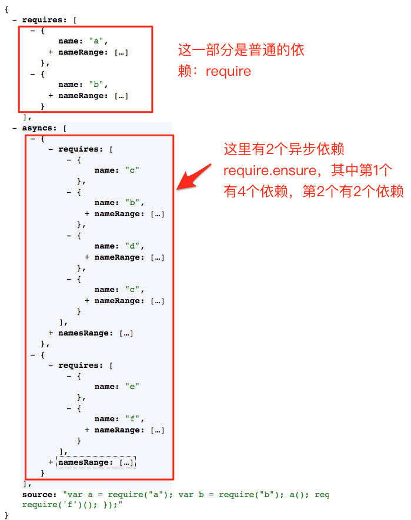
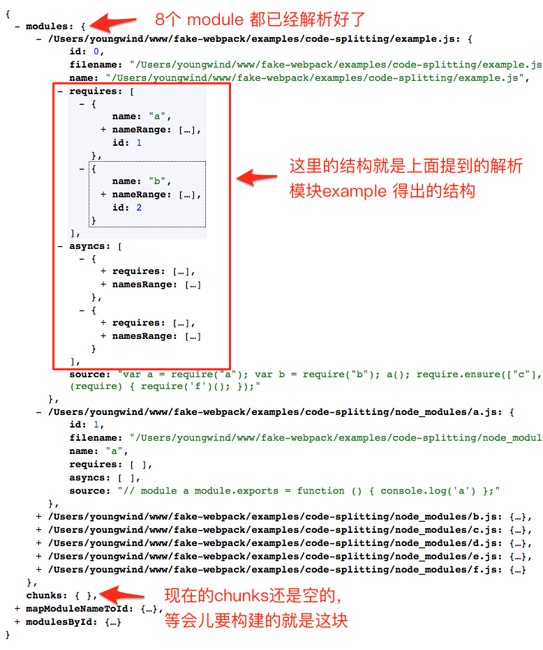
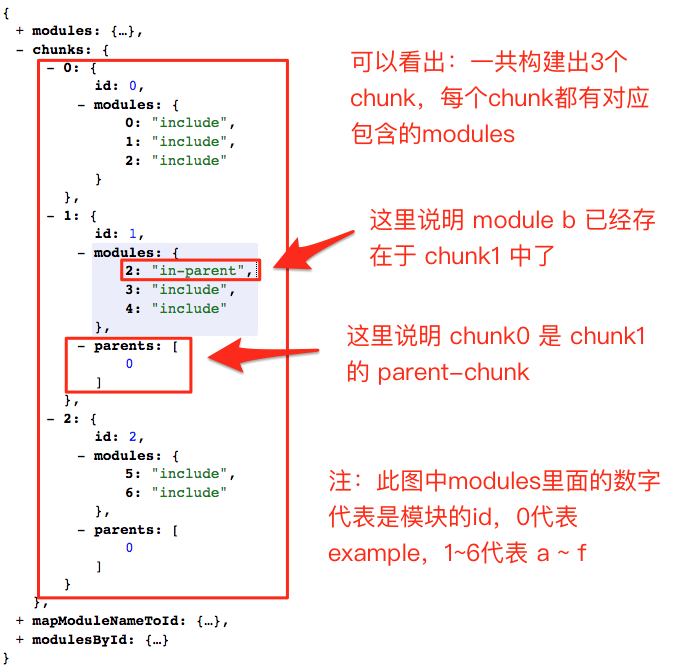
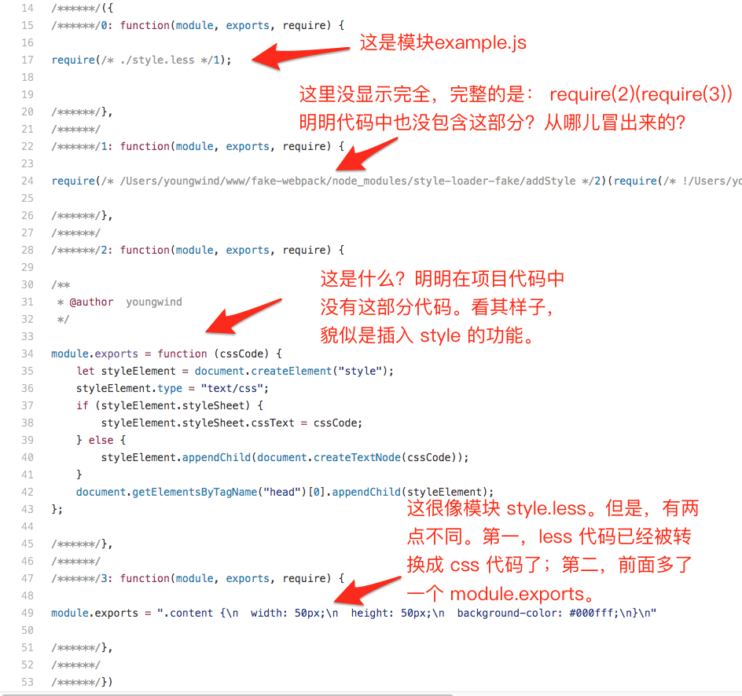
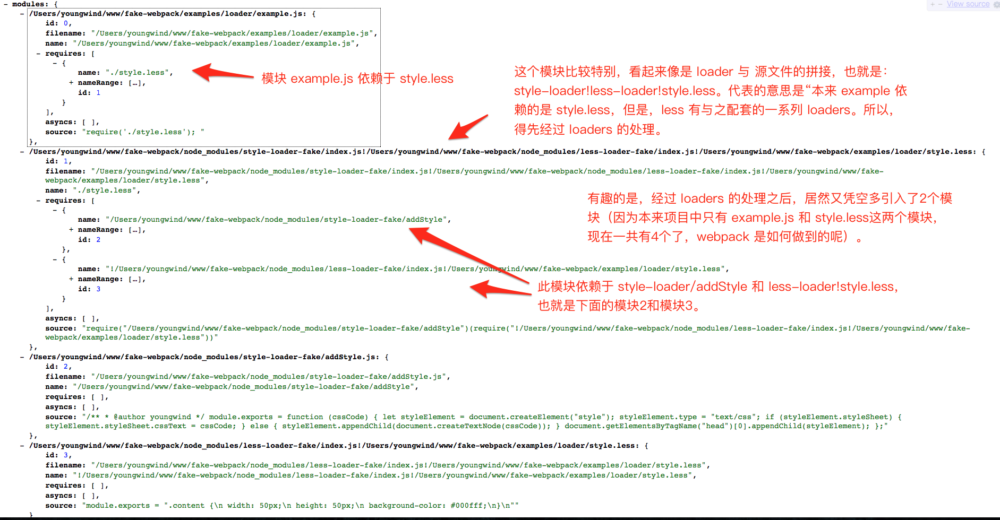

# webpack 构建后代码

## 打包单一模块

webpack.config.js

```js
module.exports = {
  entry: './chunk1.js',
  output: {
    path: __dirname + '/dist',
    filename: '[name].js'
  }
};
```

chunk1.js

```js
var chunk1 = 1;
exports.chunk1 = chunk1;
```

打包后，main.js（webpack 生成的一些注释已经去掉）

```js
(function(modules) {
  // webpackBootstrap
  // The module cache
  var installedModules = {};
  // The require function
  function __webpack_require__(moduleId) {
    // Check if module is in cache
    if (installedModules[moduleId]) return installedModules[moduleId].exports;
    // Create a new module (and put it into the cache)
    var module = (installedModules[moduleId] = {
      exports: {},
      id: moduleId,
      loaded: false
    });
    // Execute the module function
    modules[moduleId].call(module.exports, module, module.exports, __webpack_require__);
    // Flag the module as loaded
    module.loaded = true;
    // Return the exports of the module
    return module.exports;
  }

  // expose the modules object (__webpack_modules__)
  __webpack_require__.m = modules;
  // expose the module cache
  __webpack_require__.c = installedModules;
  // __webpack_public_path__
  __webpack_require__.p = '';
  // Load entry module and return exports
  return __webpack_require__(0);
})([
  function(module, exports) {
    var chunk1 = 1;
    exports.chunk1 = chunk1;
  }
]);
```

这其实就是一个立即执行函数，简化一下就是：

```js
(function(module) {})([function() {}, function() {}]);
```

看一下自运行的匿名函数里面干了什么：

```js
function(modules) { // webpackBootstrap
  // modules 就是一个数组，元素就是一个个函数体，就是我们声明的模块
  var installedModules = {};
  // The require function
  function __webpack_require__(moduleId) {
      ...
  }
  // expose the modules object (__webpack_modules__)
  __webpack_require__.m = modules;
  // expose the module cache
  __webpack_require__.c = installedModules;
  // __webpack_public_path__
  __webpack_require__.p = "";
  // Load entry module and return exports
  return __webpack_require__(0);
}
```

整个函数里就声明了一个变量 installedModules 和函数 `__webpack_require__`，并在函数上添加了一个 m,c,p 属性，m 属性保存的是传入的模块数组，c 属性保存的是 installedModules 变量，P 是一个空字符串。最后执行`__webpack_require__`函数，参数为零，并将其执行结果返回。下面看一下 `__webpack_require__` 干了什么

```js
function __webpack_require__(moduleId) {
  // moduleId 就是调用是传入的 0
  // installedModules[0] 是 undefined，继续往下
  if (installedModules[moduleId]) return installedModules[moduleId].exports;
  // module 就是 {exports: {},id: 0,loaded: false}
  var module = (installedModules[moduleId] = {
    exports: {},
    id: moduleId,
    loaded: false
  });
  // 下面接着分析这个
  modules[moduleId].call(module.exports, module, module.exports, __webpack_require__);
  // 表明模块已经载入
  module.loaded = true;
  // 返回 module.exports(注意 modules[moduleId].call 的时候 module.exports 会被修改)
  return module.exports;
}
```

接着看一下 `modules[moduleId].call(module.exports, module, module.exports, __webpack_require__)`，其实就是

```js
modules[moduleId].call({}, module, module.exports, __webpack_require__);
```

对 call 不了解当然也可以认为是这样（但是并不是等价，call 能确保当模块中使用 this 的时候，this 是指向 module.exports 的）

```js
function a(module, exports) {
  var chunk1 = 1;
  exports.chunk1 = chunk1;
}
a(module, exports, __webpack_require__);
```

传入的 module 就是 `{exports: {},id: 0,loaded: false}`，exports 就是`{}`，`__webpack_require__`就是声明的`__webpack_require__`函数(传入这个函数有什么用呢，第二节将会介绍)；运行后 module.exports 就是`{chunk1:1}`。所以当我们使用 chunk1 这个模块的时候（比如`var chunk1=require("chunk1")`,得到的就是一个对象`{chunk1:1}`）。如果模块里没有`exports.chunk1=chunk1`或者`module.exports=chunk1`得到的就是一个空对象`{}`

## 使用模块

上面我们已经分析了 webpack 是怎么打包一个模块的（入口文件就是一个模块），现在我们来看一下使用一个模块，然后使用模块的文件作为入口文件

webpack.config.js

```js
module.exports = {
  entry: './main.js',
  output: {
    path: __dirname + '/dist',
    filename: '[name].js'
  }
};
```

main.js

```js
var chunk1 = require('./chunk1');
console.log(chunk1);
```

打包后

```js
(function(modules) {
  // webpackBootstrap
  // The module cache
  var installedModules = {};
  // The require function
  function __webpack_require__(moduleId) {
    // Check if module is in cache
    if (installedModules[moduleId]) return installedModules[moduleId].exports;
    // Create a new module (and put it into the cache)
    var module = (installedModules[moduleId] = {
      exports: {},
      id: moduleId,
      loaded: false
    });
    // Execute the module function
    modules[moduleId].call(module.exports, module, module.exports, __webpack_require__);
    // Flag the module as loaded
    module.loaded = true;
    // Return the exports of the module
    return module.exports;
  }
  // expose the modules object (__webpack_modules__)
  __webpack_require__.m = modules;
  // expose the module cache
  __webpack_require__.c = installedModules;
  // __webpack_public_path__
  __webpack_require__.p = '';
  // Load entry module and return exports
  return __webpack_require__(0);
})([
  function(module, exports, __webpack_require__) {
    var chunk1 = __webpack_require__(1);
    console.log(chunk1);
  },
  function(module, exports) {
    var chunk1 = 1;
    exports.chunk1 = chunk1;
  }
]);
```

不一样的地方就是自执行函数的参数由

```js
[
  function(module, exports) {
    var chunk1 = 1;
    exports.chunk1 = chunk1;
  }
];
```

变为

```js
[
  function(module, exports, __webpack_require__) {
    var chunk1 = __webpack_require__(1);
    console.log(chunk1);
  },
  function(module, exports) {
    var chunk1 = 1;
    exports.chunk1 = chunk1;
  }
];
```

其实就是多了一个 main 模块，不过这个模块没有导出项，而且这个模块依赖于 chunk1 模块。所以当运行`__webpack_require__(0)`的时候，main 模块缓存到`installedModules[0]`上，`modules[0].call`(也就是调用 main 模块)的时候，chunk1 被缓存到`installedModules[1]`上，并且导出对象`{chunk1：1}`给模块 main 使用

## 重复使用模块

webpack.config.js

```js
module.exports = {
  entry: './main.js',
  output: {
    path: __dirname + '/dist',
    filename: '[name].js'
  }
};
```

main.js

```js
var chunk1 = require('./chunk1');
var chunk2 = require('./chunk2');
console.log(chunk1);
console.log(chunk2);
```

chunk1.js

```js
var chunk2 = require('./chunk2');
var chunk1 = 1;
exports.chunk1 = chunk1;
```

chunk2.js

```js
var chunk2 = 1;
exports.chunk2 = chunk2;
```

打包后

```js
(function(modules) {
  // webpackBootstrap
  // The module cache
  var installedModules = {};
  // The require function
  function __webpack_require__(moduleId) {
    // Check if module is in cache
    if (installedModules[moduleId]) return installedModules[moduleId].exports;
    // Create a new module (and put it into the cache)
    var module = (installedModules[moduleId] = {
      exports: {},
      id: moduleId,
      loaded: false
    });
    // Execute the module function
    modules[moduleId].call(module.exports, module, module.exports, __webpack_require__);
    // Flag the module as loaded
    module.loaded = true;
    // Return the exports of the module
    return module.exports;
  }
  // expose the modules object (__webpack_modules__)
  __webpack_require__.m = modules;
  // expose the module cache
  __webpack_require__.c = installedModules;
  // __webpack_public_path__
  __webpack_require__.p = '';
  // Load entry module and return exports
  return __webpack_require__(0);
})([
  function(module, exports, __webpack_require__) {
    var chunk1 = __webpack_require__(1);
    var chunk2 = __webpack_require__(2);
    console.log(chunk1);
    console.log(chunk2);
  },
  function(module, exports, __webpack_require__) {
    __webpack_require__(2);
    var chunk1 = 1;
    exports.chunk1 = chunk1;
  },
  function(module, exports) {
    var chunk2 = 1;
    exports.chunk2 = chunk2;
  }
]);
```

不难发现，当需要重复使用模块的时候，缓存变量 installedModules 就起作用了

## 多个打包入口

不管是单一模块还是重复模块，和以上两种一样

## 入口参数为数组

chunk1.js

```js
var chunk1 = 1;
exports.chunk1 = chunk1;
```

main.js

```js
var chunk1 = require('./chunk1');
console.log(chunk1);
```

main1.js

```js
var chunk1 = require('./chunk1');
```

webpack.config.js

```js
module.exports = {
  entry: ['./main.js', './main1.js'],
  output: {
    path: __dirname + '/dist',
    filename: '[name].js'
  }
};
```

打包后

```js
[
  /* 0：运行模块 main，main1 */
  function(module, exports, __webpack_require__) {
    __webpack_require__(1);
    module.exports = __webpack_require__(3);
  },
  /* 1：main 模块 */
  function(module, exports, __webpack_require__) {
    var chunk1 = __webpack_require__(2);
    console.log(chunk1);
  },
  /* 2：chunk1 模块 */
  function(module, exports) {
    var chunk1 = 1;
    exports.chunk1 = chunk1;
  },
  /* 3：main1 模块 */
  function(module, exports, __webpack_require__) {
    var chunk1 = __webpack_require__(2);
  }
];
```

这里只截取自执行匿名函数的参数，因为其他代码与之前一样。可以看到 1 就是 main 模块，2 就是 chunk1 模块，3 就是 main1 模块，0 的作用就是运行模块 main、main1，然后将 main1 模块导出（main1 中没有导出项，所以到导出 `{}`），总结一下：入口参数是字符串不管是多入口还是单入口，最后都会将入口模块的导出项导出，没有导出项就导出 `{}`，而入口参数是数组，就会将最后一个模块导出（webpack 官网有说明）

## 使用 CommonsChunkPlugin 插件

chunk1.js

```js
var chunk1 = 1;
exports.chunk1 = chunk1;
```

main.js

```js
var chunk1 = require('./chunk1');
console.log(chunk1);
```

main1.js

```js
var chunk1 = require('./chunk1');
console.log(chunk1);
```

webpack.config.js

```js
var CommonsChunkPlugin = require('webpack/lib/optimize/CommonsChunkPlugin');
module.exports = {
  entry: {
    main: './main.js',
    main1: './main1.js'
  },
  output: {
    path: __dirname + '/dist',
    filename: '[name].js'
  },
  plugins: [
    new CommonsChunkPlugin({
      name: 'common'
    })
  ]
};
```

main、main1 都 require 了 chunk1，所以 chunk1 会被打包到 common。

common.js

```js
(function(modules) {
  // webpackBootstrap
  // install a JSONP callback for chunk loading
  var parentJsonpFunction = window['webpackJsonp'];
  window['webpackJsonp'] = function webpackJsonpCallback(chunkIds, moreModules) {
    // add "moreModules" to the modules object,
    // then flag all "chunkIds" as loaded and fire callback
    var moduleId,
      chunkId,
      i = 0,
      callbacks = [];
    for (; i < chunkIds.length; i++) {
      chunkId = chunkIds[i];
      if (installedChunks[chunkId]) callbacks.push.apply(callbacks, installedChunks[chunkId]);
      installedChunks[chunkId] = 0;
    }
    for (moduleId in moreModules) {
      modules[moduleId] = moreModules[moduleId];
    }
    if (parentJsonpFunction) parentJsonpFunction(chunkIds, moreModules);
    while (callbacks.length) callbacks.shift().call(null, __webpack_require__);
    if (moreModules[0]) {
      installedModules[0] = 0;
      return __webpack_require__(0);
    }
  };
  // The module cache
  var installedModules = {};
  // object to store loaded and loading chunks
  // "0" means "already loaded"
  // Array means "loading", array contains callbacks
  var installedChunks = {
    2: 0
  };
  // The require function
  function __webpack_require__(moduleId) {
    // Check if module is in cache
    if (installedModules[moduleId]) return installedModules[moduleId].exports;
    // Create a new module (and put it into the cache)
    var module = (installedModules[moduleId] = {
      exports: {},
      id: moduleId,
      loaded: false
    });
    // Execute the module function
    modules[moduleId].call(module.exports, module, module.exports, __webpack_require__);
    // Flag the module as loaded
    module.loaded = true;
    // Return the exports of the module
    return module.exports;
  }
  // This file contains only the entry chunk.
  // The chunk loading function for additional chunks
  __webpack_require__.e = function requireEnsure(chunkId, callback) {
    // "0" is the signal for "already loaded"
    if (installedChunks[chunkId] === 0) return callback.call(null, __webpack_require__);
    // an array means "currently loading".
    if (installedChunks[chunkId] !== undefined) {
      installedChunks[chunkId].push(callback);
    } else {
      // start chunk loading
      installedChunks[chunkId] = [callback];
      var head = document.getElementsByTagName('head')[0];
      var script = document.createElement('script');
      script.type = 'text/javascript';
      script.charset = 'utf-8';
      script.async = true;
      script.src =
        __webpack_require__.p + '' + chunkId + '.' + ({ '0': 'main', '1': 'main1' }[chunkId] || chunkId) + '.js';
      head.appendChild(script);
    }
  };
  // expose the modules object (__webpack_modules__)
  __webpack_require__.m = modules;
  // expose the module cache
  __webpack_require__.c = installedModules;
  // __webpack_public_path__
  __webpack_require__.p = '';
})([
  ,
  function(module, exports) {
    var chunk1 = 1;
    exports.chunk1 = chunk1;
  }
]);
```

main.js

```js
webpackJsonp(
  [0],
  [
    function(module, exports, __webpack_require__) {
      var chunk1 = __webpack_require__(1);
      console.log(chunk1);
    }
  ]
);
```

main1.js

```js
webpackJsonp(
  [1],
  [
    function(module, exports, __webpack_require__) {
      var chunk1 = __webpack_require__(1);
      console.log(chunk1);
    }
  ]
);
```

与之前相比，多了 webpackJsonp 函数，立即执行的匿名函数没有立即调用`__webpack_require__(0)`，看一下 webpackJsonp

```js
var parentJsonpFunction = window['webpackJsonp'];
window['webpackJsonp'] = function webpackJsonpCallback(chunkIds, moreModules) {
  // moreModules 为独立 chunk 代码，chunkIds 标记独立 chunk 唯一性避免按需加载时重复加载
  // 以 main.js 中代码为例，chunkIds 为 [0]，moreModules 为
  // [function(module, exports, __webpack_require__) {
  //     var chunk1=__webpack_require__(1);
  //    console.log(chunk1);
  // }]
  var moduleId,
    chunkId,
    i = 0,
    callbacks = [];
  for (; i < chunkIds.length; i++) {
    chunkId = chunkIds[i]; // chunkId = 0
    if (installedChunks[chunkId]) callbacks.push.apply(callbacks, installedChunks[chunkId]); // 0 push 入 callbacks(使用 requireEnsure 不再是 0)
    // 赋值为 0 表明 chunk 已经 loaded
    installedChunks[chunkId] = 0;
  }
  for (moduleId in moreModules) {
    // modules[0] 会被覆盖
    modules[moduleId] = moreModules[moduleId];
  }
  // 按当前情况 parentJsonpFunction 一直未 undefined
  if (parentJsonpFunction) parentJsonpFunction(chunkIds, moreModules);
  // 按当前情况 callbacks = []
  while (callbacks.length) callbacks.shift().call(null, __webpack_require__);
  if (moreModules[0]) {
    installedModules[0] = 0;
    return __webpack_require__(0);
  }
};
// 缓存模块，通过闭包引用(window["webpackJsonp"] 可以访问到)
var installedModules = {};
// 2 为公共 chunk 唯一 ID，0 表示已经 loaded
var installedChunks = {
  2: 0
};
// The require function
function __webpack_require__(moduleId) {
  // Check if module is in cache
  if (installedModules[moduleId]) return installedModules[moduleId].exports;
  // Create a new module (and put it into the cache)
  var module = (installedModules[moduleId] = {
    exports: {},
    id: moduleId,
    loaded: false
  });
  // Execute the module function
  modules[moduleId].call(module.exports, module, module.exports, __webpack_require__);
  // Flag the module as loaded
  module.loaded = true;
  // Return the exports of the module
  return module.exports;
}
// 按需加载
__webpack_require__.e = function requireEnsure(chunkId, callback) {
  // "0" is the signal for "already loaded"
  if (installedChunks[chunkId] === 0) return callback.call(null, __webpack_require__);
  // an array means "currently loading".
  if (installedChunks[chunkId] !== undefined) {
    installedChunks[chunkId].push(callback);
  } else {
    // start chunk loading
    installedChunks[chunkId] = [callback];
    var head = document.getElementsByTagName('head')[0];
    var script = document.createElement('script');
    script.type = 'text/javascript';
    script.charset = 'utf-8';
    script.async = true;
    script.src =
      __webpack_require__.p + '' + chunkId + '.' + ({ '0': 'main', '1': 'main1' }[chunkId] || chunkId) + '.js';
    head.appendChild(script);
  }
};
```

好像看不出什么。。。，修改一下

webpack.config.js

```js
var CommonsChunkPlugin = require('webpack/lib/optimize/CommonsChunkPlugin');
module.exports = {
  entry: {
    main: './main.js',
    main1: './main1.js',
    chunk1: ['./chunk1']
  },
  output: {
    path: __dirname + '/dist2',
    filename: '[name].js'
  },
  plugins: [
    new CommonsChunkPlugin({
      name: ['chunk1'],
      filename: 'common.js',
      minChunks: 3
    })
  ]
};
```

main、main1 都分别 require chunk1、chunk2，然后将 chunk1 打包到公共模块（minChunks:3，chunk2 不会被打包到公共模块），自运行匿名函数最后多了

```js
return __webpack_require__(0);
```

则 `installedModules[0]` 为已经 loaded，看 common.js，`installedModules[1]` 也会 loaded。

main.js

```js
webpackJsonp(
  [1],
  [
    function(module, exports, __webpack_require__) {
      var chunk1 = __webpack_require__(1);
      var chunk2 = __webpack_require__(2);
      exports.a = 1;
      console.log(chunk1);
    },
    ,
    function(module, exports) {
      var chunk2 = 1;
      exports.chunk2 = chunk2;
    }
  ]
);
```

main1.js

```js
webpackJsonp(
  [2],
  [
    function(module, exports, __webpack_require__) {
      var chunk1 = __webpack_require__(1);
      var chunk2 = __webpack_require__(2);
      exports.a = 1;
      console.log(chunk1);
    },
    ,
    function(module, exports) {
      var chunk2 = 1;
      exports.chunk2 = chunk2;
    }
  ]
);
```

common.js

```js
[
  function(module, exports, __webpack_require__) {
    module.exports = __webpack_require__(1);
  },
  function(module, exports) {
    var chunk1 = 1;
    exports.chunk1 = chunk1;
  }
];
```

以 main.js 的代码为例，调用 webpackJsonp，传入的参数 chunkIds 为 `[1]`, moreModules 为

```js
[
  function(module, exports, __webpack_require__) {
    var chunk1 = __webpack_require__(1);
    var chunk2 = __webpack_require__(2);
    exports.a = 1;
    console.log(chunk1);
  },
  ,
  function(module, exports) {
    var chunk2 = 1;
    exports.chunk2 = chunk2;
  }
];
```

```js
var moduleId,
  chunkId,
  i = 0,
  callbacks = [];
for (; i < chunkIds.length; i++) {
  chunkId = chunkIds[i]; // 1
  // false, 赋值为 0 后还是 false
  if (installedChunks[chunkId]) callbacks.push.apply(callbacks, installedChunks[chunkId]);
  installedChunks[chunkId] = 0;
}
// 三个模块
for (moduleId in moreModules) {
  // moduleId: 0,1,2
  // moreModules[1] 为空模块，自执行函数的参数(公共模块)会被覆盖，但是参数中的相应模块已经 loaded 并且缓存
  modules[moduleId] = moreModules[moduleId];
}
if (parentJsonpFunction) parentJsonpFunction(chunkIds, moreModules);
while (callbacks.length) callbacks.shift().call(null, __webpack_require__);
if (moreModules[0]) {
  // installedModules[0] 会重新 load，但是 load 的是 moreModules[0]，因为 modules[0] 已经被覆盖，moreModules[0] 依赖于
  // modules[1]、modules[2]，modules[1] 已经 loaded
  installedModules[0] = 0;
  return __webpack_require__(0);
}
```

再看下面的情况：common.js 自执行函数参数（公共模块）（没有 return `__webpack_require__(0)`）

```js
[
  ,
  function(module, exports, __webpack_require__) {
    var chunk1 = 1;
    var chunk2 = __webpack_require__(2);
    exports.chunk1 = chunk1;
  },
  function(module, exports) {
    var chunk2 = 1;
    exports.chunk2 = chunk2;
  }
];
```

main.js

```js
webpackJsonp(
  [0],
  [
    /* 0 */
    function(module, exports, __webpack_require__) {
      var chunk1 = __webpack_require__(1);
      var chunk2 = __webpack_require__(2);
      exports.a = 1;
      console.log(chunk1);
      // main
    }
  ]
);
```

以 main 调用分析

```js
var moduleId,
  chunkId,
  i = 0,
  callbacks = [];
for (; i < chunkIds.length; i++) {
  chunkId = chunkIds[i]; // 0
  if (installedChunks[chunkId]) callbacks.push.apply(callbacks, installedChunks[chunkId]);
  installedChunks[chunkId] = 0; // 表明唯一索引为 0 的 chunk 已经 loaded
}
for (moduleId in moreModules) {
  // moreModules 只有一个元素，所以 modules[1]、modules[2] 不会被覆盖
  modules[moduleId] = moreModules[moduleId];
}
if (parentJsonpFunction) parentJsonpFunction(chunkIds, moreModules);
while (callbacks.length) callbacks.shift().call(null, __webpack_require__);
if (moreModules[0]) {
  installedModules[0] = 0;
  // moreModules[0] 即 modules[0] 依赖 modules[1]、即 modules[2]（没有被覆盖很关键）
  return __webpack_require__(0);
}
```

还有这种打包情况：common.js 不包含公共模块，即自执行函数参数为 `[]`。

main.js

```js
webpackJsonp(
  [0, 1],
  [
    function(module, exports, __webpack_require__) {
      var chunk1 = __webpack_require__(1);
      var chunk2 = __webpack_require__(2);
      exports.a = 1;
      console.log(chunk1);
    },
    function(module, exports) {
      var chunk1 = 1;
      exports.chunk1 = chunk1;
    },
    function(module, exports) {
      var chunk2 = 1;
      exports.chunk2 = chunk2;
    }
  ]
);
```

以 main 调用分析

```js
var moduleId,
  chunkId,
  i = 0,
  callbacks = [];
for (; i < chunkIds.length; i++) {
  chunkId = chunkIds[i]; // 0,1
  if (installedChunks[chunkId]) callbacks.push.apply(callbacks, installedChunks[chunkId]);
  installedChunks[chunkId] = 0;
}
for (moduleId in moreModules) {
  // moreModules 全部转移到 modules
  modules[moduleId] = moreModules[moduleId];
}
if (parentJsonpFunction) parentJsonpFunction(chunkIds, moreModules);
while (callbacks.length) callbacks.shift().call(null, __webpack_require__);
if (moreModules[0]) {
  // modules[0] 是 chunk 文件运行代码
  installedModules[0] = 0;
  return __webpack_require__(0);
}
```

## 按需加载

webpack.config.json

```js
module.exports = {
  entry: './main.js',
  output: {
    filename: 'bundle.js'
  }
};
```

main.js

```js
require.ensure(['./a'], function(require) {
  var content = require('./a');
  document.open();
  document.write('<h1>' + content + '</h1>');
  document.close();
});
```

a.js

```js
module.exports = 'Hello World';
```

打包后

```
1.bundle.js
a.js
bundle.js
index.html
main.js
webpack.config.js
```

bundle.js

```js
(function(modules) {
  var parentJsonpFunction = window['webpackJsonp']; // 全局变量可访问，可通过 webpack 配置的 output 下的 jsonpFunction 进行自定义配置，默认 webpackJsonp
  window['webpackJsonp'] = function webpackJsonpCallback(chunkIds, moreModules) {
    var moduleId,
      chunkId,
      i = 0,
      callbacks = []; // 存放从 __webpack_require__.e 传过来的 callback 数组，实际上就是其回调函数，见下文的代码注释“回调函数”处
    for (; i < chunkIds.length; i++) {
      chunkId = chunkIds[i];
      if (installedChunks[chunkId]) callbacks.push.apply(callbacks, installedChunks[chunkId]); // 存放数组函数回调
      installedChunks[chunkId] = 0; // 标记此 chunk 加载完成
    }
    for (moduleId in moreModules) {
      // 这步很重要，将 chunk 传过来的 moreModules 去替换掉现有的 modules
      // 以供下面的“回调函数”调用 __webpack_require__ 时，去调用 chunk 里面的代码
      modules[moduleId] = moreModules[moduleId];
    }
    if (parentJsonpFunction) parentJsonpFunction(chunkIds, moreModules);
    // 依次执行数组函数回调
    while (callbacks.length) callbacks.shift().call(null, __webpack_require__);
  };

  var installedModules = {};

  // 已加载的 chunkId，0 代表已加载
  var installedChunks = {
    0: 0
  };

  function __webpack_require__(moduleId) {
    // 缓存
    if (installedModules[moduleId]) return installedModules[moduleId].exports;

    var module = (installedModules[moduleId] = {
      exports: {},
      id: moduleId,
      loaded: false
    });

    modules[moduleId].call(module.exports, module, module.exports, __webpack_require__);

    module.loaded = true;

    return module.exports;
  }

  __webpack_require__.e = function requireEnsure(chunkId, callback) {
    // 已加载完成直接调用
    if (installedChunks[chunkId] === 0) return callback.call(null, __webpack_require__);

    if (installedChunks[chunkId] !== undefined) {
      installedChunks[chunkId].push(callback);
    } else {
      // chunk 没有加载，直接塞入“回调函数”
      installedChunks[chunkId] = [callback];
      var head = document.getElementsByTagName('head')[0];
      var script = document.createElement('script');
      script.type = 'text/javascript';
      script.charset = 'utf-8';
      script.async = true;
      // 加载对应的 chunk
      script.src = __webpack_require__.p + '' + chunkId + '.bundle.js';
      head.appendChild(script);
    }
  };

  // 存放 modules
  __webpack_require__.m = modules;
  // 存放已安装的 modules
  __webpack_require__.c = installedModules;
  // 存放 publicPath
  __webpack_require__.p = '';
  // 第一步执行的地方
  return __webpack_require__(0);
})([
  function(module, exports, __webpack_require__) {
    // 加载 chunk
    __webpack_require__.e(1, function(require) {
      // 回调函数
      var content = __webpack_require__(1); // 下标是 1
      document.open();
      document.write('<h1>' + content + '</h1>');
      document.close();
    });
  }
]);
```

1.bundle.js

```js
webpackJsonp(
  [1],
  [
    ,
    // 这里的下标是 1，对应着上面的“下标是 1”
    // 注意这里由 __webpack_require__.e 加载后会自动执行 webpackJsonp，然后回调函数就被执行
    function(module, exports) {
      module.exports = 'Hello World';
    }
  ]
);
```

和使用 CommonsChunkPlugin 打包的差异在于

```js
// This file contains only the entry chunk.
// The chunk loading function for additional chunks
__webpack_require__.e = function requireEnsure(chunkId, callback) {
  // "0" is the signal for "already loaded"
  if (installedChunks[chunkId] === 0) return callback.call(null, __webpack_require__); // an array means "currently loading".

  if (installedChunks[chunkId] !== undefined) {
    installedChunks[chunkId].push(callback);
  } else {
    // start chunk loading
    installedChunks[chunkId] = [callback];
    var head = document.getElementsByTagName('head')[0];
    var script = document.createElement('script');
    script.type = 'text/javascript';
    script.charset = 'utf-8';
    script.async = true;

    script.src = __webpack_require__.p + '' + chunkId + '.bundle.js';
    head.appendChild(script);
  }
};
```

模块 main 的 id 为 0，模块 a 的 id 为 1。`return __webpack_require__(0)`，则加载 main 模块， `modules[0].call(module.exports, module, module.exports, __webpack_require__)`则调用函数

```js
function(module, exports, __webpack_require__) {
  __webpack_require__.e/* nsure */(1, function(require) {
    var content = __webpack_require__(1);
    document.open();
    document.write('<h1>' + content + '</h1>');
    document.close();
  }
}
```

```js
// This file contains only the entry chunk.
// The chunk loading function for additional chunks
__webpack_require__.e = function requireEnsure(chunkId, callback) {
  // installedChunks[1] 为 undefined
  // "0" is the signal for "already loaded"
  if (installedChunks[chunkId] === 0) return callback.call(null, __webpack_require__); // an array means "currently loading".

  if (installedChunks[chunkId] !== undefined) {
    installedChunks[chunkId].push(callback);
  } else {
    // start chunk loading
    installedChunks[chunkId] = [callback]; // installedChunks[1] 为数组，表明 currently loading
    var head = document.getElementsByTagName('head')[0];
    var script = document.createElement('script');
    script.type = 'text/javascript';
    script.charset = 'utf-8';
    script.async = true;

    script.src = __webpack_require__.p + '' + chunkId + '.bundle.js';
    head.appendChild(script);
    // 加载完后直接调用
    webpackJsonp(
      [1],
      [
        ,
        /* 1 */
        function(module, exports) {
          module.exports = 'Hello World';
        }
      ]
    );
  }
};
// installedChunks[1] 在 webpackJsonp 得到调用
```

`installedChunks[1]` 为数组，元素为 main 模块的执行代码

```js
window['webpackJsonp'] = function webpackJsonpCallback(chunkIds, moreModules) {
  // moreModules 为模块 a 的代码
  // add "moreModules" to the modules object,
  // then flag all "chunkIds" as loaded and fire callback
  var moduleId,
    chunkId,
    i = 0,
    callbacks = [];
  for (; i < chunkIds.length; i++) {
    chunkId = chunkIds[i];
    if (installedChunks[chunkId])
      // installedChunks[0]==0，installedChunks[1] 为数组
      callbacks.push.apply(callbacks, installedChunks[chunkId]); // callbacks 为模块 main 执行代码，不为数组
    installedChunks[chunkId] = 0; // installedChunks[1] 不为数组，表明已经加载
  }
  for (moduleId in moreModules) {
    modules[moduleId] = moreModules[moduleId];
  }
  if (parentJsonpFunction) parentJsonpFunction(chunkIds, moreModules);
  while (callbacks.length) callbacks.shift().call(null, __webpack_require__);
};
```

# 实现一个简单的 webpack

## 目标

现在的 webpack 是一个庞然大物，我们不可能实现其所有功能。那么，应该将目光聚焦在哪儿呢？从 webpack 的 [第一个 commit](https://github.com/webpack/webpack/tree/2e1460036c5349951da86c582006c7787c56c543) 可以看出，其当初最主要的目的是在浏览器端复用符合 CommonJS 规范的代码模块。这个目标不是很难，我们努力一把还是可以实现的。

注意：在此我们不考虑插件、loaders、多文件打包等等复杂的问题，仅仅考虑最基本的问题：如何将多个符合 CommonJS 规范的模块打包成一个 JS 文件，以供浏览器执行。

## bundle.js

显然，浏览器没法直接执行 CommonJS 规范的模块，怎么办呢？

将其转换成一个自执行表达式

## 例子

我们实际要处理的例子是 [这个](https://github.com/towavephone/fake-webpack/tree/1bfcd0edf10f1a2ff3bfd7c418e7490a735b9823/examples/simple)：example 依赖于 a、b 和 c，而且 c 位于 node_modules 文件夹中，我们要将所有模块构建成一个 JS 文件，就是这里的 [output.js](https://github.com/towavephone/fake-webpack/blob/1bfcd0edf10f1a2ff3bfd7c418e7490a735b9823/examples/simple/output.js)

## 思路

仔细观察 [output.js](https://github.com/towavephone/fake-webpack/blob/1bfcd0edf10f1a2ff3bfd7c418e7490a735b9823/examples/simple/output.js)，我们能够发现：

1.  不管有多少个模块，头部那一块都是一样的，所以可以写成一个模板，也就是 templateSingle.js。
2.  需要分析出各个模块间的依赖关系。也就是说，需要知道 example 依赖于 a、b 和 c。
3.  c 模块位于 node_modules 文件夹当中，但是我们调用的时候却可以直接 `require('c')`，这里肯定是存在某种自动查找的功能。
4.  在生成的 output.js 中，每个模块的唯一标识是模块的 ID，所以在拼接 output.js 的时候，需要将每个模块的名字替换成模块的 ID。

   ```js
   // 转换前
   let a = require('a');
   let b = require('b');
   let c = require('c');

   // 转换后
   let a = require(/* a */ 1);
   let b = require(/* b */ 2);
   let c = require(/* c */ 3);
   ```

ok，下面我们来逐一看看这些问题

### 分析模块依赖关系

CommonJS 不同于 AMD，是不会在一开始声明所有依赖的。CommonJS 最显著的特征就是用到的时候再 require，所以我们得在整个文件的范围内查找到底有多少个 require。怎么办呢？最先蹦入脑海的思路是正则。然而，用正则来匹配 require，有以下两个缺点：

1.  如果 require 是写在注释中，也会匹配到。
2.  如果后期要支持 require 的参数是表达式的情况，如 `require('a'+'b')`，正则很难处理。

因此，正则行不通。

一种正确的思路是：使用 JS 代码解析工具（如 esprima 或者 acorn），将 JS 代码转换成抽象语法树（AST），再对 AST 进行遍历。这部分的核心代码是 [parse.js](https://github.com/towavephone/fake-webpack/blob/1bfcd0edf1/lib/parse.js)。

在处理好了 require 的匹配之后，还有一个问题需要解决。那就是匹配到 require 之后需要干什么呢？举个例子：

举个例子：

```js
// example.js
let a = require('a');
let b = require('b');
let c = require('c');
```

这里有三个 require，按照 CommonJS 的规范，在检测到第一个 require 的时候，根据 require 即执行的原则，程序应该立马去读取解析模块 a。如果模块 a 中又 require 了其他模块，那么继续解析。也就是说，总体上遵循深度优先遍历算法。这部分的控制逻辑写在 [buildDeps.js](https://github.com/towavephone/fake-webpack/blob/1bfcd0edf1/lib/buildDeps.js) 中。

### 找到模块

在完成依赖分析的同时，我们需要解决另外一个问题，那就是如何找到模块？也就是模块的寻址问题，举个例子：

```js
// example.js
let a = require('a');
let b = require('b');
let c = require('c');
```

在模块 example.js 中，调用模块 a、b、c 的方式都是一样的。但是，实际上他们所在的绝对路径层级并不一致：a 和 b 跟 example 同级，而 c 位于与 example 同级的 node_modules 中。所以，程序需要有一个查找模块的算法，这部分的逻辑在 [resolve.js](https://github.com/towavephone/fake-webpack/blob/1bfcd0edf1/lib/resolve.js) 中。

目前实现的查找逻辑是：

1.  如果给出的是绝对路径/相对路径，只查找一次。找到？返回绝对路径。找不到？返回 false。
2.  如果给出的是模块的名字，先在入口 js（example.js）文件所在目录下寻找同名 JS 文件（可省略扩展名）。找到？返回绝对路径。找不到？走第 3 步。
3.  在入口 js（example.js）同级的 node_modules 文件夹（如果存在的话）查找。找到？返回绝对路径。找不到？返回 false。

当然，此处实现的算法还比较简陋，之后有时间可以再考虑实现逐层往上的查找，就像 nodejs 默认的模块查找算法那样。

### 拼接 output.js

这是最后一步了。

在解决了模块依赖和模块查找的问题之后，我们将会得到一个依赖关系对象 depTree，此对象完整地描述了以下信息：都有哪些模块，各个模块的内容是什么，他们之间的依赖关系又是如何等等。具体的结构如下：

```js
{
    "modules": {
        "/Users/towavephone/www/fake-webpack/examples/simple/example.js": {
            "id": 0,
            "filename": "/Users/towavephone/www/fake-webpack/examples/simple/example.js",
            "name": "/Users/towavephone/www/fake-webpack/examples/simple/example.js",
            "requires": [
                {
                    "name": "a",
                    "nameRange": [
                        16,
                        19
                    ],
                    "id": 1
                },
                {
                    "name": "b",
                    "nameRange": [
                        38,
                        41
                    ],
                    "id": 2
                },
                {
                    "name": "c",
                    "nameRange": [
                        60,
                        63
                    ],
                    "id": 3
                }
            ],
            "source": "let a = require('a');\nlet b = require('b');\nlet c = require('c');\na();\nb();\nc();\n"
        },
        "/Users/towavephone/www/fake-webpack/examples/simple/a.js": {
            "id": 1,
            "filename": "/Users/towavephone/www/fake-webpack/examples/simple/a.js",
            "name": "a",
            "requires": [],
            "source": "// module a\n\nmodule.exports = function () {\n    console.log('a')\n};"
        },
        "/Users/towavephone/www/fake-webpack/examples/simple/b.js": {
            "id": 2,
            "filename": "/Users/towavephone/www/fake-webpack/examples/simple/b.js",
            "name": "b",
            "requires": [],
            "source": "// module b\n\nmodule.exports = function () {\n    console.log('b')\n};"
        },
        "/Users/towavephone/www/fake-webpack/examples/simple/node_modules/c.js": {
            "id": 3,
            "filename": "/Users/towavephone/www/fake-webpack/examples/simple/node_modules/c.js",
            "name": "c",
            "requires": [],
            "source": "module.exports = function () {\n    console.log('c')\n}"
        }
    },
    "mapModuleNameToId": {
        "/Users/towavephone/www/fake-webpack/examples/simple/example.js": 0,
        "a": 1,
        "b": 2,
        "c": 3
    }
}
```

根据这个 depTree 对象，我们便能完成这最后的一步：`output.js 文件的拼接`。其控制逻辑无非是一层循环，写在 [writeChunk.js](https://github.com/towavephone/fake-webpack/blob/1bfcd0edf1/lib/writeChunk.js) 中。但是这里有一个需要注意的地方，那就是本文思路章节提到的第 4 点：要把模块名转换成模块 ID，这是 [writeSource.js](https://github.com/towavephone/fake-webpack/blob/1bfcd0edf1/lib/writeSource.js) 所要完成的功能。

至此，我们就实现了一个非常简单的 webpack 了。

## 遗留问题

1.  尚未支持 `require('a' + 'b')` 这种情况。
2.  如何实现自动 watch 的功能？
3.  其 loader 或者插件机制又是怎样的？

# code-splitting

我们今天来看看如何实现 webpack 的代码切割（code-splitting）功能，最后实现的代码版本请参考[这里](https://github.com/towavephone/fake-webpack/tree/d6589263f90752ef8222749208694df654b631e3)。

## 目标

一般说来，code-splitting 有两种含义：

1.  将第三方类库单独打包成 vendor.js ，以提高缓存命中率（这一点我们不作考虑）
2.  将项目本身的代码分成多个 js 文件，分别进行加载（我们只研究这一点）

换句话说，我们的目标是：将原先集中到一个 output.js 中的代码，切割成若干个 js 文件，然后分别进行加载。也就是说：原先只加载 output.js，现在把代码分割到 3 个文件中，先加载 output.js，然后 output.js 又会自动加载 1.output.js 和 2.output.js。

## 切割点的选择

既然要将一份代码切割成若干份代码，总得有个切割点的标志吧，从哪儿开始切呢？

webpack 使用 require.ensure 作为切割点。

然而，我用 nodeJS 也挺长时间了，怎么不知道还有 require.ensure 这种用法？而事实上 nodeJS 也是不支持的，这个问题我在 CommonJS 的标准中找到了答案：虽然 CommonJS 通俗地讲是一个同步模块加载规范，但是其中是包含异步加载相关内容的。只不过这条内容只停留在 PROPOSAL（建议）阶段，并未最终进入标准，所以 nodeJS 没有实现它也就不奇怪了。只不过 webpack 恰好利用了这个作为代码的切割点。

ok，现在我们已经明白了为什么要选择 require.ensure 作为切割点了。接下来的问题是：如何根据切割点对代码进行切割？ 下面举个例子。

## 例子

```js
// example.js
var a = require('a');
var b = require('b');
a();
require.ensure(['c'], function(require) {
  require('b')();
  var d = require('d');
  var c = require('c');
  c();
  d();
});

require.ensure(['e'], function(require) {
  require('f')();
});
```

假设这个 example.js 就是项目的主入口文件，模块 a ~ f 是简简单单的模块（既没有进一步的依赖，也不包含 require.ensure）。那么，这里一共有 2 个切割点，这份代码将被切割为 3 部分。也就说，到时候会产生 3 个文件：output.js，1.output.js，2.output.js

## 识别与处理切割点

程序如何识别 require.ensure 呢？答案自然是继续使用强大的 esprima。关键代码如下：

```js
// parse.js
if (
  expression.callee &&
  expression.callee.type === 'MemberExpression' &&
  expression.callee.object.type === 'Identifier' &&
  expression.callee.object.name === 'require' &&
  expression.callee.property.type === 'Identifier' &&
  expression.callee.property.name === 'ensure' &&
  expression.arguments &&
  expression.arguments.length >= 1
) {
  // 处理 require.ensure 的依赖参数部分
  let param = parseStringArray(expression.arguments[0]);
  let newModule = {
    requires: [],
    namesRange: expression.arguments[0].range
  };
  param.forEach((module) => {
    newModule.requires.push({
      name: module
    });
  });

  module.asyncs = module.asyncs || [];
  module.asyncs.push(newModule);

  module = newModule;

  // 处理 require.ensure 的函数体部分
  if (expression.arguments.length > 1) {
    walkExpression(module, expression.arguments[1]);
  }
}
```

观察上面的代码可以看出，识别出 require.ensure 之后，会将其存储到 asyncs 数组中，且继续遍历其中所包含的其他依赖。举个例子，example.js 模块最终解析出来的数据结构如下图所示：



## module 与 chunk

我在刚刚使用 webpack 的时候，是分不清这两个概念的。现在我可以说：“在上面的例子中，有 3 个 chunk，分别对应 output.js、1.output.js 、2.output.js；有 7 个 module，分别是 example 和 a ~ f。

所以，module 和 chunk 之间的关系是：1 个 chunk 可以包含若干个 module。

观察上面的例子，得出以下结论：

-  chunk0（也就是主 chunk，也就是 output.js）应该包含 example 本身和 a、b 三个模块。
-  chunk1（1.output.js）是从 chunk0 中切割出来的，所以 chunk0 是 chunk1 的 parent。
-  本来 chunk1 应该是包含模块 c、b 和 d 的，但是由于 b 已经被其 parent-chunk（也就是 chunk1）包含，所以，必须将 b 从 chunk1 中移除，这样方能避免代码的冗余。
-  chunk2（2.output.js）是从 chunk0 中切割出来的，所以 chunk0 也是 chunk2 的 parent。
-  chunk2 包含 e 和 f 两个模块。

好了，下面进入重头戏。

## 构建 chunks

在对各个模块进行解析之后，我们能大概得到以下这样结构的 depTree。



下面我们要做的就是：如何从 8 个 module 中构建出 3 个 chunk 出来。 这里的代码较长，我就不贴出来了，想看的到这里的 [buildDep.js](https://github.com/towavephone/fake-webpack/commit/d6589263f90752ef8222749208694df654b631e3#diff-92c5d90abece48343aa1cdb71978f37b)。

其中要重点注意是：前文说到，为了避免代码的冗余，需要将模块 b 从 chunk1 中移除，具体发挥作用的就是函数 removeParentsModules，本质上无非就是改变一下标志位。最终生成的 chunks 的结构如下：



## 拼接 output.js

经历重重难关，我们终于来到了最后一步：如何根据构建出来的 chunks 拼接出若干个 output.js 呢？

此处的拼接与上一篇最后提到的拼接大同小异，主要不同点有以下 2 个：

1.  模板的不同。原先是一个 output.js 的时候，用的模板是 templateSingle 。现在是多个 chunks 了，所以要使用模板 templateAsync。其中不同点主要是 templateAsync 会发起 jsonp 的请求，以加载后续的 x.output.js，此处就不加多阐述了。仔细 debug 生成的 output.js 应该就能看懂这一点。
2.  模块名字替换为模块 id 的算法有所改进。原先我直接使用正则进行匹配替换，但是如果存在重复的模块名的话，比如此例子中 example.js 出现了 2 次模块 b，那么简单的匹配就会出现错乱。因为 repalces 是从后往前匹配，而正则本身是从前往后匹配的。webpack 原作者提供了一种非常巧妙的方式，具体的代码可以参考[这里](https://github.com/towavephone/fake-webpack/commit/d6589263f90752ef8222749208694df654b631e3#diff-62f46802ba4c21e21b2dfedcce5fa86dR60)。

## 后话

其实关于 webpack 的代码切割还有很多值得研究的地方。比如本文我们实现的例子仅仅是将 1 个文件切割成 3 个，并未就其加载时机进行控制。比如说，如何支持在单页面应用切换 router 的时候再加载特定的 x.output.js？

# loader

## 前言

我们来探索 loader 机制，最终实现的代码版本参考[这里](https://github.com/towavephone/fake-webpack/tree/96eae479379ca83dc7121f4afaef0b3453668081)（参考的 webpack 版本是[这个](https://github.com/webpack/webpack/tree/356ab65ea0c097fdb2d3d70f9ba8593f325dc92e)）

## 问题

以加载 less 为例

```js
// example.js
require('./style.less');
```

```less
// style.less
@color: #000fff;
.content {
  width: 50px;
  height: 50px;
  background-color: @color;
}
```

按照官方文档，想要加载 less 文件，我们需要配置三个 loader：`style-loader!css-loader!less-loader`。

该从什么地方着手研究呢？仔细观察最终生成的 output.js，如下图所示。



由此我们进行以下思考：

1.  既然最终 css 代码会被插入到 head 标签中，那么一定是模块 2 在起作用。但是，项目中并不包含这部分代码，经过排查，发现源自于 node-modules/style-loader/addStyle.js ，也就是说，是由 style-loader 引入的。（后面我们再考察是如何引入的）
2.  观察模块 3，那应该是 less 代码经过 less-loader 的转换之后，再包装一层 module.exports，成为一个 JS module。
3.  style-loader 和 less-loader 的作用已经明了，但是，css-loader 发挥什么作用呢？虽然我一直按照官方文档配置三个 loader，但我从未真正理解为什么需要 css-loader。后来我在 css-loader 的文档中找到了答案。

   > @import and url() are interpreted like import and will be resolved by the css-loader

   既然如此，为了降低实现的难度，我们暂时不予考虑 import 和 url 的情况，也就无需实现 css-loader 了。

4.  观察模块 1，`require(2)(require(3))`，很显然：”模块 3 的导出作为模块 2 的输入参数，执行模块 2“，也就是说：“将模块 3 中的 css 代码插入到 head 标签中“。理解这个逻辑不难，难点在于：webpack 如何知道应该拼接成 `require(2)(require(3))`，而不是别的什么。也就说，如何控制拼接出 `require(2)(require(3))`？

## 思路

思路进行到这儿，似乎走不下去了。看来只分析 output.js 还不足以理清，那么，让我们更进一步，观察 depTree，如下图所示。（图片较大，请点击放大查看）



问题在于：为什么凭空多出来 2 个模块？到底是哪里起了作用呢？我在 style-loader 的源码中找到了答案。

## style-loader 的再 require

```js
// style-loader/index.js
const path = require('path');
module.exports = function(content) {
  // content 的值为：/Users/youngwind/www/fake-webpack/node_modules/style-loader-fake/index.js!/Users/youngwind/www/fake-webpack/node_modules/less-loader-fake/index.js!/Users/youngwind/www/fake-webpack/examples/loader/style.less
  let loaderSign = this.request.indexOf('!');
  let rawCss = this.request.substr(loaderSign);
  // rawCss 的值为：/Users/youngwind/www/fake-webpack/node_modules/less-loader-fake/index.js!/Users/youngwind/www/fake-webpack/examples/loader/style.less
  return (
    'require(' + JSON.stringify(path.join(__dirname, 'addStyle')) + ')' + '(require(' + JSON.stringify(rawCss) + '))'
  );
};
```

观察源码，我们发现：style-loader 返回的字符串里面又包含了 2 个 require，分别 require 了 addStyle 和 less-loader!style.less，由此，我们终于找到了突破口。loader 本质上是一个函数，输入参数是一个字符串，输出参数也是一个字符串。当然，输出的参数会被当成是 JS 代码，从而被 esprima 解析成 AST，触发进一步的依赖解析。这就是多引入 2 个模块的原因。

## loaders 的拆解与运行

loaders 就像首尾相接的管道那样，从右到左地被依次运行。对应的代码如下：

```js
// buildDep.js
/**
 * 运算文件类型对应的 loaders，比如: less 文件对应 style-loader 和 less-loader
 * 这些 loaders 本质上是一些处理字符串的函数，输入是一个字符串，输出是另一个字符串，从右到左串行执行
 * @param {string} request 相当于 filenamesWithLoader，比如 /Users/youngwind/www/fake-webpack/node_modules/fake-style-loader/index.js!/Users/youngwind/www/fake-webpack/node_modules/fake-less-loader/index.js!/Users/youngwind/www/fake-webpack/examples/loader/style.less
 * @param {array} loaders 此类型文件对应的 loaders
 * @param {string} content 文件内容
 * @param {object} options 选项
 * @returns {Promise}
 */
function execLoaders(request, loaders, content, options) {
  return new Promise((resolve, reject) => {
    // 当所有 loader 都执行完了，输出最终的字符串
    if (!loaders.length) {
      resolve(content);
      return;
    }

    let loaderFunctions = [];
    loaders.forEach((loaderName) => {
      let loader = require(loaderName);
      // 每个 loader 本质上是一个函数
      loaderFunctions.push(loader);
    });

    nextLoader(content);

    /***
     * 调用下一个 loader
     * @param {string} content 上一个 loader 的输出字符串
     */
    function nextLoader(content) {
      if (!loaderFunctions.length) {
        resolve(content);
        return;
      }
      // 请注意: loader 有同步和异步两种类型。对于异步 loader，如 less-loader
      // 需要执行 async() 和 callback()，以修改标志位和回传字符串
      let async = false;
      let context = {
        request,
        async: () => {
          async = true;
        },
        callback: (content) => {
          nextLoader(content);
        }
      };

      // 就是在这儿逐个调用 loader
      let ret = loaderFunctions.pop().call(context, content);
      if (!async) {
        // 递归调用下一个 loader
        nextLoader(ret);
      }
    }
  });
}
```

请注意：loader 也是分为同步和异步两种的，比如 style-loader 是同步的（看源码就知道，直接 return）；而 less-loader 却是异步的，为什么呢？

## 异步的 less-loader

```js
// less-loader
const less = require('less');

module.exports = function(source) {
  // 声明此 loader 是异步的
  this.async();
  let resultCb = this.callback;
  less.render(source, (e, output) => {
    if (e) {
      throw `less解析出现错误: ${e}, ${e.stack}`;
    }
    resultCb('module.exports = ' + JSON.stringify(output.css));
  });
};
```

由代码我们可以看出：less-loader 本质上只是调用了 less 本身的 render 方法，由于 less.render 是异步的，less-loader 肯定也得异步，所以需要通过回调函数来获取其解析之后的 css 代码。

## node-modules 的逐级查找

还差最后一点，我们就能完成 loader 机制了。试想以下情景：webpack 检测到当前为 less 文件，需要找到 style-loader 和 less-loader 运行。但是，webpack 怎么知道这两个 loader 藏在哪个目录下面呢？他们可能藏在 example.js 所在目录的任意上层文件夹的 node-modules 中。说到底，我们还是得实现之前提到过的 node-modules 的逐级查找功能。核心代码如下：

```js
// resolve.js
/**
 * 根据 loaders / 模块名,生成待查找的路径集合
 * @param {string} context 入口文件所在目录
 * @param {array} identifiers 可能是 loader 的集合,也可能是模块名
 * @returns {Array}
 */
function generateDirs(context, identifiers) {
  let dirs = [];
  for (let identifier of identifiers) {
    if (path.isAbsolute(identifier)) {
      // 绝对路径
      if (!path.extname(identifier)) {
        identifier += '.js';
      }
      dirs.push(identifier);
    } else if (identifier.startsWith('./') || identifier.startsWith('../')) {
      // 相对路径
      dirs.push(path.resolve(context, identifier));
    } else {
      // 模块名，需要逐级生成目录
      let ext = path.extname(identifier);
      if (!ext) {
        ext = '.js';
      }
      let paths = context.split(path.sep);
      let tempPaths = paths.slice();
      for (let folder of tempPaths) {
        let newContext = paths.join(path.sep);
        dirs.push(path.resolve(newContext, './node_modules', `./${identifier}-loader-fake`, `index${ext}`));
        paths.pop();
      }
    }
  }
  return dirs;
}
```

举个例子，对于 style-loader 来说，生成的查找路径集合如下：

```js
[
  '/Users/youngwind/www/fake-webpack/examples/loader/node_modules/style-loader-fake/index.js',
  '/Users/youngwind/www/fake-webpack/examples/node_modules/style-loader-fake/index.js',
  '/Users/youngwind/www/fake-webpack/node_modules/style-loader-fake/index.js',
  '/Users/youngwind/www/node_modules/style-loader-fake/index.js',
  '/Users/youngwind/node_modules/style-loader-fake/index.js',
  '/Users/node_modules/style-loader-fake/index.js'
];
```

程序按照这个顺序依次查找，直到找到为止或者最终找不到抛出错误。

## 后话

至此，我们就完成了一个非常简单的 loader 机制，可以通过 style-loader 和 less-loader 处理加载 less 文件。当然，还有很多可以完善的地方，比如：

-  css-loader，以处理 import 和 url 的情况
-  给 loader 传递选项参数，以控制是否压缩代码等等特性
