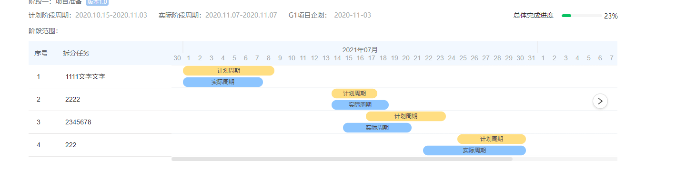

# 需求背景

由于 PMS 项目需要开发如下图所示的甘特图，需要选择合适的组件来实现此功能



# 技术选型

| 选型 | 优点 | 缺点 |
| :-- | :-- | :-- |
| [gantt-schedule-timeline-calendar](https://github.com/neuronetio/gantt-schedule-timeline-calendar) | 功能丰富 | 与 UI 相差较大，定制化代码较多 |
| [react-timeline-gantt](https://github.com/guiqui/react-timeline-gantt) | 功能丰富 | 与 UI 相差较大，定制化代码较多 |
| [gantt](https://github.com/frappe/gantt) | 与 UI 相差不大 | 在 react 使用需要封装；缺失左侧文字描述功能 |
| [gantt-for-react](https://github.com/hustcc/gantt-for-react) | 与 UI 相差不大，可直接在 react 中使用 | 缺失左侧文字描述功能 |
| [gantt-task-react](https://github.com/MaTeMaTuK/gantt-task-react) | 与 UI 最为接近 | 左侧文字展示功能较弱，只能展示固定的几个字段；关键样式没有暴露，不好做定制化 |

# 技术难点

需要针对 gantt-task-react 的源码做功能的增强：

1. 左侧文字展示功能增强
2. 样式属性暴露

# 核心逻辑

所有代码在[这里](https://github.com/towavephone/gantt-task-react/commit/01ef13b7623e2f1bc2fe0b483093d4b84f5edb2f)，这里只展示核心逻辑

## 左侧文字展示功能

左侧文字展示的功能和 antd 的列表渲染 API 一致

### 表头渲染

主要功能如下：

1. 表头的宽度
2. 标题渲染

src/components/task-list/task-list-header.tsx

```diff
import React from "react";
+ import { ListColumn } from "../../types/public-types";
import styles from "./task-list-header.module.css";

export const TaskListHeaderDefault: React.FC<{
  headerHeight: number;
  rowWidth: string;
  fontFamily: string;
  fontSize: string;
- }> = ({ headerHeight, fontFamily, fontSize, rowWidth }) => {
+ listColumns: ListColumn[];
+ }> = ({ headerHeight, fontFamily, fontSize, listColumns, rowWidth }) => {
  return (
    <div
      className={styles.ganttTable}
      style={{
        fontFamily: fontFamily,
        fontSize: fontSize,
+       width: rowWidth,
      }}
    >
      <div
@@ -21,44 +24,17 @@ export const TaskListHeaderDefault: React.FC<{
          height: headerHeight - 2,
        }}
      >
-       <div
-         className={styles.ganttTable_HeaderItem}
-         style={{
-           minWidth: rowWidth,
-         }}
-       >
-         &nbsp;Name
-       </div>
-       <div
-         className={styles.ganttTable_HeaderSeparator}
-         style={{
-           height: headerHeight * 0.5,
-           marginTop: headerHeight * 0.2,
-         }}
-       />
-       <div
-         className={styles.ganttTable_HeaderItem}
-         style={{
-           minWidth: rowWidth,
-         }}
-       >
-         &nbsp;From
-       </div>
-       <div
-         className={styles.ganttTable_HeaderSeparator}
-         style={{
-           height: headerHeight * 0.5,
-           marginTop: headerHeight * 0.25,
-         }}
-       />
-       <div
-         className={styles.ganttTable_HeaderItem}
-         style={{
-           minWidth: rowWidth,
-         }}
-       >
-         &nbsp;To
-       </div>
+       {listColumns.map(item => (
+         <div
+           key={item.key || item.dataIndex}
+           className={styles.ganttTable_HeaderItem}
+           style={{
+             width: item.width || "auto",
+           }}
+         >
+           {item.title}
+         </div>
+       ))}
      </div>
    </div>
  );
```

### 列表内容渲染

主要功能如下：

1. 表格宽度
2. 列表内容渲染
3. 表格行、列单元格合并
4. 表格长标题过长时省略

src/components/task-list/task-list-table.tsx

```diff
- import React, { useMemo } from "react";
+ import React from "react";
+ import classnames from "classnames";
+
import styles from "./task-list-table.module.css";
- import { Task } from "../../types/public-types";
+ import { Task, ListColumn } from "../../types/public-types";
+ import { getPathValue } from "../../helpers/other-helper";

- const localeDateStringCache = {};
- const toLocaleDateStringFactory = (locale: string) => (
-   date: Date,
-   dateTimeOptions: Intl.DateTimeFormatOptions
- ) => {
-   const key = date.toString();
-   let lds = localeDateStringCache[key];
-   if (!lds) {
-     lds = date.toLocaleDateString(locale, dateTimeOptions);
-     localeDateStringCache[key] = lds;
-   }
-   return lds;
- };
- const dateTimeOptions: Intl.DateTimeFormatOptions = {
-   weekday: "short",
-   year: "numeric",
-   month: "long",
-   day: "numeric",
- };

+ function isRenderCell(data: any) {
+   return (
+     data &&
+     typeof data === "object" &&
+     !Array.isArray(data) &&
+     !React.isValidElement(data)
+   );
+ }

export const TaskListTableDefault: React.FC<{
  rowHeight: number;
@@ -32,84 +44,153 @@ export const TaskListTableDefault: React.FC<{
  selectedTaskId: string;
  setSelectedTask: (taskId: string) => void;
  onExpanderClick: (task: Task) => void;
+ listColumns: ListColumn[];
}> = ({
  rowHeight,
  rowWidth,
  tasks,
  fontFamily,
  fontSize,
- locale,
  onExpanderClick,
+ listColumns,
}) => {
- const toLocaleDateString = useMemo(() => toLocaleDateStringFactory(locale), [
-   locale,
- ]);

  return (
-   <div
+   <table
      className={styles.taskListWrapper}
      style={{
        fontFamily: fontFamily,
        fontSize: fontSize,
+       width: rowWidth,
      }}
    >
-     {tasks.map(t => {
-       let expanderSymbol = "";
-       if (t.hideChildren === false) {
-         expanderSymbol = "▼";
-       } else if (t.hideChildren === true) {
-         expanderSymbol = "▶";
-       }
+     <tbody>
+       {tasks.map((t, index) => {
+         let expanderSymbol = "";
+         if (t.hideChildren === false) {
+           expanderSymbol = "▼";
+         } else if (t.hideChildren === true) {
+           expanderSymbol = "▶";
+         }

-       return (
-         <div
-           className={styles.taskListTableRow}
-           style={{ height: rowHeight }}
-           key={`${t.id}row`}
-         >
-           <div
-             className={styles.taskListCell}
-             style={{
-               minWidth: rowWidth,
-               maxWidth: rowWidth,
-             }}
-             title={t.name}
+         return (
+           <tr
+             className={styles.taskListTableRow}
+             style={{ height: rowHeight }}
+             key={`${t.id}row`}
            >
-             <div className={styles.taskListNameWrapper}>
-               <div
-                 className={
-                   expanderSymbol
-                     ? styles.taskListExpander
-                     : styles.taskListEmptyExpander
+             {listColumns.map(item => {
+               let childNode: any;
+               let cellProps;
+               if (item.children) {
+                 childNode = item.children;
+               } else {
+                 const value = getPathValue(t, item.dataIndex);
+                 childNode = value;
+                 if (item.render) {
+                   const renderData = item.render(value, t, index);
+                   if (isRenderCell(renderData)) {
+                     childNode = renderData.children;
+                     cellProps = renderData.props;
+                   } else {
+                     childNode = renderData;
+                   }
                  }
-                 onClick={() => onExpanderClick(t)}
-               >
-                 {expanderSymbol}
-               </div>
-               <div>{t.name}</div>
-             </div>
-           </div>
-           <div
-             className={styles.taskListCell}
-             style={{
-               minWidth: rowWidth,
-               maxWidth: rowWidth,
-             }}
-           >
-             &nbsp;{toLocaleDateString(t.start, dateTimeOptions)}
-           </div>
-           <div
-             className={styles.taskListCell}
-             style={{
-               minWidth: rowWidth,
-               maxWidth: rowWidth,
-             }}
-           >
-             &nbsp;{toLocaleDateString(t.end, dateTimeOptions)}
-           </div>
-         </div>
-       );
-     })}
-   </div>
+               }
+               if (
+                 typeof childNode === "object" &&
+                 !Array.isArray(childNode) &&
+                 !React.isValidElement(childNode)
+               ) {
+                 childNode = null;
+               }
+               const { colSpan: cellColSpan, rowSpan: cellRowSpan } =
+                 cellProps || {};
+               const mergedColSpan =
+                 cellColSpan !== undefined ? cellColSpan : item.colSpan;
+               const mergedRowSpan =
+                 cellRowSpan !== undefined ? cellRowSpan : item.rowSpan;
+               if (mergedColSpan === 0 || mergedRowSpan === 0) {
+                 return null;
+               }
+               let title;
+               const ellipsisConfig =
+                 item.ellipsis === true
+                   ? {
+                       showTitle: true,
+                     }
+                   : item.ellipsis;
+               if (ellipsisConfig && ellipsisConfig.showTitle) {
+                 if (
+                   typeof childNode === "string" ||
+                   typeof childNode === "number"
+                 ) {
+                   title = childNode.toString();
+                 } else if (
+                   React.isValidElement(childNode) &&
+                   // @ts-ignore
+                   typeof childNode.props.children === "string"
+                 ) {
+                   // @ts-ignore
+                   title = childNode.props.children;
+                 }
+               }
+               return (
+                 <td
+                   key={item.key || item.dataIndex}
+                   className={classnames(
+                     styles.taskListCell,
+                     item.ellipsis ? styles.ellipsis : ""
+                   )}
+                   style={{
+                     width: item.width || "auto",
+                   }}
+                   colSpan={
+                     mergedColSpan && mergedColSpan !== 1
+                       ? mergedColSpan
+                       : null
+                   }
+                   rowSpan={
+                     mergedRowSpan && mergedRowSpan !== 1
+                       ? mergedRowSpan
+                       : null
+                   }
+                 >
+                   <div className={styles.taskListNameWrapper}>
+                     <div
+                       className={
+                         expanderSymbol
+                           ? styles.taskListExpander
+                           : styles.taskListEmptyExpander
+                       }
+                       onClick={() => onExpanderClick(t)}
+                     >
+                       {expanderSymbol}
+                     </div>
+                     <div title={title} className={styles.ellipsis}>
+                       {childNode}
+                     </div>
+                   </div>
+                 </td>
+               );
+             })}
+           </tr>
+         );
+       })}
+     </tbody>
+   </table>
  );
};
```

## 样式属性暴露

主要功能如下：

1. 行级斑马线显示
2. 日期分隔线显示
3. 行级分隔线显示

src/components/grid/grid-body.tsx

```diff
  columnWidth: number;
  todayColor: string;
  rtl: boolean;
+  hasCrosswalk: boolean;
+  hasDateLine: boolean;
+  renderRowLines: (index: number) => boolean;
};
+
export const GridBody: React.FC<GridBodyProps> = ({
  tasks,
  dates,
@@ -20,6 +24,9 @@ export const GridBody: React.FC<GridBodyProps> = ({
  columnWidth,
  todayColor,
  rtl,
+ hasCrosswalk,
+ hasDateLine,
+ renderRowLines,
}) => {
  let y = 0;
  const gridRows: ReactChild[] = [];
@@ -33,27 +40,33 @@ export const GridBody: React.FC<GridBodyProps> = ({
      className={styles.gridRowLine}
    />,
  ];
- for (const task of tasks) {
-   gridRows.push(
-     <rect
-       key={"Row" + task.id}
-       x="0"
-       y={y}
-       width={svgWidth}
-       height={rowHeight}
-       className={styles.gridRow}
-     />
-   );
-   rowLines.push(
-     <line
-       key={"RowLine" + task.id}
-       x="0"
-       y1={y + rowHeight}
-       x2={svgWidth}
-       y2={y + rowHeight}
-       className={styles.gridRowLine}
-     />
-   );
+ for (let i = 0; i < tasks.length; i++) {
+   const task = tasks[i];
+   if (hasCrosswalk) {
+     gridRows.push(
+       <rect
+         key={"Row" + task.id}
+         x="0"
+         y={y}
+         width={svgWidth}
+         height={rowHeight}
+         className={styles.gridRow}
+       />
+     );
+   }
+   const isRenderRowLines = renderRowLines(i);
+   if (isRenderRowLines) {
+     rowLines.push(
+       <line
+         key={"RowLine" + task.id}
+         x="0"
+         y1={y + rowHeight}
+         x2={svgWidth}
+         y2={y + rowHeight}
+         className={styles.gridRowLine}
+       />
+     );
+   }
    y += rowHeight;
  }

@@ -63,16 +76,18 @@ export const GridBody: React.FC<GridBodyProps> = ({
  let today: ReactChild = <rect />;
  for (let i = 0; i < dates.length; i++) {
    const date = dates[i];
-   ticks.push(
-     <line
-       key={date.getTime()}
-       x1={tickX}
-       y1={0}
-       x2={tickX}
-       y2={y}
-       className={styles.gridTick}
-     />
-   );
+   if (hasDateLine) {
+     ticks.push(
+       <line
+         key={date.getTime()}
+         x1={tickX}
+         y1={0}
+         x2={tickX}
+         y2={y}
+         className={styles.gridTick}
+       />
+     );
+   }
    if (
      (i + 1 !== dates.length &&
        date.getTime() < now.getTime() &&
```

# 实现效果

[pms-example](embedded-codesandbox://gantt-component-optimization/pms-example)

# 总结

1. ts 写的不够熟练且精简，需要加强
2. 对于样式属性暴露应该用固定类名去控制，原作者包含很多的 className 属性，非常冗余
3. 本地源码优化很少涉及到 svg 的优化，需要加强 svg 的学习
