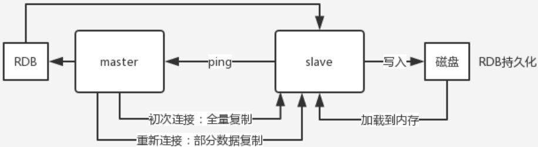
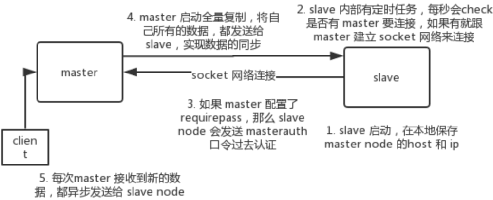

# 高并发架构

## 消息队列

### 为什么使用消息队列？

#### 优点

1. 解耦：通过一个 MQ，Pub/Sub 发布订阅消息这么一个模型，A 系统就跟其它系统彻底解耦了。
2. 异步：任务发到消息队列，由消费者异步消费
3. 削峰：任务发到消息队列，由消费者决定消费速度

#### 缺点

1. 系统可用性降低：MQ 挂了如何处理？即如何保证消息队列的高可用？
2. 系统复杂度提高：怎么保证消息没有重复消费？怎么处理消息丢失的情况？怎么保证消息传递的顺序性？
3. 一致性问题：A 系统处理完直接返回成功，发到消息队列后供 B、C、D 消费，如果 B、D 成功、C 失败怎么处理？

#### Kafka、ActiveMQ、RabbitMQ、RocketMQ 有什么优缺点？

| 特性 | ActiveMQ | RabbitMQ | RocketMQ | Kafka |
| --- | --- | --- | --- | --- |
| 单机吞吐量 | 万级，比 RocketMQ、Kafka 低一个数量级 | 同 ActiveMQ | 10 万级，支撑高吞吐 | 10 万级，高吞吐，一般配合大数据类的系统来进行实时数据计算、日志采集等场景 |
| topic 数量对吞吐量的影响 |  |  | topic 可以达到几百/几千的级别，吞吐量会有较小幅度的下降，这是 RocketMQ 的一大优势，在同等机器下，可以支撑大量的 topic | topic 从几十到几百个时候，吞吐量会大幅度下降，在同等机器下，Kafka 尽量保证 topic 数量不要过多，如果要支撑大规模的 topic，需要增加更多的机器资源 |
| 时效性 | ms 级 | 微秒级，这是 RabbitMQ 的一大特点，延迟最低 | ms 级 | 延迟在 ms 级以内 |
| 可用性 | 高，基于主从架构实现高可用 | 同 ActiveMQ | 非常高，分布式架构 | 非常高，分布式，一个数据多个副本，少数机器宕机，不会丢失数据，不会导致不可用 |
| 消息可靠性 | 有较低的概率丢失数据 | 基本不丢 | 经过参数优化配置，可以做到 0 丢失 | 同 RocketMQ |
| 功能支持 | MQ 领域的功能极其完备 | 基于 erlang 开发，并发能力很强，性能极好，延时很低 | MQ 功能较为完善，还是分布式的，扩展性好 | 功能较为简单，主要支持简单的 MQ 功能，在大数据领域的实时计算以及日志采集被大规模使用 |

综上，各种对比之后，有如下建议：

一般的业务系统要引入 MQ，最早大家都用 ActiveMQ，但是现在确实大家用的不多了，没经过大规模吞吐量场景的验证，社区也不是很活跃，所以大家还是算了吧，我个人不推荐用这个了。

后来大家开始用 RabbitMQ，但是确实 erlang 语言阻止了大量的 Java 工程师去深入研究和掌控它，对公司而言，几乎处于不可控的状态，但是确实人家是开源的，比较稳定的支持，活跃度也高。

不过现在确实越来越多的公司会去用 RocketMQ，确实很不错，毕竟是阿里出品，但社区可能有突然黄掉的风险（目前 RocketMQ 已捐给 [Apache](https://github.com/apache/rocketmq)，但 GitHub 上的活跃度其实不算高）对自己公司技术实力有绝对自信的，推荐用 RocketMQ，否则回去老老实实用 RabbitMQ 吧，人家有活跃的开源社区，绝对不会黄。

所以**中小型公司**，技术实力较为一般，技术挑战不是特别高，用 RabbitMQ 是不错的选择；**大型公司**，基础架构研发实力较强，用 RocketMQ 是很好的选择。

如果是**大数据领域**的实时计算、日志采集等场景，用 Kafka 是业内标准的，绝对没问题，社区活跃度很高，绝对不会黄，何况几乎是全世界这个领域的事实性规范。

### 如何保证消息队列的高可用？

#### RabbitMQ 的高可用性

RabbitMQ 是比较有代表性的，因为是基于主从（非分布式）做高可用性的，RabbitMQ 有三种模式：单机模式、普通集群模式、镜像集群模式。

##### 单机模式

单机模式，就是 Demo 级别的，一般就是你本地启动了玩玩儿的，没人生产用单机模式。

##### 普通集群模式（无高可用性）

普通集群模式，意思就是在多台机器上启动多个 RabbitMQ 实例，每台机器启动一个。你创建的 queue，只会放在一个 RabbitMQ 实例上，但是每个实例都同步 queue 的元数据（元数据可以认为是 queue 的一些配置信息，通过元数据，可以找到 queue 所在实例）。你消费的时候，实际上如果连接到了另外一个实例，那么那个实例会从 queue 所在实例上拉取数据过来。

缺点如下：

1. 没做到分布式，就是个普通的集群：因为这导致你要么消费者每次随机连接一个实例然后拉取数据，要么固定连接那个 queue 所在实例消费数据，前者有数据拉取的开销，后者导致单实例性能瓶颈。
2. 可用性无保障：如果那个放 queue 的实例宕机了，会导致接下来其他实例就无法从那个实例拉取，如果你开启了消息持久化，让 RabbitMQ 落地存储消息的话，消息不一定会丢，得等这个实例恢复了，然后才可以继续从这个 queue 拉取数据

唯一的好处就是提高在集群中多个节点服务某个 queue 的读写操作

##### 镜像集群模式（高可用性）

这种模式，才是所谓的 RabbitMQ 的高可用模式。跟普通集群模式不一样的是，在镜像集群模式下，你创建的 queue，无论是元数据还是 queue 里的消息都会存在于多个实例上，就是说，每个 RabbitMQ 节点都有这个 queue 的一个完整镜像，包含 queue 的全部数据的意思。然后每次你写消息到 queue 的时候，都会自动把消息同步到多个实例的 queue 上。

开启这个模式的方法：管理控制台新增镜像集群模式的策略，指定的时候是可以要求数据同步到所有节点，也可以要求同步到指定数量的节点，再次创建 queue 的时候，应用这个策略，就会自动将数据同步到其他的节点上去了。

优点如下：

1. 可用性相对较高：你任何一个机器宕机了，没事儿，其它机器（节点）还包含了这个 queue 的完整数据，别的 consumer 都可以到其它节点上去消费数据。

缺点如下：

1. 性能开销大：消息需要同步到所有机器上，导致网络带宽压力和消耗很重
2. 非分布式的，就没有扩展性可言：如果某个 queue 负载很重，你加机器，新增的机器也包含了这个 queue 的所有数据，并没有办法线性扩展你的 queue。你想，如果这个 queue 的数据量很大，大到这个机器上的容量无法容纳了，此时该怎么办呢？

#### Kafka 的高可用性

基本架构：由多个 broker 组成，每个 broker 是一个节点；你创建一个 topic，这个 topic 可以划分为多个 partition，每个 partition 可以存在于不同的 broker 上，每个 partition 就放一部分数据。

这就是天然的分布式消息队列，就是说一个 topic 的数据，是分散放在多个机器上的，每个机器就放一部分数据。

实际上 RabbitMQ 之类的，并不是分布式消息队列，它就是传统的消息队列，只不过提供了一些集群、HA（High Availability, 高可用性） 的机制而已，因为无论怎么玩儿，RabbitMQ 一个 queue 的数据都是放在一个节点里的，镜像集群模式下，也是每个节点都放这个 queue 的完整数据。

Kafka 0.8 以前，是没有 HA 机制的，就是任何一个 broker 宕机了，那个 broker 上的 partition 就废了，没法写也没法读，没有什么高可用性可言。

比如说，我们假设创建了一个 topic，指定其 partition 数量是 3 个，分别在三台机器上。但是，如果第二台机器宕机了，会导致这个 topic 的 1/3 的数据就丢了，因此这个是做不到高可用的。

Kafka 0.8 以后，提供了 HA 机制，就是 replica（复制品） 副本机制。每个 partition 的数据都会同步到其它机器上，形成自己的多个 replica 副本。所有 replica 会选举一个 leader 出来，那么生产和消费都跟这个 leader 打交道，然后其他 replica 就是 follower。写的时候，leader 会负责把数据同步到所有 follower 上去，读的时候就直接读 leader 上的数据即可。只能读写 leader？很简单，要是你可以随意读写每个 follower，那么就要关心数据一致性的问题，系统复杂度太高，很容易出问题。Kafka 会均匀地将一个 partition 的所有 replica 分布在不同的机器上，这样才可以提高容错性。

这么搞，就有所谓的高可用性了，因为如果某个 broker 宕机了，没事儿，那个 broker 上面的 partition 在其他机器上都有副本的。如果这个宕机的 broker 上面有某个 partition 的 leader，那么此时会从 follower 中重新选举一个新的 leader 出来，大家继续读写那个新的 leader 即可。这就有所谓的高可用性了。

写数据的时候，生产者就写 leader，然后 leader 将数据落地写本地磁盘，接着其他 follower 自己主动从 leader 来 pull 数据。一旦所有 follower 同步好数据了，就会发送 ack 给 leader，leader 收到所有 follower 的 ack 之后，就会返回写成功的消息给生产者。（当然，这只是其中一种模式，还可以适当调整这个行为）

消费的时候，只会从 leader 去读，但是只有当一个消息已经被所有 follower 都同步成功返回 ack 的时候，这个消息才会被消费者读到。

### 如何保证消息不被重复消费？

#### 背景

首先，比如 RabbitMQ、RocketMQ、Kafka，都有可能会出现消息重复消费的问题，正常。因为这问题通常不是 MQ 自己保证的，是由我们开发来保证的。挑一个 Kafka 来举个例子，说说怎么重复消费吧。

Kafka 实际上有个 offset 的概念，就是每个消息写进去，都有一个 offset，代表消息的序号，然后 consumer 消费了数据之后，每隔一段时间（定时定期），会把自己消费过的消息的 offset 提交一下，表示“我已经消费过了，下次我要是重启啥的，你就让我继续从上次消费到的 offset 来继续消费吧”。

但是凡事总有意外，比如我们之前生产经常遇到的，就是你有时候重启系统，看你怎么重启了，如果碰到点着急的，直接 kill 进程了，再重启。这会导致 consumer 有些消息处理了，但是没来得及提交 offset，尴尬了。重启之后，少数消息会再次消费一次。

有这么个场景。数据 1/2/3 依次进入 Kafka，Kafka 会给这三条数据每条分配一个 offset，代表这条数据的序号，我们就假设分配的 offset 依次是 152/153/154。消费者从 Kafka 去消费的时候，也是按照这个顺序去消费。假如当消费者消费了 offset=153 的这条数据，刚准备去提交 offset 到 Zookeeper，此时消费者进程被重启了。那么此时消费过的数据 1/2 的 offset 并没有提交，Kafka 也就不知道你已经消费了 offset=153 这条数据。那么重启之后，消费者会找 Kafka 说，嘿，哥儿们，你给我接着把上次我消费到的那个地方后面的数据继续给我传递过来。由于之前的 offset 没有提交成功，那么数据 1/2 会再次传过来，如果此时消费者没有去重的话，那么就会导致重复消费。

如果消费者干的事儿是拿一条数据就往数据库里写一条，会导致说，你可能就把数据 1/2 在数据库里插入了 2 次，那么数据就错啦。

#### 解决方案

需要保证重复消费的幂等性，需要结合具体场景

1. 比如你拿个数据要写库，你先根据主键查一下，如果这数据都有了，你就别插入了，update 一下好吧。
2. 比如你是写 Redis，那没问题了，反正每次都是 set，天然幂等性。
3. 比如你不是上面两个场景，那做的稍微复杂一点，你需要让生产者发送每条数据的时候，里面加一个全局唯一的 id，类似订单 id 之类的东西，然后你这里消费到了之后，先根据这个 id 去比如 Redis 里查一下，之前消费过吗？如果没有消费过，你就处理，然后这个 id 写 Redis。如果消费过了，那你就别处理了，保证别重复处理相同的消息即可。
4. 比如基于数据库的唯一键来保证重复数据不会重复插入多条。因为有唯一键约束了，重复数据插入只会报错，不会导致数据库中出现脏数据。

### 如何保证消息的可靠性传输？

数据的丢失问题，可能出现在生产者、MQ、消费者中，咱们从 RabbitMQ 和 Kafka 分别来分析一下吧。

#### RabbitMQ

##### 生产者弄丢了数据

生产者将数据发送到 RabbitMQ 的时候，可能数据就在半路给搞丢了，因为网络问题啥的，都有可能。

此时可以选择用 RabbitMQ 提供的事务功能，就是生产者发送数据之前开启 RabbitMQ 事务 `channel.txSelect()`，然后发送消息，如果消息没有成功被 RabbitMQ 接收到，那么生产者会收到异常报错，此时就可以回滚事务 `channel.txRollback()`，然后重试发送消息；如果收到了消息，那么可以提交事务 channel.txCommit() 。

```java
try {
    // 通过工厂创建连接
    connection = factory.newConnection();
    // 获取通道
    channel = connection.createChannel();
    // 开启事务
    channel.txSelect();

    // 这里发送消息
    channel.basicPublish(exchange, routingKey, MessageProperties.PERSISTENT_TEXT_PLAIN, msg.getBytes());

    // 模拟出现异常
    int result = 1 / 0;

    // 提交事务
    channel.txCommit();
} catch (IOException | TimeoutException e) {
    // 捕捉异常，回滚事务
    channel.txRollback();
}
```

但是问题是，RabbitMQ 事务机制（同步）一搞，基本上吞吐量会下来，因为太耗性能。

所以一般来说，如果你要确保说写 RabbitMQ 的消息别丢，可以开启 confirm 模式，在生产者那里设置开启 confirm 模式之后，你每次写的消息都会分配一个唯一的 id，然后如果写入了 RabbitMQ 中，RabbitMQ 会给你回传一个 ack 消息，告诉你说这个消息 ok 了。如果 RabbitMQ 没能处理这个消息，会回调你的一个 nack 接口，告诉你这个消息接收失败，你可以重试。而且你可以结合这个机制自己在内存里维护每个消息 id 的状态，如果超过一定时间还没接收到这个消息的回调，那么你可以重发。

事务机制和 confirm 机制最大的不同在于，事务机制是同步的，你提交一个事务之后会阻塞在那儿，但是 confirm 机制是异步的，你发送个消息之后就可以发送下一个消息，然后那个消息 RabbitMQ 接收了之后会异步回调你的一个接口通知你这个消息接收到了。

所以一般在生产者这块避免数据丢失，都是用 confirm 机制的。

> 已经在 transaction 事务模式的 channel 是不能再设置成 confirm 模式的，即这两种模式是不能共存的。

客户端实现生产者 confirm 有 3 种方式：

1. 普通 confirm 模式：每发送一条消息后，调用 waitForConfirms() 方法，等待服务器端 confirm，如果服务端返回 false 或者在一段时间内都没返回，客户端可以进行消息重发。

   ```java
   channel.basicPublish(ConfirmConfig.exchangeName, ConfirmConfig.routingKey, MessageProperties.PERSISTENT_TEXT_PLAIN, ConfirmConfig.msg_10B.getBytes());
   if (!channel.waitForConfirms()) {
       // 消息发送失败
       // ...
   }
   ```

2. 批量 confirm 模式：每发送一批消息后，调用 waitForConfirms() 方法，等待服务端 confirm。

   ```java
   channel.confirmSelect();
   for (int i = 0; i < batchCount; ++i) {
       channel.basicPublish(ConfirmConfig.exchangeName, ConfirmConfig.routingKey, MessageProperties.PERSISTENT_TEXT_PLAIN, ConfirmConfig.msg_10B.getBytes());
   }
   if (!channel.waitForConfirms()) {
       // 消息发送失败
       // ...
   }
   ```

3. 异步 confirm 模式：提供一个回调方法，服务端 confirm 了一条或者多条消息后客户端会回调这个方法。

   ```java
   SortedSet<Long> confirmSet = Collections.synchronizedSortedSet(new TreeSet<Long>());
   channel.confirmSelect();
   channel.addConfirmListener(new ConfirmListener() {
       public void handleAck(long deliveryTag, boolean multiple) throws IOException {
           if (multiple) {
               confirmSet.headSet(deliveryTag + 1).clear();
           } else {
               confirmSet.remove(deliveryTag);
           }
       }

       public void handleNack(long deliveryTag, boolean multiple) throws IOException {
           System.out.println("Nack, SeqNo: " + deliveryTag + ", multiple: " + multiple);
           if (multiple) {
               confirmSet.headSet(deliveryTag + 1).clear();
           } else {
               confirmSet.remove(deliveryTag);
           }
       }
   });

   while (true) {
       long nextSeqNo = channel.getNextPublishSeqNo();
       channel.basicPublish(ConfirmConfig.exchangeName, ConfirmConfig.routingKey, MessageProperties.PERSISTENT_TEXT_PLAIN, ConfirmConfig.msg_10B.getBytes());
       confirmSet.add(nextSeqNo);
   }
   ```

##### RabbitMQ 弄丢了数据

就是 RabbitMQ 自己弄丢了数据，这个你必须开启 RabbitMQ 的持久化，就是消息写入之后会持久化到磁盘，哪怕是 RabbitMQ 自己挂了，恢复之后会自动读取之前存储的数据，一般数据不会丢。除非极其罕见的是，RabbitMQ 还没持久化，自己就挂了，可能导致少量数据丢失，但是这个概率较小。

设置持久化有两个步骤：

1. 创建 queue 的时候将其设置为持久化。这样就可以保证 RabbitMQ 持久化 queue 的元数据，但是它是不会持久化 queue 里的数据的。
2. 发送消息的时候将消息的 deliveryMode 设置为 2。就是将消息设置为持久化的，此时 RabbitMQ 就会将消息持久化到磁盘上去。

必须要同时设置这两个持久化才行，RabbitMQ 哪怕是挂了，再次重启，也会从磁盘上重启恢复 queue，恢复这个 queue 里的数据。

注意，哪怕是你给 RabbitMQ 开启了持久化机制，也有一种可能，就是这个消息写到了 RabbitMQ 中，但是还没来得及持久化到磁盘上，结果不巧，此时 RabbitMQ 挂了，就会导致内存里的一点点数据丢失。

所以，持久化可以跟生产者那边的 confirm 机制配合起来，只有消息被持久化到磁盘之后，才会通知生产者 ack 了，所以哪怕是在持久化到磁盘之前，RabbitMQ 挂了，数据丢了，生产者收不到 ack ，你也是可以自己重发的。

##### 消费端弄丢了数据

RabbitMQ 如果丢失了数据，主要是因为你消费的时候，刚消费到，还没处理，结果进程挂了，比如重启了，那么就尴尬了，RabbitMQ 认为你都消费了，这数据就丢了。

这个时候得用 RabbitMQ 提供的 ack 机制，简单来说，就是你必须关闭 RabbitMQ 的自动 ack，可以通过一个 api 来调用就行，然后每次你自己代码里确保处理完的时候，再在程序里 ack 一把。这样的话，如果你还没处理完，不就没有 ack 了？那 RabbitMQ 就认为你还没处理完，这个时候 RabbitMQ 会把这个消费分配给别的 consumer 去处理，消息是不会丢的。

> 为了保证消息从队列中可靠地到达消费者，RabbitMQ 提供了消息确认机制。消费者在声明队列时，可以指定 noAck 参数，当 noAck=false，RabbitMQ 会等待消费者显式发回 ack 信号后，才从内存（和磁盘，如果是持久化消息）中移去消息。否则，一旦消息被消费者消费，RabbitMQ 会在队列中立即删除它。

#### Kafka

##### 消费端弄丢了数据

唯一可能导致消费者弄丢数据的情况，就是说，你消费到了这个消息，然后消费者那边自动提交了 offset，让 Kafka 以为你已经消费好了这个消息，但其实你才刚准备处理这个消息，你还没处理，你自己就挂了，此时这条消息就丢咯。

这不是跟 RabbitMQ 差不多吗，大家都知道 Kafka 会自动提交 offset，那么只要关闭自动提交 offset，在处理完之后自己手动提交 offset，就可以保证数据不会丢。但是此时确实还是可能会有重复消费，比如你刚处理完，还没提交 offset，结果自己挂了，此时肯定会重复消费一次，自己保证幂等性就好了。

生产环境碰到的一个问题，就是说我们的 Kafka 消费者消费到了数据之后是写到一个内存的 queue 里先缓冲一下，结果有的时候，你刚把消息写入内存 queue，然后消费者会自动提交 offset。然后此时我们重启了系统，就会导致内存 queue 里还没来得及处理的数据就丢失了。

##### Kafka 弄丢了数据

这块比较常见的一个场景，就是 Kafka 某个 broker 宕机，然后重新选举 partition 的 leader。大家想想，要是此时其他的 follower 刚好还有些数据没有同步，结果此时 leader 挂了，然后选举某个 follower 成 leader 之后，不就少了一些数据？这就丢了一些数据啊。

生产环境也遇到过，之前 Kafka 的 leader 机器宕机了，将 follower 切换为 leader 之后，就会发现说这个数据就丢了。

所以此时一般是要求起码设置如下 4 个参数：

1. 给 topic 设置 replication.factor 参数：这个值必须大于 1，要求每个 partition 必须有至少 2 个副本。
2. 在 Kafka 服务端设置 min.insync.replicas 参数：这个值必须大于 1，这个是要求一个 leader 至少感知到有至少一个 follower 还跟自己保持联系，没掉队，这样才能确保 leader 挂了还有一个 follower 吧。
3. 在 producer 端设置 acks=all：这个是要求每条数据，必须是写入所有 replica 之后，才能认为是写成功了。
4. 在 producer 端设置 retries=MAX（很大很大很大的一个值，无限次重试的意思）：这个是要求一旦写入失败，就无限重试，卡在这里了。我们生产环境就是按照上述要求配置的，这样配置之后，至少在 Kafka broker 端就可以保证在 leader 所在 broker 发生故障，进行 leader 切换时，数据不会丢失。

##### 生产者会不会弄丢数据？

如果按照上述的思路设置了 acks=all，一定不会丢，要求是你的 leader 接收到消息，所有的 follower 都同步到了消息之后，才认为本次写成功了。如果没满足这个条件，生产者会自动不断的重试，重试无限次。

#### RocketMQ

##### 消息丢失的场景

1. 生产者发送消息到 MQ 有可能丢失消息
2. MQ 收到消息后写入硬盘可能丢失消息
3. 消息写入硬盘后，硬盘坏了丢失消息
4. 消费者消费 MQ 也可能丢失消息
5. 整个 MQ 节点挂了丢失消息

##### 生产者发送消息时如何保证不丢失？

解决发送时消息丢失的问题可以采用 RocketMQ 自带的事物消息机制

事物消息原理：首先生产者会发送一个 half 消息(对原始消息的封装)，该消息对消费者不可见，MQ 通过 ACK 机制返回消息接受状态，生产者执行本地事务并且返回给 MQ 一个状态(Commit、RollBack 等)，如果是 Commit 的话 MQ 就会把消息给到下游，RollBack 的话就会丢弃该消息，状态如果为 UnKnow 的话会过一段时间回查本地事务状态，默认回查 15 次，一直是 UnKnow 状态的话就会丢弃此消息。

为什么先发一个 half 消息，作用就是先判断下 MQ 有没有问题，服务正不正常。

##### MQ 收到消息后写入硬盘如何保证不丢失？

数据存盘绕过缓存，改为同步刷盘，这一步需要修改 Broker 的配置文件，将 flushDiskType 改为 `SYNC_FLUSH` 同步刷盘策略，默认的是 `ASYNC_FLUSH` 异步刷盘，一旦同步刷盘返回成功，那么就一定保证消息已经持久化到磁盘中了。

##### 消息写入硬盘后，硬盘坏了如何保证不丢失？

为了保证磁盘损坏导致丢失数据，RocketMQ 采用主从机构，集群部署，Leader 中的数据在多个 Follower 中都存有备份，防止单点故障导致数据丢失。

Master 节点挂了怎么办？Master 节点挂了之后 DLedger 登场

- 接管 MQ 的 commitLog
- 选举从节点
- 文件复制 uncommited 状态，多半从节点收到之后改为 commited

##### 消费者消费 MQ 如何保证不丢失？

1. 如果是网络问题导致的消费失败可以进行重试机制，默认每条消息重试 16 次
2. 多线程异步消费失败，MQ 认为已经消费成功但是实际上对于业务逻辑来说消息是没有落地的，解决方案就是按照 mq 官方推荐的先执行本地事务再返回成功状态。

##### 整个 MQ 节点挂了如何保证不丢失？

这种极端情况可以消息发送失败之后先存入本地，例如放到缓存中，另外启动一个线程扫描缓存的消息去重试发送。

### 如何保证消息的顺序性？

#### 背景

以前做过一个 mysql binlog 同步的系统，压力还是非常大的，日同步数据要达到上亿，就是说数据从一个 mysql 库原封不动地同步到另一个 mysql 库里面去（mysql -> mysql）。常见的一点在于说比如大数据 team，就需要同步一个 mysql 库过来，对公司的业务系统的数据做各种复杂的操作。

你在 mysql 里增删改一条数据，对应出来了增删改 3 条 binlog 日志，接着这三条 binlog 发送到 MQ 里面，再消费出来依次执行，起码得保证人家是按照顺序来的吧？不然本来是：增加、修改、删除；你愣是换了顺序给执行成删除、修改、增加，不全错了么。

本来这个数据同步过来，应该最后这个数据被删除了；结果你搞错了这个顺序，最后这个数据保留下来了，数据同步就出错了。

先看看顺序会错乱的俩场景：

- RabbitMQ：一个 queue，多个 consumer。比如，生产者向 RabbitMQ 里发送了三条数据，顺序依次是 data1/data2/data3，压入的是 RabbitMQ 的一个内存队列。有三个消费者分别从 MQ 中消费这三条数据中的一条，结果消费者 2 先执行完操作，把 data2 存入数据库，然后是 data1/data3。这不明显乱了。
- Kafka：比如说我们建了一个 topic，有三个 partition。生产者在写的时候，其实可以指定一个 key，比如说我们指定了某个订单 id 作为 key，那么这个订单相关的数据，一定会被分发到同一个 partition 中去，而且这个 partition 中的数据一定是有顺序的。

   消费者从 partition 中取出来数据的时候，也一定是有顺序的。到这里，顺序还是 ok 的，没有错乱。接着，我们在消费者里可能会搞多个线程来并发处理消息。因为如果消费者是单线程消费处理，而处理比较耗时的话，比如处理一条消息耗时几十 ms，那么 1 秒钟只能处理几十条消息，这吞吐量太低了。而多个线程并发跑的话，顺序可能就乱掉了。

#### 解决方案

##### RabbitMQ

拆分多个 queue，每个 queue 一个 consumer，就是多一些 queue 而已，确实是麻烦点，这样也会造成吞吐量下降，可以在消费者内部采用多线程的方式去消费。

或者就一个 queue 但是对应一个 consumer，然后这个 consumer 内部用内存队列做排队，然后分发给底层不同的 worker 来处理。

注意，这里消费者不直接消费消息，而是将消息根据关键值（比如：订单 id）进行哈希，哈希值相同的消息保存到相同的内存队列里。也就是说，需要保证顺序的消息存到了相同的内存队列，然后由一个唯一的 worker 去处理。

一句话概括就是同一个 id 下的操作放到同一个 queue 中，那么消费者消费的顺序就得到了保证，下面的 Kafka 同理

##### Kafka

- 一个 topic，一个 partition，一个 consumer，内部单线程消费，单线程吞吐量太低，一般不会用这个。
- 写 N 个内存 queue，具有相同 key 的数据都到同一个内存 queue；然后对于 N 个线程，每个线程分别消费一个内存 queue 即可，这样就能保证顺序性。

### 如何解决消息队列的延时以及过期失效问题？

#### 大量消息在 mq 里积压了几个小时了还没解决

几千万条数据在 MQ 里积压了七八个小时，从下午 4 点多，积压到了晚上 11 点多。这个是我们真实遇到过的一个场景，确实是线上故障了，这个时候要不然就是修复 consumer 的问题，让它恢复消费速度，然后傻傻的等待几个小时消费完毕。这个肯定不能在面试的时候说吧。

一个消费者一秒是 1000 条，一秒 3 个消费者是 3000 条，一分钟就是 18 万条。所以如果你积压了几百万到上千万的数据，即使消费者恢复了，也需要大概 1 小时的时间才能恢复过来。

一般这个时候，只能临时紧急扩容了，具体操作步骤和思路如下：

- 先修复 consumer 的问题，确保其恢复消费速度，然后将现有 consumer 都停掉。
- 新建一个 topic，partition 是原来的 10 倍，临时建立好原先 10 倍的 queue 数量。
- 然后写一个临时的分发数据的 consumer 程序，这个程序部署上去消费积压的数据，消费之后不做耗时的处理，直接均匀轮询写入临时建立好的 10 倍数量的 queue。
- 接着临时征用 10 倍的机器来部署 consumer，每一批 consumer 消费一个临时 queue 的数据。这种做法相当于是临时将 queue 资源和 consumer 资源扩大 10 倍，以正常的 10 倍速度来消费数据。
- 等快速消费完积压数据之后，得恢复原先部署的架构，重新用原先的 consumer 机器来消费消息。

#### mq 中的消息过期失效了

假设你用的是 RabbitMQ，RabbtiMQ 是可以设置过期时间的，也就是 TTL。如果消息在 queue 中积压超过一定的时间就会被 RabbitMQ 给清理掉，这个数据就没了。那这就是第二个坑了。这就不是说数据会大量积压在 mq 里，而是大量的数据会直接搞丢。

这个情况下，就不是说要增加 consumer 消费积压的消息，因为实际上没啥积压，而是丢了大量的消息。我们可以采取一个方案，就是批量重导，这个我们之前线上也有类似的场景干过。就是大量积压的时候，我们当时就直接丢弃数据了，然后等过了高峰期以后，比如大家一起喝咖啡熬夜到晚上 12 点以后，用户都睡觉了。这个时候我们就开始写程序，将丢失的那批数据，写个临时程序，一点一点的查出来，然后重新灌入 mq 里面去，把白天丢的数据给他补回来。也只能是这样了。

假设 1 万个订单积压在 mq 里面，没有处理，其中 1000 个订单都丢了，你只能手动写程序把那 1000 个订单给查出来，手动发到 mq 里去再补一次。

#### mq 都快写满了

如果消息积压在 mq 里，你很长时间都没有处理掉，此时导致 mq 都快写满了，咋办？这个还有别的办法吗？没有，谁让你第一个方案执行的太慢了，你临时写程序，接入数据来消费，消费一个丢弃一个，都不要了，快速消费掉所有的消息。然后走第二个方案，到了晚上再补数据吧。

#### RocketMQ 的处理方式

1. 提高消费并行度

   绝大部分消息消费行为都属于 IO 密集型，即可能是操作数据库，或者调用 RPC，这类消费行为的消费速度在于后端数据库或者外系统的吞吐量，通过增加消费并行度，可以提高总的消费吞吐量，但是并行度增加到一定程度，反而会下降。所以，应用必须要设置合理的并行度。如下有几种修改消费并行度的方法：

   1. 同一个 ConsumerGroup 下，通过增加 Consumer 实例数量来提高并行度（需要注意的是超过订阅队列数的 Consumer 实例无效）。
   2. 可以通过加机器，或者在已有机器启动多个进程的方式。
   3. 提高单个 Consumer 的消费并行线程，通过修改参数 consumeThreadMin、consumeThreadMax 实现。

2. 批量方式消费

   某些业务流程如果支持批量方式消费，则可以很大程度上提高消费吞吐量，例如订单扣款类应用，一次处理一个订单耗时 1s，一次处理 10 个订单可能也只耗时 2s，这样即可大幅度提高消费的吞吐量，通过设置 consumer 的 consumeMessageBatchMaxSize 参数，默认是 1，即一次只消费一条消息，例如设置为 N，那么每次消费的消息数小于等于 N。

3. 跳过非重要消息

   发生消息堆积时，如果消费速度一直追不上发送速度，如果业务对数据要求不高的话，可以选择丢弃不重要的消息。例如，当某个队列的消息数堆积到 100000 条以上，则尝试丢弃部分或全部消息，这样就可以快速追上发送消息的速度。示例代码如下：

   ```java
   public ConsumeConcurrentlyStatus consumeMessage(
               List<MessageExt> msgs,
               ConsumeConcurrentlyContext context) {
      long offset = msgs.get(0).getQueueOffset();
      String maxOffset =
               msgs.get(0).getProperty(Message.PROPERTY_MAX_OFFSET);
      long diff = Long.parseLong(maxOffset) - offset;
      if (diff > 100000) {
         // TODO 消息堆积情况的特殊处理
         return ConsumeConcurrentlyStatus.CONSUME_SUCCESS;
      }
      // TODO 正常消费过程
      return ConsumeConcurrentlyStatus.CONSUME_SUCCESS;
   }
   ```

4. 优化每条消息消费过程

   举例如下，某条消息的消费过程如下：

   - 根据消息从 DB 查询【数据 1】
   - 根据消息从 DB 查询【数据 2】
   - 复杂的业务计算
   - 向 DB 插入【数据 3】
   - 向 DB 插入【数据 4】

   这条消息的消费过程中有 4 次与 DB 的交互，如果按照每次 5ms 计算，那么总共耗时 20ms，假设业务计算耗时 5ms，那么总过耗时 25ms，所以如果能把 4 次 DB 交互优化为 2 次，那么总耗时就可以优化到 15ms，即总体性能提高了 40%。所以应用如果对延时敏感的话，可以把 DB 部署在 SSD 硬盘，相比于 SCSI 磁盘，前者的 RT 会小很多。

### 如何设计一个消息队列？

- 首先这个 mq 得支持可伸缩性吧，就是需要的时候快速扩容，就可以增加吞吐量和容量，那怎么搞？设计个分布式的系统呗，参照一下 kafka 的设计理念，broker -> topic -> partition，每个 partition 放一个机器，就存一部分数据。如果现在资源不够了，简单啊，给 topic 增加 partition，然后做数据迁移，增加机器，不就可以存放更多数据，提供更高的吞吐量了？
- 其次你得考虑一下这个 mq 的数据要不要落地磁盘吧？那肯定要了，落磁盘才能保证别进程挂了数据就丢了。那落磁盘的时候怎么落啊？顺序写，这样就没有磁盘随机读写的寻址开销，磁盘顺序读写的性能是很高的，这就是 kafka 的思路。
- 其次你考虑一下你的 mq 的可用性啊？这个事儿，具体参考之前可用性那个环节讲解的 kafka 的高可用保障机制。多副本 -> leader & follower -> broker 挂了重新选举 leader 即可对外服务。
- 能不能支持数据 0 丢失啊？可以的，参考我们之前说的那个 kafka 数据零丢失方案。

## 搜索引擎

### ES 是什么？

#### Lucene 和 ES 的前世今生

Lucene 是最先进、功能最强大的搜索库。如果直接基于 Lucene 开发，非常复杂，即便写一些简单的功能，也要写大量的 Java 代码，需要深入理解原理。

ElasticSearch 基于 Lucene，隐藏了 lucene 的复杂性，提供了简单易用的 RESTful api / Java api 接口（另外还有其他语言的 api 接口）。

- 分布式的文档存储引擎
- 分布式的搜索引擎和分析引擎
- 分布式，支持 PB 级数据

#### ES 的核心概念

##### Near Realtime

近实时，有两层意思：

- 从写入数据到数据可以被搜索到有一个小延迟（大概是 1s）
- 基于 ES 执行搜索和分析可以达到秒级

##### Cluster 集群

集群包含多个节点，每个节点属于哪个集群都是通过一个配置来决定的，对于中小型应用来说，刚开始一个集群就一个节点很正常。

##### Node 节点

Node 是集群中的一个节点，节点也有一个名称，默认是随机分配的。默认节点会去加入一个名称为 elasticsearch 的集群。如果直接启动一堆节点，那么它们会自动组成一个 elasticsearch 集群，当然一个节点也可以组成 elasticsearch 集群。

##### Document & field

文档是 ES 中最小的数据单元，一个 document 可以是一条客户数据、一条商品分类数据、一条订单数据，通常用 json 数据结构来表示。每个 index 下的 type，都可以存储多条 document。一个 document 里面有多个 field，每个 field 就是一个数据字段。

```json
{
   "product_id": "1",
   "product_name": "iPhone X",
   "product_desc": "苹果手机",
   "category_id": "2",
   "category_name": "电子产品"
}
```

##### Index

索引包含了一堆有相似结构的文档数据，比如商品索引。一个索引包含很多 document，一个索引就代表了一类相似或者相同的 document。

##### Type

类型，每个索引里可以有一个或者多个 type，type 是 index 的一个逻辑分类，比如商品 index 下有多个 type：日化商品 type、电器商品 type、生鲜商品 type。每个 type 下的 document 的 field 可能不太一样。

##### shard

单台机器无法存储大量数据，ES 可以将一个索引中的数据切分为多个 shard，分布在多台服务器上存储。有了 shard 就可以横向扩展，存储更多数据，让搜索和分析等操作分布到多台服务器上去执行，提升吞吐量和性能。每个 shard 都是一个 lucene index。

##### replica

任何一个服务器随时可能故障或宕机，此时 shard 可能就会丢失，因此可以为每个 shard 创建多个 replica 副本。replica 可以在 shard 故障时提供备用服务，保证数据不丢失，多个 replica 还可以提升搜索操作的吞吐量和性能。primary shard（建立索引时一次设置，不能修改，默认 5 个），replica shard（随时修改数量，默认 1 个），默认每个索引 10 个 shard，5 个 primary shard，5 个 replica shard，最小的高可用配置，是 2 台服务器。

这么说吧，shard 分为 primary shard 和 replica shard。而 primary shard 一般简称为 shard，而 replica shard 一般简称为 replica。

#### ES 核心概念 vs. DB 核心概念

| ES       | DB       |
| -------- | -------- |
| index    | 数据库   |
| type     | 数据表   |
| document | 一行数据 |

### ES 的分布式架构原理？

ElasticSearch 设计的理念就是分布式搜索引擎，底层其实还是基于 lucene 的。核心思想就是在多台机器上启动多个 ES 进程实例，组成了一个 ES 集群。

ES 中存储数据的基本单位是索引，比如说你现在要在 ES 中存储一些订单数据，你就应该在 ES 中创建一个索引 `order_idx`，所有的订单数据就都写到这个索引里面去，一个索引差不多就是相当于是 mysql 里的一个数据库。

```
index -> type -> mapping -> document -> field
```

这样吧，为了做个更直白的介绍，我在这里做个类比。但是切记，不要划等号，类比只是为了便于理解。

index 相当于 mysql 数据库。而 type 没法跟 mysql 里去对比，一个 index 里可以有多个 type，每个 type 的字段都是差不多的，但是有一些略微的差别。假设有一个 index，是订单 index，里面专门是放订单数据的。就好比说你在 mysql 中建表，有些订单是实物商品的订单，比如一件衣服、一双鞋子；有些订单是虚拟商品的订单，比如游戏点卡，话费充值。就两种订单大部分字段是一样的，但是少部分字段可能有略微的一些差别。

所以就会在订单 index 里，建两个 type，一个是实物商品订单 type，一个是虚拟商品订单 type，这两个 type 大部分字段是一样的，少部分字段是不一样的。

很多情况下，一个 index 里可能就一个 type，但是确实如果说是一个 index 里有多个 type 的情况（注意，mapping types 这个概念在 ElasticSearch 7.X 已被完全移除，详细说明可以参考官方文档），你可以认为 index 是一个类别的表，具体的每个 type 代表了 mysql 中的一个表。每个 type 有一个 mapping，如果你认为一个 type 是具体的一个表，index 就代表多个 type 同属于的一个类型，而 mapping 就是这个 type 的表结构定义，你在 mysql 中创建一个表，肯定是要定义表结构的，里面有哪些字段，每个字段是什么类型。实际上你往 index 里的一个 type 里面写的一条数据，叫做一条 document，一条 document 就代表了 mysql 中某个表里的一行，每个 document 有多个 field，每个 field 就代表了这个 document 中的一个字段的值。

你搞一个索引，这个索引可以拆分成多个 shard，每个 shard 存储部分数据。拆分多个 shard 是有好处的，一是支持横向扩展，比如你数据量是 3T，3 个 shard，每个 shard 就 1T 的数据，若现在数据量增加到 4T，怎么扩展，很简单，重新建一个有 4 个 shard 的索引，将数据导进去；二是提高性能，数据分布在多个 shard，即多台服务器上，所有的操作，都会在多台机器上并行分布式执行，提高了吞吐量和性能。

接着就是这个 shard 的数据实际是有多个备份，就是说每个 shard 都有一个 primary shard，负责写入数据，但是还有几个 replica shard。 primary shard 写入数据之后，会将数据同步到其他几个 replica shard 上去。

通过这个 replica 的方案，每个 shard 的数据都有多个备份，如果某个机器宕机了，没关系啊，还有别的数据副本在别的机器上呢。高可用了吧。

ES 集群多个节点，会自动选举一个节点为 master 节点，这个 master 节点其实就是干一些管理的工作的，比如维护索引元数据、负责切换 primary shard 和 replica shard 身份等。要是 master 节点宕机了，那么会重新选举一个节点为 master 节点。

如果是非 master 节点宕机了，那么会由 master 节点，让那个宕机节点上的 primary shard 的身份转移到其他机器上的 replica shard。接着你要是修复了那个宕机机器，重启了之后，master 节点会控制将缺失的 replica shard 分配过去，同步后续修改的数据之类的，让集群恢复正常。

说得更简单一点，就是说如果某个非 master 节点宕机了。那么此节点上的 primary shard 不就没了。那好，master 会让 primary shard 对应的 replica shard（在其他机器上）切换为 primary shard。如果宕机的机器修复了，修复后的节点也不再是 primary shard，而是 replica shard。

其实上述就是 ElasticSearch 作为分布式搜索引擎最基本的一个架构设计。

### ES 写入数据的工作原理是什么？

#### es 写数据过程

- 客户端选择一个 node 发送请求过去，这个 node 就是 coordinating node（协调节点）。
- coordinating node 对 document 进行路由，将请求转发给对应的 node（有 primary shard）。
- 实际的 node 上的 primary shard 处理请求，然后将数据同步到 replica node。
- coordinating node 如果发现 primary node 和所有 replica node 都搞定之后，就返回响应结果给客户端。

#### es 读数据过程

可以通过 doc id 来查询，会根据 doc id 进行 hash，判断出来当时把 doc id 分配到了哪个 shard 上面去，从那个 shard 去查询。

- 客户端发送请求到任意一个 node，成为 coordinate node 。
- coordinate node 对 doc id 进行哈希路由，将请求转发到对应的 node，此时会使用 round-robin 随机轮询算法，在 primary shard 以及其所有 replica 中随机选择一个，让读请求负载均衡。
- 接收请求的 node 返回 document 给 coordinate node 。
- coordinate node 返回 document 给客户端。

#### es 搜索数据过程

es 最强大的是做全文检索，就是比如你有三条数据：

```
java真好玩儿啊
java好难学啊
j2ee特别牛
```

你根据 java 关键词来搜索，将包含 java 的 document 给搜索出来。es 就会给你返回：java 真好玩儿啊，java 好难学啊。

- 客户端发送请求到一个 coordinate node。
- 协调节点将搜索请求转发到所有的 shard 对应的 primary shard 或 replica shard，都可以。
- query phase：每个 shard 将自己的搜索结果（其实就是一些 doc id ）返回给协调节点，由协调节点进行数据的合并、排序、分页等操作，产出最终结果。
- fetch phase：接着由协调节点根据 doc id 去各个节点上拉取实际的 document 数据，最终返回给客户端。

> 写请求是写入 primary shard，然后同步给所有的 replica shard；读请求可以从 primary shard 或 replica shard 读取，采用的是随机轮询算法。

#### 写数据底层原理

先写入内存 buffer，在 buffer 里的时候数据是搜索不到的；同时将数据写入 translog 日志文件。

如果 buffer 快满了，或者到一定时间，就会将内存 buffer 数据 refresh 到一个新的 segment file 中，但是此时数据不是直接进入 segment file 磁盘文件，而是先进入 os cache。这个过程就是 refresh。

每隔 1 秒钟，es 将 buffer 中的数据写入一个新的 segment file，每秒钟会产生一个新的磁盘文件 segment file，这个 segment file 中就存储最近 1 秒内 buffer 中写入的数据。

但是如果 buffer 里面此时没有数据，那当然不会执行 refresh 操作，如果 buffer 里面有数据，默认 1 秒钟执行一次 refresh 操作，刷入一个新的 segment file 中。

操作系统里面，磁盘文件其实都有一个东西，叫做 os cache，即操作系统缓存，就是说数据写入磁盘文件之前，会先进入 os cache，先进入操作系统级别的一个内存缓存中去。只要 buffer 中的数据被 refresh 操作刷入 os cache 中，这个数据就可以被搜索到了。

为什么叫 es 是准实时的？NRT，全称 near real-time。默认是每隔 1 秒 refresh 一次的，所以 es 是准实时的，因为写入的数据 1 秒之后才能被看到。可以通过 es 的 restful api 或者 java api，手动执行一次 refresh 操作，就是手动将 buffer 中的数据刷入 os cache 中，让数据立马就可以被搜索到。只要数据被输入 os cache 中，buffer 就会被清空了，因为不需要保留 buffer 了，数据在 translog 里面已经持久化到磁盘一份了。

重复上面的步骤，新的数据不断进入 buffer 和 translog，不断将 buffer 数据写入一个又一个新的 segment file 中去，每次 refresh 完 buffer 清空，translog 保留。随着这个过程推进，translog 会变得越来越大。当 translog 达到一定长度的时候，就会触发 commit 操作。

commit 操作发生第一步，就是将 buffer 中现有数据 refresh 到 os cache 中去，清空 buffer。然后，将一个 commit point 写入磁盘文件，里面标识着这个 commit point 对应的所有 segment file，同时强行将 os cache 中目前所有的数据都 fsync 到磁盘文件中去。最后清空现有 translog 日志文件，重启一个 translog，此时 commit 操作完成。

这个 commit 操作叫做 flush。默认 30 分钟自动执行一次 flush，但如果 translog 过大，也会触发 flush。flush 操作就对应着 commit 的全过程，我们可以通过 es api，手动执行 flush 操作，手动将 os cache 中的数据 fsync 强刷到磁盘上去。

translog 日志文件的作用是什么？你执行 commit 操作之前，数据要么是停留在 buffer 中，要么是停留在 os cache 中，无论是 buffer 还是 os cache 都是内存，一旦这台机器死了，内存中的数据就全丢了。所以需要将数据对应的操作写入一个专门的日志文件 translog 中，一旦此时机器宕机，再次重启的时候，es 会自动读取 translog 日志文件中的数据，恢复到内存 buffer 和 os cache 中去。

translog 其实也是先写入 os cache 的，默认每隔 5 秒刷一次到磁盘中去，所以默认情况下，可能有 5 秒的数据会仅仅停留在 buffer 或者 translog 文件的 os cache 中，如果此时机器挂了，会丢失 5 秒钟的数据。但是这样性能比较好，最多丢 5 秒的数据。也可以将 translog 设置成每次写操作必须是直接 fsync 到磁盘，但是性能会差很多。

- `index.translog.sync_interval` 控制 translog 多久 fsync 到磁盘，最小为 100ms；
- `index.translog.durability` translog 是每 5 秒钟刷新一次还是每次请求都 fsync，这个参数有 2 个取值：request（每次请求都执行 fsync，es 要等 translog fsync 到磁盘后才会返回成功）和 async（默认值，translog 每隔 5 秒钟 fsync 一次）。

实际上你在这里，如果面试官没有问你 es 丢数据的问题，你可以在这里给面试官炫一把，你说，其实 es 第一是准实时的，数据写入 1 秒后可以搜索到；可能会丢失数据的。有 5 秒的数据，停留在 buffer、translog os cache、segment file os cache 中，而不在磁盘上，此时如果宕机，会导致 5 秒的数据丢失。

总结一下，数据先写入内存 buffer，然后每隔 1s，将数据 refresh 到 os cache，到了 os cache 数据就能被搜索到（所以我们才说 es 从写入到能被搜索到，中间有 1s 的延迟）。每隔 5s，将数据写入 translog 文件（这样如果机器宕机，内存数据全没，最多会有 5s 的数据丢失），translog 大到一定程度，或者默认每隔 30min，会触发 commit 操作，将缓冲区的数据都 flush 到 segment file 磁盘文件中。

> 数据写入 segment file 之后，同时就建立好了倒排索引。

#### 删除/更新数据底层原理

如果是删除操作，commit 的时候会生成一个 .del 文件，里面将某个 doc 标识为 deleted 状态，那么搜索的时候根据 .del 文件就知道这个 doc 是否被删除了。

如果是更新操作，就是将原来的 doc 标识为 deleted 状态，然后新写入一条数据。

buffer 每 refresh 一次，就会产生一个 segment file，所以默认情况下是 1 秒钟一个 segment file，这样下来 segment file 会越来越多，此时会定期执行 merge。每次 merge 的时候，会将多个 segment file 合并成一个，同时这里会将标识为 deleted 的 doc 给物理删除掉，然后将新的 segment file 写入磁盘，这里会写一个 commit point，标识所有新的 segment file，然后打开 segment file 供搜索使用，同时删除旧的 segment file。

#### 底层 lucene

简单来说，lucene 就是一个 jar 包，里面包含了封装好的各种建立倒排索引的算法代码。我们用 Java 开发的时候，引入 lucene jar，然后基于 lucene 的 api 去开发就可以了。

通过 lucene，我们可以将已有的数据建立索引，lucene 会在本地磁盘上面，给我们组织索引的数据结构。

#### 倒排索引

在搜索引擎中，每个文档都有一个对应的文档 ID，文档内容被表示为一系列关键词的集合。例如，文档 1 经过分词，提取了 20 个关键词，每个关键词都会记录它在文档中出现的次数和出现位置。

那么，倒排索引就是关键词到文档 ID 的映射，每个关键词都对应着一系列的文件，这些文件中都出现了关键词。

举个栗子。

有以下文档：

| DocId | Doc                                            |
| ----- | ---------------------------------------------- |
| 1     | 谷歌地图之父跳槽 Facebook                      |
| 2     | 谷歌地图之父加盟 Facebook                      |
| 3     | 谷歌地图创始人拉斯离开谷歌加盟 Facebook        |
| 4     | 谷歌地图之父跳槽 Facebook 与 Wave 项目取消有关 |
| 5     | 谷歌地图之父拉斯加盟社交网站 Facebook          |

对文档进行分词之后，得到以下倒排索引。

| WordId | Word     | DocIds        |
| ------ | -------- | ------------- |
| 1      | 谷歌     | 1, 2, 3, 4, 5 |
| 2      | 地图     | 1, 2, 3, 4, 5 |
| 3      | 之父     | 1, 2, 4, 5    |
| 4      | 跳槽     | 1, 4          |
| 5      | Facebook | 1, 2, 3, 4, 5 |
| 6      | 加盟     | 2, 3, 5       |
| 7      | 创始人   | 3             |
| 8      | 拉斯     | 3, 5          |
| 9      | 离开     | 3             |
| 10     | 与       | 4             |
| ..     | ..       | ..            |

另外，实用的倒排索引还可以记录更多的信息，比如文档频率信息，表示在文档集合中有多少个文档包含某个单词。

那么，有了倒排索引，搜索引擎可以很方便地响应用户的查询。比如用户输入查询 Facebook ，搜索系统查找倒排索引，从中读出包含这个单词的文档，这些文档就是提供给用户的搜索结果。

要注意倒排索引的两个重要细节：

- 倒排索引中的所有词项对应一个或多个文档；
- 倒排索引中的词项根据字典顺序升序排列

> 上面只是一个简单的栗子，并没有严格按照字典顺序升序排列。

### ES 在数据量很大的情况下（数十亿级别）如何提高查询效率？

#### 性能优化的杀手锏 filesystem cache

你往 es 里写的数据，实际上都写到磁盘文件里去了，查询的时候，操作系统会将磁盘文件里的数据自动缓存到 filesystem cache 里面去。

es 的搜索引擎严重依赖于底层的 filesystem cache，你如果给 filesystem cache 更多的内存，尽量让内存可以容纳所有的 idx segment file 索引数据文件，那么你搜索的时候就基本都是走内存的，性能会非常高。

性能差距究竟可以有多大？我们之前很多的测试和压测，如果走磁盘一般肯定上秒，搜索性能绝对是秒级别的，1 秒、5 秒、10 秒。但如果是走 filesystem cache，是走纯内存的，那么一般来说性能比走磁盘要高一个数量级，基本上就是毫秒级的，从几毫秒到几百毫秒不等。

这里有个真实的案例。某个公司 es 节点有 3 台机器，每台机器看起来内存很多，64G，总内存就是 `64 * 3 = 192G`。每台机器给 es jvm heap 是 32G，那么剩下来留给 filesystem cache 的就是每台机器才 32G，总共集群里给 filesystem cache 的就是 `32 * 3 = 96G` 内存。而此时，整个磁盘上索引数据文件，在 3 台机器上一共占用了 1T 的磁盘容量，es 数据量是 1T，那么每台机器的数据量是 300G。这样性能好吗？filesystem cache 的内存才 100G，十分之一的数据可以放内存，其他的都在磁盘，然后你执行搜索操作，大部分操作都是走磁盘，性能肯定差。

归根结底，你要让 es 性能要好，最佳的情况下，就是你的机器的内存，至少可以容纳你的总数据量的一半。

根据我们自己的生产环境实践经验，最佳的情况下，是仅仅在 es 中就存少量的数据，就是你要用来搜索的那些索引，如果内存留给 filesystem cache 的是 100G，那么你就将索引数据控制在 100G 以内，这样的话，你的数据几乎全部走内存来搜索，性能非常之高，一般可以在 1 秒以内。

比如说你现在有一行数据。id,name,age.... 30 个字段。但是你现在搜索，只需要根据 id,name,age 三个字段来搜索。如果你傻乎乎往 es 里写入一行数据所有的字段，就会导致说 90% 的数据是不用来搜索的，结果硬是占据了 es 机器上的 filesystem cache 的空间，单条数据的数据量越大，就会导致 filesystem cahce 能缓存的数据就越少。其实，仅仅写入 es 中要用来检索的少数几个字段就可以了，比如说就写入 es id,name,age 三个字段，然后你可以把其他的字段数据存在 mysql/hbase 里，我们一般是建议用 es + hbase 这么一个架构。

hbase 的特点是适用于海量数据的在线存储，就是对 hbase 可以写入海量数据，但是不要做复杂的搜索，做很简单的一些根据 id 或者范围进行查询的这么一个操作就可以了。从 es 中根据 name 和 age 去搜索，拿到的结果可能就 20 个 doc id，然后根据 doc id 到 hbase 里去查询每个 doc id 对应的完整的数据，给查出来，再返回给前端。

写入 es 的数据最好小于等于，或者是略微大于 es 的 filesystem cache 的内存容量。然后你从 es 检索可能就花费 20ms，然后再根据 es 返回的 id 去 hbase 里查询，查 20 条数据，可能也就耗费个 30ms，可能你原来那么玩儿，1T 数据都放 es，会每次查询都是 5~10s，现在可能性能就会很高，每次查询就是 50ms。

#### 数据预热

假如说，哪怕是你就按照上述的方案去做了，es 集群中每个机器写入的数据量还是超过了 filesystem cache 一倍，比如说你写入一台机器 60G 数据，结果 filesystem cache 就 30G，还是有 30G 数据留在了磁盘上。

其实可以做数据预热。

举个例子，拿微博来说，你可以把一些大 V，平时看的人很多的数据，你自己提前后台搞个系统，每隔一会儿，自己的后台系统去搜索一下热数据，刷到 filesystem cache 里去，后面用户实际上来看这个热数据的时候，他们就是直接从内存里搜索了，很快。

或者是电商，你可以将平时查看最多的一些商品，比如说 iphone 8 热数据提前后台搞个程序，每隔 1 分钟自己主动访问一次，刷到 filesystem cache 里去。

对于那些你觉得比较热的、经常会有人访问的数据，最好做一个专门的缓存预热子系统，就是对热数据每隔一段时间，就提前访问一下，让数据进入 filesystem cache 里面去。这样下次别人访问的时候，性能一定会好很多。

#### 冷热分离

es 可以做类似于 mysql 的水平拆分，就是说将大量的访问很少、频率很低的数据，单独写一个索引，然后将访问很频繁的热数据单独写一个索引。最好是将冷数据写入一个索引中，然后热数据写入另外一个索引中，这样可以确保热数据在被预热之后，尽量都让他们留在 filesystem os cache 里，别让冷数据给冲刷掉。

你看，假设你有 6 台机器，2 个索引，一个放冷数据，一个放热数据，每个索引 3 个 shard。3 台机器放热数据 index，另外 3 台机器放冷数据 index。然后这样的话，你大量的时间是在访问热数据 index，热数据可能就占总数据量的 10%，此时数据量很少，几乎全都保留在 filesystem cache 里面了，就可以确保热数据的访问性能是很高的。但是对于冷数据而言，是在别的 index 里的，跟热数据 index 不在相同的机器上，大家互相之间都没什么联系了。如果有人访问冷数据，可能大量数据是在磁盘上的，此时性能差点，就 10% 的人去访问冷数据，90% 的人在访问热数据，也无所谓了。

#### document 模型设计

对于 MySQL，我们经常有一些复杂的关联查询。在 es 里该怎么玩儿，es 里面的复杂的关联查询尽量别用，一旦用了性能一般都不太好。

最好是先在 Java 系统里就完成关联，将关联好的数据直接写入 es 中。搜索的时候，就不需要利用 es 的搜索语法来完成 join 之类的关联搜索了。

document 模型设计是非常重要的，很多操作，不要在搜索的时候才想去执行各种复杂的乱七八糟的操作。es 能支持的操作就那么多，不要考虑用 es 做一些它不好操作的事情。如果真的有那种操作，尽量在 document 模型设计的时候，写入的时候就完成。另外对于一些太复杂的操作，比如 join/nested/parent-child 搜索都要尽量避免，性能都很差的。

#### 分页性能优化

es 的分页是较坑的，为啥呢？举个例子吧，假如你每页是 10 条数据，你现在要查询第 100 页，实际上是会把每个 shard 上存储的前 1000 条数据都查到一个协调节点上，如果你有个 5 个 shard，那么就有 5000 条数据，接着协调节点对这 5000 条数据进行一些合并、处理，再获取到最终第 100 页的 10 条数据。

分布式的，你要查第 100 页的 10 条数据，不可能说从 5 个 shard，每个 shard 就查 2 条数据，最后到协调节点合并成 10 条数据吧？你必须得从每个 shard 都查 1000 条数据过来，然后根据你的需求进行排序、筛选等等操作，最后再次分页，拿到里面第 100 页的数据。你翻页的时候，翻的越深，每个 shard 返回的数据就越多，而且协调节点处理的时间越长，非常坑爹。所以用 es 做分页的时候，你会发现越翻到后面，就越是慢。

我们之前也是遇到过这个问题，用 es 作分页，前几页就几十毫秒，翻到 10 页或者几十页的时候，基本上就要 5~10 秒才能查出来一页数据了。

有什么解决方案吗？

##### 不允许深度分页（默认深度分页性能很差）

跟产品经理说，你系统不允许翻那么深的页，默认翻的越深，性能就越差。

##### 类似于 app 里的推荐商品不断下拉出来一页一页的

类似于微博中，下拉刷微博，刷出来一页一页的，你可以用 scroll api，关于如何使用，自行上网搜索。

scroll 会一次性给你生成所有数据的一个快照，然后每次滑动向后翻页就是通过游标 `scroll_id` 移动，获取下一页这样子，性能会比上面说的那种分页性能要高很多很多，基本上都是毫秒级的。

但是，唯一的一点就是，这个适合于那种类似微博下拉翻页的，不能随意跳到任何一页的场景。也就是说，你不能先进入第 10 页，然后去第 120 页，然后又回到第 58 页，不能随意乱跳页。所以现在很多产品，都是不允许你随意翻页的，app，也有一些网站，做的就是你只能往下拉，一页一页的翻。

初始化时必须指定 scroll 参数，告诉 es 要保存此次搜索的上下文多长时间。你需要确保用户不会持续不断翻页翻几个小时，否则可能因为超时而失败。

除了用 scroll api，你也可以用 `search_after` 来做，`search_after` 的思想是使用前一页的结果来帮助检索下一页的数据，显然，这种方式也不允许你随意翻页，你只能一页页往后翻。初始化时，需要使用一个唯一值的字段作为 sort 字段。

### ES 生产集群的部署架构是什么？

- es 生产集群我们部署了 5 台机器，每台机器是 6 核 64G 的，集群总内存是 320G。
- 我们 es 集群的日增量数据大概是 2000 万条，每天日增量数据大概是 500MB，每月增量数据大概是 6 亿，15G。目前系统已经运行了几个月，现在 es 集群里数据总量大概是 100G 左右。
- 目前线上有 5 个索引（这个结合你们自己业务来，看看自己有哪些数据可以放 es 的），每个索引的数据量大概是 20G，所以这个数据量之内，我们每个索引分配的是 8 个 shard，比默认的 5 个 shard 多了 3 个 shard。

## 缓存

### 项目中缓存是如何使用的？

这个，需要结合自己项目的业务来。

#### 为什么要用缓存？

用缓存，主要有两个用途：高性能、高并发。

##### 高性能

假设这么个场景，你有个操作，一个请求过来，吭哧吭哧你各种乱七八糟操作 mysql，半天查出来一个结果，耗时 600ms。但是这个结果可能接下来几个小时都不会变了，或者变了也可以不用立即反馈给用户。那么此时咋办？

缓存啊，折腾 600ms 查出来的结果，扔缓存里，一个 key 对应一个 value，下次再有人查，别走 mysql 折腾 600ms 了，直接从缓存里，通过一个 key 查出来一个 value，2ms 搞定。性能提升 300 倍。

就是说对于一些需要复杂操作耗时查出来的结果，且确定后面不怎么变化，但是有很多读请求，那么直接将查询出来的结果放在缓存中，后面直接读缓存就好。

#### 高并发

mysql 这么重的数据库，压根儿设计不是让你玩儿高并发的，虽然也可以玩儿，但是天然支持不好。mysql 单机支撑到 2000QPS 也开始容易报警了。

所以要是你有个系统，高峰期一秒钟过来的请求有 1 万，那一个 mysql 单机绝对会死掉。你这个时候就只能上缓存，把很多数据放缓存，别放 mysql。缓存功能简单，说白了就是 key-value 式操作，单机支撑的并发量轻松一秒几万十几万，支撑高并发 so easy。单机承载并发量是 mysql 单机的几十倍。

缓存是走内存的，内存天然就支撑高并发。

#### 用了缓存之后会有什么不良后果？

常见的缓存问题有以下几个：

- 缓存与数据库双写不一致
- 缓存雪崩、缓存穿透、缓存击穿
- 缓存并发竞争

### Redis 和 Memcached 有什么区别？

#### 区别

##### Redis 支持复杂的数据结构

Redis 相比 Memcached 来说，拥有更多的数据结构，能支持更丰富的数据操作。如果需要缓存能够支持更复杂的结构和操作，Redis 会是不错的选择。

##### Redis 原生支持集群模式

在 Redis3.x 版本中，便能支持 cluster 模式，而 Memcached 没有原生的集群模式，需要依靠客户端来实现往集群中分片写入数据。

#### 性能对比

由于 Redis 只使用单核，而 Memcached 可以使用多核，所以平均每一个核上 Redis 在存储小数据时比 Memcached 性能更高。而在 100k 以上的数据中，Memcached 性能要高于 Redis。虽然 Redis 最近也在存储大数据的性能上进行优化，但是比起 Memcached，还是稍有逊色。

#### Redis 的线程模型

Redis 内部使用文件事件处理器 file event handler，这个文件事件处理器是单线程的，所以 Redis 才叫做单线程的模型。它采用 IO 多路复用机制同时监听多个 socket，将产生事件的 socket 压入内存队列中，事件分派器根据 socket 上的事件类型来选择对应的事件处理器进行处理。

文件事件处理器的结构包含 4 个部分：

- 多个 socket
- IO 多路复用程序
- 文件事件分派器
- 事件处理器（连接应答处理器、命令请求处理器、命令回复处理器）

多个 socket 可能会并发产生不同的操作，每个操作对应不同的文件事件，但是 IO 多路复用程序会监听多个 socket，会将产生事件的 socket 放入队列中排队，事件分派器每次从队列中取出一个 socket，根据 socket 的事件类型交给对应的事件处理器进行处理。

来看客户端与 Redis 的一次通信过程：


要明白，通信是通过 socket 来完成的，不懂的同学可以先去看一看 socket 网络编程。

首先，Redis 服务端进程初始化的时候，会将 server socket 的 `AE_READABLE` 事件与连接应答处理器关联。

客户端 socket01 向 Redis 进程的 server socket 请求建立连接，此时 server socket 会产生一个 `AE_READABLE` 事件，IO 多路复用程序监听到 server socket 产生的事件后，将该 socket 压入队列中。文件事件分派器从队列中获取 socket，交给连接应答处理器。连接应答处理器会创建一个能与客户端通信的 socket01，并将该 socket01 的 `AE_READABLE` 事件与命令请求处理器关联。

假设此时客户端发送了一个 set key value 请求，此时 Redis 中的 socket01 会产生 `AE_READABLE` 事件，IO 多路复用程序将 socket01 压入队列，此时事件分派器从队列中获取到 socket01 产生的 `AE_READABLE` 事件，由于前面 socket01 的 `AE_READABLE` 事件已经与命令请求处理器关联，因此事件分派器将事件交给命令请求处理器来处理。命令请求处理器读取 socket01 的 key value 并在自己内存中完成 key value 的设置。操作完成后，它会将 socket01 的 `AE_WRITABLE` 事件与命令回复处理器关联。

如果此时客户端准备好接收返回结果了，那么 Redis 中的 socket01 会产生一个 `AE_WRITABLE` 事件，同样压入队列中，事件分派器找到相关联的命令回复处理器，由命令回复处理器对 socket01 输入本次操作的一个结果，比如 ok，之后解除 socket01 的 `AE_WRITABLE` 事件与命令回复处理器的关联。

这样便完成了一次通信。关于 Redis 的一次通信过程，推荐读者阅读 [Redis 设计与实现——黄健宏](https://github.com/doocs/technical-books#database) 进行系统学习。

#### 为啥 Redis 单线程模型也能效率这么高？

- 纯内存操作。
- 核心是基于非阻塞的 IO 多路复用机制。
- C 语言实现，一般来说，C 语言实现的程序距离操作系统更近，执行速度相对会更快。
- 单线程反而避免了多线程的频繁上下文切换问题，预防了多线程可能产生的竞争问题。

#### Redis 6.0 开始引入多线程

注意！Redis 6.0 之后的版本抛弃了单线程模型这一设计，原本使用单线程运行的 Redis 也开始选择性地使用多线程模型。

前面还在强调 Redis 单线程模型的高效性，现在为什么又要引入多线程？这其实说明 Redis 在有些方面，单线程已经不具有优势了。因为读写网络的 Read/Write 系统调用在 Redis 执行期间占用了大部分 CPU 时间，如果把网络读写做成多线程的方式对性能会有很大提升。

Redis 的多线程部分只是用来处理网络数据的读写和协议解析，执行命令仍然是单线程。之所以这么设计是不想 Redis 因为多线程而变得复杂，需要去控制 key、lua、事务、LPUSH/LPOP 等等的并发问题。

#### 总结

Redis 选择使用单线程模型处理客户端的请求主要还是因为 CPU 不是 Redis 服务器的瓶颈，所以使用多线程模型带来的性能提升并不能抵消它带来的开发成本和维护成本，系统的性能瓶颈也主要在网络 I/O 操作上；而 Redis 引入多线程操作也是出于性能上的考虑，对于一些大键值对的删除操作，通过多线程非阻塞地释放内存空间(释放操作不会阻塞网络 IO 读写,因为网络 IO 读写与释放的命令执行不是同一个线程)也能减少对 Redis 主线程阻塞的时间，提高执行的效率。

### Redis 都有哪些数据类型及适用场景？

Redis 主要有以下几种数据类型：

- Strings
- Hashes
- Lists
- Sets
- Sorted Sets

> Redis 除了这 5 种数据类型之外，还有 Bitmaps、HyperLogLogs、Streams 等。

#### Strings

这是最简单的类型，就是普通的 set 和 get，做简单的 KV 缓存。

```bash
set college szu
```

#### Hashes

这个是类似 map 的一种结构，这个一般就是可以将结构化的数据，比如一个对象（前提是这个对象没嵌套其他的对象）给缓存在 Redis 里，然后每次读写缓存的时候，可以就操作 hash 里的某个字段。

```bash
hset person name bingo
hset person age 20
hset person id 1
hget person name
```

```json
(person = {
   "name": "bingo",
   "age": 20,
   "id": 1
})
```

#### Lists

Lists 是有序列表，这个可以玩儿出很多花样。

比如可以通过 list 存储一些列表型的数据结构，类似粉丝列表、文章的评论列表之类的东西。

比如可以通过 lrange 命令，读取某个闭区间内的元素，可以基于 list 实现分页查询，这个是很棒的一个功能，基于 Redis 实现简单的高性能分页，可以做类似微博那种下拉不断分页的东西，性能高，就一页一页走。

```bash
# 0 开始位置，-1 结束位置，结束位置为 -1 时，表示列表的最后一个位置，即查看所有。
lrange mylist 0 -1
```

比如可以搞个简单的消息队列，从 list 头怼进去，从 list 尾巴那里弄出来。

```bash
lpush mylist 1
lpush mylist 2
lpush mylist 3 4 5

# 1
rpop mylist
```

#### Sets

Sets 是无序集合，自动去重。

直接基于 set 将系统里需要去重的数据扔进去，自动就给去重了，如果你需要对一些数据进行快速的全局去重，你当然也可以基于 jvm 内存里的 HashSet 进行去重，但是如果你的某个系统部署在多台机器上呢？得基于 Redis 进行全局的 set 去重。

可以基于 set 玩儿交集、并集、差集的操作，比如交集吧，可以把两个人的粉丝列表整一个交集，看看俩人的共同好友是谁？对吧。

把两个大 V 的粉丝都放在两个 set 中，对两个 set 做交集。

```bash
#-------操作一个 set-------
# 添加元素
sadd mySet 1

# 查看全部元素
smembers mySet

# 判断是否包含某个值
sismember mySet 3

# 删除某些元素
srem mySet 1
srem mySet 2 4

# 查看元素个数
scard mySet

# 随机删除一个元素
spop mySet

#-------操作多个 set-------
# 将一个 set 的元素移动到另外一个 set
smove yourSet mySet 2

# 求两 set 的交集
sinter yourSet mySet

# 求两 set 的并集
sunion yourSet mySet

# 求在 yourSet 中而不在 mySet 中的元素
sdiff yourSet mySet
```

#### Sorted Sets

Sorted Sets 是排序的 set，去重但可以排序，写进去的时候给一个分数，自动根据分数排序。

```bash
zadd board 85 zhangsan
zadd board 72 lisi
zadd board 96 wangwu
zadd board 63 zhaoliu

# 获取排名前三的用户（默认是升序，所以需要 rev 改为降序）
zrevrange board 0 3

# 获取某用户的排名
zrank board zhaoliu
```

### Redis 的过期策略都有哪些？

#### Redis 过期策略

Redis 过期策略是：定期删除 + 惰性删除。

所谓定期删除，指的是 Redis 默认是每隔 100ms 就随机抽取一些设置了过期时间的 key，检查其是否过期，如果过期就删除。

假设 Redis 里放了 10w 个 key，都设置了过期时间，你每隔几百毫秒，就检查 10w 个 key，那 Redis 基本上就死了，cpu 负载会很高的，消耗在你的检查过期 key 上了。注意，这里可不是每隔 100ms 就遍历所有的设置过期时间的 key，那样就是一场性能上的灾难。实际上 Redis 是每隔 100ms 随机抽取一些 key 来检查和删除的。

但是问题是，定期删除可能会导致很多过期 key 到了时间并没有被删除掉，那咋整呢？所以就是惰性删除了。这就是说，在你获取某个 key 的时候，Redis 会检查一下，这个 key 如果设置了过期时间那么是否过期了？如果过期了此时就会删除，不会给你返回任何东西。

> 获取 key 的时候，如果此时 key 已经过期，就删除，不会返回任何东西。

但是实际上这还是有问题的，如果定期删除漏掉了很多过期 key，然后你也没及时去查，也就没走惰性删除，此时会怎么样？如果大量过期 key 堆积在内存里，导致 Redis 内存块耗尽了，咋整？

答案是：走内存淘汰机制。

#### 内存淘汰机制

Redis 内存淘汰机制有以下几个：

- noeviction: 当内存不足以容纳新写入数据时，新写入操作会报错，这个一般没人用吧，实在是太恶心了。
- allkeys-lru：当内存不足以容纳新写入数据时，在键空间中，移除最近最少使用的 key（这个是最常用的）。
- allkeys-random：当内存不足以容纳新写入数据时，在键空间中，随机移除某个 key，这个一般没人用吧，为啥要随机，肯定是把最近最少使用的 key 给干掉啊。
- volatile-lru：当内存不足以容纳新写入数据时，在设置了过期时间的键空间中，移除最近最少使用的 key（这个一般不太合适）。
- volatile-random：当内存不足以容纳新写入数据时，在设置了过期时间的键空间中，随机移除某个 key。
- volatile-ttl：当内存不足以容纳新写入数据时，在设置了过期时间的键空间中，有更早过期时间的 key 优先移除。

#### 手写一个 LRU 算法

LRU 就是 Least Recently Used 的缩写，翻译过来就是“最近最少使用”。也就是说 LRU 算法会将最近最少用的缓存移除，让给最新使用的缓存。而往往最常读取的，也就是读取次数最多的，所以利用好 LRU 算法，我们能够提供对热点数据的缓存效率，能够提高缓存服务的内存使用率。

不求自己纯手工从底层开始打造出自己的 LRU，但是起码要知道如何利用已有的 JDK 数据结构实现一个 Java 版的 LRU。

```java
public class LRUCache<K, V> extends LinkedHashMap<K, V> {
    private int capacity;

    /**
     * 传递进来最多能缓存多少数据
     *
     * @param capacity 缓存大小
     */
    public LRUCache(int capacity) {
        super(capacity, 0.75f, true);
        this.capacity = capacity;
    }

    /**
     * 如果 map 中的数据量大于设定的最大容量，返回 true，在新加入对象时删除最老的数据
     *
     * @param eldest 最老的数据项
     * @return true 则移除最老的数据
     */
    @Override
    protected boolean removeEldestEntry(Map.Entry<K, V> eldest) {
        // 当 map 中的数据量大于指定的缓存个数的时候，自动移除最老的数据
        return size() > capacity;
    }
}
```

### 如何保证 redis 的高并发和高可用？

redis 实现高并发主要依靠主从架构，一主多从，一般来说，很多项目其实就足够了，单主用来写入数据，单机几万 QPS，多从用来查询数据，多个从实例可以提供每秒 10w 的 QPS。

如果想要在实现高并发的同时，容纳大量的数据，那么就需要 redis 集群，使用 redis 集群之后，可以提供每秒几十万的读写并发。

redis 高可用，如果是做主从架构部署，那么加上哨兵就可以了，就可以实现任何一个实例宕机就进行主备切换。

### Redis 主从架构

单机的 Redis，能够承载的 QPS 大概就在上万到几万不等。对于缓存来说，一般都是用来支撑读高并发的。因此架构做成主从（master-slave）架构，一主多从，主负责写，并且将数据复制到其它的 slave 节点，从节点负责读。所有的读请求全部走从节点。这样也可以很轻松实现水平扩容，支撑读高并发。

Redis replication -> 主从架构 -> 读写分离 -> 水平扩容支撑读高并发

#### Redis replication 的核心机制

- Redis 采用异步方式复制数据到 slave 节点，不过 Redis2.8 开始，slave node 会周期性地确认自己每次复制的数据量；
- 一个 master node 是可以配置多个 slave node 的；
- slave node 也可以连接其他的 slave node；
- slave node 做复制的时候，不会 block master node 的正常工作；
- slave node 在做复制的时候，也不会 block 对自己的查询操作，它会用旧的数据集来提供服务；但是复制完成的时候，需要删除旧数据集，加载新数据集，这个时候就会暂停对外服务了；
- slave node 主要用来进行横向扩容，做读写分离，扩容的 slave node 可以提高读的吞吐量。

注意，如果采用了主从架构，那么建议必须开启 master node 的持久化，不建议用 slave node 作为 master node 的数据热备，因为那样的话，如果你关掉 master 的持久化，可能在 master 宕机重启的时候数据是空的，然后可能一经过复制，slave node 的数据也丢了。

另外，master 的各种备份方案，也需要做。万一本地的所有文件丢失了，从备份中挑选一份 rdb 去恢复 master，这样才能确保启动的时候，是有数据的，即使采用了后续讲解的高可用机制，slave node 可以自动接管 master node，但也可能 sentinel 还没检测到 master failure，master node 就自动重启了，还是可能导致上面所有的 slave node 数据被清空。

#### Redis 主从复制的核心原理

当启动一个 slave node 的时候，它会发送一个 PSYNC 命令给 master node。

如果这是 slave node 初次连接到 master node，那么会触发一次 full resynchronization 全量复制。此时 master 会启动一个后台线程，开始生成一份 RDB 快照文件，同时还会将从客户端 client 新收到的所有写命令缓存在内存中。RDB 文件生成完毕后，master 会将这个 RDB 发送给 slave，slave 会先写入本地磁盘，然后再从本地磁盘加载到内存中，接着 master 会将内存中缓存的写命令发送到 slave，slave 也会同步这些数据。slave node 如果跟 master node 有网络故障，断开了连接，会自动重连，连接之后 master node 仅会复制给 slave 部分缺少的数据。



##### 主从复制的断点续传

从 Redis2.8 开始，就支持主从复制的断点续传，如果主从复制过程中，网络连接断掉了，那么可以接着上次复制的地方，继续复制下去，而不是从头开始复制一份。

master node 会在内存中维护一个 backlog，master 和 slave 都会保存一个 replica offset 还有一个 master run id，offset 就是保存在 backlog 中的。如果 master 和 slave 网络连接断掉了，slave 会让 master 从上次 replica offset 开始继续复制，如果没有找到对应的 offset，那么就会执行一次 resynchronization。

> 如果根据 host + ip 定位 master node，是不靠谱的，如果 master node 重启或者数据出现了变化，那么 slave node 应该根据不同的 run id 区分。

##### 无磁盘化复制

master 在内存中直接创建 RDB，然后发送给 slave，不会在自己本地落地磁盘了。只需要在配置文件中开启 repl-diskless-sync yes 即可。

```bash
repl-diskless-sync yes

# 等待 5s 后再开始复制，因为要等更多 slave 重新连接过来
repl-diskless-sync-delay 5
```

##### 过期 key 处理

slave 不会过期 key，只会等待 master 过期 key。如果 master 过期了一个 key，或者通过 LRU 淘汰了一个 key，那么会模拟一条 del 命令发送给 slave。

#### 复制的完整流程

slave node 启动时，会在自己本地保存 master node 的信息，包括 master node 的 host 和 ip，但是复制流程没开始。

slave node 内部有个定时任务，每秒检查是否有新的 master node 要连接和复制，如果发现，就跟 master node 建立 socket 网络连接。然后 slave node 发送 ping 命令给 master node。如果 master 设置了 requirepass，那么 slave node 必须发送 masterauth 的口令过去进行认证。master node 第一次执行全量复制，将所有数据发给 slave node。而在后续，master node 持续将写命令，异步复制给 slave node。



##### 全量复制

- master 执行 bgsave，在本地生成一份 rdb 快照文件。
- master node 将 rdb 快照文件发送给 slave node，如果 rdb 复制时间超过 60 秒（repl-timeout），那么 slave node 就会认为复制失败，可以适当调大这个参数（对于千兆网卡的机器，一般每秒传输 100MB，6G 文件，很可能超过 60s）
- master node 在生成 rdb 时，会将所有新的写命令缓存在内存中，在 slave node 保存了 rdb 之后，再将新的写命令复制给 slave node。
- 如果在复制期间，内存缓冲区持续消耗超过 64MB，或者一次性超过 256MB，那么停止复制，复制失败。

   ```bash
   client-output-buffer-limit slave 256MB 64MB 60
   ```

- slave node 接收到 rdb 之后，清空自己的旧数据，然后重新加载 rdb 到自己的内存中。注意，在清空旧数据之前，slave node 依然会基于旧的数据版本对外提供服务。
- 如果 slave node 开启了 AOF，那么会立即执行 BGREWRITEAOF，重写 AOF。

##### 增量复制

- 如果全量复制过程中，master-slave 网络连接断掉，那么 slave 重新连接 master 时，会触发增量复制。
- master 直接从自己的 backlog 中获取部分丢失的数据，发送给 slave node，默认 backlog 就是 1MB。
- master 就是根据 slave 发送的 psync 中的 offset 来从 backlog 中获取数据的。

##### heartbeat

主从节点互相都会发送 heartbeat 信息。

master 默认每隔 10 秒发送一次 heartbeat，slave node 每隔 1 秒发送一个 heartbeat。

##### 异步复制

master 每次接收到写命令之后，先在内部写入数据，然后异步发送给 slave node。

#### Redis 如何才能做到高可用

如果系统在 365 天内，有 99.99% 的时间，都是可以对外提供服务的，那么就说系统是高可用的。

一个 slave 挂掉了，是不会影响可用性的，还有其它的 slave 在提供相同数据下的相同的对外的查询服务。

但是，如果 master node 死掉了，会怎么样？没法写数据了，写缓存的时候，全部失效了。slave node 还有什么用呢，没有 master 给它们复制数据了，系统相当于不可用了。

Redis 的高可用架构，叫做 failover 故障转移，也可以叫做主备切换。

master node 在故障时自动检测，并且将某个 slave node 自动切换为 master node 的过程，叫做主备切换。这个过程，实现了 Redis 的主从架构下的高可用。

// TODO https://doocs.github.io/advanced-java/#/docs/high-concurrency/how-to-ensure-the-order-of-messages
