# 高并发架构

## 消息队列

### 为什么使用消息队列？

#### 优点

1. 解耦：通过一个 MQ，Pub/Sub 发布订阅消息这么一个模型，A 系统就跟其它系统彻底解耦了。
2. 异步：任务发到消息队列，由消费者异步消费
3. 削峰：任务发到消息队列，由消费者决定消费速度

#### 缺点

1. 系统可用性降低：MQ 挂了如何处理？即如何保证消息队列的高可用？
2. 系统复杂度提高：怎么保证消息没有重复消费？怎么处理消息丢失的情况？怎么保证消息传递的顺序性？
3. 一致性问题：A 系统处理完直接返回成功，发到消息队列后供 B、C、D 消费，如果 B、D 成功、C 失败怎么处理？

#### Kafka、ActiveMQ、RabbitMQ、RocketMQ 有什么优缺点？

| 特性 | ActiveMQ | RabbitMQ | RocketMQ | Kafka |
| --- | --- | --- | --- | --- |
| 单机吞吐量 | 万级，比 RocketMQ、Kafka 低一个数量级 | 同 ActiveMQ | 10 万级，支撑高吞吐 | 10 万级，高吞吐，一般配合大数据类的系统来进行实时数据计算、日志采集等场景 |
| topic 数量对吞吐量的影响 |  |  | topic 可以达到几百/几千的级别，吞吐量会有较小幅度的下降，这是 RocketMQ 的一大优势，在同等机器下，可以支撑大量的 topic | topic 从几十到几百个时候，吞吐量会大幅度下降，在同等机器下，Kafka 尽量保证 topic 数量不要过多，如果要支撑大规模的 topic，需要增加更多的机器资源 |
| 时效性 | ms 级 | 微秒级，这是 RabbitMQ 的一大特点，延迟最低 | ms 级 | 延迟在 ms 级以内 |
| 可用性 | 高，基于主从架构实现高可用 | 同 ActiveMQ | 非常高，分布式架构 | 非常高，分布式，一个数据多个副本，少数机器宕机，不会丢失数据，不会导致不可用 |
| 消息可靠性 | 有较低的概率丢失数据 | 基本不丢 | 经过参数优化配置，可以做到 0 丢失 | 同 RocketMQ |
| 功能支持 | MQ 领域的功能极其完备 | 基于 erlang 开发，并发能力很强，性能极好，延时很低 | MQ 功能较为完善，还是分布式的，扩展性好 | 功能较为简单，主要支持简单的 MQ 功能，在大数据领域的实时计算以及日志采集被大规模使用 |

综上，各种对比之后，有如下建议：

一般的业务系统要引入 MQ，最早大家都用 ActiveMQ，但是现在确实大家用的不多了，没经过大规模吞吐量场景的验证，社区也不是很活跃，所以大家还是算了吧，我个人不推荐用这个了。

后来大家开始用 RabbitMQ，但是确实 erlang 语言阻止了大量的 Java 工程师去深入研究和掌控它，对公司而言，几乎处于不可控的状态，但是确实人家是开源的，比较稳定的支持，活跃度也高。

不过现在确实越来越多的公司会去用 RocketMQ，确实很不错，毕竟是阿里出品，但社区可能有突然黄掉的风险（目前 RocketMQ 已捐给 [Apache](https://github.com/apache/rocketmq)，但 GitHub 上的活跃度其实不算高）对自己公司技术实力有绝对自信的，推荐用 RocketMQ，否则回去老老实实用 RabbitMQ 吧，人家有活跃的开源社区，绝对不会黄。

所以**中小型公司**，技术实力较为一般，技术挑战不是特别高，用 RabbitMQ 是不错的选择；**大型公司**，基础架构研发实力较强，用 RocketMQ 是很好的选择。

如果是**大数据领域**的实时计算、日志采集等场景，用 Kafka 是业内标准的，绝对没问题，社区活跃度很高，绝对不会黄，何况几乎是全世界这个领域的事实性规范。

### 如何保证消息队列的高可用？

#### RabbitMQ 的高可用性

RabbitMQ 是比较有代表性的，因为是基于主从（非分布式）做高可用性的，RabbitMQ 有三种模式：单机模式、普通集群模式、镜像集群模式。

##### 单机模式

单机模式，就是 Demo 级别的，一般就是你本地启动了玩玩儿的，没人生产用单机模式。

##### 普通集群模式（无高可用性）

普通集群模式，意思就是在多台机器上启动多个 RabbitMQ 实例，每台机器启动一个。你创建的 queue，只会放在一个 RabbitMQ 实例上，但是每个实例都同步 queue 的元数据（元数据可以认为是 queue 的一些配置信息，通过元数据，可以找到 queue 所在实例）。你消费的时候，实际上如果连接到了另外一个实例，那么那个实例会从 queue 所在实例上拉取数据过来。

缺点如下：

1. 没做到分布式，就是个普通的集群：因为这导致你要么消费者每次随机连接一个实例然后拉取数据，要么固定连接那个 queue 所在实例消费数据，前者有数据拉取的开销，后者导致单实例性能瓶颈。
2. 可用性无保障：如果那个放 queue 的实例宕机了，会导致接下来其他实例就无法从那个实例拉取，如果你开启了消息持久化，让 RabbitMQ 落地存储消息的话，消息不一定会丢，得等这个实例恢复了，然后才可以继续从这个 queue 拉取数据

唯一的好处就是提高在集群中多个节点服务某个 queue 的读写操作

##### 镜像集群模式（高可用性）

这种模式，才是所谓的 RabbitMQ 的高可用模式。跟普通集群模式不一样的是，在镜像集群模式下，你创建的 queue，无论是元数据还是 queue 里的消息都会存在于多个实例上，就是说，每个 RabbitMQ 节点都有这个 queue 的一个完整镜像，包含 queue 的全部数据的意思。然后每次你写消息到 queue 的时候，都会自动把消息同步到多个实例的 queue 上。

开启这个模式的方法：管理控制台新增镜像集群模式的策略，指定的时候是可以要求数据同步到所有节点，也可以要求同步到指定数量的节点，再次创建 queue 的时候，应用这个策略，就会自动将数据同步到其他的节点上去了。

优点如下：

1. 可用性相对较高：你任何一个机器宕机了，没事儿，其它机器（节点）还包含了这个 queue 的完整数据，别的 consumer 都可以到其它节点上去消费数据。

缺点如下：

1. 性能开销大：消息需要同步到所有机器上，导致网络带宽压力和消耗很重
2. 非分布式的，就没有扩展性可言：如果某个 queue 负载很重，你加机器，新增的机器也包含了这个 queue 的所有数据，并没有办法线性扩展你的 queue。你想，如果这个 queue 的数据量很大，大到这个机器上的容量无法容纳了，此时该怎么办呢？

#### Kafka 的高可用性

基本架构：由多个 broker 组成，每个 broker 是一个节点；你创建一个 topic，这个 topic 可以划分为多个 partition，每个 partition 可以存在于不同的 broker 上，每个 partition 就放一部分数据。

这就是天然的分布式消息队列，就是说一个 topic 的数据，是分散放在多个机器上的，每个机器就放一部分数据。

实际上 RabbitMQ 之类的，并不是分布式消息队列，它就是传统的消息队列，只不过提供了一些集群、HA（High Availability, 高可用性） 的机制而已，因为无论怎么玩儿，RabbitMQ 一个 queue 的数据都是放在一个节点里的，镜像集群模式下，也是每个节点都放这个 queue 的完整数据。

Kafka 0.8 以前，是没有 HA 机制的，就是任何一个 broker 宕机了，那个 broker 上的 partition 就废了，没法写也没法读，没有什么高可用性可言。

比如说，我们假设创建了一个 topic，指定其 partition 数量是 3 个，分别在三台机器上。但是，如果第二台机器宕机了，会导致这个 topic 的 1/3 的数据就丢了，因此这个是做不到高可用的。

Kafka 0.8 以后，提供了 HA 机制，就是 replica（复制品） 副本机制。每个 partition 的数据都会同步到其它机器上，形成自己的多个 replica 副本。所有 replica 会选举一个 leader 出来，那么生产和消费都跟这个 leader 打交道，然后其他 replica 就是 follower。写的时候，leader 会负责把数据同步到所有 follower 上去，读的时候就直接读 leader 上的数据即可。只能读写 leader？很简单，要是你可以随意读写每个 follower，那么就要关心数据一致性的问题，系统复杂度太高，很容易出问题。Kafka 会均匀地将一个 partition 的所有 replica 分布在不同的机器上，这样才可以提高容错性。

这么搞，就有所谓的高可用性了，因为如果某个 broker 宕机了，没事儿，那个 broker 上面的 partition 在其他机器上都有副本的。如果这个宕机的 broker 上面有某个 partition 的 leader，那么此时会从 follower 中重新选举一个新的 leader 出来，大家继续读写那个新的 leader 即可。这就有所谓的高可用性了。

写数据的时候，生产者就写 leader，然后 leader 将数据落地写本地磁盘，接着其他 follower 自己主动从 leader 来 pull 数据。一旦所有 follower 同步好数据了，就会发送 ack 给 leader，leader 收到所有 follower 的 ack 之后，就会返回写成功的消息给生产者。（当然，这只是其中一种模式，还可以适当调整这个行为）

消费的时候，只会从 leader 去读，但是只有当一个消息已经被所有 follower 都同步成功返回 ack 的时候，这个消息才会被消费者读到。

### 如何保证消息不被重复消费？

#### 背景

首先，比如 RabbitMQ、RocketMQ、Kafka，都有可能会出现消息重复消费的问题，正常。因为这问题通常不是 MQ 自己保证的，是由我们开发来保证的。挑一个 Kafka 来举个例子，说说怎么重复消费吧。

Kafka 实际上有个 offset 的概念，就是每个消息写进去，都有一个 offset，代表消息的序号，然后 consumer 消费了数据之后，每隔一段时间（定时定期），会把自己消费过的消息的 offset 提交一下，表示“我已经消费过了，下次我要是重启啥的，你就让我继续从上次消费到的 offset 来继续消费吧”。

但是凡事总有意外，比如我们之前生产经常遇到的，就是你有时候重启系统，看你怎么重启了，如果碰到点着急的，直接 kill 进程了，再重启。这会导致 consumer 有些消息处理了，但是没来得及提交 offset，尴尬了。重启之后，少数消息会再次消费一次。

有这么个场景。数据 1/2/3 依次进入 Kafka，Kafka 会给这三条数据每条分配一个 offset，代表这条数据的序号，我们就假设分配的 offset 依次是 152/153/154。消费者从 Kafka 去消费的时候，也是按照这个顺序去消费。假如当消费者消费了 offset=153 的这条数据，刚准备去提交 offset 到 Zookeeper，此时消费者进程被重启了。那么此时消费过的数据 1/2 的 offset 并没有提交，Kafka 也就不知道你已经消费了 offset=153 这条数据。那么重启之后，消费者会找 Kafka 说，嘿，哥儿们，你给我接着把上次我消费到的那个地方后面的数据继续给我传递过来。由于之前的 offset 没有提交成功，那么数据 1/2 会再次传过来，如果此时消费者没有去重的话，那么就会导致重复消费。

如果消费者干的事儿是拿一条数据就往数据库里写一条，会导致说，你可能就把数据 1/2 在数据库里插入了 2 次，那么数据就错啦。

#### 解决方案

需要保证重复消费的幂等性，需要结合具体场景

1. 比如你拿个数据要写库，你先根据主键查一下，如果这数据都有了，你就别插入了，update 一下好吧。
2. 比如你是写 Redis，那没问题了，反正每次都是 set，天然幂等性。
3. 比如你不是上面两个场景，那做的稍微复杂一点，你需要让生产者发送每条数据的时候，里面加一个全局唯一的 id，类似订单 id 之类的东西，然后你这里消费到了之后，先根据这个 id 去比如 Redis 里查一下，之前消费过吗？如果没有消费过，你就处理，然后这个 id 写 Redis。如果消费过了，那你就别处理了，保证别重复处理相同的消息即可。
4. 比如基于数据库的唯一键来保证重复数据不会重复插入多条。因为有唯一键约束了，重复数据插入只会报错，不会导致数据库中出现脏数据。

### 如何保证消息的可靠性传输？

数据的丢失问题，可能出现在生产者、MQ、消费者中，咱们从 RabbitMQ 和 Kafka 分别来分析一下吧。

#### RabbitMQ

##### 生产者弄丢了数据

生产者将数据发送到 RabbitMQ 的时候，可能数据就在半路给搞丢了，因为网络问题啥的，都有可能。

此时可以选择用 RabbitMQ 提供的事务功能，就是生产者发送数据之前开启 RabbitMQ 事务 `channel.txSelect()`，然后发送消息，如果消息没有成功被 RabbitMQ 接收到，那么生产者会收到异常报错，此时就可以回滚事务 `channel.txRollback()`，然后重试发送消息；如果收到了消息，那么可以提交事务 channel.txCommit() 。

```java
try {
    // 通过工厂创建连接
    connection = factory.newConnection();
    // 获取通道
    channel = connection.createChannel();
    // 开启事务
    channel.txSelect();

    // 这里发送消息
    channel.basicPublish(exchange, routingKey, MessageProperties.PERSISTENT_TEXT_PLAIN, msg.getBytes());

    // 模拟出现异常
    int result = 1 / 0;

    // 提交事务
    channel.txCommit();
} catch (IOException | TimeoutException e) {
    // 捕捉异常，回滚事务
    channel.txRollback();
}
```

但是问题是，RabbitMQ 事务机制（同步）一搞，基本上吞吐量会下来，因为太耗性能。

所以一般来说，如果你要确保说写 RabbitMQ 的消息别丢，可以开启 confirm 模式，在生产者那里设置开启 confirm 模式之后，你每次写的消息都会分配一个唯一的 id，然后如果写入了 RabbitMQ 中，RabbitMQ 会给你回传一个 ack 消息，告诉你说这个消息 ok 了。如果 RabbitMQ 没能处理这个消息，会回调你的一个 nack 接口，告诉你这个消息接收失败，你可以重试。而且你可以结合这个机制自己在内存里维护每个消息 id 的状态，如果超过一定时间还没接收到这个消息的回调，那么你可以重发。

事务机制和 confirm 机制最大的不同在于，事务机制是同步的，你提交一个事务之后会阻塞在那儿，但是 confirm 机制是异步的，你发送个消息之后就可以发送下一个消息，然后那个消息 RabbitMQ 接收了之后会异步回调你的一个接口通知你这个消息接收到了。

所以一般在生产者这块避免数据丢失，都是用 confirm 机制的。

> 已经在 transaction 事务模式的 channel 是不能再设置成 confirm 模式的，即这两种模式是不能共存的。

客户端实现生产者 confirm 有 3 种方式：

1. 普通 confirm 模式：每发送一条消息后，调用 waitForConfirms() 方法，等待服务器端 confirm，如果服务端返回 false 或者在一段时间内都没返回，客户端可以进行消息重发。

   ```java
   channel.basicPublish(ConfirmConfig.exchangeName, ConfirmConfig.routingKey, MessageProperties.PERSISTENT_TEXT_PLAIN, ConfirmConfig.msg_10B.getBytes());
   if (!channel.waitForConfirms()) {
       // 消息发送失败
       // ...
   }
   ```

2. 批量 confirm 模式：每发送一批消息后，调用 waitForConfirms() 方法，等待服务端 confirm。

   ```java
   channel.confirmSelect();
   for (int i = 0; i < batchCount; ++i) {
       channel.basicPublish(ConfirmConfig.exchangeName, ConfirmConfig.routingKey, MessageProperties.PERSISTENT_TEXT_PLAIN, ConfirmConfig.msg_10B.getBytes());
   }
   if (!channel.waitForConfirms()) {
       // 消息发送失败
       // ...
   }
   ```

3. 异步 confirm 模式：提供一个回调方法，服务端 confirm 了一条或者多条消息后客户端会回调这个方法。

   ```java
   SortedSet<Long> confirmSet = Collections.synchronizedSortedSet(new TreeSet<Long>());
   channel.confirmSelect();
   channel.addConfirmListener(new ConfirmListener() {
       public void handleAck(long deliveryTag, boolean multiple) throws IOException {
           if (multiple) {
               confirmSet.headSet(deliveryTag + 1).clear();
           } else {
               confirmSet.remove(deliveryTag);
           }
       }

       public void handleNack(long deliveryTag, boolean multiple) throws IOException {
           System.out.println("Nack, SeqNo: " + deliveryTag + ", multiple: " + multiple);
           if (multiple) {
               confirmSet.headSet(deliveryTag + 1).clear();
           } else {
               confirmSet.remove(deliveryTag);
           }
       }
   });

   while (true) {
       long nextSeqNo = channel.getNextPublishSeqNo();
       channel.basicPublish(ConfirmConfig.exchangeName, ConfirmConfig.routingKey, MessageProperties.PERSISTENT_TEXT_PLAIN, ConfirmConfig.msg_10B.getBytes());
       confirmSet.add(nextSeqNo);
   }
   ```

##### RabbitMQ 弄丢了数据

就是 RabbitMQ 自己弄丢了数据，这个你必须开启 RabbitMQ 的持久化，就是消息写入之后会持久化到磁盘，哪怕是 RabbitMQ 自己挂了，恢复之后会自动读取之前存储的数据，一般数据不会丢。除非极其罕见的是，RabbitMQ 还没持久化，自己就挂了，可能导致少量数据丢失，但是这个概率较小。

设置持久化有两个步骤：

1. 创建 queue 的时候将其设置为持久化。这样就可以保证 RabbitMQ 持久化 queue 的元数据，但是它是不会持久化 queue 里的数据的。
2. 发送消息的时候将消息的 deliveryMode 设置为 2。就是将消息设置为持久化的，此时 RabbitMQ 就会将消息持久化到磁盘上去。

必须要同时设置这两个持久化才行，RabbitMQ 哪怕是挂了，再次重启，也会从磁盘上重启恢复 queue，恢复这个 queue 里的数据。

注意，哪怕是你给 RabbitMQ 开启了持久化机制，也有一种可能，就是这个消息写到了 RabbitMQ 中，但是还没来得及持久化到磁盘上，结果不巧，此时 RabbitMQ 挂了，就会导致内存里的一点点数据丢失。

所以，持久化可以跟生产者那边的 confirm 机制配合起来，只有消息被持久化到磁盘之后，才会通知生产者 ack 了，所以哪怕是在持久化到磁盘之前，RabbitMQ 挂了，数据丢了，生产者收不到 ack ，你也是可以自己重发的。

##### 消费端弄丢了数据

RabbitMQ 如果丢失了数据，主要是因为你消费的时候，刚消费到，还没处理，结果进程挂了，比如重启了，那么就尴尬了，RabbitMQ 认为你都消费了，这数据就丢了。

这个时候得用 RabbitMQ 提供的 ack 机制，简单来说，就是你必须关闭 RabbitMQ 的自动 ack，可以通过一个 api 来调用就行，然后每次你自己代码里确保处理完的时候，再在程序里 ack 一把。这样的话，如果你还没处理完，不就没有 ack 了？那 RabbitMQ 就认为你还没处理完，这个时候 RabbitMQ 会把这个消费分配给别的 consumer 去处理，消息是不会丢的。

> 为了保证消息从队列中可靠地到达消费者，RabbitMQ 提供了消息确认机制。消费者在声明队列时，可以指定 noAck 参数，当 noAck=false，RabbitMQ 会等待消费者显式发回 ack 信号后，才从内存（和磁盘，如果是持久化消息）中移去消息。否则，一旦消息被消费者消费，RabbitMQ 会在队列中立即删除它。

#### Kafka

##### 消费端弄丢了数据

唯一可能导致消费者弄丢数据的情况，就是说，你消费到了这个消息，然后消费者那边自动提交了 offset，让 Kafka 以为你已经消费好了这个消息，但其实你才刚准备处理这个消息，你还没处理，你自己就挂了，此时这条消息就丢咯。

这不是跟 RabbitMQ 差不多吗，大家都知道 Kafka 会自动提交 offset，那么只要关闭自动提交 offset，在处理完之后自己手动提交 offset，就可以保证数据不会丢。但是此时确实还是可能会有重复消费，比如你刚处理完，还没提交 offset，结果自己挂了，此时肯定会重复消费一次，自己保证幂等性就好了。

生产环境碰到的一个问题，就是说我们的 Kafka 消费者消费到了数据之后是写到一个内存的 queue 里先缓冲一下，结果有的时候，你刚把消息写入内存 queue，然后消费者会自动提交 offset。然后此时我们重启了系统，就会导致内存 queue 里还没来得及处理的数据就丢失了。

##### Kafka 弄丢了数据

这块比较常见的一个场景，就是 Kafka 某个 broker 宕机，然后重新选举 partition 的 leader。大家想想，要是此时其他的 follower 刚好还有些数据没有同步，结果此时 leader 挂了，然后选举某个 follower 成 leader 之后，不就少了一些数据？这就丢了一些数据啊。

生产环境也遇到过，之前 Kafka 的 leader 机器宕机了，将 follower 切换为 leader 之后，就会发现说这个数据就丢了。

所以此时一般是要求起码设置如下 4 个参数：

1. 给 topic 设置 replication.factor 参数：这个值必须大于 1，要求每个 partition 必须有至少 2 个副本。
2. 在 Kafka 服务端设置 min.insync.replicas 参数：这个值必须大于 1，这个是要求一个 leader 至少感知到有至少一个 follower 还跟自己保持联系，没掉队，这样才能确保 leader 挂了还有一个 follower 吧。
3. 在 producer 端设置 acks=all：这个是要求每条数据，必须是写入所有 replica 之后，才能认为是写成功了。
4. 在 producer 端设置 retries=MAX（很大很大很大的一个值，无限次重试的意思）：这个是要求一旦写入失败，就无限重试，卡在这里了。我们生产环境就是按照上述要求配置的，这样配置之后，至少在 Kafka broker 端就可以保证在 leader 所在 broker 发生故障，进行 leader 切换时，数据不会丢失。

##### 生产者会不会弄丢数据？

如果按照上述的思路设置了 acks=all，一定不会丢，要求是你的 leader 接收到消息，所有的 follower 都同步到了消息之后，才认为本次写成功了。如果没满足这个条件，生产者会自动不断的重试，重试无限次。

#### RocketMQ

##### 消息丢失的场景

1. 生产者发送消息到 MQ 有可能丢失消息
2. MQ 收到消息后写入硬盘可能丢失消息
3. 消息写入硬盘后，硬盘坏了丢失消息
4. 消费者消费 MQ 也可能丢失消息
5. 整个 MQ 节点挂了丢失消息

##### 生产者发送消息时如何保证不丢失？

解决发送时消息丢失的问题可以采用 RocketMQ 自带的事物消息机制

事物消息原理：首先生产者会发送一个 half 消息(对原始消息的封装)，该消息对消费者不可见，MQ 通过 ACK 机制返回消息接受状态，生产者执行本地事务并且返回给 MQ 一个状态(Commit、RollBack 等)，如果是 Commit 的话 MQ 就会把消息给到下游，RollBack 的话就会丢弃该消息，状态如果为 UnKnow 的话会过一段时间回查本地事务状态，默认回查 15 次，一直是 UnKnow 状态的话就会丢弃此消息。

为什么先发一个 half 消息，作用就是先判断下 MQ 有没有问题，服务正不正常。

##### MQ 收到消息后写入硬盘如何保证不丢失？

数据存盘绕过缓存，改为同步刷盘，这一步需要修改 Broker 的配置文件，将 flushDiskType 改为 `SYNC_FLUSH` 同步刷盘策略，默认的是 `ASYNC_FLUSH` 异步刷盘，一旦同步刷盘返回成功，那么就一定保证消息已经持久化到磁盘中了。

##### 消息写入硬盘后，硬盘坏了如何保证不丢失？

为了保证磁盘损坏导致丢失数据，RocketMQ 采用主从机构，集群部署，Leader 中的数据在多个 Follower 中都存有备份，防止单点故障导致数据丢失。

Master 节点挂了怎么办？Master 节点挂了之后 DLedger 登场

- 接管 MQ 的 commitLog
- 选举从节点
- 文件复制 uncommited 状态，多半从节点收到之后改为 commited

##### 消费者消费 MQ 如何保证不丢失？

1. 如果是网络问题导致的消费失败可以进行重试机制，默认每条消息重试 16 次
2. 多线程异步消费失败，MQ 认为已经消费成功但是实际上对于业务逻辑来说消息是没有落地的，解决方案就是按照 mq 官方推荐的先执行本地事务再返回成功状态。

##### 整个 MQ 节点挂了如何保证不丢失？

这种极端情况可以消息发送失败之后先存入本地，例如放到缓存中，另外启动一个线程扫描缓存的消息去重试发送。

### 如何保证消息的顺序性？

#### 背景

以前做过一个 mysql binlog 同步的系统，压力还是非常大的，日同步数据要达到上亿，就是说数据从一个 mysql 库原封不动地同步到另一个 mysql 库里面去（mysql -> mysql）。常见的一点在于说比如大数据 team，就需要同步一个 mysql 库过来，对公司的业务系统的数据做各种复杂的操作。

你在 mysql 里增删改一条数据，对应出来了增删改 3 条 binlog 日志，接着这三条 binlog 发送到 MQ 里面，再消费出来依次执行，起码得保证人家是按照顺序来的吧？不然本来是：增加、修改、删除；你愣是换了顺序给执行成删除、修改、增加，不全错了么。

本来这个数据同步过来，应该最后这个数据被删除了；结果你搞错了这个顺序，最后这个数据保留下来了，数据同步就出错了。

先看看顺序会错乱的俩场景：

- RabbitMQ：一个 queue，多个 consumer。比如，生产者向 RabbitMQ 里发送了三条数据，顺序依次是 data1/data2/data3，压入的是 RabbitMQ 的一个内存队列。有三个消费者分别从 MQ 中消费这三条数据中的一条，结果消费者 2 先执行完操作，把 data2 存入数据库，然后是 data1/data3。这不明显乱了。
- Kafka：比如说我们建了一个 topic，有三个 partition。生产者在写的时候，其实可以指定一个 key，比如说我们指定了某个订单 id 作为 key，那么这个订单相关的数据，一定会被分发到同一个 partition 中去，而且这个 partition 中的数据一定是有顺序的。

   消费者从 partition 中取出来数据的时候，也一定是有顺序的。到这里，顺序还是 ok 的，没有错乱。接着，我们在消费者里可能会搞多个线程来并发处理消息。因为如果消费者是单线程消费处理，而处理比较耗时的话，比如处理一条消息耗时几十 ms，那么 1 秒钟只能处理几十条消息，这吞吐量太低了。而多个线程并发跑的话，顺序可能就乱掉了。

#### 解决方案

##### RabbitMQ

拆分多个 queue，每个 queue 一个 consumer，就是多一些 queue 而已，确实是麻烦点，这样也会造成吞吐量下降，可以在消费者内部采用多线程的方式去消费。

或者就一个 queue 但是对应一个 consumer，然后这个 consumer 内部用内存队列做排队，然后分发给底层不同的 worker 来处理。

注意，这里消费者不直接消费消息，而是将消息根据关键值（比如：订单 id）进行哈希，哈希值相同的消息保存到相同的内存队列里。也就是说，需要保证顺序的消息存到了相同的内存队列，然后由一个唯一的 worker 去处理。

一句话概括就是同一个 id 下的操作放到同一个 queue 中，那么消费者消费的顺序就得到了保证，下面的 Kafka 同理

##### Kafka

- 一个 topic，一个 partition，一个 consumer，内部单线程消费，单线程吞吐量太低，一般不会用这个。
- 写 N 个内存 queue，具有相同 key 的数据都到同一个内存 queue；然后对于 N 个线程，每个线程分别消费一个内存 queue 即可，这样就能保证顺序性。

### 如何解决消息队列的延时以及过期失效问题？

#### 大量消息在 mq 里积压了几个小时了还没解决

几千万条数据在 MQ 里积压了七八个小时，从下午 4 点多，积压到了晚上 11 点多。这个是我们真实遇到过的一个场景，确实是线上故障了，这个时候要不然就是修复 consumer 的问题，让它恢复消费速度，然后傻傻的等待几个小时消费完毕。这个肯定不能在面试的时候说吧。

一个消费者一秒是 1000 条，一秒 3 个消费者是 3000 条，一分钟就是 18 万条。所以如果你积压了几百万到上千万的数据，即使消费者恢复了，也需要大概 1 小时的时间才能恢复过来。

一般这个时候，只能临时紧急扩容了，具体操作步骤和思路如下：

- 先修复 consumer 的问题，确保其恢复消费速度，然后将现有 consumer 都停掉。
- 新建一个 topic，partition 是原来的 10 倍，临时建立好原先 10 倍的 queue 数量。
- 然后写一个临时的分发数据的 consumer 程序，这个程序部署上去消费积压的数据，消费之后不做耗时的处理，直接均匀轮询写入临时建立好的 10 倍数量的 queue。
- 接着临时征用 10 倍的机器来部署 consumer，每一批 consumer 消费一个临时 queue 的数据。这种做法相当于是临时将 queue 资源和 consumer 资源扩大 10 倍，以正常的 10 倍速度来消费数据。
- 等快速消费完积压数据之后，得恢复原先部署的架构，重新用原先的 consumer 机器来消费消息。

#### mq 中的消息过期失效了

假设你用的是 RabbitMQ，RabbtiMQ 是可以设置过期时间的，也就是 TTL。如果消息在 queue 中积压超过一定的时间就会被 RabbitMQ 给清理掉，这个数据就没了。那这就是第二个坑了。这就不是说数据会大量积压在 mq 里，而是大量的数据会直接搞丢。

这个情况下，就不是说要增加 consumer 消费积压的消息，因为实际上没啥积压，而是丢了大量的消息。我们可以采取一个方案，就是批量重导，这个我们之前线上也有类似的场景干过。就是大量积压的时候，我们当时就直接丢弃数据了，然后等过了高峰期以后，比如大家一起喝咖啡熬夜到晚上 12 点以后，用户都睡觉了。这个时候我们就开始写程序，将丢失的那批数据，写个临时程序，一点一点的查出来，然后重新灌入 mq 里面去，把白天丢的数据给他补回来。也只能是这样了。

假设 1 万个订单积压在 mq 里面，没有处理，其中 1000 个订单都丢了，你只能手动写程序把那 1000 个订单给查出来，手动发到 mq 里去再补一次。

#### mq 都快写满了

如果消息积压在 mq 里，你很长时间都没有处理掉，此时导致 mq 都快写满了，咋办？这个还有别的办法吗？没有，谁让你第一个方案执行的太慢了，你临时写程序，接入数据来消费，消费一个丢弃一个，都不要了，快速消费掉所有的消息。然后走第二个方案，到了晚上再补数据吧。

#### RocketMQ 的处理方式

1. 提高消费并行度

   绝大部分消息消费行为都属于 IO 密集型，即可能是操作数据库，或者调用 RPC，这类消费行为的消费速度在于后端数据库或者外系统的吞吐量，通过增加消费并行度，可以提高总的消费吞吐量，但是并行度增加到一定程度，反而会下降。所以，应用必须要设置合理的并行度。如下有几种修改消费并行度的方法：

   1. 同一个 ConsumerGroup 下，通过增加 Consumer 实例数量来提高并行度（需要注意的是超过订阅队列数的 Consumer 实例无效）。
   2. 可以通过加机器，或者在已有机器启动多个进程的方式。
   3. 提高单个 Consumer 的消费并行线程，通过修改参数 consumeThreadMin、consumeThreadMax 实现。

2. 批量方式消费

   某些业务流程如果支持批量方式消费，则可以很大程度上提高消费吞吐量，例如订单扣款类应用，一次处理一个订单耗时 1s，一次处理 10 个订单可能也只耗时 2s，这样即可大幅度提高消费的吞吐量，通过设置 consumer 的 consumeMessageBatchMaxSize 参数，默认是 1，即一次只消费一条消息，例如设置为 N，那么每次消费的消息数小于等于 N。

3. 跳过非重要消息

   发生消息堆积时，如果消费速度一直追不上发送速度，如果业务对数据要求不高的话，可以选择丢弃不重要的消息。例如，当某个队列的消息数堆积到 100000 条以上，则尝试丢弃部分或全部消息，这样就可以快速追上发送消息的速度。示例代码如下：

   ```java
   public ConsumeConcurrentlyStatus consumeMessage(
               List<MessageExt> msgs,
               ConsumeConcurrentlyContext context) {
      long offset = msgs.get(0).getQueueOffset();
      String maxOffset =
               msgs.get(0).getProperty(Message.PROPERTY_MAX_OFFSET);
      long diff = Long.parseLong(maxOffset) - offset;
      if (diff > 100000) {
         // 消息堆积情况的特殊处理
         return ConsumeConcurrentlyStatus.CONSUME_SUCCESS;
      }
      // 正常消费过程
      return ConsumeConcurrentlyStatus.CONSUME_SUCCESS;
   }
   ```

4. 优化每条消息消费过程

   举例如下，某条消息的消费过程如下：

   - 根据消息从 DB 查询【数据 1】
   - 根据消息从 DB 查询【数据 2】
   - 复杂的业务计算
   - 向 DB 插入【数据 3】
   - 向 DB 插入【数据 4】

   这条消息的消费过程中有 4 次与 DB 的交互，如果按照每次 5ms 计算，那么总共耗时 20ms，假设业务计算耗时 5ms，那么总过耗时 25ms，所以如果能把 4 次 DB 交互优化为 2 次，那么总耗时就可以优化到 15ms，即总体性能提高了 40%。所以应用如果对延时敏感的话，可以把 DB 部署在 SSD 硬盘，相比于 SCSI 磁盘，前者的 RT 会小很多。

### 如何设计一个消息队列？

- 首先这个 mq 得支持可伸缩性吧，就是需要的时候快速扩容，就可以增加吞吐量和容量，那怎么搞？设计个分布式的系统呗，参照一下 kafka 的设计理念，broker -> topic -> partition，每个 partition 放一个机器，就存一部分数据。如果现在资源不够了，简单啊，给 topic 增加 partition，然后做数据迁移，增加机器，不就可以存放更多数据，提供更高的吞吐量了？
- 其次你得考虑一下这个 mq 的数据要不要落地磁盘吧？那肯定要了，落磁盘才能保证别进程挂了数据就丢了。那落磁盘的时候怎么落啊？顺序写，这样就没有磁盘随机读写的寻址开销，磁盘顺序读写的性能是很高的，这就是 kafka 的思路。
- 其次你考虑一下你的 mq 的可用性啊？这个事儿，具体参考之前可用性那个环节讲解的 kafka 的高可用保障机制。多副本 -> leader & follower -> broker 挂了重新选举 leader 即可对外服务。
- 能不能支持数据 0 丢失啊？可以的，参考我们之前说的那个 kafka 数据零丢失方案。

## 搜索引擎

### ES 是什么？

#### Lucene 和 ES 的前世今生

Lucene 是最先进、功能最强大的搜索库。如果直接基于 Lucene 开发，非常复杂，即便写一些简单的功能，也要写大量的 Java 代码，需要深入理解原理。

ElasticSearch 基于 Lucene，隐藏了 lucene 的复杂性，提供了简单易用的 RESTful api / Java api 接口（另外还有其他语言的 api 接口）。

- 分布式的文档存储引擎
- 分布式的搜索引擎和分析引擎
- 分布式，支持 PB 级数据

#### ES 的核心概念

##### Near Realtime

近实时，有两层意思：

- 从写入数据到数据可以被搜索到有一个小延迟（大概是 1s）
- 基于 ES 执行搜索和分析可以达到秒级

##### Cluster 集群

集群包含多个节点，每个节点属于哪个集群都是通过一个配置来决定的，对于中小型应用来说，刚开始一个集群就一个节点很正常。

##### Node 节点

Node 是集群中的一个节点，节点也有一个名称，默认是随机分配的。默认节点会去加入一个名称为 elasticsearch 的集群。如果直接启动一堆节点，那么它们会自动组成一个 elasticsearch 集群，当然一个节点也可以组成 elasticsearch 集群。

##### Document & field

文档是 ES 中最小的数据单元，一个 document 可以是一条客户数据、一条商品分类数据、一条订单数据，通常用 json 数据结构来表示。每个 index 下的 type，都可以存储多条 document。一个 document 里面有多个 field，每个 field 就是一个数据字段。

```json
{
   "product_id": "1",
   "product_name": "iPhone X",
   "product_desc": "苹果手机",
   "category_id": "2",
   "category_name": "电子产品"
}
```

##### Index

索引包含了一堆有相似结构的文档数据，比如商品索引。一个索引包含很多 document，一个索引就代表了一类相似或者相同的 document。

##### Type

类型，每个索引里可以有一个或者多个 type，type 是 index 的一个逻辑分类，比如商品 index 下有多个 type：日化商品 type、电器商品 type、生鲜商品 type。每个 type 下的 document 的 field 可能不太一样。

##### shard

单台机器无法存储大量数据，ES 可以将一个索引中的数据切分为多个 shard，分布在多台服务器上存储。有了 shard 就可以横向扩展，存储更多数据，让搜索和分析等操作分布到多台服务器上去执行，提升吞吐量和性能。每个 shard 都是一个 lucene index。

##### replica

任何一个服务器随时可能故障或宕机，此时 shard 可能就会丢失，因此可以为每个 shard 创建多个 replica 副本。replica 可以在 shard 故障时提供备用服务，保证数据不丢失，多个 replica 还可以提升搜索操作的吞吐量和性能。primary shard（建立索引时一次设置，不能修改，默认 5 个），replica shard（随时修改数量，默认 1 个），默认每个索引 10 个 shard，5 个 primary shard，5 个 replica shard，最小的高可用配置，是 2 台服务器。

这么说吧，shard 分为 primary shard 和 replica shard。而 primary shard 一般简称为 shard，而 replica shard 一般简称为 replica。

#### ES 核心概念 vs. DB 核心概念

| ES       | DB       |
| -------- | -------- |
| index    | 数据库   |
| type     | 数据表   |
| document | 一行数据 |

### ES 的分布式架构原理？

ElasticSearch 设计的理念就是分布式搜索引擎，底层其实还是基于 lucene 的。核心思想就是在多台机器上启动多个 ES 进程实例，组成了一个 ES 集群。

ES 中存储数据的基本单位是索引，比如说你现在要在 ES 中存储一些订单数据，你就应该在 ES 中创建一个索引 `order_idx`，所有的订单数据就都写到这个索引里面去，一个索引差不多就是相当于是 mysql 里的一个数据库。

```
index -> type -> mapping -> document -> field
```

这样吧，为了做个更直白的介绍，我在这里做个类比。但是切记，不要划等号，类比只是为了便于理解。

index 相当于 mysql 数据库。而 type 没法跟 mysql 里去对比，一个 index 里可以有多个 type，每个 type 的字段都是差不多的，但是有一些略微的差别。假设有一个 index，是订单 index，里面专门是放订单数据的。就好比说你在 mysql 中建表，有些订单是实物商品的订单，比如一件衣服、一双鞋子；有些订单是虚拟商品的订单，比如游戏点卡，话费充值。就两种订单大部分字段是一样的，但是少部分字段可能有略微的一些差别。

所以就会在订单 index 里，建两个 type，一个是实物商品订单 type，一个是虚拟商品订单 type，这两个 type 大部分字段是一样的，少部分字段是不一样的。

很多情况下，一个 index 里可能就一个 type，但是确实如果说是一个 index 里有多个 type 的情况（注意，mapping types 这个概念在 ElasticSearch 7.X 已被完全移除，详细说明可以参考官方文档），你可以认为 index 是一个类别的表，具体的每个 type 代表了 mysql 中的一个表。每个 type 有一个 mapping，如果你认为一个 type 是具体的一个表，index 就代表多个 type 同属于的一个类型，而 mapping 就是这个 type 的表结构定义，你在 mysql 中创建一个表，肯定是要定义表结构的，里面有哪些字段，每个字段是什么类型。实际上你往 index 里的一个 type 里面写的一条数据，叫做一条 document，一条 document 就代表了 mysql 中某个表里的一行，每个 document 有多个 field，每个 field 就代表了这个 document 中的一个字段的值。

你搞一个索引，这个索引可以拆分成多个 shard，每个 shard 存储部分数据。拆分多个 shard 是有好处的，一是支持横向扩展，比如你数据量是 3T，3 个 shard，每个 shard 就 1T 的数据，若现在数据量增加到 4T，怎么扩展，很简单，重新建一个有 4 个 shard 的索引，将数据导进去；二是提高性能，数据分布在多个 shard，即多台服务器上，所有的操作，都会在多台机器上并行分布式执行，提高了吞吐量和性能。

接着就是这个 shard 的数据实际是有多个备份，就是说每个 shard 都有一个 primary shard，负责写入数据，但是还有几个 replica shard。 primary shard 写入数据之后，会将数据同步到其他几个 replica shard 上去。

通过这个 replica 的方案，每个 shard 的数据都有多个备份，如果某个机器宕机了，没关系啊，还有别的数据副本在别的机器上呢。高可用了吧。

ES 集群多个节点，会自动选举一个节点为 master 节点，这个 master 节点其实就是干一些管理的工作的，比如维护索引元数据、负责切换 primary shard 和 replica shard 身份等。要是 master 节点宕机了，那么会重新选举一个节点为 master 节点。

如果是非 master 节点宕机了，那么会由 master 节点，让那个宕机节点上的 primary shard 的身份转移到其他机器上的 replica shard。接着你要是修复了那个宕机机器，重启了之后，master 节点会控制将缺失的 replica shard 分配过去，同步后续修改的数据之类的，让集群恢复正常。

说得更简单一点，就是说如果某个非 master 节点宕机了。那么此节点上的 primary shard 不就没了。那好，master 会让 primary shard 对应的 replica shard（在其他机器上）切换为 primary shard。如果宕机的机器修复了，修复后的节点也不再是 primary shard，而是 replica shard。

其实上述就是 ElasticSearch 作为分布式搜索引擎最基本的一个架构设计。

### ES 写入数据的工作原理是什么？

#### es 写数据过程

- 客户端选择一个 node 发送请求过去，这个 node 就是 coordinating node（协调节点）。
- coordinating node 对 document 进行路由，将请求转发给对应的 node（有 primary shard）。
- 实际的 node 上的 primary shard 处理请求，然后将数据同步到 replica node。
- coordinating node 如果发现 primary node 和所有 replica node 都搞定之后，就返回响应结果给客户端。

#### es 读数据过程

可以通过 doc id 来查询，会根据 doc id 进行 hash，判断出来当时把 doc id 分配到了哪个 shard 上面去，从那个 shard 去查询。

- 客户端发送请求到任意一个 node，成为 coordinate node 。
- coordinate node 对 doc id 进行哈希路由，将请求转发到对应的 node，此时会使用 round-robin 随机轮询算法，在 primary shard 以及其所有 replica 中随机选择一个，让读请求负载均衡。
- 接收请求的 node 返回 document 给 coordinate node 。
- coordinate node 返回 document 给客户端。

#### es 搜索数据过程

es 最强大的是做全文检索，就是比如你有三条数据：

```
java真好玩儿啊
java好难学啊
j2ee特别牛
```

你根据 java 关键词来搜索，将包含 java 的 document 给搜索出来。es 就会给你返回：java 真好玩儿啊，java 好难学啊。

- 客户端发送请求到一个 coordinate node。
- 协调节点将搜索请求转发到所有的 shard 对应的 primary shard 或 replica shard，都可以。
- query phase：每个 shard 将自己的搜索结果（其实就是一些 doc id ）返回给协调节点，由协调节点进行数据的合并、排序、分页等操作，产出最终结果。
- fetch phase：接着由协调节点根据 doc id 去各个节点上拉取实际的 document 数据，最终返回给客户端。

> 写请求是写入 primary shard，然后同步给所有的 replica shard；读请求可以从 primary shard 或 replica shard 读取，采用的是随机轮询算法。

#### 写数据底层原理

先写入内存 buffer，在 buffer 里的时候数据是搜索不到的；同时将数据写入 translog 日志文件。

如果 buffer 快满了，或者到一定时间，就会将内存 buffer 数据 refresh 到一个新的 segment file 中，但是此时数据不是直接进入 segment file 磁盘文件，而是先进入 os cache。这个过程就是 refresh。

每隔 1 秒钟，es 将 buffer 中的数据写入一个新的 segment file，每秒钟会产生一个新的磁盘文件 segment file，这个 segment file 中就存储最近 1 秒内 buffer 中写入的数据。

但是如果 buffer 里面此时没有数据，那当然不会执行 refresh 操作，如果 buffer 里面有数据，默认 1 秒钟执行一次 refresh 操作，刷入一个新的 segment file 中。

操作系统里面，磁盘文件其实都有一个东西，叫做 os cache，即操作系统缓存，就是说数据写入磁盘文件之前，会先进入 os cache，先进入操作系统级别的一个内存缓存中去。只要 buffer 中的数据被 refresh 操作刷入 os cache 中，这个数据就可以被搜索到了。

为什么叫 es 是准实时的？NRT，全称 near real-time。默认是每隔 1 秒 refresh 一次的，所以 es 是准实时的，因为写入的数据 1 秒之后才能被看到。可以通过 es 的 restful api 或者 java api，手动执行一次 refresh 操作，就是手动将 buffer 中的数据刷入 os cache 中，让数据立马就可以被搜索到。只要数据被输入 os cache 中，buffer 就会被清空了，因为不需要保留 buffer 了，数据在 translog 里面已经持久化到磁盘一份了。

重复上面的步骤，新的数据不断进入 buffer 和 translog，不断将 buffer 数据写入一个又一个新的 segment file 中去，每次 refresh 完 buffer 清空，translog 保留。随着这个过程推进，translog 会变得越来越大。当 translog 达到一定长度的时候，就会触发 commit 操作。

commit 操作发生第一步，就是将 buffer 中现有数据 refresh 到 os cache 中去，清空 buffer。然后，将一个 commit point 写入磁盘文件，里面标识着这个 commit point 对应的所有 segment file，同时强行将 os cache 中目前所有的数据都 fsync 到磁盘文件中去。最后清空现有 translog 日志文件，重启一个 translog，此时 commit 操作完成。

这个 commit 操作叫做 flush。默认 30 分钟自动执行一次 flush，但如果 translog 过大，也会触发 flush。flush 操作就对应着 commit 的全过程，我们可以通过 es api，手动执行 flush 操作，手动将 os cache 中的数据 fsync 强刷到磁盘上去。

translog 日志文件的作用是什么？你执行 commit 操作之前，数据要么是停留在 buffer 中，要么是停留在 os cache 中，无论是 buffer 还是 os cache 都是内存，一旦这台机器死了，内存中的数据就全丢了。所以需要将数据对应的操作写入一个专门的日志文件 translog 中，一旦此时机器宕机，再次重启的时候，es 会自动读取 translog 日志文件中的数据，恢复到内存 buffer 和 os cache 中去。

translog 其实也是先写入 os cache 的，默认每隔 5 秒刷一次到磁盘中去，所以默认情况下，可能有 5 秒的数据会仅仅停留在 buffer 或者 translog 文件的 os cache 中，如果此时机器挂了，会丢失 5 秒钟的数据。但是这样性能比较好，最多丢 5 秒的数据。也可以将 translog 设置成每次写操作必须是直接 fsync 到磁盘，但是性能会差很多。

- `index.translog.sync_interval` 控制 translog 多久 fsync 到磁盘，最小为 100ms；
- `index.translog.durability` translog 是每 5 秒钟刷新一次还是每次请求都 fsync，这个参数有 2 个取值：request（每次请求都执行 fsync，es 要等 translog fsync 到磁盘后才会返回成功）和 async（默认值，translog 每隔 5 秒钟 fsync 一次）。

实际上你在这里，如果面试官没有问你 es 丢数据的问题，你可以在这里给面试官炫一把，你说，其实 es 第一是准实时的，数据写入 1 秒后可以搜索到；可能会丢失数据的。有 5 秒的数据，停留在 buffer、translog os cache、segment file os cache 中，而不在磁盘上，此时如果宕机，会导致 5 秒的数据丢失。

总结一下，数据先写入内存 buffer，然后每隔 1s，将数据 refresh 到 os cache，到了 os cache 数据就能被搜索到（所以我们才说 es 从写入到能被搜索到，中间有 1s 的延迟）。每隔 5s，将数据写入 translog 文件（这样如果机器宕机，内存数据全没，最多会有 5s 的数据丢失），translog 大到一定程度，或者默认每隔 30min，会触发 commit 操作，将缓冲区的数据都 flush 到 segment file 磁盘文件中。

> 数据写入 segment file 之后，同时就建立好了倒排索引。

#### 删除/更新数据底层原理

如果是删除操作，commit 的时候会生成一个 .del 文件，里面将某个 doc 标识为 deleted 状态，那么搜索的时候根据 .del 文件就知道这个 doc 是否被删除了。

如果是更新操作，就是将原来的 doc 标识为 deleted 状态，然后新写入一条数据。

buffer 每 refresh 一次，就会产生一个 segment file，所以默认情况下是 1 秒钟一个 segment file，这样下来 segment file 会越来越多，此时会定期执行 merge。每次 merge 的时候，会将多个 segment file 合并成一个，同时这里会将标识为 deleted 的 doc 给物理删除掉，然后将新的 segment file 写入磁盘，这里会写一个 commit point，标识所有新的 segment file，然后打开 segment file 供搜索使用，同时删除旧的 segment file。

#### 底层 lucene

简单来说，lucene 就是一个 jar 包，里面包含了封装好的各种建立倒排索引的算法代码。我们用 Java 开发的时候，引入 lucene jar，然后基于 lucene 的 api 去开发就可以了。

通过 lucene，我们可以将已有的数据建立索引，lucene 会在本地磁盘上面，给我们组织索引的数据结构。

#### 倒排索引

在搜索引擎中，每个文档都有一个对应的文档 ID，文档内容被表示为一系列关键词的集合。例如，文档 1 经过分词，提取了 20 个关键词，每个关键词都会记录它在文档中出现的次数和出现位置。

那么，倒排索引就是关键词到文档 ID 的映射，每个关键词都对应着一系列的文件，这些文件中都出现了关键词。

举个栗子。

有以下文档：

| DocId | Doc                                            |
| ----- | ---------------------------------------------- |
| 1     | 谷歌地图之父跳槽 Facebook                      |
| 2     | 谷歌地图之父加盟 Facebook                      |
| 3     | 谷歌地图创始人拉斯离开谷歌加盟 Facebook        |
| 4     | 谷歌地图之父跳槽 Facebook 与 Wave 项目取消有关 |
| 5     | 谷歌地图之父拉斯加盟社交网站 Facebook          |

对文档进行分词之后，得到以下倒排索引。

| WordId | Word     | DocIds        |
| ------ | -------- | ------------- |
| 1      | 谷歌     | 1, 2, 3, 4, 5 |
| 2      | 地图     | 1, 2, 3, 4, 5 |
| 3      | 之父     | 1, 2, 4, 5    |
| 4      | 跳槽     | 1, 4          |
| 5      | Facebook | 1, 2, 3, 4, 5 |
| 6      | 加盟     | 2, 3, 5       |
| 7      | 创始人   | 3             |
| 8      | 拉斯     | 3, 5          |
| 9      | 离开     | 3             |
| 10     | 与       | 4             |
| ..     | ..       | ..            |

另外，实用的倒排索引还可以记录更多的信息，比如文档频率信息，表示在文档集合中有多少个文档包含某个单词。

那么，有了倒排索引，搜索引擎可以很方便地响应用户的查询。比如用户输入查询 Facebook ，搜索系统查找倒排索引，从中读出包含这个单词的文档，这些文档就是提供给用户的搜索结果。

要注意倒排索引的两个重要细节：

- 倒排索引中的所有词项对应一个或多个文档；
- 倒排索引中的词项根据字典顺序升序排列

> 上面只是一个简单的栗子，并没有严格按照字典顺序升序排列。

### ES 在数据量很大的情况下（数十亿级别）如何提高查询效率？

#### 性能优化的杀手锏 filesystem cache

你往 es 里写的数据，实际上都写到磁盘文件里去了，查询的时候，操作系统会将磁盘文件里的数据自动缓存到 filesystem cache 里面去。

es 的搜索引擎严重依赖于底层的 filesystem cache，你如果给 filesystem cache 更多的内存，尽量让内存可以容纳所有的 idx segment file 索引数据文件，那么你搜索的时候就基本都是走内存的，性能会非常高。

性能差距究竟可以有多大？我们之前很多的测试和压测，如果走磁盘一般肯定上秒，搜索性能绝对是秒级别的，1 秒、5 秒、10 秒。但如果是走 filesystem cache，是走纯内存的，那么一般来说性能比走磁盘要高一个数量级，基本上就是毫秒级的，从几毫秒到几百毫秒不等。

这里有个真实的案例。某个公司 es 节点有 3 台机器，每台机器看起来内存很多，64G，总内存就是 `64 * 3 = 192G`。每台机器给 es jvm heap 是 32G，那么剩下来留给 filesystem cache 的就是每台机器才 32G，总共集群里给 filesystem cache 的就是 `32 * 3 = 96G` 内存。而此时，整个磁盘上索引数据文件，在 3 台机器上一共占用了 1T 的磁盘容量，es 数据量是 1T，那么每台机器的数据量是 300G。这样性能好吗？filesystem cache 的内存才 100G，十分之一的数据可以放内存，其他的都在磁盘，然后你执行搜索操作，大部分操作都是走磁盘，性能肯定差。

归根结底，你要让 es 性能要好，最佳的情况下，就是你的机器的内存，至少可以容纳你的总数据量的一半。

根据我们自己的生产环境实践经验，最佳的情况下，是仅仅在 es 中就存少量的数据，就是你要用来搜索的那些索引，如果内存留给 filesystem cache 的是 100G，那么你就将索引数据控制在 100G 以内，这样的话，你的数据几乎全部走内存来搜索，性能非常之高，一般可以在 1 秒以内。

比如说你现在有一行数据。id,name,age.... 30 个字段。但是你现在搜索，只需要根据 id,name,age 三个字段来搜索。如果你傻乎乎往 es 里写入一行数据所有的字段，就会导致说 90% 的数据是不用来搜索的，结果硬是占据了 es 机器上的 filesystem cache 的空间，单条数据的数据量越大，就会导致 filesystem cahce 能缓存的数据就越少。其实，仅仅写入 es 中要用来检索的少数几个字段就可以了，比如说就写入 es id,name,age 三个字段，然后你可以把其他的字段数据存在 mysql/hbase 里，我们一般是建议用 es + hbase 这么一个架构。

hbase 的特点是适用于海量数据的在线存储，就是对 hbase 可以写入海量数据，但是不要做复杂的搜索，做很简单的一些根据 id 或者范围进行查询的这么一个操作就可以了。从 es 中根据 name 和 age 去搜索，拿到的结果可能就 20 个 doc id，然后根据 doc id 到 hbase 里去查询每个 doc id 对应的完整的数据，给查出来，再返回给前端。

写入 es 的数据最好小于等于，或者是略微大于 es 的 filesystem cache 的内存容量。然后你从 es 检索可能就花费 20ms，然后再根据 es 返回的 id 去 hbase 里查询，查 20 条数据，可能也就耗费个 30ms，可能你原来那么玩儿，1T 数据都放 es，会每次查询都是 5~10s，现在可能性能就会很高，每次查询就是 50ms。

#### 数据预热

假如说，哪怕是你就按照上述的方案去做了，es 集群中每个机器写入的数据量还是超过了 filesystem cache 一倍，比如说你写入一台机器 60G 数据，结果 filesystem cache 就 30G，还是有 30G 数据留在了磁盘上。

其实可以做数据预热。

举个例子，拿微博来说，你可以把一些大 V，平时看的人很多的数据，你自己提前后台搞个系统，每隔一会儿，自己的后台系统去搜索一下热数据，刷到 filesystem cache 里去，后面用户实际上来看这个热数据的时候，他们就是直接从内存里搜索了，很快。

或者是电商，你可以将平时查看最多的一些商品，比如说 iphone 8 热数据提前后台搞个程序，每隔 1 分钟自己主动访问一次，刷到 filesystem cache 里去。

对于那些你觉得比较热的、经常会有人访问的数据，最好做一个专门的缓存预热子系统，就是对热数据每隔一段时间，就提前访问一下，让数据进入 filesystem cache 里面去。这样下次别人访问的时候，性能一定会好很多。

#### 冷热分离

es 可以做类似于 mysql 的水平拆分，就是说将大量的访问很少、频率很低的数据，单独写一个索引，然后将访问很频繁的热数据单独写一个索引。最好是将冷数据写入一个索引中，然后热数据写入另外一个索引中，这样可以确保热数据在被预热之后，尽量都让他们留在 filesystem os cache 里，别让冷数据给冲刷掉。

你看，假设你有 6 台机器，2 个索引，一个放冷数据，一个放热数据，每个索引 3 个 shard。3 台机器放热数据 index，另外 3 台机器放冷数据 index。然后这样的话，你大量的时间是在访问热数据 index，热数据可能就占总数据量的 10%，此时数据量很少，几乎全都保留在 filesystem cache 里面了，就可以确保热数据的访问性能是很高的。但是对于冷数据而言，是在别的 index 里的，跟热数据 index 不在相同的机器上，大家互相之间都没什么联系了。如果有人访问冷数据，可能大量数据是在磁盘上的，此时性能差点，就 10% 的人去访问冷数据，90% 的人在访问热数据，也无所谓了。

#### document 模型设计

对于 MySQL，我们经常有一些复杂的关联查询。在 es 里该怎么玩儿，es 里面的复杂的关联查询尽量别用，一旦用了性能一般都不太好。

最好是先在 Java 系统里就完成关联，将关联好的数据直接写入 es 中。搜索的时候，就不需要利用 es 的搜索语法来完成 join 之类的关联搜索了。

document 模型设计是非常重要的，很多操作，不要在搜索的时候才想去执行各种复杂的乱七八糟的操作。es 能支持的操作就那么多，不要考虑用 es 做一些它不好操作的事情。如果真的有那种操作，尽量在 document 模型设计的时候，写入的时候就完成。另外对于一些太复杂的操作，比如 join/nested/parent-child 搜索都要尽量避免，性能都很差的。

#### 分页性能优化

es 的分页是较坑的，为啥呢？举个例子吧，假如你每页是 10 条数据，你现在要查询第 100 页，实际上是会把每个 shard 上存储的前 1000 条数据都查到一个协调节点上，如果你有个 5 个 shard，那么就有 5000 条数据，接着协调节点对这 5000 条数据进行一些合并、处理，再获取到最终第 100 页的 10 条数据。

分布式的，你要查第 100 页的 10 条数据，不可能说从 5 个 shard，每个 shard 就查 2 条数据，最后到协调节点合并成 10 条数据吧？你必须得从每个 shard 都查 1000 条数据过来，然后根据你的需求进行排序、筛选等等操作，最后再次分页，拿到里面第 100 页的数据。你翻页的时候，翻的越深，每个 shard 返回的数据就越多，而且协调节点处理的时间越长，非常坑爹。所以用 es 做分页的时候，你会发现越翻到后面，就越是慢。

我们之前也是遇到过这个问题，用 es 作分页，前几页就几十毫秒，翻到 10 页或者几十页的时候，基本上就要 5~10 秒才能查出来一页数据了。

有什么解决方案吗？

##### 不允许深度分页（默认深度分页性能很差）

跟产品经理说，你系统不允许翻那么深的页，默认翻的越深，性能就越差。

##### 类似于 app 里的推荐商品不断下拉出来一页一页的

类似于微博中，下拉刷微博，刷出来一页一页的，你可以用 scroll api，关于如何使用，自行上网搜索。

scroll 会一次性给你生成所有数据的一个快照，然后每次滑动向后翻页就是通过游标 `scroll_id` 移动，获取下一页这样子，性能会比上面说的那种分页性能要高很多很多，基本上都是毫秒级的。

但是，唯一的一点就是，这个适合于那种类似微博下拉翻页的，不能随意跳到任何一页的场景。也就是说，你不能先进入第 10 页，然后去第 120 页，然后又回到第 58 页，不能随意乱跳页。所以现在很多产品，都是不允许你随意翻页的，app，也有一些网站，做的就是你只能往下拉，一页一页的翻。

初始化时必须指定 scroll 参数，告诉 es 要保存此次搜索的上下文多长时间。你需要确保用户不会持续不断翻页翻几个小时，否则可能因为超时而失败。

除了用 scroll api，你也可以用 `search_after` 来做，`search_after` 的思想是使用前一页的结果来帮助检索下一页的数据，显然，这种方式也不允许你随意翻页，你只能一页页往后翻。初始化时，需要使用一个唯一值的字段作为 sort 字段。

### ES 生产集群的部署架构是什么？

- es 生产集群我们部署了 5 台机器，每台机器是 6 核 64G 的，集群总内存是 320G。
- 我们 es 集群的日增量数据大概是 2000 万条，每天日增量数据大概是 500MB，每月增量数据大概是 6 亿，15G。目前系统已经运行了几个月，现在 es 集群里数据总量大概是 100G 左右。
- 目前线上有 5 个索引（这个结合你们自己业务来，看看自己有哪些数据可以放 es 的），每个索引的数据量大概是 20G，所以这个数据量之内，我们每个索引分配的是 8 个 shard，比默认的 5 个 shard 多了 3 个 shard。

## 缓存

### 项目中缓存是如何使用的？

这个，需要结合自己项目的业务来。

#### 为什么要用缓存？

用缓存，主要有两个用途：高性能、高并发。

##### 高性能

假设这么个场景，你有个操作，一个请求过来，吭哧吭哧你各种乱七八糟操作 mysql，半天查出来一个结果，耗时 600ms。但是这个结果可能接下来几个小时都不会变了，或者变了也可以不用立即反馈给用户。那么此时咋办？

缓存啊，折腾 600ms 查出来的结果，扔缓存里，一个 key 对应一个 value，下次再有人查，别走 mysql 折腾 600ms 了，直接从缓存里，通过一个 key 查出来一个 value，2ms 搞定。性能提升 300 倍。

就是说对于一些需要复杂操作耗时查出来的结果，且确定后面不怎么变化，但是有很多读请求，那么直接将查询出来的结果放在缓存中，后面直接读缓存就好。

#### 高并发

mysql 这么重的数据库，压根儿设计不是让你玩儿高并发的，虽然也可以玩儿，但是天然支持不好。mysql 单机支撑到 2000QPS 也开始容易报警了。

所以要是你有个系统，高峰期一秒钟过来的请求有 1 万，那一个 mysql 单机绝对会死掉。你这个时候就只能上缓存，把很多数据放缓存，别放 mysql。缓存功能简单，说白了就是 key-value 式操作，单机支撑的并发量轻松一秒几万十几万，支撑高并发 so easy。单机承载并发量是 mysql 单机的几十倍。

缓存是走内存的，内存天然就支撑高并发。

#### 用了缓存之后会有什么不良后果？

常见的缓存问题有以下几个：

- 缓存与数据库双写不一致
- 缓存雪崩、缓存穿透、缓存击穿
- 缓存并发竞争

### Redis 和 Memcached 有什么区别？

#### 区别

##### Redis 支持复杂的数据结构

Redis 相比 Memcached 来说，拥有更多的数据结构，能支持更丰富的数据操作。如果需要缓存能够支持更复杂的结构和操作，Redis 会是不错的选择。

##### Redis 原生支持集群模式

在 Redis3.x 版本中，便能支持 cluster 模式，而 Memcached 没有原生的集群模式，需要依靠客户端来实现往集群中分片写入数据。

#### 性能对比

由于 Redis 只使用单核，而 Memcached 可以使用多核，所以平均每一个核上 Redis 在存储小数据时比 Memcached 性能更高。而在 100k 以上的数据中，Memcached 性能要高于 Redis。虽然 Redis 最近也在存储大数据的性能上进行优化，但是比起 Memcached，还是稍有逊色。

#### Redis 的线程模型

Redis 内部使用文件事件处理器 file event handler，这个文件事件处理器是单线程的，所以 Redis 才叫做单线程的模型。它采用 IO 多路复用机制同时监听多个 socket，将产生事件的 socket 压入内存队列中，事件分派器根据 socket 上的事件类型来选择对应的事件处理器进行处理。

文件事件处理器的结构包含 4 个部分：

- 多个 socket
- IO 多路复用程序
- 文件事件分派器
- 事件处理器（连接应答处理器、命令请求处理器、命令回复处理器）

多个 socket 可能会并发产生不同的操作，每个操作对应不同的文件事件，但是 IO 多路复用程序会监听多个 socket，会将产生事件的 socket 放入队列中排队，事件分派器每次从队列中取出一个 socket，根据 socket 的事件类型交给对应的事件处理器进行处理。

来看客户端与 Redis 的一次通信过程：

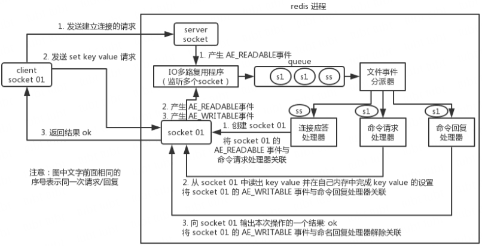

要明白，通信是通过 socket 来完成的，不懂的同学可以先去看一看 socket 网络编程。

首先，Redis 服务端进程初始化的时候，会将 server socket 的 `AE_READABLE` 事件与连接应答处理器关联。

客户端 socket01 向 Redis 进程的 server socket 请求建立连接，此时 server socket 会产生一个 `AE_READABLE` 事件，IO 多路复用程序监听到 server socket 产生的事件后，将该 socket 压入队列中。文件事件分派器从队列中获取 socket，交给连接应答处理器。连接应答处理器会创建一个能与客户端通信的 socket01，并将该 socket01 的 `AE_READABLE` 事件与命令请求处理器关联。

假设此时客户端发送了一个 set key value 请求，此时 Redis 中的 socket01 会产生 `AE_READABLE` 事件，IO 多路复用程序将 socket01 压入队列，此时事件分派器从队列中获取到 socket01 产生的 `AE_READABLE` 事件，由于前面 socket01 的 `AE_READABLE` 事件已经与命令请求处理器关联，因此事件分派器将事件交给命令请求处理器来处理。命令请求处理器读取 socket01 的 key value 并在自己内存中完成 key value 的设置。操作完成后，它会将 socket01 的 `AE_WRITABLE` 事件与命令回复处理器关联。

如果此时客户端准备好接收返回结果了，那么 Redis 中的 socket01 会产生一个 `AE_WRITABLE` 事件，同样压入队列中，事件分派器找到相关联的命令回复处理器，由命令回复处理器对 socket01 输入本次操作的一个结果，比如 ok，之后解除 socket01 的 `AE_WRITABLE` 事件与命令回复处理器的关联。

这样便完成了一次通信。关于 Redis 的一次通信过程，推荐读者阅读 [Redis 设计与实现——黄健宏](https://github.com/doocs/technical-books#database) 进行系统学习。

#### 为啥 Redis 单线程模型也能效率这么高？

- 纯内存操作。
- 核心是基于非阻塞的 IO 多路复用机制。
- C 语言实现，一般来说，C 语言实现的程序距离操作系统更近，执行速度相对会更快。
- 单线程反而避免了多线程的频繁上下文切换问题，预防了多线程可能产生的竞争问题。

#### Redis 6.0 开始引入多线程

注意！Redis 6.0 之后的版本抛弃了单线程模型这一设计，原本使用单线程运行的 Redis 也开始选择性地使用多线程模型。

前面还在强调 Redis 单线程模型的高效性，现在为什么又要引入多线程？这其实说明 Redis 在有些方面，单线程已经不具有优势了。因为读写网络的 Read/Write 系统调用在 Redis 执行期间占用了大部分 CPU 时间，如果把网络读写做成多线程的方式对性能会有很大提升。

Redis 的多线程部分只是用来处理网络数据的读写和协议解析，执行命令仍然是单线程。之所以这么设计是不想 Redis 因为多线程而变得复杂，需要去控制 key、lua、事务、LPUSH/LPOP 等等的并发问题。

#### 总结

Redis 选择使用单线程模型处理客户端的请求主要还是因为 CPU 不是 Redis 服务器的瓶颈，所以使用多线程模型带来的性能提升并不能抵消它带来的开发成本和维护成本，系统的性能瓶颈也主要在网络 I/O 操作上；而 Redis 引入多线程操作也是出于性能上的考虑，对于一些大键值对的删除操作，通过多线程非阻塞地释放内存空间(释放操作不会阻塞网络 IO 读写,因为网络 IO 读写与释放的命令执行不是同一个线程)也能减少对 Redis 主线程阻塞的时间，提高执行的效率。

### Redis 都有哪些数据类型及适用场景？

Redis 主要有以下几种数据类型：

- Strings
- Hashes
- Lists
- Sets
- Sorted Sets

> Redis 除了这 5 种数据类型之外，还有 Bitmaps、HyperLogLogs、Streams 等。

#### Strings

这是最简单的类型，就是普通的 set 和 get，做简单的 KV 缓存。

```bash
set college szu
```

#### Hashes

这个是类似 map 的一种结构，这个一般就是可以将结构化的数据，比如一个对象（前提是这个对象没嵌套其他的对象）给缓存在 Redis 里，然后每次读写缓存的时候，可以就操作 hash 里的某个字段。

```bash
hset person name bingo
hset person age 20
hset person id 1
hget person name
```

```json
(person = {
   "name": "bingo",
   "age": 20,
   "id": 1
})
```

#### Lists

Lists 是有序列表，这个可以玩儿出很多花样。

比如可以通过 list 存储一些列表型的数据结构，类似粉丝列表、文章的评论列表之类的东西。

比如可以通过 lrange 命令，读取某个闭区间内的元素，可以基于 list 实现分页查询，这个是很棒的一个功能，基于 Redis 实现简单的高性能分页，可以做类似微博那种下拉不断分页的东西，性能高，就一页一页走。

```bash
# 0 开始位置，-1 结束位置，结束位置为 -1 时，表示列表的最后一个位置，即查看所有。
lrange mylist 0 -1
```

比如可以搞个简单的消息队列，从 list 头怼进去，从 list 尾巴那里弄出来。

```bash
lpush mylist 1
lpush mylist 2
lpush mylist 3 4 5

# 1
rpop mylist
```

#### Sets

Sets 是无序集合，自动去重。

直接基于 set 将系统里需要去重的数据扔进去，自动就给去重了，如果你需要对一些数据进行快速的全局去重，你当然也可以基于 jvm 内存里的 HashSet 进行去重，但是如果你的某个系统部署在多台机器上呢？得基于 Redis 进行全局的 set 去重。

可以基于 set 玩儿交集、并集、差集的操作，比如交集吧，可以把两个人的粉丝列表整一个交集，看看俩人的共同好友是谁？对吧。

把两个大 V 的粉丝都放在两个 set 中，对两个 set 做交集。

```bash
#-------操作一个 set-------
# 添加元素
sadd mySet 1

# 查看全部元素
smembers mySet

# 判断是否包含某个值
sismember mySet 3

# 删除某些元素
srem mySet 1
srem mySet 2 4

# 查看元素个数
scard mySet

# 随机删除一个元素
spop mySet

#-------操作多个 set-------
# 将一个 set 的元素移动到另外一个 set
smove yourSet mySet 2

# 求两 set 的交集
sinter yourSet mySet

# 求两 set 的并集
sunion yourSet mySet

# 求在 yourSet 中而不在 mySet 中的元素
sdiff yourSet mySet
```

#### Sorted Sets

Sorted Sets 是排序的 set，去重但可以排序，写进去的时候给一个分数，自动根据分数排序。

```bash
zadd board 85 zhangsan
zadd board 72 lisi
zadd board 96 wangwu
zadd board 63 zhaoliu

# 获取排名前三的用户（默认是升序，所以需要 rev 改为降序）
zrevrange board 0 3

# 获取某用户的排名
zrank board zhaoliu
```

### Redis 的过期策略都有哪些？

#### Redis 过期策略

Redis 过期策略是：定期删除 + 惰性删除。

所谓定期删除，指的是 Redis 默认是每隔 100ms 就随机抽取一些设置了过期时间的 key，检查其是否过期，如果过期就删除。

假设 Redis 里放了 10w 个 key，都设置了过期时间，你每隔几百毫秒，就检查 10w 个 key，那 Redis 基本上就死了，cpu 负载会很高的，消耗在你的检查过期 key 上了。注意，这里可不是每隔 100ms 就遍历所有的设置过期时间的 key，那样就是一场性能上的灾难。实际上 Redis 是每隔 100ms 随机抽取一些 key 来检查和删除的。

但是问题是，定期删除可能会导致很多过期 key 到了时间并没有被删除掉，那咋整呢？所以就是惰性删除了。这就是说，在你获取某个 key 的时候，Redis 会检查一下，这个 key 如果设置了过期时间那么是否过期了？如果过期了此时就会删除，不会给你返回任何东西。

> 获取 key 的时候，如果此时 key 已经过期，就删除，不会返回任何东西。

但是实际上这还是有问题的，如果定期删除漏掉了很多过期 key，然后你也没及时去查，也就没走惰性删除，此时会怎么样？如果大量过期 key 堆积在内存里，导致 Redis 内存块耗尽了，咋整？

答案是：走内存淘汰机制。

#### 内存淘汰机制

Redis 内存淘汰机制有以下几个：

- noeviction: 当内存不足以容纳新写入数据时，新写入操作会报错，这个一般没人用吧，实在是太恶心了。
- allkeys-lru：当内存不足以容纳新写入数据时，在键空间中，移除最近最少使用的 key（这个是最常用的）。
- allkeys-random：当内存不足以容纳新写入数据时，在键空间中，随机移除某个 key，这个一般没人用吧，为啥要随机，肯定是把最近最少使用的 key 给干掉啊。
- volatile-lru：当内存不足以容纳新写入数据时，在设置了过期时间的键空间中，移除最近最少使用的 key（这个一般不太合适）。
- volatile-random：当内存不足以容纳新写入数据时，在设置了过期时间的键空间中，随机移除某个 key。
- volatile-ttl：当内存不足以容纳新写入数据时，在设置了过期时间的键空间中，有更早过期时间的 key 优先移除。

#### 手写一个 LRU 算法

LRU 就是 Least Recently Used 的缩写，翻译过来就是“最近最少使用”。也就是说 LRU 算法会将最近最少用的缓存移除，让给最新使用的缓存。而往往最常读取的，也就是读取次数最多的，所以利用好 LRU 算法，我们能够提供对热点数据的缓存效率，能够提高缓存服务的内存使用率。

不求自己纯手工从底层开始打造出自己的 LRU，但是起码要知道如何利用已有的 JDK 数据结构实现一个 Java 版的 LRU。

```java
public class LRUCache<K, V> extends LinkedHashMap<K, V> {
    private int capacity;

    /**
     * 传递进来最多能缓存多少数据
     *
     * @param capacity 缓存大小
     */
    public LRUCache(int capacity) {
        super(capacity, 0.75f, true);
        this.capacity = capacity;
    }

    /**
     * 如果 map 中的数据量大于设定的最大容量，返回 true，在新加入对象时删除最老的数据
     *
     * @param eldest 最老的数据项
     * @return true 则移除最老的数据
     */
    @Override
    protected boolean removeEldestEntry(Map.Entry<K, V> eldest) {
        // 当 map 中的数据量大于指定的缓存个数的时候，自动移除最老的数据
        return size() > capacity;
    }
}
```

### 如何保证 redis 的高并发和高可用？

redis 实现高并发主要依靠主从架构，一主多从，一般来说，很多项目其实就足够了，单主用来写入数据，单机几万 QPS，多从用来查询数据，多个从实例可以提供每秒 10w 的 QPS。

如果想要在实现高并发的同时，容纳大量的数据，那么就需要 redis 集群，使用 redis 集群之后，可以提供每秒几十万的读写并发。

redis 高可用，如果是做主从架构部署，那么加上哨兵就可以了，就可以实现任何一个实例宕机就进行主备切换。

### Redis 主从架构是怎样的？

单机的 Redis，能够承载的 QPS 大概就在上万到几万不等。对于缓存来说，一般都是用来支撑读高并发的。因此架构做成主从（master-slave）架构，一主多从，主负责写，并且将数据复制到其它的 slave 节点，从节点负责读。所有的读请求全部走从节点。这样也可以很轻松实现水平扩容，支撑读高并发。

Redis replication -> 主从架构 -> 读写分离 -> 水平扩容支撑读高并发

#### Redis replication 的核心机制

- Redis 采用异步方式复制数据到 slave 节点，不过 Redis2.8 开始，slave node 会周期性地确认自己每次复制的数据量；
- 一个 master node 是可以配置多个 slave node 的；
- slave node 也可以连接其他的 slave node；
- slave node 做复制的时候，不会 block master node 的正常工作；
- slave node 在做复制的时候，也不会 block 对自己的查询操作，它会用旧的数据集来提供服务；但是复制完成的时候，需要删除旧数据集，加载新数据集，这个时候就会暂停对外服务了；
- slave node 主要用来进行横向扩容，做读写分离，扩容的 slave node 可以提高读的吞吐量。

注意，如果采用了主从架构，那么建议必须开启 master node 的持久化，不建议用 slave node 作为 master node 的数据热备，因为那样的话，如果你关掉 master 的持久化，可能在 master 宕机重启的时候数据是空的，然后可能一经过复制，slave node 的数据也丢了。

另外，master 的各种备份方案，也需要做。万一本地的所有文件丢失了，从备份中挑选一份 rdb 去恢复 master，这样才能确保启动的时候，是有数据的，即使采用了后续讲解的高可用机制，slave node 可以自动接管 master node，但也可能 sentinel 还没检测到 master failure，master node 就自动重启了，还是可能导致上面所有的 slave node 数据被清空。

#### Redis 主从复制的核心原理

当启动一个 slave node 的时候，它会发送一个 PSYNC 命令给 master node。

如果这是 slave node 初次连接到 master node，那么会触发一次 full resynchronization 全量复制。此时 master 会启动一个后台线程，开始生成一份 RDB 快照文件，同时还会将从客户端 client 新收到的所有写命令缓存在内存中。RDB 文件生成完毕后，master 会将这个 RDB 发送给 slave，slave 会先写入本地磁盘，然后再从本地磁盘加载到内存中，接着 master 会将内存中缓存的写命令发送到 slave，slave 也会同步这些数据。slave node 如果跟 master node 有网络故障，断开了连接，会自动重连，连接之后 master node 仅会复制给 slave 部分缺少的数据。

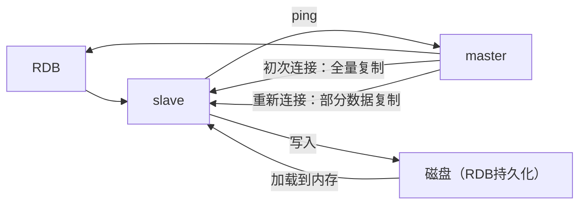

##### 主从复制的断点续传

从 Redis2.8 开始，就支持主从复制的断点续传，如果主从复制过程中，网络连接断掉了，那么可以接着上次复制的地方，继续复制下去，而不是从头开始复制一份。

master node 会在内存中维护一个 backlog，master 和 slave 都会保存一个 replica offset 还有一个 master run id，offset 就是保存在 backlog 中的。如果 master 和 slave 网络连接断掉了，slave 会让 master 从上次 replica offset 开始继续复制，如果没有找到对应的 offset，那么就会执行一次 resynchronization。

> 如果根据 host + ip 定位 master node，是不靠谱的，如果 master node 重启或者数据出现了变化，那么 slave node 应该根据不同的 run id 区分。

##### 无磁盘化复制

master 在内存中直接创建 RDB，然后发送给 slave，不会在自己本地落地磁盘了。只需要在配置文件中开启 repl-diskless-sync yes 即可。

```bash
repl-diskless-sync yes

# 等待 5s 后再开始复制，因为要等更多 slave 重新连接过来
repl-diskless-sync-delay 5
```

##### 过期 key 处理

slave 不会过期 key，只会等待 master 过期 key。如果 master 过期了一个 key，或者通过 LRU 淘汰了一个 key，那么会模拟一条 del 命令发送给 slave。

#### 复制的完整流程

slave node 启动时，会在自己本地保存 master node 的信息，包括 master node 的 host 和 ip，但是复制流程没开始。

slave node 内部有个定时任务，每秒检查是否有新的 master node 要连接和复制，如果发现，就跟 master node 建立 socket 网络连接。然后 slave node 发送 ping 命令给 master node。如果 master 设置了 requirepass，那么 slave node 必须发送 masterauth 的口令过去进行认证。master node 第一次执行全量复制，将所有数据发给 slave node。而在后续，master node 持续将写命令，异步复制给 slave node。

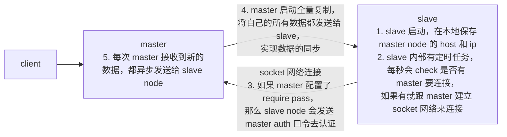

##### 全量复制

- master 执行 bgsave，在本地生成一份 rdb 快照文件。
- master node 将 rdb 快照文件发送给 slave node，如果 rdb 复制时间超过 60 秒（repl-timeout），那么 slave node 就会认为复制失败，可以适当调大这个参数（对于千兆网卡的机器，一般每秒传输 100MB，6G 文件，很可能超过 60s）
- master node 在生成 rdb 时，会将所有新的写命令缓存在内存中，在 slave node 保存了 rdb 之后，再将新的写命令复制给 slave node。
- 如果在复制期间，内存缓冲区持续消耗超过 64MB，或者一次性超过 256MB，那么停止复制，复制失败。

   ```bash
   client-output-buffer-limit slave 256MB 64MB 60
   ```

- slave node 接收到 rdb 之后，清空自己的旧数据，然后重新加载 rdb 到自己的内存中。注意，在清空旧数据之前，slave node 依然会基于旧的数据版本对外提供服务。
- 如果 slave node 开启了 AOF，那么会立即执行 BGREWRITEAOF，重写 AOF。

##### 增量复制

- 如果全量复制过程中，master-slave 网络连接断掉，那么 slave 重新连接 master 时，会触发增量复制。
- master 直接从自己的 backlog 中获取部分丢失的数据，发送给 slave node，默认 backlog 就是 1MB。
- master 就是根据 slave 发送的 psync 中的 offset 来从 backlog 中获取数据的。

##### heartbeat

主从节点互相都会发送 heartbeat 信息。

master 默认每隔 10 秒发送一次 heartbeat，slave node 每隔 1 秒发送一个 heartbeat。

##### 异步复制

master 每次接收到写命令之后，先在内部写入数据，然后异步发送给 slave node。

#### Redis 如何才能做到高可用

如果系统在 365 天内，有 99.99% 的时间，都是可以对外提供服务的，那么就说系统是高可用的。

一个 slave 挂掉了，是不会影响可用性的，还有其它的 slave 在提供相同数据下的相同的对外的查询服务。

但是，如果 master node 死掉了，会怎么样？没法写数据了，写缓存的时候，全部失效了。slave node 还有什么用呢，没有 master 给它们复制数据了，系统相当于不可用了。

Redis 的高可用架构，叫做 failover 故障转移，也可以叫做主备切换。

master node 在故障时自动检测，并且将某个 slave node 自动切换为 master node 的过程，叫做主备切换。这个过程，实现了 Redis 的主从架构下的高可用。

### Redis 的持久化有哪几种方式？

持久化主要是做灾难恢复、数据恢复，也可以归类到高可用的一个环节中去，比如 Redis 整个挂了，然后 Redis 就不可用了，你要做的事情就是让 Redis 变得可用，尽快变得可用。

重启 Redis，尽快让它对外提供服务，如果没做数据备份，这时候 Redis 启动了，也不可用啊，数据都没了。

很可能说，大量的请求过来，缓存全部无法命中，在 Redis 里根本找不到数据，这个时候就死定了，出现缓存雪崩问题。所有请求没有在 Redis 命中，就会去 mysql 数据库这种数据源头中去找，一下子 mysql 承接高并发，然后就挂了。

如果你把 Redis 持久化做好，备份和恢复方案做到企业级的程度，那么即使你的 Redis 故障了，也可以通过备份数据，快速恢复，一旦恢复立即对外提供服务。

#### Redis 持久化的两种方式

- RDB：RDB 持久化机制，是对 Redis 中的数据执行周期性的持久化。
- AOF：AOF 机制对每条写入命令作为日志，以 append-only 的模式写入一个日志文件中，在 Redis 重启的时候，可以通过回放 AOF 日志中的写入指令来重新构建整个数据集。

通过 RDB 或 AOF，都可以将 Redis 内存中的数据给持久化到磁盘上面来，然后可以将这些数据备份到别的地方去，比如说阿里云等云服务。

如果 Redis 挂了，服务器上的内存和磁盘上的数据都丢了，可以从云服务上拷贝回来之前的数据，放到指定的目录中，然后重新启动 Redis，Redis 就会自动根据持久化数据文件中的数据，去恢复内存中的数据，继续对外提供服务。

如果同时使用 RDB 和 AOF 两种持久化机制，那么在 Redis 重启的时候，会使用 AOF 来重新构建数据，因为 AOF 中的数据更加完整。

##### RDB 优缺点

- RDB 会生成多个数据文件，每个数据文件都代表了某一个时刻中 Redis 的数据，这种多个数据文件的方式，非常适合做冷备，可以将这种完整的数据文件发送到一些远程的安全存储上去，比如说 Amazon 的 S3 云服务上去，在国内可以是阿里云的 ODPS 分布式存储上，以预定好的备份策略来定期备份 Redis 中的数据。
- RDB 对 Redis 对外提供的读写服务，影响非常小，可以让 Redis 保持高性能，因为 Redis 主进程只需要 fork 一个子进程，让子进程执行磁盘 IO 操作来进行 RDB 持久化即可。
- 相对于 AOF 持久化机制来说，直接基于 RDB 数据文件来重启和恢复 Redis 进程，更加快速。
- 如果想要在 Redis 故障时，尽可能少的丢失数据，那么 RDB 没有 AOF 好。一般来说，RDB 数据快照文件，都是每隔 5 分钟，或者更长时间生成一次，这个时候就得接受一旦 Redis 进程宕机，那么会丢失最近 5 分钟（甚至更长时间）的数据。
- RDB 每次在 fork 子进程来执行 RDB 快照数据文件生成的时候，如果数据文件特别大，可能会导致对客户端提供的服务暂停数毫秒，或者甚至数秒。

##### AOF 优缺点

- AOF 可以更好的保护数据不丢失，一般 AOF 会每隔 1 秒，通过一个后台线程执行一次 fsync 操作，最多丢失 1 秒钟的数据。
- AOF 日志文件以 append-only 模式写入，所以没有任何磁盘寻址的开销，写入性能非常高，而且文件不容易破损，即使文件尾部破损，也很容易修复。
- AOF 日志文件即使过大的时候，出现后台重写操作，也不会影响客户端的读写。因为在 rewrite log 的时候，会对其中的指令进行压缩，创建出一份需要恢复数据的最小日志出来。在创建新日志文件的时候，老的日志文件还是照常写入。当新的 merge 后的日志文件 ready 的时候，再交换新老日志文件即可。
- AOF 日志文件的命令通过可读较强的方式进行记录，这个特性非常适合做灾难性的误删除的紧急恢复。比如某人不小心用 flushall 命令清空了所有数据，只要这个时候后台 rewrite 还没有发生，那么就可以立即拷贝 AOF 文件，将最后一条 flushall 命令给删了，然后再将该 AOF 文件放回去，就可以通过恢复机制，自动恢复所有数据。
- 对于同一份数据来说，AOF 日志文件通常比 RDB 数据快照文件更大。
- AOF 开启后，支持的写 QPS 会比 RDB 支持的写 QPS 低，因为 AOF 一般会配置成每秒 fsync 一次日志文件，当然，每秒一次 fsync，性能也还是很高的（如果实时写入，那么 QPS 会大降，Redis 性能会大大降低）
- 以前 AOF 发生过 bug，就是通过 AOF 记录的日志，进行数据恢复的时候，没有恢复一模一样的数据出来。所以说，类似 AOF 这种较为复杂的基于命令日志 merge 回放的方式，比基于 RDB 每次持久化一份完整的数据快照文件的方式，更加脆弱一些，容易有 bug。不过 AOF 就是为了避免 rewrite 过程导致的 bug，因此每次 rewrite 并不是基于旧的指令日志进行 merge 的，而是基于当时内存中的数据进行指令的重新构建，这样健壮性会好很多。

#### RDB 和 AOF 到底该如何选择

- 不要仅仅使用 RDB，因为那样会导致你丢失很多数据；
- 也不要仅仅使用 AOF，因为那样有两个问题：第一，你通过 AOF 做冷备，没有 RDB 做冷备来的恢复速度更快；第二，RDB 每次简单粗暴生成数据快照，更加健壮，可以避免 AOF 这种复杂的备份和恢复机制的 bug；
- Redis 支持同时开启两种持久化方式，我们可以综合使用 AOF 和 RDB 两种持久化机制，用 AOF 来保证数据不丢失，作为数据恢复的第一选择；用 RDB 来做不同程度的冷备，在 AOF 文件都丢失或损坏不可用的时候，还可以使用 RDB 来进行快速的数据恢复。

### Redis 哨兵集群如何实现高可用？

### Redis 集群模式的工作原理能说一下么？

### Redis 的雪崩、穿透和击穿，如何应对？

#### 缓存雪崩(Cache Avalanche)

对于系统 A，假设每天高峰期每秒 5000 个请求，本来缓存在高峰期可以扛住每秒 4000 个请求，但是缓存机器意外发生了全盘宕机。缓存挂了，此时 1 秒 5000 个请求全部落数据库，数据库必然扛不住，它会报一下警，然后就挂了。此时，如果没有采用什么特别的方案来处理这个故障，DBA 很着急，重启数据库，但是数据库立马又被新的流量给打死了。

这就是缓存雪崩。

大约在 3 年前，国内比较知名的一个互联网公司，曾因为缓存事故，导致雪崩，后台系统全部崩溃，事故从当天下午持续到晚上凌晨 3~4 点，公司损失了几千万。

缓存雪崩的事前事中事后的解决方案如下：

- 事前：Redis 高可用，主从 + 哨兵，Redis cluster，避免全盘崩溃。
- 事中：本地 ehcache 缓存 + hystrix 限流 & 降级，避免 MySQL 被打死。
- 事后：Redis 持久化，一旦重启，自动从磁盘上加载数据，快速恢复缓存数据。

用户发送一个请求，系统 A 收到请求后，先查本地 ehcache 缓存，如果没查到再查 Redis。如果 ehcache 和 Redis 都没有，再查数据库，将数据库中的结果，写入 ehcache 和 Redis 中。

限流组件，可以设置每秒的请求，有多少能通过组件，剩余的未通过的请求，怎么办？走降级！可以返回一些默认的值，或者友情提示，或者空值。

好处：

- 数据库绝对不会死，限流组件确保了每秒只有多少个请求能通过。
- 只要数据库不死，就是说，对用户来说，2/5 的请求都是可以被处理的。
- 只要有 2/5 的请求可以被处理，就意味着你的系统没死，对用户来说，可能就是点击几次刷不出来页面，但是多点几次，就可以刷出来了。

#### 缓存穿透(Cache Penetration)

对于系统 A，假设一秒 5000 个请求，结果其中 4000 个请求是黑客发出的恶意攻击。

黑客发出的那 4000 个攻击，缓存中查不到，每次你去数据库里查，也查不到。

举个栗子。数据库 id 是从 1 开始的，结果黑客发过来的请求 id 全部都是负数。这样的话，缓存中不会有，请求每次都“视缓存于无物”，直接查询数据库。这种恶意攻击场景的缓存穿透就会直接把数据库给打死。

解决方式很简单，每次系统 A 从数据库中只要没查到，就写一个空值到缓存里去，比如 set -999 UNKNOWN。然后设置一个过期时间，这样的话，下次有相同的 key 来访问的时候，在缓存失效之前，都可以直接从缓存中取数据。

当然，如果黑客如果每次使用不同的负数 id 来攻击，写空值的方法可能就不奏效了。更为常见的做法是在缓存之前增加布隆过滤器，将数据库中所有可能的数据哈希映射到布隆过滤器中。然后对每个请求进行如下判断：

- 请求数据的 key 不存在于布隆过滤器中，可以确定数据就一定不会存在于数据库中，系统可以立即返回不存在。
- 请求数据的 key 存在于布隆过滤器中，则继续再向缓存中查询。使用布隆过滤器能够对访问的请求起到了一定的初筛作用，避免了因数据不存在引起的查询压力。

#### 缓存击穿(Hotspot Invalid)

缓存击穿，就是说某个 key 非常热点，访问非常频繁，处于集中式高并发访问的情况，当这个 key 在失效的瞬间，大量的请求就击穿了缓存，直接请求数据库，就像是在一道屏障上凿开了一个洞。

不同场景下的解决方式如下：

- 若缓存的数据是基本不会发生更新的，则可尝试将该热点数据设置为永不过期。
- 若缓存的数据更新不频繁，且缓存刷新的整个流程耗时较少的情况下，则可以采用基于 Redis、zookeeper 等分布式中间件的分布式互斥锁，或者本地互斥锁以保证仅少量的请求能请求数据库并重新构建缓存，其余线程则在锁释放后能访问到新缓存。
- 若缓存的数据更新频繁或者在缓存刷新的流程耗时较长的情况下，可以利用定时线程在缓存过期前主动地重新构建缓存或者延后缓存的过期时间，以保证所有的请求能一直访问到对应的缓存。

### 如何保证缓存与数据库的双写一致性？

一般来说，如果允许缓存可以稍微的跟数据库偶尔有不一致的情况，也就是说如果你的系统不是严格要求 “缓存 + 数据库” 必须保持一致性的话，最好不要做这个方案，即：读请求和写请求串行化，串到一个内存队列里去。

串行化可以保证一定不会出现不一致的情况，但是它也会导致系统的吞吐量大幅度降低，用比正常情况下多几倍的机器去支撑线上的一个请求。

#### Cache Aside Pattern

最经典的缓存 + 数据库读写的模式，就是 Cache Aside Pattern。

- 读的时候，先读缓存，缓存没有的话，就读数据库，然后取出数据后放入缓存，同时返回响应。
- 更新的时候，先更新数据库，然后再删除缓存。

为什么是删除缓存，而不是更新缓存？

原因很简单，很多时候，在复杂点的缓存场景，缓存不单单是数据库中直接取出来的值。

比如可能更新了某个表的一个字段，然后其对应的缓存，是需要查询另外两个表的数据并进行运算，才能计算出缓存最新的值的。

另外更新缓存的代价有时候是很高的。是不是说，每次修改数据库的时候，都一定要将其对应的缓存更新一份？也许有的场景是这样，但是对于比较复杂的缓存数据计算的场景，就不是这样了。如果你频繁修改一个缓存涉及的多个表，缓存也频繁更新。但是问题在于，这个缓存到底会不会被频繁访问到？

举个栗子，一个缓存涉及的表的字段，在 1 分钟内就修改了 20 次，或者是 100 次，那么缓存更新 20 次、100 次；但是这个缓存在 1 分钟内只被读取了 1 次，有大量的冷数据。实际上，如果你只是删除缓存的话，那么在 1 分钟内，这个缓存不过就重新计算一次而已，开销大幅度降低。用到缓存才去算缓存。

其实删除缓存，而不是更新缓存，就是一个 lazy 计算的思想，不要每次都重新做复杂的计算，不管它会不会用到，而是让它到需要被使用的时候再重新计算。像 mybatis，hibernate，都有懒加载思想。查询一个部门，部门带了一个员工的 list，没有必要说每次查询部门，都把里面的 1000 个员工的数据也同时查出来啊。80% 的情况，查这个部门，就只是要访问这个部门的信息就可以了。先查部门，同时要访问里面的员工，那么这个时候只有在你要访问里面的员工的时候，才会去数据库里面查询 1000 个员工。

#### 最初级的缓存不一致问题及解决方案

问题：先更新数据库，再删除缓存。如果删除缓存失败了，那么会导致数据库中是新数据，缓存中是旧数据，数据就出现了不一致。

1. 先删除缓存，再更新数据库。如果数据库更新失败了，那么数据库中是旧数据，缓存中是空的，那么数据不会不一致。因为读的时候缓存没有，所以去读了数据库中的旧数据，然后更新到缓存中。
2. 延时双删。依旧是先更新数据库，再删除缓存，唯一不同的是，我们把这个删除的动作，在不久之后再执行一次，比如 5s 之后。

   ```java
   public void set(key, value) {
      putToDb(key, value);
      deleteFromRedis(key);

      // ... a few seconds later
      deleteFromRedis(key);
   }
   ```

删除的动作，可以有多种选择，比如：

1. 使用 DelayQueue，会随着 JVM 进程的死亡，丢失更新的风险；
2. 放在 MQ，但编码复杂度增加。

总之，我们需要综合各种因素去做设计，选择一个最合理的解决方案。

#### 比较复杂的数据不一致问题分析

数据发生了变更，先删除了缓存，然后要去修改数据库，此时还没修改。一个请求过来，去读缓存，发现缓存空了，去查询数据库，查到了修改前的旧数据，放到了缓存中。随后数据变更的程序完成了数据库的修改。完了，数据库和缓存中的数据不一样了...

为什么上亿流量高并发场景下，缓存会出现这个问题？

只有在对一个数据并发的进行读写的时候，才可能会出现这种问题。其实如果说你的并发量很低的话，特别是读并发很低，每天访问量就 1 万次，那么很少的情况下，不会出现刚才描述的那种不一致的场景。但是问题是，如果每天的是上亿的流量，每秒并发读是几万，每秒只要有数据更新的请求，就可能会出现上述的数据库 + 缓存不一致的情况。

解决方案如下：

更新数据的时候，根据数据的唯一标识，将操作路由之后，发送到一个 jvm 内部队列中。读取数据的时候，如果发现数据不在缓存中，那么将重新执行“读取数据 + 更新缓存”的操作，根据唯一标识路由之后，也发送到同一个 jvm 内部队列中。

一个队列对应一个工作线程，每个工作线程串行拿到对应的操作，然后一条一条的执行。这样的话，一个数据变更的操作，先删除缓存，然后再去更新数据库，但是还没完成更新。此时如果一个读请求过来，没有读到缓存，那么可以先将缓存更新的请求发送到队列中，此时会在队列中积压，然后同步等待缓存更新完成。

这里有一个优化点，一个队列中，其实多个更新缓存请求串在一起是没意义的，因此可以做过滤，如果发现队列中已经有一个更新缓存的请求了，那么就不用再放个更新请求操作进去了，直接等待前面的更新操作请求完成即可。

待那个队列对应的工作线程完成了上一个操作的数据库的修改之后，才会去执行下一个操作，也就是缓存更新的操作，此时会从数据库中读取最新的值，然后写入缓存中。

如果请求还在等待时间范围内，不断轮询发现可以取到值了，那么就直接返回；如果请求等待的时间超过一定时长，那么这一次直接从数据库中读取当前的旧值。

高并发的场景下，该解决方案要注意的问题：

- 读请求长时阻塞

   由于读请求进行了非常轻度的异步化，所以一定要注意读超时的问题，每个读请求必须在超时时间范围内返回。

   该解决方案，最大的风险点在于说，可能数据更新很频繁，导致队列中积压了大量更新操作在里面，然后读请求会发生大量的超时，最后导致大量的请求直接走数据库。务必通过一些模拟真实的测试，看看更新数据的频率是怎样的。

   另外一点，因为一个队列中，可能会积压针对多个数据项的更新操作，因此需要根据自己的业务情况进行测试，可能需要部署多个服务，每个服务分摊一些数据的更新操作。如果一个内存队列里会挤压 100 个商品的库存修改操作，每个库存修改操作要耗费 10ms 去完成，那么最后一个商品的读请求，可能等待 `10 * 100 = 1000ms = 1s` 后，才能得到数据，这个时候就导致读请求的长时阻塞。

   一定要根据实际业务系统的运行情况，去进行一些压力测试，和模拟线上环境，去看看最繁忙的时候，内存队列可能会挤压多少更新操作，可能会导致最后一个更新操作对应的读请求，会 hang 多少时间，如果读请求在 200ms 返回，如果你计算过后，哪怕是最繁忙的时候，积压 10 个更新操作，最多等待 200ms，那还可以的。

   如果一个内存队列中可能积压的更新操作特别多，那么你就要加机器，让每个机器上部署的服务实例处理更少的数据，那么每个内存队列中积压的更新操作就会越少。

   其实根据之前的项目经验，一般来说，数据的写频率是很低的，因此实际上正常来说，在队列中积压的更新操作应该是很少的。像这种针对读高并发、读缓存架构的项目，一般来说写请求是非常少的，每秒的 QPS 能到几百就不错了。

   我们来实际粗略测算一下。

   如果一秒有 500 的写操作，如果分成 5 个时间片，每 200ms 就 100 个写操作，放到 20 个内存队列中，每个内存队列，可能就积压 5 个写操作。每个写操作性能测试后，一般是在 20ms 左右就完成，那么针对每个内存队列的数据的读请求，也就最多 hang 一会儿，200ms 以内肯定能返回了。

   经过刚才简单的测算，我们知道，单机支撑的写 QPS 在几百是没问题的，如果写 QPS 扩大了 10 倍，那么就扩容机器，扩容 10 倍的机器，每个机器 20 个队列。

- 读请求并发量过高

   这里还必须做好压力测试，确保恰巧碰上上述情况的时候，还有一个风险，就是突然间大量读请求会在几十毫秒的延时 hang 在服务上，看服务能不能扛的住，需要多少机器才能扛住最大的极限情况的峰值。

   但是因为并不是所有的数据都在同一时间更新，缓存也不会同一时间失效，所以每次可能也就是少数数据的缓存失效了，然后那些数据对应的读请求过来，并发量应该也不会特别大。

- 多服务实例部署的请求路由

   可能这个服务部署了多个实例，那么必须保证说，执行数据更新操作，以及执行缓存更新操作的请求，都通过 Nginx 服务器路由到相同的服务实例上。

   比如说，对同一个商品的读写请求，全部路由到同一台机器上。可以自己去做服务间的按照某个请求参数的 hash 路由，也可以用 Nginx 的 hash 路由功能等等。

- 热点商品的路由问题，导致请求的倾斜

   万一某个商品的读写请求特别高，全部打到相同机器的相同队列里面去了，可能会造成某台机器的压力过大。就是说，因为只有在商品数据更新的时候才会清空缓存，然后才会导致读写并发，所以其实要根据业务系统去看，如果更新频率不是太高的话，这个问题的影响并不是特别大，但是的确可能某些机器的负载会高一些。

### 如何解决 Redis 的并发竞争问题？

多客户端同时并发写一个 key，可能本来应该先到的数据后到了，导致数据版本错了；或者是多客户端同时获取一个 key，修改值之后再写回去，只要顺序错了，数据就错了。

而且 Redis 自己就有天然解决这个问题的 CAS 类的乐观锁方案。

1. 某个时刻，多个系统实例都去更新某个 key。可以基于 zookeeper 实现分布式锁。每个系统通过 zookeeper 获取分布式锁，确保同一时间，只能有一个系统实例在操作某个 key，别人都不允许读和写。
2. 你要写入缓存的数据，都是从 mysql 里查出来的，都得写入 mysql 中，写入 mysql 中的时候必须保存一个时间戳，从 mysql 查出来的时候，时间戳也查出来。

   每次要写之前，先判断一下当前这个 value 的时间戳是否比缓存里的 value 的时间戳要新。如果是的话，那么可以写，否则，就不能用旧的数据覆盖新的数据。

### 生产环境中的 Redis 是怎么部署的？

Redis cluster，10 台机器，5 台机器部署了 Redis 主实例，另外 5 台机器部署了 Redis 的从实例，每个主实例挂了一个从实例，5 个节点对外提供读写服务，每个节点的读写高峰 QPS 可以达到每秒 5 万，5 台机器最多是 25 万读写请求每秒。

机器是什么配置？

32G 内存 + 8 核 CPU + 1T 磁盘，但是分配给 Redis 进程的是 10g 内存，一般线上生产环境，Redis 的内存尽量不要超过 10g，超过 10g 可能会有问题。

5 台机器对外提供读写，一共有 50g 内存。

因为每个主实例都挂了一个从实例，所以是高可用的，任何一个主实例宕机，都会自动故障迁移，Redis 从实例会自动变成主实例继续提供读写服务。

你往内存里写的是什么数据？每条数据的大小是多少？

商品数据，每条数据是 10kb。100 条数据是 1mb，10 万条数据是 1g。常驻内存的是 200 万条商品数据，占用内存是 20g，仅仅不到总内存的 50%。目前高峰期每秒就是 3500 左右的请求量。

其实大型的公司，会有基础架构的 team 负责缓存集群的运维。

## 分库分表

### 为什么要分库分表？

说白了，分库分表是两回事儿，大家可别搞混了，可能是光分库不分表，也可能是光分表不分库，都有可能。

我先给大家抛出来一个场景。

假如我们现在是一个小创业公司（或者是一个 BAT 公司刚兴起的一个新部门），现在注册用户就 20 万，每天活跃用户就 1 万，每天单表数据量就 1000，然后高峰期每秒钟并发请求最多就 10 个。我的天，就这种系统，随便找一个有几年工作经验的，然后带几个刚培训出来的，随便干干都可以。

结果没想到我们运气居然这么好，碰上个 CEO 带着我们走上了康庄大道，业务发展迅猛，过了几个月，注册用户数达到了 2000 万！每天活跃用户数 100 万！每天单表数据量 10 万条！高峰期每秒最大请求达到 1000！同时公司还顺带着融资了两轮，进账了几个亿人民币啊！公司估值达到了惊人的几亿美金！这是小独角兽的节奏！

好吧，没事，现在大家感觉压力已经有点大了，为啥呢？因为每天多 10 万条数据，一个月就多 300 万条数据，现在咱们单表已经几百万数据了，马上就破千万了。但是勉强还能撑着。高峰期请求现在是 1000，咱们线上部署了几台机器，负载均衡搞了一下，数据库撑 1000QPS 也还凑合。但是大家现在开始感觉有点担心了，接下来咋整呢......

再接下来几个月，我的天，CEO 太牛逼了，公司用户数已经达到 1 亿，公司继续融资几十亿人民币啊！公司估值达到了惊人的几十亿美金，成为了国内今年最牛逼的明星创业公司！天，我们太幸运了。

但是我们同时也是不幸的，因为此时每天活跃用户数上千万，每天单表新增数据多达 50 万，目前一个表总数据量都已经达到了两三千万了！扛不住啊！数据库磁盘容量不断消耗掉！高峰期并发达到惊人的 5000 ~ 8000！别开玩笑了，哥。我跟你保证，你的系统支撑不到现在，已经挂掉了！

好吧，所以你看到这里差不多就理解分库分表是怎么回事儿了，实际上这是跟着你的公司业务发展走的，你公司业务发展越好，用户就越多，数据量越大，请求量越大，那你单个数据库一定扛不住。

#### 分表

比如你单表都几千万数据了，你确定你能扛住么？绝对不行，单表数据量太大，会极大影响你的 sql 执行的性能，到了后面你的 sql 可能就跑的很慢了。一般来说，就以我的经验来看，单表到几百万的时候，性能就会相对差一些了，你就得分表了。

分表是啥意思？就是把一个表的数据放到多个表中，然后查询的时候你就查一个表。比如按照用户 id 来分表，将一个用户的数据就放在一个表中。然后操作的时候你对一个用户就操作那个表就好了。这样可以控制每个表的数据量在可控的范围内，比如每个表就固定在 200 万以内。

#### 分库

分库是啥意思？就是你一个库一般我们经验而言，最多支撑到并发 2000，一定要扩容了，而且一个健康的单库并发值你最好保持在每秒 1000 左右，不要太大。那么你可以将一个库的数据拆分到多个库中，访问的时候就访问一个库好了。

这就是所谓的分库分表，为啥要分库分表？你明白了吧。

|              | 分库分表前                   | 分库分表后                                   |
| ------------ | ---------------------------- | -------------------------------------------- |
| 并发支撑情况 | MySQL 单机部署，扛不住高并发 | MySQL 从单机到多机，能承受的并发增加了多倍   |
| 磁盘使用情况 | MySQL 单机磁盘容量几乎撑满   | 拆分为多个库，数据库服务器磁盘使用率大大降低 |
| SQL 执行性能 | 单表数据量太大，SQL 越跑越慢 | 单表数据量减少，SQL 执行效率明显提升         |

#### 用过哪些分库分表中间件？不同的分库分表中间件都有什么优点和缺点？

这个其实就是看看你了解哪些分库分表的中间件，各个中间件的优缺点是啥？然后你用过哪些分库分表的中间件。

比较常见的包括：

- Cobar
- TDDL
- Atlas
- Sharding-jdbc
- Mycat

##### Cobar

阿里 b2b 团队开发和开源的，属于 proxy 层方案，就是介于应用服务器和数据库服务器之间。应用程序通过 JDBC 驱动访问 Cobar 集群，Cobar 根据 SQL 和分库规则对 SQL 做分解，然后分发到 MySQL 集群不同的数据库实例上执行。早些年还可以用，但是最近几年都没更新了，基本没啥人用，差不多算是被抛弃的状态吧。而且不支持读写分离、存储过程、跨库 join 和分页等操作。

##### TDDL

淘宝团队开发的，属于 client 层方案。支持基本的 crud 语法和读写分离，但不支持 join、多表查询等语法。目前使用的也不多，因为还依赖淘宝的 diamond 配置管理系统。

##### Atlas

360 开源的，属于 proxy 层方案，以前是有一些公司在用的，但是确实有一个很大的问题就是社区最新的维护都在 5 年前了。所以，现在用的公司基本也很少了。

##### Sharding-jdbc

当当开源的，属于 client 层方案，是 ShardingSphere 的 client 层方案，ShardingSphere 还提供 proxy 层的方案 Sharding-Proxy。确实之前用的还比较多一些，因为 SQL 语法支持也比较多，没有太多限制，而且截至 2019.4，已经推出到了 4.0.0-RC1 版本，支持分库分表、读写分离、分布式 id 生成、柔性事务（最大努力送达型事务、TCC 事务）。而且确实之前使用的公司会比较多一些（这个在官网有登记使用的公司，可以看到从 2017 年一直到现在，是有不少公司在用的），目前社区也还一直在开发和维护，还算是比较活跃，个人认为算是一个现在也可以选择的方案。

##### Mycat

基于 Cobar 改造的，属于 proxy 层方案，支持的功能非常完善，而且目前应该是非常火的而且不断流行的数据库中间件，社区很活跃，也有一些公司开始在用了。但是确实相比于 Sharding jdbc 来说，年轻一些，经历的锤炼少一些。

##### 总结

综上，现在其实建议考量的，就是 Sharding-jdbc 和 Mycat，这两个都可以去考虑使用。

Sharding-jdbc 这种 client 层方案的优点在于不用部署，运维成本低，不需要代理层的二次转发请求，性能很高，但是如果遇到升级啥的需要各个系统都重新升级版本再发布，各个系统都需要耦合 Sharding-jdbc 的依赖；

Mycat 这种 proxy 层方案的缺点在于需要部署，自己运维一套中间件，运维成本高，但是好处在于对于各个项目是透明的，如果遇到升级之类的都是自己中间件那里搞就行了。

通常来说，这两个方案其实都可以选用，但是我个人建议中小型公司选用 Sharding-jdbc，client 层方案轻便，而且维护成本低，不需要额外增派人手，而且中小型公司系统复杂度会低一些，项目也没那么多；但是中大型公司最好还是选用 Mycat 这类 proxy 层方案，因为可能大公司系统和项目非常多，团队很大，人员充足，那么最好是专门弄个人来研究和维护 Mycat，然后大量项目直接透明使用即可。

#### 你们具体是如何对数据库如何进行垂直拆分或水平拆分的？

水平拆分的意思，就是把一个表的数据给弄到多个库的多个表里去，但是每个库的表结构都一样，只不过每个库表放的数据是不同的，所有库表的数据加起来就是全部数据。水平拆分的意义，就是将数据均匀放更多的库里，然后用多个库来扛更高的并发，还有就是用多个库的存储容量来进行扩容。

垂直拆分的意思，就是把一个有很多字段的表给拆分成多个表，或者是多个库上去。每个库表的结构都不一样，每个库表都包含部分字段。一般来说，会将较少的访问频率很高的字段放到一个表里去，然后将较多的访问频率很低的字段放到另外一个表里去。因为数据库是有缓存的，你访问频率高的行字段越少，就可以在缓存里缓存更多的行，性能就越好。这个一般在表层面做的较多一些。

这个其实挺常见的，不一定我说，大家很多同学可能自己都做过，把一个大表拆开，订单表、订单支付表、订单商品表。

还有表层面的拆分，就是分表，将一个表变成 N 个表，就是让每个表的数据量控制在一定范围内，保证 SQL 的性能。否则单表数据量越大，SQL 性能就越差。一般是 200 万行左右，不要太多，但是也得看具体你怎么操作，也可能是 500 万，或者是 100 万。你的 SQL 越复杂，就最好让单表行数越少。

好了，无论分库还是分表，上面说的那些数据库中间件都是可以支持的。就是基本上那些中间件可以做到你分库分表之后，中间件可以根据你指定的某个字段值，比如说 userid，自动路由到对应的库上去，然后再自动路由到对应的表里去。

你就得考虑一下，你的项目里该如何分库分表？一般来说，垂直拆分，你可以在表层面来做，对一些字段特别多的表做一下拆分；水平拆分，你可以说是并发承载不了，或者是数据量太大，容量承载不了，你给拆了，按什么字段来拆，你自己想好；分表，你考虑一下，你如果哪怕是拆到每个库里去，并发和容量都 ok 了，但是每个库的表还是太大了，那么你就分表，将这个表分开，保证每个表的数据量并不是很大。

而且这儿还有两种分库分表的方式：

- 按照 range 来分，就是每个库一段连续的数据，这个一般是按比如时间范围来的，但是这种一般较少用，因为很容易产生热点问题，大量的流量都打在最新的数据上了。
- 按照某个字段 hash 一下均匀分散，这个较为常用。

range 来分，好处在于说，扩容的时候很简单，因为你只要预备好，给每个月都准备一个库就可以了，到了一个新的月份的时候，自然而然，就会写新的库了；缺点，但是大部分的请求，都是访问最新的数据。实际生产用 range，要看场景。

hash 分发，好处在于说，可以平均分配每个库的数据量和请求压力；坏处在于说扩容起来比较麻烦，会有一个数据迁移的过程，之前的数据需要重新计算 hash 值重新分配到不同的库或表。

### 分库分表如何平滑过渡？

#### 停机迁移方案

我先给你说一个最 low 的方案，就是很简单，大家伙儿凌晨 12 点开始运维，网站或者 app 挂个公告，说 0 点到早上 6 点进行运维，无法访问。

接着到 0 点停机，系统停掉，没有流量写入了，此时老的单库单表数据库静止了。然后你之前得写好一个导数的一次性工具，此时直接跑起来，然后将单库单表的数据哗哗哗读出来，写到分库分表里面去。

导数完了之后，就 ok 了，修改系统的数据库连接配置啥的，包括可能代码和 SQL 也许有修改，那你就用最新的代码，然后直接启动连到新的分库分表上去。

验证一下，ok 了，完美，大家伸个懒腰，看看看凌晨 4 点钟的北京夜景，打个滴滴回家吧。

但是这个方案比较 low，谁都能干，我们来看看高大上一点的方案。

#### 双写迁移方案

这个是我们常用的一种迁移方案，比较靠谱一些，不用停机，不用看北京凌晨 4 点的风景。

简单来说，就是在线上系统里面，之前所有写库的地方，增删改操作，除了对老库增删改，都加上对新库的增删改，这就是所谓的双写，同时写俩库，老库和新库。

然后系统部署之后，新库数据差太远，用之前说的导数工具，跑起来读老库数据写新库，写的时候要根据 `gmt_modified` 这类字段判断这条数据最后修改的时间，除非是读出来的数据在新库里没有，或者是比新库的数据新才会写。简单来说，就是不允许用老数据覆盖新数据。

导完一轮之后，有可能数据还是存在不一致，那么就程序自动做一轮校验，比对新老库每个表的每条数据，接着如果有不一样的，就针对那些不一样的，从老库读数据再次写。反复循环，直到两个库每个表的数据都完全一致为止。

接着当数据完全一致了，就 ok 了，基于仅仅使用分库分表的最新代码，重新部署一次，不就仅仅基于分库分表在操作了么，还没有几个小时的停机时间，很稳。所以现在基本玩儿数据迁移之类的，都是这么干的。

### 如何设计可以动态扩容缩容的分库分表方案？

对于分库分表来说，主要是面对以下问题：

- 选择一个数据库中间件，调研、学习、测试；
- 设计你的分库分表的一个方案，你要分成多少个库，每个库分成多少个表，比如 3 个库，每个库 4 个表；
- 基于选择好的数据库中间件，以及在测试环境建立好的分库分表的环境，然后测试一下能否正常进行分库分表的读写；
- 完成单库单表到分库分表的迁移，双写方案；
- 线上系统开始基于分库分表对外提供服务；
- 扩容了，扩容成 6 个库，每个库需要 12 个表，你怎么来增加更多库和表呢？

这个是你必须面对的一个事儿，就是你已经弄好分库分表方案了，然后一堆库和表都建好了，基于分库分表中间件的代码开发啥的都好了，测试都 ok 了，数据能均匀分布到各个库和各个表里去，而且接着你还通过双写的方案咔嚓一下上了系统，已经直接基于分库分表方案在搞了。

那么现在问题来了，你现在这些库和表又支撑不住了，要继续扩容咋办？这个可能就是说你的每个库的容量又快满了，或者是你的表数据量又太大了，也可能是你每个库的写并发太高了，你得继续扩容。

#### 停机扩容（不推荐）

这个方案就跟停机迁移一样，步骤几乎一致，唯一的一点就是那个导数的工具，是把现有库表的数据抽出来慢慢倒入到新的库和表里去。但是最好别这么玩儿，有点不太靠谱，因为既然分库分表就说明数据量实在是太大了，可能多达几亿条，甚至几十亿，你这么玩儿，可能会出问题。

从单库单表迁移到分库分表的时候，数据量并不是很大，单表最大也就两三千万。那么你写个工具，多弄几台机器并行跑，1 小时数据就导完了。这没有问题。

如果 3 个库 + 12 个表，跑了一段时间了，数据量都 1 ~ 2 亿了。光是导 2 亿数据，都要导个几个小时，6 点，刚刚导完数据，还要搞后续的修改配置，重启系统，测试验证，10 点才可以搞完。所以不能这么搞。

#### 优化后的方案

一开始上来就是 32 个库，每个库 32 个表，那么总共是 1024 张表。

我可以告诉各位同学，这个分法，第一，基本上国内的互联网肯定都是够用了，第二，无论是并发支撑还是数据量支撑都没问题。

每个库正常承载的写入并发量是 1000，那么 32 个库就可以承载 `32 * 1000 = 32000` 的写并发，如果每个库承载 1500 的写并发，`32 * 1500 = 48000` 的写并发，接近 5 万每秒的写入并发，前面再加一个 MQ，削峰，每秒写入 MQ 8 万条数据，每秒消费 5 万条数据。

有些除非是国内排名非常靠前的这些公司，他们的最核心的系统的数据库，可能会出现几百台数据库的这么一个规模，128 个库，256 个库，512 个库。

1024 张表，假设每个表放 500 万数据，在 MySQL 里可以放 50 亿条数据。

每秒 5 万的写并发，总共 50 亿条数据，对于国内大部分的互联网公司来说，其实一般来说都够了。

谈分库分表的扩容，第一次分库分表，就一次性给他分个够，32 个库，1024 张表，可能对大部分的中小型互联网公司来说，已经可以支撑好几年了。

一个实践是利用 `32 * 32` 来分库分表，即分为 32 个库，每个库里一个表分为 32 张表。一共就是 1024 张表。根据某个 id 先根据 32 取模路由到库，再根据 32 取模路由到库里的表。

| orderId | id % 32 (库) | id / 32 % 32 (表) |
| ------- | ------------ | ----------------- |
| 259     | 3            | 8                 |
| 1189    | 5            | 5                 |
| 352     | 0            | 11                |
| 4593    | 17           | 15                |

刚开始的时候，这个库可能就是逻辑库，建在一个数据库上的，就是一个 MySQL 服务器可能建了 n 个库，比如 32 个库。后面如果要拆分，就是不断在库和 MySQL 服务器之间做迁移就可以了。然后系统配合改一下配置即可。

比如说最多可以扩展到 32 个数据库服务器，每个数据库服务器是一个库。如果还是不够？最多可以扩展到 1024 个数据库服务器，每个数据库服务器上面一个库一个表。因为最多是 1024 个表。

这么搞，是不用自己写代码做数据迁移的，都交给 DBA 来搞好了，但是 DBA 确实是需要做一些库表迁移的工作，但是总比你自己写代码，然后抽数据导数据来的效率高得多吧。

哪怕是要减少库的数量，也很简单，其实说白了就是按倍数缩容就可以了，然后修改一下路由规则。

这里对步骤做一个总结：

1. 设定好几台数据库服务器，每台服务器上几个库，每个库多少个表，推荐是 `32 库 * 32 表`，对于大部分公司来说，可能几年都够了。
2. 路由的规则，orderId % 32 = 库，orderId / 32 % 32 = 表
3. 扩容的时候，申请增加更多的数据库服务器，装好 MySQL，呈倍数扩容，4 台服务器，扩到 8 台服务器，再到 16 台服务器。
4. 由 DBA 负责将原先数据库服务器的库，迁移到新的数据库服务器上去，库迁移是有一些便捷的工具的。
5. 我们这边就是修改一下配置，调整迁移的库所在数据库服务器的地址。
6. 重新发布系统，上线，原先的路由规则变都不用变，直接可以基于 n 倍的数据库服务器的资源，继续进行线上系统的提供服务。

### 分库分表之后，id 主键如何处理？

#### 基于数据库的实现方案

##### 数据库自增 id

这个就是说你的系统里每次得到一个 id，都是往一个库的一个表里插入一条没什么业务含义的数据，然后获取一个数据库自增的一个 id。拿到这个 id 之后再往对应的分库分表里去写入。

这个方案的好处就是方便简单，谁都会用；缺点就是单库生成自增 id，要是高并发的话，就会有瓶颈的；如果你硬是要改进一下，那么就专门开一个服务出来，这个服务每次就拿到当前 id 最大值，然后自己递增几个 id，一次性返回一批 id，然后再把当前最大 id 值修改成递增几个 id 之后的一个值；但是无论如何都是基于单个数据库。

适合的场景：你分库分表就俩原因，要不就是单库并发太高，要不就是单库数据量太大；除非是你并发不高，但是数据量太大导致的分库分表扩容，你可以用这个方案，因为可能每秒最高并发最多就几百，那么就走单独的一个库和表生成自增主键即可。

##### 设置数据库 sequence 或者表自增字段步长

可以通过设置数据库 sequence 或者表的自增字段步长来进行水平伸缩。

比如说，现在有 8 个服务节点，每个服务节点使用一个 sequence 功能来产生 ID，每个 sequence 的起始 ID 不同，并且依次递增，步长都是 8。

适合的场景：在用户防止产生的 ID 重复时，这种方案实现起来比较简单，也能达到性能目标。但是服务节点固定，步长也固定，将来如果还要增加服务节点，就不好搞了。

#### UUID

好处就是本地生成，不要基于数据库来了；不好之处就是，UUID 太长了、占用空间大，作为主键性能太差了；更重要的是，UUID 不具有有序性，会导致 B+ 树索引在写的时候有过多的随机写操作（连续的 ID 可以产生部分顺序写），还有，由于在写的时候不能产生有顺序的 append 操作，而需要进行 insert 操作，将会读取整个 B+ 树节点到内存，在插入这条记录后会将整个节点写回磁盘，这种操作在记录占用空间比较大的情况下，性能下降明显。

适合的场景：如果你是要随机生成个什么文件名、编号之类的，你可以用 UUID，但是作为主键是不能用 UUID 的。

```java
UUID.randomUUID().toString().replace("-", "") -> sfsdf23423rr234sfdaf
```

#### 获取系统当前时间

这个就是获取当前时间即可，但是问题是，并发很高的时候，比如一秒并发几千，会有重复的情况，这个是肯定不合适的。基本就不用考虑了。

适合的场景：一般如果用这个方案，是将当前时间跟很多其他的业务字段拼接起来，作为一个 id，如果业务上你觉得可以接受，那么也是可以的。你可以将别的业务字段值跟当前时间拼接起来，组成一个全局唯一的编号。

#### snowflake 算法

snowflake 算法是 twitter 开源的分布式 id 生成算法，采用 Scala 语言实现，是把一个 64 位的 long 型的 id，1 个 bit 是不用的，用其中的 41 bits 作为毫秒数，用 10 bits 作为工作机器 id，12 bits 作为序列号。

- 1 bit：不用，为啥呢？因为二进制里第一个 bit 为如果是 1，那么都是负数，但是我们生成的 id 都是正数，所以第一个 bit 统一都是 0。
- 41 bits：表示的是时间戳，单位是毫秒。41 bits 可以表示的数字多达 2^41 - 1 ，也就是可以标识 2^41 - 1 个毫秒值，换算成年就是表示 69 年的时间。
- 10 bits：记录工作机器 id，代表的是这个服务最多可以部署在 2^10 台机器上，也就是 1024 台机器。但是 10 bits 里 5 个 bits 代表机房 id，5 个 bits 代表机器 id。意思就是最多代表 2^5 个机房（32 个机房），每个机房里可以代表 2^5 个机器（32 台机器）。
- 12 bits：这个是用来记录同一个毫秒内产生的不同 id，12 bits 可以代表的最大正整数是 `2^12 - 1 = 4096`，也就是说可以用这个 12 bits 代表的数字来区分同一个毫秒内的 4096 个不同的 id。

```sh
0 | 0001100 10100010 10111110 10001001 01011100 00 | 10001 | 1 1001 | 0000 00000000
```

```java
public class IdWorker {

    private long workerId;
    private long datacenterId;
    private long sequence;

    public IdWorker(long workerId, long datacenterId, long sequence) {
        // sanity check for workerId
        // 这儿不就检查了一下，要求就是你传递进来的机房 id 和机器 id 不能超过 32，不能小于 0
        if (workerId > maxWorkerId || workerId < 0) {
            throw new IllegalArgumentException(
                    String.format("worker Id can't be greater than %d or less than 0", maxWorkerId));
        }
        if (datacenterId > maxDatacenterId || datacenterId < 0) {
            throw new IllegalArgumentException(
                    String.format("datacenter Id can't be greater than %d or less than 0", maxDatacenterId));
        }
        System.out.printf(
                "worker starting. timestamp left shift %d, datacenter id bits %d, worker id bits %d, sequence bits %d, workerid %d",
                timestampLeftShift, datacenterIdBits, workerIdBits, sequenceBits, workerId);

        this.workerId = workerId;
        this.datacenterId = datacenterId;
        this.sequence = sequence;
    }

    private long twepoch = 1288834974657L;

    private long workerIdBits = 5L;
    private long datacenterIdBits = 5L;

    // 这个是二进制运算，就是 5 bit 最多只能有 31 个数字，也就是说机器 id 最多只能是 32 以内
    private long maxWorkerId = -1L ^ (-1L << workerIdBits);

    // 这个是一个意思，就是 5 bit 最多只能有 31 个数字，机房 id 最多只能是 32 以内
    private long maxDatacenterId = -1L ^ (-1L << datacenterIdBits);
    private long sequenceBits = 12L;

    private long workerIdShift = sequenceBits;
    private long datacenterIdShift = sequenceBits + workerIdBits;
    private long timestampLeftShift = sequenceBits + workerIdBits + datacenterIdBits;
    private long sequenceMask = -1L ^ (-1L << sequenceBits);

    private long lastTimestamp = -1L;

    public long getWorkerId() {
        return workerId;
    }

    public long getDatacenterId() {
        return datacenterId;
    }

    public long getTimestamp() {
        return System.currentTimeMillis();
    }

    public synchronized long nextId() {
        // 这儿就是获取当前时间戳，单位是毫秒
        long timestamp = timeGen();

        if (timestamp < lastTimestamp) {
            System.err.printf("clock is moving backwards.  Rejecting requests until %d.", lastTimestamp);
            throw new RuntimeException(String.format(
                    "Clock moved backwards.  Refusing to generate id for %d milliseconds", lastTimestamp - timestamp));
        }

        if (lastTimestamp == timestamp) {
            // 这个意思是说一个毫秒内最多只能有 4096 个数字
            // 无论你传递多少进来，这个位运算保证始终就是在 4096 这个范围内，避免你自己传递个 sequence 超过了 4096 这个范围
            sequence = (sequence + 1) & sequenceMask;
            if (sequence == 0) {
                timestamp = tilNextMillis(lastTimestamp);
            }
        } else {
            sequence = 0;
        }

        // 这儿记录一下最近一次生成 id 的时间戳，单位是毫秒
        lastTimestamp = timestamp;

        // 这儿就是将时间戳左移，放到 41 bit那儿；
        // 将机房 id左移放到 5 bit那儿；
        // 将机器id左移放到 5 bit 那儿；将序号放最后 12 bit；
        // 最后拼接起来成一个 64 bit 的二进制数字，转换成 10 进制就是个 long 型
        return ((timestamp - twepoch) << timestampLeftShift) | (datacenterId << datacenterIdShift)
                | (workerId << workerIdShift) | sequence;
    }

    private long tilNextMillis(long lastTimestamp) {
        long timestamp = timeGen();
        while (timestamp <= lastTimestamp) {
            timestamp = timeGen();
        }
        return timestamp;
    }

    private long timeGen() {
        return System.currentTimeMillis();
    }

    // ---------------测试---------------
    public static void main(String[] args) {
        IdWorker worker = new IdWorker(1, 1, 1);
        for (int i = 0; i < 30; i++) {
            System.out.println(worker.nextId());
        }
    }

}
```

怎么说呢，大概这个意思吧，就是说 41 bit 是当前毫秒单位的一个时间戳，就这意思；然后 5 bit 是你传递进来的一个机房 id（但是最大只能是 32 以内），另外 5 bit 是你传递进来的机器 id（但是最大只能是 32 以内），剩下的那个 12 bit 序列号，就是如果跟你上次生成 id 的时间还在一个毫秒内，那么会把顺序给你累加，最多在 4096 个序号以内。

所以你自己利用这个工具类，自己搞一个服务，然后对每个机房的每个机器都初始化这么一个东西，刚开始这个机房的这个机器的序号就是 0。然后每次接收到一个请求，说这个机房的这个机器要生成一个 id，你就找到对应的 Worker 生成。

利用这个 snowflake 算法，你可以开发自己公司的服务，甚至对于机房 id 和机器 id，反正给你预留了 5 bit + 5 bit，你换成别的有业务含义的东西也可以的。

这个 snowflake 算法相对来说还是比较靠谱的，所以你要真是搞分布式 id 生成，如果是高并发啥的，那么用这个应该性能比较好，一般每秒几万并发的场景，也足够你用了。

### 读写分离

#### 如何实现 MySQL 的读写分离？

其实很简单，就是基于主从复制架构，简单来说，就搞一个主库，挂多个从库，然后我们就单单只是写主库，然后主库会自动把数据给同步到从库上去。

#### MySQL 主从复制原理的是啥？

主库将变更写入 binlog 日志，然后从库连接到主库之后，从库有一个 IO 线程，将主库的 binlog 日志拷贝到自己本地，写入一个 relay 中继日志中。接着从库中有一个 SQL 线程会从中继日志读取 binlog，然后执行 binlog 日志中的内容，也就是在自己本地再次执行一遍 SQL，这样就可以保证自己跟主库的数据是一样的。

这里有一个非常重要的一点，就是从库同步主库数据的过程是串行化的，也就是说主库上并行的操作，在从库上会串行执行。所以这就是一个非常重要的点了，由于从库从主库拷贝日志以及串行执行 SQL 的特点，在高并发场景下，从库的数据一定会比主库慢一些，是有延时的。所以经常出现，刚写入主库的数据可能是读不到的，要过几十毫秒，甚至几百毫秒才能读取到。

而且这里还有另外一个问题，就是如果主库突然宕机，然后恰好数据还没同步到从库，那么有些数据可能在从库上是没有的，有些数据可能就丢失了。

所以 MySQL 实际上在这一块有两个机制，一个是半同步复制，用来解决主库数据丢失问题；一个是并行复制，用来解决主从同步延时问题。

这个所谓半同步复制，也叫 semi-sync 复制，指的就是主库写入 binlog 日志之后，就会将强制此时立即将数据同步到从库，从库将日志写入自己本地的 relay log 之后，接着会返回一个 ack 给主库，主库接收到至少一个从库的 ack 之后才会认为写操作完成了。

所谓并行复制，指的是从库开启多个线程，并行读取 relay log 中不同库的日志，然后并行重放不同库的日志，这是库级别的并行。

#### MySQL 主从同步延时问题（精华）

以前线上确实处理过因为主从同步延时问题而导致的线上的 bug，属于小型的生产事故。

是这个么场景。有个同学是这样写代码逻辑的。先插入一条数据，再把它查出来，然后更新这条数据。在生产环境高峰期，写并发达到了 2000/s，这个时候，主从复制延时大概是在小几十毫秒。线上会发现，每天总有那么一些数据，我们期望更新一些重要的数据状态，但在高峰期时候却没更新。用户跟客服反馈，而客服就会反馈给我们。

我们通过 MySQL 命令：

```sql
show slave status
```

查看 `Seconds_Behind_Master`，可以看到从库复制主库的数据落后了几 ms。

一般来说，如果主从延迟较为严重，有以下解决方案：

- 分库，将一个主库拆分为多个主库，每个主库的写并发就减少了几倍，此时主从延迟可以忽略不计。
- 打开 MySQL 支持的并行复制，多个库并行复制。如果说某个库的写入并发就是特别高，单库写并发达到了 2000/s，并行复制还是没意义。
- 重写代码，写代码的同学，要慎重，插入数据时立马查询可能查不到。
- 如果确实是存在必须先插入，立马要求就查询到，然后立马就要反过来执行一些操作，对这个查询设置直连主库。不推荐这种方法，你要是这么搞，读写分离的意义就丧失了。

## 高并发系统

### 如何设计一个高并发系统？

可以分为以下 6 点：

- 系统拆分
- 缓存
- MQ
- 分库分表
- 读写分离
- ElasticSearch

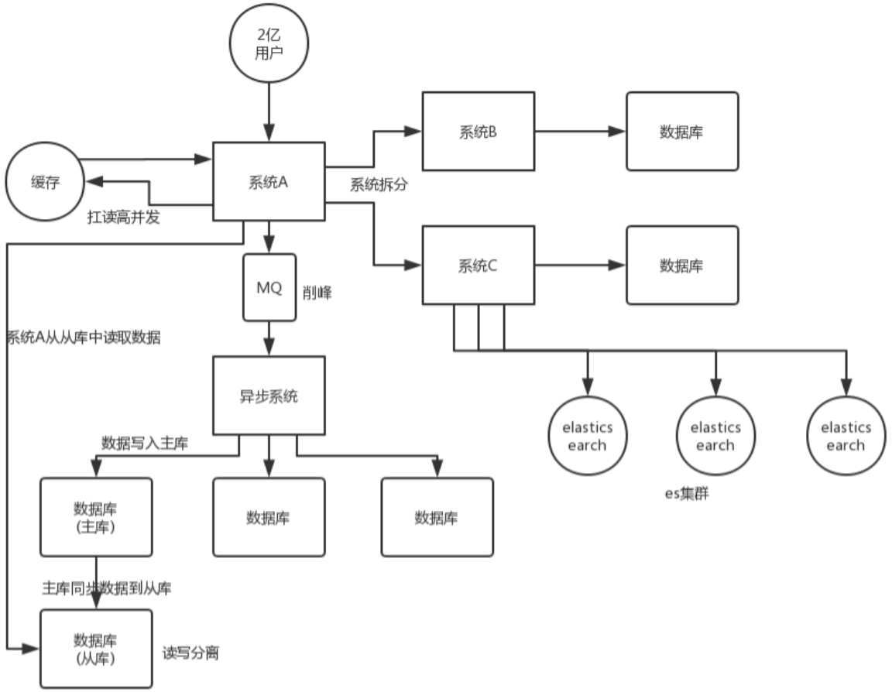

#### 系统拆分

将一个系统拆分为多个子系统，用 dubbo 来搞。然后每个系统连一个数据库，这样本来就一个库，现在多个数据库，不也可以扛高并发么。

#### 缓存

缓存，必须得用缓存。大部分的高并发场景，都是读多写少，那你完全可以在数据库和缓存里都写一份，然后读的时候大量走缓存不就得了。毕竟人家 redis 轻轻松松单机几万的并发。所以你可以考虑考虑你的项目里，那些承载主要请求的读场景，怎么用缓存来抗高并发。

#### MQ

MQ，必须得用 MQ。可能你还是会出现高并发写的场景，比如说一个业务操作里要频繁搞数据库几十次，增删改增删改，疯了。那高并发绝对搞挂你的系统，你要是用 redis 来承载写那肯定不行，人家是缓存，数据随时就被 LRU 了，数据格式还无比简单，没有事务支持。所以该用 mysql 还得用 mysql 啊。那你咋办？用 MQ 吧，大量的写请求灌入 MQ 里，排队慢慢玩儿，后边系统消费后慢慢写，控制在 mysql 承载范围之内。所以你得考虑考虑你的项目里，那些承载复杂写业务逻辑的场景里，如何用 MQ 来异步写，提升并发性。MQ 单机抗几万并发也是 ok 的，这个之前还特意说过。

#### 分库分表

分库分表，可能到了最后数据库层面还是免不了抗高并发的要求，好吧，那么就将一个数据库拆分为多个库，多个库来扛更高的并发；然后将一个表拆分为多个表，每个表的数据量保持少一点，提高 sql 跑的性能。

#### 读写分离

读写分离，这个就是说大部分时候数据库可能也是读多写少，没必要所有请求都集中在一个库上吧，可以搞个主从架构，主库写入，从库读取，搞一个读写分离。读流量太多的时候，还可以加更多的从库。

#### ElasticSearch

Elasticsearch，简称 es。es 是分布式的，可以随便扩容，分布式天然就可以支撑高并发，因为动不动就可以扩容加机器来扛更高的并发。那么一些比较简单的查询、统计类的操作，可以考虑用 es 来承载，还有一些全文搜索类的操作，也可以考虑用 es 来承载。

上面的 6 点，基本就是高并发系统肯定要干的一些事儿，大家可以仔细结合之前讲过的知识考虑一下，到时候你可以系统的把这块阐述一下，然后每个部分要注意哪些问题，之前都讲过了，你都可以阐述阐述，表明你对这块是有点积累的。

说句实话，毕竟你真正厉害的一点，不是在于弄明白一些技术，或者大概知道一个高并发系统应该长什么样？其实实际上在真正的复杂的业务系统里，做高并发要远远比上面提到的点要复杂几十倍到上百倍。你需要考虑：哪些需要分库分表，哪些不需要分库分表，单库单表跟分库分表如何 join，哪些数据要放到缓存里去，放哪些数据才可以扛住高并发的请求，你需要完成对一个复杂业务系统的分析之后，然后逐步逐步的加入高并发的系统架构的改造，这个过程是无比复杂的，一旦做过一次，并且做好了，你在这个市场上就会非常的吃香。

其实大部分公司，真正看重的，不是说你掌握高并发相关的一些基本的架构知识，架构中的一些技术，RocketMQ、Kafka、Redis、Elasticsearch，高并发这一块，你了解了，也只能是次一等的人才。对一个有几十万行代码的复杂的分布式系统，一步一步架构、设计以及实践过高并发架构的人，这个经验是难能可贵的。

# 分布式系统

分布式业务系统，就是把原来用 Java 开发的一个大块系统，给拆分成多个子系统，多个子系统之间互相调用，形成一个大系统的整体。假设原来你做了一个 OA 系统，里面包含了权限模块、员工模块、请假模块、财务模块，一个工程，里面包含了一堆模块，模块与模块之间会互相去调用，1 台机器部署。现在如果你把这个系统给拆开，权限系统、员工系统、请假系统、财务系统 4 个系统，4 个工程，分别在 4 台机器上部署。一个请求过来，完成这个请求，这个员工系统，调用权限系统，调用请假系统，调用财务系统，4 个系统分别完成了一部分的事情，最后 4 个系统都干完了以后，才认为是这个请求已经完成了。

> 近几年开始兴起和流行 Spring Cloud，刚流行还没开始普及，目前普及的是 Dubbo，因此这里也主要讲 Dubbo。

面试官可能会问你以下问题。

为什么要进行系统拆分？

- 为什么要进行系统拆分？如何进行系统拆分？拆分后不用 Dubbo 可以吗？Dubbo 和 thrift 有什么区别呢？

分布式服务框架

- 说一下 Dubbo 的工作原理？注册中心挂了可以继续通信吗？
- Dubbo 支持哪些序列化协议？说一下 Hessian 的数据结构？PB 知道吗？为什么 PB 的效率是最高的？
- Dubbo 负载均衡策略和高可用策略都有哪些？动态代理策略呢？
- Dubbo 的 SPI 思想是什么？
- 如何基于 Dubbo 进行服务治理、服务降级、失败重试以及超时重试？
- 分布式服务接口的幂等性如何设计（比如不能重复扣款）？
- 分布式服务接口请求的顺序性如何保证？
- 如何自己设计一个类似 Dubbo 的 RPC 框架？

分布式锁

- 使用 Redis 如何设计分布式锁？使用 zk 来设计分布式锁可以吗？这两种分布式锁的实现方式哪种效率比较高？

分布式事务

- 分布式事务了解吗？你们如何解决分布式事务问题的？TCC 如果出现网络连不通怎么办？XA 的一致性如何保证？

分布式会话

- 集群部署时的分布式 Session 如何实现？

## 系统拆分

### 为什么系统要拆分？

要是不拆分，一个大系统几十万行代码，20 个人维护一份代码，简直是悲剧啊。代码经常改着改着就冲突了，各种代码冲突和合并要处理，非常耗费时间；经常我改动了我的代码，你调用了我的，导致你的代码也得重新测试，麻烦的要死；然后每次发布都是几十万行代码的系统一起发布，大家得一起提心吊胆准备上线，几十万行代码的上线，可能每次上线都要做很多的检查，很多异常问题的处理，简直是又麻烦又痛苦；而且如果我现在打算把技术升级到最新的 spring 版本，还不行，因为这可能导致你的代码报错，我不敢随意乱改技术。

假设一个系统是 20 万行代码，其中 A 在里面改了 1000 行代码，但是此时发布的时候是这个 20 万行代码的大系统一块儿发布。就意味着 20 万代码在线上就可能出现各种变化，20 个人，每个人都要紧张地等在电脑面前，上线之后，检查日志，看自己负责的那一块儿有没有什么问题。

A 就检查了自己负责的 1 万行代码对应的功能，确保 ok 就闪人了；结果不巧的是，A 上线的时候不小心修改了线上机器的某个配置，导致另外 B 和 C 负责的 2 万行代码对应的一些功能，出错了。

几十个人负责维护一个几十万行代码的单块应用，每次上线，准备几个礼拜，上线 -> 部署 -> 检查自己负责的功能。

拆分了以后，整个世界清爽了，几十万行代码的系统，拆分成 20 个服务，平均每个服务就 1~2 万行代码，每个服务部署到单独的机器上。20 个工程，20 个 git 代码仓库，20 个开发人员，每个人维护自己的那个服务就可以了，是自己独立的代码，跟别人没关系。再也没有代码冲突了，爽。每次就测试我自己的代码就可以了，爽。每次就发布我自己的一个小服务就可以了，爽。技术上想怎么升级就怎么升级，保持接口不变就可以了，真爽。

所以简单来说，一句话总结，如果是那种代码量多达几十万行的中大型项目，团队里有几十个人，那么如果不拆分系统，开发效率极其低下，问题很多。但是拆分系统之后，每个人就负责自己的一小部分就好了，可以随便玩儿随便弄。分布式系统拆分之后，可以大幅度提升复杂系统大型团队的开发效率。

但是同时，也要提醒的一点是，系统拆分成分布式系统之后，大量的分布式系统面临的问题也是接踵而来，所以后面的问题都是在围绕分布式系统带来的复杂技术挑战在说。

#### 如何进行系统拆分？

这个问题说大可以很大，可以扯到领域驱动模型设计上去，说小了也很小，我不太想给大家太过于学术的说法，因为你也不可能背这个答案，过去了直接说吧。还是说的简单一点，大家自己到时候知道怎么回答就行了。

系统拆分为分布式系统，拆成多个服务，拆成微服务的架构，是需要拆很多轮的。并不是说上来一个架构师一次就给拆好了，而以后都不用拆。

第一轮；团队继续扩大，拆好的某个服务，刚开始是 1 个人维护 1 万行代码，后来业务系统越来越复杂，这个服务是 10 万行代码，5 个人；第二轮，1 个服务 -> 5 个服务，每个服务 2 万行代码，每人负责一个服务。

如果是多人维护一个服务，最理想的情况下，几十个人，1 个人负责 1 个或 2 ~ 3 个服务；某个服务工作量变大了，代码量越来越多，某个同学，负责一个服务，代码量变成了 10 万行了，他自己不堪重负，他现在一个人拆开，5 个服务，1 个人顶着，负责 5 个人，接着招人，2 个人，给那个同学带着，3 个人负责 5 个服务，其中 2 个人每个人负责 2 个服务，1 个人负责 1 个服务。

个人建议，一个服务的代码不要太多，1 万行左右，两三万撑死了吧。

大部分的系统，是要进行多轮拆分的，第一次拆分，可能就是将以前的多个模块该拆分开来了，比如说将电商系统拆分成订单系统、商品系统、采购系统、仓储系统、用户系统，等等吧。

但是后面可能每个系统又变得越来越复杂了，比如说采购系统里面又分成了供应商管理系统、采购单管理系统，订单系统又拆分成了购物车系统、价格系统、订单管理系统。

扯深了实在很深，所以这里先给大家举个例子，你自己感受一下，核心意思就是根据情况，先拆分一轮，后面如果系统更复杂了，可以继续分拆。你根据自己负责系统的例子，来考虑一下就好了。

#### 拆分后不用 dubbo 可以吗？

当然可以了，大不了最次，就是各个系统之间，直接基于 spring mvc，就纯 http 接口互相通信呗，还能咋样。但是这个肯定是有问题的，因为 http 接口通信维护起来成本很高，你要考虑超时重试、负载均衡等等各种乱七八糟的问题，比如说你的订单系统调用商品系统，商品系统部署了 5 台机器，你怎么把请求均匀地甩给那 5 台机器？这不就是负载均衡？你要是都自己搞那是可以的，但是确实很痛苦。

所以 dubbo 说白了，是一种 rpc 框架，就是说本地就是进行接口调用，但是 dubbo 会代理这个调用请求，跟远程机器网络通信，给你处理掉负载均衡、服务实例上下线自动感知、超时重试等等乱七八糟的问题。那你就不用自己做了，用 dubbo 就可以了。

## 分布式服务框架

### 说一下 Dubbo 的工作原理？

#### dubbo 工作原理

1. 第一层：service 层，接口层，给服务提供者和消费者来实现的
2. 第二层：config 层，配置层，主要是对 dubbo 进行各种配置的
3. 第三层：proxy 层，服务代理层，无论是 consumer 还是 provider，dubbo 都会给你生成代理，代理之间进行网络通信
4. 第四层：registry 层，服务注册层，负责服务的注册与发现
5. 第五层：cluster 层，集群层，封装多个服务提供者的路由以及负载均衡，将多个实例组合成一个服务
6. 第六层：monitor 层，监控层，对 rpc 接口的调用次数和调用时间进行监控
7. 第七层：protocal 层，远程调用层，封装 rpc 调用
8. 第八层：exchange 层，信息交换层，封装请求响应模式，同步转异步
9. 第九层：transport 层，网络传输层，抽象 mina 和 netty 为统一接口
10. 第十层：serialize 层，数据序列化层

#### 工作流程

1. 第一步：provider 向注册中心去注册
2. 第二步：consumer 从注册中心订阅服务，注册中心会通知 consumer 注册好的服务
3. 第三步：consumer 调用 provider
4. 第四步：consumer 和 provider 都异步通知监控中心

#### 注册中心挂了可以继续通信吗？

可以，因为刚开始初始化的时候，消费者会将提供者的地址等信息拉取到本地缓存，所以注册中心挂了可以继续通信。

### Dubbo 支持哪些序列化协议？

序列化，就是把数据结构或者是一些对象，转换为二进制串的过程，而反序列化是将在序列化过程中所生成的二进制串转换成数据结构或者对象的过程。

#### dubbo 支持不同的通信协议

- dubbo 协议 dubbo://

   默认就是走 dubbo 协议，单一长连接，进行的是 NIO 异步通信，基于 hessian 作为序列化协议。使用的场景是：传输数据量小（每次请求在 100kb 以内），但是并发量很高，以及服务消费者机器数远大于服务提供者机器数的情况。

   为了要支持高并发场景，一般是服务提供者就几台机器，但是服务消费者有上百台，可能每天调用量达到上亿次！此时用长连接是最合适的，就是跟每个服务消费者维持一个长连接就可以，可能总共就 100 个连接。然后后面直接基于长连接 NIO 异步通信，可以支撑高并发请求。

   长连接，通俗点说，就是建立连接过后可以持续发送请求，无须再建立连接。

   而短连接，每次要发送请求之前，需要先重新建立一次连接。

- rmi 协议 rmi://

   RMI 协议采用 JDK 标准的 `java.rmi.*` 实现，采用阻塞式短连接和 JDK 标准序列化方式。多个短连接，适合消费者和提供者数量差不多的情况，适用于文件的传输，一般较少用。

- hessian 协议 hessian://

   Hessian 1 协议用于集成 Hessian 的服务，Hessian 底层采用 Http 通讯，采用 Servlet 暴露服务，Dubbo 缺省内嵌 Jetty 作为服务器实现。走 hessian 序列化协议，多个短连接，适用于提供者数量比消费者数量还多的情况，适用于文件的传输，一般较少用。

- http 协议 http://

   基于 HTTP 表单的远程调用协议，采用 Spring 的 HttpInvoker 实现。走表单序列化。

- thrift 协议 thrift://

   当前 dubbo 支持的 thrift 协议是对 thrift 原生协议的扩展，在原生协议的基础上添加了一些额外的头信息，比如 service name，magic number 等。

- webservice webservice://

   基于 WebService 的远程调用协议，基于 Apache CXF 的 frontend-simple 和 transports-http 实现。走 SOAP 文本序列化。

- memcached 协议 memcached://

   基于 memcached 实现的 RPC 协议。

- redis 协议 redis://

   基于 Redis 实现的 RPC 协议。

- rest 协议 rest://

   基于标准的 Java REST API —— JAX-RS 2.0（Java API for RESTful Web Services 的简写）实现的 REST 调用支持。

- gPRC 协议 grpc://

   Dubbo 自 2.7.5 版本开始支持 gRPC 协议，对于计划使用 HTTP/2 通信，或者想利用 gRPC 带来的 Stream、反压、Reactive 编程等能力的开发者来说，都可以考虑启用 gRPC 协议。

#### dubbo 支持的序列化协议

dubbo 支持 hession、Java 二进制序列化、json、SOAP 文本序列化多种序列化协议。但是 hessian 是其默认的序列化协议。

#### 说一下 Hessian 的数据结构

Hessian 的对象序列化机制有 8 种原始类型：

- 原始二进制数据
- boolean
- 64-bit date（64 位毫秒值的日期）
- 64-bit double
- 32-bit int
- 64-bit long
- null
- UTF-8 编码的 string

另外还包括 3 种递归类型：

- list for lists and arrays
- map for maps and dictionaries
- object for objects

还有一种特殊的类型：

- ref：用来表示对共享对象的引用。

#### 为什么 PB 的效率是最高的？

其实 PB 之所以性能如此好，主要得益于两个：第一，它使用 proto 编译器，自动进行序列化和反序列化，速度非常快，应该比 XML 和 JSON 快上了 20 ~ 100 倍；第二，它的数据压缩效果好，就是说它序列化后的数据量体积小。因为体积小，传输起来带宽和速度上会有优化。

### Dubbo 负载均衡策略和集群容错策略？

#### dubbo 负载均衡策略

##### RandomLoadBalance

默认情况下，dubbo 是 RandomLoadBalance，即随机调用实现负载均衡，可以对 provider 不同实例设置不同的权重，会按照权重来负载均衡，权重越大分配流量越高，一般就用这个默认的就可以了。

算法思想很简单。假设有一组服务器 servers = `[A, B, C]`，他们对应的权重为 weights = `[5, 3, 2]`，权重总和为 10。现在把这些权重值平铺在一维坐标值上，`[0, 5)` 区间属于服务器 A，`[5, 8)` 区间属于服务器 B，`[8, 10)` 区间属于服务器 C。接下来通过随机数生成器生成一个范围在 `[0, 10)` 之间的随机数，然后计算这个随机数会落到哪个区间上。比如数字 3 会落到服务器 A 对应的区间上，此时返回服务器 A 即可。权重越大的机器，在坐标轴上对应的区间范围就越大，因此随机数生成器生成的数字就会有更大的概率落到此区间内。只要随机数生成器产生的随机数分布性很好，在经过多次选择后，每个服务器被选中的次数比例接近其权重比例。比如，经过一万次选择后，服务器 A 被选中的次数大约为 5000 次，服务器 B 被选中的次数约为 3000 次，服务器 C 被选中的次数约为 2000 次。

##### RoundRobinLoadBalance

这个的话默认就是均匀地将流量打到各个机器上去，但是如果各个机器的性能不一样，容易导致性能差的机器负载过高。所以此时需要调整权重，让性能差的机器承载权重小一些，流量少一些。

举个栗子。

跟运维同学申请机器，有的时候，我们运气好，正好公司资源比较充足，刚刚有一批热气腾腾、刚刚做好的虚拟机新鲜出炉，配置都比较高：8 核 + 16G 机器，申请到 2 台。过了一段时间，我们感觉 2 台机器有点不太够，我就去找运维同学说，“哥儿们，你能不能再给我一台机器”，但是这时只剩下一台 4 核 + 8G 的机器。我要还是得要。

这个时候，可以给两台 8 核 16G 的机器设置权重 4，给剩余 1 台 4 核 8G 的机器设置权重 2。

##### LeastActiveLoadBalance

官网对 LeastActiveLoadBalance 的解释是“最小活跃数负载均衡”，活跃调用数越小，表明该服务提供者效率越高，单位时间内可处理更多的请求，那么此时请求会优先分配给该服务提供者。

最小活跃数负载均衡算法的基本思想是这样的：

每个服务提供者会对应着一个活跃数 active。初始情况下，所有服务提供者的 active 均为 0。每当收到一个请求，对应的服务提供者的 active 会加 1，处理完请求后，active 会减 1。所以，如果服务提供者性能较好，处理请求的效率就越高，那么 active 也会下降的越快。因此可以给这样的服务提供者优先分配请求。

当然，除了最小活跃数，LeastActiveLoadBalance 在实现上还引入了权重值。所以准确的来说，LeastActiveLoadBalance 是基于加权最小活跃数算法实现的。

##### ConsistentHashLoadBalance

一致性 Hash 算法，相同参数的请求一定分发到一个 provider 上去，provider 挂掉的时候，会基于虚拟节点均匀分配剩余的流量，抖动不会太大。如果你需要的不是随机负载均衡，是要一类请求都到一个节点，那就走这个一致性 Hash 策略。

> 关于 dubbo 负载均衡策略更加详细的描述，可以查看官网 https://dubbo.apache.org/zh/docs/advanced/loadbalance 。

#### dubbo 集群容错策略

##### Failover Cluster 模式

失败自动切换，自动重试其他机器，默认就是这个，常见于读操作。（失败重试其它机器）

可以通过以下几种方式配置重试次数：

```xml
<dubbo:service retries="2" />
```

或者

```xml
<dubbo:reference retries="2" />
```

或者

```xml
<dubbo:reference>
    <dubbo:method name="findFoo" retries="2" />
</dubbo:reference>
```

##### Failfast Cluster 模式

一次调用失败就立即失败，常见于非幂等性的写操作，比如新增一条记录（调用失败就立即失败）

##### Failsafe Cluster 模式

出现异常时忽略掉，常用于不重要的接口调用，比如记录日志。

配置示例如下：

```xml
<dubbo:service cluster="failsafe" />
```

或者

```xml
<dubbo:reference cluster="failsafe" />
```

##### Failback Cluster 模式

失败了后台自动记录请求，然后定时重发，比较适合于写消息队列这种。

##### Forking Cluster 模式

并行调用多个 provider，只要一个成功就立即返回。常用于实时性要求比较高的读操作，但是会浪费更多的服务资源，可通过 `forks="2"` 来设置最大并行数。

##### Broadcast Cluster 模式

逐个调用所有的 provider。任何一个 provider 出错则报错（从 2.1.0 版本开始支持）。通常用于通知所有提供者更新缓存或日志等本地资源信息。

> 关于 dubbo 集群容错策略更加详细的描述，可以查看官网 https://dubbo.apache.org/zh/docs/advanced/fault-tolerent-strategy 。

#### dubbo 动态代理策略

默认使用 javassist 动态字节码生成，创建代理类。但是可以通过 spi 扩展机制配置自己的动态代理策略。

### Dubbo 的 SPI 思想是什么？

#### spi 是啥？

spi，简单来说，就是 service provider interface，说白了是什么意思呢，比如你有个接口，现在这个接口有 3 个实现类，那么在系统运行的时候对这个接口到底选择哪个实现类呢？这就需要 spi 了，需要根据指定的配置或者是默认的配置，去找到对应的实现类加载进来，然后用这个实现类的实例对象。

举个栗子。

你有一个接口 A。A1 / A2 / A3 分别是接口 A 的不同实现。你通过配置接口 A = 实现 A2 ，那么在系统实际运行的时候，会加载你的配置，用实现 A2 实例化一个对象来提供服务。

spi 机制一般用在哪儿？插件扩展的场景，比如说你开发了一个给别人使用的开源框架，如果你想让别人自己写个插件，插到你的开源框架里面，从而扩展某个功能，这个时候 spi 思想就用上了。

#### Java spi 思想的体现

spi 经典的思想体现，大家平时都在用，比如说 jdbc。

Java 定义了一套 jdbc 的接口，但是 Java 并没有提供 jdbc 的实现类。

但是实际上项目跑的时候，要使用 jdbc 接口的哪些实现类呢？一般来说，我们要根据自己使用的数据库，比如 mysql，你就将 `mysql-jdbc-connector.jar` 引入进来；oracle，你就将 `oracle-jdbc-connector.jar` 引入进来。

在系统跑的时候，碰到你使用 jdbc 的接口，他会在底层使用你引入的那个 jar 中提供的实现类。

#### dubbo 的 spi 思想

dubbo 也用了 spi 思想，不过没有用 jdk 的 spi 机制，是自己实现的一套 spi 机制。

```java
Protocol protocol = ExtensionLoader.getExtensionLoader(Protocol.class).getAdaptiveExtension();
```

Protocol 接口，在系统运行的时候，dubbo 会判断一下应该选用这个 Protocol 接口的哪个实现类来实例化对象来使用。

它会去找一个你配置的 Protocol，将你配置的 Protocol 实现类，加载到 jvm 中来，然后实例化对象，就用你的那个 Protocol 实现类就可以了。

上面那行代码就是 dubbo 里大量使用的，就是对很多组件，都是保留一个接口和多个实现，然后在系统运行的时候动态根据配置去找到对应的实现类。如果你没配置，那就走默认的实现好了，没问题。

```java
@SPI("dubbo")
public interface Protocol {
    int getDefaultPort();

    @Adaptive
    <T> Exporter<T> export(Invoker<T> invoker) throws RpcException;

    @Adaptive
    <T> Invoker<T> refer(Class<T> type, URL url) throws RpcException;

    void destroy();
}
```

在 dubbo 自己的 jar 里，在 `/META_INF/dubbo/internal/com.alibaba.dubbo.rpc.Protocol` 文件中：

```xml
dubbo=com.alibaba.dubbo.rpc.protocol.dubbo.DubboProtocol
http=com.alibaba.dubbo.rpc.protocol.http.HttpProtocol
hessian=com.alibaba.dubbo.rpc.protocol.hessian.HessianProtocol
```

所以说，这就看到了 dubbo 的 spi 机制默认是怎么玩儿的了，其实就是 Protocol 接口，`@SPI("dubbo")` 说的是，通过 SPI 机制来提供实现类，实现类是通过 dubbo 作为默认 key 去配置文件里找到的，配置文件名称与接口全限定名一样的，通过 dubbo 作为 key 可以找到默认的实现类就是 com.alibaba.dubbo.rpc.protocol.dubbo.DubboProtocol。

如果想要动态替换掉默认的实现类，需要使用 `@Adaptive` 接口，Protocol 接口中，有两个方法加了 `@Adaptive` 注解，就是说那俩接口会被代理实现。

啥意思呢？

比如这个 Protocol 接口搞了俩 `@Adaptive` 注解标注了方法，在运行的时候会针对 Protocol 生成代理类，这个代理类的那俩方法里面会有代理代码，代理代码会在运行的时候动态根据 url 中的 protocol 来获取那个 key，默认是 dubbo，你也可以自己指定，你如果指定了别的 key，那么就会获取别的实现类的实例了。

#### 如何自己扩展 dubbo 中的组件

下面来说说怎么来自己扩展 dubbo 中的组件。

自己写个工程，要是那种可以打成 jar 包的，里面的 `src/main/resources` 目录下，搞一个 `META-INF/services`，里面放个文件叫：`com.alibaba.dubbo.rpc.Protocol`，文件里搞一个 `my=com.bingo.MyProtocol`。自己把 jar 弄到 nexus 私服里去。

然后自己搞一个 dubbo provider 工程，在这个工程里面依赖你自己搞的那个 jar，然后在 spring 配置文件里给个配置：

```xml
<dubbo:protocol name="my" port="20000" />
```

provider 启动的时候，就会加载到我们 jar 包里的 `my=com.bingo.MyProtocol` 这行配置里，接着会根据你的配置使用你定义好的 MyProtocol 了，这个就是简单说明一下，你通过上述方式，可以替换掉大量的 dubbo 内部的组件，就是扔个你自己的 jar 包，然后配置一下即可。

dubbo 里面提供了大量的类似上面的扩展点，就是说，你如果要扩展一个东西，只要自己写个 jar，让你的 consumer 或者是 provider 工程，依赖你的那个 jar，在你的 jar 里指定目录下配置好接口名称对应的文件，里面通过 key = 实现类 。

然后对于对应的组件，类似 `<dubbo:protocol>` 用你的那个 key 对应的实现类来实现某个接口，你可以自己去扩展 dubbo 的各种功能，提供你自己的实现。

### 如何基于 Dubbo 进行服务治理？

服务治理，这个问题如果问你，其实就是看看你有没有服务治理的思想，因为这个是做过复杂微服务的人肯定会遇到的一个问题。

服务降级，这个是涉及到复杂分布式系统中必备的一个话题，因为分布式系统互相来回调用，任何一个系统故障了，你不降级，直接就全盘崩溃？那就太坑爹了吧。

失败重试，分布式系统中网络请求如此频繁，要是因为网络问题不小心失败了一次，是不是要重试？

超时重试，跟上面一样，如果不小心网络慢一点，超时了，如何重试？

#### 服务治理

##### 调用链路自动生成

一个大型的分布式系统，或者说是用现在流行的微服务架构来说吧，分布式系统由大量的服务组成。那么这些服务之间互相是如何调用的？调用链路是啥？说实话，几乎到后面没人搞的清楚了，因为服务实在太多了，可能几百个甚至几千个服务。

那就需要基于 dubbo 做的分布式系统中，对各个服务之间的调用自动记录下来，然后自动将各个服务之间的依赖关系和调用链路生成出来，做成一张图，显示出来，大家才可以看到对吧。

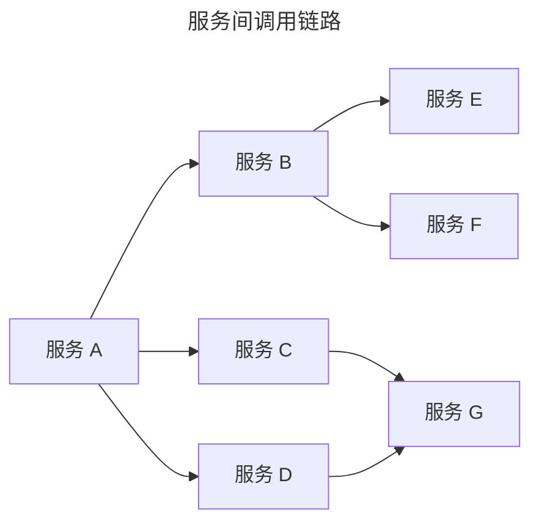

##### 服务访问压力以及时长统计

需要自动统计各个接口和服务之间的调用次数以及访问延时，而且要分成两个级别。

- 一个级别是接口粒度，就是每个服务的每个接口每天被调用多少次，TP50/TP90/TP99，三个档次的请求延时分别是多少；
- 第二个级别是从源头入口开始，一个完整的请求链路经过几十个服务之后，完成一次请求，每天全链路走多少次，全链路请求延时的 TP50/TP90/TP99，分别是多少。

这些东西都搞定了之后，后面才可以来看当前系统的压力主要在哪里，如何来扩容和优化。

##### 其它

- 服务分层（避免循环依赖）
- 调用链路失败监控和报警
- 服务鉴权
- 每个服务的可用性的监控（接口调用成功率？几个 9？99.99%，99.9%，99%）

#### 服务降级

比如说服务 A 调用服务 B，结果服务 B 挂掉了，服务 A 重试几次调用服务 B，还是不行，那么直接降级，走一个备用的逻辑，给用户返回响应。

举个栗子，我们有接口 HelloService。HelloServiceImpl 有该接口的具体实现。

```java
public interface HelloService {
   void sayHello();
}

public class HelloServiceImpl implements HelloService {
    public void sayHello() {
        System.out.println("hello world......");
    }
}
```

```xml
<?xml version="1.0" encoding="UTF-8"?>
<beans xmlns="http://www.springframework.org/schema/beans"
    xmlns:xsi="http://www.w3.org/2001/XMLSchema-instance" xmlns:dubbo="http://code.alibabatech.com/schema/dubbo"
    xsi:schemaLocation="http://www.springframework.org/schema/beans        http://www.springframework.org/schema/beans/spring-beans.xsd        http://code.alibabatech.com/schema/dubbo        http://code.alibabatech.com/schema/dubbo/dubbo.xsd">

    <dubbo:application name="dubbo-provider" />
    <dubbo:registry address="zookeeper://127.0.0.1:2181" />
    <dubbo:protocol name="dubbo" port="20880" />
    <dubbo:service interface="com.zhss.service.HelloService" ref="helloServiceImpl" timeout="10000" />
    <bean id="helloServiceImpl" class="com.zhss.service.HelloServiceImpl" />

</beans>

<?xml version="1.0" encoding="UTF-8"?>
<beans xmlns="http://www.springframework.org/schema/beans"
    xmlns:xsi="http://www.w3.org/2001/XMLSchema-instance"
    xmlns:dubbo="http://code.alibabatech.com/schema/dubbo"
    xsi:schemaLocation="http://www.springframework.org/schema/beans        http://www.springframework.org/schema/beans/spring-beans.xsd        http://code.alibabatech.com/schema/dubbo        http://code.alibabatech.com/schema/dubbo/dubbo.xsd">

    <dubbo:application name="dubbo-consumer"  />

    <dubbo:registry address="zookeeper://127.0.0.1:2181" />

    <dubbo:reference id="fooService" interface="com.test.service.FooService"  timeout="10000" check="false" mock="return null">
    </dubbo:reference>

</beans>
```

我们调用接口失败的时候，可以通过 mock 统一返回 null。

mock 的值也可以修改为 true，然后再跟接口同一个路径下实现一个 Mock 类，命名规则是 `接口名称 + Mock` 后缀。然后在 Mock 类里实现自己的降级逻辑。

```java
public class HelloServiceMock implements HelloService {
    public void sayHello() {
        // 降级逻辑
    }
}
```

#### 失败重试和超时重试

所谓失败重试，就是 consumer 调用 provider 要是失败了，比如抛异常了，此时应该是可以重试的，或者调用超时了也可以重试。配置如下：

```xml
<dubbo:reference id="xxxx" interface="xx" check="true" async="false" retries="3" timeout="2000"/>
```

举个栗子。

某个服务的接口，要耗费 5s，你这边不能干等着，你这边配置了 timeout 之后，我等待 2s，还没返回，我直接就撤了，不能干等你。

可以结合你们公司具体的场景来说说你是怎么设置这些参数的：

- timeout：一般设置为 200ms，我们认为不能超过 200ms 还没返回。
- retries：设置 retries，一般是在读请求的时候，比如你要查询个数据，你可以设置个 retries，如果第一次没读到，报错，重试指定的次数，尝试再次读取。

### 分布式服务接口的幂等性如何设计？

一个分布式系统中的某个接口，该如何保证幂等性？这个事儿其实是你做分布式系统的时候必须要考虑的一个生产环境的技术问题。啥意思呢？

假如你有个服务提供一些接口供外部调用，这个服务部署在了 5 台机器上，接着有个接口就是付款接口。然后人家用户在前端上操作的时候，不知道为啥，总之就是一个订单不小心发起了两次支付请求，然后这俩请求分散在了这个服务部署的不同的机器上，好了，结果一个订单扣款扣两次。

或者是订单系统调用支付系统进行支付，结果不小心因为网络超时了，然后订单系统走了前面我们看到的那个重试机制，咔嚓给你重试了一把，好，支付系统收到一个支付请求两次，而且因为负载均衡算法落在了不同的机器上，尴尬了。。。

所以你肯定得知道这事儿，否则你做出来的分布式系统恐怕容易埋坑。

这个不是技术问题，这个没有通用的一个方法，这个应该结合业务来保证幂等性。

所谓幂等性，就是说一个接口，多次发起同一个请求，你这个接口得保证结果是准确的，比如不能多扣款、不能多插入一条数据、不能将统计值多加了 1。这就是幂等性。

其实保证幂等性主要是三点：

- 对于每个请求必须有一个唯一的标识，举个栗子：订单支付请求，肯定得包含订单 id，一个订单 id 最多支付一次，对吧。
- 每次处理完请求之后，必须有一个记录标识这个请求处理过了。常见的方案是在 mysql 中记录个状态啥的，比如支付之前记录一条这个订单的支付流水。
- 每次接收请求需要进行判断，判断之前是否处理过。比如说，如果有一个订单已经支付了，就已经有了一条支付流水，那么如果重复发送这个请求，则此时先插入支付流水，orderId 已经存在了，唯一键约束生效，报错插入不进去的。然后你就不用再扣款了。

实际运作过程中，你要结合自己的业务来，比如说利用 Redis，用 orderId 作为唯一键。只有成功插入这个支付流水，才可以执行实际的支付扣款。

要求是支付一个订单，必须插入一条支付流水，`order_id` 建一个唯一键 unique key。你在支付一个订单之前，先插入一条支付流水，`order_id` 就已经进去了。你就可以写一个标识到 Redis 里面去，set `order_id` payed ，下一次重复请求过来了，先查 Redis 的 `order_id` 对应的 value，如果是 payed 就说明已经支付过了，你就别重复支付了。

### 分布式服务接口请求的顺序性如何保证？

其实分布式系统接口的调用顺序，也是个问题，一般来说是不用保证顺序的。但是有时候可能确实是需要严格的顺序保证。给大家举个例子，你服务 A 调用服务 B，先插入再删除。好，结果俩请求过去了，落在不同机器上，可能插入请求因为某些原因执行慢了一些，导致删除请求先执行了，此时因为没数据所以啥效果也没有；结果这个时候插入请求过来了，好，数据插入进去了，那就尴尬了。

本来应该是 “先插入 -> 再删除”，这条数据应该没了，结果现在 “先删除 -> 再插入”，数据还存在，最后你死都想不明白是怎么回事。

所以这都是分布式系统一些很常见的问题。

首先，一般来说，个人建议是，你们从业务逻辑上设计的这个系统最好是不需要这种顺序性的保证，因为一旦引入顺序性保障，比如使用分布式锁，会导致系统复杂度上升，而且会带来效率低下，热点数据压力过大等问题。

下面我给个我们用过的方案吧，简单来说，首先你得用 Dubbo 的一致性 hash 负载均衡策略，将比如某一个订单 id 对应的请求都给分发到某个机器上去，接着就是在那个机器上，因为可能还是多线程并发执行的，你可能得立即将某个订单 id 对应的请求扔一个内存队列里去，强制排队，这样来确保他们的顺序性。

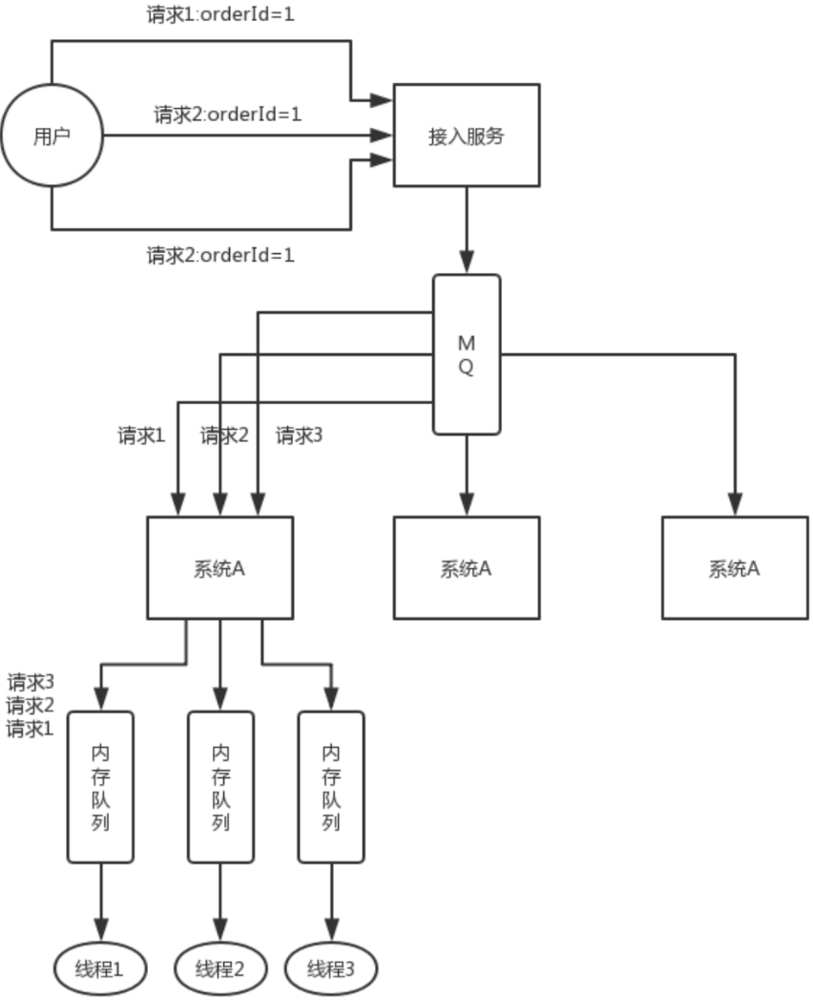

但是这样引发的后续问题就很多，比如说要是某个订单对应的请求特别多，造成某台机器成热点怎么办？解决这些问题又要开启后续一连串的复杂技术方案，曾经这类问题弄的我们头疼不已，所以，还是建议什么呢？

最好是比如说刚才那种，一个订单的插入和删除操作，能不能合并成一个操作，就是一个删除，或者是其它什么，避免这种问题的产生。

### 如何自己设计一个类似 Dubbo 的 RPC 框架？

- 上来你的服务就得去注册中心注册吧，你是不是得有个注册中心，保留各个服务的信息，可以用 zookeeper 来做，对吧。
- 然后你的消费者需要去注册中心拿对应的服务信息吧，对吧，而且每个服务可能会存在于多台机器上。
- 接着你就该发起一次请求了，咋发起？当然是基于动态代理了，你面向接口获取到一个动态代理，这个动态代理就是接口在本地的一个代理，然后这个代理会找到服务对应的机器地址。
- 然后找哪个机器发送请求？那肯定得有个负载均衡算法了，比如最简单的可以随机轮询是不是。
- 接着找到一台机器，就可以跟它发送请求了，第一个问题咋发送？你可以说用 netty 了，nio 方式；第二个问题发送啥格式数据？你可以说用 hessian 序列化协议了，或者是别的，对吧。然后请求过去了。
- 服务器那边一样的，需要针对你自己的服务生成一个动态代理，监听某个网络端口了，然后代理你本地的服务代码。接收到请求的时候，就调用对应的服务代码，对吧。

### CAP 定理的 P 是什么？

#### 什么是 CAP 定理（CAP theorem）

在理论计算机科学中，CAP 定理（CAP theorem），又被称作布鲁尔定理（Brewer's theorem），它指出对于一个分布式计算系统来说，不可能同时满足以下三点：

- 一致性（Consistency）（等同于所有节点访问同一份最新的数据副本）
- 可用性（Availability）（每次请求都能获取到非错的响应——但是不保证获取的数据为最新数据）
- 分区容错性（Partition tolerance）（以实际效果而言，分区相当于对通信的时限要求。系统如果不能在时限内达成数据一致性，就意味着发生了分区的情况，必须就当前操作在 C 和 A 之间做出选择。）

#### 分区容错性（Partition tolerance）

理解 CAP 理论的最简单方式是想象两个节点分处分区两侧。允许至少一个节点更新状态会导致数据不一致，即丧失了 C 性质。如果为了保证数据一致性，将分区一侧的节点设置为不可用，那么又丧失了 A 性质。除非两个节点可以互相通信，才能既保证 C 又保证 A，这又会导致丧失 P 性质。

- P 指的是分区容错性，分区现象产生后需要容错，容错是指在 A 与 C 之间选择。如果分布式系统没有分区现象（没有出现不一致不可用情况）本身就没有分区，既然没有分区则就更没有分区容错性 P。
- 无论我设计的系统是 AP 还是 CP 系统如果没有出现不一致不可用。则该系统就处于 CA 状态
- P 的体现前提是得有分区情况存在

#### 常用的 CAP 框架对比

| 框架      | 所属 |
| --------- | ---- |
| Eureka    | AP   |
| Zookeeper | CP   |
| Consul    | CP   |

##### Eureka

> Eureka 保证了可用性，实现最终一致性。

Eureka 所有节点都是平等的所有数据都是相同的，且 Eureka 可以相互交叉注册。

Eureka client 使用内置轮询负载均衡器去注册，有一个检测间隔时间，如果在一定时间内没有收到心跳，才会移除该节点注册信息；如果客户端发现当前 Eureka 不可用，会切换到其他的节点，如果所有的 Eureka 都跪了，Eureka client 会使用最后一次数据作为本地缓存；所以以上的每种设计都是他不具备一致性的特性。

注意：因为 Eureka AP 的特性和请求间隔同步机制，在服务更新时候一般会手动通过 Eureka 的 api 把当前服务状态设置为 offline，并等待 2 个同步间隔后重新启动，这样就能保证服务更新节点对整体系统的影响

##### Zookeeper

> 强一致性

Zookeeper 在选举 leader 时会停止服务，只有选举 leader 成功后才能提供服务，选举时间较长；内部使用 paxos 选举投票机制，只有获取半数以上的投票才能成为 leader，否则重新投票，所以部署的时候最好集群节点不小于 3 的奇数个（但是谁能保证跪掉后节点也是奇数个呢）；Zookeeper 健康检查一般是使用 tcp 长链接，在内部网络抖动时或者对应节点阻塞时候都会变成不可用，这里还是比较危险的；

##### Consul

和 Zookeeper 一样数据 CP

Consul 注册时候只有过半的节点都写入成功才认为注册成功；leader 挂掉时，重新选举期间整个 Consul 不可用，保证了强一致性但牺牲了可用性

有很多 blog 说 Consul 属于 ap，官方已经确认他为 CP 机制，原文地址：https://www.consul.io/docs/intro/vs/serf

## 分布式锁

### Zookeeper 都有哪些应用场景？

大致来说，zookeeper 的使用场景如下，我就举几个简单的，大家能说几个就好了：

- 分布式协调
- 分布式锁
- 元数据/配置信息管理
- HA 高可用性

#### 分布式协调

这个其实是 zookeeper 很经典的一个用法，简单来说，就好比，你 A 系统发送个请求到 mq，然后 B 系统消息消费之后处理了。那 A 系统如何知道 B 系统的处理结果？用 zookeeper 就可以实现分布式系统之间的协调工作。A 系统发送请求之后可以在 zookeeper 上对某个节点的值注册个监听器，一旦 B 系统处理完了就修改 zookeeper 那个节点的值，A 系统立马就可以收到通知，完美解决。

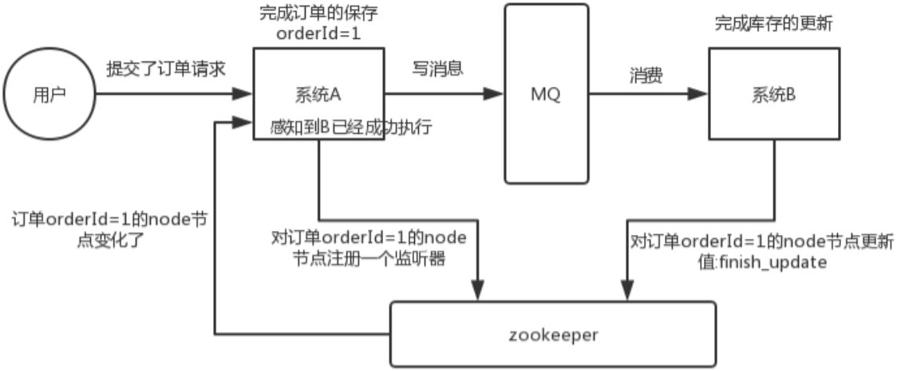

#### 分布式锁

举个栗子。对某一个数据连续发出两个修改操作，两台机器同时收到了请求，但是只能一台机器先执行完另外一个机器再执行。那么此时就可以使用 zookeeper 分布式锁，一个机器接收到了请求之后先获取 zookeeper 上的一把分布式锁，就是可以去创建一个 znode，接着执行操作；然后另外一个机器也尝试去创建那个 znode，结果发现自己创建不了，因为被别人创建了，那只能等着，等第一个机器执行完了自己再执行。

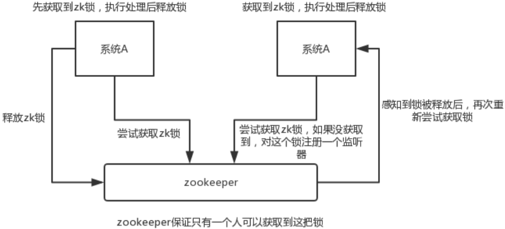

#### 元数据/配置信息管理

zookeeper 可以用作很多系统的配置信息的管理，比如 kafka、storm 等等很多分布式系统都会选用 zookeeper 来做一些元数据、配置信息的管理，包括 dubbo 注册中心不也支持 zookeeper 么？

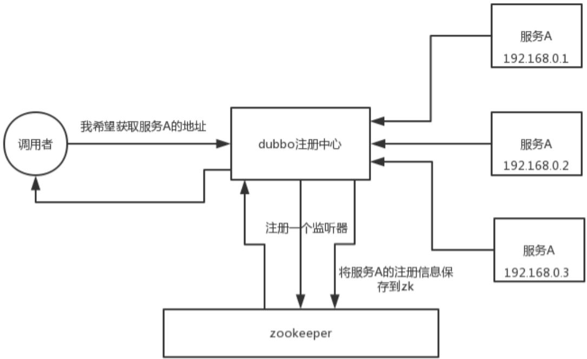

#### HA 高可用性

这个应该是很常见的，比如 hadoop、hdfs、yarn 等很多大数据系统，都选择基于 zookeeper 来开发 HA 高可用机制，就是一个重要进程一般会做主备两个，主进程挂了立马通过 zookeeper 感知到并切换到备用进程。

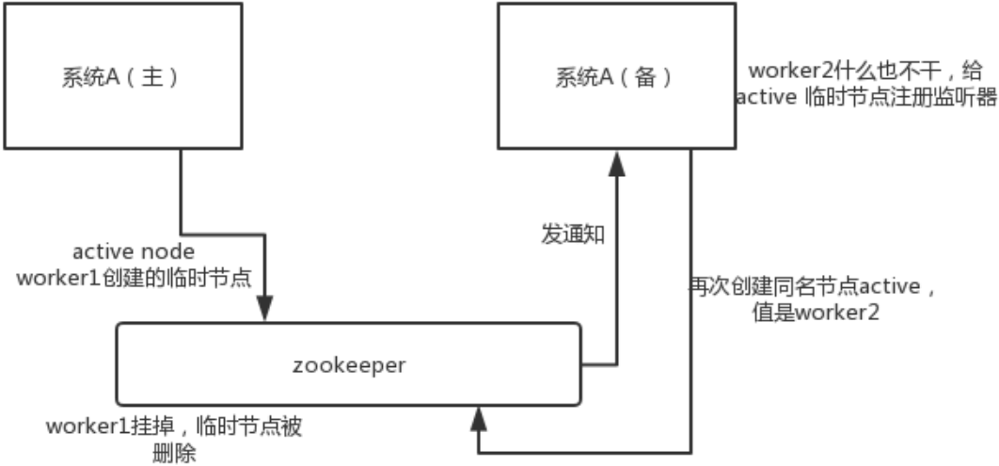

### 分布式锁如何设计？

其实一般问问题，都是这么问的，先问问你 zk，然后其实是要过渡到 zk 相关的一些问题里去，比如分布式锁。因为在分布式系统开发中，分布式锁的使用场景还是很常见的。

#### Redis 分布式锁

官方叫做 RedLock 算法，是 Redis 官方支持的分布式锁算法。

这个分布式锁有 3 个重要的考量点：

- 互斥（只能有一个客户端获取锁）
- 不能死锁
- 容错（只要大部分 Redis 节点创建了这把锁就可以）

##### Redis 最普通的分布式锁

第一个最普通的实现方式，就是在 Redis 里使用 `SET key value [EX seconds] [PX milliseconds] NX` 创建一个 key，这样就算加锁。其中：

- NX：表示只有 key 不存在的时候才会设置成功，如果此时 redis 中存在这个 key，那么设置失败，返回 nil。
- EX seconds：设置 key 的过期时间，精确到秒级。意思是 seconds 秒后锁自动释放，别人创建的时候如果发现已经有了就不能加锁了。
- PX milliseconds：同样是设置 key 的过期时间，精确到毫秒级。

比如执行以下命令：

```bash
SET resource_name my_random_value PX 30000 NX
```

释放锁就是删除 key，但是一般可以用 lua 脚本删除，判断 value 一样才删除：

```lua
-- 删除锁的时候，找到 key 对应的 value，跟自己传过去的 value 做比较，如果是一样的才删除。
if redis.call("get", KEYS[1]) == ARGV[1] then
    return redis.call("del", KEYS[1])
else
    return 0
end
```

为啥要用 `random_value` 随机值呢？因为如果某个客户端获取到了锁，但是阻塞了很长时间才执行完，比如说超过了 30s，此时可能已经自动释放锁了，此时可能别的客户端已经获取到了这个锁，要是你这个时候直接删除 key 的话会有问题，所以得用随机值加上面的 lua 脚本来释放锁。

但是这样是肯定不行的。因为如果是普通的 Redis 单实例，那就是单点故障。或者是 Redis 普通主从，那 Redis 主从异步复制，如果主节点挂了（key 就没有了），key 还没同步到从节点，此时从节点切换为主节点，别人就可以 set key，从而拿到锁。

##### RedLock 算法

这个场景是假设有一个 Redis cluster，有 5 个 Redis master 实例。然后执行如下步骤获取一把锁：

1. 获取当前时间戳，单位是毫秒；
2. 跟上面类似，轮流尝试在每个 master 节点上创建锁，超时时间较短，一般就几十毫秒（客户端为了获取锁而使用的超时时间比自动释放锁的总时间要小。例如，如果自动释放时间是 10 秒，那么超时时间可能在 5~50 毫秒范围内）；
3. 尝试在大多数节点上建立一个锁，比如 5 个节点就要求是 3 个节点 n / 2 + 1 ；
4. 客户端计算建立好锁的时间，如果建立锁的时间小于超时时间，就算建立成功了；
5. 要是锁建立失败了，那么就依次把之前建立过的锁删除；
6. 只要别人建立了一把分布式锁，你就得不断轮询去尝试获取锁。

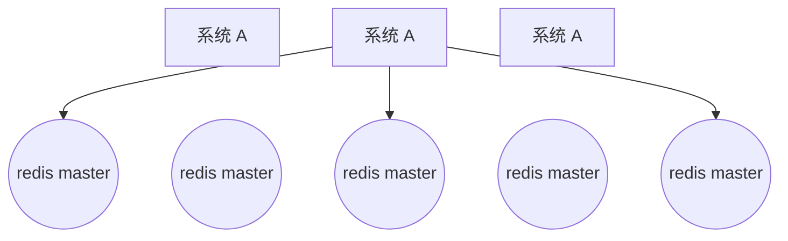

Redis 官方给出了以上两种基于 Redis 实现分布式锁的方法，详细说明可以查看：https://redis.io/topics/distlock。

#### zk 分布式锁

zk 分布式锁，其实可以做的比较简单，就是某个节点尝试创建临时 znode，此时创建成功了就获取了这个锁；这个时候别的客户端来创建锁会失败，只能注册个监听器监听这个锁。释放锁就是删除这个 znode，一旦释放掉就会通知客户端，然后有一个等待着的客户端就可以再次重新加锁。

```java
/**
 * ZooKeeperSession
 */
public class ZooKeeperSession {

    private static CountDownLatch connectedSemaphore = new CountDownLatch(1);

    private ZooKeeper zookeeper;
    private CountDownLatch latch;

    public ZooKeeperSession() {
        try {
            this.zookeeper = new ZooKeeper("192.168.31.187:2181,192.168.31.19:2181,192.168.31.227:2181", 50000, new ZooKeeperWatcher());
            try {
                connectedSemaphore.await();
            } catch (InterruptedException e) {
                e.printStackTrace();
            }

            System.out.println("ZooKeeper session established......");
        } catch (Exception e) {
            e.printStackTrace();
        }
    }

    /**
     * 获取分布式锁
     *
     * @param productId
     */
    public Boolean acquireDistributedLock(Long productId) {
        String path = "/product-lock-" + productId;

        try {
            zookeeper.create(path, "".getBytes(), Ids.OPEN_ACL_UNSAFE, CreateMode.EPHEMERAL);
            return true;
        } catch (Exception e) {
            while (true) {
                try {
                    // 相当于是给 node 注册一个监听器，去看看这个监听器是否存在
                    Stat stat = zk.exists(path, true);

                    if (stat != null) {
                        this.latch = new CountDownLatch(1);
                        this.latch.await(waitTime, TimeUnit.MILLISECONDS);
                        this.latch = null;
                    }
                    zookeeper.create(path, "".getBytes(), Ids.OPEN_ACL_UNSAFE, CreateMode.EPHEMERAL);
                    return true;
                } catch (Exception ee) {
                    continue;
                }
            }

        }
        return true;
    }

    /**
     * 释放掉一个分布式锁
     *
     * @param productId
     */
    public void releaseDistributedLock(Long productId) {
        String path = "/product-lock-" + productId;
        try {
            zookeeper.delete(path, -1);
            System.out.println("release the lock for product[id=" + productId + "]......");
        } catch (Exception e) {
            e.printStackTrace();
        }
    }

    /**
     * 建立 zk session 的 watcher
     */
    private class ZooKeeperWatcher implements Watcher {

        public void process(WatchedEvent event) {
            System.out.println("Receive watched event: " + event.getState());

            if (KeeperState.SyncConnected == event.getState()) {
                connectedSemaphore.countDown();
            }

            if (this.latch != null) {
                this.latch.countDown();
            }
        }

    }

    /**
     * 封装单例的静态内部类
     */
    private static class Singleton {

        private static ZooKeeperSession instance;

        static {
            instance = new ZooKeeperSession();
        }

        public static ZooKeeperSession getInstance() {
            return instance;
        }

    }

    /**
     * 获取单例
     *
     * @return
     */
    public static ZooKeeperSession getInstance() {
        return Singleton.getInstance();
    }

    /**
     * 初始化单例的便捷方法
     */
    public static void init() {
        getInstance();
    }

}
```

也可以采用另一种方式，创建临时顺序节点：

如果有一把锁，被多个人给竞争，此时多个人会排队，第一个拿到锁的人会执行，然后释放锁；后面的每个人都会去监听排在自己前面的那个人创建的 node 上，一旦某个人释放了锁，排在自己后面的人就会被 ZooKeeper 给通知，一旦被通知了之后，就 ok 了，自己就获取到了锁，就可以执行代码了。

```java
public class ZooKeeperDistributedLock implements Watcher {

    private ZooKeeper zk;
    private String locksRoot = "/locks";
    private String productId;
    private String waitNode;
    private String lockNode;
    private CountDownLatch latch;
    private CountDownLatch connectedLatch = new CountDownLatch(1);
    private int sessionTimeout = 30000;

    public ZooKeeperDistributedLock(String productId) {
        this.productId = productId;
        try {
            String address = "192.168.31.187:2181,192.168.31.19:2181,192.168.31.227:2181";
            zk = new ZooKeeper(address, sessionTimeout, this);
            connectedLatch.await();
        } catch (IOException e) {
            throw new LockException(e);
        } catch (KeeperException e) {
            throw new LockException(e);
        } catch (InterruptedException e) {
            throw new LockException(e);
        }
    }

    public void process(WatchedEvent event) {
        if (event.getState() == KeeperState.SyncConnected) {
            connectedLatch.countDown();
            return;
        }

        if (this.latch != null) {
            this.latch.countDown();
        }
    }

    public void acquireDistributedLock() {
        try {
            if (this.tryLock()) {
                return;
            } else {
                waitForLock(waitNode, sessionTimeout);
            }
        } catch (KeeperException e) {
            throw new LockException(e);
        } catch (InterruptedException e) {
            throw new LockException(e);
        }
    }

    public boolean tryLock() {
        try {
            // 传入进去的 locksRoot + "/" + productId
            // 假设 productId 代表了一个商品 id，比如说 1
            // locksRoot = locks
            // /locks/10000000000，/locks/10000000001，/locks/10000000002
            lockNode = zk.create(locksRoot + "/" + productId, new byte[0], ZooDefs.Ids.OPEN_ACL_UNSAFE, CreateMode.EPHEMERAL_SEQUENTIAL);

            // 看看刚创建的节点是不是最小的节点
            // locks：10000000000，10000000001，10000000002
            List<String> locks = zk.getChildren(locksRoot, false);
            Collections.sort(locks);

            if (lockNode.equals(locksRoot + "/" + locks.get(0))) {
                // 如果是最小的节点，则表示取得锁
                return true;
            }

            // 如果不是最小的节点，找到比自己小 1 的节点
            int previousLockIndex = -1;
            for (int i = 0; i < locks.size(); i++) {
                if (lockNode.equals(locksRoot + "/" +locks.get(i))){
                    previousLockIndex = i - 1;
                    break;
                }
            }

            this.waitNode = locks.get(previousLockIndex);
        } catch (KeeperException e) {
            throw new LockException(e);
        } catch (InterruptedException e) {
            throw new LockException(e);
        }
        return false;
    }

    private boolean waitForLock(String waitNode, long waitTime) throws InterruptedException, KeeperException {
        Stat stat = zk.exists(locksRoot + "/" + waitNode, true);
        if (stat != null) {
            this.latch = new CountDownLatch(1);
            this.latch.await(waitTime, TimeUnit.MILLISECONDS);
            this.latch = null;
        }
        return true;
    }

    public void unlock() {
        try {
            // 删除 /locks/10000000000 节点
            // 删除 /locks/10000000001 节点
            System.out.println("unlock " + lockNode);
            zk.delete(lockNode, -1);
            lockNode = null;
            zk.close();
        } catch (InterruptedException e) {
            e.printStackTrace();
        } catch (KeeperException e) {
            e.printStackTrace();
        }
    }

    public class LockException extends RuntimeException {
        private static final long serialVersionUID = 1L;

        public LockException(String e) {
            super(e);
        }

        public LockException(Exception e) {
            super(e);
        }
    }
}
```

但是，使用 zk 临时节点会存在另一个问题：由于 zk 依靠 session 定期的心跳来维持客户端，如果客户端进入长时间的 GC，可能会导致 zk 认为客户端宕机而释放锁，让其他的客户端获取锁，但是客户端在 GC 恢复后，会认为自己还持有锁，从而可能出现多个客户端同时获取到锁的情形。

针对这种情况，可以通过 JVM 调优，尽量避免长时间 GC 的情况发生。

#### redis 分布式锁和 zk 分布式锁的对比

- redis 分布式锁，其实需要自己不断去尝试获取锁，比较消耗性能。
- zk 分布式锁，获取不到锁，注册个监听器即可，不需要不断主动尝试获取锁，性能开销较小。

另外一点就是，如果是 Redis 获取锁的那个客户端 出现 bug 挂了，那么只能等待超时时间之后才能释放锁；而 zk 的话，因为创建的是临时 znode，只要客户端挂了，znode 就没了，此时就自动释放锁。

Redis 分布式锁大家没发现好麻烦吗？遍历上锁，计算时间等等，zk 的分布式锁语义清晰实现简单。

所以先不分析太多的东西，就说这两点，我个人实践认为 zk 的分布式锁比 Redis 的分布式锁牢靠、而且模型简单易用。

## 分布式事务

### 分布式事务了解吗？

只要聊到你做了分布式系统，必问分布式事务，你对分布式事务一无所知的话，确实会很坑，你起码得知道有哪些方案，一般怎么来做，每个方案的优缺点是什么。

现在面试，分布式系统成了标配，而分布式系统带来的分布式事务也成了标配了。因为你做系统肯定要用事务吧，如果是分布式系统，肯定要用分布式事务吧。先不说你搞过没有，起码你得明白有哪几种方案，每种方案可能有啥坑？比如 TCC 方案的网络问题、XA 方案的一致性问题。

分布式事务的实现主要有以下 6 种方案：

- XA 方案
- TCC 方案
- SAGA 方案
- 本地消息表
- 可靠消息最终一致性方案
- 最大努力通知方案

#### 两阶段提交方案/XA 方案

所谓的 XA 方案，即：两阶段提交，有一个事务管理器的概念，负责协调多个数据库（资源管理器）的事务，事务管理器先问问各个数据库你准备好了吗？如果每个数据库都回复 ok，那么就正式提交事务，在各个数据库上执行操作；如果任何其中一个数据库回答不 ok，那么就回滚事务。

这种分布式事务方案，比较适合单块应用里，跨多个库的分布式事务，而且因为严重依赖于数据库层面来搞定复杂的事务，效率很低，绝对不适合高并发的场景。如果要玩儿，那么基于 Spring + JTA 就可以搞定，自己随便搜个 demo 看看就知道了。

这个方案，我们很少用，一般来说某个系统内部如果出现跨多个库的这么一个操作，是不合规的。我可以给大家介绍一下，现在微服务，一个大的系统分成几十个甚至几百个服务。一般来说，我们的规定和规范，是要求每个服务只能操作自己对应的一个数据库。

如果你要操作别的服务对应的库，不允许直连别的服务的库，违反微服务架构的规范，你随便交叉胡乱访问，几百个服务的话，全体乱套，这样的一套服务是没法管理的，没法治理的，可能会出现数据被别人改错，自己的库被别人写挂等情况。

如果你要操作别人的服务的库，你必须是通过调用别的服务的接口来实现，绝对不允许交叉访问别人的数据库。

- 第一阶段，询问
- 第二阶段，执行

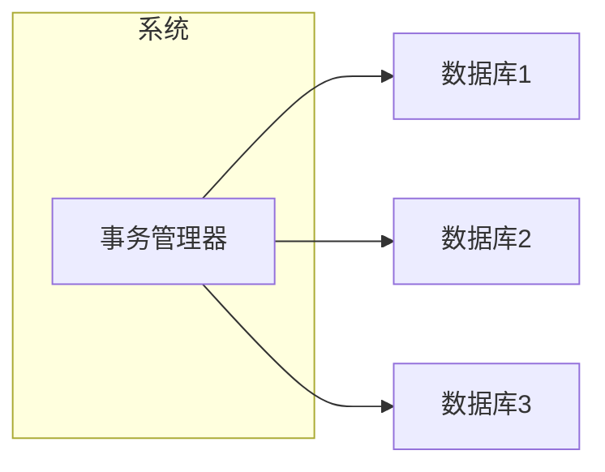

#### TCC 方案

TCC 的全称是：Try、Confirm、Cancel。

- Try 阶段：这个阶段说的是对各个服务的资源做检测以及对资源进行锁定或者预留。
- Confirm 阶段：这个阶段说的是在各个服务中执行实际的操作。
- Cancel 阶段：如果任何一个服务的业务方法执行出错，那么这里就需要进行补偿，就是执行已经执行成功的业务逻辑的回滚操作。（把那些执行成功的回滚）

这种方案说实话几乎很少人使用，我们用的也比较少，但是也有使用的场景。因为这个事务回滚实际上是严重依赖于你自己写代码来回滚和补偿了，会造成补偿代码巨大，非常之恶心。

比如说我们，一般来说跟钱相关的，跟钱打交道的，支付、交易相关的场景，我们会用 TCC，严格保证分布式事务要么全部成功，要么全部自动回滚，严格保证资金的正确性，保证在资金上不会出现问题。

而且最好是你的各个业务执行的时间都比较短。

但是说实话，一般尽量别这么搞，自己手写回滚逻辑，或者是补偿逻辑，实在太恶心了，那个业务代码是很难维护的。

```
Try 阶段：冻结银行资金

Confirm 阶段

1. 在自己的库里插入数据
2. 调用银行 B 的接囗，扣款
3. 调用银行 C 的接口，转账

Cancel 阶段：回滚

将银行 B 的扣款给他加回去
```

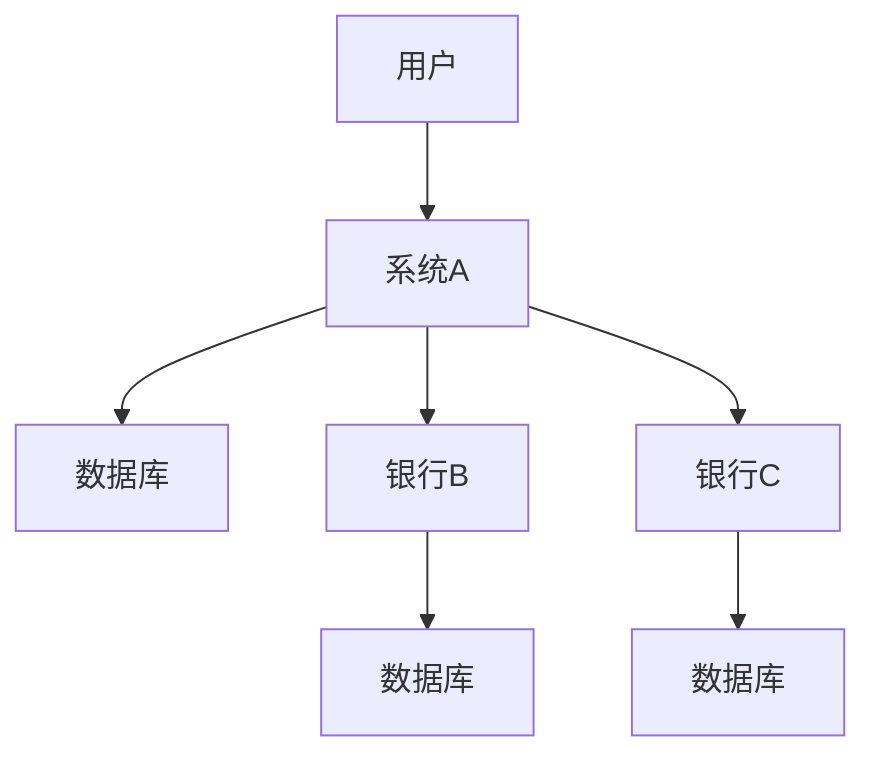

#### Saga 方案

金融核心等业务可能会选择 TCC 方案，以追求强一致性和更高的并发量，而对于更多的金融核心以上的业务系统 往往会选择补偿事务，补偿事务处理在 30 多年前就提出了 Saga 理论，随着微服务的发展，近些年才逐步受到大家的关注。目前业界比较公认的是采用 Saga 作为长事务的解决方案。

##### 基本原理

业务流程中每个参与者都提交本地事务，若某一个参与者失败，则补偿前面已经成功的参与者。下图左侧是正常的事务流程，当执行到 T3 时发生了错误，则开始执行右边的事务补偿流程，反向执行 T3、T2、T1 的补偿服务 C3、C2、C1，将 T3、T2、T1 已经修改的数据补偿掉。

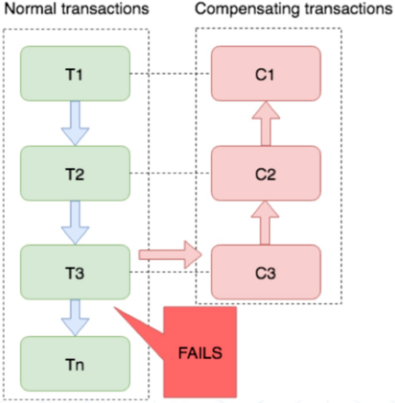

##### 使用场景

对于一致性要求高、短流程、并发高的场景，如：金融核心系统，会优先考虑 TCC 方案。而在另外一些场景下，我们并不需要这么强的一致性，只需要保证最终一致性即可。

比如很多金融核心以上的业务（渠道层、产品层、系统集成层），这些系统的特点是最终一致即可、流程多、流程长、还可能要调用其它公司的服务。这种情况如果选择 TCC 方案开发的话，一来成本高，二来无法要求其它公司的服务也遵循 TCC 模式。同时流程长，事务边界太长，加锁时间长，也会影响并发性能。

所以 Saga 模式的适用场景是：

- 业务流程长、业务流程多；
- 参与者包含其它公司或遗留系统服务，无法提供 TCC 模式要求的三个接口。

##### 优点

- 一阶段提交本地事务，无锁，高性能；
- 参与者可异步执行，高吞吐；
- 补偿服务易于实现，因为一个更新操作的反向操作是比较容易理解的。

##### 缺点

不保证事务的隔离性。

#### 本地消息表

本地消息表其实是国外的 ebay 搞出来的这么一套思想。

这个大概意思是这样的：

1. A 系统在自己本地一个事务里操作同时，插入一条数据到消息表；
2. 接着 A 系统将这个消息发送到 MQ 中去；
3. B 系统接收到消息之后，在一个事务里，往自己本地消息表里插入一条数据，同时执行其他的业务操作，如果这个消息已经被处理过了，那么此时这个事务会回滚，这样保证不会重复处理消息；
4. B 系统执行成功之后，就会更新自己本地消息表的状态以及 A 系统消息表的状态；
5. 如果 B 系统处理失败了，那么就不会更新消息表状态，那么此时 A 系统会定时扫描自己的消息表，如果有未处理的消息，会再次发送到 MQ 中去，让 B 再次处理；
6. 这个方案保证了最终一致性，哪怕 B 事务失败了，但是 A 会不断重发消息，直到 B 那边成功为止。

这个方案说实话最大的问题就在于严重依赖于数据库的消息表来管理事务啥的，如果是高并发场景咋办呢？咋扩展呢？所以一般确实很少用。

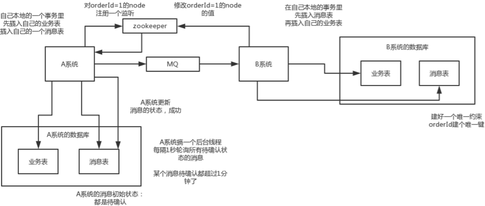

#### 可靠消息最终一致性方案

这个的意思，就是干脆不要用本地的消息表了，直接基于 MQ 来实现事务。比如阿里的 RocketMQ 就支持消息事务。

大概的意思就是：

1. A 系统先发送一个 prepared 消息到 mq，如果这个 prepared 消息发送失败那么就直接取消操作别执行了；
2. 如果这个消息发送成功过了，那么接着执行本地事务，如果成功就告诉 mq 发送确认消息，如果失败就告诉 mq 回滚消息；
3. 如果发送了确认消息，那么此时 B 系统会接收到确认消息，然后执行本地的事务；
4. mq 会自动定时轮询所有 prepared 消息回调你的接口，问你，这个消息是不是本地事务处理失败了，所有没发送确认的消息，是继续重试还是回滚？一般来说这里你就可以查下数据库看之前本地事务是否执行，如果回滚了，那么这里也回滚吧。这个就是避免可能本地事务执行成功了，而确认消息却发送失败了。
5. 这个方案里，要是系统 B 的事务失败了咋办？重试咯，自动不断重试直到成功，如果实在是不行，要么就是针对重要的资金类业务进行回滚，比如 B 系统本地回滚后，想办法通知系统 A 也回滚；或者是发送报警由人工来手工回滚和补偿。
6. 这个还是比较合适的，目前国内互联网公司大都是这么玩儿的，要不你就用 RocketMQ 支持的，要不你就自己基于类似 ActiveMQ？RabbitMQ？自己封装一套类似的逻辑出来，总之思路就是这样子的。

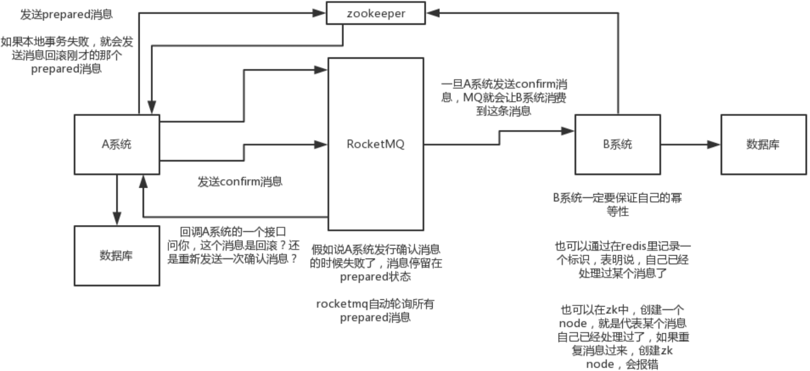

#### 最大努力通知方案

这个方案的大致意思就是：

1. 系统 A 本地事务执行完之后，发送个消息到 MQ；
2. 这里会有个专门消费 MQ 的最大努力通知服务，这个服务会消费 MQ 然后写入数据库中记录下来，或者是放入个内存队列也可以，接着调用系统 B 的接口；
3. 要是系统 B 执行成功就 ok 了；要是系统 B 执行失败了，那么最大努力通知服务就定时尝试重新调用系统 B，反复 N 次，最后还是不行就放弃。

#### 你们公司是如何处理分布式事务的？

如果你真的被问到，可以这么说，我们某某特别严格的场景，用的是 TCC 来保证强一致性；然后其他的一些场景基于阿里的 RocketMQ 来实现分布式事务。

你找一个严格资金要求绝对不能错的场景，你可以说你是用的 TCC 方案；如果是一般的分布式事务场景，订单插入之后要调用库存服务更新库存，库存数据没有资金那么的敏感，可以用可靠消息最终一致性方案。

友情提示一下，RocketMQ 3.2.6 之前的版本，是可以按照上面的思路来的，但是之后接口做了一些改变，我这里不再赘述了。

当然如果你愿意，你可以参考可靠消息最终一致性方案来自己实现一套分布式事务，比如基于 RocketMQ 来玩儿。

## 分布式会话

### 集群分布式 Session 如何实现？

面试官问了你一堆 Dubbo 是怎么玩儿的，你会玩儿 Dubbo 就可以把单块系统弄成分布式系统，然后分布式之后接踵而来的就是一堆问题，最大的问题就是分布式事务、接口幂等性、分布式锁，还有最后一个就是分布式 Session。

当然了，分布式系统中的问题何止这么一点，非常之多，复杂度很高，这里只是说一下常见的几个问题，也是面试的时候常问的几个。

Session 是啥？浏览器有个 Cookie，在一段时间内这个 Cookie 都存在，然后每次发请求过来都带上一个特殊的 `jsessionid cookie`，就根据这个东西，在服务端可以维护一个对应的 Session 域，里面可以放点数据。

一般的话只要你没关掉浏览器，Cookie 还在，那么对应的那个 Session 就在，但是如果 Cookie 没了，Session 也就没了。常见于什么购物车之类的东西，还有登录状态保存之类的。

这个不多说了，懂 Java 的都该知道这个。

单块系统的时候这么玩儿 Session 没问题，但是你要是分布式系统呢，那么多的服务，Session 状态在哪儿维护啊？

其实方法很多，但是常见常用的是以下几种：

#### 完全不用 Session

使用 JWT Token 储存用户身份，然后再从数据库或者 cache 中获取其他的信息。这样无论请求分配到哪个服务器都无所谓。

#### Tomcat + Redis

这个其实还挺方便的，就是使用 Session 的代码，跟以前一样，还是基于 Tomcat 原生的 Session 支持即可，然后就是用一个叫做 Tomcat RedisSessionManager 的东西，让所有我们部署的 Tomcat 都将 Session 数据存储到 Redis 即可。

在 Tomcat 的配置文件中配置：

```xml
<Valve className="com.orangefunction.tomcat.redissessions.RedisSessionHandlerValve" />

<Manager className="com.orangefunction.tomcat.redissessions.RedisSessionManager"
         host="{redis.host}"
         port="{redis.port}"
         database="{redis.dbnum}"
         maxInactiveInterval="60"/>
```

然后指定 Redis 的 host 和 port 就 ok 了。

```xml
<Valve className="com.orangefunction.tomcat.redissessions.RedisSessionHandlerValve" />
<Manager className="com.orangefunction.tomcat.redissessions.RedisSessionManager"
     sentinelMaster="mymaster"
     sentinels="<sentinel1-ip>:26379,<sentinel2-ip>:26379,<sentinel3-ip>:26379"
     maxInactiveInterval="60"/>
```

还可以用上面这种方式基于 Redis 哨兵支持的 Redis 高可用集群来保存 Session 数据，都是 ok 的。

#### Spring Session + Redis

上面所说的第二种方式会与 Tomcat 容器重耦合，如果我要将 Web 容器迁移成 Jetty，难道还要重新把 Jetty 都配置一遍？

因为上面那种 Tomcat + Redis 的方式好用，但是会严重依赖于 Web 容器，不好将代码移植到其他 Web 容器上去，尤其是你要是换了技术栈咋整？比如换成了 Spring Cloud 或者是 Spring Boot 之类的呢？

所以现在比较好的还是基于 Java 一站式解决方案，也就是 Spring。人家 Spring 基本上承包了大部分我们需要使用的框架，Spirng Cloud 做微服务，Spring Boot 做脚手架，所以用 Spring Session 是一个很好的选择。

在 pom.xml 中配置：

```xml
<dependency>
  <groupId>org.springframework.session</groupId>
  <artifactId>spring-session-data-redis</artifactId>
  <version>1.2.1.RELEASE</version>
</dependency>
<dependency>
  <groupId>redis.clients</groupId>
  <artifactId>jedis</artifactId>
  <version>2.8.1</version>
</dependency>
```

在 Spring 配置文件中配置：

```xml
<bean id="redisHttpSessionConfiguration"
     class="org.springframework.session.data.redis.config.annotation.web.http.RedisHttpSessionConfiguration">
    <property name="maxInactiveIntervalInSeconds" value="600"/>
</bean>

<bean id="jedisPoolConfig" class="redis.clients.jedis.JedisPoolConfig">
    <property name="maxTotal" value="100" />
    <property name="maxIdle" value="10" />
</bean>

<bean id="jedisConnectionFactory"
      class="org.springframework.data.redis.connection.jedis.JedisConnectionFactory" destroy-method="destroy">
    <property name="hostName" value="${redis_hostname}"/>
    <property name="port" value="${redis_port}"/>
    <property name="password" value="${redis_pwd}" />
    <property name="timeout" value="3000"/>
    <property name="usePool" value="true"/>
    <property name="poolConfig" ref="jedisPoolConfig"/>
</bean>
```

在 web.xml 中配置：

```xml
<filter>
    <filter-name>springSessionRepositoryFilter</filter-name>
    <filter-class>org.springframework.web.filter.DelegatingFilterProxy</filter-class>
</filter>
<filter-mapping>
    <filter-name>springSessionRepositoryFilter</filter-name>
    <url-pattern>/*</url-pattern>
</filter-mapping>
```

示例代码：

```java
@RestController
@RequestMapping("/test")
public class TestController {

    @RequestMapping("/putIntoSession")
    public String putIntoSession(HttpServletRequest request, String username) {
        request.getSession().setAttribute("name",  "leo");
        return "ok";
    }

    @RequestMapping("/getFromSession")
    public String getFromSession(HttpServletRequest request, Model model){
        String name = request.getSession().getAttribute("name");
        return name;
    }
}
```

上面的代码就是 ok 的，给 Spring Session 配置基于 Redis 来存储 Session 数据，然后配置了一个 Spring Session 的过滤器，这样的话，Session 相关操作都会交给 Spring Session 来管了。接着在代码中，就用原生的 Session 操作，就是直接基于 Spring Session 从 Redis 中获取数据了。

实现分布式的会话有很多种方式，我说的只不过是比较常见的几种方式，Tomcat + Redis 早期比较常用，但是会重耦合到 Tomcat 中；近些年，通过 Spring Session 来实现。

// TODO https://doocs.github.io/advanced-java/#/docs/distributed-system/dubbo-service-management
