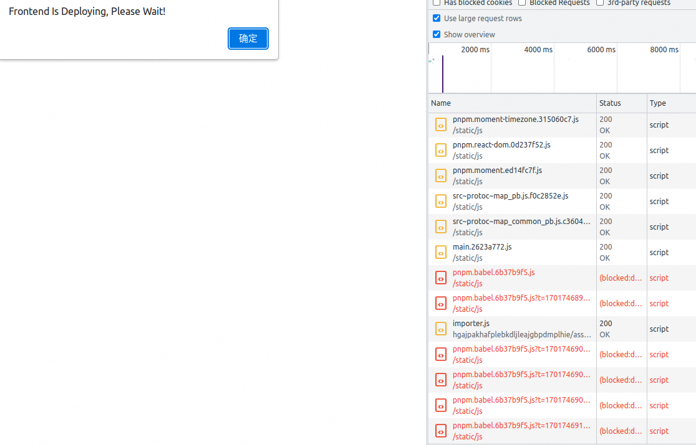

# 背景

在线上部署期间，或者用户长时间没有访问网页等等各种情况，有一定概率会出现以下形式的报错，导致网页白屏

```bash
Uncaught ChunkLoadError: Loading chunk <CHUNK_NAME> failed.
(error: <WEBSITE_PATH>/<CHUNK_NAME>-<CHUNK_HASH>.js)
```

# 原因与方案

由于现代前端工具链打包出来的，尤其是 webpack 的项目，其主入口默认不缓存，其他文件长期缓存，缓存的文件通过改变文件名（一般是 hash）来更新

所以在部署期间或者用户没有长时间打开网页，可能会请求已被删除的对应的 chunk 或者 chunk 虽然路径，文件名没变，但是内容改变导致有概率的白屏，所以针对此情况，有以下方案

1. 缓存所有版本的文件，但会造成空间浪费
2. 对打包出来的文件都不做缓存，但对服务器有很大压力
3. 可以通过一个 websocket 链接或者轮询来主动告知浏览器更新版本，但此方案过于繁重且需要后端支持
4. 对报错的文件重试，超过一定次数白屏，或者主动告知用户刷新页面

综上，采用方案 4

# 技术选型

对于方案 4，同样有 2 大类，编译时或运行时，选型对比如下

<table>
  <thead>
    <tr>
      <th>类型</th>
      <th>序号</th>
      <th>选型</th>
      <th>优点</th>
      <th>缺点</th>
   </tr>
   </thead>
  <tbody>
   <tr>
      <td rowspan="2">运行时</td>
      <td>1</td>
      <td>
         <a href="https://github.com/Nikaple/assets-retry" target="_blank">assets-retry</a> 以及 <a href="https://github.com/Nikaple/assets-retry/blob/master/README-cn.md" target="_blank">原理</a>
      </td>
      <td>接入简单</td>
      <td>重试的元素种类太多，对于白屏问题，只需要保证 js 需要重试</td>
   </tr>
   <tr>
      <td>2</td>
      <td>
         重写 react lazy 方法，对报错进行重试
      </td>
      <td>实现简单</td>
      <td>
         <ol>
            <li>
               不能监听到主入口的报错，需要用 window.error 补齐
            </li>
            <li>
               需要改动原始代码
            </li>
            <li>
               由于 webpack 的 chunk 加载机制，失败的 chunk 不能重试，原理见上面
            </li>
         </ol>
      </td>
    </tr>
    <tr>
      <td rowspan="2">编译时</td>
      <td>3</td>
      <td>
         <a href="https://github.com/mattlewis92/webpack-retry-chunk-load-plugin" target="_blank">webpack-retry-chunk-load-plugin</a>
      </td>
      <td>
         接入简单，很方便的实现 chunk 重试
      </td>
      <td>
         不能让主入口报错重试
      </td>
    </tr>
    <tr>
      <td>4</td>
      <td>
         <a href="https://github.com/mattlewis92/webpack-retry-chunk-load-plugin" target="_blank">webpack-retry-chunk-load-plugin</a> 以及
         <a href="https://gist.github.com/mishani0x0ef/b15a969c016fa01b85f413b712c40fa1" target="_blank">html-tag-attributes-plugin</a>
      </td>
      <td>
         接入简单
      </td>
      <td>
         需要自己实现主入口报错重试逻辑
      </td>
    </tr>
   </tbody>
</table>

其他参考链接如下:

1. [handle-loading-errors-fallback-with-htmlwebpackplugin](https://dev.to/igor_bykov/handle-loading-errors-fallback-with-htmlwebpackplugin-2d31)
2. [如何解决 JS 脚本加载失败的问题](https://baijiahao.baidu.com/s?id=1776343703094638001&wfr=spider&for=pc)
3. [webpack-code-splitting-chunkloaderror-loading-chunk-x-failed-but-the-chunk-e](https://stackoverflow.com/questions/69047420/webpack-code-splitting-chunkloaderror-loading-chunk-x-failed-but-the-chunk-e)

最终采用选型 4

# 实现过程

预研过程包含选型 2 与 4，注意这里的重试需要有间隔时间以及需要带额外的 `?` 参数防止缓存生效

## 重写 react lazy 方法

使用时可以直接替代 react 的 lazy 方法，但由于上面提到的缺点不采用此方案

importRetry.js

```js
import * as React from 'react';

const noop = () => {};
const strategies = {
   PARSE_ERROR_MESSAGE: (error, _) => {
      const url = new URL(error.request);
      return url.href;
   }
};

const defaultOpts = {
   strategy: 'PARSE_ERROR_MESSAGE',
   importFunction: (path) => import(/* @vite-ignore */ path),
   logger: noop
};

/**
 * Future improvements:
 * - cache successful variations to skip unnecessary lag on subsequent reloads
 */
// https://github.com/fatso83/retry-dynamic-import/blob/main/lib/retry.ts
function createDynamicImportWithRetry(maxRetries, opts = {}) {
   const resolvedOpts = {
      ...defaultOpts,
      ...opts
   };
   const { logger, importFunction, strategy } = resolvedOpts;

   return async (importer) => {
      try {
         return await importer();
      } catch (error) {
         logger(Date.now(), `Importing failed: `, error);

         const modulePath = strategies[strategy](error, importer);
         logger(`Parsed url using ${strategy}:${modulePath}`);

         if (!modulePath) {
            logger('Unable to determine path to module when trying to reload');
            // nothing we can do ...
            throw error;
         }

         // retry x times with 2 second delay base and backoff factor of 2 (1/2, 1, 2, 4, 8 seconds)
         //
         for (let i = -1; i < maxRetries; i++) {
            // add a timestamp to the url to force a reload the module (and not use the cached version - cache busting)
            let cacheBustedPath = `${modulePath}?t=${+new Date()}`;
            logger(Date.now(), `Trying re-import module using cache busted path: ${cacheBustedPath}`);

            try {
               return await importFunction(cacheBustedPath);
            } catch (e) {
               logger(`Import for ${cacheBustedPath} failed`);
               await new Promise((resolve) => setTimeout(resolve, 1000 * 2 ** i));
            }
         }
         throw error;
      }
   };
}

const MAX_RETRY_COUNT = 5;

const defaultDynamicImportWithRetry = createDynamicImportWithRetry(MAX_RETRY_COUNT, {
   logger: console.log
});

export function lazy(importer) {
   return process.env.NODE_ENV === 'development'
      ? React.lazy
      : React.lazy(() => defaultDynamicImportWithRetry(importer));
}
```

## webpack-retry-chunk-load-plugin + html-tag-attributes-plugin

plugins/html-tag-attributes-plugin.js

```js
const HtmlWebpackPlugin = require('html-webpack-plugin');

// For more information about plugin concepts, see: https://github.com/jantimon/html-webpack-plugin#events
class HtmlTagAttributesPlugin {
   static name = 'HtmlTagAttributesPlugin';

   constructor(options) {
      const defaultOptions = {
         script: {}
      };

      this.options = { ...defaultOptions, ...options };
   }

   apply(compiler) {
      compiler.hooks.compilation.tap(HtmlTagAttributesPlugin.name, (compilation) =>
         this._hookIntoHtmlAlterAssetTags(compilation)
      );
   }

   _hookIntoHtmlAlterAssetTags(compilation) {
      HtmlWebpackPlugin.getHooks(compilation).alterAssetTags.tapAsync(HtmlTagAttributesPlugin.name, (data, cb) =>
         cb(null, this._extendScriptTags(data))
      );
   }

   _extendScriptTags(data) {
      data.assetTags.scripts = data.assetTags.scripts.map(({ attributes, ...other }) => ({
         ...other,
         attributes: {
            ...attributes,
            ...this.options.script
         }
      }));

      return data;
   }
}

module.exports = { HtmlTagAttributesPlugin };
```

config-overrides.js

```js
const { RetryChunkLoadPlugin } = require('webpack-retry-chunk-load-plugin');
const { HtmlTagAttributesPlugin } = require('./plugins/html-tag-attributes-plugin');

const lastResortScript = "window.alert('Frontend Is Deploying, Please Wait!'); window.location.reload(true);";
const retryDelay = 4000;
const maxRetries = 5;

const isProd = env === 'production';

const localConfig = override(
   isProd &&
      addWebpackPlugin(
         new RetryChunkLoadPlugin({
            // optional stringified function to get the cache busting query string appended to the script src
            // if not set will default to appending the string `?cache-bust=true`
            cacheBust: `function() {
              return Date.now();
            }`,
            // optional value to set the amount of time in milliseconds before trying to load the chunk again. Default is 0
            // if string, value must be code to generate a delay value. Receives retryCount as argument
            // e.g. `function(retryAttempt) { return retryAttempt * 1000 }`
            retryDelay,
            // optional value to set the maximum number of retries to load the chunk. Default is 1
            maxRetries,
            // // optional list of chunks to which retry script should be injected
            // // if not set will add retry script to all chunks that have webpack script loading
            // chunks: ['chunkName'],
            // optional code to be executed in the browser context if after all retries chunk is not loaded.
            // if not set - nothing will happen and error will be returned to the chunk loader.
            lastResortScript
         })
      ),
   isProd &&
      addWebpackPlugin(
         new HtmlTagAttributesPlugin({
            script: {
               onerror: `
                // const isAsyncScript = event.target.defer || event.target.async
                // 暂时不包含对同步脚本的处理
                let retryCount = 0
                const retryFunc = async () => {
                  retryCount++
                  let cacheBustedPath = event.target.src + '?t=' + (+new Date())
                    const script = document.createElement('script')
                    script.src = cacheBustedPath
                    script.onerror = async () => {
                      await new Promise(resolve => setTimeout(resolve, ${retryDelay}))
                      if (retryCount === ${maxRetries}) {
                        ${lastResortScript}
                      } else {
                        retryFunc()
                      }
                    }
                    // webpack nonce for csp
                    const originalNonce = event.target.getAttribute('nonce')
                    if (originalNonce) {
                        script.setAttribute('nonce', originalNonce)
                    }
                    document.getElementsByTagName('head')[0].appendChild(script)
                }

                retryFunc()
              `
            }
         })
      )
);
```

# 效果展示

在主入口的 js 以及分包后的 chunk 报错后都会做重试 5 次的操作，超过 5 次弹窗提示用户在部署，点击确定后刷新页面再次重试


