# 培养 Pythonic 思维

## 第 1 条：查询自己使用的 Python 版本

```bash
$ python --version
$ python -V
$ python3 --version
$ python3 -V
```

```bash
>>> import sys
>>> print(sys.version_info)
sys.version_info(major=3, minor=6, micro=15, releaselevel='final', serial=0)
>>> print(sys.version)
3.6.15 (default, Apr 20 2022, 13:05:41)
[GCC 5.4.0 20160609]
```

Python 2 于 2020 年 1 月 1 日退场，到这一刻，所有的 bug 修复、安全补丁，以及特性向后移植都会停止。此后，如果你还坚持使用 Python 2，那么会面临很多不利因素，因为它不会再获得正式的维护了。深度依赖 Python 2 代码库的开发者可以考虑用 2to3（Python 预装的工具）与 [six](https://six.readthedocs.io/) 这样的工具过渡到 Python 3。

## 第 2 条：遵循 PEP 8 风格指南

### 与空白有关的建议

在 Python 中，空白（whitespace）在语法上相当重要。Python 程序员对空白字符的用法尤其在意，因为它们会影响代码的清晰程度。在这方面，大家应该遵循以下几条建议。

- 用空格（space）表示缩进，而不要用制表符（tab）。
- 和语法相关的每一层缩进都用 4 个空格表示。
- 每行不超过 79 个字符。
- 对于占据多行的长表达式来说，除了首行之外的其余各行都应该在通常的缩进级别之上再加 4 个空格。
- 在同一份文件中，函数与类之间用两个空行隔开。
- 在同一个类中，方法与方法之间用一个空行隔开。
- 使用字典时，键与冒号之间不加空格，写在同一行的冒号和值之间应该加一个空格。
- 给变量赋值时，赋值符号的左边和右边各加一个空格，并且只加一个空格就好。
- 给变量的类型做注解（annotation）时，不要把变量名和冒号隔开，但在类型信息前应该有一个空格。

### 与命名有关的建议

PEP 8 建议采用不同的方式来给 Python 代码中的各个部分命名，这样在阅读代码时，就可以根据这些名称看出它们在 Python 语言中的角色。遵循以下与命名相关的建议。

- 函数、变量及属性用小写字母来拼写，各单词之间用下划线相连，例如：`lowercase_underscore`。
- 受保护的实例属性，用一个下划线开头，例如：`_leading_underscore`。
- 私有的实例属性，用两个下划线开头，例如：`__double_leading_underscore`。
- 类（包括异常）命名时，每个单词的首字母均大写，例如：CapitalizedWord。
- 模块级别的常量，所有字母都大写，各单词之间用下划线相连，例如：`ALL_CAPS`。
- 类中的实例方法，应该把第一个参数命名为 self，用来表示该对象本身。
- 类方法的第一个参数，应该命名为 cls，用来表示这个类本身。

### 与表达式和语句有关的建议

The Zen of Python 中提到：`每件事都应该有简单的做法，而且最好只有一种`。PEP 8 就试着运用这个理念，来规范表达式和语句的写法。

- 采用行内否定，即把否定词直接写在要否定的内容前面，而不要放在整个表达式的前面，例如应该写 `if a is not b`，而不是 `if not a is b`。
- 不要通过长度判断容器或序列是不是空的，例如不要通过 `if len(somelist) == 0` 判断 somelist 是否为 `[]` 或 `''` 等空值，而是应该采用 `if not somelist` 这样的写法来判断，因为 Python 会把空值自动评估为 False。
- 如果要判断容器或序列里面有没有内容（比如要判断 somelist 是否为 `[1]` 或 `'hi'` 这样非空的值），也不应该通过长度来判断，而是应该采用 `if somelist` 语句，因为 Python 会把非空的值自动判定为 True。
- 不要把 if 语句、for 循环、while 循环及 except 复合语句挤在一行。应该把这些语句分成多行来写，这样更加清晰。
- 如果表达式一行写不下，可以用括号将其括起来，而且要适当地添加换行与缩进以便于阅读。多行的表达式，应该用括号括起来，而不要用 `\` 符号续行。

### 与引入有关的建议

PEP 8 对于怎样在代码中引入并使用模块，给出了下面几条建议。

- import 语句（含 `from x import y`）总是应该放在文件开头。
- 引入模块时，总是应该使用绝对名称，而不应该根据当前模块路径来使用相对名称。例如，要引入 bar 包中的 foo 模块，应该完整地写出 `from bar import foo`，即便当前路径为 bar 包里，也不应该简写为 `import foo`。
- 如果一定要用相对名称来编写 import 语句，那就应该明确地写成：`from . import foo`。文件中的 import 语句应该按顺序划分成三个部分：首先引入标准库里的模块，然后引入第三方模块，最后引入自己的模块。属于同一个部分的 import 语句按字母顺序排列。

## 第 3 条：了解 bytes 与 str 的区别

Python 有两种类型可以表示字符序列：一种是 bytes，另一种是 str。

bytes 实例包含的是原始数据，即 8 位的无符号值（通常按照 ASCII 编码标准来显示）。

```py
a = b'h\x65llo'
print(list(a))
print(a)

>>>
[104, 101, 108, 108, 111]
b'hello'
```

str 实例包含的是 Unicode 码点（code point，也叫作代码点），这些码点与人类语言之中的文本字符相对应。

```py
a = 'a\u0300 propos'
print(list(a))
print(a)

>>>
['a', '̀', ' ', 'p', 'r', 'o', 'p', 'o', 's']
à propos
```

两种不同的字符类型与 Python 中两种常见的使用情况相对应：

- 开发者需要操作原始的 8 位值序列，序列里面的这些 8 位值合起来表示一个应该按 UTF-8 或其他标准编码的字符串。
- 开发者需要操作通用的 Unicode 字符串，而不是操作某种特定编码的字符串。

我们通常需要编写两个辅助函数，以便在这两种情况之间转换，确保输入值类型符合开发者的预期形式。

第一个辅助函数接受 bytes 或 str 实例，并返回 str：

```py
def to_str(bytes_or_str):
    if isinstance(bytes_or_str, bytes):
        value = bytes_or_str.decode('utf-8')
    else:
        value = bytes_or_str
    return value # Instance of str

print(repr(to_str(b'foo')))
print(repr(to_str('bar')))

>>>
'foo'
'bar'
```

第二个辅助函数也接受 bytes 或 str 实例，但它返回的是 bytes：

```py
def to_bytes(bytes_or_str):
    if isinstance(bytes_or_str, str):
        value = bytes_or_str.encode('utf-8')
    else:
        value = bytes_or_str
    return value # Instance of bytes

print(repr(to_bytes(b'foo')))
print(repr(to_bytes('bar')))

>>>
b'foo'
b'bar'
```

在 Python 中使用原始的 8 位值与 Unicode 字符串时，有两个问题要注意。

第一个问题是，bytes 与 str 这两种类型似乎是以相同的方式工作的，但其实例并不相互兼容，所以在传递字符序列的时候必须考虑好其类型。

可以用 + 操作符将 bytes 添加到 bytes，str 也可以这样。

```py
print(b'one' + b'two')
print('one' + 'two')

>>>
b'onetwo'
onetwo
```

但是不能将 str 实例添加到 bytes 实例：

```py
b'one' + 'two'

>>>
Traceback ...
TypeError: can't concat str to bytes
```

也不能将 bytes 实例添加到 str 实例：

```py
'one' + b'two'

>>>
Traceback ...
TypeError: can only concatenate str (not "bytes") to str
```

bytes 与 bytes 之间可以用二元操作符（binary operator）来比较大小，str 与 str 之间也可以：

```py
assert b'red' > b'blue'
assert 'red' > 'blue'
```

但是 str 实例不能与 bytes 实例比较：

```py
assert 'red' > b'blue'

>>>
Traceback ...
TypeError: '>' not supported between instances of 'str' and 'bytes'
```

反过来也一样，也就是说 bytes 实例不能与 str 实例比较：

```py
assert b'blue' < 'red'

>>>
Traceback ...
TypeError: '<' not supported between instances of 'bytes' and 'str'
```

判断 bytes 与 str 实例是否相等，总是会评估为假（False），即便这两个实例表示的字符完全相同，它们也不相等。例如，在下面这个例子里，它们表示的字符串都相当于 ASCII 编码之中的 foo。

```py
print(b'foo' == 'foo')

>>>
False
```

两种类型的实例都可以出现在 % 操作符的右侧，用来替换左侧那个格式字符串（format string）里面的 %s。

```py
print(b'red %s' % b'blue')
print('red %s' % 'blue')

>>>
b'red blue'
red blue
```

如果格式字符串是 bytes 类型，那么不能用 str 实例来替换其中的 %s，因为 Python 不知道这个 str 应该按照什么方案来编码。

```py
print(b'red %s' % 'blue')

>>>
Traceback ...
TypeError: %b requires a bytes-like object, or an object that implements _bytes_, not 'str'
```

但反过来却可以，也就是说如果格式字符串是 str 类型，则可以用 bytes 实例来替换其中的 %s，问题是这可能跟你想要的结果不一样。

```py
print('red %s' % b'blue')

>>>
red b'blue'
```

这样做，会让系统在 bytes 实例上面调用 `__repr__` 方法（参见第 75 条），然后用这次调用所得到的结果替换格式字符串里的 %s，因此程序会直接输出 `b'blue'`，而不是像你想的那样，输出 blue 本身。

第二个问题发生在操作文件句柄的时候，这里的句柄指由内置的 open 函数返回的句柄。这样的句柄默认需要使用 Unicode 字符串操作，而不能采用原始的 bytes。习惯了 Python 2 的开发者，尤其容易碰到这个问题，进而导致程序出现奇怪的错误。例如，向文件写入二进制数据的时候，下面这种写法其实是错误的。

```py
with open('data.bin', 'w') as f:
   f.write(b'\xf1\xf2\xf3\xf4\xf5')

>>>
Traceback ...
TypeError: write() argument must be str, not bytes
```

程序发生异常是因为在调用 open 函数时，指定的是 `'w'` 模式，所以系统要求必须以文本模式写入。如果想用二进制模式，那应该指定 `'wb'` 才对。在文本模式下，write 方法接受的是包含 Unicode 数据的 str 实例，不是包含二进制数据的 bytes 实例。所以，我们得把模式改成 `'wb'` 来解决该问题。

```py
with open('data.bin', 'wb') as f:
   f.write(b'\xf1\xf2\xf3\xf4\xf5')
```

读取文件的时候也有类似的问题。例如，如果要把刚才写入的二进制文件读出来，那么不能用下面这种写法，同样需要改成 `'rb'`

```py
with open('data.bin', 'r') as f:
   data = f.read()

>>>
Traceback ...
UnicodeDecodeError: 'utf-8' codec can't decode byte 0xf1 in position 0: invalid continuation byte
```

另一种改法是在调用 open 函数的时候，通过 encoding 参数明确指定编码标准，以确保平台特有的一些行为不会干扰代码的运行效果。例如，假设刚才写到文件里的那些二进制数据表示的是一个采用 'cp1252' 标准（cp1252 是一种老式的 Windows 编码方案）来编码的字符串，则可以这样写

```py
with open('data.bin', 'r', encoding='cp1252') as f:
   data f.read()

assert data == 'ioooδ'
```

这样程序就不会出现异常了，但返回的字符串也与读取原始字节数据所返回的有很大区别。通过这个例子，我们要提醒自己注意当前操作系统默认的编码标准（可以执行 `python3 -c 'import locale; print(locale.getpreferredencoding())'` 命令查看），了解它与你所期望的是否一致。如果不确定，那就在调用 open 时明确指定 encoding 参数。

## 第 4 条：用支持插值的 f-string 取代 C 风格的格式字符串与 str.format 方法

Python 里面最常用的字符串格式化方式是采用 % 格式化操作符。

```py
a = 0b10111011
b = 0xc5f
print('Binary is %d, hex is %d' % (a, b))

>>>
Binary is 187, hex is 3167
```

但是 C 风格的格式字符串，在 Python 里有四个缺点。

1. 如果 % 右侧那个元组里面的值在类型或顺序上有变化，那么程序可能会因为转换类型时发生不兼容问题而出现错误。例如，下面这个简单的格式化表达式是正确的。

   ```py
   key = 'my_var'
   value = 1.234
   formatted = '%-10s = %.2f' % (key, value)
   print(formatted)

   >>>
   my_var     = 1.23
   ```

   但如果把 key 跟 value 互换位置，那么程序就会在运行时出现异常。

   ```py
   reordered_tuple = '%-10s = %.2f' % (value, key)

   >>>
   Traceback ...
   TypeError: must be real number, not str
   ```

   如果 % 右侧的写法不变，但左侧那个格式字符串里面的两个说明符对调了顺序，那么程序同样会发生这个错误。

2. 在填充模板之前，经常要先对准备填写进去的这个值稍微做一些处理，但这样一来，整个表达式可能就会写得很长，让人觉得比较混乱。下面这段代码用来罗列厨房里的各种食材，现在的这种写法并没有对填入格式字符串里面的那三个值（也就是食材的编号 i、食材的名称 item，以及食材的数量 count）预先做出调整。

   ```py
   pantry = [
      ('avocados', 1.25),
      ('bananas', 2.5),
      ('cherries', 15),
   ]

   for i, (item, count) in enumerate(pantry):
      print('#%d: %-10s = %.2f' % (i, item, count))

   >>>
   #0: avocados   = 1.25
   #1: bananas    = 2.50
   #2: cherries   = 15.00
   ```

   如果想让打印出来的信息更好懂，那可能得把这几个值稍微调整一下，但是调整之后，% 操作符右侧的那个三元组就特别长，所以需要多行拆分才能写得下，这会影响程序的可读性。

   ```py
   pantry = [
      ('avocados', 1.25),
      ('bananas', 2.5),
      ('cherries', 15),
   ]

   for i, (item, count) in enumerate(pantry):
      print('#%d: %-10s = %d' % (
         i + 1,
         item.title(),
         round(count)))

   >>>
   #1: Avocados   = 1
   #2: Bananas    = 2
   #3: Cherries   = 15
   ```

3. 如果想用同一个值来填充格式字符串里的多个位置，那么必须在 % 操作符右侧的元组中相应地多次重复该值。

   ```py
   template = '%s loves food. See %s cook.'
   name = 'Max'
   formatted = template % (name, name)
   print(formatted)

   >>>
   Max loves food. See Max cook.
   ```

   如果想在填充之前把这个值修改一下，那么必须同时修改多处才行，这尤其烦人，且容易出错。例如，如果这次要填的不是 name 而是 name.title()，那就必须提醒自己，要把所有的 name 都改成 name.title()。若是有的地方改了，有的地方没改，那输出的信息可能就不一致了。

   为了解决上面提到的一些问题，Python 的 % 操作符允许我们用 dict 取代 tuple，这样的话，我们就可以让格式字符串里面的说明符与 dict 里面的键以相应的名称对应起来，例如 %(key)s 这个说明符，意思就是用字符串（s）来表示 dict 里面名为 key 的那个键所保存的值。下面通过这种办法解决刚才讲的第一个缺点，也就是 % 操作符两侧的顺序不匹配问题。

   ```py
   key = 'my_var'
   value = 1.234
   old_way = '%-10s = %.2f' % (key, value)

   new_way = '%(key)-10s = %(value).2f' % {
      'key': key, 'value': value}  # Original

   reordered = '%(key)-10s = %(value).2f' % {
      'value': value, 'key': key}  # Swapped

   assert old_way == new_way == reordered
   ```

   这种写法还可以解决刚才讲的第三个缺点，也就是用同一个值替换多个格式说明符的问题。改用这种写法之后，我们就不用在 % 操作符右侧重复这个值了。

   ```py
   name = 'Max'
   template = '%s loves food .See %s cook.'
   before = template % (name, name)  # Tuple
   template = '%(name)s loves food .See %(name)s cook.'
   after = template % {'name': name}  # Dictionary
   assert before == after
   ```

   但是，这种写法会让刚才讲的第二个缺点变得更加严重，因为字典格式字符串的引入，我们必须给每一个值都定义键名，而且要在键名的右侧加冒号，格式化表达式变得更加冗长，看起来也更加混乱。我们把不采用 dict 的写法与采用 dict 的写法对比一下，可以更明确地意识到这种写法的缺点。

   ```py
   pantry = [
    ('avocados', 1.25),
    ('bananas', 2.5),
    ('cherries', 15),
   ]

   for i, (item, count) in enumerate(pantry):
      before = '#%d: %-10s = %d' % (
         i + 1,
         item.title(),
         round(count)
      )
      after = '#%(loop)d: %(item)-10s = %(count)d' % {
         'loop': i + 1,
         'item': item.title(),
         'count': round(count),
      }

      assert before == after
   ```

4. 把 dict 写到格式化表达式里面会让代码变多。每个键都至少要写两次：一次是在格式说明符中，还有一次是在字典中作为键，另外，定义字典的时候，可能还要专门用一个变量来表示这个键所对应的值，而且这个变量的名称或许也和键名相同，这样算下来就是三次了。

   ```py
   soup = 'lentil'
   formatted = 'Today\'s soup is %(soup)s.' % {'soup': soup}
   print(formatted)

   >>>
   Today's soup is lentil.
   ```

   除了要反复写键名，在格式化表达式里面使用 dict 的办法还会让表达式变得特别长，通常必须拆分为多行来写，同时，为了与格式字符串的多行写法相对应，定义字典的时候，也要一行一行地给每个键设定对应的值。

   ```py
   menu = {
    'soup': 'lentil',
    'oyster': 'kumamoto',
    'special': 'schnitzel',
   }

   template = ('Today\'s soup is %(soup)s, '
               'buy one get two %(oyster)s oysters, '
               'and our special entree is %(special)s.')
   formatted = template % menu
   print(formatted)

   >>>
   Today's soup is lentil, buy one get two kumamoto oysters, and our special entree is schnitzel.
   ```

   为了查看格式字符串中的说明符究竟对应于字典里的哪个键，必须在这两段代码之间来回跳跃，这会令人难以发现其中的 bug。如果要对键名稍做修改，那么必须同步修改格式字符串里的说明符，这更让代码变得相当烦琐，可读性更差。

### 内置的 format 函数与 str 类的 format 方法

Python 3 添加了高级字符串格式化（advanced string formatting）机制，它的表达能力比老式 C 风格的格式字符串要强，且不再使用 % 操作符。

```py
a = 1234.5678
formatted = format(a, ',.2f')
print(formatted)
b = 'my string'
formatted = format(b, '^20s')
print('*', formatted, '*')

>>>
1,234.57
*      my string       *
```

```py
key = 'my_var'
value = 1.234

formatted = '{} = {}'.format(key, value)
print(formatted)

>>>
my_var = 1.234
```

你可以在 {} 里写个冒号，然后把格式说明符写在冒号的右边，用以规定 format 方法所接收的这个值应该按照怎样的格式来调整。在 Python 解释器里输入 help('FORMATTING')，可以详细查看 str.format 使用的这套格式说明符所依据的规则。

```py
key = 'my_var'
value = 1.234

formatted = '{:<10} = {:.2f}'.format(key, value)
print(formatted)

>>>
my_var     = 1.23
```

运行过程：系统先把 str.format 方法接收到的每个值传给内置的 format 函数，并找到这个值在字符串里对应的 {}，同时将 {} 里面写的格式也传给 format 函数，例如系统在处理 value 的时候，传的就是 format(value, '.2f')。然后，系统会把 format 函数所返回的结果写在整个格式化字符串 {} 所在的位置。另外，每个类都可以通过 `__format__` 这个特殊的方法定制相应的逻辑，这样的话，format 函数在把该类实例转换成字符串时，就会按照这种逻辑来转换。

C 风格的格式字符串采用 % 操作符来引导格式说明符，所以如果要将这个符号照原样输出，那就必须转义，也就是连写两个 %。

```py
print('%.2f%%' % 12.5)
print('{} replaces {{}}'.format(1.23))

>>>
12.50%
1.23 replaces {}
```

调用 str.format 方法的时候，也可以给 str 的 {} 里面写上数字，用来指代 format 方法在这个位置所接收到的参数值位置索引。以后即使这些 {} 在格式字符串中的次序有所变动，也不用调换传给 format 方法的那些参数。于是，这就避免了前面讲的第一个缺点所提到的那个顺序问题。

```py
key = 'my_var'
value = 1.234

formatted = '{1} = {0}'.format(key, value)
print(formatted)

>>>
1.234 = my_var
```

同一个位置索引可以出现在 str 的多个 {} 里面，这些 {} 指代的都是 format 方法在对应位置所收到的值。这就不需要把这个值重复地传给 format 方法，于是就解决了前面提到的第三个缺点。

```py
name = 'Max'
formatted = '{0} loves food. See {0} cook.'.format(name)
print(formatted)

>>>
Max loves food. See Max cook.
```

然而，这个新的 str.format 方法并没有解决上面讲的第二个缺点。如果在对值做填充之前要先对这个值做出调整，那么用这种方法写出来的代码还是跟原来一样乱，阅读性差。把原来那种写法和现在的新写法对比一下，大家就会看到新写法并不比原来好多少。

```py
pantry = [
    ('avocados', 1.25),
    ('bananas', 2.5),
    ('cherries', 15),
]

for i, (item, count) in enumerate(pantry):
    old_style = '#%d: %-10s = %d' % (
        i + 1,
        item.title(),
        round(count))
    new_style = '#{}: {:<10s} = {}'.format(
        i + 1,
        item.title(),
        round(count))
    assert old_style == new_style
```

当然，这种 {} 形式的说明符，还支持一些比较高级的用法，例如可以查询 dict 中某个键的值，可以访问 list 里某个位置的元素，还可以把值转化成 Unicode 或 repr 字符串。下面这段代码把这三项特性结合了起来。

```py
menu = {
    'soup': 'lentil',
    'oyster': 'kumamoto',
    'special': 'schnitzel',
}

formatted = 'First letter is {menu[oyster][0]!r}'.format(
    menu=menu)
print(formatted)

>>>
First letter is 'k'
```

但是这些特性，依然不能解决前面提到的第四个缺点，也就是键名需要多次重复的那个问题。下面把 C 风格的格式化表达式与新的 str.format 方法对比一下，看看这两种写法在处理键值对形式的数据时有什么区别。

```py
old_template = (
    'Today\'s soup is %(soup)s, '
    'buy one get two %(oyster)s oysters, '
    'and our special entree is %(special)s.')
old_formatted = old_template % {
    'soup': 'lentil',
    'oyster': 'kumamoto',
    'special': 'schnitzel',
}

new_template = (
    'Today\'s soup is {soup}, '
    'buy one get two {oyster} oysters, '
    'and our special entree is {special}.')
new_formatted = new_template.format(
    soup='lentil',
    oyster='kumamoto',
    special='schnitzel',
)

assert old_formatted == new_formatted
```

新写法稍微好一点儿，因为它不用定义 dict 了，所以不需要把键名用 `' '` 给括起来。它的说明符也比旧写法的说明符要简单一些。然而这些优点并不突出。另外，虽然我们在新写法里面，可以访问字典中的键，也可以访问列表中的元素，但这些功能只涵盖了 Python 表达式的一小部分特性，str.format 方法还是没有能够把 Python 表达式的优势充分发挥出来。

### 插值格式字符串

Python 3.6 添加了一种新的特性，叫作插值格式字符串（interpolatedformat string，简称 f-string），可以解决上面提到的所有问题。新语法特性要求在格式字符串的前面加字母 f 作为前缀，这跟字母 b 与字母 r 的用法类似，也就是分别表示字节形式的字符串与原始的（或者说未经转义的）字符串的前缀。

f-string 把格式字符串的表达能力发挥到了极致，它彻底解决了上文提到的第四个缺点，也就是键名重复导致的程序冗余问题。我们不用再像使用 C 风格格式表达式时那样专门定义 dict，也不用再像调用 str.format 方法时那样专门把值传给某个参数，这次可以直接在 f-string 的 {} 里面引用当前 Python 范围内的所有名称，进而达到简化的目的。

```py
key = 'my_var'
value = 1.234

formatted = f'{key} = {value}'
print(formatted)

>>>
my_var = 1.234
```

str.format 方法所支持的那套迷你语言，也就是在 {} 内的冒号右侧所采用的那套规则，现在也可以用到 f-string 里面，而且还可以像早前使用 str.format 时那样，通过 ! 符号把值转化成 Unicode 及 repr 形式的字符串。

```py
key = 'my_var'
value = 1.234

formatted = f'{key!r:<10} = {value:.2f}'
print(formatted)

>>>
'my_var'   = 1.23
```

同一个问题，使用 f-string 来解决总是比通过 % 操作符使用 C 风格的格式字符串简单，而且也比 str.format 方法简单。下面按照从短到长的顺序把这几种写法所占的篇幅对比一下，每种写法里面的那个赋值符号（=）左侧都对齐到同一个位置，这样很容易看出符号右边的代码到底有多少。

```py
key = 'my_var'
value = 1.234

f_string = f'{key:<10} = {value:.2f}'
c_tuple = '%-10s = %.2f' % (key, value)
str_args = '{:<10} = {:.2f}'.format(key, value)
str_kw = '{key:<10} = {value:.2f}'.format(key=key,
                                          value=value)
c_dict = '%(key)-10s = %(value).2f' % {'key': key,
                                       'value': value}
assert c_tuple == c_dict == f_string
assert str_args == str_kw == f_string
```

在 f-string 方法中，各种 Python 表达式都可以出现在 {} 里，于是这就解决了前面提到的第二个缺点。我们现在可以用相当简洁的写法对需要填充到字符串里面的值做出微调。C 风格的写法与采用 str.format 方法的写法可能会让表达式变得很长，但如果改用 f-string，或许一行就能写完。

```py
pantry = [
    ('avocados', 1.25),
    ('bananas', 2.5),
    ('cherries', 15),
]

for i, (item, count) in enumerate(pantry):
    old_style = '#%d: %-10s = %d' % (
        i + 1,
        item.title(),
        round(count))
    new_style = '#{}: {:<10s} = {}'.format(
        i + 1,
        item.title(),
        round(count))
    f_string = f'#{i + 1}: {item.title():<10s} = {round(count)}'
    assert old_style == new_style == f_string
```

要是想表达得更清楚一些，可以把 f-string 写成多行的形式，类似于 C 语言的相邻字符串拼接（adjacent-string concatenation）。这样写虽然比单行的 f-string 要长，但仍然好过另外那两种多行的写法。

```py
pantry = [
    ('avocados', 1.25),
    ('bananas', 2.5),
    ('cherries', 15),
]

for i, (item, count) in enumerate(pantry):
    f_string = (
        f'# {i + 1}: '
        f'{item.title():<10s} = '
        f'{round(count)}'
    )
    print(f_string)

>>>
# 1: Avocados   = 1
# 2: Bananas    = 2
# 3: Cherries   = 15
```

Python 表达式也可以出现在格式说明符中。例如，下面的代码把小数点之后的位数用变量来表示，然后把这个变量的名字 places 用 {} 括起来放到格式说明符中，这样写比采用硬代码更灵活。

```py
places = 3
number = 1.23456
print(f'My number is {number:.{places}f}')

>>>
My number is 1.235
```

在 Python 内置的四种字符串格式化办法里面，f-string 可以简洁而清晰地表达出许多种逻辑，这使它成为程序员的最佳选择。如果你想把值以适当的格式填充到字符串里面，那么首先应该考虑的就是采用 f-string 来实现。

### 总结

1. 采用 % 操作符把值填充到 C 风格的格式字符串时会遇到许多问题，而且这种写法比较烦琐。
2. str.format 方法专门用一套迷你语言来定义它的格式说明符，这套语言给我们提供了一些有用的概念，但是在其他方面，这个方法还是存在与 C 风格的格式字符串一样的多种缺点，所以我们也应该避免使用它。
3. f-string 采用新的写法，将值填充到字符串之中，解决了 C 风格的格式字符串所带来的最大问题。f-string 是个简洁而强大的机制，可以直接在格式说明符里嵌入任意 Python 表达式。

## 第 5 条：用辅助函数取代复杂的表达式

Python 的语法相当简明，所以有时只用一条表达式就能实现许多逻辑。例如，要把 URL 之中的查询字符串拆分成键值对，那么只需要使用 parse_qs 函数就可以了。下面的例子会解析查询字符串之中的每个参数，并把这些参数跟它们所对应的整数值放到一份字典（dict）里面。

```py
from urllib.parse import parse_qs
my_values = parse_qs('red=5&blue=0&green=',
                     keep_blank_values=True)
print(repr(my_values))

>>>
{'red': ['5'], 'blue': ['0'], 'green': ['']}
```

在解析查询字符串时，可以发现，有的参数可能带有多个值，有的参数可能只有一个值，还有的参数可能是空白值，另外也会遇到根本没提供这个参数的情况。下面这三行代码分别通过 get 方法查询结果字典里面的三个参数，这刚好对应三种不同的情况：

```py
from urllib.parse import parse_qs
my_values = parse_qs('red=5&blue=0&green=',
                     keep_blank_values=True)

print('Red:         ', my_values.get('red'))
print('Green:       ', my_values.get('green'))
print('Opacity:     ', my_values.get('opacity'))

>>>
Red:          ['5']
Green:        ['']
Opacity:      None
```

如果能把参数缺失与参数为空白值这两种情况都默认当成 0，那就更好了。但这样一个小小的逻辑，似乎不值得专门写 if 语句或辅助函数，所以有人会直接用 Boolean 表达式实现。

Boolean 表达式用 Python 的语法写起来很简单，因为 Python 在对这种表达式求值的时候，会把空白字符串、空白 list 以及 0 值，全都当成 False 看待。所以，只需要把 get 方法查到的结果放在 or 操作符的左边，并且在右边写上 0 就行了。这样的话，只要左边的子表达式为 False，那么整个表达式的值自然就被评估为右边那个表达式的值，也就是 0。

```py
from urllib.parse import parse_qs
my_values = parse_qs('red=5&blue=0&green=',
                     keep_blank_values=True)

# For query string 'red=5&blue=0&green='
red = my_values.get('red', [''])[0] or 0
green = my_values.get('green', [''])[0] or 0
opacity = my_values.get('opacity', [''])[0] or 0
print(f'Red:     {red!r}')
print(f'Green:   {green!r}')
print(f'Opacity: {opacity!r}')

>>>
Red:     '5'
Green:   0
Opacity: 0
```

表达式写成这样，看起来很别扭，而且它并没有完全实现我们想要的效果，因为我们还得保证解析出来的参数值是能够直接参与数学运算的整数。于是，需要通过内置的 int() 把这种表达式所解析出来的字符串转换成整数。

```py
red = int(my_values.get('red', [''])[0] or 0)
```

现在的代码比原来更难读了，因为看上去比原来还要乱。这种代码让人觉得很可怕：如果你是第一次阅读该代码，那必须得把整个表达式逐层拆分，才能明白这行代码的意思，这要花很长时间。代码当然应该写得短一些，但并不意味着非得挤成一行。

Python 可以用 if/else 结构实现三元的条件表达式，这样写比刚才那种写法更清晰，且能保持代码简短。

```py
red_str = my_values.get('red', [''])
red = int(red_str[0]) if red_str[0] else 0
```

但在我们这个例子里，这种写法还是不如完整的多行 if/else 结构好，虽然要多写几行，但非常容易看懂。

```py
green_str = my_values.get('green', [''])
if green_str[0]:
    green = int(green_str[0])
else:
    green = 0
```

如果要反复使用这套逻辑，那还是写成辅助函数比较好，即使像下面这个例子一样只用两三次，也还是值得这样做。

```py
def get_first_int(values, key, default=0):
    found = values.get(key, [''])
    if found[0]:
        return int(found[0])
    return default
```

### 总结

1. Python 的语法很容易把复杂的意思挤到同一行表达式里，这样写很难懂。
2. 复杂的表达式，尤其是那种需要重复使用的复杂表达式，应该写到辅助函数里面。
3. 用 if/else 结构写成的条件表达式，要比用 or 与 and 写成的 Boolean 表达式更好懂。

## 第 6 条：把数据结构直接拆分到多个变量里，不要专门通过下标访问

Python 内置的元组（tuple）类型可以创建不可变的序列，把许多元素依次保存起来。最简单的用法是只用元组保存两个值，例如字典里面的键值对。

```py
snack_calories = {
    'chips': 140,
    'popcorn': 80,
    'nuts': 190,
}
items = tuple(snack_calories.items())
print(items)

>>>
(('chips', 140), ('popcorn', 80), ('nuts', 190))
```

我们可以用整数作下标，通过下标来访问元组里面对应的元素。

```py
item = ('Peanut butter', 'Jelly')
first = item[0]
second = item[1]
print(first, 'and', second)

>>>
Peanut butter and Jelly
```

创建好 tuple 之后，就不能通过下标给其中的元素赋新值了。

```py
pair = ('Chocolate', 'Peanut butter')
pair[0] = 'Honey'

>>>
Traceback ...
TypeError: 'tuple' object does not support item assignment
```

Python 还有一种写法，叫作拆分（unpacking）。这种写法让我们只用一条语句，就可以把元组里面的元素分别赋给多个变量。

```py
item = ('Peanut butter', 'Jelly')
first, second = item  # Unpacking
print(first, 'and', second)

>>>
Peanut butter and Jelly
```

通过 unpacking 来赋值要比通过下标去访问元组内的元素更清晰，而且这种写法所需的代码量通常比较少。当然，赋值操作的左边除了可以罗列单个变量，也可以写成列表、序列或任意深度的可迭代对象（iterable）。

```py
favorite_snacks = {
    'salty': ('pretzels', 100),
    'sweet': ('cookies', 180),
    'veggie': ('carrots', 20),
}

((type1, (name1, cals1)),
 (type2, (name2, cals2)),
 (type3, (name3, cals3))) = favorite_snacks.items()
print(f'Favorite {type1} is {name1} with {cals1} calories')
print(f'Favorite {type2} is {name2} with {cals2} calories')
print(f'Favorite {type3} is {name3} with {cals3} calories')

>>>
Favorite salty is pretzels with 100 calories
Favorite sweet is cookies with 180 calories
Favorite veggie is carrots with 20 calories
```

```py
snacks = [('bacon', 350), ('donut', 240), ('muffin', 190)]

for rank, (name, calories) in enumerate(snacks, 1):
    print(f'#{rank}: {name} has {calories} calories')

>>>
#1: bacon has 350 calories
#2: donut has 240 calories
#3: muffin has 190 calories
```

这才是符合 Python 风格的写法（Pythonic 式的写法），我们不需要再通过下标逐层访问了。这种写法可以节省篇幅，而且比较容易理解。

Python 的 unpacking 机制可以用在许多方面，例如构建列表（参见第 13 条）、给函数设计参数列表（参见第 22 条）、传递关键字参数（参见第 23 条）、接收多个返回值（参见第 19 条）等。

明智地使用 unpacking 机制，可以实现很多原来必须通过下标才能写出的功能，这让代码变得更加清晰，而且能充分发挥 Python 的优势。

### 总结

1. unpacking 是一种特殊的 Python 语法，只需要一行代码，就能把数据结构里面的多个值分别赋给相应的变量。
2. unpacking 在 Python 中应用广泛，凡是可迭代的对象都能拆分，无论它里面还有多少层迭代结构。
3. 尽量通过 unpacking 来拆解序列之中的数据，而不要通过下标访问，这样可以让代码更简洁、更清晰。

## 第 7 条：尽量用 enumerate 取代 range

Python 内置的 range 函数适合用来迭代一系列整数。

```py
from random import randint

random_bits = 0
for i in range(32):
    if randint(0, 1):
        random_bits |= 1 << i
print(bin(random_bits))

>>>
0b100101010010000001011011010011
```

如果要迭代的是某种数据结构，例如字符串列表，那么可以直接在这个序列上面迭代，用不着专门通过 range 设定一个取值范围，然后把这个范围里的每个整数值，依次当成下标来访问列表中的元素。

```py
flavor_list = ['vanilla', 'chocolate', 'pecan', 'strawberry']

for flavor in flavor_list:
    print(f'{flavor} is delicious')

>>>
vanilla is delicious
chocolate is delicious
pecan is delicious
strawberry is delicious
```

当然有的时候，在迭代 list 的过程中也需要知道当前处理的这个元素在 list 里的位置。例如，我把爱吃的冰激淋口味写在 `flavor_list` 列表里面，在打印每种口味时，我还想指出这种口味在自己心目中的排名。为了实现这样的功能，我们可以用传统的 range 方式来实现。

```py
flavor_list = ['vanilla', 'chocolate', 'pecan', 'strawberry']

for i in range(len(flavor_list)):
    flavor = flavor_list[i]
    print(f'{i+1}: {flavor}')

>>>
1: vanilla
2: chocolate
3: pecan
4: strawberry
```

`range(len(flavor_list))` 的写法太过复杂，可以用 enumerate 代替。enumerate 能够把任何一种迭代器（iterator）封装成惰性生成器（lazy generator，参见第 30 条）

```py
flavor_list = ['vanilla', 'chocolate', 'pecan', 'strawberry']

it = enumerate(flavor_list)
print(next(it))
print(next(it))

>>>
(0, 'vanilla')
(1, 'chocolate')
```

```py
flavor_list = ['vanilla', 'chocolate', 'pecan', 'strawberry']

for i, flavor in enumerate(flavor_list):
    print(f'{i + 1}: {flavor}')

>>>
1: vanilla
2: chocolate
3: pecan
4: strawberry
```

另外，还可以通过 enumerate 的第二个参数指定起始序号，这样就不用在每次打印的时候去调整了。例如，本例可以从 1 开始计算。

```py
for i, flavor in enumerate(flavor_list, 1):
    print(f'{i + 1}: {flavor}')
```

### 总结

1. enumerate 函数可以用简洁的代码迭代 iterator，而且可以指出当前这轮循环的序号。
2. 不要先通过 range 指定下标的取值范围，然后用下标去访问序列，而是应该直接用 enumerate 函数迭代。
3. 可以通过 enumerate 的第二个参数指定起始序号（默认为 0）。

## 第 8 条：用 zip 函数同时遍历两个迭代器

写 Python 代码时，经常会根据某份列表中的对象创建许多与这份列表有关的新列表。下面这样的列表推导机制，可以把表达式运用到源列表的每个元素上面，从而生成一份派生列表（参见第 27 条）。

```py
names = ['Cecilia', 'Lise', 'Marie']
counts = [len(n) for n in names]
print(counts)

>>>
[7, 4, 5]
```

派生列表中的元素与源列表中对应位置上面的元素有着一定的关系。如果想同时遍历这两份列表，那可以根据源列表的长度做迭代。

```py
names = ['Cecilia', 'Lise', 'Marie']
counts = [len(n) for n in names]

longest_name = None
max_count = 0
for i in range(len(names)):
    count = counts[i]
    if count > max_count:
        longest_name = names[i]
        max_count = count

print(longest_name)

>>>
Cecilia
```

这种写法的问题在于，整个循环代码看起来很乱。我们要通过下标访问 names 与 counts 这两个列表里的元素，所以表示下标的那个循环变量 i 在循环体里必须出现两次，这让代码变得不太好懂。改用 enumerate 实现（参见第 7 条）会稍微好一些，但仍然不够理想。

为了把代码写得更清楚，可以用 Python 内置的 zip 函数来实现。这个函数能把两个或更多的 iterator 封装成惰性生成器（lazy generator）。

```py
for name, count in zip(names, counts):
    if count > max_count:
        longest_name = name
        max_count = count
```

zip 每次只从它封装的那些迭代器里面各自取出一个元素，所以即便源列表很长，程序也不会因为占用内存过多而崩溃。但是，如果输入 zip 的那些列表的长度不一致，那就得小心了。例如，我给 names 列表里又添加了一个名字，但是忘了把它的长度更新到 counts 列表之中。在这种情况下，用 zip 同时遍历这两份列表，会产生奇怪的结果。

```py
names = ['Cecilia', 'Lise', 'Marie']
counts = [len(n) for n in names]

longest_name = None
max_count = 0
for name, count in zip(names, counts):
    if count > max_count:
        longest_name = name
        max_count = count

names.append('Rosalind')
for name, count in zip(names, counts):
    print(name)

>>>
Cecilia
Lise
Marie
```

zip 函数只要其中任何一个迭代器处理完毕，它就不再往下走了。于是，循环的次数实际上等于最短的那份列表所具备的长度。一般情况下，我们都是根据某份列表推导出其他几份列表，然后把这些列表一起封装到 zip 里面，由于这些列表长度相同，因此不会遇到刚才的问题。

在列表长度不同的情况下，zip 函数的提前终止行为可能跟你想实现的效果不一样。所以，如果无法确定这些列表的长度相同，那就不要把它们传给 zip，而是应该传给另一个叫作 `zip_longest` 的函数，这个函数位于内置的 itertools 模块里。

```py
import itertools

names = ['Cecilia', 'Lise', 'Marie']
counts = [len(n) for n in names]

longest_name = None
max_count = 0
for name, count in zip(names, counts):
    if count > max_count:
        longest_name = name
        max_count = count

names.append('Rosalind')

for name, count in itertools.zip_longest(names, counts):
    print(f'{name}: {count}')

>>>
Cecilia: 7
Lise: 4
Marie: 5
Rosalind: None
```

如果其中有些列表已经遍历完了，那么 `zip_longest` 会用当初传给 fillvalue 参数的那个值来填补空缺（本例中空缺的为字符串 `'Rosalind'` 的长度值），默认的参数值是 None。

### 总结

1. 内置的 zip 函数可以同时遍历多个迭代器。
2. zip 会创建惰性生成器，让它每次只生成一个元组，所以无论输入的数据有多长，它都是一个一个处理的。
3. 如果提供的迭代器的长度不一致，那么只要其中任何一个迭代完毕，zip 就会停止。如果想按最长的那个迭代器来遍历，那就改用内置的 itertools 模块中的 `zip_longest` 函数。

## 第 9 条：不要在 for 与 while 循环后面写 else 块

Python 的循环有一项大多数编程语言都不支持的特性，即可以把 else 块紧跟在整个循环结构的后面。

```py
for i in range(3):
    print('Loop', i)
else:
    print('Else block!')

>>>
Loop 0
Loop 1
Loop 2
Else block!
```

如果循环没有从头到尾执行完（也就是循环提前终止了），那么 else 块里的代码是不会执行的。在循环中使用 break 语句实际上会跳过 else 块。这个与实际想象中的功能差别较大

```py
for i in range(3):
    print('Loop', i)
    if i == 1:
        break
else:
    print('Else block!')

>>>
Loop 0
Loop 1
```

还有一个奇怪的地方是，如果对空白序列做 for 循环，那么程序立刻就会执行 else 块。

```py
for x in []:
    print('Never runs')
else:
    print('For Else block!')

>>>
For Else block!
```

while 循环也是这样，如果首次循环就遇到 False，那么程序也会立刻运行 else 块。

```py
while False:
    print('Never runs')
else:
    print('While Else block!')

>>>
While Else block!
```

把 else 设计成这样，是想让你利用它实现搜索逻辑。例如，如果要判断两个数是否互质（也就是除了 1 之外，是不是没有别的数能够同时整除它们），就可以用这种结构实现。先把有可能同时整除它们的数逐个试一遍，如果全都试过之后还是没找到这样的数，那么循环就会从头到尾执行完（这意味着循环没有因为 break 而提前跳出），然后程序就会执行 else 块里的代码。

```py
a = 4
b = 9

for i in range(2, min(a, b) + 1):
    print('Testing', i)
    if a % i == 0 and b % i == 0:
        print('Not coprime')
        break
else:
    print('Coprime')

>>>
Testing 2
Testing 3
Testing 4
Coprime
```

实际工作中，会改用辅助函数完成计算。这样的辅助函数有两种常见的写法。

1. 只要发现某个条件成立，就立刻返回，如果始终都没碰到这种情况，那么循环就会完整地执行，让程序返回函数末尾的那个值作为默认返回值。

   ```py
   def coprime(a, b):
      for i in range(2, min(a, b) + 1):
         if a % i == 0 and b % i == 0:
               return False
      return True

   assert coprime(4, 9)
   assert not coprime(3, 6)
   ```

2. 用变量来记录循环过程中有没有碰到这样的情况，如果有，那就用 break 提前跳出循环，如果没有，循环就会完整地执行，无论如何，最后都返回这个变量的值。

   ```py
   def coprime_alternate(a, b):
      is_coprime = True
      for i in range(2, min(a, b) + 1):
         if a % i == 0 and b % i == 0:
               is_coprime = False
               break
      return is_coprime

   assert coprime_alternate(4, 9)
   assert not coprime_alternate(3, 6)
   ```

for/else 或 while/else 结构本身虽然可以实现某些逻辑表达，但它带来的困惑，已经盖过了它的好处。

### 总结

1. Python 有种特殊的语法，可以把 else 块紧跟在整个 for 循环或 while 循环的后面。
2. 只有在整个循环没有因为 break 提前跳出的情况下，else 块才会执行
3. 把 else 块紧跟在整个循环后面，会让人不太容易看出这段代码的意思，所以要避免这样写。

## 第 10 条：用赋值表达式减少重复代码

赋值表达式（assignment expression）是 Python3.8 新引入的语法，它会用到海象操作符（walrus operator）。这种写法可以解决某些持续已久的代码重复问题。

这种表达式很有用，可以在普通的赋值语句无法应用的场合实现赋值，例如可以用在条件表达式的 if 语句里面。赋值表达式的值，就是赋给海象操作符左侧那个标识符的值。

举个例子。如果有一筐新鲜水果要给果汁店做食材，那我们就可以这样定义其中的内容：

```py
fresh_fruit = {
    'apple': 10,
    'banana': 8,
    'lemon': 5,
}

def make_lemonade(count):
    pass

def out_of_stock():
    pass

count = fresh_fruit.get('lemon', 0)
if count:
    make_lemonade(count)
else:
    out_of_stock()
```

这段代码看上去虽然简单，但还是显得有点儿松散，因为 count 变量虽然定义在整个 if/else 结构之上，然而只有 if 语句才会用到它，else 块根本就不需要使用这个变量。所以，这种写法让人误以为 count 是个重要的变量，if 和 else 都要用到它，但实际上并非如此。

我们在 Python 里面经常要先获取某个值，然后判断它是否非零，如果是就执行某段代码。对于这种用法，我们以前总是要通过各种技巧，来避免 count 这样的变量重复出现在代码之中，这些技巧有时会让代码变得比较难懂（参考第 5 条里面提到的那些技巧）。Python 引入赋值表达式正是为了解决这样的问题。下面改用海象操作符来写：

```py
if count := fresh_fruit.get('lemon', 0):
    make_lemonade(count)
else:
    out_of_stock()
```

新代码虽然只省了一行，但读起来却清晰很多，因为这种写法明确体现出 count 变量只与 if 块有关。这个赋值表达式先把 `:=` 右边的值赋给左边的 count 变量，然后对自身求值，也就是把变量的值当成整个表达式的值。由于表达式紧跟着 if，程序会根据它的值是否非零来决定该不该执行 if 块。这种先赋值再判断的做法，正是海象操作符想要表达的意思。

```py
fresh_fruit = {
    'apple': 10,
    'banana': 8,
    'lemon': 5,
}

def make_cider(count):
    pass

count = fresh_fruit.get('apple', 0)

if count >= 4:
    make_cider(count)
else:
    out_of_stock()
```

同理以上代码可以修改如下：

```py
if (count := fresh_fruit.get('apple', 0)) >= 4:
    make_lemonade(count)
else:
    out_of_stock()
```

与刚才那个例子一样，修改之后的代码也比原来少了一行。但是这次，我们还要注意另外一个现象：赋值表达式本身是放在一对括号里面的。为什么要这样做呢？因为我们要在 if 语句里面把这个表达式的结果跟 4 这个值相比较。刚才柠檬汁的例子没有加括号，因为那时只凭赋值表达式本身的值就能决定 if/else 的走向：只要表达式的值不是 0，程序就进入 if 分支。但是这次不行，这次要把这个赋值表达式放在更大的表达式里面，所以必须用括号把它括起来。当然，在没有必要加括号的情况下，还是尽量别加括号比较好。

还有一种类似的逻辑也会出现刚才说的重复代码，这指的是：我们要根据情况给某个变量赋予不同的值，紧接着要用这个变量做参数来调用某个函数。例如，若顾客要点香蕉冰沙，那我们首先得把香蕉切成好几份，然后用其中的两份来制作这道冰沙。如果不够两份，那就抛出香蕉不足（OutOfBananas）异常。下面用传统的写法实现这种逻辑：

```py
def slice_bananas(count):
    pass


class OutofBananas(Exception):
    pass


def make_smoothies(count):
    pass


fresh_fruit = {
    'apple': 10,
    'banana': 8,
    'lemon': 5,
}

pieces = 0
count = fresh_fruit.get('banana', 0)
if count >= 2:
    pieces = slice_bananas(count)

try:
    smoothies = make_smoothies(pieces)
except OutofBananas:
    out_of_stock()
```

还有一种传统的写法也很常见，就是把 if/else 结构上方那条 pieces = 0 的赋值语句移动到 else 块中。

```py
count = fresh_fruit.get('banana', 0)
if count >= 2:
    pieces = slice_bananas(count)
else:
    pieces = 0

try:
    smoothies = make_smoothies(pieces)
except OutofBananas:
    out_of_stock()
```

这种写法看上去稍微有点儿怪，因为 if 与 else 这两个分支都给 pieces 变量定义了初始值。根据 Python 的作用域规则，这种分别定义变量初始值的写法是成立的（参见第 21 条）。虽说成立，但这样写看起来比较别扭，所以很多人喜欢用第一种写法，也就是在进入 if/else 结构之前，先把 pieces 的初始值给设置好。

改用海象操作符来实现，可以少写一行代码，而且能够压低 count 变量的地位，让它只出现在 if 块里，这样我们就能更清楚地意识到 pieces 变量才是整段代码的重点。

```py
pieces = 0
if (count := fresh_fruit.get('banana', 0)) >= 2:
    pieces = slice_bananas(count)

try:
    smoothies = make_smoothies(pieces)
except OutofBananas:
    out_of_stock()
```

对于在 if 与 else 分支里面分别定义 pieces 变量的写法来说，海象操作符也能让代码变得清晰，因为这次不用再把 count 变量放到整个 if/else 块的上方了。

```py
if (count := fresh_fruit.get('banana', 0)) >= 2:
    pieces = slice_bananas(count)
else:
    pieces = 0

try:
    smoothies = make_smoothies(pieces)
except OutofBananas:
    out_of_stock()
```

Python 新手经常会遇到这样一种困难，就是找不到好办法来实现 switch/case 结构。最接近这种结构的做法是在 if/else 结构里面继续嵌套 if/else 结构，或者使用 if/elif/else 结构。

例如，我们想按照一定的顺序自动给客人制作饮品，这样就不用点餐了。下面这段逻辑先判断能不能做香蕉冰沙，如果不能，就做苹果汁，还不行，就做柠檬汁：

```py
count = fresh_fruit.get('banana', 0)
if count >= 2:
    pieces = slice_bananas(count)
    to_enjoy = make_smoothies(pieces)
else:
    count = fresh_fruit.get('apple', 0)
    if count >= 4:
        to_enjoy = make_cider(count)
    else:
        count = fresh_fruit.get('lemon', 0)
        if count:
            to_enjoy = make_lemonade(count)
        else:
            to_enjoy = 'Nothing'
```

这种难看的写法其实在 Python 代码里特别常见。幸好现在有了海象操作符，让我们能够轻松地模拟出很接近 switch/case 的方案。

```py
if (count := fresh_fruit.get('banana', 0)) >= 2:
    pieces = slice_bananas(count)
    to_enjoy = make_smoothies(pieces)
elif (count := fresh_fruit.get('apple', 0)) >= 4:
    to_enjoy = make_cider(count)
elif count := fresh_fruit.get('lemon', 0):
    to_enjoy = make_lemonade(count)
else:
    to_enjoy = 'Nothing'
```

这个版本只比原来短五行，但是看起来却清晰得多，因为嵌套深度与缩进层数都变少了。只要碰到刚才那种难看的结构，我们就应该考虑能不能改用海象操作符来写。

Python 新手还会遇到一个困难，就是缺少 do/while 循环结构。例如，我们要把新来的水果做成果汁并且装到瓶子里面，直到水果用完为止。下面先用普通的 while 循环来实现：

```py
def pick_fruit():
    pass


def make_juice(fruit, count):
    pass


bottles = []
fresh_fruit = pick_fruit()
while fresh_fruit:
    for fruit, count in fresh_fruit.items():
        batch = make_juice(fruit, count)
        bottles.extend(batch)
    fresh_fruit = pick_fruit()
```

这种写法必须把 `fresh_fruit = pick_fruit()` 写两次，第一次是在进入 while 循环之前，因为我们要给 `fresh_fruit` 设定初始值，第二次是在 while 循环体的末尾，因为我们得把下一轮需要处理的水果列表填充到 `fresh_fruit` 里面。如果想复用这行代码，可以考虑 loop-and-a-half 模式。这个模式虽然能消除重复，但是会让 while 循环看起来很笨，因为它成了无限循环，程序只能通过 break 语句跳出这个循环。

```py
bottles = []
while True:
   fresh_fruit = pick_fruit()
   if not fresh_fruit:
      break
    for fruit, count in fresh_fruit.items():
        batch = make_juice(fruit, count)
        bottles.extend(batch)
```

有了海象操作符，就不需要使用 `loop-and-a-half` 模式了，我们可以在每轮循环的开头给 `fresh_fruit` 变量赋值，并根据变量的值来决定要不要继续循环。这个写法简单易读，所以应该成为首选方案。

```py
bottles = []
while fresh_fruit := pick_fruit():
    for fruit, count in fresh_fruit.items():
        batch = make_juice(fruit, count)
        bottles.extend(batch)
```

在其他一些场合，赋值表达式也能缩减重复代码（参见第 29 条）。总之，如果某个表达式或赋值操作多次出现在一组代码里面，那就可以考虑用赋值表达式把这段代码改得简单一些。

### 总结

1. 赋值表达式通过海象操作符（:=）给变量赋值，并且让这个值成为这条表达式的结果，于是，我们可以利用这项特性来缩减代码。如果赋值表达式是大表达式里的一部分，就得用一对括号把它括起来。
2. 虽说 Python 不支持 switch/case 与 do/while 结构，但可以利用赋值表达式清晰地模拟出这种逻辑。

# 列表与字典

## 第 11 条：学会对序列做切片

Python 有这样一种写法，可以从序列里面切割（slice）出一部分内容，让我们能够轻松地获取原序列的某个子集合。最简单的用法就是切割内置的 list、str 与 bytes。其实，凡是实现了 `__getitem__` 与 `__setitem__` 这两个特殊方法的类都可以切割（参见第 43 条）。

最基本的写法是用 `somelist[start:end]` 这一形式来切割，也就是从 start 开始一直取到 end 这个位置，但不包含 end 本身的元素。

```py
a = ['a', 'b', 'c', 'd', 'e', 'f', 'g', 'h']
print('Middle two:   ', a[3:5])
print('All but ends: ', a[1:7])

>>>
Middle two:    ['d', 'e']
All but ends:  ['b', 'c', 'd', 'e', 'f', 'g']
```

如果是从头开始切割列表，那就应该省略冒号左侧的下标 0，这样看起来更清晰。

```py
assert a[:5] == a[0:5]
```

如果一直取到列表末尾，那就应该省略冒号右侧的下标，因为用不着专门把它写出来。

```py
assert a[5:] == a[5:len(a)]
```

用负数作下标表示从列表末尾往前算。下面这些切割方式，即便是刚看到这段代码的人也应该能明白是什么意思。

```py
a = ['a', 'b', 'c', 'd', 'e', 'f', 'g', 'h']
print(a[:]) # ['a', 'b', 'c', 'd', 'e', 'f', 'g', 'h']
print(a[:5]) # ['a', 'b', 'c', 'd', 'e']
print(a[:-1]) # ['a', 'b', 'c', 'd', 'e', 'f', 'g']
print(a[4:]) # ['e', 'f', 'g', 'h']
print(a[-3:]) # ['f', 'g', 'h']
print(a[2:5]) # ['c', 'd', 'e']
print(a[2:-1]) # ['c', 'd', 'e', 'f', 'g']
print(a[-3:-1]) # ['f', 'g']
```

如果起点与终点所确定的范围超出了列表的边界，那么系统会自动忽略不存在的元素。利用这项特性，很容易就能构造出一个最多只有若干元素的输入序列，例如：

```py
first_twenty_items = a[:20]
last_twenty_items = a[-20:]
```

切割时所用的下标可以越界，但是直接访问列表时却不行，那样会让程序抛出异常。

```py
a[20]

>>>
Traceback ...
IndexError: list index out of range
```

切割出来的列表是一份全新的列表。即便把某个元素换掉，也不会影响原列表中的相应位置。那个位置上的元素还是旧值。

```py
a = ['a', 'b', 'c', 'd', 'e', 'f', 'g', 'h']
b = a[3:]
print('Before:', b)
b[1] = 99
print('After: ', b)
print('No change:', a)

>>>
Before: ['d', 'e', 'f', 'g', 'h']
After:  ['d', 99, 'f', 'g', 'h']
No change: ['a', 'b', 'c', 'd', 'e', 'f', 'g', 'h']
```

切片可以出现在赋值符号的左侧，表示用右侧那些元素把原列表中位于这个范围之内的元素换掉。与 unpacking 形式的赋值不同，这种赋值不要求等号两边所指定的元素个数必须相同（如果是做 unpacking，那么等号左侧用来接收数值的变量个数必须与等号右边所提供的数值个数一致，例如 `a, b = c[:2]`，参见第 6 条）。在原列表中，位于切片范围之前和之后的那些元素会予以保留，但是列表的长度可能有所变化。例如在下面这个例子中，列表会变短，因为赋值符号右侧只提供了 3 个值，但是左侧那个切片却涵盖了 5 个值，列表会比原来少两个元素。

```py
a = ['a', 'b', 'c', 'd', 'e', 'f', 'g', 'h']
print('Before ', a)
a[2:7] = [99, 22, 14]
print('After  ', a)

>>>
Before  ['a', 'b', 'c', 'd', 'e', 'f', 'g', 'h']
After   ['a', 'b', 99, 22, 14, 'h']
```

下面这段代码会使列表变长，因为赋值符号右侧的元素数量比左侧那个切片所涵盖的元素数量要多。

```py
a = ['a', 'b', 'c', 'd', 'e', 'f', 'g', 'h']
print('Before ', a)
a[2:3] = [47, 11]
print('After  ', a)

>>>
Before  ['a', 'b', 'c', 'd', 'e', 'f', 'g', 'h']
After   ['a', 'b', 47, 11, 'd', 'e', 'f', 'g', 'h']
```

起止位置都留空的切片，如果出现在赋值符号右侧，那么表示给这个列表做副本，这样制作出来的新列表内容和原列表相同，但身份不同。

```py
b = a[:]
assert b == a and b is not a
```

把不带起止下标的切片放在赋值符号左边，表示是用右边那个列表的副本把左侧列表的全部内容替换掉（注意，左侧列表依然保持原来的身份，系统不会分配新的列表）。

```py
a = ['a', 'b', 'c', 'd', 'e', 'f', 'g', 'h']
b = a
c = a[:]
print('Before a', a)
print('Before b', b)
print('Before c', b)
a[:] = [101, 102, 103]
assert b is a and c is not a  # Still the same list object
print('After a ', a)  # Now has different contents
print('After b ', b)  # Same list, so same contents as a
print('After c ', c)  # Not same list, same contents as a

>>>
Before a ['a', 'b', 'c', 'd', 'e', 'f', 'g', 'h']
Before b ['a', 'b', 'c', 'd', 'e', 'f', 'g', 'h']
Before c ['a', 'b', 'c', 'd', 'e', 'f', 'g', 'h']
After a  [101, 102, 103]
After b  [101, 102, 103]
After c  ['a', 'b', 'c', 'd', 'e', 'f', 'g', 'h']
```

### 总结

1. 切片要尽可能写得简单一些：如果从头开始选取，就省略起始下标 0；如果选到序列末尾，就省略终止下标。
2. 切片允许起始下标或终止下标越界，所以很容易就能表达“取开头多少个元素”（例如 `a[:20]`）或“取末尾多少个元素”（例如 `a[-20:0]`）等含义，而不用担心切片是否真有这么多元素。
3. 把切片放在赋值符号的左侧可以将原列表中这段范围内的元素用赋值符号右侧的元素替换掉，但可能会改变原列表的长度。

## 第 12 条：不要在切片里同时指定起止下标与步进

除了基本的切片写法（参见第 11 条）外，Python 还有一种特殊的步进切片形式，也就是 somelist[start\:end\:stride]。这种形式会在每 n 个元素里面选取一个，这样很容易就能把奇数位置上的元素与偶数位置上的元素分别通过 `x[::2]` 与 `x[1::2]` 选取出来。

```py
x = ['red', 'orange', 'yellow', 'green', 'blue', 'purple']
odds = x[::2]
evens = x[1::2]
print(odds)
print(evens)

>>>
['red', 'yellow', 'blue']
['orange', 'green', 'purple']
```

带有步进的切片经常会引发意外的效果，并且使程序出现 bug。例如，Python 里面有个常见的技巧，就是把 -1 当成步进值对 bytes 类型的字符串做切片，这样就能将字符串反转过来。

```py
x = b'mongoose'
y = x[::-1]
print(y)

>>>
b'esoognom'
```

Unicode 形式的字符串也可以这样反转（参见第 3 条）。

```py
x = '多喝水'
y = x[::-1]
print(y)

>>>
水喝多
```

但如果把这种字符串编码成 UTF-8 标准的字节数据，就不能用这个技巧来反转了。

```py
x = '多喝水'
x = x.encode('utf-8')
y = x[::-1]
z = y.decode('utf-8')

>>>
Traceback ...
UnicodeDecodeError: 'utf-8' codec can't decode byte 0xb4 in position 0: invalid start byte
```

除了 -1 之外，用其他负数做步进值，有没有意义呢？请看下面的例子：

```py
x = ['a', 'b', 'c', 'd', 'e', 'f', 'g', 'h']
print(x[::2])  # ['a', 'c', 'e', 'g']
print(x[::-2])  # ['h', 'f', 'd', 'b']
```

上例中，`::2` 表示从头开始往后选，每两个元素里面选一个。`::-2` 的含义稍微有点儿绕，表示从末尾开始往前选，每两个元素里面选一个。

同时使用起止下标与步进会让切片很难懂。方括号里面写三个值显得太过拥挤，读起来不大容易，而且在指定了步进值（尤其是负数步进值）的时候，我们必须很仔细地考虑：这究竟是从前往后取，还是从后往前取？

为了避免这个问题，笔者建议大家不要把起止下标和步进值同时写在切片里。如果必须指定步进，那么尽量采用正数，而且要把起止下标都留空。即便必须同时使用步进值与起止下标，也应该考虑分成两次来写。

```py
y = x[::2]  # ['a', 'c', 'e', 'g']
z = y[1:-1] # ['c', 'e']
```

像刚才那样先隔位选取然后再切割，会让程序多做一次浅拷贝（shallow copy）。所以，应该把最能缩减列表长度的那个切片操作放在前面。如果程序实在没有那么多时间或内存去分两步操作，那么可以改用内置的 itertools 模块中的 islice 方法（参见第 36 条），这个方法用起来更清晰，因为它的起止位置与步进值都不能是负数。

### 总结

1. 同时指定切片的起止下标与步进值理解起来会很困难。
2. 如果要指定步进值，那就省略起止下标，而且最好采用正数作为步进值，尽量别用负数。
3. 不要把起始位置、终止位置与步进值全都写在同一个切片操作里。如果必须同时使用这三项指标，那就分两次来做（其中一次隔位选取，另一次做切割），也可以改用 itertools 内置模块里的 islice 方法。

## 第 13 条：通过带星号的 unpacking 操作来捕获多个元素，不要用切片

基本的 unpacking 操作（参见第 6 条）有一项限制，就是必须提前确定需要拆解的序列的长度。例如，销售汽车的时候，我们可能会把每辆车的车龄写在一份列表中，然后按照从大到小的顺序排列好。如果试着通过基本的 unpacking 操作获取其中最旧的两辆车，那么程序运行时会出现异常。

```py
car_ages = [0, 9, 4, 8, 7, 20, 19, 1, 6, 15]
car_ages_descending = sorted(car_ages, reverse=True)
oldest, second_oldest = car_ages_descending

>>>
Traceback ...
ValueError: too many values to unpack (expected 2)
```

Python 新手经常通过下标与切片（参见第 11 条）来处理这个问题。例如，可以明确通过下标把最旧和第二旧的那两辆车取出来，然后把其余的车放到另一份列表中。

```py
car_ages = [0, 9, 4, 8, 7, 20, 19, 1, 6, 15]
car_ages_descending = sorted(car_ages, reverse=True)
oldest = car_ages_descending[0]
second_oldest = car_ages_descending[1]
others = car_ages_descending[2:]
print(oldest, second_oldest, others)

>>>
20 19 [15, 9, 8, 7, 6, 4, 1, 0]
```

这样做没问题，但是下标与切片会让代码看起来很乱。而且，用这种办法把序列中的元素分成多个子集合，其实很容易出错，因为我们通常容易把下标多写或少写一个位置。例如，若修改了其中一行，但却忘了更新另一行，那就会遇到这种错误。

这个问题通过带星号的表达式（starred expression）来解决会更好一些，这也是一种 unpacking 操作，它可以把无法由普通变量接收的那些元素全都囊括进去。下面用带星号的 unpacking 操作改写刚才那段代码，这次既不用取下标，也不用做切片。

```py
car_ages = [0, 9, 4, 8, 7, 20, 19, 1, 6, 15]
car_ages_descending = sorted(car_ages, reverse=True)
oldest, second_oldest, *others = car_ages_descending
print(oldest, second_oldest, others)

>>>
20 19 [15, 9, 8, 7, 6, 4, 1, 0]
```

这样写简短易读，而且不容易出错，因为它不要求我们在修改完其中一个下标之后，还必须记得同步更新其他的下标。

这种带星号的表达式可以出现在任意位置，所以它能够捕获序列中的任何一段元素。

```py
car_ages = [0, 9, 4, 8, 7, 20, 19, 1, 6, 15]
car_ages_descending = sorted(car_ages, reverse=True)
oldest, *others, youngest = car_ages_descending
print(oldest, youngest, others)
*others, second_youngest, youngest = car_ages_descending
print(youngest, second_youngest, others)

>>>
20 0 [19, 15, 9, 8, 7, 6, 4, 1]
0 1 [20, 19, 15, 9, 8, 7, 6, 4]
```

只不过，在使用这种写法时，至少要有一个普通的接收变量与它搭配，否则就会出现 SyntaxError。例如不能像下面这样，只使用带星号的表达式而不搭配普通变量。

```py
car_ages = [0, 9, 4, 8, 7, 20, 19, 1, 6, 15]
car_ages_descending = sorted(car_ages, reverse=True)
*others = car_ages_descending

>>>
SyntaxError: starred assignment target must be in a list or tuple
```

另外，对于单层结构来说，同一级里面最多只能出现一次带星号的 unpacking。

```py
first, *middle, *second_middle, last = [1, 2, 3, 4]

>>>
SyntaxError: two starred expressions in assignment
```

如果要拆解的结构有很多层，那么同一级的不同部分里面可以各自出现带星号的 unpacking 操作。当然笔者并不推荐这种写法（类似的建议参见第 19 条）。这里举这样一个例子，是想帮助大家理解这种带星号的表达式可以实现怎样的拆分效果。

```py
car_inventory = {
    'Downtown': ('Silver Shadow', 'Pinto', 'DMC'),
    'Airport': ('Skyline', 'Viper', 'Gremlin', 'Nova'),
}

((loc1, (best1, *rest1)),
 (loc2, (best2, *rest2))) = car_inventory.items()
print(f'Best at {loc1} is {best1}, {len(rest1)} others')
print(f'Best at {loc2} is {best2}, {len(rest2)} others')

>>>
Best at Downtown is Silver Shadow, 2 others
Best at Airport is Skyline, 3 others
```

带星号的表达式总会形成一份列表实例。如果要拆分的序列里已经没有元素留给它了，那么列表就是空白的。如果能提前确定有待处理的序列里至少会有 N 个元素，那么这项特性就相当有用。

```py
short_list = [1, 2]
first, second, *rest = short_list
print(first, second, rest)

>>>
1 2 []
```

unpacking 操作也可以用在迭代器上，但是这样写与把数据拆分到多个变量里面的那种基本写法相比，并没有太大优势。例如，我可以先构造长度为 2 的取值范围（range），并把它封装在 it 这个迭代器里，然后将其中的值拆分到 first 与 second 这两个变量里。但这样写还不如直接使用形式相符的静态列表（例如[1, 2]），那样更简单。

```py
it = iter(range(1, 3))
first, second = it
print(f'{first} and {second}')

>>>
1 and 2
```

对迭代器做 unpacking 操作的好处，主要体现在带星号的用法上面，它使迭代器的拆分值更清晰。例如，这里有个生成器，每次可以从含有整个一周的汽车订单的 CSV 文件中取出一行数据。

```py
def generate_csv():
    yield ('Date', 'Make', 'Model', 'Year', 'Price')
    # ...
```

我们可以用下标和切片来处理这个生成器所给出的结果，但这样写需要很多行代码，而且看着比较混乱。

```py
def generate_csv():
    yield ('Date', 'Make', 'Model', 'Year', 'Price')
    yield ('Date', 'Make', 'Model', 'Year', 'Price')
    yield ('Date', 'Make', 'Model', 'Year', 'Price')
    yield ('Date', 'Make', 'Model', 'Year', 'Price')
    yield ('Date', 'Make', 'Model', 'Year', 'Price')
    # ...


all_csv_rows = list(generate_csv())
header = all_csv_rows[0]
rows = all_csv_rows[1:]
print('CSV Header:', header)
print('Row count:', len(rows))

>>>
CSV Header: ('Date', 'Make', 'Model', 'Year', 'Price')
Row count: 4
```

利用带星号的 unpacking 操作，我们可以把第一行（表头）单独放在 header 变量里，同时把迭代器所给出的其余内容合起来表示成 rows 变量。这样写就清楚多了。

```py
def generate_csv():
    yield ('Date', 'Make', 'Model', 'Year', 'Price')
    yield ('Date', 'Make', 'Model', 'Year', 'Price')
    yield ('Date', 'Make', 'Model', 'Year', 'Price')
    yield ('Date', 'Make', 'Model', 'Year', 'Price')
    yield ('Date', 'Make', 'Model', 'Year', 'Price')
    # ...


it = list(generate_csv())
header, *rows = it
print('CSV Header:', header)
print('Row count:', len(rows))

>>>
CSV Header: ('Date', 'Make', 'Model', 'Year', 'Price')
Row count: 4
```

带星号的这部分总是会形成一份列表，所以要注意，这有可能耗尽计算机的全部内存并导致程序崩溃。首先必须确定系统有足够的内存可以存储拆分出来的结果数据，然后才可以对迭代器使用带星号的 unpacking 操作（还有另一种做法，参见第 31 条）。

### 总结

1. 拆分数据结构并把其中的数据赋给变量时，可以用带星号的表达式，将结构中无法与普通变量相匹配的内容捕获到一份列表里。
2. 这种带星号的表达式可以出现在赋值符号左侧的任意位置，它总是会形成一份含有零个或多个值的列表。
3. 在把列表拆解成互相不重叠的多个部分时，这种带星号的 unpacking 方式比较清晰，而通过下标与切片来实现的方式则很容易出错。

## 第 14 条：用 sort 方法的 key 参数来表示复杂的排序逻辑

内置的列表类型提供了名叫 sort 的方法，可以根据多项指标给 list 实例中的元素排序。在默认情况下，sort 方法总是按照自然升序排列列表内的元素。例如，如果列表中的元素都是整数，那么它就按数值从小到大排列。

```py
numbers = [93, 86, 11, 68, 70]
numbers.sort()
print(numbers)

>>>
[11, 68, 70, 86, 93]
```

这里定义了一个 Tool 类表示各种建筑工具，它带有 `__repr__` 方法，因此我们能把这个类的实例打印成字符串。

如果仅仅这样写，那么这个由该类的对象所构成的列表是没办法用 sort 方法排序的，因为 sort 方法发现，排序所需要的特殊方法并没有定义在 Tool 类中。

```py
class Tool:
    def __init__(self, name, weight):
        self.name = name
        self.weight = weight

    def __repr__(self):
        return f'Tool({self.name!r}, {self.weight})'


tools = [
    Tool('level', 3.5),
    Tool('hammer', 1.25),
    Tool('screwdriver', 0.5),
    Tool('chisel', 0.25),
]

tools.sort()

>>>
Traceback ...
TypeError: '<' not supported between instances of 'Tool' and 'Tool'
```

下面用 lambda 关键字定义这样的一个函数，把它传给 sort 方法的 key 参数，让我们能够按照 name 的字母顺序排列这些 Tool 对象。

```py
class Tool:
    def __init__(self, name, weight):
        self.name = name
        self.weight = weight

    def __repr__(self):
        return f'Tool({self.name!r}, {self.weight})'


tools = [
    Tool('level', 3.5),
    Tool('hammer', 1.25),
    Tool('screwdriver', 0.5),
    Tool('chisel', 0.25),
]

print('Unsorted:', repr(tools))
tools.sort(key=lambda x: x.name)
print('\nSorted:', tools)

>>>
Unsorted: [Tool('level', 3.5), Tool('hammer', 1.25), Tool('screwdriver', 0.5), Tool('chisel', 0.25)]

Sorted: [Tool('chisel', 0.25), Tool('hammer', 1.25), Tool('level', 3.5), Tool('screwdriver', 0.5)]
```

有时我们可能需要用多个标准来排序。可以利用元组的特性：如果两个元组的首个元素相等，就比较第二个元素，如果仍然相等，就继续往下比较。

```py
class Tool:
    def __init__(self, name, weight):
        self.name = name
        self.weight = weight

    def __repr__(self):
        return f'Tool({self.name!r}, {self.weight})'


power_tools = [
    Tool('drill', 4),
    Tool('circular saw', 5),
    Tool('jackhammer', 40),
    Tool('sander', 4),
]

power_tools.sort(key=lambda x: (x.weight, x.name))
print(power_tools)

power_tools.sort(key=lambda x: (x.weight, x.name), reverse=True)
print(power_tools)

>>>
[Tool('drill', 4), Tool('sander', 4), Tool('circular saw', 5), Tool('jackhammer', 40)]
[Tool('jackhammer', 40), Tool('circular saw', 5), Tool('sander', 4), Tool('drill', 4)]
```

这种做法有个缺点，就是 key 函数所构造的这个元组只能按同一个排序方向来对比它所表示的各项指标（要是升序，就都得是升序；要是降序，就都得是降序），可以利用以下方法实现不同方向的排序

```py
power_tools.sort(key=lambda x: (-x.weight, x.name))
print(power_tools)
```

但是 str 类型不支持一元减操作符，可以通过多次调用 sort 方法实现不同方向的排序，这里利用了 sort 方法是稳定排序算法的原理

```py
power_tools.sort(key=lambda x: x.name)  # Name ascending
power_tools.sort(key=lambda x: x.weight, reverse=True)  # Weight descending
print(power_tools)
```

无论有多少项排序指标都可以按照这种思路来实现，而且每项指标可以分别按照各自的方向来排，不用全都是升序或全都是降序。只需要倒着写即可，也就是把最主要的那项排序指标放在最后一轮处理。在上面的例子中，首要指标是重量降序，次要指标是名称升序，所以先按名称升序排列，然后按重量降序排列。

尽管这两种思路都能实现同样的效果，但只调用一次 sort，还是要比多次调用 sort 更为简单。所以，在实现多个指标按不同方向排序时，应该优先考虑让 key 函数返回元组，并对元组中的相应指标取相反数。只有在万不得已的时候，才可以考虑多次调用 sort 方法。

### 总结

1. 列表的 sort 方法可以根据自然顺序给其中的字符串、整数、元组等内置类型的元素进行排序。
2. 普通对象如果通过特殊方法定义了自然顺序，那么也可以用 sort 方法来排列，但这样的对象并不多见。
3. 可以把辅助函数传给 sort 方法的 key 参数，让 sort 根据这个函数所返回的值来排列元素顺序，而不是根据元素本身来排列。
4. 如果排序时要依据的指标有很多项，可以把它们放在一个元组中，让 key 函数返回这样的元组。对于支持一元减操作符的类型来说，可以单独给这项指标取反，让排序算法在这项指标上按照相反的方向处理。
5. 如果这些指标不支持一元减操作符，可以多次调用 sort 方法，并在每次调用时分别指定 key 函数与 reverse 参数。最次要的指标放在第一轮处理，然后逐步处理更为重要的指标，首要指标放在最后一轮处理。

## 第 15 条：不要过分依赖给字典添加条目时所用的顺序

在 Python 3.5 与之前的版本中，迭代字典（dict）时所看到的顺序好像是任意的，不一定与当初把这些键值对添加到字典时的顺序相同。

```py
# Python 3.5
baby_names = {
    'cat': 'kitten',
    'dog': 'puppy',
}

print(baby_names)

>>>
{'dog': 'puppy', 'cat': 'kitten'}
```

之所以出现这种效果，是因为字典类型以前是用哈希表算法来实现的（这个算法通过内置的 hash 函数与一个随机的种子数来运行，而该种子数会在每次启动 Python 解释器时确定）。所以，这样的机制导致这些键值对在字典中的存放顺序不一定会与添加时的顺序相同，而且每次运行程序的时候，存放顺序可能都不一样。

从 Python 3.6 开始，字典会保留这些键值对在添加时所用的顺序，而且 Python 3.7 版的语言规范正式确立了这条规则。于是，在新版的 Python 里，总是能够按照当初创建字典时的那套顺序来遍历这些键值对。

```py
baby_names = {
    'cat': 'kitten',
    'dog': 'puppy',
}

print(baby_names)

>>>
{'cat': 'kitten', 'dog': 'puppy'}
```

在 Python 3.5 与之前的版本中，dict 所提供的许多方法（包括 keys、values、items 与 popitem 等）都不保证固定的顺序，所以让人觉得好像是随机处理的。

```py
baby_names = {
    'cat': 'kitten',
    'dog': 'puppy',
}

# Python 3.5
print(list(baby_names.keys()))
print(list(baby_names.values()))
print(list(baby_names.items()))
print(baby_names.popitem())  # Randomly chooses an item

>>>
['dog', 'cat']
['puppy', 'kitten']
[('dog', 'puppy'), ('cat', 'kitten')]
('dog', 'puppy')
```

在新版的 Python 中，这些方法已经可以按照当初添加键值对时的顺序来处理了。

```py
baby_names = {
    'cat': 'kitten',
    'dog': 'puppy',
}

print(list(baby_names.keys()))
print(list(baby_names.values()))
print(list(baby_names.items()))
print(baby_names.popitem())  # Randomly chooses an item

>>>
['cat', 'dog']
['kitten', 'puppy']
[('cat', 'kitten'), ('dog', 'puppy')]
('dog', 'puppy')
```

这项变化对 Python 中那些依赖字典类型及其实现细节的特性产生了很多影响。

函数的关键字参数（包括万能的 `**kwargs` 参数，参见第 23 条），以前是按照近乎随机的顺序出现的，这使函数调用操作变得很难调试。

```py
# Python 3.5
def my_func(**kwargs):
    for key, value in kwargs.items():
        print('%s = %s' % (key, value))


my_func(goose='gosling', kangaroo='joey')

>>>
kangaroo = joey
goose = gosling
```

现在，这些关键字参数总是能够保留调用函数时所指定的那套顺序。

```py
def my_func(**kwargs):
    for key, value in kwargs.items():
        print('%s = %s' % (key, value))


my_func(goose='gosling', kangaroo='joey')

>>>
goose = gosling
kangaroo = joey
```

另外，类也会利用字典来保存这个类的实例所具备的一些数据。在早前版本的 Python 中，对象（object）中的字段看上去好像是按随机顺序出现的。

```py
class MyClass:
    def __init__(self):
        self.alligator = 'hatchling'
        self.elephant = 'calf'


a = MyClass()
for key, value in a.__dict__.items():
    print('%s = %s' % (key, value))

>>>
# Python 3.5
elephant = calf
alligator = hatchling

# Python > 3.5
alligator = hatchling
elephant = calf
```

现在的 Python 语言规范已经要求，字典必须保留添加键值对时所依照的顺序。所以，我们可以利用这样的特征来实现一些功能，而且可以把它融入自己给类和函数所设计的 API 中。

> 其实，内置的 collections 模块早就提供了这种能够保留插入顺序的字典，叫作 OrderedDict。它的行为跟（Python 3.7 以来的）标准 dict 类型很像，但性能上有很大区别。如果要频繁插入或弹出键值对（例如要实现 least-recently-used 缓存），那么 OrderedDict 可能比标准的 Python dict 类型更合适（如何判断是否应该换用这种类型，请参见第 70 条）。

处理字典的时候，不能总是假设所有的字典都能保留键值对插入时的顺序。在 Python 中，我们很容易就能定义出特制的容器类型，并且让这些容器也像标准的 list 与 dict 等类型那样遵守相关的协议（参见第 43 条）。Python 不是静态类型的语言，大多数代码都以鸭子类型（duck typing）机制运作（也就是说，对象支持什么样的行为，就可以当成什么样的数据使用，而不用执着于它在类体系中的地位）。这种特性可能会产生意想不到的问题。

例如，现在要写一个程序，统计各种小动物的受欢迎程度。我们可以设定一个字典，把每种动物和它得到的票数关联起来。

```py
votes = {
    'otter': 1281,
    'polar bear': 587,
    'fox': 863,
}
```

现在定义一个函数来处理投票数据。用户可以把空的字典传给这个函数，这样的话，它就会把每个动物及其排名放到这个字典中。这种字典可以充当数据模型，给带有用户界面（UI）的元素提供数据。

```py
def populate_ranks(votes, ranks):
    names = list(votes.keys())
    names.sort(key=votes.get, reverse=True)
    for i, name in enumerate(names, 1):
        ranks[name] = i
```

我们还需要写一个函数来查出人气最高的动物。这个函数假定 populate_ranks 总是会按照升序向字典写入键值对，这样第一个出现在字典里的就应该是排名最靠前的动物。

```py
def get_winner(ranks):
    return next(iter(ranks))
```

下面来验证刚才设计的函数，看它们能不能实现想要的结果。

```py
votes = {
    'otter': 1281,
    'polar bear': 587,
    'fox': 863,
}


def populate_ranks(votes, ranks):
    names = list(votes.keys())
    names.sort(key=votes.get, reverse=True)
    for i, name in enumerate(names, 1):
        ranks[name] = i


def get_winner(ranks):
    return next(iter(ranks))


ranks = {}
populate_ranks(votes, ranks)
print(ranks)
winner = get_winner(ranks)
print(winner)

>>>
{'otter': 1, 'fox': 2, 'polar bear': 3}
otter
```

结果没有问题。但是，假设现在的需求变了，我们现在想要按照字母顺序在 UI 中显示，而不是像原来那样按照名次显示。为了实现这种效果，我们用内置的 collections.abc 模块定义这样一个类。这个类的功能和字典一样，而且会按照字母顺序迭代其中的内容。

```py
from collections.abc import MutableMapping


class SortedDict(MutableMapping):
    def __init__(self):
        self.data = {}

    def __getitem__(self, key):
        return self.data[key]

    def __setitem__(self, key, value):
        self.data[key] = value

    def __delitem__(self, key):
        del self.data[key]

    def __iter__(self):
        keys = list(self.data.keys())
        keys.sort()
        for key in keys:
            yield key

    def __len__(self):
        return len(self.data)


votes = {
    'otter': 1281,
    'polar bear': 587,
    'fox': 863,
}


def populate_ranks(votes, ranks):
    names = list(votes.keys())
    names.sort(key=votes.get, reverse=True)
    for i, name in enumerate(names, 1):
        ranks[name] = i


def get_winner(ranks):
    return next(iter(ranks))


sorted_ranks = SortedDict()
populate_ranks(votes, sorted_ranks)
print(sorted_ranks.data)
winner = get_winner(sorted_ranks)
print(winner)

>>>
{'otter': 1, 'fox': 2, 'polar bear': 3}
fox
```

没有得到预期的结果，为什么会这样呢？因为 `get_winner` 函数总是假设，迭代字典时的顺序应该跟 `populate_ranks` 函数当初向字典中插入数据时的顺序一样。但是这次，我们用的是 SortedDict 实例，而不是标准的 dict 实例，所以这项假设不成立。因此，函数返回的数据是按字母顺序排列时最先出现的那个数据，也就是 `'fox'`，有以下 3 种解决方案：

1. 重新实现 `get_winner` 函数，使它不再假设 ranks 字典总是能按照固定的顺序来迭代。这是最保险、最稳妥的一种方案。

   ```py
   def get_winner(ranks):
      for name, rank in ranks.items():
         if rank == 1:
               return name

   winner = get_winner(sorted_ranks)
   print(winner)

   >>>
   otter
   ```

2. 在函数开头先判断 ranks 是不是预期的那种标准字典（dict）。如果不是，就抛出异常。这个办法的运行性能要比刚才那种好。

   ```py
   def get_winner(ranks):
      if not isinstance(ranks, dict):
         raise TypeError('must provide a dict instance')
      return next(iter(ranks))

   get_winner(sorted_ranks)

   >>>
   Traceback ...
   TypeError: must provide a dict instance
   ```

3. 通过类型注解（type annotation）来保证传给 `get_winner` 函数的确实是个真正的 dict 实例，而不是那种行为跟标准字典类似的 MutableMapping（参见第 90 条）。下面就采用严格（strict）模式，针对含有注解的代码运行 mypy 工具。

   ```py
   from typing import Dict, MutableMapping

   def populate_ranks(votes: Dict[str, int],
                     ranks: Dict[str, int]) -> None:
      names = list(votes.keys())
      names.sort(key=votes.get, reverse=True)
      for i, name in enumerate(names, 1):
         ranks[name] = i

   def get_winner(ranks: Dict[str, int]) -> str:
      return next(iter(ranks))

   class SortedDict(MutableMapping[str, int]):
      def __init__(self):
         self.data = {}

      def __getitem__(self, key):
         return self.data[key]

      def __setitem__(self, key, value):
         self.data[key] = value

      def __delitem__(self, key):
         del self.data[key]

      def __iter__(self):
         keys = list(self.data.keys())
         keys.sort()
         for key in keys:
               yield key

      def __len__(self):
         return len(self.data)

   votes = {
      'otter': 1281,
      'polar bear': 587,
      'fox': 863,
   }

   sorted_ranks = SortedDict()
   populate_ranks(votes, sorted_ranks)
   print(sorted_ranks.data)
   winner = get_winner(sorted_ranks)
   print(winner)

   $ python3 -m mypy --strict test.py
   test.py:42: error: Argument 2 to "populate_ranks" has incompatible type "SortedDict"; expected "Dict[str, int]"
   test.py:44: error: Argument 1 to "get_winner" has incompatible type "SortedDict"; expected "Dict[str, int]"
   ```

   这样可以检查出类型不相符的问题，mypy 会标出错误的用法，指出函数要求的是 dict，但传入的却是 MutableMapping。这个方案既能保证静态类型准确，又不会影响程序的运行效率。

### 总结

1. 从 Python 3.7 版开始，我们就可以确信迭代标准的字典时所看到的顺序跟这些键值对插入字典时的顺序一致。
2. 在 Python 代码中，我们很容易就能定义跟标准的字典很像但本身并不是 dict 实例的对象。对于这种类型的对象，不能假设迭代时看到的顺序必定与插入时的顺序相同。
3. 如果不想把这种跟标准字典很相似的类型也当成标准字典来处理，那么可以考虑这样三种办法。

   1. 不要依赖插入时的顺序编写代码；
   2. 在程序运行时明确判断它是不是标准的字典；
   3. 给代码添加类型注解并做静态分析。

## 第 16 条：用 get 处理键不在字典中的情况，不要使用 in 与 KeyError

```py
counters = {
    'pumpernickel': 2,
    'sourdough': 1,
}

key = 'wheat'

if key not in counters:
    counters[key] = 0
counters[key] += 1

if key in counters:
    counters[key] += 1
else:
    counters[key] = 1

try:
    counters[key] += 1
except KeyError:
    counters[key] = 1
```

使用 get 来优化

```py
counters = {
    'pumpernickel': 2,
    'sourdough': 1,
}

key = 'wheat'

count = counters.get(key, 0)
counters[key] = count + 1
```

如果使用 setdefault 改写是有问题的，这会有一次访问、两次赋值操作

而且 setdefault 不管是否有这个键，都会执行默认值的分配，这会造成比较大的性能开销

```py
count = counters.setdefault(key, 0)
counters[key] = count + 1
```

缓解性能问题的话，可以用 get 方法加赋值表达式，也可以直接用 defaultdict

```py
names = votes.get(key)
if names is None:
    votes[key] = names = []
names.append(who)

# 或者使用赋值表达式
if (names := votes.get(key)) is None:
    votes[key] = names = []
names.append(who)
```

只有与键相关联的默认值构造起来开销很低且可以变化，而且不用担心异常问题（例如 list 实例）。在这种情况下可以使用 setdefault，然而一般也优先考虑使用 defaultdict 取代 dict

### 总结

1. 有四种办法可以处理键不在字典中的情况：in 表达式、KeyError 异常、get 方法与 setdefault 方法。
2. 如果跟键相关联的值是像计数器这样的基本类型，那么 get 方法就是最好的方案；如果是那种构造起来开销比较大，或是容易出异常的类型，那么可以把这个方法与赋值表达式结合起来使用。
3. 即使看上去最应该使用 setdefault 方案，也不一定要真的使用 setdefault 方案，而是可以考虑用 defaultdict 取代普通的 dict。

## 第 17 条：用 defaultdict 处理内部状态中缺失的元素，而不要用 setdefault

通过 setdefault 方案把新的城市添加到对应的集合里，这要比利用 get 方法与赋值表达式（Python3.8 的新特性）来实现的方案短很多。

```py
visits = {
    'Mexico': {'Tulum', 'Puerto Vallarta'},
    'Japan': {'Hakone'},
}

visits.setdefault('France', set()).add('Arles')  # Short
if (japan := visits.get('Japan')) is None:  # Long
    visits['Japan'] = japan = set()
japan.add('Kyoto')

print(visits)

>>>
{'Mexico': {'Tulum', 'Puerto Vallarta'}, 'Japan': {'Kyoto', 'Hakone'}, 'France': {'Arles'}}
```

如果程序所访问的这个字典需要由你自己明确地创建，那又该怎么写？

```py
class Visits:
    def __init__(self):
        self.data = {}

    def add(self, country, city):
        city_set = self.data.setdefault(country, set())
        city_set.add(city)


visits = Visits()
visits.add('Russia', 'Yekaterinburg')
visits.add('Tanzania', 'Zanzibar')
print(visits.data)

>>>
{'Russia': {'Yekaterinburg'}, 'Tanzania': {'Zanzibar'}}
```

以上代码有以下问题

1. 调用了名字很怪的 setdefault 方法，很难让人理解发生了什么
2. 每次调用 add 方法，都会构造新的 set 实例

改用 defaultdict 可以解决以上问题，它会在键缺失的情况下，自动添加这个键以及键所对应的默认值，每次发现键不存在时，该字典都会调用这个函数返回一份新的默认值

```py
from collections import defaultdict


class Visits:
    def __init__(self):
        self.data = defaultdict(set)

    def add(self, country, city):
        self.data[country].add(city)


visits = Visits()
visits.add('England', 'Bath')
visits.add('England', 'London')
print(visits.data)

>>>
defaultdict(<class 'set'>, {'England': {'Bath', 'London'}})
```

### 总结

1. 如果你管理的字典可能需要添加任意的键，那么应该考虑能否用内置的 collections 模块中的 defaultdict 实例来解决问题。
2. 如果这种键名比较随意的字典是别人传给你的，你无法把它创建成 defaultdict，那么应该考虑通过 get 方法访问其中的键值。然而，在个别情况下，也可以考虑改用 setdefault 方法，因为那样写更短。

## 第 18 条：学会利用 `__missing__` 构造依赖键的默认值

```py
pictures = {}
path = 'profile_1234.png'
if (handle := pictures.get(path)) is None:
    try:
        handle = open(path, 'a+b')
    except OSError:
        print(f'Failed to open path {path}')
        raise
    else:
        pictures[path] = handle

handle.seek(0)
image_data = handle.read()
```

如果改成 setdefault

```py
pictures = {}
path = 'profile_1234.png'
try:
    handle = pictures.setdefault(path, open(path, 'a+b'))
except OSError:
    print(f'Failed to open path {path}')
    raise
else:
    handle.seek(0)

image_data = handle.read()
```

然而使用 setdefault 实现会有以下问题

1. 即便图片的路径名已经在字典里了，程序也还是得调用内置的 open 函数创建文件句柄，于是导致这个程序要给已经创建过 handle 的那份文件再度创建 handle（两者可能相互冲突）
2. 如果 try 块抛出异常，那我们可能无法判断这个异常是 open 函数导致的，还是 setdefault 方法导致的，因为这两次调用全都写在了同一行代码里

理论上可以使用 defaultdict 优化，但是 defaultdict 的第二个函数不能传参

```py
from collections import defaultdict


def open_picture(profile_path):
    try:
        return open(profile_path, 'a+b')
    except OSError:
        print(f'Failed to open path {profile_path}')
        raise


path = 'profile_1234.png'
pictures = defaultdict(open_picture)
handle = pictures[path]
handle.seek(0)
image_data = handle.read()

>>>
Traceback ...
TypeError: open_picture() missing 1 required positional argument: 'profile_path'
```

可以通过继承 dict 类型并实现 `__missing__` 特殊方法来解决这个问题

```py
def open_picture(profile_path):
    try:
        return open(profile_path, 'a+b')
    except OSError:
        print(f'Failed to open path {profile_path}')
        raise


class Pictures(dict):
    def __missing__(self, key):
        value = open_picture(key)
        self[key] = value
        return value


path = 'profile_1234.png'
pictures = Pictures()
handle = pictures[path]
handle.seek(0)
image_data = handle.read()
```

### 总结

1. 如果创建默认值需要较大的开销，或者可能抛出异常，那就不适合用 dict 类型的 setdefault 方法实现。
2. 传给 defaultdict 的函数必须是不需要参数的函数，所以无法创建出需要依赖键名的默认值。
3. 如果要构造的默认值必须根据键名来确定，那么可以定义自己的 dict 子类并实现 `__missing__` 方法。

# 函数

## 第 19 条：不要把函数返回的多个数值拆分到三个以上的变量中

unpacking 机制允许 Python 函数返回一个以上的值（参见第 6 条）。

```js
def get_stats(numbers):
    minimum = min(numbers)
    maximum = max(numbers)
    return minimum, maximum


lengths = [63, 73, 72, 60, 67, 66, 71, 61, 72, 70]
minimum, maximum = get_stats(lengths)  # Two return values
print(f'Min: {minimum}, Max: {maximum}')

>>>
Min: 60, Max: 73
```

```js
first, second = 1, 2
assert first == 1
assert second == 2


def my_function():
    return 1, 2


first, second = my_function()
assert first == 1
assert second == 2
```

在返回多个值的时候，可以用带星号的表达式接收那些没有被普通变量捕获到的值（参见第 13 条）

```py
def get_avg_ratio(numbers):
    average = sum(numbers) / len(numbers)
    scaled = [x / average for x in numbers]
    scaled.sort(reverse=True)
    return scaled


lengths = [63, 73, 72, 60, 67, 66, 71, 61, 72, 70]
longest, *middle, shortest = get_avg_ratio(lengths)
print(f'Longest:  {longest:>4.0%}')
print(f'Shortest: {shortest:>4.0%}')

>>>
Longest:  108%
Shortest:  89%
```

```py
def get_stats(numbers):
    minimum = min(numbers)
    maximum = max(numbers)
    count = len(numbers)
    average = sum(numbers)/count
    sorted_numbers = sorted(numbers)
    middle = count // 2
    if count % 2 == 0:
        lower = sorted_numbers[middle - 1]
        upper = sorted_numbers[middle]
        median = (lower + upper)/2
    else:
        median = sorted_numbers[middle]
    return minimum, maximum, average, median, count


lengths = [63, 73, 72, 60, 67, 66, 71, 61, 72, 70]
minimum, maximum, average, median, count = get_stats(lengths)
print(f'Min: {minimum}, Max: {maximum}')
print(f'Average: {average}, Median: {median}, Count: {count}')

>>>
Min: 60, Max: 73
Average: 67.5, Median: 68.5, Count: 10
```

上面的写法有 2 个问题：

1. 函数返回的五个值都是数字，所以很容易就会搞错顺序
2. 调用函数并拆分返回值的那行代码会写得比较长

为避免这些问题，我们不应该把函数返回的多个值拆分到三个以上的变量里。一个三元组最多只拆成三个普通变量，或两个普通变量与一个万能变量（带星号的变量）。当然用于接收的变量个数也可以比这更少。假如要拆分的值确实很多，那最好还是定义一个轻便的类或 namedtuple（参见第 37 条），并让函数返回这样的实例。

### 总结

1. 函数可以把多个值合起来通过一个元组返回给调用者，以便利用 Python 的 unpacking 机制去拆分。
2. 对于函数返回的多个值，可以把普通变量没有捕获到的那些值全都捕获到一个带星号的变量里。
3. 把返回的值拆分到四个或四个以上的变量是很容易出错的，所以最好不要那么写，而是应该通过小类或 namedtuple 实例完成。

## 第 20 条：遇到意外状况时应该抛出异常，不要返回 None

编写工具函数（utility function）时，许多 Python 程序员都爱用 None 这个返回值来表示特殊情况。对于某些函数来说，这或许有几分道理。

例如，我们要编写一个辅助函数计算两数相除的结果。在除数是 0 的情况下，返回 None 似乎相当合理，因为这种除法的结果是没有意义的。

```py
def careful_divide(a, b):
    try:
        return a / b
    except ZeroDivisionError:
        return None
```

调用这个函数时，可以按自己的方式处理这样的返回值。

```py
def careful_divide(a, b):
    try:
        return a / b
    except ZeroDivisionError:
        return None


x, y = 1, 0
result = careful_divide(x, y)
if result is None:
    print('Invalid inputs')

>>>
Invalid inputs
```

如果传给 `careful_divide` 函数的被除数为 0，会怎么样呢？在这种情况下，只要除数不为 0，函数返回的结果就应该是 0。

问题是，这个函数的返回值有时可能会用在 if 条件语句里面，那时可能会根据值本身是否相当于 False 来做判断，而不像刚才那样明确判断这个值是否为 None（第 5 条也列举了类似的例子）。

```py
def careful_divide(a, b):
    try:
        return a / b
    except ZeroDivisionError:
        return None


x, y = 0, 5
result = careful_divide(x, y)
if not result:
    print('Invalid inputs')  # This runs! But shouldn't

>>>
Invalid inputs
```

上面这种 if 语句，会把函数返回 0 时的情况，也当成函数返回 None 时那样来处理。这种写法经常出现在 Python 代码里，因此像 `careful_divide` 这样，用 None 来表示特殊状况的函数是很容易出错的。有两种办法可以减少这样的错误。

1. 利用二元组把计算结果分成两部分返回（与这种写法有关的基础知识，参见第 19 条）。元组的首个元素表示操作是否成功，第二个元素表示计算的实际值。

   ```py
   def careful_divide(a, b):
    try:
        return True, a / b
    except ZeroDivisionError:
        return False, None
   ```

   这样写，会促使调用函数者去拆分返回值，他可以先看看这次运算是否成功，然后再决定怎么处理运算结果。

   ```py
   success, result = careful_divide(x, y)
   if not success:
      print('Invalid inputs')
   ```

   但问题是，有些调用方总喜欢忽略返回元组的第一个部分（在 Python 代码里，习惯用下划线表示用不到的变量）。这样写成的代码，乍一看似乎没问题，但实际上还是无法区分返回 0 与返回 None 这两种情况。

   ```py
   _, result = careful_divide(x, y)
   if not result:
      print('Invalid inputs')
   ```

2. 不采用 None 表示特例，而是向调用方抛出异常（Exception），让他自己去处理。下面我们把执行除法时发生的 ZeroDivisionError 转化成 ValueError，告诉调用方输入的值不对（什么时候应该使用 Exception 类的子类，可参见第 87 条）。

   ```py
   def careful_divide(a, b):
    try:
        return a / b
    except ZeroDivisionError:
        raise ValueError('Invalid inputs')
   ```

   现在，调用方拿到函数的返回值之后，不用先判断操作是否成功了。因为这次可以假设，只要能拿到返回值，就说明函数肯定顺利执行完了，所以只需要用 try 把函数包起来并在 else 块里处理运算结果就好（这种结构的详细用法，参见第 65 条）。

   ```py
   def careful_divide(a, b):
    try:
        return a / b
    except ZeroDivisionError:
        raise ValueError('Invalid inputs')

   x, y = 5, 2
   try:
      result = careful_divide(x, y)
   except ValueError:
      print('Invalid inputs')
   else:
      print('Result is %.1f' % result)

   >>>
   Result is 2.5
   ```

这个办法也可以扩展到那些使用类型注解的代码中（参见第 90 条），我们可以把函数的返回值指定为 float 类型，这样它就不可能返回 None 了。然而，Python 采用的是动态类型与静态类型相搭配的 gradual 类型系统，我们不能在函数的接口上指定函数可能抛出哪些异常（有的编程语言支持这样的受检异常（checked exception），调用方必须应对这些异常）。所以，我们只好把有可能抛出的异常写在文档里面，并希望调用方能够根据这份文档适当地捕获相关的异常（参见第 84 条）。

下面我们给刚才那个函数加类型注解，并为它编写 docstring。

```py
def careful_divide(a: float, b: float) -> float:
    """Divides a by b.

    Raises:
      ValueError: When the inputs cannot be divided.
    """
    try:
        return a / b
    except ZeroDivisionError as e:
        raise ValueError('Invalid inputs')
```

这样写，输入、输出与异常都显得很清晰，所以调用方出错的概率就变得很小了。

### 总结

1. 用返回值 None 表示特殊情况是很容易出错的，因为这样的值在条件表达式里面，没办法与 0 和空白字符串之类的值区分，这些值都相当于 False。
2. 用异常表示特殊的情况，而不要返回 None。让调用这个函数的程序根据文档里写的异常情况做出处理。
3. 通过类型注解可以明确禁止函数返回 None，即便在特殊情况下，它也不能返回这个值。

## 第 21 条：了解如何在闭包里面使用外围作用域中的变量

有时，我们要给列表中的元素排序，而且要优先把某个群组之中的元素放在其他元素的前面。例如，渲染用户界面时，可能就需要这样做，因为关键的消息和特殊的事件应该优先显示在其他信息之前。

实现这种做法的一种常见方案，是把辅助函数通过 key 参数传给列表的 sort 方法（参见第 14 条），让这个方法根据辅助函数所返回的值来决定元素在列表中的先后顺序。辅助函数先判断当前元素是否处在重要群组里，如果在，就把返回值的第一项写成 0，让它能够排在不属于这个组的那些元素之前。

```py
def sort_priority(values, group):
    def helper(x):
        if x in group:
            return (0, x)
        return (1, x)
    values.sort(key=helper)
```

这个函数可以处理比较简单的输入数据。

```py
def sort_priority(values, group):
    def helper(x):
        if x in group:
            return (0, x)
        return (1, x)
    values.sort(key=helper)


numbers = [8, 3, 1, 2, 5, 4, 7, 6]
group = {2, 3, 5, 7}
sort_priority(numbers, group)
print(numbers)

>>>
[2, 3, 5, 7, 1, 4, 6, 8]
```

它为什么能够实现这个功能呢？这要分三个原因来讲：

1. Python 支持闭包（closure），这让定义在大函数里面的小函数也能引用大函数之中的变量。具体到这个例子，`sort_priority` 函数里面的那个 helper 函数也能够引用前者的 group 参数。
2. 函数在 Python 里是头等对象（first-class object），所以你可以像操作其他对象那样，直接引用它们、把它们赋给变量、将它们当成参数传给其他函数，或是在 in 表达式与 if 语句里面对它做比较，等等。闭包函数也是函数，所以，同样可以传给 sort 方法的 key 参数。
3. Python 在判断两个序列（包括元组）的大小时，有自己的一套规则。它首先比较 0 号位置的那两个元素，如果相等，那就比较 1 号位置的那两个元素；如果还相等，那就比较 2 号位置的那两个元素；依此类推，直到得出结论为止。所以，我们可以利用这套规则让 helper 这个闭包函数返回一个元组，并把关键指标写为元组的首个元素以表示当前排序的值是否属于重要群组（0 表示属于，1 表示不属于）。

如果这个 `sort_priority` 函数还能告诉我们，列表里面有没有位于重要群组之中的元素，那就更好了，因为这样可以让用户界面开发者更方便地做出相应处理。添加这样一个功能似乎相当简单，因为闭包函数本身就需要判断当前值是否处在重要群组之中，既然这样，那么不妨让它在发现这种值时，顺便把标志变量翻转过来。最后，让闭包外的大函数（即 `sort_priority` 函数）返回这个标志变量，如果闭包函数当时遇到过这样的值，那么这个标志肯定是 True。

下面，试着用最直接的写法来实现。

```py
def sort_priority2(numbers, group):
    found = False

    def helper(x):
        if x in group:
            found = True  # Seems simple
            return (0, x)
        return (1, x)
    numbers.sort(key=helper)
    return found


numbers = [8, 3, 1, 2, 5, 4, 7, 6]
group = {2, 3, 5, 7}
found = sort_priority2(numbers, group)
print('Found:', found)
print(numbers)

>>>
Found: False
[2, 3, 5, 7, 1, 4, 6, 8]
```

排序结果没有问题，可以看到：在排过序的 numbers 里面，重要群组 group 里的那些元素（2、3、5、7），确实出现在了其他元素前面。既然这样，那表示函数返回值的 found 变量就应该是 True，但我们看到的却是 False，这是为什么？

在表达式中引用某个变量时，Python 解释器会按照下面的顺序，在各个作用域（scope）里面查找这个变量，以解析（resolve）这次引用

1. 当前函数的作用域。
2. 外围作用域（例如包含当前函数的其他函数所对应的作用域）。
3. 包含当前代码的那个模块所对应的作用域（也叫全局作用域，global scope）。
4. 内置作用域（built-in scope，也就是包含 len 与 str 等函数的那个作用域）。

如果这些作用域中都没有定义名称相符的变量，那么程序就抛出 NameError 异常。

```py
foo = does_not_exist * 5

>>>
Traceback...
NameError: name 'does_not_exist' is not defined
```

刚才讲的是怎么引用变量，现在我们来讲怎么给变量赋值，这要分两种情况处理。

1. 如果变量已经定义在当前作用域中，那么直接把新值交给它就行了。
2. 如果当前作用域中不存在这个变量，那么即便外围作用域里有同名的变量，Python 也还是会把这次的赋值操作当成变量的定义来处理

这会产生一个重要的效果，也就是说，Python 会把包含赋值操作的这个函数当成新定义的这个变量的作用域。

这可以解释刚才那种写法错在何处。`sort_priority2` 函数里面的 helper 闭包函数是把 True 赋给了 found 变量。当前作用域里没有这样一个叫作 found 的变量，所以就算外围的 `sort_priority2` 函数里面有 found 变量，系统也还是会把这次赋值当成定义，也就是会在 helper 里面定义一个新的 found 变量，而不是把它当成给 `sort_priority2` 已有的那个 found 变量赋值。

这种问题有时也称作作用域 bug（scoping bug），Python 新手可能认为这样的赋值规则很奇怪，但实际上 Python 是故意这么设计的。因为这样可以防止函数中的局部变量污染外围模块。假如不这样做，那么函数里的每条赋值语句都有可能影响全局作用域的变量，这样不仅混乱，而且会让全局变量之间彼此交互影响，从而导致很多难以探查的 bug。

Python 有一种特殊的写法，可以把闭包里面的数据赋给闭包外面的变量。用 nonlocal 语句描述变量，就可以让系统在处理针对这个变量的赋值操作时，去外围作用域查找。然而，nonlocal 有个限制，就是不能侵入模块级别的作用域（以防污染全局作用域）。

下面，用 nonlocal 改写刚才那个函数。

```py{5}
def sort_priority2(numbers, group):
    found = False

    def helper(x):
        nonlocal found
        if x in group:
            found = True  # Seems simple
            return (0, x)
        return (1, x)
    numbers.sort(key=helper)
    return found


numbers = [8, 3, 1, 2, 5, 4, 7, 6]
group = {2, 3, 5, 7}
found = sort_priority2(numbers, group)
print('Found:', found)
print(numbers)

>>>
Found: True
[2, 3, 5, 7, 1, 4, 6, 8]
```

nonlocal 语句清楚地表明，我们要把数据赋给闭包之外的变量。有一种跟它互补的语句，叫作 global，用这种语句描述某个变量后，在给这个变量赋值时，系统会直接把它放到模块作用域（或者说全局作用域）中。

我们都知道全局变量不应该滥用，其实 nonlocal 也这样。除比较简单的函数外，大家尽量不要用这个语句，因为它造成的副作用有时很难发现。尤其是在那种比较长的函数里，nonlocal 语句与其关联变量的赋值操作之间可能隔得很远。

如果 nonlocal 的用法比较复杂，那最好是改用辅助类来封装状态。下面就定义了这样一个类，用来实现与刚才那种写法相同的效果。这样虽然稍微长一点，但看起来更清晰易读（`__call__` 这个特殊方法，请参见第 38 条）。

```py
class Sorter:
    def __init__(self, group):
        self.group = group
        self.found = False

    def __call__(self, x):
        if x in self.group:
            self.found = True
            return (0, x)
        return (1, x)


numbers = [8, 3, 1, 2, 5, 4, 7, 6]
group = {2, 3, 5, 7}
sorter = Sorter(group)
numbers.sort(key=sorter)
assert sorter.found is True
```

### 总结

1. 闭包函数可以引用定义它们的那个外围作用域之中的变量。
2. 按照默认的写法，在闭包里面给变量赋值并不会改变外围作用域中的同名变量。
3. 先用 nonlocal 语句说明，然后赋值，可以修改外围作用域中的变量。
4. 除特别简单的函数外，尽量少用 nonlocal 语句。

## 第 22 条：用数量可变的位置参数给函数设计清晰的参数列表

让函数接受数量可变的位置参数（positional argument），可以把函数设计得更加清晰（这些位置参数通常简称 var args，或者叫作 star args，因为我们习惯用 `*args` 指代）。例如，假设我们要记录调试信息。如果采用参数数量固定的方案来设计，那么函数应该接受一个表示信息的 message 参数和一个 values 列表（这个列表用于存放需要填充到信息里的那些值）。

```py
def log(message, values):
    if not values:
        print(message)
    else:
        values_str = ', '.join(str(x) for x in values)
        print(f'{message}: {values_str}')


log('My numbers are', [1, 2])
log('Hi there', [])

>>>
My numbers are: 1, 2
Hi there
```

即便没有值需要填充到信息里面，也必须专门传一个空白的列表进去，这样显得多余，而且让代码看起来比较乱。最好是能允许调用者把第二个参数留空。在 Python 里，可以给最后一个位置参数加前缀 `*`，这样调用者就只需要提供不带星号的那些参数，然后可以不再指其他参数，也可以继续指定任意数量的位置参数。函数的主体代码不用改，只修改调用代码即可。

```py
def log(message, *values):  # The only difference
    if not values:
        print(message)
    else:
        values_str = ', '.join(str(x) for x in values)
        print(f'{message}: {values_str}')


log('My numbers are', 1, 2)
log('Hi there')  # Much better

>>>
My numbers are: 1, 2
Hi there
```

这种写法与拆解数据时用在赋值语句左边带星号的 unpacking 操作非常类似（参见第 13 条）。

如果想把已有序列（例如某列表）里面的元素当成参数传给像 log 这样的参数个数可变的函数（variadic function），那么可以在传递序列的时采用 `*` 操作符。这会让 Python 把序列中的元素都当成位置参数传给这个函数。

```py
favorites = [7, 33, 99]
log('Favorite colors', *favorites)

>>>
Favorite colors: 7, 33, 99
```

令函数接受数量可变的位置参数，可能导致两个问题。

1. 程序总是必须先把这些参数转化成一个元组，然后才能把它们当成可选的位置参数传给函数。这意味着，如果调用函数时，把带 `*` 操作符的生成器传了过去，那么程序必须先把这个生成器里的所有元素迭代完（以便形成元组），然后才能继续往下执行（相关知识，参见第 30 条）。这个元组包含生成器所给出的每个值，这可能耗费大量内存，甚至会让程序崩溃。

   ```py
   def my_generator():
    for i in range(10):
        yield i

   def my_func(*args):
      print(args)

   it = my_generator()
   my_func(*it)

   >>>
   (0, 1, 2, 3, 4, 5, 6, 7, 8, 9)
   ```

   接受 `*args` 参数的函数，适合处理输入值不太多，而且数量可以提前预估的情况。在调用这种函数时，传给 `*args` 这一部分的应该是许多个字面值或变量名才对。这种机制，主要是为了让代码写起来更方便、读起来更清晰。

2. 如果用了 `*args` 之后，又要给函数添加新的位置参数，那么原有的调用操作就需要全都更新。例如给参数列表开头添加新的位置参数 sequence，那么没有据此更新的那些调用代码就会出错。

   ```py
   def log(sequence, message, *values):
    if not values:
        print(f'{sequence} - {message}')
    else:
        values_str = ', '.join(str(x) for x in values)
        print(f'{sequence} - {message}: {values_str}')

   log(1, 'Favorites', 7, 33)  # New with *args OK
   log(1, 'Hi there')  # New message only OK
   log('Favorite numbers', 7, 33)  # old usage breaks

   >>>
   1 - Favorites: 7, 33
   1 - Hi there
   Favorite numbers - 7: 33
   ```

   问题在于：第三次调用 log 函数的那个地方并没有根据新的参数列表传入 sequence 参数，所以 Favorite numbers 就成了 sequence 参数，7 就成了 message 参数。这样的 bug 很难排查，因为程序不会抛出异常，只会采用错误的数据继续运行下去。为了彻底避免这种漏洞，在给这种 `*arg` 函数添加参数时，应该使用只能通过关键字来指定的参数（keyword-only argument，参见第 25 条）。要是想做得更稳妥一些，可以考虑添加类型注解（参见第 90 条）。

### 总结

1. 用 def 定义函数时，可以通过 `*args` 的写法让函数接受数量可变的位置参数。
2. 调用函数时，可以在序列左边加上 `*` 操作符，把其中的元素当成位置参数传给 `*args` 所表示的这一部分。
3. 如果 `*` 操作符加在生成器前，那么传递参数时，程序有可能因为耗尽内存而崩溃。
4. 给接受 `*args` 的函数添加新位置参数，可能导致难以排查的 bug。

## 第 23 条：用关键字参数来表示可选的行为

与大多数其他编程语言一样，Python 允许在调用函数时，按照位置传递参数

```py
def remainder(number, divisor):
    return number % divisor


assert remainder(20, 7) == 6
```

Python 函数里面的所有普通参数，除了按位置传递外，还可以按关键字传递。调用函数时，在调用括号内可以把关键字的名称写在 = 左边，把参数值写在右边。这种写法不在乎参数的顺序，只要把必须指定的所有位置参数全都传过去即可。另外，关键字形式与位置形式也可以混用。下面这四种写法的效果相同：

```py
remainder(20, 7)
remainder(20, divisor=7)
remainder(number=20, divisor=7)
remainder(divisor=7, number=20)
```

如果混用，那么位置参数必须出现在关键字参数之前，否则就会出错。

```py
remainder(number=20, 7)

>>>
Traceback ...
SyntaxError: positional argument follows keyword argument
```

每个参数只能指定一次，不能既通过位置形式指定，又通过关键字形式指定。

```py
remainder(20, number=7)

>>>
Traceback ...
TypeError: remainder() got multiple values for argument number
```

如果有一份字典，而且字典里面的内容能够用来调用 remainder 这样的函数，那么可以把 `**` 运算符加在字典前面，这会让 Python 把字典里面的键值以关键字参数的形式传给函数。

```py
my_kwargs = {
    'number': 20,
    'divisor': 7,
}
assert remainder(**my_kwargs) == 6
```

调用函数时，带 `**` 操作符的参数可以和位置参数或关键字参数混用，只要不重复指定就行。

```py
my_kwargs = {
    'divisor': 7,
}
assert remainder(number=20, **my_kwargs) == 6
```

也可以对多个字典分别施加 `**` 操作，只要这些字典所提供的参数不重叠就好。

```py
my_kwargs = {
    'number': 20,
}
other_kwargs = {
    'divisor': 7,
}
assert remainder(**my_kwargs, **other_kwargs) == 6
```

定义函数时，如果想让这个函数接受任意数量的关键字参数，那么可以在参数列表里写上万能形参 `**kwargs`，它会把调用者传进来的参数收集合到一个字典里面稍后处理（第 26 条讲了一种特别适合这么做的情况）。

```py
def print_parameters(**kwargs):
    for key, value in kwargs.items():
        print(f'{key} = {value}')


print_parameters(alpha=1.5, beta=9, gamma=4)

>>>
alpha = 1.5
beta = 9
gamma = 4
```

关键字参数的灵活用法可以带来三个好处。

1. 用关键字参数调用函数可以让初次阅读代码的人更容易看懂。例如，读到 remainder(20, 7) 这样的调用代码，就不太容易看出谁是被除数 number，谁是除数 divisor，只有去查看 remainder 的具体实现方法才能明白。但如果改用关键字形式来调用，例如 remainder(number=20, divisor=7)，那么每个参数的含义就相当明了。

2. 它可以带有默认值，该值是在定义函数时指定的。在大多数情况下，调用者只需要沿用这个值就好，但有时也可以明确指定自己想要传的值。这样能够减少重复代码，让程序看上去干净一些。

   例如，我们要计算液体流入容器的速率。如果这个容器带刻度，那么可以取前后两个时间点的刻度差（`weight_diff`），并把它跟这两个时间点的时间差（`time_diff`）相除，就可以算出流速了。

   ```py
   def flow_rate(weight_diff, time_diff):
       return weight_diff / time_diff

   weight_diff = 0.5
   time_diff = 3
   flow = flow_rate(weight_diff, time_diff)
   print(f'{flow:.3} kg per second')
   ```

   一般来说，我们会用每秒的千克数表示流速。但有的时候，我们还想估算更长的时间段（例如几小时或几天）内的流速结果。只需给同一个函数加一个 period 参数来表示那个时间段相当于多少秒即可。

   ```py
   def flow_rate(weight_diff, time_diff, period):
       return (weight_diff / time_diff) * period
   ```

   这样写有个问题，就是每次调用函数时，都得明确指定 period 参数。即便我们想计算每秒钟的流速，也还是得明确指定 period 为 1。

   ```py
   flow_per_second = flow_rate(weight_diff, time_diff, 1)
   ```

   为了简化这种用法，我们可以给 period 参数设定默认值。

   ```py
   def flow_rate(weight_diff, time_diff, period=1):
       return (weight_diff / time_diff) * period

   flow_per_second = flow_rate(weight_diff, time_diff)
   flow_per_hour = flow_rate(weight_diff, time_diff, 3600)
   ```

   这个办法适用于默认值比较简单的情况。如果默认值本身要根据比较复杂的逻辑来确定（可参考第 24 条），那就得仔细考虑一下了。

3. 我们可以很灵活地扩充函数的参数，而不用担心会影响原有的函数调用代码。这样的话，我们就可以通过这些新参数在函数里面实现许多新的功能，同时又无须修改早前写好的调用代码，这也让程序不容易因此出现 bug。

   例如，我们想继续扩充上述 `flow_rate` 函数的功能，让它可以用千克之外的其他重量单位来计算流速。那只需要再添加一个可选参数，用来表示 1 千克相当于多少个那样的单位即可。

   ```py
   def flow_rate(weight_diff, time_diff, period=1, units_per_kg=1):
      return ((weight_diff * units_per_kg) / time_diff) * period
   ```

   新参数 `units_per_kg` 的默认值为 1，这表示默认情况下，依然以千克为重量单位来计算。于是，以前写好的那些调用代码就不用修改了。以后调用 `flow_rate` 时，可以通过关键字形式给这个参数指定值，以表示他们想用的那种单位（例如磅，1 千克约等于 2.2 磅）。

   ```py
   pounds_per_hour = flow_rate(weight_diff, time_diff,
                            period=3600, units_per_kg=2.2)
   ```

   可选的关键字参数有助于维护向后兼容（backward compatibility）。这是个相当重要的问题，对于接受带 `*args` 参数的函数，也要注意向后兼容（参见第 22 条）。

   像 period 和 `units_per_kg` 这样可选的关键字参数，只有一个缺点，就是调用者仍然能够按照位置来指定。

   ```py
   pounds_per_hour = flow_rate(weight_diff, time_diff, 3600, 2.2)
   ```

   通过位置来指定可选参数，可能会让读代码的人有点儿糊涂，因为他不太清楚 3600 和 2.2 这两个值分别指哪个量的缩放系数。所以，最好是能以关键字的形式给这些参数传值，而不要按位置去传。从设计函数的角度来说，还可以考虑用更加明确的方案以降低出错概率（参见第 25 条）。

### 总结

1. 函数的参数可以按位置指定，也可以用关键字的形式指定。
2. 关键字可以让每个参数的作用更加明了，因为在调用函数时只按位置指定参数，可能导致这些参数的含义不够明确。
3. 应该通过带默认值的关键字参数来扩展函数的行为，因为这不会影响原有的函数调用代码。
4. 可选的关键字参数总是应该通过参数名来传递，而不应按位置传递。

## 第 24 条：用 None 和 docstring 来描述默认值会变的参数

有时，我们想把那种不能够提前固定的值，当作关键字参数的默认值。例如，记录日志消息时，默认的时间应该是触发事件的那一刻。所以，如果调用者没有明确指定时间，那么就默认把调用函数的那一刻当成这条日志的记录时间。现在试试下面这种写法，假定它能让 when 参数的默认值随着这个函数每次的执行时间而发生变化。

```py
from time import sleep
from datetime import datetime


def log(message, when=datetime.now()):
    print(f'{when}: {message}')


log('Hi there!')
sleep(0.1)
log('Hello again!')

>>>
2022-09-16 11:39:58.577119: Hi there!
2022-09-16 11:39:58.577119: Hello again!
```

这样写不行。因为 datetime.now 只执行了一次，所以每条日志的时间戳（timestamp）相同。参数的默认值只会在系统加载这个模块的时候，计算一遍，而不会在每次执行时都重新计算，这通常意味着这些默认值在程序启动后，就已经定下来了。只要包含这段代码的那个模块已经加载进来，那么 when 参数的默认值就是加载时计算的那个 datetime.now()，系统不会重新计算。

要想在 Python 里实现这种效果，惯用的办法是把参数的默认值设为 None，同时在 docstring 文档里面写清楚，这个参数为 None 时，函数会怎么运作（参见第 84 条）。给函数写实现代码时，要判断该参数是不是 None，如果是，就把它改成相应的默认值。

```py
from time import sleep
from datetime import datetime


def log(message, when=None):
    """Log a message with a timestamp.

    Args:
        message: Message to print.
        when: datetime of when the message occurred.
            Defaults to the present time.
    """
    if when is None:
        when = datetime.now()
    print(f'{when}: {message}')


log('Hi there!')
sleep(0.1)
log('Hello again!')

>>>
2022-09-16 11:52:02.810552: Hi there!
2022-09-16 11:52:02.910765: Hello again!
```

把参数的默认值写成 None 还有个重要的意义，就是用来表示那种以后可能由调用者修改内容的默认值（例如某个可变的容器）。例如，我们要写一个函数对采用 JSON 格式编码的数据做解码。如果无法解码，那么就返回调用时所指定的默认结果，假如调用者当时没有明确指定，那就返回空白的字典。

```py
import json


def decode(data, default={}):
    try:
        return json.loads(data)
    except ValueError:
        return default
```

这样的写法与前面 datetime.now 的例子有着同样的问题。系统只会计算一次 default 参数（在加载这个模块的时候），所以每次调用这个函数时，给调用者返回的都是一开始分配的那个字典，这就相当于凡是以默认值调用这个函数的代码都共用同一份字典。这会使程序出现很奇怪的效果。

```py
import json


def decode(data, default={}):
    try:
        return json.loads(data)
    except ValueError:
        return default


foo = decode('bad data')
foo['stuff'] = 5
bar = decode('also bad')
bar['meep'] = 1
print('Foo:', foo)
print('Bar:', bar)

>>>
Foo: {'stuff': 5, 'meep': 1}
Bar: {'stuff': 5, 'meep': 1}
```

我们本意是想让这两次调用操作得到两个不同的空白字典，每个字典都可以分别用来存放不同的键值。但实际上，只要修改其中一个字典，另一个字典的内容就会受到影响。这种错误的根源在于，foo 和 bar 实际上是同一个字典，都等于系统一开始给 default 参数确定默认值时所分配的那个字典。它们表示的是同一个字典对象。

要解决这个问题，可以把默认值设成 None，并且在 docstring 文档里面说明，函数在这个值为 None 时会怎么做。

```py
import json


def decode(data, default=None):
    """Load JSON data from a string.

    Args:
        data: JSON data to decode.
        default: Value to return if decoding fails.
            Defaults to an empty dictionary.
    """
    try:
        return json.loads(data)
    except ValueError:
        if default is None:
            default = {}
        return default


foo = decode('bad data')
foo['stuff'] = 5
bar = decode('also bad')
bar['meep'] = 1
print('Foo:', foo)
print('Bar:', bar)
assert foo is not bar

>>>
Foo: {'stuff': 5}
Bar: {'meep': 1}
```

这个思路可以跟类型注解搭配起来（参见第 90 条）。下面这种写法把 when 参数标注成可选（Optional）值，并限定其类型为 datetime。于是，它的取值就只有两种可能，要么是 None，要么是 datetime 对象。

```py
from typing import Optional


def log_typed(message: str, when: Optional[datetime] = None) -> None:
    """Log a message with a timestamp.

        Args:
            message: Message to print.
            when: datetime of when the message occurred.
                Defaults to the present time.
    """
    if when is None:
        when = datetime.now()
    print(f'{when}: {message}')
```

### 总结

1. 参数的默认值只会计算一次，也就是在系统把定义函数的那个模块加载进来的时候。所以，如果默认值将来可能由调用方修改（例如 {}、[]）或者要随着调用时的情况变化（例如 datetime.now()），那么程序就会出现奇怪的效果。
2. 如果关键字参数的默认值属于这种会发生变化的值，那就应该写成 None，并且要在 docstring 里面描述函数此时的默认行为。
3. 默认值为 None 的关键字参数，也可以添加类型注解。

## 第 25 条：用只能以关键字指定和只能按位置传入的参数来设计清晰的参数列表

按关键字传递参数是 Python 函数的一项强大特性（参见第 23 条）。这种关键字参数特别灵活，在很多情况下，都能让我们写出一看就懂的函数代码。例如，计算两数相除的结果时，可能需要仔细考虑各种特殊情况。

例如，在除数为 0 的情况下，是抛出 ZeroDivisionError 异常，还是返回无穷（infinity）；在结果溢出的情况下，是抛出 OverflowError 异常，还是返回 0。

```py
def safe_division(number, divisor,
                  ignore_overflow,
                  ignore_zero_division):
    try:
        return number / divisor
    except OverflowError:
        if ignore_overflow:
            return 0
        else:
            raise
    except ZeroDivisionError:
        if ignore_zero_division:
            return float('inf')
        else:
            raise
```

这个函数用起来很直观。如果想在结果溢出的情况下，让它返回 0，那么可以像下面这样调用函数。

```py
result = safe_division(1.0, 10**500, True, False)
print(result)

>>>
0
```

如果想在除数是 0 的情况下，让函数返回无穷，那么就按下面这样来写。

```py
result = safe_division(1.0, 0, False, True)
print(result)

>>>
inf
```

表示要不要忽略异常的那两个参数都是 Boolean 值，所以容易弄错位置，这会让程序出现难以查找的 bug。要想让代码看起来更清晰，一种办法是给这两个参数都指定默认值。按照默认值，该函数只要遇到特殊情况，就会抛出异常。

调用者可以用关键字参数指定覆盖其中某个参数的默认值，以调整函数在遇到那种特殊情况时的处理方式，同时让另一个参数依然取那个参数自己的默认值。

```py{2-3}
def safe_division_b(number, divisor,
                    ignore_overflow=False,
                    ignore_zero_division=False):
    try:
        return number / divisor
    except OverflowError:
        if ignore_overflow:
            return 0
        else:
            raise
    except ZeroDivisionError:
        if ignore_zero_division:
            return float('inf')
        else:
            raise


result = safe_division_b(1.0, 10**500, ignore_overflow=True)
print(result)
result = safe_division_b(1.0, 0, ignore_zero_division=True)
print(result)

>>>
0
inf
```

然而，由于这些关键参数是可选的，我们没办法要求调用者必须按照关键字形式来指定这两个参数。他们还是可以用传统的写法，按位置给这个新定义的 `safe_division_b` 函数传递参数。

```py
assert safe_division_b(1.0, 10**500, True, False) == 0
```

对于这种参数比较复杂的函数，我们可以声明只能通过关键字指定的参数（keyword-only argument），这样的话，写出来的代码就能清楚地反映调用者的想法了。这种参数只能用关键字来指定，不能按位置传递。

下面就重新定义 `safe_division` 函数，让它接受这样的参数。参数列表里的 `*` 符号把参数分成两组，左边是位置参数，右边是只能用关键字指定的参数。

```py{1}
def safe_division_c(number, divisor, *,
                    ignore_overflow=False,
                    ignore_zero_division=False):
    try:
        return number / divisor
    except OverflowError:
        if ignore_overflow:
            return 0
        else:
            raise
    except ZeroDivisionError:
        if ignore_zero_division:
            return float('inf')
        else:
            raise


assert safe_division_c(1.0, 10**500, True, False) == 0

>>>
Traceback ...
TypeError: safe_division_c() takes 2 positional arguments but 4 were given
```

当然我们还是可以像前面那样，用关键字参数指定覆盖其中一个参数的默认值（即忽略其中一种特殊情况，并让函数在遇到另一种特殊情况时抛出异常）。

```py
result = safe_division_c(1.0, 0, ignore_zero_division=True)
assert result == float('inf')
try:
    result = safe_division_c(1.0, 0)
except ZeroDivisionError:
    pass  # Expected
```

这样改依然有问题，因为在 `safe_division_c` 版本的函数里面，有两个参数（也就是 number 和 divisor）必须由调用者提供。然而，调用者在提供这两个参数时，既可以按位置提供，也可以按关键字提供，还可以把这两种方式混起来用。

```py
assert safe_division_c(number=2, divisor=5) == 0.4
assert safe_division_c(divisor=5, number=2) == 0.4
assert safe_division_c(2, divisor=5) == 0.4
```

在未来也许因为扩展函数的需要，甚至是因为代码风格的变化，或许要修改这两个参数的名字。

```py{1}
def safe_division_c(numerator, denominator, *,
                    ignore_overflow=False,
                    ignore_zero_division=False):
```

这看起来只是文字上面的微调，但之前所有通过关键字形式来指定这两个参数的调用代码，都会出错。

其实最重要的问题在于，我们根本就没打算把 number 和 divisor 这两个名称纳入函数的接口；我们只是在编写函数的实现代码时，随意挑了这两个比较顺口的名称而已。也并不期望调用者也非得采用这种称呼来指定这两个参数。

Python 3.8 引入了一项新特性，可以解决这个问题，这就是只能按位置传递的参数（positional-only argument）。这种参数与刚才的只能通过关键字指定的参数（keyword-only argument）相反，它们必须按位置指定，绝不能通过关键字形式指定。下面来重新定义 `safe_division` 函数，使其前两个必须由调用者提供的参数只能按位置来提供。参数列表中的 `/` 符号，表示它左边的那些参数只能按位置指定。

```py{1}
def safe_division_d(numerator, denominator, /, *,
                    ignore_overflow=False,
                    ignore_zero_division=False):
    try:
        return numerator / denominator
    except OverflowError:
        if ignore_overflow:
            return 0
        else:
            raise
    except ZeroDivisionError:
        if ignore_zero_division:
            return float('inf')
        else:
            raise


assert safe_division_d(2, 5) == 0.4 # 正常运行
assert safe_division_d(numerator=2, denominator=5) == 0.4 # 报错
```

现在我们可以确信：给 `safe_division_d` 函数的前两个参数（也就是那两个必备的参数）所挑选的名称，已经与调用者的代码解耦了。即便以后再次修改这两个参数的名称，也不会影响已经写好的调用代码。

在函数的参数列表之中，`/` 符号左侧的参数是只能按位置指定的参数，`*` 符号右侧的参数则是只能按关键字形式指定的参数。那么，这两个符号如果同时出现在参数列表中，会有什么效果呢？这是个值得注意的问题。这意味着，这两个符号之间的参数，既可以按位置提供，又可以用关键字形式指定（其实，如果不特别说明 Python 函数的参数全都属于这种参数）。在设计 API 时，为了体现某编程风格或者实现某些需求，可能会允许某些参数既可以按位置传递，也可以用关键字形式指定，这样可以让代码简单易读。例如，给下面这个 `safe_division` 函数的参数列表添加一个可选的 ndigits 参数，允许调用者指定这次除法应该精确到小数点后第几位。

下面我们用三种方式来调用这个 `safe_division_e` 函数。ndigits 是个带默认值的普通参数，因此，它既可以按位置传递，也可以用关键字来指定，还可以直接省略。

```py
def safe_division_e(numerator, denominator, /,
                    ndigits=10, *,
                    ignore_overflow=False,
                    ignore_zero_division=False):
    try:
        fraction = numerator / denominator
        return round(fraction, ndigits)
    except OverflowError:
        if ignore_overflow:
            return 0
        else:
            raise
    except ZeroDivisionError:
        if ignore_zero_division:
            return float('inf')
        else:
            raise


result = safe_division_e(22, 7)
print(result)
result = safe_division_e(22, 7, 5)
print(result)
result = safe_division_e(22, 7, ndigits=2)
print(result)

>>>
3.1428571429
3.14286
3.14
```

### 总结

1. Keyword-only argument 是一种只能通过关键字指定而不能通过位置指定的参数。这迫使调用者必须指明，这个值是传给哪一个参数的。在函数的参数列表中，这种参数位于 `*` 符号的右侧。
2. Positional-only argument 是这样一种参数，它不允许调用者通过关键字来指定，而是要求必须按位置传递。这可以降低调用代码与参数名称之间的耦合程度。在函数的参数列表中，这些参数位于 `/` 符号的左侧。
3. 在参数列表中，位于 `/` 与 `*` 之间的参数，可以按位置指定，也可以用关键字来指定。这也是 Python 普通参数的默认指定方式。

## 第 26 条：用 functools.wraps 定义函数修饰器

Python 中有一种特殊的写法，可以用修饰器（decorator）来封装某个函数，从而让程序在执行这个函数之前与执行完这个函数之后，分别运行某些代码。这意味着，调用者传给函数的参数值、函数返回给调用者的值，以及函数抛出的异常，都可以由修饰器访问并修改。这是个很有用的机制，能够确保用户以正确的方式使用函数，也能够用来调试程序或实现函数注册功能，此外还有许多用途。

例如，假设我们要把函数执行时收到的参数与返回的值记录下来。这在调试递归函数时是很有用的，因为我们需要知道，这个函数执行每一层递归时，输入的是什么参数，返回的是什么值。下面我们就定义这样一个修饰器，在实现这个修饰器时，用 `*args` 与 `**kwargs` 表示受修饰的原函数 func 所收到的参数（参见第 22 条与第 23 条）。

```py
def trace(func):
    def wrapper(*args, **kwargs):
        result = func(*args, **kwargs)
        print(f'{func.__name__}({args!r}，{kwargs!r})'
              f'-> {result!r}')
        return result
    return wrapper


@trace # 相当于 fibonacci = trace(fibonacci)
def fibonacci(n):
    """Return the n-th Fibonacci number"""
    if n in (0, 1):
        return n
    return fibonacci(n - 2) + fibonacci(n - 1)

fibonacci(4)

>>>
fibonacci((0,)，{})-> 0
fibonacci((1,)，{})-> 1
fibonacci((2,)，{})-> 1
fibonacci((1,)，{})-> 1
fibonacci((0,)，{})-> 0
fibonacci((1,)，{})-> 1
fibonacci((2,)，{})-> 1
fibonacci((3,)，{})-> 2
fibonacci((4,)，{})-> 3
```

这样写确实能满足需求，但是会带来一个我们不愿意看到的副作用。修饰器返回的那个值，也就是刚才调用的 fibonacci，它的名字并不叫 `fibonacci`。

```py
print(fibonacci)

>>>
<function trace.<locals>.wrapper at 0x108955dcO>
```

这种现象解释起来并不困难。trace 函数返回的，是它里面定义的 wrapper 函数，所以，当我们把这个返回值赋给 fibonacci 之后，fibonacci 这个名称所表示的自然就是 wrapper 了。问题在于，这样可能会干扰那些需要利用 introspection 机制来运作的工具，例如调试器（debugger）（参见第 80 条）。

例如，如果用内置的 help 函数来查看修饰后的 fibonacci，那么打印出来的并不是我们想看的帮助文档，它本来应该打印前面定义时写的那行 `Return the n-th Fibonacci number` 文本才对。

```py
help(fibonacci)

>>>
Help on function wrapper in module __main__:

wrapper(*args, **kwargs)
```

对象序列化器（object serializer，参见第 68 条）也无法正常运作，因为它不能确定受修饰的那个原始函数的位置。

```py
import pickle

pickle.dumps(fibonacci)

>>>
Traceback ...
AttributeError: Can't pickle local object 'trace.<locals>.wrapper'
```

要想解决这些问题，可以改用 functools 内置模块之中的 wraps 辅助函数来实现。wraps 本身也是个修饰器，它可以帮助你编写自己的修饰器。把它运用到 wrapper 函数上面，它就会将重要的元数据（metadata）全都从内部函数复制到外部函数。

```py{2,6}
import pickle
from functools import wraps


def trace(func):
    @wraps(func)
    def wrapper(*args, **kwargs):
        result = func(*args, **kwargs)
        print(f'{func.__name__}({args!r}，{kwargs!r})'
              f'-> {result!r}')
        return result
    return wrapper


@trace
def fibonacci(n):
    """Return the n-th Fibonacci number"""
    if n in (0, 1):
        return n
    return fibonacci(n - 2) + fibonacci(n - 1)


pickle.dumps(fibonacci)
help(fibonacci)
```

现在我们就可以通过 help 函数看到正确的文档了。虽然原来的 fibonacci 函数现在封装在修饰器里面，但我们还是可以看到它的文档。

除了这里讲到的几个方面之外，Python 函数还有很多标准属性（例如 `__name__`、`__module__`、`__annotations__`）也应该在受到封装时得以保留，这样才能让相关的接口正常运作。wraps 可以帮助保留这些属性，使程序表现出正确的行为。

### 总结

1. 修饰器是 Python 中的一种写法，能够把一个函数封装在另一个函数里面，这样程序在执行原函数之前与执行完毕之后，就有机会执行其他一些逻辑了。
2. 修饰器可能会让那些利用 introspection 机制运作的工具（例如调试器）产生奇怪的行为。
3. Python 内置的 functools 模块里有个叫作 wraps 的修饰器，可以帮助我们正确定义自己的修饰器，从而避开相关的问题。

# 推导与生成

## 第 27 条：用列表推导取代 map 与 filter

Python 里面有一种很精简的写法，可以根据某个序列或可迭代对象派生出一份新的列表。用这种写法写成的表达式，叫作列表推导（list comprehension）。假设我们要用列表中每个元素的平方值构建一份新的列表。传统的写法是，采用下面这个简单的 for 循环来实现。

```py
a = [1, 2, 3, 4, 5, 6, 7, 8, 9, 10]
squares = []
for x in a:
    squares.append(x**2)
print(squares)

>>>
[1, 4, 9, 16, 25, 36, 49, 64, 81, 100]
```

上面那段代码可以改用列表推导来写，这样可以在迭代列表的过程中，根据表达式算出新列表中的对应元素。

```py
a = [1, 2, 3, 4, 5, 6, 7, 8, 9, 10]
squares = [x**2 for x in a]
print(squares)
```

这种功能当然也可以用内置函数 map 实现，它能够从多个列表中分别取出当前位置上的元素，并把它们当作参数传给映射函数，以求出新列表在这个位置上的元素值。如果映射关系比较简单（例如只是把一个列表映射到另一个列表），那么用列表推导来写还是比用 map 简单一些，因为用 map 的时候，必须先把映射逻辑定义成 lambda 函数，这看上去稍微有点烦琐。

```py
a = [1, 2, 3, 4, 5, 6, 7, 8, 9, 10]
squares = list(map(lambda x: x ** 2, a))
print(squares)
```

列表推导还有一个地方比 map 好，就是它能够方便地过滤原列表，把某些输入值对应的计算结果从输出结果中排除。例如，假设新列表只需要纳入原列表中那些偶数的平方值，那我们可以在推导的时候，在 for x in a 这一部分的右侧写一个条件表达式：

```py
a = [1, 2, 3, 4, 5, 6, 7, 8, 9, 10]
even_squares = [x**2 for x in a if x % 2 == 0]
print(even_squares)

>>>
[4, 16, 36, 64, 100]
```

这种功能也可以通过内置的 filter 与 map 函数来实现，但是这两个函数相结合的写法要比列表推导难懂一些。

```py
a = [1, 2, 3, 4, 5, 6, 7, 8, 9, 10]
even_squares = [x**2 for x in a if x % 2 == 0]
alt = map(lambda x: x**2, filter(lambda x: x % 2 == 0, a))
assert even_squares == list(alt)
```

字典与集合也有相应的推导机制，分别叫作字典推导（dictionary comprehension）与集合推导（set comprehension）。编写算法时，可以利用这些机制根据原字典与原集合创建新字典与新集合。

```py
a = [1, 2, 3, 4, 5, 6, 7, 8, 9, 10]
even_squares_dict = {x: x**2 for x in a if x % 2 == 0}
threes_cubed_set = {x**3 for x in a if x % 3 == 0}
print(even_squares_dict)
print(threes_cubed_set)

>>>
{2: 4, 4: 16, 6: 36, 8: 64, 10: 100}
{216, 729, 27}
```

如果改用 map 与 filter 实现，那么还必须调用相应的构造器（constructor），这会让代码变得很长，需要分成多行才能写得下。这样看起来比较乱，不如使用推导机制的代码清晰。

```py
a = [1, 2, 3, 4, 5, 6, 7, 8, 9, 10]
even_squares_dict = {x: x**2 for x in a if x % 2 == 0}
threes_cubed_set = {x**3 for x in a if x % 3 == 0}

alt_dict = dict(map(lambda x: (x, x**2),
                    filter(lambda x: x % 2 == 0, a)))
alt_set = set(map(lambda x: x**3,
                  filter(lambda x: x % 3 == 0, a)))

assert even_squares_dict == alt_dict
assert threes_cubed_set == alt_set
```

### 总结

1. 列表推导要比内置的 map 与 filter 函数清晰，因为它不用另外定义 lambda 表达式。
2. 列表推导可以很容易地跳过原列表中的某些数据，假如改用 map 实现，那么必须搭配 filter 才能实现。
3. 字典与集合也可以通过推导来创建。

## 第 28 条：控制推导逻辑的子表达式不要超过两个

除了最基本的用法（参见第 27 条）外，列表推导还支持多层循环。例如，要把矩阵（一种二维列表，它的每个元素本身也是列表）转化成普通的一维列表，那么可以在推导时，使用两条 for 子表达式。这些子表达式会按照从左到右的顺序解读。

```py
matrix = [[1, 2, 3], [4, 5, 6], [7, 8, 9]]
flat = [x for row in matrix for x in row]
print(flat)

>>>
[1, 2, 3, 4, 5, 6, 7, 8, 9]
```

这样写简单易懂，这也正是多层循环在列表推导之中的合理用法。多层循环还可以用来重制那种两层深的结构。例如，如果要根据二维矩阵里每个元素的平方值构建一个新的二维矩阵，那么可以采用下面这种写法。这看上去有点儿复杂，因为它把小的推导逻辑 `[x**2 for x in row]` 嵌到了大的推导逻辑里面，不过，这行语句总体上不难理解。

```py
matrix = [[1, 2, 3], [4, 5, 6], [7, 8, 9]]
squared = [[x**2 for x in row] for row in matrix]
print(squared)

>>>
[[1, 4, 9], [16, 25, 36], [49, 64, 81]]
```

如果推导过程中还要再加一层循环，那么语句就会变得很长，必须把它分成多行来写，例如下面是把一个三维矩阵转化成普通一维列表的代码。

```py
my_lists = [
    [[1, 2, 3], [4, 5, 6]]
]
flat = [x for sublist1 in my_lists
        for sublist2 in sublist1
        for x in sublist2]
print(flat)

>>>
[1, 2, 3, 4, 5, 6]
```

在这种情况下，采用列表推导来实现，其实并不会比传统的 for 循环节省多少代码。下面用常见的 for 循环改写刚才的例子。这次我们通过级别不同的缩进表示每一层循环的深度，这要比刚才那种三层矩阵的列表推导更加清晰。

```py
my_lists = [
    [[1, 2, 3], [4, 5, 6]]
]
flat = []
for sublistl in my_lists:
    for sublist2 in sublistl:
        flat.extend(sublist2)
```

推导的时候，可以使用多个 if 条件。如果这些 if 条件出现在同一层循环内，那么它们之间默认是 and 关系，也就是必须同时成立。例如，如果要用原列表中大于 4 且是偶数的值来构建新列表，那么既可以连用两个 if，也可以只用一个 if，下面两种写法效果相同。

```py
a = [1, 2, 3, 4, 5, 6, 7, 8, 9, 10]
b = [x for x in a if x > 4 if x % 2 == 0]
c = [x for x in a if x > 4 and x % 2 == 0]
```

在推导时，每一层的 for 子表达式都可以带有 if 条件。例如，要根据原矩阵构建新的矩阵，把其中各元素之和大于等于 10 的那些行选出来，而且只保留其中能够被 3 整除的那些元素。这个逻辑用列表推导来写，并不需要太多的代码，但是这些代码理解起来会很困难。

```py
matrix = [[1, 2, 3], [4, 5, 6], [7, 8, 9]]
filtered = [[x for x in row if x % 3 == 0]
            for row in matrix if sum(row) >= 10]
print(filtered)

>>>
[[6], [9]]
```

虽然这个例子是笔者专门构造出来的，但在实际中，我们确实会碰到很多类似的需求。有人可能觉得，这些需求应该通过推导来实现。然而，笔者强烈建议大家不要用刚才的写法来推导新的 list、dict 或 set，因为这样写出来的代码很难让初次阅读这段程序的人看懂。对于 dict 来说，问题尤其严重，因为必须得把键与值的推导逻辑都表达出来才行。

总之，在表示推导逻辑时，最多只应该写两个子表达式（例如两个 if 条件、两个 for 循环，或者一个 if 条件与一个 for 循环）。只要实现的逻辑比这还复杂，那就应该采用普通的 if 与 for 语句来实现，并且可以考虑编写辅助函数（参见第 30 条）。

### 总结

1. 推导的时候可以使用多层循环，每层循环可以带有多个条件。
2. 控制推导逻辑的子表达式不要超过两个，否则代码很难读懂。

## 第 29 条：用赋值表达式消除推导中的重复代码

推导 list、dict 与 set 等变体结构时，经常要在多个地方用到同一个计算结果。例如，我们要给制作紧固件的公司编写程序以管理订单。顾客下单后，我们要判断当前的库存能否满足这份订单，也就是说，要核查每种产品的数量有没有达到可以发货的最低限制（8 个为一批，至少要有一批，才能发货）。

```py
stock = {
    'nails': 125,
    'screws': 35,
    'wingnuts': 8,
    'washers': 24,
}
order = ['screws', 'wingnuts', 'clips']


def get_batches(count, size):
    return count // size


result = {}
for name in order:
    count = stock.get(name, 0)
    batches = get_batches(count, 8)
    if batches:
        result[name] = batches

print(result)

>>>
{'screws': 4, 'wingnuts': 1}
```

这段循环逻辑，如果改用字典推导来写，会简单一些（参见第 27 条）。

```py
found = {name: get_batches(stock.get(name, 0), 8)
         for name in order
         if get_batches(stock.get(name, 0), 8)}
print(found)
```

这样写虽然比刚才简短，但问题是，它把 `get_batches(stock.get(name, 0), 8)` 写了两遍。这样会让代码看起来比较乱，而且实际上，程序也没有必要把这个结果计算两遍。另外，如果这两个地方忘了同步更新，那么程序就会出现 bug。例如，我们决定每一批不是 8 个，而是 4 个，那么需要把 `get_batches` 的第二个参数从 8 改成 4，但是，万一我们忘了同步修改另一个地方，那么代码就可能会出问题（它会把大于等于 4 但是小于 8 的情况给漏掉）。

有个简单的办法可以解决这个问题，那就是在推导的过程中使用 Python 3.8 新引入的 `:=` 操作符进行赋值表达（参见第 10 条）。

```py
found = {name: batches for name in order
         if (batches := get_batches(stock.get(name, 0), 8))}
```

这条 `batches := get_batches(...)` 赋值表达式，能够从 stock 字典里查到对应产品一共有几批，并把这个批数放在 batches 变量里。这样的话，我们推导这个产品所对应批数时，就不用再通过 `get_batches` 计算了，因为结果已经保存到 batches 里面了。这种写法只需要把 get 与 `get_batches` 调用一次即可，这样能够提升效率，因为我们不需要针对 order 列表中的每件产品都多做一次 get 与 `get_batches`。

在推导过程中，描述新值的那一部分也可以出现赋值表达式。但如果在其他部分引用了定义在那一部分的变量，那么程序可能就会在运行时出错。例如，如果写成了下面这样，那么程序就必须先考虑 `for name, count in stock.items() if tenth > 0`，而这个时候，其中的 tenth 还没有得到定义。

```py
result = {name: (tenth := count // 10)
          for name, count in stock.items() if tenth > 0}
print(result)

>>>
Traceback ...
NameError: name 'tenth' is not defined
```

为了解决这个问题，可以把赋值表达式移动到 if 条件里面，然后在描述新值的这一部分引用已经定义过的 tenth 变量。

```py
result = {name: tenth for name, count in stock.items()
          if (tenth := count // 10) > 0}
print(result)

>>>
{'nails': 12, 'screws': 3, 'washers': 2}
```

如果推导逻辑不带条件，而表示新值的那一部分又使用了 `:=` 操作符，那么操作符左边的变量就会泄漏到包含这条推导语句的那个作用域里（参见第 21 条）。

```py
half = [(last := count // 2) for count in stock.values()]
print(f'Last item of {half} is {last}')

>>>
Last item of [62, 17, 4, 12] is 12
```

这与普通的 for 循环所用的那个循环变量类似

```py
for count in stock.values():  # Leaks loop variable
    pass
print(f'Last item of {list(stock.values())} is {count}')

>>>
Last item of [125, 35, 8, 24] is 24
```

然而，推导语句中的 for 循环所使用的循环变量，是不会像刚才那样泄漏到外面的。

```py
half = [count // 2 for count in stock.values()]
print(half)
# Works
print(count)  # Exception because loop variable didn't leak

>>>
[62, 17, 4, 12]
Traceback ...
NameError: name 'count' is not defined
```

最好不要泄漏循环变量，所以，建议赋值表达式只出现在推导逻辑的条件之中。

赋值表达式不仅可以用在推导过程中，而且可以用来编写生成器表达式（generator expression，参见第 32 条）。下面这种写法创建的是迭代器，而不是字典实例，该迭代器每次会给出一对数值，其中第一个元素为产品的名字，第二个元素为这种产品的库存。

```py
found = ((name, batches) for name in order
         if (batches := get_batches(stock.get(name, 0), 8)))
print(next(found))
print(next(found))

>>>
('screws', 4)
('wingnuts', 1)
```

### 总结

1. 编写推导式与生成器表达式时，可以在描述条件的那一部分通过赋值表达式定义变量，并在其他部分复用该变量，可使程序简单易读。
2. 对于推导式与生成器表达式来说，虽然赋值表达式也可以出现在描述条件的那一部分之外，但最好别这么写。

## 第 30 条：不要让函数直接返回列表，应该让它逐个生成列表里的值

如果函数要返回的是个包含许多结果的序列，那么最简单的办法就是把这些结果放到列表中。例如，我们要返回字符串里每个单词的首字母所对应的下标。下面这种写法，会把每次遇到的新单词所在的位置追加（append）到存放结果的 result 列表中，在函数末尾返回这份列表。

```py
def index_words(text):
    result = []
    if text:
        result.append(0)
    for index, letter in enumerate(text):
        if letter == ' ':
            result.append(index + 1)
    return result
```

我们把一段范例文本传给这个函数，它可以返回正确的结果。

```py
address = 'Four score and seven years ago...'
result = index_words(address)
print(result)

>>>
[0, 5, 11, 15, 21, 27]
```

index_words 函数有两个缺点。

1. 它的代码看起来有点杂乱。每找到一个新单词，它都要调用 append 方法，而调用这个方法时，必须写上 result.append 这样一串字符，这就把我们想要强调的重点，也就是这个新单词在字符串中的位置（index + 1）淡化了。另外，函数还必须专门用一行代码创建这个保存结果的 result 列表，并且要用一条 return 语句把它返回给调用者。这样算下来，虽然函数的主体部分大约有 130 个字符（非空白的），但真正重要的只有 75 个左右。

   这种函数改用生成器（generator）来实现会比较好。生成器由包含 yield 表达式的函数创建。下面就定义一个生成器函数，实现与刚才那个函数相同的效果。

   ```py
   def index_words_iter(text):
      if text:
         yield 0
      for index, letter in enumerate(text):
         if letter == ' ':
               yield index + 1

   address = 'Four score and seven years ago...'
   result = index_words_iter(address)
   print(list(result))
   ```

2. 它必须把所有的结果都保存到列表中，然后才能返回列表。如果输入的数据特别多，那么程序可能会因为耗尽内存而崩溃。

   相反，用生成器函数来实现，就不会有这个问题了。它可以接受长度任意的输入信息，并把内存消耗量压得比较低。例如下面这个生成器，只需要把当前这行文字从文件中读进来就行，每次推进的时候，它都只处理一个单词，直到把当前这行文字处理完毕，才读入下一行文字。

   ```py
   import itertools

   def index_file(handle):
      offset = 0
      for line in handle:
         if line:
               yield offset
         for letter in line:
               offset += 1
               if letter == ' ':
                  yield offset

   with open('address.txt', 'r') as f:
      it = index_file(f)
      results = itertools.islice(it, 0, 10)
      print(list(results))
   ```

   该函数运行时所耗的内存，取决于文件中最长的那一行所包含的字符数。把刚才那份输入数据存放到 address.txt 文件，让这个函数去读取并用它所返回的生成器构建一份列表，可以看到跟原来相同的结果（islice 函数的详细用法，参见第 36 条）。

   定义这种生成器函数的时候，只有一个地方需要注意，就是调用者无法重复使用函数所返回的迭代器，因为这些迭代器是有状态的（参见第 31 条）。

### 总结

1. 用生成器来实现比让函数把结果收集合到列表里再返回，要更加清晰一些。
2. 生成器函数所返回的迭代器可以产生一系列值，每次产生的那个值都是由函数体的下一条 yield 表达式所决定的。
3. 不管输入的数据量有多大，生成器函数每次都只需要根据其中的一小部分来计算当前这次的输出值。它不用把整个输入值全都读取进来，也不用一次就把所有的输出值全都算好。

## 第 31 条：谨慎地迭代函数所收到的参数

如果函数接受的参数是个包含许多对象的列表，那么这份列表有可能要迭代多次。例如，我们要分析美国得克萨斯州的游客数量。原始数据保存在一份列表中，其中的每个元素表示每年有多少游客到这个城市旅游（单位是百万）。我们现在要统计每个城市的游客数占游客总数的百分比。

为了求出这份数据，先把列表里的所有元素加起来求出游客总数，然后，分别用每个城市的游客数除以游客总数计算出该城市在总数据中所占的百分比。

```py
def normalize(numbers):
    total = sum(numbers)
    result = []
    for value in numbers:
        percent = 100 * value / total
        result.append(percent)
    return result
```

把一份范例数据放到列表中传给这个函数，可以得到正确的结果。

```py
def normalize(numbers):
    total = sum(numbers)
    result = []
    for value in numbers:
        percent = 100 * value / total
        result.append(percent)
    return result


visits = [15, 35, 80]
percentages = normalize(visits)
print(percentages)
assert sum(percentages) == 100.0

>>>
[11.538461538461538, 26.923076923076923, 61.53846153846154]
```

为了应对规模更大的数据，我们现在需要让程序能够从文件中读取信息，并假设得克萨斯州所有城市的游客数都放在这份文件中。笔者决定用生成器实现，因为这样做可以让我们把同样的功能套用在其他数据上面，例如分析全世界（而不仅仅是得克萨斯一州）各城市的游客数。那些场合的数据量与内存用量可能会比现在大得多（参见第 30 条）。

```py
def read_visits(data_path):
    with open(data_path)as f:
        for line in f:
            yield int(line)
```

奇怪的是，对 `read_visits` 所返回的迭代器调用 normalize 函数后，并没有得到结果。

```py
it = read_visits('my_numbers.txt')
percentages = normalize(it)
print(percentages)

>>>
[]
```

出现这种状况的原因在于，迭代器只能产生一次结果。假如迭代器或生成器已经抛出过 StopIteration 异常，继续用它来构造列表或是像 normalize 那样对它做 for 循环，那它不会给出任何结果。

```py
it = read_visits('my_numbers.txt')
print(list(it))
print(list(it))  # Already exhausted

>>>
[15, 35, 80]
[]
```

还有个因素也很令人迷惑，那就是：在已经把数据耗完的迭代器上面继续迭代，程序居然不报错。for 循环、list 构造器以及 Python 标准库的其他许多函数，都认为迭代器在正常的操作过程中抛出 StopIteration 异常是很自然的。它们没办法区分，这个迭代器是本身就没有数据可以提供，还是虽然有数据，但现在已经耗尽了。

为了解决这个问题，我们可以把外界传入的迭代器特意遍历一整轮，从而将其中的内容复制到一份列表里。这样的话，以后就可以用这份列表来处理数据了，那时想迭代多少遍都可以。下面的函数与原来的 normalize 函数功能相同，但是它会把收到的那个 numbers 迭代器所能提供的数据明确地复制到 `numbers_copy` 列表里。

```py
def normalize_copy(numbers):
    numbers_copy = list(numbers)  # Copy the iterator
    total = sum(numbers_copy)
    result = []
    for value in numbers_copy:
        percent = 100 * value / total
        result.append(percent)
    return result
```

现在的这个函数就可以正确处理 `read_visits` 生成器函数所返回的 it 值了。

```py
it = read_visits('my_numbers.txt')
percentages = normalize_copy(it)
print(percentages)
assert sum(percentages) == 100.0
```

这个办法虽然能解决问题，但如果输入给它的迭代器所要提供的数据量相当庞大，那么有可能导致程序在复制迭代器时，因耗尽内存而崩溃。所以，把这个方案用在大规模的数据集合上面，会抵消掉 `read_visits` 的好处。编写那样一个函数，就是不想让程序把整套数据全都读取进来，而是可以一条一条地处理。为了应对大规模的数据，其中一个变通方案是让 normalize 函数接受另外一个函数（也就是下面的 `get_iter`），使它每次要使用迭代器时，都去向那个函数索要。

```py
def normalize_func(get_iter):
    total = sum(get_iter())  # New iterator
    result = []
    for value in get_iter():  # New iterator
        percent = 100 * value / total
        result.append(percent)
    return result
```

使用 `normalize_func` 函数时，需要传入一条 `lambda` 表达式，让这个表达式去调用 `read_visits` 生成器函数。这样 `normalize_func` 每次向 `get_iter` 索要迭代器时，程序都会给出一个新的迭代器。

```py
path = 'my_numbers.txt'
percentages = normalize_func(lambda: read_visits(path))
print(percentages)
assert sum(percentages) == 100.0
```

这样做虽然可行，但传入这么一个 lambda 表达式显得有点儿生硬。要想用更好的办法解决这个问题，可以新建一种容器类，让它实现迭代器协议（iterator protocol）。

Python 的 for 循环及相关的表达式，正是按照迭代器协议来遍历容器内容的。Python 执行 `for x in foo` 这样的语句时，实际上会调用 iter(foo)，也就是把 foo 传给内置的 iter 函数。这个函数会触发名为 `foo.__iter__` 的特殊方法，该方法必须返回迭代器对象（这个迭代器对象本身要实现 `__next__` 特殊方法）。最后，Python 会用迭代器对象反复调用内置的 next 函数，直到数据耗尽为止（如果抛出 StopIteration 异常，就表示数据已经迭代完了）。

这个过程听上去比较复杂，但总结起来，其实只需要让你的类在实现 `__iter__` 方法时，按照生成器的方式来写就好。下面定义这样一种可迭代的容器类，用来读取文件中的游客数据。

```py
class ReadVisits:
    def __init__(self, data_path):
        self.data_path = data_path

    def __iter__(self):
        with open(self.data_path) as f:
            for line in f:
                yield int(line)
```

我们只需要把新的容器传给最早的那个 normalize 函数运行即可，函数本身的代码不需要修改。

```py
def normalize(numbers):
    total = sum(numbers)
    result = []
    for value in numbers:
        percent = 100 * value / total
        result.append(percent)
    return result


class ReadVisits:
    def __init__(self, data_path):
        self.data_path = data_path

    def __iter__(self):
        with open(self.data_path) as f:
            for line in f:
                yield int(line)


path = 'my_numbers.txt'
visits = ReadVisits(path)
percentages = normalize(visits)
print(percentages)
assert sum(percentages) == 100.0
```

这样做为什么可行呢？因为 normalize 函数里面的 sum 会触发 `ReadVisits.__iter__`，让系统分配一个新的迭代器对象给它。接下来，normalize 通过 for 循环计算每项数据占总值的百分比时，又会触发 `__iter__`，于是系统会分配另一个迭代器对象。这些迭代器各自推进，其中一个迭代器把数据耗尽，并不会影响其他迭代器。所以，在每一个迭代器上面遍历，都可以分别看到一套完整的数据。这种方案的唯一缺点，就是多次读取输入数据。

明白了 ReadVisits 这种容器的工作原理后，我们就可以在编写函数和方法时先确认一下，收到的应该是像 ReadVisits 这样的容器，而不是普通的迭代器。按照协议，如果将普通的迭代器传给内置的 iter 函数，那么函数会把迭代器本身返回给调用者。反之，如果传来的是容器类型，那么 iter 函数就会返回一个新的迭代器对象。我们可以借助这条规律，判断输入值是不是这种容器。如果不是，就抛出 TypeError 异常，因为我们没办法在那样的值上面重复遍历。

```py
def normalize_defensive(numbers):
    if iter(numbers) is numbers:  # An iterator -- bad!
        raise TypeError('Must supply a container')
    total = sum(numbers)
    result = []
    for value in numbers:
        percent = 100 * value / total
        result.append(percent)
    return result
```

还有一种写法也可以检测出这样的问题。collections.abc 内置模块里定义了名为 Iterator 的类，它用在 isinstance 函数中，可以判断自己收到的参数是不是这种实例。如果是，就抛出异常（参见第 43 条）。

```py
def normalize_defensive(numbers):
    if isinstance(numbers, Iterator):  # Another way to check
        raise TypeError('Must supply a container')
    total = sum(numbers)
    result = []
    for value in numbers:
        percent = 100 * value / total
        result.append(percent)
    return result
```

这种自定义容器的方案，最适合于既不想像 `normalize_copy` 函数一样，把迭代器提供的这套数据全部复制一份，同时又要多次遍历这套数据的情况。该方案不仅支持自定义容器，还支持系统自带的列表类型，因为这些全都属于遵循迭代器协议的可迭代容器。

```py
visits = [15, 35, 80]
percentages = normalize_defensive(visits)
assert sum(percentages) == 100.0

path = 'my_numbers.txt'
visits = ReadVisits(path)
percentages = normalize_defensive(visits)
assert sum(percentages) == 100.0
```

如果输入的是普通迭代器而不是容器，那么 `normalize_defensive` 就会抛出异常。

```py
visits = [15, 35, 80]
it = iter(visits)
normalize_defensive(it)

>>>
Traceback ...
TypeError: Must supply a container
```

这种思路也适用于异步的迭代器（示例参见第 61 条）。

### 总结

1. 函数和方法如果要把收到的参数遍历很多遍，那就必须特别小心。因为如果这些参数为迭代器，那么程序可能得不到预期的值，从而出现奇怪的效果。
2. Python 的迭代器协议确定了容器与迭代器应该怎样跟内置的 iter 及 next 函数、for 循环及相关的表达式交互。
3. 要想让自定义的容器类型可以迭代，只需要把 `__iter__` 方法实现为生成器即可。
4. 可以把值传给 iter 函数，检测它返回的是不是那个值本身。如果是，就说明这是个普通的迭代器，而不是一个可以迭代的容器。另外，也可以用内置的 isinstance 函数判断该值是不是 collections.abc.Iterator 类的实例。

## 第 32 条：考虑用生成器表达式改写数据量较大的列表推导

列表推导可以根据输入序列中的每个元素创建一个包含派生元素的新列表（参见第 27 条）。如果输入的数据量比较小，那么这样做没问题，但如果数据量很大，那么程序就有可能因为内存耗尽而崩溃。

例如，我们要读取一份文件并返回每行的字符数。假如采用列表推导来实现，那需要把文件中的每行文本都载入内存，并统计长度。对于庞大的文件，或者像 network socket 这样无休止的输入来说，这么写恐怕有问题。下面就是采用列表推导写的代码，它只能处理输入数据量比较少的情况。

```py
value = [len(x) for x in open('my_file.txt')]
print(value)
```

要想处理大规模的数据，可以使用生成器表达式（generator expression）来做，它扩展了列表推导式与生成器机制。程序在对生成器表达式求值时，并不会让它把包含输出结果的那个序列立刻构建出来，而是会把它当成一个迭代器，该迭代器每次可以根据表达式中的逻辑给出一项结果。

生成器表达式的写法，与列表推导式语法类似，但它是写在一对圆括号内，而不是方括号里面。下面这种写法的效果与刚才一样，但是程序并不会立刻给出全部结果，而是先将生成器表达式表示成一个迭代器返回。

```py
it = (len(x) for x in open('my_file.txt'))
print(it)

>>>
<generator object <genexpr> at 0x7f13063e03c0>
```

返回的迭代器每次可以推进一步，这时它会根据生成表达式的逻辑计算出下一项输出结果（这项结果可以通过内置的 next 函数取得）。需要多少项结果，就把迭代器推进多少次，这种采用生成器表达式来实现的写法不会消耗太多内存。

```py
print(next(it))
print(next(it))
```

生成器表达式还有个强大的特性，就是可以组合起来。例如，可以用刚才那条生成器表达式所形成的 it 迭代器作为输入，编写一条新的生成器表达式。

```py
it = (len(x) for x in open('my_file.txt'))
roots = ((x, x ** 0.5) for x in it)
print(roots)
```

这条表达式所形成的 roots 迭代器每次推进时，会引发连锁反应：它也推进内部迭代器 it 以判断当前是否还能在 it 上面继续迭代，如果可以，就把 it 所返回的值代入 `(x, x ** 0.5)` 里面求出结果。这种写法使用的内存同样不会太多。

多个生成器嵌套而成的代码，执行起来还是相当快的。所以，如果要对数据量很大的输入流做一系列处理，那么生成器表达式应该是个很好的选择。唯一需要注意的是，生成器表达式返回的迭代器是有状态的，跑完一整轮之后，就不能继续使用了（参见第 31 条）。

### 总结

1. 通过列表推导来处理大量的输入数据，可能会占用许多内存。
2. 改用生成器表达式来做，可以避免内存使用量过大的问题，因为这种表达式所形成的迭代器每次只会计算一项结果。
3. 生成器表达式所形成的迭代器可以当成 for 语句的子表达式出现在另一个生成器表达式里。
4. 把生成器表达式组合起来使用，能够写出执行速度快且占用内存少的代码。

## 第 33 条：通过 yield from 把多个生成器连起来用

生成器有很多好处（参见第 30 条），而且能够解决许多常见的问题（参见第 31 条）。生成器的用途特别广，所以许多程序都会频繁使用它们，而且是一个连着一个地用。

例如，我们要编写一个图形程序，让它在屏幕上面移动图像，从而形成动画效果。假设要实现这样一段动画：图片先快速移动一段时间，然后暂停，接下来慢速移动一段时间。为了把移动与暂停表示出来，笔者定义了下面两个生成器函数，让它们分别给出图片在当前时间段内应该保持的速度。

```py
def move(period, speed):
    for _ in range(period):
        yield speed


def pause(delay):
    for _ in range(delay):
        yield 0
```

为了把完整的动画制作出来，需要将 move 与 pause 连起来使用，从而算出这张图片当前的位置与上一个位置之差。下面的函数用三个 for 循环来表示动画的三个环节，在每一个环节里，它都通过 yield 把图片当前的位置与上一次的位置之差 delta 返回给调用者。根据 animate 函数返回的 delta 值，即可把整段动画做好。

```py
def animate():
    for delta in move(4, 5.0):
        yield delta
    for delta in pause(3):
        yield delta
    for delta in move(2, 3.0):
        yield delta
```

接下来，我们就根据 animate 生成器所给出的 delta 值，把整个动画效果渲染出来。

```py
def render(delta):
    print(f'Delta: {delta:.1f}')
    # Move the images onscreen


def run(func):
    for delta in func():
        render(delta)


run(animate)

>>>
Delta: 5.0
Delta: 5.0
Delta: 5.0
Delta: 5.0
Delta: 0.0
Delta: 0.0
Delta: 0.0
Delta: 3.0
Delta: 3.0
```

这种写法的问题在于，animate 函数里有很多重复的地方。比如它反复使用 for 结构来操纵生成器，而且每个 for 结构都使用相同的 yield 表达式，这样看上去很啰唆。这个例子仅仅连用了三个生成器，就让代码变得如此烦琐，若是动画里面有十几或几十个环节，那么代码读起来会更加困难。

为了解决这个问题，我们可以改用 yield from 形式的表达式来实现。这种形式，会先从嵌套进去的小生成器里面取值，如果该生成器已经用完，那么程序的控制流程就会回到 yield from 所在的这个函数之中，然后它有可能进入下一套 yield from 逻辑。下面这段代码，用 yield from 语句重新实现了 animate 函数。

```py
def animate_composed():
    yield from move(4, 5.0)
    yield from pause(3)
    yield from move(2, 3.0)

run(animate_composed)

>>>
Delta: 5.0
Delta: 5.0
Delta: 5.0
Delta: 5.0
Delta: 0.0
Delta: 0.0
Delta: 0.0
Delta: 3.0
Delta: 3.0
```

它的运行结果与刚才一样，但是代码看上去更清晰、更直观了。Python 解释器看到 yield from 形式的表达式后，会自己想办法实现与带有普通 yield 语句的 for 循环相同的效果，而且这种实现方式要更快。下面采用内置的 timeit 模块编写并运行一个 micro-benchmark 试试。

```py
import timeit


def child():
    for i in range(1_000_000):
        yield i


def slow():
    for i in child():
        yield i


def fast():
    yield from child()


baseline = timeit.timeit(
    stmt='for _ in slow(): pass',
    globals=globals(),
    number=50)
print(f'Manual nesting {baseline:.2f}s')
comparison = timeit.timeit(
    stmt='for _ in fast(): pass',
    globals=globals(),
    number=50)
print(f'Composed nesting {comparison:2f}s')
reduction = -(comparison - baseline)/baseline
print(f'{reduction:.1%} less time')

>>>
Manual nesting 3.70s
Composed nesting 3.319963s
10.2% less time
```

所以，如果要把多个生成器连起来用，那么笔者强烈建议优先考虑 yield from 表达式。

### 总结

1. 如果要连续使用多个生成器，那么可以通过 yield from 表达式来分别使用这些生成器，这样做能够免去重复的 for 结构。
2. yield from 的性能要胜过那种在 for 循环里手工编写 yield 表达式的方案。

## 第 34 条：不要用 send 给生成器注入数据

yield 表达式让我们能够轻松地写出生成器函数，使得调用者可以每次只获取输出序列中的一项结果（参见第 30 条）。但问题是，这种通道是单向的，也就是说，无法让生成器在其一端接收数据流，同时在另一端给出计算结果。假如能实现双向通信，那么生成器的适用面会更广。

例如，我们想用软件实现无线电广播，用它来发送信号。为了编写这个程序，我们必须用一个函数来模拟正弦波，让它能够给出一系列按照正弦方式分布的点。

```py
import math


def wave(amplitude, steps):
    step_size = 2 * math.pi / steps
    for step in range(steps):
        radians = step * step_size
        fraction = math.sin(radians)
        output = amplitude * fraction
        yield output
```

有了这个 wave 函数，我们可以让它按照某个固定的振幅生成一系列可供传输的值。

```py
def transmit(output):
    if output is None:
        print(f'Output is None')
    else:
        print(f'Output: {output:>5.1f}')


def run(it):
    for output in it:
        transmit(output)


run(wave(3.0, 8))

>>>
Output:   0.0
Output:   2.1
Output:   3.0
Output:   2.1
Output:   0.0
Output:  -2.1
Output:  -3.0
Output:  -2.1
```

这样写可以生成基本的波形，但问题是，该函数在产生这些值的时候，只能按照刚开始给定的振幅来计算，而没办法使振幅在整个生成过程中根据某个因素发生变化（例如在发送调幅广播信号时，我们就需要这么做）。现在，我们要让生成器在计算每个值的时候，都能考虑到振幅的变化，从而实现调幅。

Python 的生成器支持 send 方法，这可以让生成器变为双向通道。send 方法可以把参数发给生成器，让它成为上一条 yield 表达式的求值结果，并将生成器推进到下一条 yield 表达式，然后把 yield 右边的值返回给 send 方法的调用者。然而在一般情况下，我们还是会通过内置的 next 函数来推进生成器，按照这种写法，上一条 yield 表达式的求值结果总是 None。

```py
def my_generator():
    received = yield 1
    print(f'received {received}')


it = iter(my_generator())
output = next(it)  # Get first generator output
print(f'output = {output}')
try:
    next(it)  # Run generator until it exits
except StopIteration:
    pass

>>>
output = 1
received None
```

如果不通过 for 循环或内置的 next 函数推进生成器，而是改用 send 方法，那么调用方法时传入的参数就会成为上一条 yield 表达式的值，生成器拿到这个值后，会继续运行到下一条 yield 表达式那里。可是，刚开始推进生成器的时候，它是从头执行的，而不是从某一条 yield 表达式那里继续的，所以，首次调用 send 方法时，只能传 None，要是传入其他值，程序运行时就会抛出异常。

```py
def my_generator():
    received = yield 1
    print(f'received {received}')


it = iter(my_generator())
output = it.send(None)  # Get first generator output
print(f'output {output}')
try:
    it.send('hello!')  # Send value into the generator
except StopIteration:
    pass

>>>
output 1
received hello!
```

我们可以利用这种机制让调用者把振幅发送过来，这样函数就能根据这个输入值调整生成的正弦波幅值了。首先修改 wave 函数的代码，让它把 yield 表达式的求值结果（也就是调用者通过 send 发过来的振幅）保存到 amplitude 变量里，这样就能根据该变量计算出下次应该生成的值。

然后，要修改 run 函数调用 `wave_modulating` 函数的方式。它现在必须把每次所要使用的振幅发给 `wave_modulating` 生成器。首次必须发送 None，因为此时生成器还没有遇到过 yield 表达式，它不需要知道上一条 yield 表达式的求值结果。

```py
import math


def transmit(output):
    if output is None:
        print(f'Output is None')
    else:
        print(f'Output: {output:>5.1f}')


def wave_modulating(steps):
    step_size = 2 * math.pi / steps
    amplitude = yield  # Receive initial amplitude
    for step in range(steps):
        radians = step * step_size
        fraction = math.sin(radians)
        output = amplitude * fraction
        amplitude = yield output  # Receive next amplitude


def run_modulating(it):
    amplitudes = [None, 7, 7, 7, 2, 2, 2, 2, 10, 10, 10, 10, 10]
    for amplitude in amplitudes:
        output = it.send(amplitude)
        transmit(output)


run_modulating(wave_modulating(12))

>>>
Output is None
Output:   0.0
Output:   3.5
Output:   6.1
Output:   2.0
Output:   1.7
Output:   1.0
Output:   0.0
Output:  -5.0
Output:  -8.7
Output: -10.0
Output:  -8.7
Output:  -5.0
```

这样写没问题，程序可以按照每次输入的值调整输出信号的振幅。首次输出的肯定是 None，因为此时 `wave_modulating` 函数并不知道 amplitude 是多少，它只有在运行第一条 yield 表达式后，才能把调用者通过 send 发来的值保存到这个变量里。

这种写法有个缺点，就是它很难让初次阅读这段代码的人立刻理解它的意思。把 yield 放在赋值语句的右侧，本身就不太直观，因为我们必须先了解生成器的这项高级特性，才能明白 yield 与 send 是如何相互配合的。

现在假设程序的需求变得更复杂了。这次要生成的载波不是简单的正弦波，而是由多个信号序列构成的复合波形（complex waveform）。要实现这个需求，可以连用几条 yield from 语句，把多个生成器串接起来（参见第 33 条）。下面先验证一下，这种写法能否处理振幅固定的简单情况。

```py
def complex_wave():
    yield from wave(7.0, 3)
    yield from wave(2.0, 4)
    yield from wave(10.0, 5)


run(complex_wave())

>>>
Output:   0.0
Output:   6.1
Output:  -6.1
Output:   0.0
Output:   2.0
Output:   0.0
Output:  -2.0
Output:   0.0
Output:   9.5
Output:   5.9
Output:  -5.9
Output:  -9.5
```

可以看到，利用 yield from 表达式确实可以处理比较简单的情况。那既然这样，我们再试试看，它能否处理那种采用 send 方法写成的函数。下面就用这种写法，接连多次调用 `wave_modulating` 生成器。

```py
def complex_wave_modulating():
    yield from wave_modulating(3)
    yield from wave_modulating(4)
    yield from wave_modulating(5)


run_modulating(complex_wave_modulating())

>>>
Output is None
Output:   0.0
Output:   6.1
Output:  -6.1
Output is None
Output:   0.0
Output:   2.0
Output:   0.0
Output: -10.0
Output is None
Output:   0.0
Output:   9.5
Output:   5.9
```

这样写在大方向上是对的，但问题在于：程序竟然输出了那么多 None！这是为什么呢？因为每条 yield from 表达式其实都在遍历一个嵌套进去的生成器，所以每个嵌套生成器都必须分别执行它们各自的第一条 yield 语句（也就是什么值都不带的那条 yield 语句），只有执行过这条语句之后，这些生成器才能通过 send 方法所传来的值决定这条语句的求值结果，并把这个结果放在 amplitude 变量里以计算下一次应该输出的值。所以，`complex_wave_modulating` 函数处理完前一个嵌套的生成器之后，会进入下一个嵌套的生成器，而这时就必须先把该生成器的第一条 yield 语句运行过去，这就导致后面两个嵌套生成器会各自从 amplitudes 列表里浪费掉一个，并使得每个嵌套生成器所拿到的第一个结果必定是 None，还会让最后那个嵌套生成器少执行两次。

这意味着，虽然 yield from 语句与 send 方法单独用着都没问题，然而结合使用的效果却不太让人满意。当然也可以在 `run_modulating` 函数里添加一些代码，使得计算波形的步调与 amplitudes 列表提供振幅值的步调相一致，但这只能使程序越写越复杂，因为利用 send 方法写成的 `wave_modulating` 函数本身已经不太直观了，而我们又把这个生成器函数通过 yield from 语句套到了 `complex_wave_modulating` 里面，这理解起来就更加困难了。所以，笔者建议彻底抛开 send 方法，改用更简单的方案来做。

最简单的一种写法，是把迭代器传给 wave 函数，让 wave 每次用到振幅的时候，通过 Python 内置的 next 函数推进这个迭代器并返回一个输入振幅。于是，这就促使多个生成器之间，产生连环反应（其他类似案例参见第 32 条）。

这样，我们只需要把同一个迭代器分别传给这几条 yield from 语句里的 `wave_cascading` 就行。迭代器是有状态的（参见第 31 条），所以下一个 `wave_cascading` 会从上一个 `wave_cascading` 使用完的地方，继续往下使用 `amplitude_it` 迭代器。

要想触发这个组合的生成器，只需要把振幅值放在列表中，并把针对列表制作的迭代器传给 `complex_wave_cascading` 就好。

```py
import math


def transmit(output):
    if output is None:
        print(f'Output is None')
    else:
        print(f'Output: {output:>5.1f}')


def wave_cascading(amplitude_it, steps):
    step_size = 2 * math.pi / steps
    for step in range(steps):
        radians = step * step_size
        fraction = math.sin(radians)
        amplitude = next(amplitude_it)  # Get next input
        output = amplitude * fraction
        yield output


def complex_wave_cascading(amplitude_it):
    yield from wave_cascading(amplitude_it, 3)
    yield from wave_cascading(amplitude_it, 4)
    yield from wave_cascading(amplitude_it, 5)


def run_cascading():
    amplitudes = [7, 7, 7, 2, 2, 2, 2, 10, 10, 10, 10, 10]
    it = complex_wave_cascading(iter(amplitudes))
    for amplitude in amplitudes:
        output = next(it)
        transmit(output)


run_cascading()

>>>
Output:   0.0
Output:   6.1
Output:  -6.1
Output:   0.0
Output:   2.0
Output:   0.0
Output:  -2.0
Output:   0.0
Output:   9.5
Output:   5.9
Output:  -5.9
Output:  -9.5
```

这种写法最大的优点在于，迭代器可以来自任何地方，而且完全可以是动态的（例如可以用生成器函数来实现迭代器）。此方案只有一个缺陷，就是必须假设负责输入的生成器绝对能保证线程安全，但有时其实保证不了这一点。如果代码要跨越线程边界，那么用 async 函数实现可能更好（参见第 62 条）。

### 总结

1. send 方法可以把数据注入生成器，让它成为上一条 yield 表达式的求值结果，生成器可以把这个结果赋给变量。
2. 把 send 方法与 yield from 表达式搭配起来使用，可能导致奇怪的结果，例如会让程序在本该输出有效值的地方输出 None。
3. 通过迭代器向组合起来的生成器输入数据，要比采用 send 方法的那种方案好，所以尽量避免使用 send 方法。

## 第 35 条：不要通过 throw 变换生成器的状态

除 yield from 表达式（参见第 33 条）与 send 方法（参见第 34 条）外，生成器还有一项高级功能，就是可以把调用者通过 throw 方法传来的 Exception 实例重新抛出。这个 throw 方法用起来很简单：如果调用了这个方法，那么生成器下次推进时，就不会像平常那样，直接走到下一条 yield 表达式那里，而是会把通过 throw 方法传入的异常重新抛出。下面用代码演示这种效果。

```py
class MyError(Exception):
    pass


def my_generator():
    yield 1
    yield 2
    yield 3


it = my_generator()
print(next(it))  # Yield 1
print(next(it))  # Yield 2
print(it.throw(MyError('test error')))

>>>
1
2
Traceback ...
__main__.MyError: test error
```

生成器函数可以用标准的 try/except 复合语句把 yield 表达式包裹起来，如果函数上次执行到了这条表达式这里，而这次即将继续执行时，又发现外界通过 throw 方法给自己注入了异常，那么这个异常就会被 try 结构捕获下来，如果捕获之后不继续抛异常，那么生成器函数会推进到下一条 yield 表达式（更多异常处理，参见第 65 条）。

```py
class MyError(Exception):
    pass


def my_generator():
    yield 1
    try:
        yield 2
    except MyError:
        print('Got MyError!')
    else:
        yield 3
    yield 4


it = my_generator()
print(next(it))  # Yield 1
print(next(it))  # Yield 2
print(it.throw(MyError('test error')))

>>>
1
2
Got MyError!
4
```

这项机制会在生成器与调用者之间形成双向通信通道（另一种双向通信通道，参见第 34 条），这在某些情况下是有用的。例如，要编写一个偶尔可以重置的计时器程序。笔者定义下面的 Reset 异常与 timer 生成器方法，让调用者可以在 timer 给出的迭代器上通过 throw 方法注入 Reset 异常，令计时器重置。

```py
class Reset(Exception):
    pass


def timer(period):
    current = period
    while current:
        current -= 1
        try:
            yield current
        except Reset:
            current = period
```

按照这种写法，如果 timer 正准备从 yield 表达式往下推进时，发现有人注入了 Reset 异常，那么它就会把这个异常捕获下来，并进入 except 分支，在这里它会把表示倒计时的 current 变量重新调整成最初的 period 值。

这个计时器可以与外界某个按秒轮询的输入机制对接起来。为此，笔者定义一个 run 函数以驱动 timer 生成器所给出的那个 it 迭代器，并根据外界的情况做处理，如果外界要求重置，那就通过 it 迭代器的 throw 方法给计时器注入 Reset 变量，如果外界没有这样要求，那就调用 announce 函数打印生成器所给的倒计时值。

```py
class Reset(Exception):
    pass


def timer(period):
    current = period
    while current:
        current -= 1
        try:
            yield current
        except Reset:
            current = period


def check_for_reset():
    # Poll for external event
    # ...
    pass


def announce(remaining):
    print(f'{remaining} ticks remaining')


def run():
    it = timer(4)
    while True:
        try:
            if check_for_reset():
                current = it.throw(Reset())
            else:
                current = next(it)
        except StopIteration:
            break
        else:
            announce(current)


run()

>>>
3 ticks remaining
2 ticks remaining
1 ticks remaining
0 ticks remaining
```

这样写没错，但是有点儿难懂，因为用了许多层嵌套结构。我们要判断 `check_for_reset` 函数的返回值，以确定是应该通过 it.throw 注入 Reset 异常，还是应该通过 next 推进迭代器。如果是要推进迭代器，那么还得捕获 StopIteration 异常：若是捕获到了这种异常，那说明迭代器已经走到终点，则要执行 break 跳出 while 循环；若没捕获到，则需要调用 announce 函数打印倒计时值。这会让代码变得很乱。

有个简单的办法，能够改写这段代码，那就是用可迭代的容器对象（参见第 31 条）定义一个有状态的闭包（参见第 38 条）。下面的代码就写了这样一个 Timer 类，并通过它重新实现刚才的 timer 生成器。

```py
class Timer:
    def __init__(self, period):
        self.current = period
        self.period = period

    def reset(self):
        self.current = self.period

    def __iter__(self):
        while self.current:
            self.current -= 1
            yield self.current
```

现在，run 函数就好写多了，因为它只需要用 for 循环迭代这个 timer 即可。这样写出来的代码，不像刚才那样有那么多层嵌套，所以读起来很容易懂。

```py{29-37}
class Reset(Exception):
    pass


def check_for_reset():
    # Poll for external event
    # ...
    pass


def announce(remaining):
    print(f'{remaining} ticks remaining')


class Timer:
    def __init__(self, period):
        self.current = period
        self.period = period

    def reset(self):
        self.current = self.period

    def __iter__(self):
        while self.current:
            self.current -= 1
            yield self.current


def run():
    timer = Timer(4)
    for current in timer:
        if check_for_reset():
            timer.reset()
        announce(current)


run()

>>>
3 ticks remaining
2 ticks remaining
1 ticks remaining
0 ticks remaining
```

这样写所输出的结果与前面一样，但是这种实现方案理解起来要容易得多，即便是初次阅读这段代码的人也很容易就能读懂。凡是想用生成器与异常来实现的功能，通常都可以改用异步机制去做（参见第 60 条），那样会更好。如果确实遇到了这里讲到的这种需求，那么应该通过可迭代的类来实现生成器，而不要用 throw 方法注入异常。

### 总结

1. throw 方法可以把异常发送到生成器刚执行过的那条 yield 表达式那里，让这个异常在生成器下次推进时重新抛出。
2. 通过 throw 方法注入异常，会让代码变得难懂，因为需要用多层嵌套的模板结构来抛出并捕获这种异常。
3. 如果确实遇到了这样的特殊情况，那么应该通过类的 `__iter__` 方法实现生成器，并且专门提供一个方法，让调用者通过这个方法来触发这种特殊的状态变换逻辑。

## 第 36 条：考虑用 itertools 拼装迭代器与生成器

Python 内置的 itertools 模块里有很多函数，可以用来安排迭代器之间的交互关系（相关的基础知识，参见第 30 条与第 31 条）。

如果要实现比较难写的迭代逻辑，那么应该先查看 itertools 的文档（在 Python 解释器界面输入 help(itertools)），说不定里面就有你能用到的函数。下面分三大类，列出其中最重要的函数。

### 连接多个迭代器

内置的 itertools 模块有一些函数可以把多个迭代器连成一个使用。

#### chain

chain 可以把多个迭代器从头到尾连成一个迭代器。

```py
import itertools

it = itertools.chain([1, 2, 3], [4, 5, 6])
print(list(it))

>>>
[1, 2, 3, 4, 5, 6]
```

#### repeat

repeat 可以制作这样一个迭代器，它会不停地输出某个值。调用 repeat 时，也可以通过第二个参数指定迭代器最多能输出几次。

```py
import itertools

it = itertools.repeat('hello', 3)
print(list(it))

>>>
['hello', 'hello', 'hello']
```

#### cycle

cycle 可以制作这样一个迭代器，它会循环地输出某段内容之中的各项元素。

```py
import itertools

it = itertools.cycle([1, 2])
result = [next(it) for _ in range(10)]
print(result)

>>>
[1, 2, 1, 2, 1, 2, 1, 2, 1, 2]
```

#### tee

tee 可以让一个迭代器分裂成多个平行的迭代器，具体个数由第二个参数指定。如果这些迭代器推进的速度不一致，那么程序可能要用大量内存做缓冲，以存放进度落后的迭代器将来会用到的元素。

```py
import itertools

it1, it2, it3 = itertools.tee(['first', 'second'], 3)
print(list(it1))
print(list(it2))
print(list(it3))

>>>
['first', 'second']
['first', 'second']
['first', 'second']
```

#### zip_longest

它与 Python 内置的 zip 函数类似（参见第 8 条），但区别在于，如果源迭代器的长度不同，那么它会用 fillvalue 参数的值来填补提前耗尽的那些迭代器所留下的空缺。

```py
import itertools

keys = ['one', 'two', 'three']
values = [1, 2]

normal = list(zip(keys, values))
print('zip:        ', normal)

it = itertools.zip_longest(keys, values, fillvalue='nope')
longest = list(it)
print('zip_longest:', longest)

>>>
zip:         [('one', 1), ('two', 2)]
zip_longest: [('one', 1), ('two', 2), ('three', 'nope')]
```

### 过滤源迭代器中的元素

Python 内置的 itertools 模块里有一些函数可以过滤源迭代器中的元素。

#### islice

islice 可以在不拷贝数据的前提下，按照下标切割源迭代器。可以只给出切割的终点，也可以同时给出起点与终点，还可以指定步进值。这种切割方式与标准的序列切片及步进机制类似（参见第 11 条与第 12 条）。

```py
import itertools

values = [1, 2, 3, 4, 5, 6, 7, 8, 9, 10]
first_five = itertools.islice(values, 5)
print('First five: ', list(first_five))
middle_odds = itertools.islice(values, 2, 8, 2)
print('Middle odds:', list(middle_odds))

>>>
First five:  [1, 2, 3, 4, 5]
Middle odds: [3, 5, 7]
```

#### takewhile

takewhile 会一直从源迭代器里获取元素，直到某元素让测试函数返回 False 为止。

```py
import itertools

values = [1, 2, 3, 4, 5, 6, 7, 8, 9, 10]


def less_than_seven(x):
    return x < 7


it = itertools.takewhile(less_than_seven, values)
print(list(it))

>>>
[1, 2, 3, 4, 5, 6]
```

#### dropwhile

与 takewhile 相反，dropwhile 会一直跳过源序列里的元素，直到某元素让测试函数返回 True 为止，然后它会从这个地方开始逐个取值。

```py
import itertools

values = [1, 2, 3, 4, 5, 6, 7, 8, 9, 10]


def less_than_seven(x):
    return x < 7


it = itertools.dropwhile(less_than_seven, values)
print(list(it))

>>>
[7, 8, 9, 10]
```

#### filterfalse

filterfalse 和内置的 filter 函数相反，它会逐个输出源迭代器里使得测试函数返回 False 的那些元素。

```py
import itertools

values = [1, 2, 3, 4, 5, 6, 7, 8, 9, 10]


def evens(x):
    return x % 2 == 0


filter_result = filter(evens, values)
print('Filter:      ', list(filter_result))
filter_false_result = itertools.filterfalse(evens, values)
print('Filter false:', list(filter_false_result))

>>>
Filter:       [2, 4, 6, 8, 10]
Filter false: [1, 3, 5, 7, 9]
```

### 用源迭代器中的元素合成新元素

Python 内置的 itertools 模块里，有一些函数可以根据源迭代器中的元素合成新的元素。

#### accumulate

accumulate 会从源迭代器里取出一个元素，并把已经累计的结果与这个元素一起传给表示累加逻辑的函数，然后输出那个函数的计算结果，并把结果当成新的累计值。

```py
import itertools

values = [1, 2, 3, 4, 5, 6, 7, 8, 9, 10]
sum_reduce = itertools.accumulate(values)
print('Sum:   ', list(sum_reduce))


def sum_modulo_20(first, second):
    output = first + second
    return output % 20


modulo_reduce = itertools.accumulate(values, sum_modulo_20)
print('Modulo:', list(modulo_reduce))

>>>
Sum:    [1, 3, 6, 10, 15, 21, 28, 36, 45, 55]
Modulo: [1, 3, 6, 10, 15, 1, 8, 16, 5, 15]
```

这与内置的 functools 模块中 reduce 函数，实际上是一样的，只不过这个函数每次只给出一项累计值。如果调用者没有指定表示累加逻辑的双参数函数（binary function），那么默认的逻辑就是两值相加。

#### product

product 会从一个或多个源迭代器里获取元素，并计算笛卡尔积（Cartesian product），它可以取代那种多层嵌套的列表推导代码（参见第 28 条）。

```py
import itertools

single = itertools.product([1, 2], repeat=2)
print('Single:  ', list(single))

multiple = itertools.product([1, 2], ['a', 'b'])
print('Multiple:', list(multiple))

>>>
Single:   [(1, 1), (1, 2), (2, 1), (2, 2)]
Multiple: [(1, 'a'), (1, 'b'), (2, 'a'), (2, 'b')]
```

#### permutations

permutations 会考虑源迭代器所能给出的全部元素，并逐个输出由其中 N 个元素形成的每种有序排列（permutation）方式，元素相同但顺序不同，算作两种排列。

```py
import itertools

it = itertools.permutations([1, 2, 3, 4], 2)
print(list(it))

>>>
[(1, 2), (1, 3), (1, 4), (2, 1), (2, 3), (2, 4), (3, 1), (3, 2), (3, 4), (4, 1), (4, 2), (4, 3)]
```

#### combinations

combinations 会考虑源迭代器所能给出的全部元素，并逐个输出由其中 N 个元素形成的每种无序组合（combination）方式，元素相同但顺序不同，算作同一种组合。

```py
import itertools

it = itertools.combinations([1, 2, 3, 4], 2)
print(list(it))

>>>
[(1, 2), (1, 3), (1, 4), (2, 3), (2, 4), (3, 4)]
```

#### `combinations_with_replacement`

`combinations_with_replacement` 与 combinations 类似，但它允许同一个元素在组合里多次出现。

```py
import itertools

it = itertools.combinations_with_replacement([1, 2, 3, 4], 2)
print(list(it))

>>>
[(1, 1), (1, 2), (1, 3), (1, 4), (2, 2), (2, 3), (2, 4), (3, 3), (3, 4), (4, 4)]
```

### 总结

1. itertools 包里面有三套函数可以拼装迭代器与生成器，它们分别能够连接多个迭代器，过滤源迭代器中的元素，以及用源迭代器中的元素合成新元素。
2. 通过 help(itertools) 查看文档，了解这些函数所支持的其他参数，以及许多更为高级的函数和实用的代码范例。

# 类与接口

## 第 37 条：用组合起来的类来实现多层结构，不要用嵌套的内置类型

Python 内置的字典类型，很适合维护对象在生命期内的动态内部状态。所谓动态的（dynamic），是指我们无法获知那套状态会用到哪些标识符。例如，如果要用成绩册（Gradebook）记录学生的分数，而我们又没办法提前确定这些学生的名字，那么受到记录的每位学生与各自的分数，对于 Gradebook 对象来说，就属于动态的内部状态。为了实现这个需求，笔者定义下面这样一个类，让它把学生的名字当作键保存到 `_grades` 字典中，因为我们无法提前确定要记录哪些学生，所以不能将每位学生的名字都设置成这个类的一项属性。

```py
class SimpleGradebook:

    def __init__(self):
        self._grades = {}

    def add_student(self, name):
        self._grades[name] = []

    def report_grade(self, name, score):
        self._grades[name].append(score)

    def average_grade(self, name):
        grades = self._grades[name]
        return sum(grades) / len(grades)


book = SimpleGradebook()
book.add_student('Isaac Newton')
book.report_grade('Isaac Newton', 90)
book.report_grade('Isaac Newton', 95)
book.report_grade('Isaac Newton', 85)

print(book.average_grade('Isaac Newton'))

>>>
90.0
```

字典与相关的内置类型用起来很方便，但同时也容易遭到滥用导致代码出问题。例如，我们现在要扩展这个 SimpleGradebook 类的功能，让它按照科目保存成绩，而不是把所有科目的成绩存在一起。通过修改 `_grades` 字典的用法，使它必须把键（也就是学生的名字）与另一个小字典相对应，而不是像刚才那样，直接与列表对应起来。那份小字典以各科的名称作键与一份列表对应起来，以保存学生在这一科的全部考试成绩。这次笔者用 defaultdict 来实现这个小字典，这样可以方便地处理科目名称还不存在的那些情况（参见第 17 条）。

```py
from collections import defaultdict


class BySubjectGradebook:
    def __init__(self):
        self._grades = {}  # Outer dict

    def add_student(self, name):
        self._grades[name] = defaultdict(list)  # Inner dict
```

程序写到现在，还算比较直观。但是接下来，我们要编写 `report_grade` 方法来记录某位学生在某科目上的一次成绩，并且要写 `average_grade` 方法计算某位学生所有科目的平均成绩。这两个方法写起来就稍微有点复杂了，因为必须处理多层嵌套的字典结构，不过，这似乎还在可以把握的范围内。

```py{11-22}
from collections import defaultdict


class BySubjectGradebook:
    def __init__(self):
        self._grades = {}  # Outer dict

    def add_student(self, name):
        self._grades[name] = defaultdict(list)  # Inner dict

    def report_grade(self, name, subject, grade):
        by_subject = self._grades[name]
        grade_list = by_subject[subject]
        grade_list.append(grade)

    def average_grade(self, name):
        by_subject = self._grades[name]
        total, count = 0, 0
        for grades in by_subject.values():
            total += sum(grades)
            count += len(grades)
        return total / count
```

扩展后的类，用起来依然比较容易。

```py
book = BySubjectGradebook()
book.add_student('Albert Einstein')
book.report_grade('Albert Einstein', 'Math', 75)
book.report_grade('Albert Einstein', 'Math', 65)
book.report_grade('Albert Einstein', 'Gym', 90)
book.report_grade('Albert Einstein', 'Gym', 95)
print(book.average_grade('Albert Einstein'))

>>>
81.25
```

现在假设需求又变了，我们还要记录每次考试在科目里的权重（weight），因为期中考试与期末考试及随堂举行的临时考试（pop quiz）在总成绩里占的比例是不同的。实现这项功能的一种办法是改变里面那个小字典的用法，让它不要把成绩（score）直接添加到与键名（也就科目名称）相对应的那份列表里，而是先用成绩与权重构造元组，然后把（score, weight）形式的元组添加到列表里。

```py
from collections import defaultdict


class WeightedGradebook:
    def __init__(self):
        self._grades = {}

    def add_student(self, name):
        self._grades[name] = defaultdict(list)

    def report_grade(self, name, subject, score, weight):
        by_subject = self._grades[name]
        grade_list = by_subject[subject]
        grade_list.append((score, weight))
```

`report_grade` 方法改起来似乎挺简单的，只需要把原来的成绩变为带权重的元组保存到列表里面即可。但是 `average_grade` 方法就比较难懂了，因为我们必须在循环里面再嵌套一个循环。

```py
from collections import defaultdict


class WeightedGradebook:
    def __init__(self):
        self._grades = {}

    def add_student(self, name):
        self._grades[name] = defaultdict(list)

    def report_grade(self, name, subject, score, weight):
        by_subject = self._grades[name]
        grade_list = by_subject[subject]
        grade_list.append((score, weight))

    def average_grade(self, name):
        by_subject = self._grades[name]
        score_sum, score_count = 0, 0
        for subject, scores in by_subject.items():
            subject_avg, total_weight = 0, 0
            for score, weight in scores:
                subject_avg += score * weight
                total_weight += weight

            score_sum += subject_avg / total_weight
            score_count += 1
        return score_sum / score_count


book = WeightedGradebook()
book.add_student('Albert Einstein')
book.report_grade('Albert Einstein', 'Math', 75, 0.05)
book.report_grade('Albert Einstein', 'Math', 65, 0.15)
book.report_grade('Albert Einstein', 'Math', 70, 0.80)
book.report_grade('Albert Einstein', 'Gym', 100, 0.40)
book.report_grade('Albert Einstein', 'Gym', 85, 0.60)
print(book.average_grade('Albert Einstein'))

>>>
80.25
```

这个类用起来也变得困难了，因为单看代码很难知道 `report_grade` 里面那些数字形式的位置参数表示什么意思。

如果遇到的是类似这种比较复杂的需求，那么不要再嵌套字典、元组、集合、列表等内置的类型了，而是应该编写一批新类并让这些类形成一套体系。

拿这个成绩册的例子来说，一开始我们并不知道后来要考虑成绩权重，所以那个时候似乎没有必要专门创建这样一套类体系。后来，当要纳入权重因素时，有人认为，这可以继续通过 Python 内置的字典与元组来实现，因为只不过是要给保存内部状态的那个结构多添加一层而已。所以，才有了刚才那种复杂的写法。其实，在需要分科目统计成绩时，就不应该继续嵌套下去了，那样会让字典里出现小字典，而小字典里又会出现列表。这种超过两层的嵌套结构，其他开发者很难看懂，而且后面维护起来也很麻烦。

只要发现记录内部状态的代码开始变得复杂起来，就应该及时把这些代码拆分到多个类里。这样可以定义良好的接口，并且能够合理地封装数据。这种写法可以在接口与具体实现之间创建一层抽象。

### 把多层嵌套的内置类型重构为类体系

有很多种办法可以实现重构（除了这里讲的这种，第 89 条还讲了另一种）。笔者这里采用的办法是，先从依赖树的最底层做起，也就是考虑怎么记录某科目的单次考试成绩与权重。这么简单的一条信息，似乎没必要专门写一个类来记录。由于分数不需要修改，因此元组已经足够用了。下面以（score, weight）形式的元组来记录单次考试成绩，并把这种元素添加到列表里面。

```py
grades = []
grades.append((95, 0.45))
grades.append((85, 0.55))
total = sum(score * weight for score, weight in grades)
total_weight = sum(weight for _, weight in grades)
average_grade = total / total_weight
```

汇总每次考试的权重之和（`total * weight`）时，不需要关注具体的成绩，所以在 `for ... in ...` 结构中用下划线（`*`）表示元组中的 score 那一部分，表示计算时忽略它。

这种写法的问题在于，元组里的元素只能通过位置区分。例如，如果还要把老师的评语记在每次考试的成绩旁边，那么早前使用二元组的那些代码就全都需要修改，因为现在必须采用包含三个元素的元组才行。另外，统计成绩之和与权重之和时，还得分别用一个下划线跳过每个三元组里面表示评语的那一部分。

```py
grades = []
grades.append((95, 0.45, 'Great job'))
grades.append((85, 0.55, 'Better next time'))
total = sum(score * weight for score, weight, _ in grades)
total_weight = sum(weight for _, weight, _ in grades)
average_grade = total / total_weight
```

元组拖得太长，就跟字典套得太深一样，都不好维护。所以只要发现元组里的元素超过两个，就应该考虑其他办法了。

Python 内置的 collections 模块里有个具名元组（namedtuple）类型，恰好可以满足这样的需求，这种类型很容易就能定义出小型的类以表示不可变的数据。

```py
from collections import namedtuple

Grade = namedtuple('Grade', ('score', 'weight'))
```

这样的类，既可以通过位置参数构造，也可以用关键字参数来创建。每个属性都有名字，因此可以根据属性名称访问字段，如果将来需求发生变化（例如需要修改数据，或是要转变成一个简单的数据容器），也很容易就能把这种 namedtuple 改写成普通的类。

### namedtuple 的局限

虽然 namedtuple 可以用于许多场合，但我们一定要知道在哪些情况下不适合用它。

1. namedtuple 类无法指定默认的参数值。如果数据的可选属性比较多，那么采用这种类来表示，会很不方便。在属性较多的情况下，应该改用内置的 dataclasses 模块实现。
2. namedtuple 实例的属性值仍然可以通过数字下标与迭代来访问，所以可能还是会有人（尤其是那些通过你发布的 API 来编程的人）会采用这种方式访问这些属性，这样的话，将来就不太容易把它转成普通的类了。如果无法完全控制这些 namedtuple 实例的用法，那么最好还是明确定义一个新的类。

有了叫作 Grade 的具名元组，我们就可以写出表示科目的 Subject 类，让它容纳许多个这样的元组。

然后，就可以写一个表示学生的 Student 类，用它来记录某位学生各科目（Subject）的考试成绩。

最后，写这样一个表示成绩册的 Gradebook 容器类，把每位学生的名字与表示这位学生的 Student 对象关联起来，如果成绩册里还没有记录过这位学生，那么在调用 `get_student` 方法时，Gradebook 就会构造一个默认的 Student 对象给调用者使用。

```py
from collections import namedtuple, defaultdict

Grade = namedtuple('Grade', ('score', 'weight'))


class Subject:
    def __init__(self):
        self._grades = []

    def report_grade(self, score, weight):
        self._grades.append(Grade(score, weight))

    def average_grade(self):
        total, total_weight = 0, 0
        for grade in self._grades:
            total += grade.score * grade.weight
            total_weight += grade.weight
        return total / total_weight


class Student:
    def __init__(self):
        self._subjects = defaultdict(Subject)

    def get_subject(self, name):
        return self._subjects[name]

    def average_grade(self):
        total, count = 0, 0
        for subject in self._subjects.values():
            total += subject.average_grade()
            count += 1
        return total / count


class Gradebook:
    def __init__(self):
        self._students = defaultdict(Student)

    def get_student(self, name):
        return self._students[name]


book = Gradebook()
albert = book.get_student('Albert Einstein')
math = albert.get_subject('Math')
math.report_grade(75, 0.05)
math.report_grade(65, 0.15)
math.report_grade(70, 0.80)
gym = albert.get_subject('Gym')
gym.report_grade(100, 0.40)
gym.report_grade(85, 0.60)
print(albert.average_grade())

>>>
80.25
```

这些类的代码所占篇幅，虽然比原来那种写法长了一倍，但理解起来却要容易得多。而且用这些类写出来的调用代码，也比原来更清晰、更便于扩展。

另外，还可以提供一些向后兼容的方法，帮助大家把采用旧式 API 所写的代码迁移到这种通过对象体系所设计的方案之中。

### 总结

1. 不要在字典里嵌套字典、长元组，以及用其他内置类型构造的复杂结构。
2. namedtuple 能够实现出轻量级的容器，以存放不可变的数据，而且将来可以灵活地转化成普通的类。
3. 如果发现用字典来维护内部状态的那些代码已经越写越复杂了，那么就应该考虑改用多个类来实现。

## 第 38 条：让简单的接口接受函数，而不是类的实例

Python 有许多内置的 API，都允许我们传入某个函数来定制它的行为。这种函数可以叫作挂钩（hook），API 在执行过程中，会回调（call back）这些挂钩函数。例如，list 类型的 sort 方法就带有可选的 key 参数，如果明确指定了这个参数，那么它就会按照你提供的挂钩函数来决定列表中每个元素的先后顺序（参见第 14 条）。下面的代码把内置的 len 函数当成挂钩传给 key 参数，让 sort 方法根据长度排列这些名字。

```py
names = ['Socrates', 'Archimedes', 'Plato', 'Aristotle']
names.sort(key=len)
print(names)

>>>
['Plato', 'Socrates', 'Aristotle', 'Archimedes']
```

在其他编程语言中，挂钩可能会用抽象类（abstract class）来定义。但在 Python 中，许多挂钩都是无状态的函数（stateless function），带有明确的参数与返回值。挂钩用函数来描述，要比定义成类更简单。用作挂钩的函数与别的函数一样，都是 Python 里的头等（first-class）对象，也就是说，这些函数与方法可以像 Python 中其他值那样传递与引用。

例如，我们要定制 defaultdict 类的行为（相关的知识，参见第 17 条）。这种 defaultdict 数据结构允许调用者提供一个函数，用来在键名缺失的情况下，创建与这个键相对应的值。只要字典发现调用者想要访问的键不存在，就会触发这个函数，以返回应该与键相关联的默认值。下面定义一个 `log_missing` 函数作为键名缺失时的挂钩，该函数总是会把这种键的默认值设为 0。

```py
def log_missing():
    print('Key added')
    return 0
```

下面这段代码通过定制的 defaultdict 字典，把 increments 列表里面描述的增量添加到 current 这个普通字典所提供的初始量上面，但字典里一开始没有 red 和 orange 这两个键，因此 `log_missing` 这个挂钩函数会触发两次，每次它都会打印 Key added 信息。

```py
from collections import defaultdict


def log_missing():
    print('Key added')
    return 0


current = {'green': 12, 'blue': 3}
increments = [
    ('red', 5),
    ('blue', 17),
    ('orange', 9),
]
result = defaultdict(log_missing, current)
print('Before:', dict(result))
for key, amount in increments:
    result[key] += amount
print('After:', dict(result))

>>>
Before: {'green': 12, 'blue': 3}
Key added
Key added
After: {'green': 12, 'blue': 20, 'red': 5, 'orange': 9}
```

通过 `log_missing` 这样的挂钩函数，我们很容易构建出便于测试的 API，这种 API 可以把挂钩所实现的附加效果（side effect）与数据本身所应具备的确定行为分开。例如，假设我们要在传给 defaultdict 的挂钩里面，统计它总共遇到了多少次键名缺失的情况。要实现这项功能，其中一个办法是采用有状态的闭包（stateful closure，参见第 21 条）。下面就定义一个辅助函数，把 missing 闭包当作挂钩传给 defaultdict 字典，以便为缺失的键提供默认值。

```py
def increment_with_report(current, increments):
    added_count = 0

    def missing():
        nonlocal added_count  # Stateful closure
        added_count += 1
        return 0

    result = defaultdict(missing, current)
    for key, amount in increments:
        result[key] += amount

    return result, added_count
```

运行这个辅助函数处理前面的数据，可以得到预期的结果（可以看到，键名缺失的情况确实出现了两次，函数返回的 count 值也为 2）。统计键名缺失次数所用的 `added_count` 状态是由 missing 挂钩维护的，采用挂钩来运作的 defaultdict 字典并不需要关注这个细节。于是，这就体现了把简单函数传给接口的另一个好处，也就是方便稍后添加新的功能，因为我们可以把实现这项功能所用的状态隐藏在这个简单的闭包里面。

```py{25-26}
from collections import defaultdict


def increment_with_report(current, increments):
    added_count = 0

    def missing():
        nonlocal added_count  # Stateful closure
        added_count += 1
        return 0

    result = defaultdict(missing, current)
    for key, amount in increments:
        result[key] += amount

    return result, added_count


current = {'green': 12, 'blue': 3}
increments = [
    ('red', 5),
    ('blue', 17),
    ('orange', 9),
]
result, count = increment_with_report(current, increments)
assert count == 2
```

与无状态的闭包函数相比，用有状态的闭包作为挂钩写出来的代码会难懂一些。为了让代码更清晰，可以专门定义一个小类，把原本由闭包所维护的状态给封装起来。

```py
class CountMissing:
    def __init__(self):
        self.added = 0

    def missing(self):
        self.added += 1
        return 0
```

在其他编程语言中，可能需要修改 defaultdict 以便与 CountMissing 接口相适应。但在 Python 中，方法与函数都是头等的（first-class）对象，因此可以直接通过对象引用它所属的 CountMissing 类里的 missing 方法，并把这个方法传给 defaultdict 充当挂钩，让字典可以用这个挂钩制作默认值。在 Python 中，这种通过对象实例而引用的方法，很容易就能满足函数的接口

```py{19-23}
from collections import defaultdict


class CountMissing:
    def __init__(self):
        self.added = 0

    def missing(self):
        self.added += 1
        return 0


current = {'green': 12, 'blue': 3}
increments = [
    ('red', 5),
    ('blue', 17),
    ('orange', 9),
]
counter = CountMissing()
result = defaultdict(counter.missing, current)  # Method ref
for key, amount in increments:
    result[key] += amount
assert counter.added == 2
```

把有状态的闭包所具备的行为，改用辅助类来实现，要比前面的 `increment_with_report` 函数更清晰。但如果单看这个类，可能没办法立刻了解它的意图。CountMissing 对象应该由谁构造？missing 方法应该由谁调用？这个类将来还会不会再增加 public 方法？这些疑惑都必须在看到 defaultdict 的用法之后才能解开。

为了让这个类的意义更加明确，可以给它定义名为 `__call__` 的特殊方法。这会让这个类的对象能够像函数那样得到调用。同时，也让内置的 callable 函数能够针对这种实例返回 True 值，用以表示这个实例与普通的函数或方法类似，都是可调用的。凡是能够像这样（在后面加一对括号来）执行的对象，都叫作 callable。

```py
class BetterCountMissing:
    def __init__(self):
        self.added = 0

    def __call__(self):
        self.added += 1
        return 0


counter = BetterCountMissing()
assert counter() == 0
assert callable(counter)
```

下面，就用这样的 BetterCountMissing 实例给 defaultdict 当挂钩，让它在字典里没有键名时，创建默认的键值，并把这种情况记入键名缺失的总次数里。

```py{19-23}
from collections import defaultdict


class BetterCountMissing:
    def __init__(self):
        self.added = 0

    def __call__(self):
        self.added += 1
        return 0


current = {'green': 12, 'blue': 3}
increments = [
    ('red', 5),
    ('blue', 17),
    ('orange', 9),
]
counter = BetterCountMissing()
result = defaultdict(counter, current)
for key, amount in increments:
    result[key] += amount
assert counter.added == 2
```

上面这段代码要比 CountMissing 更清晰，因为它里面有 `__call__` 方法，这说明这个类的实例可像普通的函数那样使用（例如可以传给 API 当挂钩）。即便是初次看到这段代码，也能明白这个类的主要目标。因为你应该会注意到那个比较显眼的 `__call__` 方法。它强烈暗示着这个类可以像有状态的闭包那样使用。

总之，最大的优势在于，defaultdict 仍然不需要关注 `__call__` 方法触发之后究竟会做什么。它只知道自己可以用这样一个挂钩，来给缺失的键制作默认值。Python 很容易就能设计这种把挂钩函数当参数来用的接口，面对这种接口，调用者可以采用最适合自己的，把符合接口要求的东西传进去。

### 总结

1. 如果想设计简单的 Python 接口，让组件之间能够通过接口交互，那么可以考虑让接口接受挂钩函数，而不一定非得定义新类，并要求使用者传入这种类的实例。
2. Python 的函数与方法都是头等对象，这意味着它们可以像其他类型那样，用在表达式里。
3. 某个类如果定义了 `__call__` 特殊方法，那么它的实例就可以像普通的 Python 函数那样调用。
4. 如果想用函数来维护状态，那么可以考虑定义一个带有 `__call__` 方法的新类，而不要用有状态的闭包去实现。

## 第 39 条：通过 @classmethod 多态来构造同一体系中的各类对象

在 Python 中，不仅对象支持多态，类也支持多态。类的多态是什么意思，这样做有什么好处？

多态机制使同一体系中的多个类可以按照各自独有的方式来实现同一个方法，这意味着这些类都可以满足同一套接口，或者都可以当作某个抽象类来使用，同时，它们又能在这个前提下，实现各自的功能（参见第 43 条）。

例如，要实现一套 MapReduce（映射-归纳/映射-化简）流程，并且以一个通用的类来表示输入数据。于是，笔者就定义了这样一个 InputData 类，并把 read 方法留给子类去实现。

```py
class InputData:
    def read(self):
        raise NotImplementedError
```

然后，编写一个具体的 InputData 子类，例如，可以从磁盘文件中读取数据的 PathInputData 类。

```py
class PathInputData(InputData):
    def __init__(self, path):
        super().__init__()
        self.path = path

    def read(self):
        with open(self.path) as f:
            return f.read()
```

通用的 InputData 类以后可能会有很多个像 PathInputData 这样的子类，每个子类都会实现标准的 read 接口，并按照各自的方式把需要处理的数据读取进来。例如，有的 InputData 子类可从网上读取数据，有的 InputData 可读取压缩格式的数据并将其解压成普通数据，等等。

除了输入数据要通用，我们还想让处理 MapReduce 任务的工作节点（Worker）也能有一套通用的抽象接口，这样不同的 Worker 就可以通过这套标准的接口来消耗输入数据。

```py
class Worker:
    def __init__(self, input_data):
        self.input_data = input_data
        self.result = None

    def map(self):
        raise NotImplementedError

    def reduce(self, other):
        raise NotImplementedError
```

下面，我们定义一种具体的 Worker 子类，使它按照特定的方式实现 MapReduce。也就是统计每份数据里的换行符个数，然后把所有的统计值汇总起来。

```py
class LineCountWorker(Worker):
    def map(self):
        data = self.input_data.read()
        self.result = data.count('\n')

    def reduce(self, other):
        self.result += other.result
```

这样实现似乎不错，但接下来会碰到一个大难题，也就是如何把这些组件拼接起来。输入数据与工作节点都有各自的类体系，而且这两套体系也抽象出了合理的接口，然而，它们都必须落实到具体的对象上面，只有构造出了具体对象，才能写出有用的程序。问题是，这些对象由谁来构造？构造出来之后，怎么编排 MapReduce 流程？

最简单的办法，是编写几个辅助函数，手动构建这些对象并把它们连接起来。例如，可以采用下面的辅助函数读取目录中的内容，并给目录下每份文件构造一个 PathInputData 实例。

```py
import os


def generate_inputs(data_dir):
    for name in os.listdir(data_dir):
        yield PathInputData(os.path.join(data_dir, name))
```

接下来，再编写一个辅助函数，针对 `generate_inputs` 返回的每个 InputData 实例分别创建相应的 LineCountWorker 对象。

```py
def create_workers(input_list):
    workers = []
    for input_data in input_list:
        workers.append(LineCountWorker(input_data))
    return workers
```

然后，将这些 Worker 实例的映射（map）工作分发到多个线程中去执行（参见第 53 条）。反复调用 reduce，把这些 Worker 计算出的结果合并成一个值。

```py
from threading import Thread


def execute(workers):
    threads = [Thread(target=w.map) for w in workers]
    for thread in threads:
        thread.start()
    for thread in threads:
        thread.join()

    first, *rest = workers
    for worker in rest:
        first.reduce(worker)
    return first.result
```

最后，编写一个函数，将刚才那三个环节串起来。

```py
def mapreduce(data_dir):
    inputs = generate_inputs(data_dir)
    workers = create_workers(inputs)
    return execute(workers)
```

可以看到，该函数可以很好地处理随机制造出的这批输入文件。

```py{73-84}
import random
from threading import Thread
import os


class InputData:
    def read(self):
        raise NotImplementedError


class PathInputData(InputData):
    def __init__(self, path):
        super().__init__()
        self.path = path

    def read(self):
        with open(self.path) as f:
            return f.read()


class Worker:
    def __init__(self, input_data):
        self.input_data = input_data
        self.result = None

    def map(self):
        raise NotImplementedError

    def reduce(self, other):
        raise NotImplementedError


class LineCountWorker(Worker):
    def map(self):
        data = self.input_data.read()
        self.result = data.count('\n')

    def reduce(self, other):
        self.result += other.result


def generate_inputs(data_dir):
    for name in os.listdir(data_dir):
        yield PathInputData(os.path.join(data_dir, name))


def create_workers(input_list):
    workers = []
    for input_data in input_list:
        workers.append(LineCountWorker(input_data))
    return workers


def mapreduce(data_dir):
    inputs = generate_inputs(data_dir)
    workers = create_workers(inputs)
    return execute(workers)


def execute(workers):
    threads = [Thread(target=w.map) for w in workers]
    for thread in threads:
        thread.start()
    for thread in threads:
        thread.join()

    first, *rest = workers
    for worker in rest:
        first.reduce(worker)
    return first.result


def write_test_files(tmpdir):
    os.makedirs(tmpdir)
    print('generate dir is:', os.path.abspath(tmpdir))
    for i in range(100):
        with open(os.path.join(tmpdir, str(i)), 'w') as f:
            f.write('\n' * random.randint(0, 100))


tmpdir = 'test_inputs'
write_test_files(tmpdir)
result = mapreduce(tmpdir)
print(f'There are {result} lines')

>>>
generate dir is: /home/123/Desktop/test_inputs
There are 4884 lines
```

然而这样做有个大问题，就是 mapreduce 函数根本不通用。假如要使用其他的 InputData 或 Worker 子类，那就必须修改 `generate_inputs`、`create_workers` 与 mapreduce 的代码，以匹配新类的用法。

这个问题的根本原因在于，构造对象的办法不够通用。在其他编程语言中，可以利用构造函数多态（constructor polymorphism）来解决，也就是子类不仅要具备与超类一致的构造函数，而且还必须各自提供一个特殊的构造函数以实现和自身有关的构造逻辑。这样，刚才那些辅助方法在编排 MapReduce 流程时，就可以按照超类的形式统一地构造这些对象，并使其根据所属的子类分别去触发相关的特殊构造函数（类似工厂模式）。但是我们在 Python 里不能这样做，因为 Python 的类只能有一个构造方法（即 `__init__` 方法），没办法要求所有的 InputData 子类都采用同一种写法来定义 `__init__`（因为它们必须用各自不同的数据来完成构造）。

这个问题，最好是能够通过类方法多态（class method polymorphism）来解决。这种多态与 InputData.read 所体现的实例方法多态（instance method polymorphism）很像，只不过它针对的是类，而不是这些类的对象。

我们现在运用方法多态来实现 MapReduce 流程所用到的这些类。首先改写 InputData 类，把 `generate_inputs` 方法放到该类里面并声明成通用的 @classmethod，这样它的所有子类都可以通过同一个接口来新建具体的 InputData 实例。

```py
class GenericInputData:
    def read(self):
        raise NotImplementedError

    @classmethod
    def generate_inputs(cls, config):
        raise NotImplementedError
```

新的 `generate_inputs` 方法带有一个叫作 config 的字典参数，调用者可以把一系列配置信息放到字典里中，让具体的 GenericInputData 子类去解读。例如 PathInputData 这个子类就会通过 `data_dir` 键从字典里寻找含有输入文件的那个目录。

```py
class PathInputData(GenericInputData):
    @classmethod
    def generate_inputs(cls, config):
        data_dir = config['data_dir']
        for name in os.listdir(data_dir):
            yield cls(os.path.join(data_dir, name))
```

然后，可以用类似的思路改写前面的 Worker 类。把名叫 `create_workers` 的辅助方法移到这个类里面并且也声明成 @classmethod。新方法的 `input_class` 参数将会是 GenericInputData 的某个子类，我们要通过这个参数触发那个子类的 `generate_inputs` 方法，以创建出 Worker 所需的输入信息。有了输入信息之后，通过 `cls(input_data)` 这个通用的形式来调用构造函数，这样创建的实例，其类型是 cls 所表示的具体 GenericWorker 子类。

```py
class GenericWorker:
    def __init__(self, input_data):
        self.input_data = input_data
        self.result = None

    def map(self):
        raise NotImplementedError

    def reduce(self, other):
        raise NotImplementedError

    @classmethod
    def create_workers(cls, input_class, config):
        workers = []
        for input_data in input_class.generate_inputs(config):
            workers.append(cls(input_data))
        return workers
```

请注意，上面的代码创建输入信息时，用的是 `input_class.generate_inputs` 这样的写法，这么写正是为了触发类多态机制，以便将 `generate_inputs` 派发到 `input_class` 所表示的那个实际子类上面。另外还要注意，在构造 GenericWorker 的子类对象时，用的是 `cls(...)` 这样的通用写法，而没有直接调用 `__init__` 方法。

接下来要修改具体的 Worker 类，这其实很简单，只需要把超类的名称改为 GenericWorker 就好。

最后，重新编写 mapreduce 函数，让它通过 `worker_class.create_workers` 来创建工作节点，这样它就变得通用了。

把原来那套实现方案所处理的随机文件，再采用这套新的工作节点来处理，可以产生相同的结果。区别只在于，这次调用 mapreduce 时，必须多传几个参数，因为它现在是个通用的函数，必须把实际的输入数据与实际的工作节点告诉它。

```py{6,10-12,15,24-28,31,42-47,50,59-61,87-90}
import random
from threading import Thread
import os


class GenericInputData:
    def read(self):
        raise NotImplementedError

    @classmethod
    def generate_inputs(cls, config):
        raise NotImplementedError


class PathInputData(GenericInputData):
    def __init__(self, path):
        super().__init__()
        self.path = path

    def read(self):
        with open(self.path) as f:
            return f.read()

    @classmethod
    def generate_inputs(cls, config):
        data_dir = config['data_dir']
        for name in os.listdir(data_dir):
            yield cls(os.path.join(data_dir, name))


class GenericWorker:
    def __init__(self, input_data):
        self.input_data = input_data
        self.result = None

    def map(self):
        raise NotImplementedError

    def reduce(self, other):
        raise NotImplementedError

    @classmethod
    def create_workers(cls, input_class, config):
        workers = []
        for input_data in input_class.generate_inputs(config):
            workers.append(cls(input_data))
        return workers


class LineCountWorker(GenericWorker):
    def map(self):
        data = self.input_data.read()
        self.result = data.count('\n')

    def reduce(self, other):
        self.result += other.result


def mapreduce(worker_class, input_class, config):
    workers = worker_class.create_workers(input_class, config)
    return execute(workers)


def execute(workers):
    threads = [Thread(target=w.map) for w in workers]
    for thread in threads:
        thread.start()
    for thread in threads:
        thread.join()

    first, *rest = workers
    for worker in rest:
        first.reduce(worker)
    return first.result


def write_test_files(tmpdir):
    os.makedirs(tmpdir)
    print('generate dir is:', os.path.abspath(tmpdir))
    for i in range(100):
        with open(os.path.join(tmpdir, str(i)), 'w') as f:
            f.write('\n' * random.randint(0, 100))


tmpdir = 'test_inputs'
write_test_files(tmpdir)
config = {
    'data_dir': tmpdir
}
result = mapreduce(LineCountWorker, PathInputData, config)
print(f'There are {result} lines')

>>>
generate dir is: /home/123/Desktop/test_inputs
There are 5373 lines
```

这套方案让我们能够随意编写其他的 GenericInputData 与 GenericWorker 子类，而不用再花时间去调整它们之间的拼接代码（glue code）。

### 总结

1. Python 只允许每个类有一个构造方法，也就是 `__init__` 方法。
2. 如果想在超类中用通用的代码构造子类实例，那么可以考虑定义 @classmethod 方法，并在里面用 `cls(...)` 的形式构造具体的子类对象。
3. 通过类方法多态机制，我们能够以通用的形式构造并拼接具体的子类对象。

## 第 40 条：通过 super 初始化超类

以前有种简单的写法，能在子类里面执行超类的初始化逻辑，那就是直接在超类名称上调用 `__init__` 方法并把子类实例传进去。

```py
class MyBaseClass:
    def __init__(self, value):
        self.value = value


class MyChildClass(MyBaseClass):
    def __init__(self):
        MyBaseClass.__init__(self, 5)
```

这个办法能够应对比较简单的类体系，但是在其他的情况下容易出现问题。

假如某个类继承了多个超类（一般来说不应该采用多重继承，笔者这里只是举例而已，参见第 41 条），那么直接调用超类的 `__init__` 方法会让代码产生误会。

直接调用 `__init__` 方法所产生的第一个问题在于，超类的构造逻辑不一定会按照它们在子类 class 语句中的声明顺序执行。例如，在 MyBaseClass 之外再定义两个类，让它们也分别去操纵本实例的 value 字段。

```py
class TimesTwo:
    def __init__(self):
        self.value *= 2


class PlusFive:
    def __init__(self):
        self.value += 5
```

下面这个子类继承了刚才那三个类，而且它在 class 语句里指定的超类顺序与它执行那些超类的 `__init__` 时所用的顺序一致。

```py
class OneWay(MyBaseClass, TimesTwo, PlusFive):
    def __init__(self, value):
        MyBaseClass.__init__(self, value)
        TimesTwo.__init__(self)
        PlusFive.__init__(self)
```

这样写，程序会按正常顺序初始化那几个超类。

```py{23-24}
class MyBaseClass:
    def __init__(self, value):
        self.value = value


class TimesTwo:
    def __init__(self):
        self.value *= 2


class PlusFive:
    def __init__(self):
        self.value += 5


class OneWay(MyBaseClass, TimesTwo, PlusFive):
    def __init__(self, value):
        MyBaseClass.__init__(self, value)
        TimesTwo.__init__(self)
        PlusFive.__init__(self)


foo = OneWay(5)
print('First ordering value is (5 * 2) + 5 =', foo.value)

>>>
First ordering value is (5 * 2) + 5 = 15
```

但如果子类在 class 语句里指定的超类顺序，与它执行那些超类的 `__init__` 时的顺序不同，那么运行结果就会让人困惑（例如这次先声明它继承 PlusFive 类，然后才声明它继承 TimesTwo 类，但执行 `__init__` 的顺序却刚好相反）。

```py
class AnotherWay(MyBaseClass, PlusFive, TimesTwo):
    def __init__(self, value):
        MyBaseClass.__init__(self, value)
        TimesTwo.__init_(self)
        PlusFive.__init_(self)
```

该子类调整了两个超类的声明顺序，但没有相应调整构造逻辑的执行顺序，因此它还是会跟前面那个子类一样，先初始化 TimesTwo，然后初始化 PlusFive。这样写，就让初次看到这段代码的人很难理解程序的运行结果，他们以为程序先加 5，再乘 2，这样算出来是 20；但实际上，程序依照的是 `__init__` 的调用顺序，而不是 class 语句中的声明顺序，这是个很难察觉的问题。

直接调用 `__init__` 所产生的第二个问题在于，无法正确处理菱形继承（diamond inheritance）。这种继承指的是子类通过类体系里两条不同路径的类继承了同一个超类。如果采用刚才那种常见的写法来调用超类的 `__init__`，那么会让超类的初始化逻辑重复执行，从而引发混乱。例如，下面先从 MyBaseClass 派生出两个子类。

```py
class MyBaseClass:
    def __init__(self, value):
        self.value = value


class TimesSeven(MyBaseClass):
    def __init__(self, value):
        MyBaseClass.__init__(self, value)
        self.value *= 7


class PlusNine(MyBaseClass):
    def __init__(self, value):
        MyBaseClass.__init__(self, value)
        self.value += 9
```

然后，定义最终的子类，让它分别继承刚才那两个类，这样 MyBaseClass 就会出现在菱形体系的顶端。

```py{18-25}
class MyBaseClass:
    def __init__(self, value):
        self.value = value


class TimesSeven(MyBaseClass):
    def __init__(self, value):
        MyBaseClass.__init__(self, value)
        self.value *= 7


class PlusNine(MyBaseClass):
    def __init__(self, value):
        MyBaseClass.__init__(self, value)
        self.value += 9


class ThisWay(TimesSeven, PlusNine):
    def __init__(self, value):
        TimesSeven.__init__(self, value)
        PlusNine.__init__(self, value)


foo = ThisWay(5)
print('Should be (5 * 7) + 9 = 44 but is', foo.value)

>>>
Should be (5 * 7) + 9 = 44 but is 14
```

当 ThisWay 调用第二个超类的 `__init__` 时，那个方法会再度触发 MyBaseClass 的 `__init__`，导致 self.value 重新变成 5。所以，最后的结果是 5 + 9 = 14，而不是 `(5 * 7) + 9 = 44`，因为早前由 `TimesSeven.__init__` 所做的初始化效果已经被第二次执行的 `MyBaseClass.__init__` 覆盖了。这是个违背直觉的结果，如果情况更为复杂，那么调试起来会特别困难。

为了解决这些问题，Python 内置了 super 函数并且规定了标准的方法解析顺序（method resolution order，MRO）。super 能够确保菱形继承体系中的共同超类只初始化一次（其他案例参见第 48 条）。MRO 可以确定超类之间的初始化顺序，它遵循 C3 线性化（C3 linearization）算法。

下面再创建一套菱形的类体系，但是这次，我们改用 `super()` 来调用超类的初始化逻辑。

位于菱形结构顶端的 MyBaseClass，会率先初始化，而且只会初始化一次。接下来，程序会参照菱形底端那个子类在 class 语句里声明超类时的顺序，来执行菱形结构中部的那两个超类。

```py
class MyBaseClass:
    def __init__(self, value):
        self.value = value


class TimesSevenCorrect(MyBaseClass):
    def __init__(self, value):
        super().__init__(value)
        self.value *= 7


class PlusNineCorrect(MyBaseClass):
    def __init__(self, value):
        super().__init__(value)
        self.value += 9


class GoodWay(TimesSevenCorrect, PlusNineCorrect):
    def __init__(self, value):
        super().__init__(value)


foo = GoodWay(5)
print('Should be 7 * (5 + 9) = 98 but is', foo.value)

>>>
Should be 7 * (5 + 9) = 98 but is 98
```

这个执行顺序，似乎与看上去的相反。既然 GoodWay 在指定超类时，先写的是 TimesSevenCorrect，那就应该先执行 `TimesSevenCorrect.__init__` 才对，这样结果应该是 `(5 * 7) + 9 = 44`。但实际上并非如此。这两个超类之间的初始化顺序，要由子类的 MRO 确定，它可以通过 mro 方法来查询。

```py
mro_str = '\n'.join(repr(cls) for cls in GoodWay.mro())
print(mro_str)

>>>
<class '__main__.GoodWay'>
<class '__main__.TimesSevenCorrect'>
<class '__main__.PlusNineCorrect'>
<class '__main__.MyBaseClass'>
<class 'object'>
```

调用 GoodWay(5) 时，会先触发 `TimesSevenCorrect.__init__`，进而触发 `PlusNineCorrect.__init__`，而这又会触发 `MyBaseClass.__init__`。程序到达菱形结构的顶端后，开始执行 MyBaseClass 的初始化逻辑，然后按照与刚才相反的顺序，依次执行 PlusNineCorrect、TimesSevenCorrect 与 GoodWay 的初始化逻辑。所以，程序首先会在 `MyBaseClass.__init__` 中，把 value 设为 5，然后在 `PlusNineCorrect.__init__` 里面给它加 9，这样就成了 14，接着又会在 `TimesSevenCorrect.__init__` 里面将它乘 7，于是等于 98。

除了可以应对菱形继承结构，通过 super() 调用 `__init__`，与在子类内通过类名直接调用 `__init__` 相比，可使代码更容易维护。现在不用从子类里面指名调用 `MyBaseClass.__init__` 方法了，因此可以把 MyBaseClass 改成其他名字，或者让 TimesSevenCorrect 与 PlusNineCorrect 从另外一个超类里面继承，这些改动都无须调整 super 这一部分的代码。假如像原来那样写，那就必须手工修改 `__init__` 方法前面的类名。

super 函数也可以用双参数的形式调用。第一个参数表示从这个类型开始（不含该类型本身）按照方法解析顺序（MRO）向上搜索，而解析顺序则要由第二个参数所在类型的 `__mro__` 决定。例如，按照下面这种写法，如果在 super 所返回的内容上调用 `__init__` 方法，那么程序会从 ExplicitTrisect 类型开始（不含该类型本身）按照 MRO 向上搜索，直至找到这样的 `__init__` 方法为止，而解析顺序是由第二个参数（self）所属的类型（ExplicitTrisect）决定的，所以解析顺序是 `ExplicitTrisect -> MyBaseClass -> object`。

```py
class ExplicitTrisect(MyBaseClass):
    def __init__(self, value):
        super(ExplicitTrisect, self).__init__(value)
        self.value /= 3
```

一般来说，在类的 `__init__` 方法里面通过 super 初始化实例时，不需要采用双参数的形式，而是可以直接采用不带参数的写法调用 super，这样 Python 编译器会自动将 `__class__` 和 self 当成参数传递进去。所以，下面这两种写法跟刚才那种写法是同一个意思。

```py
class MyBaseClass:
    def __init__(self, value):
        self.value = value


class ExplicitTrisect(MyBaseClass):
    def __init__(self, value):
        super(ExplicitTrisect, self).__init__(value)
        self.value /= 3


class AutomaticTrisect(MyBaseClass):
    def __init__(self, value):
        super(__class__, self).__init__(value)
        self.value /= 3


class ImplicitTrisect(MyBaseClass):
    def __init__(self, value):
        super().__init__(value)
        self.value /= 3


assert ExplicitTrisect(9).value == 3
assert AutomaticTrisect(9).value == 3
assert ImplicitTrisect(9).value == 3
```

只有一种情况需要明确给 super 指定参数，这就是：我们想从子类里面访问超类对某项功能所做的实现方案，而那种方案可能已经被子类覆盖掉了（例如，在封装或复用功能时，就会遇到这样的情况）。

### 总结

1. Python 有标准的方法解析顺序（MRO）规则，可以用来判定超类之间的初始化顺序，并解决菱形继承问题。
2. 可以通过 Python 内置的 super 函数正确触发超类的 `__init__` 逻辑。一般情况下，不需要给这个函数指定参数。

## 第 41 条：考虑用 mix-in 类来表示可组合的功能

Python 是面向对象的编程语言，而且内置了相关的机制，使开发者能够正确处理多重继承（参见第 40 条）。尽管如此，但还是应该尽量少用多重继承。

如果既要通过多重继承来方便地封装逻辑，又想避开可能出现的问题，那么就应该把有待继承的类写成 mix-in 类。这种类只提供一小套方法给子类去沿用，而不定义自己实例级别的属性，也不需要 `__init__` 构造函数。

在 Python 里很容易编写 mix-in，因为无论对象是什么类型，我们都可以方便地检视（inspect）它当前的状态。这种动态检测机制，让我们只需要把通用的功能在 mix-in 实现一遍即可，将来也可以把这项功能应用到其他许多类里面。可以把这些 mix-in 类有层次地组合起来，从而用相当少的代码表达出丰富的功能。

例如，现在要实现这样一个功能，把内存中的 Python 对象表示成字典形式以便做序列化（serialization）处理。不妨将这项功能写为通用代码，以供其他类使用。

为了演示这种做法，笔者定义下面这个 mix-in，让它提供名为 `to_dict` 的 public 方法。凡是想支持这项功能的类，都可以从 mix-in 继承。

```py
class ToDictMixin:
    def to_dict(self):
        return self._traverse_dict(self.__dict__)
```

具体的实现代码写得很直观，我们可以通过 isinstance 函数动态地检视值的类型，并利用 hasattr 函数判断值里面有没有叫作 `__dict__` 的字典。

```py
def _traverse_dict(self, instance_dict):
    output = {}
    for key, value in instance_dict.items():
        output[key] = self._traverse(key, value)
    return output


def _traverse(self, key, value):
    if isinstance(value, ToDictMixin):
        return value.to_dict()
    elif isinstance(value, dict):
        return self._traverse_dict(value)
    elif isinstance(value, list):
        return [self._traverse(key, i) for i in value]
    elif hasattr(value, '__dict__'):
        return self._traverse_dict(value.__dict__)
    else:
        return value
```

下面以二叉树为例，演示如何使表示二叉树的 BinaryTree 类具备刚才那个 mix-in 所提供的功能。

```py
class BinaryTree(ToDictMixin):
    def __init__(self, value, left=None, right=None):
        self.value = value
        self.left = left
        self.right = right
```

定义了这样的 BinaryTree 类后，很容易就能把二叉树里面那些相互关联的 Python 对象转换成字典的形式。

```py{31-34}
class ToDictMixin:
    def _traverse_dict(self, instance_dict):
        output = {}
        for key, value in instance_dict.items():
            output[key] = self._traverse(key, value)
        return output

    def _traverse(self, key, value):
        if isinstance(value, ToDictMixin):
            return value.to_dict()
        elif isinstance(value, dict):
            return self._traverse_dict(value)
        elif isinstance(value, list):
            return [self._traverse(key, i) for i in value]
        elif hasattr(value, '__dict__'):
            return self._traverse_dict(value.__dict__)
        else:
            return value

    def to_dict(self):
        return self._traverse_dict(self.__dict__)


class BinaryTree(ToDictMixin):
    def __init__(self, value, left=None, right=None):
        self.value = value
        self.left = left
        self.right = right


tree = BinaryTree(10,
                  left=BinaryTree(7, right=BinaryTree(9)),
                  right=BinaryTree(13, left=BinaryTree(11)))
print(tree.to_dict())

>>>
{'value': 10, 'left': {'value': 7, 'left': None, 'right': {'value': 9, 'left': None, 'right': None}}, 'right': {'value': 13, 'left': {'value': 11, 'left': None, 'right': None}, 'right': None}}
```

mix-in 最妙的地方在于，子类既可以沿用它所提供的功能，又可以对其中一些地方做自己的处理。例如，我们从普通的二叉树（BinaryTree）派生了一个子类，让这种特殊的 BinaryTreeWithParent 二叉树能够把指向上级节点的引用保留下来。但问题是，这种二叉树的 `to_dict` 方法是从 ToDictMixin 继承来的，它所触发的 `_traverse` 方法，在面对循环引用时，会无休止地递归下去。

```py
class BinaryTreeWithParent(BinaryTree):
    def __init__(self, value, left=None,
                 right=None, parent=None):
        super().__init__(value, left=left, right=right)
        self.parent = parent
```

为了避免无限循环，我们可以覆盖 `BinaryTreeWithParent._traverse` 方法，让它对指向上级节点的引用做专门处理，而对于其他的值，则继续沿用从 mix-in 继承的 `_traverse` 逻辑。下面这段代码，首先判断当前值是不是指向上级节点的引用。如果是，就直接返回上级节点的 value 值；如果不是，那就通过内置的 super 函数沿用由 mix-in 超类所给出默认实现方案。

```py
def _traverse(self, key, value):
   if (isinstance(value, BinaryTreeWithParent) and
            key == 'parent'):
      return value.value  # Prevent cycles
   else:
      return super()._traverse(key, value)
```

现在调用 `BinaryTreeWithParent.to_dict` 就没有问题了，因为它所触发的是 BinaryTreeWithParent 自己的 `_traverse` 方法，该方法不会再递归地处理循环引用。

```py{37-42}
class ToDictMixin:
    def _traverse_dict(self, instance_dict):
        output = {}
        for key, value in instance_dict.items():
            output[key] = self._traverse(key, value)
        return output

    def _traverse(self, key, value):
        if isinstance(value, ToDictMixin):
            return value.to_dict()
        elif isinstance(value, dict):
            return self._traverse_dict(value)
        elif isinstance(value, list):
            return [self._traverse(key, i) for i in value]
        elif hasattr(value, '__dict__'):
            return self._traverse_dict(value.__dict__)
        else:
            return value

    def to_dict(self):
        return self._traverse_dict(self.__dict__)


class BinaryTree(ToDictMixin):
    def __init__(self, value, left=None, right=None):
        self.value = value
        self.left = left
        self.right = right


class BinaryTreeWithParent(BinaryTree):
    def __init__(self, value, left=None,
                 right=None, parent=None):
        super().__init__(value, left=left, right=right)
        self.parent = parent

    def _traverse(self, key, value):
        if (isinstance(value, BinaryTreeWithParent) and
                key == 'parent'):
            return value.value  # Prevent cycles
        else:
            return super()._traverse(key, value)


root = BinaryTreeWithParent(10)
root.left = BinaryTreeWithParent(7, parent=root)
root.left.right = BinaryTreeWithParent(9, parent=root.left)
print(root.to_dict())

>>>
{'value': 10, 'left': {'value': 7, 'left': None, 'right': {'value': 9, 'left': None, 'right': None, 'parent': 7}, 'parent': 10}, 'right': None, 'parent': None}
```

只要 `BinaryTreeWithParent._traverse` 没问题，带有 BinaryTreeWithParent 属性的其他类就可以直接继承 ToDictMixin，这样的话，程序在把这种对象转化成字典时，会自动对其中的 BinaryTreeWithParent 属性做出正确处理。

```py{45-48,55-56}
class ToDictMixin:
    def _traverse_dict(self, instance_dict):
        output = {}
        for key, value in instance_dict.items():
            output[key] = self._traverse(key, value)
        return output

    def _traverse(self, key, value):
        if isinstance(value, ToDictMixin):
            return value.to_dict()
        elif isinstance(value, dict):
            return self._traverse_dict(value)
        elif isinstance(value, list):
            return [self._traverse(key, i) for i in value]
        elif hasattr(value, '__dict__'):
            return self._traverse_dict(value.__dict__)
        else:
            return value

    def to_dict(self):
        return self._traverse_dict(self.__dict__)


class BinaryTree(ToDictMixin):
    def __init__(self, value, left=None, right=None):
        self.value = value
        self.left = left
        self.right = right


class BinaryTreeWithParent(BinaryTree):
    def __init__(self, value, left=None,
                 right=None, parent=None):
        super().__init__(value, left=left, right=right)
        self.parent = parent

    def _traverse(self, key, value):
        if (isinstance(value, BinaryTreeWithParent) and
                key == 'parent'):
            return value.value  # Prevent cycles
        else:
            return super()._traverse(key, value)


class NamedSubTree(ToDictMixin):
    def __init__(self, name, tree_with_parent):
        self.name = name
        self.tree_with_parent = tree_with_parent


root = BinaryTreeWithParent(10)
root.left = BinaryTreeWithParent(7, parent=root)
root.left.right = BinaryTreeWithParent(9, parent=root.left)

my_tree = NamedSubTree('foobar', root.left.right)
print(my_tree.to_dict())  # No infinite loop

>>>
{'name': 'foobar', 'tree_with_parent': {'value': 9, 'left': None, 'right': None, 'parent': 7}}
```

多个 mix-in 可以组合起来用。例如，我们要再写一个 mix-in，让所有的类都可以通过继承它来实现 JSON 序列化功能。在编写这个 mix-in 时，假设继承了它的那个类肯定有自己的 `to_dict` 方法（这个方法有可能是从另一个 mix-in（如 ToDictMixin）继承的）。

```py
import json


class JsonMixin:
    @classmethod
    def from_json(cls, data):
        kwargs = json.loads(data)
        return cls(**kwargs)

    def to_json(self):
        return json.dumps(self.to_dict())
```

请注意，JsonMixin 既定义了实例方法，也定义了类方法。于是，继承了这个 mix-in 的其他类也会拥有这两种行为。在本例中，继承 JsonMixin 的类只需要提供 `to_dict` 方法以及能够接受关键字参数的 `__init__` 方法即可（参见第 23 条）。

有了这样两个 mix-in，我们很容易就能创建一套含有工具类的体系，让其中的各种类型都可以把对象序列化成 JSON 格式并且能够根据 JSON 格式的数据创建这样的对象。而这只需要开发者按照固定的样式多写一点点代码即可。例如，可以用这样一套由数据类所构成的体系表示数据中心的各种设备与它们之间的结构关系。

```py
import json


class ToDictMixin:
    def _traverse_dict(self, instance_dict):
        output = {}
        for key, value in instance_dict.items():
            output[key] = self._traverse(key, value)
        return output

    def _traverse(self, key, value):
        if isinstance(value, ToDictMixin):
            return value.to_dict()
        elif isinstance(value, dict):
            return self._traverse_dict(value)
        elif isinstance(value, list):
            return [self._traverse(key, i) for i in value]
        elif hasattr(value, '__dict__'):
            return self._traverse_dict(value.__dict__)
        else:
            return value

    def to_dict(self):
        return self._traverse_dict(self.__dict__)


class JsonMixin:
    @classmethod
    def from_json(cls, data):
        kwargs = json.loads(data)
        return cls(**kwargs)

    def to_json(self):
        return json.dumps(self.to_dict())


class Switch(ToDictMixin, JsonMixin):
    def __init__(self, ports=None, speed=None):
        self.ports = ports
        self.speed = speed


class Machine(ToDictMixin, JsonMixin):
    def __init__(self, cores=None, ram=None, disk=None):
        self.cores = cores
        self.ram = ram
        self.disk = disk


class DatacenterRack(ToDictMixin, JsonMixin):
    def __init__(self, switch=None, machines=None):
        self.switch = Switch(**switch)
        self.machines = [
            Machine(**kwargs) for kwargs in machines]


serialized = """{
    "switch": {"ports": 5, "speed": 1e9},
    "machines": [
        {"cores": 8, "ram": 32e9, "disk": 5e12},
        {"cores": 4, "ram": 16e9, "disk": 1e12},
        {"cores": 2, "ram": 4e9, "disk": 500e9}
    ]
}
"""

deserialized = DatacenterRack.from_json(serialized)
roundtrip = deserialized.to_json()
assert json.loads(serialized) == json.loads(roundtrip)
```

这样写之后，我们很容易就能根据 JSON 格式的信息把这些对象还原出来，另外，也可以把它们再序列化成 JSON 格式。下面我们就先把 serialized 变量所指的一段 JSON 信息反序列化（也就是还原）成 DatacenterRack 对象，然后再把这个对象序列化成 JSON 信息并保存到 roundtrip 变量，最后通过 json.loads 方法验证这两个变量中的信息是否等效。

对于 JsonMixin 这样的 mix-in 来说，即便直接继承它的那个类还通过类体系中的其他更高层类型间接地继承了它，程序也依然能够正常运行，因为 Python 可以把相关的方法正确地派发给 JsonMixin 类。

### 总结

1. 超类最好能写成不带实例属性与 `__init__` 方法的 mix-in 类，以避免由多重继承所引发的一些问题。
2. 如果子类要定制（或者说修改）mix-in 所提供的功能，那么可以在自己的代码里面覆盖相关的实例方法。
3. 根据需求，mix-in 可以只提供实例方法，也可以只提供类方法，还可以同时提供这两种方法。
4. 把每个 mix-in 所提供的简单功能组合起来，可以实现比较复杂的功能。

## 第 42 条：优先考虑用 public 属性表示应受保护的数据，不要用 private 属性表示

Python 类的属性只有两种访问级别，也就是 public 与 private。

```py
class MyObject:
    def __init__(self):
        self.public_field = 5
        self.__private_field = 10

    def get_private_field(self):
        return self.__private_field
```

public 属性能够公开访问，只需要在对象后面加上圆点操作符（dot operator），并写出属性的名称即可。

```py{10-11}
class MyObject:
    def __init__(self):
        self.public_field = 5
        self.__private_field = 10

    def get_private_field(self):
        return self.__private_field


foo = MyObject()
assert foo.public_field == 5
```

如果属性名以两个下划线开头，那么即为 private 字段。属性所在的类可以通过实例方法访问该属性。

```py{11}
class MyObject:
    def __init__(self):
        self.public_field = 5
        self.__private_field = 10

    def get_private_field(self):
        return self.__private_field


foo = MyObject()
assert foo.get_private_field() == 10
```

但如果在类的外面直接通过对象访问 private 字段，那么程序就会抛出异常。

```py{11}
class MyObject:
    def __init__(self):
        self.public_field = 5
        self.__private_field = 10

    def get_private_field(self):
        return self.__private_field


foo = MyObject()
foo.__private_field

>>>
Traceback ...
AttributeError: 'MyObject' object has no attribute '__private_field'
```

类方法（@classmethod）可以访问本类的 private 属性，因为这种方法也是在这个类（class）的范围里面声明的。

```py
class MyOtherObject:
    def __init__(self):
        self.__private_field = 71

    @classmethod
    def get_private_field_of_instance(cls, instance):
        return instance.__private_field


bar = MyOtherObject()
assert MyOtherObject.get_private_field_of_instance(bar) == 71
```

private 字段只给这个类自己使用，子类不能访问超类的 private 字段。

```py
class MyParentObject:
    def __init__(self):
        self.__private_field = 71


class MyChildObject(MyParentObject):
    def get_private_field(self):
        return self.__private_field


baz = MyChildObject()
baz.get_private_field()

>>>
Traceback ...
AttributeError: 'MyChildObject' object has no attribute '_MyChildObject__private_field'
```

这种防止其他类访问 private 属性的功能，其实仅仅是通过变换属性名称而实现的。当 Python 编译器看到 `MyChildObject.get_private_field` 这样的方法想要访问 `__private_field` 属性时，它会把下划线和类名加在这个属性名称的前面，所以代码实际上访问的是 `_MyChildObject__private_field`。在上面的例子中，`__private_field` 是在 MyParentObject 的 `__init__` 里面定义的，所以，它变换之后的真实名称是 `_MyParentObject__private_field`。子类不能通过 `__private_field` 来访问这个属性，因为这样写实际上是在访问不存在的 `_MyChildObject__private_field`，而不是 `_MyParentObject__private_field`。

了解名称变换规则后，我们就可以从任何一个类里面访问 private 属性。无论是子类还是外部的类，都可以不经许可就访问到这些属性。

```py{12}
class MyParentObject:
    def __init__(self):
        self.__private_field = 71


class MyChildObject(MyParentObject):
    def get_private_field(self):
        return self.__private_field


baz = MyChildObject()
assert baz._MyParentObject__private_field == 71
```

查看该对象的属性字典，就会发现 private 属性的名称其实是以变换后的名称存储的。

```py
print(baz.__dict__)

>>>
{'_MyParentObject__private_field': 71}
```

为什么 Python 不从语法上严格禁止其他类访问 private 属性呢？这可以用一句常见的 Python 格言来回答：我们都是成年人了（We are all consenting adults here）。意思是说，我们用不着让编程语言把自己给拦住。你可以按照自己的想法扩展某个类的功能，同时也必须考虑到这样做的风险，并为此负责。Python 开发者相信，虽然开放访问权限可能导致别人不按默认方式扩展这个类，但总比封闭起来要好。

另外，Python 里面还有一些挂钩函数可以访问到这种属性（参见第 47 条），我们可以通过这些机制按需操纵对象的内部数据。既然这样，那即便 Python 阻止我们通过圆点加名称的办法访问 private 属性，我们也还是有其他办法能访问到，那么 Python 阻止 private 属性访问又有何意义？

为了减少在不知情情况下访问内部数据而造成的损伤，Python 开发者会按照风格指南里面建议的方式来给字段命名（参见第 2 条）。以单下划线开头的字段（例如 `_protected_field`），习惯上叫作受保护的（protected）字段，表示这个类以外的用户在使用这种字段时必须慎重。

尽管如此，有许多 Python 新手还是喜欢把内部的 API 设计成 private 字段，想通过这种写法防止子类或外部类访问这些字段。

```py
class MyStringClass:
    def __init__(self, value):
        self.__value = value

    def get_value(self):
        return str(self.__value)


foo = MyStringClass(5)
assert foo.get_value() == '5'
```

这么写不对。因为总会有开发者（也包括你自己）想要继承这个类，并给里面添加新的行为，或采用更高效的办法来实现已有的行为（例如他可能觉得，`MyStringClass.get_value` 总是返回字符串的方式的效率不高）。如果把属性设为 private，那么子类在覆盖或扩充这个类的时候，就必须采用变换之后的名称来访问那个属性，这会让代码变得很容易出错。例如，在写这样一个子类时，就不得不去访问超类中的 private 字段。

```py
class MyStringClass:
    def __init__(self, value):
        self.__value = value

    def get_value(self):
        return str(self.__value)


class MyIntegerSubclass(MyStringClass):
    def get_value(self):
        return int(self._MyStringClass__value)


foo = MyIntegerSubclass('5')
assert foo.get_value() == 5
```

这样写的问题是，如果类体系发生变动，那么引用 private 属性的那些代码就失效了。例如，MyIntegerSubclass 类的直接超类（也就是 MyStringClass）本身现在也继承自一个类（叫作 MyBaseClass），而且它把早前的 `__value` 属性移到了那个类里面。

```py
class MyBaseClass:
    def __init__(self, value):
        self.__value = value

    def get_value(self):
        return self.__value


class MyStringClass(MyBaseClass):
    def get_value(self):
        return str(super().get_value())  # Updated


class MyIntegerSubclass(MyStringClass):
    def get_value(self):
        return int(self._MyStringClass__value)  # Not updated


foo = MyIntegerSubclass(5)
foo.get_value()

>>>
Traceback ...
AttributeError: 'MyIntegerSubclass' object has no attribute '_MyStringClass__value'
```

现在的 `__value` 属性，是在 MyBaseClass 里面设置的，而不是在 MyStringClass 里面，所以 MyIntegerSubclass 没办法再通过 `self._MyStringClass__value` 访问这个属性。

一般来说，这种属性应该设置成 protected 字段，这样虽然有可能导致子类误用，但还是要比直接设为 private 好。我们可以在每个 protected 字段的文档里面详细解释，告诉用户这是属于可以由子类来操作的内部 API，还是属于完全不应该触碰的数据。这样的文档，既可以给别人提供建议，也可以指导自己安全地扩充代码。

```py
class MyStringClass:
    def __init__(self, value):
        # This stores the user-supplied value for the object.
        # It should be coercible to a string. Once assigned in
        # the object it should be treated as immutable.
        self._value = value
```

只有一种情况是可以考虑用 private 属性解决的，就是子类属性有可能与超类重名的情况。如果子类定义属性时使用的名称，恰巧与超类相同，那就会出现这个问题。

```py
class ApiClass:
    def __init__(self):
        self._value = 5

    def get(self):
        return self._value


class Child(ApiClass):
    def __init__(self):
        super().__init__()
        self._value = 'hello'  # Conflicts


a = Child()
print(f'{a.get()} and {a._value} should be different')
```

如果超类属于开放给外界使用的 API，那么你就没办法预料哪些子类会继承它，也不知道那些子类会添加什么属性，此时很有可能出现这个问题，而且你无法通过重构代码来解决。属性名越常见（如本例中的 value），越容易发生冲突。为了减少冲突，我们可以把超类的属性设计成 private 属性，使子类的属性名不太可能与超类重复。

```py
class ApiClass:
    def __init__(self):
        self.__value = 5  # Double underscore

    def get(self):
        return self.__value  # Double underscore


class Child(ApiClass):
    def __init__(self):
        super().__init__()
        self._value = 'hello'  # OK!


a = Child()
print(f'{a.get()} and {a._value} are different')
```

### 总结

1. Python 编译器无法绝对禁止外界访问 private 属性。
2. 从一开始就应该考虑允许其他类能继承这个类，并利用其中的内部 API 与属性去实现更多功能，而不是把它们藏起来。
3. 把需要保护的数据设计成 protected 字段，并用文档加以解释，而不要通过 private 属性限制访问。
4. 只有在子类不受控制且名称有可能与超类冲突时，才可以考虑给超类设计 private 属性。

## 第 43 条：自定义的容器类型应该从 collections.abc 继承

编写 Python 程序时，要花很多精力来定义类，以存放数据并描述这种对象与其他对象之间的关系。每个 Python 类其实都是某种容器，可以把属性与功能封装进来。除了自定义的类之外，Python 本身还提供了一些内置的容器类型，例如列表（list）、元组（tuple）、集合（set）、字典（dict）等，也可以用来管理数据。

如果要定义的是那种用法比较简单的类，那么我们自然就会想到直接从 Python 内置的容器类型里面继承，例如通过继承 list 类型实现某种序列。下面就是笔者自己定制的一种 list 类型，它在 list 的基础上提供了 frequency 方法，用来计算每个元素出现的次数。

```py
class FrequencyList(list):
    def __init__(self, members):
        super().__init__(members)

    def frequency(self):
        counts = {}
        for item in self:
            counts[item] = counts.get(item, 0) + 1
        return counts
```

继承 list 类，可以自动获得标准的 Python 列表所具备的各项功能。这样的话，其他开发者就可以像使用普通列表那样使用 FrequencyList 了。此外，我们还可以定义其他一些方法，来提供想要实现的各种行为。

```py{12-17}
class FrequencyList(list):
    def __init__(self, members):
        super().__init__(members)

    def frequency(self):
        counts = {}
        for item in self:
            counts[item] = counts.get(item, 0) + 1
        return counts


foo = FrequencyList(['a', 'b', 'a', 'c', 'b', 'a', 'd'])
print('Length is', len(foo))

print(foo.pop())
print('After pop:', repr(foo))
print('Frequency:', foo.frequency())

>>>
Length is 7
d
After pop: ['a', 'b', 'a', 'c', 'b', 'a']
Frequency: {'a': 3, 'b': 2, 'c': 1}
```

有的时候，某个对象所属的类本身虽然不是 list 的子类，但我们还是想让它能像 list 那样，可以通过下标来访问。例如，下面这个表示二叉树节点的 BinaryNode 类就不是 list 的子类，但我们想让它能够像序列（list 或 tuple 等）那样，通过下标来访问。

```py
class BinaryNode:
    def __init__(self, value, left=None, right=None):
        self.value = value
        self.left = left
        self.right = right
```

我们需要怎么做，才能让这个类可以像序列一样访问呢？答案是，需要实现一些名称特殊的实例方法。当通过下标访问序列中的元素时：

```py
bar = [1, 2, 3]
bar[0]
```

Python 会把访问操作解读为：

```py
bar.__getitem__(0)
```

所以，为了让 BinaryNode 类能像序列那样使用，我们可以定义 `__getitem__` 方法（一般叫作 dunder getitem，其中的 dunder 为 double underscore（双下划线）的简称）。这个方法可以按照深度优先的方式遍历 BinaryNode 对象所表示的二叉树。

```py
class BinaryNode:
    def __init__(self, value, left=None, right=None):
        self.value = value
        self.left = left
        self.right = right


class IndexableNode(BinaryNode):
    def _traverse(self):
        if self.left is not None:
            yield from self.left._traverse()
        yield self
        if self.right is not None:
            yield from self.right._traverse()

    def __getitem__(self, index):
        for i, item in enumerate(self._traverse()):
            if i == index:
                return item.value
        raise IndexError(f'Index {index} is out of range')


tree = IndexableNode(
    10,
    left=IndexableNode(
        5,
        left=IndexableNode(2),
        right=IndexableNode(
            6,
            right=IndexableNode(7))),
    right=IndexableNode(
        15,
        left=IndexableNode(11)))

print('LRR is', tree.left.right.right.value)
print('Index 0 is', tree[0])
print('Index 1 is', tree[1])
print('11 in the tree?', 11 in tree)
print('17 in the tree?', 17 in tree)
print('Tree is', list(tree))

>>>
LRR is 7
Index 0 is 2
Index 1 is 5
11 in the tree? True
17 in the tree? False
Tree is [2, 5, 6, 7, 10, 11, 15]
```

我们可以像使用 BinaryNode 那样，用这种定制过的 IndexableNode 对象来构造二叉树。

我们既可以像访问列表那样来访问二叉树中的节点，也可以明确通过 left 与 right 属性来访问。

但问题是，除了下标索引，list 实例还支持其他一些功能，所以只实现 `__getitem__` 这样一个特殊方法是不够的。例如，我们现在还是没办法像查询 list 长度那样查询这种二叉树的长度（元素总数）。

```py
len(tree)

>>>
Traceback ...
TypeError: object of type 'IndexableNode' has no len()
```

要想让定制的二叉树支持内置的 len 函数，必须再实现一个特殊方法，也就是 `__len__` 方法。

```py{22-25}
class BinaryNode:
    def __init__(self, value, left=None, right=None):
        self.value = value
        self.left = left
        self.right = right


class SequenceNode(BinaryNode):
    def _traverse(self):
        if self.left is not None:
            yield from self.left._traverse()
        yield self
        if self.right is not None:
            yield from self.right._traverse()

    def __getitem__(self, index):
        for i, item in enumerate(self._traverse()):
            if i == index:
                return item.value
        raise IndexError(f'Index {index} is out of range')

    def __len__(self):
        for count, _ in enumerate(self._traverse(), 1):
            pass
        return count


tree = SequenceNode(
    10,
    left=SequenceNode(
        5,
        left=SequenceNode(2),
        right=SequenceNode(
            6,
            right=SequenceNode(7))),
    right=SequenceNode(
        15,
        left=SequenceNode(11)))

print('Tree length is', len(tree))

>>>
Tree length is 7
```

实现完这样两个方法之后，我们仍然没办法让这种二叉树具备列表所应支持的全套功能。因为，有些 Python 开发者可能还想在二叉树上面调用 count 与 index 等方法，他们觉得，既然 list 或 tuple 这样的序列支持这些方法，那二叉树也应该支持才对。这样看来，要定制一个与标准容器兼容的类，似乎比想象中麻烦。

为了方便大家定制容器，Python 内置的 collections.abc 模块定义了一系列抽象基类（abstract base class），把每种容器类型应该提供的所有常用方法都写了出来。我们只需要从这样的抽象基类里面继承就好。同时，如果忘了实现某些必备的方法，那么程序会报错，提醒我们这些方法必须实现。

```py
from collections.abc import Sequence


class BadType(Sequence):
    pass


foo = BadType()

>>>
Traceback ...
TypeError: Can't instantiate abstract class BadType with abstract methods __getitem__, __len__
```

如果这些必备的方法都已经实现好了，那我们就可以从 collections.abc 模块的抽象基类里面继承了。例如，下面这个 BetterNode 二叉树类就是正确的，因为它已经通过继承前面的 SequenceNode 类实现了序列容器所应支持的全部必备方法，至于其他一些方法（例如 index 与 count）则会由 Sequence 这个抽象基类自动帮我们实现（它在实现的时候，会借助 BetterNode 从 SequenceNode 继承的那些必备方法）。

```py
from collections.abc import Sequence


class BinaryNode:
    def __init__(self, value, left=None, right=None):
        self.value = value
        self.left = left
        self.right = right


class SequenceNode(BinaryNode):
    def _traverse(self):
        if self.left is not None:
            yield from self.left._traverse()
        yield self
        if self.right is not None:
            yield from self.right._traverse()

    def __getitem__(self, index):
        for i, item in enumerate(self._traverse()):
            if i == index:
                return item.value
        raise IndexError(f'Index {index} is out of range')

    def __len__(self):
        for count, _ in enumerate(self._traverse(), 1):
            pass
        return count


class BetterNode(SequenceNode, Sequence):
    pass


tree = BetterNode(
    10,
    left=BetterNode(
        5,
        left=BetterNode(2),
        right=BetterNode(
            6,
            right=BetterNode(7))),
    right=BetterNode(
        15,
        left=BetterNode(11))
)

print('Index of 7 is', tree.index(7))
print('Count of 10 is', tree.count(10))

>>>
Index of 7 is 3
Count of 10 is 1
```

对于定制集合或可变映射等复杂的容器类型来说，继承 collections.abc 模块里的 Set 或 MutableMapping 等抽象基类所带来的好处会更加明显。假如自己从头开始实现，那必须编写大量的特殊方法才能让这些容器类的对象也能像标准的 Python 容器那样使用。

collections.abc 模块要求子类必须实现某些特殊方法，另外，Python 在比较或排列对象时，还会用到其他一些特殊方法，无论定制的是不是容器类，有时为了支持某些功能，你都必须定义相关的特殊方法才行（案例参见第 73 条）。

### 总结

1. 如果要编写的新类比较简单，那么可以直接从 Python 的容器类型（例如 list 或 dict）里面继承。
2. 如果想让定制的容器类型能像标准的 Python 容器那样使用，那么有可能要编写许多特殊方法。
3. 可以从 collections.abc 模块里的抽象基类之中派生自己的容器类型，这样可以让容器自动具备相关的功能，同时又可以保证没有把实现这些功能所必备的方法给漏掉。

# 元类与属性

## 第 44 条：用纯属性与修饰器取代旧式的 setter 与 getter 方法

从其他编程语言转入 Python 的开发者，可能想在类里面明确地实现 getter 与 setter 方法。

```py
class OldResistor:
    def __init__(self, ohms):
        self._ohms = ohms

    def get_ohms(self):
        return self._ohms

    def set_ohms(self, ohms):
        self._ohms = ohms
```

虽然这些 setter 与 getter 用起来很简单，但这并不符合 Python 的风格。

```py
r0 = OldResistor(50e3)
print('Before:', r0.get_ohms())
r0.set_ohms(10e3)
print('After: ', r0.get_ohms())

>>>
Before: 50000.0
After:  10000.0
```

例如，想让属性值变大或者变小，采用这些方法来写会特别麻烦。

```py
r0.set_ohms(r0.get_ohms() - 4e3)
assert r0.get_ohms() == 6e3
```

这种工具方法确实有助于将类的接口定义得更加清晰，并方便开发者封装功能、验证用法、划定界限。这些都是在设计类时应该考虑的目标，实现这些目标可以确保我们在完善这个类的过程中不影响已经写好的调用代码。

可是，在 Python 中实现这些目标时，没必要明确定义 setter 与 getter 方法。而是应该从最简单的 public 属性开始写起，例如像下面这样：

```py
class Resistor:
    def __init__(self, ohms):
        self.ohms = ohms
        self.voltage = 0
        self.current = 0


r1 = Resistor(50e3)
r1.ohms = 10e3
```

按照这种写法，很容易就能实现原地增减属性值。

```py
r1.ohms += 5e3
```

将来如果想在设置属性时，实现特别的功能，那么可以先通过 @property 修饰器来封装获取属性的那个方法，并在封装出来的修饰器上面通过 setter 属性来封装设置属性的那个方法（参见第 26 条）。下面这个新类继承自刚才的 Resistor 类，它允许我们通过设置 voltage（电压）属性来改变 current（电流）。为了正确实现这项功能，必须保证设置属性与获取属性所用的那两个方法都跟属性同名。

按照这种写法，给 voltage 属性赋值会触发同名的 setter 方法，该方法会根据新的 voltage 计算本对象的 current 属性。

```py
class Resistor:
    def __init__(self, ohms):
        self.ohms = ohms
        self.voltage = 0
        self.current = 0


class VoltageResistance(Resistor):
    def __init__(self, ohms):
        super().__init__(ohms)
        self._voltage = 0

    @property
    def voltage(self):
        return self._voltage

    @voltage.setter
    def voltage(self, voltage):
        self._voltage = voltage
        self.current = self._voltage / self.ohms


r2 = VoltageResistance(1e3)
print(f'Before: {r2.current: .2f} amps')
r2.voltage = 10
print(f'After:  {r2.current: .2f} amps')

>>>
Before:  0.00 amps
After:   0.01 amps
```

为属性指定 setter 方法还可以用来检查调用方所传入的值在类型与范围上是否符合要求。例如，下面这个 Resistor 子类可以确保用户设置的电阻值总是大于 0 的。

```py
class Resistor:
    def __init__(self, ohms):
        self.ohms = ohms
        self.voltage = 0
        self.current = 0


class BoundedResistance(Resistor):
    def __init__(self, ohms):
        super().__init__(ohms)

    @property
    def ohms(self):
        return self._ohms

    @ohms.setter
    def ohms(self, ohms):
        if ohms <= 0:
            raise ValueError(f'ohms must be > 0; got {ohms}')
        self._ohms = ohms


r3 = BoundedResistance(1e3)
r3.ohms = 0

>>>
Traceback ...
ValueError: ohms must be > 0; got 0
```

如果构造时所用的值无效，那么同样会触发异常。

```py
BoundedResistance(-5)

>>>
ValueError: ohms must be > 0; got -5
```

之所以会出现这种效果，是因为子类的构造器（`BoundedResistance.__init__`）会调用超类的构造器（`Resistor.__init__`），而超类的构造器会把 self.ohms 设置成 -5。于是，就会触发 BoundedResistance 里面的 `@ohms.setter` 方法，该方法立刻发现属性值无效，所以程序在对象还没有构造完之前，就会抛出异常。

我们还可以利用 @property 阻止用户修改超类中的属性。

```py
class Resistor:
    def __init__(self, ohms):
        self.ohms = ohms
        self.voltage = 0
        self.current = 0


class FixedResistance(Resistor):
    def __init__(self, ohms):
        super().__init__(ohms)

    @property
    def ohms(self):
        return self._ohms

    @ohms.setter
    def ohms(self, ohms):
        if hasattr(self, '_ohms'):
            raise AttributeError("Ohms is immutable")
        self._ohms = ohms


r4 = FixedResistance(1e3)
r4.ohms = 2e3

>>>
Traceback ...
AttributeError: Ohms is immutable
```

构造好对象之后，如果试图给属性赋值，那么程序就会抛出异常。

用 @property 实现 setter 与 getter 时，还应该注意不要让对象产生反常的行为。例如，不要在某属性的 getter 方法里面设置其他属性的值。

假如在获取属性的 getter 方法里面修改了其他属性的值，那么用户查询这个属性时，就会觉得相当奇怪，他可能不理解为什么另外一个属性会在我查询这个属性时发生变化。

```py
class Resistor:
    def __init__(self, ohms):
        self.ohms = ohms
        self.voltage = 0
        self.current = 0


class MysteriousResistor(Resistor):
    @property
    def ohms(self):
        self.voltage = self._ohms * self.current
        return self._ohms

    @ohms.setter
    def ohms(self, ohms):
        self._ohms = ohms


r7 = MysteriousResistor(10)
r7.current = 0.01
print(f'Before: {r7.voltage:.2f}')
r7.ohms
print(f'After: {r7.voltage: .2f}')

>>>
Before: 0.00
After:  0.10
```

最好的办法是，只在 @property.setter 方法里面修改状态，而且只应该修改对象之中与当前属性有关的状态。同时还得注意不要产生让调用者感到意外的其他一些副作用，例如，不要动态地引入模块，不要运行速度较慢的辅助函数，不要做 I/O，不要执行开销较大的数据库查询操作等。类的属性用起来应该跟其他的 Python 对象一样方便而快捷。如果确实要执行比较复杂或比较缓慢的操作，那么应该用普通的方法来做，而不应该把这些操作放在获取及设置属性的这两个方法里面。

@property 最大的缺点是，通过它而编写的属性获取及属性设置方法只能由子类共享。与此无关的类不能共用这份逻辑。但是没关系，Python 还支持描述符（descriptor，参见第 46 条），我们可以利用这种机制把早前编写的属性获取与属性设置逻辑复用到其他许多地方。

### 总结

1. 给新类定义接口时，应该先从简单的 public 属性写起，避免定义 setter 与 getter 方法。
2. 如果在访问属性时确实有必要做特殊的处理，那就通过 @property 来定义获取属性与设置属性的方法。
3. 实现 @property 方法时，应该遵循最小惊讶原则，不要引发奇怪的副作用。
4. @property 方法必须执行得很快。复杂或缓慢的任务，尤其是涉及 I/O 或者会引发副作用的那些任务，还是用普通的方法来实现比较好。

## 第 45 条：考虑用 @property 实现新的属性访问逻辑，不要急着重构原有的代码

Python 内置的 @property 修饰器使开发者很容易就能实现出灵活的逻辑，使得程序在获取或设置相关属性时，触发这些逻辑（参见第 44 条）。@property 还有一种更为高级的用法，其实也很常见，这就是把简单的数值属性迁移成那种实时计算的属性。这个用法的意义特别大，因为它可以确保，按照旧写法来访问属性的那些代码依然有效，而且会自动按照新逻辑执行，也不需要重写原来那些访问代码（这一点相当关键，因为那些代码未必都在你控制之下）。@property 可以说是一种重要的缓冲机制，使开发者能够逐渐改善接口而不影响已经写好的代码。

例如，下面我们用普通的 Python 对象实现带有配额（quota）的漏桶（leaky bucket）。这个类可以记录当前的配额以及这份配额在多长时间内有效。

漏桶算法要求在添加配额时，不能把已有的额度带到下一个时段。如果想使用额度，那么首先必须确保漏桶当前所剩的配额足够使用。

现在我们来使用这个类。首先填充额度，然后根据自己的需要使用额度，这样用下去，最终会遇到额度不够的情况。从这时开始，额度就不会再变了。

```py
from datetime import datetime, timedelta


class Bucket:
    def __init__(self, period):
        self.period_delta = timedelta(seconds=period)
        self.reset_time = datetime.now()
        self.quota = 0

    def __repr__(self):
        return f'Bucket (quota={self.quota})'


def fill(bucket, amount):
    now = datetime.now()
    if (now - bucket.reset_time) > bucket.period_delta:
        bucket.quota = 0
        bucket.reset_time = now
    bucket.quota += amount


def deduct(bucket, amount):
    now = datetime.now()
    if (now - bucket.reset_time) > bucket.period_delta:
        return False  # Bucket hasn't been filled this period
    if bucket.quota - amount < 0:
        return False  # Bucket was filled, but not enough
    bucket.quota -= amount
    return True  # Bucket had enough, quota consumed


bucket = Bucket(60)
fill(bucket, 100)
print(bucket)

if deduct(bucket, 99):
    print('Had 99 quota')
else:
    print('Not enough for 99 quota')
print(bucket)

if deduct(bucket, 3):
    print('Had 3 quota')
else:
    print('Not enough for 3 quota')
print(bucket)

>>>
Bucket (quota=100)
Had 99 quota
Bucket (quota=1)
Not enough for 3 quota
Bucket (quota=1)
```

这种实现方式有个问题，就是没办法知道第一次填充漏桶时，给它分配的额度。我们只知道额度会越用越少直到不够用为止。如果当前这段时间内的额度已经降到 0，那么不管你想使用多少额度，deduct 函数都会返回 False，除非通过 fill 函数再往里面补充额度。所以，当 deduct 函数返回 False 时，了解这究竟是因为 Bucket 没有足够的额度可以扣减，还是说它一开始根本就没分配到任何额度，这一点很重要。

为了解决这个问题，可以修改这个类，把当前时间段内的初始额度（max_quota）与已经使用的额度（quota_consumed）明确记录下来。

```py
from datetime import datetime, timedelta


class NewBucket:
    def __init__(self, period):
        self.period_delta = timedelta(seconds=period)
        self.reset_time = datetime.now()
        self.max_quota = 0
        self.quota_consumed = 0

    def __repr__(self):
        return f'NewBucket (max_quota={self.max_quota}, quota_consumed={self.quota_consumed})'

    @property
    def quota(self):
        return self.max_quota - self.quota_consumed

    @quota.setter
    def quota(self, amount):
        delta = self.max_quota - amount
        if amount == 0:
            # Quota being reset for a new period
            self.quota_consumed = 0
            self.max_quota = 0
        elif delta < 0:
            # Quota being filled for the new period
            assert self.quota_consumed == 0
            self.max_quota = amount
        else:
            # Quota being consumed during the period
            assert amount > 0
            self.quota_consumed = delta


def fill(bucket, amount):
    now = datetime.now()
    if (now - bucket.reset_time) > bucket.period_delta:
        bucket.quota = 0
        bucket.reset_time = now
    bucket.quota += amount


def deduct(bucket, amount):
    now = datetime.now()
    if (now - bucket.reset_time) > bucket.period_delta:
        return False  # Bucket hasn't been filled this period
    if bucket.quota - amount < 0:
        return False  # Bucket was filled, but not enough
    bucket.quota -= amount
    return True  # Bucket had enough, quota consumed


bucket = NewBucket(60)
fill(bucket, 100)
print(bucket)

if deduct(bucket, 99):
    print('Had 99 quota')
else:
    print('Not enough for 99 quota')
print(bucket)

if deduct(bucket, 3):
    print('Had 3 quota')
else:
    print('Not enough for 3 quota')
print(bucket)

>>>
NewBucket (max_quota=100, quota_consumed=0)
Had 99 quota
NewBucket (max_quota=100, quota_consumed=99)
Not enough for 3 quota
NewBucket (max_quota=100, quota_consumed=99)
```

这个方案最大的好处是，原来根据 Bucket.quota 所写的那些代码可以继续沿用，而且无须考虑 Bucket 现在已经换成了新的 NewBucket。至于以后的代码，则可以直接操纵漏桶的额度（quota），因为可以通过访问 `max_quota` 与 `quota_consumed` 字段正确地获取及设置该额度。

笔者特别喜欢 @property 属性的地方在于，它让我们能够逐渐完善数据模型而不影响已经写好的代码。观看刚才那个 Bucket 范例时，有人可能会想，为什么不把 fill 与 deduct 直接设计成实例方法呢？嗯，这样想确实有道理（参见第 37 条），但实际上，我们不可能每次都想得这么周到，还是会遇到很多相当糟糕的接口，或者遇到那种纯粹当成数据容器来写的类。之所以出现那样的情况，可能有许多原因，例如代码不断膨胀，项目的范围也越来越广，而给同一个项目提交程序的开发者又全都没有考虑到以后的维护工作。

@property 可以帮助解决实际工作中的许多问题，但不应该遭到滥用。如果你发现自己总是在扩充 @property 方法，那可能说明这个类确实应该重构了。在这种情况下，就不要再沿着糟糕的方案继续往下写了。

### 总结

1. 可以利用 @property 给已有的实例属性增加新的功能。
2. 可以利用 @property 逐渐改善数据模型而不影响已经写好的代码。
3. 如果发现 @property 使用太过频繁，那可能就该考虑重构这个类了，同时按照旧办法使用这个类的那些代码可能也要重构。

## 第 46 条：用描述符来改写需要复用的 @property 方法

Python 内置的 @property 机制的最大的缺点就是不方便复用（参见第 44 条与第 45 条）。我们不能把它修饰的方法所使用的逻辑，套用在同一个类的其他属性上面，也不能在无关的类里面复用。

例如，我们要编写一个类来记录学生的家庭作业成绩，而且要确保设置的成绩位于 0 到 100 之间，受 @property 修饰的属性用起来很简单。

```py
class Homework:
    def __init__(self):
        self._grade = 0

    @property
    def grade(self):
        return self._grade

    @grade.setter
    def grade(self, value):
        if not (0 <= value <= 100):
            raise ValueError('Grade must be between 0 and 100')
        self._grade = value


galileo = Homework()
galileo.grade = 95
```

假设，我们还需要写一个类记录学生的考试成绩，而且要把每科的成绩分别记录下来。

```py
class Exam:
    def __init__(self):
        self._writing_grade = 0
        self._math_grade = 0

    @staticmethod
    def _check_grade(value):
        if not (0 <= value <= 100):
            raise ValueError('Grade must be between 0 and 100')
```

这样写很费事，因为每科的成绩都需要一套 @property 方法，而且其中设置属性值的那个方法还必须调用 `_check_grade` 验证新值是否位于合理的范围内。

```py
@property
def writing_grade(self):
    return self._writing_grade


@writing_grade.setter
def writing_grade(self, value):
    self._check_grade(value)
    self._writing_grade = value


@property
def math_grade(self):
    return self._math_grade


@math_grade.setter
def math_grade(self, value):
    self._check_grade(value)
    self._math_grade = value
```

这种写法不仅烦琐，而且无法复用。如果想把这个百分制验证逻辑运用到 Homework 与 Exam 以外的类，那么必须反复编写例行的 @property 方法与 `_check_grade` 逻辑。

在 Python 里，这样的功能最好通过描述符（descriptor）实现。描述符协议（descriptor protocol）规定了程序应该如何处理属性访问操作。充当描述符的那个类能够实现 `__get__` 与 `__set__` 方法，这样其他类就可以共用这个描述符所实现的逻辑而无须把这套逻辑分别重写一遍。在这一点上，描述符要比 `mix-in` 好（参见第 41 条），因为即便在同一个类里，我们也可以反复使用这个描述符来设计不同的属性。

下面重新定义 Exam 类，这次我们采用类级别的属性来实现每科成绩的访问功能，这些属性指向下面这个 Grade 类的实例，而这个 Grade 类则实现刚才提到的描述符协议。

```py
class Grade:
    def __get__(self, instance, instance_type):
        return ()

    def __set__(self, instance, value):
        return ()


class Exam:
    # Class attributes
    math_grade = Grade()
    writing_grade = Grade()
    science_grade = Grade()
```

在解释 Grade 类的工作原理之前，我们首先要知道，当程序访问 Exam 实例的某个属性时，Python 如何将访问操作派发到 Exam 类的描述符属性上面。例如，如果要给 Exam 实例的 `writing_grade` 属性赋值：

```py
exam = Exam()
exam.writing_grade = 40
```

那么 Python 会把这次赋值操作转译为：

```py
Exam.__dict__['writing_grade'].__set__(exam, 40)
```

获取这个属性时也一样：

```py
exam.writing_grade
```

Python 会把它相应地转译为：

```py
Exam.__dict__['writing_grade'].__get__(exam, Exam)
```

这样的转译效果是由 object 的 `__getattribute__` 方法促成的（参见第 47 条）。简单地说，就是当 Exam 实例里面没有名为 `writing_grade` 的属性时，Python 会转而在类的层面查找，查询 Exam 类里面有没有这样一个属性。如果有，而且还是个实现了 `__get__` 与 `__set__` 方法的对象，那么系统就认定你想通过描述符协议定义这个属性的访问行为。

知道了这条规则之后，我们来尝试把 Homework 类早前用 `@property` 实现的成绩验证逻辑搬到 Grade 描述符里面。

```py
class Grade:
    def __init__(self):
        self._value = 0

    def __get__(self, instance, instance_type):
        return self._value

    def __set__(self, instance, value):
        if not (0 <= value <= 100):
            raise ValueError('Grade must be between 0 and 100')
        self._value = value
```

这样写其实不对，而且会让程序出现混乱。但在同一个 Exam 实例上面访问不同的属性是没有问题的。

```py
class Exam:
    math_grade = Grade()
    writing_grade = Grade()
    science_grade = Grade()


first_exam = Exam()
first_exam.writing_grade = 82
first_exam.science_grade = 99
print('Writing', first_exam.writing_grade)
print('Science', first_exam.science_grade)

>>>
Writing 82
Science 99
```

但是，在不同的 Exam 实例上分别访问同一个属性却会看到奇怪的结果。

```py
second_exam = Exam()
second_exam.writing_grade = 75
print(f'Second {second_exam.writing_grade} is right')
print(f'First {first_exam.writing_grade} is wrong; should be 82')

>>>
Second 75 is right
First 75 is wrong; should be 82
```

出现这种问题的原因在于，这些 Exam 实例之中的 `writing_grade` 属性实际上是在共享同一个 Grade 实例。在整个程序的运行过程中，这个 Grade 只会于定义 Exam 类时构造一次，而不是每创建一个 Exam 实例都有一个新的 Grade 来与 `writing_grade` 属性相搭配。

为解决此问题，我们必须把每个 Exam 实例在这个属性上面的取值都记录下来。可以通过字典实现每个实例的状态保存。

```py
class Grade:
    def __init__(self):
        self._values = {}

    def __get__(self, instance, instance_type):
        if instance is None:
            return self
        return self._values.get(instance, 0)

    def __set__(self, instance, value):
        if not (0 <= value <= 100):
            raise ValueError('Grade must be between 0 and 100')
        self._values[instance] = value
```

这种实现方案很简单，而且能得到正确结果，但仍然有一个缺陷，就是会泄漏内存。在程序运行过程中，传给 `__set__` 方法的那些 Exam 实例全都会被 Grade 之中的 `_values` 字典所引用。于是，指向那些实例的引用数量就永远不会降到 0，这导致垃圾回收器没办法把那些实例清理掉（第 81 条会介绍怎样才能发现这种问题）。

为了解决这个问题，我们可以求助于 Python 内置的 weakref 模块。该模块里有一种特殊的字典，名为 WeakKeyDictionary，它可以取代刚才实现 `_values` 时所用的普通字典。这个字典的特殊之处在于：如果运行时系统发现，指向 Exam 实例的引用只剩一个，而这个引用又是由 WeakKeyDictionary 的键所发起的，那么系统会将该引用从这个特殊的字典里删掉，于是指向那个 Exam 实例的引用数量就会降为 0。总之，改用这种字典来实现 `_values` 会让 Python 系统自动把内存泄漏问题处理好，如果所有的 Exam 实例都不再使用了，那么 `_values` 字典肯定是空的。

用这种字典改写 Grade 描述符之后，Exam 就能够正常运作了。

```py
from weakref import WeakKeyDictionary


class Grade:
    def __init__(self):
        self._values = WeakKeyDictionary()

    def __get__(self, instance, instance_type):
        if instance is None:
            return self
        return self._values.get(instance, 0)

    def __set__(self, instance, value):
        if not (0 <= value <= 100):
            raise ValueError('Grade must be between 0 and 100')
        self._values[instance] = value


class Exam:
    math_grade = Grade()
    writing_grade = Grade()
    science_grade = Grade()


first_exam = Exam()
first_exam.writing_grade = 82
second_exam = Exam()
second_exam.writing_grade = 75
print(f'First {first_exam.writing_grade} is right')
print(f'Second {second_exam.writing_grade} is right')

>>>
First 82 is right
Second 75 is right
```

### 总结

1. 如果想复用 @property 方法所实现的行为与验证逻辑，则可以考虑自己定义描述符类。
2. 为了防止内存泄漏，可以在描述符类中用 WeakKeyDictionary 取代普通的字典。
3. 不要太纠结于 `__getattribute__` 是怎么通过描述符协议来获取并设置属性的。

## 第 47 条：针对惰性属性使用 `__getattr__`、`__getattribute__` 及 `__setattr__`

Python 的 object 提供了一套挂钩，使开发者很容易就能写出通用的代码，将不同的系统粘合到一起。例如，我们想把数据库中的记录表示为 Python 对象。数据库当然有它自己的模式（schema），而程序在把记录表示成对象时，必须知道数据库是按照什么样的 schema 来组织这些记录的。同时，我们又要注意，连接 Python 对象与数据库的代码应该写得通用一些，而不应该明确限定这些记录必须使用哪种 schema。

这个功能如何实现才好呢？普通的实例属性、经过 `@property` 修饰的方法以及上一条里提到的描述符，都做不到这一点，因为它们都必须得提前定义好。在 Python 中，这种动态的行为可以通过名为 `__getattr__` 的特殊方法来实现。如果类中定义了 `__getattr__`，那么每当访问该类对象的属性，而且实例字典里又找不到这个属性时，系统就会触发 `__getattr__` 方法。

下面我们试着访问 foo 属性。data 实例中并没有这样一个属性，因此 Python 会触发上面定义的 `__getattr__` 方法，而该方法又会通过 setattr 修改本实例的 `__dict__` 字典。

```py
class LazyRecord:
    def __init__(self):
        self.exists = 5

    def __getattr__(self, name):
        value = f'Value for {name}'
        setattr(self, name, value)
        return value


data = LazyRecord()
print('Before:', data.__dict__)
print('foo:   ', data.foo)
print('After: ', data.__dict__)

>>>
Before: {'exists': 5}
foo:    Value for foo
After:  {'exists': 5, 'foo': 'Value for foo'}
```

下面，我们通过子类给 LazyRecord 增加日志功能，用来观察程序在什么样的情况下才会调用 `__getattr__` 方法。我们先写入第一条日志，然后通过 super() 调用超类所实现的 `__getattr__` 方法，并把那个方法返回的结果记录到第二条日志里面。假如不加 super()，那么程序就会无限递归，因为那样调用的是本类所写的 `__getattr__` 方法（参见第 40 条）。

```py
class LazyRecord:
    def __init__(self):
        self.exists = 5

    def __getattr__(self, name):
        value = f'Value for {name}'
        setattr(self, name, value)
        return value


class LoggingLazyRecord(LazyRecord):
    def __getattr__(self, name):
        print(
            f'* Called __getattr__({name!r}), populating instance dictionary')
        result = super() .__getattr__(name)
        print(f'* Returning {result!r}')
        return result


data = LoggingLazyRecord()
print('exists:    ', data.exists)
print('First foo: ', data.foo)
print('Second foo:', data.foo)

>>>
exists:     5
* Called __getattr__('foo'), populating instance dictionary
* Returning 'Value for foo'
First foo:  Value for foo
Second foo: Value for foo
```

exists 属性本来就在实例字典里，所以访问 data.exists 时不会触发 `__getattr__`。接下来，开始访问 data.foo。foo 属性不在实例字典中，因此系统会触发 `__getattr__` 方法，这个方法会通过 setattr 把 foo 属性添加到实例字典。然后，我们第二次访问 data.foo，这次 data 实例的 `__dict__` 字典已经包含这个属性，所以不会触发 `__getattr__`。

如果要实现惰性的（lazy，也指按需的）数据访问机制，而这份数据又没有 schema，那么通过 `__getattr__` 来做就相当合适。它只需要把属性加载一次即可，以后再访问这个属性时，系统会直接从实例字典中获取。

假设我们现在还需要验证数据库系统的事务状态。也就是说，用户每次访问某属性时，我们都要确保数据库里面的那条记录依然有效，而且相应的事务也处在开启状态。这个需求没办法通过 `__getattr__` 实现，因为一旦对象的实例字典里包含了这个属性，那么程序就会直接从字典获取，而不会再触发 `__getattr__`。

为了应对这种比较高级的用法，Python 的 object 还提供了另一个挂钩，叫作 `__getattribute__`。只要访问对象中的属性，就会触发这个特殊方法，即便这项属性已经在 `__dict__` 字典里，系统也还是会执行 `__getattribute__` 方法。于是，我们可以在这个方法里面检测全局的事务状态，这样就能对每一次属性访问操作都进行验证了。同时，我们必须注意这种写法开销很大，而且会降低程序的效率，但有的时候确实值得这么做。下面就定义 ValidatingRecord 类，让它实现 `__getattribute__` 方法，并在系统每次调用这个方法时，打印相关的日志消息。

```py
class ValidatingRecord:
    def __init__(self):
        self.exists = 5

    def __getattribute__(self, name):
        print(f'* Called __getattribute__({name!r})')
        try:
            value = super().__getattribute__(name)
            print(f'* Found {name!r}, returning {value!r}')
            return value
        except AttributeError:
            value = f'Value for {name}'
            print(f'* Setting {name!r} to {value!r}')
            setattr(self, name, value)
            return value


data = ValidatingRecord()
print('exists:    ', data.exists)
print('First foo: ', data.foo)
print('Second foo:', data.foo)

>>>
* Called __getattribute__('exists')
* Found 'exists', returning 5
exists:     5
* Called __getattribute__('foo')
* Setting 'foo' to 'Value for foo'
First foo:  Value for foo
* Called __getattribute__('foo')
* Found 'foo', returning 'Value for foo'
Second foo: Value for foo
```

如果要访问的属性根本就不应该存在，那么可以在 `__getattr__` 方法里面拦截。无论是 `__getattr__` 还是 `__getattribute__`，都应该抛出标准的 AttributeError 来表示属性不存在或不适合存在的情况。

```py
class MissingPropertyRecord:
    def __getattr__(self, name):
        if name == 'bad_name':
            raise AttributeError(f'{name} is missing')
        return ()


data = MissingPropertyRecord()
data.bad_name

>>>
Traceback ...
AttributeError: bad_name is missing
```

在编写通用的 Python 代码时，我们经常要依靠内置的 hasattr 函数判断属性是否存在，并且通过内置的 getattr 函数获取属性值。这些函数也会先在实例的 `__dict__` 字典里面查找，如果找不到，则会触发 `__getattr__`。

```py
class LazyRecord:
    def __init__(self):
        self.exists = 5

    def __getattr__(self, name):
        value = f'Value for {name}'
        setattr(self, name, value)
        return value


class LoggingLazyRecord(LazyRecord):
    def __getattr__(self, name):
        print(
            f'* Called __getattr__({name!r}), populating instance dictionary')
        result = super().__getattr__(name)
        print(f'* Returning {result!r}')
        return result


data = LoggingLazyRecord()  # Implements __getattr__
print('Before:        ', data.__dict__)
print('Has first foo: ', hasattr(data, 'foo'))
print('After:         ', data.__dict__)
print('Has second foo:', hasattr(data, 'foo'))

>>>
Before:         {'exists': 5}
* Called __getattr__('foo'), populating instance dictionary
* Returning 'Value for foo'
Has first foo:  True
After:          {'exists': 5, 'foo': 'Value for foo'}
Has second foo: True
```

在运行上面那段代码的过程中，`__getattr__` 只触发了一次。假如 data 所属的类实现的不是 `__getattr__`，而是 `__getattribute__` 方法，那么效果就不一样了，程序每次对实例做 hasattr 与 getattr 操作时，都会触发这个方法。

```py
class ValidatingRecord:
    def __init__(self):
        self.exists = 5

    def __getattribute__(self, name):
        print(f'* Called __getattribute__({name!r})')
        try:
            value = super().__getattribute__(name)
            print(f'* Found {name!r}, returning {value!r}')
            return value
        except AttributeError:
            value = f'Value for {name}'
            print(f'* Setting {name!r} to {value!r}')
            setattr(self, name, value)
            return value


data = ValidatingRecord()  # Implements __getattribute__
print('Has first foo: ', hasattr(data, 'foo'))
print('Has second foo:', hasattr(data, 'foo'))

>>>
* Called __getattribute__('foo')
* Setting 'foo' to 'Value for foo'
Has first foo:  True
* Called __getattribute__('foo')
* Found 'foo', returning 'Value for foo'
Has second foo: True
```

假设程序给 Python 对象赋值时，我们不想立刻更新数据库，而是打算稍后再推送回去。这个功能可以通过 `__setattr__` 实现，而它也是 object 提供的挂钩，可以拦截所有的属性赋值操作。属性的获取操作分别通过 `__getattr__` 与 `__getattribute__` 挂钩拦截，但设置操作只需要这一个挂钩就行。只要给实例中的属性赋值（不论是直接赋值，还是通过内置的 setattr 函数赋值），系统就触发 `__setattr__` 方法。

下面我们从 SavingRecord 中派生一个子类，让它的 `__setattr__` 方法把每一次属性赋值操作都记录下来。

```py
class SavingRecord:
    def __setattr__(self, name, value):
        # Save some data for the record
        super().__setattr__(name, value)


class LoggingSavingRecord(SavingRecord):
    def __setattr__(self, name, value):
        print(f'* Called setattr__({name!r}, {value!r})')
        super().__setattr__(name, value)


data = LoggingSavingRecord()
print('Before: ', data.__dict__)
data.foo = 5
print('After:  ', data.__dict__)
data.foo = 7
print('Finally:', data.__dict__)

>>>
Before:  {}
* Called setattr__('foo', 5)
After:   {'foo': 5}
* Called setattr__('foo', 7)
Finally: {'foo': 7}
```

`__getattribute__` 与 `__setattr__` 这样的方法有个问题，就是只要访问对象的属性，系统就会触发该方法。但有时候，我们其实并不希望出现这种效果。例如，我们想实现这样一个类，让它通过自制的字典而不是标准的 `__dict__` 来保存属性，当在这个类的实例上面访问属性时，那么该实例会从自己的 `_data` 字典里面查找。

可是，这样就导致 `__getattribute__` 方法必须访问 `self._data` 才行。如果直接访问，那么程序就会一直递归下去，直到因为超过最大的递归层数而崩溃为止。

```py
class BrokenDictionaryRecord:
    def __init__(self, data):
        self._data = data

    def __getattribute__(self, name):
        print(f'* Called __getattribute__({name!r})')
        return self._data[name]


data = BrokenDictionaryRecord({'foo': 3})
data.foo

>>>
* Called __getattribute__('foo')
* Called __getattribute__('_data')
...
RecursionError: maximum recursion depth exceeded while calling a Python object
```

为什么会这样呢？因为在 `__getattribute__` 访问 `self._data` 时，由于 `_data` 是自身的一项属性，程序会触发 `__getattribute__` 来获取这项属性，这又会访问到 `self._data`，于是程序就一直递归下去。为解决这个问题，我们可以改用 `super().__getattribute__` 方法获取 `_data` 属性，由于超类的 `__getattribute__` 是直接从实例的属性字典获取的，不会继续触发 `__getattribute__`，这样就避开了递归。

```py
class DictionaryRecord:
    def __init__(self, data):
        self._data = data

    def __getattribute__(self, name):
        print(f'* Called __getattribute__({name!r})')
        return super().__getattribute__('_data')[name]


data = DictionaryRecord({'foo': 3})
print('foo', data.foo)

>>>
* Called __getattribute__('foo')
foo 3
```

在 `__setattr__` 里面为这种对象实现属性修改逻辑时，也需要通过 `super().__setattr__` 来获取 `_data` 字典。

### 总结

1. 如果想用自己的方式（例如惰性地或者按需地）加载并保存对象属性，那么可以在该对象所属的类里实现 `__getattr__` 与 `__setattr__` 特殊方法。
2. `__getattr__` 只会在属性缺失时触发，而 `__getattribute__` 则在每次访问属性时都要触发。
3. 在实现 `__getattribute__` 与 `__setattr__` 的过程中，如果要使用本对象的普通属性，那么应该通过 `super()`（也就是 object 类）来使用，而不要直接使用，以避免无限递归。

## 第 48 条：用 `__init_subclass__` 验证子类写得是否正确

元类最简单的一种用法是验证某个类定义得是否正确。如果要构建一套比较复杂的类体系，那我们可能得确保这套体系中的类采用的都是同一种风格，为此我们可能需要判断这些类有没有重写必要的方法，或者判断类属性之间的关系是否合理。元类提供了一种可靠的手段，只要根据这个元类来定义新类，就能用元类中的验证逻辑核查新类的代码写得是否正确。

一般来说，我们会在类的 `__init__` 方法里面检查新对象构造得是否正确（参见第 44 条）。但有的时候，整个类的写法可能都是错的，而不单单是该类的某个对象构造得有问题，所以我们想尽早拦住这种错误。例如，当程序刚刚启动并把包含这个类的模块加载进来时，我们就想验证这个类写得对不对，此时便可利用元类来实现。

在讲解如何用自定义的元类验证子类之前，我们首先必须明白元类的标准用法。元类应该从 type 之中继承。在默认情况下，系统会把通过这个元类所定义的其他类发送给元类的 `__new__` 方法，让该方法知道那个类的 class 语句是怎么写的。下面就定义这样一个元类，如果用户通过这个元类来定义其他类，那么在那个类真正构造出来之前，我们可以先在 `__new__` 里面观察到它的写法并做出修改。

```py
class Meta(type):
    def __new__(meta, name, bases, class_dict):
        print(f'* Running {meta}.__new__ for {name}')
        print('Bases:', bases)
        print(class_dict)
        return type.__new__(meta, name, bases, class_dict)


class MyClass(metaclass=Meta):
    stuff = 123

    def foo(self):
        pass


class MySubclass(MyClass):
    other = 567

    def bar(self):
        pass

>>>
* Running <class '__main__.Meta'>.__new__ for MyClass
Bases: ()
{'__module__': '__main__', '__qualname__': 'MyClass', 'stuff': 123, 'foo': <function MyClass.foo at 0x7f7b6c15b9d0>}
* Running <class '__main__.Meta'>.__new__ for MySubclass
Bases: (<class '__main__.MyClass'>,)
{'__module__': '__main__', '__qualname__': 'MySubclass', 'other': 567, 'bar': <function MySubclass.bar at 0x7f7b6c15ba60>}
```

元类可以获知那个类的名称（name）、那个类的所有超类（bases）以及 class 语句体中定义的所有类属性（`class_dict`）。因为每个类最终都要继承 object，所以这个 object 名字不会体现在罗列超类名称的 bases 元组之中。

我们可以在元类的 `__new__` 方法里面添加一些代码，用来判断根据这个元类所定义的类的各项参数是否合理。例如，要用不同的类来表示边数不同的多边形（polygon）。如果把这些类都纳入同一套体系，那么可以定义这样一个元类，让该体系内的所有类都受它约束。我们在这个元类的 `__new__` 里面检查那些类的边数（sides）是否有效。注意，不要把检查逻辑运用到类体系的顶端，也就是基类 Polygon 上面。

```py
class ValidatePolygon(type):
    def __new__(meta, name, bases, class_dict):
        # Only validate subclasses of the Polygon class
        if bases:
            if class_dict['sides'] < 3:
                raise ValueError('Polygons need 3+ sides')
        return type.__new__(meta, name, bases, class_dict)


class Polygon(metaclass=ValidatePolygon):
    sides = None  # Must be specified by subclasses

    @classmethod
    def interior_angles(cls):
        return (cls.sides - 2) * 180


class Triangle(Polygon):
    sides = 3


class Rectangle(Polygon):
    sides = 4


class Nonagon(Polygon):
    sides = 9


assert Triangle.interior_angles() == 180
assert Rectangle.interior_angles() == 360
assert Nonagon.interior_angles() == 1260
```

如果我们试着定义边数小于 3 的多边形子类，那么刚把那个子类的 class 语句体写完，元类就会通过 `__new__` 方法察觉到这个问题。这意味着，只要定义了无效的多边形子类，程序就无法正常启动，除非那个类是在动态引入的模块里面定义的（参见第 88 条）。

```py
class Line(Polygon):
    sides = 2

>>>
Traceback ...
ValueError: Polygons need 3+ sides
```

这样一项基本的任务竟然要写这么多代码才能实现。好在 Python 3.6 引入了一种简化的写法，能够直接通过 `__init_subclass__` 这个特殊的类方法实现相同的功能，这样就不用专门定义元类了。下面我们改用这个机制来实现与刚才相同的验证逻辑。

```py
class BetterPolygon:
    sides = None  # Must be specified by subclasses

    def __init_subclass__(cls):
        super().__init_subclass__()
        if cls.sides < 3:
            raise ValueError('Polygons need 3+ sides')

    @classmethod
    def interior_angles(cls):
        return (cls.sides - 2) * 180


class Hexagon(BetterPolygon):
    sides = 6


assert Hexagon.interior_angles() == 720
```

现在的代码简短多了，完全不需要定义 ValidatePolygon 这样一个元类。在 `__init_subclass__` 方法里面，我们可以直接通过 cls 实例来访问类级别的 sides 属性，而不用像原来那样，在存放类属性的 `class_dict` 里面查询 sides 键。现在的多边形子类应该继承刚写的 BetterPolygon 基类。如果子类定义的边数无效，那么程序会抛出同样的异常。

用标准的 Python 元类机制来实现验证还有个缺点，就是每个类只能定义一个元类。例如，这里还有一个元类，可以验证某个区域的填充色是否有效（这个区域有可能是多边形区域，也有可能不是）。

如果想同时利用 Filled 的元类与 Polygon 的元类做验证，那么程序就会给出奇怪的错误消息。

```py
class ValidatePolygon(type):
    def __new__(meta, name, bases, class_dict):
        # Only validate subclasses of the Polygon class
        if bases:
            if class_dict['sides'] < 3:
                raise ValueError('Polygons need 3+ sides')
        return type.__new__(meta, name, bases, class_dict)


class Polygon(metaclass=ValidatePolygon):
    sides = None  # Must be specified by subclasses

    @classmethod
    def interior_angles(cls):
        return (cls.sides - 2) * 180


class ValidateFilled(type):
    def __new__(meta, name, bases, class_dict):
        # Only validate subclasses of the Filled class
        if bases:
            if class_dict['color'] not in ('red', 'green'):
                raise ValueError('Fill color must be supported')
        return type.__new__(meta, name, bases, class_dict)


class Filled (metaclass=ValidateFilled):
    color = None  # Must be specified by subclasses


class RedPentagon(Filled, Polygon):
    color = 'red'
    sides = 5

>>>
Traceback ...
TypeError: metaclass conflict: the metaclass of a derived class must be a (non-strict) subclass of the metaclasses of all its bases
```

要解决这个问题，我们可以创建一套元类体系，让不同层面上的元类分别完成各自的验证逻辑（也就是先在下层元类里面验证填充色，如果验证无误，那么再去上层元类里面验证边数）。

同时，这也要求我们必须设计一个支持填充色的多边形类（FilledPolygon），让它在多边形类（Polygon）的基础上增加填充色逻辑，而不能像刚才那样，把填充色与边数分别放在 Filled 与 Polygon 两个类中。现在，带有具体填充色与边数的多边形需要从这个 FilledPolygon 里面继承。

```py
class ValidatePolygon(type):
    def __new__(meta, name, bases, class_dict):
        # Only validate non-root classes
        if not class_dict.get('is_root'):
            if class_dict['sides'] < 3:
                raise ValueError('Polygons need 3+ sides')
        return type.__new__(meta, name, bases, class_dict)


class Polygon(metaclass=ValidatePolygon):
    is_root = True
    sides = None  # Must be specified by subclasses


class ValidateFilledPolygon(ValidatePolygon):
    def __new__(meta, name, bases, class_dict):
        # Only validate non-root classes
        if not class_dict.get('is_root'):
            if class_dict['color'] not in ('red', 'green'):
                raise ValueError('Fill color must be supported')
        return super().__new__(meta, name, bases, class_dict)


class FilledPolygon(Polygon, metaclass=ValidateFilledPolygon):
    is_root = True
    color = None  # Must be specified by subclasses


class GreenPentagon(FilledPolygon):
    color = 'green'
    sides = 5


greenie = GreenPentagon()
assert isinstance(greenie, Polygon)
```

这样写虽然能实现验证，但却没办法组合。我们当时之所以把验证逻辑分别写在 ValidatePolygon 与 ValidateFilled 里面，就是想要让这些逻辑可以自由组合（类似 mix-in，参见第 41 条）。但是按照现在这种写法，如果想把颜色的验证逻辑施加在多边形之外的另一套类体系中，那么必须按照刚才的样板重复编写许多代码才行，而没办法很方便地复用已有的代码。

这个问题，同样可以通过 `__init_subclass__` 这个特殊的类方法来解决。在多层的类体系中，只要通过内置的 super() 函数来调用 `__init_subclass__` 方法，系统就会按照适当的解析顺序触发超类或平级类的 `__init_subclass__` 方法，以保证那些类在各自的 `__init_subclass__` 里面所实现的验证逻辑也能够正确地执行（类似案例参见第 40 条）。这种写法可以正确应对多重继承。例如，下面这个 Filled 类就通过 `__init_subclass__` 来验证填充色，这样的话，子类可以同时继承该类以及刚才的 BetterPolygon 类，从而把这两个类所实现的验证逻辑组合起来。

```py
class Filled:
    color = None  # Must be specified by subclasses

    def __init_subclass__(cls):
        super().__init_subclass__() # 调用下一个超类的方法
        if cls.color not in ('red', 'green', 'blue'):
            raise ValueError('Fills need a valid color')


class BetterPolygon:
    sides = None  # Must be specified by subclasses

    def __init_subclass__(cls):
        super().__init_subclass__() # 调用下一个超类的方法
        if cls.sides < 3:
            raise ValueError('Polygons need 3+ sides')

    @classmethod
    def interior_angles(cls):
        return (cls.sides - 2) * 180


class RedTriangle(Filled, BetterPolygon):
    color = 'red'
    sides = 3


ruddy = RedTriangle()
assert isinstance(ruddy, Filled)
assert isinstance(ruddy, BetterPolygon)
```

```py
class Top:
    def __init_subclass__(cls):
        super().__init_subclass__()
        print(f'Top for {cls}')


class Left(Top):
    def __init_subclass__(cls):
        super().__init_subclass__()
        print(f'Left for {cls}')


class Right(Top):
    def __init_subclass__(cls):
        super().__init_subclass__()
        print(f'Right for {cls}')


class Bottom(Left, Right):
    def __init_subclass__(cls):
        super().__init_subclass__()
        print(f'Bottom for {cls}')

>>>
Top for <class '__main__.Left'>
Top for <class '__main__.Right'>
Top for <class '__main__.Bottom'>
Right for <class '__main__.Bottom'>
Left for <class '__main__.Bottom'>
```

可以看到，解决了菱形继承问题，体系底部的 Bottom 类通过 Left 与 Right 两条路径重复继承了体系顶端的 Top 类。然而，由于是通过 super() 触发 `__init_subclass__`，系统在处理 Bottom 类的定义时，只会把 Top 类的 `__init_subclass__` 执行一遍。

### 总结

1. 如果某个类是根据元类所定义的，那么当系统把该类的 class 语句体全部处理完之后，就会将这个类的写法告诉元类的 `__new__` 方法。
2. 可以利用元类在类创建完成前检视或修改开发者根据这个元类所定义的其他类，但这种机制通常显得有点笨重。
3. `__init_subclass__` 能够用来检查子类定义得是否合理，如果不合理，那么可以提前报错，让程序无法创建出这种子类的对象。
4. 在分层的或者涉及多重继承的类体系里面，一定别忘了在你写的这些类的`__init_subclass__` 内通过 super() 来调用超类的 `__init_subclass__` 方法，以便按照正确的顺序触发各类的验证逻辑。

## 第 49 条：用 `__init_subclass__` 记录现有的子类

元类还有个常见的用途，是可以自动记录（或者说注册）程序之中的类型。利用这项功能，我们就能根据某个标识符反向查出它所对应的类。

例如，笔者想按照自己的办法给 Python 对象做序列化处理，并将其表示成 JSON 格式的数据。要实现这个功能，首先得想办法把对象转换成 JSON 字符串。笔者在这里设计一套通用的方案，让那些想要支持这种序列化功能的类都来继承下面这个 Serializable 基类，并把构造时所用的参数上报给它，这样的话，它就可以把这些参数转换成一份 JSON 字典。

```py
import json


class Serializable:
    def __init__(self, *args):
        self.args = args

    def serialize(self):
        return json.dumps({'args': self.args})
```

有了这个类，我们很容易就能把 Point2D 这样简单而不可变的数据转化成 JSON 字符串。

```py
import json


class Serializable:
    def __init__(self, *args):
        self.args = args

    def serialize(self):
        return json.dumps({'args': self.args})


class Point2D(Serializable):
    def __init__(self, x, y):
        super().__init__(x, y)
        self.x = x
        self.y = y

    def __repr__(self):
        return f'Point2D({self.x}, {self.y})'


point = Point2D(5, 3)
print('Object:    ', point)
print('Serialized:', point.serialize())

>>>
Object:     Point2D(5, 3)
Serialized: {"args": [5, 3]}
```

假设还需要实现反序列化的功能，也就是把 JSON 格式的字符串还原成它所表示的那个 Point2D 对象。下面，我们定义这样一个类，让它继承自 Serializable，从而获得序列化的功能，并把反序列化的功能留给自己或自己的子类去实现，这样它就成了一个既支持序列化又支持反序列化的类。

```py
class Deserializable(Serializable):
    @classmethod
    def deserialize(cls, json_data):
        params = json.loads(json_data)
        return cls(*params['args'])
```

我们可以通过这样一套通用的方式，让比较简单的不可变数据同时具备序列化与反序列化的功能。

```py
import json


class Serializable:
    def __init__(self, *args):
        self.args = args

    def serialize(self):
        return json.dumps({'args': self.args})


class Deserializable(Serializable):
    @classmethod
    def deserialize(cls, json_data):
        params = json.loads(json_data)
        return cls(*params['args'])


class BetterPoint2D(Deserializable):
    def __init__(self, x, y):
        super().__init__(x, y)
        self.x = x
        self.y = y

    def __repr__(self):
        return f'Point2D({self.x}, {self.y})'


before = BetterPoint2D(5, 3)
print('Before:    ',  before)
data = before.serialize()
print('Serialized:', data)
after = BetterPoint2D.deserialize(data)
print('After:     ', after)

>>>
Before:     Point2D(5, 3)
Serialized: {"args": [5, 3]}
After:      Point2D(5, 3)
```

这个方案的缺点是，我们必须提前知道 JSON 字符串所表示的类型（例如 Point2D 或 BetterPoint2D），然后才能把它还原成对象。如果只用一个函数就能把各种 JSON 字符串分别还原成对应类型的 Python 对象，那就更好了。

为了实现这项功能，我们把对象所属的类名也添加到序列化之后的 JSON 数据里面。

然后，我们用一份字典把支持序列化与反序列化的类记录下来，字典的键为类的名称，与还原这种对象时所要用到的构造函数相对应。这样的话，凡是经由 `register_class` 注册的类，其 JSON 数据都可以通过 deserialize 函数还原成相应的对象。

为确保 deserialize 函数能够正确还原 JSON 数据，我们必须把想要支持反序列化功能的类通过 `register_class` 注册进去。

这样就可以把任意的 JSON 字符串都还原为相应的对象，而不需要明确指出类名，因为 deserialize 函数会从注册字典里面查询。

```py
import json


class BetterSerializable:
    def __init__(self, *args):
        self.args = args

    def serialize(self):
        return json.dumps({
            'class': self.__class__.__name__,
            'args': self.args,
        })

    def __repr__(self):
        name = self.__class__.__name__
        args_str = ', '.join(str(x) for x in self.args)
        return f'{name}({args_str})'


registry = {}


def register_class(target_class):
    registry[target_class.__name__] = target_class


def deserialize(data):
    params = json.loads(data)
    name = params['class']
    target_class = registry[name]
    return target_class(*params['args'])


class EvenBetterPoint2D(BetterSerializable):
    def __init__(self, x, y):
        super().__init__(x, y)
        self.x = x
        self.y = y


register_class(EvenBetterPoint2D)


before = EvenBetterPoint2D(5, 3)
print('Before:    ', before)
data = before.serialize()
print('Serialized:', data)
after = deserialize(data)
print('After:     ', after)

>>>
Before:     EvenBetterPoint2D(5, 3)
Serialized: {"class": "EvenBetterPoint2D", "args": [5, 3]}
After:      EvenBetterPoint2D(5, 3)
```

当然这个方案也有不好的地方，那就是开发者可能会忘记调用 `register_class`。

如果没有注册就想还原数据，那么程序会在通过 deserialize 函数反序列化这份数据时出错。

可以看到，尽管 Point3D 已经继承了 BetterSerializable，但这只能让它享有序列化的功能，至于反序列化，则必须得在定义完 class 语句体之后，手工调用 `register_class` 函数进行注册后才能享有。所以，这个方案很容易出错，编程新手用起来尤其困难。类修饰器（class decorator）也会有这种问题（适用场合参见第 51 条）。

那么，怎样才能让子类只需继承 BetterSerializable，就能同时获得序列化与反序列化功能，而不用专门手动通过 `register_class` 注册呢？这可以利用元类实现，也就是让元类把子类的 class 定义拦截下来，然后自动调用 `register_class` 去注册（参见第 48 条）。下面，我们就写这样一个元类，让它在得知开发者定义了 RegisteredSerializable 的某个子类之后，立刻通过 `register_class` 注册。

用户只要把 RegisteredSerializable 的子类定义完，就可以确信程序已经通过 `register_class` 将这个子类注册过了，所以它肯定支持反序列化。

```py
import json


class BetterSerializable:
    def __init__(self, *args):
        self.args = args

    def serialize(self):
        return json.dumps({
            'class': self.__class__.__name__,
            'args': self.args,
        })

    def __repr__(self):
        name = self.__class__.__name__
        args_str = ', '.join(str(x) for x in self.args)
        return f'{name}({args_str})'


registry = {}


def register_class(target_class):
    registry[target_class.__name__] = target_class


def deserialize(data):
    params = json.loads(data)
    name = params['class']
    target_class = registry[name]
    return target_class(*params['args'])


class Meta(type):
    def __new__(meta, name, bases, class_dict):
        cls = type.__new__(meta, name, bases, class_dict)
        register_class(cls)
        return cls


class RegisteredSerializable(BetterSerializable,
                             metaclass=Meta):
    pass


class Vector3D(RegisteredSerializable):
    def __init__(self, x, y, z):
        super().__init__(x, y, z)
        self.x, self.y, self.z = x, y, z


before = Vector3D(10, -7, 3)
print('Before:    ', before)
data = before.serialize()
print('Serialized:', data)
print('After:     ', deserialize(data))

>>>
Before:     Vector3D(10, -7, 3)
Serialized: {"class": "Vector3D", "args": [10, -7, 3]}
After:      Vector3D(10, -7, 3)
```

还有一种办法比上面的实现方式更简单，那就是通过名为 `__init_subclass__` 的特殊类方法来实现。这是 Python 3.6 引入的新写法，我们只需要编很少的代码，就可以把自己的逻辑运用到子类上面。有些编程新手可能不太熟悉元类那种比较复杂的写法，但如果改用下面这种方案，他们应该很容易就能看懂。

```py
import json


class BetterSerializable:
    def __init__(self, *args):
        self.args = args

    def serialize(self):
        return json.dumps({
            'class': self.__class__.__name__,
            'args': self.args,
        })

    def __repr__(self):
        name = self.__class__.__name__
        args_str = ', '.join(str(x) for x in self.args)
        return f'{name}({args_str})'


registry = {}


def register_class(target_class):
    registry[target_class.__name__] = target_class


def deserialize(data):
    params = json.loads(data)
    name = params['class']
    target_class = registry[name]
    return target_class(*params['args'])


class BetterRegisteredSerializable(BetterSerializable):
    def __init_subclass__(cls):
        super().__init_subclass__()
        register_class(cls)


class Vector1D(BetterRegisteredSerializable):
    def __init__(self, magnitude):
        super().__init__(magnitude)
        self.magnitude = magnitude


before = Vector1D(6)
print('Before:    ', before)
data = before.serialize()
print('Serialized:', data)
print('After:     ', deserialize(data))

>>>
Before:     Vector1D(6)
Serialized: {"class": "Vector1D", "args": [6]}
After:      Vector1D(6)
```

在类体系正确无误的前提下，通过 `__init_subclass__`（或元类）自动注册子类可以避免程序由于用户忘记注册而引发问题。这不仅适用于上述序列化与反序列化功能的实现，而且还可以用在数据库的对象关系映射（object-relational mapping，ORM）、可扩展的插件系统以及回调挂钩上面。

### 总结

1. 类注册（Class registration）是个相当有用的模式，可以用来构建模块式的 Python 程序。
2. 我们可以通过基类的元类把用户从这个基类派生出来的子类自动注册给系统。
3. 利用元类实现类注册可以防止由于用户忘记注册而导致程序出现问题。
4. 优先考虑通过 `__init_subclass__` 实现自动注册，而不要用标准的元类机制来实现，因为 `__init_subclass__` 更清晰，更便于初学者理解。

## 第 50 条：用 `__set_name__` 给类属性加注解

元类还有一个更有用的功能，那就是可以在某个类真正投入使用之前，率先修改或注解这个类所定义的属性。这通常需要与描述符（descriptor）搭配使用（参见第 46 条），这样可以让我们更详细地了解这些属性在定义它们的那个类里是如何使用的。

例如，我们要定义一个新的类，来表示客户数据库中的每一行数据。这个类需要定义一些属性，与数据表中的各列相对应，每个属性都分别表示这行数据在这一列的取值。下面用描述符类来实现这些属性，把它们和数据表中同名的列联系起来。

```py
class Field:
    def __init__(self, name):
        self.name = name
        self.internal_name = '_' + self.name

    def __get__(self, instance, instance_type):
        if instance is None:
            return self
        return getattr(instance, self.internal_name, '')

    def __set__(self, instance, value):
        setattr(instance, self.internal_name, value)
```

Field 描述符的 name 属性指的就是数据表中那一列的列名，所以，我们可以通过内置的 setattr 函数把每行数据在这个属性上面的取值保存到那行数据自己的状态字典里面去，只不过属性名应该稍加调整，我们给它前面加个下划线表示它是受到保护的属性。另外，我们通过 getattr 函数实现属性加载功能。这种写法，看上去似乎要比把每个实例在这项属性上面的取值都保存到 weakref 字典里面更简单（那种字典是 weakref 模块所提供的特殊字典，用以防止内存泄漏）。

下面定义 Customer 类，每个 Customer 都表示数据表中的一行数据，其中的四个属性分别对应于这行数据在那四列上面的取值。

这个类用起来很简单。可以看到，早前定义的 Field 描述符能够正确地修改 cust 实例中的 `__dict__` 字典。

```py
class Field:
    def __init__(self, name):
        self.name = name
        self.internal_name = '_' + self.name

    def __get__(self, instance, instance_type):
        if instance is None:
            return self
        return getattr(instance, self.internal_name, '')

    def __set__(self, instance, value):
        setattr(instance, self.internal_name, value)


class Customer:
    # Class attributes
    first_name = Field('first_name')
    last_name = Field('last_name')
    prefix = Field('prefix')
    suffix = Field('suffix')


cust = Customer()
print(f'Before: {cust.first_name!r} {cust.__dict__}')
cust.first_name = 'Euclid'
print(f'After:  {cust.first_name!r} {cust.__dict__}')

>>>
Before: '' {}
After:  'Euclid' {'_first_name': 'Euclid'}
```

这样写虽然没错，但是类的定义似乎有点重复。在给 Customer 类定义字段时，既然等号左边已经写出了字段的名称（例如 `first_name`），那为什么等号右边的 Field 构造函数里，还要再写一次呢？

```py
class Customer:
    # Left side is redundant with right side
    first_name = Field('first_name')
    ...
```

这是因为，Customer 类在定义字段时，要按照从右到左的顺序解读，而不是像阅读代码时那样，从左到右阅读。所以，程序必须首先处理等号右边的部分，也就是 `Field('first_name')`，然后才能把这个 Field 构造函数所返回的值赋给左边的 `first_name`。等号右边的 Field 实例没办法提前知道，它将被赋给类的哪一个属性。

这样的重复代码，可以利用元类来消除。元类可以当作 class 语句的挂钩，只要 class 语句体定义完毕，元类就会看到它的写法并尽快做出应对（具体原理参见第 48 条）。在本例中，我们可以让元类自动给每个 Field 描述符的 name 与 `internal_name` 赋值，而不用再像原来那样，需要开发者把字段名称重复书写一遍并手动传给 Field 的构造函数。

```py
class Meta(type):
    def __new__(meta, name, bases, class_dict):
        for key, value in class_dict.items():
            if isinstance(value, Field):
                value.name = key
                value.internal_name = '_' + key
        cls = type.__new__(meta, name, bases, class_dict)
        return cls
```

下面定义一个基类，让该基类把刚才定义好的 Meta 当成元类。凡是表示数据库某行的类都继承自该基类，以确保它们可以利用元类所提供的功能。

```py
class DatabaseRow(metaclass=Meta):
    pass
```

为了跟元类配合，Field 描述符需要稍加调整。它的大部分代码都可以沿用，只是现在已经不用再要求调用者把名称传给构造函数了，因为这次元类的 `__new__` 方法会自动设置名称。

```py
class Field:
    def __init__(self):
        # These will be assigned by the metaclass.
        self.name = None
        self.internal_name = None

    def __get__(self, instance, instance_type):
        if instance is None:
            return self

        return getattr(instance, self.internal_name, '')

    def __set__(self, instance, value):
        setattr(instance, self.internal_name, value)
```

有了元类、DatabaseRow 基类以及修改过的 Field 描述符，我们在给客户类定义字段时，就不用手工传入字段名了，代码也不像之前那样冗余了。

这个新类的效果与早前那个类一样。

```py
class Field:
    def __init__(self):
        # These will be assigned by the metaclass.
        self.name = None
        self.internal_name = None

    def __get__(self, instance, instance_type):
        if instance is None:
            return self
        return getattr(instance, self.internal_name, '')

    def __set__(self, instance, value):
        setattr(instance, self.internal_name, value)


class Meta(type):
    def __new__(meta, name, bases, class_dict):
        for key, value in class_dict.items():
            if isinstance(value, Field):
                value.name = key
                value.internal_name = '_' + key
        cls = type.__new__(meta, name, bases, class_dict)
        return cls


class DatabaseRow(metaclass=Meta):
    pass


class BetterCustomer(DatabaseRow):
    # Class attributes
    first_name = Field()
    last_name = Field()
    prefix = Field()
    suffix = Field()


cust = BetterCustomer()
print(f'Before: {cust.first_name!r} {cust.__dict__}')
cust.first_name = 'Euler'
print(f'After : {cust.first_name!r} {cust.__dict__}')

>>>
Before: '' {}
After : 'Euler' {'_first_name': 'Euler'}
```

这个办法的缺点是，要想在类中声明 Field 字段，这个类必须从 DatabaseRow 继承。假如忘了继承，或者所面对的类体系在结构上不方便这样继承，那么代码就无法正常运行。

```py
class BrokenCustomer:
    first_name = Field()
    last_name = Field()
    prefix = Field()
    suffix = Field()


cust = BrokenCustomer()
cust.first_name = 'Mersenne'

>>>
Traceback ...
TypeError: attribute name must be string, not 'NoneType'
```

这个问题可以通过给描述符定义 `__set_name__` 特殊方法来解决。这是 Python 3.6 引入的新功能：如果某个类用这种描述符的实例来定义字段，那么系统就会在描述符上面触发这个特殊方法。系统会把采用这个描述符实例作字段的那个类以及字段的名称，当成参数传给 `__set_name__`。下面我们将 `Meta.__new__` 之中的逻辑移动到 Field 描述符的 `__set_name__` 里面，这样一来，就不用定义元类了。

现在，我们可以直接在类里通过 Field 描述符来定义字段，而不用再让这个类继承某个基类，还能把元类给省掉。

```py
class Field:
    def __init__(self):
        self.name = None
        self.internal_name = None

    def __set_name__(self, owner, name):
        # Called on class creation for each descriptor
        self.name = name
        self.internal_name = '_' + name

    def __get__(self, instance, instance_type):
        if instance is None:
            return self
        return getattr(instance, self.internal_name, '')

    def __set__(self, instance, value):
        setattr(instance, self.internal_name, value)


class FixedCustomer:
    first_name = Field()
    last_name = Field()
    prefix = Field()
    suffix = Field()


cust = FixedCustomer()
print(f'Before: {cust.first_name!r} {cust.__dict__}')
cust.first_name = 'Mersenne'
print(f'After : {cust.first_name!r} {cust.__dict__}')

>>>
Before: '' {}
After : 'Mersenne' {'_first_name': 'Mersenne'}
```

### 总结

1. 我们可以通过元类把利用这个元类所定义的其他类拦截下来，从而在程序开始使用那些类之前，先对其中定义的属性做出修改。
2. 描述符与元类搭配起来，可以形成一套强大的机制，让我们既能采用声明式的写法来定义行为，又能在程序运行时检视这个行为的具体执行情况。
3. 你可以给描述符定义 `__set_name__` 方法，让系统把使用这个描述符做属性的那个类以及它在类里的属性名通过方法的参数告诉你。
4. 用描述符直接操纵每个实例的属性字典，要比把所有实例的属性都放到一份字典里更好，因为后者要求我们必须使用 weakref 内置模块之中的特殊字典来记录每个实例的属性值以防止内存泄漏。

## 第 51 条：优先考虑通过类修饰器来提供可组合的扩充功能，不要使用元类

尽管元类（参见第 48 条与第 49 条）允许我们用各种方式来定制其他类的创建逻辑，但有些情况它未必能够处理得很好。

例如，要写一个辅助函数来修饰类中的每个方法，把这些方法在执行时所用的参数、所返回的值以及所抛出的异常都打印出来，以便调试。这样的辅助函数可以定义成修饰器（参见第 26 条）。

如果我们从标准的 dict 里面派生了下面这个子类（参见第 43 条），那就可以把刚才的 `trace_func` 修饰器运用到这个子类所提供的那几个特殊方法上面。

下面，通过 TraceDict 类的实例来验证刚才写的那几个特殊方法确实受到了修饰。

```py
from functools import wraps


def trace_func(func):
    if hasattr(func, 'tracing'):  # Only decorate once
        return func

    @wraps(func)
    def wrapper(*args, **kwargs):
        result = None
        try:
            result = func(*args, **kwargs)
            return result
        except Exception as e:
            result = e
            raise
        finally:
            print(f'{func.__name__}({args!r}, {kwargs!r}) -> '
                  f'{result!r}')

    wrapper.tracing = True
    return wrapper


class TraceDict(dict):
    @trace_func
    def __init__(self, *args, **kwargs):
        super().__init__(*args, **kwargs)

    @trace_func
    def __setitem__(self, *args, **kwargs):
        return super().__setitem__(*args, **kwargs)

    @trace_func
    def __getitem__(self, *args, **kwargs):
        return super().__getitem__(*args, **kwargs)


trace_dict = TraceDict([('hi', 1)])
trace_dict['there'] = 2
trace_dict['hi']
try:
    trace_dict['does not exist']
except KeyError:
    pass  # Expected

>>>
__init__(({'hi': 1}, [('hi', 1)]), {}) -> None
__setitem__(({'hi': 1, 'there': 2}, 'there', 2), {}) -> None
__getitem__(({'hi': 1, 'there': 2}, 'hi'), {}) -> 1
__getitem__(({'hi': 1, 'there': 2}, 'does not exist'), {}) -> KeyError('does not exist')
```

这样写有个缺点，就是必须在子类之中把需要受 `@trace_func` 修饰的方法全都重写一遍，即便子类只想沿用超类的实现方式，也还是得这样做才行。这导致子类里面出现大量的样板代码，让程序变得难以阅读，而且比较容易出错。另外，如果 dict 超类以后添加了新方法，那必须在 TraceDict 子类里面明确重写这个方法，否则它就不会为 `@trace_func` 所修饰。

要想解决这个问题，其中一个办法是通过元类自动修饰那个类的所有方法。例如，下面的就是这样一个元类，它可以拦截利用本类所写的新类型，并把那个类型里面的每个函数或方法都分别封装到 `trace_func` 修饰器之中。

现在，我们只需要让子类继承 dict，并把刚写的 TraceMeta 当作子类的 metaclass 就行了。

```py
import types
from functools import wraps


def trace_func(func):
    if hasattr(func, 'tracing'):  # Only decorate once
        return func

    @wraps(func)
    def wrapper(*args, **kwargs):
        result = None
        try:
            result = func(*args, **kwargs)
            return result
        except Exception as e:
            result = e
            raise
        finally:
            print(f'{func.__name__}({args!r}, {kwargs!r}) -> '
                  f'{result!r}')

    wrapper.tracing = True
    return wrapper


trace_types = (
    types.MethodType,
    types.FunctionType,
    types.BuiltinFunctionType,
    types.BuiltinMethodType,
    types.MethodDescriptorType,
    types.ClassMethodDescriptorType
)


class TraceMeta(type):
    def __new__(meta, name, bases, class_dict):
        klass = super().__new__(meta, name, bases, class_dict)
        for key in dir(klass):
            value = getattr(klass, key)
            if isinstance(value, trace_types):
                wrapped = trace_func(value)
                setattr(klass, key, wrapped)

        return klass


class TraceDict(dict, metaclass=TraceMeta):
    pass


trace_dict = TraceDict([('hi', 1)])
trace_dict['there'] = 2
trace_dict['hi']
try:
    trace_dict['does not exist']
except KeyError:
    pass  # Expected

>>>
__new__((<class '__main__.TraceDict'>, [('hi', 1)]), {}) -> {}
__getitem__(({'hi': 1, 'there': 2}, 'hi'), {}) -> 1
__getitem__(({'hi': 1, 'there': 2}, 'does not exist'), {}) -> KeyError('does not exist')
```

这种办法确实有效，而且还把前面的实现方案中忘记修饰的 `__new__` 方法也自动修饰了。但如果子类所继承的那个超类本身已经指定了它自己的 metaclass，那会如何呢？

```py
class OtherMeta(type):
    pass


class SimpleDict(dict, metaclass=OtherMeta):
    pass


class TraceDict(SimpleDict, metaclass=TraceMeta):
    pass

>>>
Traceback ...
TypeError: metaclass conflict: the metaclass of a derived class must be a (non-strict) subclass of the metaclasses of all its bases
```

这次程序无法运行，因为子类的 metaclass 是 TraceMeta，而超类的 metaclass 是 OtherMeta，但 TraceMeta 并不是从 OtherMeta 里面继承来的。从理论上讲，我们可以让 TraceMeta 继承 OtherMeta，从而解决这个问题。

```py
import types
from functools import wraps


def trace_func(func):
    if hasattr(func, 'tracing'):  # Only decorate once
        return func

    @wraps(func)
    def wrapper(*args, **kwargs):
        result = None
        try:
            result = func(*args, **kwargs)
            return result
        except Exception as e:
            result = e
            raise
        finally:
            print(f'{func.__name__}({args!r}, {kwargs!r}) -> '
                  f'{result!r}')

    wrapper.tracing = True
    return wrapper


trace_types = (
    types.MethodType,
    types.FunctionType,
    types.BuiltinFunctionType,
    types.BuiltinMethodType,
    types.MethodDescriptorType,
    types.ClassMethodDescriptorType
)


class OtherMeta(type):
    pass


class TraceMeta(OtherMeta):
    def __new__(meta, name, bases, class_dict):
        klass = super().__new__(meta, name, bases, class_dict)
        for key in dir(klass):
            value = getattr(klass, key)
            if isinstance(value, trace_types):
                wrapped = trace_func(value)
                setattr(klass, key, wrapped)

        return klass


class SimpleDict(dict, metaclass=OtherMeta):
    pass


class TraceDict(SimpleDict, metaclass=TraceMeta):
    pass


trace_dict = TraceDict([('hi', 1)])
trace_dict['there'] = 2
trace_dict['hi']
try:
    trace_dict['does not exist']
except KeyError:
    pass  # Expected

>>>
__new__((<class '__main__.TraceDict'>, [('hi', 1)]), {}) -> {}
__getitem__(({'hi': 1, 'there': 2}, 'hi'), {}) -> 1
__getitem__(({'hi': 1, 'there': 2}, 'does not exist'), {}) -> KeyError('does not exist')
```

然而，如果 TraceMeta 不是我们自己写的，而是来自某个程序库，那就没办法手工修改它了。另外，如果想同时使用多个像 TraceMeta 这样的元类所提供的逻辑，那么这套方案无法满足需求，因为在定义类的时候，metaclass 后面只能写一个元类。总之，这个方案对受元类控制的子类提出了过多的要求。

为此，我们可以换一种方案，也就是改用类修饰器（class decorator）来实现。这种修饰器与函数修饰器相似，都通过 @ 符号来施加，但它并不施加在函数上面，而是施加在类的上面。编写类修饰器时，我们可以修改或重建它所修饰的类，并通过 return 语句返回处理结果。

```py
def my_class_decorator(klass):
    klass.extra_param = 'hello'
    return klass


@my_class_decorator
class MyClass:
    pass


print(MyClass)
print(MyClass.extra_param)

>>>
<class '__main__.MyClass'>
hello
```

现在就来实现这样一个类修饰器，它可以施加在类上面，让该类的所有方法与函数都能自动封装在 trace_func 之中。这个类修饰器本身是个独立的函数，它的代码基本上可以沿用早前所写的 `TraceMeta.__new__`。这套方案要比采用元类实现的方案简单得多。

我们把类修饰器运用到自定义的 dict 子类上面，这样它就有了与刚才那套元类方案相同的功能。

```py
import types
from functools import wraps


def trace_func(func):
    if hasattr(func, 'tracing'):  # Only decorate once
        return func

    @wraps(func)
    def wrapper(*args, **kwargs):
        result = None
        try:
            result = func(*args, **kwargs)
            return result
        except Exception as e:
            result = e
            raise
        finally:
            print(f'{func.__name__}({args!r}, {kwargs!r}) -> '
                  f'{result!r}')

    wrapper.tracing = True
    return wrapper


trace_types = (
    types.MethodType,
    types.FunctionType,
    types.BuiltinFunctionType,
    types.BuiltinMethodType,
    types.MethodDescriptorType,
    types.ClassMethodDescriptorType
)


def trace(klass):
    for key in dir(klass):
        value = getattr(klass, key)
        if isinstance(value, trace_types):
            wrapped = trace_func(value)
            setattr(klass, key, wrapped)
    return klass


@trace
class TraceDict(dict):
    pass


trace_dict = TraceDict([('hi', 1)])
trace_dict['there'] = 2
trace_dict['hi']
try:
    trace_dict['does not exist']
except KeyError:
    pass  # Expected

>>>
__new__((<class '__main__.TraceDict'>, [('hi', 1)]), {}) -> {}
__getitem__(({'hi': 1, 'there': 2}, 'hi'), {}) -> 1
__getitem__(({'hi': 1, 'there': 2}, 'does not exist'), {}) -> KeyError('does not exist')
```

另外，类修饰器也能施加到那种已经有 metaclass 的类上面。

```py
import types
from functools import wraps


def trace_func(func):
    if hasattr(func, 'tracing'):  # Only decorate once
        return func

    @wraps(func)
    def wrapper(*args, **kwargs):
        result = None
        try:
            result = func(*args, **kwargs)
            return result
        except Exception as e:
            result = e
            raise
        finally:
            print(f'{func.__name__}({args!r}, {kwargs!r}) -> '
                  f'{result!r}')

    wrapper.tracing = True
    return wrapper


trace_types = (
    types.MethodType,
    types.FunctionType,
    types.BuiltinFunctionType,
    types.BuiltinMethodType,
    types.MethodDescriptorType,
    types.ClassMethodDescriptorType
)


def trace(klass):
    for key in dir(klass):
        value = getattr(klass, key)
        if isinstance(value, trace_types):
            wrapped = trace_func(value)
            setattr(klass, key, wrapped)
    return klass


class OtherMeta(type):
    pass


@trace
class TraceDict(dict, metaclass=OtherMeta):
    pass


trace_dict = TraceDict([('hi', 1)])
trace_dict['there'] = 2
trace_dict['hi']
try:
    trace_dict['does not exist']
except KeyError:
    pass  # Expected

>>>
__new__((<class '__main__.TraceDict'>, [('hi', 1)]), {}) -> {}
__getitem__(({'hi': 1, 'there': 2}, 'hi'), {}) -> 1
__getitem__(({'hi': 1, 'there': 2}, 'does not exist'), {}) -> KeyError('does not exist')
```

总之，如果想用一套可组合的机制来扩充类的功能，那么最好是通过类修饰器实现（第 73 条会讲到一种很有用的类修饰器，名为 `functools.total_ordering`）。

### 总结

1. 类修饰器其实就是个函数，只不过它可以通过参数获知自己所修饰的类，从而重建或调整这个类并返回修改结果。
2. 如果要给类中的每个方法或属性都施加一套逻辑，而且还想尽量少写一些例行代码，那么类修饰器是个很值得考虑的方案。
3. 元类之间很难组合，而类修饰器则比较灵活，它们可以施加在同一个类上，并且不会发生冲突。

# 并发与并行

## 第 52 条：用 subprocess 管理子进程

```py
import subprocess

result = subprocess.run(
    ['echo', 'Hello from the child!'],
    capture_output=True,
    encoding='utf-8')

result.check_returncode()
print(result.stdout)
# No exception means clean exit

>>>
Hello from the child!
```

子进程可以独立于父进程而运行，这里的父进程指 Python 解释器所在的那条进程。假如刚才那条子进程不是通过 run 函数启动，而是由 Popen 类启动的，那么我们就可以在它启动之后，让 Python 程序去做别的任务，每做一段时间就来查询一次子进程的状态以决定要不要继续执行任务

```py
import subprocess

proc = subprocess.Popen(['sleep', '1'])
while proc.poll() is None:
    print('Working...')
# Some time-consuming work here
print('Exit status', proc.poll())

>>>
Working...
Working...
Working...
Exit status 0
```

把子进程从父进程中剥离，可以让程序平行地运行多条子进程。例如，我们可以像下面这样，先把需要运行的这些子进程用 Popen 启动起来。

```py
import subprocess
import time

start = time.time()
sleep_procs = []
for _ in range(10):
    proc = subprocess.Popen(['sleep', '1'])
    sleep_procs.append(proc)

for proc in sleep_procs:
    proc.communicate()

end = time.time()
delta = end - start
print(f'Finished in {delta:.3} seconds')

>>>
Finished in 1.01 seconds
```

从统计结果可以看出，这 10 条子进程确实表现出了平行的效果。假如它们是按顺序执行的，那么程序耗费的总时长至少应该是 10 秒，而不是现在看到的 1 秒左右。

我们还可以在 Python 程序里面把数据通过管道发送给子进程所运行的外部命令，然后将那条命令的输出结果获取到 Python 程序之中。而且，在执行外部命令的这个环节中，可以平行地运行多条命令。例如，要用 oepnssl 这样的命令行工具来加密数据。首先以适当的命令行参数构建一批子进程，并配置好相应的 I/O 管道，这在 Python 里很容易就能做到。

```py
import subprocess
import os


def run_encrypt(data):
    env = os.environ.copy()
    env['password'] = '2f7ShyBhZOraQDdE/FiZpm/m/8f9X+MI'
    proc = subprocess.Popen(
        ['openssl', 'enc', '-des3', '-pass', 'env:password'],
        env=env,
        stdin=subprocess.PIPE,
        stdout=subprocess.PIPE
    ) # 平行运行
    proc.stdin.write(data)
    proc.stdin.flush()  # Ensure that the child gets input
    return proc


procs = []
for _ in range(3):
    data = os.urandom(10)
    proc = run_encrypt(data)
    procs.append(proc)

for proc in procs:
    out, _ = proc.communicate()
    print(out[-10:])

>>>
b'\xc4G\x01\xf1\x90Q\xae\xff\x86\xe1'
b'>T~~R\xbd\xc3n\x87\xcc'
b'\xe9\x02\x18sE\xa1W\xcet\xae'
```

这些平行运行的子进程还可以分别与另一套平行的子进程对接，形成许多条平行的管道（pipe）。这种管道与 UNIX 管道类似，能够把一条子进程的输出端同另一条子进程的输入端连接起来。下面，我们写这样一个函数，让它开启一条子进程来运行 openssl 命令，这条命令会根据输入端所发来的数据在输出端生成 Whirlpool 哈希。

现在，我们可以先启动一批进程来加密数据，然后启动另一批进程根据前面那些进程的加密结果生成哈希码。请注意，前面那批进程（也就是上游进程）的 stdout 实例必须谨慎地处理，用它把相应的哈希进程（也就是下游进程）启动之后，就应该及时关闭（close）并将其设为 None。

只要上、下游的子进程都启动起来，两者之间的 I/O 管道就会自动打通。我们所要做的仅仅是等待这两批子进程完工并把最终结果打印出来。

```py
import subprocess
import os


def run_hash(input_stdin):
    return subprocess.Popen(
        ['openssl', 'dgst', '-whirlpool', '-binary'],
        stdin=input_stdin,
        stdout=subprocess.PIPE)


def run_encrypt(data):
    env = os.environ.copy()
    env['password'] = '2f7ShyBhZOraQDdE/FiZpm/m/8f9X+MI'
    proc = subprocess.Popen(
        ['openssl', 'enc', '-des3', '-pass', 'env:password'],
        env=env,
        stdin=subprocess.PIPE,
        stdout=subprocess.PIPE
    )  # 平行运行
    proc.stdin.write(data)
    proc.stdin.flush()  # Ensure that the child gets input
    return proc


encrypt_procs = []
hash_procs = []
for _ in range(3):
    data = os.urandom(100)
    encrypt_proc = run_encrypt(data)
    encrypt_procs.append(encrypt_proc)
    hash_proc = run_hash(encrypt_proc.stdout)
    hash_procs.append(hash_proc)
    # Ensure that the child consumes the input stream and
    # the communicate method doesn't inadvertently steal
    # input from the child. Also lets SIGPIPE propagate to
    # the upstream process if the downstream process dies.
    encrypt_proc.stdout.close()
    encrypt_proc.stdout = None

for proc in encrypt_procs:
    proc.communicate()
    assert proc.returncode == 0

for proc in hash_procs:
    out, _ = proc.communicate()
    print(out[-10:])
    assert proc.returncode == 0

>>>
b'\xa7{\xc8q\xf9n#i\x0b7'
b'\xb3\x9aP\x7f\xa6N\xc9\x8b-Z'
b'\xe8F\x94\x1fQ\x83L\xf7\xb3p'
```

如果子进程有可能一直不结束，或者由于某种原因卡在输入端或输出端，那么可以在调用 communicate 方法时指定 timeout 参数。这样的话，子进程若是没能在指定时间内结束，程序就会抛出异常，让我们有机会把这条不正常的子进程停掉。

```py
import subprocess

proc = subprocess.Popen(['sleep', '10'])
try:
    proc.communicate(timeout=0.1)
except subprocess.TimeoutExpired:
    proc.terminate()
    proc.wait()

print('Exit status', proc.poll())

>>>
Exit status -15
```

### 总结

1. subprocess 模块可以运行子进程并管理它们的输入流与输出流。
2. 子进程能够跟 Python 解释器所在的进程并行，从而充分利用各 CPU 核心。
3. 要开启子进程，最简单的办法就是调用 run 函数，另外也可以通过 Popen 类实现类似 UNIX 管道的高级用法。
4. 调用 communicate 方法时可以指定 timeout 参数，让我们有机会把陷入死锁或已经卡住的子进程关掉。

## 第 53 条：可以用线程执行阻塞式 I/O，但不要用它做并行计算

Python 语言的标准实现叫作 CPython，，它分两步来运行 Python 程序。首先解析源代码文本，并将其编译成字节码（bytecode）。字节码是一种底层代码，可以把程序表示成 8 位的指令（从 Python 3.6 开始，这种底层代码实际上已经变成 16 位了，所以应该叫作 wordcode 才对，但基本原理依然相同）。然后，CPython 采用基于栈的解释器来运行字节码。这种字节码解释器在执行 Python 程序的过程中，必须确保相关的状态不受干扰，所以 CPython 会用一种叫作全局解释器锁（global interpreter lock，GIL）的机制来保证这一点。

GIL 实际上就是一种互斥锁（mutual-exclusion lock，mutex），用来防止 CPython 的状态在抢占式的多线程环境（preemptive multithreading）之中受到干扰，因为在这种环境下，一条线程有可能突然打断另一条线程抢占程序的控制权。如果这种抢占行为来得不是时候，那么解释器的状态（例如为垃圾回收工作而设立的引用计数等）就会遭到破坏。所以，CPython 要通过 GIL 阻止这样的动作，以确保它自身以及它的那些 C 扩展模块能够正确地执行每一条字节码指令。

但是，GIL 会产生一个很不好的影响。在 C++ 与 Java 这样的语言里面，如果程序之中有多个线程能够分头执行任务，那么就可以把 CPU 的各个核心充分地利用起来。尽管 Python 也支持多线程，但这些线程受 GIL 约束，所以每次或许只能有一条线程向前推进，而无法实现多头并进。所以，想通过多线程做并行计算或是给程序提速的开发者，恐怕要失望了。

例如，我们要用 Python 程序执行一批计算量很大的任务。以最原始的办法实现这样一个因数分解算法，以模拟这种任务。

我们试着分解几个数。如果必须把上一个数分解完才能开始分解下一个数，那么程序花的时间就比较长。

```py
import time


def factorize(number):
    for i in range(1, number + 1):
        if number % i == 0:
            yield i


numbers = [2139079, 1214759, 1516637, 1852285]
start = time.time()
for number in numbers:
    list(factorize(number))

end = time.time()
delta = end - start
print(f'Took {delta:.3f} seconds')

>>>
Took 0.428 seconds
```

让每条线程各自分解一个数或许可以把计算机中的多个 CPU 核心充分利用起来。这种想法对于其他语言来说，可能有些道理，但是在 Python 中效果如何呢？我们试着定义这样一种 Python 线程，让它完成与刚才相同的因数分解任务。

然后，针对每个待分解的数字都启动这样一条线程，让它们平行地运行下去。

最后，等待所有线程执行完毕。

```py
import time

from threading import Thread


class FactorizeThread(Thread):
    def __init__(self, number):
        super().__init__()
        self.number = number

    def run(self):
        self.factors = list(factorize(self.number))


def factorize(number):
    for i in range(1, number + 1):
        if number % i == 0:
            yield i


numbers = [2139079, 1214759, 1516637, 1852285]

start = time.time()
threads = []
for number in numbers:
    thread = FactorizeThread(number)
    thread.start()
    threads.append(thread)

for thread in threads:
    thread.join()

end = time.time()
delta = end - start
print(f'Took {delta:.3f} seconds')

>>>
Took 0.528 seconds
```

奇怪的是，这样做竟然比一个一个去分解还要慢。在其他语言中，像这样令 4 条线程分别执行各自的任务，应该比一条线程连续执行 4 份任务要快得多，考虑到创建线程与协调这些线程的开销，新程序的速度可能会比旧程序的 4 倍稍微低一点。即便 CPU 的核心数量不足 4 个，新程序也还是应该比原来更快才对（例如笔者的电脑是双核的，所以应该接近原来的 2 倍），但为什么它没有把多核心的优势发挥出来？这是因为，这种多线程的程序在标准的 CPython 解释器之中会受 GIL 牵制（例如 CPython 要通过 GIL 防止这些线程争抢全局锁，而且要花一些时间来协调）。

若要 CPython 把多个核心充分利用起来，还是有一些办法的，但那些办法都不采用标准的 Thread 类（参见第 64 条），而且实现起来也需要大量的精力。既然有这么多限制，那 Python 还支持多线程干什么？这其实有两个原因。

首先，这种机制让我们很容易就能实现出一种效果，也就是令人感觉程序似乎能在同一时间做许多件事。这样的效果采用手工方式很难编写（案例参见第 56 条），而通过线程来实现，则可以让 Python 自动替我们把这些问题处理好，让多项任务能够并发地执行。由于 GIL 机制，虽然每次还是只能有一个线程向前执行，但 CPython 会确保这些 Python 线程之间能够公平地轮换执行。

其次，我们可以通过 Python 的多线程机制处理阻塞式的 I/O 任务，因为线程在执行某些系统调用的过程中会发生阻塞，假如只支持一条线程，那么整个程序就会卡在这里不动。Python 程序需要通过系统调用与外部环境交互，其中有一些调用属于阻塞式的 I/O 操作，例如读取文件、写入文件、联网以及与显示器等设备交互。多线程机制可以让程序中的其他线程继续执行各自的工作，只有发起调用请求的那条线程才需要卡在那里等待操作系统给出结果。

例如，要通过串口（serial port）向遥控直升机发送信号。笔者以 select 这个系统调用来模拟这项操作。通过 select 函数让操作系统阻塞 0.1 秒，然后把控制权返还给本程序，这样就模拟出了使用串口通信的效果。

通过这种方式依次执行系统调用，程序的执行时间会随着调用次数而上升。

```py
import time


def slow_systemcall():
    time.sleep(0.1)


start = time.time()
for _ in range(5):
    slow_systemcall()
end = time.time()
delta = end - start
print(f'Took {delta:.3f} seconds')

>>>
Took 0.501 seconds
```

这样写有个问题，就是程序在执行 `slow_systemcall` 函数的过程中会彻底卡住，因为它的主线程会阻塞在 select 这里。在实际的程序里面，这是个相当糟糕的现象，因为我们向直升机发送信号的同时，还需要计算接下来的移动方式，不然直升机就会坠毁。所以，如果在执行阻塞式 I/O 的过程中还需要做计算，那么应该把系统调用放到另一条线程执行。

下面把 `slow_systemcall` 放在单独的线程里调用，这样能同时触发多项操作，于是我们可以在与多个串口（乃至多个直升机）通信的同时，在主线程里做其他必要的运算。

```py
import time
from threading import Thread


def slow_systemcall():
    time.sleep(0.1)


def compute_helicopter_location(i):
    pass


start = time.time()
threads = []
for _ in range(5):
    thread = Thread(target=slow_systemcall)
    thread.start()
    threads.append(thread)

for i in range(5):
    compute_helicopter_location(i)


for thread in threads:
    thread.join()
end = time.time()
delta = end - start
print(f'Took {delta:.3f} seconds')

>>>
Took 0.101 seconds
```

与依次执行系统调用的那种写法相比，这种写法的速度几乎能达到原来的 5 倍。这说明，尽管那 5 条线程依然受 GIL 制约，但它们所发起的系统调用是可以各自向前执行的。GIL 只不过是让 Python 内部的代码无法平行推进而已，至于系统调用，则不会受到影响，因为 Python 线程在即将执行系统调用时，会释放 GIL，待完成调用之后，才会重新获取它。

除了线程，还有很多办法也能处理阻塞式的 I/O（例如采用内置的 asyncio 模块等）。那些办法都很好，但你可能得花时间去重构代码适应它们所要求的执行模式（参见第 60 条与第 62 条）。与那些办法相比，用多线程处理阻塞式 I/O 是最简单的，而且只需要稍微调整代码就行。

### 总结

1. 即便计算机具备多核的 CPU，Python 线程也无法真正实现并行，因为它们会受全局解释器锁（GIL）牵制。
2. 虽然 Python 的多线程机制受 GIL 影响，但还是非常有用的，因为我们很容易就能通过多线程模拟同时执行多项任务的效果。
3. 多条 Python 线程可以并行地执行多个系统调用，这样就能让程序在执行阻塞式的 I/O 任务时，继续做其他运算。

// TODO 待处理 python 文档

## 第 54 条：利用 Lock 防止多个线程争用同一份数据

了解到全局解释器锁（GIL）的效果之后（参见第 53 条），许多 Python 新手可能觉得没必要继续在代码里使用互斥锁（mutual-exclusion lock，mutex）了。既然 GIL 让 Python 线程没办法平行地运行在多个 CPU 核心上，那是不是就意味着它同时还会自动保护程序里面的数据结构，让我们不需要再加锁了？在列表与字典等结构上面测试过之后，有些人可能真的以为是这样的。

其实并非如此。GIL 起不到这样的保护作用。虽说同一时刻只能有一条 Python 线程在运行，但这条线程所操纵的数据结构还是有可能遭到破坏，因为它在执行完当前这条字节码指令之后，可能会被 Python 系统切换走，等它稍后切换回来继续执行下一条字节码指令时，当前的数据或许已经与实际值脱节了，因为中途切换进来的其他线程可能更新过这个值。所以，多个线程同时访问同一个对象是很危险的。每条线程在操作这份数据时，都有可能遭到其他线程打扰，因此数据之中的固定关系或许已经被别的线程破坏了，这会令程序陷入混乱状态。

例如，要编写一个程序，让它平行地采集数据。如果要采集传感器网络中的每个传感器所给出的亮度，那么就需要用到这种程序。我们首先需要定义下面这样一个新类，用来记录采集到的样本总数。


然后，假设获取传感器读数的操作是一种阻塞式的 I/O 操作，这样的话，我们就需要针对每个传感器都开启一条工作线程专门读取它所负责的这个传感器。每采集到一份样本，线程就会给表示样本总数的那个量加 1，直到采集完应采集样本为止。


现在，给每个传感器建立各自的工作线程，让这些线程平行地采样，最后等待所有线程完成各自采样工作。

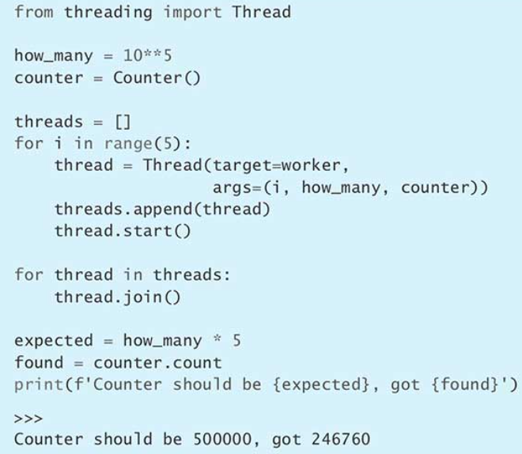

这个程序似乎相当简单，所以运行结果应该是 500000 才对。但实际上却差得很远，这是为什么呢？这样简单的程序竟然会出错，而且 Python 解释器最多只允许一条线程在运行，那为什么还统计不出正确结果呢？

其实，Python 解释器需要保证这些线程可以公平地获得执行机会，或者说，保证每条线程所分配到的执行时间大致相等。为了实现这种效果，它会及时暂停某条线程，并且把另一条线程切换过来执行。然而问题是，我们并不清楚它具体会在什么时候暂停线程，万一这条线程正在执行的是一项本来不应该中断的原子操作（atomic operation），那会如何呢？上面的例子遇到的正是这种情况。

Counter 对象的 increment 方法看上去很简单，工作线程在调用这个方法时，相当于是在执行下面这样一条语句：


然而，在对象的属性上面执行+=操作，实际上需要分成三个小的步骤。也就是说，Python 系统会这样看待这次操作：


这三个步骤本来应该一次执行完才对，但是 Python 系统有可能在任意两步之间，把当前这条线程切换走，这就导致这条线程在切换回来后，看到的是个已经过时的 value 值，它把这个过时的值通过 setattr 赋给 Counter 对象的 count 属性，从而使统计出来的样本总数偏小。下面就来模拟线程受到干扰时的样子：


线程 A 在执行了第一步之后，还没来得及执行第二步，就被线程 B 打断了。等到线程 B 把它的三个步骤执行完毕后，线程 A 才重新获得执行机会。这时，它并不知道 count 已经被线程 B 更新过了，它仍然以为自己在第一步里读取到的那个 value_a 是正确的，于是线程 A 就给 value_a 加 1 并将结果（也就是 result_a）赋给 count 属性。这实际上把线程 B 刚刚执行的那一次递增操作覆盖掉了。上面的传感器采样总数之所以出错，也正是这个原因所致。

除了这个例子，其他形式的数据结构也会遇到类似问题。为了避免数据争用，Python 在内置的 threading 模块里提供了一套健壮的工具。其中最简单也最有用的是一个叫作 Lock 的类，它相当于互斥锁（mutex）。

通过这样的锁，我们可以确保多条线程有秩序地访问 Counter 类的 count 属性，使得该属性不会遭到破坏，因为线程必须先获取到这把锁，然后才能操纵 count，而每次最多只能有一条线程获得该锁。下面，用 with 语句来实现加锁与解锁，这种写法使读者很容易就能看出受到保护的究竟是哪一段代码（参见第 66 条）。


现在，就可以确保这些工作线程能够正确地递增 count 属性了。只不过这次的 Counter 对象要改用刚才写的 LockingCounter 类来制作。


这样的结果才正是我们想要看到的。这说明 Lock 确实能够解决数据争用问题。

### 总结

1. 虽然 Python 有全局解释器锁，但开发者还是得设法避免线程之间发生数据争用。
2. 把未经互斥锁保护的数据开放给多个线程去同时修改，可能导致这份数据的结构遭到破坏。
3. 可以利用 threading 内置模块之中的 Lock 类确保程序中的固定关系不会在多线程环境下受到干扰。

## 第 55 条：用 Queue 来协调各线程之间的工作进度

Python 程序如果要同时执行多项任务，而这些任务又分别针对同一种产品的不同环节，那么就有可能得在它们之间进行协调。比较有用的一种协调方式是把函数拼接成管道。

这样的管道与生产线比较像。它可以按先后顺序划分成几个阶段，每个阶段都由相应的函数负责。程序会把未经加工的原料放在生产线（也就是管道）的起点，而那些函数，则分别关注着自己所负责的这一段，只要有产品来到当前环节，它就对这件产品做出相应的加工处理。如果所有函数都不会再收到有待加工的产品，那么整条生产线就可以关停。这套方案，很适合应对与阻塞式 I/O 或子进程有关的需求，因为我们很容易就能在 Python 程序里，平行地开启多个线程来分别负责生产线中的某个环节（参见第 53 条）。

例如，要构建这样一套系统，让它持续从数码相机里获取照片，然后调整照片尺寸，最后把调整好的照片添加到网络相册之中。如果用管道来实现，那么这个管道就有三个环节。第一个环节是，从数码相机里下载新图像；第二个环节是，调整这些图像的尺寸；第三个环节是，把尺寸已经调整好的图像上传到网络相册里面。

假如这三个环节所对应的 download、resize 与 upload 函数，现在都已经写好了，那么应该如何拼接成一条管道呢？

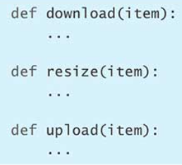

首先，必须想办法表示每个环节所要加工的产品，并让加工好的产品能够为下一个环节所获取。这可以用线程安全的生产-消费队列（producer-consumer queue，也叫生产者-消费队列）来实现（线程安全的重要性参见第 54 条；deque 类的用法参见第 71 条）。


首先定义 put 方法，让生产者（也就是数码相机）可以通过这个方法把新图像添加到 deque 的尾部。


然后定义下面这个方法。第一阶段的消费者，也就是需要下载照片的那个函数，可以通过这个方法从 deque 的前端（即左侧）获取元素。


我们把管道的每个阶段都表示成一条 Python 线程，它会从刚才那样的队列中取出有待处理的产品，并交给对应的函数去处理，接着再把处理结果放到下一个队列之中。另外，我们再添加两个字段，分别记录这条线程向上游队列查询产品的次数以及完成加工的次数。


最难处理的地方在于，如果上游环节的速度比较慢，导致它不能及时把加工过的产品添加到本环节的输入队列里面，那么输入队列就有可能出现空白，使得当前环节暂时获取不到有待加工的产品。下面我们试着通过捕捉 IndexError 来处理这种上游发生延迟的情况。


现在，创建四个队列，并在它们之间安排三条工作线程，让每条线程都从上游队列里面获取元素，并把加工过的元素放到下游队列之中。


启动这些线程，然后给管道第一环节填入一大批原材料。笔者在这里采用普通的 object 实例模拟 download 函数所要下载的真实数据。


反复查询最后那个队列（也就是 done_queue）里的元素数量，如果这个数量与一开始的原材料数量相同，那就说明整条管道已经把所有产品全都加工好了。


这样写是可以正常运行的，然而有一个现象值得注意，就是每条工作线程都要频繁查询上游队列里面有没有来新的产品。为什么必须这样做呢？因为我们要解决刚才提到的那个难点，也就是上游环节的加工速度可能比本环节慢。为此，必须在 run 方法里捕获 IndexError 异常，以便正确处理这种情况。可以看到，查询的总次数很多：


由于每个环节的加工速度可能不太一样，因此下游环节或许会遇到暂时没有产品可以加工的情况，这会拖延管道的总进度。下游环节必须频繁查询上游队列，才能尽快发现并获取到自己所要加工的产品。这相当于是在浪费 CPU 资源，因为在这种情况下，这些线程只是在触发并捕获 IndexError，而没有做实际的工作。

这种实现方式的问题远不止这一个，还有另外三个问题也必须重视。

第一，为了判断全部产品是否加工完毕，必须像 Worker 线程里的 run 方法那样，反复查询最后那个队列，以确认里面的元素个数是否已经变得与刚开始的原料总数相同。

第二，目前这种方案会使 run 方法陷入无限循环，我们没办法明确通知线程何时应该退出。

第三，如果下游环节的处理速度过慢，那么程序随时都有可能崩溃，这是最严重的问题。例如，如果第一个环节处理得很快，而第二个环节处理得比较慢，那么连接这两个环节的那个队列就会迅速膨胀，因为它里面堆积了大量的产品等着第二个环节来加工，可是第二个环节又跟不上节奏。时间久了，数据会越积越多，导致程序因为耗尽内存而崩溃。

总之，这种需求不适合用管道来实现，因为很难构建出良好的生产-消费队列。所以，别再跟这个方案较劲了。改用 Queue 来实现内置的 queue 模块里有个 Queue 类，它提供了解决上述问题所需的所有功能。

### 改用 Queue 来实现

内置的 queue 模块里有个 Queue 类，它提供了解决上述问题所需的所有功能。

改用 Queue 之后，就不用再频繁查询是否有新产品要加工了，因为它的 get 方法会一直阻塞在那里，直至有新数据返回为止。例如，我们可以启动这样一条消费线程，以等待队列里面出现新的输入数据：


即便这个线程先启动，也没有关系，因为只有当生产线程通过 Queue 实例的 put 方法给队列里面填入新数据之后，刚才那个 get 方法才有数据可以返回。


为了解决因下游环节速度过慢而造成的管道拥堵问题，我们可以限定 Queue 最多只能堆积多少个元素。如果通过 put 方法给已经填满的队列添加新元素，那么这个方法就会阻塞，直到队列里有空位为止。下面我们创建最多只能保存一个元素的队列，并且定义这样一条消费线程，让它先等待一段时间，然后再从队列中获取元素，这样就促使生产线程没办法立刻给队列中添加新元素。


编写 time.sleep(0.1)这条语句，是想故意让消费线程慢下来，以免生产线程在第二次调用 put 方法时，它第一次放进去的那个元素还没来得及被消费线程提取走。Queue 的容量为 1，所以生产线程会阻塞在第二个 put 方法这里，它必须等消费线程通过 get 方法把队列中的那个元素取走，才能继续往里面添加新元素。


Queue 类还可以通过 `task_done` 方法告诉程序它已经把其中一个元素处理完了。这样的话，就不用像早前对待 `done_queue` 那样，反复查询生产线末端的那个队列了，因为我们可以通过配套的 join 方法确认这个队列中的所有元素都已经处理完毕。下面我们定义一个消费线程，令它在处理完一个元素之后，调用 `task_done` 方法。


有了这个方法，就不用反复查询队列中的数据有没有处理完了，而是只需在 Queue 实例上面调用 join 就行。即便队列中的元素已经全部取走，只要 `task_done` 方法的执行次数不足，join 就会卡住，直到早前加入队列的每个元素都调用一次 `task_done` 方法为止。


现在，我们把这些特性结合起来，构建这样一个 Queue 子类，这个子类还需要判断工作线程何时应该彻底结束任务。为了实现这项功能，我们定义 close 方法，让它把特殊的标志元素（sentinel item）放入队列，用以表示这个元素之后不会再有新的数据需要加工了。


然后，为这种队列定义迭代器，令这个迭代器在发现标志元素之后，停止迭代。我们还需要在 `__iter__` 方法（参见第 31 条）里面适时地调用 `task_done`，用以追踪队列的工作进度。


把 ClosableQueue 类写好之后，我们来重新定义工作线程。这次我们通过 for 循环来迭代队列，只要队列里的元素用尽，线程就可以退出。


现在用刚定义好的这个线程类重新创建一组工作线程。


工作线程启动后，我们依然向第一阶段的输入队列填充原料，只不过这次，在填充完之后还需要调用 close 方法，向队列中加入特殊的终止信号。


然后，在队列上调用 join 方法，等待相应的线程把这个队列中的所有元素都取走。每处理完一个队列，就在下一个队列上调用 close 方法，向它推送停止信号，并等待相应的线程把那个队列里的元素也全部取走。最终，`done_queue` 队列里包含的就是预期的所有输出成品。


这个方案还可以扩展，也就是用多个线程同时处理某一个环节，以提高 I/O 并行度，从而大幅提升程序效率。为了实现这种效果，定义两个辅助函数分别用来开启和关闭一组线程。其中，负责关闭线程的那个 `stop_threads` 函数要根据线程数量来相应地调用 close 方法，这样才能让每一条使用该队列的线程都能够查询到一个充当退出标志的特殊元素，从而正常地退出。


我们还是像原来那样，把队列与线程拼接起来，并向管道顶部填充原材料，然后依次关闭各队列以及使用该队列的那组线程，并打印最终结果。


虽然队列可以很好地实现这里所要解决的线性管道（linear pipeline）问题，但如果遇到的是其他情况，那就应该考虑更为合适的工具了（参见第 60 条）。

### 总结

1. 管道非常适合用来安排多阶段的任务，让我们能够把每一阶段都交给各自的线程去执行，这尤其适合用在 I/O 密集型的程序里面。
2. 构造这种并发的管道时，有很多问题需要注意，例如怎样防止线程频繁地查询队列状态，怎样通知线程尽快结束操作，以及怎样防止管道出现拥堵等。
3. 我们可以利用 Queue 类所具有的功能来构造健壮的管道系统，因为这个类提供了阻塞式的入队（put）与出队（get）操作，而且可以限定缓冲区的大小，还能够通过 `task_done` 与 join 来确保所有元素都已处理完毕。

## 第 56 条：学会判断什么场合必须做并发

程序要处理的范围变大之后，不可避免地，代码也会越来越复杂。怎样才能在需求持续扩展的过程中，让代码依然像原来那样清晰、高效且易于测试？这是个相当困难的问题。编程工作中最难执行的一项迁移任务，可能就是把单线程的程序改写成那种带有多条执行路径的程序。

下面举个例子，向大家演示何时会遇到这样的问题。假如，我们要实现康威生命游戏（Conway's Game of Life），这是个经典的有限状态自动机。它的规则很简单：在任意长宽的二维网格中，每个单元格都必须处于 ALIVE 或 EMPTY 状态，前者表示这个单元格里有生命存在，后者表示这里没有生物（或者原有生物已经死亡）。


时钟每走一格，游戏就要前进一步。这个时候，我们需要考虑每个单元格的周围总共有多少个处于存活状态的单元格，并根据这个数量来决定本单元格的新状态：如果当前有生命体存在（ALIVE），那么该生命体有可能继续存活，也有可能死亡；如果单元格当前是空白的（EMPTY），那么下一步有可能继续保持空白，也有可能诞生新的生命体（具体的判断标准，接下来再讲）。我们先试着画一张 5×5 的网格，然后把这个游戏推进四步，看看每一代的生存情况。


我们可以定义一个简单的容器类管理这些单元格的状态。这个类必须提供 get 与 set 方法，以获取并设置任何一个坐标点（或者说任何一个单元格）的值。如果坐标越界，那么应该自动绕回，产生一种无限折返的效果。


为了观察这个类的实际效果，我们创建 Grid 实例，并采用经典的滑翔机（glider）形状来开局：


现在，需要想个办法获取相邻单元格的状态。笔者决定编写一个辅助函数来实现，该辅助函数可以查询本单元格周边的八个单元格，并统计其中有几个处于存活（ALIVE）状态。给函数设计参数时，不应该让它明确接受 Grid 实例，因为那样会导致这个函数与 Grid 类耦合。只需要把一个能根据坐标来查询单元格状态的函数传给 get 参数即可（参见第 38 条）。


现在来定义康威生命游戏的逻辑。这套逻辑共有三条规则。第一，如果单元格里有生命体，而且周边的存活单元格少于两个，那么本单元格里的生命体死亡；第二，如果单元格里有生命体，而且周边的存活单元格多于三个，那么本单元格里的生命体死亡；第三，如果单元格为空（或者说，单元格里面的生命体已经死亡），而且周边的存活单元格恰好是三个，那么本单元格里的生命体复活。


接下来编写一个函数，用以更改单元格的状态。它可以把刚写的 count_neighbors 与 game_logic 利用起来。这个函数根据坐标查出单元格当前的状态，然后统计周边总共有多少个存活的单元格，接下来根据当前状态与存活的邻居数判断本单元格在下一轮的状态，最后，更新单元格的状态。在设计这个接口时，与 count_neighbors 一样，也不允许传入 Grid 实例，而是传入一个能根据坐标来设置新状态的函数，以降低耦合度。


最后，我们定义一个函数，把整张网格之中的每一个单元格都向前推进一步，并返回一张新的网格，用来表示下一代的状态。在实现这个函数时，要调用刚才写的 step_cell 函数，这时必须注意把 get 与 set 参数写对。get 指的是当前这代网格（grid）之中的 get 方法，而 set 指的则是下一代网格（next_grid）的 set 方法，只有这样，才能让每一个单元格都按照现在的情况分别演化到下一轮，而不会让先演化的单元格影响其他单元格的迁移结果，这对于游戏正常运行是很重要的。假如设计 step_cell 时，让它只接受一个 Grid 实例，而不是分别通过两个参数来接受获取与设置单元格状态所用的那两个方法，那么这里的 simulate 就不好写了，我们若是把当前的 grid 传过去，那么它里面的单元格状态就会被 step_cell 函数破坏掉。


现在，通过 for 循环来推进这张网格（或者说棋盘），推进到第四代时，大家就会发现，原来那个滑翔机的形状已经整体向右下方移动了一个位置。当然这个效果，最终还是通过 game_logic 函数里面那三条简单的规则而得以落实的。


这个程序，在单机单线程的环境下，是没有问题的。但如果需求变了呢？正如笔者刚才暗示过的那样，game_logic 函数或许要执行某些 I/O 操作（例如要通过 socket 通信）。例如，如果这是大型多人在线游戏（massively multiplayer online game，MMOG）的一部分，那么这些单元格可能分别对应全球各地的玩家，所以在迁移每个单元格的状态时，都要联网查询其他玩家的状态，这样可能必须要执行 I/O 操作。

这种需求应该如何实现呢？最简单的办法是，把执行阻塞式的 I/O 操作直接放在 game_logic 函数里面执行。


这种写法的问题在于，它会拖慢整个程序的速度。如果 game_logic 函数每次执行的 I/O 操作需要 100 毫秒才能完成（与国外的玩家通信一个来回，确实有可能需要这么长时间），那么把整张网格向前推进一代最少需要 4.5 秒，因为 simulate 函数在推进网格时，是一个一个单元格来计算的，它需要把这 45 个单元格按顺序计算一遍。这对于网络游戏来说，实在太慢，让人没耐心玩下去。另外，这个方案也无法扩展，假如单元格的数量增加到一万，那么计算新一代网格所花的总时间就会超过 15 分钟。

若想降低延迟时间，应该平行地执行这些 I/O 操作，这样的话，无论网格有多大，都只需要 100 毫秒左右就能推进到下一代。针对每个工作单元开辟一条执行路径，这种模式叫作扇出（fan-out），对于本例来说，工作单元指的是网格中的单元格。然后，要等待这些并发的工作单元全部完工，才能执行下一个环节，这种模式叫作扇入（fan-in），对于本例来说，下一个环节指的是让整张网格进入新的一代。

Python 提供了许多内置的工具，可以实现 fan-out 与 fan-in 模式，这些工具各有利弊。我们要了解每种方案的优点和缺点，这样才能用最合适的工具来应对具体的需求。下面几条会继续以生命游戏为例，详细讲解这些工具（参见第 57 条、第 58 条、第 59 条与第 60 条）。

### 总结

1. 程序范围变大、需求变复杂之后，经常要用多条路径平行地处理任务。
2. fan-out 与 fan-in 是最常见的两种并发协调（concurrency coordination）模式，前者用来生成一批新的并发单元，后者用来等待现有的并发单元全部完工。
3. Python 提供了很多种实现 fan-out 与 fan-in 的方案。

## 第 57 条：不要在每次 fan-out 时都新建一批 Thread 实例

想在 Python 里平行地做 I/O，首先要考虑的工具当然是线程（参见第 53 条）。但如果真用线程来表示 fan-out 模式中的执行路径，你就会发现，这样其实有很多问题。

现在就来演示这些问题。这里还是以前一条提到的生命游戏为例（接下来的范例代码会用到一些函数和类，其实现细节参见第 56 条）。我们用线程来解决 game_logic 函数由于执行 I/O 而产生的延迟问题。首先，这些线程之间需要锁定功能对其进行协调，以确保它们所操纵的数据结构不会遭到破坏。下面创建 Grid 子类，并为它添加锁定功能，让多条线程能够正确地访问同一个实例。


接下来，改用 fan-out 模式实现 simulate 函数，为每个 step_cell 操作都创建一条线程，这些线程能够平行地运行并各自执行相应的 I/O 任务。这样的话，我们就不需要像原来那样，非得等前一次 step_cell 执行完，才能更新下一个单元格。然后，通过 fan-in 模式等待这些线程全部完工，再把网格正式演化到下一代。


负责推进单元格状态的 step_cell 函数可以保持原样，推动整个游戏流程的那些代码基本上也不用改，只有两个地方必须调整：一个是把网格类的名称改为 LockingGrid，另一个是把 simulate 函数改为多线程版本的 simulate_threaded。


这样写没错，而且 I/O 操作确实能够平行地在各线程中执行。但是，这种方案有三个比较大的缺点。

1. 要专门采用工具来协调这些 Thread 实例，才能保证它们不会破坏程序中的数据（参见第 54 条）。这会让多线程版本的代码理解起来比较困难，因为早前的单线程版是按照先后顺序实现的，不需要有专门的协调机制，所以读起来比现在的版本好懂。这种复杂的多线程代码，随时间的推移更加难以扩展与维护。
2. 线程占用的内存比较多，每条线程大约占 8MB。当然，现在的许多电脑完全能承担起本例中 45 条线程所占用的内存总量。但如果游戏里有一万个单元格，那就必须创建一万条线程，这个内存量恐怕很多电脑不支持。所以，给每项操作都新开一条线程是不现实的。
3. 线程的开销比较大。系统频繁地切换线程，会降低程序的运行效率。对于本例来说，每推进一代，就要停止一批旧线程并启动一批新线程，这样开销很大，于是程序除了要花 100 毫秒等待 I/O 操作结束，还会因为停止并启动线程而耽误一些时间。

如果线程所执行的代码出现了错误，也会很难调试。例如，game_logic 函数有可能会抛出异常，因为它要执行的那种 I/O 操作本来就属于有时成功有时失败的操作。


现在测试一下看看。令 Thread 实例直接指向刚写的这个函数，并把操作系统的标准错误端 sys.stderr 重定向到内存之中的 StringIO 缓冲区，这样可以更清楚地区分，当线程在执行 game_logic 的过程中发生异常时，哪些信息写到了标准输出端，哪些信息写到了标准错误端。


可以看到，程序确实抛出了 OSError 异常。但问题是，刚才输出的那一大段内容是通过标准错误端看到的，若是不写 `print(fake_stderr.getvalue())`，就观察不到任何错误。这说明，创建线程的那行代码以及启动线程并等待线程结束的那两行代码，似乎根本就没有关注这个错误，假如它们关注了，那为什么不把相关的消息打印到标准输出端呢？这是因为，按照 Thread 类的运行方式，如果它在执行 target 函数时捕获到异常，那么会把回溯信息（traceback）写到标准错误端（也就是 sys.stderr 里面），而不会写到标准输出端。Thread 本身就没打算把这种异常重新抛给启动这条线程的那个人。

了解到上面这些问题之后，我们可以清楚地看出，如果需要一大批执行路径分头去执行某项任务，而且还要频繁地启动并停止这批执行路径，那么每次都需手工新建一批线程，这肯定不是个好办法。Python 提供了其他几种更合适的方案（参见第 58 条、第 59 条与第 60 条）。

### 总结

1. 每次都手工创建一批线程，是有很多缺点的，例如：创建并运行大量线程时的开销比较大，每条线程的内存占用量比较多，而且还必须采用 Lock 等机制来协调这些线程。
2. 线程本身并不会把执行过程中遇到的异常抛给启动线程或者等待该线程完工的那个人，所以这种异常很难调试。

## 第 58 条：学会正确地重构代码，以便用 Queue 做并发

在前面那一条（也就是第 57 条）里面，大家看到，每次都手工创建一批线程并平行地执行 I/O 任务是有很多缺点的。笔者当时以生命游戏（Game of Life）为例，演示了这些缺点（下面的范例代码会用到早前实现的一些函数和类，相关的信息参见第 56 条）。

这一条要介绍另一种方案，也就是用内置的 queue 模块里的 Queue 类实现多线程管道（接下来会用到早前范例代码里面的 ClosableQueue 与 StoppableWorker，参见第 55 条）。

这种方案的总思路是：在推进生命游戏时，不像原来那样，每推进一代，就新建一批线程来推进相应的单元格，而是可以提前创建数量固定的一组工作线程，令这组线程平行地处理当前这批 I/O 任务，并在处理完之后，继续等待下一批任务，这样就不会消耗那么多资源了，程序也不会再因为频繁新建线程而耽误那么多时间。

现在就来实现这个方案。首先，创建两个 ClosableQueue 实例表示输入队列（in_queue）与输出队列（out_queue）。每条工作线程都可以从输入队列里面取出有待执行的 game_logic 任务，并把执行结果放到输出队列之中。


启动多线程从 `in_queue` 里面获取任务，并调用 `game_logic` 来处理各自的任务，然后把结果放到 `out_queue` 里面。这些线程会并发地运行，从而平行地处理这些 I/O 任务，以降低游戏进入下一代时的延迟。


simulate 函数需要重构。这次，它必须与刚才的两个队列交互，把需要迁移的每一个单元格及其当前状态都封装成一项任务放到输入队列之中，并等待那些线程把输入队列中的所有任务都处理完，接下来，它要根据输出队列所收集到的结果更新每个单元格的状态，从而将游戏推进到下一代。把迁移单元格状态的任务放到输入队列，派发给工作线程去执行，这里用的是 fan-out（扇出）模式；等待这些任务全都处理完毕，然后才开始使用输出队列所收集到的结果，这里用的是 fan-in（扇入）模式。


新的 simulate_pipeline 函数要用到网格（Grid）类的 get 方法与 set 方法，但它这次是在自身所处的这条线程里面调用这两个方法的，所以不用像上一条那样，专门编写一种支持多线程的网格，并通过 Lock 机制给这两个方法加锁以防网格之中的数据遭到破坏。我们这次可以直接使用普通版的 Grid 类。

现在的代码要比那种每次都手工新建一批线程的方案更容易调试。如果 game_logic 函数执行 I/O 时出错，那么错误会被捕获并传入输出队列里面，并在主线程之中重新抛出。


把 `simulate_pipeline` 放在循环里面调用，就可以利用这种多线程的管道一代一代地推进游戏了。


这样写的效果和原来一样。与那种每次操作都启动一条线程的做法相比，这种方案使用的内存少，启动线程时的开销也小，而且调试起来较为容易。尽管如此，但它还是有几个问题：

1. 负责把网格推进到下一代的 simulate_pipeline 函数，要比上一条里面的对应函数 simulate_threaded 难懂。
2. 为了让代码更容易理解，必须用 ClosableQueue 与 StoppableWorker 这样的类表示特制的队列与工作线程，这会让程序变得复杂。
3. 与并行度有关的那个参数（即运行 game_logic_thread 函数的线程数量），必须依工作负载提前定好，而无法由系统根据工作量自动调整。
4. 为了便于调试，需要在工作线程里面手动捕获异常，并把它放到队列之中，然后重新抛给主线程。

但是，这个方案最严重的问题体现在需求发生变化的时候。例如，除了 `game_logic` 函数，现在连 `count_neighbors` 函数也需要做 I/O 了。


为了实现并行处理，我们要给管道添加一个环节，以便将 count_neighbors 也从主线程移到工作线程里面执行。而且，还需要与刚才一样，确保工作线程能够把执行 count_neighbors 函数时所发生的异常正确地播报给主线程。另外，这次有多条线程要使用同一张网格（Grid），因此必须给网格加锁，让这些线程有秩序地访问它而不破坏网格中的数据（相关的知识参见第 54 条，如何实现带锁的网格参见第 57 条）。


我们要建立一个 logic_queue 队列，把它放在输入队列与输出队列之间，用来表示半成品（意思就是已经算出了这个单元格周边有多少个生命体，但还没有据此更新该单元格的状态）。另外，还需要再创建一批线程专门负责把输入队列 in_queue 里面的任务用 count_neighbors_thread 函数加以执行，并把执行结果放到半成品队列 logic_queue 之中。


最后，要修改 simulate_pipeline 函数，以便正确地分派针对每个单元格的状态更新任务（fan-out），并把处理结果归集起来（fan-in）。


修改好之后，就可以让管道从头到尾走一遍了。这次，管道包含两个环节。

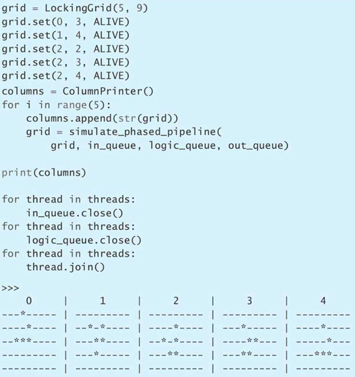

运行结果当然是正确的，但为了在计算存活的单元格数量时也支持并行处理，我们修改了好几个地方。虽然最终还是利用 Queue 把 fan-out 与 fan-in 实现了，但这样做的代价很大。这种通过队列来衔接各个环节的方案，要比每次做 I/O 时都新建 Thread 实例要好，但 Python 里面还有比这更好的做法（参见第 59 条与第 60 条）。

### 总结

1. 把队列（Queue）与一定数量的工作线程搭配起来，可以高效地实现 fan-out（分派）与 fan-in（归集）。
2. 为了改用队列方案来处理 I/O，我们重构了许多代码，如果管道要分成好几个环节，那么要修改的地方会更多。
3. 利用队列并行地处理 I/O 任务，其处理 I/O 任务量有限，我们可以考虑用 Python 内置的某些功能与模块打造更好的方案。

## 第 59 条：如果必须用线程做并发，那就考虑通过 ThreadPoolExecutor 实现

Python 有个内置模块叫作 concurrent.futures，它提供了 ThreadPoolExecutor 类。这个类结合了线程（Thread）方案与队列（Queue）方案的优势，可以用来平行地处理生命游戏里的那种 I/O 操作（线程方案参见第 57 条，队列方案参见第 58 条，与生命游戏有关的知识以及它用到的函数和类，参见第 56 条）。下面把那个范例用到的代码回顾一遍：


这次在把游戏推进到下一代的时候，我们不针对每个单元格启动新的 Thread 实例，而是把推进每个单元格状态的那个函数与必要的参数提交给 ThreadPoolExecutor，让执行器自己安排线程去执行这些状态更新任务，这样就实现了 fan-out（分派）。稍后，可以等待提交过去的所有任务都执行完毕，然后再把整张网格正式推进到下一代，这样就实现了 fan-in（归集）。


用来推进游戏状态的这些线程可以提前分配，不用每次执行 simulate_pool 都分配一遍，这样能够降低启动线程的开销。另外，线程池里的最大线程数可以通过 max_workers 参数手工指定，这样能把线程数量限制在一定范围内，而不像最早的那个方案那样，每执行一项 I/O 操作，就启动一条线程，那样会导致内存用量激增。


ThreadPoolExecutor 类的最大优点在于：如果调用者通过 submit 方法把某项任务提交给它执行，那么会获得一个与该任务相对应的 Future 实例，当调用者在这个实例上通过 result 方法获取执行结果时，ThreadPoolExecutor 会把它在执行任务的过程中所遇到的异常自动抛给调用者。


如果除了 game_logic 之外，count_neighbors 函数也必须执行 I/O 操作，那么只需要沿用现在的代码，就可以让那些 I/O 操作得到并发，因为这两个函数都是 step_cell 任务的一部分，而 step_cell 任务会由 ThreadPoolExecutor 负责执行。即便要做的不是 I/O 操作，而是那种需要放在 CPU 上面计算的任务，也还是可以沿用这套接口（参见第 64 条）。

ThreadPoolExecutor 方案仍然有个很大的缺点，就是 I/O 并行能力不高，即便把 max_workers 设成 100，也无法高效地应对那种有一万多个单元格，且每个单元格都要同时做 I/O 的情况。如果你面对的需求，没办法用异步方案解决，而是必须执行完才能往后走（例如文件 I/O），那么 ThreadPoolExecutor 是个不错的选择。然而在许多情况下，其实还有并行能力更强的办法可以考虑（参见第 60 条）。

### 总结

1. 利用 ThreadPoolExecutor，我们只需要稍微调整一下代码，就能够并行地执行简单的 I/O 操作，这种方案省去了每次 fan-out（分派）任务时启动线程的那些开销。
2. 虽然 ThreadPoolExecutor 不像直接启动线程的方案那样，需要消耗大量内存，但它的 I/O 并行能力也是有限的。因为它能够使用的最大线程数需要提前通过 max_workers 参数指定。

## 第 60 条：用协程实现高并发的 I/O

在前面几条里，我们以生命游戏为例，试着用各种方案解决 I/O 并行问题，这些方案在某些情况下确实可行（后面的范例代码还要用到这个游戏所需的一些函数和类，参见第 56 条），但如果同时需要执行的 I/O 任务有成千上万个，那么这些方案的效率就不太理想了（参见第 57 条、第 58 条与第 59 条）。

像这种在并发方面要求比较高的 I/O 需求，可以用 Python 的协程（coroutine）来解决。协程能够制造出一种效果，让我们觉得 Python 程序好像真的可以同时执行大量任务。这种效果需要使用 async 与 await 关键字来实现，它的基本原理与生成器（generator）类似，也就是不立刻给出所有的结果，而是等需要用到的时候再一项一项地获取（参见第 30 条、第 34 条与第 35 条）。

启动协程是有代价的，就是必须做一次函数调用。协程激活之后，只占用不到 1KB 内存，所以只要内存足够，协程稍微多一些也没关系。与线程类似，协程所要执行的任务也是用一个函数来表示的，在执行这个函数的过程中，协程可以从执行环境里面获取输入值，并把输出结果放到这个执行环境之中。协程与线程的区别在于，它不会把这个函数从头到尾执行完，而是每遇到一个 await 表达式，就暂停一次，下次继续执行的时候，它会先等待 await 所针对的那项 awaitable 操作有了结果（那项操作是用 async 函数表示的），然后再推进到下一个 await 表达式那里（这跟生成器函数的运作方式有点像，那种函数也是一遇到 yield 就暂停）。

Python 系统可以让数量极多的 async 函数各自向前推进，看起来像很多条 Python 线程那样，能够并发地运行。然而，这些协程并不会像线程那样占用大量内存，启动和切换的开销也比较小，而且不需要用复杂的代码来实现加锁或同步。这种强大的机制是通过事件循环（event loop）打造的，只要把相关的函数写对，这种循环就可以穿插着执行许多个这样的函数，并且执行得相当快，从而高效地完成并发式的 I/O 任务。

现在就用协程来实现生命游戏。我们的目标是让游戏能够高效地执行 game_logic 函数里面的 I/O 操作，同时又不像前面提到的 Thread 方案与 Queue 方案那样，有那么多缺点。首先修改 game_logic 函数，这次必须在定义函数所用的那个 def 关键字前面，加上 async，表示该函数是一个协程，这样我们就可以在函数里面用 await 做 I/O 了（例如从套接字（socket）之中异步读取一份数据）。


同理，给 step_cell 函数也添上 async 关键字，把它变为协程，并在调用 game_logic 的那个地方使用 await 关键字。


simulate 函数也同样需要变为协程。


async 版本的 simulate 函数，有以下几个地方需要解释：

1. 它在调用 step_cell 的时候，系统并不会立刻执行这个函数，而是会返回一个协程实例，稍后会把这个实例写在 await 表达式里面。这里的 step_cell，好比那种用 yield 写的生成器函数一样，调用时并不立刻执行它，而是返回一个生成器实例。这样就可以实现任务 fan-out（分派）模式了。
2. 内置的 asyncio 模块提供了 gather 函数，可以用来实现 fan-in（归集）模式。把 gather 写在 await 表达式里面，可以让系统用事件循环去并发地执行那些 step_cell 协程，并在全部执行完之后，再往下推进 simulate 协程。
3. 由于这些代码都是在同一条线程里执行的，因此不需要给 Grid（网格）实例加锁，至于怎样让这些 I/O 操作表现出平行的效果，则是由 asyncio 所提供的事件循环来负责的。

最后，要调整原范例之中用来推动游戏流程的那段代码。我们只需要修改一行代码，也就是把 simulate(grid)这个协程交给 asyncio.run 去运行，从而利用事件循环机制去执行推进单元格状态所需的那些 I/O 操作。


这样做的结果跟原来相同，但是这次，我们不需要再花费资源去创建线程了。另外，Queue 方案与 ThreadPoolExecutor 方案虽然能够处理异常，但仅仅是把这些异常从工作线程抛到主线程而已。跟那两种方案相比，采用协程所实现的这种方案，调试起来更为容易，因为我们可以在调试器（debugger）的交互界面之中，以单步模式来调试这种程序，也就是一行一行地去执行代码并观察效果（参见第 80 条）。

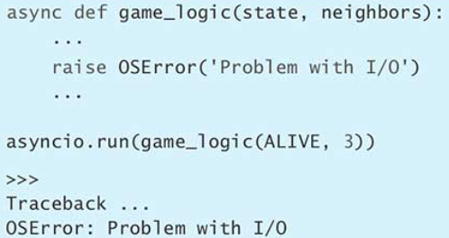

如果需求变了，例如 count_neighbors 函数现在也需要做 I/O 了，那么只需要在已有的代码中把这种函数声明成 async，并在调用它的那些地方添上 await 即可。我们不用像早前的 Thread 方案或 Queue 方案那样，重新调整代码结构（其他范例参见第 61 条）。


协程的优点是，能够把那些与外部环境交互的代码（例如 I/O 调用）与那些实现自身需求的代码（例如事件循环）解耦。这让我们可以把重点放在实现需求所用的逻辑上面，而不用专门花时间去写一些代码来确保这些需求能够并发地执行。

### 总结

1. 协程是采用 async 关键字所定义的函数。如果你想执行这个协程，但并不要求立刻就获得执行结果，而是稍后再来获取，那么可以通过 await 关键字表达这个意思。
2. 协程能够制造出这样一种效果，让人以为程序里有成千上万个函数都在同一时刻高效地运行着。
3. 协程可以用 fan-out（分派）与 fan-in（归集）模式实现并行的 I/O 操作，而且能够克服用线程做 I/O 时的缺陷。

## 第 61 条：学会用 asyncio 改写那些通过线程实现的 I/O

知道了协程的好处（参见第 60 条）之后，我们可能就想把现有项目之中的代码全都改用协程来写，于是有人就担心，这样修改起来，工作量会不会比较大呢？所幸 Python 已经将异步执行功能很好地集成到语言里面了，所以我们很容易就能把采用线程实现的阻塞式 I/O 操作转化为采用协程实现的异步 I/O 操作。

例如，我们要写一个基于 TCP 的服务器程序，让它跟用户玩猜数字的游戏。用户（也就是客户端）通过 lower 与 upper 参数把取值范围告诉服务器，让服务器在这个范围里面猜测用户心中的那个整数值。服务器把自己猜的数告诉用户，如果没猜对，用户会告诉服务器这次所猜的值跟上次相比，是离正确答案更近（warmer）还是更远（colder）。

这样的客户端/服务器（client/server，C/S）系统，通常会利用线程与阻塞式的 I/O 来实现（参见第 53 条）。这种方案要求我们先编写一个辅助类来管理发送信息与接收信息这两项操作。为了便于演示，我们采用文本信息的形式来表达所要发送和接收的命令数据：


我们用下面这样的 ConnectionBase 子类来实现服务器端的逻辑。每处理一条连接，就创建这样一个 Session 实例，并通过实例之中的字段维护跟客户端会话时所要用到的相关状态。


服务器类的主方法叫作 loop，它会循环地解析客户端所传来的命令，并根据具体内容把这条命令派发给相关的方法去处理。请注意，为了让代码简单一些，这里用到了 Python 3.8 引入的新功能，也就是赋值表达式（参见第 10 条）。

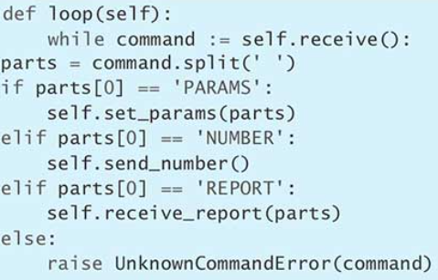

第一种命令叫作 PARAMS 命令，客户端在新游戏开局时，会通过该命令把下边界（lower）与上边界（upper）告诉服务器，让它能够在这个范围里面去猜测自己心中预想的那个值。


第二种命令叫作 NUMBER，表示客户端要求服务器做一次猜测。这时，我们先在 next_guess 函数里判断上次的猜测结果。如果上次已经猜对了，那就把保存在 self.secret 里的值告诉客户端。如果上次没有猜对，那么就在取值范围内随机选一个值。请注意，我们会专门用一个 while 循环来判断随机选出的这个值以前是否已经选过，要是选过，那就再选，直到选出以前没猜过的值为止。现在，我们将这次选中的值加入 guesses 列表以免将来重复猜测。最后，通过 send 方法把值发送给客户端。


第三种命令叫作 REPORT，表示客户端接到了我们在响应 NUMBER 命令时所发过去的那个猜测值并且发来了报告。看到这份报告之后，服务器端就知道自己刚才猜的数值（也就是 guesses 列表末尾的那个值），与前一次相比，是离正确答案更近了，还是离正确答案更远了。如果恰好猜对，那就把 last 变量所表示的值赋给 self.secret，以便在客户端下次发来 NUMBER 请求的时候，作为正确答案回传给它。


客户端的逻辑也用 ConnectionBase 的子类来实现，这种实例同样会保存会话时所用到的相关状态。


session 方法负责开局，我们在启动猜数字游戏时，会通过这个方法把这局游戏的正确答案记录到 self.secret 字段里面，并把服务器端在猜测这个答案时所要遵守的下边界（lower）与上边界（upper）通过 PARAMS 命令发过去。为了让服务器端在这局游戏结束后，能够正确地清理状态，我们用@contextlib.contextmanager 修饰 session 方法，这样就可以把它用在 with 结构里面了，这种结构会适时地触发 finally 块里的清理语句（参见第 66 条；类似范例参见第 63 条）。


然后，我们还要写这样一个方法，用来向服务器端发送 NUMBER 命令，要求对方做一次猜测，如果猜得不对，就要求服务器继续猜，直到猜对或者猜测次数超过 count 为止。


最后，还要给客户端类里面写这样一个方法，用来向服务器发送 REPORT 命令，告诉对方，这次猜的数与上次相比，是距离正确答案更近（WARMER）还是更远（COLDER）。如果刚好猜对，就报告 CORRECT，如果是第一次猜或者这两次猜的数字距离正确答案一样近，就报告 UNSURE。


现在开始为运行服务器做准备。编写 run_server 方法给服务器线程来调用，这个方法会在 socket 上面监听，并接受连接请求。每连接一个客户，它就启动一条线程处理该连接。

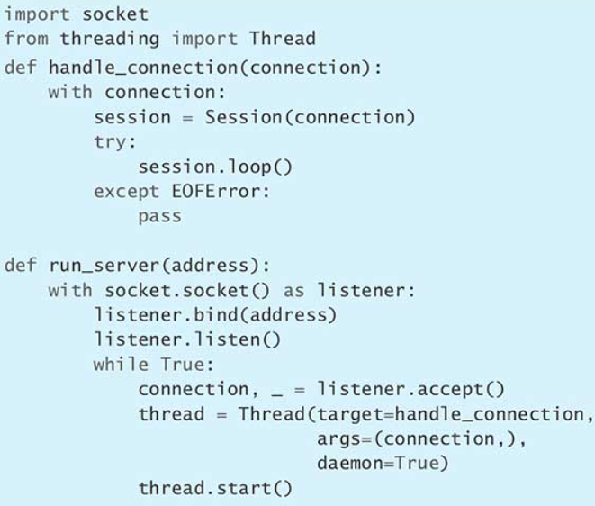

客户端放在主线程里面执行。让主线程调用下面这个函数，意思是连玩两局游戏，每局最多让服务器猜 5 次，然后把游戏结果收集到 results 里面。请注意，这段代码专门使用了 Python 语言之中的许多特性，例如 for 循环、with 语句、生成器、列表推导等。这样写，是想让我们稍后能够清楚地看到，把这种代码迁移到协程实现方案上面的工作量到底大不大。


全都准备好之后，我们把代码拼接起来，看看能不能实现预想的游戏效果。


如果用内置的 asyncio 模块搭配 async 与 await 关键字来实现，那么需要修改的地方，究竟有多少呢？

首先，服务器逻辑与客户端逻辑共用的那个 ConnectionBase 基类必须修改，这次它不能通过 send 与 receive 方法直接执行阻塞式的 I/O 了，而是必须把这两个方法变为协程，也就是在声明的时候加上 async 关键字。另外，笔者还给某些代码后面标注了#Changed 字样，用来强调新版代码与旧版之间的区别。


改完之后，我们可以创建这样一个有状态的子类，用来在服务器这边维护某条连接的会话状态。这个类跟早前表示服务器逻辑的那个 Session 类一样，也从刚才那个基类继承，只不过基类的名字现在已经变成 AsyncConnectionBase，而不是 ConnectionBase。


然后，我们来修改服务器逻辑里面的主要入口点，也就是处理命令所用的 loop 方法。其实只需要稍微改几个地方，就能把它变为协程。


处理第一种命令（也就是 PARAMS 命令）的那个方法不需要改动。


处理第二种命令（也就是 NUMBER 命令）的 send_number 方法，需要加上 async 关键字，这样它才能变为协程。在实现代码里面，只有一个地方要改，也就是必须用异步 I/O 向客户端发送所猜的数值。


处理第三种命令（也就是 REPORT 命令）的那个方法保持不变。


跟服务器端的逻辑类相似，客户端的逻辑类也需要继承 AsyncConnectionBase。


客户端中负责向服务器发送 PARAMS 命令的那个方法，现在必须声明成 async 方法，实现代码里面有几个地方需要加上 await 关键字。此外，要改用 contextlib 这个内置模块之中的另一个辅助函数（也就是 asynccontextmanager）来修饰该方法，而不能像原来那样，用 contextmanager 修饰。


负责向服务器发送 NUMBER 命令的那个方法必须加 async 关键字，这样才能变为协程。另外就是必须在执行 send 与 receive 操作的那两个地方分别加上 await 关键字。


负责向服务器发送 REPORT 命令的那个方法要加上 async 关键字，它里面的 send 操作要用 await 来执行。

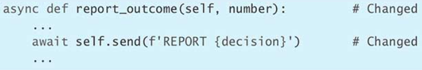

用来运行服务器的那个 `run_server` 方法，现在必须重新实现。这次通过内置的 asyncio 模块里面的 `start_server` 函数启动服务器。


用来运行客户端并启动游戏的 run_client 函数，几乎每行都要改，因为它现在不能再通过阻塞式的 I/O 去跟 socket 实例交互了，而是必须改用 asyncio 里面提供的类似功能来实现（笔者用# New 标出了这些地方）。另外，凡是与协程交互的那些代码行都必须适当地添加 async 或 await 关键字。如果某个地方忘了写，那么程序在运行时就会出现异常。


把 `run_client` 改写为 `run_async_client` 的过程中，最妙的地方在于，原函数操作客户端的这套流程基本上不用调整，只要在适当的位置写上 await 或 async 关键字，就能够使用这个新的 AsyncClient 客户端，并调用其中的相关协程了。笔者原来说过，这个函数故意运用了 Python 之中的许多特性，在这里我们看到，这些特性都有对应的异步版本，所以很容易就能实现迁移。

当然，并不是所有代码都能这么容易地迁移到协程方案上面。例如，目前还没有异步版本的 next 与 iter 内置函数（参见第 31 条），所以我们必须直接在 `__anext__` 与 `__aiter__` 方法上面做 await。另外，yield from 也没有异步版本，所以要想把生成器组合起来（参见第 33 条），必须多写一些代码。不过没关系，Python 目前正在迅速添加与普通版本相对应的 async（异步）功能，所以用不了多久，这些问题都会解决。

最后，负责把整个程序拼合起来的那个 main 函数也需要改成异步版本，这样我们才能从头到尾看到完整的游戏效果。笔者在这里通过 `asyncio.create_task` 函数把运行服务器的那项操作（也就是 `run_async_server(address)`）安排到事件循环里面，这样的话，等函数推进到 await 语句时，系统就可以让该操作与另一项操作（也就是运行客户端的那项 `run_async_client(address)` 操作）平行地执行了。这当然也是一种实现 fan-out 模式的方法，但它跟我们在第 60 条里所讲的那种办法有个区别，那种办法分派的是同一种任务（也就是更新单元格的状态）并且要通过 `asyncio.gather` 来收集运行结果，而这里要分派的，则是两种不同的任务（一种是运行服务器，另一种是运行客户端）。


这样写，能够实现出正确的运行效果，而且协程版本的代码要比原来更容易理解，因为我们不用再跟线程交互了，那些操作全都可以删掉。内置的 asyncio 模块提供了许多辅助函数，让我们能够用比较少的代码实现跟早前一样的服务器逻辑，而不用再像原来那样，必须编写许多例行代码来操纵 socket。

你所面对的项目，或许不像我们在这一条里演示的这样简单，所以移植过程可能会因为各种各样的原因而变得比较复杂，但你还是应该设法利用 asyncio 模块把项目迁移到协程方案上面，因为这个模块提供了大量的 I/O、同步与任务管理特性（参见第 62 条与第 63 条）。大家一定记得查看 asyncio 库的文档（https://docs.python.org/3/library/asyncio.html），以了解怎样把这些特性充分发挥出来。

### 总结

1. Python 提供了异步版本的 for 循环、with 语句、生成器与推导机制，而且还有很多辅助的库函数，让我们能够顺利地迁移到协程方案。
2. 我们很容易就能利用内置的 asyncio 模块来改写代码，让程序不要再通过线程执行阻塞式的 I/O，而是改用协程来执行异步 I/O。

## 第 62 条：结合线程与协程，将代码顺利迁移到 asyncio

在前一条（也就是第 61 条）之中，我们用 asyncio 模块把通过线程来执行阻塞式 I/O 的 TCP 服务器迁移到了协程方案上面。当时我们一下子就完成了迁移，而没有分成多个步骤，这对于大型的项目来说，并不常见。如果项目比较大，那通常需要一点一点地迁移，也就是要边改边测，确保迁移过去的这一部分代码的效果跟原来相同。

为了能够分步骤地迁移，必须让采用线程做阻塞式 I/O 的那些代码（参见第 53 条）能够与采用协程做异步 I/O 的代码（参见第 60 条）相互兼容。具体来说，这要求我们既能够在线程里面执行协程，又能够在协程里面启动线程并等待运行结果。好在 asyncio 模块已经内置了相关的机制，让线程与协程可以顺利地操作对方。

例如，现在要写一个程序，把许多份日志文件合并成一条输出流，以便我们调试程序。给定日志文件的句柄之后，我们得想办法判断有没有新数据到来，如果有，就返回下一行输入内容。为了实现这项功能，可以调用文件句柄的 tell 方法，并判断当前读取到的这个位置是否为文件中的最后一个位置。若是，就说明没有新数据，这时应该抛出异常（参见第 20 条）。


这个函数可以封装在 while 循环里，这样就能够打造一条工作线程。如果出现了新的数据行，那就通过用户传来的 write_func 回调函数把这行数据写到输出日志里面（至于为什么让用户传入函数而不是类接口，请参见第 38 条）。如果没有新数据，那么线程就先睡眠一段时间，然后再执行下一轮 while 循环，而不是频繁地在这里查询是否有新数据出现。要是输入文件的句柄关闭了，那么工作线程就退出 while 循环。


现在，我们给每一份输入文件都启动一条工作线程，并把这些线程所输出的内容合起来放到一份输出文件里面。为此，要定义 write 这个辅助函数，并让它在给输出流写入数据之前，先使用 lock 实例加锁，这样才能使这些工作线程有秩序地输出，而不会出现某条线程写了一半就被另一条线程打断的情况。


只要输入文件的句柄处于开启状态，相应的工作线程就不会退出。反过来说，这条线程要是退出了，那就意味着有人把那份文件的句柄关了。于是，只需要等待所有的线程都完工，就可以确定这些文件的句柄已经全部关闭。

我们可以定义这样一个 `confirm_merge` 函数，让它判断刚才那个 `run_threads` 函数能不能把许多份输入文件（`input_paths`）正确地合并到同一份输出文件（`output_path`）里面。至于每一份输入文件所对应的句柄应该怎样创建并关闭，则不是这里讨论的重点，而且这个用来验证输出结果的 `confirm_merge` 函数，笔者也打算省略它的实现代码。


这是一套用线程制作出来的方案，我们现在要从这里开始，把它逐渐转换为一套采用 asyncio 与协程实现的方案。转换思路有两个，要么从上往下转，要么从下往上转。

从上往下转，必须由整个项目的最高点（例如 main 入口点）开始。把这一部分改掉之后，再沿着调用体系向下，去转换它所调用的那些函数与类。如果项目维护的是一批常用模块，而且有许多程序都会用到这些模块，那么就比较适合从上往下转换。首先要把入口点转换过来，至于那些模块，可以等其他地方全都迁移到协程之后，再去移植。

具体步骤为：

1. 修改当前的顶层函数，把声明方式从 def 改成 async def。
2. 把这个函数所要执行的 I/O 调用（也就是有可能阻塞事件循环的那些调用）全都用 `asyncio.run_in_executor` 封装起来。
3. 确保 `run_in_executor` 所使用的资源以及它所触发的回调函数都经过适当的同步处理（这需要通过 Lock 或 `asyncio.run_coroutine_threadsafe` 函数来实现）。
4. 沿着调用体系向下走，按照刚才那三个步骤将当前函数所调用到的其他函数与方法迁移到协程方案上面，看看这样迁移能不能把 `get_event_loop` 与 `run_in_executor` 从目前这一层里面拿掉。

下面，我们按照上面提到的第 1 至 3 步来修改 `run_threads` 函数。


这段代码通过 run_in_executor 方法命令事件循环采用特定的 ThreadPoolExecutor（参见第 59 条）来执行特定的函数，在本例中，这个函数指 tail_file。ThreadPoolExecutor 要通过方法的第一个参数来指定，如果第一个参数为 None，就采用默认的 executor 实例。run_tasks_mixed 协程针对每一份输入文件都调用一次 run_in_executor 方法以执行相应的任务，而且 run_in_executor 前面不加 await，这样能够形成许多条并发的执行路径，从而实现任务 fan-out（分派）。然后，该方法通过 asyncio.gather 函数收集这些任务的执行结果，这个函数会等待所有的 tail_file 线程都完工，从而实现成果 fan-in（归集），这次函数前面要加上 await（fan-out 与 fan-in 详见第 56 条）。

这段代码在实现辅助函数 write 时，不需要再通过 Lock 实例加锁了，因为它是用 asyncio.run_coroutine_threadsafe 函数来提交写入操作的。这个负责执行写入操作的 write_async 协程，无论由哪一条工作线程提交，最终都会安排到事件循环（即 loop）里面执行（这个事件循环一般位于主线程之中，如果有必要，也可以放在其他某条线程里面）。这些协程全都是放在同一条线程里面执行的，因此，这实际上意味着，它们对输出文件所做的写入操作本身就会有秩序地执行，而不会出现相互重叠的情况。只要 asyncio.gather 有了执行结果，我们就可以认定，对输出文件所做的那些写入操作全都已经执行完毕了，于是，我们可以放心地让 with 结构把表示输出文件的那个 output 句柄关掉，而不用担心其中是不是有写入操作还没执行完。

现在看看修改之后的代码，能不能实现预期的效果。我们通过 asyncio.run 启动 run_tasks_mixed 协程，把事件循环放在主线程之中运行。


按照前面三步修改之后，我们遵循第 4 步继续修改。这一步要求我们沿着调用栈向下走，把本函数所调用的其他函数，也按照前面三步来改写。于是，我们就针对 run_tasks_mixed 所依赖的 tail_file，运用第 1 至第 3 步，把它由一个执行阻塞式 I/O 的普通函数变成一个异步的协程。


将 tail_file 函数改为 tail_async 协程之后，就可以把原来为了执行该操作而使用的 get_event_loop 与 run_in_executor 从顶层函数 run_tasks 里面往下推，把它们放到调用栈的下一层。在这个例子之中，它们下沉到了 tail_async 里面，于是我们可以把顶层函数中的那两条对应语句删掉。现在的顶层函数，变得好懂多了。


我们看看这次的 run_tasks 改得对不对。


大家还可以继续重构，也就是在 tail_async 里面继续往下探查，把它所依赖的 readline 函数也按照早前讲的那三步转换为协程。但是，那个函数的任务本身就是执行许多项阻塞式的文件 I/O 操作，所以好像没必要移植，因为我们在判断是否需要移植时，应该考虑到，这样做会不会让代码变得难懂，会不会降低程序的效率。有的时候，所有代码都应该迁移到 asyncio，但另一些场合则没必要这么做。

上面讲的是从上往下迁移，我们现在反过来，看看如何从下往上迁移。这也可以分成四步，但方向相反。原来是从顶层函数入手，沿着调用栈向下走，现在是从末端函数（也就是叶节点）入手，沿着调用栈向上走，一直走到整个调用体系的顶层，也就是入口点所在的那一层。

具体步骤为：

1. 为要移植的每个末端函数（leaf function）都创建一个对应的异步协程版本。
2. 修改现有的同步版本函数，把它原来执行的那些实际操作全都拿掉，让它只通过事件循环去调用刚写的那个异步版本函数。
3. 沿着调用栈向上移动一层，针对这一层里的相关函数制作对应的异步版本，并让那些异步版本函数去调用第 1 步里创建的相应协程。
4. 把第 2 步里纯粹为了封装协程而设的同步版本删掉，因为上一层现在调用的是下一层里的异步版本函数，这些同步版本现在已经用不到了。

还以刚才那套代码为例，我们前面已经决定让最底层的 readline 函数依然执行阻塞式的 I/O，因此，现在的末端函数实际上是 tail_file。先按照第 1 步，给它编写配套的协程版本，也就是 tail_async（这个版本的代码，我们在上面已经展示过了）。然后，执行第 2 步，也就是把 tail_file 的实际功能去掉，让它只负责将 tail_async 封装起来。为了做到这一点，我们必须想办法确保 tail_async 协程能够运行完毕。笔者给每一条 tail_file 工作线程都创建一套事件循环，并在事件循环上面调用 run_until_complete 方法。这个方法会阻塞当前线程，并推进事件循环去执行 coro 所表示的 tail_async 协程，直到该协程退出为止。改编后的效果跟原来那种通过线程执行阻塞式 I/O 的效果是一样的。


改编后的 tail_file 函数，跟改编前一样，也可以直接由上一层的 run_threads 来调用，而且效果相同。我们现在就来验证一下：


用 tail_file 把 tail_async 封装起来之后，我们该进行下一步改写了，也就是按照第 3 步改写。这时，我们上移到 run_threads 这一层，把这个函数改写为对应的协程版本。这样做出来的效果，跟从上往下迁移时的第 4 步所达成的效果，其实是一样的，所以我们看到，这两种迁移思路在这里汇合了起来。

要想发挥出 asyncio 的优势，我们在这一条里面所演示的项目迁移工作是个很好的切入点。然而除此之外，还有其他一些技巧，可以继续提升程序的响应能力（参见第 63 条）。

### 总结

1. asyncio 模块的事件循环提供了一个返回 awaitable 对象的 `run_in_executor` 方法，它能够使协程把同步函数放在线程池执行器（ThreadPoolExecutor）里面执行，让我们可以顺利地将采用线程方案所实现的项目，从上至下地迁移到 asyncio 方案。
2. asyncio 模块的事件循环还提供了一个可以在同步代码里面调用的 `run_until_complete` 方法，用来运行协程并等待其结束。它的功能跟 `asyncio.run_coroutine_threadsafe` 类似，只是后者面对的是跨线程的场合，而前者是为同一个线程设计的。这些都有助于将采用线程方案所实现的项目从下至上地迁移到 asyncio 方案。

## 第 63 条：让 asyncio 的事件循环保持畅通，以便进一步提升程序的响应能力

前一条演示了怎样把采用线程所实现的项目逐步迁移到 asyncio 方案上面（参见第 62 条）。迁移后的 `run_tasks` 协程，可以将多份输入文件通过 `tail_async` 协程正确地合并成一份输出文件。


但这样写有个大问题，就是针对输出文件所做的 open、close 以及 write 操作，全都要放在主线程中执行，而这些操作又需要在程序所处的操作系统执行系统调用，这些调用可能会让事件循环阻塞很长一段时间，导致其他协程没办法推进。这会降低程序的总体响应能力，而且会增加延迟，对于高并发服务器来说，这个问题尤其严重。

调用 asyncio.run 函数时，把 debug 参数设为 True，可以帮助我们发现这种问题。例如，下面这种写法就能显示出，slow_coroutine 协程所执行的系统调用耗时比较长，这可以提醒我们注意，要读取的文件是否已经损坏，或者其中某一行是否读不出来。


为了进一步提升程序的响应能力，我们可以想办法把那些有可能会执行系统调用的操作从程序本身的事件循环里面拿走。例如，新建这样一个 Thread 子类（参见第 53 条），让它把那种给输出文件写入数据的操作封装到自己的事件循环里面，这样就不会阻塞程序本身的事件循环了。


其他线程中的协程，可以直接调用这个线程类的 write 方法，并对该方法做 await。其实这个 write 方法，只不过是把真正负责执行写入操作的那个 real_write 封装了起来。这种封装方式能够确保线程安全，因此不需要再通过 Lock 加锁（参见第 54 条）。


然后，我们按照相似的思路，编写真正负责停止本线程的 real_stop 方法，并把它封装到 stop 里面，这样的话，其他协程就可以通过 stop 方法告知本线程应该结束工作。这项操作同样是线程安全的。


另外，还可以定义 `__aenter__` 与 `__aexit__` 方法，让我们的线程能够用在异步版本的 with 语句之中（参见第 66 条），以确保该线程的启动与关闭会安排在适当的时机执行，而不拖慢主事件循环所在的那条线程。


写好了新的线程类之后，我们可以重构 run_tasks，把它变成纯粹的异步版本。这个版本更易读懂，而且完全避免了那些耗时较长的系统调用把主事件循环所在的线程拖慢。


现在验证这样写是否正确。我们把一批输入文件所对应的句柄放在 handles 里面，交给 run_fully_async 去合并，然后调用 confirm_merge 函数，以确认这些文件之中的内容，已经合并到了输出文件里面。


### 总结

1. 把系统调用（包括阻塞式的 I/O 以及启动线程等操作）放在协程里面执行，会降低程序的响应能力，增加延迟感。
2. 调用 asyncio.run 时，可以把 debug 参数设为 True，这样能够知道哪些协程降低了事件循环的反应速度。

## 第 64 条：考虑用 concurrent.futures 实现真正的并行计算

有些 Python 程序写到一定阶段，性能就再也上不去了。即便优化了代码（参见第 70 条），程序的执行速度可能还是达不到要求。考虑到现在的计算机所装配的 CPU 核心数量越来越多，所以我们很自然地就想到用并行方式来解决这个问题。那么接下来就必须思考，如何将代码所要执行的计算任务划分成多个独立的部分并在各自的核心上面平行地运行。

Python 的全局解释器锁（global interpreter lock，GIL）导致我们没办法用线程来实现真正的并行（参见第 53 条），所以先把这种方案排除掉。另一种常见的方案，是把那些对性能要求比较高的（performance-critical）代码用 C 语言重写成扩展模块。C 语言比 Python 更接近底层硬件，因此运行速度要比 Python 快，这样的话，有些任务可能根本就不需要做并行，而是单单用 C 语言重写一遍就好。另外，C 扩展还可以启动原生线程（native thread），这种线程不受 Python 解释器制约，也不必考虑 GIL 的问题，它们能够平行地运行，从而发挥出多核 CPU 的优势。Python 里面针对 C 扩展而设计的那些 API，有详细的文档可以参考，所以这是个很好的备选方案。大家在开发扩展模块的时候，还可以借助 SWIG（https://github.com/swig/swig）与CLIF（https://github.com/google/clif）等工具。

然而，用 C 语言重写 Python 代码，代价是比较高的。因为有些代码在 Python 之中很简洁，但是改写成 C 代码之后，就变得特别难懂、特别复杂了。在移植过程中，我们还必须做大量的测试，以确保移植过去的那些代码跟原来的 Python 代码效果相同，并且不会引入 bug。有的时候，这些工作确实很有意义，所以 Python 行业里面出现了大量的 C 扩展模块，用来迅速执行各种任务，例如文本解析、图像合成、矩阵运算等。另外还有 Cython（https://cython.org/）与Numba（https://numba.pydata.org/）这样的开源工具帮我们顺利地向C语言移植。

问题是，在大多数情况下，我们不能只把整个程序里的一小段代码移植到 C 语言，因为程序的性能之所以缓慢，通常是由多个因素造成的，而不是说只要消除了其中某一个主要因素，整个程序的性能就会大幅提升。要想把 C 语言在底层硬件与线程方面的优势发挥出来，必须把程序里的许多代码都迁移过去，这会让测试量激增，而且容易引入新的 bug。所以，还是得想想有没有什么好办法，能够在 Python 语言自身的范围内，解决这种复杂的并行计算问题。

Python 内置的 multiprocessing 模块提供了多进程机制，这种机制很容易通过内置的 concurrent.futures 模块来使用，这可能就是我们要找的理想方案（相关范例参见第 59 条）。这种方案可以启动许多条子进程（child process），这些进程是独立于主解释器的，它们有各自的解释器与相应的全局解释器锁，因此这些子进程可以平行地运行在 CPU 的各个核心上面。每条子进程都能够充分利用它所在的这个核心来执行运算。这些子进程都有指向主进程的链接，用来接收所要执行的计算任务并返回结果。

例如，现在要用 Python 来执行某种计算量很大的工作，而且想把 CPU 里的各个核心充分利用起来。笔者写了下面这个计算最大公约数的函数，来模拟刚才讲的那种工作。在实际程序中，我们要写的可能是一种运算量更大的算法（例如用纳维-斯托克斯方程（Navier-Stokes equation）研究流体动力学）。


如果把有待求解最大公约数的那些元组按照先后顺序交给这个函数去执行，那么程序花费的总时间就会随着元组的数量呈正比例上升，因为我们根本就没有做平行计算。


直接把这种代码分给多条 Python 线程去执行，是不会让程序提速的，因为它们全都受制于同一个 Python 全局解释器锁（GIL），无法真正平行地运行在各自的 CPU 核心上面。现在就来演示这一点。笔者使用 concurrent.futures 模块里面的 ThreadPoolExecutor 类，并允许它最多可以启用两条工作线程（因为笔者的电脑里 CPU 是双核的）。


由于要启动线程池并和它通信，这种写法比单线程版本还慢。

但是请注意，只需要变动一行代码就能让程序出现奇效，也就是把 ThreadPoolExecutor 改成 concurrent.futures 模块里的 ProcessPoolExecutor。这样一改，程序立刻就快了起来。


在笔者的双核电脑上，程序变得比原来快多了。这是为什么呢？因为 ProcessPool-Executor 类会执行下面这一系列的步骤（当然，这实际上是由 multiprocessing 模块里的底层机制所推动的）。

1. 从包含输入数据的 NUMBERS 列表里把每个元素取出来，以便交给 map。
2. 用 pickle 模块对每个元素做序列化处理，把它转成二进制形式（参见第 68 条）。
3. 将序列化之后的数据，从主解释器所在的进程经由本地 socket 复制到子解释器所在的进程。
4. 在子进程里面，用 pickle 模块对数据做反序列化处理，把它还原成 Python 对象。
5. 引入包含 gcd 函数的那个 Python 模块。
6. 把刚才还原出来的那个对象交给 gcd 函数去处理，此时，其他子进程也可以把它们各自的那份数据交给它们各自的 gcd 函数执行。
7. 对执行结果做序列化处理，把它转化成二进制形式。
8. 将二进制数据通过 socket 复制到上级进程。
9. 在上级进程里面对二进制数据做反序列化处理，把它还原成 Python 对象。
10. 把每条子进程所给出的结果都还原好，最后合并到一个 list 里面返回。

从开发者这边来看，这个过程似乎很简单，但实际上，multiprocessing 模块与 Proce-ssPoolExecutor 类要做大量的工作才能实现出这样的并行效果。同样的效果，假如改用其他语言来做，那基本上只需要用一把锁或一项原子操作（参见第 54 条）就能很好地协调多个线程，从而实现并行。但这在 Python 里面不行，所以我们才考虑通过 ProcessPoolExecutor 来实现。然而这样做的开销很大，因为它必须在上级进程与子进程之间做全套的序列化与反序列化处理。

这个方案对那种孤立的而且数据利用度较高的任务来说，比较合适。所谓孤立（isolated），这里指每一部分任务都不需要跟程序里的其他部分共用状态信息。所谓数据利用度较高（high-leverage），这里指任务所使用的原始材料以及最终所给出的结果数据量都很小，因此上级进程与子进程之间只需要互传很少的信息就行，然而在把原始材料加工成最终产品的过程中，却需要做大量运算。刚才那个求最大公约数的任务就属于这样的例子，当然还有很多涉及其他数学算法的任务，也是如此。

如果你面对的计算任务不具备刚才那两项特征，那么使用 ProcessPoolExecutor 所引发的开销可能就会盖过因为并行而带来的好处。在这种情况下，我们可以考虑直接使用 multiprocessing 所提供的一些其他高级功能，例如共享内存（shared memory）、跨进程的锁（cross-process lock）、队列（queue）以及代理（proxy）等。但是，这些功能都相当复杂，即便两个 Python 线程之间所要共享的进程只有一条，也是要花很大工夫才能在内存空间里面将这些工具安排到位。假如需要共享的进程有很多条，而且还涉及 socket，那么这种代码理解起来会更加困难。

总之，不要刚一上来，就立刻使用跟 multiprocessing 这个内置模块有关的机制，而是可以先试着用 ThreadPoolExecutor 来运行这种孤立且数据利用度较高的任务。把这套方案实现出来之后，再考虑向 ProcessPoolExecutor 方案迁移。如果 ProcessPoolExecutor 方案也无法满足要求，而且其他办法也全都试遍了，那么最后可以考虑直接使用 multiprocessing 模块里的高级功能来编写代码。

### 总结

1. 把需要耗费大量 CPU 资源的计算任务改用 C 扩展模块来写，或许能够有效提高程序的运行速度，同时又让程序里的其他代码依然能够利用 Python 语言自身的特性。但是，这样做的开销比较大，而且容易引入 bug。
2. Python 自带的 multiprocessing 模块提供了许多强大的工具，让我们只需要耗费很少的精力，就可以把某些类型的任务平行地放在多个 CPU 核心上面处理。
3. 要想发挥出 multiprocessing 模块的优势，最好是通过 concurrent.futures 模块及其 ProcessPoolExecutor 类来编写代码，因为这样做比较简单。
4. 只有在其他方案全都无效的情况下，才可以考虑直接使用 multiprocessing 里面的高级功能（那些功能用起来相当复杂）。

# 稳定与性能

写了一个有用的 Python 程序之后，接下来就该考虑怎样让代码变得健壮（robust）起来，只有这样，才能将这个程序变为正式的产品（productionize）。把程序的功能写对，当然是很重要的，然而我们还得考虑怎样让程序在面对意外情况时，依然能够可靠地运作。Python 有很多内置的特性与模块，可以帮我们加固程序代码，让它应付各种各样的状况。

说到健壮，其中一项指标在于能不能高效地应对大规模的数据。我们经常发现自己写的 Python 程序在处理少量数据时没有问题，但数据量一多，速度就下降，这可能是因为自己的算法过于复杂，或者计算的时候还有其他一些开销。不过没关系，Python 提供了很多算法和数据结构，可以让我们轻松地写出高性能的程序。

## 第 65 条：合理利用 try/except/else/finally 结构中的每个代码块

在 Python 代码中处理异常，需要考虑四个情况，这正好对应 try/except/else/finally 这个结构中的四个代码块。这种复合语句的每块代码都有各自的用途，你可以全写，也可以只写其中几个，总之，各种组合方式都很有用（参见第 87 条）。

### try/finally 形式

如果我们想确保，无论某段代码有没有出现异常，与它配套的清理代码都必须得到执行，同时还想在出现异常的时候，把这个异常向上传播，那么可以将这两段代码分别放在 try/finally 结构的两个代码块里面。最常见的例子是确保文件句柄能够关闭（另一种可能更好的方法参见第 66 条）。


如果 read 方法抛出异常，那么这个异常肯定会向上传播给调用 try_finally_example 函数的那段代码，然而在传播之前，系统会记得运行 finally 块中的代码，使文件句柄（handle）能够关闭（close）。


但是要注意，开启（open）文件所用的那行代码必须写在 try 块之前，而不能跟 read 写在同一个 try 块里面，因为那行代码也有可能出错（例如，会因为文件不存在而发生 OSError 错误）。假如把它跟 read 写在同一个 try 块里面，那万一出错，handle 变量就根本来不及得到赋值，从而导致系统在执行 finally 块时，会因为对无效的文件句柄调用 close()方法而再度出错。把它写在 try 块之前，系统在开启文件出错时，会直接向上抛出异常，而不进入接下来的 try/finally 结构。


### try/except/else 形式

如果你想在某段代码发生特定类型的异常时，把这种异常向上传播，同时又要在代码没有发生异常的情况下，执行另一段代码，那么可以使用 try/except/else 结构表达这个意思。如果 try 块代码没有发生异常，那么 else 块就会运行。try 里面应该尽量少写一些代码，这样阅读起来比较清晰，而且即便出现异常，我们也能很快找到它是由哪一行代码引发的。例如，我们实现这样一个 load_json_key 函数，让它把 data 参数所表示的字符串加载成 JSON 字典，然后把 key 参数所对应的键值返回给调用方。


如果 try 块能够顺利执行，那么 data 参数中的数据就会解析成一份 JSON 字典，然后程序进入 else 块，并根据 key 参数从字典中查出相应的键值。


如果 data 不是有效的 JSON 数据，那么 json.loads 会抛出 ValueError。这个异常会由 except 块捕获并处理。


程序在 else 块里面查询键值的时候，如果出现异常，那么这种异常会直接向上传播。else 块的好处是可以用来强调它里面的这段代码只会在 try 块不出错的时候执行，另外，即便这段代码抛出异常，也会直接向上传播，而不会为 except 块所处理，这使得传播异常的路径更加清晰。


### 完整的 try/except/else/finally 形式

如果这四个代码块的功能全都要用到，那么可以编写完整的 try/except/else/finally 结构。例如，我们要把待处理的数据从文件里读出来，然后加以处理，最后把结果写回文件之中。在实现这个功能时，可以把读取文件并处理数据的那段代码写在 try 块里面，并用 except 块来捕获 try 块有可能抛出的某些异常。如果 try 块正常结束，那就在 else 块中把处理结果写回原来的文件（这个过程中抛出的异常会直接向上传播）。最后，程序无论是进入了 except 块，还是进入了 else 块，它都会在即将返回之前，先执行 finally 块以清理文件句柄。


如果 try 块顺利执行，那么接下来运行的就是 else 与 finally 块。


如果处理数据的过程中发生错误（例如，在做除法运算的时候，出现了除数为 0 的情况），那么程序会提前跳出 try 块，并进入 except 块，最后执行 finally 块。在这种情况下，else 块不会得到执行。


如果文件里的数据不是有效的 JSON 格式，那么程序也会提前跳出 try 块，但这种 JSONDecodeError 异常并没有相应的 except 块来捕获，因此会直接向上传播给调用方，然而在传播之前，程序会先执行 finally 块里的代码。在这种情况下，except 块与 else 块都不会执行。


这种结构很实用，因为它里面的四个代码块有着清晰的分工，可以直观地表达出整段代码的意思。我们设想一下，假如运行 divide_json 函数的时候，硬盘已经满了，那么该函数在写入运算结果的那个地方就会出错。


这个异常，是程序在 else 块里试图把结果写回原文件时抛出的，因此不会为 except 所捕获，但 finally 块中的代码依然会运行以确保文件句柄能够关闭。

### 总结

1. try/finally 形式的复合语句可以确保，无论 try 块是否抛出异常，finally 块都会得到运行。
2. 如果某段代码应该在前一段代码顺利执行之后加以运行，那么可以把它放到 else 块里面，而不要把这两段代码全都写在 try 块之中。这样可以让 try 块更加专注，同时也能够跟 except 块形成明确对照：except 块写的是 try 块没有顺利执行时所要运行的代码。
3. 如果你要在某段代码顺利执行之后多做一些处理，然后再清理资源，那么通常可以考虑把这三段代码分别放在 try、else 与 finally 块里。

## 第 66 条：考虑用 contextlib 和 with 语句来改写可复用的 try/finally 代码

Python 里的 with 语句可以用来强调某段代码需要在特殊情境之中执行。例如，如果必须先持有互斥锁，然后才能运行某段代码（参见第 54 条），那么就可以用 with 语句来表达这个意思（此时，所谓在特殊情境之中执行，指的就是在持有互斥锁的情况下执行）。


这样写，其实跟相应的 try/finally 结构是一个意思（参见第 65 条），这是因为 Lock 类做了专门的设计，它结合 with 结构使用，表达的也是这个意思。


跟 try/finally 结构相比，with 语句的好处在于，写起来比较方便，我们不用在每次执行这段代码前，都通过 lock.acquire()加锁，而且也不用总是提醒自己要在 finally 块里通过 lock.release()解锁。

如果想让其他的对象跟函数，也能像 Lock 这样用在 with 语句里面，那么可以通过内置的 contextlib 模块来实现。这个模块提供了 contextmanager 修饰器（参见第 26 条），它可以使没有经过特别处理的普通函数也能受到 with 语句支持。这要比标准做法简单得多，因为那种做法必须定义新类并实现名为 `__enter__` 与 `__exit__` 的特殊方法。

例如，有些情况下，我们想在执行某个函数的时候，看到更为详细的调试信息。下面这个函数会打印出两种级别的日志信息，一种是 DEBUG 级别，一种是 ERROR 级别。


这个程序默认的日志级别（log level）是 WARNING，所以，它只会把级别大于或等于 WARNING 的消息打印到屏幕上。DEBUG 的级别低于 WARNING，因此这种级别的消息是看不到的。


要想临时改变日志级别，可以定义情境管理器（context manager）。用@contextmanager 来修饰下面这个辅助函数，就能定义出这样一种管理器。这种管理器可以用在 with 语句里面，让日志记录器（Logger）在进入这个范围之后，临时改变自己的日志级别，这样的话，原来那些低级别的消息，现在就可以显示出来了，待 with 语句块执行完毕后，再恢复原有日志级别。


系统开始执行 with 语句时，会先把@contextmanager 所修饰的 debug_logging 辅助函数推进到 yield 表达式所在的地方（参见第 30 条），然后开始执行 with 结构的主体部分。如果执行 with 语句块（也就是主体部分）的过程中发生异常，那么这个异常会重新抛出到 yield 表达式所在的那一行里，从而为辅助函数中的 try 结构所捕获（参见第 35 条）。

现在，我们就可以把记录日志消息的 my_function()函数放在 debug_logging 情境下执行了。可以看到，三条消息全都会显示在屏幕上，因为在这个情境里面，记录器的日志级别会临时降低为 logging.DEBUG，使得那三条消息本身的级别全都大于或等于这个日志级别。离开 with 结构之后再调用 my_function()，则不会显示出 DEBUG 级别的消息，因为程序在即将离开 with 结构时，会先把 debug_logging 继续往下推进，从而触发 logger.setLevel(old_level)语句，使得记录器的日志级别恢复到进入 with 块之前的水平。


### 带目标的 with 语句

with 语句还有一种写法，叫作 with...as...，它可以把情境管理器所返回的对象赋给 as 右侧的局部变量，这样的话，with 结构的主体部分代码就可以通过这个局部变量与情境管理器所针对的那套情境交互了。

例如，我们要给文件写入数据，而且要保证这份文件总是能够正确地关闭。这种需求可以通过带目标的 with 语句来实现，也就是把打开文件所用的 open 函数放在 with 后面，并把一个变量写在 as 的右侧，这样的话，系统就会将 open 所返回的文件句柄赋给那个变量。在 with 结构的主体部分里面，可以通过那个变量执行写入操作，等程序离开 with 结构时，会自动关闭文件。


与手动打开并关闭文件句柄的写法相比，这种写法更符合 Python 的风格。这样写，可以保证程序在离开 with 结构的时候总是会把文件关掉，而且这种结构可以提醒我们把主体部分代码写得简短一些，也就是在打开文件句柄之后，尽快把自己要执行的操作给做完，这是个值得提倡的做法。

如果你想让自己的函数也支持 with...as...结构，那么只需要像刚才那样，用@context-manager 修饰它，并记得在 yield 语句中返回一个值以赋给 as 右侧的那个变量。例如，我们实现这样一个情境管理器，让它根据用户指定的名称（name）获取相应的 Logger 实例，并把日志级别临时调整成用户指定的级别（level），然后通过 yield 将这个实例交给 with...as...语句。


获得 as 右侧的 logger 实例后，可以调用它的 debug 方法来记录日志消息，这条消息是可以显示到屏幕上面的，因为 logger 实例此时处在 logging.DEBUG 级别，这个级别相当低，凡是级别大于或等于它的那些日志消息，全都可以显示出来。相反，如果直接通过 logging 模块中的 logging.debug 函数来记录消息，那么就不会出现在屏幕上，因为那个函数用的是默认的 Logger 实例，而那个实例的日志级别是 WARNING，它高于 logging.debug 函数所记录的日志消息。


退出 with 结构后，如果再通过名叫 my-log 的这个 Logger 调用 debug 方法来记录 DEBUG 级别的消息，那么这些消息就显示不出来了，因为这个 Logger 的日志级别这时已经恢复到了早前默认的水平，也就是 WARNING。当然了，如果记录的是 ERROR 级别的消息，那总会显示出来，因为这种消息的级别比 WARNING 高。


如果想给自己的 logger 改名，那么只需要调整 with 语句中 log_level()的第二个参数就可以了，这样的话，as 右侧的变量所指向的 Logger 自然就会改用新名字。以后通过 logger 记录的日志消息，用的都是这个名字，因此也不需要更改任何其他代码。

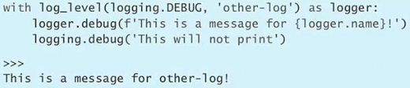

以上所讲的是 with 结构的另一项好处，也就是允许我们创造一个特殊的情境，并与这个情境交互时，保持情境与在情境中所执行操作之间是去耦的、状态独立的。

### 总结

1. 可以把 try/finally 逻辑封装到情境管理器里面，这样就能通过 with 结构反复运用这套逻辑，而不需要每次用到的时候，都手工打一遍代码。
2. Python 内置的 contextlib 模块提供了 contextmanager 修饰器，让我们可以很方便地修饰某个函数，从而制作出相对应的情境管理器，使得这个函数能够运用在 with 语句里面。
3. 情境管理器通过 yield 语句所产生的值，可以由 with 语句之中位于 as 右侧的那个变量所接收，这样的话，我们就可以通过该变量与当前情境相交互了。

## 第 67 条：用 datetime 模块处理本地时间，不要用 time 模块

协调世界时（Coordinated Universal Time，UTC）是标准的时间表示方法，它不依赖特定时区。有些计算机采用与 UNIX 时间原点（UNIX epoch）之间的秒数来表达时间，在这种场合，UTC 用起来是很方便的，然而对于人类来说，UTC 却不太直观，因为我们平常所说的时间，总是默认针对自己所在的地方而言的。例如我们习惯说“早上 8 点”，而不习惯说“比 UTC 的 15 点整早 7 个小时”。所以，在涉及时间的程序里，我们很有可能要在 UTC 与当地时区之间互相转换，这样才能给出用户容易理解的格式。

Python 里面有两种办法可以转换时区，一种是老办法，也就是通过内置的 time 模块来做，这种办法很容易出错。还有一种是新办法，也就是通过内置的 datetime 模块来做，这种办法可以跟第三方的 Python 开发者所构造的 pytz 软件包搭配起来，形成很好的转换效果。

我们必须先熟悉 time 与 datetime 这两种办法本身，然后才能彻底明白后一种办法为什么比前一种好。

### time 模块

内置 time 模块的 localtime 函数可以把 UNIX 时间戳（UNIX timestamp）转换为与宿主计算机的时区相符的本地时间（UNIX 时间戳是个 UTC 时间，表示某时刻与 UNIX 时间原点之间的秒数；笔者这台计算机使用的时区为太平洋夏令时（Pacific Daylight Time，PDT），它比 UTC 慢 7 个小时）。转换之后的本地时间，可以用 strftime 函数调整成用户习惯的格式。


另外，我们也经常需要反向操作，就是要把用户按照习惯所输入的本地时间转换成 UTC 时间。我们可以先用 strptime 函数来解析用户所给的字符串，然后把解析出来的值交给 mktime 函数，这样就能把本地时间转换成 UNIX 时间戳了。


还有个问题：怎样把某一时区的本地时间转换成另一时区的本地时间？例如，我要从旧金山坐飞机到纽约，我想知道，抵达纽约的那一刻相当于旧金山的几点几分。

一开始，我以为自己能直接操纵 time.localtime 与 strptime 所返回的值，从而完成时区转换。但是后来发现，这样很不好做，因为每个时区的计时细节可能都会根据当地的规则经常发生变化，所以自己手工管理起来，实在太过复杂，在处理全球各个城市航班起降问题时，显得尤其困难。

许多操作系统会通过相关的配置文件自动反映时区方面的变化，在这样的操作系统上，time 模块是可以支持某些时区的。但另外一些操作系统（例如 Windows）则不行，所以在那些操作系统上，不要想着用 time 去做转换。下面，我们试着把飞机起飞的时间用 PDT 时区（也就是旧金山所在的时区）来表示。


带有 PDT 时区的时间字符串可以为 strptime 函数正确地解析，于是我们就想试试看，当前计算机支持的其他时区是不是也能解析出来。很遗憾，不行。如果字符串里的时区是美国东部夏令时（Eastern Daylight Time，EDT），也就是纽约所在的那个时区，那么函数会抛出异常。


之所以出现这个问题，是因为 time 模块本质上仍然要依赖具体的平台而运作。它的行为取决于底层的 C 函数与宿主操作系统之间的协作方式，这导致该模块的功能在 Python 里面显得不太可靠。time 模块没办法稳定地处理多个时区，所以不要用这个模块来编写这方面的代码。假如一定要用，那最多也就是在 UTC 时间和宿主计算机的当地时区之间用它来转换，涉及其他时区的转换操作，最好还是通过 datetime 模块来做。

### datetime 模块

Python 里面还有一种表示时间的办法，是用内置的 datetime 模块里面的 datetime 类来表示。跟 time 模块一样，它也能把 UTC 时间转换成本地时间。

我们可以像下面这样，把当前的 UTC 时间转换成本机所使用的本地时间，也就是 PDT 时间。


反过来也很容易。我们同样可以用 datetime 模块把本地时间转换成 UTC 格式的 UNIX 时间戳。


跟 time 模块不同，datetime 模块里面有相应的机制，可以把一个时区的本地时间可靠地转化成另一个时区的本地时间。但问题是，datetime 的这套时区操纵机制必须通过 tzinfo 类与相关的方法来运作，而系统在安装 Python 的时候，并不会默认安装 UTC 之外的时区定义信息

好在其他 Python 开发者提供了 pytz 模块，能够把这些缺失的时区定义信息给补上，这个模块可以从 Python Package Index 下载（安装方式参见第 82 条）。pytz 包含一整套数据库，你可能会用到的每个时区它应该都有。

为了顺利使用 pytz 模块，应该先把本地时间转换成 UTC 时间，然后在这样的时间值上通过 datetime 所提供的各种方法执行自己想要的操作（例如通过下面提到的 astimezone 方法来调整时区属性），最后把操作好的时间转回当地时间。

例如，先通过下面这段代码把飞机到达纽约的时间转化成 UTC 时间。这样写看起来有点啰唆，但每个步骤都是必要的，只有这样，才能正确地使用 pytz。


获得 UTC 形式的 datetime 时间（即 utc_dt）之后，就可以把它转换为当地时间了。例如，可以像下面这样，转换为旧金山的当地时间。


转换成尼泊尔当地时间，也很容易。


把 datetime 与 pytz 搭配起来使用，可以确保程序在各种环境下，都能够给出一致的转换结果，而不依赖于具体的操作系统与宿主计算机。

### 总结

1. 不要用 time 模块在不同时区之间转换。
2. 把 Python 内置的 datetime 模块与开发者社群提供的 pytz 模块结合起来，可以在不同时区之间可靠地转换。
3. 在操纵时间数据的过程中，总是应该使用 UTC 时间，只有到了最后一步，才需要把它转回当地时间以便显示出来。

## 第 68 条：用 copyreg 实现可靠的 pickle 操作

Python 内置的 pickle 模块可以将对象序列化成字节流，也可以把字节流反序列化（还原）成对象。经过 pickle 处理的字节流，只应该在彼此信任的双方之间传输，而不应该随意传给别人，或者随意接受别人发来的这种数据，因为 pickle 的本意只是提供一种数据传输手段，让你在自己可以控制的程序之间传递二进制形式的 Python 对象。

> pickle 模块所使用的这种序列化格式本身就没有考虑过安全问题。这种格式会把原有的 Python 对象记录下来，让系统可以在稍后予以重建。这意味着，假如记录的这个对象本身含有恶意行为，那么通过反序列化还原出来之后，就有可能破坏整个程序。
>
> 跟 pickle 不同，json 模块考虑到了安全问题。序列化之后的 JSON 数据表示的只不过是一套对象体系而已，把这样的数据反序列化不会给程序带来风险。如果要在彼此不信任的两个人或两个程序之间传递数据，那么应该使用 JSON 这样的格式。

例如，下面这种 Python 对象表示玩家在游戏里的进度状态，其中记录了玩家当前级别（level）、还剩几条命（lives）。


在运行游戏的过程中，程序会修改这个对象里的各个属性。


玩家退出游戏时，程序应该把当前进度保存到文件里，这样就能在下次启动时，把进度读回来，让玩家接着上次的玩。这项操作通过 pickle 模块很容易就能实现。下面，我们用该模块的 dump 函数把 GameState 对象写到文件里面。


稍后，我们可以调用 load 函数把文件里的数据还原成 GameState 对象，这个对象跟序列化之前相比，看不出太大的区别。


这种办法有个问题，就是不能够很好地应对将来的游戏功能扩展。例如，我们还想记录玩家得过的最高分数。于是，要给 GameState 类里添加一个字段。


用 pickle 对新版的 GameState 对象做序列化是没有问题的。下面，我们用字节流代替文件模拟一下双向的操作效果。先用 dumps 函数把对象序列化成字节流，然后用 loads 函数把字节流反序列化（也就是还原）成对象。


但是，如果想把旧版的存档还原成新版的 GameState 对象，也就是要让玩家接着上次的进度来玩更新之后的游戏，那会如何呢？下面这段代码是按照新版的 GameState 类来运行的，但它想通过 load 函数对旧版的数据做 unpickle。


这样还原出来的 GameState 对象，竟然没有 points 属性。这真的很奇怪，这个对象明明是新版 GameState 类的实例，但为什么没有 points 属性呢？


其实，pickle 模块就是这样运作的，因为它的主要用途仅仅是让我们能够把对象轻松地序列化成二进制数据。如果想直接使用这个模块来实现比这更为复杂的需求，那么可能就会看到奇怪的结果。

解决这样的问题，也非常简单，即可以用内置的 copyreg 模块解决。这个模块允许我们向系统注册相关的函数，把 Python 对象的序列化与反序列化操作交给那些函数去处理，这样的话，pickle 模块就运作得更加稳定了。

### 给新属性设定默认值

最简的办法是定义带有默认参数的构造函数（参见第 23 条），以确保 unpickle 操作所还原的 GameState 对象总是具备应有的属性。下面，我们就定义这样的构造函数：


要想用这个构造函数做 pickle，应该定义下面这样的辅助函数，让它接受 GameState 对象，并把这个对象转化成元组，该元组的第一个元素是负责处理 unpickle 操作的函数（即 unpickle_game_state），第二个元素本身也是个元组（即(kwargs,)）用来表示那个函数所接受的参数。在本例中，由于 unpickle_game_state 只打算接受一个参数，因此那个元组也只能有一个元素，就是 kwargs。只有符合这种标准的函数，才能够注册给 copyreg 模块。


然后，定义另一个辅助函数，也就是上面提到的 unpickle_game_state。这个函数接受刚才那个 pickle_game_state 函数所返回的 kwargs 参数，并用这些参数里面的序列化数据来构造 GameState 对象。这样看来，它仅仅是把 GameState 的构造函数简单地封装了起来。


现在，我们用内置的 copyreg 模块来注册这两个函数。


注册之后，pickle 模块就可以正确地序列化与反序列化 GameState 对象了。

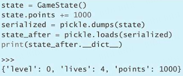

假设注册之后，我们又修改了 GameState 类，给里面添加了一个表示魔法卷轴数量的字段（magic）。这种修改，与早前向 GameState 里面添加表示最高得分的那个 points 字段类似。


我们已经注册了负责 pickle 与 unpickle 操作的函数，因此，如果把不带 magic 字段的存档文件加载回来，那么得到的 GameState 对象是具有 magic 属性的，该属性会取默认值 5，这与没有注册的时候不同，那时得到的 GameState 对象缺少了刚刚添加的 points 属性。为什么这次不会把新添加的字段漏掉呢？因为这次，系统会通过 unpickle_game_state 函数来还原对象，而这个函数会触发 GameState 构造函数，使得缺失的字段能够自动获得同名的关键字参数所指定的默认值，而不像没有注册时那样，只把数据里面已有的字段恢复到还原出来的对象之中。所以把旧版的存档文件加载进来的时候，GameState 的构造函数会自动给缺失的 magic 参数提供默认值。


### 用版本号标注同一个类的不同定义

有时我们要做的改动，是无法向后兼容的。例如，要把现有的 Python 对象之中的某些字段给删掉。这样一来，刚才那种给构造函数的参数指定默认值的做法就失效了。

例如，我们现在觉得不应该限制玩家的游戏次数，而是应该允许他一直玩下去，于是我们想把 lives 字段删掉。这样的话，GameState 类里就没有 lives 字段了，而且构造函数也不需要对应的参数了。


这样修改，会让注册之后所生成的旧版存档文件无法正确地反序列化。因为存档文件里面保存的数据是按照 lives 字段没有删除的那个 GameState 类生成的。把它还原回来的时候，会触发 unpickle_game_state 函数，进而触发现在这个 GameState 类的构造函数，可是这个构造函数已经没有用来接收 lives 字段的相应参数了。


这个问题可以通过添加版本号（version）来解决。早前通过 copyreg 模块注册了负责对 GameState 对象做序列化处理的 pickle_game_state 函数。现在，修改这个函数的代码，让它把根据目前这种 GameState 类所定义的对象标注为第 2 版。


由于旧版的数据没有 version 参数，因此可以把那种版本视为第 1 版，并做相应的处理（也就是从 kwargs 里面删去'lives'），然后再将 kwargs 里面的键值对交给现在的 GameState 构造函数。


这样就可以正确地还原旧版数据了。

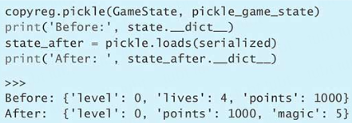

以后如果要继续修改类的定义，那么依然可以套用这个方案。在 unpickle_game_state 函数里面，对旧版数据做出必要的修改，让这些数据符合新版的类所提出的要求，这样就可以把旧版数据还原成新版的对象了。

### 正确处理类名变化

使用 pickle 模块的时候，还会碰到一个问题，就是类名会发生变化。在开发程序的过程中，我们需要重构代码，这时我们可能会把类的名称改掉，或者把它放到别的模块里面。这种情况需要谨慎处理，不然，利用 pickle 模块所编写的那些代码就有可能出现错误。

例如，把 GameState 类的名称改为 BetterGameState，并把原来那个 GameState 的代码从程序里面彻底删掉。


这个时候，如果想对原来的 GameState 数据做反序列化处理，而那份数据又是在没有经过 copyreg 注册的时候生成的，那么程序就会出错，因为它找不到 GameState 类。


之所以出现这个错误，是因为那种数据直接把类的名称（也就是 GameState）作为引入路径写在了里面。


这个问题还是可以用 copyreg 解决。如果我们先通过 copyreg.pickle 注册了负责执行 pickle 操作的函数，那么系统在把对象转换成序列化数据的时候，就不会将当前的类名作为引入路径写到数据里面了，而是会把那个函数所指定的 unpickle 函数（即 unpickle_game_state）作为引入路径写进去。所以，不管这个类将来改成什么名字，这份数据都可以通过 unpickle_game_state 还原，只要那个函数在还原的时候，使用的是正确的类名就行。这样相当于多了一个步骤，以前是直接根据类名还原，现在是先把还原任务交给 unpickle 函数，然后由那个函数去决定应该还原成哪个类的对象。

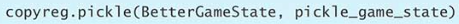

可以看到，如果先用 copyreg 注册，然后做序列化，那么写到数据里面的引入路径就不是 BetterGameState 这样的类名了，而是 unpickle_game_state 这样的 unpickle 函数名。


只有一个地方要注意，就是负责 unpickle 的 unpickle_game_state 函数所在模块的路径不能变，因为这个函数名已经写到了序列化之后的数据里面，将来反序列化的时候，系统要先找到这个函数，然后才能通过它正确地还原对象。

### 总结

1. Python 内置的 pickle 模块，只适合用来在彼此信任的程序之间传递数据，以实现对象的序列化与反序列化功能。
2. 如果对象所在的这个类发生了变化（例如增加或删除了某些属性），那么程序在还原旧版数据的时候，可能会出现错误。
3. 把内置的 copyreg 模块与 pickle 模块搭配起来使用，可以让新版的程序兼容旧版的序列化数据。

## 第 69 条：在需要准确计算的场合，用 decimal 表示相应的数值

Python 语言很擅长操纵各种数值。它的整数类型实际上可以表示任意尺寸的整型数据，它的双精度浮点数类型遵循 IEEE 754 规范。另外，Python 还提供了标准的复数类型，用来表示虚数。尽管有这么多类型，但还是没办法把每种情况都覆盖到。

例如，我们要给国际长途电话计费。通话时间用分和秒来表示，这项数据是已知的（例如 3 分 42 秒）。通话费率也是固定的，例如从美国打给南极洲的电话，每分钟 1.45 美元。现在要计算这次通话的具体费用。

有人可能觉得应该用浮点数来计算。


这个答案比正确答案（5.365）少了 0.000000000000001，这是因为浮点数必须表示成 IEEE 754 格式，所以采用浮点数算出的结果可能跟实际结果稍有偏差。另外，如果计费结果需要四舍五入到分位（也就是精确到 0.01 元，或者说精确到小数点后第二位），那么按照正确答案 5.365 来算，应该向上化成 5.37 美元。但如果按照刚才给出的值做四舍五入，那么小数点后第三位是 4，因此向下化成了 5.36 美元。


这样的计算应该用 Python 内置的 decimal 模块所提供的 Decimal 类来做。这个类默认支持 28 位小数，如果有必要，还可以调得更高。改用这个类之后，就不会出现由于 IEEE 754 浮点数而造成的偏差了。另外，这种数值所支持的舍入方式，也比浮点数丰富可控。

下面，用 Decimal 来重新计算通话费用，这次的结果是准确的，没有误差。


Decimal 的初始值可以用两种办法来指定。第一种，是把含有数值的 str 字符串传给 Decimal 的构造函数，这样做不会让字符串里面的数值由于 Python 本身的浮点数机制而出现偏差。第二种，是直接把 float 或 int 实例传给构造函数。通过下面这段代码，我们可以看到，这两种办法在某些小数上会产生不同的效果。


当然，对于整数来说，无论是放在字符串里面传，还是直接传给 Decimal 的构造函数，都不会有偏差。

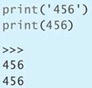

所以，如果你想要的是准确答案，那么应该使用 str 字符串来构造 Decimal，这种 decimal 的精确度可能比你需要的更高，但无论如何，都比刚一开始就出现偏差要好。

回到计算话费的那个例子，假如我们这次的费率比较低（例如托莱多与底特律这种距离较近的情况），而且通话时间很短，那我们看看，在每分钟 0.05 美元的情况下，通话 5 秒钟总费用是多少。


这个结果很接近 0。如果四舍五入到小数点后第二位，那么结果就是 0.00 美元。这显然不是我们想要的效果。


Decimal 类提供了 quantize 函数，可以根据指定的舍入方式把数值调整到某一位。首先用前面那个数值比较大的例子试试看，我们把计费结果向上调整（round up）到小数点后第二位。

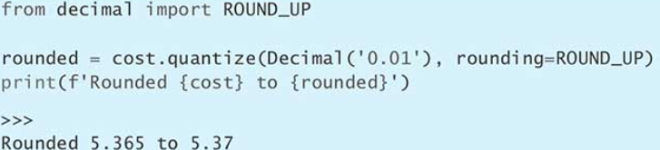

对于刚才那种数值很小的情况来说，quantize 方法同样可以正确地调整。


Decimal 可以很好地应对小数点后面数位有限的值（也就是定点数，fixed point number）。但对于小数位无限的值（例如 1/3）来说，依然会有误差。如果想表示精度不受限的有理数，那么可以考虑使用内置的 fractions 模块里面的 Fraction 类。

### 总结

1. 每一种数值几乎都可以用 Python 内置的某个类型，或者内置模块之中的某个类表示出来。
2. 在精度要求较高且需要控制舍入方式的场合（例如在计算费用的时候），可以考虑使用 Decimal 类。
3. 用小数构造 Decimal 时，如果想保证取值准确，那么一定要把这个数放在 str 字符串里面传递，而不要直接传过去，那样可能有误差。

## 第 70 条：先分析性能，然后再优化

## 第 71 条：优先考虑用 deque 实现生产者-消费者队列

## 第 72 条：考虑用 bisect 搜索已排序的序列

## 第 73 条：学会使用 heapq 制作优先级队列

## 第 74 条：考虑用 memoryview 与 bytearray 来实现无须拷贝的 bytes 操作

# 测试与调试

## 第 75 条：通过 repr 字符串输出调试信息

## 第 76 条：在 TestCase 子类里验证相关的行为

## 第 77 条：把测试前、后的准备与清理逻辑写在 setUp、tearDown、setUp-Module 与 tearDownModule 中，以防用例之间互相干扰

## 第 78 条：用 Mock 来模拟受测代码所依赖的复杂函数

## 第 79 条：把受测代码所依赖的系统封装起来，以便于模拟和测试

## 第 80 条：考虑用 pdb 做交互调试

## 第 81 条：用 tracemalloc 来掌握内存的使用与泄漏情况

# 协作开发

## 第 82 条：学会寻找由其他 Python 开发者所构建的模块

## 第 83 条：用虚拟环境隔离项目，并重建依赖关系

## 第 84 条：每一个函数、类与模块都要写 docstring

## 第 85 条：用包来安排模块，以提供稳固的 API

## 第 86 条：考虑用模块级别的代码配置不同的部署环境

## 第 87 条：为自编的模块定义根异常，让调用者能够专门处理与此 API 有关的异常

## 第 88 条：用适当的方式打破循环依赖关系

## 第 89 条：重构时考虑通过 warnings 提醒开发者 API 已经发生变化

## 第 90 条：考虑通过 typing 做静态分析，以消除 bug

// TODO 编写高质量 Python 待完成
