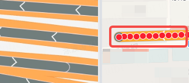

# 背景

在 chrome 浏览器上，用高德地图的 CircleMarker, PathSimplifier 分别画点和线时候，需要实现点在线的上面的效果，此时在 windows 系统上不能正常显示红点（左侧），在 ubuntu 系统下却正常显示（右侧），如下图所示

# 原因

红点是由 [CircleMarker](https://lbs.amap.com/api/javascript-api-v2/documentation#circlemarker) 组件实现，而下面的线则是 [PathSimplifier](https://lbs.amap.com/api/amap-ui/reference-amap-ui/mass-data/pathsimplifier) 实现，在 chrome 浏览器下不同系统的表现为：

1. window: CircleMarker 由 canvas 渲染，且层级和高德地图图层一致，而 PathSimplifier 的层级比高德地图图层要高
2. ubuntu: CircleMarker 由 svg 渲染，层级比 PathSimplifier 要高

# 优缺点

综上所述，需要统一不同系统下的渲染方式，优缺点对比如下

| 渲染方式 | 优点 | 缺点 |
| :-: | :-: | :-: |
| canvas | 性能好 | 实现成本高，即需要生成比 PathSimplifier 所在层级要高的新图层 |
| svg | 实现方便，有现成的 [SvgMarker](https://lbs.amap.com/api/amap-ui/reference-amap-ui/overlay/svgmarker) | 性能差，但对于这个场景来说只需要鼠标悬浮上去才渲染一条路线上的点，即性能要求不高 |

最终采用 SvgMarker 渲染

# 效果展示

以下都在 chrome 浏览器下测试：

## 修复前

windows 下不能正常显示，ubuntu 正常

[example-1](embedded-codesandbox://amap-browser-compatibility/example-1?module=/src/components/ReactAmap/hooks/useDrawPoints.js&view=preview)

## 修复后

windows、ubuntu 都能正常显示

[example-2](embedded-codesandbox://amap-browser-compatibility/example-2?module=/src/components/ReactAmap/hooks/useDrawPoints.js&view=preview)
