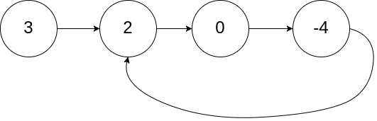
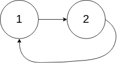
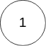
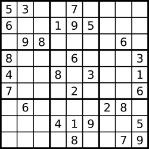

# 509 斐波那契数

斐波那契数，通常用 F(n) 表示，形成的序列称为斐波那契数列。该数列由 0 和 1 开始，后面的每一项数字都是前面两项数字的和。也就是：

```
F(0) = 0，F(1) = 1
F(n) = F(n - 1) + F(n - 2)，其中 n > 1
给你 n ，请计算 F(n) 。
```

示例 1：

```
输入：2
输出：1
解释：F(2) = F(1) + F(0) = 1 + 0 = 1
```

示例 2：

```
输入：3
输出：2
解释：F(3) = F(2) + F(1) = 1 + 1 = 2
```

示例 3：

```
输入：4
输出：3
解释：F(4) = F(3) + F(2) = 2 + 1 = 3
```

提示：

`0 <= n <= 30`

## 递归

```cpp
class Solution {
public:
  int fib(int N) {
    if (N < 2) return N;
    return fib(N - 1) + fib(N - 2);
  }
};
```

-  时间复杂度：O(n^2)
-  空间复杂度：O(n)

## 动态规划

```cpp
class Solution {
public:
  int fib(int N) {
    if (N <= 1) return N;
    int dp[2];
    dp[0] = 0;
    dp[1] = 1;
    for (int i = 2; i <= N; i++) {
      int sum = dp[0] + dp[1];
      dp[0] = dp[1];
      dp[1] = sum;
    }
    return dp[1];
  }
};
```

-  时间复杂度：O(n)
-  空间复杂度：O(1)

# 剑指 Offer 25. 合并两个排序的链表

输入两个递增排序的链表，合并这两个链表并使新链表中的节点仍然是递增排序的。

示例 1：

```
输入：1->2->4, 1->3->4
输出：1->1->2->3->4->4
```

限制：

`0 <= 链表长度 <= 1000`

常规题目，类似于归并排序中的合并过程。

## 递归

```js
/*
 */
/**
 * Definition for singly-linked list.
 * function ListNode(val) {
 *     this.val = val;
 *     this.next = null;
 * }
 */
/**
 * @param {ListNode} l1
 * @param {ListNode} l2
 * @return {ListNode}
 */
var mergeTwoLists = function(l1, l2) {
  if (l1 === null) return l2;
  if (l2 === null) return l1;
  if (l1.val < l2.val) {
    l1.next = mergeTwoLists(l1.next, l2);
    return l1;
  } else {
    l2.next = mergeTwoLists(l1, l2.next);
    return l2;
  }
};
```

-  时间复杂度：O(N)，其中 N 为两个链表节点总数
-  空间复杂度：O(1)

## 迭代

```js
/*
 * @lc app=leetcode id=21 lang=javascript
 *
 */
/**
 * @param {ListNode} l1
 * @param {ListNode} l2
 * @return {ListNode}
 */
var mergeTwoLists = function(l1, l2) {
  let current = new ListNode();
  const dummy = current;

  while (l1 || l2) {
    if (!l1) {
      current.next = l2;
      return dummy.next;
    } else if (!l2) {
      current.next = l1;
      return dummy.next;
    }

    if (l1.val <= l2.val) {
      current.next = l1;
      l1 = l1.next;
    } else {
      current.next = l2;
      l2 = l2.next;
    }

    current = current.next;
  }

  return dummy.next;
};
```

-  时间复杂度：O(N)，其中 N 为两个链表节点总数
-  空间复杂度：加上栈空间的话，空间复杂度为 O(N)，其中 N 为两个链表节点总数

# 剑指 Offer 24. 反转链表

定义一个函数，输入一个链表的头节点，反转该链表并输出反转后链表的头节点。

示例:

```
输入: 1->2->3->4->5->NULL
输出: 5->4->3->2->1->NULL
```

限制：

`0 <= 节点个数 <= 5000`

## 迭代

```js
/**
 * Definition for singly-linked list.
 * function ListNode(val) {
 *     this.val = val;
 *     this.next = null;
 * }
 */
/**
 * @param {ListNode} head
 * @return {ListNode}
 */
var reverseList = function(head) {
  let prev = null;
  let curr = head;
  while (curr) {
    const next = curr.next; // 修改前先记住下一个节点
    curr.next = prev; // 改指向，第一个节点 prev 是 null
    prev = curr; // 记录前一个节点，供下次循环使用
    curr = next; // curr 通过 next 指向下一节点
  }
  return prev; // curr 会循环直到 null
};
```

-  时间复杂度：O(n)，其中 n 是链表的长度。需要遍历链表一次。
-  空间复杂度：O(1)。

## 递归

```js
var reverseList = function(head) {
  if (head == null || head.next == null) {
    return head;
  }
  const newHead = reverseList(head.next);
  // 放在递归函数的后面是为了倒序遍历
  // 假设节点 n(k + 1) 到 n(m) 已经反转
  // 希望 n(k + 1) 的下一个节点指向 n(k)，所以 n(k).next.next = n(k)
  head.next.next = head;
  head.next = null; // 避免产生环
  return newHead;
};
```

-  时间复杂度：O(n)，其中 n 是链表的长度。需要对链表的每个节点进行反转操作。
-  空间复杂度：O(n)，其中 n 是链表的长度。空间复杂度主要取决于递归调用的栈空间，最多为 n 层。

# 141. 环形链表

给定一个链表，判断链表中是否有环。

如果链表中有某个节点，可以通过连续跟踪 next 指针再次到达，则链表中存在环。为了表示给定链表中的环，我们使用整数 pos 来表示链表尾连接到链表中的位置（索引从 0 开始）。如果 pos 是 -1，则在该链表中没有环。注意：pos 不作为参数进行传递，仅仅是为了标识链表的实际情况。

如果链表中存在环，则返回 true。否则，返回 false。

进阶：

你能用 O(1)（即，常量）内存解决此问题吗？

示例 1：



```
输入：head = [3,2,0,-4], pos = 1
输出：true
解释：链表中有一个环，其尾部连接到第二个节点。
```

示例 2：



```
输入：head = [1,2], pos = 0
输出：true
解释：链表中有一个环，其尾部连接到第一个节点。
```

示例 3：



```
输入：head = [1], pos = -1
输出：false
解释：链表中没有环。
```

提示：

-  链表中节点的数目范围是 [0, 104]
-  -105 <= Node.val <= 105
-  pos 为 -1 或者链表中的一个有效索引。

## 哈希表

```cpp
class Solution {
public:
  bool hasCycle(ListNode *head) {
    unordered_set<ListNode*> seen;
    while (head != nullptr) {
      if (seen.count(head)) {
        return true;
      }
      seen.insert(head);
      head = head->next;
    }
    return false;
  }
};
```

-  时间复杂度：O(N)，其中 N 是链表中的节点数。最坏情况下我们需要遍历每个节点一次。
-  空间复杂度：O(N)，其中 N 是链表中的节点数。主要为哈希表的开销，最坏情况下我们需要将每个节点插入到哈希表中一次。

## 快慢指针

```cpp
class Solution {
public:
  bool hasCycle(ListNode* head) {
    if (head == nullptr || head->next == nullptr) {
      return false;
    }
    ListNode* slow = head;
    ListNode* fast = head->next;
    while (slow != fast) {
      if (fast == nullptr || fast->next == nullptr) {
        return false;
      }
      slow = slow->next;
      fast = fast->next->next;
    }
    return true;
  }
};
```

-  时间复杂度：O(N)，其中 N 是链表中的节点数。
   -  当链表中不存在环时，快指针将先于慢指针到达链表尾部，链表中每个节点至多被访问两次。
   -  当链表中存在环时，每一轮移动后，快慢指针的距离将减小一。而初始距离为环的长度，因此至多移动 N 轮。
-  空间复杂度：O(1)。我们只使用了两个指针的额外空间。

# 678. 有效的括号字符串

给定一个只包含三种字符的字符串：（ ，）  和 \*，写一个函数来检验这个字符串是否为有效字符串。有效字符串具有如下规则：

1.  任何左括号 (  必须有相应的右括号 )。
2.  任何右括号 )  必须有相应的左括号 ( 。
3.  左括号 ( 必须在对应的右括号之前 )。
4.  \*  可以被视为单个右括号 ) ，或单个左括号 ( ，或一个空字符串。
5.  一个空字符串也被视为有效字符串。

示例 1:

```
输入: "()"
输出: True
```

示例 2:

```
输入: "(*)"
输出: True
```

示例 3:

```
输入: "(*))"
输出: True
```

注意:

1.  字符串大小将在 `[1，100]` 范围内。

## 栈

两个栈， 一个存放（ ，一个存放 \* 栈中存放下标

```js
var checkValidString = function(s) {
  let stack = [],
    star = [];
  for (let i = 0; i < s.length; i++) {
    // 一遍遍历，对每一个 s[i]，判断是入栈还是抵消
    if (s[i] == '(') stack.push(i);
    else if (s[i] == '*') star.push(i);
    else {
      if (stack.length) stack.pop();
      else if (star.length) star.pop();
      else return false; // 没得抵消了，只能返回 false
    }
  }

  if (stack.length > star.length) return false; // 对两个栈处理
  while (stack.length && star.length) {
    if (stack.pop() > star.pop()) return false; // **((, 类似这样，虽个数合适，但顺序（下标）不可
  }
  return true;
};
```

## 贪心

我们只需要维护一个左括号的可能取值数组即可

-  当我们遇到(的时候，我们的左括号的数量区间就是`[1]`,只能是一个。
-  当我们遇到(\*的时候，我们的左括号的数量区间是`[0,1,2]`，
   -  星号可以当成右括号，这样就会和前面一个左括号抵消，相当于没有括号，是为 0；
   -  星号可以当成空字符串，那就是 1；
   -  如果当成左括号，那就是 2；
   -  如果我们遇到星号之前的区间是`[0,1]`,那这里是不是变成了`[-1,0,1,2]`了呢？没有必要，因为我们要尽可能的平衡左右括号，所以显然不能愣头青地强行要把星号当成)来使左括号取值变成-1，所以是`[0,1,2]`
-  当我们遇到)的时候，我们的区间取值是否都要降低 1，比如`[0,1,2]`变成`[-1,0,1]`呢？这里需要注意，我们是要尽可能的平衡左右括号，所以当我们的区间最左值已经是 0 的时候，我们显然要把之前的星号当成(来抵消这个)，跟上面那个类似，都是贪心思想的体现。所以我们这里只需要把区间改成`[0,1]`

最后我们遍历完字符串以后，我们只需要检查我们的区间是不是包含了 0，因为这个区间是连续的，所以我们只需要判断最左侧的值和最后侧的值是否夹住了 0，即 `low<=0&&0<=high`

```js
/**
 * @param {string} s
 * @return {boolean}
 */
var checkValidString = function(s) {
  let low = 0;
  let high = 0;

  for (let i = 0; i < s.length; i++) {
    if (s[i] == '(') {
      low++;
      high++;
    } else if (s[i] == ')') {
      // 贪心缩小区间
      if (low > 0) --low;
      if (high > 0) {
        --high;
      } else {
        return false;
      }
    } else {
      // 贪心缩小区间
      if (low > 0) {
        low--;
      }
      high++;
    }
  }
  return low <= 0 && 0 <= high;
};
```

# 215. 数组中的第 K 个最大元素

给定整数数组 nums 和整数 k，请返回数组中第 k 个最大的元素。

请注意，你需要找的是数组排序后的第 k 个最大的元素，而不是第 k 个不同的元素。

示例 1:

```
输入: [3,2,1,5,6,4] 和 k = 2
输出: 5
```

示例 2:

```
输入: [3,2,3,1,2,4,5,5,6] 和 k = 4
输出: 4
```

提示：

-  1 <= k <= nums.length <= 104
-  -104 <= `nums[i]` <= 104

## 数组排序

```js
let findKthLargest = function(nums, k) {
  nums.sort((a, b) => b - a).slice(0, k);
  return nums[k - 1];
};
```

-  时间复杂度：O(nlogn)
-  空间复杂度：O(logn)

## 构造前 k 个最大元素小顶堆，取堆顶

通过构造一个前 k 个最大元素小顶堆来解决，小顶堆上的任意节点值都必须小于等于其左右子节点值，即堆顶是最小值。

所以我们可以从数组中取出 k 个元素构造一个小顶堆，然后将其余元素与小顶堆对比，如果大于堆顶则替换堆顶，然后堆化，所有元素遍历完成后，堆中的堆顶即为第 k 个最大值

具体步骤如下：

-  从数组中取前 k 个数（ 0 到 k-1 位），构造一个小顶堆
-  从 k 位开始遍历数组，每一个数据都和小顶堆的堆顶元素进行比较，如果小于堆顶元素，则不做任何处理，继续遍历下一元素；如果大于堆顶元素，则将这个元素替换掉堆顶元素，然后再堆化成一个小顶堆。
-  遍历完成后，堆顶的数据就是第 K 大的数据

```js
let findKthLargest = function(nums, k) {
  // 从 nums 中取出前 k 个数，构建一个小顶堆
  let heap = [,],
    i = 0;
  while (i < k) {
    heap.push(nums[i++]);
  }
  buildHeap(heap, k);

  // 从 k 位开始遍历数组
  for (let i = k; i < nums.length; i++) {
    if (heap[1] < nums[i]) {
      // 替换并堆化
      heap[1] = nums[i];
      heapify(heap, k, 1);
    }
  }

  // 返回堆顶元素
  return heap[1];
};

// 原地建堆，从后往前，自上而下式建小顶堆
let buildHeap = (arr, k) => {
  if (k === 1) return;
  // 从最后一个非叶子节点开始，自上而下式堆化
  for (let i = Math.floor(k / 2); i >= 1; i--) {
    heapify(arr, k, i);
  }
};

// 堆化
let heapify = (arr, k, i) => {
  // 自上而下式堆化
  while (true) {
    let minIndex = i;
    if (2 * i <= k && arr[2 * i] < arr[i]) {
      minIndex = 2 * i;
    }
    if (2 * i + 1 <= k && arr[2 * i + 1] < arr[minIndex]) {
      minIndex = 2 * i + 1;
    }
    if (minIndex !== i) {
      swap(arr, i, minIndex);
      i = minIndex;
    } else {
      break;
    }
  }
};

// 交换
let swap = (arr, i, j) => {
  let temp = arr[i];
  arr[i] = arr[j];
  arr[j] = temp;
};
```

-  时间复杂度：遍历数组需要 O(n) 的时间复杂度，一次堆化需要 O(logk) 时间复杂度，所以利用堆求 Top k 问题的时间复杂度为 O(nlogk)
-  空间复杂度：O(k)

## 快速选择（quickselect）算法

```js
let findKthLargest = function(nums, k) {
  return quickSelect(nums, nums.length - k);
};

let quickSelect = (arr, k) => {
  return quick(arr, 0, arr.length - 1, k);
};

let quick = (arr, left, right, k) => {
  let index;
  if (left < right) {
    // 划分数组
    index = partition(arr, left, right);
    // Top k
    if (k === index) {
      return arr[index];
    } else if (k < index) {
      // Top k 在左边
      return quick(arr, left, index - 1, k);
    } else {
      // Top k 在右边
      return quick(arr, index + 1, right, k);
    }
  }
  return arr[left];
};

let partition = (arr, left, right) => {
  // 取中间项为基准
  var datum = arr[Math.floor(Math.random() * (right - left + 1)) + left],
    i = left,
    j = right;
  // 开始调整
  while (i < j) {
    // 左指针右移
    while (arr[i] < datum) {
      i++;
    }

    // 右指针左移
    while (arr[j] > datum) {
      j--;
    }

    // 交换
    if (i < j) swap(arr, i, j);

    // 当数组中存在重复数据时，即都为 datum，但位置不同
    // 继续递增 i，防止死循环
    if (arr[i] === arr[j] && i !== j) {
      i++;
    }
  }
  return i;
};

// 交换
let swap = (arr, i, j) => {
  let temp = arr[i];
  arr[i] = arr[j];
  arr[j] = temp;
};
```

-  时间复杂度：平均时间复杂度 O(n)，最坏情况时间复杂度为 O(n^2)
-  空间复杂度：O(1)

## 中位数的中位数（BFPRT）算法

又称为中位数的中位数算法，它的最坏时间复杂度为  O(n)，它是由 Blum、Floyd、Pratt、Rivest、Tarjan 提出。该算法的思想是修改快速选择算法的主元选取方法，提高算法在最坏情况下的时间复杂度。

在 BFPTR 算法中，仅仅是改变了快速选择（quickselect）算法中 Partion 中的基准值的选取，在快速选择（quickselect）算法中，我们可以选择第一个元素或者最后一个元素作为基准元，优化的可以选择随机一个元素作为基准元，而在 BFPTR 算法中，每次选择五分中位数的中位数作为基准元（也称为主元 pivot），这样做的目的就是使得划分比较合理，从而避免了最坏情况的发生。

BFPRT 算法步骤如下：

-  选取主元
   -  将 n 个元素按顺序分为 n/5 个组，每组 5 个元素，若有剩余，舍去
   -  对于这 n/5 个组中的每一组使用插入排序找到它们各自的中位数
   -  对于上一步中找到的所有中位数，调用 BFPRT 算法求出它们的中位数，作为主元；
-  以主元为分界点，把小于主元的放在左边，大于主元的放在右边；
-  判断主元的位置与 k 的大小，有选择的对左边或右边递归

```js
let findKthLargest = function(nums, k) {
  return nums[bfprt(nums, 0, nums.length - 1, nums.length - k)];
};

let bfprt = (arr, left, right, k) => {
  let index;
  if (left < right) {
    // 划分数组
    index = partition(arr, left, right);
    // Top k
    if (k === index) {
      return index;
    } else if (k < index) {
      // Top k 在左边
      return bfprt(arr, left, index - 1, k);
    } else {
      // Top k 在右边
      return bfprt(arr, index + 1, right, k);
    }
  }
  return left;
};

let partition = (arr, left, right) => {
  // 基准
  var datum = arr[findMid(arr, left, right)],
    i = left,
    j = right;
  // 开始调整
  while (i < j) {
    // 左指针右移
    while (arr[i] < datum) {
      i++;
    }

    // 右指针左移
    while (arr[j] > datum) {
      j--;
    }

    // 交换
    if (i < j) swap(arr, i, j);

    // 当数组中存在重复数据时，即都为datum，但位置不同
    // 继续递增i，防止死循环
    if (arr[i] === arr[j] && i !== j) {
      i++;
    }
  }
  return i;
};

/**
 * 数组 arr[left, right] 每五个元素作为一组，并计算每组的中位数，
 * 最后返回这些中位数的中位数下标（即主元下标）。
 *
 * @attention 末尾返回语句最后一个参数多加一个 1 的作用其实就是向上取整的意思，
 * 这样可以始终保持 k 大于 0。
 */
let findMid = (arr, left, right) => {
  if (right - left < 5) return insertSort(arr, left, right);

  let n = left - 1;

  // 每五个作为一组，求出中位数，并把这些中位数全部依次移动到数组左边
  for (let i = left; i + 4 <= right; i += 5) {
    let index = insertSort(arr, i, i + 4);
    swap(arr[++n], arr[index]);
  }

  // 利用 bfprt 得到这些中位数的中位数下标（即主元下标）
  return findMid(arr, left, n);
};

/**
 * 对数组 arr[left, right] 进行插入排序，并返回 [left, right]
 * 的中位数。
 */
let insertSort = (arr, left, right) => {
  let temp, j;
  for (let i = left + 1; i <= right; i++) {
    temp = arr[i];
    j = i - 1;
    while (j >= left && arr[j] > temp) {
      arr[j + 1] = arr[j];
      j--;
    }
    arr[j + 1] = temp;
  }
  return ((right - left) >> 1) + left;
};

// 交换
let swap = (arr, i, j) => {
  let temp = arr[i];
  arr[i] = arr[j];
  arr[j] = temp;
};
```

-  时间复杂度：最坏 O(n)
-  空间复杂度：O(1)

# 寻找和为定值的多个数

输入两个整数 n 和 sum，从数列 1，2，3.......n 中随意取几个数，使其和等于 sum，要求将其中所有的可能组合列出来。

## 递归

注意到取 n，和不取 n 个区别即可，考虑是否取第 n 个数的策略，可以转化为一个只和前 n-1 个数相关的问题。

-  如果取第 n 个数，那么问题就转化为“取前 n-1 个数使得它们的和为 sum-n”，对应的代码语句就是 sumOfkNumber(sum - n, n - 1)；
-  如果不取第 n 个数，那么问题就转化为“取前 n-1 个数使得他们的和为 sum”，对应的代码语句为 sumOfkNumber(sum, n - 1)。

```cpp
list<int>list1;
void SumOfkNumber(int sum, int n)
{
  // 递归出口
  if (n <= 0 || sum <= 0)
    return;

  // 输出找到的结果
  if (sum == n)
  {
    // 反转 list
    list1.reverse();
    for (list<int>::iterator iter = list1.begin(); iter != list1.end(); iter++)
      cout << *iter << " + ";
    cout << n << endl;
    list1.reverse() // 此处还需反转回来
  }

  list1.push_front(n); // 典型的 01 背包问题
  SumOfkNumber(sum - n, n - 1); // “放” n，前 n-1 个数“填满” sum-n
  list1.pop_front();
  SumOfkNumber(sum, n - 1); // 不“放” n，n-1 个数“填满” sum
}
```

## 回溯法+剪枝

这个问题属于子集和问题（也是背包问题）。本程序采用回溯法+剪枝，其中 X 数组是解向量，t=∑(1,..,k-1)Wi\*Xi, r=∑(k,..,n)Wi，且

若 t+Wk+W(k+1)<=M,则 Xk=true，递归左儿子(X1,X2,..,X(k-1),1)；否则剪枝；若 t+r-Wk>=M && t+W(k+1)<=M,则置 Xk=0，递归右儿子(X1,X2,..,X(k-1),0)；否则剪枝；本题中 W 数组就是(1,2,..,n),所以直接用 k 代替 WK 值。

```cpp
//输入t， r，尝试 Wk
void SumOfkNumber(int t, int k, int r, int& M, bool& flag, bool* X)
{
  X[k] = true;   // 选第 k 个数
  if (t + k == M) // 若找到一个和为 M，则设置解向量的标志位，输出解
  {
    flag = true;
    for (int i = 1; i <= k; ++i)
    {
      if (X[i] == 1)
      {
        printf("%d ", i);
      }
    }
    printf("\n");
  }
  else
  { // 若第 k+1 个数满足条件，则递归左子树
    if (t + k + (k + 1) <= M)
    {
      SumOfkNumber(t + k, k + 1, r - k, M, flag, X);
    }
    // 若不选第 k 个数，选第 k+1 个数满足条件，则递归右子树
    if ((t + r - k >= M) && (t + (k + 1) <= M))
    {
      X[k] = false;
      SumOfkNumber(t, k + 1, r - k, M, flag, X);
    }
  }
}

void search(int& N, int& M)
{
  // 初始化解空间
  bool* X = (bool*)malloc(sizeof(bool)* (N + 1));
  memset(X, false, sizeof(bool)* (N + 1));
  int sum = (N + 1) * N * 0.5f;
  if (1 > M || sum < M) // 预先排除无解情况
  {
    printf("not found\n");
    return;
  }
  bool f = false;
  SumOfkNumber(0, 1, sum, M, f, X);
  if (!f)
  {
    printf("not found\n");
  }
  free(X);
}
```

## 0-1 背包问题

0-1 背包问题是最基础的背包问题，其具体描述为：有 N 件物品和一个容量为 V 的背包。放入第 i 件物品耗费的费用是 Ci，得到的价值是 Wi。求解将哪些物品装入背包可使价值总和最大。

简单分析下：这是最基础的背包问题，特点是每种物品仅有一件，可以选择放或不放。用子问题定义状态：即 F[i, v]表示前 i 件物品恰放入一个容量为 v 的背包可以获得的最大价值。则其状态转移方程便是：

F[i, v] = max{F[i-1, v], F[i-1, v-Ci] + Wi} 根据前面的分析，我们不难理解这个方程的意义：“将前 i 件物品放入容量为 v 的背包中”这个子问题，若只考虑第 i 件物品的策略（放或不放），那么就可以转化为一个只和前 i-1 件物品相关的问题。即：

如果不放第 i 件物品，那么问题就转化为“前 i-1 件物品放入容量为 v 的背包中”，价值为 F[i-1, v ]；如果放第 i 件物品，那么问题就转化为“前 i-1 件物品放入剩下的容量为 v-Ci 的背包中”，此时能获得的最大价值就是 F[i-1, v-Ci]再加上通过放入第 i 件物品获得的价值 Wi。

```
F[0,0...V] ← 0
for i ← 1 to N
    for v ← Ci to V
        F[i, v] ← max{F[i-1, v], F[i-1, v-Ci] + Wi }
```

这段代码的时间和空间复杂度均为 O(VN)，其中时间复杂度应该已经不能再优化了，但空间复杂度却可以优化到 O(V)。

# 1663. 具有给定数值的最小字符串

小写字符的数值是它在字母表中的位置（从 1 开始），因此 a 的数值为 1，b 的数值为 2，c 的数值为 3，以此类推。

字符串由若干小写字符组成，字符串的数值为各字符的数值之和。例如，字符串 "abe" 的数值等于 1 + 2 + 5 = 8。

给你两个整数 n 和 k。返回长度等于 n 且数值等于 k 的字典序最小的字符串。

注意，如果字符串 x 在字典排序中位于 y 之前，就认为 x 字典序比 y 小，有以下两种情况：

-  x 是 y 的一个前缀；
-  如果 i 是 `x[i] != y[i]` 的第一个位置，且 `x[i]` 在字母表中的位置比 `y[i]` 靠前。

示例 1：

```
输入：n = 3, k = 27
输出："aay"
解释：字符串的数值为 1 + 1 + 25 = 27，它是数值满足要求且长度等于 3 字典序最小的字符串。
```

示例 2：

```
输入：n = 5, k = 73
输出："aaszz"
```

提示：

-  1 <= n <= 10^5
-  n <= k <= 26 \* n

## 构造不等式

利用 k 和 n 之间的关系构造不等式，从而取到每一位上的最小值

```js
/**
 * @param {number} n
 * @param {number} k
 * @return {string}
 */
var getSmallestString = function(n, k) {
  var len = n;
  var res = [];
  var charA = 'a'.charCodeAt(0);
  for (var i = 0; i < n; i++) {
    var bound = k - (n - 1 - i) * 26;
    if (bound <= 1) {
      res[i] = 'a';
      k -= 1;
    } else {
      res[i] = String.fromCharCode(charA + bound - 1);
      k -= bound;
    }
  }
  res = res.join('');
  return res;
};
```

## 全部填充 a，再从后往前消耗 k

```js
var getSmallestString = function(n, k) {
  var res = [];
  for (var i = 0; i < n; i++) {
    res.push('a');
  }
  var remain = k - n;
  var current = n - 1;
  while (remain > 0) {
    if (remain > 25) {
      res[current] = 'z';
      remain -= 25; // 前面已经减过 1 了
      current -= 1;
    } else {
      res[current] = String.fromCharCode(97 + remain);
      remain = 0;
    }
  }
  return res.join('');
};
```

# 剑指 Offer 55 - I. 二叉树的深度

输入一棵二叉树的根节点，求该树的深度。从根节点到叶节点依次经过的节点（含根、叶节点）形成树的一条路径，最长路径的长度为树的深度。

例如：

给定二叉树 `[3,9,20,null,null,15,7]`

```
    3
   / \
  9  20
    /  \
   15   7
```

返回它的最大深度 3 。

提示：

1.  节点总数 <= 10000

## 深度优先（递归）

```js
/**
 * Definition for a binary tree node.
 * function TreeNode(val) {
 *     this.val = val;
 *     this.left = this.right = null;
 * }
 */
/**
 * @param {TreeNode} root
 * @return {number}
 */
const maxDepth = (root) => {
  // 1. 如果没下一层了，返回 0
  if (!root) {
    return 0;
  }
  // 2. 返回左右子树中最深的那一层
  return Math.max(maxDepth(root.left) + 1, maxDepth(root.right) + 1);
};

const root = {
  val: 3,
  left: { val: 9 },
  right: {
    val: 20,
    left: { val: 15, left: null, right: null },
    right: { val: 7, left: null, right: null }
  }
};

console.log(maxDepth(root));
```

## 广度优先

```js
/**
 * Definition for a binary tree node.
 * function TreeNode(val) {
 *     this.val = val;
 *     this.left = this.right = null;
 * }
 */
/**
 * @param {TreeNode} root
 * @return {number}
 */
const maxDepth = (root) => {
  if (!root) {
    return 0;
  }

  // 1. 设置深度为 0
  let depth = 0;

  // 2. 每层遍历
  let bfs = [root];

  // 3. 逐层访问树
  while (bfs.length) {
    // 3.1 每次遍历，深度 + 1
    depth++;

    // 3.2 设置下一次需要遍历的节点
    const tempBfs = [];

    // 3.3 遍历本次所有节点，将有内容的都添加进来
    for (let i = 0; i < bfs.length; i++) {
      if (bfs[i].left) {
        tempBfs.push(bfs[i].left);
      }
      if (bfs[i].right) {
        tempBfs.push(bfs[i].right);
      }
    }

    // 3.4 交接 tempBfs 到 bfs 上
    bfs = tempBfs;
  }

  // 4. 返回深度
  return depth;
};

const root = {
  val: 3,
  left: { val: 9 },
  right: {
    val: 20,
    left: { val: 15, left: null, right: null },
    right: { val: 7, left: null, right: null }
  }
};
```

# 102. 二叉树的层序遍历

给你一个二叉树，请你返回其按层序遍历得到的节点值。（即逐层地，从左到右访问所有节点）。

示例：

二叉树：[3,9,20,null,null,15,7],

```
    3
   / \
  9  20
    /  \
   15   7
```

返回其层序遍历结果：

```
[
  [3],
  [9,20],
  [15,7]
]
```

## 广度优先搜索

```js
var levelOrder = function(root) {
  const ret = [];
  if (!root) {
    return ret;
  }

  const q = [];
  q.push(root);
  while (q.length !== 0) {
    const currentLevelSize = q.length;
    ret.push([]);
    for (let i = 1; i <= currentLevelSize; ++i) {
      const node = q.shift();
      ret[ret.length - 1].push(node.val);
      if (node.left) q.push(node.left);
      if (node.right) q.push(node.right);
    }
  }

  return ret;
};
```

-  时间复杂度：每个点进队出队各一次，故渐进时间复杂度为 O(n)。
-  空间复杂度：队列中元素的个数不超过 n 个，故渐进空间复杂度为 O(n)。

# 36. 有效的数独

请你判断一个 9x9 的数独是否有效。只需要根据以下规则，验证已经填入的数字是否有效即可。

1.  数字 1-9  在每一行只能出现一次。
2.  数字 1-9  在每一列只能出现一次。
3.  数字 1-9  在每一个以粗实线分隔的 3x3  宫内只能出现一次。（请参考示例图）

数独部分空格内已填入了数字，空白格用 '.'  表示。

注意：

-  一个有效的数独（部分已被填充）不一定是可解的。
-  只需要根据以上规则，验证已经填入的数字是否有效即可。

示例 1：



```
输入：board =
[["5","3",".",".","7",".",".",".","."]
,["6",".",".","1","9","5",".",".","."]
,[".","9","8",".",".",".",".","6","."]
,["8",".",".",".","6",".",".",".","3"]
,["4",".",".","8",".","3",".",".","1"]
,["7",".",".",".","2",".",".",".","6"]
,[".","6",".",".",".",".","2","8","."]
,[".",".",".","4","1","9",".",".","5"]
,[".",".",".",".","8",".",".","7","9"]]
输出：true
```

示例 2：

```
输入：board =
[["8","3",".",".","7",".",".",".","."]
,["6",".",".","1","9","5",".",".","."]
,[".","9","8",".",".",".",".","6","."]
,["8",".",".",".","6",".",".",".","3"]
,["4",".",".","8",".","3",".",".","1"]
,["7",".",".",".","2",".",".",".","6"]
,[".","6",".",".",".",".","2","8","."]
,[".",".",".","4","1","9",".",".","5"]
,[".",".",".",".","8",".",".","7","9"]]
输出：false
解释：除了第一行的第一个数字从 5 改为 8 以外，空格内其他数字均与 示例1 相同。 但由于位于左上角的 3x3 宫内有两个 8 存在, 因此这个数独是无效的。
```

## 迭代

```cpp
class Solution {
public:
  bool isValidSudoku(vector<vector<char>>& board) {
    vector<vector<int>> row (9, vector<int>(9,0));
    vector<vector<int>> col (9, vector<int>(9,0));
    vector<vector<int>> box (9, vector<int>(9,0));

    for(int i=0;i<9;i++) {
      for(int j=0;j<9;j++) {
        if(board[i][j] == '.') {
          continue;
        }
        int val = board[i][j] - '1';
        int box_index = (i/3) * 3 + j/3;
        if(row[i][val] == 0 && col[j][val] == 0 && box[box_index][val] == 0) {
          row[i][val] = 1;
          col[j][val] = 1;
          box[box_index][val] = 1;
        }
        else {
          return false;
        }
      }
    }
    return true;
  }
};
```

# 69. x 的平方根

实现 int sqrt(int x)  函数。

计算并返回 x  的平方根，其中 x 是非负整数。

由于返回类型是整数，结果只保留整数的部分，小数部分将被舍去。

示例 1:

```
输入: 4
输出: 2
```

示例 2:

```
输入: 8
输出: 2
说明: 8 的平方根是 2.82842..., 由于返回类型是整数，小数部分将被舍去。
```

## 袖珍计算器算法

```cpp
class Solution {
public:
  int mySqrt(int x) {
    if (x == 0) {
      return 0;
    }
    int ans = exp(0.5 * log(x));
    return ((long long)(ans + 1) * (ans + 1) <= x ? ans + 1 : ans);
  }
};
```

-  时间复杂度：O(1)，由于内置的 exp 函数与 log 函数一般都很快，我们在这里将其复杂度视为 O(1)。
-  空间复杂度：O(1)。

## 二分查找

```cpp
class Solution {
public:
  int mySqrt(int x) {
    int l = 0, r = x, ans = -1;
    while (l <= r) {
      int mid = l + (r - l) / 2;
      if ((long long)mid * mid <= x) {
          ans = mid;
          l = mid + 1;
      } else {
          r = mid - 1;
      }
    }
    return ans;
  }
};
```

-  时间复杂度：O(logx)，即为二分查找需要的次数。
-  空间复杂度：O(1)。

## 牛顿迭代

```cpp
class Solution {
public:
  int mySqrt(int x) {
    if (x == 0) {
      return 0;
    }

    double C = x, x0 = x;
    while (true) {
      double xi = 0.5 * (x0 + C / x0);
      if (fabs(x0 - xi) < 1e-7) {
        break;
      }
      x0 = xi;
    }
    return int(x0);
  }
};
```

-  时间复杂度：O(logx)，此方法是二次收敛的，相较于二分查找更快。
-  空间复杂度：O(1)。

# 208. 实现 Trie (前缀树)

Trie（发音类似 "try"）或者说 前缀树 是一种树形数据结构，用于高效地存储和检索字符串数据集中的键。这一数据结构有相当多的应用情景，例如自动补完和拼写检查。

请你实现 Trie 类：

-  Trie() 初始化前缀树对象。
-  void insert(String word) 向前缀树中插入字符串 word 。
-  boolean search(String word) 如果字符串 word 在前缀树中，返回 true（即，在检索之前已经插入）；否则，返回 false。
-  boolean startsWith(String prefix) 如果之前已经插入的字符串 word 的前缀之一为 prefix，返回 true；否则，返回 false。

示例：

```
输入
["Trie", "insert", "search", "search", "startsWith", "insert", "search"]
[[], ["apple"], ["apple"], ["app"], ["app"], ["app"], ["app"]]
输出
[null, null, true, false, true, null, true]

解释
Trie trie = new Trie();
trie.insert("apple");
trie.search("apple");   // 返回 True
trie.search("app");     // 返回 False
trie.startsWith("app"); // 返回 True
trie.insert("app");
trie.search("app");     // 返回 True
```

提示：

-  1 <= word.length, prefix.length <= 2000
-  word 和 prefix 仅由小写英文字母组成
-  insert、search 和 startsWith 调用次数总计不超过 3 \* 104 次

## 字典树

```js
var Trie = function() {
  this.children = {};
};

Trie.prototype.insert = function(word) {
  let node = this.children;
  for (const ch of word) {
    if (!node[ch]) {
      node[ch] = {};
    }
    node = node[ch];
  }
  node.isEnd = true;
};

Trie.prototype.searchPrefix = function(prefix) {
  let node = this.children;
  for (const ch of prefix) {
    if (!node[ch]) {
      return false;
    }
    node = node[ch];
  }
  return node;
};

Trie.prototype.search = function(word) {
  const node = this.searchPrefix(word);
  return node !== undefined && node.isEnd !== undefined;
};

Trie.prototype.startsWith = function(prefix) {
  return this.searchPrefix(prefix);
};
```

-  时间复杂度：初始化为 O(1)，其余操作为 O(|S|)，其中 |S| 是每次插入或查询的字符串的长度。
-  空间复杂度：O(|T|⋅Σ)，其中 |T| 为所有插入字符串的长度之和，Σ 为字符集的大小，本题 Σ=26。
