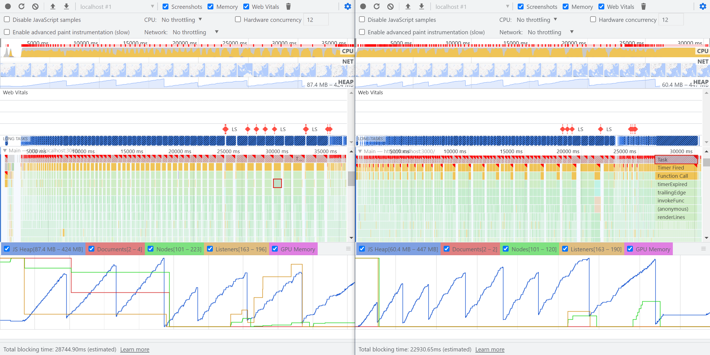
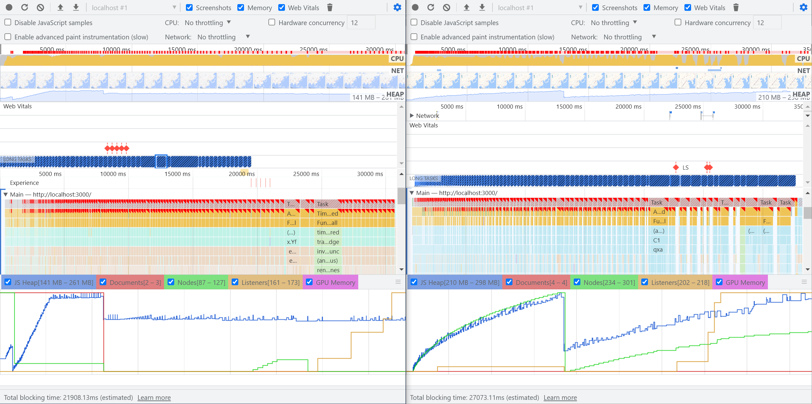

# 需求背景

在高德地图上展示路线的成功或失败情况，数据量较大，且需要全部展示，核心在于保证渲染路线的性能

# 技术难点

1. 渲染可见点
2. 分批异步渲染
3. 利用 Simplify.js 简化轨迹

# 渲染可见点

1. 根据传入的经纬度以及地图边界来确定是否渲染
2. 监听各种事件来重新渲染

```js
const isPointInView = (map, lonLat) => {
   const bounds = map.getBounds();
   const NorthEast = bounds.getNorthEast();
   const SouthWest = bounds.getSouthWest();
   const SouthEast = [NorthEast.lng, SouthWest.lat];
   const NorthWest = [SouthWest.lng, NorthEast.lat];
   const path = [[NorthEast.lng, NorthEast.lat], SouthEast, [SouthWest.lng, SouthWest.lat], NorthWest];

   const isInView = window.AMap.GeometryUtil.isPointInRing(lonLat, path);
   return isInView;
};

const END_EVENTS = ['zoomend', 'moveend', 'resize'];

useAsyncEffect(async () => {
   if (!map) {
      return;
   }

   const handleEndEvents = debounce((...param) => {
      console.log('event', param);
      renderLines(map, dataRef.current);
   }, 1000);
   END_EVENTS.forEach((event) => {
      console.log('add event', event);
      map.on(event, handleEndEvents);
   });

   return () => {
      END_EVENTS.forEach((event) => {
         console.log('remove event', event);
         map.clearEvents(event);
      });
   };
}, [map]);
```

# 分批异步渲染

核心渲染策略：模仿 react17 的 [Scheduler](https://github.com/facebook/react/blob/12adaffef7105e2714f82651ea51936c563fe15c/packages/scheduler/src/forks/SchedulerHostConfig.default.js#L224) 调度，切成小批量渲染任务，尽可能的防止页面卡顿，这里针对不同组件分为几种情况

## PathSimplifier

1. 采用分批异步渲染虽然加快了首次渲染速度，但卡顿还是存在，因为这里的 setData 是全量更新，没有增量更新的方法（尝试继承实现但难度较大）
2. 分析 [setData 函数源码](https://webapi.amap.com/ui/1.1/ui/misc/PathSimplifier.js) 发现调用了 `renderLater(10)`，也就是 10 毫秒后才会渲染，为此实现自定义方法然后调用 `render()`

```js{19}
import { requestHostCallback, cancelHostCallback, shouldYieldToHost } from '@/utils/SchedulerHostConfig';

const batchRender = (pathSimplifierIns, lines) => {
   const size = 100;
   const totalPage = Math.ceil(lines.length / size);
   // 取消之前主线程的任务
   cancelHostCallback();

   const render = () => {
      let page = 0;
      return () => {
         // 是否需要让出主线程
         if (shouldYieldToHost() || page >= totalPage) {
            return;
         }
         const splitLines = lines.slice(0, page * size + size);
         console.log('draw splitLines length', splitLines.length);
         // pathSimplifierIns.setDataImmediate(splitLines)
         pathSimplifierIns.setData(splitLines);
         page++;
         return page < totalPage;
      };
   };

   requestHostCallback(render());
};

const loadMyPathSimplifier = () => {
   return new Promise((resolve) => {
      window.AMapUI.load(['lib/utils'], function(utils) {
         // 新的类
         function MyPathSimplifier(opts) {
            // 调用父级的构造方法
            MyPathSimplifier.__super__.constructor.call(this, opts);
            // ..额外的初始化逻辑..
         }

         // 继承功能
         utils.inherit(MyPathSimplifier, window.AMapUI.PathSimplifier);

         // 增加或者覆盖接口
         utils.extend(MyPathSimplifier.prototype, {
            // ..新的接口
            setDataImmediate(data) {
               this._buildData(data);
               this.render();
            }
         });

         resolve({
            MyPathSimplifier
         });
      });
   });
};
```

### 性能测试

以下测试都是在浏览器隐私模式下监控性能数据，所需操作如下

1. 地图上从小数据一直加载到大数据
2. 加载到大量数据时对地图进行缩放、拖拽

左侧为 `setDataImmediate()`, 右侧为 `setData()`，性能差异不大



### 实现效果

[path-simplifiers-map](embedded-codesandbox://amap-big-data-component-optimize/path-simplifiers-map?module=/src/components/ReactAmap/hooks/useDrawLines.js&runonclick=1)

## Polyline

1. Polyline 有增量更新的方法，但同时需要考虑增量删除的方法，否则全量删除同样会造成页面卡顿
2. v1.4 和 v2.0 在实现相同功能的情况下有性能差异，截止 2023-3-4 22:40:07 为止 v1.4 性能表现更好

```js{18,41}
const SIZE = 100;

const batchRender = (map, lines) => {
   const size = SIZE;
   const totalPage = Math.ceil(lines.length / size);

   const render = () => {
      let page = 0;
      return () => {
         if (shouldYieldToHost() || page >= totalPage) {
            console.log('shouldYieldToHost', page);
            return;
         }
         const splitLines = lines.slice(page * size, page * size + size);
         if (page + 1 >= totalPage) {
            console.log('draw polylines length', lines.length);
         }
         map.add(splitLines);
         page++;
         return page < totalPage;
      };
   };

   requestHostCallback(render());
};

// 注意这里需要用闭包实现
const handleClearLines = (map, clearLines) => {
   (function(clearLines) {
      if (clearLines && clearLines.length > 0) {
         const size = SIZE;
         const totalPage = Math.ceil(clearLines.length / size);
         const clearFunc = (page) => {
            if (page >= totalPage) {
               return;
            }
            const splitLines = clearLines.slice(page * size, page * size + size);
            if (page + 1 >= totalPage) {
               console.log('remove polylines length', clearLines.length);
            }
            map.remove(splitLines);
            requestHostTimeout(() => clearFunc(page + 1), 0);
         };

         clearFunc(0);
      }
   })(clearLines);
};
```

### 性能测试

左侧为 v2.0，右侧为 v1.4，可以看到 v1.4 有以下优点

1. 渲染速度快
2. js 堆内存占用少
3. 最大长任务 1.72s 少于 v2.0 的 2.16s



### 实现效果

#### v2.0

[polyline-2-map](embedded-codesandbox://amap-big-data-component-optimize/polyline-2-map?module=/src/components/ReactAmap/hooks/useDrawLines.js&runonclick=1)

#### v1.4

[polyline-1-map](embedded-codesandbox://amap-big-data-component-optimize/polyline-1-map?module=/src/components/ReactAmap/hooks/useDrawLines.js&runonclick=1)
